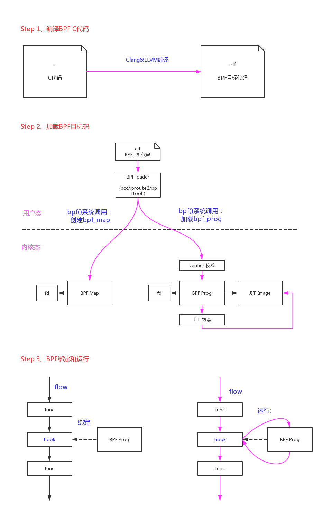
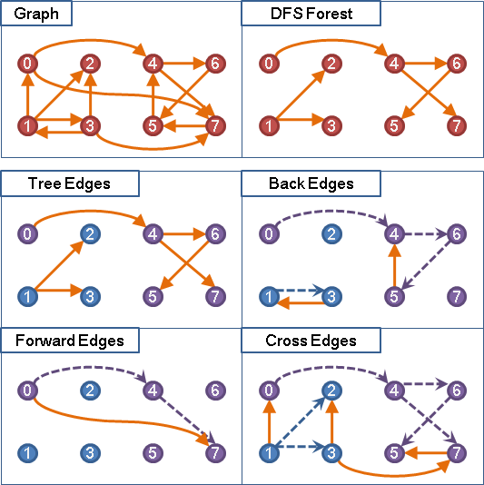

BPF的字面上意思Berkeley Packet Filter意味着它是从包过滤而来。如果在开始前对BPF缺乏感性的认识建议先看一下参考文档：“[3.1、Berkeley Packet Filter (BPF) (Kernel Document)](https://blog.csdn.net/pwl999/article/details/82502410)”、“[3.2、BPF and XDP Reference Guide](https://blog.csdn.net/pwl999/article/details/82706679)”。

本质上它是一种**内核代码注入**的技术：
 - 内核中实现了一个cBPF/eBPF虚拟机；
 - 用户态可以用C来写运行的代码，再通过一个Clang&LLVM的编译器将C代码编译成BPF目标码；
 - 用户态通过系统调用bpf()将BPF目标码注入到内核当中；
 - 内核通过JIT(Just-In-Time)将BPF目编码转换成本地指令码；如果当前架构不支持JIT转换内核则会使用一个解析器(interpreter)来模拟运行，这种运行效率较低；
 - 内核在packet filter和tracing等应用中提供了一系列的钩子来运行BPF代码。目前支持以下类型的BPF代码：
 
```
static int __init register_kprobe_prog_ops(void)
{
	bpf_register_prog_type(&kprobe_tl);
	bpf_register_prog_type(&tracepoint_tl);
	bpf_register_prog_type(&perf_event_tl);
	return 0;
}

static int __init register_sk_filter_ops(void)
{
	bpf_register_prog_type(&sk_filter_type);
	bpf_register_prog_type(&sched_cls_type);
	bpf_register_prog_type(&sched_act_type);
	bpf_register_prog_type(&xdp_type);
	bpf_register_prog_type(&cg_skb_type);

	return 0;
}
```

BPF的好处在哪里？ **是因为它提供了一种在不修改内核代码的情况下，可以灵活修改内核处理策略的方法**。  
这在包过滤和系统tracing这种需要频繁修改规则的场合非常有用。因为如果只在用户态修改策略的话那么所有数据需要复制一份给用户态开销较大；如果在内核态修改策略的话需要修改内核代码重新编译内核，而且容易引人安全问题。BPF这种内核代码注入技术的生存空间就是它可以在这两者间取得一个平衡。

Systamp就是解决了这个问题得以发展的，它使用了ko的方式来实现内核代码注入(有点笨拙，但是也解决了实际问题)。

> Systemtap工作原理：是通过将脚本语句翻译成C语句，编译成内核模块。模块加载之后，将所有探测的事件以Kprobe钩子的方式挂到内核上，当任何处理器上的某个事件发生时，相应钩子上句柄就会被执行。最后，当systemtap会话结束之后，钩子从内核上取下，移除模块。整个过程用一个命令stap就可以完成。

既然是提供向内核注入代码的技术，那么安全问题肯定是重中之重。平时防范他人通过漏洞向内核中注入代码，这下子专门开了一个口子不是大开方便之门。所以内核指定了很多的规则来限制BPF代码，确保它的错误不会影响到内核：

- 一个BPF程序的代码数量不能超过BPF_MAXINSNS (4K)，它的总运行步数不能超过32K (4.9内核中这个值改成了96k)；
- BPF代码中禁止循环，这也是为了保证出错时不会出现死循环来hang死内核。一个BPF程序总的可能的分支数也被限制到1K；
- 为了限制它的作用域，BPF代码不能访问全局变量，只能访问局部变量。一个BPF程序只有512字节的堆栈。在开始时会传入一个ctx指针，BPF程序的数据访问就被限制在ctx变量和堆栈局部变量中；
- 如果BPF需要访问全局变量，它只能访问BPF map对象。BPF map对象是同时能被用户态、BPF程序、内核态共同访问的，BPF对map的访问通过helper function来实现；
- 旧版本BPF代码中不支持BPF对BPF函数的调用，所以所有的BPF函数必须声明成always_inline。在Linux内核4.16和LLVM 6.0以后，才支持BPF to BPF Calls；
- BPF虽然不能函数调用，但是它可以使用Tail Call机制从一个BPF程序直接跳转到另一个BPF程序。它需要通过BPF_MAP_TYPE_PROG_ARRAY类型的map来知道另一个BPF程序的指针。这种跳转的次数也是有限制的，32次；
- BPF程序可以调用一些内核函数来辅助做一些事情(helper function)；
- 有些架构(64 bit x86_64, arm64, ppc64, s390x, mips64, sparc64 and 32 bit arm)已经支持BPF的JIT，它可以高效的几乎一比一的把BPF代码转换成本机代码(因为eBPF的指令集已经做了优化，非常类似最新的arm/x86架构，ABI也类似)。如果当前架构不支持JTI只能使用内核的解析器(interpreter)来模拟运行；
- 内核还可以通过一些额外的手段来加固BPF的安全性(Hardening)。主要包括：把BPF代码映像和JIT代码映像的page都锁成只读，JIT编译时把常量致盲(constant blinding)，以及对bpf()系统调用的权限限制；

对BPF这些安全规则的检查主要是在BPF代码加载时，通过BPF verifier来实现的。大概分为两步：

- 第一步，通过DAG(Directed Acyclic Graph 有向无环图)的DFS(Depth-first Search)深度优先算法来遍历BPF程序的代码路径，确保没有环路发生；
- 第二步，逐条分析BPF每条指令的运行，对register和对stack的影响，最坏情况下是否有越界行为(对变量的访问是否越界，运行的指令数是否越界)。这里也有一个快速分析的优化方法：修剪(Pruning)。如果当前指令的当前分支的状态，和当前指令另一个已分析分支的状态相等或者是它的一个子集，那么当前指令的当前分支就不需要分析了，因为它肯定是符合规则的。

整个BPF的开发过程大概如下图所示：



# 1、bpf()系统调用

核心代码在bpf()系统调用中，我们从入口开始分析。

```
SYSCALL_DEFINE3(bpf, int, cmd, union bpf_attr __user *, uattr, unsigned int, size)
{
	union bpf_attr attr = {};
	int err;

	if (!capable(CAP_SYS_ADMIN) && sysctl_unprivileged_bpf_disabled)
		return -EPERM;

	if (!access_ok(VERIFY_READ, uattr, 1))
		return -EFAULT;

	if (size > PAGE_SIZE)	/* silly large */
		return -E2BIG;

	/* If we're handed a bigger struct than we know of,
	 * ensure all the unknown bits are 0 - i.e. new
	 * user-space does not rely on any kernel feature
	 * extensions we dont know about yet.
	 */
	if (size > sizeof(attr)) {
		unsigned char __user *addr;
		unsigned char __user *end;
		unsigned char val;

		addr = (void __user *)uattr + sizeof(attr);
		end  = (void __user *)uattr + size;

		for (; addr < end; addr++) {
			err = get_user(val, addr);
			if (err)
				return err;
			if (val)
				return -E2BIG;
		}
		size = sizeof(attr);
	}

	/* copy attributes from user space, may be less than sizeof(bpf_attr) */
	if (copy_from_user(&attr, uattr, size) != 0)
		return -EFAULT;

	switch (cmd) {
	case BPF_MAP_CREATE:
		err = map_create(&attr);
		break;
	case BPF_MAP_LOOKUP_ELEM:
		err = map_lookup_elem(&attr);
		break;
	case BPF_MAP_UPDATE_ELEM:
		err = map_update_elem(&attr);
		break;
	case BPF_MAP_DELETE_ELEM:
		err = map_delete_elem(&attr);
		break;
	case BPF_MAP_GET_NEXT_KEY:
		err = map_get_next_key(&attr);
		break;
	case BPF_PROG_LOAD:
		err = bpf_prog_load(&attr);
		break;
	case BPF_OBJ_PIN:
		err = bpf_obj_pin(&attr);
		break;
	case BPF_OBJ_GET:
		err = bpf_obj_get(&attr);
		break;

#ifdef CONFIG_CGROUP_BPF
	case BPF_PROG_ATTACH:
		err = bpf_prog_attach(&attr);
		break;
	case BPF_PROG_DETACH:
		err = bpf_prog_detach(&attr);
		break;
#endif

	default:
		err = -EINVAL;
		break;
	}

	return err;
}
```

## 1.1、bpf加载

BPF_PROG_LOAD命令负责加载一段BPF程序到内核当中：

- 拷贝程序到内核；
- 校验它的安全性；
- 如果可能对它进行JIT编译；
- 然后分配一个文件句柄fd给它。

完成这一切后，后续再把这段BPF程序挂载到需要运行的钩子上面。

### 1.1.1、bpf内存空间分配

```
static int bpf_prog_load(union bpf_attr *attr)
{
	enum bpf_prog_type type = attr->prog_type;
	struct bpf_prog *prog;
	int err;
	char license[128];
	bool is_gpl;

	if (CHECK_ATTR(BPF_PROG_LOAD))
		return -EINVAL;

	/* copy eBPF program license from user space */
	/* (1.1) 根据attr->license地址，从用户空间拷贝license字符串到内核 */
	if (strncpy_from_user(license, u64_to_ptr(attr->license),
			      sizeof(license) - 1) < 0)
		return -EFAULT;
	license[sizeof(license) - 1] = 0;

	/* eBPF programs must be GPL compatible to use GPL-ed functions */
	/* (1.2) 判断license是否符合GPL协议 */
	is_gpl = license_is_gpl_compatible(license);

    /* (1.3) 判断BPF的总指令数是否超过BPF_MAXINSNS(4k) */
	if (attr->insn_cnt >= BPF_MAXINSNS)
		return -EINVAL;

    /* (1.4) 如果加载BPF_PROG_TYPE_KPROBE类型的BPF程序，指定的内核版本需要和当前内核版本匹配。 
        不然由于内核的改动，可能会附加到错误的地址上。
     */
	if (type == BPF_PROG_TYPE_KPROBE &&
	    attr->kern_version != LINUX_VERSION_CODE)
		return -EINVAL;

    /* (1.5) 对BPF_PROG_TYPE_SOCKET_FILTER和BPF_PROG_TYPE_CGROUP_SKB以外的BPF程序加载，需要管理员权限 */
	if (type != BPF_PROG_TYPE_SOCKET_FILTER &&
	    type != BPF_PROG_TYPE_CGROUP_SKB &&
	    !capable(CAP_SYS_ADMIN))
		return -EPERM;

	/* plain bpf_prog allocation */
	/* (2.1) 根据BPF指令数分配bpf_prog空间，和bpf_prog->aux空间 */
	prog = bpf_prog_alloc(bpf_prog_size(attr->insn_cnt), GFP_USER);
	if (!prog)
		return -ENOMEM;

    /* (2.2) 把整个bpf_prog空间在当前进程的memlock_limit中锁定 */
	err = bpf_prog_charge_memlock(prog);
	if (err)
		goto free_prog_nouncharge;

	prog->len = attr->insn_cnt;

	err = -EFAULT;
	/* (2.3) 把BPF代码从用户空间地址attr->insns，拷贝到内核空间地址prog->insns */
	if (copy_from_user(prog->insns, u64_to_ptr(attr->insns),
			   prog->len * sizeof(struct bpf_insn)) != 0)
		goto free_prog;

	prog->orig_prog = NULL;
	prog->jited = 0;

	atomic_set(&prog->aux->refcnt, 1);
	prog->gpl_compatible = is_gpl ? 1 : 0;

	/* find program type: socket_filter vs tracing_filter */
	/* (2.4) 根据attr->prog_type指定的type值，找到对应的bpf_prog_types，
	    给bpf_prog->aux->ops赋值，这个ops是一个函数操作集
	 */
	err = find_prog_type(type, prog);
	if (err < 0)
		goto free_prog;

	/* run eBPF verifier */
	/* (3) 使用verifer对BPF程序进行合法性扫描 */
	err = bpf_check(&prog, attr);
	if (err < 0)
		goto free_used_maps;

	/* eBPF program is ready to be JITed */
	/* (4) 尝试对BPF程序进行JIT转换 */
	prog = bpf_prog_select_runtime(prog, &err);
	if (err < 0)
		goto free_used_maps;

    /* (5) 给BPF程序分配一个文件句柄fd */
	err = bpf_prog_new_fd(prog);
	if (err < 0)
		/* failed to allocate fd */
		goto free_used_maps;

	return err;

free_used_maps:
	free_used_maps(prog->aux);
free_prog:
	bpf_prog_uncharge_memlock(prog);
free_prog_nouncharge:
	bpf_prog_free(prog);
	return err;
}
```

这其中对BPF来说有个重要的数据结构就是struct bpf_prog：

```
struct bpf_prog {
	u16			pages;		/* Number of allocated pages */
	kmemcheck_bitfield_begin(meta);
	u16			jited:1,	/* Is our filter JIT'ed? */
				gpl_compatible:1, /* Is filter GPL compatible? */
				cb_access:1,	/* Is control block accessed? */
				dst_needed:1;	/* Do we need dst entry? */
	kmemcheck_bitfield_end(meta);
	u32			len;		/* Number of filter blocks */
	enum bpf_prog_type	type;		/* Type of BPF program */
	struct bpf_prog_aux	*aux;		/* Auxiliary fields */
	struct sock_fprog_kern	*orig_prog;	/* Original BPF program */
	unsigned int		(*bpf_func)(const struct sk_buff *skb,
					    const struct bpf_insn *filter);
	/* Instructions for interpreter */
	union {
		struct sock_filter	insns[0];
		struct bpf_insn		insnsi[0];
	};
};
```

其中重要的成员如下：

- len：程序包含bpf指令的数量；
- type：当前bpf程序的类型(kprobe/tracepoint/perf_event/sk_filter/sched_cls/sched_act/xdp/cg_skb)；
- aux：主要用来辅助verifier校验和转换的数据；
- orig_prog：
- bpf_func：运行时BPF程序的入口。如果JIT转换成功，这里指向的就是BPF程序JIT转换后的映像；否则这里指向内核解析器(interpreter)的通用入口__bpf_prog_run()；
- insnsi[]：从用户态拷贝过来的，BPF程序原始指令的存放空间；


### 1.1.2、bpf verifier

关于verifier的步骤和规则，在“[3.1、Berkeley Packet Filter (BPF) (Kernel Document)](https://blog.csdn.net/pwl999/article/details/82502410)”一文的“eBPF verifier”一节有详细描述。

另外，在kernel/bpf/verifier.c文件的开头对eBPF verifier也有一段详细的注释：

```

bpf_check()是一个静态代码分析器，它按指令遍历eBPF程序指令并更新寄存器/堆栈状态。分析条件分支的所有路径，直到'bpf_exit'指令。

1、第一步是深度优先搜索，检查程序是否为DAG(Directed Acyclic Graph 有向无环图)。它将会拒绝以下程序：
 
 - 大于BPF_MAXINSNS条指令(BPF_MAXINSNS=4096)
 - 如果出现循环(通过back-edge检测)
 - 不可达的指令存在(不应该是森林，程序等于一个函数)
 - 越界或畸形的跳跃
 
2、第二步是从第一步所有可能路径的展开。 

- 因为它分析了程序所有的路径，这个分析的最大长度限制为32k个指令，即使指令总数小于4k也会受到影响，因为有太多的分支改变了堆栈/寄存器。  
- 分支的分析数量被限制为1k。

在进入每条指令时，每个寄存器都有一个类型，该指令根据指令语义改变寄存器的类型：

- rule 1、如果指令是BPF_MOV64_REG(BPF_REG_1, BPF_REG_5)，则将R5的类型复制到R1。

所有寄存器都是64位的。  
* R0 -返回寄存器  
* R1-R5参数传递寄存器  
* R6-R9被调用方保存寄存器  
* R10 -帧指针只读  

- rule 2、在BPF程序开始时，寄存器R1包含一个指向bpf_context的指针，类型为PTR_TO_CTX。

- rule 3、verifier跟踪指针上的算术运算：

`
    BPF_MOV64_REG(BPF_REG_1, BPF_REG_10),
    BPF_ALU64_IMM(BPF_ADD, BPF_REG_1, -20),
`

第一条指令将R10(它具有FRAME_PTR)类型复制到R1中，第二条算术指令是匹配的模式，用于识别它想要构造一个指向堆栈中某个元素的指针。  
因此，在第二条指令之后，寄存器R1的类型为PTR_TO_STACK(-20常数需要进一步的堆栈边界检查)。表示这个reg是一个指针由堆栈加上常数。

- rule 4、大多数时候寄存器都有UNKNOWN_VALUE类型，这意味着寄存器有一些值，但它不是一个有效的指针。(就像指针+指针变成了UNKNOWN_VALUE类型)

- rule 5、当verifier看到load指令或store指令时，基本寄存器的类型可以是:PTR_TO_MAP_VALUE、PTR_TO_CTX、FRAME_PTR。这是由check_mem_access()函数识别的三种指针类型。

- rule 6、PTR_TO_MAP_VALUE表示这个寄存器指向‘map元素的值’，并且可以访问[ptr, ptr + map value_size)的范围。

- rule 7、寄存器用于向函数调用传递参数，将根据函数参数约束进行检查。

ARG_PTR_TO_MAP_KEY就是这样的参数约束之一。  
这意味着传递给这个函数的寄存器类型必须是PTR_TO_STACK，它将作为‘map element key的指针’在函数内部使用。

例如bpf_map_lookup_elem()的参数约束:

`
   .ret_type = RET_PTR_TO_MAP_VALUE_OR_NULL,
   .arg1_type = ARG_CONST_MAP_PTR,
   .arg2_type = ARG_PTR_TO_MAP_KEY,
`

ret_type表示该函数返回“指向map element value的指针或null”。  
函数期望第一个参数是指向‘struct bpf_map’的const指针，第二个参数应该是指向stack的指针，这个指针在helper函数中用作map element key的指针。

在内核侧的helper函数如下：

`
 u64 bpf_map_lookup_elem(u64 r1, u64 r2, u64 r3, u64 r4, u64 r5)
 {
    struct bpf_map *map = (struct bpf_map *) (unsigned long) r1;
    void *key = (void *) (unsigned long) r2;
    void *value;

    here kernel can access 'key' and 'map' pointers safely, knowing that
    [key, key + map->key_size) bytes are valid and were initialized on
    the stack of eBPF program.
 }
`

相应的eBPF程序如下：

`
    BPF_MOV64_REG(BPF_REG_2, BPF_REG_10),  // after this insn R2 type is FRAME_PTR
    BPF_ALU64_IMM(BPF_ADD, BPF_REG_2, -4), // after this insn R2 type is PTR_TO_STACK
    BPF_LD_MAP_FD(BPF_REG_1, map_fd),      // after this insn R1 type is CONST_PTR_TO_MAP
    BPF_RAW_INSN(BPF_JMP | BPF_CALL, 0, 0, 0, BPF_FUNC_map_lookup_elem),
`

这里verifier查看map_lookup_elem()的原型，看到:  

- .arg1_type == ARG_CONST_MAP_PTR and R1->type == CONST_PTR_TO_MAP, 这个是ok的。现在verifier知道map key的尺寸了：R1->map_ptr->key_size。

- 然后.arg2_type == ARG_PTR_TO_MAP_KEY and R2->type == PTR_TO_STACK也是ok的。  
现在verifier检测 [R2, R2 + map's key_size]是否在堆栈限制内，并且在调用之前被初始化。  

- 如果可以，那么verifier允许这个BPF_CALL指令，并查看.ret_type  RET_PTR_TO_MAP_VALUE_OR_NULL，因此它设置R0->类型= PTR_TO_MAP_VALUE_OR_NULL，这意味着bpf_map_lookup_elem()函数返回map value指针或NULL。  
当类型PTR_TO_MAP_VALUE_OR_NULL通过'if (reg != 0) goto +off' 指令判断时，在真分支中持有指针的寄存器将状态更改为PTR_TO_MAP_VALUE，在假分支中相同的寄存器将状态更改为CONST_IMM。看check_cond_jmp_op()的实现。  
函数调用以后R0设置为返回函数类型后，将寄存器R1-R5设置为NOT_INIT，以指示它们不再可读。

```

原文如下：

```
/* bpf_check() is a static code analyzer that walks eBPF program
 * instruction by instruction and updates register/stack state.
 * All paths of conditional branches are analyzed until 'bpf_exit' insn.
 *
 * The first pass is depth-first-search to check that the program is a DAG.
 * It rejects the following programs:
 * - larger than BPF_MAXINSNS insns
 * - if loop is present (detected via back-edge)
 * - unreachable insns exist (shouldn't be a forest. program = one function)
 * - out of bounds or malformed jumps
 * The second pass is all possible path descent from the 1st insn.
 * Since it's analyzing all pathes through the program, the length of the
 * analysis is limited to 32k insn, which may be hit even if total number of
 * insn is less then 4K, but there are too many branches that change stack/regs.
 * Number of 'branches to be analyzed' is limited to 1k
 *
 * On entry to each instruction, each register has a type, and the instruction
 * changes the types of the registers depending on instruction semantics.
 * If instruction is BPF_MOV64_REG(BPF_REG_1, BPF_REG_5), then type of R5 is
 * copied to R1.
 *
 * All registers are 64-bit.
 * R0 - return register
 * R1-R5 argument passing registers
 * R6-R9 callee saved registers
 * R10 - frame pointer read-only
 *
 * At the start of BPF program the register R1 contains a pointer to bpf_context
 * and has type PTR_TO_CTX.
 *
 * Verifier tracks arithmetic operations on pointers in case:
 *    BPF_MOV64_REG(BPF_REG_1, BPF_REG_10),
 *    BPF_ALU64_IMM(BPF_ADD, BPF_REG_1, -20),
 * 1st insn copies R10 (which has FRAME_PTR) type into R1
 * and 2nd arithmetic instruction is pattern matched to recognize
 * that it wants to construct a pointer to some element within stack.
 * So after 2nd insn, the register R1 has type PTR_TO_STACK
 * (and -20 constant is saved for further stack bounds checking).
 * Meaning that this reg is a pointer to stack plus known immediate constant.
 *
 * Most of the time the registers have UNKNOWN_VALUE type, which
 * means the register has some value, but it's not a valid pointer.
 * (like pointer plus pointer becomes UNKNOWN_VALUE type)
 *
 * When verifier sees load or store instructions the type of base register
 * can be: PTR_TO_MAP_VALUE, PTR_TO_CTX, FRAME_PTR. These are three pointer
 * types recognized by check_mem_access() function.
 *
 * PTR_TO_MAP_VALUE means that this register is pointing to 'map element value'
 * and the range of [ptr, ptr + map's value_size) is accessible.
 *
 * registers used to pass values to function calls are checked against
 * function argument constraints.
 *
 * ARG_PTR_TO_MAP_KEY is one of such argument constraints.
 * It means that the register type passed to this function must be
 * PTR_TO_STACK and it will be used inside the function as
 * 'pointer to map element key'
 *
 * For example the argument constraints for bpf_map_lookup_elem():
 *   .ret_type = RET_PTR_TO_MAP_VALUE_OR_NULL,
 *   .arg1_type = ARG_CONST_MAP_PTR,
 *   .arg2_type = ARG_PTR_TO_MAP_KEY,
 *
 * ret_type says that this function returns 'pointer to map elem value or null'
 * function expects 1st argument to be a const pointer to 'struct bpf_map' and
 * 2nd argument should be a pointer to stack, which will be used inside
 * the helper function as a pointer to map element key.
 *
 * On the kernel side the helper function looks like:
 * u64 bpf_map_lookup_elem(u64 r1, u64 r2, u64 r3, u64 r4, u64 r5)
 * {
 *    struct bpf_map *map = (struct bpf_map *) (unsigned long) r1;
 *    void *key = (void *) (unsigned long) r2;
 *    void *value;
 *
 *    here kernel can access 'key' and 'map' pointers safely, knowing that
 *    [key, key + map->key_size) bytes are valid and were initialized on
 *    the stack of eBPF program.
 * }
 *
 * Corresponding eBPF program may look like:
 *    BPF_MOV64_REG(BPF_REG_2, BPF_REG_10),  // after this insn R2 type is FRAME_PTR
 *    BPF_ALU64_IMM(BPF_ADD, BPF_REG_2, -4), // after this insn R2 type is PTR_TO_STACK
 *    BPF_LD_MAP_FD(BPF_REG_1, map_fd),      // after this insn R1 type is CONST_PTR_TO_MAP
 *    BPF_RAW_INSN(BPF_JMP | BPF_CALL, 0, 0, 0, BPF_FUNC_map_lookup_elem),
 * here verifier looks at prototype of map_lookup_elem() and sees:
 * .arg1_type == ARG_CONST_MAP_PTR and R1->type == CONST_PTR_TO_MAP, which is ok,
 * Now verifier knows that this map has key of R1->map_ptr->key_size bytes
 *
 * Then .arg2_type == ARG_PTR_TO_MAP_KEY and R2->type == PTR_TO_STACK, ok so far,
 * Now verifier checks that [R2, R2 + map's key_size) are within stack limits
 * and were initialized prior to this call.
 * If it's ok, then verifier allows this BPF_CALL insn and looks at
 * .ret_type which is RET_PTR_TO_MAP_VALUE_OR_NULL, so it sets
 * R0->type = PTR_TO_MAP_VALUE_OR_NULL which means bpf_map_lookup_elem() function
 * returns ether pointer to map value or NULL.
 *
 * When type PTR_TO_MAP_VALUE_OR_NULL passes through 'if (reg != 0) goto +off'
 * insn, the register holding that pointer in the true branch changes state to
 * PTR_TO_MAP_VALUE and the same register changes state to CONST_IMM in the false
 * branch. See check_cond_jmp_op().
 *
 * After the call R0 is set to return type of the function and registers R1-R5
 * are set to NOT_INIT to indicate that they are no longer readable.
 */
```

BPF verifier总体代码流程如下：

```
int bpf_check(struct bpf_prog **prog, union bpf_attr *attr)
{
	char __user *log_ubuf = NULL;
	struct bpf_verifier_env *env;
	int ret = -EINVAL;

	if ((*prog)->len <= 0 || (*prog)->len > BPF_MAXINSNS)
		return -E2BIG;

	/* 'struct bpf_verifier_env' can be global, but since it's not small,
	 * allocate/free it every time bpf_check() is called
	 */
	/* (3.1) 分配verifier静态扫描需要的数据结构  */
	env = kzalloc(sizeof(struct bpf_verifier_env), GFP_KERNEL);
	if (!env)
		return -ENOMEM;

	env->insn_aux_data = vzalloc(sizeof(struct bpf_insn_aux_data) *
				     (*prog)->len);
	ret = -ENOMEM;
	if (!env->insn_aux_data)
		goto err_free_env;
	env->prog = *prog;

	/* grab the mutex to protect few globals used by verifier */
	mutex_lock(&bpf_verifier_lock);

    /* (3.2) 如果用户指定了attr->log_buf，说明用户需要具体的代码扫描log，这个在出错时非常有用 
        先在内核中分配log空间，在返回时拷贝给用户
     */
	if (attr->log_level || attr->log_buf || attr->log_size) {
		/* user requested verbose verifier output
		 * and supplied buffer to store the verification trace
		 */
		log_level = attr->log_level;
		log_ubuf = (char __user *) (unsigned long) attr->log_buf;
		log_size = attr->log_size;
		log_len = 0;

		ret = -EINVAL;
		/* log_* values have to be sane */
		if (log_size < 128 || log_size > UINT_MAX >> 8 ||
		    log_level == 0 || log_ubuf == NULL)
			goto err_unlock;

		ret = -ENOMEM;
		log_buf = vmalloc(log_size);
		if (!log_buf)
			goto err_unlock;
	} else {
		log_level = 0;
	}

    /* (3.3) 把BPF程序中操作map的指令，从map_fd替换成实际的map指针 
        由此可见用户态的loader程序，肯定是先根据__section("maps")中定义的map调用bpf()创建map，再加载其他的程序section；
     */
	ret = replace_map_fd_with_map_ptr(env);
	if (ret < 0)
		goto skip_full_check;

	env->explored_states = kcalloc(env->prog->len,
				       sizeof(struct bpf_verifier_state_list *),
				       GFP_USER);
	ret = -ENOMEM;
	if (!env->explored_states)
		goto skip_full_check;

    /* (3.4) step1、检查有没有环路 */
	ret = check_cfg(env);
	if (ret < 0)
		goto skip_full_check;

	env->allow_ptr_leaks = capable(CAP_SYS_ADMIN);

    /* (3.5) step2、详细扫描BPF代码的运行过程，跟踪分析寄存器和堆栈，检查是否有不符合规则的情况出现 */
	ret = do_check(env);

skip_full_check:
	while (pop_stack(env, NULL) >= 0);
	free_states(env);
    
    /* (3.6) 把扫描分析出来的dead代码(就是不会运行的代码)转成nop指令 */
	if (ret == 0)
		sanitize_dead_code(env);

    /* (3.7) 根据程序的type，转换对ctx指针成员的访问 */
	if (ret == 0)
		/* program is valid, convert *(u32*)(ctx + off) accesses */
		ret = convert_ctx_accesses(env);

    /* (3.8) 修复BPF指令中对内核helper function函数的调用，把函数编号替换成实际的函数指针 */
	if (ret == 0)
		ret = fixup_bpf_calls(env);

	if (log_level && log_len >= log_size - 1) {
		BUG_ON(log_len >= log_size);
		/* verifier log exceeded user supplied buffer */
		ret = -ENOSPC;
		/* fall through to return what was recorded */
	}

    /* (3.9) 拷贝verifier log到用户空间 */
	/* copy verifier log back to user space including trailing zero */
	if (log_level && copy_to_user(log_ubuf, log_buf, log_len + 1) != 0) {
		ret = -EFAULT;
		goto free_log_buf;
	}

    /* (3.10) 备份BPF程序对map的引用信息，到prog->aux->used_maps中 */
	if (ret == 0 && env->used_map_cnt) {
		/* if program passed verifier, update used_maps in bpf_prog_info */
		env->prog->aux->used_maps = kmalloc_array(env->used_map_cnt,
							  sizeof(env->used_maps[0]),
							  GFP_KERNEL);

		if (!env->prog->aux->used_maps) {
			ret = -ENOMEM;
			goto free_log_buf;
		}

		memcpy(env->prog->aux->used_maps, env->used_maps,
		       sizeof(env->used_maps[0]) * env->used_map_cnt);
		env->prog->aux->used_map_cnt = env->used_map_cnt;

		/* program is valid. Convert pseudo bpf_ld_imm64 into generic
		 * bpf_ld_imm64 instructions
		 */
		convert_pseudo_ld_imm64(env);
	}

free_log_buf:
	if (log_level)
		vfree(log_buf);
	if (!env->prog->aux->used_maps)
		/* if we didn't copy map pointers into bpf_prog_info, release
		 * them now. Otherwise free_bpf_prog_info() will release them.
		 */
		release_maps(env);
	*prog = env->prog;
err_unlock:
	mutex_unlock(&bpf_verifier_lock);
	vfree(env->insn_aux_data);
err_free_env:
	kfree(env);
	return ret;
}
```

- 1、把BPF程序中操作map的指令，从map_fd替换成实际的map指针。

由此可见用户态的loader程序，肯定是先根据__section("maps")中定义的map调用bpf()创建map，再加载其他的程序section。

符合条件：(insn[0].code == (BPF_LD | BPF_IMM | BPF_DW)) && (insn[0]->src_reg == BPF_PSEUDO_MAP_FD) 的指令为map指针加载指针。  
把原始的立即数作为fd找到对应的map指针。  
把64bit的map指针拆分成两个32bit的立即数，存储到insn[0].imm、insn[1].imm中。

```
static int replace_map_fd_with_map_ptr(struct bpf_verifier_env *env)
{
	struct bpf_insn *insn = env->prog->insnsi;
	int insn_cnt = env->prog->len;
	int i, j, err;

    /* (3.3.1) 遍历所有BPF指令 */
	for (i = 0; i < insn_cnt; i++, insn++) {
		if (BPF_CLASS(insn->code) == BPF_LDX &&
		    (BPF_MODE(insn->code) != BPF_MEM || insn->imm != 0)) {
			verbose("BPF_LDX uses reserved fields\n");
			return -EINVAL;
		}

		if (BPF_CLASS(insn->code) == BPF_STX &&
		    ((BPF_MODE(insn->code) != BPF_MEM &&
		      BPF_MODE(insn->code) != BPF_XADD) || insn->imm != 0)) {
			verbose("BPF_STX uses reserved fields\n");
			return -EINVAL;
		}
        
        /* (3.3.2) 符合条件：(insn[0].code == (BPF_LD | BPF_IMM | BPF_DW)) && (insn[0]->src_reg == BPF_PSEUDO_MAP_FD)  
            的指令为map指针加载指针
         */
		if (insn[0].code == (BPF_LD | BPF_IMM | BPF_DW)) {
			struct bpf_map *map;
			struct fd f;

			if (i == insn_cnt - 1 || insn[1].code != 0 ||
			    insn[1].dst_reg != 0 || insn[1].src_reg != 0 ||
			    insn[1].off != 0) {
				verbose("invalid bpf_ld_imm64 insn\n");
				return -EINVAL;
			}

			if (insn->src_reg == 0)
				/* valid generic load 64-bit imm */
				goto next_insn;

			if (insn->src_reg != BPF_PSEUDO_MAP_FD) {
				verbose("unrecognized bpf_ld_imm64 insn\n");
				return -EINVAL;
			}

            /* (3.3.3) 根据指令中的立即数insn[0]->imm指定的fd，得到实际的map指针 */
			f = fdget(insn->imm);
			map = __bpf_map_get(f);
			if (IS_ERR(map)) {
				verbose("fd %d is not pointing to valid bpf_map\n",
					insn->imm);
				return PTR_ERR(map);
			}
的·
            /* (3.3.4) 检查map和当前类型BPF程序的兼容性 */
			err = check_map_prog_compatibility(map, env->prog);
			if (err) {
				fdput(f);
				return err;
			}

            /* (3.3.5) 把64bit的map指针拆分成两个32bit的立即数，存储到insn[0].imm、insn[1].imm中 */
			/* store map pointer inside BPF_LD_IMM64 instruction */
			insn[0].imm = (u32) (unsigned long) map;
			insn[1].imm = ((u64) (unsigned long) map) >> 32;

			/* check whether we recorded this map already */
			for (j = 0; j < env->used_map_cnt; j++)
				if (env->used_maps[j] == map) {
					fdput(f);
					goto next_insn;
				}

            /* (3.3.6) 一个prog最多引用64个map */
			if (env->used_map_cnt >= MAX_USED_MAPS) {
				fdput(f);
				return -E2BIG;
			}

			/* hold the map. If the program is rejected by verifier,
			 * the map will be released by release_maps() or it
			 * will be used by the valid program until it's unloaded
			 * and all maps are released in free_bpf_prog_info()
			 */
			map = bpf_map_inc(map, false);
			if (IS_ERR(map)) {
				fdput(f);
				return PTR_ERR(map);
			}
			/* (3.3.7) 记录prog对map的引用 */
			env->used_maps[env->used_map_cnt++] = map;

			fdput(f);
next_insn:
			insn++;
			i++;
		}
	}

	/* now all pseudo BPF_LD_IMM64 instructions load valid
	 * 'struct bpf_map *' into a register instead of user map_fd.
	 * These pointers will be used later by verifier to validate map access.
	 */
	return 0;
}
```

- 2、Step 1、通过DAG(Directed Acyclic Graph 有向无环图)的DFS(Depth-first Search)深度优先算法来遍历BPF程序的代码路径，确保没有环路发生；

DAG的DFS算法可以参考“[Graph](http://www.csie.ntnu.edu.tw/~u91029/Graph.html#5)”一文。其中最重要的概念如下图：



一个图形"Graph"经过DAG的DFS算法遍历后，对每一个根节点都会形成一颗树“DFS Tree”，多个根节点得到的多棵树形成一个森林"DFS Forest"。根据搜索的结构整个“Graph”的边“Edge”可以分成四类：

- Tree Edges：在DFS树上的边；
- Back Edges：从子节点连向祖先节点的边(形成环)；
- Forward Edges：直接连向孙节点的边(跨子节点的连接)；
- Cross Edges：叶子之间的连接，或者树之间的连接；

对BPF verifier来说，检查BPF程序的运行路径图中是否有“Back Edges”的存在，确保程序中没有环路。

具体的代码如下：

```
static int check_cfg(struct bpf_verifier_env *env)
{
	struct bpf_insn *insns = env->prog->insnsi;
	int insn_cnt = env->prog->len;
	int ret = 0;
	int i, t;

	insn_state = kcalloc(insn_cnt, sizeof(int), GFP_KERNEL);
	if (!insn_state)
		return -ENOMEM;

	insn_stack = kcalloc(insn_cnt, sizeof(int), GFP_KERNEL);
	if (!insn_stack) {
		kfree(insn_state);
		return -ENOMEM;
	}

	insn_state[0] = DISCOVERED; /* mark 1st insn as discovered */
	insn_stack[0] = 0; /* 0 is the first instruction */
	cur_stack = 1;

    /* (3.4.1) DFS深度优先算法的循环 */
peek_stack:
	if (cur_stack == 0)
		goto check_state;
	t = insn_stack[cur_stack - 1];

    /* (3.4.2) 分支指令 */
	if (BPF_CLASS(insns[t].code) == BPF_JMP) {
		u8 opcode = BPF_OP(insns[t].code);

        /* (3.4.2.1) 碰到BPF_EXIT指令，路径终结，开始回溯确认 */
		if (opcode == BPF_EXIT) {
			goto mark_explored;
			
		/* (3.4.2.2) 碰到BPF_CALL指令，继续探索 
		    并且把env->explored_states[]设置成STATE_LIST_MARK，标识call函数调用后需要重新跟踪计算寄存器和堆栈
		 */
		} else if (opcode == BPF_CALL) {
			ret = push_insn(t, t + 1, FALLTHROUGH, env);
			if (ret == 1)
				goto peek_stack;
			else if (ret < 0)
				goto err_free;
			if (t + 1 < insn_cnt)
				env->explored_states[t + 1] = STATE_LIST_MARK;
				
		/* (3.4.2.3) 碰到BPF_JA指令，继续探索 
		    并且把env->explored_states[]设置成STATE_LIST_MARK，标识call函数调用后需要重新跟踪计算寄存器和堆栈
		 */
		} else if (opcode == BPF_JA) {
			if (BPF_SRC(insns[t].code) != BPF_K) {
				ret = -EINVAL;
				goto err_free;
			}
			/* unconditional jump with single edge */
			ret = push_insn(t, t + insns[t].off + 1,
					FALLTHROUGH, env);
			if (ret == 1)
				goto peek_stack;
			else if (ret < 0)
				goto err_free;
			/* tell verifier to check for equivalent states
			 * after every call and jump
			 */
			if (t + 1 < insn_cnt)
				env->explored_states[t + 1] = STATE_LIST_MARK;
				
		/* (3.4.2.4) 剩下的是有条件跳转指令，首先探测条件失败路径，再探测条件成功路径 
		    并且把env->explored_states[]设置成STATE_LIST_MARK，标识call函数调用后需要重新跟踪计算寄存器和堆栈
		 */
		} else {
			/* conditional jump with two edges */
			env->explored_states[t] = STATE_LIST_MARK;
			
			/* 条件失败路径 */
			ret = push_insn(t, t + 1, FALLTHROUGH, env);
			if (ret == 1)
				goto peek_stack;
			else if (ret < 0)
				goto err_free;

            /* 条件成功路径 */
			ret = push_insn(t, t + insns[t].off + 1, BRANCH, env);
			if (ret == 1)
				goto peek_stack;
			else if (ret < 0)
				goto err_free;
		}
	
	/* (3.4.3) 非分支指令 */
	} else {
		/* all other non-branch instructions with single
		 * fall-through edge
		 */
		ret = push_insn(t, t + 1, FALLTHROUGH, env);
		/* (3.4.3.1) ret的含义如下
		    ret == 1：继续探索路径
		    ret == 0：已经是叶子节点了，跳转到mark_explored确认并回溯
		    ret < 0：探测到"back-edge"环路，或者其他错误
		 */
		if (ret == 1)
			goto peek_stack;
		else if (ret < 0)
			goto err_free;
	}

    /* (3.4.4) 确认并回溯，状态标记为EXPLORED 
     */
mark_explored:
	insn_state[t] = EXPLORED;
	if (cur_stack-- <= 0) {
		verbose("pop stack internal bug\n");
		ret = -EFAULT;
		goto err_free;
	}
	goto peek_stack;

    /* (3.4.5) 确认没有unreachable的指令，就是路径没法抵达 */
check_state:
	for (i = 0; i < insn_cnt; i++) {
		if (insn_state[i] != EXPLORED) {
			verbose("unreachable insn %d\n", i);
			ret = -EINVAL;
			goto err_free;
		}
	}
	ret = 0; /* cfg looks good */

err_free:
	kfree(insn_state);
	kfree(insn_stack);
	return ret;
}
```

- 3、step2、详细扫描BPF代码的运行过程，跟踪分析寄存器和堆栈，检查是否有不符合规则的情况出现。

这段代码的具体算法就是把step1的路径重新走一遍，并且跟踪寄存器和堆栈的变化，判断最坏情况下是否有违反规则的情况出现。  
在碰到指令对应explored_states[]被设置成STATE_LIST_MARK，需要给当前指令独立分配一个bpf_verifier_state_list链表，来存储这个指令在多个分支上的不同状况。  
这里也有一个快速分析的优化方法：修剪(Pruning)。如果当前指令的当前分支的状态cur_state，和当前指令另一个已分析分支的状态(当前指令explored_states[]链表中的一个bpf_verifier_state_list成员)相等或者是它的一个子集，那么当前指令的当前分支就不需要分析了，因为它肯定是符合规则的。

```
static int do_check(struct bpf_verifier_env *env)
{
	struct bpf_verifier_state *state = &env->cur_state;
	struct bpf_insn *insns = env->prog->insnsi;
	struct bpf_reg_state *regs = state->regs;
	int insn_cnt = env->prog->len;
	int insn_idx, prev_insn_idx = 0;
	int insn_processed = 0;
	bool do_print_state = false;

	init_reg_state(regs);
	insn_idx = 0;
	env->varlen_map_value_access = false;
	for (;;) {
		struct bpf_insn *insn;
		u8 class;
		int err;

		if (insn_idx >= insn_cnt) {
			verbose("invalid insn idx %d insn_cnt %d\n",
				insn_idx, insn_cnt);
			return -EFAULT;
		}

		insn = &insns[insn_idx];
		class = BPF_CLASS(insn->code);

		if (++insn_processed > BPF_COMPLEXITY_LIMIT_INSNS) {
			verbose("BPF program is too large. Proccessed %d insn\n",
				insn_processed);
			return -E2BIG;
		}

		err = is_state_visited(env, insn_idx);
		if (err < 0)
			return err;
		if (err == 1) {
			/* found equivalent state, can prune the search */
			if (log_level) {
				if (do_print_state)
					verbose("\nfrom %d to %d: safe\n",
						prev_insn_idx, insn_idx);
				else
					verbose("%d: safe\n", insn_idx);
			}
			goto process_bpf_exit;
		}

		if (need_resched())
			cond_resched();

		if (log_level && do_print_state) {
			verbose("\nfrom %d to %d:", prev_insn_idx, insn_idx);
			print_verifier_state(&env->cur_state);
			do_print_state = false;
		}

		if (log_level) {
			verbose("%d: ", insn_idx);
			print_bpf_insn(env, insn);
		}

		err = ext_analyzer_insn_hook(env, insn_idx, prev_insn_idx);
		if (err)
			return err;

		env->insn_aux_data[insn_idx].seen = true;
		if (class == BPF_ALU || class == BPF_ALU64) {
			err = check_alu_op(env, insn);
			if (err)
				return err;

		} else if (class == BPF_LDX) {
			enum bpf_reg_type *prev_src_type, src_reg_type;

			/* check for reserved fields is already done */

			/* check src operand */
			err = check_reg_arg(regs, insn->src_reg, SRC_OP);
			if (err)
				return err;

			err = check_reg_arg(regs, insn->dst_reg, DST_OP_NO_MARK);
			if (err)
				return err;

			src_reg_type = regs[insn->src_reg].type;

			/* check that memory (src_reg + off) is readable,
			 * the state of dst_reg will be updated by this func
			 */
			err = check_mem_access(env, insn->src_reg, insn->off,
					       BPF_SIZE(insn->code), BPF_READ,
					       insn->dst_reg);
			if (err)
				return err;

			reset_reg_range_values(regs, insn->dst_reg);
			if (BPF_SIZE(insn->code) != BPF_W &&
			    BPF_SIZE(insn->code) != BPF_DW) {
				insn_idx++;
				continue;
			}

			prev_src_type = &env->insn_aux_data[insn_idx].ptr_type;

			if (*prev_src_type == NOT_INIT) {
				/* saw a valid insn
				 * dst_reg = *(u32 *)(src_reg + off)
				 * save type to validate intersecting paths
				 */
				*prev_src_type = src_reg_type;

			} else if (src_reg_type != *prev_src_type &&
				   (src_reg_type == PTR_TO_CTX ||
				    *prev_src_type == PTR_TO_CTX)) {
				/* ABuser program is trying to use the same insn
				 * dst_reg = *(u32*) (src_reg + off)
				 * with different pointer types:
				 * src_reg == ctx in one branch and
				 * src_reg == stack|map in some other branch.
				 * Reject it.
				 */
				verbose("same insn cannot be used with different pointers\n");
				return -EINVAL;
			}

		} else if (class == BPF_STX) {
			enum bpf_reg_type *prev_dst_type, dst_reg_type;

			if (BPF_MODE(insn->code) == BPF_XADD) {
				err = check_xadd(env, insn);
				if (err)
					return err;
				insn_idx++;
				continue;
			}

			/* check src1 operand */
			err = check_reg_arg(regs, insn->src_reg, SRC_OP);
			if (err)
				return err;
			/* check src2 operand */
			err = check_reg_arg(regs, insn->dst_reg, SRC_OP);
			if (err)
				return err;

			dst_reg_type = regs[insn->dst_reg].type;

			/* check that memory (dst_reg + off) is writeable */
			err = check_mem_access(env, insn->dst_reg, insn->off,
					       BPF_SIZE(insn->code), BPF_WRITE,
					       insn->src_reg);
			if (err)
				return err;

			prev_dst_type = &env->insn_aux_data[insn_idx].ptr_type;

			if (*prev_dst_type == NOT_INIT) {
				*prev_dst_type = dst_reg_type;
			} else if (dst_reg_type != *prev_dst_type &&
				   (dst_reg_type == PTR_TO_CTX ||
				    *prev_dst_type == PTR_TO_CTX)) {
				verbose("same insn cannot be used with different pointers\n");
				return -EINVAL;
			}

		} else if (class == BPF_ST) {
			if (BPF_MODE(insn->code) != BPF_MEM ||
			    insn->src_reg != BPF_REG_0) {
				verbose("BPF_ST uses reserved fields\n");
				return -EINVAL;
			}
			/* check src operand */
			err = check_reg_arg(regs, insn->dst_reg, SRC_OP);
			if (err)
				return err;

			if (is_ctx_reg(env, insn->dst_reg)) {
				verbose("BPF_ST stores into R%d context is not allowed\n",
					insn->dst_reg);
				return -EACCES;
			}

			/* check that memory (dst_reg + off) is writeable */
			err = check_mem_access(env, insn->dst_reg, insn->off,
					       BPF_SIZE(insn->code), BPF_WRITE,
					       -1);
			if (err)
				return err;

		} else if (class == BPF_JMP) {
			u8 opcode = BPF_OP(insn->code);

			if (opcode == BPF_CALL) {
				if (BPF_SRC(insn->code) != BPF_K ||
				    insn->off != 0 ||
				    insn->src_reg != BPF_REG_0 ||
				    insn->dst_reg != BPF_REG_0) {
					verbose("BPF_CALL uses reserved fields\n");
					return -EINVAL;
				}

				err = check_call(env, insn->imm, insn_idx);
				if (err)
					return err;

			} else if (opcode == BPF_JA) {
				if (BPF_SRC(insn->code) != BPF_K ||
				    insn->imm != 0 ||
				    insn->src_reg != BPF_REG_0 ||
				    insn->dst_reg != BPF_REG_0) {
					verbose("BPF_JA uses reserved fields\n");
					return -EINVAL;
				}

				insn_idx += insn->off + 1;
				continue;

			} else if (opcode == BPF_EXIT) {
				if (BPF_SRC(insn->code) != BPF_K ||
				    insn->imm != 0 ||
				    insn->src_reg != BPF_REG_0 ||
				    insn->dst_reg != BPF_REG_0) {
					verbose("BPF_EXIT uses reserved fields\n");
					return -EINVAL;
				}

				/* eBPF calling convetion is such that R0 is used
				 * to return the value from eBPF program.
				 * Make sure that it's readable at this time
				 * of bpf_exit, which means that program wrote
				 * something into it earlier
				 */
				err = check_reg_arg(regs, BPF_REG_0, SRC_OP);
				if (err)
					return err;

				if (is_pointer_value(env, BPF_REG_0)) {
					verbose("R0 leaks addr as return value\n");
					return -EACCES;
				}

process_bpf_exit:
				insn_idx = pop_stack(env, &prev_insn_idx);
				if (insn_idx < 0) {
					break;
				} else {
					do_print_state = true;
					continue;
				}
			} else {
				err = check_cond_jmp_op(env, insn, &insn_idx);
				if (err)
					return err;
			}
		} else if (class == BPF_LD) {
			u8 mode = BPF_MODE(insn->code);

			if (mode == BPF_ABS || mode == BPF_IND) {
				err = check_ld_abs(env, insn);
				if (err)
					return err;

			} else if (mode == BPF_IMM) {
				err = check_ld_imm(env, insn);
				if (err)
					return err;

				insn_idx++;
				env->insn_aux_data[insn_idx].seen = true;
			} else {
				verbose("invalid BPF_LD mode\n");
				return -EINVAL;
			}
			reset_reg_range_values(regs, insn->dst_reg);
		} else {
			verbose("unknown insn class %d\n", class);
			return -EINVAL;
		}

		insn_idx++;
	}

	verbose("processed %d insns\n", insn_processed);
	return 0;
}
```

- 4、修复BPF指令中对内核helper function函数的调用，把函数编号替换成实际的函数指针。

符合条件：(insn->code == (BPF_JMP | BPF_CALL)) 的指令，即是调用helper function的指令。  
通用helper function的处理：根据insn->imm指定的编号找打对应的函数指针，然后再把函数指针和__bpf_call_base之间的offset，赋值到insn->imm中。

```
static int fixup_bpf_calls(struct bpf_verifier_env *env)
{
	struct bpf_prog *prog = env->prog;
	struct bpf_insn *insn = prog->insnsi;
	const struct bpf_func_proto *fn;
	const int insn_cnt = prog->len;
	struct bpf_insn insn_buf[16];
	struct bpf_prog *new_prog;
	struct bpf_map *map_ptr;
	int i, cnt, delta = 0;

    /* (3.8.1) 遍历指令 */
	for (i = 0; i < insn_cnt; i++, insn++) {
	
	    /* (3.8.2) 修复ALU指令的一个bug */
		if (insn->code == (BPF_ALU | BPF_MOD | BPF_X) ||
		    insn->code == (BPF_ALU | BPF_DIV | BPF_X)) {
			/* due to JIT bugs clear upper 32-bits of src register
			 * before div/mod operation
			 */
			insn_buf[0] = BPF_MOV32_REG(insn->src_reg, insn->src_reg);
			insn_buf[1] = *insn;
			cnt = 2;
			new_prog = bpf_patch_insn_data(env, i + delta, insn_buf, cnt);
			if (!new_prog)
				return -ENOMEM;

			delta    += cnt - 1;
			env->prog = prog = new_prog;
			insn      = new_prog->insnsi + i + delta;
			continue;
		}

        /* (3.8.3) 符合条件：(insn->code == (BPF_JMP | BPF_CALL)) 
            的指令，即是调用helper function的指令
         */
		if (insn->code != (BPF_JMP | BPF_CALL))
			continue;

        /* (3.8.3.1) 几种特殊helper function的处理 */
		if (insn->imm == BPF_FUNC_get_route_realm)
			prog->dst_needed = 1;
		if (insn->imm == BPF_FUNC_get_prandom_u32)
			bpf_user_rnd_init_once();
		if (insn->imm == BPF_FUNC_tail_call) {
			/* mark bpf_tail_call as different opcode to avoid
			 * conditional branch in the interpeter for every normal
			 * call and to prevent accidental JITing by JIT compiler
			 * that doesn't support bpf_tail_call yet
 			 */
			insn->imm = 0;
			insn->code |= BPF_X;

			/* instead of changing every JIT dealing with tail_call
			 * emit two extra insns:
			 * if (index >= max_entries) goto out;
			 * index &= array->index_mask;
			 * to avoid out-of-bounds cpu speculation
			 */
			map_ptr = env->insn_aux_data[i + delta].map_ptr;
			if (!map_ptr->unpriv_array)
				continue;
			insn_buf[0] = BPF_JMP_IMM(BPF_JGE, BPF_REG_3,
						  map_ptr->max_entries, 2);
			insn_buf[1] = BPF_ALU32_IMM(BPF_AND, BPF_REG_3,
						    container_of(map_ptr,
								 struct bpf_array,
								 map)->index_mask);
			insn_buf[2] = *insn;
			cnt = 3;
			new_prog = bpf_patch_insn_data(env, i + delta, insn_buf, cnt);
			if (!new_prog)
				return -ENOMEM;

			delta    += cnt - 1;
			env->prog = prog = new_prog;
			insn      = new_prog->insnsi + i + delta;
			continue;
		}

        /* (3.8.3.2) 通用helper function的处理：根据insn->imm指定的编号找打对应的函数指针 */
		fn = prog->aux->ops->get_func_proto(insn->imm);
		/* all functions that have prototype and verifier allowed
		 * programs to call them, must be real in-kernel functions
		 */
		if (!fn->func) {
			verbose("kernel subsystem misconfigured func %d\n",
				insn->imm);
			return -EFAULT;
		}
		
		/* (3.8.3.3) 然后再把函数指针和__bpf_call_base之间的offset，赋值到insn->imm中 */
		insn->imm = fn->func - __bpf_call_base;
	}

	return 0;
}
```

### 1.1.3、bpf JIT/kernel interpreter

在verifier验证通过以后，内核通过JIT(Just-In-Time)将BPF目编码转换成本地指令码；如果当前架构不支持JIT转换内核则会使用一个解析器(interpreter)来模拟运行，这种运行效率较低；  
有些架构(64 bit x86_64, arm64, ppc64, s390x, mips64, sparc64 and 32 bit arm)已经支持BPF的JIT，它可以高效的几乎一比一的把BPF代码转换成本机代码(因为eBPF的指令集已经做了优化，非常类似最新的arm/x86架构，ABI也类似)。如果当前架构不支持JTI只能使用内核的解析器(interpreter)来模拟运行；

```
struct bpf_prog *bpf_prog_select_runtime(struct bpf_prog *fp, int *err)
{
#ifndef CONFIG_BPF_JIT_ALWAYS_ON
    /* (4.1) 在不支持JIT只能使用解析器(interpreter)时，BPF程序的运行入口 */
	fp->bpf_func = (void *) __bpf_prog_run;
#else
	fp->bpf_func = (void *) __bpf_prog_ret0;
#endif

	/* eBPF JITs can rewrite the program in case constant
	 * blinding is active. However, in case of error during
	 * blinding, bpf_int_jit_compile() must always return a
	 * valid program, which in this case would simply not
	 * be JITed, but falls back to the interpreter.
	 */
	/* (4.2) 尝试对BPF程序进行JIT转换 */
	fp = bpf_int_jit_compile(fp);
#ifdef CONFIG_BPF_JIT_ALWAYS_ON
	if (!fp->jited) {
		*err = -ENOTSUPP;
		return fp;
	}
#endif
	bpf_prog_lock_ro(fp);

	/* The tail call compatibility check can only be done at
	 * this late stage as we need to determine, if we deal
	 * with JITed or non JITed program concatenations and not
	 * all eBPF JITs might immediately support all features.
	 */
	/* (4.3) 对tail call使用的BPF_MAP_TYPE_PROG_ARRAY类型的map，进行一些检查 */
	*err = bpf_check_tail_call(fp);

	return fp;
}
```

- 1、JIT

以arm64的JIT转换为例：

```
struct bpf_prog *bpf_int_jit_compile(struct bpf_prog *prog)
{
	struct bpf_prog *tmp, *orig_prog = prog;
	struct bpf_binary_header *header;
	bool tmp_blinded = false;
	struct jit_ctx ctx;
	int image_size;
	u8 *image_ptr;

	if (!bpf_jit_enable)
		return orig_prog;

    /* (4.2.1) 把常量致盲(constant blinding) */
	tmp = bpf_jit_blind_constants(prog);
	/* If blinding was requested and we failed during blinding,
	 * we must fall back to the interpreter.
	 */
	if (IS_ERR(tmp))
		return orig_prog;
	if (tmp != prog) {
		tmp_blinded = true;
		prog = tmp;
	}

	memset(&ctx, 0, sizeof(ctx));
	ctx.prog = prog;

	ctx.offset = kcalloc(prog->len, sizeof(int), GFP_KERNEL);
	if (ctx.offset == NULL) {
		prog = orig_prog;
		goto out;
	}

	/* 1. Initial fake pass to compute ctx->idx. */
	/* (4.2.2) JIT指令转换，但是不储存转换结果，只是记录 “prologue + body + epilogue”转换后需要的总长度 */

	/* Fake pass to fill in ctx->offset. */
	if (build_body(&ctx)) {
		prog = orig_prog;
		goto out_off;
	}

	if (build_prologue(&ctx)) {
		prog = orig_prog;
		goto out_off;
	}

	ctx.epilogue_offset = ctx.idx;
	build_epilogue(&ctx);

	/* Now we know the actual image size. */
	/* (4.2.3) 根据计算的总长度，分配JIT转换后指令的存储空间：ctx.image */
	image_size = sizeof(u32) * ctx.idx;
	header = bpf_jit_binary_alloc(image_size, &image_ptr,
				      sizeof(u32), jit_fill_hole);
	if (header == NULL) {
		prog = orig_prog;
		goto out_off;
	}

	/* 2. Now, the actual pass. */
	/* (4.2.4) 重新做一次JIT转换，把转换后的指令存储到 ctx.image */

	ctx.image = (u32 *)image_ptr;
	ctx.idx = 0;

    /* (4.2.4.1) 构造转换后image的头，负责构造BPF程序运行时的堆栈，8条指令 */
	build_prologue(&ctx);

    /* (4.2.4.2) 把BPF程序进行JIT本地化指令转换 */
	if (build_body(&ctx)) {
		bpf_jit_binary_free(header);
		prog = orig_prog;
		goto out_off;
	}

    /* (4.2.4.3) 构造转换后image的尾部，负载清理工作，7条指令 */
	build_epilogue(&ctx);

	/* 3. Extra pass to validate JITed code. */
	/* (4.2.5) 确保转换后的指令中没有AARCH64_BREAK_FAULT */
	if (validate_code(&ctx)) {
		bpf_jit_binary_free(header);
		prog = orig_prog;
		goto out_off;
	}

	/* And we're done. */
	if (bpf_jit_enable > 1)
		bpf_jit_dump(prog->len, image_size, 2, ctx.image);

    /* (4.2.6) 刷新新image对应的icache */
	bpf_flush_icache(header, ctx.image + ctx.idx);

    /* (4.2.7) 把image对应的page设置为read only */
	set_memory_ro((unsigned long)header, header->pages);
	
	/* (4.2.8) 把转换后的image赋值给prog->bpf_func */
	prog->bpf_func = (void *)ctx.image;
	prog->jited = 1;

out_off:
	kfree(ctx.offset);
out:
	if (tmp_blinded)
		bpf_jit_prog_release_other(prog, prog == orig_prog ?
					   tmp : orig_prog);
	return prog;
}
```

JIT的核心转换分为3部分：prologue + body + epilogue。  
prologue：新增的指令，负责BPF运行堆栈的构建和运行现场的保护；  
body：BPF主体部分；  
epilogue：负责BPF运行完现场的恢复和清理；

- 1.1、prologue

A64_*：开头的是本机的相关寄存器  
BPF_*：开头的是BPF虚拟机的寄存器

整个过程还是比较巧妙的：  
首先将A64_FP/A64_LR保存进堆栈A64_SP，然后把当前A64_SP保存进A64_FP；  
继续保存callee saved registers进堆栈A64_SP：r6, r7, r8, r9, fp, tcc，然后把当前A64_SP保存进BPF_FP；  
把A64_SP减去STACK_SIZE，给BPF_FP留出512字节的堆栈空间；  
这样BPF程序使用的是BPF_FP开始的512字节堆栈空间，普通kernel函数使用的是A64_SP继续向下的堆栈空间，互不干扰；

```
static int build_prologue(struct jit_ctx *ctx)
{
	const u8 r6 = bpf2a64[BPF_REG_6];
	const u8 r7 = bpf2a64[BPF_REG_7];
	const u8 r8 = bpf2a64[BPF_REG_8];
	const u8 r9 = bpf2a64[BPF_REG_9];
	const u8 fp = bpf2a64[BPF_REG_FP];
	const u8 tcc = bpf2a64[TCALL_CNT];
	const int idx0 = ctx->idx;
	int cur_offset;

	/*
	 * BPF prog stack layout
	 *
	 *                         high
	 * original A64_SP =>   0:+-----+ BPF prologue
	 *                        |FP/LR|
	 * current A64_FP =>  -16:+-----+
	 *                        | ... | callee saved registers
	 * BPF fp register => -64:+-----+ <= (BPF_FP)
	 *                        |     |
	 *                        | ... | BPF prog stack
	 *                        |     |
	 *                        +-----+ <= (BPF_FP - MAX_BPF_STACK)
	 *                        |RSVD | JIT scratchpad
	 * current A64_SP =>      +-----+ <= (BPF_FP - STACK_SIZE)
	 *                        |     |
	 *                        | ... | Function call stack
	 *                        |     |
	 *                        +-----+
	 *                          low
	 *
	 */

	/* Save FP and LR registers to stay align with ARM64 AAPCS */
	emit(A64_PUSH(A64_FP, A64_LR, A64_SP), ctx);
	emit(A64_MOV(1, A64_FP, A64_SP), ctx);

	/* Save callee-saved registers */
	emit(A64_PUSH(r6, r7, A64_SP), ctx);
	emit(A64_PUSH(r8, r9, A64_SP), ctx);
	emit(A64_PUSH(fp, tcc, A64_SP), ctx);

	/* Set up BPF prog stack base register */
	emit(A64_MOV(1, fp, A64_SP), ctx);

	/* Initialize tail_call_cnt */
	emit(A64_MOVZ(1, tcc, 0, 0), ctx);

	/* Set up function call stack */
	emit(A64_SUB_I(1, A64_SP, A64_SP, STACK_SIZE), ctx);

	cur_offset = ctx->idx - idx0;
	if (cur_offset != PROLOGUE_OFFSET) {
		pr_err_once("PROLOGUE_OFFSET = %d, expected %d!\n",
			    cur_offset, PROLOGUE_OFFSET);
		return -1;
	}
	return 0;
}
```

- 1.2、body

把BPF指令翻译成本地arm64指令：

```
static int build_body(struct jit_ctx *ctx)
{
	const struct bpf_prog *prog = ctx->prog;
	int i;

	for (i = 0; i < prog->len; i++) {
		const struct bpf_insn *insn = &prog->insnsi[i];
		int ret;

		ret = build_insn(insn, ctx);
		if (ret > 0) {
			i++;
			if (ctx->image == NULL)
				ctx->offset[i] = ctx->idx;
			continue;
		}
		if (ctx->image == NULL)
			ctx->offset[i] = ctx->idx;
		if (ret)
			return ret;
	}

	return 0;
}

↓

/* JITs an eBPF instruction.
 * Returns:
 * 0  - successfully JITed an 8-byte eBPF instruction.
 * >0 - successfully JITed a 16-byte eBPF instruction.
 * <0 - failed to JIT.
 */
static int build_insn(const struct bpf_insn *insn, struct jit_ctx *ctx)
{
	const u8 code = insn->code;
	const u8 dst = bpf2a64[insn->dst_reg];
	const u8 src = bpf2a64[insn->src_reg];
	const u8 tmp = bpf2a64[TMP_REG_1];
	const u8 tmp2 = bpf2a64[TMP_REG_2];
	const s16 off = insn->off;
	const s32 imm = insn->imm;
	const int i = insn - ctx->prog->insnsi;
	const bool is64 = BPF_CLASS(code) == BPF_ALU64;
	u8 jmp_cond;
	s32 jmp_offset;

#define check_imm(bits, imm) do {				\
	if ((((imm) > 0) && ((imm) >> (bits))) ||		\
	    (((imm) < 0) && (~(imm) >> (bits)))) {		\
		pr_info("[%2d] imm=%d(0x%x) out of range\n",	\
			i, imm, imm);				\
		return -EINVAL;					\
	}							\
} while (0)
#define check_imm19(imm) check_imm(19, imm)
#define check_imm26(imm) check_imm(26, imm)

	switch (code) {
	/* dst = src */
	case BPF_ALU | BPF_MOV | BPF_X:
	case BPF_ALU64 | BPF_MOV | BPF_X:
		emit(A64_MOV(is64, dst, src), ctx);
		break;
	/* dst = dst OP src */
	case BPF_ALU | BPF_ADD | BPF_X:
	case BPF_ALU64 | BPF_ADD | BPF_X:
		emit(A64_ADD(is64, dst, dst, src), ctx);
		break;
	case BPF_ALU | BPF_SUB | BPF_X:
	case BPF_ALU64 | BPF_SUB | BPF_X:
		emit(A64_SUB(is64, dst, dst, src), ctx);
		break;
	case BPF_ALU | BPF_AND | BPF_X:
	case BPF_ALU64 | BPF_AND | BPF_X:
		emit(A64_AND(is64, dst, dst, src), ctx);
		break;
	case BPF_ALU | BPF_OR | BPF_X:
	case BPF_ALU64 | BPF_OR | BPF_X:
		emit(A64_ORR(is64, dst, dst, src), ctx);
		break;
	case BPF_ALU | BPF_XOR | BPF_X:
	case BPF_ALU64 | BPF_XOR | BPF_X:
		emit(A64_EOR(is64, dst, dst, src), ctx);
		break;
	case BPF_ALU | BPF_MUL | BPF_X:
	case BPF_ALU64 | BPF_MUL | BPF_X:
		emit(A64_MUL(is64, dst, dst, src), ctx);
		break;
	case BPF_ALU | BPF_DIV | BPF_X:
	case BPF_ALU64 | BPF_DIV | BPF_X:
	case BPF_ALU | BPF_MOD | BPF_X:
	case BPF_ALU64 | BPF_MOD | BPF_X:
	{
		const u8 r0 = bpf2a64[BPF_REG_0];

		/* if (src == 0) return 0 */
		jmp_offset = 3; /* skip ahead to else path */
		check_imm19(jmp_offset);
		emit(A64_CBNZ(is64, src, jmp_offset), ctx);
		emit(A64_MOVZ(1, r0, 0, 0), ctx);
		jmp_offset = epilogue_offset(ctx);
		check_imm26(jmp_offset);
		emit(A64_B(jmp_offset), ctx);
		/* else */
		switch (BPF_OP(code)) {
		case BPF_DIV:
			emit(A64_UDIV(is64, dst, dst, src), ctx);
			break;
		case BPF_MOD:
			emit(A64_UDIV(is64, tmp, dst, src), ctx);
			emit(A64_MUL(is64, tmp, tmp, src), ctx);
			emit(A64_SUB(is64, dst, dst, tmp), ctx);
			break;
		}
		break;
	}
	case BPF_ALU | BPF_LSH | BPF_X:
	case BPF_ALU64 | BPF_LSH | BPF_X:
		emit(A64_LSLV(is64, dst, dst, src), ctx);
		break;
	case BPF_ALU | BPF_RSH | BPF_X:
	case BPF_ALU64 | BPF_RSH | BPF_X:
		emit(A64_LSRV(is64, dst, dst, src), ctx);
		break;
	case BPF_ALU | BPF_ARSH | BPF_X:
	case BPF_ALU64 | BPF_ARSH | BPF_X:
		emit(A64_ASRV(is64, dst, dst, src), ctx);
		break;
	/* dst = -dst */
	case BPF_ALU | BPF_NEG:
	case BPF_ALU64 | BPF_NEG:
		emit(A64_NEG(is64, dst, dst), ctx);
		break;
	/* dst = BSWAP##imm(dst) */
	case BPF_ALU | BPF_END | BPF_FROM_LE:
	case BPF_ALU | BPF_END | BPF_FROM_BE:
#ifdef CONFIG_CPU_BIG_ENDIAN
		if (BPF_SRC(code) == BPF_FROM_BE)
			goto emit_bswap_uxt;
#else /* !CONFIG_CPU_BIG_ENDIAN */
		if (BPF_SRC(code) == BPF_FROM_LE)
			goto emit_bswap_uxt;
#endif
		switch (imm) {
		case 16:
			emit(A64_REV16(is64, dst, dst), ctx);
			/* zero-extend 16 bits into 64 bits */
			emit(A64_UXTH(is64, dst, dst), ctx);
			break;
		case 32:
			emit(A64_REV32(is64, dst, dst), ctx);
			/* upper 32 bits already cleared */
			break;
		case 64:
			emit(A64_REV64(dst, dst), ctx);
			break;
		}
		break;
emit_bswap_uxt:
		switch (imm) {
		case 16:
			/* zero-extend 16 bits into 64 bits */
			emit(A64_UXTH(is64, dst, dst), ctx);
			break;
		case 32:
			/* zero-extend 32 bits into 64 bits */
			emit(A64_UXTW(is64, dst, dst), ctx);
			break;
		case 64:
			/* nop */
			break;
		}
		break;
	/* dst = imm */
	case BPF_ALU | BPF_MOV | BPF_K:
	case BPF_ALU64 | BPF_MOV | BPF_K:
		emit_a64_mov_i(is64, dst, imm, ctx);
		break;
	/* dst = dst OP imm */
	case BPF_ALU | BPF_ADD | BPF_K:
	case BPF_ALU64 | BPF_ADD | BPF_K:
		emit_a64_mov_i(is64, tmp, imm, ctx);
		emit(A64_ADD(is64, dst, dst, tmp), ctx);
		break;
	case BPF_ALU | BPF_SUB | BPF_K:
	case BPF_ALU64 | BPF_SUB | BPF_K:
		emit_a64_mov_i(is64, tmp, imm, ctx);
		emit(A64_SUB(is64, dst, dst, tmp), ctx);
		break;
	case BPF_ALU | BPF_AND | BPF_K:
	case BPF_ALU64 | BPF_AND | BPF_K:
		emit_a64_mov_i(is64, tmp, imm, ctx);
		emit(A64_AND(is64, dst, dst, tmp), ctx);
		break;
	case BPF_ALU | BPF_OR | BPF_K:
	case BPF_ALU64 | BPF_OR | BPF_K:
		emit_a64_mov_i(is64, tmp, imm, ctx);
		emit(A64_ORR(is64, dst, dst, tmp), ctx);
		break;
	case BPF_ALU | BPF_XOR | BPF_K:
	case BPF_ALU64 | BPF_XOR | BPF_K:
		emit_a64_mov_i(is64, tmp, imm, ctx);
		emit(A64_EOR(is64, dst, dst, tmp), ctx);
		break;
	case BPF_ALU | BPF_MUL | BPF_K:
	case BPF_ALU64 | BPF_MUL | BPF_K:
		emit_a64_mov_i(is64, tmp, imm, ctx);
		emit(A64_MUL(is64, dst, dst, tmp), ctx);
		break;
	case BPF_ALU | BPF_DIV | BPF_K:
	case BPF_ALU64 | BPF_DIV | BPF_K:
		emit_a64_mov_i(is64, tmp, imm, ctx);
		emit(A64_UDIV(is64, dst, dst, tmp), ctx);
		break;
	case BPF_ALU | BPF_MOD | BPF_K:
	case BPF_ALU64 | BPF_MOD | BPF_K:
		emit_a64_mov_i(is64, tmp2, imm, ctx);
		emit(A64_UDIV(is64, tmp, dst, tmp2), ctx);
		emit(A64_MUL(is64, tmp, tmp, tmp2), ctx);
		emit(A64_SUB(is64, dst, dst, tmp), ctx);
		break;
	case BPF_ALU | BPF_LSH | BPF_K:
	case BPF_ALU64 | BPF_LSH | BPF_K:
		emit(A64_LSL(is64, dst, dst, imm), ctx);
		break;
	case BPF_ALU | BPF_RSH | BPF_K:
	case BPF_ALU64 | BPF_RSH | BPF_K:
		emit(A64_LSR(is64, dst, dst, imm), ctx);
		break;
	case BPF_ALU | BPF_ARSH | BPF_K:
	case BPF_ALU64 | BPF_ARSH | BPF_K:
		emit(A64_ASR(is64, dst, dst, imm), ctx);
		break;

	/* JUMP off */
	case BPF_JMP | BPF_JA:
		jmp_offset = bpf2a64_offset(i + off, i, ctx);
		check_imm26(jmp_offset);
		emit(A64_B(jmp_offset), ctx);
		break;
	/* IF (dst COND src) JUMP off */
	case BPF_JMP | BPF_JEQ | BPF_X:
	case BPF_JMP | BPF_JGT | BPF_X:
	case BPF_JMP | BPF_JGE | BPF_X:
	case BPF_JMP | BPF_JNE | BPF_X:
	case BPF_JMP | BPF_JSGT | BPF_X:
	case BPF_JMP | BPF_JSGE | BPF_X:
		emit(A64_CMP(1, dst, src), ctx);
emit_cond_jmp:
		jmp_offset = bpf2a64_offset(i + off, i, ctx);
		check_imm19(jmp_offset);
		switch (BPF_OP(code)) {
		case BPF_JEQ:
			jmp_cond = A64_COND_EQ;
			break;
		case BPF_JGT:
			jmp_cond = A64_COND_HI;
			break;
		case BPF_JGE:
			jmp_cond = A64_COND_CS;
			break;
		case BPF_JSET:
		case BPF_JNE:
			jmp_cond = A64_COND_NE;
			break;
		case BPF_JSGT:
			jmp_cond = A64_COND_GT;
			break;
		case BPF_JSGE:
			jmp_cond = A64_COND_GE;
			break;
		default:
			return -EFAULT;
		}
		emit(A64_B_(jmp_cond, jmp_offset), ctx);
		break;
	case BPF_JMP | BPF_JSET | BPF_X:
		emit(A64_TST(1, dst, src), ctx);
		goto emit_cond_jmp;
	/* IF (dst COND imm) JUMP off */
	case BPF_JMP | BPF_JEQ | BPF_K:
	case BPF_JMP | BPF_JGT | BPF_K:
	case BPF_JMP | BPF_JGE | BPF_K:
	case BPF_JMP | BPF_JNE | BPF_K:
	case BPF_JMP | BPF_JSGT | BPF_K:
	case BPF_JMP | BPF_JSGE | BPF_K:
		emit_a64_mov_i(1, tmp, imm, ctx);
		emit(A64_CMP(1, dst, tmp), ctx);
		goto emit_cond_jmp;
	case BPF_JMP | BPF_JSET | BPF_K:
		emit_a64_mov_i(1, tmp, imm, ctx);
		emit(A64_TST(1, dst, tmp), ctx);
		goto emit_cond_jmp;
	/* function call */
	case BPF_JMP | BPF_CALL:
	{
		const u8 r0 = bpf2a64[BPF_REG_0];
		const u64 func = (u64)__bpf_call_base + imm;

		emit_a64_mov_i64(tmp, func, ctx);
		emit(A64_BLR(tmp), ctx);
		emit(A64_MOV(1, r0, A64_R(0)), ctx);
		break;
	}
	/* tail call */
	case BPF_JMP | BPF_CALL | BPF_X:
		if (emit_bpf_tail_call(ctx))
			return -EFAULT;
		break;
	/* function return */
	case BPF_JMP | BPF_EXIT:
		/* Optimization: when last instruction is EXIT,
		   simply fallthrough to epilogue. */
		if (i == ctx->prog->len - 1)
			break;
		jmp_offset = epilogue_offset(ctx);
		check_imm26(jmp_offset);
		emit(A64_B(jmp_offset), ctx);
		break;

	/* dst = imm64 */
	case BPF_LD | BPF_IMM | BPF_DW:
	{
		const struct bpf_insn insn1 = insn[1];
		u64 imm64;

		if (insn1.code != 0 || insn1.src_reg != 0 ||
		    insn1.dst_reg != 0 || insn1.off != 0) {
			/* Note: verifier in BPF core must catch invalid
			 * instructions.
			 */
			pr_err_once("Invalid BPF_LD_IMM64 instruction\n");
			return -EINVAL;
		}

		imm64 = (u64)insn1.imm << 32 | (u32)imm;
		emit_a64_mov_i64(dst, imm64, ctx);

		return 1;
	}

	/* LDX: dst = *(size *)(src + off) */
	case BPF_LDX | BPF_MEM | BPF_W:
	case BPF_LDX | BPF_MEM | BPF_H:
	case BPF_LDX | BPF_MEM | BPF_B:
	case BPF_LDX | BPF_MEM | BPF_DW:
		emit_a64_mov_i(1, tmp, off, ctx);
		switch (BPF_SIZE(code)) {
		case BPF_W:
			emit(A64_LDR32(dst, src, tmp), ctx);
			break;
		case BPF_H:
			emit(A64_LDRH(dst, src, tmp), ctx);
			break;
		case BPF_B:
			emit(A64_LDRB(dst, src, tmp), ctx);
			break;
		case BPF_DW:
			emit(A64_LDR64(dst, src, tmp), ctx);
			break;
		}
		break;

	/* ST: *(size *)(dst + off) = imm */
	case BPF_ST | BPF_MEM | BPF_W:
	case BPF_ST | BPF_MEM | BPF_H:
	case BPF_ST | BPF_MEM | BPF_B:
	case BPF_ST | BPF_MEM | BPF_DW:
		/* Load imm to a register then store it */
		emit_a64_mov_i(1, tmp2, off, ctx);
		emit_a64_mov_i(1, tmp, imm, ctx);
		switch (BPF_SIZE(code)) {
		case BPF_W:
			emit(A64_STR32(tmp, dst, tmp2), ctx);
			break;
		case BPF_H:
			emit(A64_STRH(tmp, dst, tmp2), ctx);
			break;
		case BPF_B:
			emit(A64_STRB(tmp, dst, tmp2), ctx);
			break;
		case BPF_DW:
			emit(A64_STR64(tmp, dst, tmp2), ctx);
			break;
		}
		break;

	/* STX: *(size *)(dst + off) = src */
	case BPF_STX | BPF_MEM | BPF_W:
	case BPF_STX | BPF_MEM | BPF_H:
	case BPF_STX | BPF_MEM | BPF_B:
	case BPF_STX | BPF_MEM | BPF_DW:
		emit_a64_mov_i(1, tmp, off, ctx);
		switch (BPF_SIZE(code)) {
		case BPF_W:
			emit(A64_STR32(src, dst, tmp), ctx);
			break;
		case BPF_H:
			emit(A64_STRH(src, dst, tmp), ctx);
			break;
		case BPF_B:
			emit(A64_STRB(src, dst, tmp), ctx);
			break;
		case BPF_DW:
			emit(A64_STR64(src, dst, tmp), ctx);
			break;
		}
		break;
	/* STX XADD: lock *(u32 *)(dst + off) += src */
	case BPF_STX | BPF_XADD | BPF_W:
	/* STX XADD: lock *(u64 *)(dst + off) += src */
	case BPF_STX | BPF_XADD | BPF_DW:
		goto notyet;

	/* R0 = ntohx(*(size *)(((struct sk_buff *)R6)->data + imm)) */
	case BPF_LD | BPF_ABS | BPF_W:
	case BPF_LD | BPF_ABS | BPF_H:
	case BPF_LD | BPF_ABS | BPF_B:
	/* R0 = ntohx(*(size *)(((struct sk_buff *)R6)->data + src + imm)) */
	case BPF_LD | BPF_IND | BPF_W:
	case BPF_LD | BPF_IND | BPF_H:
	case BPF_LD | BPF_IND | BPF_B:
	{
		const u8 r0 = bpf2a64[BPF_REG_0]; /* r0 = return value */
		const u8 r6 = bpf2a64[BPF_REG_6]; /* r6 = pointer to sk_buff */
		const u8 fp = bpf2a64[BPF_REG_FP];
		const u8 r1 = bpf2a64[BPF_REG_1]; /* r1: struct sk_buff *skb */
		const u8 r2 = bpf2a64[BPF_REG_2]; /* r2: int k */
		const u8 r3 = bpf2a64[BPF_REG_3]; /* r3: unsigned int size */
		const u8 r4 = bpf2a64[BPF_REG_4]; /* r4: void *buffer */
		const u8 r5 = bpf2a64[BPF_REG_5]; /* r5: void *(*func)(...) */
		int size;

		emit(A64_MOV(1, r1, r6), ctx);
		emit_a64_mov_i(0, r2, imm, ctx);
		if (BPF_MODE(code) == BPF_IND)
			emit(A64_ADD(0, r2, r2, src), ctx);
		switch (BPF_SIZE(code)) {
		case BPF_W:
			size = 4;
			break;
		case BPF_H:
			size = 2;
			break;
		case BPF_B:
			size = 1;
			break;
		default:
			return -EINVAL;
		}
		emit_a64_mov_i64(r3, size, ctx);
		emit(A64_SUB_I(1, r4, fp, STACK_SIZE), ctx);
		emit_a64_mov_i64(r5, (unsigned long)bpf_load_pointer, ctx);
		emit(A64_BLR(r5), ctx);
		emit(A64_MOV(1, r0, A64_R(0)), ctx);

		jmp_offset = epilogue_offset(ctx);
		check_imm19(jmp_offset);
		emit(A64_CBZ(1, r0, jmp_offset), ctx);
		emit(A64_MOV(1, r5, r0), ctx);
		switch (BPF_SIZE(code)) {
		case BPF_W:
			emit(A64_LDR32(r0, r5, A64_ZR), ctx);
#ifndef CONFIG_CPU_BIG_ENDIAN
			emit(A64_REV32(0, r0, r0), ctx);
#endif
			break;
		case BPF_H:
			emit(A64_LDRH(r0, r5, A64_ZR), ctx);
#ifndef CONFIG_CPU_BIG_ENDIAN
			emit(A64_REV16(0, r0, r0), ctx);
#endif
			break;
		case BPF_B:
			emit(A64_LDRB(r0, r5, A64_ZR), ctx);
			break;
		}
		break;
	}
notyet:
		pr_info_once("*** NOT YET: opcode %02x ***\n", code);
		return -EFAULT;

	default:
		pr_err_once("unknown opcode %02x\n", code);
		return -EINVAL;
	}

	return 0;
}

↓

static inline void emit(const u32 insn, struct jit_ctx *ctx)
{
	if (ctx->image != NULL)
		ctx->image[ctx->idx] = cpu_to_le32(insn);

	ctx->idx++;
}
```

- 1.3、epilogue

做和prologue相反的工作，恢复和清理堆栈：

```
static void build_epilogue(struct jit_ctx *ctx)
{
	const u8 r0 = bpf2a64[BPF_REG_0];
	const u8 r6 = bpf2a64[BPF_REG_6];
	const u8 r7 = bpf2a64[BPF_REG_7];
	const u8 r8 = bpf2a64[BPF_REG_8];
	const u8 r9 = bpf2a64[BPF_REG_9];
	const u8 fp = bpf2a64[BPF_REG_FP];

	/* We're done with BPF stack */
	emit(A64_ADD_I(1, A64_SP, A64_SP, STACK_SIZE), ctx);

	/* Restore fs (x25) and x26 */
	emit(A64_POP(fp, A64_R(26), A64_SP), ctx);

	/* Restore callee-saved register */
	emit(A64_POP(r8, r9, A64_SP), ctx);
	emit(A64_POP(r6, r7, A64_SP), ctx);

	/* Restore FP/LR registers */
	emit(A64_POP(A64_FP, A64_LR, A64_SP), ctx);

	/* Set return value */
	emit(A64_MOV(1, A64_R(0), r0), ctx);

	emit(A64_RET(A64_LR), ctx);
}
```

- 2、interpreter

对于不支持JIT的情况，内核只能使用一个解析器来解释prog->insnsi[]中BPF的指令含义，模拟BPF指令的运行:  
使用“u64 stack[MAX_BPF_STACK / sizeof(u64)]”局部变量来模拟BPF堆栈空间；  
使用“u64 regs[MAX_BPF_REG]”局部变量来模拟BPF寄存器；

```
/**
 *	__bpf_prog_run - run eBPF program on a given context
 *	@ctx: is the data we are operating on
 *	@insn: is the array of eBPF instructions
 *
 * Decode and execute eBPF instructions.
 */
static unsigned int __bpf_prog_run(void *ctx, const struct bpf_insn *insn)
{
	u64 stack[MAX_BPF_STACK / sizeof(u64)];
	u64 regs[MAX_BPF_REG], tmp;
	static const void *jumptable[256] = {
		[0 ... 255] = &&default_label,
		/* Now overwrite non-defaults ... */
		/* 32 bit ALU operations */
		[BPF_ALU | BPF_ADD | BPF_X] = &&ALU_ADD_X,
		[BPF_ALU | BPF_ADD | BPF_K] = &&ALU_ADD_K,
		[BPF_ALU | BPF_SUB | BPF_X] = &&ALU_SUB_X,
		[BPF_ALU | BPF_SUB | BPF_K] = &&ALU_SUB_K,
		[BPF_ALU | BPF_AND | BPF_X] = &&ALU_AND_X,
		[BPF_ALU | BPF_AND | BPF_K] = &&ALU_AND_K,
		[BPF_ALU | BPF_OR | BPF_X]  = &&ALU_OR_X,
		[BPF_ALU | BPF_OR | BPF_K]  = &&ALU_OR_K,
		[BPF_ALU | BPF_LSH | BPF_X] = &&ALU_LSH_X,
		[BPF_ALU | BPF_LSH | BPF_K] = &&ALU_LSH_K,
		[BPF_ALU | BPF_RSH | BPF_X] = &&ALU_RSH_X,
		[BPF_ALU | BPF_RSH | BPF_K] = &&ALU_RSH_K,
		[BPF_ALU | BPF_XOR | BPF_X] = &&ALU_XOR_X,
		[BPF_ALU | BPF_XOR | BPF_K] = &&ALU_XOR_K,
		[BPF_ALU | BPF_MUL | BPF_X] = &&ALU_MUL_X,
		[BPF_ALU | BPF_MUL | BPF_K] = &&ALU_MUL_K,
		[BPF_ALU | BPF_MOV | BPF_X] = &&ALU_MOV_X,
		[BPF_ALU | BPF_MOV | BPF_K] = &&ALU_MOV_K,
		[BPF_ALU | BPF_DIV | BPF_X] = &&ALU_DIV_X,
		[BPF_ALU | BPF_DIV | BPF_K] = &&ALU_DIV_K,
		[BPF_ALU | BPF_MOD | BPF_X] = &&ALU_MOD_X,
		[BPF_ALU | BPF_MOD | BPF_K] = &&ALU_MOD_K,
		[BPF_ALU | BPF_NEG] = &&ALU_NEG,
		[BPF_ALU | BPF_END | BPF_TO_BE] = &&ALU_END_TO_BE,
		[BPF_ALU | BPF_END | BPF_TO_LE] = &&ALU_END_TO_LE,
		/* 64 bit ALU operations */
		[BPF_ALU64 | BPF_ADD | BPF_X] = &&ALU64_ADD_X,
		[BPF_ALU64 | BPF_ADD | BPF_K] = &&ALU64_ADD_K,
		[BPF_ALU64 | BPF_SUB | BPF_X] = &&ALU64_SUB_X,
		[BPF_ALU64 | BPF_SUB | BPF_K] = &&ALU64_SUB_K,
		[BPF_ALU64 | BPF_AND | BPF_X] = &&ALU64_AND_X,
		[BPF_ALU64 | BPF_AND | BPF_K] = &&ALU64_AND_K,
		[BPF_ALU64 | BPF_OR | BPF_X] = &&ALU64_OR_X,
		[BPF_ALU64 | BPF_OR | BPF_K] = &&ALU64_OR_K,
		[BPF_ALU64 | BPF_LSH | BPF_X] = &&ALU64_LSH_X,
		[BPF_ALU64 | BPF_LSH | BPF_K] = &&ALU64_LSH_K,
		[BPF_ALU64 | BPF_RSH | BPF_X] = &&ALU64_RSH_X,
		[BPF_ALU64 | BPF_RSH | BPF_K] = &&ALU64_RSH_K,
		[BPF_ALU64 | BPF_XOR | BPF_X] = &&ALU64_XOR_X,
		[BPF_ALU64 | BPF_XOR | BPF_K] = &&ALU64_XOR_K,
		[BPF_ALU64 | BPF_MUL | BPF_X] = &&ALU64_MUL_X,
		[BPF_ALU64 | BPF_MUL | BPF_K] = &&ALU64_MUL_K,
		[BPF_ALU64 | BPF_MOV | BPF_X] = &&ALU64_MOV_X,
		[BPF_ALU64 | BPF_MOV | BPF_K] = &&ALU64_MOV_K,
		[BPF_ALU64 | BPF_ARSH | BPF_X] = &&ALU64_ARSH_X,
		[BPF_ALU64 | BPF_ARSH | BPF_K] = &&ALU64_ARSH_K,
		[BPF_ALU64 | BPF_DIV | BPF_X] = &&ALU64_DIV_X,
		[BPF_ALU64 | BPF_DIV | BPF_K] = &&ALU64_DIV_K,
		[BPF_ALU64 | BPF_MOD | BPF_X] = &&ALU64_MOD_X,
		[BPF_ALU64 | BPF_MOD | BPF_K] = &&ALU64_MOD_K,
		[BPF_ALU64 | BPF_NEG] = &&ALU64_NEG,
		/* Call instruction */
		[BPF_JMP | BPF_CALL] = &&JMP_CALL,
		[BPF_JMP | BPF_CALL | BPF_X] = &&JMP_TAIL_CALL,
		/* Jumps */
		[BPF_JMP | BPF_JA] = &&JMP_JA,
		[BPF_JMP | BPF_JEQ | BPF_X] = &&JMP_JEQ_X,
		[BPF_JMP | BPF_JEQ | BPF_K] = &&JMP_JEQ_K,
		[BPF_JMP | BPF_JNE | BPF_X] = &&JMP_JNE_X,
		[BPF_JMP | BPF_JNE | BPF_K] = &&JMP_JNE_K,
		[BPF_JMP | BPF_JGT | BPF_X] = &&JMP_JGT_X,
		[BPF_JMP | BPF_JGT | BPF_K] = &&JMP_JGT_K,
		[BPF_JMP | BPF_JGE | BPF_X] = &&JMP_JGE_X,
		[BPF_JMP | BPF_JGE | BPF_K] = &&JMP_JGE_K,
		[BPF_JMP | BPF_JSGT | BPF_X] = &&JMP_JSGT_X,
		[BPF_JMP | BPF_JSGT | BPF_K] = &&JMP_JSGT_K,
		[BPF_JMP | BPF_JSGE | BPF_X] = &&JMP_JSGE_X,
		[BPF_JMP | BPF_JSGE | BPF_K] = &&JMP_JSGE_K,
		[BPF_JMP | BPF_JSET | BPF_X] = &&JMP_JSET_X,
		[BPF_JMP | BPF_JSET | BPF_K] = &&JMP_JSET_K,
		/* Program return */
		[BPF_JMP | BPF_EXIT] = &&JMP_EXIT,
		/* Store instructions */
		[BPF_STX | BPF_MEM | BPF_B] = &&STX_MEM_B,
		[BPF_STX | BPF_MEM | BPF_H] = &&STX_MEM_H,
		[BPF_STX | BPF_MEM | BPF_W] = &&STX_MEM_W,
		[BPF_STX | BPF_MEM | BPF_DW] = &&STX_MEM_DW,
		[BPF_STX | BPF_XADD | BPF_W] = &&STX_XADD_W,
		[BPF_STX | BPF_XADD | BPF_DW] = &&STX_XADD_DW,
		[BPF_ST | BPF_MEM | BPF_B] = &&ST_MEM_B,
		[BPF_ST | BPF_MEM | BPF_H] = &&ST_MEM_H,
		[BPF_ST | BPF_MEM | BPF_W] = &&ST_MEM_W,
		[BPF_ST | BPF_MEM | BPF_DW] = &&ST_MEM_DW,
		/* Load instructions */
		[BPF_LDX | BPF_MEM | BPF_B] = &&LDX_MEM_B,
		[BPF_LDX | BPF_MEM | BPF_H] = &&LDX_MEM_H,
		[BPF_LDX | BPF_MEM | BPF_W] = &&LDX_MEM_W,
		[BPF_LDX | BPF_MEM | BPF_DW] = &&LDX_MEM_DW,
		[BPF_LD | BPF_ABS | BPF_W] = &&LD_ABS_W,
		[BPF_LD | BPF_ABS | BPF_H] = &&LD_ABS_H,
		[BPF_LD | BPF_ABS | BPF_B] = &&LD_ABS_B,
		[BPF_LD | BPF_IND | BPF_W] = &&LD_IND_W,
		[BPF_LD | BPF_IND | BPF_H] = &&LD_IND_H,
		[BPF_LD | BPF_IND | BPF_B] = &&LD_IND_B,
		[BPF_LD | BPF_IMM | BPF_DW] = &&LD_IMM_DW,
	};
	u32 tail_call_cnt = 0;
	void *ptr;
	int off;

#define CONT	 ({ insn++; goto select_insn; })
#define CONT_JMP ({ insn++; goto select_insn; })

	FP = (u64) (unsigned long) &stack[ARRAY_SIZE(stack)];
	ARG1 = (u64) (unsigned long) ctx;

select_insn:
	goto *jumptable[insn->code];

	/* ALU */
#define ALU(OPCODE, OP)			\
	ALU64_##OPCODE##_X:		\
		DST = DST OP SRC;	\
		CONT;			\
	ALU_##OPCODE##_X:		\
		DST = (u32) DST OP (u32) SRC;	\
		CONT;			\
	ALU64_##OPCODE##_K:		\
		DST = DST OP IMM;		\
		CONT;			\
	ALU_##OPCODE##_K:		\
		DST = (u32) DST OP (u32) IMM;	\
		CONT;

	ALU(ADD,  +)
	ALU(SUB,  -)
	ALU(AND,  &)
	ALU(OR,   |)
	ALU(LSH, <<)
	ALU(RSH, >>)
	ALU(XOR,  ^)
	ALU(MUL,  *)
#undef ALU
	ALU_NEG:
		DST = (u32) -DST;
		CONT;
	ALU64_NEG:
		DST = -DST;
		CONT;
	ALU_MOV_X:
		DST = (u32) SRC;
		CONT;
	ALU_MOV_K:
		DST = (u32) IMM;
		CONT;
	ALU64_MOV_X:
		DST = SRC;
		CONT;
	ALU64_MOV_K:
		DST = IMM;
		CONT;
	LD_IMM_DW:
		DST = (u64) (u32) insn[0].imm | ((u64) (u32) insn[1].imm) << 32;
		insn++;
		CONT;
	ALU64_ARSH_X:
		(*(s64 *) &DST) >>= SRC;
		CONT;
	ALU64_ARSH_K:
		(*(s64 *) &DST) >>= IMM;
		CONT;
	ALU64_MOD_X:
		if (unlikely(SRC == 0))
			return 0;
		div64_u64_rem(DST, SRC, &tmp);
		DST = tmp;
		CONT;
	ALU_MOD_X:
		if (unlikely((u32)SRC == 0))
			return 0;
		tmp = (u32) DST;
		DST = do_div(tmp, (u32) SRC);
		CONT;
	ALU64_MOD_K:
		div64_u64_rem(DST, IMM, &tmp);
		DST = tmp;
		CONT;
	ALU_MOD_K:
		tmp = (u32) DST;
		DST = do_div(tmp, (u32) IMM);
		CONT;
	ALU64_DIV_X:
		if (unlikely(SRC == 0))
			return 0;
		DST = div64_u64(DST, SRC);
		CONT;
	ALU_DIV_X:
		if (unlikely((u32)SRC == 0))
			return 0;
		tmp = (u32) DST;
		do_div(tmp, (u32) SRC);
		DST = (u32) tmp;
		CONT;
	ALU64_DIV_K:
		DST = div64_u64(DST, IMM);
		CONT;
	ALU_DIV_K:
		tmp = (u32) DST;
		do_div(tmp, (u32) IMM);
		DST = (u32) tmp;
		CONT;
	ALU_END_TO_BE:
		switch (IMM) {
		case 16:
			DST = (__force u16) cpu_to_be16(DST);
			break;
		case 32:
			DST = (__force u32) cpu_to_be32(DST);
			break;
		case 64:
			DST = (__force u64) cpu_to_be64(DST);
			break;
		}
		CONT;
	ALU_END_TO_LE:
		switch (IMM) {
		case 16:
			DST = (__force u16) cpu_to_le16(DST);
			break;
		case 32:
			DST = (__force u32) cpu_to_le32(DST);
			break;
		case 64:
			DST = (__force u64) cpu_to_le64(DST);
			break;
		}
		CONT;

	/* CALL */
	JMP_CALL:
		/* Function call scratches BPF_R1-BPF_R5 registers,
		 * preserves BPF_R6-BPF_R9, and stores return value
		 * into BPF_R0.
		 */
		BPF_R0 = (__bpf_call_base + insn->imm)(BPF_R1, BPF_R2, BPF_R3,
						       BPF_R4, BPF_R5);
		CONT;

	JMP_TAIL_CALL: {
		struct bpf_map *map = (struct bpf_map *) (unsigned long) BPF_R2;
		struct bpf_array *array = container_of(map, struct bpf_array, map);
		struct bpf_prog *prog;
		u32 index = BPF_R3;

		if (unlikely(index >= array->map.max_entries))
			goto out;
		if (unlikely(tail_call_cnt > MAX_TAIL_CALL_CNT))
			goto out;

		tail_call_cnt++;

		prog = READ_ONCE(array->ptrs[index]);
		if (!prog)
			goto out;

		/* ARG1 at this point is guaranteed to point to CTX from
		 * the verifier side due to the fact that the tail call is
		 * handeled like a helper, that is, bpf_tail_call_proto,
		 * where arg1_type is ARG_PTR_TO_CTX.
		 */
		insn = prog->insnsi;
		goto select_insn;
out:
		CONT;
	}
	/* JMP */
	JMP_JA:
		insn += insn->off;
		CONT;
	JMP_JEQ_X:
		if (DST == SRC) {
			insn += insn->off;
			CONT_JMP;
		}
		CONT;
	JMP_JEQ_K:
		if (DST == IMM) {
			insn += insn->off;
			CONT_JMP;
		}
		CONT;
	JMP_JNE_X:
		if (DST != SRC) {
			insn += insn->off;
			CONT_JMP;
		}
		CONT;
	JMP_JNE_K:
		if (DST != IMM) {
			insn += insn->off;
			CONT_JMP;
		}
		CONT;
	JMP_JGT_X:
		if (DST > SRC) {
			insn += insn->off;
			CONT_JMP;
		}
		CONT;
	JMP_JGT_K:
		if (DST > IMM) {
			insn += insn->off;
			CONT_JMP;
		}
		CONT;
	JMP_JGE_X:
		if (DST >= SRC) {
			insn += insn->off;
			CONT_JMP;
		}
		CONT;
	JMP_JGE_K:
		if (DST >= IMM) {
			insn += insn->off;
			CONT_JMP;
		}
		CONT;
	JMP_JSGT_X:
		if (((s64) DST) > ((s64) SRC)) {
			insn += insn->off;
			CONT_JMP;
		}
		CONT;
	JMP_JSGT_K:
		if (((s64) DST) > ((s64) IMM)) {
			insn += insn->off;
			CONT_JMP;
		}
		CONT;
	JMP_JSGE_X:
		if (((s64) DST) >= ((s64) SRC)) {
			insn += insn->off;
			CONT_JMP;
		}
		CONT;
	JMP_JSGE_K:
		if (((s64) DST) >= ((s64) IMM)) {
			insn += insn->off;
			CONT_JMP;
		}
		CONT;
	JMP_JSET_X:
		if (DST & SRC) {
			insn += insn->off;
			CONT_JMP;
		}
		CONT;
	JMP_JSET_K:
		if (DST & IMM) {
			insn += insn->off;
			CONT_JMP;
		}
		CONT;
	JMP_EXIT:
		return BPF_R0;

	/* STX and ST and LDX*/
#define LDST(SIZEOP, SIZE)						\
	STX_MEM_##SIZEOP:						\
		*(SIZE *)(unsigned long) (DST + insn->off) = SRC;	\
		CONT;							\
	ST_MEM_##SIZEOP:						\
		*(SIZE *)(unsigned long) (DST + insn->off) = IMM;	\
		CONT;							\
	LDX_MEM_##SIZEOP:						\
		DST = *(SIZE *)(unsigned long) (SRC + insn->off);	\
		CONT;

	LDST(B,   u8)
	LDST(H,  u16)
	LDST(W,  u32)
	LDST(DW, u64)
#undef LDST
	STX_XADD_W: /* lock xadd *(u32 *)(dst_reg + off16) += src_reg */
		atomic_add((u32) SRC, (atomic_t *)(unsigned long)
			   (DST + insn->off));
		CONT;
	STX_XADD_DW: /* lock xadd *(u64 *)(dst_reg + off16) += src_reg */
		atomic64_add((u64) SRC, (atomic64_t *)(unsigned long)
			     (DST + insn->off));
		CONT;
	LD_ABS_W: /* BPF_R0 = ntohl(*(u32 *) (skb->data + imm32)) */
		off = IMM;
load_word:
		/* BPF_LD + BPD_ABS and BPF_LD + BPF_IND insns are
		 * only appearing in the programs where ctx ==
		 * skb. All programs keep 'ctx' in regs[BPF_REG_CTX]
		 * == BPF_R6, bpf_convert_filter() saves it in BPF_R6,
		 * internal BPF verifier will check that BPF_R6 ==
		 * ctx.
		 *
		 * BPF_ABS and BPF_IND are wrappers of function calls,
		 * so they scratch BPF_R1-BPF_R5 registers, preserve
		 * BPF_R6-BPF_R9, and store return value into BPF_R0.
		 *
		 * Implicit input:
		 *   ctx == skb == BPF_R6 == CTX
		 *
		 * Explicit input:
		 *   SRC == any register
		 *   IMM == 32-bit immediate
		 *
		 * Output:
		 *   BPF_R0 - 8/16/32-bit skb data converted to cpu endianness
		 */

		ptr = bpf_load_pointer((struct sk_buff *) (unsigned long) CTX, off, 4, &tmp);
		if (likely(ptr != NULL)) {
			BPF_R0 = get_unaligned_be32(ptr);
			CONT;
		}

		return 0;
	LD_ABS_H: /* BPF_R0 = ntohs(*(u16 *) (skb->data + imm32)) */
		off = IMM;
load_half:
		ptr = bpf_load_pointer((struct sk_buff *) (unsigned long) CTX, off, 2, &tmp);
		if (likely(ptr != NULL)) {
			BPF_R0 = get_unaligned_be16(ptr);
			CONT;
		}

		return 0;
	LD_ABS_B: /* BPF_R0 = *(u8 *) (skb->data + imm32) */
		off = IMM;
load_byte:
		ptr = bpf_load_pointer((struct sk_buff *) (unsigned long) CTX, off, 1, &tmp);
		if (likely(ptr != NULL)) {
			BPF_R0 = *(u8 *)ptr;
			CONT;
		}

		return 0;
	LD_IND_W: /* BPF_R0 = ntohl(*(u32 *) (skb->data + src_reg + imm32)) */
		off = IMM + SRC;
		goto load_word;
	LD_IND_H: /* BPF_R0 = ntohs(*(u16 *) (skb->data + src_reg + imm32)) */
		off = IMM + SRC;
		goto load_half;
	LD_IND_B: /* BPF_R0 = *(u8 *) (skb->data + src_reg + imm32) */
		off = IMM + SRC;
		goto load_byte;

	default_label:
		/* If we ever reach this, we have a bug somewhere. */
		WARN_RATELIMIT(1, "unknown opcode %02x\n", insn->code);
		return 0;
}
```

- 3、BPF_PROG_RUN()

不论是转换成JIT的映像，或者是使用interpreter解释器。最后BPF程序运行的时候都是使用BPF_PROG_RUN()这个宏来调用的：

```
ret = BPF_PROG_RUN(prog, ctx);

↓

#define BPF_PROG_RUN(filter, ctx)  (*filter->bpf_func)(ctx, filter->insnsi)
```

### 1.1.4、fd分配

对于加载到内核空间的BPF程序，最后会给它分配一个文件句柄fd，将prog存储到对应的file->private_data上。方便后续的引用。

```
int bpf_prog_new_fd(struct bpf_prog *prog)
{
	return anon_inode_getfd("bpf-prog", &bpf_prog_fops, prog,
				O_RDWR | O_CLOEXEC);
}

↓

int anon_inode_getfd(const char *name, const struct file_operations *fops,
		     void *priv, int flags)
{
	int error, fd;
	struct file *file;

	error = get_unused_fd_flags(flags);
	if (error < 0)
		return error;
	fd = error;

	file = anon_inode_getfile(name, fops, priv, flags);
	if (IS_ERR(file)) {
		error = PTR_ERR(file);
		goto err_put_unused_fd;
	}
	fd_install(fd, file);

	return fd;

err_put_unused_fd:
	put_unused_fd(fd);
	return error;
}

↓

struct file *anon_inode_getfile(const char *name,
				const struct file_operations *fops,
				void *priv, int flags)
{
	struct qstr this;
	struct path path;
	struct file *file;

	if (IS_ERR(anon_inode_inode))
		return ERR_PTR(-ENODEV);

	if (fops->owner && !try_module_get(fops->owner))
		return ERR_PTR(-ENOENT);

	/*
	 * Link the inode to a directory entry by creating a unique name
	 * using the inode sequence number.
	 */
	file = ERR_PTR(-ENOMEM);
	this.name = name;
	this.len = strlen(name);
	this.hash = 0;
	path.dentry = d_alloc_pseudo(anon_inode_mnt->mnt_sb, &this);
	if (!path.dentry)
		goto err_module;

	path.mnt = mntget(anon_inode_mnt);
	/*
	 * We know the anon_inode inode count is always greater than zero,
	 * so ihold() is safe.
	 */
	ihold(anon_inode_inode);

	d_instantiate(path.dentry, anon_inode_inode);

	file = alloc_file(&path, OPEN_FMODE(flags), fops);
	if (IS_ERR(file))
		goto err_dput;
	file->f_mapping = anon_inode_inode->i_mapping;

	file->f_flags = flags & (O_ACCMODE | O_NONBLOCK);
	file->private_data = priv;

	return file;

err_dput:
	path_put(&path);
err_module:
	module_put(fops->owner);
	return file;
}
```

## 1.2、bpf map操作

BPF map的应用场景有几种：
- BPF程序和用户态态的交互：BPF程序运行完，得到的结果存储到map中，供用户态访问；
- BPF程序内部交互：如果BPF程序内部需要用全局变量来交互，但是由于安全原因BPF程序不允许访问全局变量，可以使用map来充当全局变量；
- BPF Tail call：Tail call是一个BPF程序跳转到另一BPF程序，BPF程序首先通过BPF_MAP_TYPE_PROG_ARRAY类型的map来知道另一个BPF程序的指针，然后调用tail_call()的helper function来执行Tail call。
- BPF程序和内核态的交互：和BPF程序以外的内核程序交互，也可以使用map作为中介；

目前，支持的map种类：

```
static int __init register_array_map(void)
{
	bpf_register_map_type(&array_type);
	bpf_register_map_type(&percpu_array_type);
	return 0;
}
static int __init register_cgroup_array_map(void)
{
	bpf_register_map_type(&cgroup_array_type);
	return 0;
}
static int __init register_htab_map(void)
{
	bpf_register_map_type(&htab_type);
	bpf_register_map_type(&htab_percpu_type);
	return 0;
}
static int __init register_perf_event_array_map(void)
{
	bpf_register_map_type(&perf_event_array_type);
	return 0;
}
static int __init register_prog_array_map(void)
{
	bpf_register_map_type(&prog_array_type);
	return 0;
}
static int __init register_stack_map(void)
{
	bpf_register_map_type(&stack_map_type);
	return 0;
}
```

不论哪种map，对map的使用都是用"键-值“对(key-value)的形式来使用的。

### 1.2.1、map的创建

如果用户态的BPF c程序有定义map，map最后会被编译进__section("maps")。  
用户态的loader在加载BPF程序的时候，首先会根据__section("maps")中的成员来调用bpf()系统调用来创建map对象。

```
static int map_create(union bpf_attr *attr)
{
	struct bpf_map *map;
	int err;

	err = CHECK_ATTR(BPF_MAP_CREATE);
	if (err)
		return -EINVAL;

	/* find map type and init map: hashtable vs rbtree vs bloom vs ... */
	/* (1) 根据map的类型分配空间 */
	map = find_and_alloc_map(attr);
	if (IS_ERR(map))
		return PTR_ERR(map);

	atomic_set(&map->refcnt, 1);
	atomic_set(&map->usercnt, 1);

    /* (2) 在进程vm中给map锁定空间 */
	err = bpf_map_charge_memlock(map);
	if (err)
		goto free_map_nouncharge;

    /* (3) 给map分配对应的文件句柄 */
	err = bpf_map_new_fd(map);
	if (err < 0)
		/* failed to allocate fd */
		goto free_map;

	return err;

free_map:
	bpf_map_uncharge_memlock(map);
free_map_nouncharge:
	map->ops->map_free(map);
	return err;
}

|→

static struct bpf_map *find_and_alloc_map(union bpf_attr *attr)
{
	struct bpf_map_type_list *tl;
	struct bpf_map *map;

	list_for_each_entry(tl, &bpf_map_types, list_node) {
		if (tl->type == attr->map_type) {
		
		    /* (1.1) 根据type找到对应的tl，分配map空间 */
			map = tl->ops->map_alloc(attr);
			if (IS_ERR(map))
				return map;
			map->ops = tl->ops;
			map->map_type = attr->map_type;
			return map;
		}
	}
	return ERR_PTR(-EINVAL);
}

|→

int bpf_map_new_fd(struct bpf_map *map)
{
    /* (3.1) 给map分配对应的文件句柄fd，把map指针赋值给file->private_data */
	return anon_inode_getfd("bpf-map", &bpf_map_fops, map,
				O_RDWR | O_CLOEXEC);
}
```

- 1、BPF_MAP_TYPE_ARRAY

我们以BPF_MAP_TYPE_ARRAY类型的map为例，来看看map的分配过程：

从用户态传过来的attr成员意义如下：  
attr->map_type：map的类型；  
attr->key_size：键key成员的大小；  
attr->value_size：值value成员的大小；  
attr->max_entries：需要存储多少个条目("键-值“对)

```
static const struct bpf_map_ops array_ops = {
	.map_alloc = array_map_alloc,
	.map_free = array_map_free,
	.map_get_next_key = array_map_get_next_key,
	.map_lookup_elem = array_map_lookup_elem,
	.map_update_elem = array_map_update_elem,
	.map_delete_elem = array_map_delete_elem,
};

static struct bpf_map_type_list array_type __read_mostly = {
	.ops = &array_ops,
	.type = BPF_MAP_TYPE_ARRAY,
};

↓

static struct bpf_map *array_map_alloc(union bpf_attr *attr)
{
	bool percpu = attr->map_type == BPF_MAP_TYPE_PERCPU_ARRAY;
	u32 elem_size, index_mask, max_entries;
	bool unpriv = !capable(CAP_SYS_ADMIN);
	struct bpf_array *array;
	u64 array_size, mask64;

	/* check sanity of attributes */
	if (attr->max_entries == 0 || attr->key_size != 4 ||
	    attr->value_size == 0 || attr->map_flags)
		return ERR_PTR(-EINVAL);

	if (attr->value_size >= 1 << (KMALLOC_SHIFT_MAX - 1))
		/* if value_size is bigger, the user space won't be able to
		 * access the elements.
		 */
		return ERR_PTR(-E2BIG);

    /* (1.1.1) 计算value的size，key的size不用计算也不用存储，因为这里的key直接就是index */
	elem_size = round_up(attr->value_size, 8);

	max_entries = attr->max_entries;

	/* On 32 bit archs roundup_pow_of_two() with max_entries that has
	 * upper most bit set in u32 space is undefined behavior due to
	 * resulting 1U << 32, so do it manually here in u64 space.
	 */
	mask64 = fls_long(max_entries - 1);
	mask64 = 1ULL << mask64;
	mask64 -= 1;

	index_mask = mask64;
	if (unpriv) {
		/* round up array size to nearest power of 2,
		 * since cpu will speculate within index_mask limits
		 */
		max_entries = index_mask + 1;
		/* Check for overflows. */
		if (max_entries < attr->max_entries)
			return ERR_PTR(-E2BIG);
	}

    /* (1.1.2) 计算bpf_array + value数组的总大小，bpf_array包含了map的通用结构bpf_map */
	array_size = sizeof(*array);
	if (percpu)
		array_size += (u64) max_entries * sizeof(void *);
	else
		array_size += (u64) max_entries * elem_size;

	/* make sure there is no u32 overflow later in round_up() */
	if (array_size >= U32_MAX - PAGE_SIZE)
		return ERR_PTR(-ENOMEM);

	/* allocate all map elements and zero-initialize them */
	/* (1.1.3) 根据总大小，分配bpf_array空间 */
	array = bpf_map_area_alloc(array_size);
	if (!array)
		return ERR_PTR(-ENOMEM);
	array->index_mask = index_mask;
	array->map.unpriv_array = unpriv;

	/* copy mandatory map attributes */
	/* (1.1.4) 拷贝attr到array->map中 */
	array->map.map_type = attr->map_type;
	array->map.key_size = attr->key_size;
	array->map.value_size = attr->value_size;
	array->map.max_entries = attr->max_entries;
	array->elem_size = elem_size;

	if (!percpu)
		goto out;

	array_size += (u64) attr->max_entries * elem_size * num_possible_cpus();

	if (array_size >= U32_MAX - PAGE_SIZE ||
	    elem_size > PCPU_MIN_UNIT_SIZE || bpf_array_alloc_percpu(array)) {
		bpf_map_area_free(array);
		return ERR_PTR(-ENOMEM);
	}
out:
	array->map.pages = round_up(array_size, PAGE_SIZE) >> PAGE_SHIFT;

	return &array->map;
}
```

- 2、BPF_MAP_TYPE_HASH

我们以BPF_MAP_TYPE_HASH类型的map为例，来看看map的分配过程：

```
static const struct bpf_map_ops htab_ops = {
	.map_alloc = htab_map_alloc,
	.map_free = htab_map_free,
	.map_get_next_key = htab_map_get_next_key,
	.map_lookup_elem = htab_map_lookup_elem,
	.map_update_elem = htab_map_update_elem,
	.map_delete_elem = htab_map_delete_elem,
};

static struct bpf_map_type_list htab_type __read_mostly = {
	.ops = &htab_ops,
	.type = BPF_MAP_TYPE_HASH,
};

↓

static struct bpf_map *htab_map_alloc(union bpf_attr *attr)
{
	bool percpu = attr->map_type == BPF_MAP_TYPE_PERCPU_HASH;
	struct bpf_htab *htab;
	int err, i;
	u64 cost;

	if (attr->map_flags & ~BPF_F_NO_PREALLOC)
		/* reserved bits should not be used */
		return ERR_PTR(-EINVAL);

    /* (1.1.1) 因为hash是用链表存储的，所以bpf_htab结构是固定的，优先分配 */
	htab = kzalloc(sizeof(*htab), GFP_USER);
	if (!htab)
		return ERR_PTR(-ENOMEM);

	/* mandatory map attributes */
	htab->map.map_type = attr->map_type;
	htab->map.key_size = attr->key_size;
	htab->map.value_size = attr->value_size;
	htab->map.max_entries = attr->max_entries;
	htab->map.map_flags = attr->map_flags;

	/* check sanity of attributes.
	 * value_size == 0 may be allowed in the future to use map as a set
	 */
	err = -EINVAL;
	if (htab->map.max_entries == 0 || htab->map.key_size == 0 ||
	    htab->map.value_size == 0)
		goto free_htab;

	/* hash table size must be power of 2 */
	/* (1.1.2) 链表头buckets的个数，等于和最大条目值最接近的2的n次方 */
	htab->n_buckets = roundup_pow_of_two(htab->map.max_entries);

	err = -E2BIG;
	if (htab->map.key_size > MAX_BPF_STACK)
		/* eBPF programs initialize keys on stack, so they cannot be
		 * larger than max stack size
		 */
		goto free_htab;

	if (htab->map.value_size >= (1 << (KMALLOC_SHIFT_MAX - 1)) -
	    MAX_BPF_STACK - sizeof(struct htab_elem))
		/* if value_size is bigger, the user space won't be able to
		 * access the elements via bpf syscall. This check also makes
		 * sure that the elem_size doesn't overflow and it's
		 * kmalloc-able later in htab_map_update_elem()
		 */
		goto free_htab;

	if (percpu && round_up(htab->map.value_size, 8) > PCPU_MIN_UNIT_SIZE)
		/* make sure the size for pcpu_alloc() is reasonable */
		goto free_htab;

    /* (1.1.3) hash的一个element size = htab_elem + key_size + value_size */
	htab->elem_size = sizeof(struct htab_elem) +
			  round_up(htab->map.key_size, 8);
	if (percpu)
		htab->elem_size += sizeof(void *);
	else
		htab->elem_size += round_up(htab->map.value_size, 8);

	/* prevent zero size kmalloc and check for u32 overflow */
	if (htab->n_buckets == 0 ||
	    htab->n_buckets > U32_MAX / sizeof(struct bucket))
		goto free_htab;


    /* (1.1.4) 总占用内存的大小cost = bucket_size*max_entries + elem_size*max_entries + extra_element_size，
        其中extra_element_size = elem_size * num_possible_cpus();
     */
	cost = (u64) htab->n_buckets * sizeof(struct bucket) +
	       (u64) htab->elem_size * htab->map.max_entries;

	if (percpu)
		cost += (u64) round_up(htab->map.value_size, 8) *
			num_possible_cpus() * htab->map.max_entries;
	else
	       cost += (u64) htab->elem_size * num_possible_cpus();

	if (cost >= U32_MAX - PAGE_SIZE)
		/* make sure page count doesn't overflow */
		goto free_htab;

	htab->map.pages = round_up(cost, PAGE_SIZE) >> PAGE_SHIFT;

	/* if map size is larger than memlock limit, reject it early */
	err = bpf_map_precharge_memlock(htab->map.pages);
	if (err)
		goto free_htab;

	err = -ENOMEM;
	/* (1.1.5) 分配bucket空间 */
	htab->buckets = bpf_map_area_alloc(htab->n_buckets *
					   sizeof(struct bucket));
	if (!htab->buckets)
		goto free_htab;

	for (i = 0; i < htab->n_buckets; i++) {
		INIT_HLIST_HEAD(&htab->buckets[i].head);
		raw_spin_lock_init(&htab->buckets[i].lock);
	}

    /* (1.1.6) 分配extra elems空间 */
	if (!percpu) {
		err = alloc_extra_elems(htab);
		if (err)
			goto free_buckets;
	}

    /* (1.1.7) 分配elems空间，并且将其平均挂载到htab->freelist的percpu链表上 */
	if (!(attr->map_flags & BPF_F_NO_PREALLOC)) {
		err = prealloc_elems_and_freelist(htab);
		if (err)
			goto free_extra_elems;
	}

	return &htab->map;

free_extra_elems:
	free_percpu(htab->extra_elems);
free_buckets:
	bpf_map_area_free(htab->buckets);
free_htab:
	kfree(htab);
	return ERR_PTR(err);
}
```

### 1.2.2、map的查找

查找就是通过key来找到对应的value。

```
static int map_lookup_elem(union bpf_attr *attr)
{
	void __user *ukey = u64_to_ptr(attr->key);
	void __user *uvalue = u64_to_ptr(attr->value);
	int ufd = attr->map_fd;
	struct bpf_map *map;
	void *key, *value, *ptr;
	u32 value_size;
	struct fd f;
	int err;

	if (CHECK_ATTR(BPF_MAP_LOOKUP_ELEM))
		return -EINVAL;

	f = fdget(ufd);
	map = __bpf_map_get(f);
	if (IS_ERR(map))
		return PTR_ERR(map);

	err = -ENOMEM;
	key = kmalloc(map->key_size, GFP_USER);
	if (!key)
		goto err_put;

	err = -EFAULT;
	if (copy_from_user(key, ukey, map->key_size) != 0)
		goto free_key;

	if (map->map_type == BPF_MAP_TYPE_PERCPU_HASH ||
	    map->map_type == BPF_MAP_TYPE_PERCPU_ARRAY)
		value_size = round_up(map->value_size, 8) * num_possible_cpus();
	else
		value_size = map->value_size;

	err = -ENOMEM;
	value = kmalloc(value_size, GFP_USER | __GFP_NOWARN);
	if (!value)
		goto free_key;

    /* (1) 几种特殊类型map的处理 */
	if (map->map_type == BPF_MAP_TYPE_PERCPU_HASH) {
		err = bpf_percpu_hash_copy(map, key, value);
	} else if (map->map_type == BPF_MAP_TYPE_PERCPU_ARRAY) {
		err = bpf_percpu_array_copy(map, key, value);
	} else if (map->map_type == BPF_MAP_TYPE_STACK_TRACE) {
		err = bpf_stackmap_copy(map, key, value);
	
	/* (2) 其他类型map都会调用map->ops->map_lookup_elem()函数 */
	} else {
		rcu_read_lock();
		ptr = map->ops->map_lookup_elem(map, key);
		
		/* (3.1) 赋值给value */
		if (ptr)
			memcpy(value, ptr, value_size);
		rcu_read_unlock();
		err = ptr ? 0 : -ENOENT;
	}

	if (err)
		goto free_value;

	err = -EFAULT;
	
	/* (3.2) 将value值拷贝会给用户空间 */
	if (copy_to_user(uvalue, value, value_size) != 0)
		goto free_value;

	err = 0;

free_value:
	kfree(value);
free_key:
	kfree(key);
err_put:
	fdput(f);
	return err;
}
```

- 1、BPF_MAP_TYPE_ARRAY

BPF_MAP_TYPE_ARRAY类型的map最终调用到array_map_lookup_elem()：

```
static void *array_map_lookup_elem(struct bpf_map *map, void *key)
{
	struct bpf_array *array = container_of(map, struct bpf_array, map);
	
	/* (2.1) key就是index */
	u32 index = *(u32 *)key;

	if (unlikely(index >= array->map.max_entries))
		return NULL;

    /* (2.2) 根据index，找到array->value[]数组中的value指针 */
	return array->value + array->elem_size * (index & array->index_mask);
}
```

- 2、BPF_MAP_TYPE_HASH

BPF_MAP_TYPE_HASH类型的map最终调用到htab_map_lookup_elem()：

```
static void *htab_map_lookup_elem(struct bpf_map *map, void *key)
{
	struct htab_elem *l = __htab_map_lookup_elem(map, key);

	if (l)
		return l->key + round_up(map->key_size, 8);

	return NULL;
}

↓

static void *__htab_map_lookup_elem(struct bpf_map *map, void *key)
{
	struct bpf_htab *htab = container_of(map, struct bpf_htab, map);
	struct hlist_head *head;
	struct htab_elem *l;
	u32 hash, key_size;

	/* Must be called with rcu_read_lock. */
	WARN_ON_ONCE(!rcu_read_lock_held());

	key_size = map->key_size;

    /* (2.1) 根据key计算出hash值 */
	hash = htab_map_hash(key, key_size);

    /* (2.2) 根据hash值找到链表头bucket */
	head = select_bucket(htab, hash);

    /* (2.3) 在bucket链表中搜索key相等的htab_elem，如果找不到返回NULL */
	l = lookup_elem_raw(head, hash, key, key_size);

	return l;
}
```

### 1.2.3、BPF_FUNC_map_lookup_elem

除了用户态空间需要通过bpf()系统调用来查找key对应的value值。BPF程序中也需要根据key查找到value的地址，然后在BPF程序中使用。BPF程序时通过调用BPF_FUNC_map_lookup_elem helper function来实现的。

我们以perf_event为例，看看BPF_FUNC_map_lookup_elem helper function的实现：

```
static const struct bpf_verifier_ops perf_event_prog_ops = {
	.get_func_proto		= tp_prog_func_proto,
	.is_valid_access	= pe_prog_is_valid_access,
	.convert_ctx_access	= pe_prog_convert_ctx_access,
};

static struct bpf_prog_type_list perf_event_tl = {
	.ops	= &perf_event_prog_ops,
	.type	= BPF_PROG_TYPE_PERF_EVENT,
};

↓

static const struct bpf_func_proto *tp_prog_func_proto(enum bpf_func_id func_id)
{
	switch (func_id) {
	case BPF_FUNC_perf_event_output:
		return &bpf_perf_event_output_proto_tp;
	case BPF_FUNC_get_stackid:
		return &bpf_get_stackid_proto_tp;
	default:
		return tracing_func_proto(func_id);
	}
}

↓

static const struct bpf_func_proto *tracing_func_proto(enum bpf_func_id func_id)
{
	switch (func_id) {
	case BPF_FUNC_map_lookup_elem:
		return &bpf_map_lookup_elem_proto;
	case BPF_FUNC_map_update_elem:
		return &bpf_map_update_elem_proto;
	case BPF_FUNC_map_delete_elem:
		return &bpf_map_delete_elem_proto;
	case BPF_FUNC_probe_read:
		return &bpf_probe_read_proto;
	case BPF_FUNC_ktime_get_ns:
		return &bpf_ktime_get_ns_proto;
	case BPF_FUNC_tail_call:
		return &bpf_tail_call_proto;
	case BPF_FUNC_get_current_pid_tgid:
		return &bpf_get_current_pid_tgid_proto;
	case BPF_FUNC_get_current_task:
		return &bpf_get_current_task_proto;
	case BPF_FUNC_get_current_uid_gid:
		return &bpf_get_current_uid_gid_proto;
	case BPF_FUNC_get_current_comm:
		return &bpf_get_current_comm_proto;
	case BPF_FUNC_trace_printk:
		return bpf_get_trace_printk_proto();
	case BPF_FUNC_get_smp_processor_id:
		return &bpf_get_smp_processor_id_proto;
	case BPF_FUNC_perf_event_read:
		return &bpf_perf_event_read_proto;
	case BPF_FUNC_probe_write_user:
		return bpf_get_probe_write_proto();
	case BPF_FUNC_current_task_under_cgroup:
		return &bpf_current_task_under_cgroup_proto;
	case BPF_FUNC_get_prandom_u32:
		return &bpf_get_prandom_u32_proto;
	default:
		return NULL;
	}
}

↓

const struct bpf_func_proto bpf_map_lookup_elem_proto = {
	.func		= bpf_map_lookup_elem,
	.gpl_only	= false,
	.pkt_access	= true,
	.ret_type	= RET_PTR_TO_MAP_VALUE_OR_NULL,
	.arg1_type	= ARG_CONST_MAP_PTR,
	.arg2_type	= ARG_PTR_TO_MAP_KEY,
};

↓

BPF_CALL_2(bpf_map_lookup_elem, struct bpf_map *, map, void *, key)
{
	WARN_ON_ONCE(!rcu_read_lock_held());
	return (unsigned long) map->ops->map_lookup_elem(map, key);
}

```

和bpf()系统调用一样，最后调用的都是map->ops->map_lookup_elem()函数，只不过BPF程序需要返回的是value的指针，而bpf()系统调用需要返回的是value的值。  
关于map的helper function，还有BPF_FUNC_map_update_elem、BPF_FUNC_map_delete_elem可以使用，原理一样。


## 1.3、obj pin

系统把bpf_prog和bpf_map都和文件句柄绑定起来。有一系列的好处：比如可以在用户态使用一系列的通用文件操作；也有一系列的坏处：因为fd生存在进程空间的，其他进程不能访问，而且一旦本进程退出，这些对象都会处于失联状态无法访问。

所以系统也支持把bpf对象进行全局化的声明，具体的做法是把这些对象绑定到一个专用的文件系统当中：

```
# ls /sys/fs/bpf/
#
```

具体分为pin操作和get操作。

### 1.3.1、bpf_obj_pin()

```
static int bpf_obj_pin(const union bpf_attr *attr)
{
	if (CHECK_ATTR(BPF_OBJ))
		return -EINVAL;

	return bpf_obj_pin_user(attr->bpf_fd, u64_to_ptr(attr->pathname));
}

↓

int bpf_obj_pin_user(u32 ufd, const char __user *pathname)
{
	struct filename *pname;
	enum bpf_type type;
	void *raw;
	int ret;

    /* (1) 根据字符串获取路径 */
	pname = getname(pathname);
	if (IS_ERR(pname))
		return PTR_ERR(pname);

    /* (2) 根据fd获取到bpf_map/bpf_prog对象 */
	raw = bpf_fd_probe_obj(ufd, &type);
	if (IS_ERR(raw)) {
		ret = PTR_ERR(raw);
		goto out;
	}

    /* (3) 创建文件节点，和bpf对象联结起来 */
	ret = bpf_obj_do_pin(pname, raw, type);
	if (ret != 0)
		bpf_any_put(raw, type);
out:
	putname(pname);
	return ret;
}

|→

static void *bpf_fd_probe_obj(u32 ufd, enum bpf_type *type)
{
	void *raw;

    /* (2.1) 根据fd，尝试获取map对象 */
	*type = BPF_TYPE_MAP;
	raw = bpf_map_get_with_uref(ufd);
	if (IS_ERR(raw)) {
	    /* (2.2) 如果失败，根据fd，尝试获取prog对象 */
		*type = BPF_TYPE_PROG;
		raw = bpf_prog_get(ufd);
	}

	return raw;
}

|→

static int bpf_obj_do_pin(const struct filename *pathname, void *raw,
			  enum bpf_type type)
{
	struct dentry *dentry;
	struct inode *dir;
	struct path path;
	umode_t mode;
	dev_t devt;
	int ret;

    /* (3.1) 创建dentry对象 */
	dentry = kern_path_create(AT_FDCWD, pathname->name, &path, 0);
	if (IS_ERR(dentry))
		return PTR_ERR(dentry);

	mode = S_IFREG | ((S_IRUSR | S_IWUSR) & ~current_umask());
	
	/* (3.2) type存储在devt中 */
	devt = MKDEV(UNNAMED_MAJOR, type);

	ret = security_path_mknod(&path, dentry, mode, devt);
	if (ret)
		goto out;

	dir = d_inode(path.dentry);
	if (dir->i_op != &bpf_dir_iops) {
		ret = -EPERM;
		goto out;
	}

    /* (3.3) 对象指针raw存放到dentry->d_fsdata中，再来创建inode */
	dentry->d_fsdata = raw;
	ret = vfs_mknod(dir, dentry, mode, devt);
	dentry->d_fsdata = NULL;
out:
	done_path_create(&path, dentry);
	return ret;
}
```

### 1.3.2、bpf_obj_get()

```
static int bpf_obj_get(const union bpf_attr *attr)
{
	if (CHECK_ATTR(BPF_OBJ) || attr->bpf_fd != 0)
		return -EINVAL;

	return bpf_obj_get_user(u64_to_ptr(attr->pathname));
}

↓

int bpf_obj_get_user(const char __user *pathname)
{
	enum bpf_type type = BPF_TYPE_UNSPEC;
	struct filename *pname;
	int ret = -ENOENT;
	void *raw;
    
    /* (1) 根据字符串获取路径 */
	pname = getname(pathname);
	if (IS_ERR(pname))
		return PTR_ERR(pname);

    /* (2) 根据路径，在对应inode中找到bpf对象的raw指针和type */
	raw = bpf_obj_do_get(pname, &type);
	if (IS_ERR(raw)) {
		ret = PTR_ERR(raw);
		goto out;
	}

    /* (3) 根据对象type，在本进程中给bpf对象分配一个fd */
	if (type == BPF_TYPE_PROG)
		ret = bpf_prog_new_fd(raw);
	else if (type == BPF_TYPE_MAP)
		ret = bpf_map_new_fd(raw);
	else
		goto out;

	if (ret < 0)
		bpf_any_put(raw, type);
out:
	putname(pname);
	return ret;
}

↓

static void *bpf_obj_do_get(const struct filename *pathname,
			    enum bpf_type *type)
{
	struct inode *inode;
	struct path path;
	void *raw;
	int ret;

    /* (2.1) 根据路径，获取到dentry */
	ret = kern_path(pathname->name, LOOKUP_FOLLOW, &path);
	if (ret)
		return ERR_PTR(ret);

    /* (2.2) 根据dentry，获取到inode */
	inode = d_backing_inode(path.dentry);
	ret = inode_permission(inode, MAY_WRITE);
	if (ret)
		goto out;

    /* (2.3) 根据inode，获取到type */
	ret = bpf_inode_type(inode, type);
	if (ret)
		goto out;

    /* (2.4) 根据inode和type，获取到raw指针 */
	raw = bpf_any_get(inode->i_private, *type);
	if (!IS_ERR(raw))
		touch_atime(&path);

	path_put(&path);
	return raw;
out:
	path_put(&path);
	return ERR_PTR(ret);
}
```


# 2、Tracing类型的BPF程序

经过上一节的内容，bpf程序和map已经加载到内核当中了。什么时候bpf程序才能发挥它的作用呢？  
这就需要bpf的应用系统把其挂载到适当的钩子上，当钩子所在点的路径被执行，钩子被触发，BPF程序得以执行。

目前应用bpf的子系统分为两大类：

- tracing：kprobe、tracepoint、perf_event
- filter：sk_filter、sched_cls、sched_act、xdp、cg_skb

我们仔细分析一下tracing类子系统应用bpf的过程，tracing类型的bpf操作都是通过perf来完成的。

## 2.1、bpf程序的绑定

在使用perf_event_open()系统调用创建perf_event并且返回一个文件句柄后，可以使用ioctl的PERF_EVENT_IOC_SET_BPF命令把加载好的bpf程序和当前perf_event绑定起来。

```
static long perf_ioctl(struct file *file, unsigned int cmd, unsigned long arg)
{
	struct perf_event *event = file->private_data;
	struct perf_event_context *ctx;
	long ret;

	ctx = perf_event_ctx_lock(event);
	ret = _perf_ioctl(event, cmd, arg);
	perf_event_ctx_unlock(event, ctx);

	return ret;
}

↓

static long _perf_ioctl(struct perf_event *event, unsigned int cmd, unsigned long arg)
{
	void (*func)(struct perf_event *);
	u32 flags = arg;

	switch (cmd) {
	case PERF_EVENT_IOC_ENABLE:
		func = _perf_event_enable;
		break;
	case PERF_EVENT_IOC_DISABLE:
		func = _perf_event_disable;
		break;
	case PERF_EVENT_IOC_RESET:
		func = _perf_event_reset;
		break;

	case PERF_EVENT_IOC_REFRESH:
		return _perf_event_refresh(event, arg);

	case PERF_EVENT_IOC_PERIOD:
		return perf_event_period(event, (u64 __user *)arg);

	case PERF_EVENT_IOC_ID:
	{
		u64 id = primary_event_id(event);

		if (copy_to_user((void __user *)arg, &id, sizeof(id)))
			return -EFAULT;
		return 0;
	}

	case PERF_EVENT_IOC_SET_OUTPUT:
	{
		int ret;
		if (arg != -1) {
			struct perf_event *output_event;
			struct fd output;
			ret = perf_fget_light(arg, &output);
			if (ret)
				return ret;
			output_event = output.file->private_data;
			ret = perf_event_set_output(event, output_event);
			fdput(output);
		} else {
			ret = perf_event_set_output(event, NULL);
		}
		return ret;
	}

	case PERF_EVENT_IOC_SET_FILTER:
		return perf_event_set_filter(event, (void __user *)arg);

	case PERF_EVENT_IOC_SET_BPF:
		return perf_event_set_bpf_prog(event, arg);

	case PERF_EVENT_IOC_PAUSE_OUTPUT: {
		struct ring_buffer *rb;

		rcu_read_lock();
		rb = rcu_dereference(event->rb);
		if (!rb || !rb->nr_pages) {
			rcu_read_unlock();
			return -EINVAL;
		}
		rb_toggle_paused(rb, !!arg);
		rcu_read_unlock();
		return 0;
	}
	default:
		return -ENOTTY;
	}

	if (flags & PERF_IOC_FLAG_GROUP)
		perf_event_for_each(event, func);
	else
		perf_event_for_each_child(event, func);

	return 0;
}

↓

static int perf_event_set_bpf_prog(struct perf_event *event, u32 prog_fd)
{
	bool is_kprobe, is_tracepoint;
	struct bpf_prog *prog;

    /* (1) 对于PERF_TYPE_HARDWARE、PERF_TYPE_SOFTWARE类型的perf_event，需要绑定BPF_PROG_TYPE_PERF_EVENT类型的BPF prog 
        event->prog = prog;
     */
	if (event->attr.type == PERF_TYPE_HARDWARE ||
	    event->attr.type == PERF_TYPE_SOFTWARE)
		return perf_event_set_bpf_handler(event, prog_fd);

	if (event->attr.type != PERF_TYPE_TRACEPOINT)
		return -EINVAL;

	if (event->tp_event->prog)
		return -EEXIST;

	is_kprobe = event->tp_event->flags & TRACE_EVENT_FL_UKPROBE;
	is_tracepoint = event->tp_event->flags & TRACE_EVENT_FL_TRACEPOINT;
	if (!is_kprobe && !is_tracepoint)
		/* bpf programs can only be attached to u/kprobe or tracepoint */
		return -EINVAL;

	prog = bpf_prog_get(prog_fd);
	if (IS_ERR(prog))
		return PTR_ERR(prog);

    /* (2) 对于TRACE_EVENT_FL_TRACEPOINT类型的perf_event，需要绑定BPF_PROG_TYPE_TRACEPOINT类型的BPF prog 
        对于TRACE_EVENT_FL_UKPROBE类型的perf_event，需要绑定BPF_PROG_TYPE_KPROBE类型的BPF prog 
        event->tp_event->prog = prog;
     */
	if ((is_kprobe && prog->type != BPF_PROG_TYPE_KPROBE) ||
	    (is_tracepoint && prog->type != BPF_PROG_TYPE_TRACEPOINT)) {
		/* valid fd, but invalid bpf program type */
		bpf_prog_put(prog);
		return -EINVAL;
	}

    /* (3) 如果是tracepoint类型的perf_event，需要注意自定义数据的大小不能超过bpf_prog中规定的context的大小，不然会被认为是非法访问 */
	if (is_tracepoint) {
		int off = trace_event_get_offsets(event->tp_event);

		if (prog->aux->max_ctx_offset > off) {
			bpf_prog_put(prog);
			return -EACCES;
		}
	}
	event->tp_event->prog = prog;
	event->tp_event->bpf_prog_owner = event;

	return 0;
}
```

如上，perf_event绑定bpf_prog的规则如下：

- 对于PERF_TYPE_HARDWARE、PERF_TYPE_SOFTWARE类型的perf_event，需要绑定BPF_PROG_TYPE_PERF_EVENT类型的BPF prog。event->prog = prog;
- 对于TRACE_EVENT_FL_TRACEPOINT实现的PERF_TYPE_TRACEPOINT类型的perf_event，需要绑定BPF_PROG_TYPE_TRACEPOINT类型的BPF prog。event->tp_event->prog = prog;
- 对于TRACE_EVENT_FL_UKPROBE实现的PERF_TYPE_TRACEPOINT类型的perf_event，需要绑定BPF_PROG_TYPE_KPROBE类型的BPF prog。event->tp_event->prog = prog;

## 2.2、bpf程序的执行

因为几种perf_event的执行路径不一样，我们分开描述。

- 1、PERF_TYPE_HARDWARE、PERF_TYPE_SOFTWARE类型的perf_event。

```
static void bpf_overflow_handler(struct perf_event *event,
				 struct perf_sample_data *data,
				 struct pt_regs *regs)
{

    /* (1) 构造context */
	struct bpf_perf_event_data_kern ctx = {
		.data = data,
		.regs = regs,
	};
	int ret = 0;

	preempt_disable();
	if (unlikely(__this_cpu_inc_return(bpf_prog_active) != 1))
		goto out;
	rcu_read_lock();
	
	/* (2) 调用bpf_prog处理 */
	ret = BPF_PROG_RUN(event->prog, (void *)&ctx);
	rcu_read_unlock();
out:
	__this_cpu_dec(bpf_prog_active);
	preempt_enable();
	if (!ret)
		return;

    /* (3) perf_event的数据处理 */
	event->orig_overflow_handler(event, data, regs);
}
```

- 2、TRACE_EVENT_FL_TRACEPOINT实现的PERF_TYPE_TRACEPOINT类型的perf_event。

```
static notrace void							\
perf_trace_##call(void *__data, proto)					\
{									\
	struct trace_event_call *event_call = __data;			\
	struct trace_event_data_offsets_##call __maybe_unused __data_offsets;\
	struct trace_event_raw_##call *entry;				\
	struct bpf_prog *prog = event_call->prog;			\
	struct pt_regs *__regs;						\
	u64 __count = 1;						\
	struct task_struct *__task = NULL;				\
	struct hlist_head *head;					\
	int __entry_size;						\
	int __data_size;						\
	int rctx;							\
									\
	__data_size = trace_event_get_offsets_##call(&__data_offsets, args); \
									\
	head = this_cpu_ptr(event_call->perf_events);			\
	if (!prog && __builtin_constant_p(!__task) && !__task &&	\
				hlist_empty(head))			\
		return;							\
									\
	__entry_size = ALIGN(__data_size + sizeof(*entry) + sizeof(u32),\
			     sizeof(u64));				\
	__entry_size -= sizeof(u32);					\
									\
	entry = perf_trace_buf_alloc(__entry_size, &__regs, &rctx);	\
	if (!entry)							\
		return;							\
									\
	perf_fetch_caller_regs(__regs);					\
									\
	tstruct								\
									\
	{ assign; }							\
									\
	perf_trace_run_bpf_submit(entry, __entry_size, rctx,		\
				  event_call, __count, __regs,		\
				  head, __task);			\
}

↓

void perf_trace_run_bpf_submit(void *raw_data, int size, int rctx,
			       struct trace_event_call *call, u64 count,
			       struct pt_regs *regs, struct hlist_head *head,
			       struct task_struct *task)
{
	struct bpf_prog *prog = call->prog;

    /* (1) 调用bpf_prog处理 */
	if (prog) {
		*(struct pt_regs **)raw_data = regs;
		if (!trace_call_bpf(prog, raw_data) || hlist_empty(head)) {
			perf_swevent_put_recursion_context(rctx);
			return;
		}
	}
	
	/* (2) perf_event的数据处理 */
	perf_tp_event(call->event.type, count, raw_data, size, regs, head,
		      rctx, task);
}

↓

unsigned int trace_call_bpf(struct bpf_prog *prog, void *ctx)
{
	unsigned int ret;

	if (in_nmi()) /* not supported yet */
		return 1;

	preempt_disable();

	if (unlikely(__this_cpu_inc_return(bpf_prog_active) != 1)) {
		/*
		 * since some bpf program is already running on this cpu,
		 * don't call into another bpf program (same or different)
		 * and don't send kprobe event into ring-buffer,
		 * so return zero here
		 */
		ret = 0;
		goto out;
	}

	rcu_read_lock();
	
	/* (1.1) 对bpf_prog的调用 */
	ret = BPF_PROG_RUN(prog, ctx);
	rcu_read_unlock();

 out:
	__this_cpu_dec(bpf_prog_active);
	preempt_enable();

	return ret;
}
```


- 3、TRACE_EVENT_FL_UKPROBE实现的PERF_TYPE_TRACEPOINT类型的perf_event。

kprobe类型的实现：

```
static void
kprobe_perf_func(struct trace_kprobe *tk, struct pt_regs *regs)
{
	struct trace_event_call *call = &tk->tp.call;
	struct bpf_prog *prog = call->prog;
	struct kprobe_trace_entry_head *entry;
	struct hlist_head *head;
	int size, __size, dsize;
	int rctx;

    /* (1) 调用bpf_prog处理 */
	if (prog && !trace_call_bpf(prog, regs))
		return;

	head = this_cpu_ptr(call->perf_events);
	if (hlist_empty(head))
		return;

	dsize = __get_data_size(&tk->tp, regs);
	__size = sizeof(*entry) + tk->tp.size + dsize;
	size = ALIGN(__size + sizeof(u32), sizeof(u64));
	size -= sizeof(u32);

	entry = perf_trace_buf_alloc(size, NULL, &rctx);
	if (!entry)
		return;

	entry->ip = (unsigned long)tk->rp.kp.addr;
	memset(&entry[1], 0, dsize);
	store_trace_args(sizeof(*entry), &tk->tp, regs, (u8 *)&entry[1], dsize);
	/* (2) perf_event的数据处理 */
	perf_trace_buf_submit(entry, size, rctx, call->event.type, 1, regs,
			      head, NULL);
}
```

kretprobe类型的实现：

```
static void
kretprobe_perf_func(struct trace_kprobe *tk, struct kretprobe_instance *ri,
		    struct pt_regs *regs)
{
	struct trace_event_call *call = &tk->tp.call;
	struct bpf_prog *prog = call->prog;
	struct kretprobe_trace_entry_head *entry;
	struct hlist_head *head;
	int size, __size, dsize;
	int rctx;

    /* (1) 调用bpf_prog处理 */
	if (prog && !trace_call_bpf(prog, regs))
		return;

	head = this_cpu_ptr(call->perf_events);
	if (hlist_empty(head))
		return;

	dsize = __get_data_size(&tk->tp, regs);
	__size = sizeof(*entry) + tk->tp.size + dsize;
	size = ALIGN(__size + sizeof(u32), sizeof(u64));
	size -= sizeof(u32);

	entry = perf_trace_buf_alloc(size, NULL, &rctx);
	if (!entry)
		return;

	entry->func = (unsigned long)tk->rp.kp.addr;
	entry->ret_ip = (unsigned long)ri->ret_addr;
	store_trace_args(sizeof(*entry), &tk->tp, regs, (u8 *)&entry[1], dsize);
	
	/* (2) perf_event的数据处理 */
	perf_trace_buf_submit(entry, size, rctx, call->event.type, 1, regs,
			      head, NULL);
}
```

# 3、Filter类型的BPF程序

暂不分析


# 参考资料：

[1、Graph](http://www.csie.ntnu.edu.tw/~u91029/Graph.html#5)

