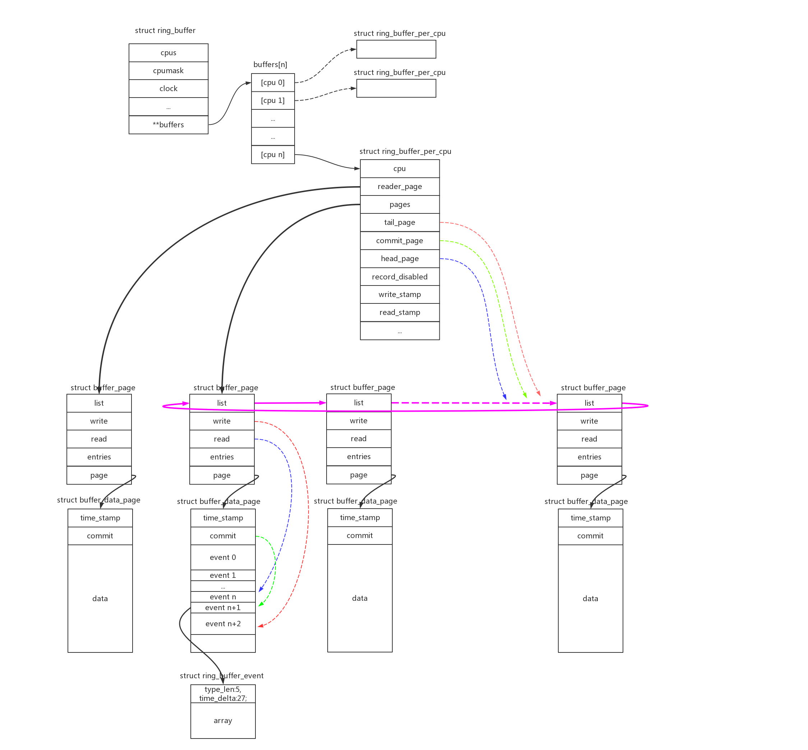
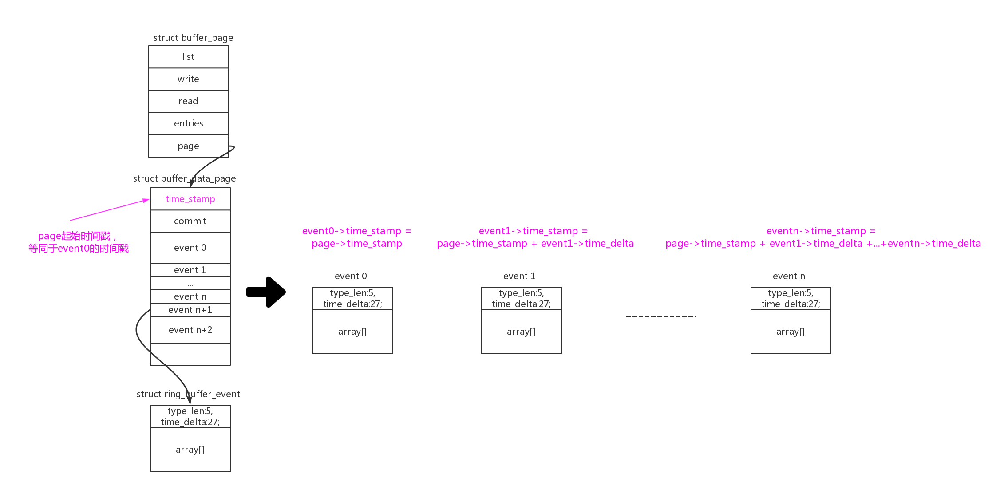
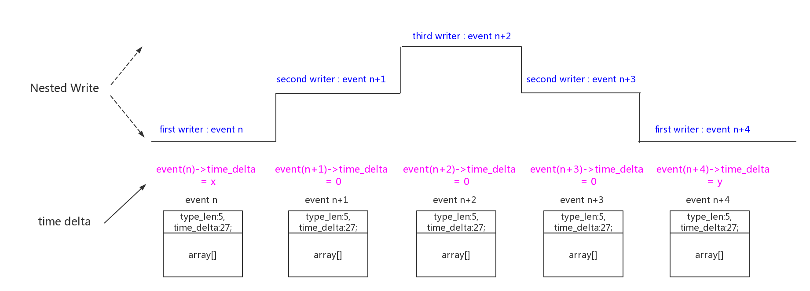

# 1、简介

ringbuffer是trace框架的一个基础，所有的trace原始数据都是通过ringbuffer记录的。ringbuffer的作用主要有几个：

- 1、存储在内存中，速度非常快，对系统性能的影响降到了最低；
- 2、ring结构，循环写。可以很安全的使用又不浪费内存，能够get到最新的trace信息；

但是，难点并不在这。**真正的难点**是系统会在常规上下文、中断(NMI、IRQ、SOFTIRQ)等各种场景下都会发生trace，怎么样能既不影响系统的逻辑，又能处理好相互之间的互斥把trace的架构组织好。如果对这部分非常感兴趣可以直接跳转到 <a href="#设计思想">第5章 ringbuffer的设计思想</a> 进行学习。

# 2、ringbuffer初始化



上图是ringbuffer的组织结构顶级视图，可以看到以下信息：

 - 1、struct ring_buffer在每个cpu上有独立的struct ring_buffer_per_cpu数据结构；
 - 2、struct ring_buffer_per_cpu根据定义size的大小，分配page空间，并把page链成环形结构，这就是“ring”的概念；
 - 3、struct buffer_page是一个控制结构；struct buffer_data_page才是一个实际的page，除了开头的两个控制字段time_stamp、commit，其他空间都是用来存储数据的；数据使用struct ring_buffer_event来存储，其在包头中还存储了时间戳、长度/类型信息；
 - 4、struct ring_buffer_per_cpu中使用head_page(读)、commit_page(写确认)、tail_page(写)三种指针来管理page ring；同理buffer_page->read(读)、buffer_page->write(写)、buffer_data_page->commit(写确认)用来描述page内的偏移指针；
 - 5、ring_buffer_per_cpu->reader_page中还包含了一个独立的page，用来支持reader方式的读操作；


初始化的主要工作就是分配page空间，并且初始化各个控制字段。

start_kernel() -> trace_init() -> tracer_alloc_buffers() -> allocate_trace_buffers() -> allocate_trace_buffer() -> ring_buffer_alloc() -> __ring_buffer_alloc()：

```
struct ring_buffer *__ring_buffer_alloc(unsigned long size, unsigned flags,
					struct lock_class_key *key)
{
	struct ring_buffer *buffer;
	long nr_pages;
	int bsize;
	int cpu;

    /* (1) 分配ring_buffer数据结构 */
	/* keep it in its own cache line */
	buffer = kzalloc(ALIGN(sizeof(*buffer), cache_line_size()),
			 GFP_KERNEL);
	if (!buffer)
		return NULL;

	if (!alloc_cpumask_var(&buffer->cpumask, GFP_KERNEL))
		goto fail_free_buffer;

	nr_pages = DIV_ROUND_UP(size, BUF_PAGE_SIZE);
	
	/* (1.1) 初始化ring_buffer的控制成员：
	 ->flags = flags
	 ->clock = 时间戳的时钟源
	*/
	buffer->flags = flags;
	buffer->clock = trace_clock_local;
	buffer->reader_lock_key = key;

	init_irq_work(&buffer->irq_work.work, rb_wake_up_waiters);
	init_waitqueue_head(&buffer->irq_work.waiters);

	/* need at least two pages */
	if (nr_pages < 2)
		nr_pages = 2;

	/*
	 * In case of non-hotplug cpu, if the ring-buffer is allocated
	 * in early initcall, it will not be notified of secondary cpus.
	 * In that off case, we need to allocate for all possible cpus.
	 */
	/* (1.2) 初始化ring_buffer的控制成员：
	 ->cpumask = online cpu的map
	 ->cpus = cpu个数
	*/
#ifdef CONFIG_HOTPLUG_CPU
	cpu_notifier_register_begin();
	cpumask_copy(buffer->cpumask, cpu_online_mask);
#else
	cpumask_copy(buffer->cpumask, cpu_possible_mask);
#endif
	buffer->cpus = nr_cpu_ids;

	bsize = sizeof(void *) * nr_cpu_ids;
	buffer->buffers = kzalloc(ALIGN(bsize, cache_line_size()),
				  GFP_KERNEL);
	if (!buffer->buffers)
		goto fail_free_cpumask;


    /* (2) 分配每cpu的ring_buffer_per_cpu结构 */
	for_each_buffer_cpu(buffer, cpu) {
		buffer->buffers[cpu] =
			rb_allocate_cpu_buffer(buffer, nr_pages, cpu);
		if (!buffer->buffers[cpu])
			goto fail_free_buffers;
	}

    /* (3) 注册cpu的hotplug回调函数：
        主要作用是在cpu up时，如果没有分配ring_buffer_per_cpu，则重新分配
        在cpu down时并不会释放ring_buffer_per_cpu空间
     */
#ifdef CONFIG_HOTPLUG_CPU
	buffer->cpu_notify.notifier_call = rb_cpu_notify;
	buffer->cpu_notify.priority = 0;
	__register_cpu_notifier(&buffer->cpu_notify);
	cpu_notifier_register_done();
#endif

	mutex_init(&buffer->mutex);

	return buffer;

 fail_free_buffers:
	for_each_buffer_cpu(buffer, cpu) {
		if (buffer->buffers[cpu])
			rb_free_cpu_buffer(buffer->buffers[cpu]);
	}
	kfree(buffer->buffers);

 fail_free_cpumask:
	free_cpumask_var(buffer->cpumask);
#ifdef CONFIG_HOTPLUG_CPU
	cpu_notifier_register_done();
#endif

 fail_free_buffer:
	kfree(buffer);
	return NULL;
}

|→

static struct ring_buffer_per_cpu *
rb_allocate_cpu_buffer(struct ring_buffer *buffer, long nr_pages, int cpu)
{
	struct ring_buffer_per_cpu *cpu_buffer;
	struct buffer_page *bpage;
	struct page *page;
	int ret;

    /* (2.1) 分配ring_buffer_per_cpu的结构空间 */
	cpu_buffer = kzalloc_node(ALIGN(sizeof(*cpu_buffer), cache_line_size()),
				  GFP_KERNEL, cpu_to_node(cpu));
	if (!cpu_buffer)
		return NULL;

	cpu_buffer->cpu = cpu;
	cpu_buffer->buffer = buffer;
	raw_spin_lock_init(&cpu_buffer->reader_lock);
	lockdep_set_class(&cpu_buffer->reader_lock, buffer->reader_lock_key);
	cpu_buffer->lock = (arch_spinlock_t)__ARCH_SPIN_LOCK_UNLOCKED;
	INIT_WORK(&cpu_buffer->update_pages_work, update_pages_handler);
	init_completion(&cpu_buffer->update_done);
	init_irq_work(&cpu_buffer->irq_work.work, rb_wake_up_waiters);
	init_waitqueue_head(&cpu_buffer->irq_work.waiters);
	init_waitqueue_head(&cpu_buffer->irq_work.full_waiters);

	bpage = kzalloc_node(ALIGN(sizeof(*bpage), cache_line_size()),
			    GFP_KERNEL, cpu_to_node(cpu));
	if (!bpage)
		goto fail_free_buffer;

	rb_check_bpage(cpu_buffer, bpage);

    /* (2.2) 分配reader_page对应的buffer_page和buffer_data_page */
	cpu_buffer->reader_page = bpage;
	page = alloc_pages_node(cpu_to_node(cpu), GFP_KERNEL, 0);
	if (!page)
		goto fail_free_reader;
	bpage->page = page_address(page);
	rb_init_page(bpage->page);

	INIT_LIST_HEAD(&cpu_buffer->reader_page->list);
	INIT_LIST_HEAD(&cpu_buffer->new_pages);

    /* (2.3) 分配核心的ring buffer对应的page空间 */
	ret = rb_allocate_pages(cpu_buffer, nr_pages);
	if (ret < 0)
		goto fail_free_reader;

    /* (2.4) 初始化ring page的三大指针：head_page、commit_page、tail_page 
        都指向起始page
     */
	cpu_buffer->head_page
		= list_entry(cpu_buffer->pages, struct buffer_page, list);
	cpu_buffer->tail_page = cpu_buffer->commit_page = cpu_buffer->head_page;

    /* (2.5) 初始化ring page中指向head page的上一个page，指向head page的指针
        将指针设置RB_PAGE_HEAD标志，标明head page的位置
     */
	rb_head_page_activate(cpu_buffer);

	return cpu_buffer;

 fail_free_reader:
	free_buffer_page(cpu_buffer->reader_page);

 fail_free_buffer:
	kfree(cpu_buffer);
	return NULL;
}

```


# 3、ringbuffer的写操作

从ring buffer的设计思想上看，为了支持“nested-write”嵌套写的免锁操作，引入了commit的概念。原理见<a href="#commit_page">commit page</a> 一节的描述。

所以ringbuffer的写操作分成以下几步：

- 1、writer使用ring_buffer_lock_reserve()函数移动tail指针，得到需要的空间；
- 2、writer操作得到的ring buffer空间，写数据；
- 3、writer使用ring_buffer_unlock_commit()函数确认数据的写入完成，如果是高优先级抢占其他人的writer会成为pending_commit，只有优先级最低的writer完成full commit并且移动comit指针；
- 4、writer使用ring_buffer_discard_commit()函数丢弃数据。丢弃的方法有两种：1、首先尝试回滚tail指针回收空间；2、如果无法回滚则把数据类型设置为padding再正常的commit，这种空间相当于浪费掉。

这些操作当中，有两件事需要注意：一是ring_buffer_event的存储格式，二是ring_buffer_event时间戳的计算；


## 3.1、ring_buffer_event的存储格式

writer在ring buffer的page中分配空间，在用户数据之前加了一个ring_buffer_event来进行管理：

```
struct ring_buffer_event {
	kmemcheck_bitfield_begin(bitfield);
	u32		type_len:5, time_delta:27;
	kmemcheck_bitfield_end(bitfield);

	u32		array[];
};
```

“type_len:5, time_delta:27”为控制结构，在最小情况下占用32bit的空间，表示type、len、time_delta三种信息。

其中前5bit type_len，在不同情况下表示type或者len：

```
enum ring_buffer_type {
	RINGBUF_TYPE_DATA_TYPE_LEN_MAX = 28,
	RINGBUF_TYPE_PADDING,
	RINGBUF_TYPE_TIME_EXTEND,
	/* FIXME: RINGBUF_TYPE_TIME_STAMP not implemented */
	RINGBUF_TYPE_TIME_STAMP,
};
```

综合不同情况的列表如下：

<table border="1">
<caption> type_len解析 </caption>

<tr>
<th style="width: 50px;">type_len(5bit)</th>
<th style="width: 50px;">time_delta(27bit)</th>
<th style="width: 50px;">array[0](32bit)</th>
<th style="width: 50px;">type</th>
<th style="width: 50px;">len</th>
<th style="width: 50px;">time_delta</th>
<th style="width: 400px;">说明</th>
</tr>

<tr>
<td> 0 </td>
<td> - </td>
<td> 存放len </td>
<td> Data record </td>
<td>
len = sizeof(array[])，存放在array[0]中
</td>
<td>
-
</td>
<td>
因为type_len只有5bit，其中分配给表示数据长度的数值只有(0-28)，数据默认是4byte对齐的，所以type_len能表示的最大数据长度为28*4=112bytes。<br/>
即：#define RB_MAX_SMALL_DATA	(RB_ALIGNMENT * RINGBUF_TYPE_DATA_TYPE_LEN_MAX)<br/><br/>
在len > RB_MAX_SMALL_DATA的情况下，使用array[0]来存放长度，这种情况下type_len=0。
</td>
</tr>

<tr>
<td> 1 - 28 </td>
<td> - </td>
<td> - </td>
<td> Data record </td>
<td>
len = sizeof(array[])，存放在type_len中，len = type_len << 2
</td>
<td>
-
</td>
<td>
在len <= RB_MAX_SMALL_DATA的情况下，使用type_len来存放长度。
</td>
</tr>

<tr>
<td> 29(RINGBUF_TYPE_PADDING) </td>
<td> 0 </td>
<td> - </td>
<td> Padding </td>
<td>
len variable
</td>
<td>
-
</td>
<td>
Padding类型指的是ringbuffer数据空间分配以后，没有使用被废弃了。<br/><br/>
If time_delta is 0: <br/>
    array is ignored，size is variable depending on how much padding is needed
</td>
</tr>

<tr>
<td> 29(RINGBUF_TYPE_PADDING) </td>
<td> >0 </td>
<td> 存放len </td>
<td> Padding </td>
<td>
len = sizeof(array[])，存放在array[0]中
</td>
<td>
-
</td>
<td>
Padding类型指的是ringbuffer数据空间分配以后，没有使用被废弃了。<br/><br/>
If time_delta is non zero: <br/>
    array[0] holds the actual length
</td>
</tr>

<tr>
<td> 30(RINGBUF_TYPE_TIME_EXTEND) </td>
<td> 存放time_delta的0-27bit </td>
<td> 存放time_delta的28-59bit </td>
<td> Time Extened </td>
<td>
len = sizeof(array[])。只有一个array[0]，array[]长度固定为4。
</td>
<td>
delta = (array[0] << 28) + time_delta
</td>
<td>
因为time_delta只有27bit，所以普通“Data record”类型event能表达的最大时间差为2^27ns。<br/><br/>
如果时间差超过2^27ns，需要定义一个专门的“Time Extened”event来记录时间差，其利用array[0]来记录time_delta的28-59bit，总共60bit能满足用户时间差的需求。<br/>
该event固定长度为8.<br/>
</td>
</tr>

</table>


## 3.2、ring_buffer_event时间戳

ring buffer不但记录了event数据，默认他还给每个event记录加上了时间戳信息。同时为了节约空间，没有记录绝对时间戳，而只是记录相对上一个event的时间差。在每个struct buffer_data_page的开头，都记录了该page第一个commit的绝对时间戳。

那么计算page中event(n)的绝对时间戳 = page->time_stamp + event0->time_delta +  event1->time_delta + ... +  event(n-1)->time_delta:



在计算event时间差时，是以一次full commit为单位的。如果发生了“nested-write”，那么这次full commit中多次write分配的event的时间差，最后都为0：




## 3.3、ring_buffer_event写入流程


### 3.3.1、ring_buffer_lock_reserve()

```
struct ring_buffer_event *
ring_buffer_lock_reserve(struct ring_buffer *buffer, unsigned long length)
{
	struct ring_buffer_per_cpu *cpu_buffer;
	struct ring_buffer_event *event;
	int cpu;

    /* (1) 关闭抢占，那么接下来的操作只有中断才能打断了 */
	/* If we are tracing schedule, we don't want to recurse */
	preempt_disable_notrace();

    /* (2) 如果ring_buffer被disable，出错返回 */
	if (unlikely(atomic_read(&buffer->record_disabled)))
		goto out;

	cpu = raw_smp_processor_id();

	if (unlikely(!cpumask_test_cpu(cpu, buffer->cpumask)))
		goto out;

    /* (3) 得到本cpu对应的ring_buffer_per_cpu结构 */
	cpu_buffer = buffer->buffers[cpu];

    /* (4) 如果ring_buffer_per_cpu被disable，出错返回 */
	if (unlikely(atomic_read(&cpu_buffer->record_disabled)))
		goto out;

    /* (5) 如果申请的空间长度大于一个ringbuffer底层的一个page，出错返回 */
	if (unlikely(length > BUF_MAX_DATA_SIZE))
		goto out;

    /* (6) 禁止同优先级运行环境的递归重入 */
	if (unlikely(trace_recursive_lock(cpu_buffer)))
		goto out;

    /* (7) 从per_cpubuffer中申请数据 */
	event = rb_reserve_next_event(buffer, cpu_buffer, length);
	if (!event)
		goto out_unlock;

	return event;

 out_unlock:
	trace_recursive_unlock(cpu_buffer);
 out:
	preempt_enable_notrace();
	return NULL;
}

|→

static struct ring_buffer_event *
rb_reserve_next_event(struct ring_buffer *buffer,
		      struct ring_buffer_per_cpu *cpu_buffer,
		      unsigned long length)
{
	struct ring_buffer_event *event;
	struct rb_event_info info;
	int nr_loops = 0;
	u64 diff;

    /* (7.1) 增加cpu_buffer->commits、cpu_buffer->committing的计数 
        在commit的时候用committing计数来判断：
        ==1，当前是最外层的writer，做full commit移动commit指针到tail
        >1，当前是抢占writer，只能pending commit，同时把committing计数减一
     */
	rb_start_commit(cpu_buffer);

#ifdef CONFIG_RING_BUFFER_ALLOW_SWAP
	/*
	 * Due to the ability to swap a cpu buffer from a buffer
	 * it is possible it was swapped before we committed.
	 * (committing stops a swap). We check for it here and
	 * if it happened, we have to fail the write.
	 */
	barrier();
	if (unlikely(ACCESS_ONCE(cpu_buffer->buffer) != buffer)) {
		local_dec(&cpu_buffer->committing);
		local_dec(&cpu_buffer->commits);
		return NULL;
	}
#endif

    /* (7.2) 计算加上ring_buffer_event控制结构以后，数据的总长度 */
	info.length = rb_calculate_event_length(length);
 again:
	info.add_timestamp = 0;
	info.delta = 0;

	/*
	 * We allow for interrupts to reenter here and do a trace.
	 * If one does, it will cause this original code to loop
	 * back here. Even with heavy interrupts happening, this
	 * should only happen a few times in a row. If this happens
	 * 1000 times in a row, there must be either an interrupt
	 * storm or we have something buggy.
	 * Bail!
	 */
	if (RB_WARN_ON(cpu_buffer, ++nr_loops > 1000))
		goto out_fail;

    /* (7.3) 获取当前event的时间戳，并计算和write_stamp之间的时间差值，
        write_stamp是上一个full commit的时间戳。
        系统是以full commit作为一个时间戳的，如果一次nested-write分配了多个event，
        那么这些event共享同一个时间戳，除了第一个event，后面event的time_delta都为0。
     */
	info.ts = rb_time_stamp(cpu_buffer->buffer);
	diff = info.ts - cpu_buffer->write_stamp;

	/* make sure this diff is calculated here */
	barrier();

	/* Did the write stamp get updated already? */
	if (likely(info.ts >= cpu_buffer->write_stamp)) {
		info.delta = diff;
		/* (7.4) 如果时间差大于2^27ns，需要增加一个time extend类型的event来存储时间差 
		    设置info.add_timestamp = 1
		 */
		if (unlikely(test_time_stamp(info.delta)))
			rb_handle_timestamp(cpu_buffer, &info);
	}

    /* (7.5) 继续尝试分配event空间 */
	event = __rb_reserve_next(cpu_buffer, &info);

	if (unlikely(PTR_ERR(event) == -EAGAIN)) {
		if (info.add_timestamp)
			info.length -= RB_LEN_TIME_EXTEND;
		goto again;
	}

	if (!event)
		goto out_fail;

	return event;

 out_fail:
	rb_end_commit(cpu_buffer);
	return NULL;
}

||→

static unsigned rb_calculate_event_length(unsigned length)
{
	struct ring_buffer_event event; /* Used only for sizeof array */

	/* zero length can cause confusions */
	if (!length)
		length++;

    /* (7.2.1) 如果len大于(28<<2)，需要使用array[0]来存储长度 */
	if (length > RB_MAX_SMALL_DATA || RB_FORCE_8BYTE_ALIGNMENT)
		length += sizeof(event.array[0]);

    /* (7.2.2) 增加event常规header的长度 */
	length += RB_EVNT_HDR_SIZE;
	/* (7.2.3) 默认4字节长度对齐 */
	length = ALIGN(length, RB_ARCH_ALIGNMENT);

	/*
	 * In case the time delta is larger than the 27 bits for it
	 * in the header, we need to add a timestamp. If another
	 * event comes in when trying to discard this one to increase
	 * the length, then the timestamp will be added in the allocated
	 * space of this event. If length is bigger than the size needed
	 * for the TIME_EXTEND, then padding has to be used. The events
	 * length must be either RB_LEN_TIME_EXTEND, or greater than or equal
	 * to RB_LEN_TIME_EXTEND + 8, as 8 is the minimum size for padding.
	 * As length is a multiple of 4, we only need to worry if it
	 * is 12 (RB_LEN_TIME_EXTEND + 4).
	 */
	if (length == RB_LEN_TIME_EXTEND + RB_ALIGNMENT)
		length += RB_ALIGNMENT;

	return length;
}

||→

static struct ring_buffer_event *
__rb_reserve_next(struct ring_buffer_per_cpu *cpu_buffer,
		  struct rb_event_info *info)
{
	struct ring_buffer_event *event;
	struct buffer_page *tail_page;
	unsigned long tail, write;

	/*
	 * If the time delta since the last event is too big to
	 * hold in the time field of the event, then we append a
	 * TIME EXTEND event ahead of the data event.
	 */
	/* (7.5.1) 如果需要增加time extend event，增加8字节长度 */
	if (unlikely(info->add_timestamp))
		info->length += RB_LEN_TIME_EXTEND;

    /* (7.5.2) 使用原子操作，快速从tail指针中保留出需要的长度 
        这里有个异常需要处理，如果本page空间不够，需要向后找新的page，这里>BUF_PAGE_SIZE的tail指针需要回滚
     */
	tail_page = info->tail_page = cpu_buffer->tail_page;
	write = local_add_return(info->length, &tail_page->write);

	/* set write to only the index of the write */
	write &= RB_WRITE_MASK;
	tail = write - info->length;

	/*
	 * If this is the first commit on the page, then it has the same
	 * timestamp as the page itself.
	 */
	/* (7.5.3) page中第一个event的time_delta赋值为0，
	    直接使用page->time_stamp
	 */
	if (!tail)
		info->delta = 0;

	/* See if we shot pass the end of this buffer page */
	/* (7.5.4) 不允许分配的空间跨越两个page， 
	    如果本page的空间不足，向后寻找新的page
	 */
	if (unlikely(write > BUF_PAGE_SIZE))
		return rb_move_tail(cpu_buffer, tail, info);

	/* We reserved something on the buffer */
    
    /* (7.5.5) 成功获取到event空间 */
	event = __rb_page_index(tail_page, tail);
	kmemcheck_annotate_bitfield(event, bitfield);
	
	/* (7.5.6) 更新ring_buffer_event中的type_len、time_delta字段 */
	rb_update_event(cpu_buffer, event, info);

    /* (7.5.7) 增加page中的event技术 */
	local_inc(&tail_page->entries);

	/*
	 * If this is the first commit on the page, then update
	 * its timestamp.
	 */
	/* (7.5.8) 如果是page中第一个event， 
	    使用event->time_stamp更新page->time_stamp
	 */
	if (!tail)
		tail_page->page->time_stamp = info->ts;

	/* account for these added bytes */
	/* (7.5.9) 更新ring_buffer_per_cpu中的有效event数据计数 */
	local_add(info->length, &cpu_buffer->entries_bytes);

	return event;
}

|||→

```

rb_move_tail()是理解复杂无锁指针操作的核心函数，但是已经没有兴趣和心情继续仔细分析了。大的原理上已无问题，后面有需要再仔细分析吧：

```
static noinline struct ring_buffer_event *
rb_move_tail(struct ring_buffer_per_cpu *cpu_buffer,
	     unsigned long tail, struct rb_event_info *info)
{
	struct buffer_page *tail_page = info->tail_page;
	struct buffer_page *commit_page = cpu_buffer->commit_page;
	struct ring_buffer *buffer = cpu_buffer->buffer;
	struct buffer_page *next_page;
	int ret;
	u64 ts;

	next_page = tail_page;

	rb_inc_page(cpu_buffer, &next_page);

	/*
	 * If for some reason, we had an interrupt storm that made
	 * it all the way around the buffer, bail, and warn
	 * about it.
	 */
	if (unlikely(next_page == commit_page)) {
		local_inc(&cpu_buffer->commit_overrun);
		goto out_reset;
	}

	/*
	 * This is where the fun begins!
	 *
	 * We are fighting against races between a reader that
	 * could be on another CPU trying to swap its reader
	 * page with the buffer head.
	 *
	 * We are also fighting against interrupts coming in and
	 * moving the head or tail on us as well.
	 *
	 * If the next page is the head page then we have filled
	 * the buffer, unless the commit page is still on the
	 * reader page.
	 */
	if (rb_is_head_page(cpu_buffer, next_page, &tail_page->list)) {

		/*
		 * If the commit is not on the reader page, then
		 * move the header page.
		 */
		if (!rb_is_reader_page(cpu_buffer->commit_page)) {
			/*
			 * If we are not in overwrite mode,
			 * this is easy, just stop here.
			 */
			if (!(buffer->flags & RB_FL_OVERWRITE)) {
				local_inc(&cpu_buffer->dropped_events);
				goto out_reset;
			}

			ret = rb_handle_head_page(cpu_buffer,
						  tail_page,
						  next_page);
			if (ret < 0)
				goto out_reset;
			if (ret)
				goto out_again;
		} else {
			/*
			 * We need to be careful here too. The
			 * commit page could still be on the reader
			 * page. We could have a small buffer, and
			 * have filled up the buffer with events
			 * from interrupts and such, and wrapped.
			 *
			 * Note, if the tail page is also the on the
			 * reader_page, we let it move out.
			 */
			if (unlikely((cpu_buffer->commit_page !=
				      cpu_buffer->tail_page) &&
				     (cpu_buffer->commit_page ==
				      cpu_buffer->reader_page))) {
				local_inc(&cpu_buffer->commit_overrun);
				goto out_reset;
			}
		}
	}

	ret = rb_tail_page_update(cpu_buffer, tail_page, next_page);
	if (ret) {
		/*
		 * Nested commits always have zero deltas, so
		 * just reread the time stamp
		 */
		ts = rb_time_stamp(buffer);
		next_page->page->time_stamp = ts;
	}

 out_again:

	rb_reset_tail(cpu_buffer, tail, info);

	/* fail and let the caller try again */
	return ERR_PTR(-EAGAIN);

 out_reset:
	/* reset write */
	rb_reset_tail(cpu_buffer, tail, info);

	return NULL;
}
```


### 3.3.2、ring_buffer_unlock_commit()

```
int ring_buffer_unlock_commit(struct ring_buffer *buffer,
			      struct ring_buffer_event *event)
{
	struct ring_buffer_per_cpu *cpu_buffer;
	int cpu = raw_smp_processor_id();

	cpu_buffer = buffer->buffers[cpu];

	rb_commit(cpu_buffer, event);

	rb_wakeups(buffer, cpu_buffer);

	trace_recursive_unlock(cpu_buffer);

	preempt_enable_notrace();

	return 0;
}

|→

static void rb_commit(struct ring_buffer_per_cpu *cpu_buffer,
		      struct ring_buffer_event *event)
{
	local_inc(&cpu_buffer->entries);
	/* (1) 只有full commit，才会更新write_stamp时间戳  */
	rb_update_write_stamp(cpu_buffer, event);
	/* (2) 只有full commit，才会更新commit指针  */
	rb_end_commit(cpu_buffer);
}

||→

static void
rb_update_write_stamp(struct ring_buffer_per_cpu *cpu_buffer,
		      struct ring_buffer_event *event)
{
	u64 delta;

	/*
	 * The event first in the commit queue updates the
	 * time stamp.
	 */
	/* (1.1) 只有full commit才会更新write_stamp时间戳，
	    中间抢占的write提交的pending commit，不会更新
	 */
	if (rb_event_is_commit(cpu_buffer, event)) {
		/*
		 * A commit event that is first on a page
		 * updates the write timestamp with the page stamp
		 */
		if (!rb_event_index(event))
			cpu_buffer->write_stamp =
				cpu_buffer->commit_page->page->time_stamp;
		else if (event->type_len == RINGBUF_TYPE_TIME_EXTEND) {
			delta = event->array[0];
			delta <<= TS_SHIFT;
			delta += event->time_delta;
			cpu_buffer->write_stamp += delta;
		} else
			cpu_buffer->write_stamp += event->time_delta;
	}
}

||→

static inline void rb_end_commit(struct ring_buffer_per_cpu *cpu_buffer)
{
	unsigned long commits;

	if (RB_WARN_ON(cpu_buffer,
		       !local_read(&cpu_buffer->committing)))
		return;

 again:
	commits = local_read(&cpu_buffer->commits);
	/* synchronize with interrupts */
	barrier();
	/* (2.1) 如果(committing==1)，说明当前是full commit
	    只有full commit才会更新commit指针，
	    中间抢占的write提交的pending commit，不会更新
	 */
	if (local_read(&cpu_buffer->committing) == 1)
		rb_set_commit_to_write(cpu_buffer);

    /* (2.2) 任何一次commit都会给committing减1 */
	local_dec(&cpu_buffer->committing);

	/* synchronize with interrupts */
	barrier();

	/*
	 * Need to account for interrupts coming in between the
	 * updating of the commit page and the clearing of the
	 * committing counter.
	 */
	if (unlikely(local_read(&cpu_buffer->commits) != commits) &&
	    !local_read(&cpu_buffer->committing)) {
		local_inc(&cpu_buffer->committing);
		goto again;
	}
}

|||→

static void
rb_set_commit_to_write(struct ring_buffer_per_cpu *cpu_buffer)
{
	unsigned long max_count;

	/*
	 * We only race with interrupts and NMIs on this CPU.
	 * If we own the commit event, then we can commit
	 * all others that interrupted us, since the interruptions
	 * are in stack format (they finish before they come
	 * back to us). This allows us to do a simple loop to
	 * assign the commit to the tail.
	 */
 again:
	max_count = cpu_buffer->nr_pages * 100;

    /* (2.1.1) 逐个移动commit_page直到等于tail_page 
        把每个commit_page中的commit指针设置为和write指针一致
     */
	while (cpu_buffer->commit_page != cpu_buffer->tail_page) {
		if (RB_WARN_ON(cpu_buffer, !(--max_count)))
			return;
		if (RB_WARN_ON(cpu_buffer,
			       rb_is_reader_page(cpu_buffer->tail_page)))
			return;
		local_set(&cpu_buffer->commit_page->page->commit,
			  rb_page_write(cpu_buffer->commit_page));
		rb_inc_page(cpu_buffer, &cpu_buffer->commit_page);
		cpu_buffer->write_stamp =
			cpu_buffer->commit_page->page->time_stamp;
		/* add barrier to keep gcc from optimizing too much */
		barrier();
	}
	
	/* (2.1.2) 把最后一个commit_page中的commit指针设置为和write指针一致 */
	while (rb_commit_index(cpu_buffer) !=
	       rb_page_write(cpu_buffer->commit_page)) {

		local_set(&cpu_buffer->commit_page->page->commit,
			  rb_page_write(cpu_buffer->commit_page));
		RB_WARN_ON(cpu_buffer,
			   local_read(&cpu_buffer->commit_page->page->commit) &
			   ~RB_WRITE_MASK);
		barrier();
	}

	/* again, keep gcc from optimizing */
	barrier();

	/*
	 * If an interrupt came in just after the first while loop
	 * and pushed the tail page forward, we will be left with
	 * a dangling commit that will never go forward.
	 */
	if (unlikely(cpu_buffer->commit_page != cpu_buffer->tail_page))
		goto again;
}

```


### 3.3.3、ring_buffer_discard_commit()

如果不需要分配的空间了，需要明确做丢弃操作。

```
void ring_buffer_discard_commit(struct ring_buffer *buffer,
				struct ring_buffer_event *event)
{
	struct ring_buffer_per_cpu *cpu_buffer;
	int cpu;

	/* The event is discarded regardless */
	/* (1) 将event中的数据type设置为padding */
	rb_event_discard(event);

	cpu = smp_processor_id();
	cpu_buffer = buffer->buffers[cpu];

	/*
	 * This must only be called if the event has not been
	 * committed yet. Thus we can assume that preemption
	 * is still disabled.
	 */
	RB_WARN_ON(buffer, !local_read(&cpu_buffer->committing));

    /* (2) 如果tail指针还没有被新用户使用，尝试回滚tail指针来进行丢弃， 
        这种方法可以节约空间
     */
	rb_decrement_entry(cpu_buffer, event);
	if (rb_try_to_discard(cpu_buffer, event))
		goto out;

	/*
	 * The commit is still visible by the reader, so we
	 * must still update the timestamp.
	 */
	/* (3) 只有full commit，才会更新write_stamp时间戳  */
	rb_update_write_stamp(cpu_buffer, event);
 out:
    /* (4) 只有full commit，才会更新commit指针  */
	rb_end_commit(cpu_buffer);

	trace_recursive_unlock(cpu_buffer);

	preempt_enable_notrace();

}
```

# 4、ringbuffer的读操作

ringbuffer支持两种形式的读操作：

- iterator读。这个时候会把写入操作关闭，且iterator读不会破坏ringbuffer中原有的内容，重复多次读取内容还在。这个典型的例子就是"/sys/kernel/debug/tracing/trace"文件，我们多次“cat trace”文件来读取trace，内容保持不变。这种方式的缺点也是显而易见的，会disable写入操作，只适合trace完成后，一次性读出所有trace信息；
- reader_page swap读。在ring buffer的设计原理中，多次看到reader_page的swap操作。这个读方式本质上是为了让ring  buffer的读写能够同步进行，互不阻塞，但是缺点就是读完会破坏原有buffer中的内容。这个典型的例子就是"/sys/kernel/debug/tracing/trace_pipe"，监控程序可以在抓取trace时并行的来读取ringbuffer中的数据；

关于这部分的原理也可以参考<a href="#reader">ring buffer 读</a> 这一节。

## 4.1、iterator读

参考"/sys/kernel/debug/tracing/trace"文件的读操作：

```
	trace_create_file("trace", 0644, d_tracer,
			  tr, &tracing_fops);
			  
static const struct file_operations tracing_fops = {
	.open		= tracing_open,
	.read		= seq_read,
	.write		= tracing_write_stub,
	.llseek		= tracing_lseek,
	.release	= tracing_release,
};

/* (1) 初始化iterator控制结构 */
static int tracing_open(struct inode *inode, struct file *file)
{

    /* (1.1) 分配iter */
	iter = __seq_open_private(file, &tracer_seq_ops, sizeof(*iter));
	if (!iter)
		return ERR_PTR(-ENOMEM);

    /* (1.2) 给每个cpu的ring_buffer_per_cpu分配对应的ring_buffer_iter */
	iter->buffer_iter = kcalloc(nr_cpu_ids, sizeof(*iter->buffer_iter),
				    GFP_KERNEL);

    /* (1.3) 初始化ring_buffer_iter */
    if (iter->cpu_file == RING_BUFFER_ALL_CPUS) {
		for_each_tracing_cpu(cpu) {
			iter->buffer_iter[cpu] =
				ring_buffer_read_prepare(iter->trace_buffer->buffer, cpu);
		}
		ring_buffer_read_prepare_sync();
		for_each_tracing_cpu(cpu) {
			ring_buffer_read_start(iter->buffer_iter[cpu]);
			tracing_iter_reset(iter, cpu);
		}
	} else {
		cpu = iter->cpu_file;
		iter->buffer_iter[cpu] =
			ring_buffer_read_prepare(iter->trace_buffer->buffer, cpu);
		ring_buffer_read_prepare_sync();
		ring_buffer_read_start(iter->buffer_iter[cpu]);
		tracing_iter_reset(iter, cpu);
	}


}

/* (2) 从ringbuffer中读取数据，解析到trace文件中 */
ssize_t seq_read(struct file *file, char __user *buf, size_t size, loff_t *ppos)
{

    Fill:
	/* they want more? let's try to get some more */
	while (m->count < size) {
		size_t offs = m->count;
		loff_t next = pos;
		
		/* (2.1) seq的next 操作 */
		p = m->op->next(m, p, &next);
		if (!p || IS_ERR(p)) {
			err = PTR_ERR(p);
			break;
		}
		
		/* (2.2) seq的show 操作 */
		err = m->op->show(m, p);
		if (seq_has_overflowed(m) || err) {
			m->count = offs;
			if (likely(err <= 0))
				break;
		}
		pos = next;
	}
}

```

next()函数最后调用到：

```
static const struct seq_operations tracer_seq_ops = {
	.start		= s_start,
	.next		= s_next,
	.stop		= s_stop,
	.show		= s_show,
};

static void *s_next(struct seq_file *m, void *v, loff_t *pos)
{
	struct trace_iterator *iter = m->private;
	int i = (int)*pos;
	void *ent;

	WARN_ON_ONCE(iter->leftover);

	(*pos)++;

	/* can't go backwards */
	if (iter->idx > i)
		return NULL;

	if (iter->idx < 0)
		ent = trace_find_next_entry_inc(iter);
	else
		ent = iter;

	while (ent && iter->idx < i)
		ent = trace_find_next_entry_inc(iter);

	iter->pos = *pos;

	return ent;
}

|→

void *trace_find_next_entry_inc(struct trace_iterator *iter)
{
    /* 读出下一个时间戳的event */
	iter->ent = __find_next_entry(iter, &iter->cpu,
				      &iter->lost_events, &iter->ts);

    /* 确认对event的使用：
        使用rb_advance_iter()向前移动ring_buffer_iter的读指针 
     */
	if (iter->ent)
		trace_iterator_increment(iter);

	return iter->ent ? iter : NULL;
}

||→

static struct trace_entry *
__find_next_entry(struct trace_iterator *iter, int *ent_cpu,
		  unsigned long *missing_events, u64 *ent_ts)
{
	struct ring_buffer *buffer = iter->trace_buffer->buffer;
	struct trace_entry *ent, *next = NULL;
	unsigned long lost_events = 0, next_lost = 0;
	int cpu_file = iter->cpu_file;
	u64 next_ts = 0, ts;
	int next_cpu = -1;
	int next_size = 0;
	int cpu;

	/*
	 * If we are in a per_cpu trace file, don't bother by iterating over
	 * all cpu and peek directly.
	 */
	if (cpu_file > RING_BUFFER_ALL_CPUS) {
		if (ring_buffer_empty_cpu(buffer, cpu_file))
			return NULL;
		ent = peek_next_entry(iter, cpu_file, ent_ts, missing_events);
		if (ent_cpu)
			*ent_cpu = cpu_file;

		return ent;
	}

	for_each_tracing_cpu(cpu) {

		if (ring_buffer_empty_cpu(buffer, cpu))
			continue;

        /* (1) 根据iter指示从ringbuffer中读出一条event， 
            如果iter使用了per cpu的ring_buffer_iter，则使用iterator读方式
            否则，使用全局的reader_page swap式的读方式
         */
		ent = peek_next_entry(iter, cpu, &ts, &lost_events);

		/*
		 * Pick the entry with the smallest timestamp:
		 */
		/* (2) 多cpu的ring_buffer_per_cpu，怎么做时间戳同步？
		    每个cpu的buffer，读取一条event的，选取时间戳最小的那条event返回
		 */
		if (ent && (!next || ts < next_ts)) {
			next = ent;
			next_cpu = cpu;
			next_ts = ts;
			next_lost = lost_events;
			next_size = iter->ent_size;
		}
	}

	iter->ent_size = next_size;

	if (ent_cpu)
		*ent_cpu = next_cpu;

	if (ent_ts)
		*ent_ts = next_ts;

	if (missing_events)
		*missing_events = next_lost;

	return next;
}

|||→

static struct trace_entry *
peek_next_entry(struct trace_iterator *iter, int cpu, u64 *ts,
		unsigned long *lost_events)
{
	struct ring_buffer_event *event;
	struct ring_buffer_iter *buf_iter = trace_buffer_iter(iter, cpu);

    /* (2.1) 如果定义了ring_buffer_iter，则使用iterator读 */
	if (buf_iter)
		event = ring_buffer_iter_peek(buf_iter, ts);
	/* (2.2) 如果没有定义ring_buffer_iter，则使用reader_page swap读 */
	else
		event = ring_buffer_peek(iter->trace_buffer->buffer, cpu, ts,
					 lost_events);

	if (event) {
		iter->ent_size = ring_buffer_event_length(event);
		return ring_buffer_event_data(event);
	}
	iter->ent_size = 0;
	return NULL;
}

||||→

struct ring_buffer_event *
ring_buffer_iter_peek(struct ring_buffer_iter *iter, u64 *ts)
{
	struct ring_buffer_per_cpu *cpu_buffer = iter->cpu_buffer;
	struct ring_buffer_event *event;
	unsigned long flags;

 again:
	raw_spin_lock_irqsave(&cpu_buffer->reader_lock, flags);
	event = rb_iter_peek(iter, ts);
	raw_spin_unlock_irqrestore(&cpu_buffer->reader_lock, flags);

	if (event && event->type_len == RINGBUF_TYPE_PADDING)
		goto again;

	return event;
}

static struct ring_buffer_event *
rb_iter_peek(struct ring_buffer_iter *iter, u64 *ts)
{
	struct ring_buffer *buffer;
	struct ring_buffer_per_cpu *cpu_buffer;
	struct ring_buffer_event *event;
	int nr_loops = 0;

	cpu_buffer = iter->cpu_buffer;
	buffer = cpu_buffer->buffer;

	/*
	 * Check if someone performed a consuming read to
	 * the buffer. A consuming read invalidates the iterator
	 * and we need to reset the iterator in this case.
	 */
	if (unlikely(iter->cache_read != cpu_buffer->read ||
		     iter->cache_reader_page != cpu_buffer->reader_page))
		rb_iter_reset(iter);

 again:
	if (ring_buffer_iter_empty(iter))
		return NULL;

	/*
	 * We repeat when a time extend is encountered or we hit
	 * the end of the page. Since the time extend is always attached
	 * to a data event, we should never loop more than three times.
	 * Once for going to next page, once on time extend, and
	 * finally once to get the event.
	 * (We never hit the following condition more than thrice).
	 */
	if (RB_WARN_ON(cpu_buffer, ++nr_loops > 3))
		return NULL;

	if (rb_per_cpu_empty(cpu_buffer))
		return NULL;

    /* (2.1.1) 如果ring_buffer_iter中的head指针已经大于commit指针，
        向后移动head_page指针
     */
	if (iter->head >= rb_page_size(iter->head_page)) {
		rb_inc_iter(iter);
		goto again;
	}

    /* (2.1.2) 根据ring_buffer_iter中的head和head_page指针， 
        读取event数据
     */
	event = rb_iter_head_event(iter);

    /* (2.1.3) 根据读出event的type，对不是data的event进行处理 */
	switch (event->type_len) {
	case RINGBUF_TYPE_PADDING:
		if (rb_null_event(event)) {
			rb_inc_iter(iter);
			goto again;
		}
		rb_advance_iter(iter);
		return event;

	case RINGBUF_TYPE_TIME_EXTEND:
		/* Internal data, OK to advance */
		rb_advance_iter(iter);
		goto again;

	case RINGBUF_TYPE_TIME_STAMP:
		/* FIXME: not implemented */
		rb_advance_iter(iter);
		goto again;

	case RINGBUF_TYPE_DATA:
		if (ts) {
			*ts = iter->read_stamp + event->time_delta;
			ring_buffer_normalize_time_stamp(buffer,
							 cpu_buffer->cpu, ts);
		}
		return event;

	default:
		BUG();
	}

	return NULL;
}
```

show()函数最后调用到：

```
static int s_show(struct seq_file *m, void *v)
{
	struct trace_iterator *iter = v;
	int ret;

	if (iter->ent == NULL) {
		if (iter->tr) {
			seq_printf(m, "# tracer: %s\n", iter->trace->name);
			seq_puts(m, "#\n");
			test_ftrace_alive(m);
		}
		if (iter->snapshot && trace_empty(iter))
			print_snapshot_help(m, iter);
		else if (iter->trace && iter->trace->print_header)
			iter->trace->print_header(m);
		else
			trace_default_header(m);

	} else if (iter->leftover) {
		/*
		 * If we filled the seq_file buffer earlier, we
		 * want to just show it now.
		 */
		ret = trace_print_seq(m, &iter->seq);

		/* ret should this time be zero, but you never know */
		iter->leftover = ret;

	} else {
	    /* (1) 根据ent中数据的type，找到对应的格式化函数
	        把ringbuffer原始数据格式化成方便用户理解的字符串
	        存储在临时变量iter->seq中
	     */
		print_trace_line(iter);
		/* (2) 把iter->seq中的字符串，打印到实际的文件buffer中 */
		ret = trace_print_seq(m, &iter->seq);
		/*
		 * If we overflow the seq_file buffer, then it will
		 * ask us for this data again at start up.
		 * Use that instead.
		 *  ret is 0 if seq_file write succeeded.
		 *        -1 otherwise.
		 */
		iter->leftover = ret;
	}

	return 0;
}

|→

enum print_line_t print_trace_line(struct trace_iterator *iter)
{
	struct trace_array *tr = iter->tr;
	unsigned long trace_flags = tr->trace_flags;
	enum print_line_t ret;

	if (iter->lost_events) {
		trace_seq_printf(&iter->seq, "CPU:%d [LOST %lu EVENTS]\n",
				 iter->cpu, iter->lost_events);
		if (trace_seq_has_overflowed(&iter->seq))
			return TRACE_TYPE_PARTIAL_LINE;
	}

	if (iter->trace && iter->trace->print_line) {
		ret = iter->trace->print_line(iter);
		if (ret != TRACE_TYPE_UNHANDLED)
			return ret;
	}

    /* (1.1) 几种系统预制的ent->type，对应的格式化函数 */
	if (iter->ent->type == TRACE_BPUTS &&
			trace_flags & TRACE_ITER_PRINTK &&
			trace_flags & TRACE_ITER_PRINTK_MSGONLY)
		return trace_print_bputs_msg_only(iter);

	if (iter->ent->type == TRACE_BPRINT &&
			trace_flags & TRACE_ITER_PRINTK &&
			trace_flags & TRACE_ITER_PRINTK_MSGONLY)
		return trace_print_bprintk_msg_only(iter);

	if (iter->ent->type == TRACE_PRINT &&
			trace_flags & TRACE_ITER_PRINTK &&
			trace_flags & TRACE_ITER_PRINTK_MSGONLY)
		return trace_print_printk_msg_only(iter);

	if (trace_flags & TRACE_ITER_BIN)
		return print_bin_fmt(iter);

	if (trace_flags & TRACE_ITER_HEX)
		return print_hex_fmt(iter);

	if (trace_flags & TRACE_ITER_RAW)
		return print_raw_fmt(iter);

    /* (1.2) 用户自定义的ent->type，对应的格式化函数 */
	return print_trace_fmt(iter);
}

||→

static enum print_line_t print_trace_fmt(struct trace_iterator *iter)
{
	struct trace_array *tr = iter->tr;
	struct trace_seq *s = &iter->seq;
	unsigned long sym_flags = (tr->trace_flags & TRACE_ITER_SYM_MASK);
	struct trace_entry *entry;
	struct trace_event *event;

	entry = iter->ent;

	test_cpu_buff_start(iter);

    /* (1.2.1) 根据ent->type，找到对应的trace_entry */
	event = ftrace_find_event(entry->type);

	if (tr->trace_flags & TRACE_ITER_CONTEXT_INFO) {
		if (iter->iter_flags & TRACE_FILE_LAT_FMT)
			trace_print_lat_context(iter);
		else
			trace_print_context(iter);
	}

	if (trace_seq_has_overflowed(s))
		return TRACE_TYPE_PARTIAL_LINE;

    /* (1.2.2) 调用trace_entry->funcs->trace函数进行数据格式化 */
	if (event)
		return event->funcs->trace(iter, sym_flags, event);

	trace_seq_printf(s, "Unknown type %d\n", entry->type);

	return trace_handle_return(s);
}

```

## 4.2、reader_page swap读

参考"/sys/kernel/debug/tracing/trace_pipe"文件的读操作：

```
	trace_create_file("trace_pipe", 0444, d_tracer,
			  tr, &tracing_pipe_fops);
			  
static const struct file_operations tracing_pipe_fops = {
	.open		= tracing_open_pipe,
	.poll		= tracing_poll_pipe,
	.read		= tracing_read_pipe,
	.splice_read	= tracing_splice_read_pipe,
	.release	= tracing_release_pipe,
	.llseek		= no_llseek,
};

/* (1) 和tracing_open最大的区别就是在open中没有定义percpu的ring_buffer_iter，
    所以它在后续的读操作中，不会使用iterator读，而是使用reader_page swap读
 */
static int tracing_open_pipe(struct inode *inode, struct file *filp)
{

	/* create a buffer to store the information to pass to userspace */
	iter = kzalloc(sizeof(*iter), GFP_KERNEL);
	if (!iter) {
		ret = -ENOMEM;
		__trace_array_put(tr);
		goto out;
	}

}

/* (2) trace_pipe文件的读操作 */
static ssize_t
tracing_read_pipe(struct file *filp, char __user *ubuf,
		  size_t cnt, loff_t *ppos)
{
	struct trace_iterator *iter = filp->private_data;
	ssize_t sret;

	/* return any leftover data */
	sret = trace_seq_to_user(&iter->seq, ubuf, cnt);
	if (sret != -EBUSY)
		return sret;

	trace_seq_init(&iter->seq);

	/*
	 * Avoid more than one consumer on a single file descriptor
	 * This is just a matter of traces coherency, the ring buffer itself
	 * is protected.
	 */
	mutex_lock(&iter->mutex);
	if (iter->trace->read) {
		sret = iter->trace->read(iter, filp, ubuf, cnt, ppos);
		if (sret)
			goto out;
	}

waitagain:
	sret = tracing_wait_pipe(filp);
	if (sret <= 0)
		goto out;

	/* stop when tracing is finished */
	if (trace_empty(iter)) {
		sret = 0;
		goto out;
	}

	if (cnt >= PAGE_SIZE)
		cnt = PAGE_SIZE - 1;

	/* reset all but tr, trace, and overruns */
	memset(&iter->seq, 0,
	       sizeof(struct trace_iterator) -
	       offsetof(struct trace_iterator, seq));
	cpumask_clear(iter->started);
	iter->pos = -1;

	trace_event_read_lock();
	trace_access_lock(iter->cpu_file);
	/* (2.1) 使用reader_page swap读，读出下一个event */
	while (trace_find_next_entry_inc(iter) != NULL) {
		enum print_line_t ret;
		int save_len = iter->seq.seq.len;

        /* (2.2) 根据ent中数据的type，找到对应的格式化函数
	        把ringbuffer原始数据格式化成方便用户理解的字符串
	        存储在临时变量iter->seq中
	     */ 
		ret = print_trace_line(iter);
		if (ret == TRACE_TYPE_PARTIAL_LINE) {
			/* don't print partial lines */
			iter->seq.seq.len = save_len;
			break;
		}
		
		/* (2.3) 对event数据读取进行确认，
		    增加对应reader_page->read、reader_page指针
		 */
		if (ret != TRACE_TYPE_NO_CONSUME)
			trace_consume(iter);

        /* (2.4) 如果iter->seq中的数据长度已经满足，退出循环 */
		if (trace_seq_used(&iter->seq) >= cnt)
			break;

		/*
		 * Setting the full flag means we reached the trace_seq buffer
		 * size and we should leave by partial output condition above.
		 * One of the trace_seq_* functions is not used properly.
		 */
		WARN_ONCE(iter->seq.full, "full flag set for trace type %d",
			  iter->ent->type);
	}
	trace_access_unlock(iter->cpu_file);
	trace_event_read_unlock();

	/* Now copy what we have to the user */
	/* (2.5) 拷贝iter->seq中的字符串数据到文件buffer中 */
	sret = trace_seq_to_user(&iter->seq, ubuf, cnt);
	if (iter->seq.seq.readpos >= trace_seq_used(&iter->seq))
		trace_seq_init(&iter->seq);

	/*
	 * If there was nothing to send to user, in spite of consuming trace
	 * entries, go back to wait for more entries.
	 */
	if (sret == -EBUSY)
		goto waitagain;

out:
	mutex_unlock(&iter->mutex);

	return sret;
}

|→

trace_find_next_entry_inc() -> __find_next_entry() -> peek_next_entry() -> ring_buffer_peek() -> rb_buffer_peek()：

static struct ring_buffer_event *
rb_buffer_peek(struct ring_buffer_per_cpu *cpu_buffer, u64 *ts,
	       unsigned long *lost_events)
{
	struct ring_buffer_event *event;
	struct buffer_page *reader;
	int nr_loops = 0;

 again:
	/*
	 * We repeat when a time extend is encountered.
	 * Since the time extend is always attached to a data event,
	 * we should never loop more than once.
	 * (We never hit the following condition more than twice).
	 */
	if (RB_WARN_ON(cpu_buffer, ++nr_loops > 2))
		return NULL;

    /* (2.2.1) swap出最新的reader_page */
	reader = rb_get_reader_page(cpu_buffer);
	if (!reader)
		return NULL;

    /* (2.2.2) 根据reader_page和reader_page->read指针，得到最新的event */
	event = rb_reader_event(cpu_buffer);

    /* (2.2.3) 对不是data的event进行处理 */
	switch (event->type_len) {
	case RINGBUF_TYPE_PADDING:
		if (rb_null_event(event))
			RB_WARN_ON(cpu_buffer, 1);
		/*
		 * Because the writer could be discarding every
		 * event it creates (which would probably be bad)
		 * if we were to go back to "again" then we may never
		 * catch up, and will trigger the warn on, or lock
		 * the box. Return the padding, and we will release
		 * the current locks, and try again.
		 */
		return event;

	case RINGBUF_TYPE_TIME_EXTEND:
		/* Internal data, OK to advance */
		rb_advance_reader(cpu_buffer);
		goto again;

	case RINGBUF_TYPE_TIME_STAMP:
		/* FIXME: not implemented */
		rb_advance_reader(cpu_buffer);
		goto again;

	case RINGBUF_TYPE_DATA:
		if (ts) {
			*ts = cpu_buffer->read_stamp + event->time_delta;
			ring_buffer_normalize_time_stamp(cpu_buffer->buffer,
							 cpu_buffer->cpu, ts);
		}
		if (lost_events)
			*lost_events = rb_lost_events(cpu_buffer);
		return event;

	default:
		BUG();
	}

	return NULL;
}

|→

trace_consume() -> ring_buffer_consume():

struct ring_buffer_event *
ring_buffer_consume(struct ring_buffer *buffer, int cpu, u64 *ts,
		    unsigned long *lost_events)
{
	struct ring_buffer_per_cpu *cpu_buffer;
	struct ring_buffer_event *event = NULL;
	unsigned long flags;
	bool dolock;

 again:
	/* might be called in atomic */
	preempt_disable();

	if (!cpumask_test_cpu(cpu, buffer->cpumask))
		goto out;

	cpu_buffer = buffer->buffers[cpu];
	local_irq_save(flags);
	dolock = rb_reader_lock(cpu_buffer);

	event = rb_buffer_peek(cpu_buffer, ts, lost_events);
	if (event) {
		cpu_buffer->lost_events = 0;
		/* (2.3.1) 增加reader->read指针 */
		rb_advance_reader(cpu_buffer);
	}

	rb_reader_unlock(cpu_buffer, dolock);
	local_irq_restore(flags);

 out:
	preempt_enable();

	if (event && event->type_len == RINGBUF_TYPE_PADDING)
		goto again;

	return event;
}


```


# 5、ringbuffer的设计思想 <a id="设计思想"> </a>

面临的最大问题：

- ring buffer可能在不同上下文中执行(Normal、NMI、IRQ、SOFTIRQ)，对ring buffer的访问是随时可能被打断的，所以对ring buffer的访问需要互斥保护
- ring buffer不能使用常规的lock操作，这样会使不同的上下文之间出现大量的阻塞操作，新增了相互之间的耦合、影响了程序原来的逻辑、影响了性能

最终这个设计使用了一系列的技巧解决了这个问题：原子操作、commit page、RB_PAGE_HEAD、reader_page、重试。这些才是整个ring buffer思想的**精华所在**。

## 5.1、术语

<table border="1">
<caption> 术语 </caption>

<tr>
<th style="width: 150px;">术语</th>
<th style="width: 600px;">Description</th>
<th style="width: 600px;">解释</th>
</tr>

<tr>
<td> tail </td>
<td>
where new writes happen in the ring buffer.
</td>
<td>
ring buffer中下一个写操作的位置
</td>
</tr>

<tr>
<td> head </td>
<td>
where new reads happen in the ring buffer.
</td>
<td>
ring buffer中下一个读操作的位置
</td>
</tr>

<tr>
<td> producer </td>
<td>
the task that writes into the ring buffer (same as writer)
</td>
<td>
生产者：写入数据到ring buffer的任务
</td>
</tr>

<tr>
<td> writer </td>
<td>
same as producer
</td>
<td>
写入者，同生产者
</td>
</tr>

<tr>
<td> consumer </td>
<td>
the task that reads from the buffer (same as reader)
</td>
<td>
消费者：读出ring buffer中数据的任务
</td>
</tr>

<tr>
<td> reader </td>
<td>
same as consumer.
</td>
<td>
读取者，同消费者
</td>
</tr>

<tr>
<td> reader_page </td>
<td>
A page outside the ring buffer used solely (for the most part) by the reader.
</td>
<td>
在ring buffer外部的一个单独的page，专门给reader使用的
</td>
</tr>

<tr>
<td> head_page </td>
<td>
a pointer to the page that the reader will use next
</td>
<td>
指针，指向reader下一个将要使用的page
</td>
</tr>

<tr>
<td> tail_page </td>
<td>
a pointer to the page that will be written to next
</td>
<td>
指针，指向下一个将要被写入的page
</td>
</tr>

<tr>
<td> commit_page </td>
<td>
a pointer to the page with the last finished non-nested write.
</td>
<td>
指针，指向最后一个完成的非嵌套写的位置
</td>
</tr>

<tr>
<td> cmpxchg </td>
<td>
hardware-assisted atomic transaction that performs the following:<br/><br/>
   A = B iff previous A == C<br/>
   R = cmpxchg(A, C, B) is saying that we replace A with B if and only if current A is equal to C, and we put the old (current) A into R<br/>
   R gets the previous A regardless if A is updated with B or not.<br/>
   To see if the update was successful a compare of R == C may be used.<br/>
</td>
<td>
硬件辅助的原子组合操作：<br/><br/>
   R = cmpxchg(A, C, B)。如果A=C，则A=B；同时R获得A上一次的值，无关前面A=C条件是否成功。所以判断操作是否成功，需要判断(R == C)?
</td>
</tr>

</table>

## 5.2 ring buffer的基本概念

1、工作模式

ring buffer可以工作在overwrite模式或者producer/consumer模式：

- Producer/consumer模式。在producer已经把ring buffer空间写满的情况下，如果没有consumer来读数据free空间，producer会停止写入丢弃新的数据；
- Overwrite模式。在producer已经把ring buffer空间写满的情况下，如果没有consumer来读数据free空间，producer会覆盖写入，最老的数据会被覆盖；

2、写操作

在同一个per-cpu buffer上，不能同时有两个写入者在进行写操作。但是允许高优先级的写入者中断低优先级的写入者，在返回低优先级之前高优先级写入者必须finish自己的写操作。类似下面例子的“stack写”、“嵌套写操作”。
在实际的环境中就是：普通写操作被IRQ写中断、IRQ写被NMI写中断。

```
  writer1 start
     <preempted> writer2 start
         <preempted> writer3 start
                     writer3 finishes
                 writer2 finishes
  writer1 finishes
```

3、读操作 <a id="reader"> </a>

- 读操作随时可以发生，但是**同一时刻只有一个reader在工作**，这其中使用了互斥操作。
- 读操作和写操作会同时发生：本cpu写入对应的per-cpu buffer，其他cpu可以同时读取这个cpu的bbbuffer；
- 读操作不会中断写操作，但是写操作会中断读操作；
- 支持两种模式的读操作：简易读，也叫iterator读，在读取时会关闭写入，且读完不会破坏数据可以重复读取，实例见"/sys/kernel/debug/tracing/trace"；并行读，也叫custom读，常用于监控程序实时的进行并行读，其利用了一个reader page交换出ring buffer中的head page，避免了读写的相互阻塞，实例见"/sys/kernel/debug/tracing/trace_pipe"；

3.1、reader page的swap：

为了支持并行读，需要使用reader_page交换出head_page。交换过程非常简单易懂，如下图：

```
  +------+
  |reader|          RING BUFFER
  |page  |
  +------+
                  +---+   +---+   +---+
                  |   |-->|   |-->|   |
                  |   |<--|   |<--|   |
                  +---+   +---+   +---+
                   ^ |             ^ |
                   | +-------------+ |
                   +-----------------+


  +------+
  |reader|          RING BUFFER
  |page  |-------------------+
  +------+                   v
    |             +---+   +---+   +---+
    |             |   |-->|   |-->|   |
    |             |   |<--|   |<--|   |<-+
    |             +---+   +---+   +---+  |
    |              ^ |             ^ |   |
    |              | +-------------+ |   |
    |              +-----------------+   |
    +------------------------------------+

  +------+
  |reader|          RING BUFFER
  |page  |-------------------+
  +------+ <---------------+ v
    |  ^          +---+   +---+   +---+
    |  |          |   |-->|   |-->|   |
    |  |          |   |   |   |<--|   |<-+
    |  |          +---+   +---+   +---+  |
    |  |             |             ^ |   |
    |  |             +-------------+ |   |
    |  +-----------------------------+   |
    +------------------------------------+

  +------+
  |buffer|          RING BUFFER
  |page  |-------------------+
  +------+ <---------------+ v
    |  ^          +---+   +---+   +---+
    |  |          |   |   |   |-->|   |
    |  |  New     |   |   |   |<--|   |<-+
    |  | Reader   +---+   +---+   +---+  |
    |  |  page ----^                 |   |
    |  |                             |   |
    |  +-----------------------------+   |
    +------------------------------------+

```

reader_page swap的一种极端情况：把commit_page和tail_page交换到了reader_page，这种情况不会出现异常，因为reader_page的next指针任然指向ring buffer中的下一个page。如下图：

```
          reader page    commit page   tail page
              |              |             |
              v              |             |
             +---+           |             |
             |   |<----------+             |
             |   |<------------------------+
             |   |------+
             +---+      |
                        |
                        v
    +---+    +---+    +---+    +---+
<---|   |--->|   |--->|   |--->|   |--->
--->|   |<---|   |<---|   |<---|   |<---
    +---+    +---+    +---+    +---+
```

4、ring buffer的主要指针

- reader page - The page used solely by the reader and is not part of the ring buffer (may be swapped in)
- head page - the next page in the ring buffer that will be swapped with the reader page.
- tail page - the page where the next write will take place.
- commit page - the page that last finished a write.

4.1、commit page <a id="commit_page"> </a>

commit page指针只能被“stack写”/“嵌套写”最外层的写入者更新，抢占其他人的写入者不能移动commit page指针。

这个机制也是ringbuffer的核心机制，实现了写入的免锁：

- 在writer需要分配空间的时候，迅速的用原子操作移动tail指针，迅速的保留出空间。这样就算被高优先级的writer抢占，在操作这块空间的时候也不需要持锁，因为writer的空间都是独立的；
- 使用最外层的writer来commit空间，如果最外层的writer都已经得到操作权限，说明所有高优先级的writer都已经操作完成。commit完成后，这部分空间就可以给reader读取了；
- 如果需要丢弃空间，可以设置相应的标志，还是同样的commit，在读取过程中判断有丢弃标志则进行丢弃；

普通的写操作：

```
   Write reserve:

       Buffer page
      +---------+
      |written  |
      +---------+  <--- given back to writer (current commit)
      |reserved |
      +---------+ <--- tail pointer
      | empty   |
      +---------+

   Write commit:

       Buffer page
      +---------+
      |written  |
      +---------+
      |written  |
      +---------+  <--- next position for write (current commit)
      | empty   |
      +---------+
```

被抢占的读操作：

抢占者的commit会成为pending commit，只有所有writer数据都写完的commit才是last full commit。

```
 If a write happens after the first reserve:

       Buffer page
      +---------+
      |written  |
      +---------+  <-- current commit
      |reserved |
      +---------+  <--- given back to second writer
      |reserved |
      +---------+ <--- tail pointer

  After second writer commits:


       Buffer page
      +---------+
      |written  |
      +---------+  <--(last full commit)
      |reserved |
      +---------+
      |pending  |
      |commit   |
      +---------+ <--- tail pointer

  When the first writer commits:

       Buffer page
      +---------+
      |written  |
      +---------+
      |written  |
      +---------+
      |written  |
      +---------+  <--(last full commit and tail pointer)
```

4.2、指针的顺序

通常情况下，几种指针的顺序如下：head page、commit page、tail page。如下图：

```
                             tail page
  head page         commit page  |
      |                 |        |
      v                 v        v
    +---+    +---+    +---+    +---+
<---|   |--->|   |--->|   |--->|   |--->
--->|   |<---|   |<---|   |<---|   |<---
    +---+    +---+    +---+    +---+
```

tail page一直前于等于commit page，如果tail page环绕快赶上了commit page，ring buffer不能再写入任何数据了，因为没有commit的数据在任何模式下都不能overwrite，这样会引起write的逻辑混乱。

有一种特殊的情况会打断这种顺序，head page会跑到commit page、tail page之后。如下图：

```
          reader page    commit page   tail page
              |              |             |
              v              |             |
             +---+           |             |
             |   |<----------+             |
             |   |<------------------------+
             |   |------+
             +---+      |
                        |
                        v
    +---+    +---+    +---+    +---+
<---|   |--->|   |--->|   |--->|   |--->
--->|   |<---|   |<---|   |<---|   |<---
    +---+    +---+    +---+    +---+
                        ^
                        |
                    head page
```

这是并行读时，使用reader page交换出了commit page、tail page。在这种情况下，head page指针不能移动，直到commit page、tail page指针移动回到ring buffer的page当中。同样如果commit指针在reader page中，不能swap出当前reader_page到ring buffer中。


4.3、overwrite时的指针操作

- tail指针不能overwrite commit指针，因为commit处在写入的中间状态，强行overwrite会发生不可预料的结果；
- 但是tail指针可以overwrite head指针，因为是已经写入完成的数据，只是丢弃掉一些不被读取；
- tail指针会push head指针指向下一个page，然后再移动tail指针；

overwrite的过程如下：

```
            tail page
               |
               v
    +---+    +---+    +---+    +---+
<---|   |--->|   |--->|   |--->|   |--->
--->|   |<---|   |<---|   |<---|   |<---
    +---+    +---+    +---+    +---+
                        ^
                        |
                    head page


            tail page
               |
               v
    +---+    +---+    +---+    +---+
<---|   |--->|   |--->|   |--->|   |--->
--->|   |<---|   |<---|   |<---|   |<---
    +---+    +---+    +---+    +---+
                                 ^
                                 |
                             head page


                    tail page
                        |
                        v
    +---+    +---+    +---+    +---+
<---|   |--->|   |--->|   |--->|   |--->
--->|   |<---|   |<---|   |<---|   |<---
    +---+    +---+    +---+    +---+
                                 ^
                                 |
                             head page
```

## 5.3 ring buffer无锁机制的实现

任何读操作都会get一系列的锁，确保操作串行；写操作都是无锁操作，写入ring buffer。所有我们在设计机制的时候，只需要考虑“单个读取者”+“多个嵌套写入者”的场景。

在这种设定下，无锁互斥机制包含几部分：

- “嵌套write”时的无锁机制。这个在上节中已经介绍，使用commit指针来解决；(writer)
- reader_page swap时的无锁机制。基本概念在上一节介绍，本节再详细介绍一下过程；(reader)
- overwrite操作时的无锁机制。上节已经介绍，如果tail指针要赶上head指针了将要进行overwrite，写入者push head指针向前操作；(writer)

1、overwrite操作的无锁

为了支持这个机制，设计者特意制定了两个标志位：

- HEADER - the page being pointed to is a head page
- UPDATE - the page being pointed to is being updated by a writer and was or is about to be a head page.

这两个标志，使用指向head page的上一个page的->next指针的低两bit来存放。“H”和“U”标志是互斥的不会同时置位。

普通overwrite操作时，是这样来操作“H”和“U”标志的：

```
// step 1: writer判断tail指针已经接近head指针，首先使用原子操作将“H”标志变成“U”标志。
//          在这种情况下，reader也不能交换出ringbuffer的head page，直到writer完成移动操作

            tail page
               |
               v
    +---+    +---+    +---+    +---+
<---|   |--->|   |-H->|   |--->|   |--->
--->|   |<---|   |<---|   |<---|   |<---
    +---+    +---+    +---+    +---+

            tail page
               |
               v
    +---+    +---+    +---+    +---+
<---|   |--->|   |-U->|   |--->|   |--->
--->|   |<---|   |<---|   |<---|   |<---
    +---+    +---+    +---+    +---+

// step 2: 移动head指针，将指向下一个page的指针“H”标志置位

           tail page
               |
               v
    +---+    +---+    +---+    +---+
<---|   |--->|   |-U->|   |-H->|   |--->
--->|   |<---|   |<---|   |<---|   |<---
    +---+    +---+    +---+    +---+

// step 3: 清除掉旧指针中的“U”标志

           tail page
               |
               v
    +---+    +---+    +---+    +---+
<---|   |--->|   |--->|   |-H->|   |--->
--->|   |<---|   |<---|   |<---|   |<---
    +---+    +---+    +---+    +---+

// step 4: 移动tail指针

                    tail page
                        |
                        v
    +---+    +---+    +---+    +---+
<---|   |--->|   |--->|   |-H->|   |--->
--->|   |<---|   |<---|   |<---|   |<---
    +---+    +---+    +---+    +---+
```

1.1 commit禁止overwrite

如果某个抢占式writer的优先级过高，一直写入，造成了tail指针赶上了commit指针。如下图：

```
          reader page    commit page
              |              |
              v              |
             +---+           |
             |   |<----------+
             |   |
             |   |------+
             +---+      |
                        |
                        v
    +---+    +---+    +---+    +---+
<---|   |--->|   |-H->|   |--->|   |--->
--->|   |<---|   |<---|   |<---|   |<---
    +---+    +---+    +---+    +---+
               ^
               |
           tail page
```

这个时候唯一要做的就是：等待。不能overwrite，只能丢弃掉最新的write数据。

同理，如果reader_page中包含commit page，也不能swap出去，只能等待。


1.2、“overwrite” + “2 Nested write”

处理的过程如下：

```
// step 1: (first writer)改动标志“H”成“U”

            tail page
               |
               v
    +---+    +---+    +---+    +---+
<---|   |--->|   |-H->|   |--->|   |--->
--->|   |<---|   |<---|   |<---|   |<---
    +---+    +---+    +---+    +---+
    
            tail page
               |
               v
    +---+    +---+    +---+    +---+
<---|   |--->|   |-U->|   |--->|   |--->
--->|   |<---|   |<---|   |<---|   |<---
    +---+    +---+    +---+    +---+

// step 2: (second writer)设置新的head page的“H”标志，移动tail指针

           tail page
               |
               v
    +---+    +---+    +---+    +---+
<---|   |--->|   |-U->|   |-H->|   |--->
--->|   |<---|   |<---|   |<---|   |<---
    +---+    +---+    +---+    +---+
    
                    tail page
                        |
                        v
    +---+    +---+    +---+    +---+
<---|   |--->|   |-U->|   |-H->|   |--->
--->|   |<---|   |<---|   |<---|   |<---
    +---+    +---+    +---+    +---+
    
// step 3: (backto first writer)清除旧指针中的“U”标志

                    tail page
                        |
                        v
    +---+    +---+    +---+    +---+
<---|   |--->|   |--->|   |-H->|   |--->
--->|   |<---|   |<---|   |<---|   |<---
    +---+    +---+    +---+    +---+

```

1.3、“overwrite” + “3 Nested write”

处理的过程如下：

```
// step 1: (first writer)改动标志“H”成“U”

            tail page
               |
               v
    +---+    +---+    +---+    +---+
<---|   |--->|   |-H->|   |--->|   |--->
--->|   |<---|   |<---|   |<---|   |<---
    +---+    +---+    +---+    +---+
    
            tail page
               |
               v
    +---+    +---+    +---+    +---+
<---|   |--->|   |-U->|   |--->|   |--->
--->|   |<---|   |<---|   |<---|   |<---
    +---+    +---+    +---+    +---+
    
// step 2: (second writer)

           tail page
               |
               v
    +---+    +---+    +---+    +---+
<---|   |--->|   |-U->|   |-H->|   |--->
--->|   |<---|   |<---|   |<---|   |<---
    +---+    +---+    +---+    +---+
    
                    tail page
                        |
                        v
    +---+    +---+    +---+    +---+
<---|   |--->|   |-U->|   |-H->|   |--->
--->|   |<---|   |<---|   |<---|   |<---
    +---+    +---+    +---+    +---+
    
// step 3: (third writer)

                    tail page
                        |
                        v
    +---+    +---+    +---+    +---+
<---|   |--->|   |-U->|   |-U->|   |--->
--->|   |<---|   |<---|   |<---|   |<---
    +---+    +---+    +---+    +---+
    
                    tail page
                        |
                        v
    +---+    +---+    +---+    +---+
<---|   |--->|   |-U->|   |-U->|   |-H->
--->|   |<---|   |<---|   |<---|   |<---
    +---+    +---+    +---+    +---+
    
                    tail page
                        |
                        v
    +---+    +---+    +---+    +---+
<---|   |--->|   |-U->|   |--->|   |-H->
--->|   |<---|   |<---|   |<---|   |<---
    +---+    +---+    +---+    +---+
    

                             tail page
                                 |
                                 v
    +---+    +---+    +---+    +---+
<---|   |--->|   |-U->|   |--->|   |-H->
--->|   |<---|   |<---|   |<---|   |<---
    +---+    +---+    +---+    +---+
    
// step 4: (backto second writer)

                             tail page
                                 |
                                 v
    +---+    +---+    +---+    +---+
<---|   |--->|   |-U->|   |--->|   |-H->
--->|   |<---|   |<---|   |<---|   |<---
    +---+    +---+    +---+    +---+
    
// step 5: (backto first writer)

                             tail page
                                 |
                                 v
    +---+    +---+    +---+    +---+
<---|   |--->|   |-U->|   |--->|   |-H->
--->|   |<---|   |<---|   |<---|   |<---
    +---+    +---+    +---+    +---+
    
                             tail page
                                 |
                                 v
    +---+    +---+    +---+    +---+
<---|   |--->|   |-U->|   |-H->|   |-H->
--->|   |<---|   |<---|   |<---|   |<---
    +---+    +---+    +---+    +---+
    

               A        B    tail page
               |        |        |
               v        v        v
    +---+    +---+    +---+    +---+
<---|   |--->|   |-U->|   |-H->|   |-H->
--->|   |<---|   |<---|   |<---|   |<---
    +---+    +---+    +---+    +---+
    
               A        B    tail page
               |        |        |
               v        v        v
    +---+    +---+    +---+    +---+
<---|   |--->|   |-U->|   |--->|   |-H->
--->|   |<---|   |<---|   |<---|   |<---
    +---+    +---+    +---+    +---+

               A        B    tail page
               |        |        |
               v        v        v
    +---+    +---+    +---+    +---+
<---|   |--->|   |--->|   |--->|   |-H->
--->|   |<---|   |<---|   |<---|   |<---
    +---+    +---+    +---+    +---+

```

2、reader_page swap时的无锁

综合“H”、“U”标志，来看看swap时的无锁是怎么实现的。如下图：

```
// step 1: 初始状态

  +------+
  |reader|          RING BUFFER
  |page  |
  +------+
                  +---+    +---+    +---+
                  |   |--->|   |--->|   |
                  |   |<---|   |<---|   |
                  +---+    +---+    +---+
                   ^ |               ^ |
                   | +---------------+ |
                   +-----H-------------+
                   
// step 2: 将reader page的next指针指向head page的下一个page


  +------+
  |reader|          RING BUFFER
  |page  |-------H-----------+
  +------+                   v
    |             +---+    +---+    +---+
    |             |   |--->|   |--->|   |
    |             |   |<---|   |<---|   |<-+
    |             +---+    +---+    +---+  |
    |              ^ |               ^ |   |
    |              | +---------------+ |   |
    |              +-----H-------------+   |
    +--------------------------------------+

// step 3: 这一步是免锁的关键，将header page上一page的next指针原子操作换成指向reader page
//          这样reader page已经连接进ring buffer，和前head page swap

  +------+
  |reader|          RING BUFFER
  |page  |-------H-----------+
  +------+                   v
    |  ^          +---+   +---+   +---+
    |  |          |   |-->|   |-->|   |
    |  |          |   |<--|   |<--|   |<-+
    |  |          +---+   +---+   +---+  |
    |  |             |             ^ |   |
    |  |             +-------------+ |   |
    |  +-----------------------------+   |
    +------------------------------------+

// step 4: 将新head page的pre指针指向reader page

  +------+
  |reader|          RING BUFFER
  |page  |-------H-----------+
  +------+ <---------------+ v
    |  ^          +---+   +---+   +---+
    |  |          |   |-->|   |-->|   |
    |  |          |   |   |   |<--|   |<-+
    |  |          +---+   +---+   +---+  |
    |  |             |             ^ |   |
    |  |             +-------------+ |   |
    |  +-----------------------------+   |
    +------------------------------------+

  +------+
  |buffer|          RING BUFFER
  |page  |-------H-----------+  <--- New head page
  +------+ <---------------+ v
    |  ^          +---+   +---+   +---+
    |  |          |   |   |   |-->|   |
    |  |  New     |   |   |   |<--|   |<-+
    |  | Reader   +---+   +---+   +---+  |
    |  |  page ----^                 |   |
    |  |                             |   |
    |  +-----------------------------+   |
    +------------------------------------+

```

2.1、判断page是否为reader page的方法

因为reader page被swap出来以后，本身的next、pre指针还指向原ring buffer中的page，但是这些page的指针已经不指向reader page了。

判断page->pre ->next是否还等于自己，如果不等于page为reader page。

```
             +--------+
             | reader |  next   +----+
             |  page  |-------->|    |<====== (buffer page)
             +--------+         +----+
                 |                | ^
                 |                v | next
            prev |              +----+
                 +------------->|    |
                                +----+
```


# 参考资料：

[1、Linux内核跟踪之ring buffer的实现](http://blog.chinaunix.net/uid-20543183-id-1930845.html)

[2、Lockless Ring Buffer Design](https://www.kernel.org/doc/Documentation/trace/ring-buffer-design.txt)