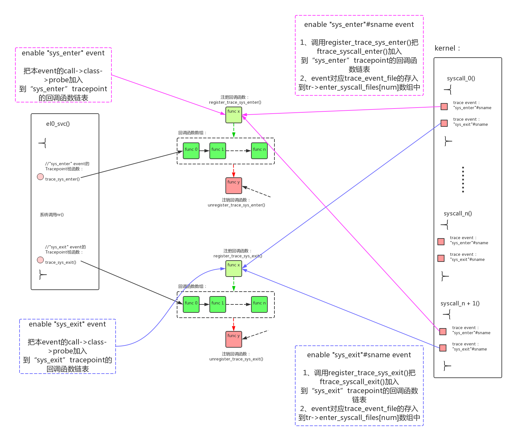
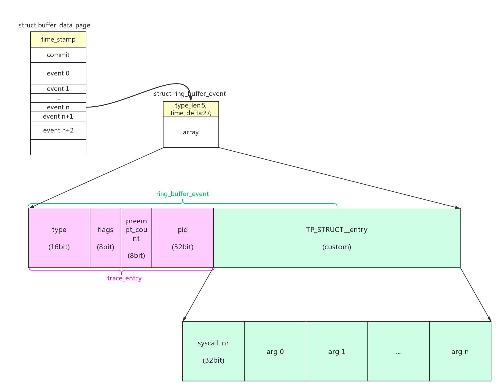
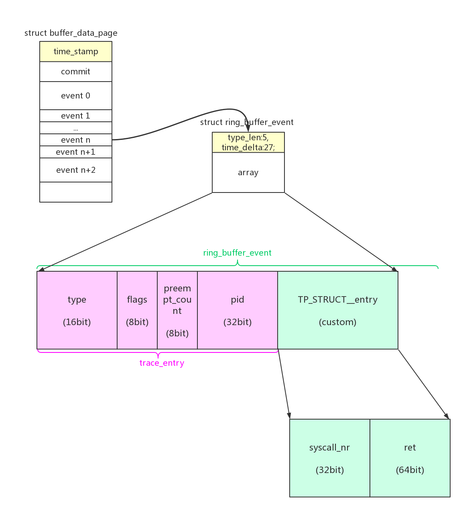

# 1、函数插桩



## 1.1、"events/raw_syscalls/sys_enter"、"events/raw_syscalls/sys_exit" trace event的插桩

在系统调用的出口、入口路径上，系统布置了两个tracepoint格式的trace event。

el0_svc为用户态系统调用的入口，arch\arm64\kernel\entry.S：

```
/*
 * EL0 mode handlers.
 */
	.align	6
el0_sync:
	kernel_entry 0
	mrs	x25, esr_el1			// read the syndrome register
	lsr	x24, x25, #ESR_ELx_EC_SHIFT	// exception class
	cmp	x24, #ESR_ELx_EC_SVC64		// SVC in 64-bit state
	b.eq	el0_svc                 // 用户态系统调用
	cmp	x24, #ESR_ELx_EC_DABT_LOW	// data abort in EL0
	b.eq	el0_da
	cmp	x24, #ESR_ELx_EC_IABT_LOW	// instruction abort in EL0
	b.eq	el0_ia
	cmp	x24, #ESR_ELx_EC_FP_ASIMD	// FP/ASIMD access
	b.eq	el0_fpsimd_acc
	cmp	x24, #ESR_ELx_EC_FP_EXC64	// FP/ASIMD exception
	b.eq	el0_fpsimd_exc
	cmp	x24, #ESR_ELx_EC_SYS64		// configurable trap
	b.eq	el0_sys
	cmp	x24, #ESR_ELx_EC_SP_ALIGN	// stack alignment exception
	b.eq	el0_sp_pc
	cmp	x24, #ESR_ELx_EC_PC_ALIGN	// pc alignment exception
	b.eq	el0_sp_pc
	cmp	x24, #ESR_ELx_EC_UNKNOWN	// unknown exception in EL0
	b.eq	el0_undef
	cmp	x24, #ESR_ELx_EC_BREAKPT_LOW	// debug exception in EL0
	b.ge	el0_dbg
	b	el0_inv

↓

/*
 * SVC handler.
 */
	.align	6
el0_svc:
	adrp	stbl, sys_call_table		// load syscall table pointer
	uxtw	scno, w8			// syscall number in w8
	mov	sc_nr, #__NR_syscalls
el0_svc_naked:					// compat entry point
	stp	x0, scno, [sp, #S_ORIG_X0]	// save the original x0 and syscall number
	enable_dbg_and_irq
	ct_user_exit 1

    /* (1) 判断当前thread_info中是否设置syscall trace标志，如果被设置走慢路径：__sys_trace 
        #define _TIF_SYSCALL_WORK	(_TIF_SYSCALL_TRACE | _TIF_SYSCALL_AUDIT | \
				 _TIF_SYSCALL_TRACEPOINT | _TIF_SECCOMP | \
				 _TIF_NOHZ)
     */
	ldr	x16, [tsk, #TI_FLAGS]		// check for syscall hooks
	tst	x16, #_TIF_SYSCALL_WORK
	b.ne	__sys_trace
	
	/* (2) 否则走syscall的快速路径 */
	cmp     scno, sc_nr                     // check upper syscall limit
	b.hs	ni_sys
	ldr	x16, [stbl, scno, lsl #3]	// address in the syscall table
	blr	x16				// call sys_* routine
	b	ret_fast_syscall
ni_sys:
	mov	x0, sp
	bl	do_ni_syscall
	b	ret_fast_syscall
ENDPROC(el0_svc)

↓

	/*
	 * This is the really slow path.  We're going to be doing context
	 * switches, and waiting for our parent to respond.
	 */
__sys_trace:
	mov	w0, #-1				// set default errno for
	cmp     scno, x0			// user-issued syscall(-1)
	b.ne	1f
	mov	x0, #-ENOSYS
	str	x0, [sp, #S_X0]
1:	mov	x0, sp
    /* (2.1) 入口处hook函数 */
	bl	syscall_trace_enter
	cmp	w0, #-1				// skip the syscall?
	b.eq	__sys_trace_return_skipped
	uxtw	scno, w0			// syscall number (possibly new)
	mov	x1, sp				// pointer to regs
	cmp	scno, sc_nr			// check upper syscall limit
	b.hs	__ni_sys_trace
	ldp	x0, x1, [sp]			// restore the syscall args
	ldp	x2, x3, [sp, #S_X2]
	ldp	x4, x5, [sp, #S_X4]
	ldp	x6, x7, [sp, #S_X6]
	ldr	x16, [stbl, scno, lsl #3]	// address in the syscall table
	/* (2.2) call系统调用 */
	blr	x16				// call sys_* routine

__sys_trace_return:
	str	x0, [sp, #S_X0]			// save returned x0
__sys_trace_return_skipped:
	mov	x0, sp
	/* (2.3) 出口处hook函数 */
	bl	syscall_trace_exit
	b	ret_to_user

__ni_sys_trace:
	mov	x0, sp
	bl	do_ni_syscall
	b	__sys_trace_return

```

继续分析syscall_trace_enter()/syscall_trace_exit() hook函数，arch/arm64/kernel/ptrace.c：

```
asmlinkage int syscall_trace_enter(struct pt_regs *regs)
{
	/* Do the secure computing check first; failures should be fast. */
	if (secure_computing() == -1)
		return -1;

    /* (1.1) 其他的通知动作 */
	if (test_thread_flag(TIF_SYSCALL_TRACE))
		tracehook_report_syscall(regs, PTRACE_SYSCALL_ENTER);

    /* (1.2) 如果有定义tracepoint，调用桩函数 */
	if (test_thread_flag(TIF_SYSCALL_TRACEPOINT))
		trace_sys_enter(regs, regs->syscallno);

	audit_syscall_entry(regs->syscallno, regs->orig_x0, regs->regs[1],
			    regs->regs[2], regs->regs[3]);

	return regs->syscallno;
}

asmlinkage void syscall_trace_exit(struct pt_regs *regs)
{
	audit_syscall_exit(regs);

    /* (2.1) 如果有定义tracepoint，调用桩函数 */
	if (test_thread_flag(TIF_SYSCALL_TRACEPOINT))
		trace_sys_exit(regs, regs_return_value(regs));

    /* (2.2) 其他的通知动作 */
	if (test_thread_flag(TIF_SYSCALL_TRACE))
		tracehook_report_syscall(regs, PTRACE_SYSCALL_EXIT);
}
```

trace_sys_enter()、trace_sys_exit()这两个tracepoint桩函数，是通过trace event定义的。在include/trace/events/syscalls.h头文件中，定义了两个标准trace event：

```
#undef TRACE_SYSTEM
#define TRACE_SYSTEM raw_syscalls
#define TRACE_INCLUDE_FILE syscalls

#if !defined(_TRACE_EVENTS_SYSCALLS_H) || defined(TRACE_HEADER_MULTI_READ)
#define _TRACE_EVENTS_SYSCALLS_H

#include <linux/tracepoint.h>

#include <asm/ptrace.h>
#include <asm/syscall.h>


#ifdef CONFIG_HAVE_SYSCALL_TRACEPOINTS

TRACE_EVENT_FN(sys_enter,

	TP_PROTO(struct pt_regs *regs, long id),

	TP_ARGS(regs, id),

	TP_STRUCT__entry(
		__field(	long,		id		)
		__array(	unsigned long,	args,	6	)
	),

	TP_fast_assign(
		__entry->id	= id;
		syscall_get_arguments(current, regs, 0, 6, __entry->args);
	),

	TP_printk("NR %ld (%lx, %lx, %lx, %lx, %lx, %lx)",
		  __entry->id,
		  __entry->args[0], __entry->args[1], __entry->args[2],
		  __entry->args[3], __entry->args[4], __entry->args[5]),

	syscall_regfunc, syscall_unregfunc
);

TRACE_EVENT_FLAGS(sys_enter, TRACE_EVENT_FL_CAP_ANY)

TRACE_EVENT_FN(sys_exit,

	TP_PROTO(struct pt_regs *regs, long ret),

	TP_ARGS(regs, ret),

	TP_STRUCT__entry(
		__field(	long,	id	)
		__field(	long,	ret	)
	),

	TP_fast_assign(
		__entry->id	= syscall_get_nr(current, regs);
		__entry->ret	= ret;
	),

	TP_printk("NR %ld = %ld",
		  __entry->id, __entry->ret),

	syscall_regfunc, syscall_unregfunc
);

TRACE_EVENT_FLAGS(sys_exit, TRACE_EVENT_FL_CAP_ANY)

#endif /* CONFIG_HAVE_SYSCALL_TRACEPOINTS */

#endif /* _TRACE_EVENTS_SYSCALLS_H */

/* This part must be outside protection */
#include <trace/define_trace.h>
```

在arch/arm64/kernel/ptrace.c文件中，需要创建对应的tracepoint：

```
#define CREATE_TRACE_POINTS
#include <trace/events/syscalls.h>
```
创建完成后，可以在events目录下看到新的event，"events/raw_syscalls/sys_enter"、"events/raw_syscalls/sys_exit"：

```
/d/tracing # ls events/raw_syscalls/
enable       filter       sys_enter/   sys_exit/
```

完成上述的步骤后，在系统调用的入口/出口分别插入了两个tracepoint：trace_sys_enter()、trace_sys_exit()。这就是1级插桩点：

- 可以通过enable "events/raw_syscalls/sys_enter"、"events/raw_syscalls/sys_exit"的方式把本trace event的trace函数加入到tracepoint的调用链表。这些会记录TP_fast_assign()中的数据到trace buffer，这个信息也能记录系统调用的进入/退出，但是这个信息比较笼统，可以使用每个系统调用本身的event来记录更详细的信息；
- 还可以手工调用register_trace_sys_enter()、register_trace_sys_exit()函数来加入更多的函数到tracepoint的调用链表中。后续就利用这个特性把具体系统调用event的函数挂载了进来；

## 1.2、syscall event的插桩

除了上面描述的1级插桩点，对每一个具体的syscall还创建了两个trace event："sys_enter"#sname、"sys_exit"#sname。include/linux/syscalls.h：

```
#ifdef CONFIG_FTRACE_SYSCALLS
#define __SC_STR_ADECL(t, a)	#a
#define __SC_STR_TDECL(t, a)	#t

extern struct trace_event_class event_class_syscall_enter;
extern struct trace_event_class event_class_syscall_exit;
extern struct trace_event_functions enter_syscall_print_funcs;
extern struct trace_event_functions exit_syscall_print_funcs;

#define SYSCALL_TRACE_ENTER_EVENT(sname)				\
	static struct syscall_metadata __syscall_meta_##sname;		\
	static struct trace_event_call __used				\
	  event_enter_##sname = {					\
		.class			= &event_class_syscall_enter,	\
		{							\
			.name                   = "sys_enter"#sname,	\
		},							\
		.event.funcs            = &enter_syscall_print_funcs,	\
		.data			= (void *)&__syscall_meta_##sname,\
		.flags                  = TRACE_EVENT_FL_CAP_ANY,	\
	};								\
	static struct trace_event_call __used				\
	  __attribute__((section("_ftrace_events")))			\
	 *__event_enter_##sname = &event_enter_##sname;

#define SYSCALL_TRACE_EXIT_EVENT(sname)					\
	static struct syscall_metadata __syscall_meta_##sname;		\
	static struct trace_event_call __used				\
	  event_exit_##sname = {					\
		.class			= &event_class_syscall_exit,	\
		{							\
			.name                   = "sys_exit"#sname,	\
		},							\
		.event.funcs		= &exit_syscall_print_funcs,	\
		.data			= (void *)&__syscall_meta_##sname,\
		.flags                  = TRACE_EVENT_FL_CAP_ANY,	\
	};								\
	static struct trace_event_call __used				\
	  __attribute__((section("_ftrace_events")))			\
	*__event_exit_##sname = &event_exit_##sname;

#define SYSCALL_METADATA(sname, nb, ...)			\
	static const char *types_##sname[] = {			\
		__MAP(nb,__SC_STR_TDECL,__VA_ARGS__)		\
	};							\
	static const char *args_##sname[] = {			\
		__MAP(nb,__SC_STR_ADECL,__VA_ARGS__)		\
	};							\
	SYSCALL_TRACE_ENTER_EVENT(sname);			\
	SYSCALL_TRACE_EXIT_EVENT(sname);			\
	static struct syscall_metadata __used			\
	  __syscall_meta_##sname = {				\
		.name 		= "sys"#sname,			\
		.syscall_nr	= -1,	/* Filled in at boot */	\
		.nb_args 	= nb,				\
		.types		= nb ? types_##sname : NULL,	\
		.args		= nb ? args_##sname : NULL,	\
		.enter_event	= &event_enter_##sname,		\
		.exit_event	= &event_exit_##sname,		\
		.enter_fields	= LIST_HEAD_INIT(__syscall_meta_##sname.enter_fields), \
	};							\
	static struct syscall_metadata __used			\
	  __attribute__((section("__syscalls_metadata")))	\
	 *__p_syscall_meta_##sname = &__syscall_meta_##sname;
#else
#define SYSCALL_METADATA(sname, nb, ...)
#endif

#define SYSCALL_DEFINE0(sname)					\
	SYSCALL_METADATA(_##sname, 0);				\
	asmlinkage long sys_##sname(void)

#define SYSCALL_DEFINE1(name, ...) SYSCALL_DEFINEx(1, _##name, __VA_ARGS__)
#define SYSCALL_DEFINE2(name, ...) SYSCALL_DEFINEx(2, _##name, __VA_ARGS__)
#define SYSCALL_DEFINE3(name, ...) SYSCALL_DEFINEx(3, _##name, __VA_ARGS__)
#define SYSCALL_DEFINE4(name, ...) SYSCALL_DEFINEx(4, _##name, __VA_ARGS__)
#define SYSCALL_DEFINE5(name, ...) SYSCALL_DEFINEx(5, _##name, __VA_ARGS__)
#define SYSCALL_DEFINE6(name, ...) SYSCALL_DEFINEx(6, _##name, __VA_ARGS__)

#define SYSCALL_DEFINEx(x, sname, ...)				\
	SYSCALL_METADATA(sname, x, __VA_ARGS__)			\
	__SYSCALL_DEFINEx(x, sname, __VA_ARGS__)

#define __PROTECT(...) asmlinkage_protect(__VA_ARGS__)
#define __SYSCALL_DEFINEx(x, name, ...)					\
	asmlinkage long sys##name(__MAP(x,__SC_DECL,__VA_ARGS__))	\
		__attribute__((alias(__stringify(SyS##name))));		\
	static inline long SYSC##name(__MAP(x,__SC_DECL,__VA_ARGS__));	\
	asmlinkage long SyS##name(__MAP(x,__SC_LONG,__VA_ARGS__));	\
	asmlinkage long SyS##name(__MAP(x,__SC_LONG,__VA_ARGS__))	\
	{								\
		long ret = SYSC##name(__MAP(x,__SC_CAST,__VA_ARGS__));	\
		__MAP(x,__SC_TEST,__VA_ARGS__);				\
		__PROTECT(x, ret,__MAP(x,__SC_ARGS,__VA_ARGS__));	\
		return ret;						\
	}								\
	static inline long SYSC##name(__MAP(x,__SC_DECL,__VA_ARGS__))
```

在使用宏SYSCALL_DEFINE0()...SYSCALL_DEFINE6()来定义系统调用时，对应的两个trace_event_call被创建： event_enter_##sname、event_exit_##sname。对应的还有一个结构被创建：__syscall_meta_##sname。这个meta数据中主要存放的是syscall的参数数据。

在syscall event初始化时，会把meta数据存放到syscalls_metadata[]数组。kernel/trace/trace_syscalls.c：

```
start_kernel() -> trace_init() -> trace_event_init() -> init_ftrace_syscalls()

↓

void __init init_ftrace_syscalls(void)
{
	struct syscall_metadata *meta;
	unsigned long addr;
	int i;

	syscalls_metadata = kcalloc(NR_syscalls, sizeof(*syscalls_metadata),
				    GFP_KERNEL);
	if (!syscalls_metadata) {
		WARN_ON(1);
		return;
	}

    /* 初始化syscalls_metadata[]数组 */
	for (i = 0; i < NR_syscalls; i++) {
	    /* 从sys_call_table[]读出系统调用的地址 */
		addr = arch_syscall_addr(i);
		
		/* 根据地址，从section("__syscalls_metadata")中找到对应的meta数据 */
		meta = find_syscall_meta(addr);
		if (!meta)
			continue;

		meta->syscall_nr = i;
		syscalls_metadata[i] = meta;
	}
}
```

上述的trace_event_call的指针同时被存储在section("_ftrace_events")当中，所以系统初始化时会在events文件夹下面自动创建对应文件夹：

```
/d/tracing # ls events/syscalls/
enable                           sys_enter_writev
filter                           sys_exit_accept
sys_enter_accept                 sys_exit_accept4
sys_enter_accept4                sys_exit_add_key
sys_enter_add_key                sys_exit_adjtimex
sys_enter_adjtimex               sys_exit_bind
sys_enter_bind                   sys_exit_brk
sys_enter_brk                    sys_exit_capget
sys_enter_capget                 sys_exit_capset
sys_enter_capset                 sys_exit_chdir
sys_enter_chdir                  sys_exit_chroot
sys_enter_chroot                 sys_exit_clock_adjtime
sys_enter_clock_adjtime          sys_exit_clock_getres
sys_enter_clock_getres           sys_exit_clock_gettime
sys_enter_clock_gettime          sys_exit_clock_nanosleep
sys_enter_clock_nanosleep        sys_exit_clock_settime
sys_enter_clock_settime          sys_exit_clone
sys_enter_clone                  sys_exit_close
sys_enter_close                  sys_exit_connect
sys_enter_connect                sys_exit_delete_module
sys_enter_delete_module          sys_exit_dup
sys_enter_dup                    sys_exit_dup3
sys_enter_dup3                   sys_exit_epoll_create1
sys_enter_epoll_create1          sys_exit_epoll_ctl
```

## 1.2、syscall event的enable

经过上面两步：
- 1、使用TRACE_EVENT_FN()标准的方法创建了两个trace event：sys_enter、sys_exit。并且其tracepoint桩函数trace_sys_enter()、trace_sys_exit()在系统调用的入口/出口被显式调用；
- 2、使用自定义的方式为每个系统调用定义了两个syscall event："sys_enter"#sname、"sys_exit"#sname。但是这两个event并没有定义桩函数，还没有调用入口；

接下来syscall event的enable操作中，会把syscall event的trace函数加入到数组中，同时把自己的桩函数通过register_trace_sys_enter()、register_trace_sys_exit()注册到1级插桩点的tracepoint。

event enable的执行路径为：ftrace_enable_fops -> event_enable_write() -> ftrace_event_enable_disable() -> __ftrace_event_enable_disable() -> call->class->reg(call, TRACE_REG_UNREGISTER/TRACE_REG_REGISTER, file);

syscall event的call->class->reg()为syscall_enter_register()/syscall_exit_register()：

```
struct trace_event_class __refdata event_class_syscall_enter = {
	.system		= "syscalls",
	.reg		= syscall_enter_register,
	.define_fields	= syscall_enter_define_fields,
	.get_fields	= syscall_get_enter_fields,
	.raw_init	= init_syscall_trace,
};

struct trace_event_class __refdata event_class_syscall_exit = {
	.system		= "syscalls",
	.reg		= syscall_exit_register,
	.define_fields	= syscall_exit_define_fields,
	.fields		= LIST_HEAD_INIT(event_class_syscall_exit.fields),
	.raw_init	= init_syscall_trace,
};

↓

static int syscall_enter_register(struct trace_event_call *event,
				 enum trace_reg type, void *data)
{
	struct trace_event_file *file = data;

	switch (type) {
	case TRACE_REG_REGISTER:
		return reg_event_syscall_enter(file, event);
	case TRACE_REG_UNREGISTER:
		unreg_event_syscall_enter(file, event);
		return 0;

#ifdef CONFIG_PERF_EVENTS
	case TRACE_REG_PERF_REGISTER:
		return perf_sysenter_enable(event);
	case TRACE_REG_PERF_UNREGISTER:
		perf_sysenter_disable(event);
		return 0;
	case TRACE_REG_PERF_OPEN:
	case TRACE_REG_PERF_CLOSE:
	case TRACE_REG_PERF_ADD:
	case TRACE_REG_PERF_DEL:
		return 0;
#endif
	}
	return 0;
}

↓

static int reg_event_syscall_enter(struct trace_event_file *file,
				   struct trace_event_call *call)
{
	struct trace_array *tr = file->tr;
	int ret = 0;
	int num;

	num = ((struct syscall_metadata *)call->data)->syscall_nr;
	if (WARN_ON_ONCE(num < 0 || num >= NR_syscalls))
		return -ENOSYS;
	mutex_lock(&syscall_trace_lock);
	
	/* (1) 调用register_trace_sys_enter()把ftrace_syscall_enter()注册成“sys_enter”tracepoint的回调函数 */
	if (!tr->sys_refcount_enter)
		ret = register_trace_sys_enter(ftrace_syscall_enter, tr);
	/* (2) 同时把event对应trace_event_file的存入到tr->enter_syscall_files[num]数组中 */
	if (!ret) {
		rcu_assign_pointer(tr->enter_syscall_files[num], file);
		tr->sys_refcount_enter++;
	}
	mutex_unlock(&syscall_trace_lock);
	return ret;
}
```


# 2、数据存入

syscall enter event的数据存入路径为：ftrace_syscall_enter()：

```
static void ftrace_syscall_enter(void *data, struct pt_regs *regs, long id)
{
	struct trace_array *tr = data;
	struct trace_event_file *trace_file;
	struct syscall_trace_enter *entry;
	struct syscall_metadata *sys_data;
	struct ring_buffer_event *event;
	struct ring_buffer *buffer;
	unsigned long irq_flags;
	int pc;
	int syscall_nr;
	int size;

	syscall_nr = trace_get_syscall_nr(current, regs);
	if (syscall_nr < 0 || syscall_nr >= NR_syscalls)
		return;

	/* Here we're inside tp handler's rcu_read_lock_sched (__DO_TRACE) */
	/* (1) 如果syscall_nr对应tr->enter_syscall_files[]数组中的trace_file为空，
	    说明对应的syscall event还没有被enable，返回
	 */
	trace_file = rcu_dereference_sched(tr->enter_syscall_files[syscall_nr]);
	if (!trace_file)
		return;

    /* (2) 如果当前event的trigger没有组合filter条件：
        1、无条件执行trigger command；
        2、如果是soft disable模式，直接返回；
        3、判断pid filter；
     */
	if (trace_trigger_soft_disabled(trace_file))
		return;

    /* (3) 根据syscall_nr获取到对应的meta数据 */
	sys_data = syscall_nr_to_meta(syscall_nr);
	if (!sys_data)
		return;

    /* (4) 计算trace数据的总长度 */
	size = sizeof(*entry) + sizeof(unsigned long) * sys_data->nb_args;

	local_save_flags(irq_flags);
	pc = preempt_count();

    /* (5) 根据长度分配ringbuffer空间 */
	buffer = tr->trace_buffer.buffer;
	event = trace_buffer_lock_reserve(buffer,
			sys_data->enter_event->event.type, size, irq_flags, pc);
	if (!event)
		return;

    /* (6) 存储trace头部信息 */
	entry = ring_buffer_event_data(event);
	entry->nr = syscall_nr;
	
	/* (7) 存储系统调用参数信息 */
	syscall_get_arguments(current, regs, 0, sys_data->nb_args, entry->args);

    /* (8) 提交确认trace数据 */
	event_trigger_unlock_commit(trace_file, buffer, event, entry,
				    irq_flags, pc, 0);
}
```

syscall exit event的数据存入路径为：ftrace_syscall_exit()：

```
static void ftrace_syscall_exit(void *data, struct pt_regs *regs, long ret)
{
	struct trace_array *tr = data;
	struct trace_event_file *trace_file;
	struct syscall_trace_exit *entry;
	struct syscall_metadata *sys_data;
	struct ring_buffer_event *event;
	struct ring_buffer *buffer;
	unsigned long irq_flags;
	int pc;
	int syscall_nr;

	syscall_nr = trace_get_syscall_nr(current, regs);
	if (syscall_nr < 0 || syscall_nr >= NR_syscalls)
		return;

	/* Here we're inside tp handler's rcu_read_lock_sched (__DO_TRACE()) */
	/* (1) 如果syscall_nr对应tr->enter_syscall_files[]数组中的trace_file为空，
	    说明对应的syscall event还没有被enable，返回
	 */
	trace_file = rcu_dereference_sched(tr->exit_syscall_files[syscall_nr]);
	if (!trace_file)
		return;

    /* (2) 如果当前event的trigger没有组合filter条件：
        1、无条件执行trigger command；
        2、如果是soft disable模式，直接返回；
        3、判断pid filter；
     */
	if (trace_trigger_soft_disabled(trace_file))
		return;

    /* (3) 根据syscall_nr获取到对应的meta数据 */
	sys_data = syscall_nr_to_meta(syscall_nr);
	if (!sys_data)
		return;

	local_save_flags(irq_flags);
	pc = preempt_count();

    /* (4) 根据长度分配ringbuffer空间 */
	buffer = tr->trace_buffer.buffer;
	event = trace_buffer_lock_reserve(buffer,
			sys_data->exit_event->event.type, sizeof(*entry),
			irq_flags, pc);
	if (!event)
		return;

    /* (5) 存储trace头部信息 */
	entry = ring_buffer_event_data(event);
	entry->nr = syscall_nr;
	entry->ret = syscall_get_return_value(current, regs);

    /* (6) 提交确认trace数据 */
	event_trigger_unlock_commit(trace_file, buffer, event, entry,
				    irq_flags, pc, 0);
}
```

## 2.1、数据格式

syscall enter event的数据格式：




syscall exit event的数据格式：




## 2.2、filter

trigger、filter和普通的trace event操作一致，请参考：[trace event](https://blog.csdn.net/pwl999/article/details/80514271)

# 3、数据取出

1、从trace文件读出的“raw_syscalls/sys_enter、sys_exit” event数据格式为：

```
/d/tracing # echo 1 > events/raw_syscalls/sys_enter/enable
/d/tracing # echo 1 > events/raw_syscalls/sys_exit/enable
/d/tracing # echo 1 > tracing_on && sleep 0.1 && echo 0 > tracing_on && cat trace                <
# tracer: nop
#
# entries-in-buffer/entries-written: 444/444   #P:8
#
#                              _-----=> irqs-off
#                             / _----=> need-resched
#                            | / _---=> hardirq/softirq
#                            || / _--=> preempt-depth
#                            ||| /     delay
#           TASK-PID   CPU#  ||||    TIMESTAMP  FUNCTION
#              | |       |   ||||       |         |
              sh-17289 [000] ...1 79984.003374: sys_exit: NR 64 = 2
              sh-17289 [000] ...1 79984.003432: sys_enter: NR 24 (b, 1, 0, 7f8180c848, 7f81a02140, 7f8180c810)
              sh-17289 [000] ...1 79984.003448: sys_exit: NR 24 = 1
              sh-17289 [000] ...1 79984.003531: sys_enter: NR 57 (b, 1, 0, 7f8180c848, 7f81a02140, 7f8180c810)
              sh-17289 [000] ...1 79984.003541: sys_exit: NR 57 = 0
              sh-17289 [000] ...1 79984.003584: sys_enter: NR 135 (0, 7ff1b4f370, 7ff1b4f368, 8, 7f81842c48, 5585179558)
              sh-17289 [000] ...1 79984.003599: sys_exit: NR 135 = 0
              sh-17289 [000] ...1 79984.003608: sys_enter: NR 72 (1, 0, 0, 0, 7ff1b4f348, 0)
            adbd-2165  [000] ...1 79984.004539: sys_exit: NR 73 = 1
            adbd-2165  [000] ...1 79984.004643: sys_enter: NR 63 (40, 7f7e83cd30, 1000, ffffffffffffffff, 1, 7f7e801080)
            adbd-2165  [000] ...1 79984.004688: sys_exit: NR 63 = 3
            adbd-2165  [000] ...1 79984.004695: sys_enter: NR 63 (40, 7f7e83cd33, ffd, ffffffffffffffff, 1, 7f7e801080)
            adbd-2165  [000] ...1 79984.004716: sys_exit: NR 63 = -11
```

使用标准的trace event定义，不管实际的参数情况怎么样？只能固定的保存和打印6个参数。

2、从trace文件读出的syscall event数据格式为：

```
/d/tracing # echo 1 > events/syscalls/sys_enter_ioctl/enable
/d/tracing # echo 1 > events/syscalls/sys_exit_ioctl/enable
/d/tracing # echo 1 > tracing_on && sleep 0.1 && echo 0 > tracing_on && cat trace                <
# tracer: nop
#
# entries-in-buffer/entries-written: 20/20   #P:8
#
#                              _-----=> irqs-off
#                             / _----=> need-resched
#                            | / _---=> hardirq/softirq
#                            || / _--=> preempt-depth
#                            ||| /     delay
#           TASK-PID   CPU#  ||||    TIMESTAMP  FUNCTION
#              | |       |   ||||       |         |
  ndroid.systemu-2205  [002] ...1 80386.902170: sys_ioctl(fd: c, cmd: c0306201, arg: 7fcd124d98)
  ndroid.systemu-2205  [002] ...1 80386.902451: sys_ioctl -> 0x0
    Binder:705_1-729   [002] ...1 80386.902726: sys_ioctl -> 0x0
    Binder:705_1-729   [002] ...1 80386.903279: sys_ioctl(fd: 3, cmd: c0306201, arg: 7f8cb01278)
  ndroid.systemu-2205  [002] ...1 80386.923984: sys_ioctl(fd: c, cmd: c0306201, arg: 7fcd124d98)
  ndroid.systemu-2205  [002] ...1 80386.924235: sys_ioctl -> 0x0
    Binder:705_2-734   [002] ...1 80386.924461: sys_ioctl -> 0x0
    Binder:705_2-734   [002] ...1 80386.925079: sys_ioctl(fd: 3, cmd: c0306201, arg: 7f8c5ff278)
  ndroid.systemu-2205  [000] ...1 80386.946114: sys_ioctl(fd: c, cmd: c0306201, arg: 7fcd124d98)
  ndroid.systemu-2205  [000] ...1 80386.946509: sys_ioctl -> 0x0
    Binder:705_4-2097  [003] ...1 80386.946808: sys_ioctl -> 0x0
    Binder:705_4-2097  [003] ...1 80386.947736: sys_ioctl(fd: 3, cmd: c0306201, arg: 7f875ea278)
  ndroid.systemu-2205  [002] ...1 80386.971698: sys_ioctl(fd: c, cmd: c0306201, arg: 7fcd124d98)
  ndroid.systemu-2205  [002] ...1 80386.972105: sys_ioctl -> 0x0
    Binder:705_5-2187  [002] ...1 80386.972505: sys_ioctl -> 0x0
    Binder:705_5-2187  [002] ...1 80386.973480: sys_ioctl(fd: 3, cmd: c0306201, arg: 7f855ea278)
  ndroid.systemu-2205  [003] ...1 80386.996473: sys_ioctl(fd: c, cmd: c0306201, arg: 7fcd124d98)
  ndroid.systemu-2205  [003] ...1 80386.996918: sys_ioctl -> 0x0
    Binder:705_3-867   [003] ...1 80386.997305: sys_ioctl -> 0x0
    Binder:705_3-867   [003] ...1 80386.998270: sys_ioctl(fd: 3, cmd: c0306201, arg: 7f87102278)
```

在syscall event定义时给.event.funcs赋值，syscall enter event使用enter_syscall_print_funcs，syscall exit event使用exit_syscall_print_funcs：

```
#define SYSCALL_TRACE_ENTER_EVENT(sname)				\
	static struct syscall_metadata __syscall_meta_##sname;		\
	static struct trace_event_call __used				\
	  event_enter_##sname = {					\
		.class			= &event_class_syscall_enter,	\
		{							\
			.name                   = "sys_enter"#sname,	\
		},							\
		.event.funcs            = &enter_syscall_print_funcs,	\
		.data			= (void *)&__syscall_meta_##sname,\
		.flags                  = TRACE_EVENT_FL_CAP_ANY,	\
	};								\
	static struct trace_event_call __used				\
	  __attribute__((section("_ftrace_events")))			\
	 *__event_enter_##sname = &event_enter_##sname;

#define SYSCALL_TRACE_EXIT_EVENT(sname)					\
	static struct syscall_metadata __syscall_meta_##sname;		\
	static struct trace_event_call __used				\
	  event_exit_##sname = {					\
		.class			= &event_class_syscall_exit,	\
		{							\
			.name                   = "sys_exit"#sname,	\
		},							\
		.event.funcs		= &exit_syscall_print_funcs,	\
		.data			= (void *)&__syscall_meta_##sname,\
		.flags                  = TRACE_EVENT_FL_CAP_ANY,	\
	};								\
	static struct trace_event_call __used				\
	  __attribute__((section("_ftrace_events")))			\
	*__event_exit_##sname = &event_exit_##sname;
	
↓

struct trace_event_functions enter_syscall_print_funcs = {
	.trace		= print_syscall_enter,
};

struct trace_event_functions exit_syscall_print_funcs = {
	.trace		= print_syscall_exit,
};
```

在数据读出时，会调用到event对应的event->funcs->trace()函数，seq_read() -> s_show() -> print_trace_line() -> print_trace_fmt() -> event->funcs->trace()：


syscall enter event对应print_syscall_enter：

```
static enum print_line_t
print_syscall_enter(struct trace_iterator *iter, int flags,
		    struct trace_event *event)
{
	struct trace_array *tr = iter->tr;
	struct trace_seq *s = &iter->seq;
	struct trace_entry *ent = iter->ent;
	struct syscall_trace_enter *trace;
	struct syscall_metadata *entry;
	int i, syscall;

	trace = (typeof(trace))ent;
	syscall = trace->nr;
	entry = syscall_nr_to_meta(syscall);

	if (!entry)
		goto end;

	if (entry->enter_event->event.type != ent->type) {
		WARN_ON_ONCE(1);
		goto end;
	}

    /* (1) 打印syscall name */
	trace_seq_printf(s, "%s(", entry->name);

    /* (2) 逐个打印syscal调用参数 */
	for (i = 0; i < entry->nb_args; i++) {

		if (trace_seq_has_overflowed(s))
			goto end;

		/* parameter types */
		if (tr->trace_flags & TRACE_ITER_VERBOSE)
			trace_seq_printf(s, "%s ", entry->types[i]);

		/* parameter values */
		trace_seq_printf(s, "%s: %lx%s", entry->args[i],
				 trace->args[i],
				 i == entry->nb_args - 1 ? "" : ", ");
	}

	trace_seq_putc(s, ')');
end:
	trace_seq_putc(s, '\n');

	return trace_handle_return(s);
}
```

syscall exit event对应print_syscall_exit：

```
static enum print_line_t
print_syscall_exit(struct trace_iterator *iter, int flags,
		   struct trace_event *event)
{
	struct trace_seq *s = &iter->seq;
	struct trace_entry *ent = iter->ent;
	struct syscall_trace_exit *trace;
	int syscall;
	struct syscall_metadata *entry;

	trace = (typeof(trace))ent;
	syscall = trace->nr;
	entry = syscall_nr_to_meta(syscall);

	if (!entry) {
		trace_seq_putc(s, '\n');
		goto out;
	}

	if (entry->exit_event->event.type != ent->type) {
		WARN_ON_ONCE(1);
		return TRACE_TYPE_UNHANDLED;
	}

    /* (1) 打印syscall name和返回值 */
	trace_seq_printf(s, "%s -> 0x%lx\n", entry->name,
				trace->ret);

 out:
	return trace_handle_return(s);
}
```


# 参考资料：

[1、Linux内核跟踪之syscall tracer](http://blog.chinaunix.net/uid-20543183-id-1930847.html)