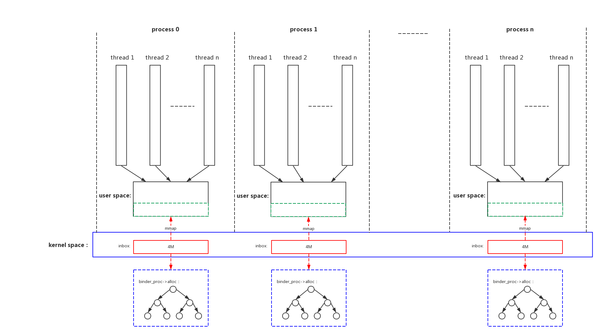
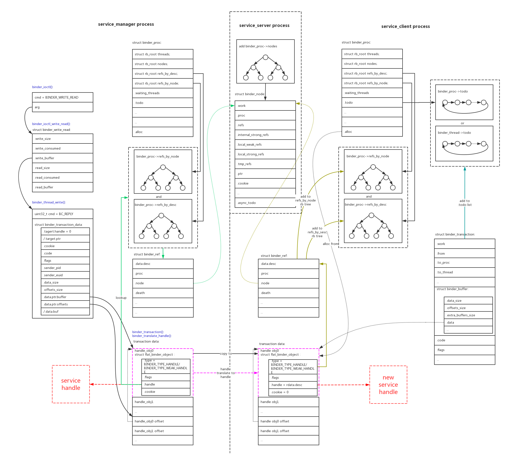
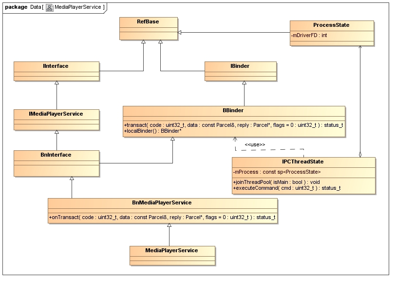

# 1、binder原理

纵观现有市面上所有讲binder的文章，都存在一个最大的问题：没有讲清楚binder对象是什么？  
不清楚binder对象是什么，那就不能理解handle是什么？不能理解什么时候是binder什么时候是handle，那就不能真正理解整个IPC的通讯过程。

我们首先回到binder的目的，就是IPC(Inter-Process Communication)进程间通讯。那么怎么样实现进程间通讯呢？要素有三个：

- 函数指针；
- 函数参数；
- 函数返回值；

binder通讯的本质实际上非常简单，就是client、server双方在共享内存的基础上封装成自定义api函数，并无神奇之处。我们看看他是怎么和IPC三要素对应上的：

## 1.1、IPC函数指针

binder的service_server可以向service_client提供service服务，但反过来不行。所以binder service其实是单向的，只有service_server端才能提供service函数，且函数只能在service_server端运行。

大部分情况下：**service_server端提供的一组IPC服务本地函数**，就是**binder对象**。

例如，mediaserver注册的一系列service中的一个"media.player"：

```
/frameworks/av/media/mediaserver/main_mediaserver.cpp:
int main(int argc __unused, char **argv __unused)
{
    MediaPlayerService::instantiate();
}
↓

/frameworks/av/media/libmediaplayerservice/MediaPlayerService.cpp:
void MediaPlayerService::instantiate() {
    defaultServiceManager()->addService(
            String16("media.player"), new MediaPlayerService());
}
```

service_server提供了一组可以在server本地运行的函数，即**binder对象**。如下：

```
/frameworks/av/media/libmedia/IMediaPlayerService.cpp:
status_t BnMediaPlayerService::onTransact(
    uint32_t code, const Parcel& data, Parcel* reply, uint32_t flags)
{
    switch (code) {
        case CREATE: {
            CHECK_INTERFACE(IMediaPlayerService, data, reply);
            sp<IMediaPlayerClient> client =
                interface_cast<IMediaPlayerClient>(data.readStrongBinder());
            audio_session_t audioSessionId = (audio_session_t) data.readInt32();
            sp<IMediaPlayer> player = create(client, audioSessionId);
            reply->writeStrongBinder(IInterface::asBinder(player));
            return NO_ERROR;
        } break;
        case CREATE_MEDIA_RECORDER: {
            CHECK_INTERFACE(IMediaPlayerService, data, reply);
            const String16 opPackageName = data.readString16();
            sp<IMediaRecorder> recorder = createMediaRecorder(opPackageName);
            reply->writeStrongBinder(IInterface::asBinder(recorder));
            return NO_ERROR;
        } break;

        ...
    }
}
```

在service_client端可以通过**handle**来引用这个**binder对象**，还封装了一系列与之对应的函数来组织数据。但是这些函数实际上是通讯用的，函数的实际功能并不能在client本地执行：

```
/frameworks/av/media/libmedia/IMediaPlayerService.cpp:
class BpMediaPlayerService: public BpInterface<IMediaPlayerService>
{
public:

    virtual sp<IMediaPlayer> create(
            const sp<IMediaPlayerClient>& client, audio_session_t audioSessionId) {
        Parcel data, reply;
        data.writeInterfaceToken(IMediaPlayerService::getInterfaceDescriptor());
        data.writeStrongBinder(IInterface::asBinder(client));
        data.writeInt32(audioSessionId);

        remote()->transact(CREATE, data, &reply);
        return interface_cast<IMediaPlayer>(reply.readStrongBinder());
    }

    virtual sp<IMediaRecorder> createMediaRecorder(const String16 &opPackageName)
    {
        Parcel data, reply;
        data.writeInterfaceToken(IMediaPlayerService::getInterfaceDescriptor());
        data.writeString16(opPackageName);
        remote()->transact(CREATE_MEDIA_RECORDER, data, &reply);
        return interface_cast<IMediaRecorder>(reply.readStrongBinder());
    }

    ...
};
```

所以理解**binder对象**和**handle**是非常关键的。service_server端需要在本地执行函数，所以执行时函数调用的3要素(函数、参数、返回值)都必须是本地的，所以它必须拥有一组函数的**binder对象**；service_client端不需要在本地执行，所以它没有函数集的**binder对象**，它只有函数集的远端引用**handle**。


binder通讯的3个主角：service_mannager、service_server、service_client。在各种场景下，分别的**binder对象**和**handle**关系如下：


<table border="1">
<caption> binder object_handle </caption>

<tr>
<th style="width: 200px;">场景</th>
<th style="width: 400px;">client</th>
<th style="width: 400px;">server</th>
</tr>

<tr>
<td> service_manage初始化 </td>
<td>
service_manager:<br/><br/>
本地的binder对象为svcmgr_handler()函数集；<br/>
通过ioctl BINDER_SET_CONTEXT_MGR命令把该binder对象注册成全局handle0；<br/>
</td>
<td>
binder device：<br/><br/>
创建handle0引用，指向service_manager
</td>
</tr>

<tr>
<td> service_server的addService </td>
<td>
service_server:<br/><br/>
target handle：handle0<br/>
data：binder对象为一组本地service函数集；<br/>
</td>
<td>
service_manager：<br/><br/>
binder驱动会创建对该binder对象的引用handle<br/>
通过SVC_MGR_ADD_SERVICE命令把该handle加入到service_manage的handle链表中；<br/>
</td>
</tr>

<tr>
<td> service_client的get_service </td>
<td>
service_client:<br/><br/>
target handle：handle0<br/>
data：service name。整个过程中没有binder对象的参与。<br/>
向service_manager获取service_server的service函数的handle；<br/>
</td>
<td>
service_manage：<br/><br/>
SVC_MGR_GET_SERVICE命令，通过service的name在service_manage的handle链表中查找对应的handle，并且把handle返回给service_client；<br/>
这样对于service_server的binder对象，service_client和service_manage都持有它的handle了；
</td>
</tr>

<tr>
<td> service_client调用service </td>
<td>
service_client:<br/><br/>
target handle：serive handle0。上一步获取的handle。<br/>
data：调用参数。调用参数中也可能包含handle/binder对象。(看server端的处理)<br/>
</td>
<td>
service_server：<br/><br/>
驱动把target handle翻译成本地binder对象，调用对象提供的本地函数。<br/>
对于data中可能包含的含handle/binder对象的处理：<br/>
1、如果包含的handle是本进程binder的引用，把它翻译成本地binder，在本地可以运行；<br/>
2、如果包含的handle不是本进程binder的引用，只能给它创建一份新的引用handle。这个handle也不能在server进程中运行，只能向其他service_server请求服务；<br/>
3、不可能包含binder对象，因为client进程的binder对象在service_server进程中无法运行；<br/>
</td>
</tr>

</table>

衍生出的原则如下：

- service_server类的进程只有**binder对象**，没有**handle**(除了handle0)，因为它所有操作都必须本地执行，引用远程对象毫无意义；
- service_client类的进程只有**handle**，没有**binder对象**，因为它需要远程执行service不需要本地执行；
- service_mannager进程同时有**binder对象**和**handle**，它本地**binder对象**的作用就是操作所有其他进程的**handle**；


## 1.2、IPC函数参数

如上一节描述，service_client可以通过名字向service_manage查询得到handle。这个handle就相当于远程的函数集指针。  
但是对于一个函数调用，我们除了需要函数指针，还需要传递参数。  

binder使用parcel方式来打包函数参数和返回值。parcel可以用来传递几种类型的数据：

- 普通类型的少量数据；
- binder对象/handle(struct flat_binder_object);
- fd(struct binder_fd_object)；

下面详细描述每种情况的parcel包格式和承载的内容。

- 1、普通类型的少量数据：

这种普通类型(int/long/string...)的少量数据存储最为简单，存入时按照一定的顺序存入，取出时按照数据的排列格式取出即可。

- 2、**binder对象**/**handle**(struct flat_binder_object)：

这一类型数据的parcel包格式如下： 


可以看到这种类型的parcel包中包含了两种数据：data0/data1/...是普通类型数据；binder_obj0/binder_obj1/...是binder对象，binder_obj0 offset/binder_obj1 offset/...指出了了binder对象在parcel包中的偏移；

binder对象和handle共用结构体struct flat_binder_object。

上一节说过**binder对象**其实就是一组函数的指针，但是一个指针只需要一个long类型就可以标识了，为什么还需要用一个结构体struct flat_binder_object来传递。我理解下来主要的思想如下：使用binder都是面向对象语言c++/java，它们把函数组也要实例化成一个对象，一个对象只有被引用时才不会被回收，远程引用也需要让本地引用加1。

一组service函数，对本地进程来说就是binder，对其他需要使用的进程来说需要远程引用，就是handle，是一对多的关系。关系图如下：


binder object是service_server的一个“local binder object”，service_manager和service_client创建了多个远程引用“remote handle”。

这个其实就是binder的核心思想，binder花费了大量的代码在维护这个关系上面：

- [x] service_server进程在驱动中创建了binder_node节点来保存**binder对象**，把本进程所有的binder_node都挂载在一颗红黑树proc->nodes上；
- [x] service_manager和service_client每个新进程对这个**binder对象**引用，就创建一个新的binder_ref，它的值就是**handle**，并回指向binder_node。并且把本进程对其他service_server的引用都挂载到两颗红黑树proc->refs_by_node/proc->refs_by_desc上。并且远程引用会增加service_server进程关于**binder对象**的引用计数；

binder驱动负责建立起**binder对象**和**handle**之间的映射关系，创建上述的数据结构，并负责翻译：

- [x] service_server把本地**binder对象**向service_manager注册。会在service_manager进程本地建立起binder_node，驱动会在service_manager进程中建立起对应的binder_ref引用，那么service_manager进程能看到的其实就是本进程对service_server**binder对象**的一个引用，并不能看到**binder对象**原始值；
- [x] service_client根据名字向service_manager查询service。service_manager会返回本进程的handle，在内核中该handle会转换成**binder对象**binder_node。因为service_client不是service的本地进程，所以service_client不能得到**binder对象**，它只能得到引用**handle**。所以再针对service的**binder对象**创建一份service_client进程的本地引用；
- [x] service_client调用远程service_server的service。内核判断handle引用是service_server的本地对象，就把handle转换成service_server的**binder对象**；

- 3、fd(struct binder_fd_object)：

parcel还能传输文件句柄fd，此时的包格式如下：


传输fd的意义何在呢？当binder的两个进程间需要传输大量的数据。例如：图像声音数据、或者是一个对象。可以在匿名共享内存(Ashmem)中创建一块区域，源进程会得到一个相应的fd，再把这个fd使用binder传递给目的进程，就可以共享数据了。

需要特别说明的是对象的传递，在同一个进程内进行函数调用的话，参数对象通常是使用引用的方式传递的。但是如果是跨进程的调用，是没有办法引用的，只有把整个对象复制过去。这种操作叫做对象的序列化，java称为Serializable，android有优化的实现Parcelable。注意对象序列化的Parcelable和binder的parcel数据封装不是一回事，尽管他们原理上很相似。binder并没有提供对象Parcelable的接口，如果我们要跨进程传输对象，只能把对象序列化(Parcelable)到匿名共享内存中，再把对应fd通过binder传输给目的进程。


binder驱动在检测到传输的是fd，会在新的进程中分配一个新的fd，并指向原来的file结构，这样fd就被跨进程duplicate了。两个进程使用各自的fd对匿名共享内存区域进行mmap映射，就能访问相同的内存区域了。

## 1.3、IPC函数返回值

函数返回值也是使用和函数参数一样的parcel结构来封装数据的。就不再重复叙述。

上面提到的原则需要再次强调，在一次service_client和service_server之间的通讯，在传递参数和返回值时都要遵循的准则：service_client只会有**handle**，service_server只会有**binder对象**。

## 1.4、binder内存

前面说过binder通讯的本质就是在共享内存上加上一层api，我们来看看他是怎么管理共享内存的。



我们可以看到：
- binder驱动给每个进程分配最多4M的buffer空间，这段空间在内核通过binder_proc->alloc红黑树来管理，同时通过mmap映射到进程用户空间；
- 和所有的进程通讯机制类似，这段空间相当于进程的接收邮箱inbox，其他进程发过来的消息会从其他进程用户空间复制存放到这里；
- 因为是mmap的所有本进程的用户空间访问免除了一次拷贝；
- 另外因为进程支持多个线程，所以多个线程会共享本进程的binder buffer；


我们看一下process 0、process n进程和process 1进程进行binder通讯时的buffer使用情况：

- 首先会在process 1进程的inbox(binder buffer)空间中分配buffer；
- binder驱动把process 0、process n进程用户空间的消息拷贝到process 1进程的inbox内核buffer中；
- 因为mmap，process 1进程的用户空间也可以看见这些消息了；


# 2、binder驱动

驱动是整个binder通讯的核心，java和native都是对其的封装。  
因为binder驱动代码比较繁杂，看代码比较不好理解。结合第一章讲的基础知识和binder通讯具体场景，我们使用图来分析每一个典型场景下binder驱动内的变化。

## 2.1、service_manager的初始化


通过上图我们可以看到具体过程：

- 1、binder驱动为service_manager进程创建一个新的binder_node结构，赋值：.ptr=0、.cookie=0、.proc=当前proc；
- 2、把这个binder_node新节点加入到当前进程的proc->nodes红黑树中；
- 3、把binder_device的全局handle 0指针binder_device->context.binder_context_mgr_node指向新创建的binder_node；这样其他人通过handle 0指针就能找到对应binder_node，进一步找到service_manager是哪一个进程；

service_manager代码在[service_manager.c](http://androidxref.com/8.1.0_r33/xref/frameworks/native/cmds/servicemanager/service_manager.c)、[binder.c](http://androidxref.com/8.1.0_r33/xref/frameworks/native/cmds/servicemanager/binder.c)，可以具体查看。初始化过程为：

```
main() -> binder_open()、binder_become_context_manager()
```

## 2.2、service_server的addService


通过上图我们可以看到，在service_server向service_manager注册service的时候，在驱动中的具体流程如下：

- 1、因为是向service_manager注册，所以target handle固定=0。通过binder_device->context找到handle 0对应的binder_node，也就找到了对应的binder_proc，找到了对应的service_manager进程；
- 2、在service_manager进程中分配binder buffer，把service_server传递过来的parcel数据全部复制进去；
- 3、翻译parcel数据中的binder对象，把binder翻译成handle；
- 4、可以看到service_manager进程的handle就是对service_server进程binder的一个引用。把handle加入到service_manager进程的handle缓存红黑树中；
- 5、把翻译后的parcel数据和其他信息打包成binder_transaction结构，并挂载到service_manager进程的proc->todo/thread->todo链表中，等待service_manager进程的读取；

service_manager的读取响应和reply动作就不去具体分析了，因为都非常的清晰。service_manager代码在[service_manager.c](http://androidxref.com/8.1.0_r33/xref/frameworks/native/cmds/servicemanager/service_manager.c)、[binder.c](http://androidxref.com/8.1.0_r33/xref/frameworks/native/cmds/servicemanager/binder.c)，可以具体查看。service_manager在svcmgr_handler()函数中响应service_server的SVC_MGR_ADD_SERVICE请求，最终调用do_add_service()把handle和对应的service name加到svclist链表中：

```
main() -> binder_loop() -> binder_parse() -> svcmgr_handler() -> do_add_service()
```

## 2.3、service_client的get service


如上图service_client向service_manager发送get service请求的数据比较简单：

- 1、根据handle 0找到service_manager进程；
- 2、在service_manager进程中分配binder buffer，把service_client传递过来的parcel数据全部复制进去；
- 3、parcel的内容中没有binder或者handle，不需要翻译；
- 4、把parcel数据和其他信息打包成binder_transaction结构，并挂载到proc->todo/thread->todo链表中，等待service_manager进程的读取；



上图是service_manager给service_client回复信息的过程：

- 1、service_manager根据service name在本地svclist链表中找到对应的handle，它把handle打包进parcel并reply给service_client；
- 2、根据service_manager所在线程thread->transaction_stack字段中保存的binder_transaction结构，从.from字段可以找到service_client所在的线程(binder_thread)和进程(binder_proc)；
- 3、在service_client进程中分配binder buffer，把service_manager传递过来的parcel数据全部复制进去；
- 4、翻译parcel中打包的handle结构，判断handle指向的binder_node进程不是service_client进程，所以新建service_client进程中对binder_node新的引用。新创建handle并加入到service_client进程的handle缓存红黑树中；
- 5、这样service_client就从service_manager中获取到了service_server binder对应的引用handle；
- 6、把翻译后的parcel数据和其他信息打包成binder_transaction结构，并挂载到service_client进程的proc->todo/thread->todo链表中，等待service_client进程读取reply；


## 2.4、service_client调用service


上图是service_client调用service_server的service的过程：

- 1、service_client的target handle为上一步向service_manager查询得到的handle，根据handle能找到对应binder_node，进一步找到service_server所在进程；
- 2、在service_server进程中分配binder buffer，把service_client传递过来的parcel数据全部复制进去；
- 3、parcel中打包了函数参数，如果包含handle对象，需要进行翻译；不可能包含binder对象，因为service_client进程的binder对象在service_server进程中无法运行；
- 4、如果parcel中包含的handle指向的binder_noe和service_server是同一进程，把它翻译成本地binder，在本地可以运行；
- 5、如果parcel中包含的handle指向的binder_noe和service_server不是同一进程，那只能在service_server进程中给它创建一份新的引用handle。这个handle也不能在service_server进程中运行，只能向其他service_server请求服务；
- 6、把翻译后的parcel数据和其他信息打包成binder_transaction结构，并挂载到service_client进程的proc->todo/thread->todo链表中，等待service_client进程读取reply；


## 2.5、Scatter-gather模式

在Android O中binder增加了一种性能改进模式Scatter-gather，这是因为binder在传输IPC参数数据时，因为传输的量不大，binder实际上做了3次拷贝：


Scatter-gather把3次copy优化成1次：


具体的代码可以看驱动对BINDER_TYPE_PTR类型数据的处理：

```
		case BINDER_TYPE_PTR: {
			struct binder_buffer_object *bp =
				to_binder_buffer_object(hdr);
			size_t buf_left = sg_buf_end - sg_bufp;

			if (bp->length > buf_left) {
				binder_user_error("%d:%d got transaction with too large buffer\n",
						  proc->pid, thread->pid);
				return_error = BR_FAILED_REPLY;
				return_error_param = -EINVAL;
				return_error_line = __LINE__;
				goto err_bad_offset;
			}
			if (copy_from_user(sg_bufp,
					   (const void __user *)(uintptr_t)
					   bp->buffer, bp->length)) {
				binder_user_error("%d:%d got transaction with invalid offsets ptr\n",
						  proc->pid, thread->pid);
				return_error_param = -EFAULT;
				return_error = BR_FAILED_REPLY;
				return_error_line = __LINE__;
				goto err_copy_data_failed;
			}
			/* Fixup buffer pointer to target proc address space */
			bp->buffer = (uintptr_t)sg_bufp +
				binder_alloc_get_user_buffer_offset(
						&target_proc->alloc);
			sg_bufp += ALIGN(bp->length, sizeof(u64));

			ret = binder_fixup_parent(t, thread, bp, off_start,
						  offp - off_start,
						  last_fixup_obj,
						  last_fixup_min_off);
			if (ret < 0) {
				return_error = BR_FAILED_REPLY;
				return_error_param = ret;
				return_error_line = __LINE__;
				goto err_translate_failed;
			}
			last_fixup_obj = bp;
			last_fixup_min_off = 0;
		} break;
```

## 2.6、多个binder context

Android O以后创建了3个misc设备，对应3个domain(contexts)，相互独立：

```
 # ls /dev/*binder
/dev/binder /dev/hwbinder /dev/vndbinder    
```

因为在Android O以后HIDL也启用了binder通信，使用binder通信的进程越来越多，为了便于管理并且相互隔离，Android把binder划分成了3个domain(contexts)：


IPC Domain | Description
---|---
/dev/binder | IPC between framework/app processes with AIDL interfaces
/dev/hwbinder | IPC between framework/vendor processes with HIDL interfacesIPC between vendor processes with HIDL interfaces
/dev/vndbinder | IPC between vendor/vendor processes with AIDL Interfaces

## 2.7、调试接口

binder驱动创建了很多调试接口，可以方便的debug binder通讯的过程。

1、"/d/binder/state"

全局情况：

```
# more /d/binder/state
binder state:
dead nodes:
  node 392820: u0000007b50bf75a0 c0000007b2b4d5b80 pri 0:139 hs 1 hw 1 ls 0 lw 0
 is 1 iw 1 tr 1 proc 3021
  node 176573: u0000007b50bf72c0 c0000007b4515a600 pri 0:139 hs 1 hw 1 ls 0 lw 0
 is 1 iw 1 tr 1 proc 5571
  node 56178: u0000007b50a8dfa0 c0000007b50bc31c0 pri 0:139 hs 1 hw 1 ls 0 lw 0
is 1 iw 1 tr 1 proc 3135
  node 47334: u0000007b47f0df40 c0000007b47f077c0 pri 0:139 hs 1 hw 1 ls 0 lw 0
is 1 iw 1 tr 1 proc 1458
  node 342153: u0000007b47f0d480 c0000007b451bf8c0 pri 0:139 hs 1 hw 1 ls 0 lw 0
 is 1 iw 1 tr 1 proc 5571
  node 50574: u0000007b451ffa20 c0000007b3519e5c0 pri 0:139 hs 1 hw 1 ls 0 lw 0
is 1 iw 1 tr 1 proc 1458
  node 49594: u0000007b451ff940 c0000007b3507f480 pri 0:139 hs 1 hw 1 ls 0 lw 0
is 1 iw 1 tr 1 proc 2859
```

2、"/d/binder/stats"

全局统计：

```
# more /d/binder/stats
binder stats:
BC_TRANSACTION: 226132
BC_REPLY: 201918
BC_FREE_BUFFER: 633493
BC_INCREFS: 9234
BC_ACQUIRE: 9415
BC_RELEASE: 6040
BC_DECREFS: 6014
BC_INCREFS_DONE: 5551
BC_ACQUIRE_DONE: 5552
BC_REGISTER_LOOPER: 355
BC_ENTER_LOOPER: 229
BC_REQUEST_DEATH_NOTIFICATION: 2908
BC_CLEAR_DEATH_NOTIFICATION: 2146
BC_DEAD_BINDER_DONE: 225
BC_TRANSACTION_SG: 118790
BC_REPLY_SG: 86885
BR_TRANSACTION: 344921
BR_REPLY: 288803
BR_TRANSACTION_COMPLETE: 633725
BR_INCREFS: 5559
BR_ACQUIRE: 5560
BR_RELEASE: 3436
BR_DECREFS: 3435
BR_SPAWN_LOOPER: 357
BR_DEAD_BINDER: 226
BR_CLEAR_DEATH_NOTIFICATION_DONE: 2146
proc: active 163 total 232
thread: active 852 total 3214
node: active 1610 total 5564
ref: active 2557 total 9384
death: active 746 total 2908
transaction: active 1 total 633725
transaction_complete: active 0 total 633725
proc 10578
context binder
  threads: 18
  requested threads: 0+2/15
  ready threads 3
  free async space 520192
  nodes: 41
```

3、"/d/binder/proc/xxx"

具体进程的情况：

```
# cat /d/binder/proc/1037
binder proc state:
proc 1037
context binder
  thread 1037: l 12 need_return 0 tr 0
  thread 1094: l 00 need_return 0 tr 0
  thread 1096: l 12 need_return 0 tr 0
  node 2758: u0000006fe9c10000 c0000006fe9c0d008 pri 0:139 hs 1 hw 1 ls 0 lw 0 is 1 iw 1 tr 1 proc 704
  node 1192: u0000006fea02f620 c0000006fea029868 pri 0:139 hs 1 hw 1 ls 0 lw 0 is 1 iw 1 tr 1 proc 549
  ref 1190: desc 0 node 2 s 1 w 1 d 0000000000000000
  ref 1204: desc 1 node 170 s 1 w 1 d 0000000000000000
  ref 249105: desc 2 node 5946 s 1 w 1 d 0000000000000000
  buffer 249107: 0000000000000000 size 3600:0:0 delivered
```

# 3、service manager实现

service_manager逻辑很清晰，代码也不多，主要流程在上节中已经描述就不再详细分析。[service_manager.c](http://androidxref.com/8.1.0_r33/xref/frameworks/native/cmds/servicemanager/service_manager.c)、[binder.c](http://androidxref.com/8.1.0_r33/xref/frameworks/native/cmds/servicemanager/binder.c)

# 4、native实现

整个native层binder的实现还是以mediaserver为例来说明。

## 4.1、process/thread


上图已经把native层binder通讯最重要的部分都画出来了，理解了这张图native的实现基本理解了大半：

- [x] binder在server接收端会创建多个线程，在发送端不会创建专门的线程直接在发送者的线程中；
- [x] binder在server端的通用对象是BBinder，在client端的通用引用对象是BpBinder。具体service的server端和client端的实现，只要继承这两个类就行了；

- 1、ProcessState类

因为binder buffer是一个进程一份的，所以不论是client还是server进程，都只会创建一个binder fd，进行一次mmap映射。binder fd、mmap公共资源在本进程内的多个线程间共享。native使用了一个ProcessState类来管理这些进程公共资源。

```
    sp<ProcessState> proc(ProcessState::self());
```

↓  
frameworks/native/libs/binder/ProcessState.cpp:

```
sp<ProcessState> ProcessState::self()
{
    Mutex::Autolock _l(gProcessMutex);
    if (gProcess != NULL) {
        return gProcess;
    }
    /* (1) 创建新的ProcessState对象 */
    gProcess = new ProcessState("/dev/binder");
    return gProcess;
}
↓ 
ProcessState::ProcessState(const char *driver)
    : mDriverName(String8(driver))
    , mDriverFD(open_driver(driver))    /* (1.1) open binder节点"/dev/binder"，获得文件句柄 */
    , mVMStart(MAP_FAILED)
    , mThreadCountLock(PTHREAD_MUTEX_INITIALIZER)
    , mThreadCountDecrement(PTHREAD_COND_INITIALIZER)
    , mExecutingThreadsCount(0)
    , mMaxThreads(DEFAULT_MAX_BINDER_THREADS)
    , mStarvationStartTimeMs(0)
    , mManagesContexts(false)
    , mBinderContextCheckFunc(NULL)
    , mBinderContextUserData(NULL)
    , mThreadPoolStarted(false)
    , mThreadPoolSeq(1)
{
    if (mDriverFD >= 0) {
        // mmap the binder, providing a chunk of virtual address space to receive transactions.
        /* (1.2) 根据fd映射1M的mmap空间 */
        mVMStart = mmap(0, BINDER_VM_SIZE, PROT_READ, MAP_PRIVATE | MAP_NORESERVE, mDriverFD, 0);
        if (mVMStart == MAP_FAILED) {
            // *sigh*
            ALOGE("Using /dev/binder failed: unable to mmap transaction memory.\n");
            close(mDriverFD);
            mDriverFD = -1;
            mDriverName.clear();
        }
    }

    LOG_ALWAYS_FATAL_IF(mDriverFD < 0, "Binder driver could not be opened.  Terminating.");
}
↓ 
static int open_driver(const char *driver)
{
    /* (1.1.1) open节点的具体操作 */
    int fd = open(driver, O_RDWR | O_CLOEXEC);
    if (fd >= 0) {
        int vers = 0;
        status_t result = ioctl(fd, BINDER_VERSION, &vers);
        if (result == -1) {
            ALOGE("Binder ioctl to obtain version failed: %s", strerror(errno));
            close(fd);
            fd = -1;
        }
        if (result != 0 || vers != BINDER_CURRENT_PROTOCOL_VERSION) {
          ALOGE("Binder driver protocol(%d) does not match user space protocol(%d)! ioctl() return value: %d",
                vers, BINDER_CURRENT_PROTOCOL_VERSION, result);
            close(fd);
            fd = -1;
        }
        /* (1.1.2) 设置默认最大接收线程数为15 */
        size_t maxThreads = DEFAULT_MAX_BINDER_THREADS;
        result = ioctl(fd, BINDER_SET_MAX_THREADS, &maxThreads);
        if (result == -1) {
            ALOGE("Binder ioctl to set max threads failed: %s", strerror(errno));
        }
    } else {
        ALOGW("Opening '%s' failed: %s\n", driver, strerror(errno));
    }
    return fd;
}
```

- 2、IPCThreadState类

native binder对线程也进行了封装。  

- 2.1、对于server端来说，native binder创建一个线程池，可以多个接收线程来响应和运行service服务。例如

```
# ps -eT | grep Binder
mediaex       1028  1180     1 2179292  15664 binder_thread_read  0 S Binder:1028_1
mediaex       1028  1886     1 2179292  15664 binder_thread_read  0 S Binder:1028_2
mediaex       1028  1887     1 2179292  15664 binder_thread_read  0 S Binder:1028_3
mediaex       1028  2489     1 2179292  15664 binder_thread_read  0 S Binder:1028_4
mediaex       1028  5497     1 2179292  15664 binder_thread_read  0 S Binder:1028_5
media         1034  1130     1 2140724  10968 binder_thread_read  0 S Binder:1034_1
media         1034  8000     1 2140724  10968 binder_thread_read  0 S Binder:1034_2
```

具体代码如下：

```
ProcessState::self()->startThreadPool();
↓ 
void ProcessState::startThreadPool()
{
    AutoMutex _l(mLock);
    if (!mThreadPoolStarted) {
        mThreadPoolStarted = true;
        spawnPooledThread(true);
    }
}
↓ 
void ProcessState::spawnPooledThread(bool isMain)
{
    if (mThreadPoolStarted) {
        String8 name = makeBinderThreadName();
        ALOGV("Spawning new pooled thread, name=%s\n", name.string());
        /* (1)新创建一个PoolThread对象 
            main的意思就是它是一个接收主线程，它不会动态的退出
         */
        sp<Thread> t = new PoolThread(isMain);
        t->run(name.string());
    }
}
```

↓   
PoolThread类继承了Thread类，并且实现了线程主循环函数：threadLoop()

```
class PoolThread : public Thread
{
public:
    explicit PoolThread(bool isMain)
        : mIsMain(isMain)
    {
    }

protected:
    virtual bool threadLoop()
    {
        /* (1.1) 线程主循环，进一步调用 */
        IPCThreadState::self()->joinThreadPool(mIsMain);
        return false;
    }

    const bool mIsMain;
};
```

↓   
创建IPCThreadState对象  
frameworks/native/libs/binder/IPCThreadState.cpp:

```
IPCThreadState* IPCThreadState::self()
{
    if (gHaveTLS) {
restart:
        const pthread_key_t k = gTLS;
        IPCThreadState* st = (IPCThreadState*)pthread_getspecific(k);
        if (st) return st;
        /* (1.1.1) 创建一个本地线程的IPCThreadState对象 */
        return new IPCThreadState;
    }

    if (gShutdown) {
        ALOGW("Calling IPCThreadState::self() during shutdown is dangerous, expect a crash.\n");
        return NULL;
    }

    pthread_mutex_lock(&gTLSMutex);
    if (!gHaveTLS) {
        int key_create_value = pthread_key_create(&gTLS, threadDestructor);
        if (key_create_value != 0) {
            pthread_mutex_unlock(&gTLSMutex);
            ALOGW("IPCThreadState::self() unable to create TLS key, expect a crash: %s\n",
                    strerror(key_create_value));
            return NULL;
        }
        gHaveTLS = true;
    }
    pthread_mutex_unlock(&gTLSMutex);
    goto restart;
}
↓ 
IPCThreadState::IPCThreadState()
    : mProcess(ProcessState::self()),
      mStrictModePolicy(0),
      mLastTransactionBinderFlags(0)
{
    pthread_setspecific(gTLS, this);
    clearCaller();
    // FLYME:duanlusheng@SHELL.Flyme.hips.Feature {@
    mRealCallingPid = -1;
    // @}
    mIn.setDataCapacity(256);
    mOut.setDataCapacity(256);
}
```

↓  
最后进入IPCThreadState类的线程主循环函数joinThreadPool()

```
void IPCThreadState::joinThreadPool(bool isMain)
{
    LOG_THREADPOOL("**** THREAD %p (PID %d) IS JOINING THE THREAD POOL\n", (void*)pthread_self(), getpid());

    mOut.writeInt32(isMain ? BC_ENTER_LOOPER : BC_REGISTER_LOOPER);

    status_t result;
    do {
        processPendingDerefs();
        // now get the next command to be processed, waiting if necessary
        result = getAndExecuteCommand();

        if (result < NO_ERROR && result != TIMED_OUT && result != -ECONNREFUSED && result != -EBADF) {
            ALOGE("getAndExecuteCommand(fd=%d) returned unexpected error %d, aborting",
                  mProcess->mDriverFD, result);
            abort();
        }

        // Let this thread exit the thread pool if it is no longer
        // needed and it is not the main process thread.
        if(result == TIMED_OUT && !isMain) {
            break;
        }
    } while (result != -ECONNREFUSED && result != -EBADF);

    LOG_THREADPOOL("**** THREAD %p (PID %d) IS LEAVING THE THREAD POOL err=%d\n",
        (void*)pthread_self(), getpid(), result);

    mOut.writeInt32(BC_EXIT_LOOPER);
    talkWithDriver(false);
}
↓
status_t IPCThreadState::getAndExecuteCommand()
{
    status_t result;
    int32_t cmd;

    /* (1.1.2.1) 和binder驱动交互：
        把mOut中的数据发送给binder驱动
        把接收驱动中的数据到mIn
     */
    result = talkWithDriver();
    if (result >= NO_ERROR) {
        size_t IN = mIn.dataAvail();
        if (IN < sizeof(int32_t)) return result;
        
        /* (1.1.2.2) 读出接收数据中的cmd */
        cmd = mIn.readInt32();
        IF_LOG_COMMANDS() {
            alog << "Processing top-level Command: "
                 << getReturnString(cmd) << endl;
        }

        pthread_mutex_lock(&mProcess->mThreadCountLock);
        mProcess->mExecutingThreadsCount++;
        if (mProcess->mExecutingThreadsCount >= mProcess->mMaxThreads &&
                mProcess->mStarvationStartTimeMs == 0) {
            mProcess->mStarvationStartTimeMs = uptimeMillis();
        }
        pthread_mutex_unlock(&mProcess->mThreadCountLock);

        /* (1.1.2.3) 执行cmd */
        result = executeCommand(cmd);

        pthread_mutex_lock(&mProcess->mThreadCountLock);
        mProcess->mExecutingThreadsCount--;
        if (mProcess->mExecutingThreadsCount < mProcess->mMaxThreads &&
                mProcess->mStarvationStartTimeMs != 0) {
            int64_t starvationTimeMs = uptimeMillis() - mProcess->mStarvationStartTimeMs;
            if (starvationTimeMs > 100) {
                ALOGE("binder thread pool (%zu threads) starved for %" PRId64 " ms",
                      mProcess->mMaxThreads, starvationTimeMs);
            }
            mProcess->mStarvationStartTimeMs = 0;
        }
        pthread_cond_broadcast(&mProcess->mThreadCountDecrement);
        pthread_mutex_unlock(&mProcess->mThreadCountLock);
    }

    return result;
}
```

↓  
我们只需要关注其中BR_TRANSACTION命令的处理：

```
status_t IPCThreadState::executeCommand(int32_t cmd)
{
    BBinder* obj;
    RefBase::weakref_type* refs;
    status_t result = NO_ERROR;

    switch ((uint32_t)cmd) {

    case BR_TRANSACTION:
        {
            binder_transaction_data tr;
            result = mIn.read(&tr, sizeof(tr));
            ALOG_ASSERT(result == NO_ERROR,
                "Not enough command data for brTRANSACTION");
            if (result != NO_ERROR) break;

            Parcel buffer;
            buffer.ipcSetDataReference(
                reinterpret_cast<const uint8_t*>(tr.data.ptr.buffer),
                tr.data_size,
                reinterpret_cast<const binder_size_t*>(tr.data.ptr.offsets),
                tr.offsets_size/sizeof(binder_size_t), freeBuffer, this);

            const pid_t origPid = mCallingPid;
            // FLYME:duanlusheng@SHELL.Flyme.hips.Feature {@
            const pid_t  origPidCopy = mRealCallingPid;
            // @}
            const uid_t origUid = mCallingUid;
            const int32_t origStrictModePolicy = mStrictModePolicy;
            const int32_t origTransactionBinderFlags = mLastTransactionBinderFlags;

            mCallingPid = tr.sender_pid;
            // FLYME:duanlusheng@SHELL.Flyme.hips.Feature {@
            mRealCallingPid = tr.sender_pid;
            // @}
            mCallingUid = tr.sender_euid;
            mLastTransactionBinderFlags = tr.flags;

            //ALOGI(">>>> TRANSACT from pid %d uid %d\n", mCallingPid, mCallingUid);

            Parcel reply;
            status_t error;
            IF_LOG_TRANSACTIONS() {
                TextOutput::Bundle _b(alog);
                alog << "BR_TRANSACTION thr " << (void*)pthread_self()
                    << " / obj " << tr.target.ptr << " / code "
                    << TypeCode(tr.code) << ": " << indent << buffer
                    << dedent << endl
                    << "Data addr = "
                    << reinterpret_cast<const uint8_t*>(tr.data.ptr.buffer)
                    << ", offsets addr="
                    << reinterpret_cast<const size_t*>(tr.data.ptr.offsets) << endl;
            }
            if (tr.target.ptr) {
                // We only have a weak reference on the target object, so we must first try to
                // safely acquire a strong reference before doing anything else with it.
                if (reinterpret_cast<RefBase::weakref_type*>(
                        tr.target.ptr)->attemptIncStrong(this)) {
                    /* (1.1.2.3.1) 如果target是一个合法的本地对象， 
                        把tr.cookie转换成BBinder对象，并调用BBinder->transact()来处理数据
                     */
                    error = reinterpret_cast<BBinder*>(tr.cookie)->transact(tr.code, buffer,
                            &reply, tr.flags);
                    reinterpret_cast<BBinder*>(tr.cookie)->decStrong(this);
                } else {
                    error = UNKNOWN_TRANSACTION;
                }

            } else {
                error = the_context_object->transact(tr.code, buffer, &reply, tr.flags);
            }

            //ALOGI("<<<< TRANSACT from pid %d restore pid %d uid %d\n",
            //     mCallingPid, origPid, origUid);

            if ((tr.flags & TF_ONE_WAY) == 0) {
                LOG_ONEWAY("Sending reply to %d!", mCallingPid);
                if (error < NO_ERROR) reply.setError(error);
                sendReply(reply, 0);
            } else {
                LOG_ONEWAY("NOT sending reply to %d!", mCallingPid);
            }

            mCallingPid = origPid;
            // FLYME:duanlusheng@SHELL.Flyme.hips.Feature {@
            mRealCallingPid = origPidCopy;
            // @}
            mCallingUid = origUid;
            mStrictModePolicy = origStrictModePolicy;
            mLastTransactionBinderFlags = origTransactionBinderFlags;

            IF_LOG_TRANSACTIONS() {
                TextOutput::Bundle _b(alog);
                alog << "BC_REPLY thr " << (void*)pthread_self() << " / obj "
                    << tr.target.ptr << ": " << indent << reply << dedent << endl;
            }

        }
        break;

}
```

↓   
BBinder是一个标准的通用binder对象，它的transact()函数会被具体的service子类重写，所以会调用到具体子类的transact()函数中  
frameworks/native/libs/binder/Binder.cpp：

```
status_t BBinder::onTransact(
    uint32_t code, const Parcel& data, Parcel* reply, uint32_t /*flags*/)
{
    switch (code) {
        case INTERFACE_TRANSACTION:
            reply->writeString16(getInterfaceDescriptor());
            return NO_ERROR;

        default:
            return UNKNOWN_TRANSACTION;
    }
}
```

↓   
BnMediaPlayerService是负责具体实现的子类，最后会调用进BnMediaPlayerService类的onTransact()函数中：
frameworks/av/media/libmedia/IMediaPlayerService.cpp：

```
status_t BnMediaPlayerService::onTransact(
    uint32_t code, const Parcel& data, Parcel* reply, uint32_t flags)
{
    switch (code) {
        case CREATE: {
            CHECK_INTERFACE(IMediaPlayerService, data, reply);
            sp<IMediaPlayerClient> client =
                interface_cast<IMediaPlayerClient>(data.readStrongBinder());
            audio_session_t audioSessionId = (audio_session_t) data.readInt32();
            sp<IMediaPlayer> player = create(client, audioSessionId);
            reply->writeStrongBinder(IInterface::asBinder(player));
            return NO_ERROR;
        } break;
        case CREATE_MEDIA_RECORDER: {
            CHECK_INTERFACE(IMediaPlayerService, data, reply);
            const String16 opPackageName = data.readString16();
            sp<IMediaRecorder> recorder = createMediaRecorder(opPackageName);
            reply->writeStrongBinder(IInterface::asBinder(recorder));
            return NO_ERROR;
        } break;

        default:
            return BBinder::onTransact(code, data, reply, flags);
    }
}
```

- 2.2、对于client端来说是发送数据，native binder不会对其创建新的线程，但是IPCThreadState类也为client端的发送提供了封装。

client端通用的binder远端代理类为BpBinder，它的发送数据到binder驱动的函数为transact()：  
frameworks/native/libs/binder/BpBinder.cpp:

```
status_t BpBinder::transact(
    uint32_t code, const Parcel& data, Parcel* reply, uint32_t flags)
{
    // Once a binder has died, it will never come back to life.
    if (mAlive) {
        status_t status = IPCThreadState::self()->transact(
            mHandle, code, data, reply, flags);
        if (status == DEAD_OBJECT) mAlive = 0;
        return status;
    }

    return DEAD_OBJECT;
}
```

↓   
最后调用到IPCThreadState类的相关方法：  
frameworks/native/libs/binder/IPCThreadState.cpp

```
status_t IPCThreadState::transact(int32_t handle,
                                  uint32_t code, const Parcel& data,
                                  Parcel* reply, uint32_t flags)
{
    status_t err = data.errorCheck();

    flags |= TF_ACCEPT_FDS;

    IF_LOG_TRANSACTIONS() {
        TextOutput::Bundle _b(alog);
        alog << "BC_TRANSACTION thr " << (void*)pthread_self() << " / hand "
            << handle << " / code " << TypeCode(code) << ": "
            << indent << data << dedent << endl;
    }

    if (err == NO_ERROR) {
        LOG_ONEWAY(">>>> SEND from pid %d uid %d %s", getpid(), getuid(),
            (flags & TF_ONE_WAY) == 0 ? "READ REPLY" : "ONE WAY");
        
        /* (1) 把数据写入mOut */
        err = writeTransactionData(BC_TRANSACTION, flags, handle, code, data, NULL);
    }

    if (err != NO_ERROR) {
        if (reply) reply->setError(err);
        return (mLastError = err);
    }

    if ((flags & TF_ONE_WAY) == 0) {
        #if 0
        if (code == 4) { // relayout
            ALOGI(">>>>>> CALLING transaction 4");
        } else {
            ALOGI(">>>>>> CALLING transaction %d", code);
        }
        #endif
        
        /* (2) 使用mOut、mIn和binder驱动进行通讯 */
        if (reply) {
            err = waitForResponse(reply);
        } else {
            Parcel fakeReply;
            err = waitForResponse(&fakeReply);
        }
        #if 0
        if (code == 4) { // relayout
            ALOGI("<<<<<< RETURNING transaction 4");
        } else {
            ALOGI("<<<<<< RETURNING transaction %d", code);
        }
        #endif

        IF_LOG_TRANSACTIONS() {
            TextOutput::Bundle _b(alog);
            alog << "BR_REPLY thr " << (void*)pthread_self() << " / hand "
                << handle << ": ";
            if (reply) alog << indent << *reply << dedent << endl;
            else alog << "(none requested)" << endl;
        }
    } else {
        err = waitForResponse(NULL, NULL);
    }

    return err;
}

↓

status_t IPCThreadState::waitForResponse(Parcel *reply, status_t *acquireResult)
{
    uint32_t cmd;
    int32_t err;

    while (1) {
        
        /* (2.1) 和binder驱动通讯 */
        if ((err=talkWithDriver()) < NO_ERROR) break;
        err = mIn.errorCheck();
        if (err < NO_ERROR) break;
        if (mIn.dataAvail() == 0) continue;

        cmd = (uint32_t)mIn.readInt32();

        IF_LOG_COMMANDS() {
            alog << "Processing waitForResponse Command: "
                << getReturnString(cmd) << endl;
        }

        switch (cmd) {
        case BR_TRANSACTION_COMPLETE:
            if (!reply && !acquireResult) goto finish;
            break;

}
```

## 4.2、manager proxy

service_client service_server和service_manager通讯时，都是处于client角色，所以只能操作service_manager的代理对象。我们看一下具体的代理对象是怎么创建起来的。

server在注册service服务时，都需要获取到默认manager代理：  

```
void MediaPlayerService::instantiate() {
    defaultServiceManager()->addService(
            String16("media.player"), new MediaPlayerService());
}
```

↓  
frameworks/native/libs/binder/IServiceManager.cpp：  

```
sp<IServiceManager> defaultServiceManager()
{
    if (gDefaultServiceManager != NULL) return gDefaultServiceManager;

    {
        AutoMutex _l(gDefaultServiceManagerLock);
        while (gDefaultServiceManager == NULL) {
            /* (1) 创建BpBinder对象，并在此基础上创建它的子类BpServiceManager对象 */
            gDefaultServiceManager = interface_cast<IServiceManager>(
                ProcessState::self()->getContextObject(NULL));
            if (gDefaultServiceManager == NULL)
                sleep(1);
        }
    }

    return gDefaultServiceManager;
}
```

|→  
frameworks/native/libs/binder/ProcessState.cpp

```
sp<IBinder> ProcessState::getContextObject(const sp<IBinder>& /*caller*/)
{
    /* (1.1) 为service_manager创建handle=0的BpBinder对象 */
    return getStrongProxyForHandle(0);
}

sp<IBinder> ProcessState::getStrongProxyForHandle(int32_t handle)
{
    sp<IBinder> result;

    AutoMutex _l(mLock);

    /* (1.1.1) 查询BpBinder对象缓存，相同handle是否已经创建 */
    handle_entry* e = lookupHandleLocked(handle);

    if (e != NULL) {
        // We need to create a new BpBinder if there isn't currently one, OR we
        // are unable to acquire a weak reference on this current one.  See comment
        // in getWeakProxyForHandle() for more info about this.
        IBinder* b = e->binder;
        if (b == NULL || !e->refs->attemptIncWeak(this)) {
            if (handle == 0) {
                // Special case for context manager...
                // The context manager is the only object for which we create
                // a BpBinder proxy without already holding a reference.
                // Perform a dummy transaction to ensure the context manager
                // is registered before we create the first local reference
                // to it (which will occur when creating the BpBinder).
                // If a local reference is created for the BpBinder when the
                // context manager is not present, the driver will fail to
                // provide a reference to the context manager, but the
                // driver API does not return status.
                //
                // Note that this is not race-free if the context manager
                // dies while this code runs.
                //
                // TODO: add a driver API to wait for context manager, or
                // stop special casing handle 0 for context manager and add
                // a driver API to get a handle to the context manager with
                // proper reference counting.

                Parcel data;
                status_t status = IPCThreadState::self()->transact(
                        0, IBinder::PING_TRANSACTION, data, NULL, 0);
                if (status == DEAD_OBJECT)
                   return NULL;
            }

            /* (1.1.2) 给新handle新创建一个对应BpBinder对象 */
            b = new BpBinder(handle);
            e->binder = b;
            if (b) e->refs = b->getWeakRefs();
            result = b;
        } else {
            // This little bit of nastyness is to allow us to add a primary
            // reference to the remote proxy when this team doesn't have one
            // but another team is sending the handle to us.
            result.force_set(b);
            e->refs->decWeak(this);
        }
    }

    return result;
}
```

|→  
在创建完标准BpBinder对象以后，使用了一个模板函数interface_cast<IServiceManager>()把子类对象也给创建了。interface_cast()的定义在

frameworks/native/libs/binder/include/binder/IInterface.h:

```
template<typename INTERFACE>
inline sp<INTERFACE> interface_cast(const sp<IBinder>& obj)
{
    return INTERFACE::asInterface(obj);
}
```

interface_cast<IServiceManager>()扩展为：

```
inline sp<IServiceManager> interface_cast(const sp<IBinder>& obj)
{
    return IServiceManager::asInterface(obj);
}
```

frameworks/native/libs/binder/include/binder/IInterface.h:

```
#define IMPLEMENT_META_INTERFACE(INTERFACE, NAME)                       \
    const ::android::String16 I##INTERFACE::descriptor(NAME);           \
    const ::android::String16&                                          \
            I##INTERFACE::getInterfaceDescriptor() const {              \
        return I##INTERFACE::descriptor;                                \
    }                                                                   \
    ::android::sp<I##INTERFACE> I##INTERFACE::asInterface(              \
            const ::android::sp<::android::IBinder>& obj)               \
    {                                                                   \
        ::android::sp<I##INTERFACE> intr;                               \
        if (obj != NULL) {                                              \
            intr = static_cast<I##INTERFACE*>(                          \
                obj->queryLocalInterface(                               \
                        I##INTERFACE::descriptor).get());               \
            if (intr == NULL) {                                         \
                intr = new Bp##INTERFACE(obj);                          \
            }                                                           \
        }                                                               \
        return intr;                                                    \
    }                                                                   \
    I##INTERFACE::I##INTERFACE() { }                                    \
    I##INTERFACE::~I##INTERFACE() { }                                   \
```

frameworks/native/libs/binder/IServiceManager.cpp:

```
IMPLEMENT_META_INTERFACE(ServiceManager, "android.os.IServiceManager");
```

扩展为：

```
#define IMPLEMENT_META_INTERFACE(ServiceManager, "android.os.IServiceManager")                       \
    const ::android::String16 IServiceManager::descriptor("android.os.IServiceManager");           \
    const ::android::String16&                                          \
            IServiceManager::getInterfaceDescriptor() const {              \
        return IServiceManager::descriptor;                                \
    }                                                                   \
    ::android::sp<IServiceManager> IServiceManager::asInterface(              \
            const ::android::sp<::android::IBinder>& obj)               \
    {                                                                   \
        ::android::sp<IServiceManager> intr;                               \
        if (obj != NULL) {                                              \
            intr = static_cast<IServiceManager*>(                          \
                obj->queryLocalInterface(                               \
                        IServiceManager::descriptor).get());               \
            if (intr == NULL) {                                         \
                intr = new BpServiceManager(obj);                          \
            }                                                           \
        }                                                               \
        return intr;                                                    \
    }                                                                   \
    IServiceManager::IServiceManager() { }                                    \
    IServiceManager::~IServiceManager() { }                                   \
```

所以defaultServiceManager()最后得到了一个BpServiceManager对象，利用它的::addService()方法来注册service。  
frameworks/native/libs/binder/IServiceManager.cpp：

```
class BpServiceManager : public BpInterface<IServiceManager>
{
public:
    explicit BpServiceManager(const sp<IBinder>& impl)
        : BpInterface<IServiceManager>(impl)
    {
    }

    virtual status_t addService(const String16& name, const sp<IBinder>& service,
            bool allowIsolated)
    {
        Parcel data, reply;
        data.writeInterfaceToken(IServiceManager::getInterfaceDescriptor());
        data.writeString16(name);
        data.writeStrongBinder(service);
        data.writeInt32(allowIsolated ? 1 : 0);
        status_t err = remote()->transact(ADD_SERVICE_TRANSACTION, data, &reply);
        return err == NO_ERROR ? reply.readExceptionCode() : err;
    }
    
    virtual sp<IBinder> checkService( const String16& name) const
    {
        Parcel data, reply;
        data.writeInterfaceToken(IServiceManager::getInterfaceDescriptor());
        data.writeString16(name);
        remote()->transact(CHECK_SERVICE_TRANSACTION, data, &reply);
        return reply.readStrongBinder();
    }    
```

remote()->transact()会调用到BpBinder的transact()函数，最后IPCThreadState的transact()函数。  
frameworks/native/libs/binder/BpBinder.cpp:

```
status_t BpBinder::transact(
    uint32_t code, const Parcel& data, Parcel* reply, uint32_t flags)
{
    // Once a binder has died, it will never come back to life.
    if (mAlive) {
        status_t status = IPCThreadState::self()->transact(
            mHandle, code, data, reply, flags);
        if (status == DEAD_OBJECT) mAlive = 0;
        return status;
    }

    return DEAD_OBJECT;
}
```

借用老罗的一张图总结，service_manager类之间复杂的关系：


## 4.3、server

有了manager的代理对象以后，server就可以注册服务并且创建binder rx服务线程了。

frameworks/av/media/mediaserver/main_mediaserver.cpp:

```
int main(int argc __unused, char **argv __unused)
{
    signal(SIGPIPE, SIG_IGN);

    sp<ProcessState> proc(ProcessState::self());
    sp<IServiceManager> sm(defaultServiceManager());
    ALOGI("ServiceManager: %p", sm.get());
    InitializeIcuOrDie();
    MediaPlayerService::instantiate();
    ResourceManagerService::instantiate();
    registerExtensions();
    ProcessState::self()->startThreadPool();
    IPCThreadState::self()->joinThreadPool();
}
```

↓  
frameworks/av/media/libmediaplayerservice/MediaPlayerService.cpp:

```
void MediaPlayerService::instantiate() {
    defaultServiceManager()->addService(
            String16("media.player"), new MediaPlayerService());
}
```

所有的细节在上面几节都已经描述过了，还是借用老罗的一张图总结service_server类之间复杂的关系：



## 4.4、client proxy

service_client也是创建代理对象，和manager代理非常相似。我们也来具体分析一下。
frameworks/av/media/libmedia/IMediaDeathNotifier.cpp:

```
IMediaDeathNotifier::getMediaPlayerService()
{
    ALOGV("getMediaPlayerService");
    Mutex::Autolock _l(sServiceLock);
    if (sMediaPlayerService == 0) {
        /* (1) 创建manager代理对象 */
        sp<IServiceManager> sm = defaultServiceManager();
        sp<IBinder> binder;
        do {
            /* (2) 使用manager代理获取到service的handle, 
                并根据handle创建一个BpBinder对象
             */
            binder = sm->getService(String16("media.player"));
            if (binder != 0) {
                break;
            }
            ALOGW("Media player service not published, waiting...");
            usleep(500000); // 0.5 s
        } while (true);

        if (sDeathNotifier == NULL) {
            sDeathNotifier = new DeathNotifier();
        }
        binder->linkToDeath(sDeathNotifier);
        /* (3) 根据BpBinder对象，使用interface_cast<IMediaPlayerService>()函数创建一个BpMediaPlayerService对象 */
        sMediaPlayerService = interface_cast<IMediaPlayerService>(binder);
    }
    ALOGE_IF(sMediaPlayerService == 0, "no media player service!?");
    return sMediaPlayerService;
}
```

有了BpMediaPlayerService对象，即MediaPlayerService的远端代理，就可以调用远端service服务了。  
frameworks/wilhelm/src/android/android_LocAVPlayer.cpp:

```
void LocAVPlayer::onPrepare() {
    SL_LOGD("LocAVPlayer::onPrepare()");
    
    /* (4.1) 获取到MediaPlayerService的远端代理 */
    sp<IMediaPlayerService> mediaPlayerService(getMediaPlayerService());
    if (mediaPlayerService != NULL) {
        switch (mDataLocatorType) {
        case kDataLocatorUri:
        
            /* (4.2) 调用远端service服务 */
            mPlayer = mediaPlayerService->create(mPlayerClient /*IMediaPlayerClient*/,
                    mPlaybackParams.sessionId);
```

其中通过sm->getService(String16("media.player"))返回BpBinder的过程如下：  
frameworks/native/libs/binder/IServiceManager.cpp:

```
    virtual sp<IBinder> getService(const String16& name) const{}
↓
    virtual sp<IBinder> checkService( const String16& name) const
    {
        Parcel data, reply;
        data.writeInterfaceToken(IServiceManager::getInterfaceDescriptor());
        data.writeString16(name);
        /* (2.1) 向远程manager查询handle */
        remote()->transact(CHECK_SERVICE_TRANSACTION, data, &reply);
        return reply.readStrongBinder();
    }
```

↓  
frameworks/native/libs/binder/Parcel.cpp

```
sp<IBinder> Parcel::readStrongBinder() const
{
    sp<IBinder> val;
    // Note that a lot of code in Android reads binders by hand with this
    // method, and that code has historically been ok with getting nullptr
    // back (while ignoring error codes).
    readNullableStrongBinder(&val);
    return val;
}
↓
status_t Parcel::readNullableStrongBinder(sp<IBinder>* val) const
{
    return unflatten_binder(ProcessState::self(), *this, val);
}
↓
status_t unflatten_binder(const sp<ProcessState>& proc,
    const Parcel& in, sp<IBinder>* out)
{
    const flat_binder_object* flat = in.readObject(false);

    if (flat) {
        switch (flat->type) {
            case BINDER_TYPE_BINDER:
                *out = reinterpret_cast<IBinder*>(flat->cookie);
                return finish_unflatten_binder(NULL, *flat, in);
            case BINDER_TYPE_HANDLE:
                /* (2.1.1) 根据handle创建BpBinder */
                *out = proc->getStrongProxyForHandle(flat->handle);
                return finish_unflatten_binder(
                    static_cast<BpBinder*>(out->get()), *flat, in);
        }
    }
    return BAD_TYPE;
}
```

↓  
然后就来到了创建manager代理对象同样的位置：  
frameworks/native/libs/binder/ProcessState.cpp:

```
sp<IBinder> ProcessState::getStrongProxyForHandle(int32_t handle)
{
    sp<IBinder> result;

    AutoMutex _l(mLock);

    /* (2.1.1.1) 查询BpBinder对象缓存，相同handle是否已经创建 */
    handle_entry* e = lookupHandleLocked(handle);

    if (e != NULL) {
        // We need to create a new BpBinder if there isn't currently one, OR we
        // are unable to acquire a weak reference on this current one.  See comment
        // in getWeakProxyForHandle() for more info about this.
        IBinder* b = e->binder;
        if (b == NULL || !e->refs->attemptIncWeak(this)) {
            if (handle == 0) {
                // Special case for context manager...
                // The context manager is the only object for which we create
                // a BpBinder proxy without already holding a reference.
                // Perform a dummy transaction to ensure the context manager
                // is registered before we create the first local reference
                // to it (which will occur when creating the BpBinder).
                // If a local reference is created for the BpBinder when the
                // context manager is not present, the driver will fail to
                // provide a reference to the context manager, but the
                // driver API does not return status.
                //
                // Note that this is not race-free if the context manager
                // dies while this code runs.
                //
                // TODO: add a driver API to wait for context manager, or
                // stop special casing handle 0 for context manager and add
                // a driver API to get a handle to the context manager with
                // proper reference counting.

                Parcel data;
                status_t status = IPCThreadState::self()->transact(
                        0, IBinder::PING_TRANSACTION, data, NULL, 0);
                if (status == DEAD_OBJECT)
                   return NULL;
            }

            /* (2.1.1.2) 给新handle新创建一个对应BpBinder对象 */
            b = new BpBinder(handle);
            e->binder = b;
            if (b) e->refs = b->getWeakRefs();
            result = b;
        } else {
            // This little bit of nastyness is to allow us to add a primary
            // reference to the remote proxy when this team doesn't have one
            // but another team is sending the handle to us.
            result.force_set(b);
            e->refs->decWeak(this);
        }
    }

    return result;
}
```

根据BpBinder对象，使用interface_cast<IMediaPlayerService>()函数创建一个BpMediaPlayerService对象的过程如下：


interface_cast<IMediaPlayerService>()扩展为：

```
inline sp<IMediaPlayerService> interface_cast(const sp<IBinder>& obj)
{
    return IMediaPlayerService::asInterface(obj);
}
```

IMediaPlayerService定义在：  
frameworks/av/media/libmedia/IMediaPlayerService.cpp：

```
IMPLEMENT_META_INTERFACE(MediaPlayerService, "android.media.IMediaPlayerService");
```

展开为：

```
#define IMPLEMENT_META_INTERFACE(MediaPlayerService, "android.os.IServiceManager")                       \
    const ::android::String16 IMediaPlayerService::descriptor("android.os.IServiceManager");           \
    const ::android::String16&                                          \
            IMediaPlayerService::getInterfaceDescriptor() const {              \
        return IMediaPlayerService::descriptor;                                \
    }                                                                   \
    ::android::sp<IMediaPlayerService> IMediaPlayerService::asInterface(              \
            const ::android::sp<::android::IBinder>& obj)               \
    {                                                                   \
        ::android::sp<IMediaPlayerService> intr;                               \
        if (obj != NULL) {                                              \
            intr = static_cast<IMediaPlayerService*>(                          \
                obj->queryLocalInterface(                               \
                        IMediaPlayerService::descriptor).get());               \
            if (intr == NULL) {                                         \
                /* (3.1) 根据BpBinder对象，创建一个BpMediaPlayerService对象 */
                intr = new BpMediaPlayerService(obj);                          \
            }                                                           \
        }                                                               \
        return intr;                                                    \
    }                                                                   \
    IMediaPlayerService::IMediaPlayerService() { }                                    \
    IMediaPlayerService::~IMediaPlayerService() { }                                   \
```

BpMediaPlayerService的定义为：  
frameworks/av/media/libmedia/IMediaPlayerService.cpp:

```
class BpMediaPlayerService: public BpInterface<IMediaPlayerService>
{
public:
    explicit BpMediaPlayerService(const sp<IBinder>& impl)
        : BpInterface<IMediaPlayerService>(impl)
    {
    }

    virtual sp<IMediaMetadataRetriever> createMetadataRetriever()
    {
        Parcel data, reply;
        data.writeInterfaceToken(IMediaPlayerService::getInterfaceDescriptor());
        remote()->transact(CREATE_METADATA_RETRIEVER, data, &reply);
        return interface_cast<IMediaMetadataRetriever>(reply.readStrongBinder());
    }

};
```

还是借用老罗的一张图总结service_client类之间复杂的关系：


## 4.5、service thread管理

binder service初始会启动2个main线程来提供服务，在等待service服务过多的情况下会动态的增加binder线程的数量，但是目前没有实现动态减少binder线程可能觉得cache着更好。

service一般默认最大考验开启15个线程，这个数值也可以通过ioctl的BINDER_SET_MAX_THREADS命令来修改。

动态增加binder线程的动作是binder驱动完成的，因为驱动可以看到service进程整个的阻塞情况。

具体驱动代码binder.c：

```
static int binder_thread_read(struct binder_proc *proc,
			      struct binder_thread *thread,
			      binder_uintptr_t binder_buffer, size_t size,
			      binder_size_t *consumed, int non_block)
{

	if (proc->requested_threads == 0 &&
	    list_empty(&thread->proc->waiting_threads) &&
	    proc->requested_threads_started < proc->max_threads &&
	    (thread->looper & (BINDER_LOOPER_STATE_REGISTERED |
	     BINDER_LOOPER_STATE_ENTERED)) /* the user-space code fails to */
	     /*spawn a new thread if we leave this out */) {
		proc->requested_threads++;
		binder_inner_proc_unlock(proc);
		binder_debug(BINDER_DEBUG_THREADS,
			     "%d:%d BR_SPAWN_LOOPER\n",
			     proc->pid, thread->pid);
		
		/* (1) 判断阻塞的情况下发送BR_SPAWN_LOOPER命令，通知native增加接收线程 */
		if (put_user(BR_SPAWN_LOOPER, (uint32_t __user *)buffer))
			return -EFAULT;
		binder_stat_br(proc, thread, BR_SPAWN_LOOPER);
	} 

}
```

frameworks/native/libs/binder/IPCThreadState.cpp：

```
status_t IPCThreadState::executeCommand(int32_t cmd)
{

    case BR_SPAWN_LOOPER:
        mProcess->spawnPooledThread(false);
        break;

}
```

↓  
frameworks/native/libs/binder/ProcessState.cpp:

```
void ProcessState::spawnPooledThread(bool isMain)
{
    if (mThreadPoolStarted) {
        String8 name = makeBinderThreadName();
        ALOGV("Spawning new pooled thread, name=%s\n", name.string());
        /* (1.1) 创建新的binder接收线程 */
        sp<Thread> t = new PoolThread(isMain);
        t->run(name.string());
    }
}
```

## 4.6、死亡通知(DeathRecipient)

可以使用BC_REQUEST_DEATH_NOTIFICATION注册死亡通知，在server端正常或者异常死亡的情况下都能收到通知。

在server端进程正常或者异常退出时，会关闭进程所有打开的文件句柄：

```
do_exit()
↓
exit_files()
↓
put_files_struct()
↓
static struct fdtable *close_files(struct files_struct * files)
{
	/*
	 * It is safe to dereference the fd table without RCU or
	 * ->file_lock because this is the last reference to the
	 * files structure.
	 */
	struct fdtable *fdt = rcu_dereference_raw(files->fdt);
	unsigned int i, j = 0;

	for (;;) {
		unsigned long set;
		i = j * BITS_PER_LONG;
		if (i >= fdt->max_fds)
			break;
		set = fdt->open_fds[j++];
		while (set) {
			if (set & 1) {
				struct file * file = xchg(&fdt->fd[i], NULL);
				if (file) {
					filp_close(file, files);
					cond_resched_rcu_qs();
				}
			}
			i++;
			set >>= 1;
		}
	}

	return fdt;
}
```

最终会调用到binder fd的release函数，调用到死亡通知的回调:

```
static int binder_release(struct inode *nodp, struct file *filp)
{
	struct binder_proc *proc = filp->private_data;

	debugfs_remove(proc->debugfs_entry);
	binder_defer_work(proc, BINDER_DEFERRED_RELEASE);

	return 0;
}
↓
static void
binder_defer_work(struct binder_proc *proc, enum binder_deferred_state defer)
{
	mutex_lock(&binder_deferred_lock);
	proc->deferred_work |= defer;
	if (hlist_unhashed(&proc->deferred_work_node)) {
		hlist_add_head(&proc->deferred_work_node,
				&binder_deferred_list);
		schedule_work(&binder_deferred_work);
	}
	mutex_unlock(&binder_deferred_lock);
}
```


# 5、java实现

略

# 6、AIDL(Android Interface Definition Language)

略

# 参考资料：

[1、Android系统进程间通信（IPC）机制 罗升阳](https://blog.csdn.net/Luoshengyang/article/details/6629298)  
[2、Android Binder 分析](http://light3moon.com/2015/01/28/Android%20Binder%20%E5%88%86%E6%9E%90%E2%80%94%E2%80%94%E6%95%B0%E6%8D%AE%E4%BC%A0%E9%80%92%E8%80%85%5BParcel%5D/)  
[3、Android Bander设计与实现](https://blog.csdn.net/universus/article/details/6211589)  
[4、Binder实现原理分析](https://blog.csdn.net/chenying126/article/details/78989413#_Toc503017553)  
[5、一篇文章了解相见恨晚的 Android Binder 进程间通讯机制](https://blog.csdn.net/freekiteyu/article/details/70082302)  

