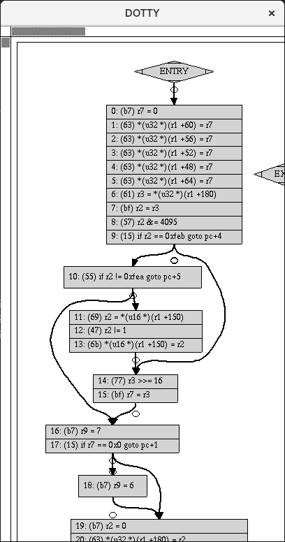

开源软件Cilium深度的使用了BPF来做网络安全，它的文档中使用了一个章节专门的来介绍BPF的原理和使用。

参考原文：[BPF and XDP Reference Guide](https://cilium.readthedocs.io/en/latest/bpf/#)


> 注意：本文档部分针对的是希望深入了解BPF和XDP的开发人员和用户。尽管阅读本参考指南可能有助于拓宽你对Cilium的理解，但使用Cilium并不是必须的。请参考入门指南和概念以获得更高级别的介绍。

BPF是Linux内核中高度灵活和高效的类似虚拟机的构造，允许以安全的方式在各种挂起点执行字节码。它被用于许多Linux内核子系统，最突出的是networking、tracing和安全(例如沙箱)。

尽管BPF自1992年以来就存在，但本文介绍了扩展的Berkeley Packet Filter (eBPF)版本，该版本首次出现在内核3.18中，并呈现了最近被称为“classic”BPF (cBPF)的原始版本。cBPF以tcpdump使用的包过滤语言而闻名。现在，Linux内核只运行eBPF，并且在程序执行之前将加载的cBPF字节码透明地转换为内核中的eBPF表示。除非明确指出eBPF和cBPF之间的区别，否则本文档一般将使用BPF这个术语。

尽管 Berkeley Packet Filter的名称暗示了包过滤的特定用途，但是指令集是通用的，并且非常灵活，除了网络之外，BPF还有很多用例。有关使用BPF的项目列表，请参阅进一步阅读。

Cilium 在其数据路径中大量使用BPF，有关更多信息，请参阅概念。本章的目标是提供一个BPF参考指南，以了解BPF，它的网络特定用途，包括加载BPF程序与tc((traffic control)和XDP (eXpress Data Path)，并协助开发Cilium的BPF模板。

# 1、BPF Architecture

BPF不仅仅定义了自己的指令集，还提供了更进一步的框架。包括：maps(高效的key/value存储)、helper functions(调用内核函数)、tail calls(调用其他的BPF程序)、security hardening primitives(安全性加强原语)、一个伪文件系统为了pinning目标(maps、programs)、还徐云BPF的offloaded(例如，offload到一个网卡)。

LLVM提供了一个BPF后端，这样就可以使用像clang这样的工具将C编译成BPF对象文件，然后可以将其加载到内核中。BPF与Linux内核紧密相连，允许在不牺牲本机内核性能的情况下进行完全的编程。

最后，使用BPF的内核子系统也是BPF基础设施的一部分。本文档中讨论的两个主要子系统是tc和XDP, BPF程序可以附加到这两个子系统中。XDP BPF程序是在最早的网络驱动阶段附加的，在数据包接收时触发BPF程序运行。根据定义，这可以获得最佳的包处理性能，因为包在软件中甚至不能在更早的时候被处理。然而，由于这种处理发生在网络堆栈的早期，堆栈还没有从包中提取元数据。另一方面，tc BPF程序稍后在内核堆栈中执行，因此它们可以访问更多的元数据和核心内核功能。除了tc和XDP程序之外，还有许多其他使用BPF的内核子系统，如trace (kprobes, uprobes, tracepoint等)。

下面的小节将进一步详细介绍BPF体系结构的各个方面。

## 1.1、Instruction Set

BPF是一个通用的RISC指令集，最初的设计目的是可以使用一个C语言的子集写程序并且可以通过一个编译器后端(例如LLVM)编译成BPF指令，这样内核就可以稍后通过内核JIT编译器将它们映射到本机操作码优化内核内部的执行性能。

将这些指令推入内核的优点包括:

- 使内核可编程，而不必跨越内核/用户空间边界。例如，networking相关的BPF程序，如Cilium，可以实现灵活的 container policies, load balancing and other means，而无需将包移动到用户空间并返回到内核。当需要时，BPF程序和内核/用户空间之间的状态仍然可以通过映射共享。
- 考虑到可编程数据路径的灵活性，还可以通过编译去掉不需要的特性来大大优化程序的性能。例如，如果一个container不需要IPv4，那么BPF程序可以构建为只处理IPv6，以便在快速通道中节省资源。
- 假设networking应用(例如tc和XDP)， BPF程序可以自动更新，而无需重新启动内核、系统服务或容器，也无需中断数据传输。此外，任何程序状态也可以通过BPF maps在整个更新过程中维护。
- BPF为用户空间提供了一个稳定的ABI，不需要任何第三方内核模块。BPF是到处发布的Linux内核的核心部分，它保证了现有的BPF程序可以在新的内核版本中继续运行。这种保证与内核为用户空间应用程序的系统调用提供的保证相同。此外，BPF程序可以跨不同的体系结构进行移植。
- BPF程序与内核协同工作，它们利用现有的内核基础设施(例如drivers, netdevices, tunnels, protocol stack, sockets)和工具(例如iproute2)以及内核提供的安全保证。和内核模块不同,BPF程序验证通过内核校验以确保他们不能崩溃内核,总能终止,等。XDP项目,例如,重用现有的内核驱动程序和操作提供DMA缓冲区包含包数据，不暴露他们或整个驱动到用户空间。此外，XDP程序重用现有的堆栈，而不是绕过它。BPF可以被看作是一种通用的“粘合代码”，用于编写用于解决特定用例的程序。

在内核中执行BPF程序总是由事件驱动的!例如,一个网络设备具有BPF程序附在其入口路径，收到数据包将触发程序的执行一次；内核地址有kprobes附带一个BPF程序，一旦地址的代码被执行,然后调用kprobes回调函数随后触发执行BPF程序。

BPF由11个64位寄存器(包含32位子寄存器)、PC、512字节的堆栈空间组成。寄存器命名为 r0 - r10。操作模式默认为64位，32位子寄存器只能通过特殊的ALU(算术逻辑单元)操作访问。32位以下的子寄存器在写入时从0扩展到64位。

寄存器r10是唯一的只读寄存器，它包含堆栈指针地址，以便访问BPF堆栈空间。其余的r0 - r9寄存器是一般用途和读写性质。

BPF程序可以调用预定义的helper function，这是由核心内核(而不是模块)定义的。BPF调用约定定义如下:

```
    r0 contains the return value of a helper function call.
    r1 - r5 hold arguments from the BPF program to the kernel helper function.
    r6 - r9 are callee saved registers that will be preserved on helper function call.
```

BPF调用约定足够通用，可以直接映射到x86_64、arm64和其他ABIs，因此所有BPF寄存器都将一个映射到HW CPU寄存器，这样JIT只需发出一个调用指令，而不需要额外的移动来放置函数参数。这种调用约定的建模是为了涵盖常见的调用情况，而不会造成性能损失。当前不支持带有6个或更多参数的调用。内核中专门用于BPF (BPF_CALL_0()到BPF_CALL_5()函数的helper函数是专门根据这种约定设计的。

寄存器r0也是包含BPF程序退出值的寄存器。退出值的语义由程序的类型定义。此外，当将执行返回给内核时，退出值作为32位值传递。

寄存器r1 - r5是暂存寄存器，这意味着BPF程序需要将它们spill到BPF堆栈中，或者将它们移动到被调用保存寄存器中，如果这些参数要跨多个辅助函数调用重用的话。spilling意味着寄存器中的变量被移动到BPF堆栈中。将变量从BPF堆栈移到寄存器的反向操作称为filling。spilling/filling的原因是寄存器数量有限。

在执行BPF程序时，寄存器r1最初包含程序的context。context是程序的输入参数(类似于典型C程序的argc/argv对)。BPF仅限于在单个context中工作。context由程序类型定义，例如，网络程序可以将网络数据包(skb)的内核表示形式作为输入参数。

BPF的一般操作是64位，遵循64位体系结构的自然模型，以便执行指针算术运算，传递指针，也向helper functions传递64位值，并允许64位原子操作。

每个程序的最大指令限制限制在4096 BPF指令，这意味着任何程序都会很快终止。虽然指令集包含前向跳转和后向跳转，但是内核中的BPF验证器将禁止循环，保证程序总是能终止。由于BPF程序在内核中运行，verifier的工作是确保这些程序能够安全运行，而不影响系统的稳定性。这意味着从指令集的观点来看，循环是可以实现的，但是verifier会限制它。然而，也有一个tail call的概念，允许一个BPF程序跳转到另一个BPF程序。这也带来了32个调用的嵌套上限。tail call通常用于将程序逻辑的一部分解耦，例如，分解成阶段。

指令格式建模为两个操作数指令，这有助于在JIT阶段将BPF指令映射到本机指令。指令集是固定大小的，这意味着每条指令都有64位编码。目前，已经实现了87条指令，编码还允许在需要时使用进一步的指令扩展集合。在big-endian机上一条64位指令的指令编码定义为从最有效位(MSB)到最低有效位(LSB)的位序列，**"op:8, dst_reg:4, src_reg:4, off:16, imm:32"**。off和imm是有符号类型。编码是内核头文件的一部分，在linux/bpf.h头文件中定义。其中还包括linux/bpf_common.h。

"op"定义要执行的实际操作。大多数用于op的编码都被cBPF重用。操作可以基于寄存器或直接操作数。op本身的编码提供了使用哪种模式的信息(BPF_X分别表示基于寄存器的操作，BPF_K分别表示基于立即的操作)。在后一种情况下，目标操作数总是一个寄存器。dst_reg和src_reg都提供了关于用于操作的寄存器操作数(例如r0 - r9)的附加信息。"off"在一些指令中用于提供相对偏移量，例如，用于处理BPF可用的堆栈或其他缓冲区(例如map value、包数据等)，或跳转指令中的跳转目标。imm包含一个常量/即时值。

可用的"op"指令可以分为不同的指令类。这些类也编码在op字段中。op字段分为(从MSB到LSB)**"code:4, source:1 and class:3"**。类是更通用的指令类，代码表示该类中的特定操作代码，源代码表示源操作数是寄存器还是立即数。可能的指令类包括:

- **BPF_LD和BPF_LDX**:两个类都用于加载操作。BPF_LD用于加载一个double word作为一个特殊的指令由于imm:32分割，并用于byte/half-word/word的包数据加载。后者主要是为了保持cBPF转换为BPF的效率，因为他们已经优化了JIT代码。对于本机BPF，这些包加载指令现在不那么相关了。BPF_LDX类保存byte/half-word/word/double-word加载指令。此上下文中的内存是通用的，可以是堆栈内存、map value数据、包数据等。
- **BPF_ST, BPF_STX**:两个类都用于存入操作。类似于BPF_LDX BPF_STX是对应的存入,用于存储寄存器的数据到内存中。再一次说明,内存可以是栈内存，映射值,包数据,等。BPF_STX还拥有特殊的指令执行原子添加字和双字操作,例如,可用于计数器。BPF_ST类类似于BPF_STX，它提供了仅将源操作数作为立即值存储到内存中的指令。
- **BPF_ALU, BPF_ALU64**:两个类都包含ALU操作。通常，BPF_ALU操作是32位模式，BPF_ALU64是64位模式。这两个ALU类的源操作数具有基于寄存器或基于即时操作数的模式。支持"add (+), sub (-), and (&), or (|), left shift (<<), right shift (>>), xor (^), mul (*), div (/), mod (%), neg (~) "操作。同样"mov (<X> := <Y>)"作为一种特殊的ALU操作添加到这两个类的操作模式中。BPF_ALU64也包含符号右移位。BPF_ALU还包含在给定源寄存器中half-word/word/double-word的字节序转换指令。
- **BPF_JMP**:这个类专门用于跳转操作。跳跃可以是无条件的，也可以是有条件的。无条件跳转只是将程序计数器向前移动，相对于当前指令执行的下一条指令是off + 1，其中off是指令中编码的常量偏移量。因为off是有符号的，所以跳转也可以向后执行，只要它不创建循环并且在程序范围内。条件跳转对基于寄存器和基于立即的源操作数都进行操作。如果跳转操作中的条件是true，则执行相对跳转到off + 1，否则执行下一条指令(0 + 1)。与cBPF相比，这种fall-through跳转逻辑是不同的，并且允许更好的分支预测，因为它更自然地适合CPU分支预测逻辑。可用条件有"jeq (==), jne (!=), jgt (>), jge (>=), jsgt (signed >), jsge (signed >=), jlt (<), jle (<=), jslt (signed <), jsle (signed <=) and jset (jump if DST & SRC)"。除此之外,有三个特殊的跳转操作在这个类:exit 指令,将带通滤波器程序并返回当前值在r0返回代码；call指令,这将发出一个函数调用到一个可用的BPF helper function；和一个隐藏的tail call指令,进入一个不同的BPF程序。

Linux内核附带了一个BPF解释器，该解释器执行用BPF指令组装的程序。即使是cBPF程序在内核中也可以透明地转换为eBPF程序，除了那些仍然使用cBPF JIT并且还没有迁移到eBPF JIT的体系结构。

目前，x86_64、arm64、ppc64、s390x、mips64、sparc64和arm体系结构都带有内核eBPF JIT编译器。

所有BPF处理(比如将程序加载到内核中或创建BPF msp)都是通过一个中央bpf()系统调用来管理的。它还用于管理map条目(查找/更新/删除)，并通过pinning使程序和映射在BPF文件系统中持久存在。


## 1.2、Helper Functions

简单来说就是BPF程序调用kernel的函数。

Helper functions是一个概念，它使BPF程序能参考内核定义的一系列函数调用，以便和内核之间接受/推送数据。对于每个BPF程序类型，可用的helper function可能有所不同，例如，与连接到tc层的BPF程序相比，连接到socket的BPF程序只允许调用helper的子集。轻量级隧道的Encapsulation and decapsulation helpers就是一个例子，它仅仅在低级tc层上有效，而将通知推送到用户空间的event output helpers可用于tc和XDP程序。

每一个helper function都使用与系统调用类似的通用共享函数定义来实现。函数定义为:

```
u64 fn(u64 r1, u64 r2, u64 r3, u64 r4, u64 r5)
```

前一节中描述的调用约定适用于所有BPF helper function。

内核将helper function抽象为与系统调用类似的宏BPF_CALL_0()到BPF_CALL_5()。下面的示例是从一个helper functions中提取的，该函数通过调用相应的回调来更新map elements:

```
BPF_CALL_4(bpf_map_update_elem, struct bpf_map *, map, void *, key,
           void *, value, u64, flags)
{
    WARN_ON_ONCE(!rcu_read_lock_held());
    return map->ops->map_update_elem(map, key, value, flags);
}

const struct bpf_func_proto bpf_map_update_elem_proto = {
    .func           = bpf_map_update_elem,
    .gpl_only       = false,
    .ret_type       = RET_INTEGER,
    .arg1_type      = ARG_CONST_MAP_PTR,
    .arg2_type      = ARG_PTR_TO_MAP_KEY,
    .arg3_type      = ARG_PTR_TO_MAP_VALUE,
    .arg4_type      = ARG_ANYTHING,
};
```

这种方法有很多优点:虽然cBPF重载了它的加载指令，以便在不可能的包偏移量中获取数据通过调用辅助助手函数，但是每个cBPF JIT都需要实现对这样的cBPF扩展的支持。eBPF,每个新添加的helper function 以透明的和有效的方式被JIT编译,也就是说,JIT编译器只需要发出call指令，因为在这样一种方式中BPF的寄存器映射已经匹配的底层架构的调用协定。这允许轻松扩展内核来扩展新的helper function。所有BPF helper function都是核心内核的一部分，不能通过内核模块进行扩展或添加。

上述的函数定义还允许verifier执行类型检查。上面的struct bpf_func_proto用于将有关helper的所有必要信息传递给verifier，以便verifier可以确保来自helper的预期类型与BPF程序分析寄存器的当前内容匹配。

参数类型允许的范围从任何类型的值到受限制的内容(类似BPF堆栈缓存区中指针/尺寸对)，helper应该读入或写出。在后一种情况，verifier可以执行额外的检查，例如缓存区是否已经初始化。

可用的BPF helper function列表非常长而且持续增长中，例如在撰写本文时，tc BPF程序可以选择38个不同的BPF helper。内核的struct bpf_verifier_ops包含一个get_func_proto回调函数，该函数可将特定枚举bpf_func_func_id映射到helper。

## 1.3、Maps

BPF程序不允许使用全局变量，maps简单来说就是BPF程序中的全局变量。

map是驻留在内核空间中高效的key/value存储。可以从BPF程序访问它们，以便在多个BPF程序调用之间保持状态。它们还可以通过用户空间的文件描述符访问，可以与其他BPF程序或用户空间应用程序任意共享。

BPF程序相互之间共享map不需要程序是同一类型，例如tracing程序可以和networking程序之间共享map。一个BPF程序可以直接访问64个不同的map。

map的实现由核心内核提供。generic map有per-CPU和non-per-CPU风格，可以读/写任意数据。还有non-generic msp和helper function一起使用。

当前有效的generic map有：BPF_MAP_TYPE_HASH, BPF_MAP_TYPE_ARRAY, BPF_MAP_TYPE_PERCPU_HASH, BPF_MAP_TYPE_PERCPU_ARRAY, BPF_MAP_TYPE_LRU_HASH, BPF_MAP_TYPE_LRU_PERCPU_HASH and BPF_MAP_TYPE_LPM_TRIE。它们都使用相同的BPF helper function集，以便在实现具有不同语义和性能特征的不同后端时执行查找、更新或删除操作。

当前kernel中的non-generic map有：BPF_MAP_TYPE_PROG_ARRAY, BPF_MAP_TYPE_PERF_EVENT_ARRAY, BPF_MAP_TYPE_CGROUP_ARRAY, BPF_MAP_TYPE_STACK_TRACE, BPF_MAP_TYPE_ARRAY_OF_MAPS, BPF_MAP_TYPE_HASH_OF_MAPS。例如，BPF_MAP_TYPE_PROG_ARRAY是保存其他BPF程序的map数组，BPF_MAP_TYPE_ARRAY_OF_MAPS和BPF_MAP_TYPE_HASH_OF_MAPS都保存指向其他map的指针，所有的BPF map会在运行时自动的替换。这些类型的映射解决了一个不适合仅通过BPF helper function实现的特定问题，因为需要用保持额外(非数据)状态在跨BPF程序调时。

## 1.4、Object Pinning

BPF map和程序作为内核资源只能通过由内核中的匿名节点支持的文件描述符访问。有优点，但也伴随着一些缺点:

用户空间应用程序可以使用大多数与文件描述符相关的api, Unix域套接字传递的文件描述符可以透明地工作，等等，但是同时，文件描述符被限制在进程的生命周期内，这使得像map共享这样的选项执行起来相当麻烦。

因此，对于某些用例(如iproute2)，它会带来一些并发问题，比如tc或XDP设置并将程序加载到内核中，最终终止自身。这样，用户空间端也无法访问映射，否则它可能很有用，例如，在数据路径的入口和出口位置之间共享map。另外，第三方应用程序可能希望在BPF程序运行时监视或更新map内容。

为了克服这个限制，实现了一个最小的内核空间BPF文件系统，BPF map和程序可以固定在这个系统上，这个过程称为object pinning。BPF系统调用因此扩展了两个新命令，它们可以固定(BPF_OBJ_PIN)或检索(BPF_OBJ_GET)以前固定的对象。

例如，tc等工具利用这个基础框架在入口和出口上共享map。BPF相关的文件系统不是单例的，它支持多个挂载实例、硬链接和软链接等。


## 1.5、Tail Calls

另外一个BPF相关的概念称为tail calls。tail calls可以看作是一种机制，允许一个BPF程序调用另一个BPF程序，而不返回到旧程序。与函数调用不同，这种调用的开销非常小，它是作为一个长跳转实现的，重用相同的堆栈框架。

这类程序相互独立地进行验证，因此为了传输状态，必须使用per-CPU map作为暂存缓冲区，或者对于tc程序，必须使用skb字段中的如cb[]区域。

只有相同类型的程序才能被tail call，并且它们还需要在JIT编译方面进行匹配，因此调用JIT编译的程序或调用解释器(interpreted)的程序只能选其一，不能混合在一起。

执行tail call涉及两个部分的调用：第一部分需要设置一个特殊的map叫做program array (BPF_MAP_TYPE_PROG_ARRAY)，它可以由用户空间填充key/values，value就是tail calle调用的BPF 程序的文件描述符。第二部分是一个bpf_tail_call() helper，在当前上下文根据传递过来的key在program array中查找到对应value。然后内核将这个helper调用直接内联到一个专门的BPF指令中。这样的program array目前只从用户空间端写。

内核从传递的文件描述符查找相关的BPF程序，原子性地替换给定map slot的程序指针。如果在提供的key上没有找到map条目，内核就会“fall through”，并继续执行在bpf_tail_call()之后的旧程序。Tail call是一个强大的工具，例如，可以通过tail call构造网络头。在运行时，功能可以原子的添加或替换，从而改变BPF程序的执行行为。

## 1.6、BPF to BPF Calls

除了BPF helper function call和BPF tail call以外，一个最近的特性被添加到BPF核心架构，称为BPF to BPF calls。在这个特性被引入内核之前，一个典型的BPF程序不得宣称任何可重入的代码。例如，常驻在头部的"always_inline"声明，这样在 LLVM编译并生产BPF目标文件时所用的函数都是inline，因此如果在目标文件中多次调用某个函数会人为的扩大代码尺寸：

```
#include <linux/bpf.h>

#ifndef __section
# define __section(NAME)                  \
   __attribute__((section(NAME), used))
#endif

#ifndef __inline
# define __inline                         \
   inline __attribute__((always_inline))
#endif

static __inline int foo(void)
{
    return XDP_DROP;
}

__section("prog")
int xdp_drop(struct xdp_md *ctx)
{
    return foo();
}

char __license[] __section("license") = "GPL";
```

之所以有必要这样做，主要是因为BPF程序加载器(loader)以及验证器(verifier)、解释器(interpreter)和JITs中缺少函数调用(function call)支持。从Linux内核4.16和LLVM 6.0开始，这个限制被解除了，BPF程序不再需要在任何地方使用always_inline。因此，前面显示的BPF示例代码可以更自然地重写为:

```
#include <linux/bpf.h>

#ifndef __section
# define __section(NAME)                  \
   __attribute__((section(NAME), used))
#endif

static int foo(void)
{
    return XDP_DROP;
}

__section("prog")
int xdp_drop(struct xdp_md *ctx)
{
    return foo();
}

char __license[] __section("license") = "GPL";
```

主流的BPF JIT编译器(如x86_64和arm64)今天支持BPF to BPF call，在不久的将来会有其他架构的支持。BPF to BPF call是一个重要的性能优化，因为它大大减少了生成的BPF代码大小，因此对CPU的指令缓存更友好。

从BPF helper function知道的调用约定同样适用于BPF to BPF call，这意味着r1到r5是用来向被调用方传递参数的，结果在r0中返回。r1到r5是暂存寄存器，而r6到r9在调用之间保持不变。允许的最大嵌套调用数为8。调用者可以将指针(例如到调用者的堆栈帧)传递到被调用者，但从不会相反。

BPF to BPF call目前与BPF tail call的使用不兼容，因为后者需要按照原样重用当前的堆栈设置，而前者需要添加额外的堆栈，从而更改tail call的预期布局。

BPF JIT编译器为每个函数体发出单独的映像，然后在最后一次JIT传递中修复映像中的function call地址。这已经证明需要对JITs进行最小的更改，因为它们可以将BPF to BPF call就像传统的BPF helper function一样看待。

## 1.7、JIT

在"64 bit x86_64, arm64, ppc64, s390x, mips64, sparc64 and 32 bit arm"架构中都附带了内核的eBPF JIT编译器，而且它们都具有相同的特性，可以通过以下方式启用:

```
# echo 1 > /proc/sys/net/core/bpf_jit_enable
```

在"32 bit mips, ppc and sparc"架构目前有一个cBPF JIT编译器。上面提到的体系结构仍然只有有一个cBPF JIT，以及剩下的Linux内核支持的所有其他体系结构，这些体系结构根本没有BPF JIT编译器，需要通过内核解释器(in-kernel interpreter)运行eBPF程序。

正在内核源码树中，通过一个"grep HAVE_EBPF_JIT"命令，可以很容易的找出哪些架构支持eBPF JIT：

```
# git grep HAVE_EBPF_JIT arch/
arch/arm/Kconfig:       select HAVE_EBPF_JIT   if !CPU_ENDIAN_BE32
arch/arm64/Kconfig:     select HAVE_EBPF_JIT
arch/powerpc/Kconfig:   select HAVE_EBPF_JIT   if PPC64
arch/mips/Kconfig:      select HAVE_EBPF_JIT   if (64BIT && !CPU_MICROMIPS)
arch/s390/Kconfig:      select HAVE_EBPF_JIT   if PACK_STACK && HAVE_MARCH_Z196_FEATURES
arch/sparc/Kconfig:     select HAVE_EBPF_JIT   if SPARC64
arch/x86/Kconfig:       select HAVE_EBPF_JIT   if X86_64
```

JIT编译器大大加快了BPF程序的执行，因为与解释器(interpreter)相比，它们降低了每条指令的成本。通常可以将指令与底层架构的本机指令1:1映射。这也减少了生成的可执行映像的大小，因此对CPU更友好的指令缓存。特别是在CISC指令集(如x86)中，JITs被优化为为给定指令发出尽可能短的操作码，以缩小程序转换所需的总大小。

## 1.8、Hardening

在程序的生命周期内，BPF将内核中的整个BPF interpreter映像(struct bpf_prog)以及JIT编译的映像(struct bpf_binary_header)都锁定为只读，以防止代码出现潜在的错误。在这一点上发生的任何损坏，例如，由于一些内核bug将导致一般的保护故障从而导致内核崩溃，而不是允许损坏静静地发生。

支持将映像内存设置为只读的体系架构可以通过以下方式确定:

```
$ git grep ARCH_HAS_SET_MEMORY | grep select
arch/arm/Kconfig:    select ARCH_HAS_SET_MEMORY
arch/arm64/Kconfig:  select ARCH_HAS_SET_MEMORY
arch/s390/Kconfig:   select ARCH_HAS_SET_MEMORY
arch/x86/Kconfig:    select ARCH_HAS_SET_MEMORY
```

CONFIG_ARCH_HAS_SET_MEMORY选项是不可配置的，因为这个保护总是内置的。其他体系架构将来也可能会出现。

对于x86_64 JIT编译器，通过一个retpoline实现从使用tail call的间接跳转，CONFIG_RETPOLINE被设置这是在本文编写时大多数现代Linux发行版时的默认值。

如果将"/proc/sys/net/core/bpf_jit_harden"设置为1，则JIT编译的额外强化步骤将对非特权用户生效。在不受信任的用户在系统上操作的情况下，通过有效率的交易，使用少许性能换取了通过减少(潜在的)攻击面。这个性能减少程序的执行结果，与完全切换到解释器(interpreter)相比有更好的性能。

当前，启用hardening将会在JIT编译时使BPF程序中32bit和64bit的常量致盲(constant blinding)，这是为了预防JIT喷射攻击它会将本机操作码注入到立即数中。原理是这样的：因为这些即时值驻留在可执行内核内存中，因此可以从某个内核错误触发的跳转将跳转到即时值的开始，然后作为本机指令执行这些值。

JIT常量致盲(constant blinding)保护是由随机化实际指令来完成的。这就意味着操作从基于立即数的源操作数到一个基于寄存器的操作数，通过改写指令分割的实际load 指令为两个步骤:1)加载一个致盲的立即数(rnd ^ imm)到寄存器,2)xor 寄存器和rnd，这样原始的立即数恢复到寄存器中。这个示例是为load操作提供的，但实际上所有通用操作都是致盲的。

实例，JITing一个程序与硬化禁用:

```
# echo 0 > /proc/sys/net/core/bpf_jit_harden

  ffffffffa034f5e9 + <x>:
  [...]
  39:   mov    $0xa8909090,%eax
  3e:   mov    $0xa8909090,%eax
  43:   mov    $0xa8ff3148,%eax
  48:   mov    $0xa89081b4,%eax
  4d:   mov    $0xa8900bb0,%eax
  52:   mov    $0xa810e0c1,%eax
  57:   mov    $0xa8908eb4,%eax
  5c:   mov    $0xa89020b0,%eax
  [...]
```

相同的程序，在hardening启用时，当非特权用户加载BPF时会被常量致盲(constant blinding):

```
# echo 1 > /proc/sys/net/core/bpf_jit_harden

  ffffffffa034f1e5 + <x>:
  [...]
  39:   mov    $0xe1192563,%r10d
  3f:   xor    $0x4989b5f3,%r10d
  46:   mov    %r10d,%eax
  49:   mov    $0xb8296d93,%r10d
  4f:   xor    $0x10b9fd03,%r10d
  56:   mov    %r10d,%eax
  59:   mov    $0x8c381146,%r10d
  5f:   xor    $0x24c7200e,%r10d
  66:   mov    %r10d,%eax
  69:   mov    $0xeb2a830e,%r10d
  6f:   xor    $0x43ba02ba,%r10d
  76:   mov    %r10d,%eax
  79:   mov    $0xd9730af,%r10d
  7f:   xor    $0xa5073b1f,%r10d
  86:   mov    %r10d,%eax
  89:   mov    $0x9a45662b,%r10d
  8f:   xor    $0x325586ea,%r10d
  96:   mov    %r10d,%eax
  [...]
```

这两个程序在语义上是相同的，只是在第二个程序的反汇编过程中不再可见原始的立即数值。

与此同时，硬化(hardening)还禁止特权用户接触任何JIT kallsyms，保护JIT映像地址不再暴露于/proc/kallsyms。

此外，Linux内核提供了CONFIG_BPF_JIT_ALWAYS_ON选项，该选项从内核中删除了整个BPF解释器(interpreter)，并永久启用了JIT编译器。这是在Spectre v2环境中开发的一种缓解措施的一部分，当在基于vm的环境中使用时，guest内核在进行攻击时将不再重用host内核的BPF解释器。对于基于容器的环境，CONFIG_BPF_JIT_ALWAYS_ON配置选项是可选的，但是如果在那里启用了JITs，那么把解释器(interpreter)剔除编译以减少内核的复杂性。因此对于广泛使用JITs的主流体系结构(如x86_64和arm64)是推荐的。

最后但并非最不重要的是，内核提供了一个选项，通过/proc/sys/kernel/unprivileged_bpf_disabled sysctl接口来禁用对无特权用户的bpf(2)系统调用。这是一个一次性的关闭开关，也就是说，一旦设置为1，在重新启动新的内核之前，没有办法将其重置为0。一旦设置，只允许初始名称空间之外的CAP_SYS_ADMIN特权进程使用bpf(2)系统调用。启动时，Cilium 也将这个旋钮设置为1。

```
# echo 1 > /proc/sys/kernel/unprivileged_bpf_disabled
```

## 1.9、Offloads

BPF中的网络程序，特别是针对tc和XDP的网络程序，在内核中有一个到硬件的offload接口，以便直接在NIC上执行BPF代码。

目前，Netronome的nfp驱动程序支持offload，通过JIT编译器将BPF指令转换为针对NIC实现的指令集。这包括将BPF map offload到NIC，因此offload的BPF程序可以执行map的查找、更新和删除。

# 2、Toolchain

本节将讨论围绕BPF的用户空间工具、内审工具和内核控制开关。注意，围绕BPF的工具和基础结构仍在快速发展，因此可能无法提供所有可用工具的完整描述。

## 2.1、Development Environment

下面是为Fedora和Ubuntu逐步建立BPF开发环境的指南。这将指导您构建、安装和测试开发内核，以及构建和安装iproute2。

手动构建iproute2和Linux内核的步骤通常是不必要的，因为主要的发行版在默认情况下已经发布了足够多的内核，但是在测试前沿版本或分别为iproute2和Linux内核提供BPF补丁时需要这样做。同样，出于调试和内省的目的，构建bpftool也是可选的，但建议这样做。

### 2.1.1、Fedora

以下适用于Fedora 25或更高版本:

```
$ sudo dnf install -y git gcc ncurses-devel elfutils-libelf-devel bc \
  openssl-devel libcap-devel clang llvm graphviz bison flex glibc-static
```

### 2.1.2、Ubuntu

以下适用于Ubuntu 17.04或更高版本:

```
$ sudo apt-get install -y make gcc libssl-dev bc libelf-dev libcap-dev \
  clang gcc-multilib llvm libncurses5-dev git pkg-config libmnl bison flex \
  graphviz
```

### 2.1.3、Compiling the Kernel

Linux内核的新BPF特性的开发发生在net-next git树中，最新的BPF修复在net树中。下面的命令将通过git获取net-next树的内核源代码:

```
$ git clone git://git.kernel.org/pub/scm/linux/kernel/git/davem/net-next.git
```

如果git提交历史记录不受关注，那么"--depth 1"将通过只截断git历史记录到最近的提交来更快地克隆树。

如果网络树是感兴趣的，它可以从这个url克隆:

```
$ git clone git://git.kernel.org/pub/scm/linux/kernel/git/davem/net.git
```

在互联网上有许多关于如何构建Linux内核的教程，一个很好的资源是Kernel Newbies网站(https://kernelnewbies.org/KernelBuild)，它可以跟随上面提到的两个git树之一。

确保生成的.config文件包含以下用于运行BPF的CONFIG_*条目。Cilium也需要这些条目。

```
CONFIG_CGROUP_BPF=y
CONFIG_BPF=y
CONFIG_BPF_SYSCALL=y
CONFIG_NET_SCH_INGRESS=m
CONFIG_NET_CLS_BPF=m
CONFIG_NET_CLS_ACT=y
CONFIG_BPF_JIT=y
CONFIG_LWTUNNEL_BPF=y
CONFIG_HAVE_EBPF_JIT=y
CONFIG_BPF_EVENTS=y
CONFIG_TEST_BPF=m
```

有些条目无法通过make menuconfig进行调整。例如，如果给定的体系结构确实带有eBPF JIT，那么CONFIG_HAVE_EBPF_JIT就会被自动选择。在这种情况下，CONFIG_HAVE_EBPF_JIT是可选的，但强烈推荐使用。没有eBPF JIT编译器的体系结构将需要回归到内核解释器(in-kernel interpreter)，从而降低执行BPF指令的效率。


### 2.1.4、Verifying the Setup

在引导到新编译的内核之后，导航到BPF selftest套件，以测试BPF功能(当前工作目录指向克隆的git树的根目录):

```
$ cd tools/testing/selftests/bpf/
$ make
$ sudo ./test_verifier
```

验证者(verifier)测试打印出正在执行的所有当前检查。运行所有测试结束时的总结将打印测试成功和失败的信息:

```
Summary: 847 PASSED, 0 SKIPPED, 0 FAILED
```

> 注意：对于内核版本4.16+ BPF的selftest依赖于LLVM 6.0+，这是因为BPF函数调用不再需要内联(inline)。有关更多信息，请参阅BPF to BPF call部分或来自内核补丁(https://lwn.net/Articles/741773/)的邮件。如果不使用这个新特性，并不是每个BPF程序都依赖于LLVM 6.0+。如果您的发行版没有提供LLVM 6.0+，您可以按照LLVM部分中的说明进行编译。

为了运行所有BPF自测试，需要以下命令:

```
$ sudo make run_tests
```

如果您发现任何故障，请就完整的测试输出与我们在Slack上联系。

### 2.1.5、Compiling iproute2

与net(仅修复)和net-next(新特性)内核树类似，iproute2 git树有两个分支，即master和net-next。master分支基于net树，而net-next分支基于net-next内核树。这是必要的，这样头文件中的更改可以在iproute2树中同步。

为了克隆iproute2 master主分支，可以使用以下命令:

```
$ git clone git://git.kernel.org/pub/scm/linux/kernel/git/iproute2/iproute2.git
```

类似地，要复制到上述的iproute2的net-next分支，可以执行以下操作:

```
$ git clone -b net-next git://git.kernel.org/pub/scm/linux/kernel/git/iproute2/iproute2.git
```

之后，继续构建和安装:

```
$ cd iproute2/
$ ./configure --prefix=/usr
TC schedulers
 ATM    no

libc has setns: yes
SELinux support: yes
ELF support: yes
libmnl support: no
Berkeley DB: no

docs: latex: no
 WARNING: no docs can be built from LaTeX files
 sgml2html: no
 WARNING: no HTML docs can be built from SGML
$ make
[...]
$ sudo make install
```

确保配置脚本显示ELF支持:yes，这样iproute2就可以从LLVM的BPF后端处理ELF文件。libelf在之前的Fedora和Ubuntu安装依赖的说明中已经列出。

### 2.1.6、Compiling bpftool

pftool是围绕BPF程序和映射的调试和自省的基本工具。它是内核树的一部分，可以在tools/bpf/bpftool/下使用。

如前所述，确保已经克隆了net或net-next内核树。为了构建和安装bpftool，需要执行以下步骤:

```
$ cd <kernel-tree>/tools/bpf/bpftool/
$ make
Auto-detecting system features:
...                        libbfd: [ on  ]
...        disassembler-four-args: [ OFF ]

  CC       xlated_dumper.o
  CC       prog.o
  CC       common.o
  CC       cgroup.o
  CC       main.o
  CC       json_writer.o
  CC       cfg.o
  CC       map.o
  CC       jit_disasm.o
  CC       disasm.o
make[1]: Entering directory '/home/foo/trees/net/tools/lib/bpf'

Auto-detecting system features:
...                        libelf: [ on  ]
...                           bpf: [ on  ]

  CC       libbpf.o
  CC       bpf.o
  CC       nlattr.o
  LD       libbpf-in.o
  LINK     libbpf.a
make[1]: Leaving directory '/home/foo/trees/bpf/tools/lib/bpf'
  LINK     bpftool
$ sudo make install
```

## 2.2、LLVM

LLVM是当前唯一提供BPF后端的编译套件。gcc当前不支持BPF。

BPF后端合并到LLVM的3.7版本中。主要发行版在LLVM打包时默认启用BPF后端，因此安装最近的发行版clang和LLVM就足以开始将C编译成BPF对象文件。

典型的工作流程是，BPF程序是用C语言编写的，由LLVM编译成对象/ ELF文件，由用户空间BPF ELF加载器(如iproute2或其他)解析，并通过BPF系统调用推入内核。内核验证BPF指令并JITs指令，为程序返回一个新的文件描述符，然后可以把文件描述符附加到一个子系统(例如网络)。如果支持，子系统可以进一步将BPF程序卸载(offload)到硬件(例如NIC)。

对于LLVM, BPF目标支持可以检查，例如，通过以下方式:

```
$ llc --version
LLVM (http://llvm.org/):
LLVM version 3.8.1
Optimized build.
Default target: x86_64-unknown-linux-gnu
Host CPU: skylake

Registered Targets:
  [...]
  bpf        - BPF (host endian)
  bpfeb      - BPF (big endian)
  bpfel      - BPF (little endian)
  [...]
```

默认情况下，bpf目标使用它编译所在CPU的字节序(endianness)，这意味着，如果CPU的endianness是小endian，程序也将以小endian格式表示，如果CPU的endianness是大endian，程序也将以大endian格式表示。这也与BPF的运行时行为相匹配，BPF是通用的，并使用它运行时的CPU端值，以避免在任何格式的体系结构中处于劣势。

为了实现交叉编译，引入了bpfeb和bpfel这两个目标，多亏BPF程序可以在一种字节序的端点上编译(例如x86上的小端字节)，在另一种字节序的端点上运行(例如arm上的大端字节)。注意，前端(clang)也需要运行在目标端字节序。

使用bpf作为目标是在没有混合使用endianness的情况下的首选方法。例如，在x86_64上编译会导致目标bpf和bpfel的相同输出，因为是小端endian，因此触发编译的脚本也不必知道endian。

一个最小的、独立的XDP drop程序可能类似于以下示例(XDP -example.c):

```
#include <linux/bpf.h>

#ifndef __section
# define __section(NAME)                  \
   __attribute__((section(NAME), used))
#endif

__section("prog")
int xdp_drop(struct xdp_md *ctx)
{
    return XDP_DROP;
}

char __license[] __section("license") = "GPL";
```

它可以被编译并且加载进内核，使用如下命令：

```
$ clang -O2 -Wall -target bpf -c xdp-example.c -o xdp-example.o
# ip link set dev em1 xdp obj xdp-example.o
```

> 注意：将XDP BPF程序附加到网络设备上需要使用支持XDP设备的Linux 4.11，或Linux 4.12或更高版本的。

对于生成的目标文件LLVM(>= 3.9)使用正式的BPF机器值，即EM_BPF (decimal: 247 / hex: 0xf7)。在这个例子中，程序在x86_64下用bpf目标编译，因此LSB(与MSB相反)被显示为endianness:

```
$ file xdp-example.o
xdp-example.o: ELF 64-bit LSB relocatable, *unknown arch 0xf7* version 1 (SYSV), not stripped
```

"readelf -a xdp-example.o"将打印关于ELF文件的进一步信息，这些信息有时对于内省生成的节头、重定位条目和符号表非常有用。

在不太可能的情况下，需要从头编译clang和LLVM，可以使用以下命令:

```
$ git clone http://llvm.org/git/llvm.git
$ cd llvm/tools
$ git clone --depth 1 http://llvm.org/git/clang.git
$ cd ..; mkdir build; cd build
$ cmake .. -DLLVM_TARGETS_TO_BUILD="BPF;X86" -DBUILD_SHARED_LIBS=OFF -DCMAKE_BUILD_TYPE=Release -DLLVM_BUILD_RUNTIME=OFF
$ make -j $(getconf _NPROCESSORS_ONLN)

$ ./bin/llc --version
LLVM (http://llvm.org/):
LLVM version x.y.zsvn
Optimized build.
Default target: x86_64-unknown-linux-gnu
Host CPU: skylake

Registered Targets:
  bpf    - BPF (host endian)
  bpfeb  - BPF (big endian)
  bpfel  - BPF (little endian)
  x86    - 32-bit X86: Pentium-Pro and above
  x86-64 - 64-bit X86: EM64T and AMD64

$ export PATH=$PWD/bin:$PATH   # add to ~/.bashrc
```

确保"--version"提到了"Optimized build."，否则，当LLVM处于调试模式时，程序的编译时间会显著增加(例如10倍或更多)。

对于调试，clang可以生成汇编器输出如下:

```
$ clang -O2 -S -Wall -target bpf -c xdp-example.c -o xdp-example.S
$ cat xdp-example.S
    .text
    .section    prog,"ax",@progbits
    .globl      xdp_drop
    .p2align    3
xdp_drop:                             # @xdp_drop
# BB#0:
    r0 = 1
    exit

    .section    license,"aw",@progbits
    .globl    __license               # @__license
__license:
    .asciz    "GPL"
```

此外，更近期的LLVM版本(>= 4.0)也可以将dwarf格式的调试信息存储到对象文件中。这可以通过通常的工作流通过添加-g进行编译来完成。

```
$ clang -O2 -g -Wall -target bpf -c xdp-example.c -o xdp-example.o
$ llvm-objdump -S -no-show-raw-insn xdp-example.o

xdp-example.o:        file format ELF64-BPF

Disassembly of section prog:
xdp_drop:
; {
    0:        r0 = 1
; return XDP_DROP;
    1:        exit
```

llvm-objdump工具可以用编译中使用的原始C代码注释汇编器输出。本例中的简单示例不包含太多C代码，但是，显示为0:和1:的行号直接对应于内核的验证者(verifier)日志。

这意味着，如果BPF程序被验证者(verifier)拒绝，llvm-objdump可以帮助将指令关联回原始C代码，这对于分析非常有用。

```
# ip link set dev em1 xdp obj xdp-example.o verb

Prog section 'prog' loaded (5)!
 - Type:         6
 - Instructions: 2 (0 over limit)
 - License:      GPL

Verifier analysis:

0: (b7) r0 = 1
1: (95) exit
processed 2 insns
```

从验证者分析(verifier analysis)和llvm-objdump输出打印中可以看出相同的内核BPF汇编代码。

去掉-no-show-raw-insn选项会在汇编前面打印出原始指令struct bpf_insn:

```
$ llvm-objdump -S xdp-example.o

xdp-example.o:        file format ELF64-BPF

Disassembly of section prog:
xdp_drop:
; {
   0:       b7 00 00 00 01 00 00 00     r0 = 1
; return foo();
   1:       95 00 00 00 00 00 00 00     exit
```

对于LLVM的IR调试，BPF的编译过程可以分为两个步骤，生成一个二进制的LLVM IR中间文件xdp-example.bc，以后可以传给llc:

> 编译器中间语言(Intermediate Representation,简称IR)

```
$ clang -O2 -Wall -target bpf -emit-llvm -c xdp-example.c -o xdp-example.bc
$ llc xdp-example.bc -march=bpf -filetype=obj -o xdp-example.o
```

生成的LLVM IR也可以通过以下方式打印成人类可读的格式:

```
$ clang -O2 -Wall -emit-llvm -S -c xdp-example.c -o -
```

LLVM能够将调试信息(如程序中使用的数据类型的描述)附加到生成的BPF对象文件中。默认情况下，这是DWARF格式。

BPF使用的一个高度简化的版本称为BTF (BPF类型格式)。生成的DWARF可以转换为BTF，稍后通过BPF对象加载器加载到内核中。然后，内核将验证BTF数据的正确性，并跟踪BTF数据所包含的数据类型。

然后，BPF map可以用BTF中的数据对key和value类型进行注释，以便稍后的map打印将map数据连同相关的类型信息一起导出。这允许更好的内省、调试和值打印。注意，BTF数据是一种通用调试数据格式，因此任何从DWARF到BTF转换的数据可以被加载(例如，内核的vmlinux DWARF数据可以转换为BTF并加载)。后一种方法对BPF跟踪尤其有用。

为了从DWARF调试信息中生成BTF，需要elfutils(>= 0.173)。如果这是不可用的，那么在编译期间需要向llc命令添加-mattr=dwarfris选项:

```
$ llc -march=bpf -mattr=help |& grep dwarfris
  dwarfris - Disable MCAsmInfo DwarfUsesRelocationsAcrossSections.
  [...]
```

使用"-mattr=dwarfris"的原因是因为dwarfris(dwarf relocation in section)标志禁止了在DWARF和ELF符号表之间的DWARF跨段重定位，因为libdw没有合适的BPF重定位支持，因此像pahole这样的工具无法正确的从对象中dump出结构。

elfutils (>= 0.173)实现了正确的BPF重定位支持，因此在没有-mattr=dwarf ris选项的情况下也可以实现同样的功能。可以从DWARF或BTF信息中dump对象文件中的结构。pahole使用LLVM生成的DWARF信息，然而，如果可用未来的pahole版本可以依赖于BTF。

要将DWARF转换为BTF，需要使用最近的pahole版本(>= 1.12)。如果不能从一个发行包中获得，最近的pahole版本也可以从它的官方git仓库获得:

```
$ git clone https://git.kernel.org/pub/scm/devel/pahole/pahole.git
```

pahole附带了一个选项-J，可以将DWARF从对象文件转换为BTF。pahole可以进行如下探测对于BTF支持(注意，pahole也需要llvm-objcopy工具，所以也要检查它的存在):

```
$ pahole --help | grep BTF
-J, --btf_encode           Encode as BTF
```

生成调试信息还需要前端通过将-g传递到clang命令行来生成源级调试信息。注意-g是独立于llc是否使用了dwarfris选项。生成对象文件的完整示例：

```
$ clang -O2 -g -Wall -target bpf -emit-llvm -c xdp-example.c -o xdp-example.bc
$ llc xdp-example.bc -march=bpf -mattr=dwarfris -filetype=obj -o xdp-example.o
```

或者，通过只使用clang来构建带有调试信息的BPF程序(同样，只有在使用适当的elfutils版本时，才可以省略dwarfris标志):

```
$ clang -target bpf -O2 -g -c -Xclang -target-feature -Xclang +dwarfris -c xdp-example.c -o xdp-example.o
```

编译成功后，可以使用pahole根据DWARF信息适当地打印出BPF程序的结构:

```
$ pahole xdp-example.o
struct xdp_md {
        __u32                      data;                 /*     0     4 */
        __u32                      data_end;             /*     4     4 */
        __u32                      data_meta;            /*     8     4 */

        /* size: 12, cachelines: 1, members: 3 */
        /* last cacheline: 12 bytes */
};
```

通过-J选项pahole最终可以从DWARF中生成BTF。在对象文件中DWARF数据将与新添加的BTF数据一起保留。完整的clang和pahole例子组合:

```
$ clang -target bpf -O2 -Wall -g -c -Xclang -target-feature -Xclang +dwarfris -c xdp-example.c -o xdp-example.o
$ pahole -J xdp-example.o
```

通过readelf工具可以看到.BTF部分的存在:

```
$ readelf -a xdp-example.o
[...]
  [18] .BTF              PROGBITS         0000000000000000  00000671
[...]
```

iproute2等BPF加载器将检测和加载BTF部分，以便BPF map可以用类型信息进行注释。

LLVM默认使用BPF基本指令集来生成代码，以确保生成的对象文件也可以被较旧的内核加载，例如长期稳定的内核(例如4.9+)。

然而，LLVM有一个BPF后端的-mcpu选择器，用于选择BPF指令集的不同版本，即在BPF基本指令集之上的指令集扩展，以生成更高效和更小的代码。

可用的-mcpu选项可以查询通过:

```
$ llc -march bpf -mcpu=help
Available CPUs for this target:

  generic - Select the generic processor.
  probe   - Select the probe processor.
  v1      - Select the v1 processor.
  v2      - Select the v2 processor.
[...]
```

generic处理器是默认处理器，也是BPF的基本指令集v1。选项v1和v2通常在BPF程序交叉编译的环境中非常有用，在这种环境中，加载程序的目标主机与编译程序的目标主机不同(因此可用的BPF内核特性可能也不同)。

推荐的-mcpu选项也是Cilium内部使用的是-mcpu=probe!在这里，LLVM BPF后端查询内核是否有BPF指令集扩展，当发现可用时，LLVM将在适当的时候使用它们编译BPF程序。

一个与llc的-mcpu=probe的完整命令行示例:

```
$ clang -O2 -Wall -target bpf -emit-llvm -c xdp-example.c -o xdp-example.bc
$ llc xdp-example.bc -march=bpf -mcpu=probe -filetype=obj -o xdp-example.o
```

通常，LLVM IR生成是独立于体系结构的。然而，在使用"clang -target bpf"与不使用"-target bpf"时存在一些差异，它因此使用clang的默认目标(根据基础架构的不同)可能是x86_64、arm64或其他目标。

关于默认目标(default target)，引用内核文档/bpf/bpf_devel_QA.txt:

- BPF程序可以递归地包含头文件和文件范围内的内联汇编代码。缺省目标可以很好地处理这个问题，而如果bpf后端汇编程序不理解这些汇编代码，bpf目标可能会失败，这在大多数情况下是正确的。
- 当编译时没有-g，额外的elf section，例如.eh_frame和.rela.eh_frame可能会以默认目标出现在对象文件中，但bpf目标不会。
- 默认目标可以将C switch语句转换为switch table查找和跳转操作。由于切换表位于全局只读部分，bpf程序将无法加载。bpf目标不支持切换表优化。clang选项 -fno-jump-tables 可用于禁用切换表生成。
- 对于clang -target bpf，可以保证指针或长/无符号长类型的宽度始终为64位，不管底层clang二进制文件或默认目标(或内核)是32位。然而,当本机clang目标使用,那么它将编译这些类型基于底层架构的约定,意味着在32位架构,指针或长/无符号类型如BPF上下文结构将有32位的宽度,而BPF LLVM后台仍运行在64位。

对于遍历内核的struct pt_regs(映射CPU寄存器)或其他与CPU寄存器宽度有关的内核结构来说，本机目标是最需要的。在所有其他情况下，如网络，使用clang -target bpf是首选。

注意，LLVM的BPF后端目前不支持生成使用BPF的32位子寄存器的代码。目前也不支持BPF的内联汇编。

此外，从BPF汇编(例如llvm-mc xdp-example.S -arch bpf -filetype=obj -o xdp-example.o)编译。由于缺少bpf汇编解析器，目前也不支持。

## 2.2.1、BPF C语法

在为BPF编写C程序时，与通常的C程序开发相比，有几个缺陷需要注意:

- 1、所有内容都需要内联，没有函数调用(在旧的LLVM版本上)或共享库调用可用。

共享库等不能与BPF一起使用。但是，BPF程序中使用的公共库代码可以放在头文件中，并包含在主程序中。例如，Cilium 大量使用它(参见bpf/lib/)。但是，这仍然允许包含头文件，例如，来自内核或其他库的头文件，并重用它们的静态内联函数或宏/定义。

除非使用最近的内核(4.16+)和LLVM(6.0+)来支持BPF到BPF函数调用(BPF to BPF function call)，否则LLVM需要编译并内联整个代码到BPF指令平面序列中。在这种情况下，最佳实践是对每个库函数使用__inline这样的注释，如下所示。推荐使用always_inline，因为编译器仍然可以决定取消内联的大型函数，这些函数只被标注为inline。

如果发生后一种情况，LLVM将生成一个ELF文件的重定位条目，iproute2等BPF ELF加载器无法解决这个问题，因此将产生一个错误，因为只有BPF map是可以重定位的，加载器可以处理BPF map的重定位。

```
#include <linux/bpf.h>

#ifndef __section
# define __section(NAME)                  \
   __attribute__((section(NAME), used))
#endif

#ifndef __inline
# define __inline                         \
   inline __attribute__((always_inline))
#endif

static __inline int foo(void)
{
    return XDP_DROP;
}

__section("prog")
int xdp_drop(struct xdp_md *ctx)
{
    return foo();
}

char __license[] __section("license") = "GPL";
```

- 2、多个程序可以驻留在同一C文件的不同section中。

BPF的C程序大量使用section注释。一个C文件通常被构造成3个或更多的section。BPF ELF加载程序使用这些名称来提取和准备相关信息，以便通过BPF系统调用加载程序和映射(map)。例如，iproute2使用"map"和"license"作为默认section名，分别用来查找创建map所需的元数据和BPF程序所需的license。在程序创建时，后者也被推进到内核中，并启用一些仅在程序还持有GPL兼容许可证时才作为GPL公开的帮助函数(helper function)，例如bpf_ktime_get_ns()、bpf_probe_read()等。

其余section的名称是特定于BPF程序代码的，例如，下面的代码已经被修改为包含两个程序section，ingress和egress。玩具示例代码演示了两者都可以共享映射(map)和通用的静态内联助手，比如account_data()函数。

xdp-example.c示例已被修改为tc-example.c示例，可装载tc并连接到网络设备的入口和出口挂钩上。它将传输的字节记录到一个名为acc_map的映射中，该映射有两个映射槽，一个用于统计输入钩子上的流量，另一个用于统计出口钩子上的流量。

```
#include <linux/bpf.h>
#include <linux/pkt_cls.h>
#include <stdint.h>
#include <iproute2/bpf_elf.h>

#ifndef __section
# define __section(NAME)                  \
   __attribute__((section(NAME), used))
#endif

#ifndef __inline
# define __inline                         \
   inline __attribute__((always_inline))
#endif

#ifndef lock_xadd
# define lock_xadd(ptr, val)              \
   ((void)__sync_fetch_and_add(ptr, val))
#endif

#ifndef BPF_FUNC
# define BPF_FUNC(NAME, ...)              \
   (*NAME)(__VA_ARGS__) = (void *)BPF_FUNC_##NAME
#endif

static void *BPF_FUNC(map_lookup_elem, void *map, const void *key);

struct bpf_elf_map acc_map __section("maps") = {
    .type           = BPF_MAP_TYPE_ARRAY,
    .size_key       = sizeof(uint32_t),
    .size_value     = sizeof(uint32_t),
    .pinning        = PIN_GLOBAL_NS,
    .max_elem       = 2,
};

static __inline int account_data(struct __sk_buff *skb, uint32_t dir)
{
    uint32_t *bytes;

    bytes = map_lookup_elem(&acc_map, &dir);
    if (bytes)
            lock_xadd(bytes, skb->len);

    return TC_ACT_OK;
}

__section("ingress")
int tc_ingress(struct __sk_buff *skb)
{
    return account_data(skb, 0);
}

__section("egress")
int tc_egress(struct __sk_buff *skb)
{
    return account_data(skb, 1);
}

char __license[] __section("license") = "GPL";
```

这个示例还演示了在开发程序时需要注意的一些其他事情。代码include内核头文件、标准C头文件和iproute2特定头文件，其中包含struct bpf_elf_map的定义。iproute2有一个公共的BPF ELF加载器，因此，struct bpf_elf_map的定义对于XDP和tc类型化程序是完全相同的。

struct bpf_elf_map条目在程序中定义了一个map，并包含了生成从两个BPF程序中使用的map所需的所有相关信息(如键/值大小等)。该结构必须被放置到maps section，以便加载器可以找到它。这种类型可以有多个具有不同变量名的映射声明，但所有声明都必须用__section(“maps”)进行注释。

结构bpf_elf_map是iproute2特有的。不同的BPF ELF加载程序可以有不同的格式，例如，内核源代码树中的libbpf(主要由perf使用)有不同的规范。iproute2保证了struct bpf_elf_map的向后兼容性。Cilium遵循iproute2模型。

该示例还演示了BPF helper function如何映射到C代码中并被使用。在这里，map_lookup_elem()的定义将该函数映射到BPF_FUNC_map_lookup_elem枚举值，它在uapi/linux/bpf.h定义。当程序稍后加载到内核中时，验证者检查传递的参数是否为预期类型，并将helper调用重新指向实际的函数调用。此外，map_lookup_elem()还演示了如何将map传递给BPF助手函数。在这里，将map section中的&acc_map作为第一个参数传递给map_lookup_elem()。

由于所定义的map数组是全局的，所以记录需要使用一个原子操作，该操作被定义为lock_xadd()。LLVM将__sync_fetch_and_add()作为内置函数映射到BPF原子添加指令，即"BPF_STX | BPF_XADD | BPF_W"操作字大小。

最后但并非最不重要的一点是，struct bpf_elf_map告诉map将被固定为PIN_GLOBAL_NS。这意味着tc将把map作为节点钉入BPF伪文件系统。默认情况下，对于给定的示例，它将被固定到/sys/fs/bpf/tc/globals/acc_map。由于PIN_GLOBAL_NS，该map将放在/sys/fs/bpf/tc/globals/下。全局变量作用于全局命名空间可以跨越多个目标文件。如果示例使用PIN_OBJECT_NS，那么tc将创建对象文件的本地目录。例如，不同BPF代码的C文件可以具有与上面的PIN_GLOBAL_NS固定相同的acc_map定义。在这种情况下，map将在来自各种对象文件的BPF程序之间共享。PIN_NONE意味着映射不是作为节点放置到BPF文件系统中，因此在tc退出之后，用户空间将无法访问它。这还意味着tc将创建两个map实例，每个程序独立，因为它无法检索以前用这个名称固定的map。上述路径中的acc_map部分是源代码中指定的map的名称。

因此，在加载ingress程序时，tc将发现BPF文件系统中不存在这样的map，并创建一个新的map。如果成功，map也会被固定，这样当通过tc加载egress
程序时，它就会发现该map已经存在于BPF文件系统中，并将该map重新用于egress程序。加载器还确保map具有相同的名称，并且它们的属性(键/值大小等)匹配。

就像tc可以检索相同的map一样，第三方应用程序也可以使用bpf系统调用中的BPF_OBJ_GET命令来创建指向相同map实例的新文件描述符，然后可以使用它来查找/更新/删除映射元素。

代码可以通过iproute2编译和加载，如下:

```
$ clang -O2 -Wall -target bpf -c tc-example.c -o tc-example.o

# tc qdisc add dev em1 clsact
# tc filter add dev em1 ingress bpf da obj tc-example.o sec ingress
# tc filter add dev em1 egress bpf da obj tc-example.o sec egress

# tc filter show dev em1 ingress
filter protocol all pref 49152 bpf
filter protocol all pref 49152 bpf handle 0x1 tc-example.o:[ingress] direct-action id 1 tag c5f7825e5dac396f

# tc filter show dev em1 egress
filter protocol all pref 49152 bpf
filter protocol all pref 49152 bpf handle 0x1 tc-example.o:[egress] direct-action id 2 tag b2fd5adc0f262714

# mount | grep bpf
sysfs on /sys/fs/bpf type sysfs (rw,nosuid,nodev,noexec,relatime,seclabel)
bpf on /sys/fs/bpf type bpf (rw,relatime,mode=0700)

# tree /sys/fs/bpf/
/sys/fs/bpf/
+-- ip -> /sys/fs/bpf/tc/
+-- tc
|   +-- globals
|       +-- acc_map
+-- xdp -> /sys/fs/bpf/tc/

4 directories, 1 file
```

一旦数据包通过em1设备，BPF map的计数器将增加。

- 3、不允许有全局变量

由于在第1点已经提到的原因，BPF不能像普通C程序中经常使用的那样具有全局变量。

但是，有一个变通方法，即程序可以简单地使用类型为BPF_MAP_TYPE_PERCPU_ARRAY的BPF map，该map只有一个槽位可以是任意值大小。这是可行的，因为在执行过程中，BPF程序保证不会被内核抢占，因此可以使用单个map项作为临时数据的暂存缓冲区，例如，扩展堆栈限制。这也可以通过tail call执行，因为它在抢占方面有相同的保证。

否则，为了在多个BPF程序运行时保持状态，可以使用普通BPF map。


- 4、不允许有常量字符串或数组。

定义常量字符串或其他数组的BPF C程序不工作因为指出第1和3点中指出的同样原因,也就是ELF中的重定位条目将会被加载器拒绝，由于对加载器来说不是ABI的一部分(加载器也不能修复这些条目，它需要大量的重写已经编译过的BPF序列)。

在将来，LLVM可能会检测到这些情况，并尽早向用户抛出错误。

诸如trace_printk()这样的辅助函数(helper function)可以按照如下方式工作:

```
static void BPF_FUNC(trace_printk, const char *fmt, int fmt_size, ...);

#ifndef printk
# define printk(fmt, ...)                                      \
    ({                                                         \
        char ____fmt[] = fmt;                                  \
        trace_printk(____fmt, sizeof(____fmt), ##__VA_ARGS__); \
    })
#endif
```

程序可以自然地使用宏"printk(“skb len:%u\n”，skb->len);"。然后将输出写入trace pipe。"tc exec bpf dbg"可用于从那里检索消息。

使用trace_printk()助手函数有几个缺点，因此不建议在生产中使用。像“skb len:%u\n”这样的常量字符串在每次调用helper函数时都需要加载到BPF堆栈中，但BPF helper函数也被限制为最多5个参数。这样就只剩下3个额外的变量可以传递给转储。

因此，尽管有助于快速调试，但建议(对于网络程序)分别使用skb_event_output()或xdp_event_output() helper。它们允许将自定义结构从BPF程序传递到perf事件环缓冲区，并附带一个可选的包示例。例如，Cilium的监视器使用这些助手来实现调试框架、网络策略违规的通知等。这些助手通过一个没有锁的内存映射到每个cpu的perf环缓冲区来传递数据，因此比trace_printk()快得多。

- 5、为memset()/memcpy()/memmove()/memcmp()使用LLVM内置函数。

由于BPF程序不能执行任何函数调用，除了那些BPF助手之外，公共库代码需要作为内联函数实现。此外，LLVM还提供了一些内置程序可以用于常量大小(这里:n)的内置程序，然后总是内联:

```
#ifndef memset
# define memset(dest, chr, n)   __builtin_memset((dest), (chr), (n))
#endif

#ifndef memcpy
# define memcpy(dest, src, n)   __builtin_memcpy((dest), (src), (n))
#endif

#ifndef memmove
# define memmove(dest, src, n)  __builtin_memmove((dest), (src), (n))
#endif
```

memcmp()内置在一些情况下，由于后端出现LLVM问题而没有内联，因此建议在问题修复之前不要使用它。

- 6、不能使用循环(目前)。

内核中的BPF verifier使用深度优先搜索所有可能的程序路径(处理其他的图形验证控制路径)来检查BPF程序是否包含循环。目的是确保程序总是被保证终止(不会出现死循环)。

通过使用"#pragma unroll"指令，一种非常有限的循环形式可以用于固定的上循环边界。编译为BPF的示例代码:

```
#pragma unroll
    for (i = 0; i < IPV6_MAX_HEADERS; i++) {
        switch (nh) {
        case NEXTHDR_NONE:
            return DROP_INVALID_EXTHDR;
        case NEXTHDR_FRAGMENT:
            return DROP_FRAG_NOSUPPORT;
        case NEXTHDR_HOP:
        case NEXTHDR_ROUTING:
        case NEXTHDR_AUTH:
        case NEXTHDR_DEST:
            if (skb_load_bytes(skb, l3_off + len, &opthdr, sizeof(opthdr)) < 0)
                return DROP_INVALID;

            nh = opthdr.nexthdr;
            if (nh == NEXTHDR_AUTH)
                len += ipv6_authlen(&opthdr);
            else
                len += ipv6_optlen(&opthdr);
            break;
        default:
            *nexthdr = nh;
            return len;
        }
    }
```

另一种可能是使用tail call，方法是再次调用同一个程序，并使用BPF_MAP_TYPE_PERCPU_ARRAY map来拥有一个本地临时空间。虽然是动态的，但是这种循环形式被限制在最多32次迭代。

在未来，BPF可能会有一些本地的、但有限的实现循环形式


- 7、使用tail call的分区程序。

通过从一个BPF程序跳到另一个BPF程序，Tail call提供了在运行时自动改变程序行为的灵活性。为了选择下一个程序，tail call使用程序数组map(BPF_MAP_TYPE_PROG_ARRAY)，并将map和索引传递给要跳转到的下一个程序。在执行了跳转之后，不会返回到旧程序，如果在给定的map索引处没有出现程序，则在原始程序上继续执行。

例如，这可以用于实现解析器的各个阶段，在这些阶段可以在运行时使用新的解析特性进行更新。

另一个用例是事件通知，例如，Cilium可以在运行时选择丢包通知，skb_event_output()调用tail call程序。因此，在正常操作期间，除非将程序添加到相关的map索引中，否则将始终执行fall-through路径，然后程序在此准备元数据并将事件通知触发到用户空间守护进程。

程序数组map非常灵活，也可以为位于每个map索引中的程序实现单个操作。例如,根程序附加到XDP或者tc可以执行一个初始化的tail call到程序数组map的索引0，执行traffic sampling跳到程序数组map索引1，防火墙策略应用和进一步丢包处理在程序数组map索引2，它损坏并再次送出接口。程序数组map中的跳转当然可以是任意的。当达到最大尾部调用限制时，内核最终将执行fall-through路径。

使用tail call的最小示例摘录:

```
[...]

#ifndef __stringify
# define __stringify(X)   #X
#endif

#ifndef __section
# define __section(NAME)                  \
   __attribute__((section(NAME), used))
#endif

#ifndef __section_tail
# define __section_tail(ID, KEY)          \
   __section(__stringify(ID) "/" __stringify(KEY))
#endif

#ifndef BPF_FUNC
# define BPF_FUNC(NAME, ...)              \
   (*NAME)(__VA_ARGS__) = (void *)BPF_FUNC_##NAME
#endif

#define BPF_JMP_MAP_ID   1

static void BPF_FUNC(tail_call, struct __sk_buff *skb, void *map,
                     uint32_t index);

struct bpf_elf_map jmp_map __section("maps") = {
    .type           = BPF_MAP_TYPE_PROG_ARRAY,
    .id             = BPF_JMP_MAP_ID,
    .size_key       = sizeof(uint32_t),
    .size_value     = sizeof(uint32_t),
    .pinning        = PIN_GLOBAL_NS,
    .max_elem       = 1,
};

__section_tail(JMP_MAP_ID, 0)
int looper(struct __sk_buff *skb)
{
    printk("skb cb: %u\n", skb->cb[0]++);
    tail_call(skb, &jmp_map, 0);
    return TC_ACT_OK;
}

__section("prog")
int entry(struct __sk_buff *skb)
{
    skb->cb[0] = 0;
    tail_call(skb, &jmp_map, 0);
    return TC_ACT_OK;
}

char __license[] __section("license") = "GPL";
```

在加载这个玩具程序时，tc将创建程序数组并将其固定到BPF文件系统中jmp_map下的全局命名空间中。此外，iproute2中的BPF ELF加载程序还将section识别标记为__section_tail()。struct bpf_elf_map中提供的id将会和__section_tail()中的id进行匹配，即JMP_MAP_ID，然后程序被加载在用户描述的程序数组映射索引，本例中是0。作为结果，所有的tail call section都会被iproute2适配到相应的map。这种机制不是专门针对tc的，但是可以应用于iproute2支持的任何其他BPF程序类型(如XDP、lwt)。

生成的elf包含section头描述的map id和map中的条目:

```
$ llvm-objdump -S --no-show-raw-insn prog_array.o | less
prog_array.o:   file format ELF64-BPF

Disassembly of section 1/0:
looper:
       0:       r6 = r1
       1:       r2 = *(u32 *)(r6 + 48)
       2:       r1 = r2
       3:       r1 += 1
       4:       *(u32 *)(r6 + 48) = r1
       5:       r1 = 0 ll
       7:       call -1
       8:       r1 = r6
       9:       r2 = 0 ll
      11:       r3 = 0
      12:       call 12
      13:       r0 = 0
      14:       exit
Disassembly of section prog:
entry:
       0:       r2 = 0
       1:       *(u32 *)(r1 + 48) = r2
       2:       r2 = 0 ll
       4:       r3 = 0
       5:       call 12
       6:       r0 = 0
       7:       exi
```

在这里"section 1/0'指示looper()函数在map id 1的位置0.

固定map可以由用户空间应用程序(例如Cilium守护进程)检索，也可以由tc本身检索，以便用新程序更新map。更新以原子的方式发生，首先从各个子系统触发的初始输入程序也以原子的方式更新。

tc执行tail call map更新的例子：

```
# tc exec bpf graft m:globals/jmp_map key 0 obj new.o sec foo
```

假如iproute2会更新固定程序数组，则graft命令被使用。通过指向"globals/jmp_map"，tc将会更新index/key 0处的map为新的程序(在目标文件new.o中的section foo)。

- 8、最大堆栈空间限制为512字节。

BPF程序中的堆栈空间限制为512字节，在c中实现BPF程序时需要仔细考虑这一点。但是，正如前面提到的第3点，一个只有一个条目的BPF_MAP_TYPE_PERCPU_ARRAY映射可以用来扩大scratch缓冲区空间。

- 9、使用BPF内联汇编的可能。

LLVM还允许为BPF使用内联汇编，以备需要时使用。下面的(废话)玩具示例显示了一个64位的原子添加。由于缺乏文档，LLVM源代码在lib/Target/BPF/BPFInstrInfo.td以及test/CodeGen/BPF/可能有助于提供一些额外的示例。测试代码:

```
#include <linux/bpf.h>

#ifndef __section
# define __section(NAME)                  \
   __attribute__((section(NAME), used))
#endif

__section("prog")
int xdp_test(struct xdp_md *ctx)
{
    __u64 a = 2, b = 3, *c = &a;
    /* just a toy xadd example to show the syntax */
    asm volatile("lock *(u64 *)(%0+0) += %1" : "=r"(c) : "r"(b), "0"(c));
    return a;
}

char __license[] __section("license") = "GPL";
```

以上程序编译为以下BPF指令序列:

```
Verifier analysis:

0: (b7) r1 = 2
1: (7b) *(u64 *)(r10 -8) = r1
2: (b7) r1 = 3
3: (bf) r2 = r10
4: (07) r2 += -8
5: (db) lock *(u64 *)(r2 +0) += r1
6: (79) r0 = *(u64 *)(r10 -8)
7: (95) exit
processed 8 insns (limit 131072), stack depth 8
```

## 2.3、iprounte2

将BPF程序加载到内核中有很多前端，如bcc、perf、iproute2等。Linux内核源代码树还提供了tools/lib/bpf/下的用户空间库，它主要用于并由perf驱动，用于将bpf跟踪程序加载到内核中。然而，库本身是通用的，并不仅限于perf。bcc是一个工具包，提供了许多有用的BPF程序用来tracing，他们通过一个专门的python嵌入BPF C代码的接口来加载。不过，实现BPF程序的语法和语义总体上在前端之间略有不同。此外，在内核源代码树中也有BPF示例(samples/ BPF /)，它们解析生成的对象文件并直接通过系统调用接口加载代码。

本节和前几节主要关注iproute2套件的BPF前端，该前端用于加载XDP、tc或lwt类型的网络程序，因为Cilium的程序是针对这个BPF加载器实现的。在未来，Cilium将配备一个本机BPF加载器，但程序仍然兼容通过iproute2套件加载，以方便开发和调试。

iproute2支持的所有BPF程序类型都共享相同的BPF加载器逻辑，这是因为它有一个作为库(lib/ bpf.c在iproute2源代码树))实现的公共加载器后端。

上一节LLVM还覆盖了一些编写iproute2相关的BPF C程序，后一节介绍了编写程序时tc和XDP的具体方面。因此，本节将重点讨论用iproute2加载对象文件的使用示例以及加载程序的一些通用机制。它没有试图提供所有细节的完整覆盖，但足以开始。

- 1、加载XDP BPF目标文件：

给定的BPF目标文件prog.o是为XDP编译的，它可以通过ip加载加载到一个XDP致辞的网络设备名叫em1。命令如下：

```
# ip link set dev em1 xdp obj prog.o
```

上述的命令假设程序代码在默认的prog section中在XDP实例时。如果不是XDP实例，也许section名字可能不同，例如foobar，那么程序需要加载为：

```
# ip link set dev em1 xdp obj prog.o sec foobar
```

注意，也可以从.text部分加载程序。通过从xdp_drop入口点删除__section()注释，更改最小的独立XDP drop程序如下:

```
#include <linux/bpf.h>

#ifndef __section
# define __section(NAME)                  \
   __attribute__((section(NAME), used))
#endif

int xdp_drop(struct xdp_md *ctx)
{
    return XDP_DROP;
}

char __license[] __section("license") = "GPL";
```

并且通过以下命令加载：

```
# ip link set dev em1 xdp obj prog.o sec .text
```

在默认情况下，ip将抛出一个错误，以防XDP程序已经附加到网络接口，以防止它被意外覆盖。为了将当前运行的XDP程序替换为新的程序，必须使用-force选项:

```
# ip -force link set dev em1 xdp obj prog.o
```

今天大多数的XDP驱动都支持在不中断传输的情况下原子的替换一个已存在的程序。由于性能的原因一个XDp驱动只致辞一个程序的附加，因此不支持程序链。但是如上一节所描述，程序的分块可以通过tail call来执行，以在必要时实现类似的用例。

如果接口附加了xdp程序，ip链路命令将显示xdp标志。因此，可以使用ip链路| grep xdp来查找所有运行xdp的接口。通过详细视图提供了进一步的内省设施，其中ip -d链接，bpftool可以根据ip链路转储中显示的BPF程序ID检索所附程序的信息。

为了从接口中删除现有的XDP程序，必须发出以下命令:

```
# ip link set dev em1 xdp off
```

在将驱动程序的操作模式从non-XDP切换到native XDP的情况下，反之亦然，驱动程序通常需要重新配置它的接收(和传输)环，以确保接收到的包在单个线性页面里面，以便BPF进行读写。然而，一旦完成，大多数驱动程序只需要执行程序本身的原子替换，当BPF程序被请求被交换时。

总的来说，XDP支持iproute2实现的三种操作模式:xdpdrv、xdpoffload和xdpgeneric。

**xdpdrv**表示本机XDP，意思是BPF程序在软件中最早的可能点直接在驱动程序的接收路径中运行。这是普通/传统的XDP模式，需要驱动程序来实现XDP支持，这是所有主流的10G/40G/+网络驱动程序在上游Linux内核中已经提供的。

**xdpgeneric**是指通用的XDP，它的目的是作为尚未支持本机XDP的驱动程序的实验测试平台。由于进入路径中的通用XDP钩子出现在较晚的时间点，当包以skb的形式进入堆栈的主接收路径时，其性能明显低于xdpdrv模式下的处理。因此，xdpgeneric在很大程度上只适合于试验，很少用于生产环境。

最后但并非最不重要的是，**xdpoffload**模式是由SmartNICs实现的，比如由Netronome的nfp驱动程序支持的那些，并且允许将整个BPF/XDP程序卸载(offload)到硬件中，因此程序直接在卡上的每个包接收上运行。这提供了比在本机XDP中运行更高的性能，尽管与本机XDP相比，并非所有BPF map类型或BPF助手函数(helper function)都可用。BPF验证程序将在这种情况下拒绝程序，并向用户报告不支持的内容。在编写BPF C程序时，除了保持支持的BPF特性和助手功能之外，不需要采取任何特别的预防措施。

当"ip link set dev em1 xdp obj [...]"被使用时，内核首先尝试把程序加载为 native XDP模式，在驱动不支持native XDP的情况下，自动的回落为generic XDP模式。因此，例如，显式地使用xdpdrv而不是xdp，内核将只尝试以native xdp加载程序，并在驱动程序不支持它的情况下失败，这提供了至少generic xdp的保证，避免所有都失败。

例如，强制将BPF/XDP程序以native XDP模式加载，转储链接细节并再次卸载程序:

```
# ip -force link set dev em1 xdpdrv obj prog.o
# ip link show
[...]
6: em1: <BROADCAST,MULTICAST,UP,LOWER_UP> mtu 1500 xdp qdisc mq state UP mode DORMANT group default qlen 1000
    link/ether be:08:4d:b6:85:65 brd ff:ff:ff:ff:ff:ff
    prog/xdp id 1 tag 57cd311f2e27366b
[...]
# ip link set dev em1 xdpdrv off
```

同样的例子勇于强制generic XDP，即使驱动程序支持native XDP，并通过bpftool打印出附加的虚拟程序的BPF指令:

```
# ip -force link set dev em1 xdpgeneric obj prog.o
# ip link show
[...]
6: em1: <BROADCAST,MULTICAST,UP,LOWER_UP> mtu 1500 xdpgeneric qdisc mq state UP mode DORMANT group default qlen 1000
    link/ether be:08:4d:b6:85:65 brd ff:ff:ff:ff:ff:ff
    prog/xdp id 4 tag 57cd311f2e27366b                <-- BPF program ID 4
[...]
# bpftool prog dump xlated id 4                       <-- Dump of instructions running on em1
0: (b7) r0 = 1
1: (95) exit
# ip link set dev em1 xdpgeneric off
```

最后是 offloaded XDP，通过bpftool打印程序信息用来检索一般元数据：

```
# ip -force link set dev em1 xdpoffload obj prog.o
# ip link show
[...]
6: em1: <BROADCAST,MULTICAST,UP,LOWER_UP> mtu 1500 xdpoffload qdisc mq state UP mode DORMANT group default qlen 1000
    link/ether be:08:4d:b6:85:65 brd ff:ff:ff:ff:ff:ff
    prog/xdp id 8 tag 57cd311f2e27366b
[...]
# bpftool prog show id 8
8: xdp  tag 57cd311f2e27366b dev em1                  <-- Also indicates a BPF program offloaded to em1
    loaded_at Apr 11/20:38  uid 0
    xlated 16B  not jited  memlock 4096B
# ip link set dev em1 xdpoffload off
```

注意，不可能同时使用xdpdrv和xdpgeneric或其他模式，这意味着只能选择XDP操作模式之一。

在不同的XDP模式之间进行切换，例如从generic 到native模式，或者相反，在原子上是不可能的。在特定操作模式下的切换程序为:

```
# ip -force link set dev em1 xdpgeneric obj prog.o
# ip -force link set dev em1 xdpoffload obj prog.o
RTNETLINK answers: File exists
# ip -force link set dev em1 xdpdrv obj prog.o
RTNETLINK answers: File exists
# ip -force link set dev em1 xdpgeneric obj prog.o    <-- Succeeds due to xdpgeneric
#
```

切换模式需要先离开当前运行模式，然后进入新的运行模式:

```
# ip -force link set dev em1 xdpgeneric obj prog.o
# ip -force link set dev em1 xdpgeneric off
# ip -force link set dev em1 xdpoffload obj prog.o
# ip l
[...]
6: em1: <BROADCAST,MULTICAST,UP,LOWER_UP> mtu 1500 xdpoffload qdisc mq state UP mode DORMANT group default qlen 1000
    link/ether be:08:4d:b6:85:65 brd ff:ff:ff:ff:ff:ff
    prog/xdp id 17 tag 57cd311f2e27366b
[...]
# ip -force link set dev em1 xdpoffload off
```

- 2、加载tc BPF目标文件：

给定一个BPF对象文件prog.o已编译为tc，它可以通过tc命令加载到一个netdevice。与XDP不同，没有驱动依赖关系来支持将BPF程序附加到设备上。在这里，netdevice被称为em1，通过以下命令程序可以连接到em1的网络ingress路径:

```
# tc qdisc add dev em1 clsact
# tc filter add dev em1 ingress bpf da obj prog.o
```

第一步是设置一个名为clsact的qdisc(Linux queueing规则)。clsact是一个哑的qdisc类似于ingress qdisc，它可以容纳classifier和actions，但不执行实际的queueing。它需要用来附件bpf classifier。clsact qdisc提供两个特殊的钩子称为ingress和egress，让classifier可以附加上去。ingress和egress的钩子都位于网络数据路径的中心接收和发送位置，设备上的每个包都在这里通过。ingress钩子从内核中的__netif_receive_skb_core() -> sch_handle_ingress()调用，egress钩子从__dev_queue_xmit() -> sch_handle_egress()调用。

将程序附加到egress挂钩的等效程序如下:

```
# tc filter add dev em1 egress bpf da obj prog.o
```

clsact qdisc从ingress和egress方向进行无锁处理，还可以连接到虚拟的、无队列的设备，例如连接容器的veth设备。

在钩子的下一步，tc filter命令选择在da(直接操作)模式下使用bpf。推荐使用da模式，并且应该始终指定da模式。它基本上意味着带bpf classifier不需要调用外部tc操作模块,对bpf来说无能如何是不需要的,因为所有包识别,转发或其他类型的操作已经可以在单个附加的bpf程序中实现,因此更快。

在这一点上，程序已经被附加并且在数据包穿过设备时被执行。与XDP一样，如果不使用默认的section名称，那么可以在加载期间指定它，例如，在section foobar中:

```
# tc filter add dev em1 egress bpf da obj prog.o sec foobar
```

iproute2’s BPF loader允许对所有程序类型使用相同的命令行语法，因此"obj prog.o sec foobar"是和早期XDP同样的语法。

已经附加的程序可以通过以下命令列出：

```
# tc filter show dev em1 ingress
filter protocol all pref 49152 bpf
filter protocol all pref 49152 bpf handle 0x1 prog.o:[ingress] direct-action id 1 tag c5f7825e5dac396f

# tc filter show dev em1 egress
filter protocol all pref 49152 bpf
filter protocol all pref 49152 bpf handle 0x1 prog.o:[egress] direct-action id 2 tag b2fd5adc0f262714
```

输出中的"prog.o:[ingress]"意思是程序section ingress是从文件prog.o加载，并且bpf操作在"direct-action"模式。程序的"id"和"tag"附加到每个实例上，后者表示一个覆盖所有指令流的hash值，它可以关联目标文件或者perf报告的堆栈跟踪等等。最后"id"是在系统范围内唯一的BPF程序标识符，可以和bpftool一起使用用来检查或打印附加的BPF程序。

tc可以附加不止一个BPF程序，它提供各种其他classifiers，可以链接在一起。但是，附加一个BPF程序是完全足够的，因为由于da(直接操作)模式，所有包操作都可以包含在程序本身中，这意味着BPF程序本身已经返回tc动作判断，如TC_ACT_OK、TC_ACT_SHOT等。为了获得最佳的性能和灵活性，建议使用这种方法。

在上面的show命令中，tc还在BPF相关输出旁边显示"pref 49152"和"handle 0x1"。两者都是自动生成的，以防它们没有通过命令行显式地提供。"pref"表示一个优先级，这意味着多个classifiers 附加时,他们将基于优先级执行,"handle"代表一个标识符加入多个实例附加到同一classifier 的同一"pref"优先级。因为在BPF的情况下,单个程序是完全足够了,"pref"和"handle"通常可以忽略。

只有在计划原子性地替换附带的BPF程序的情况下，才会建议显式地指定pref并在初始负载上预先处理，这样就不必在以后的替换操作中查询它们。因此,创建就变成:

```
# tc filter add dev em1 ingress pref 1 handle 1 bpf da obj prog.o sec foobar

# tc filter show dev em1 ingress
filter protocol all pref 1 bpf
filter protocol all pref 1 bpf handle 0x1 prog.o:[foobar] direct-action id 1 tag c5f7825e5dac396f
```

对原子替换，下面的命令可以把已经存在ingress钩子上的程序更新成文件prog.o中section foobar的新的BPF程序:

```
# tc filter replace dev em1 ingress pref 1 handle 1 bpf da obj prog.o sec foobar
```

最后，为了移除掉所有附加的程序分别从ingress和egress上，以下命令可以使用：

```
# tc filter del dev em1 ingress
# tc filter del dev em1 egress
```

从netdevice上移除整个clsact qdisc，也意味着从ingress、egress上移除所有附加的程序，提供以下命令：

```
# tc qdisc del dev em1 clsact
```

tc BPF程序可以被offload，如果NIC和驱动支持类似如XDP BPF程序。 Netronome’s nfp支持的NIC提供所有类型的BPF offload。

```
# tc qdisc add dev em1 clsact
# tc filter replace dev em1 ingress pref 1 handle 1 bpf skip_sw da obj prog.o
Error: TC offload is disabled on net device.
We have an error talking to the kernel
```

如果显示上述的错误，设备的tc硬件offload需要首先被使能，通过ethtool的"hw-tc-offload"设定：

```
# ethtool -K em1 hw-tc-offload on
# tc qdisc add dev em1 clsact
# tc filter replace dev em1 ingress pref 1 handle 1 bpf skip_sw da obj prog.o
# tc filter show dev em1 ingress
filter protocol all pref 1 bpf
filter protocol all pref 1 bpf handle 0x1 prog.o:[classifier] direct-action skip_sw in_hw id 19 tag 57cd311f2e27366b
```

"in_hw"标志确认程序已经offload到NIC上。

注意对tc和XDP的BPF offload不能同时被加载，tc或XDP offload任选一个。

- 3、测试BPF offload接口通过netdevsim 驱动。

netdevsim驱动程序是Linux内核的一部分，它提供了一个哑驱动程序，实现了XDP BPF和tc BPF程序的offload接口，并便于测试内核更改或低级用户空间程序直接针对内核的UAPI实现控制平面。

可以创建netdevsim设备如下:

```
# ip link add dev sim0 type netdevsim
# ip link set dev sim0 up
# ethtool -K sim0 hw-tc-offload on
# ip l
[...]
7: sim0: <BROADCAST,NOARP,UP,LOWER_UP> mtu 1500 qdisc noqueue state UNKNOWN mode DEFAULT group default qlen 1000
    link/ether a2:24:4c:1c:c2:b3 brd ff:ff:ff:ff:ff:ff
```

在这一步之后，XDP BPF或tc BPF程序可以测试加载，如前面的各种例子所示:

```
# ip -force link set dev sim0 xdpoffload obj prog.o
# ip l
[...]
7: sim0: <BROADCAST,NOARP,UP,LOWER_UP> mtu 1500 xdpoffload qdisc noqueue state UNKNOWN mode DEFAULT group default qlen 1000
    link/ether a2:24:4c:1c:c2:b3 brd ff:ff:ff:ff:ff:ff
    prog/xdp id 20 tag 57cd311f2e27366b
```

这两个工作流是用iproute2分别加载XDP BPF和tc BPF程序的基本操作。

BPF加载器还有其他各种高级选项，它们都适用于XDP和tc，其中一些列在这里。在示例中，为了简单起见，只介绍了XDP。

- 1、详细的log输出。

verb选项可以最佳到加载程序命令后未来打印出详细的log，即使在没有错误发生时：

```
# ip link set dev em1 xdp obj xdp-example.o verb

Prog section 'prog' loaded (5)!
 - Type:         6
 - Instructions: 2 (0 over limit)
 - License:      GPL

Verifier analysis:

0: (b7) r0 = 1
1: (95) exit
processed 2 insns
```

- 2、加载程序已经固定到BPF文件系统。

替代从目标文件加载程序，iproute2 可以从一个BPF文件系统枷锁程序，勇于某个外部实体将其固定在那里并将其附加到设备上:

```
# ip link set dev em1 xdp pinned /sys/fs/bpf/prog
```

iproute2还可以使用与BPF文件系统的检测挂载点相关的简短形式:

```
# ip link set dev em1 xdp pinned m:prog
```

当加载BPF程序时，iproute2将会自动的侦测挂载的文件系统实例，以执行节点固定。如果没有找到挂载的BPF文件系统实例，那么tc将自动将其挂载到/sys/fs/bpf/下的默认位置。

如果一个实例已经被找到，那么它将被使用并且不会执行额外的挂载:

```
# mkdir /var/run/bpf
# mount --bind /var/run/bpf /var/run/bpf
# mount -t bpf bpf /var/run/bpf
# tc filter add dev em1 ingress bpf da obj tc-example.o sec prog
# tree /var/run/bpf
/var/run/bpf
+-- ip -> /run/bpf/tc/
+-- tc
|   +-- globals
|       +-- jmp_map
+-- xdp -> /run/bpf/tc/

4 directories, 1 file
```

默认情况下，tc将创建如上所示的初始目录结构，所有子系统用户将通过globals名称空间的符号链接指向同一个位置，以便固定的BPF映射可以在iproute2中的各种BPF程序类型之间重用。如果文件系统实例已经挂载，并且现有结构已经存在，那么tc将不会覆盖它。这可能是将lwt、tc和xdp映射分开的情况，以便在所有映射中不共享全局。

正如前面LLVM部分简要介绍的那样，iproute2将在安装后安装一个头文件，BPF程序可以通过标准的include路径包括它:

```
#include <iproute2/bpf_elf.h>
```

这个头文件的目的是为程序使用的map和默认section名称提供一个API。它是iproute2和BPF程序之间的稳定契约。

iproute2的映射定义是struct bpf_elf_map。在本文的LLVM部分前面已经介绍了它的成员。

在解析BPF对象文件时，iproute2加载器将遍历所有ELF部分。它最初获取辅助section，如maps和license。对于map，将检查struct bpf_elf_map数组的有效性，并在需要时执行兼容性补救措施。随后，使用用户提供的信息创建所有map，这些信息可以作为固定对象检索，也可以是新创建的然后固定到BPF文件系统中。下一步加载器将会处理所有程序section中包含的ELF重定位map条目，意味着加载map文件描述符进寄存器的指令被重写，相应的map文件描述符用来替换指令中的立即数，为了内核后续能将其转换成map内核指针。在此之后，所有程序本身都是通过BPF系统调用和tail call map创建的，如果tail call map存在则使用程序的文件描述符进行更新。


## 2.4、bpftool

bpftool是围绕BPF的主要内省和调试工具，它是在tools/ BPF /bpftool/下与Linux内核树一起开发和发布的。

该工具可以转储系统中当前加载的所有BPF程序和map，或者列出并关联特定程序使用的所有BPF map。此外，它还允许转储整个map射的键/值对，或查找、更新、删除单个键，以及在map中检索一个键的邻居键。这种操作可以基于BPF程序或map id执行，也可以通过指定BPF文件系统固定程序或map的位置来执行。此外，该工具还提供了将map或程序钉入BPF文件系统的选项。

要快速浏览当前加载在主机上的所有BPF程序，请调用以下命令:

```
# bpftool prog
398: sched_cls  tag 56207908be8ad877
   loaded_at Apr 09/16:24  uid 0
   xlated 8800B  jited 6184B  memlock 12288B  map_ids 18,5,17,14
399: sched_cls  tag abc95fb4835a6ec9
   loaded_at Apr 09/16:24  uid 0
   xlated 344B  jited 223B  memlock 4096B  map_ids 18
400: sched_cls  tag afd2e542b30ff3ec
   loaded_at Apr 09/16:24  uid 0
   xlated 1720B  jited 1001B  memlock 4096B  map_ids 17
401: sched_cls  tag 2dbbd74ee5d51cc8
   loaded_at Apr 09/16:24  uid 0
   xlated 3728B  jited 2099B  memlock 4096B  map_ids 17
[...]
```

类似地，获得所有活动map的概述:

```
# bpftool map
5: hash  flags 0x0
    key 20B  value 112B  max_entries 65535  memlock 13111296B
6: hash  flags 0x0
    key 20B  value 20B  max_entries 65536  memlock 7344128B
7: hash  flags 0x0
    key 10B  value 16B  max_entries 8192  memlock 790528B
8: hash  flags 0x0
    key 22B  value 28B  max_entries 8192  memlock 987136B
9: hash  flags 0x0
    key 20B  value 8B  max_entries 512000  memlock 49352704B
[...]
```

注意，对于所有的命令，bpftool支持json的输出，在命令行后追加"--json"选项。另外"--pretty"选项对输出提供更多的可读性：

```
# bpftool prog --json --pretty
```

为了对一个特定BPF程序打印一个已经校验的BPF指令影像，一个起点可以是检查特定的程序，例如附加在tc入口钩子上:

```
# tc filter show dev cilium_host egress
filter protocol all pref 1 bpf chain 0
filter protocol all pref 1 bpf chain 0 handle 0x1 bpf_host.o:[from-netdev] \
                    direct-action not_in_hw id 406 tag e0362f5bd9163a0a jited
```

程序来之目标文件bpf_host.o的section from-netdev，拥有一个BPF程序id 406.基于这个信息bpftool可以给程序提供一些高等级的元数据描述：

```
# bpftool prog show id 406
406: sched_cls  tag e0362f5bd9163a0a
     loaded_at Apr 09/16:24  uid 0
     xlated 11144B  jited 7721B  memlock 12288B  map_ids 18,20,8,5,6,14
```

ID 406的程序类型为sched_cls (BPF_PROG_TYPE_SCHED_CLS)，有一个tag为"e0362f5bd9163a0a"(对指令序列求sha和)，它被root(uid 0)加载于"Apr 09/16:24"。BPF指令序列为11,144字节长，JITed图像为7,721字节。程序自己(不包括map)消耗12,288字节，这些统计到uid 0。BPF程序使用了id为18, 20, 8, 5, 6 ,14的map。
这些id可以用来进一步打印map的信息。

此外，bpftool可以对运行的程序发出转储BPF指令请求:

```
# bpftool prog dump xlated id 406
 0: (b7) r7 = 0
 1: (63) *(u32 *)(r1 +60) = r7
 2: (63) *(u32 *)(r1 +56) = r7
 3: (63) *(u32 *)(r1 +52) = r7
[...]
47: (bf) r4 = r10
48: (07) r4 += -40
49: (79) r6 = *(u64 *)(r10 -104)
50: (bf) r1 = r6
51: (18) r2 = map[id:18]                    <-- BPF map id 18
53: (b7) r5 = 32
54: (85) call bpf_skb_event_output#5656112  <-- BPF helper call
55: (69) r1 = *(u16 *)(r6 +192)
[...]
```

bpftool关联BPF map id到如上所述的指令流以及对BPF助手或其他BPF程序的调用。

指令转储重用了与内核的BPF验证器相同的‘pretty-printer’。由于程序是JITed而从上面的xlated指令中生成的真实的可被执行的指令，所以它也可以通过bpftool被转储:

```
# bpftool prog dump jited id 406
 0:        push   %rbp
 1:        mov    %rsp,%rbp
 4:        sub    $0x228,%rsp
 b:        sub    $0x28,%rbp
 f:        mov    %rbx,0x0(%rbp)
13:        mov    %r13,0x8(%rbp)
17:        mov    %r14,0x10(%rbp)
1b:        mov    %r15,0x18(%rbp)
1f:        xor    %eax,%eax
21:        mov    %rax,0x20(%rbp)
25:        mov    0x80(%rdi),%r9d
[...]
```

主要对于BPF JIT开发人员来说，这个选项也存在，可以将分解与实际的本机操作码交织在一起:

```
# bpftool prog dump jited id 406 opcodes
 0:        push   %rbp
           55
 1:        mov    %rsp,%rbp
           48 89 e5
 4:        sub    $0x228,%rsp
           48 81 ec 28 02 00 00
 b:        sub    $0x28,%rbp
           48 83 ed 28
 f:        mov    %rbx,0x0(%rbp)
           48 89 5d 00
13:        mov    %r13,0x8(%rbp)
           4c 89 6d 08
17:        mov    %r14,0x10(%rbp)
           4c 89 75 10
1b:        mov    %r15,0x18(%rbp)
           4c 89 7d 18
[...]
```

对于普通的BPF指令也可以做相同的交叉操作，这有时对于内核中的调试很有用:

```
# bpftool prog dump xlated id 406 opcodes
 0: (b7) r7 = 0
    b7 07 00 00 00 00 00 00
 1: (63) *(u32 *)(r1 +60) = r7
    63 71 3c 00 00 00 00 00
 2: (63) *(u32 *)(r1 +56) = r7
    63 71 38 00 00 00 00 00
 3: (63) *(u32 *)(r1 +52) = r7
    63 71 34 00 00 00 00 00
 4: (63) *(u32 *)(r1 +48) = r7
    63 71 30 00 00 00 00 00
 5: (63) *(u32 *)(r1 +64) = r7
    63 71 40 00 00 00 00 00
 [...]
```

程序的基本块也可以在graphviz的帮助下可视化。为此，bpftool有一个"visual"的转储模式，它生成一个dot文件，而不是普通的BPF xlated指令转储，后者稍后可以转换为png文件:

```
# bpftool prog dump xlated id 406 visual &> output.dot
$ dot -Tpng output.dot -o output.png
```

另一个选项是将dot文件传递给查看器dotty，即"dotty output.dot"，其中是bpf_host.o程序的结果如下(小摘录):



注意，xlated指令转储提供了后验证器BPF指令映像，这意味着它转储指令，就好像它们要通过BPF解释器运行一样。在内核中，验证程序对BPF加载程序提供的原始指令执行各种重写。

重写的一个例子是内联助手函数(helper functions)，为了提高运行时性能，在这里是针对哈希表类型的map查找:

```
# bpftool prog dump xlated id 3
 0: (b7) r1 = 2
 1: (63) *(u32 *)(r10 -4) = r1
 2: (bf) r2 = r10
 3: (07) r2 += -4
 4: (18) r1 = map[id:2]                      <-- BPF map id 2
 6: (85) call __htab_map_lookup_elem#77408   <-+ BPF helper inlined rewrite
 7: (15) if r0 == 0x0 goto pc+2                |
 8: (07) r0 += 56                              |
 9: (79) r0 = *(u64 *)(r0 +0)                <-+
10: (15) if r0 == 0x0 goto pc+24
11: (bf) r2 = r10
12: (07) r2 += -4
[...]
```

BPF to BPF calls在解释器(interpreter)和JIT下都是相关的。在后者中，子程序的标记显示为call target。在每种情况下，pc+2是调用目标的pc相对偏移量，表示子程序。

```
# bpftool prog dump xlated id 1
0: (85) call pc+2#__bpf_prog_run_args32
1: (b7) r0 = 1
2: (95) exit
3: (b7) r0 = 2
4: (95) exit
```

转储的JITed变体:

```
# bpftool prog dump xlated id 1
0: (85) call pc+2#bpf_prog_3b185187f1855c4c_F
1: (b7) r0 = 1
2: (95) exit
3: (b7) r0 = 2
4: (95) exit
```

在tail calls的情况下，内核将它们映射到一个指令内部，bpftool仍然将它们关联起来，作为一个帮助调用，以便调试:

```
# bpftool prog dump xlated id 2
[...]
10: (b7) r2 = 8
11: (85) call bpf_trace_printk#-41312
12: (bf) r1 = r6
13: (18) r2 = map[id:1]
15: (b7) r3 = 0
16: (85) call bpf_tail_call#12
17: (b7) r1 = 42
18: (6b) *(u16 *)(r6 +46) = r1
19: (b7) r0 = 0
20: (95) exit

# bpftool map show id 1
1: prog_array  flags 0x0
      key 4B  value 4B  max_entries 1  memlock 4096B
```

通过map dump子命令可以转储整个map，该命令遍历所有当前map element并转储键/值对。

如果没有有效的BTF(BPF Type Format)数据针对给定的map，键/值对会使用hex格式来打印：

```
# bpftool map dump id 5
key:
f0 0d 00 00 00 00 00 00  0a 66 00 00 00 00 8a d6
02 00 00 00
value:
00 00 00 00 00 00 00 00  01 00 00 00 00 00 00 00
00 00 00 00 00 00 00 00  00 00 00 00 00 00 00 00
00 00 00 00 00 00 00 00  00 00 00 00 00 00 00 00
00 00 00 00 00 00 00 00  00 00 00 00 00 00 00 00
00 00 00 00 00 00 00 00  00 00 00 00 00 00 00 00
00 00 00 00 00 00 00 00  00 00 00 00 00 00 00 00
00 00 00 00 00 00 00 00  00 00 00 00 00 00 00 00
key:
0a 66 1c ee 00 00 00 00  00 00 00 00 00 00 00 00
01 00 00 00
value:
00 00 00 00 00 00 00 00  01 00 00 00 00 00 00 00
00 00 00 00 00 00 00 00  00 00 00 00 00 00 00 00
[...]
Found 6 elements
```

然而，对于BTF，map还包含关于键和值结构的调试信息。例如，BTF结合BPF映射和iproute2中的BPF_ANNOTATE_KV_PAIR()宏将导致以下转储(test_xdp_noinline.o来自内核自测试):

```
# cat tools/testing/selftests/bpf/test_xdp_noinline.c
  [...]
   struct ctl_value {
         union {
                 __u64 value;
                 __u32 ifindex;
                 __u8 mac[6];
         };
   };

   struct bpf_map_def __attribute__ ((section("maps"), used)) ctl_array = {
          .type            = BPF_MAP_TYPE_ARRAY,
          .key_size        = sizeof(__u32),
          .value_size      = sizeof(struct ctl_value),
          .max_entries     = 16,
          .map_flags       = 0,
   };
   BPF_ANNOTATE_KV_PAIR(ctl_array, __u32, struct ctl_value);

   [...]
```

BPF_ANNOTATE_KV_PAIR()宏强制使用一个特定的map特定的section来包含包含空键和值，这使iproute2 BPF加载器能够将BTF数据与该section关联起来，从而允许从BTF中选择相应的类型来加载map。

经过LLVM编译，通过pahole生成BTF调试信息:

```
# clang [...] -O2 -target bpf -g -emit-llvm -c test_xdp_noinline.c -o - |
  llc -march=bpf -mcpu=probe -mattr=dwarfris -filetype=obj -o test_xdp_noinline.o
# pahole -J test_xdp_noinline.o
```

现在加载到内核并通过bpftool转储映射:

```
# ip -force link set dev lo xdp obj test_xdp_noinline.o sec xdp-test
# ip a
1: lo: <LOOPBACK,UP,LOWER_UP> mtu 65536 xdpgeneric/id:227 qdisc noqueue state UNKNOWN group default qlen 1000
    link/loopback 00:00:00:00:00:00 brd 00:00:00:00:00:00
    inet 127.0.0.1/8 scope host lo
       valid_lft forever preferred_lft forever
    inet6 ::1/128 scope host
       valid_lft forever preferred_lft forever
[...]
# bpftool prog show id 227
227: xdp  tag a85e060c275c5616  gpl
    loaded_at 2018-07-17T14:41:29+0000  uid 0
    xlated 8152B  not jited  memlock 12288B  map_ids 381,385,386,382,384,383
# bpftool map dump id 386
 [{
      "key": 0,
      "value": {
          "": {
              "value": 0,
              "ifindex": 0,
              "mac": []
          }
      }
  },{
      "key": 1,
      "value": {
          "": {
              "value": 0,
              "ifindex": 0,
              "mac": []
          }
      }
  },{
[...]
```

对于特定键的映射，查找、更新、删除和' get next key '操作也可以通过bpftool执行。

## 2.5、BPF sysctls

Linux内核提供了一些与BPF相关并在本节中介绍的sysctls。

- /proc/sys/net/core/bpf_jit_enable: 启用或禁用BPF JIT编译器。

<table border="1">
<caption>  </caption>

<tr>
<th style="width: 200px;">Value</th>
<th style="width: 600px;">Description</th>
</tr>

<tr>
<td> 0 </td>
<td>
Disable the JIT and use only interpreter (kernel’s default value)
</td>
</tr>

<tr>
<td> 1 </td>
<td>
Enable the JIT compiler
</td>
</tr>

<tr>
<td> 2 </td>
<td>
Enable the JIT and emit debugging traces to the kernel log
</td>
</tr>

</table>

如后续部分所述，当JIT编译器设置为调试模式时，bpf_jit_disasm工具可用于处理调试跟踪(选项2)。

- /proc/sys/net/core/bpf_jit_harden: 启用或禁用BPF JIT强化。注意，启用强化会降低性能，但是可以通过致盲BPF程序的立即数来减少JIT喷洒。对于通过解释器处理的程序，不需要/执行立即值的致盲。

<table border="1">
<caption>  </caption>

<tr>
<th style="width: 200px;">Value</th>
<th style="width: 600px;">Description</th>
</tr>

<tr>
<td> 0 </td>
<td>
Disable JIT hardening (kernel’s default value)
</td>
</tr>

<tr>
<td> 1 </td>
<td>
Enable JIT hardening for unprivileged users only
</td>
</tr>

<tr>
<td> 2 </td>
<td>
Enable JIT hardening for all users
</td>
</tr>

</table>

- /proc/sys/net/core/bpf_jit_kallsyms: 启用或禁用将JITed程序作为内核符号导出到/ prov /kallsyms，以便它们可以与perf工具一起使用，并使这些地址能够与内核一起用于堆栈展开，例如，用于转储堆栈跟踪。符号名包含BPF程序标记(bpf_prog_<tag>)。如果启用了bpf_jit_harden，则禁用此特性。

<table border="1">
<caption>  </caption>

<tr>
<th style="width: 200px;">Value</th>
<th style="width: 600px;">Description</th>
</tr>

<tr>
<td> 0 </td>
<td>
Disable JIT kallsyms export (kernel’s default value)
</td>
</tr>

<tr>
<td> 1 </td>
<td>
Enable JIT kallsyms export for privileged users only
</td>
</tr>

</table>

- /proc/sys/kernel/unprivileged_bpf_disabled: 启用或禁用bpf(2)系统调用的非特权使用。Linux内核默认启用了bpf(2)的非特权使用，但是一旦交换机被翻转，非特权使用将永久禁用，直到下一次重新引导。这个sysctl旋钮是一个一次性开关，意思是如果设置一次，那么应用程序和管理员都不能重新设置值。这个旋钮不影响任何cBPF程序，如seccomp或传统的套接字过滤器，它们不使用bpf(2)系统调用来加载程序到内核。

<table border="1">
<caption>  </caption>

<tr>
<th style="width: 200px;">Value</th>
<th style="width: 600px;">Description</th>
</tr>

<tr>
<td> 0 </td>
<td>
Unprivileged use of bpf syscall enabled (kernel’s default value)
</td>
</tr>

<tr>
<td> 1 </td>
<td>
Unprivileged use of bpf syscall disabled
</td>
</tr>

</table>


## 2.6、Kernel Testing

Linux内核提供了一个BPF自我测试套件，它可以在内核源代码树的tools/testing/selftests/bpf/下找到。

```
$ cd tools/testing/selftests/bpf/
$ make
# make run_tests
```

测试套件包含针对BPF verifier的测试用例、程序标记、针对BPF map接口和map类型的各种测试。它包含各种运行时测试，从C代码检查LLVM后端，eBPF和cBPF asm代码运行在内核中测试解释器和JITs。


## 2.7、JIT Debugging

对于执行审计或编写扩展的JIT开发人员，每次编译运行都可以通过以下方式将生成的JIT映像输出到内核日志中:

```
# echo 2 > /proc/sys/net/core/bpf_jit_enable
```

每当加载一个新的BPF程序时，JIT编译器将转储输出，然后可以使用dmesg检查输出，例如:

```
[ 3389.935842] flen=6 proglen=70 pass=3 image=ffffffffa0069c8f from=tcpdump pid=20583
[ 3389.935847] JIT code: 00000000: 55 48 89 e5 48 83 ec 60 48 89 5d f8 44 8b 4f 68
[ 3389.935849] JIT code: 00000010: 44 2b 4f 6c 4c 8b 87 d8 00 00 00 be 0c 00 00 00
[ 3389.935850] JIT code: 00000020: e8 1d 94 ff e0 3d 00 08 00 00 75 16 be 17 00 00
[ 3389.935851] JIT code: 00000030: 00 e8 28 94 ff e0 83 f8 01 75 07 b8 ff ff 00 00
[ 3389.935852] JIT code: 00000040: eb 02 31 c0 c9 c3
```

len是BPF程序的长度(这里是6条BPF指令)，proglen表示JIT为操作码映像生成的字节数(这里是70字节)。pass意味着图像是在3个编译器传递中生成的，例如，x86_64可以通过各种优化传递来进一步减小图像大小。image包含生成的JIT映像的地址，分别来自用户空间的应用程序名称和pid，这触发了编译过程。eBPF和cBPF JITs的转储输出是相同的格式。

在tools/bpf/下的内核树中，有一个名为bpf_jit_disasm的工具。它读出最新的转储和打印的汇编进一步检查:

```
# ./bpf_jit_disasm
70 bytes emitted from JIT compiler (pass:3, flen:6)
ffffffffa0069c8f + <x>:
   0:       push   %rbp
   1:       mov    %rsp,%rbp
   4:       sub    $0x60,%rsp
   8:       mov    %rbx,-0x8(%rbp)
   c:       mov    0x68(%rdi),%r9d
  10:       sub    0x6c(%rdi),%r9d
  14:       mov    0xd8(%rdi),%r8
  1b:       mov    $0xc,%esi
  20:       callq  0xffffffffe0ff9442
  25:       cmp    $0x800,%eax
  2a:       jne    0x0000000000000042
  2c:       mov    $0x17,%esi
  31:       callq  0xffffffffe0ff945e
  36:       cmp    $0x1,%eax
  39:       jne    0x0000000000000042
  3b:       mov    $0xffff,%eax
  40:       jmp    0x0000000000000044
  42:       xor    %eax,%eax
  44:       leaveq
  45:       retq
```

另外，该工具还可以随汇编一起转储相关操作码。

```
# ./bpf_jit_disasm -o
70 bytes emitted from JIT compiler (pass:3, flen:6)
ffffffffa0069c8f + <x>:
   0:       push   %rbp
    55
   1:       mov    %rsp,%rbp
    48 89 e5
   4:       sub    $0x60,%rsp
    48 83 ec 60
   8:       mov    %rbx,-0x8(%rbp)
    48 89 5d f8
   c:       mov    0x68(%rdi),%r9d
    44 8b 4f 68
  10:       sub    0x6c(%rdi),%r9d
    44 2b 4f 6c
  14:       mov    0xd8(%rdi),%r8
    4c 8b 87 d8 00 00 00
  1b:       mov    $0xc,%esi
    be 0c 00 00 00
  20:       callq  0xffffffffe0ff9442
    e8 1d 94 ff e0
  25:       cmp    $0x800,%eax
    3d 00 08 00 00
  2a:       jne    0x0000000000000042
    75 16
  2c:       mov    $0x17,%esi
    be 17 00 00 00
  31:       callq  0xffffffffe0ff945e
    e8 28 94 ff e0
  36:       cmp    $0x1,%eax
    83 f8 01
  39:       jne    0x0000000000000042
    75 07
  3b:       mov    $0xffff,%eax
    b8 ff ff 00 00
  40:       jmp    0x0000000000000044
    eb 02
  42:       xor    %eax,%eax
    31 c0
  44:       leaveq
    c9
  45:       retq
    c3
```

最近，bpftool采用了相同的特性，即基于系统中已经加载的给定BPF程序ID转储BPF JIT映像(请参阅bpftool部分)。

对于已提交的BPF程序的性能分析，可以像往常一样使用perf。作为先决条件，JITed程序需要通过kallsyms基础架构导出。

```
# echo 1 > /proc/sys/net/core/bpf_jit_enable
# echo 1 > /proc/sys/net/core/bpf_jit_kallsyms
```

启用或禁用bpf_jit_kallsyms不需要重新加载相关的BPF程序。接下来，为分析BPF程序提供了一个小的工作流示例。一个精心设计的tc BPF程序用于演示目的，perf在bpf_clone_redirect() helper中记录了一个失败的分配。由于使用了直接写，bpf_try_make_head_writable()失败了，它将再次释放克隆的skb，并返回一个错误消息。perf因此记录了所有kfree_skb事件。

```
# tc qdisc add dev em1 clsact
# tc filter add dev em1 ingress bpf da obj prog.o sec main
# tc filter show dev em1 ingress
filter protocol all pref 49152 bpf
filter protocol all pref 49152 bpf handle 0x1 prog.o:[main] direct-action id 1 tag 8227addf251b7543

# cat /proc/kallsyms
[...]
ffffffffc00349e0 t fjes_hw_init_command_registers    [fjes]
ffffffffc003e2e0 d __tracepoint_fjes_hw_stop_debug_err    [fjes]
ffffffffc0036190 t fjes_hw_epbuf_tx_pkt_send    [fjes]
ffffffffc004b000 t bpf_prog_8227addf251b7543

# perf record -a -g -e skb:kfree_skb sleep 60
# perf script --kallsyms=/proc/kallsyms
[...]
ksoftirqd/0     6 [000]  1004.578402:    skb:kfree_skb: skbaddr=0xffff9d4161f20a00 protocol=2048 location=0xffffffffc004b52c
   7fffb8745961 bpf_clone_redirect (/lib/modules/4.10.0+/build/vmlinux)
   7fffc004e52c bpf_prog_8227addf251b7543 (/lib/modules/4.10.0+/build/vmlinux)
   7fffc05b6283 cls_bpf_classify (/lib/modules/4.10.0+/build/vmlinux)
   7fffb875957a tc_classify (/lib/modules/4.10.0+/build/vmlinux)
   7fffb8729840 __netif_receive_skb_core (/lib/modules/4.10.0+/build/vmlinux)
   7fffb8729e38 __netif_receive_skb (/lib/modules/4.10.0+/build/vmlinux)
   7fffb872ae05 process_backlog (/lib/modules/4.10.0+/build/vmlinux)
   7fffb872a43e net_rx_action (/lib/modules/4.10.0+/build/vmlinux)
   7fffb886176c __do_softirq (/lib/modules/4.10.0+/build/vmlinux)
   7fffb80ac5b9 run_ksoftirqd (/lib/modules/4.10.0+/build/vmlinux)
   7fffb80ca7fa smpboot_thread_fn (/lib/modules/4.10.0+/build/vmlinux)
   7fffb80c6831 kthread (/lib/modules/4.10.0+/build/vmlinux)
   7fffb885e09c ret_from_fork (/lib/modules/4.10.0+/build/vmlinux)
```

perf记录的堆栈跟踪将显示作为调用跟踪的一部分的bpf_prog_8227addf251b7543()符号，这意味着带有标签8227addf251b7543的BPF程序与kfree_skb事件相关，该程序被连接到入口钩子上的netdevice em1，如tc所示。

## 2.8、Introspection

Linux内核提供了围绕BPF和XDP的各种跟踪点，可用于额外的自省，例如，跟踪用户空间程序与BPF系统调用的交互。

BPF相关的tracepoints:

```
# perf list | grep bpf:
bpf:bpf_map_create                                 [Tracepoint event]
bpf:bpf_map_delete_elem                            [Tracepoint event]
bpf:bpf_map_lookup_elem                            [Tracepoint event]
bpf:bpf_map_next_key                               [Tracepoint event]
bpf:bpf_map_update_elem                            [Tracepoint event]
bpf:bpf_obj_get_map                                [Tracepoint event]
bpf:bpf_obj_get_prog                               [Tracepoint event]
bpf:bpf_obj_pin_map                                [Tracepoint event]
bpf:bpf_obj_pin_prog                               [Tracepoint event]
bpf:bpf_prog_get_type                              [Tracepoint event]
bpf:bpf_prog_load                                  [Tracepoint event]
bpf:bpf_prog_put_rcu                               [Tracepoint event]
```

perf的示例用法(当然，除了这里使用的sleep示例之外，还可以在这里使用tc之类的特定应用程序):

```
# perf record -a -e bpf:* sleep 10
# perf script
sock_example  6197 [005]   283.980322:      bpf:bpf_map_create: map type=ARRAY ufd=4 key=4 val=8 max=256 flags=0
sock_example  6197 [005]   283.980721:       bpf:bpf_prog_load: prog=a5ea8fa30ea6849c type=SOCKET_FILTER ufd=5
sock_example  6197 [005]   283.988423:   bpf:bpf_prog_get_type: prog=a5ea8fa30ea6849c type=SOCKET_FILTER
sock_example  6197 [005]   283.988443: bpf:bpf_map_lookup_elem: map type=ARRAY ufd=4 key=[06 00 00 00] val=[00 00 00 00 00 00 00 00]
[...]
sock_example  6197 [005]   288.990868: bpf:bpf_map_lookup_elem: map type=ARRAY ufd=4 key=[01 00 00 00] val=[14 00 00 00 00 00 00 00]
     swapper     0 [005]   289.338243:    bpf:bpf_prog_put_rcu: prog=a5ea8fa30ea6849c type=SOCKET_FILTER
```

对于BPF程序，将显示它们各自的程序标记。

对于调试，XDP也有一个跟踪点，当出现异常时触发:

```
# perf list | grep xdp:
xdp:xdp_exception                                  [Tracepoint event]
```

在以下场景中触发异常:

- BPF程序返回一个无效/未知的XDP操作码。
- BPF程序返回时，XDP_ABORTED表示不优雅的退出。
- BPF程序与XDP_TX一起返回，但是在传输上有一个错误，例如，由于端口没有打开，由于传输环已满，由于分配失败等等。

这两个tracepoint类还可以使用附属于一个或多个tracepoint的BPF程序本身进行检查，例如，在映射中收集更多信息，或者通过bpf_perf_event_output()助手将此类事件插入用户空间收集器。

## 2.9、Miscellaneous

BPF程序和映射是针对RLIMIT_MEMLOCK的内存，类似于perf。可以通过ulimit -l检查可能锁定在内存中的系统页面单位中当前可用的大小。setrlimit系统调用手册页提供了更多细节。

默认限制通常不足以加载更复杂的程序或更大的BPF映射，因此BPF系统调用将返回EPERM的errno。在这种情况下，可以使用ulimit -l unlimited或足够大的限值进行工作区。RLIMIT_MEMLOCK主要是强制非特权用户的限制。根据设置的不同，为特权用户设置更高的限制通常是可以接受的。