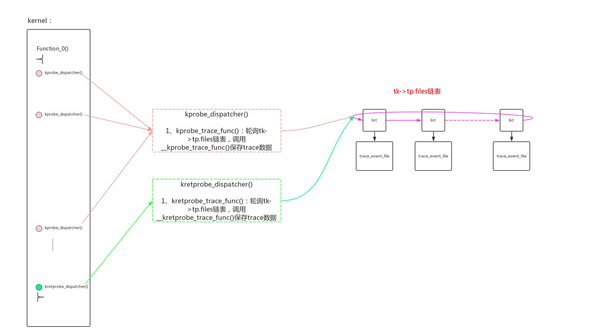
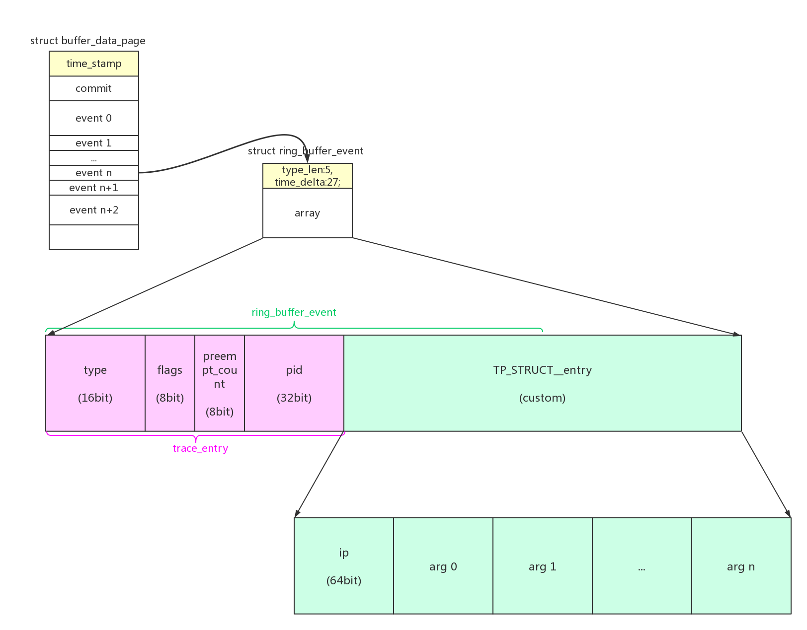
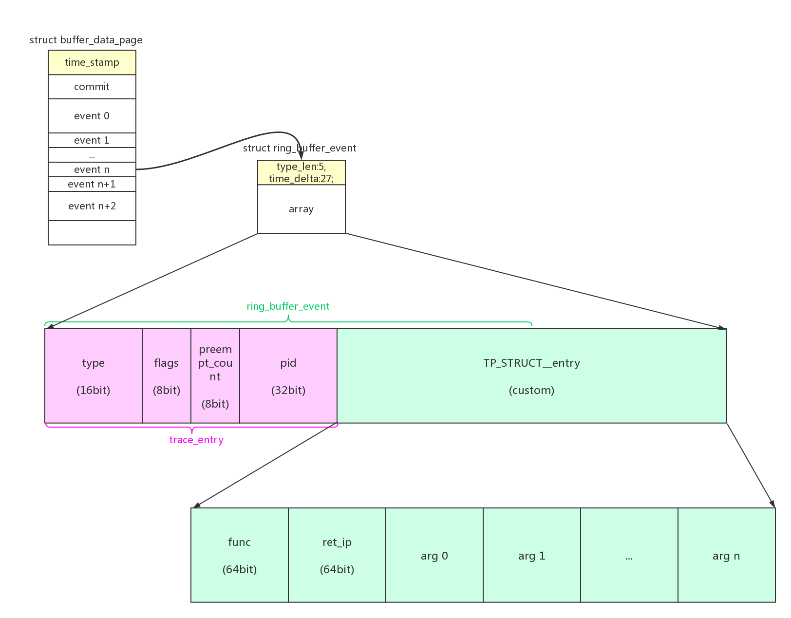

从前面几章看：trace event使用静态tracepoint插桩，function tracer使用“bl _mcount”的插桩点来动态插桩。既然都是插桩，为什么我们不使用功能强大的kprobe机制？

kprobe event就是这样的产物。krpobe event和trace event的功能一样，但是因为它采用的是kprobe插桩机制，所以它不需要预留插桩位置，可以动态的在任何位置进行插桩。开销会大一点，但是非常灵活，是一个非常方便的补充机制。


# 1、函数插桩

## 1.1、插桩原理

kprobe的主要原理是使用“断点异常”和“单步异常”两种异常指令来对任意地址进行插桩，在此基础之上实现了三种机制：

- kprobe。可以被插入到内核的任何指令位置，在被插入指令之前调用kp.pre_handler()，在被插入指令之后调用kp.post_handler()；
- jprobe。只支持对函数进行插入。
- kretprobe。和jprobe类似，机制略有不同，会替换被探测函数的返回地址，让函数先执行插入的钩子函数，再恢复。

具体的kprobe原理可以参考：[Linux kprobe(内核探针 x86)](https://blog.csdn.net/pwl999/article/details/78225858)。

> 需要注意的是arm64在kernel 4.9版本以后才支持kprobe。

## 1.2、kprobe event的使用

kprobe event的使用指南可以参考：[kprobe event的使用](https://blog.csdn.net/pwl999/article/details/80431344)。简单描述如下：

- 1、可以向“/sys/kernel/debug/tracing/kprobe_events”文件中echo命令的形式来创建krpobe event。新的event创建成功后，可以在“/sys/kernel/debug/tracing/events/”文件夹下看到新的“subsystem/event”，操作方法和普通event一样。
- 2、命令格式为：

```
 p[:[GRP/]EVENT] [MOD:]SYM[+offs]|MEMADDR [FETCHARGS]  : Set a probe
 r[MAXACTIVE][:[GRP/]EVENT] [MOD:]SYM[+0] [FETCHARGS]  : Set a return probe
 -:[GRP/]EVENT                                         : Clear a probe

GRP            : Group name. If omitted, use "kprobes" for it.
EVENT          : Event name. If omitted, the event name is generated
                 based on SYM+offs or MEMADDR.
MOD            : Module name which has given SYM.
SYM[+offs]     : Symbol+offset where the probe is inserted.
MEMADDR        : Address where the probe is inserted.
MAXACTIVE      : Maximum number of instances of the specified function that
                 can be probed simultaneously, or 0 for the default value
                 as defined in Documentation/kprobes.txt section 1.3.1.

FETCHARGS      : Arguments. Each probe can have up to 128 args.
 %REG          : Fetch register REG
 @ADDR         : Fetch memory at ADDR (ADDR should be in kernel)
 @SYM[+|-offs] : Fetch memory at SYM +|- offs (SYM should be a data symbol)
 $stackN       : Fetch Nth entry of stack (N >= 0)
 $stack        : Fetch stack address.
 $retval       : Fetch return value.(*)
 $comm         : Fetch current task comm.
 +|-offs(FETCHARG) : Fetch memory at FETCHARG +|- offs address.(**)
 NAME=FETCHARG : Set NAME as the argument name of FETCHARG.
 FETCHARG:TYPE : Set TYPE as the type of FETCHARG. Currently, basic types
                 (u8/u16/u32/u64/s8/s16/s32/s64), hexadecimal types
                 (x8/x16/x32/x64), "string" and bitfield are supported.

 (*) only for return probe.
 (**) this is useful for fetching a field of data structures.
```

- 3、实例，在do_sys_open()函数之上创建一个kprobe，对应的“myprobe” event用来记录4个参数的：

```
echo 'p:myprobe do_sys_open dfd=%ax filename=%dx flags=%cx mode=+4($stack)' > /sys/kernel/debug/tracing/kprobe_events
```

创建成功后，可以通过“ /sys/kernel/debug/tracing/events/kprobes//format”查看event的输出格式：

```
cat /sys/kernel/debug/tracing/events/kprobes/myprobe/format
name: myprobe
ID: 780
format:
        field:unsigned short common_type;       offset:0;       size:2; signed:0;
        field:unsigned char common_flags;       offset:2;       size:1; signed:0;
        field:unsigned char common_preempt_count;       offset:3; size:1;signed:0;
        field:int common_pid;   offset:4;       size:4; signed:1;

        field:unsigned long __probe_ip; offset:12;      size:4; signed:0;
        field:int __probe_nargs;        offset:16;      size:4; signed:1;
        field:unsigned long dfd;        offset:20;      size:4; signed:0;
        field:unsigned long filename;   offset:24;      size:4; signed:0;
        field:unsigned long flags;      offset:28;      size:4; signed:0;
        field:unsigned long mode;       offset:32;      size:4; signed:0;


print fmt: "(%lx) dfd=%lx filename=%lx flags=%lx mode=%lx", REC->__probe_ip,
REC->dfd, REC->filename, REC->flags, REC->mode
```

需要其工作的时候，enable对应的event：

```
echo 1 > /sys/kernel/debug/tracing/events/kprobes/myprobe/enable
```

还在do_sys_open()函数非返回点设置了一个kretprobe，对应的“myretprobe” event用来记录返回值：

```
echo 'r:myretprobe do_sys_open $retval' >> /sys/kernel/debug/tracing/kprobe_events
```

## 1.3、kprobe event的创建



krpobe event和trace event的功能一样，那么大部分的实现是一样的，最关键的不同就是怎么使用新的插桩方法来创建event。使用向“/sys/kernel/debug/tracing/kprobe_events”文件中echo命令的形式来创建krpobe event。

我们来查看具体的代码实现：

```
entry = tracefs_create_file("kprobe_events", 0644, d_tracer,
			    NULL, &kprobe_events_ops);

↓

static const struct file_operations kprobe_events_ops = {
	.owner          = THIS_MODULE,
	.open           = probes_open,
	.read           = seq_read,
	.llseek         = seq_lseek,
	.release        = seq_release,
	.write		= probes_write,
};

↓

static ssize_t probes_write(struct file *file, const char __user *buffer,
			    size_t count, loff_t *ppos)
{
    /* traceprobe_probes_write()把命令字符串进行分段，再来调用create_trace_kprobe() */
	return traceprobe_probes_write(file, buffer, count, ppos,
			create_trace_kprobe);
}

↓

static int create_trace_kprobe(int argc, char **argv)
{
	/*
	 * Argument syntax:
	 *  - Add kprobe: p[:[GRP/]EVENT] [MOD:]KSYM[+OFFS]|KADDR [FETCHARGS]
	 *  - Add kretprobe: r[:[GRP/]EVENT] [MOD:]KSYM[+0] [FETCHARGS]
	 * Fetch args:
	 *  $retval	: fetch return value
	 *  $stack	: fetch stack address
	 *  $stackN	: fetch Nth of stack (N:0-)
	 *  @ADDR	: fetch memory at ADDR (ADDR should be in kernel)
	 *  @SYM[+|-offs] : fetch memory at SYM +|- offs (SYM is a data symbol)
	 *  %REG	: fetch register REG
	 * Dereferencing memory fetch:
	 *  +|-offs(ARG) : fetch memory at ARG +|- offs address.
	 * Alias name of args:
	 *  NAME=FETCHARG : set NAME as alias of FETCHARG.
	 * Type of args:
	 *  FETCHARG:TYPE : use TYPE instead of unsigned long.
	 */
	struct trace_kprobe *tk;
	int i, ret = 0;
	bool is_return = false, is_delete = false;
	char *symbol = NULL, *event = NULL, *group = NULL;
	char *arg;
	unsigned long offset = 0;
	void *addr = NULL;
	char buf[MAX_EVENT_NAME_LEN];

    /* (1) is_return 是否kretprobe？ 
        命令首字 == 'p'，kprobe
        命令首字 == 'r'，kretprobe
        命令首字 == '-'，删除命令，is_delete
     */
	/* argc must be >= 1 */
	if (argv[0][0] == 'p')
		is_return = false;
	else if (argv[0][0] == 'r')
		is_return = true;
	else if (argv[0][0] == '-')
		is_delete = true;
	else {
		pr_info("Probe definition must be started with 'p', 'r' or"
			" '-'.\n");
		return -EINVAL;
	}

    /* (2) event name 和 subsystem(group) name是否有指定？
        没有指定的话，后面会给上默认值
     */
	if (argv[0][1] == ':') {
		event = &argv[0][2];
		if (strchr(event, '/')) {
			group = event;
			event = strchr(group, '/') + 1;
			event[-1] = '\0';
			if (strlen(group) == 0) {
				pr_info("Group name is not specified\n");
				return -EINVAL;
			}
		}
		if (strlen(event) == 0) {
			pr_info("Event name is not specified\n");
			return -EINVAL;
		}
	}
	/* (2.1) 如果subsystem name没有指定，给默认值"kprobes" */
	if (!group)
		group = KPROBE_EVENT_SYSTEM;

    /* (3) 删除已经配置的event */
	if (is_delete) {
		if (!event) {
			pr_info("Delete command needs an event name.\n");
			return -EINVAL;
		}
		mutex_lock(&probe_lock);
		tk = find_trace_kprobe(event, group);
		if (!tk) {
			mutex_unlock(&probe_lock);
			pr_info("Event %s/%s doesn't exist.\n", group, event);
			return -ENOENT;
		}
		/* delete an event */
		ret = unregister_trace_kprobe(tk);
		if (ret == 0)
			free_trace_kprobe(tk);
		mutex_unlock(&probe_lock);
		return ret;
	}

	if (argc < 2) {
		pr_info("Probe point is not specified.\n");
		return -EINVAL;
	}
	
	/* (4.1) 探测地址使用的是“MEMADDR”格式 */
	if (isdigit(argv[1][0])) {
		if (is_return) {
			pr_info("Return probe point must be a symbol.\n");
			return -EINVAL;
		}
		/* an address specified */
		ret = kstrtoul(&argv[1][0], 0, (unsigned long *)&addr);
		if (ret) {
			pr_info("Failed to parse address.\n");
			return ret;
		}
	/* (4.2) 探测地址使用的是“SYM[+offs]”格式 */
	} else {
		/* a symbol specified */
		symbol = argv[1];
		/* TODO: support .init module functions */
		ret = traceprobe_split_symbol_offset(symbol, &offset);
		if (ret) {
			pr_info("Failed to parse symbol.\n");
			return ret;
		}
		if (offset && is_return) {
			pr_info("Return probe must be used without offset.\n");
			return -EINVAL;
		}
	}
	argc -= 2; argv += 2;

	/* setup a probe */
	/* (2.2) 如果event name没有指定，给其组建一个默认值 */
	if (!event) {
		/* Make a new event name */
		if (symbol)
			snprintf(buf, MAX_EVENT_NAME_LEN, "%c_%s_%ld",
				 is_return ? 'r' : 'p', symbol, offset);
		else
			snprintf(buf, MAX_EVENT_NAME_LEN, "%c_0x%p",
				 is_return ? 'r' : 'p', addr);
		event = buf;
	}
	
	/* (5) 分配新的trace_kprobe结构 */
	tk = alloc_trace_kprobe(group, event, addr, symbol, offset, argc,
			       is_return);
	if (IS_ERR(tk)) {
		pr_info("Failed to allocate trace_probe.(%d)\n",
			(int)PTR_ERR(tk));
		return PTR_ERR(tk);
	}

	/* parse arguments */
	ret = 0;
	/* (6) 逐个解析需要trace的字段参数，存储到tk->tp.args[i] */
	for (i = 0; i < argc && i < MAX_TRACE_ARGS; i++) {
		struct probe_arg *parg = &tk->tp.args[i];

		/* Increment count for freeing args in error case */
		tk->tp.nr_args++;

        /* (6.1) 解析出arg name */
		/* Parse argument name */
		arg = strchr(argv[i], '=');
		if (arg) {
			*arg++ = '\0';
			parg->name = kstrdup(argv[i], GFP_KERNEL);
		} else {
			arg = argv[i];
			/* If argument name is omitted, set "argN" */
			snprintf(buf, MAX_EVENT_NAME_LEN, "arg%d", i + 1);
			parg->name = kstrdup(buf, GFP_KERNEL);
		}

		if (!parg->name) {
			pr_info("Failed to allocate argument[%d] name.\n", i);
			ret = -ENOMEM;
			goto error;
		}

		if (!is_good_name(parg->name)) {
			pr_info("Invalid argument[%d] name: %s\n",
				i, parg->name);
			ret = -EINVAL;
			goto error;
		}

		if (traceprobe_conflict_field_name(parg->name,
							tk->tp.args, i)) {
			pr_info("Argument[%d] name '%s' conflicts with "
				"another field.\n", i, argv[i]);
			ret = -EINVAL;
			goto error;
		}

		/* Parse fetch argument */
		/* (6.2) 解析出arg */
		ret = traceprobe_parse_probe_arg(arg, &tk->tp.size, parg,
						is_return, true,
						kprobes_fetch_type_table);
		if (ret) {
			pr_info("Parse error at argument[%d]. (%d)\n", i, ret);
			goto error;
		}
	}

    /* (7) 注册trace_kprobe */
	ret = register_trace_kprobe(tk);
	if (ret)
		goto error;
	return 0;

error:
	free_trace_kprobe(tk);
	return ret;
}

|→

static struct trace_kprobe *alloc_trace_kprobe(const char *group,
					     const char *event,
					     void *addr,
					     const char *symbol,
					     unsigned long offs,
					     int nargs, bool is_return)
{
	struct trace_kprobe *tk;
	int ret = -ENOMEM;

	tk = kzalloc(SIZEOF_TRACE_KPROBE(nargs), GFP_KERNEL);
	if (!tk)
		return ERR_PTR(ret);

	if (symbol) {
		tk->symbol = kstrdup(symbol, GFP_KERNEL);
		if (!tk->symbol)
			goto error;
		tk->rp.kp.symbol_name = tk->symbol;
		tk->rp.kp.offset = offs;
	} else
		tk->rp.kp.addr = addr;

    /* (5.1) kretprobe模式下的桩函数：kretprobe_dispatcher() */
	if (is_return)
		tk->rp.handler = kretprobe_dispatcher;
	/* (5.2) kprobe模式下的桩函数：kprobe_dispatcher() */
	else
		tk->rp.kp.pre_handler = kprobe_dispatcher;

	if (!event || !is_good_name(event)) {
		ret = -EINVAL;
		goto error;
	}

	tk->tp.call.class = &tk->tp.class;
	tk->tp.call.name = kstrdup(event, GFP_KERNEL);
	if (!tk->tp.call.name)
		goto error;

	if (!group || !is_good_name(group)) {
		ret = -EINVAL;
		goto error;
	}

	tk->tp.class.system = kstrdup(group, GFP_KERNEL);
	if (!tk->tp.class.system)
		goto error;

	INIT_LIST_HEAD(&tk->list);
	INIT_LIST_HEAD(&tk->tp.files);
	return tk;
error:
	kfree(tk->tp.call.name);
	kfree(tk->symbol);
	kfree(tk);
	return ERR_PTR(ret);
}

|→

/* Register a trace_probe and probe_event */
static int register_trace_kprobe(struct trace_kprobe *tk)
{
	struct trace_kprobe *old_tk;
	int ret;

	mutex_lock(&probe_lock);

	/* Delete old (same name) event if exist */
	old_tk = find_trace_kprobe(trace_event_name(&tk->tp.call),
			tk->tp.call.class->system);
	if (old_tk) {
		ret = unregister_trace_kprobe(old_tk);
		if (ret < 0)
			goto end;
		free_trace_kprobe(old_tk);
	}

	/* Register new event */
	/* (7.1) 注册trace_event_call部分 ：
	    初始化call->event.funcs等成员
	    使用trace_event_file把trace_event_call和trace_array中的ring buffer联系起来，并且创建trace_event_file对应的文件
	 */
	ret = register_kprobe_event(tk);
	if (ret) {
		pr_warning("Failed to register probe event(%d)\n", ret);
		goto end;
	}

	/* Register k*probe */
	/* (7.2) 注册kprobe部分:
	    kprobe注册成功后，桩函数被插入：
	    kretprobe模式下的桩函数：kretprobe_dispatcher()
	    kprobe模式下的桩函数：kprobe_dispatcher()
	 */
	ret = __register_trace_kprobe(tk);
	if (ret < 0)
		unregister_kprobe_event(tk);
	else
		list_add_tail(&tk->list, &probe_list);

end:
	mutex_unlock(&probe_lock);
	return ret;
}

||→

static int register_kprobe_event(struct trace_kprobe *tk)
{
	struct trace_event_call *call = &tk->tp.call;
	int ret;

	/* Initialize trace_event_call */
	/* (7.1.1) 初始化trace_event_call的一些成员 ：
	    kretprobe_funcs/kprobe_funcs是格式化输出trace数据的函数
	 */
	INIT_LIST_HEAD(&call->class->fields);
	if (trace_kprobe_is_return(tk)) {
		call->event.funcs = &kretprobe_funcs;
		call->class->define_fields = kretprobe_event_define_fields;
	} else {
		call->event.funcs = &kprobe_funcs;
		call->class->define_fields = kprobe_event_define_fields;
	}
	if (set_print_fmt(&tk->tp, trace_kprobe_is_return(tk)) < 0)
		return -ENOMEM;
	
	/* (7.1.2) 给call->event->type分配一个id */
	ret = register_trace_event(&call->event);
	if (!ret) {
		kfree(call->print_fmt);
		return -ENODEV;
	}
	call->flags = TRACE_EVENT_FL_KPROBE;
	call->class->reg = kprobe_register;
	call->data = tk;
	
	/* (7.1.3) 注册trace_event_call，并且创建其trace_event_file结构 */
	ret = trace_add_event_call(call);
	if (ret) {
		pr_info("Failed to register kprobe event: %s\n",
			trace_event_name(call));
		kfree(call->print_fmt);
		unregister_trace_event(&call->event);
	}
	return ret;
}

|||→

int trace_add_event_call(struct trace_event_call *call)
{
	int ret;
	mutex_lock(&trace_types_lock);
	mutex_lock(&event_mutex);

    /* (7.1.3.1) 把trace_event_call加入到ftrace_events链表 */
	ret = __register_event(call, NULL);
	
	/* (7.1.3.2) 使用trace_event_file把trace_event_call和trace_array中的ring buffer联系起来，
	    并且创建trace_event_file对应的文件 
	 */
	if (ret >= 0)
		__add_event_to_tracers(call);

	mutex_unlock(&event_mutex);
	mutex_unlock(&trace_types_lock);
	return ret;
}

||→

static int __register_trace_kprobe(struct trace_kprobe *tk)
{
	int i, ret;

	if (trace_probe_is_registered(&tk->tp))
		return -EINVAL;

	for (i = 0; i < tk->tp.nr_args; i++)
		traceprobe_update_arg(&tk->tp.args[i]);

	/* Set/clear disabled flag according to tp->flag */
	if (trace_probe_is_enabled(&tk->tp))
		tk->rp.kp.flags &= ~KPROBE_FLAG_DISABLED;
	else
		tk->rp.kp.flags |= KPROBE_FLAG_DISABLED;

    /* (7.1.1) 注册kprobe/kretptobe */
	if (trace_kprobe_is_return(tk))
		ret = register_kretprobe(&tk->rp);
	else
		ret = register_kprobe(&tk->rp.kp);

	if (ret == 0)
		tk->tp.flags |= TP_FLAG_REGISTERED;
	else {
		pr_warning("Could not insert probe at %s+%lu: %d\n",
			   trace_kprobe_symbol(tk), trace_kprobe_offset(tk), ret);
		if (ret == -ENOENT && trace_kprobe_is_on_module(tk)) {
			pr_warning("This probe might be able to register after"
				   "target module is loaded. Continue.\n");
			ret = 0;
		} else if (ret == -EILSEQ) {
			pr_warning("Probing address(0x%p) is not an "
				   "instruction boundary.\n",
				   tk->rp.kp.addr);
			ret = -EINVAL;
		}
	}

	return ret;
}

```

kprobe event被创建成功以后，系统处在这样一个状态：

- 1、kprobe/kretprobe的探测点被插桩，桩函数为kprobe_dispatcher()/kretprobe_dispatcher()。桩函数等待着轮询tk->tp.files链表，把trace数据存到对应的ringbuffer当中；
- 2、trace_event_call已经注册，并且创建了trace_event_file把trace_event_call和trace_array中的ring buffer联系了起来；

但是此时，上述两步还没有建立起关系，tk->tp.files链表还是为空。

在enable event的操作中，最后会调用call->class->reg即kprobe_register()函数，把trace_event_file加入到tk->tp.files链表。至此整个数据通道贯通，桩函数会进行trace数据的抓取。

## 1.4、kprobe event的enable

event enable的执行路径为：ftrace_enable_fops -> event_enable_write() -> ftrace_event_enable_disable() -> __ftrace_event_enable_disable() -> call->class->reg(call, TRACE_REG_UNREGISTER/TRACE_REG_REGISTER, file);

kprobe event的call->class->reg()为kprobe_register()：

```
static int kprobe_register(struct trace_event_call *event,
			   enum trace_reg type, void *data)
{
	struct trace_kprobe *tk = (struct trace_kprobe *)event->data;
	struct trace_event_file *file = data;

	switch (type) {
	case TRACE_REG_REGISTER:
		return enable_trace_kprobe(tk, file);
	case TRACE_REG_UNREGISTER:
		return disable_trace_kprobe(tk, file);

#ifdef CONFIG_PERF_EVENTS
	case TRACE_REG_PERF_REGISTER:
		return enable_trace_kprobe(tk, NULL);
	case TRACE_REG_PERF_UNREGISTER:
		return disable_trace_kprobe(tk, NULL);
	case TRACE_REG_PERF_OPEN:
	case TRACE_REG_PERF_CLOSE:
	case TRACE_REG_PERF_ADD:
	case TRACE_REG_PERF_DEL:
		return 0;
#endif
	}
	return 0;
}

↓

static int
enable_trace_kprobe(struct trace_kprobe *tk, struct trace_event_file *file)
{
	int ret = 0;

    /* 把trace_event_file加入到tk->tp.files链表 */
	if (file) {
		struct event_file_link *link;

		link = kmalloc(sizeof(*link), GFP_KERNEL);
		if (!link) {
			ret = -ENOMEM;
			goto out;
		}

		link->file = file;
		list_add_tail_rcu(&link->list, &tk->tp.files);

		tk->tp.flags |= TP_FLAG_TRACE;
	} else
		tk->tp.flags |= TP_FLAG_PROFILE;

	if (trace_probe_is_registered(&tk->tp) && !trace_kprobe_has_gone(tk)) {
		if (trace_kprobe_is_return(tk))
			ret = enable_kretprobe(&tk->rp);
		else
			ret = enable_kprobe(&tk->rp.kp);
	}
 out:
	return ret;
}
```

# 2、数据存入

kprobe event的数据存入路径为：kprobe_dispatcher() -> kprobe_trace_func() -> __kprobe_trace_func()：

```
/* Kprobe handler */
static nokprobe_inline void
__kprobe_trace_func(struct trace_kprobe *tk, struct pt_regs *regs,
		    struct trace_event_file *trace_file)
{
	struct kprobe_trace_entry_head *entry;
	struct ring_buffer_event *event;
	struct ring_buffer *buffer;
	int size, dsize, pc;
	unsigned long irq_flags;
	struct trace_event_call *call = &tk->tp.call;

	WARN_ON(call != trace_file->event_call);

    /* (1) 如果当前event的trigger没有组合filter条件：
        1、无条件执行trigger command；
        2、如果是soft disable模式，直接返回；
        3、判断pid filter；
     */
	if (trace_trigger_soft_disabled(trace_file))
		return;

	local_save_flags(irq_flags);
	pc = preempt_count();

    /* (2) 计算trace数据的长度：
        sizeof(*entry)：头部长度
        tk->tp.size：固定数据长度
        dsize：动态数据的长度
     */
	dsize = __get_data_size(&tk->tp, regs);
	size = sizeof(*entry) + tk->tp.size + dsize;

    /* (3) 从ringbuffer中分配空间 */
	event = trace_event_buffer_lock_reserve(&buffer, trace_file,
						call->event.type,
						size, irq_flags, pc);
	if (!event)
		return;

    /* (4) 存储头部数据 */
	entry = ring_buffer_event_data(event);
	entry->ip = (unsigned long)tk->rp.kp.addr;
	
	/* (5) 存储event自定义数据 */
	store_trace_args(sizeof(*entry), &tk->tp, regs, (u8 *)&entry[1], dsize);

    /* (6) 提交确认数据 */
	event_trigger_unlock_commit_regs(trace_file, buffer, event,
					 entry, irq_flags, pc, regs);
}

↓

/* Store the value of each argument */
static nokprobe_inline void
store_trace_args(int ent_size, struct trace_probe *tp, struct pt_regs *regs,
		 u8 *data, int maxlen)
{
	int i;
	u32 end = tp->size;
	u32 *dl;	/* Data (relative) location */

    /* (5.1) 逐个拷贝arg到trace data中 */
	for (i = 0; i < tp->nr_args; i++) {
		if (unlikely(tp->args[i].fetch_size.fn)) {
			/*
			 * First, we set the relative location and
			 * maximum data length to *dl
			 */
			dl = (u32 *)(data + tp->args[i].offset);
			*dl = make_data_rloc(maxlen, end - tp->args[i].offset);
			/* Then try to fetch string or dynamic array data */
			call_fetch(&tp->args[i].fetch, regs, dl);
			/* Reduce maximum length */
			end += get_rloc_len(*dl);
			maxlen -= get_rloc_len(*dl);
			/* Trick here, convert data_rloc to data_loc */
			*dl = convert_rloc_to_loc(*dl,
				 ent_size + tp->args[i].offset);
		} else
			/* Just fetching data normally */
			call_fetch(&tp->args[i].fetch, regs,
				   data + tp->args[i].offset);
	}
}

```

kretprobe event的数据存入路径为：kretprobe_dispatcher() -> kretprobe_trace_func() -> __kretprobe_trace_func()：

```
/* Kretprobe handler */
static nokprobe_inline void
__kretprobe_trace_func(struct trace_kprobe *tk, struct kretprobe_instance *ri,
		       struct pt_regs *regs,
		       struct trace_event_file *trace_file)
{
	struct kretprobe_trace_entry_head *entry;
	struct ring_buffer_event *event;
	struct ring_buffer *buffer;
	int size, pc, dsize;
	unsigned long irq_flags;
	struct trace_event_call *call = &tk->tp.call;

	WARN_ON(call != trace_file->event_call);

	if (trace_trigger_soft_disabled(trace_file))
		return;

	local_save_flags(irq_flags);
	pc = preempt_count();

	dsize = __get_data_size(&tk->tp, regs);
	size = sizeof(*entry) + tk->tp.size + dsize;

	event = trace_event_buffer_lock_reserve(&buffer, trace_file,
						call->event.type,
						size, irq_flags, pc);
	if (!event)
		return;

    /* 存储头部格式略有不同 */
	entry = ring_buffer_event_data(event);
	entry->func = (unsigned long)tk->rp.kp.addr;
	entry->ret_ip = (unsigned long)ri->ret_addr;
	store_trace_args(sizeof(*entry), &tk->tp, regs, (u8 *)&entry[1], dsize);

	event_trigger_unlock_commit_regs(trace_file, buffer, event,
					 entry, irq_flags, pc, regs);
}
```


## 2.1、数据格式

kprobe event的数据格式为：



kretprobe event的数据格式为：




## 2.2、filter

trigger、filter和普通的trace event操作一致，请参考：[trace event](https://blog.csdn.net/pwl999/article/details/80514271)

# 3、数据读出

从trace文件读出的kprobe event数据格式为：

```
cat /sys/kernel/debug/tracing/trace
# tracer: nop
#
#           TASK-PID    CPU#    TIMESTAMP  FUNCTION
#              | |       |          |         |
           <...>-1447  [001] 1038282.286875: myprobe: (do_sys_open+0x0/0xd6) dfd=3 filename=7fffd1ec4440 flags=8000 mode=0
           <...>-1447  [001] 1038282.286878: myretprobe: (sys_openat+0xc/0xe <- do_sys_open) $retval=fffffffffffffffe
           <...>-1447  [001] 1038282.286885: myprobe: (do_sys_open+0x0/0xd6) dfd=ffffff9c filename=40413c flags=8000 mode=1b6
           <...>-1447  [001] 1038282.286915: myretprobe: (sys_open+0x1b/0x1d <- do_sys_open) $retval=3
           <...>-1447  [001] 1038282.286969: myprobe: (do_sys_open+0x0/0xd6) dfd=ffffff9c filename=4041c6 flags=98800 mode=10
           <...>-1447  [001] 1038282.286976: myretprobe: (sys_open+0x1b/0x1d <- do_sys_open) $retval=3
```

在register_kprobe_event()中，对kprobe模式的event.funcs赋值kprobe_funcs，对kretprobe模式的event.funcs赋值kretprobe_funcs：

```
static int register_kprobe_event(struct trace_kprobe *tk)
{

	/* Initialize trace_event_call */
	INIT_LIST_HEAD(&call->class->fields);
	if (trace_kprobe_is_return(tk)) {
		call->event.funcs = &kretprobe_funcs;
		call->class->define_fields = kretprobe_event_define_fields;
	} else {
		call->event.funcs = &kprobe_funcs;
		call->class->define_fields = kprobe_event_define_fields;
	}

}

↓

static struct trace_event_functions kretprobe_funcs = {
	.trace		= print_kretprobe_event
};

static struct trace_event_functions kprobe_funcs = {
	.trace		= print_kprobe_event
};
```

在数据读出时，会调用到event对应的event->funcs->trace()函数，seq_read() -> s_show() -> print_trace_line() -> print_trace_fmt() -> event->funcs->trace()：


kprobe模式对应print_kprobe_event()：

```
/* Event entry printers */
static enum print_line_t
print_kprobe_event(struct trace_iterator *iter, int flags,
		   struct trace_event *event)
{
	struct kprobe_trace_entry_head *field;
	struct trace_seq *s = &iter->seq;
	struct trace_probe *tp;
	u8 *data;
	int i;

	field = (struct kprobe_trace_entry_head *)iter->ent;
	tp = container_of(event, struct trace_probe, call.event);

    /* (1) 打印event name */
	trace_seq_printf(s, "%s: (", trace_event_name(&tp->call));

    /* (2) 打印ip对应的symbol */
	if (!seq_print_ip_sym(s, field->ip, flags | TRACE_ITER_SYM_OFFSET))
		goto out;

	trace_seq_putc(s, ')');

	data = (u8 *)&field[1];
	/* (3) 逐个打印arg的name = value */
	for (i = 0; i < tp->nr_args; i++)
		if (!tp->args[i].type->print(s, tp->args[i].name,
					     data + tp->args[i].offset, field))
			goto out;

	trace_seq_putc(s, '\n');
 out:
	return trace_handle_return(s);
}
```

kretprobe模式对应print_kretprobe_event()：

```
static enum print_line_t
print_kretprobe_event(struct trace_iterator *iter, int flags,
		      struct trace_event *event)
{
	struct kretprobe_trace_entry_head *field;
	struct trace_seq *s = &iter->seq;
	struct trace_probe *tp;
	u8 *data;
	int i;

	field = (struct kretprobe_trace_entry_head *)iter->ent;
	tp = container_of(event, struct trace_probe, call.event);

    /* (1) 打印event name */
	trace_seq_printf(s, "%s: (", trace_event_name(&tp->call));

    /* (2) 打印函数返回地址 */
	if (!seq_print_ip_sym(s, field->ret_ip, flags | TRACE_ITER_SYM_OFFSET))
		goto out;

	trace_seq_puts(s, " <- ");

    /* (3) 打印函数地址 */
	if (!seq_print_ip_sym(s, field->func, flags & ~TRACE_ITER_SYM_OFFSET))
		goto out;

	trace_seq_putc(s, ')');

	data = (u8 *)&field[1];
	/* (4) 逐个打印arg的name = value */
	for (i = 0; i < tp->nr_args; i++)
		if (!tp->args[i].type->print(s, tp->args[i].name,
					     data + tp->args[i].offset, field))
			goto out;

	trace_seq_putc(s, '\n');

 out:
	return trace_handle_return(s);
}
```
