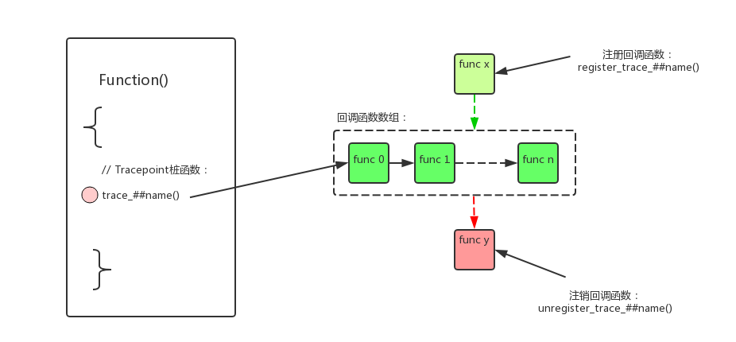

Linux trace中，最基础的就是：function tracer和trace event。鉴于他们搭建的良好的框架(ringbuffer、tracefs)，各种trace纷纷投奔而来。

- tracer发展出了function、function_graph、irqsoff、preemptoff、wakeup等一系列tracer。
- 而event也发展出tracepoint、kprobe、uprobe等一系列的event。


不论是哪种trace，主要的工作都离不开上图的主要流程：

- 函数插桩。使用各种插桩方式把自己的trace函数插入到需要跟踪的probe point上；
- input trace数据。在trace的probe函数被命中时，会存储数据到ringbuffer当中；这里还包括filter和trigger功能；
- ouput trace数据。用户或者程序需要读出trace数据，根据需要输出ram数据或者是方面用户阅读的数据；对数据的解析，遵循谁存储谁提供解析规则的原则；

# 1、函数插桩

trace event的插桩使用的是tracepoint机制，tracepoint是一种静态的插桩方法。他需要静态的定义桩函数，并且在插桩位置显式的调用。

这种方法的好处是效率高、可靠，并且可以处于函数中的任何位置、方便的访问各种变量；坏处当然是不太灵活。

kernel在重要节点的固定位置，插入了几百个trace event用于跟踪。

## 1.1、trace point



关于tracepoint的工作的原理，我们举例说明：

1、我们在“kernel/sched/core.c”中通过

```
#define CREATE_TRACE_POINTS
#include <trace/events/sched.h>
```

创建了一个tracepoint：__tracepoint_sched_switch (其中##name = sched_switch)。

同时创建了几个操作tracepoint的函数：

- 桩函数trace_##name();
- 注册回调函数register_trace_##name();
- 注销回调函数unregister_trace_##name();

2、tracepoint的定义如下：

```
struct tracepoint {
	const char *name;		/* Tracepoint name */
	struct static_key key;
	void (*regfunc)(void);
	void (*unregfunc)(void);
	struct tracepoint_func __rcu *funcs;
};
```

各个字段的含义如下：

- key。tracepoint是否使能的开关。如果回调函数数组为空则key为disable，如果回调函数数组中有函数指针则key为enable；
- *funcs。回调函数数组，tracepoint的作用就是在桩函数被命中时，逐个调用回调函数数组中的函数；
- *regfunc/*unregfunc。注册/注销回调函数时的的钩子函数。注意这两个函数只是hook函数，不是用户用来注册/注销回调函数的，注册/注销回调函数的是register_trace_##name()/unregister_trace_##name();

3、我们在探测点插入桩函数：

kernel/sched/core.c：

```
static void __sched notrace __schedule(bool preempt)
{

    trace_sched_switch(preempt, prev, next);

}
```

4、桩函数被命中时的执行流程：

可以看到就是逐条的执行回调函数数组中的函数指针。

```
trace_sched_switch()

↓

static inline void trace_##name(proto)				\
{								\
	if (static_key_false(&__tracepoint_##name.key))		\
		__DO_TRACE(&__tracepoint_##name,		\
			TP_PROTO(data_proto),			\
			TP_ARGS(data_args),			\
			TP_CONDITION(cond),,);			\
	if (IS_ENABLED(CONFIG_LOCKDEP) && (cond)) {		\
		rcu_read_lock_sched_notrace();			\
		rcu_dereference_sched(__tracepoint_##name.funcs);\
		rcu_read_unlock_sched_notrace();		\
	}							\
}

↓

#define __DO_TRACE(tp, proto, args, cond, prercu, postrcu)		\
	do {								\
		struct tracepoint_func *it_func_ptr;			\
		void *it_func;						\
		void *__data;						\
									\
		if (!(cond))						\
			return;						\
		prercu;							\
		rcu_read_lock_sched_notrace();				\
		
		/* (1) 逐个调用(tp)->funcs函数数组中的函数 
		    这些函数可以由trace_event注册，也可以由其他人注册
		*/
		it_func_ptr = rcu_dereference_sched((tp)->funcs);	\
		if (it_func_ptr) {					\
			do {						\
				it_func = (it_func_ptr)->func;		\
				__data = (it_func_ptr)->data;		\
				((void(*)(proto))(it_func))(args);	\
			} while ((++it_func_ptr)->func);		\
		}							\
		rcu_read_unlock_sched_notrace();			\
		postrcu;						\
	} while (0)

```

5、注册回调函数：

可以通过register_trace_##name()/unregister_trace_##name()函数向回调函数数组中添加/删除函数指针。

```
	static inline int						\
	register_trace_##name(void (*probe)(data_proto), void *data)	\
	{								\
		return tracepoint_probe_register(&__tracepoint_##name,	\
						(void *)probe, data);	\
	}								\

	static inline int						\
	unregister_trace_##name(void (*probe)(data_proto), void *data)	\
	{								\
		return tracepoint_probe_unregister(&__tracepoint_##name,\
						(void *)probe, data);	\
	}	
```

6、trace event对tracepoint的利用：

以上可以看到，tracepoint只是一种静态插桩方法。trace event可以使用，其他机制也可以使用，只是kernel的绝大部分tracepoint都是trace event在使用。

单纯的定义和使用一个trace point，可以参考：[Documentation/trace/tracepoints.txt](https://www.kernel.org/doc/Documentation/trace/tracepoints.txt)

trace event也必须向tracepoint注册自己的回调函数，这些回调函数的作用就是在函数被命中时往ringbuffer中写入trace信息。

## 1.2、增加一个新的trace event

在现有的代码中添加探测函数，这是让很多内核开发者非常不爽的一件事，因为这可能降低性能或者让代码看起来非常臃肿。为了解决这些问题，内核最终进化出了一个TRACE_EVENT()来实现trace event的定义，这是非常简洁、智能的一个宏定义。

在理解TRACE_EVENT()宏之前，我们先来了解一下怎么样使用TRACE_EVENT()新增加一个trace event。

新增加trace event，我们必须遵循规定的格式。格式可以参考：[Using the TRACE_EVENT() macro (Part 1)](https://lwn.net/Articles/379903/)和[samples/trace_events](https://git.kernel.org/pub/scm/linux/kernel/git/torvalds/linux.git/tree/samples/trace_events)。

以下以内核中已经存在的event sched_switch为例，说明定义过程。

- 1、首先需要在include/trace/events/文件夹下添加一个自己event的头文件，需要遵循注释的标准格式：

include/trace/events/sched.h:

```
// (1)TRACE_SYSTEM需要定义的 和头文件名一样，不然后续使用TRACE_SYSTEM多次include头文件的时候会出错
#undef TRACE_SYSTEM
#define TRACE_SYSTEM sched

// (2)定义一个可以重复include的入口：TRACE_HEADER_MULTI_READ
#if !defined(_TRACE_SCHED_H) || defined(TRACE_HEADER_MULTI_READ)
#define _TRACE_SCHED_H

// (3)包含进tracepoint.h文件
#include <linux/tracepoint.h>

// (4)TRACE_EVENT包含5个参数：(name, proto, args, struct, assign, print)
// 前面两个参数：proto, args，是给定义tracepoint使用的。在linux/tracepoint.h中构造tracepoint桩函数、callback regitser/unregister函数，在trace/define_trace.h中定义tracepoint变量。
// 后面三个参数：struct, assign, print，是给trace_event使用的。在trace/trace_events.h，构造trace_event的callback函数，注册到tracepoint。
TRACE_EVENT(sched_switch,

	TP_PROTO(bool preempt,
		 struct task_struct *prev,
		 struct task_struct *next),

	TP_ARGS(preempt, prev, next),

	TP_STRUCT__entry(
		__array(	char,	prev_comm,	TASK_COMM_LEN	)
		__field(	pid_t,	prev_pid			)
		__field(	int,	prev_prio			)
		__field(	long,	prev_state			)
		__array(	char,	next_comm,	TASK_COMM_LEN	)
		__field(	pid_t,	next_pid			)
		__field(	int,	next_prio			)
	),

	TP_fast_assign(
		memcpy(__entry->next_comm, next->comm, TASK_COMM_LEN);
		__entry->prev_pid	= prev->pid;
		__entry->prev_prio	= prev->prio;
		__entry->prev_state	= __trace_sched_switch_state(preempt, prev);
		memcpy(__entry->prev_comm, prev->comm, TASK_COMM_LEN);
		__entry->next_pid	= next->pid;
		__entry->next_prio	= next->prio;
	),

	TP_printk("prev_comm=%s prev_pid=%d prev_prio=%d prev_state=%s%s ==> next_comm=%s next_pid=%d next_prio=%d",
		__entry->prev_comm, __entry->prev_pid, __entry->prev_prio,
		__entry->prev_state & (TASK_STATE_MAX-1) ?
		  __print_flags(__entry->prev_state & (TASK_STATE_MAX-1), "|",
				{ 1, "S"} , { 2, "D" }, { 4, "T" }, { 8, "t" },
				{ 16, "Z" }, { 32, "X" }, { 64, "x" },
				{ 128, "K" }, { 256, "W" }, { 512, "P" },
				{ 1024, "N" }) : "R",
		__entry->prev_state & TASK_STATE_MAX ? "+" : "",
		__entry->next_comm, __entry->next_pid, __entry->next_prio)
);

// (5) 为了节约text空间，如果参数都一样只是位置不一样，可以使用DECLARE_EVENT_CLASS() + DEFINE_EVENT()的形式来定义TRACE_EVENT()
// 最新的kernel中，使用TRACE_EVENT()和使用DECLARE_EVENT_CLASS() + DEFINE_EVENT()是等价的
DECLARE_EVENT_CLASS(sched_process_template,

	TP_PROTO(struct task_struct *p),

	TP_ARGS(p),

	TP_STRUCT__entry(
		__array(	char,	comm,	TASK_COMM_LEN	)
		__field(	pid_t,	pid			)
		__field(	int,	prio			)
	),

	TP_fast_assign(
		memcpy(__entry->comm, p->comm, TASK_COMM_LEN);
		__entry->pid		= p->pid;
		__entry->prio		= p->prio;
	),

	TP_printk("comm=%s pid=%d prio=%d",
		  __entry->comm, __entry->pid, __entry->prio)
);

/*
 * Tracepoint for freeing a task:
 */
DEFINE_EVENT(sched_process_template, sched_process_free,
	     TP_PROTO(struct task_struct *p),
	     TP_ARGS(p));


/*
 * Tracepoint for a task exiting:
 */
DEFINE_EVENT(sched_process_template, sched_process_exit,
	     TP_PROTO(struct task_struct *p),
	     TP_ARGS(p));

/*
 * Tracepoint for waiting on task to unschedule:
 */
DEFINE_EVENT(sched_process_template, sched_wait_task,
	TP_PROTO(struct task_struct *p),
	TP_ARGS(p));

#endif /* _TRACE_SCHED_H */

// (6) 包含进define_trace.h文件
/* This part must be outside protection */
#include <trace/define_trace.h>
```

- 2、在探测点位置中调用桩函数，需要遵循注释的标准格式：

kernel/sched/core.c:

```
// (1) 定义CREATE_TRACE_POINTS，让define_trace.h能够进入，进行tracepoint和trace_event的创建
#define CREATE_TRACE_POINTS
#include <trace/events/sched.h>

static void __sched notrace __schedule(bool preempt)
{

// (2)trace_point定义的桩函数，在需要插桩的位置进行调用
trace_sched_switch(preempt, prev, next);
}
```

## 1.3、TRACE_EVENT()宏的解析

从上一节的使用中看，TRACE_EVENT()的使用非常简洁，只是定义了一系列的数据，调用也只是一句话。TRACE_EVENT()帮用户隐藏了所有的复杂细节，函数的定义、数据的写入读出、数据的解析。具体实现了以下功能：

- 创建了一个tracepoint，可以放到kernel代码中；
- 创建了一个回调函数，可以被上述tracepoint调用
- 回调函数必须实现以最快的方式将传递给它的数据记录到trace ringbuffer中。
- 必须创建一个函数能解析从ringbuffer读出的数据，转换成便于用户理解的形式。

TRACE_EVENT()为什么这么强大，用一个宏定义出所有的数据和函数？它的主要魔法是使用了一个cpp多次定义的一个技巧：

```
#define DOGS { C(JACK_RUSSELL), C(BULL_TERRIER), C(ITALIAN_GREYHOUND) }
#undef C
#define C(a) ENUM_##a
enum dog_enums DOGS;
#undef C
#define C(a) #a
char *dog_strings[] = DOGS;
char *dog_to_string(enum dog_enums dog)
{
       return dog_strings[dog];
}
```

上例中，我们可以看到利用C()这个宏，重复的进行"#undef #define"。第一次我们定义了dog_enums，第二次我们定义了dog_strings[]。内核中也有大量的代码使用了这个技巧，TRACE_EVENT()更是把这个技巧运用到了极致。

我们来分析一下TRACE_EVENT()的扩展过程：

1、在tracepoint.h中，宏TRACE_EVENT()第一次展开，定义了tracepoint需要的一些函数。包括：

- tracepoint桩函数；桩函数的作用，就是在被调用时，按优先级调用所有的callback函数去执行；
- tracepoint callback的register/unregister函数；

```
#define TRACE_EVENT(name, proto, args, struct, assign, print)	\
	DECLARE_TRACE(name, PARAMS(proto), PARAMS(args))
↓
#define DECLARE_TRACE(name, proto, args)				\
	__DECLARE_TRACE(name, PARAMS(proto), PARAMS(args),		\
			cpu_online(raw_smp_processor_id()),		\
			PARAMS(void *__data, proto),			\
			PARAMS(__data, args))
↓
#define __DECLARE_TRACE(name, proto, args, cond, data_proto, data_args) \
// (1)tracepoint变量“__tracepoint_##name”本身，并不是本次定义的
	extern struct tracepoint __tracepoint_##name;			\
// (2)tracepoint桩函数“trace_##name”的定义
	static inline void trace_##name(proto)				\
	{								\
		if (static_key_false(&__tracepoint_##name.key))		\
			__DO_TRACE(&__tracepoint_##name,		\
				TP_PROTO(data_proto),			\
				TP_ARGS(data_args),			\
				TP_CONDITION(cond),,);			\
		if (IS_ENABLED(CONFIG_LOCKDEP) && (cond)) {		\
			rcu_read_lock_sched_notrace();			\
			rcu_dereference_sched(__tracepoint_##name.funcs);\
			rcu_read_unlock_sched_notrace();		\
		}							\
	}								\
	__DECLARE_TRACE_RCU(name, PARAMS(proto), PARAMS(args),		\
		PARAMS(cond), PARAMS(data_proto), PARAMS(data_args))	\
// (3)tracepoint的回调函数注册函数"register_trace_##name"
// 出来trace_event，普通用户也可以调用这个函数来注册自己的回调函数
	static inline int						\
	register_trace_##name(void (*probe)(data_proto), void *data)	\
	{								\
		return tracepoint_probe_register(&__tracepoint_##name,	\
						(void *)probe, data);	\
	}								\
	static inline int						\
	register_trace_prio_##name(void (*probe)(data_proto), void *data,\
				   int prio)				\
	{								\
		return tracepoint_probe_register_prio(&__tracepoint_##name, \
					      (void *)probe, data, prio); \
	}								\
// (4)tracepoint的回调函数反注册函数"unregister_trace_##name"
	static inline int						\
	unregister_trace_##name(void (*probe)(data_proto), void *data)	\
	{								\
		return tracepoint_probe_unregister(&__tracepoint_##name,\
						(void *)probe, data);	\
	}								\
	static inline void						\
	check_trace_callback_type_##name(void (*cb)(data_proto))	\
	{								\
	}								\
	static inline bool						\
	trace_##name##_enabled(void)					\
	{								\
		return static_key_false(&__tracepoint_##name.key);	\
	}

↓
// (2.1) 桩函数中，逐个调用回调函数进行执行
#define __DO_TRACE(tp, proto, args, cond, prercu, postrcu)		\
	do {								\
		struct tracepoint_func *it_func_ptr;			\
		void *it_func;						\
		void *__data;						\
									\
		if (!(cond))						\
			return;						\
		prercu;							\
		rcu_read_lock_sched_notrace();				\
		it_func_ptr = rcu_dereference_sched((tp)->funcs);	\
		if (it_func_ptr) {					\
			do {						\
				it_func = (it_func_ptr)->func;		\
				__data = (it_func_ptr)->data;		\
				((void(*)(proto))(it_func))(args);	\
			} while ((++it_func_ptr)->func);		\
		}							\
		rcu_read_unlock_sched_notrace();			\
		postrcu;						\
	} while (0)

```

2、在define_trace.h中，宏TRACE_EVENT()第二次的展开：

- 这一次的目的是定义tracepoint变量“__tracepoint_##name”本身。

```
// (1) 只有定义了CREATE_TRACE_POINTS，才准许进入
#ifdef CREATE_TRACE_POINTS

// (2) 为了避免后面TRACE_INCLUDE(TRACE_INCLUDE_FILE)多次重复包含，undefine掉CREATE_TRACE_POINTS
/* Prevent recursion */
#undef CREATE_TRACE_POINTS

// (3)定义TRACE_INCLUDE()宏和TRACE_INCLUDE_FILE()宏
// "#include TRACE_INCLUDE(TRACE_INCLUDE_FILE)"的意思就是对用户定义的头文件进行再次包含(例如"include/trace/events/sched.h")
// 这样会让其中的TRACE_EVENT()宏再次展开
#ifndef TRACE_INCLUDE_FILE
# define TRACE_INCLUDE_FILE TRACE_SYSTEM
# define UNDEF_TRACE_INCLUDE_FILE
#endif

#ifndef TRACE_INCLUDE_PATH
# define __TRACE_INCLUDE(system) <trace/events/system.h>
# define UNDEF_TRACE_INCLUDE_PATH
#else
# define __TRACE_INCLUDE(system) __stringify(TRACE_INCLUDE_PATH/system.h)
#endif

# define TRACE_INCLUDE(system) __TRACE_INCLUDE(system)

// (4.1)重新定义TRACE_EVENT()
#undef TRACE_EVENT
#define TRACE_EVENT(name, proto, args, tstruct, assign, print)	\
	DEFINE_TRACE(name)

// (4.2)定义TRACE_HEADER_MULTI_READ，让用户定义的头文件能重复进入(例如"include/trace/events/sched.h")
/* Let the trace headers be reread */
#define TRACE_HEADER_MULTI_READ

// (4.3)重新包含用户定义的头文件(例如"include/trace/events/sched.h")，让其中的TRACE_EVENT()定义再次展开
#include TRACE_INCLUDE(TRACE_INCLUDE_FILE)


#ifdef TRACEPOINTS_ENABLED
// (5) 包含trace_events.h
// 在trace_events.h中，继续多次重新定义TRACE_EVENT()，重新包含用户定义的头文件(例如"include/trace/events/sched.h")
// 目的是实现trace_event对应tracepoint callback函数的定义
#include <trace/trace_events.h>
#include <trace/perf.h>
#endif

// (6) 恢复CREATE_TRACE_POINTS的定义
/* We may be processing more files */
#define CREATE_TRACE_POINTS

#endif /* CREATE_TRACE_POINTS */
```

tracepoint.h:
```
↓
#define DEFINE_TRACE(name)						\
	DEFINE_TRACE_FN(name, NULL, NULL);
↓
#define DEFINE_TRACE_FN(name, reg, unreg)				 \
	static const char __tpstrtab_##name[]				 \
	__attribute__((section("__tracepoints_strings"))) = #name;	 \
// (4.1.1)定义tracepoint变量“__tracepoint_##name”本身
	struct tracepoint __tracepoint_##name				 \
	__attribute__((section("__tracepoints"))) =			 \
		{ __tpstrtab_##name, STATIC_KEY_INIT_FALSE, reg, unreg, NULL };\
// (4.1.2)将tracepoint变量指针"__tracepoint_ptr_##name"存放到section("__tracepoints_ptrs")
	static struct tracepoint * const __tracepoint_ptr_##name __used	 \
	__attribute__((section("__tracepoints_ptrs"))) =		 \
		&__tracepoint_##name;
```


在随后的trace_events.h中，宏TRACE_EVENT()又进行了多次的展开。
其中的关键是使用了一个技巧，重复多次定义多次展开。这里是这种技巧的一个最简单的demo：

```
   #define DOGS { C(JACK_RUSSELL), C(BULL_TERRIER), C(ITALIAN_GREYHOUND) }
   #undef C
   #define C(a) ENUM_##a
   enum dog_enums DOGS;
   #undef C
   #define C(a) #a
   char *dog_strings[] = DOGS;
   char *dog_to_string(enum dog_enums dog)
   {
           return dog_strings[dog];
   }
```

3、trace_events.h中，宏TRACE_EVENT()又进行了多次的展开，定义了trace_event对应tracepoint callback需要的一系列函数。

宏TRACE_EVENT()第3次的展开：

- 定义了一个数据类型"struct trace_event_raw_##name"。用来表示trace_event数据在ringbuffer中的原始存储格式，动态长度成员使用32bit的" __data_loc_##item" 来占位，其中低16bit表示偏移地址，高16bit表示数据长度。

```
// (1) 重新定义TRACE_EVENT()
#undef TRACE_EVENT
#define TRACE_EVENT(name, proto, args, tstruct, assign, print) \
	DECLARE_EVENT_CLASS(name,			       \
			     PARAMS(proto),		       \
			     PARAMS(args),		       \
			     PARAMS(tstruct),		       \
			     PARAMS(assign),		       \
			     PARAMS(print));		       \
	DEFINE_EVENT(name, name, PARAMS(proto), PARAMS(args));

↓

#undef __field
#define __field(type, item)		type	item;

#undef __field_ext
#define __field_ext(type, item, filter_type)	type	item;

#undef __field_struct
#define __field_struct(type, item)	type	item;

#undef __field_struct_ext
#define __field_struct_ext(type, item, filter_type)	type	item;

#undef __array
#define __array(type, item, len)	type	item[len];

// 动态长度成员32bit的占位符“__data_loc_##item”
// 低16bit是动态长度成员在结构体中的偏移量：__get_dynamic_array() = ((void *)__entry + (__entry->__data_loc_##field & 0xffff))
// 高16bit是动态长度成员的长度：__get_dynamic_array_len() = ((__entry->__data_loc_##field >> 16) & 0xffff)
#undef __dynamic_array
#define __dynamic_array(type, item, len) u32 __data_loc_##item;

#undef __string
#define __string(item, src) __dynamic_array(char, item, -1)

#undef __bitmask
#define __bitmask(item, nr_bits) __dynamic_array(char, item, -1)

#undef TP_STRUCT__entry
#define TP_STRUCT__entry(args...) args

// (2) 重新定义DECLARE_EVENT_CLASS()
#undef DECLARE_EVENT_CLASS
#define DECLARE_EVENT_CLASS(name, proto, args, tstruct, assign, print)	\
// (2.1)定义类型"struct trace_event_raw_##name"
	struct trace_event_raw_##name {					\
		struct trace_entry	ent;				\
		tstruct							\
		char			__data[0];			\
	};								\
									\
	// (2.2) 定义“struct  trace_event_class ”类型的变量"event_class_##name"
// 这里只是定义了一个没有被初始化的变量，后面会被其他赋值变量覆盖
// 这里也有一个C语言的技巧：全局变量如果没有初始化赋值，会被后面有初始化赋值的变量定义所覆盖，而不会出现“变量重定义”的错误
static struct trace_event_class event_class_##name;

// (3) 重新定义DEFINE_EVENT()
#undef DEFINE_EVENT
#define DEFINE_EVENT(template, name, proto, args)	\
// (3.1) 定义“struct trace_event_call”类型的变量"event_##name"
// 这里只是定义了一个没有被初始化的变量，后面会被其他赋值变量覆盖
	static struct trace_event_call	__used		\
	__attribute__((__aligned__(4))) event_##name

// (4)重新包含用户定义的头文件(例如"include/trace/events/sched.h")，让其中的TRACE_EVENT()定义再次展开
#include TRACE_INCLUDE(TRACE_INCLUDE_FILE)

```

4、宏TRACE_EVENT()第4次的展开：

- 定义了一个数据类型"struct trace_event_data_offsets_##call"。该结构体只包含动态长度成员，每个占位32bit，表示了动态成员之间的相对位置。

```
// (1)TRACE_EVENT() = DECLARE_EVENT_CLASS();DEFINE_EVENT();

#undef __field
#define __field(type, item)

#undef __field_ext
#define __field_ext(type, item, filter_type)

#undef __field_struct
#define __field_struct(type, item)

#undef __field_struct_ext
#define __field_struct_ext(type, item, filter_type)

#undef __array
#define __array(type, item, len)

// 只定义动态长度成员，每个长度为32bit；不定义其他常规成员；
// 最终得到的是动态成员间的offset
#undef __dynamic_array
#define __dynamic_array(type, item, len)	u32 item;

#undef __string
#define __string(item, src) __dynamic_array(char, item, -1)

#undef __bitmask
#define __bitmask(item, nr_bits) __dynamic_array(unsigned long, item, -1)

// (2) 重新定义DECLARE_EVENT_CLASS()
#undef DECLARE_EVENT_CLASS
#define DECLARE_EVENT_CLASS(call, proto, args, tstruct, assign, print)	\
// (2.1) 定义类型“struct trace_event_data_offsets_##call”
	struct trace_event_data_offsets_##call {			\
		tstruct;						\
	};

// (3) 重新定义DEFINE_EVENT()
#undef DEFINE_EVENT
#define DEFINE_EVENT(template, name, proto, args)

// (4)重新包含用户定义的头文件(例如"include/trace/events/sched.h")，让其中的TRACE_EVENT()定义再次展开
#include TRACE_INCLUDE(TRACE_INCLUDE_FILE)
```

5、宏TRACE_EVENT()第5次的展开：

- 定义了"trace_raw_output_##call()"函数。作用是打印ringbuffer原始数据到output buffer当中；
- 定义了“struct trace_event_functions”类型的变量“trace_event_type_funcs_##call ”。把"trace_raw_output_##call()"函数赋值给其中的".trace"成员；

```
// (1)TRACE_EVENT() = DECLARE_EVENT_CLASS();DEFINE_EVENT();

// 使用"__entry"取代“field”
#undef __entry
#define __entry field

#undef TP_printk
#define TP_printk(fmt, args...) fmt "\n", args

// “__data_loc_##field”的低16bit为动态长度成员的地址偏移
#undef __get_dynamic_array
#define __get_dynamic_array(field)	\
		((void *)__entry + (__entry->__data_loc_##field & 0xffff))

// “__data_loc_##field”的高16bit为动态长度成员的长度
#undef __get_dynamic_array_len
#define __get_dynamic_array_len(field)	\
		((__entry->__data_loc_##field >> 16) & 0xffff)

// str成员为dynamic_array的一种
#undef __get_str
#define __get_str(field) (char *)__get_dynamic_array(field)

// 获取到bitmask的值，并且打印到output buffer
// p为下面函数中定义的临时buffer
#undef __get_bitmask
#define __get_bitmask(field)						\
	({								\
		void *__bitmask = __get_dynamic_array(field);		\
		unsigned int __bitmask_size;				\
		__bitmask_size = __get_dynamic_array_len(field);	\
		trace_print_bitmask_seq(p, __bitmask, __bitmask_size);	\
	})

// 根据flag_array[]解析出flag的含义，并且打印到output buffer
// p为下面函数中定义的临时buffer
#undef __print_flags
#define __print_flags(flag, delim, flag_array...)			\
	({								\
		static const struct trace_print_flags __flags[] =	\
			{ flag_array, { -1, NULL }};			\
		trace_print_flags_seq(p, delim, flag, __flags);	\
	})

#undef __print_symbolic
#define __print_symbolic(value, symbol_array...)			\
	({								\
		static const struct trace_print_flags symbols[] =	\
			{ symbol_array, { -1, NULL }};			\
		trace_print_symbols_seq(p, value, symbols);		\
	})

#undef __print_symbolic_u64
#if BITS_PER_LONG == 32
#define __print_symbolic_u64(value, symbol_array...)			\
	({								\
		static const struct trace_print_flags_u64 symbols[] =	\
			{ symbol_array, { -1, NULL } };			\
		trace_print_symbols_seq_u64(p, value, symbols);	\
	})
#else
#define __print_symbolic_u64(value, symbol_array...)			\
			__print_symbolic(value, symbol_array)
#endif

#undef __print_hex
#define __print_hex(buf, buf_len) trace_print_hex_seq(p, buf, buf_len)

#undef __print_array
#define __print_array(array, count, el_size)				\
	({								\
		BUILD_BUG_ON(el_size != 1 && el_size != 2 &&		\
			     el_size != 4 && el_size != 8);		\
		trace_print_array_seq(p, array, count, el_size);	\
	})

// (2) 重新定义DECLARE_EVENT_CLASS()
#undef DECLARE_EVENT_CLASS
#define DECLARE_EVENT_CLASS(call, proto, args, tstruct, assign, print)	\
// (2.1) 定义output format函数"trace_raw_output_##call()"
// 把ringbuffer中的原始数据打印解析到output buffer中
static notrace enum print_line_t					\
trace_raw_output_##call(struct trace_iterator *iter, int flags,		\
			struct trace_event *trace_event)		\
{									\
// (2.1.1) iter->seq：为output buffer
	struct trace_seq *s = &iter->seq;				\
// (2.1.2) iter->tmp_seq：为临时buffer，供__get_bitmask()、__print_flags()、__print_symbolic()等一系列函数先把值转换成字符串
	struct trace_seq __maybe_unused *p = &iter->tmp_seq;		\
//  (2.1.3) iter->ent：为ringbuffer原始数据的存放buffer，
// 使用上面定义的结构"struct trace_event_raw_##call"指向这片区域，来进行引用
	struct trace_event_raw_##call *field;				\
	int ret;							\
									\
	field = (typeof(field))iter->ent;				\
									\
// (2.1.4)在output buffer的最前头，打印出trace_event的name
	ret = trace_raw_output_prep(iter, trace_event);			\
	if (ret != TRACE_TYPE_HANDLED)					\
		return ret;						\
									\
// (2.1.5)把ringbuffer中的原始数据根据格式打印到output buffer当中
	trace_seq_printf(s, print);					\
									\
	return trace_handle_return(s);					\
}									\
//  (2.2) 定义“struct trace_event_functions”类型的变量“trace_event_type_funcs_##call ”
// 把"trace_raw_output_##call()"函数赋值给其中的".trace"成员
static struct trace_event_functions trace_event_type_funcs_##call = {	\
	.trace			= trace_raw_output_##call,		\
};

// (3) 重新定义DEFINE_EVENT_PRINT()
#undef DEFINE_EVENT_PRINT
#define DEFINE_EVENT_PRINT(template, call, proto, args, print)		\
static notrace enum print_line_t					\
trace_raw_output_##call(struct trace_iterator *iter, int flags,		\
			 struct trace_event *event)			\
{									\
	struct trace_event_raw_##template *field;			\
	struct trace_entry *entry;					\
	struct trace_seq *p = &iter->tmp_seq;				\
									\
	entry = iter->ent;						\
									\
	if (entry->type != event_##call.event.type) {			\
		WARN_ON_ONCE(1);					\
		return TRACE_TYPE_UNHANDLED;				\
	}								\
									\
	field = (typeof(field))entry;					\
									\
	trace_seq_init(p);						\
	return trace_output_call(iter, #call, print);			\
}									\
static struct trace_event_functions trace_event_type_funcs_##call = {	\
	.trace			= trace_raw_output_##call,		\
};

// (4)重新包含用户定义的头文件(例如"include/trace/events/sched.h")，让其中的TRACE_EVENT()定义再次展开
#include TRACE_INCLUDE(TRACE_INCLUDE_FILE)
```

6、宏TRACE_EVENT()第6次的展开：

- 定义了函数"trace_event_define_fields_##call()"，把TP_STRUCT__entry()结构体中各成员，转换成ftrace_event_field链表，供后面trace_event filter功能来使用。在events对应的"format"文件中，可以看到这些field的定义。

```
// (1)TRACE_EVENT() = DECLARE_EVENT_CLASS();DEFINE_EVENT();

// 把一个__field_ext成员转换成ftrace_event_field，并且挂载到trace_event_call->class->fields链表当中
// ftrace_event_field包含以下成员：(const char *type,  const char *name, int offset, int size, int is_signed, int filter_type)
#undef __field_ext
#define __field_ext(type, item, filter_type)				\
	ret = trace_define_field(event_call, #type, #item,		\
				 offsetof(typeof(field), item),		\
				 sizeof(field.item),			\
				 is_signed_type(type), filter_type);	\
	if (ret)							\
		return ret;

#undef __field_struct_ext
#define __field_struct_ext(type, item, filter_type)			\
	ret = trace_define_field(event_call, #type, #item,		\
				 offsetof(typeof(field), item),		\
				 sizeof(field.item),			\
				 0, filter_type);			\
	if (ret)							\
		return ret;

// 把一个__field成员转换成ftrace_event_field，并且挂载到trace_event_call->class->fields链表当中
// filter type = FILTER_OTHER
#undef __field
#define __field(type, item)	__field_ext(type, item, FILTER_OTHER)

#undef __field_struct
#define __field_struct(type, item) __field_struct_ext(type, item, FILTER_OTHER)

// 把一个__array成员转换成ftrace_event_field，并且挂载到trace_event_call->class->fields链表当中
// filter type = FILTER_OTHER
// 如果type = char， filter type = FILTER_STATIC_STRING
#undef __array
#define __array(type, item, len)					\
	do {								\
		char *type_str = #type"["__stringify(len)"]";		\
		BUILD_BUG_ON(len > MAX_FILTER_STR_VAL);			\
		ret = trace_define_field(event_call, type_str, #item,	\
				 offsetof(typeof(field), item),		\
				 sizeof(field.item),			\
				 is_signed_type(type), FILTER_OTHER);	\
		if (ret)						\
			return ret;					\
	} while (0);

// 把一个__dynamic_array成员转换成ftrace_event_field，并且挂载到trace_event_call->class->fields链表当中
// 其中的数据是动态长度成员的占位符"__data_loc_##item"
// filter type = FILTER_OTHER
// 如果type = char， filter type = FILTER_DYN_STRING
#undef __dynamic_array
#define __dynamic_array(type, item, len)				       \
	ret = trace_define_field(event_call, "__data_loc " #type "[]", #item,  \
				 offsetof(typeof(field), __data_loc_##item),   \
				 sizeof(field.__data_loc_##item),	       \
				 is_signed_type(type), FILTER_OTHER);

#undef __string
#define __string(item, src) __dynamic_array(char, item, -1)

#undef __bitmask
#define __bitmask(item, nr_bits) __dynamic_array(unsigned long, item, -1)

// (2) 重新定义DECLARE_EVENT_CLASS()
#undef DECLARE_EVENT_CLASS
#define DECLARE_EVENT_CLASS(call, proto, args, tstruct, func, print)	\
// (2.1)创建函数"trace_event_define_fields_##call()"
// 把TP_STRUCT__entry()结构体中各成员，转换成ftrace_event_field链表
// 供后面trace_event filter功能来使用.
// 在events对应的"format"文件中，可以看到这些field的定义。
static int notrace __init						\
trace_event_define_fields_##call(struct trace_event_call *event_call)	\
{									\
	struct trace_event_raw_##call field;				\
	int ret;							\
									\
	tstruct;							\
									\
	return ret;							\
}

// (3) 重新定义DEFINE_EVENT()
#undef DEFINE_EVENT
#define DEFINE_EVENT(template, name, proto, args)

// (4)重新包含用户定义的头文件(例如"include/trace/events/sched.h")，让其中的TRACE_EVENT()定义再次展开
#include TRACE_INCLUDE(TRACE_INCLUDE_FILE)
```

7、宏TRACE_EVENT()第7次的展开：

- 定义了函数"trace_event_get_offsets_##call()"。计算了每个动态成员的偏移和长度，存放到“struct trace_event_data_offsets_##call”变量中

```
// (1)TRACE_EVENT() = DECLARE_EVENT_CLASS();DEFINE_EVENT();

#undef __entry
#define __entry entry

#undef __field
#define __field(type, item)

#undef __field_ext
#define __field_ext(type, item, filter_type)

#undef __field_struct
#define __field_struct(type, item)

#undef __field_struct_ext
#define __field_struct_ext(type, item, filter_type)

#undef __array
#define __array(type, item, len)

// 计算动态长度成员，在entry结构体中的偏移和长度
// entry->__data[0]开始，是给动态长度成员存储实际数据的
// 把数据的偏移和长度，存储到前面定义的结构体"struct trace_event_data_offsets_##call"中
#undef __dynamic_array
#define __dynamic_array(type, item, len)				\
	__item_length = (len) * sizeof(type);				\
	__data_offsets->item = __data_size +				\
			       offsetof(typeof(*entry), __data);	\
	__data_offsets->item |= __item_length << 16;			\
	__data_size += __item_length;

// 用strlen()来计算确定string的长度
#undef __string
#define __string(item, src) __dynamic_array(char, item,			\
		    strlen((src) ? (const char *)(src) : "(null)") + 1)

/*
 * __bitmask_size_in_bytes_raw is the number of bytes needed to hold
 * num_possible_cpus().
 */
#define __bitmask_size_in_bytes_raw(nr_bits)	\
	(((nr_bits) + 7) / 8)

#define __bitmask_size_in_longs(nr_bits)			\
	((__bitmask_size_in_bytes_raw(nr_bits) +		\
	  ((BITS_PER_LONG / 8) - 1)) / (BITS_PER_LONG / 8))

/*
 * __bitmask_size_in_bytes is the number of bytes needed to hold
 * num_possible_cpus() padded out to the nearest long. This is what
 * is saved in the buffer, just to be consistent.
 */
#define __bitmask_size_in_bytes(nr_bits)				\
	(__bitmask_size_in_longs(nr_bits) * (BITS_PER_LONG / 8))

#undef __bitmask
#define __bitmask(item, nr_bits) __dynamic_array(unsigned long, item,	\
					 __bitmask_size_in_longs(nr_bits))

// (2) 重新定义DECLARE_EVENT_CLASS()
#undef DECLARE_EVENT_CLASS
#define DECLARE_EVENT_CLASS(call, proto, args, tstruct, assign, print)	\
// (2.1)创建了函数"trace_event_get_offsets_##call()"
// 计算了每个动态成员的偏移和长度，存放到“struct trace_event_data_offsets_##call”变量中
static inline notrace int trace_event_get_offsets_##call(		\
	struct trace_event_data_offsets_##call *__data_offsets, proto)	\
{									\
	int __data_size = 0;						\
	int __maybe_unused __item_length;				\
	struct trace_event_raw_##call __maybe_unused *entry;		\
									\
	tstruct;							\
									\
	return __data_size;						\
}

// (3) 重新定义DEFINE_EVENT()
#undef DEFINE_EVENT
#define DEFINE_EVENT(template, name, proto, args)

// (4)重新包含用户定义的头文件(例如"include/trace/events/sched.h")，让其中的TRACE_EVENT()定义再次展开
#include TRACE_INCLUDE(TRACE_INCLUDE_FILE)
```

8、宏TRACE_EVENT()第8次的展开：

- 定义最核心的函数"trace_event_raw_event_##call()"，这个函数实现trace_event的3个重要功能： 1、判断是否需要filter。 2、判断是否trigger。 3、记录数据到ringbuffer。

```
// (1)TRACE_EVENT() = DECLARE_EVENT_CLASS();DEFINE_EVENT();

#undef __entry
#define __entry entry

#undef __field
#define __field(type, item)

#undef __field_struct
#define __field_struct(type, item)

#undef __array
#define __array(type, item, len)

// 根据trace_event_get_offsets_##call()计算的动态长度成员的偏移和长度，
// 给entry中的动态成员占位符"__entry->__data_loc_##item"赋值
#undef __dynamic_array
#define __dynamic_array(type, item, len)				\
	__entry->__data_loc_##item = __data_offsets.item;

#undef __string
#define __string(item, src) __dynamic_array(char, item, -1)

#undef __assign_str
#define __assign_str(dst, src)						\
	strcpy(__get_str(dst), (src) ? (const char *)(src) : "(null)");

#undef __bitmask
#define __bitmask(item, nr_bits) __dynamic_array(unsigned long, item, -1)

#undef __get_bitmask
#define __get_bitmask(field) (char *)__get_dynamic_array(field)

#undef __assign_bitmask
#define __assign_bitmask(dst, src, nr_bits)					\
	memcpy(__get_bitmask(dst), (src), __bitmask_size_in_bytes(nr_bits))

#undef TP_fast_assign
#define TP_fast_assign(args...) args

#undef __perf_addr
#define __perf_addr(a)	(a)

#undef __perf_count
#define __perf_count(c)	(c)

#undef __perf_task
#define __perf_task(t)	(t)

// (2) 重新定义DECLARE_EVENT_CLASS()
#undef DECLARE_EVENT_CLASS
#define DECLARE_EVENT_CLASS(call, proto, args, tstruct, assign, print)	\
									\
// (2.1)创建函数"trace_event_raw_event_##call()"，这个函数实现trace_event的3个重要功能：
// 1、判断是否需要filter
// 2、判断是否trigger
// 3、记录数据到ringbuffer
static notrace void							\
trace_event_raw_event_##call(void *__data, proto)			\
{									\
	struct trace_event_file *trace_file = __data;			\
	struct trace_event_data_offsets_##call __maybe_unused __data_offsets;\
	struct trace_event_buffer fbuffer;				\
	struct trace_event_raw_##call *entry;				\
	int __data_size;						\
									\
// (2.1.1)在本event被"soft disable"的情况下：
// 如果绑定的trigger，没有设置filter，在"soft disable"的情况下，trigger任然可以被执行
	if (trace_trigger_soft_disabled(trace_file))			\
		return;							\
									\
// (2.1.2)计算每个动态长度成员的偏移和长度，并且返回总的长度
// 动态成员的存储位置在最后面"enrey->__data[0]"开始的位置
	__data_size = trace_event_get_offsets_##call(&__data_offsets, args); \
									\
// (2.1.3)根据"entery的固定长度+动态数据长度"，向ringbuffer中申请空间
	entry = trace_event_buffer_reserve(&fbuffer, trace_file,	\
				 sizeof(*entry) + __data_size);		\
									\
	if (!entry)							\
		return;							\
									\
// (2.1.4)根据trace_event_get_offsets_##call()计算的动态长度成员的偏移和长度，
// 给entry中的动态成员占位符"__entry->__data_loc_##item"赋值
	tstruct								\
									\
// (2.1.5)记录数据到ringbuffer
	{ assign; }							\
									\
// (2.1.6)确认ringbuffer提交
// 1、判断是否需要filter
// 2、判断是否trigger
	trace_event_buffer_commit(&fbuffer,				\
				  sizeof(*entry) + __data_size);	\
}
/*
 * The ftrace_test_probe is compiled out, it is only here as a build time check
 * to make sure that if the tracepoint handling changes, the ftrace probe will
 * fail to compile unless it too is updated.
 */

// (3) 重新定义DEFINE_EVENT()
#undef DEFINE_EVENT
#define DEFINE_EVENT(template, call, proto, args)			\
static inline void ftrace_test_probe_##call(void)			\
{									\
	check_trace_callback_type_##call(trace_event_raw_event_##template); \
}


// (4)重新包含用户定义的头文件(例如"include/trace/events/sched.h")，让其中的TRACE_EVENT()定义再次展开
#include TRACE_INCLUDE(TRACE_INCLUDE_FILE)
```

↓

```
trace_event_buffer_commit()
↓
static inline void
event_trigger_unlock_commit(struct trace_event_file *file,
			    struct ring_buffer *buffer,
			    struct ring_buffer_event *event,
			    void *entry, unsigned long irq_flags, int pc,
			    unsigned long len)
{
	enum event_trigger_type tt = ETT_NONE;

// (2.1.6.1) 判断filter和trigger filter的条件是否成立
	if (!__event_trigger_test_discard(file, buffer, event, entry, &tt)) {
		if (len)
			stm_log(OST_ENTITY_FTRACE_EVENTS, entry, len);
// (2.1.6.2) 正式提交commit到ringbuffer
		trace_buffer_unlock_commit(file->tr, buffer, event, irq_flags, pc);
	}

// (2.1.6.3) 执行post类型的trigger
	if (tt)
		event_triggers_post_call(file, tt);
}
↓
static inline bool
__event_trigger_test_discard(struct trace_event_file *file,
			     struct ring_buffer *buffer,
			     struct ring_buffer_event *event,
			     void *entry,
			     enum event_trigger_type *tt)
{
	unsigned long eflags = file->flags;

// (2.1.6.1.1)根据trigger的filter条件，执行trigger
	if (eflags & EVENT_FILE_FL_TRIGGER_COND)
		*tt = event_triggers_call(file, entry);

// (2.1.6.1.2)如果当前event处在"soft disable"模式，丢弃掉ringbuffer的commit数据提交
	if (test_bit(EVENT_FILE_FL_SOFT_DISABLED_BIT, &file->flags))
		ring_buffer_discard_commit(buffer, event);
// (2.1.6.1.3)检查event的filter条件是否成立
	else if (!filter_check_discard(file, entry, buffer, event))
		return false;

	return true;
}
```

9、宏TRACE_EVENT()第9次的展开：

- 定义重要" struct trace_event_class"类型的变量“event_class_##call”
- 定义重要"struct trace_event_call"类型的变量“event_##call”
- 把"struct trace_event_call"类型变量的指针"__event_##call"存放到"section("_ftrace_events")"区域。在trace_events初始化时会逐个遍历section("_ftrace_events")中的指针来添加静态的events。

```
// (1)TRACE_EVENT() = DECLARE_EVENT_CLASS();DEFINE_EVENT();

#ifdef CONFIG_PERF_EVENTS

// perf_event的probe函数"perf_trace_##call"的声明
#define _TRACE_PERF_PROTO(call, proto)					\
	static notrace void						\
	perf_trace_##call(void *__data, proto);
#define _TRACE_PERF_INIT(call)						\
	.perf_probe		= perf_trace_##call,
#else
#define _TRACE_PERF_PROTO(call, proto)
#define _TRACE_PERF_INIT(call)
#endif /* CONFIG_PERF_EVENTS */

#undef __entry
#define __entry REC

#undef __print_flags
#undef __print_symbolic
#undef __print_hex
#undef __get_dynamic_array
#undef __get_dynamic_array_len
#undef __get_str
#undef __get_bitmask
#undef __print_array

#undef TP_printk
#define TP_printk(fmt, args...) "\"" fmt "\", "  __stringify(args)

// (2) 重新定义DECLARE_EVENT_CLASS()
#undef DECLARE_EVENT_CLASS
#define DECLARE_EVENT_CLASS(call, proto, args, tstruct, assign, print)	\
_TRACE_PERF_PROTO(call, PARAMS(proto));					\
static char print_fmt_##call[] = print;					\
// (2.1)定义"struct trace_event_class"类型的变量"event_class_##call"
static struct trace_event_class __used __refdata event_class_##call = { \
	.system			= TRACE_SYSTEM_STRING,			\
// 前面定义的函数，把成员转成ftrace_event_field，并且挂载到trace_event_call->class->fields链表当中
	.define_fields		= trace_event_define_fields_##call,	\	
	.fields			= LIST_HEAD_INIT(event_class_##call.fields),\
// trace_event_call初始化
	.raw_init		= trace_event_raw_init,			\
// 前面定义的函数，trace_event的probe函数，记录数据到ringbuffer
	.probe			= trace_event_raw_event_##call,		\	
// 注册trace_event/perf_event的probe函数到tracepoint中
	.reg			= trace_event_reg,			\
// perf_event的probe函数"perf_trace_##call"
	_TRACE_PERF_INIT(call)						\
};

// (3) 重新定义DEFINE_EVENT()
#undef DEFINE_EVENT
#define DEFINE_EVENT(template, call, proto, args)			\
									\
// (3.1)定义" struct trace_event_call"类型的变量"event_##call"
static struct trace_event_call __used event_##call = {			\
// 上一步定义的“struct trace_event_class”类型的变量
	.class			= &event_class_##template,		\
	{								\
// 前面定义tracepoint变量
		.tp			= &__tracepoint_##call,		\
	},								\
// 前面定义的变量，其中的.trace = trace_raw_output_##call，把ringbuffer数据format output
	.event.funcs		= &trace_event_type_funcs_##template,	\
	.print_fmt		= print_fmt_##template,			\
	.flags			= TRACE_EVENT_FL_TRACEPOINT,		\
};									\
// (3.2) 把trace_event_call的指针存放到section("_ftrace_events")区域中
// 在trace_events初始化时会逐个遍历section("_ftrace_events")中的指针来添加静态的events
static struct trace_event_call __used					\
__attribute__((section("_ftrace_events"))) *__event_##call = &event_##call

#undef DEFINE_EVENT_PRINT
#define DEFINE_EVENT_PRINT(template, call, proto, args, print)		\
									\
static char print_fmt_##call[] = print;					\
									\
static struct trace_event_call __used event_##call = {			\
	.class			= &event_class_##template,		\
	{								\
		.tp			= &__tracepoint_##call,		\
	},								\
	.event.funcs		= &trace_event_type_funcs_##call,	\
	.print_fmt		= print_fmt_##call,			\
	.flags			= TRACE_EVENT_FL_TRACEPOINT,		\
};									\
static struct trace_event_call __used					\
__attribute__((section("_ftrace_events"))) *__event_##call = &event_##call


// (4)重新包含用户定义的头文件(例如"include/trace/events/sched.h")，让其中的TRACE_EVENT()定义再次展开
#include TRACE_INCLUDE(TRACE_INCLUDE_FILE)
```

10、如果定义了CONFIG_PERF_EVENTS，TRACE_EVENT()会在"include\trace\perf.h"中再一次展开。

define_trace.h：

```
#ifdef TRACEPOINTS_ENABLED
#include <trace/trace_events.h>
#include <trace/perf.h>
#endif
```
↓

"include\trace\perf.h"，宏TRACE_EVENT()第10次的展开：

- 定义了函数perf_trace_##call()，是perf_event的probe函数，和trace_event的功能类似都是把数据记录到buffer当中，不过这里不是trace_event的ringbuffer，而是perf_event自己的buffer。

```
// (1)TRACE_EVENT() = DECLARE_EVENT_CLASS();DEFINE_EVENT();
#ifdef CONFIG_PERF_EVENTS

#undef __entry
#define __entry entry

#undef __get_dynamic_array
#define __get_dynamic_array(field)	\
		((void *)__entry + (__entry->__data_loc_##field & 0xffff))

#undef __get_dynamic_array_len
#define __get_dynamic_array_len(field)	\
		((__entry->__data_loc_##field >> 16) & 0xffff)

#undef __get_str
#define __get_str(field) (char *)__get_dynamic_array(field)

#undef __get_bitmask
#define __get_bitmask(field) (char *)__get_dynamic_array(field)

#undef __perf_addr
#define __perf_addr(a)	(__addr = (a))

#undef __perf_count
#define __perf_count(c)	(__count = (c))

#undef __perf_task
#define __perf_task(t)	(__task = (t))

// (2) 重新定义DECLARE_EVENT_CLASS()
#undef DECLARE_EVENT_CLASS
#define DECLARE_EVENT_CLASS(call, proto, args, tstruct, assign, print)	\
// (2.1)定义了函数perf_trace_##call()，是perf_event的probe函数，
// 和trace_event的功能类似都是把数据记录到buffer当中，不过这里不是trace_event的ringbuffer，而是perf_event自己的buffer。
static notrace void							\
perf_trace_##call(void *__data, proto)					\
{									\
	struct trace_event_call *event_call = __data;			\
	struct trace_event_data_offsets_##call __maybe_unused __data_offsets;\
	struct trace_event_raw_##call *entry;				\
	struct pt_regs *__regs;						\
	u64 __addr = 0, __count = 1;					\
	struct task_struct *__task = NULL;				\
	struct hlist_head *head;					\
	int __entry_size;						\
	int __data_size;						\
	int rctx;							\
									\
// (2.1.1)计算动态数据的长度
	__data_size = trace_event_get_offsets_##call(&__data_offsets, args); \
									\
	head = this_cpu_ptr(event_call->perf_events);			\
	if (__builtin_constant_p(!__task) && !__task &&			\
				hlist_empty(head))			\
		return;							\
									\
// (2.1.2)计算需要存储数据的总长度
	__entry_size = ALIGN(__data_size + sizeof(*entry) + sizeof(u32),\
			     sizeof(u64));				\
	__entry_size -= sizeof(u32);					\
									\
// (2.1.3)分配perf_event的buffer空间
	entry = perf_trace_buf_prepare(__entry_size,			\
			event_call->event.type, &__regs, &rctx);	\
	if (!entry)							\
		return;							\
									\
	perf_fetch_caller_regs(__regs);					\
									\
// (2.1.4)根据trace_event_get_offsets_##call()计算的动态长度成员的偏移和长度，
// 给entry中的动态成员占位符"__entry->__data_loc_##item"赋值
	tstruct								\
									\
// (2.1.5)存储数据到perf_event的buffer当中
	{ assign; }							\
									\
// (2.1.6)确认数据的提交
	perf_trace_buf_submit(entry, __entry_size, rctx, __addr,	\
		__count, __regs, head, __task);				\
}

/*
 * This part is compiled out, it is only here as a build time check
 * to make sure that if the tracepoint handling changes, the
 * perf probe will fail to compile unless it too is updated.
 */
// (3) 重新定义DEFINE_EVENT()
#undef DEFINE_EVENT
#define DEFINE_EVENT(template, call, proto, args)			\
static inline void perf_test_probe_##call(void)				\
{									\
	check_trace_callback_type_##call(perf_trace_##template);	\
}


#undef DEFINE_EVENT_PRINT
#define DEFINE_EVENT_PRINT(template, name, proto, args, print)	\
	DEFINE_EVENT(template, name, PARAMS(proto), PARAMS(args))

// (4)重新包含用户定义的头文件(例如"include/trace/events/sched.h")，让其中的TRACE_EVENT()定义再次展开
#include TRACE_INCLUDE(TRACE_INCLUDE_FILE)
#endif /* CONFIG_PERF_EVENTS */
```

## 1.4、trace初始化

参考上一节第9次展开的结论，TRACE_EVENT()多次展开定义了各种实现函数以后，最终把本event的所有的函数和数据存放在顶级数据结构trace_event_call中，而所有的event都会把自己的trace_event_call指针存放到section("_ftrace_events")中。

```
9、宏TRACE_EVENT()第9次的展开：

- 定义重要" struct trace_event_class"类型的变量“event_class_##call”
- 定义重要"struct trace_event_call"类型的变量“event_##call”
- 把"struct trace_event_call"类型变量的指针"__event_##call"存放到"section("_ftrace_events")"区域。在trace_events初始化时会逐个遍历section("_ftrace_events")中的指针来添加静态的events。
```

在trace初始化或者是Instances化时，系统会新建ringbuffer空间，并且建立ringbuffer和trace_event_call之间的关联。我们通过分析trace的初始化过程，来理清他们相互之间的联系。

最关键的是：创建trace_event_file结构，并将trace_array、trace_event_call结合在一起。


start_kernel() -> trace_init()：

```
void __init trace_init(void)
{
	if (tracepoint_printk) {
		tracepoint_print_iter =
			kmalloc(sizeof(*tracepoint_print_iter), GFP_KERNEL);
		if (WARN_ON(!tracepoint_print_iter))
			tracepoint_printk = 0;
	}
	/* 1、初始化struct trace_array的global_trace：
	    ->trace_buffe，分配主要的trace ringbuffer空间
	    ->max_buffer，分配snapshot空间，大小和trace_buffer一样
	    ->ops，初始化为global_ops
	    ->current_trace，默认tracer为nop_trace
	    最后将global_trace加入到ftrace_trace_arrays链表
	   2、初始化trace_printk()用到的trace_buffer_struct：
	    trace_percpu_buffer、trace_percpu_sirq_buffer、trace_percpu_irq_buffer、trace_percpu_nmi_buffer
	   3、初始化temp_buffer，
	    在主buffer disable的时候给trigger使用
	 */
	tracer_alloc_buffers();
	
	/* trace event 初始化*/
	trace_event_init();
}

|→

void __init trace_event_init(void)
{
    /* 创建field_cachep、file_cachep对应的slub内存池 */
	event_trace_memsetup();
	/* syscall对应初始化 */
	init_ftrace_syscalls();
	/* 使能event */
	event_trace_enable();
}

||→

static __init int event_trace_enable(void)
{
    /* (1) get top trace_arrary，这是应该获得的是global_trace */
	struct trace_array *tr = top_trace_array();
	struct trace_event_call **iter, *call;
	int ret;

	if (!tr)
		return -ENODEV;

    /* (2) 从section("_ftrace_events")逐个拿出，使用TRACE_EVENT()宏定义的trace_event_call指针，
        并进行初始化
     */
	for_each_event(iter, __start_ftrace_events, __stop_ftrace_events) {

		call = *iter;
		/* (2.1) 初始化trace_event_call */
		ret = event_init(call);
		if (!ret)
		    /* (2.2) 将trace_event_call加入ftrace_events链表 */
			list_add(&call->list, &ftrace_events);
	}

	/*
	 * We need the top trace array to have a working set of trace
	 * points at early init, before the debug files and directories
	 * are created. Create the file entries now, and attach them
	 * to the actual file dentries later.
	 */
	/* (3) 创建trace_event_file结构，并将trace_array、trace_event_call结合在一起：
	    file->event_call = trace_event_call，event相关操作函数
	    file->tr = trace_array，ringbuffer
	    
	    list_add(&file->list, &tr->events)，将file加入到tr->events链表中
	    这个时候虽然trace_event_file结构已经创建，但是因为debugfs并没有准备好，所以不会有对应的文件创建，只是给那些early trace使用
	 */
	__trace_early_add_events(tr);

    /* (4) 根据bootcmd enable一些early trace event */
	early_enable_events(tr, false);

    /* (5) 如果trace_printk已经使能，开始cmdline cache的记录 */
	trace_printk_start_comm();

    /* (6) 注册event的command */
	register_event_cmds();

    /* (7) 注册trigger的command */
	register_trigger_cmds();

	return 0;
}

|||→

static int event_init(struct trace_event_call *call)
{
	int ret = 0;
	const char *name;

	name = trace_event_name(call);
	if (WARN_ON(!name))
		return -EINVAL;

	if (call->class->raw_init) {
	    /* (2.1.1) 调用trace_event_class的raw_init函数 */
		ret = call->class->raw_init(call);
		if (ret < 0 && ret != -ENOSYS)
			pr_warn("Could not initialize trace events/%s\n", name);
	}

	return ret;
}
```

根据“include/trace/trace_event.h”中event_class_##call的定义，raw_init()最后调用到trace_event_raw_init()：

```
int trace_event_raw_init(struct trace_event_call *call)
{
	int id;

    /* (2.1.1.1) 注册trace_event_call结构中的trace_event成员 */
	id = register_trace_event(&call->event);
	if (!id)
		return -ENODEV;

	return 0;
}

|→

int register_trace_event(struct trace_event *event)
{
	unsigned key;
	int ret = 0;

	down_write(&trace_event_sem);

	if (WARN_ON(!event))
		goto out;

	if (WARN_ON(!event->funcs))
		goto out;

	INIT_LIST_HEAD(&event->list);

    /* (2.1.1.1.1) 给event->type分配一个id，这个id非常重要：
        在存入数据到ringbuffer中的时候，ent->type记录这个数据是谁存储的
        在读出数据时，根据ent->type找到对应的trace_event和trace_event_call，由具体的trace_event来格式化输出数据到用户可读格式
     */
	if (!event->type) {
		struct list_head *list = NULL;

		if (next_event_type > TRACE_EVENT_TYPE_MAX) {

			event->type = trace_search_list(&list);
			if (!event->type)
				goto out;

		} else {

			event->type = next_event_type++;
			list = &ftrace_event_list;
		}

		if (WARN_ON(ftrace_find_event(event->type)))
			goto out;

		list_add_tail(&event->list, list);

	} else if (event->type > __TRACE_LAST_TYPE) {
		printk(KERN_WARNING "Need to add type to trace.h\n");
		WARN_ON(1);
		goto out;
	} else {
		/* Is this event already used */
		if (ftrace_find_event(event->type))
			goto out;
	}

    /* (2.1.1.1.2) 初始化event默认的各种输出函数 */
	if (event->funcs->trace == NULL)
		event->funcs->trace = trace_nop_print;
	if (event->funcs->raw == NULL)
		event->funcs->raw = trace_nop_print;
	if (event->funcs->hex == NULL)
		event->funcs->hex = trace_nop_print;
	if (event->funcs->binary == NULL)
		event->funcs->binary = trace_nop_print;


    /* (2.1.1.1.3) 将event安装type的数值加入到hash数组，方便读出数据时快速根据type找到event结构
     */
	key = event->type & (EVENT_HASHSIZE - 1);

	hlist_add_head(&event->node, &event_hash[key]);

	ret = event->type;
 out:
	up_write(&trace_event_sem);

	return ret;
}

```

在event_trace_enable()中创建的trace_event_file，直到event_trace_init()中才会真正创建成各种文件：

```
fs_initcall(event_trace_init);

↓

static __init int event_trace_init(void)
{
	struct trace_array *tr;
	struct dentry *d_tracer;
	struct dentry *entry;
	int ret;

	tr = top_trace_array();
	if (!tr)
		return -ENODEV;

    /* (1) 创建顶级文件夹：tracing */
	d_tracer = tracing_init_dentry();
	if (IS_ERR(d_tracer))
		return 0;

    /* (2) 创建"tracing/available_events"文件 */
	entry = tracefs_create_file("available_events", 0444, d_tracer,
				    tr, &ftrace_avail_fops);
	if (!entry)
		pr_warn("Could not create tracefs 'available_events' entry\n");

    /* (3) 创建generic字段：
        CPU/cpu/COMM/comm，并加入到ftrace_generic_fields链表
     */
	if (trace_define_generic_fields())
		pr_warn("tracing: Failed to allocated generic fields");

    /* (4) 创建common字段：
        type/flags/preempt_count/pid，并加入到ftrace_common_fields链表
     */
	if (trace_define_common_fields())
		pr_warn("tracing: Failed to allocate common fields");

    /* (5) 使用early创建的trace_event_file，继续创建相关文件 */
	ret = early_event_add_tracer(d_tracer, tr);
	if (ret)
		return ret;

#ifdef CONFIG_MODULES
	ret = register_module_notifier(&trace_module_nb);
	if (ret)
		pr_warn("Failed to register trace events module notifier\n");
#endif
	return 0;
}

|→

static __init int
early_event_add_tracer(struct dentry *parent, struct trace_array *tr)
{
	int ret;

	mutex_lock(&event_mutex);

    /* (5.1) 创建相关文件：
        "set_event"、"set_event_pid"、"events/"、"events/header_page"、"events/header_event"、"events/enable"
     */
	ret = create_event_toplevel_files(parent, tr);
	if (ret)
		goto out_unlock;

    down_write(&trace_event_sem);
    /* (5.2) 根据early创建的trace_event_file，
        逐个在"events/"文件夹中创建对应的"subsystem"和"event"文件夹 
     */
	__trace_early_add_event_dirs(tr);
	up_write(&trace_event_sem);

 out_unlock:
	mutex_unlock(&event_mutex);

	return ret;
}

||→

static __init void
__trace_early_add_event_dirs(struct trace_array *tr)
{
	struct trace_event_file *file;
	int ret;


	list_for_each_entry(file, &tr->events, list) {
		ret = event_create_dir(tr->event_dir, file);
		if (ret < 0)
			pr_warn("Could not create directory for event %s\n",
				trace_event_name(file->event_call));
	}
}
```

## 1.5、event enable

在trace初始化以后，tracepoint的桩函数和trace_event_call之间并没有建立起联系。只有在event被enable的时候，call->class->probe才会被注册成tracepoint的回调函数；同理event被disable时，call->class->probe会被从tracepoint的回调函数组中注销。

我们来看看enable的具体过程：

```
trace_create_file("enable", 0644, file->dir, file,
	 &ftrace_enable_fops);
	 
↓

static const struct file_operations ftrace_enable_fops = {
	.open = tracing_open_generic,
	.read = event_enable_read,
	.write = event_enable_write,
	.llseek = default_llseek,
};

↓

static ssize_t
event_enable_write(struct file *filp, const char __user *ubuf, size_t cnt,
		   loff_t *ppos)
{
	struct trace_event_file *file;
	unsigned long val;
	int ret;

	ret = kstrtoul_from_user(ubuf, cnt, 10, &val);
	if (ret)
		return ret;

	ret = tracing_update_buffers();
	if (ret < 0)
		return ret;

	switch (val) {
	case 0:
	case 1:
		ret = -ENODEV;
		mutex_lock(&event_mutex);
		/* (1) 获得event对应的trace_event_file结构 */
		file = event_file_data(filp);
		if (likely(file))
		    /* (2) 配置enable/disable */
			ret = ftrace_event_enable_disable(file, val);
		mutex_unlock(&event_mutex);
		break;

	default:
		return -EINVAL;
	}

	*ppos += cnt;

	return ret ? ret : cnt;
}

|→

static int ftrace_event_enable_disable(struct trace_event_file *file,
				       int enable)
{
	return __ftrace_event_enable_disable(file, enable, 0);
}

||→

static int __ftrace_event_enable_disable(struct trace_event_file *file,
					 int enable, int soft_disable)
{
	struct trace_event_call *call = file->event_call;
	struct trace_array *tr = file->tr;
	int ret = 0;
	int disable;

	switch (enable) {
	case 0:
		/*
		 * When soft_disable is set and enable is cleared, the sm_ref
		 * reference counter is decremented. If it reaches 0, we want
		 * to clear the SOFT_DISABLED flag but leave the event in the
		 * state that it was. That is, if the event was enabled and
		 * SOFT_DISABLED isn't set, then do nothing. But if SOFT_DISABLED
		 * is set we do not want the event to be enabled before we
		 * clear the bit.
		 *
		 * When soft_disable is not set but the SOFT_MODE flag is,
		 * we do nothing. Do not disable the tracepoint, otherwise
		 * "soft enable"s (clearing the SOFT_DISABLED bit) wont work.
		 */
		if (soft_disable) {
			if (atomic_dec_return(&file->sm_ref) > 0)
				break;
			disable = file->flags & EVENT_FILE_FL_SOFT_DISABLED;
			clear_bit(EVENT_FILE_FL_SOFT_MODE_BIT, &file->flags);
		} else
			disable = !(file->flags & EVENT_FILE_FL_SOFT_MODE);

		if (disable && (file->flags & EVENT_FILE_FL_ENABLED)) {
			clear_bit(EVENT_FILE_FL_ENABLED_BIT, &file->flags);
			if (file->flags & EVENT_FILE_FL_RECORDED_CMD) {
				tracing_stop_cmdline_record();
				clear_bit(EVENT_FILE_FL_RECORDED_CMD_BIT, &file->flags);
			}
			/* (2.1) 在disable时，调用call->class->reg()的UNREGISTER动作 */
			call->class->reg(call, TRACE_REG_UNREGISTER, file);
		}
		/* If in SOFT_MODE, just set the SOFT_DISABLE_BIT, else clear it */
		if (file->flags & EVENT_FILE_FL_SOFT_MODE)
			set_bit(EVENT_FILE_FL_SOFT_DISABLED_BIT, &file->flags);
		else
			clear_bit(EVENT_FILE_FL_SOFT_DISABLED_BIT, &file->flags);
		break;
	case 1:
		/*
		 * When soft_disable is set and enable is set, we want to
		 * register the tracepoint for the event, but leave the event
		 * as is. That means, if the event was already enabled, we do
		 * nothing (but set SOFT_MODE). If the event is disabled, we
		 * set SOFT_DISABLED before enabling the event tracepoint, so
		 * it still seems to be disabled.
		 */
		if (!soft_disable)
			clear_bit(EVENT_FILE_FL_SOFT_DISABLED_BIT, &file->flags);
		else {
			if (atomic_inc_return(&file->sm_ref) > 1)
				break;
			set_bit(EVENT_FILE_FL_SOFT_MODE_BIT, &file->flags);
		}

		if (!(file->flags & EVENT_FILE_FL_ENABLED)) {

			/* Keep the event disabled, when going to SOFT_MODE. */
			if (soft_disable)
				set_bit(EVENT_FILE_FL_SOFT_DISABLED_BIT, &file->flags);

			if (tr->trace_flags & TRACE_ITER_RECORD_CMD) {
				tracing_start_cmdline_record();
				set_bit(EVENT_FILE_FL_RECORDED_CMD_BIT, &file->flags);
			}
			/* (2.2) 在enable时，调用call->class->reg()的REGISTER动作 */
			ret = call->class->reg(call, TRACE_REG_REGISTER, file);
			if (ret) {
				tracing_stop_cmdline_record();
				pr_info("event trace: Could not enable event "
					"%s\n", trace_event_name(call));
				break;
			}
			set_bit(EVENT_FILE_FL_ENABLED_BIT, &file->flags);

			/* WAS_ENABLED gets set but never cleared. */
			call->flags |= TRACE_EVENT_FL_WAS_ENABLED;
		}
		break;
	}

	return ret;
}
```

根据“include/trace/trace_event.h”中event_class_##call的定义，call->class->reg()最后调用到trace_event_reg()：

```
int trace_event_reg(struct trace_event_call *call,
		    enum trace_reg type, void *data)
{
	struct trace_event_file *file = data;

	WARN_ON(!(call->flags & TRACE_EVENT_FL_TRACEPOINT));
	switch (type) {
	
	/* (2.2.1) 把call->class->probe()注册成call->tp的回调函数 */
	case TRACE_REG_REGISTER:
		return tracepoint_probe_register(call->tp,
						 call->class->probe,
						 file)
	
	/* (2.1.1) 把call->class->probe()从call->tp的回调函数组中注销 */
	case TRACE_REG_UNREGISTER:
		tracepoint_probe_unregister(call->tp,
					    call->class->probe,
					    file);
		return 0;

#ifdef CONFIG_PERF_EVENTS
	case TRACE_REG_PERF_REGISTER:
		return tracepoint_probe_register(call->tp,
						 call->class->perf_probe,
						 call);
	case TRACE_REG_PERF_UNREGISTER:
		tracepoint_probe_unregister(call->tp,
					    call->class->perf_probe,
					    call);
		return 0;
	case TRACE_REG_PERF_OPEN:
	case TRACE_REG_PERF_CLOSE:
	case TRACE_REG_PERF_ADD:
	case TRACE_REG_PERF_DEL:
		return 0;
#endif
	}
	return 0;
}
```

## 1.6、"soft disable"模式

在enable/disable trace event的时候，常规模式enable/disable会注册/注销tracepoint回调函数，除此之外还有一种"soft disable"模式。在这种模式下，tracepoint的回调函数被注册，回调函数在event被命中的时候会被调用；但是因为处于"soft disable"模式，会做以下处理：

- 只会处理trigger/condition trigger命令；
- 不会记录trace数据；
- 同时也不会判断filter；


这种模式就是专门给trigger设计的，应用场景有两处：

- 如果本event配置了trigger命令，把本event配置成"soft disable"模式。这样不管本event有没有enable，trigger命令都会被触发；
- 如果配置了"enable_event"/"disable_event" trigger命令，在trigger的时候enable/disable目标event，在trigger注册的时候就把目标event设置成"soft"模式，trigger的时候设置目标event在"soft"模式下enable/disable。这样做的目的应该还是因为这样做开销比较小，因为常规完整模式的enable/disable event路径太长。

判断是否处于"soft disable"模式只看trace_event_file->flags中的EVENT_FILE_FL_SOFT_DISABLED_BIT，EVENT_FILE_FL_SOFT_MODE_BIT起辅助作用。"soft disable"模式和普通模式可以共存。

关键函数是：

```
static int __ftrace_event_enable_disable(struct trace_event_file *file,
					 int enable, int soft_disable)
```

<table border="1">
<caption> "soft disable" mode </caption>

<tr>
<th style="width: 200px;">Mode</th>
<th style="width: 200px;">Action</th>
<th style="width: 600px;">Description</th>
</tr>


<tr>
<td rowspan="2"> soft disable </td>
<td> enable </td>
<td>
<pre>
__ftrace_event_enable_disable(file,1,1)
{
    第一次设置：
        EVENT_FILE_FL_SOFT_MODE_BIT=1
        EVENT_FILE_FL_SOFT_DISABLED_BIT=1
        file->sm_ref++
    
    第2-n次设置：
        file->sm_ref++
    
    if not reg:
        call->class->reg()
}
</pre>
</td>
</tr>

<tr>
<td> disable </td>
<td>
<pre>
__ftrace_event_enable_disable(file,0,1)
{
    if file->sm_ref-- > 0：
        return
    else // file->sm_ref == 0
        EVENT_FILE_FL_SOFT_MODE_BIT=0
        EVENT_FILE_FL_SOFT_DISABLED_BIT=0
        
        if reg:
            call->class->unreg()
}
</pre>
</td>
</tr>

<tr>
<td rowspan="2"> normal </td>
<td> enable </td>
<td>
<pre>
__ftrace_event_enable_disable(file,1,0)
{
    if not reg:
        call->class->reg()
}
</pre>
</td>
</tr>

<tr>
<td> disable </td>
<td>
<pre>
__ftrace_event_enable_disable(file,0,0)
{
    if reg:
        call->class->unreg()
}
</pre>
</td>
</tr>

</table>

z注意：以上只是"soft disable"模式和"normal"模式单独使用时的场景。如果交错使用还有相互恢复、覆盖的逻辑，大家可以查看__ftrace_event_enable_disable()内部具体代码实现。


# 2、数据存入

从event enable一节可以看到，系统会把把call->class->probe()注册成tracepoint的回调函数，所以当tracepoint被命中call->class->probe()就会被调用。call->class->probe()负责了把trace数据存入ringbuffer的工作。

根据“include/trace/trace_event.h”中event_class_##call的定义，call->class->probe()最后调用到trace_event_raw_event_##call()：

```
static notrace void							\
trace_event_raw_event_##call(void *__data, proto)			\
{									\
	struct trace_event_file *trace_file = __data;			\
	struct trace_event_data_offsets_##call __maybe_unused __data_offsets;\
	struct trace_event_buffer fbuffer;				\
	struct trace_event_raw_##call *entry;				\
	int __data_size;						\
									\
    /* (1) 如果没有condition trigger，执行以下事务：
        1、执行无条件调用的trigger
        2、如果处在SOFT_DISABLE模式，直接返回
        3、查看PID_Filter情况，如果被过滤直接返回
     */
	if (trace_trigger_soft_disabled(trace_file))			\
		return;							\
									\
    
    /* (2) 计算entry中动态数据的长度 */
	__data_size = trace_event_get_offsets_##call(&__data_offsets, args); \
									\
    /* (3) 从ringbuffer中分配整个entry的空间，
        并且给entry中的comm字段赋值：
        entry->type = event_call->event.type; // event的id
        entry->preempt_count = pc & 0xff; // 抢占计数
        entry->pid= (tsk) ? tsk->pid : 0; //当前进程pid
        entry->flags =      // 中断是否disable、是否在HARDIRQ、是否在SOFTIRQ、need_resched、preempt_need_resched
        #ifdef CONFIG_TRACE_IRQFLAGS_SUPPORT
        		(irqs_disabled_flags(flags) ? TRACE_FLAG_IRQS_OFF : 0) |
        #else
        		TRACE_FLAG_IRQS_NOSUPPORT |
        #endif
        		((pc & HARDIRQ_MASK) ? TRACE_FLAG_HARDIRQ : 0) |
        		((pc & SOFTIRQ_OFFSET) ? TRACE_FLAG_SOFTIRQ : 0) |
        		(tif_need_resched() ? TRACE_FLAG_NEED_RESCHED : 0) |
        		(test_preempt_need_resched() ? TRACE_FLAG_PREEMPT_RESCHED : 0);
     */
	entry = trace_event_buffer_reserve(&fbuffer, trace_file,	\
				 sizeof(*entry) + __data_size);		\
									\
	if (!entry)							\
		return;							\
									\
	tstruct								\
									\
    /* (4) 写入用户的trace数据
        给entry中自定义的字段赋值 
     */
	{ assign; }							\
									\
    /* (5) 向ringbuffer中提交entry 
        或者根据filter丢弃entry
        无论提交还是丢弃，判断执行condition trigger
     */
	trace_event_buffer_commit(&fbuffer,				\
				  sizeof(*entry) + __data_size);	\
}
```

## 2.1、数据格式


我们可以看到，我们从ringbuffer从分配一段空间给event使用以后，除了保留给用户保存自己trace信息的空间，已经包含如下公共信息：

<table border="1">
<caption> entry format </caption>

<tr>
<th style="width: 200px;">Field</th>
<th style="width: 600px;">Description</th>
</tr>


<tr>
<td> time_stamp </td>
<td>
entry分配时候的时间戳。
</td>
</tr>

<tr>
<td> type </td>
<td>
trace_event对应的id，在读取数据时，会根据type字段反向查找到对应的trace_event数据结构。
</td>
</tr>

<tr>
<td> flags </td>
<td>
<pre>
 =
#ifdef CONFIG_TRACE_IRQFLAGS_SUPPORT
		(irqs_disabled_flags(flags) ? TRACE_FLAG_IRQS_OFF : 0) |
#else
		TRACE_FLAG_IRQS_NOSUPPORT |
#endif
		((pc & HARDIRQ_MASK) ? TRACE_FLAG_HARDIRQ : 0) |
		((pc & SOFTIRQ_OFFSET) ? TRACE_FLAG_SOFTIRQ : 0) |
		(tif_need_resched() ? TRACE_FLAG_NEED_RESCHED : 0) |
		(test_preempt_need_resched() ? TRACE_FLAG_PREEMPT_RESCHED : 0);
</pre>
中断是否disable、是否在HARDIRQ、是否在SOFTIRQ、need_resched、preempt_need_resched
</td>
</tr>

<tr>
<td> preempt_count </td>
<td>
<pre>
= pc & 0xff; 
</pre>
抢占计数
</td>
</tr>

<tr>
<td> pid </td>
<td>
<pre>
= (tsk) ? tsk->pid : 0;
</pre>
当前的进程pid
</td>
</tr>

</table>

## 2.2、trigger command

1、初始化时，注册trigger command：

```
start_kernel() -> trace_init() -> trace_event_init() -> event_trace_enable() -> register_trigger_cmds()

↓

__init int register_trigger_cmds(void)
{
	register_trigger_traceon_traceoff_cmds();
	register_trigger_snapshot_cmd();
	register_trigger_stacktrace_cmd();
	register_trigger_enable_disable_cmds();

	return 0;
}

↓

static __init int register_trigger_traceon_traceoff_cmds(void)
{
	int ret;

	ret = register_event_command(&trigger_traceon_cmd);
	if (WARN_ON(ret < 0))
		return ret;
	ret = register_event_command(&trigger_traceoff_cmd);
	if (WARN_ON(ret < 0))
		unregister_trigger_traceon_traceoff_cmds();

	return ret;
}

↓

static __init int register_event_command(struct event_command *cmd)
{
	struct event_command *p;
	int ret = 0;

	mutex_lock(&trigger_cmd_mutex);
	/* 注册只是简单的将command加入到trigger_commands链表当中 */
	list_for_each_entry(p, &trigger_commands, list) {
		if (strcmp(cmd->name, p->name) == 0) {
			ret = -EBUSY;
			goto out_unlock;
		}
	}
	list_add(&cmd->list, &trigger_commands);
 out_unlock:
	mutex_unlock(&trigger_cmd_mutex);

	return ret;
}
```

以trigger_enable_cmd、trigger_disable_cmd为例，对应重要的数据结构如下：

```
static struct event_command trigger_enable_cmd = {
	.name			= ENABLE_EVENT_STR,
	.trigger_type		= ETT_EVENT_ENABLE,
	.func			= event_enable_trigger_func,
	.reg			= event_enable_register_trigger,
	.unreg			= event_enable_unregister_trigger,
	.get_trigger_ops	= event_enable_get_trigger_ops,
	.set_filter		= set_trigger_filter,
};

static struct event_command trigger_disable_cmd = {
	.name			= DISABLE_EVENT_STR,
	.trigger_type		= ETT_EVENT_ENABLE,
	.func			= event_enable_trigger_func,
	.reg			= event_enable_register_trigger,
	.unreg			= event_enable_unregister_trigger,
	.get_trigger_ops	= event_enable_get_trigger_ops,
	.set_filter		= set_trigger_filter,
};

static struct event_trigger_ops *
event_enable_get_trigger_ops(char *cmd, char *param)
{
	struct event_trigger_ops *ops;
	bool enable;

	enable = strcmp(cmd, ENABLE_EVENT_STR) == 0;

	if (enable)
		ops = param ? &event_enable_count_trigger_ops :
			&event_enable_trigger_ops;
	else
		ops = param ? &event_disable_count_trigger_ops :
			&event_disable_trigger_ops;

	return ops;
}

static struct event_trigger_ops event_enable_trigger_ops = {
	.func			= event_enable_trigger,
	.print			= event_enable_trigger_print,
	.init			= event_trigger_init,
	.free			= event_enable_trigger_free,
};

static struct event_trigger_ops event_enable_count_trigger_ops = {
	.func			= event_enable_count_trigger,
	.print			= event_enable_trigger_print,
	.init			= event_trigger_init,
	.free			= event_enable_trigger_free,
};

static struct event_trigger_ops event_disable_trigger_ops = {
	.func			= event_enable_trigger,
	.print			= event_enable_trigger_print,
	.init			= event_trigger_init,
	.free			= event_enable_trigger_free,
};

static struct event_trigger_ops event_disable_count_trigger_ops = {
	.func			= event_enable_count_trigger,
	.print			= event_enable_trigger_print,
	.init			= event_trigger_init,
	.free			= event_enable_trigger_free,
};
```

2、通过“tracing/events/xxxsubsystem/xxxevent/trigger”文件来配置trigger：

```
trace_create_file("trigger", 0644, file->dir, file,
	  &event_trigger_fops);

↓

const struct file_operations event_trigger_fops = {
	.open = event_trigger_open,
	.read = seq_read,
	.write = event_trigger_write,
	.llseek = tracing_lseek,
	.release = event_trigger_release,
};

↓

static ssize_t
event_trigger_write(struct file *filp, const char __user *ubuf,
		    size_t cnt, loff_t *ppos)
{
	return event_trigger_regex_write(filp, ubuf, cnt, ppos);
}

↓

static ssize_t event_trigger_regex_write(struct file *file,
					 const char __user *ubuf,
					 size_t cnt, loff_t *ppos)
{
	struct trace_event_file *event_file;
	ssize_t ret;
	char *buf;

	if (!cnt)
		return 0;

	if (cnt >= PAGE_SIZE)
		return -EINVAL;

	buf = (char *)__get_free_page(GFP_TEMPORARY);
	if (!buf)
		return -ENOMEM;

	if (copy_from_user(buf, ubuf, cnt)) {
		free_page((unsigned long)buf);
		return -EFAULT;
	}
	buf[cnt] = '\0';
	strim(buf);

	mutex_lock(&event_mutex);
	/* event对应的trace_event_file */
	event_file = event_file_data(file);
	if (unlikely(!event_file)) {
		mutex_unlock(&event_mutex);
		free_page((unsigned long)buf);
		return -ENODEV;
	}
	/* 解析trigger文件配置的规则 */
	ret = trigger_process_regex(event_file, buf);
	mutex_unlock(&event_mutex);

	free_page((unsigned long)buf);
	if (ret < 0)
		goto out;

	*ppos += cnt;
	ret = cnt;
 out:
	return ret;
}

↓

static int trigger_process_regex(struct trace_event_file *file, char *buff)
{
	char *command, *next = buff;
	struct event_command *p;
	int ret = -EINVAL;

	command = strsep(&next, ": \t");
	command = (command[0] != '!') ? command : command + 1;

	mutex_lock(&trigger_cmd_mutex);
	/* 根据command name，在trigger_commands链表中查找初始化时注册的event_command */
	list_for_each_entry(p, &trigger_commands, list) {
		if (strcmp(p->name, command) == 0) {
		    /* 调用event_command的func()函数来处理配置字符串 */
			ret = p->func(p, file, buff, command, next);
			goto out_unlock;
		}
	}
 out_unlock:
	mutex_unlock(&trigger_cmd_mutex);

	return ret;
}
```

以"enable_event"命令为例，我们继续分析p->func()的调用：

```
static struct event_command trigger_enable_cmd = {
	.name			= ENABLE_EVENT_STR,
	.trigger_type		= ETT_EVENT_ENABLE,
	.func			= event_enable_trigger_func,
	.reg			= event_enable_register_trigger,
	.unreg			= event_enable_unregister_trigger,
	.get_trigger_ops	= event_enable_get_trigger_ops,
	.set_filter		= set_trigger_filter,
};

↓

static int
event_enable_trigger_func(struct event_command *cmd_ops,
			  struct trace_event_file *file,
			  char *glob, char *cmd, char *param)
{
	struct trace_event_file *event_enable_file;
	struct enable_trigger_data *enable_data;
	struct event_trigger_data *trigger_data;
	struct event_trigger_ops *trigger_ops;
	struct trace_array *tr = file->tr;
	const char *system;
	const char *event;
	char *trigger;
	char *number;
	bool enable;
	int ret;

	if (!param)
		return -EINVAL;

	/* separate the trigger from the filter (s:e:n [if filter]) */
	/* (1) 从"<system>:<event>[:count] [if filter]"中分离出"<system>:<event>[:count]" */
	trigger = strsep(&param, " \t");
	if (!trigger)
		return -EINVAL;

    /* (1.1) 分离出"<system>" */
	system = strsep(&trigger, ":");
	if (!trigger)
		return -EINVAL;

    /* (1.2) 分离出"<event>" */
	event = strsep(&trigger, ":");

	ret = -EINVAL;
	/* (1.3) 根据目标system、event的name，找到对应的trace_event_file */
	event_enable_file = find_event_file(tr, system, event);
	if (!event_enable_file)
		goto out;

    /* (1.4) "enable_event" or "disable_event" ? */
	enable = strcmp(cmd, ENABLE_EVENT_STR) == 0;

    /* (2) 根据是否包含"[:count]"字段来给trigger_ops赋值：
        = event_enable_count_trigger_ops //有count
        = event_enable_trigger_ops // 无count
     */
	trigger_ops = cmd_ops->get_trigger_ops(cmd, trigger);

	ret = -ENOMEM;
	trigger_data = kzalloc(sizeof(*trigger_data), GFP_KERNEL);
	if (!trigger_data)
		goto out;

	enable_data = kzalloc(sizeof(*enable_data), GFP_KERNEL);
	if (!enable_data) {
		kfree(trigger_data);
		goto out;
	}

    /* (3) 准备本event的data */
	trigger_data->count = -1;
	trigger_data->ops = trigger_ops;
	trigger_data->cmd_ops = cmd_ops;
	INIT_LIST_HEAD(&trigger_data->list);
	RCU_INIT_POINTER(trigger_data->filter, NULL);

    /* (3.1) 准备目标event的data */
	enable_data->enable = enable;
	enable_data->file = event_enable_file;
	trigger_data->private_data = enable_data;

    /* (4) 如果命令字符串首字符是'!'，说明是unregister trigger */
	if (glob[0] == '!') {
	    /* (4.1) 注销trigger */
		cmd_ops->unreg(glob+1, trigger_ops, trigger_data, file);
		kfree(trigger_data);
		kfree(enable_data);
		ret = 0;
		goto out;
	}

    /* (3.2) 如果有"[:count]"字段，赋值给trigger_data->count */
	if (trigger) {
		number = strsep(&trigger, ":");

		ret = -EINVAL;
		if (!strlen(number))
			goto out_free;

		/*
		 * We use the callback data field (which is a pointer)
		 * as our counter.
		 */
		ret = kstrtoul(number, 0, &trigger_data->count);
		if (ret)
			goto out_free;
	}

	if (!param) /* if param is non-empty, it's supposed to be a filter */
		goto out_reg;

	if (!cmd_ops->set_filter)
		goto out_reg;

    /* (5) 如果有“[if filter]”字段，配置filter */
	ret = cmd_ops->set_filter(param, trigger_data, file);
	if (ret < 0)
		goto out_free;

 out_reg:
	/* Don't let event modules unload while probe registered */
	ret = try_module_get(event_enable_file->event_call->mod);
	if (!ret) {
		ret = -EBUSY;
		goto out_free;
	}

    /* (6) 首先把目标event设置为“soft”+“disable”模式 */
	ret = trace_event_enable_disable(event_enable_file, 1, 1);
	if (ret < 0)
		goto out_put;
	/* (7) 注册trigger */
	ret = cmd_ops->reg(glob, trigger_ops, trigger_data, file);
	/*
	 * The above returns on success the # of functions enabled,
	 * but if it didn't find any functions it returns zero.
	 * Consider no functions a failure too.
	 */
	if (!ret) {
		ret = -ENOENT;
		goto out_disable;
	} else if (ret < 0)
		goto out_disable;
	/* Just return zero, not the number of enabled functions */
	ret = 0;
 out:
	return ret;

 out_disable:
	trace_event_enable_disable(event_enable_file, 0, 1);
 out_put:
	module_put(event_enable_file->event_call->mod);
 out_free:
	if (cmd_ops->set_filter)
		cmd_ops->set_filter(NULL, trigger_data, NULL);
	kfree(trigger_data);
	kfree(enable_data);
	goto out;
}

```

其中，设置filter的具体操作如下(trigger_data把condition trigger的filter条件和trigger操作联结在了一起)：

```
static int set_trigger_filter(char *filter_str,
			      struct event_trigger_data *trigger_data,
			      struct trace_event_file *file)
{
	struct event_trigger_data *data = trigger_data;
	struct event_filter *filter = NULL, *tmp;
	int ret = -EINVAL;
	char *s;

	if (!filter_str) /* clear the current filter */
		goto assign;

	s = strsep(&filter_str, " \t");

	if (!strlen(s) || strcmp(s, "if") != 0)
		goto out;

	if (!filter_str)
		goto out;

	/* The filter is for the 'trigger' event, not the triggered event */
	/* (5.1) 对本event创建filter */
	ret = create_event_filter(file->event_call, filter_str, false, &filter);
	if (ret)
		goto out;
 assign:
	tmp = rcu_access_pointer(data->filter);

    /* (5.2) 创建好的filter赋值给trigger_data->filter */
	rcu_assign_pointer(data->filter, filter);

	if (tmp) {
		/* Make sure the call is done with the filter */
		synchronize_sched();
		free_event_filter(tmp);
	}

	kfree(data->filter_str);
	data->filter_str = NULL;

    /* (5.3) 使用trigger_data->filter_str保存原有的filter字符串 */
	if (filter_str) {
		data->filter_str = kstrdup(filter_str, GFP_KERNEL);
		if (!data->filter_str) {
			free_event_filter(rcu_access_pointer(data->filter));
			data->filter = NULL;
			ret = -ENOMEM;
		}
	}
 out:
	return ret;
}

↓

int create_event_filter(struct trace_event_call *call,
			char *filter_str, bool set_str,
			struct event_filter **filterp)
{
    /* 具体的filter的创建我也没看懂，反正就是根据表达式对field和条件进行一系列判断 */
	return create_filter(call, filter_str, set_str, filterp);
}
```

把目标event设置为“soft disable”模式的具体操作如下：

```
ret = trace_event_enable_disable(event_enable_file, 1, 1);

↓

int trace_event_enable_disable(struct trace_event_file *file,
			       int enable, int soft_disable)
{
	return __ftrace_event_enable_disable(file, enable, soft_disable);
}
```

注册trigger的具体操作如下：

```
static int event_enable_register_trigger(char *glob,
					 struct event_trigger_ops *ops,
					 struct event_trigger_data *data,
					 struct trace_event_file *file)
{
	struct enable_trigger_data *enable_data = data->private_data;
	struct enable_trigger_data *test_enable_data;
	struct event_trigger_data *test;
	int ret = 0;

    /* (7.1) 判断目标event是否已经有trigger已经注册 */
	list_for_each_entry_rcu(test, &file->triggers, list) {
		test_enable_data = test->private_data;
		if (test_enable_data &&
		    (test_enable_data->file == enable_data->file)) {
			ret = -EEXIST;
			goto out;
		}
	}

    /* (7.2) init */
	if (data->ops->init) {
		ret = data->ops->init(data->ops, data);
		if (ret < 0)
			goto out;
	}

    /* (7.3) 将event_trigger_data加入到file->triggers链表中 */
	list_add_rcu(&data->list, &file->triggers);
	ret++;

    /* (7.4) 设置本event的EVENT_FILE_FL_TRIGGER_MODE_BIT标志位
        将本event设置成“soft disable”模式
     */
	if (trace_event_trigger_enable_disable(file, 1) < 0) {
		list_del_rcu(&data->list);
		ret--;
	}
	
	/* (7.5) 如果有filter trigger，设置EVENT_FILE_FL_TRIGGER_COND_BIT标志位 */
	update_cond_flag(file);
out:
	return ret;
}

↓

static int trace_event_trigger_enable_disable(struct trace_event_file *file,
					      int trigger_enable)
{
	int ret = 0;

	if (trigger_enable) {
		if (atomic_inc_return(&file->tm_ref) > 1)
			return ret;
		set_bit(EVENT_FILE_FL_TRIGGER_MODE_BIT, &file->flags);
		ret = trace_event_enable_disable(file, 1, 1);
	} else {
		if (atomic_dec_return(&file->tm_ref) > 0)
			return ret;
		clear_bit(EVENT_FILE_FL_TRIGGER_MODE_BIT, &file->flags);
		ret = trace_event_enable_disable(file, 0, 1);
	}

	return ret;
}
```

3、在trace event被命中时，trigger的工作流程：

```
static notrace void							\
trace_event_raw_event_##call(void *__data, proto)			\
{									\
	struct trace_event_file *trace_file = __data;			\
	struct trace_event_data_offsets_##call __maybe_unused __data_offsets;\
	struct trace_event_buffer fbuffer;				\
	struct trace_event_raw_##call *entry;				\
	int __data_size;						\
									\
    /* (1) 如果没有condition trigger，执行以下事务：
        1、执行无条件调用的trigger
        2、如果处在SOFT_DISABLE模式，直接返回
        3、查看PID_Filter情况，如果被过滤直接返回
     */
	if (trace_trigger_soft_disabled(trace_file))			\
		return;							\
									\
    
    /* (2) 计算entry中动态数据的长度 */
	__data_size = trace_event_get_offsets_##call(&__data_offsets, args); \
									\
    /* (3) 从ringbuffer中分配整个entry的空间，
        并且给entry中的comm字段赋值：
        entry->type = event_call->event.type; // event的id
        entry->preempt_count = pc & 0xff; // 抢占计数
        entry->pid= (tsk) ? tsk->pid : 0; //当前进程pid
        entry->flags =      // 中断是否disable、是否在HARDIRQ、是否在SOFTIRQ、need_resched、preempt_need_resched
        #ifdef CONFIG_TRACE_IRQFLAGS_SUPPORT
        		(irqs_disabled_flags(flags) ? TRACE_FLAG_IRQS_OFF : 0) |
        #else
        		TRACE_FLAG_IRQS_NOSUPPORT |
        #endif
        		((pc & HARDIRQ_MASK) ? TRACE_FLAG_HARDIRQ : 0) |
        		((pc & SOFTIRQ_OFFSET) ? TRACE_FLAG_SOFTIRQ : 0) |
        		(tif_need_resched() ? TRACE_FLAG_NEED_RESCHED : 0) |
        		(test_preempt_need_resched() ? TRACE_FLAG_PREEMPT_RESCHED : 0);
     */
	entry = trace_event_buffer_reserve(&fbuffer, trace_file,	\
				 sizeof(*entry) + __data_size);		\
									\
	if (!entry)							\
		return;							\
									\
	tstruct								\
									\
    /* (4) 写入用户的trace数据
        给entry中自定义的字段赋值 
     */
	{ assign; }							\
									\
    /* (5) 向ringbuffer中提交entry 
        或者根据filter丢弃entry
        无论提交还是丢弃，判断执行condition trigger
     */
	trace_event_buffer_commit(&fbuffer,				\
				  sizeof(*entry) + __data_size);	\
}

|→

static inline bool
trace_trigger_soft_disabled(struct trace_event_file *file)
{
	unsigned long eflags = file->flags;

    /* (1.1) 只有没有condition trigger时，做进一步的判断 */
	if (!(eflags & EVENT_FILE_FL_TRIGGER_COND)) {
	    
	    /* (1.1.1) 执行无条件trigger */
		if (eflags & EVENT_FILE_FL_TRIGGER_MODE)
			event_triggers_call(file, NULL);
		
		/* (1.1.2) 如果处在“soft disable”模式， 
		    执行完无条件trigger就可以返回了
		 */
		if (eflags & EVENT_FILE_FL_SOFT_DISABLED)
			return true;
			
		/* (1.1.3) 判断当前pid是否被过滤 */
		if (eflags & EVENT_FILE_FL_PID_FILTER)
			return trace_event_ignore_this_pid(file);
	}
	return false;
}

|→

void *trace_event_buffer_reserve(struct trace_event_buffer *fbuffer,
				 struct trace_event_file *trace_file,
				 unsigned long len)
{
	struct trace_event_call *event_call = trace_file->event_call;

    /* (3.1) 判断当前pid是否被过滤 */
	if ((trace_file->flags & EVENT_FILE_FL_PID_FILTER) &&
	    trace_event_ignore_this_pid(trace_file))
		return NULL;

	local_save_flags(fbuffer->flags);
	fbuffer->pc = preempt_count();
	fbuffer->trace_file = trace_file;

	fbuffer->event =
		trace_event_buffer_lock_reserve(&fbuffer->buffer, trace_file,
						event_call->event.type, len,
						fbuffer->flags, fbuffer->pc);
	if (!fbuffer->event)
		return NULL;

	fbuffer->entry = ring_buffer_event_data(fbuffer->event);
	return fbuffer->entry;
}

|→

void trace_event_buffer_commit(struct trace_event_buffer *fbuffer,
			       unsigned long len)
{
	if (tracepoint_printk)
		output_printk(fbuffer);

    /* (5.1) */
	event_trigger_unlock_commit(fbuffer->trace_file, fbuffer->buffer,
				    fbuffer->event, fbuffer->entry,
				    fbuffer->flags, fbuffer->pc, len);
}

||→

static inline void
event_trigger_unlock_commit(struct trace_event_file *file,
			    struct ring_buffer *buffer,
			    struct ring_buffer_event *event,
			    void *entry, unsigned long irq_flags, int pc,
			    unsigned long len)
{
	enum event_trigger_type tt = ETT_NONE;

    /* (5.1.1) 判断condition trigger是否要被触发和filter是否需要丢弃数据 */
	if (!__event_trigger_test_discard(file, buffer, event, entry, &tt)) {
		if (len)
			stm_log(OST_ENTITY_FTRACE_EVENTS, entry, len);
		
		/* (5.1.2) 如果数据不丢弃，则正常commit */
		trace_buffer_unlock_commit(file->tr, buffer, event, irq_flags, pc);
	}

	if (tt)
		event_triggers_post_call(file, tt);
}

|||→

static inline bool
__event_trigger_test_discard(struct trace_event_file *file,
			     struct ring_buffer *buffer,
			     struct ring_buffer_event *event,
			     void *entry,
			     enum event_trigger_type *tt)
{
	unsigned long eflags = file->flags;

    /* (5.1.1.1) 判断condition trigger是否要被触发 */
	if (eflags & EVENT_FILE_FL_TRIGGER_COND)
		*tt = event_triggers_call(file, entry);

    /* (5.1.1.2) 如果处在“soft disable”模式， 
	    执行完condition trigger就可以返回了
	 */
	if (test_bit(EVENT_FILE_FL_SOFT_DISABLED_BIT, &file->flags))
		ring_buffer_discard_commit(buffer, event);
	
	/* (5.1.1.3) 判断filter是否需要丢弃数据 */
	else if (!filter_check_discard(file, entry, buffer, event))
		return false;

	return true;
}

||||→

enum event_trigger_type
event_triggers_call(struct trace_event_file *file, void *rec)
{
	struct event_trigger_data *data;
	enum event_trigger_type tt = ETT_NONE;
	struct event_filter *filter;

	if (list_empty(&file->triggers))
		return tt;

    /* (5.1.1.1.1) 逐个判断event的trigger链表中的trigger是否需要执行 */
	list_for_each_entry_rcu(data, &file->triggers, list) {
	
	    /* (5.1.1.1.2) 数据为空，执行无条件trigger */
		if (!rec) {
			data->ops->func(data);
			continue;
		}
		
		/* (5.1.1.1.3) 判断condition trigger中的condition是否成立 */
		filter = rcu_dereference_sched(data->filter);
		if (filter && !filter_match_preds(filter, rec))
			continue;
		
		
		if (data->cmd_ops->post_trigger) {
			tt |= data->cmd_ops->trigger_type;
			continue;
		}
		/* (5.1.1.1.4) condition成立，执行condition trigger */
		data->ops->func(data);
	}
	return tt;
}

```

以"enable_event"命令为例，我们继续分析data->ops->func()的调用：

```
static void
event_enable_trigger(struct event_trigger_data *data)
{
	struct enable_trigger_data *enable_data = data->private_data;

    /* 因为目标event已经被设置成“soft”模式，在此模式下：
        EVENT_FILE_FL_SOFT_DISABLED_BIT = 1，disable模式
        EVENT_FILE_FL_SOFT_DISABLED_BIT = 0，enable模式
     */
	if (enable_data->enable)
		clear_bit(EVENT_FILE_FL_SOFT_DISABLED_BIT, &enable_data->file->flags);
	else
		set_bit(EVENT_FILE_FL_SOFT_DISABLED_BIT, &enable_data->file->flags);
}

static void
event_enable_count_trigger(struct event_trigger_data *data)
{
	struct enable_trigger_data *enable_data = data->private_data;

	if (!data->count)
		return;

	/* Skip if the event is in a state we want to switch to */
	/* 如果trigger命令中的“[:count]”被设置，计数event的触发次数
	    到达门限后再调用trigger命令
	 */
	if (enable_data->enable == !(enable_data->file->flags & EVENT_FILE_FL_SOFT_DISABLED))
		return;

	if (data->count != -1)
		(data->count)--;

	event_enable_trigger(data);
}
```


## 2.3、filter

1、通过“tracing/events/xxxsubsystem/xxxevent/filter”文件来配置filter：

```
trace_create_file("filter", 0644, file->dir, file,
		  &ftrace_event_filter_fops);

↓

static const struct file_operations ftrace_event_filter_fops = {
	.open = tracing_open_generic,
	.read = event_filter_read,
	.write = event_filter_write,
	.llseek = default_llseek,
};

↓

static ssize_t
event_filter_write(struct file *filp, const char __user *ubuf, size_t cnt,
		   loff_t *ppos)
{
	struct trace_event_file *file;
	char *buf;
	int err = -ENODEV;

	if (cnt >= PAGE_SIZE)
		return -EINVAL;

	buf = (char *)__get_free_page(GFP_TEMPORARY);
	if (!buf)
		return -ENOMEM;

	if (copy_from_user(buf, ubuf, cnt)) {
		free_page((unsigned long) buf);
		return -EFAULT;
	}
	buf[cnt] = '\0';

	mutex_lock(&event_mutex);
	file = event_file_data(filp);
	if (file)
		err = apply_event_filter(file, buf);
	mutex_unlock(&event_mutex);

	free_page((unsigned long) buf);
	if (err < 0)
		return err;

	*ppos += cnt;

	return cnt;
}

↓

int apply_event_filter(struct trace_event_file *file, char *filter_string)
{
	struct trace_event_call *call = file->event_call;
	struct event_filter *filter;
	int err;

	if (!strcmp(strstrip(filter_string), "0")) {
		filter_disable(file);
		filter = event_filter(file);

		if (!filter)
			return 0;

		event_clear_filter(file);

		/* Make sure the filter is not being used */
		synchronize_sched();
		__free_filter(filter);

		return 0;
	}

	err = create_filter(call, filter_string, true, &filter);

	/*
	 * Always swap the call filter with the new filter
	 * even if there was an error. If there was an error
	 * in the filter, we disable the filter and show the error
	 * string
	 */
	if (filter) {
		struct event_filter *tmp;

		tmp = event_filter(file);
		if (!err)
			event_set_filtered_flag(file);
		else
			filter_disable(file);

		event_set_filter(file, filter);

		if (tmp) {
			/* Make sure the call is done with the filter */
			synchronize_sched();
			__free_filter(tmp);
		}
	}

	return err;
}
```

2、在trace event被命中时，filter的工作流程：

```
trace_event_raw_event_##call() -> trace_event_buffer_commit() -> event_trigger_unlock_commit() -> __event_trigger_test_discard() -> filter_check_discard()

↓

int filter_check_discard(struct trace_event_file *file, void *rec,
			 struct ring_buffer *buffer,
			 struct ring_buffer_event *event)
{
	if (unlikely(file->flags & EVENT_FILE_FL_FILTERED) &&
	    !filter_match_preds(file->filter, rec)) {
		ring_buffer_discard_commit(buffer, event);
		return 1;
	}

	return 0;
}

```


# 3、数据取出

trace数据被存入ringbuffer以后，可以通过不同的形式来查看：

- 可以在trace结束后，通过“trace”文件来读取用户可读的数据。这种使用iterator读，数据不会丢失，可重复读取；
- 也可以在trace的过程中，使用“trace_pipe”接口同步读取数据，不会阻塞trace数据的写入。这种使用reader_page swap读，读完数据会丢失，只能读一次；
- 也可以使用“per_cpu/cpu0/trace_pipe_raw”接口，读取raw数据，在用户态工具侧再来解析；


## 3.1、“trace”文件的读取


上图展示了从trace文件中读取trace数据时的情况，把raw trace数据格式化成用户可读的形式。trace数据分成两部分：一部分是comm信息，一部分是用户自定义的trace信息。这两部分分开格式化

- comm信息。这部分有系统根据当前是“Normal format”还是“Latency trace format”，选择使用trace_print_context()或者是trace_print_lat_context()函数来进行格式化。
- 用户trace信息。这部分根据type字段找到对应的trace_event结构，有其event->funcs->trace()函数来进行格式化。遵循谁存储谁解析的原则，其他人也不清楚raw数据的解析规则。

我们看看具体的代码分析：

```
trace_create_file("trace", 0644, d_tracer,
		  tr, &tracing_fops);

↓

static const struct file_operations tracing_fops = {
	.open		= tracing_open,
	.read		= seq_read,
	.write		= tracing_write_stub,
	.llseek		= tracing_lseek,
	.release	= tracing_release,
};

↓

ssize_t seq_read(struct file *file, char __user *buf, size_t size, loff_t *ppos)
{
	struct seq_file *m = file->private_data;
	size_t copied = 0;
	loff_t pos;
	size_t n;
	void *p;
	int err = 0;

	mutex_lock(&m->lock);

	/*
	 * seq_file->op->..m_start/m_stop/m_next may do special actions
	 * or optimisations based on the file->f_version, so we want to
	 * pass the file->f_version to those methods.
	 *
	 * seq_file->version is just copy of f_version, and seq_file
	 * methods can treat it simply as file version.
	 * It is copied in first and copied out after all operations.
	 * It is convenient to have it as  part of structure to avoid the
	 * need of passing another argument to all the seq_file methods.
	 */
	m->version = file->f_version;

	/* Don't assume *ppos is where we left it */
	if (unlikely(*ppos != m->read_pos)) {
		while ((err = traverse(m, *ppos)) == -EAGAIN)
			;
		if (err) {
			/* With prejudice... */
			m->read_pos = 0;
			m->version = 0;
			m->index = 0;
			m->count = 0;
			goto Done;
		} else {
			m->read_pos = *ppos;
		}
	}

	/* grab buffer if we didn't have one */
	if (!m->buf) {
		m->buf = seq_buf_alloc(m->size = PAGE_SIZE);
		if (!m->buf)
			goto Enomem;
	}
	/* if not empty - flush it first */
	if (m->count) {
		n = min(m->count, size);
		err = copy_to_user(buf, m->buf + m->from, n);
		if (err)
			goto Efault;
		m->count -= n;
		m->from += n;
		size -= n;
		buf += n;
		copied += n;
		if (!m->count) {
			m->from = 0;
			m->index++;
		}
		if (!size)
			goto Done;
	}
	/* we need at least one record in buffer */
	pos = m->index;
	p = m->op->start(m, &pos);
	while (1) {
		err = PTR_ERR(p);
		if (!p || IS_ERR(p))
			break;
		err = m->op->show(m, p);
		if (err < 0)
			break;
		if (unlikely(err))
			m->count = 0;
		if (unlikely(!m->count)) {
			p = m->op->next(m, p, &pos);
			m->index = pos;
			continue;
		}
		if (m->count < m->size)
			goto Fill;
		m->op->stop(m, p);
		kvfree(m->buf);
		m->count = 0;
		m->buf = seq_buf_alloc(m->size <<= 1);
		if (!m->buf)
			goto Enomem;
		m->version = 0;
		pos = m->index;
		p = m->op->start(m, &pos);
	}
	m->op->stop(m, p);
	m->count = 0;
	goto Done;
Fill:
	/* they want more? let's try to get some more */
	while (m->count < size) {
		size_t offs = m->count;
		loff_t next = pos;
		p = m->op->next(m, p, &next);
		if (!p || IS_ERR(p)) {
			err = PTR_ERR(p);
			break;
		}
		err = m->op->show(m, p);
		if (seq_has_overflowed(m) || err) {
			m->count = offs;
			if (likely(err <= 0))
				break;
		}
		pos = next;
	}
	m->op->stop(m, p);
	n = min(m->count, size);
	err = copy_to_user(buf, m->buf, n);
	if (err)
		goto Efault;
	copied += n;
	m->count -= n;
	if (m->count)
		m->from = n;
	else
		pos++;
	m->index = pos;
Done:
	if (!copied)
		copied = err;
	else {
		*ppos += copied;
		m->read_pos += copied;
	}
	file->f_version = m->version;
	mutex_unlock(&m->lock);
	return copied;
Enomem:
	err = -ENOMEM;
	goto Done;
Efault:
	err = -EFAULT;
	goto Done;
}

```

读操作实际最后落在tracer_seq_ops的s_next()和s_show()上：

```
static const struct seq_operations tracer_seq_ops = {
	.start		= s_start,
	.next		= s_next,
	.stop		= s_stop,
	.show		= s_show,
};

static void *s_next(struct seq_file *m, void *v, loff_t *pos)
{
	struct trace_iterator *iter = m->private;
	int i = (int)*pos;
	void *ent;

	WARN_ON_ONCE(iter->leftover);

	(*pos)++;

	/* can't go backwards */
	if (iter->idx > i)
		return NULL;

	if (iter->idx < 0)
		ent = trace_find_next_entry_inc(iter);
	else
		ent = iter;

    /* (1) 从ringbuffer中取出下一个entry */
	while (ent && iter->idx < i)
		ent = trace_find_next_entry_inc(iter);

	iter->pos = *pos;

	return ent;
}

|→

void *trace_find_next_entry_inc(struct trace_iterator *iter)
{
    /* (1.1) 取出下一个entry */
	iter->ent = __find_next_entry(iter, &iter->cpu,
				      &iter->lost_events, &iter->ts);

    /* (1.2) 增加iter中的读指针 */
	if (iter->ent)
		trace_iterator_increment(iter);

	return iter->ent ? iter : NULL;
}


static int s_show(struct seq_file *m, void *v)
{
	struct trace_iterator *iter = v;
	int ret;

	if (iter->ent == NULL) {
		if (iter->tr) {
			seq_printf(m, "# tracer: %s\n", iter->trace->name);
			seq_puts(m, "#\n");
			test_ftrace_alive(m);
		}
		if (iter->snapshot && trace_empty(iter))
			print_snapshot_help(m, iter);
		else if (iter->trace && iter->trace->print_header)
			iter->trace->print_header(m);
		else
			trace_default_header(m);

	} else if (iter->leftover) {
		/*
		 * If we filled the seq_file buffer earlier, we
		 * want to just show it now.
		 */
		ret = trace_print_seq(m, &iter->seq);

		/* ret should this time be zero, but you never know */
		iter->leftover = ret;

	} else {
	    /* (2) 把entry格式化成用户可读字符串 */
		print_trace_line(iter);
		/* 将iter中的内容拷贝到文件中 */
		ret = trace_print_seq(m, &iter->seq);
		/*
		 * If we overflow the seq_file buffer, then it will
		 * ask us for this data again at start up.
		 * Use that instead.
		 *  ret is 0 if seq_file write succeeded.
		 *        -1 otherwise.
		 */
		iter->leftover = ret;
	}

	return 0;
}

|→

enum print_line_t print_trace_line(struct trace_iterator *iter)
{
	struct trace_array *tr = iter->tr;
	unsigned long trace_flags = tr->trace_flags;
	enum print_line_t ret;

	if (iter->lost_events) {
		trace_seq_printf(&iter->seq, "CPU:%d [LOST %lu EVENTS]\n",
				 iter->cpu, iter->lost_events);
		if (trace_seq_has_overflowed(&iter->seq))
			return TRACE_TYPE_PARTIAL_LINE;
	}

	if (iter->trace && iter->trace->print_line) {
		ret = iter->trace->print_line(iter);
		if (ret != TRACE_TYPE_UNHANDLED)
			return ret;
	}

    /* (2.1) 几种特殊type的格式化方式 */
	if (iter->ent->type == TRACE_BPUTS &&
			trace_flags & TRACE_ITER_PRINTK &&
			trace_flags & TRACE_ITER_PRINTK_MSGONLY)
		return trace_print_bputs_msg_only(iter);

	if (iter->ent->type == TRACE_BPRINT &&
			trace_flags & TRACE_ITER_PRINTK &&
			trace_flags & TRACE_ITER_PRINTK_MSGONLY)
		return trace_print_bprintk_msg_only(iter);

	if (iter->ent->type == TRACE_PRINT &&
			trace_flags & TRACE_ITER_PRINTK &&
			trace_flags & TRACE_ITER_PRINTK_MSGONLY)
		return trace_print_printk_msg_only(iter);

    /* (2.2) raw数据的打印方式 */
	if (trace_flags & TRACE_ITER_BIN)
		return print_bin_fmt(iter);

	if (trace_flags & TRACE_ITER_HEX)
		return print_hex_fmt(iter);

	if (trace_flags & TRACE_ITER_RAW)
		return print_raw_fmt(iter);

    /* (2.3) 普通trace信息的打印方式 */
	return print_trace_fmt(iter);
}

||→

static enum print_line_t print_trace_fmt(struct trace_iterator *iter)
{
	struct trace_array *tr = iter->tr;
	struct trace_seq *s = &iter->seq;
	unsigned long sym_flags = (tr->trace_flags & TRACE_ITER_SYM_MASK);
	struct trace_entry *entry;
	struct trace_event *event;

	entry = iter->ent;

	test_cpu_buff_start(iter);

	event = ftrace_find_event(entry->type);

    /* (2.3.1) 打印头部comm信息 */
	if (tr->trace_flags & TRACE_ITER_CONTEXT_INFO) {
		if (iter->iter_flags & TRACE_FILE_LAT_FMT)
		    /* Latency trace format */
			trace_print_lat_context(iter);
		else
		    /* Normal format */
			trace_print_context(iter);
	}

	if (trace_seq_has_overflowed(s))
		return TRACE_TYPE_PARTIAL_LINE;

    /* (2.3.2) 打印用户trace信息 */
	if (event)
		return event->funcs->trace(iter, sym_flags, event);

	trace_seq_printf(s, "Unknown type %d\n", entry->type);

	return trace_handle_return(s);
}

```

以trace event为例，我们继续分析event->funcs->trace()。最后调用到“include/trace/trace_event.h”中的trace_raw_output_##call()函数：

```
static notrace enum print_line_t					\
trace_raw_output_##call(struct trace_iterator *iter, int flags,		\
			struct trace_event *trace_event)		\
{									\
    // (2.3.2.1) iter->seq：为output buffer
	struct trace_seq *s = &iter->seq;				\
	
    // (2.3.2.2) iter->tmp_seq：为临时buffer，供__get_bitmask()、__print_flags()、__print_symbolic()等一系列函数先把值转换成字符串
	struct trace_seq __maybe_unused *p = &iter->tmp_seq;		\
	
    //  (2.3.2.3) iter->ent：为ringbuffer原始数据的存放buffer，
    // 使用上面定义的结构"struct trace_event_raw_##call"指向这片区域，来进行引用
	struct trace_event_raw_##call *field;				\
	
	int ret;							\
									\
	field = (typeof(field))iter->ent;				\
									\
    // (2.3.2.4)在output buffer的最前头，打印出trace_event的name
	ret = trace_raw_output_prep(iter, trace_event);			\
	if (ret != TRACE_TYPE_HANDLED)					\
		return ret;						\
									\
    // (2.3.2.5)把ringbuffer中的原始数据根据格式打印到output buffer当中
	trace_seq_printf(s, print);					\
									\
	return trace_handle_return(s);					\
}									\
```
trace_iterator只是一个中间临时变量，主要是利用iter->seq、iter->tmp_seq把iter->ent指向的ringbuffer数据按照format转换成用户可读的数据。

# 4、trace_printk()

trace_printk()是利用printk的形式，把调试信息存入到trace ringbuffer中去。从前面的trace event分析中可以看到，在trace框架中存储trace数据需要几大要素：

- 插桩点。因为trace_printk()是在代码中显式的调用，所以这个不是问题；
- trace框架数据结构，操作函数合集。这个的顶级数据结构是trace_event_call，我们通过TRACE_EVENT()宏创建一个trace event的时候会自动创建一个trace_event_call。针对trace_printk()，系统也创建了一些默认trace_event_call供其使用。
- 使用哪块ringbuffer。trace_printk()默认使用global_trace。

## 4.1、trace_printk()定义

```
#define trace_printk(fmt, ...)				\
do {							\
	char _______STR[] = __stringify((__VA_ARGS__));	\
	/* (1) 如果##__VA_ARGS__不为空，trace_printk()的调用为可变参数 */
	if (sizeof(_______STR) > 3)			\
		do_trace_printk(fmt, ##__VA_ARGS__);	\
	
	/* (2) 如果##__VA_ARGS__为空，trace_printk()的调用为只有一个参数“fmt” */
	else						\
		trace_puts(fmt);			\
} while (0)
```

1、do_trace_printk()的实现：

```
#define do_trace_printk(fmt, args...)					\
do {									\
	static const char *trace_printk_fmt __used			\
		__attribute__((section("__trace_printk_fmt"))) =	\
		__builtin_constant_p(fmt) ? fmt : NULL;			\
									\
	__trace_printk_check_format(fmt, ##args);			\
									\
    /* (1.1) 如果格式字符串“fmt”是一个常量，在编译的时候就能确定 
        将“fmt”存入到section("__trace_printk_fmt")，可以在“printk_formats”文件中查看
        在保存trace的时候就不需要保存“fmt”到ringbuffer，只需保存“fmt”指针和“##args”到ringbuffer
        可以节约宝贵的ringbuffer空间
        在数据读出的时候，再根据“fmt”的format，格式化打印“##args”数据
        使用TRACE_BPRINT type的trace_event_call来处理数据
     */
	if (__builtin_constant_p(fmt))					\
		__trace_bprintk(_THIS_IP_, trace_printk_fmt, ##args);	\
	
	/* (1.2) 如果格式字符串“fmt”是一个变量，比如引用的是一个字符串变量，在运行的时候才能确认 
	    因为“fmt”是一个变量，所以不能事先保存
	    在保存trace的时候就需要根据“fmt”的format格式化打印“##args”数据，保存“fmt”内容和“##args”到ringbuffer
	    比较浪费ringbuffer空间，但是没有办法
	    在数据读出的时候，因为ringbuffer中存储的已经是格式化好的字符串，只需读出即可
        使用TRACE_PRINT type的trace_event_call来处理数据
	 */
	else								\
		__trace_printk(_THIS_IP_, fmt, ##args);			\
} while (0)

|→

__trace_bprintk() -> trace_vbprintk():

int trace_vbprintk(unsigned long ip, const char *fmt, va_list args)
{
	struct trace_event_call *call = &event_bprint;
	struct ring_buffer_event *event;
	struct ring_buffer *buffer;
	struct trace_array *tr = &global_trace;
	struct bprint_entry *entry;
	unsigned long flags;
	char *tbuffer;
	int len = 0, size, pc;

	if (unlikely(tracing_selftest_running || tracing_disabled))
		return 0;

	/* Don't pollute graph traces with trace_vprintk internals */
	pause_graph_tracing();

	pc = preempt_count();
	preempt_disable_notrace();

    /* (1.1.1) 使用trace_pintk()专用的临时空间 */
	tbuffer = get_trace_buf();
	if (!tbuffer) {
		len = 0;
		goto out;
	}

    /* (1.1.2) 仅保存“args”数据到ringbuffer */
	len = vbin_printf((u32 *)tbuffer, TRACE_BUF_SIZE/sizeof(int), fmt, args);

	if (len > TRACE_BUF_SIZE/sizeof(int) || len < 0)
		goto out;

	local_save_flags(flags);
	size = sizeof(*entry) + sizeof(u32) * len;
	buffer = tr->trace_buffer.buffer;
	event = trace_buffer_lock_reserve(buffer, TRACE_BPRINT, size,
					  flags, pc);
	if (!event)
		goto out;
	/* (1.1.3) 保存ip和section("__trace_printk_fmt")中的“fmt”指针 */
	entry = ring_buffer_event_data(event);
	entry->ip			= ip;
	entry->fmt			= fmt;

	memcpy(entry->buf, tbuffer, sizeof(u32) * len);
	if (!call_filter_check_discard(call, entry, buffer, event)) {
		__buffer_unlock_commit(buffer, event);
		ftrace_trace_stack(tr, buffer, flags, 6, pc, NULL);
	}

out:
	preempt_enable_notrace();
	unpause_graph_tracing();

	return len;
}

|→

__trace_printk() -> trace_vprintk() -> trace_array_vprintk() -> __trace_array_vprintk():

static int
__trace_array_vprintk(struct ring_buffer *buffer,
		      unsigned long ip, const char *fmt, va_list args)
{
	struct trace_event_call *call = &event_print;
	struct ring_buffer_event *event;
	int len = 0, size, pc;
	struct print_entry *entry;
	unsigned long flags;
	char *tbuffer;

	if (tracing_disabled || tracing_selftest_running)
		return 0;

	/* Don't pollute graph traces with trace_vprintk internals */
	pause_graph_tracing();

	pc = preempt_count();
	preempt_disable_notrace();

    /* (1.2.1) 使用trace_pintk()专用的临时空间 */
	tbuffer = get_trace_buf();
	if (!tbuffer) {
		len = 0;
		goto out;
	}

    /* (1.2.2) 保存“fmt”+“args”格式化好的数据到ringbuffer */
	len = vscnprintf(tbuffer, TRACE_BUF_SIZE, fmt, args);

	local_save_flags(flags);
	size = sizeof(*entry) + len + 1;
	event = trace_buffer_lock_reserve(buffer, TRACE_PRINT, size,
					  flags, pc);
	if (!event)
		goto out;
	/* (1.2.3) 保存ip和格式化字符串 */
	entry = ring_buffer_event_data(event);
	entry->ip = ip;

	memcpy(&entry->buf, tbuffer, len + 1);
	if (!call_filter_check_discard(call, entry, buffer, event)) {
		stm_log(OST_ENTITY_TRACE_PRINTK, entry->buf, len + 1);
		__buffer_unlock_commit(buffer, event);
		ftrace_trace_stack(&global_trace, buffer, flags, 6, pc, NULL);
	}
 out:
	preempt_enable_notrace();
	unpause_graph_tracing();

	return len;
}

```

2、trace_puts()的实现：

```
#define trace_puts(str) ({						\
	static const char *trace_printk_fmt __used			\
		__attribute__((section("__trace_printk_fmt"))) =	\
		__builtin_constant_p(str) ? str : NULL;			\
									\
    /* (2.1) 如果格式字符串“fmt”是一个常量，在编译的时候就能确定 
        将“fmt”存入到section("__trace_printk_fmt")，可以在“printk_formats”文件中查看
        在保存trace的时候就不需要保存“fmt”到ringbuffer，只需保存“fmt”指针到ringbuffer
        可以节约宝贵的ringbuffer空间
        在数据读出的时候，再根据“fmt”的指针，打印出“fmt”内容
        使用TRACE_BPUTS type的trace_event_call来处理数据
     */
	if (__builtin_constant_p(str))					\
		__trace_bputs(_THIS_IP_, trace_printk_fmt);		\

    /* (2.2) 如果格式字符串“fmt”是一个变量，比如引用的是一个字符串变量，在运行的时候才能确认 
	    因为“fmt”是一个变量，所以不能事先保存
	    在保存trace的时候保存“fmt”内容到ringbuffer
	    比较浪费ringbuffer空间，但是没有办法
	    在数据读出的时候，因为ringbuffer中存储的好的“fmt”字符串，只需读出即可
        使用TRACE_PRINT type的trace_event_call来处理数据
	 */
	else								\
		__trace_puts(_THIS_IP_, str, strlen(str));		\
})

|→

int __trace_bputs(unsigned long ip, const char *str)
{
	struct ring_buffer_event *event;
	struct ring_buffer *buffer;
	struct bputs_entry *entry;
	unsigned long irq_flags;
	int size = sizeof(struct bputs_entry);
	int pc;

	if (!(global_trace.trace_flags & TRACE_ITER_PRINTK))
		return 0;

	pc = preempt_count();

	if (unlikely(tracing_selftest_running || tracing_disabled))
		return 0;

	local_save_flags(irq_flags);
	buffer = global_trace.trace_buffer.buffer;
	event = trace_buffer_lock_reserve(buffer, TRACE_BPUTS, size,
					  irq_flags, pc);
	if (!event)
		return 0;

	entry = ring_buffer_event_data(event);
	/* (2.1.1) 保存ip和section("__trace_printk_fmt")中的“fmt”指针到ringbuffer */
	entry->ip			= ip;
	entry->str			= str;
	stm_log(OST_ENTITY_TRACE_PRINTK, entry->str, strlen(entry->str)+1);

	__buffer_unlock_commit(buffer, event);
	ftrace_trace_stack(&global_trace, buffer, irq_flags, 4, pc, NULL);

	return 1;
}

|→

int __trace_puts(unsigned long ip, const char *str, int size)
{
	struct ring_buffer_event *event;
	struct ring_buffer *buffer;
	struct print_entry *entry;
	unsigned long irq_flags;
	int alloc;
	int pc;

	if (!(global_trace.trace_flags & TRACE_ITER_PRINTK))
		return 0;

	pc = preempt_count();

	if (unlikely(tracing_selftest_running || tracing_disabled))
		return 0;

	alloc = sizeof(*entry) + size + 2; /* possible \n added */

	local_save_flags(irq_flags);
	buffer = global_trace.trace_buffer.buffer;
	event = trace_buffer_lock_reserve(buffer, TRACE_PRINT, alloc, 
					  irq_flags, pc);
	if (!event)
		return 0;

	entry = ring_buffer_event_data(event);
	
	/* (2.2.1) 保存ip到ringbuffer */
	entry->ip = ip;

    /* (2.2.2) 保存“fmt”字符串到ringbuffer */
	memcpy(&entry->buf, str, size);

	/* Add a newline if necessary */
	if (entry->buf[size - 1] != '\n') {
		entry->buf[size] = '\n';
		entry->buf[size + 1] = '\0';
		stm_log(OST_ENTITY_TRACE_PRINTK, entry->buf, size + 2);
	} else {
		entry->buf[size] = '\0';
		stm_log(OST_ENTITY_TRACE_PRINTK, entry->buf, size + 1);
	}

	__buffer_unlock_commit(buffer, event);
	ftrace_trace_stack(&global_trace, buffer, irq_flags, 4, pc, NULL);

	return size;
}

```

## 4.2、FTRACE_ENTRY()宏的展开

从上一节可以看到，为了优化对ringbuffer的消耗，不同情况下trace_printk()使用了3种type的trace_event_call来进行处理。分别是：TRACE_BPRINT、TRACE_PRINT、TRACE_BPUTS。

这3种系统默认trace_event_call，是通过FTRACE_ENTRY()宏来定义的。定义了trace_event_call可以直接使用现有的trace框架。具体过程如下：

1、kernel/trace/trace_entries.h：

```
/*
 * trace_printk entry:
 */
FTRACE_ENTRY(bprint, bprint_entry,

	TRACE_BPRINT,

	F_STRUCT(
		__field(	unsigned long,	ip	)
		__field(	const char *,	fmt	)
		__dynamic_array(	u32,	buf	)
	),

	F_printk("%ps: %s",
		 (void *)__entry->ip, __entry->fmt),

	FILTER_OTHER
);

FTRACE_ENTRY(print, print_entry,

	TRACE_PRINT,

	F_STRUCT(
		__field(	unsigned long,	ip	)
		__dynamic_array(	char,	buf	)
	),

	F_printk("%ps: %s",
		 (void *)__entry->ip, __entry->buf),

	FILTER_OTHER
);

FTRACE_ENTRY(bputs, bputs_entry,

	TRACE_BPUTS,

	F_STRUCT(
		__field(	unsigned long,	ip	)
		__field(	const char *,	str	)
	),

	F_printk("%ps: %s",
		 (void *)__entry->ip, __entry->str),

	FILTER_OTHER
);
```

2、kernel/trace/trace.h：

FTRACE_ENTRY()宏第1次展开，定义了struct struct_name：

```
#undef __field
#define __field(type, item)		type	item;

#undef __field_struct
#define __field_struct(type, item)	__field(type, item)

#undef __field_desc
#define __field_desc(type, container, item)

#undef __array
#define __array(type, item, size)	type	item[size];

#undef __array_desc
#define __array_desc(type, container, item, size)

#undef __dynamic_array
#define __dynamic_array(type, item)	type	item[];

#undef F_STRUCT
#define F_STRUCT(args...)		args

#undef FTRACE_ENTRY
#define FTRACE_ENTRY(name, struct_name, id, tstruct, print, filter)	\
	struct struct_name {						\
		struct trace_entry	ent;				\
		tstruct							\
	}

#undef FTRACE_ENTRY_DUP
#define FTRACE_ENTRY_DUP(name, name_struct, id, tstruct, printk, filter)

#undef FTRACE_ENTRY_REG
#define FTRACE_ENTRY_REG(name, struct_name, id, tstruct, print,	\
			 filter, regfn) \
	FTRACE_ENTRY(name, struct_name, id, PARAMS(tstruct), PARAMS(print), \
		     filter)

#include "trace_entries.h"
```

FTRACE_ENTRY()宏第2次展开，定义了声明了外部变量extern struct trace_event_call event_##call：

```
#undef FTRACE_ENTRY
#define FTRACE_ENTRY(call, struct_name, id, tstruct, print, filter)	\
	extern struct trace_event_call					\
	__aligned(4) event_##call;
#undef FTRACE_ENTRY_DUP
#define FTRACE_ENTRY_DUP(call, struct_name, id, tstruct, print, filter)	\
	FTRACE_ENTRY(call, struct_name, id, PARAMS(tstruct), PARAMS(print), \
		     filter)
#include "trace_entries.h"
```

3、kernel/trace/export.c：

FTRACE_ENTRY()宏第3次展开，定义了struct ____ftrace_##name：

```
#undef TRACE_SYSTEM
#define TRACE_SYSTEM	ftrace

/*
 * The FTRACE_ENTRY_REG macro allows ftrace entry to define register
 * function and thus become accesible via perf.
 */
#undef FTRACE_ENTRY_REG
#define FTRACE_ENTRY_REG(name, struct_name, id, tstruct, print, \
			 filter, regfn) \
	FTRACE_ENTRY(name, struct_name, id, PARAMS(tstruct), PARAMS(print), \
		     filter)

/* not needed for this file */
#undef __field_struct
#define __field_struct(type, item)

#undef __field
#define __field(type, item)				type item;

#undef __field_desc
#define __field_desc(type, container, item)		type item;

#undef __array
#define __array(type, item, size)			type item[size];

#undef __array_desc
#define __array_desc(type, container, item, size)	type item[size];

#undef __dynamic_array
#define __dynamic_array(type, item)			type item[];

#undef F_STRUCT
#define F_STRUCT(args...)				args

#undef F_printk
#define F_printk(fmt, args...) fmt, args

#undef FTRACE_ENTRY
#define FTRACE_ENTRY(name, struct_name, id, tstruct, print, filter)	\
struct ____ftrace_##name {						\
	tstruct								\
};									\
static void __always_unused ____ftrace_check_##name(void)		\
{									\
	struct ____ftrace_##name *__entry = NULL;			\
									\
	/* force compile-time check on F_printk() */			\
	printk(print);							\
}

#undef FTRACE_ENTRY_DUP
#define FTRACE_ENTRY_DUP(name, struct_name, id, tstruct, print, filter)	\
	FTRACE_ENTRY(name, struct_name, id, PARAMS(tstruct), PARAMS(print), \
		     filter)

#include "trace_entries.h"
```

FTRACE_ENTRY()宏第4次展开，定义了ftrace_define_fields_##name()：

```
#undef __field
#define __field(type, item)						\
	ret = trace_define_field(event_call, #type, #item,		\
				 offsetof(typeof(field), item),		\
				 sizeof(field.item),			\
				 is_signed_type(type), filter_type);	\
	if (ret)							\
		return ret;

#undef __field_desc
#define __field_desc(type, container, item)	\
	ret = trace_define_field(event_call, #type, #item,		\
				 offsetof(typeof(field),		\
					  container.item),		\
				 sizeof(field.container.item),		\
				 is_signed_type(type), filter_type);	\
	if (ret)							\
		return ret;

#undef __array
#define __array(type, item, len)					\
	do {								\
		char *type_str = #type"["__stringify(len)"]";		\
		BUILD_BUG_ON(len > MAX_FILTER_STR_VAL);			\
		ret = trace_define_field(event_call, type_str, #item,	\
				 offsetof(typeof(field), item),		\
				 sizeof(field.item),			\
				 is_signed_type(type), filter_type);	\
		if (ret)						\
			return ret;					\
	} while (0);

#undef __array_desc
#define __array_desc(type, container, item, len)			\
	BUILD_BUG_ON(len > MAX_FILTER_STR_VAL);				\
	ret = trace_define_field(event_call, #type "[" #len "]", #item,	\
				 offsetof(typeof(field),		\
					  container.item),		\
				 sizeof(field.container.item),		\
				 is_signed_type(type), filter_type);	\
	if (ret)							\
		return ret;

#undef __dynamic_array
#define __dynamic_array(type, item)					\
	ret = trace_define_field(event_call, #type, #item,		\
				 offsetof(typeof(field), item),		\
				 0, is_signed_type(type), filter_type);\
	if (ret)							\
		return ret;

#undef FTRACE_ENTRY
#define FTRACE_ENTRY(name, struct_name, id, tstruct, print, filter)	\
static int __init							\
ftrace_define_fields_##name(struct trace_event_call *event_call)	\
{									\
	struct struct_name field;					\
	int ret;							\
	int filter_type = filter;					\
									\
	tstruct;							\
									\
	return ret;							\
}

#include "trace_entries.h"
```

FTRACE_ENTRY()宏第5次展开，定义了struct trace_event_call __used event_##call和struct trace_event_class __refdata event_class_ftrace_##call：

```
#undef __entry
#define __entry REC

#undef __field
#define __field(type, item)

#undef __field_desc
#define __field_desc(type, container, item)

#undef __array
#define __array(type, item, len)

#undef __array_desc
#define __array_desc(type, container, item, len)

#undef __dynamic_array
#define __dynamic_array(type, item)

#undef F_printk
#define F_printk(fmt, args...) __stringify(fmt) ", "  __stringify(args)

#undef FTRACE_ENTRY_REG
#define FTRACE_ENTRY_REG(call, struct_name, etype, tstruct, print, filter,\
			 regfn)						\
									\
struct trace_event_class __refdata event_class_ftrace_##call = {	\
	.system			= __stringify(TRACE_SYSTEM),		\
	.define_fields		= ftrace_define_fields_##call,		\
	.fields			= LIST_HEAD_INIT(event_class_ftrace_##call.fields),\
	.reg			= regfn,				\
};									\
									\
struct trace_event_call __used event_##call = {				\
	.class			= &event_class_ftrace_##call,		\
	{								\
		.name			= #call,			\
	},								\
	.event.type		= etype,				\
	.print_fmt		= print,				\
	.flags			= TRACE_EVENT_FL_IGNORE_ENABLE,		\
};									\
struct trace_event_call __used						\
__attribute__((section("_ftrace_events"))) *__event_##call = &event_##call;

#undef FTRACE_ENTRY
#define FTRACE_ENTRY(call, struct_name, etype, tstruct, print, filter)	\
	FTRACE_ENTRY_REG(call, struct_name, etype,			\
			 PARAMS(tstruct), PARAMS(print), filter, NULL)

bool ftrace_event_is_function(struct trace_event_call *call)
{
	return call == &event_function;
}

#include "trace_entries.h"
```

## 4.3、数据存入

在trace_printk()定义一节中已经详细描述了3种(TRACE_BPRINT、TRACE_PRINT、TRACE_BPUTS)trace_event_call的数据存入过程。这里简单图示一下它们的数据存储结构：


## 4.4、数据读出

trace_printk()默认样式：

```
 # cat trace
# tracer: function
#
# entries-in-buffer/entries-written: 45/45   #P:8
#
#                              _-----=> irqs-off
#                             / _----=> need-resched
#                            | / _---=> hardirq/softirq
#                            || / _--=> preempt-depth
#                            ||| /     delay
#           TASK-PID   CPU#  ||||    TIMESTAMP  FUNCTION
#              | |       |   ||||       |         |
              sh-18299 [000] .... 663030.727868: set_trigger_filter: [set_trigger_filter] data = 0xfffffff11a12cd00, filter_str = 0x0
```

在kernel/trace/trace_ouput.c文件中，注册了系统默认的几种trace_event：

```
static struct trace_event *events[] __initdata = {
	&trace_fn_event,
	&trace_graph_ent_event,
	&trace_graph_ret_event,
	&trace_ctx_event,
	&trace_wake_event,
	&trace_stack_event,
	&trace_user_stack_event,
	&trace_bputs_event,
	&trace_bprint_event,
	&trace_print_event,
	NULL
};

__init static int init_events(void)
{
	struct trace_event *event;
	int i, ret;

	for (i = 0; events[i]; i++) {
		event = events[i];

		ret = register_trace_event(event);
		if (!ret) {
			printk(KERN_WARNING "event %d failed to register\n",
			       event->type);
			WARN_ON_ONCE(1);
		}
	}

	return 0;
}

|→

/* (1) TRACE_BPUTS对应的trace_event 和 event->funcs->trace()函数 */
static struct trace_event_functions trace_bputs_funcs = {
	.trace		= trace_bputs_print,
	.raw		= trace_bputs_raw,
};

static struct trace_event trace_bputs_event = {
	.type		= TRACE_BPUTS,
	.funcs		= &trace_bputs_funcs,
};

|→

/* (2) TRACE_BPRINT对应的trace_event 和 event->funcs->trace()函数 */
static struct trace_event_functions trace_bprint_funcs = {
	.trace		= trace_bprint_print,
	.raw		= trace_bprint_raw,
};

static struct trace_event trace_bprint_event = {
	.type		= TRACE_BPRINT,
	.funcs		= &trace_bprint_funcs,
};

|→

/* (3) TRACE_PRINT对应的trace_event 和 event->funcs->trace()函数 */
static struct trace_event_functions trace_print_funcs = {
	.trace		= trace_print_print,
	.raw		= trace_print_raw,
};

static struct trace_event trace_print_event = {
	.type	 	= TRACE_PRINT,
	.funcs		= &trace_print_funcs,
};


```

在数据读出时，会调用到event对应的event->funcs->trace()函数，seq_read() -> s_show() -> print_trace_line() -> print_trace_fmt() -> event->funcs->trace()：


1、TRACE_BPUTS，event->funcs->trace()对应trace_bputs_print()：

```
static enum print_line_t
trace_bputs_print(struct trace_iterator *iter, int flags,
		   struct trace_event *event)
{
	struct trace_entry *entry = iter->ent;
	struct trace_seq *s = &iter->seq;
	struct bputs_entry *field;

	trace_assign_type(field, entry);

	seq_print_ip_sym(s, field->ip, flags);
	trace_seq_puts(s, ": ");
	trace_seq_puts(s, field->str);

	return trace_handle_return(s);
}
```

2、TRACE_BPRINT，event->funcs->trace()对应trace_bprint_print()：

```
static enum print_line_t
trace_bprint_print(struct trace_iterator *iter, int flags,
		   struct trace_event *event)
{
	struct trace_entry *entry = iter->ent;
	struct trace_seq *s = &iter->seq;
	struct bprint_entry *field;

	trace_assign_type(field, entry);

	seq_print_ip_sym(s, field->ip, flags);
	trace_seq_puts(s, ": ");
	trace_seq_bprintf(s, field->fmt, field->buf);

	return trace_handle_return(s);
}
```

3、TRACE_PRINT，event->funcs->trace()对应trace_print_print()：

```
static enum print_line_t trace_print_print(struct trace_iterator *iter,
					   int flags, struct trace_event *event)
{
	struct print_entry *field;
	struct trace_seq *s = &iter->seq;

	trace_assign_type(field, iter->ent);

	seq_print_ip_sym(s, field->ip, flags);
	trace_seq_printf(s, ": %s", field->buf);

	return trace_handle_return(s);
}
```


# 参考资料：

[1、Using the TRACE_EVENT() macro (Part 1)](https://lwn.net/Articles/379903/)  
[2、Using the TRACE_EVENT() macro (Part 2)](https://lwn.net/Articles/381064/)  
[3、Using the TRACE_EVENT() macro (Part 3)](https://lwn.net/Articles/383362/)  