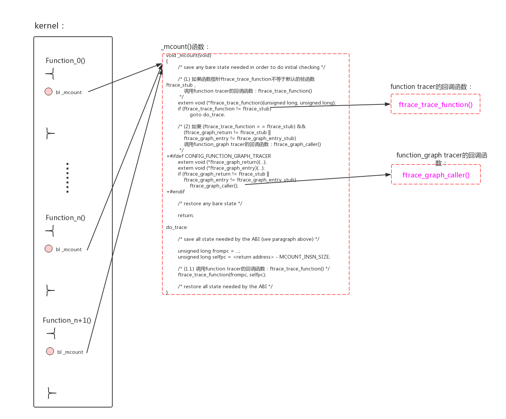
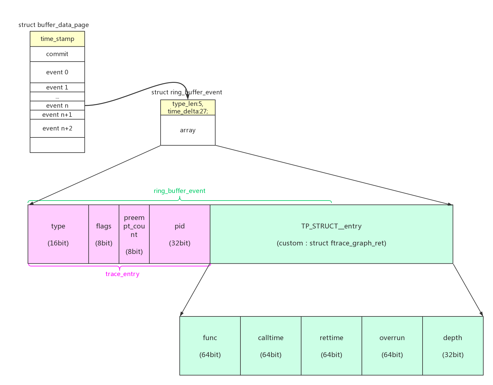

如trace event一章的描述，任何一种trace都离不开以下流程：

- 函数插桩。使用各种插桩方式把自己的trace函数插入到需要跟踪的probe point上；
- input trace数据。在trace的probe函数被命中时，会存储数据到ringbuffer当中；这里还包括filter和trigger功能；
- ouput trace数据。用户或者程序需要读出trace数据，根据需要输出ram数据或者是方面用户阅读的数据；对数据的解析，遵循谁存储谁提供解析规则的原则；

以function tracer为首的tracer也遵循同样的流程。

# 1、fucntion tracer

function tracer最大的难点在于：dynamic ftrace时(如不做说明本文默认dynamic)对大量插桩点的管理。

```
root:/d/tracing # cat available_filter_functions | wc -l
49099
root:/d/tracing #
root:/d/tracing # cat available_events | wc -l
987
```

可以看到上述一个普通的系统，function tracer的插桩点为49099个，trace event的插桩点为987个。function tracer的插桩点几乎大于trace event插桩点两个数量级，而且trace event的插桩点是每一个插桩点都是独立控制的，而function tracer的插桩点默认是一起控制的(也可以通过set_ftrace_filter、set_ftrace_notrace来分开控制)。

这么庞大的数量的插桩点。如果独立控制会消耗大量的内存，如果集中控制又怎么能实现部分的filter和command控制？一旦桩函数的实现不简洁，开销会迅速放大。对这部分感兴趣可以直接跳转到<a href="#dynamic_stub_manag">1.2.2、插桩点的动态管理</a>。

## 1.1、插桩原理

### 1.1.1、_mcount()

众所周知function trace是利用_mcount()函数进行插桩的。在gcc使用了“-pg”选项以后，会在每个函数的入口插入以下语句：

```
function:
    ...
    mov x0, x30
    bl _mcount
    [function's body ...]
```

默认的_mcount函数是空操作：

```
ENTRY(_mcount)
	ret
ENDPROC(_mcount)
```

每个函数入口插入对_mcount()函数的调用，就是gcc提供的插桩机制。我们可以重新定义_mcount()函数中的内容，调用想要执行的内容。

### 1.1.2、static ftrace插桩

static ftrace就是使用重定义_mcount()函数的方法来实现插桩的:



arch/arm64/kernel/entry-ftrace.S：

```
#ifndef CONFIG_DYNAMIC_FTRACE
/*
 * void _mcount(unsigned long return_address)
 * @return_address: return address to instrumented function
 *
 * This function makes calls, if enabled, to:
 *     - tracer function to probe instrumented function's entry,
 *     - ftrace_graph_caller to set up an exit hook
 */
ENTRY(_mcount)
	mcount_enter

	adrp	x0, ftrace_trace_function
	ldr	x2, [x0, #:lo12:ftrace_trace_function]
	adr	x0, ftrace_stub
	cmp	x0, x2			// if (ftrace_trace_function
	b.eq	skip_ftrace_call	//     != ftrace_stub) {

	mcount_get_pc	x0		//       function's pc
	mcount_get_lr	x1		//       function's lr (= parent's pc)
	blr	x2			//   (*ftrace_trace_function)(pc, lr);

#ifndef CONFIG_FUNCTION_GRAPH_TRACER
skip_ftrace_call:			//   return;
	mcount_exit			// }
#else
	mcount_exit			//   return;
					// }
skip_ftrace_call:
	adrp	x1, ftrace_graph_return
	ldr	x2, [x1, #:lo12:ftrace_graph_return]
	cmp	x0, x2			//   if ((ftrace_graph_return
	b.ne	ftrace_graph_caller	//        != ftrace_stub)

	adrp	x1, ftrace_graph_entry	//     || (ftrace_graph_entry
	adrp	x0, ftrace_graph_entry_stub //     != ftrace_graph_entry_stub))
	ldr	x2, [x1, #:lo12:ftrace_graph_entry]
	add	x0, x0, #:lo12:ftrace_graph_entry_stub
	cmp	x0, x2
	b.ne	ftrace_graph_caller	//     ftrace_graph_caller();

	mcount_exit
#endif /* CONFIG_FUNCTION_GRAPH_TRACER */
ENDPROC(_mcount)

#else /* CONFIG_DYNAMIC_FTRACE */
```

对应的伪代码如下：

```
void _mcount(void)
{
        /* save any bare state needed in order to do initial checking */

        /* (1) 如果函数指针ftrace_trace_function不等于默认的桩函数ftrace_stub， 
            调用function tracer的回调函数：ftrace_trace_function()
         */
        extern void (*ftrace_trace_function)(unsigned long, unsigned long);
        if (ftrace_trace_function != ftrace_stub)
                goto do_trace;

        /* (2) 如果 (ftrace_trace_function = = ftrace_stub) && 
            (ftrace_graph_return != ftrace_stub ||
            ftrace_graph_entry != ftrace_graph_entry_stub)
            调用function_graph tracer的回调函数：ftrace_graph_caller()
         */
+#ifdef CONFIG_FUNCTION_GRAPH_TRACER
        extern void (*ftrace_graph_return)(...);
        extern void (*ftrace_graph_entry)(...);
        if (ftrace_graph_return != ftrace_stub ||
            ftrace_graph_entry != ftrace_graph_entry_stub)
                ftrace_graph_caller();
+#endif

        /* restore any bare state */

        return;

do_trace:

        /* save all state needed by the ABI (see paragraph above) */

        unsigned long frompc = ...;
        unsigned long selfpc = <return address> - MCOUNT_INSN_SIZE;
        
        /* (1.1) 调用function tracer的回调函数：ftrace_trace_function() */
        ftrace_trace_function(frompc, selfpc);

        /* restore all state needed by the ABI */
}
```

> 问：static ftrace下，怎么保准notrace的函数不被跟踪？

### 1.1.3、dynamic ftrace插桩

static ftrace一旦使能，对kernel中所有的函数(除开notrace、online、其他特殊函数)进行插桩，这带来的性能开销是惊人的，有可能导致人们弃用ftrace功能。

为了解决这个问题，内核开发者推出了dynamic ftrace。因为实际上调试者一般不需要对所有函数进行追踪，只会对感兴趣的一部分函数进行追踪。dynamic ftrace把不需要追踪的函数入口处指令“bl _mcount”替换成“nop”，这样基本对性能无影响；对需要追踪的函替换入口处“bl _mcount”为需要调用的函数。

1、ftrace在初始化时，根据编译时“scripts/recordmcount.pl”脚本记录的所有函数入口处插桩位置的“bl _mcount”，将其替换成“nop”指令：


2、在tracer enable的时候，把需要跟踪的函数的插桩位置“nop”替换成“bl ftrace_caller”。

为什么不使用“bl _mcount”？主要原因是开发者不喜欢在_mcount()中使用宏来区分两种情况，索性重新创建一个新函数ftrace_caller()。


arch/arm64/kernel/entry-ftrace.S：

```
#ifndef CONFIG_DYNAMIC_FTRACE
#else /* CONFIG_DYNAMIC_FTRACE */
/*
 * _mcount() is used to build the kernel with -pg option, but all the branch
 * instructions to _mcount() are replaced to NOP initially at kernel start up,
 * and later on, NOP to branch to ftrace_caller() when enabled or branch to
 * NOP when disabled per-function base.
 */
ENTRY(_mcount)
	ret
ENDPROC(_mcount)

/*
 * void ftrace_caller(unsigned long return_address)
 * @return_address: return address to instrumented function
 *
 * This function is a counterpart of _mcount() in 'static' ftrace, and
 * makes calls to:
 *     - tracer function to probe instrumented function's entry,
 *     - ftrace_graph_caller to set up an exit hook
 */
ENTRY(ftrace_caller)
	mcount_enter

	mcount_get_pc0	x0		//     function's pc
	mcount_get_lr	x1		//     function's lr

	.global ftrace_call
ftrace_call:				// tracer(pc, lr);
	nop				// This will be replaced with "bl xxx"
					// where xxx can be any kind of tracer.

#ifdef CONFIG_FUNCTION_GRAPH_TRACER
	.global ftrace_graph_call
ftrace_graph_call:			// ftrace_graph_caller();
	nop				// If enabled, this will be replaced
					// "b ftrace_graph_caller"
#endif

	mcount_exit
ENDPROC(ftrace_caller)
#endif /* CONFIG_DYNAMIC_FTRACE */
```

对应的伪代码为：

```
void ftrace_caller(void)
{
        /* save all state needed by the ABI (see paragraph above) */

        unsigned long frompc = ...;
        unsigned long selfpc = <return address> - MCOUNT_INSN_SIZE;

        /* This will be replaced with "bl xxx" where xxx can be any kind of tracer. */
        /* (1) function tracer的桩位置
            放弃了函数指针，使用nop指令占位，在运行时动态修改指令到"bl xxx"
         */
ftrace_call:
        nop     

#ifdef CONFIG_FUNCTION_GRAPH_TRACER
        /* If enabled, this will be replaced "b ftrace_graph_caller" */
        /* (2) function_graph tracer的桩位置
            放弃了函数指针，使用nop指令占位，在运行时动态修改指令到"b ftrace_graph_caller"
         */
ftrace_graph_call:
        nop    
#endif

        /* restore all state needed by the ABI */

        return;
}
```

## 1.2、插桩点管理

### 1.2.1、插桩点的初始化

1、在编译的时候调用recordmcount.pl搜集所有_mcount()函数的调用点，并且所有的调用点地址保存到section __mcount_loc。

include/asm-generic/vmlinux.lds.h:

```
#ifdef CONFIG_FTRACE_MCOUNT_RECORD
#define MCOUNT_REC()	. = ALIGN(8);				\
			VMLINUX_SYMBOL(__start_mcount_loc) = .; \
			*(__mcount_loc)				\
			VMLINUX_SYMBOL(__stop_mcount_loc) = .;
#else
#define MCOUNT_REC()
#endif
```

并没有详细去研究其原理，感兴趣可以具体研究一下“scripts/recordmcount.pl、scripts/recordmcount.c”。


2、在初始化时，遍历section __mcount_loc的调用点地址，默认给所有“bl _mcount”替换成“nop”。

kernel/trace/ftrace.c：

```
void __init ftrace_init(void)
{
	extern unsigned long __start_mcount_loc[];
	extern unsigned long __stop_mcount_loc[];
	unsigned long count, flags;
	int ret;

	local_irq_save(flags);
	ret = ftrace_dyn_arch_init();
	local_irq_restore(flags);
	if (ret)
		goto failed;

	count = __stop_mcount_loc - __start_mcount_loc;
	if (!count) {
		pr_info("ftrace: No functions to be traced?\n");
		goto failed;
	}

	pr_info("ftrace: allocating %ld entries in %ld pages\n",
		count, count / ENTRIES_PER_PAGE + 1);

	last_ftrace_enabled = ftrace_enabled = 1;

    /* 遍历section __mcount_loc，处理其中保存的调用地址 */
	ret = ftrace_process_locs(NULL,
				  __start_mcount_loc,
				  __stop_mcount_loc);

	ret = register_module_notifier(&ftrace_module_exit_nb);
	if (ret)
		pr_warning("Failed to register trace ftrace module exit notifier\n");

	set_ftrace_early_filters();

	return;
 failed:
	ftrace_disabled = 1;
}

|→

static int ftrace_process_locs(struct module *mod,
			       unsigned long *start,
			       unsigned long *end)
{
	struct ftrace_page *start_pg;
	struct ftrace_page *pg;
	struct dyn_ftrace *rec;
	unsigned long count;
	unsigned long *p;
	unsigned long addr;
	unsigned long flags = 0; /* Shut up gcc */
	int ret = -ENOMEM;

	count = end - start;

	if (!count)
		return 0;

    /* (1) 对地址进行排序 */
	sort(start, count, sizeof(*start),
	     ftrace_cmp_ips, NULL);

    /* (2) 对每个地址分配新的dyn_ftrace结构来存储 
        在section __mcount_loc中，只是简单的存储了unsigned long类型的调用地址
        dyn_ftrace结构除了使用->ip来存储地址，还使用->flags来存储当前的状态和被引用计数
     */
	start_pg = ftrace_allocate_pages(count);
	if (!start_pg)
		return -ENOMEM;

	mutex_lock(&ftrace_lock);

	/*
	 * Core and each module needs their own pages, as
	 * modules will free them when they are removed.
	 * Force a new page to be allocated for modules.
	 */
	if (!mod) {
		WARN_ON(ftrace_pages || ftrace_pages_start);
		/* First initialization */
		ftrace_pages = ftrace_pages_start = start_pg;
	} else {
		if (!ftrace_pages)
			goto out;

		if (WARN_ON(ftrace_pages->next)) {
			/* Hmm, we have free pages? */
			while (ftrace_pages->next)
				ftrace_pages = ftrace_pages->next;
		}

		ftrace_pages->next = start_pg;
	}

    /* (3) 更新dyn_ftrace新结构中的->ip字段 */
	p = start;
	pg = start_pg;
	while (p < end) {
		addr = ftrace_call_adjust(*p++);
		/*
		 * Some architecture linkers will pad between
		 * the different mcount_loc sections of different
		 * object files to satisfy alignments.
		 * Skip any NULL pointers.
		 */
		if (!addr)
			continue;

		if (pg->index == pg->size) {
			/* We should have allocated enough */
			if (WARN_ON(!pg->next))
				break;
			pg = pg->next;
		}

		rec = &pg->records[pg->index++];
		rec->ip = addr;
	}

	/* We should have used all pages */
	WARN_ON(pg->next);

	/* Assign the last page to ftrace_pages */
	ftrace_pages = pg;

	/*
	 * We only need to disable interrupts on start up
	 * because we are modifying code that an interrupt
	 * may execute, and the modification is not atomic.
	 * But for modules, nothing runs the code we modify
	 * until we are finished with it, and there's no
	 * reason to cause large interrupt latencies while we do it.
	 */
	if (!mod)
		local_irq_save(flags);
	/* (4) 更新dyn_ftrace新结构中的->flags字段 
	    默认给所有调用点替换成“nop”指令
	 */
	ftrace_update_code(mod, start_pg);
	if (!mod)
		local_irq_restore(flags);
	ret = 0;
 out:
	mutex_unlock(&ftrace_lock);

	return ret;
}

||→

static int ftrace_update_code(struct module *mod, struct ftrace_page *new_pgs)
{
	struct ftrace_page *pg;
	struct dyn_ftrace *p;
	cycle_t start, stop;
	unsigned long update_cnt = 0;
	unsigned long ref = 0;
	bool test = false;
	int i;

	/*
	 * When adding a module, we need to check if tracers are
	 * currently enabled and if they are set to trace all functions.
	 * If they are, we need to enable the module functions as well
	 * as update the reference counts for those function records.
	 */
	if (mod) {
		struct ftrace_ops *ops;

		for (ops = ftrace_ops_list;
		     ops != &ftrace_list_end; ops = ops->next) {
			if (ops->flags & FTRACE_OPS_FL_ENABLED) {
				if (ops_traces_mod(ops))
					ref++;
				else
					test = true;
			}
		}
	}

	start = ftrace_now(raw_smp_processor_id());

    /* (4.1) 逐个遍历dyn_ftrace结构 */
	for (pg = new_pgs; pg; pg = pg->next) {

		for (i = 0; i < pg->index; i++) {
			int cnt = ref;

			/* If something went wrong, bail without enabling anything */
			if (unlikely(ftrace_disabled))
				return -1;

			p = &pg->records[i];
			/* (4.2) 根据有多少个filter操作对调用点地址的引用， 
			    给dyn_ftrace->flags字段中的引用count部分赋值
			 */
			if (test)
				cnt += referenced_filters(p);
			p->flags = cnt;

			/*
			 * Do the initial record conversion from mcount jump
			 * to the NOP instructions.
			 */
			/* (4.3) 默认把所有的调用点修改成“nop” */
			if (!ftrace_code_disable(mod, p))
				break;

			update_cnt++;

			/*
			 * If the tracing is enabled, go ahead and enable the record.
			 *
			 * The reason not to enable the record immediatelly is the
			 * inherent check of ftrace_make_nop/ftrace_make_call for
			 * correct previous instructions.  Making first the NOP
			 * conversion puts the module to the correct state, thus
			 * passing the ftrace_make_call check.
			 */
			if (ftrace_start_up && cnt) {
			    /* (4.4) 如果tracing已经使能，且引用计数不为0 
			        使能这个调用点
			     */
				int failed = __ftrace_replace_code(p, 1);
				if (failed)
					ftrace_bug(failed, p);
			}
		}
	}

	stop = ftrace_now(raw_smp_processor_id());
	ftrace_update_time = stop - start;
	ftrace_update_tot_cnt += update_cnt;

	return 0;
}

```

### 1.2.2、插桩点的动态管理<a id="dynamic_stub_manag"> </a>

为了应对本文最开始处提出的难题，内核使用了插桩点控制链表+命令hash表的形式。


function tracer插桩点动态管理的原理：

- 1、每个“bl _mcount”的插桩点ip对应一个每个插桩点对应一个dyn_ftrace结构。dyn_ftrace->flags的低26bit用来表示引用计数，如果有ftrcae_ops会操作到该ip，引用计数会加1。如果ref_cnt大于0，插桩点就需要使能了，把其替换为“bl ftrace_caller”；
- 2、ftrcae_ops采用hash表来表达对ip的引用，一个ftrcae_ops有两张hash表filter_hash和notrace_hash，综合的结果就是对ip的引用。function tracer模式时，有两个可能的ftrcae_ops：global_ops、trace_probe_ops。两个中任意一个引用到ip，都会造成ip的1级插桩点被替换为“bl ftrace_caller”；
- 3、通过设置“set_ftrace_filter/set_ftrace_notrace”会造成对global_ops的filter_hash/notrace_hash的配置，它的作用是配置function tracer的filter；
- 4、通过设置“set_ftrace_filter”会造成对trace_probe_ops的filter_hash的配置，它的作用是配置filter command，并且会把command和对应的ip加入到另外一张另外一张hash表ftrace_func_hash表中；
- 5、ftrace_caller()有两个2级插桩点：ftrace_call、ftrace_graph_call。在function tracer模式时，只有ftrace_call被设置成“bl  ftrace_ops_list_func”；
- 6、ftrace_ops_list_func()的工作就是遍历ftrace_ops_list链表，逐个执行其中的ftrace_ops->func()。
- 7、global_ops的->func()函数为function_trace_call()，记录trace数据：ip + parent_ip；
- 8、trace_probe_ops的->func()函数为function_trace_probe_call()，逐个执行ftrace_func_hash表中，ip为本ip的filter command。

有以下几种场景，涉及到插桩点的动态管理：

- tracer的使能。当使用“echo xxx_tracer > current_tracer”时，会关闭旧的current tracer并使能新的tracer。典型的包括function tracer合入function_graph tracer；
- filter的配置。使用“echo function_name > set_ftrace_filter/set_ftrace_notrace”，可以配置部分function被trace，而不是所有function被trace；
- filter command的配置。使用“echo '!__schedule_bug:traceoff' > set_ftrace_filter”，类似命令可以配置条件触发的command，当条件满足后command会被执行；

下面我们看看具体场景下的代码实现细节：


### 1.2.3、tracer注册

1、tracer注册。tracer可以通过register_tracer()进行注册。

以function tracer为例，kernel/trace/trace_functions.c：

```
static struct tracer function_trace __tracer_data =
{
	.name		= "function",
	.init		= function_trace_init,
	.reset		= function_trace_reset,
	.start		= function_trace_start,
	.flags		= &func_flags,
	.set_flag	= func_set_flag,
	.allow_instances = true,
#ifdef CONFIG_FTRACE_SELFTEST
	.selftest	= trace_selftest_startup_function,
#endif
};

static __init int init_function_trace(void)
{
	init_func_cmd_traceon();
	return register_tracer(&function_trace);
}
```

register_tracer()的实现，kernel/trace/trace.c：

```
int __init register_tracer(struct tracer *type)
{
	struct tracer *t;
	int ret = 0;

	if (!type->name) {
		pr_info("Tracer must have a name\n");
		return -1;
	}

	if (strlen(type->name) >= MAX_TRACER_SIZE) {
		pr_info("Tracer has a name longer than %d\n", MAX_TRACER_SIZE);
		return -1;
	}

	mutex_lock(&trace_types_lock);

	tracing_selftest_running = true;

    /* (1) 如果tracer已经注册，直接返回 */
	for (t = trace_types; t; t = t->next) {
		if (strcmp(type->name, t->name) == 0) {
			/* already found */
			pr_info("Tracer %s already registered\n",
				type->name);
			ret = -1;
			goto out;
		}
	}

    /* (2) tracer对应的相关trace_option */
	if (!type->set_flag)
		type->set_flag = &dummy_set_flag;
	if (!type->flags)
		type->flags = &dummy_tracer_flags;
	else
		if (!type->flags->opts)
			type->flags->opts = dummy_tracer_opt;

	ret = run_tracer_selftest(type);
	if (ret < 0)
		goto out;

    /* (3) 将新的tracer加入到trace_types链表中 */
	type->next = trace_types;
	trace_types = type;
	add_tracer_options(&global_trace, type);

 out:
	tracing_selftest_running = false;
	mutex_unlock(&trace_types_lock);

	if (ret || !default_bootup_tracer)
		goto out_unlock;

	if (strncmp(default_bootup_tracer, type->name, MAX_TRACER_SIZE))
		goto out_unlock;

	printk(KERN_INFO "Starting tracer '%s'\n", type->name);
	/* Do we want this tracer to start on bootup? */
	/* (4) 设置boot默认的tracer */
	tracing_set_tracer(&global_trace, type->name);
	default_bootup_tracer = NULL;

	apply_trace_boot_options();

	/* disable other selftests, since this will break it. */
	tracing_selftest_disabled = true;
#ifdef CONFIG_FTRACE_STARTUP_TEST
	printk(KERN_INFO "Disabling FTRACE selftests due to running tracer '%s'\n",
	       type->name);
#endif

 out_unlock:
	return ret;
}
```

### 1.2.4、tracer使能

2、tracer使能。我们可以使用“echo function > current_tracer”命令来使能或者切换tracer。

来具体看看其代码实现：

```
trace_create_file("current_tracer", 0644, d_tracer,
		tr, &set_tracer_fops);

↓

static const struct file_operations set_tracer_fops = {
	.open		= tracing_open_generic,
	.read		= tracing_set_trace_read,
	.write		= tracing_set_trace_write,
	.llseek		= generic_file_llseek,
};

↓

static ssize_t
tracing_set_trace_write(struct file *filp, const char __user *ubuf,
			size_t cnt, loff_t *ppos)
{
    /* (1) 当前文件所在trace buffer，默认是global_trace 
        初始化时：
        init_tracer_tracefs(&global_trace, d_tracer); -> 
        trace_create_file("current_tracer", 0644, d_tracer,	tr, &set_tracer_fops);
     */
	struct trace_array *tr = filp->private_data;
	char buf[MAX_TRACER_SIZE+1];
	int i;
	size_t ret;
	int err;

	ret = cnt;

	if (cnt > MAX_TRACER_SIZE)
		cnt = MAX_TRACER_SIZE;

	if (copy_from_user(&buf, ubuf, cnt))
		return -EFAULT;

	buf[cnt] = 0;

	/* strip ending whitespace. */
	for (i = cnt - 1; i > 0 && isspace(buf[i]); i--)
		buf[i] = 0;

    /* (2) 使能新的tracer */
	err = tracing_set_tracer(tr, buf);
	if (err)
		return err;

	*ppos += ret;

	return ret;
}

|→

static int tracing_set_tracer(struct trace_array *tr, const char *buf)
{
	struct tracer *t;
#ifdef CONFIG_TRACER_MAX_TRACE
	bool had_max_tr;
#endif
	int ret = 0;

	mutex_lock(&trace_types_lock);

	if (!ring_buffer_expanded) {
		ret = __tracing_resize_ring_buffer(tr, trace_buf_size,
						RING_BUFFER_ALL_CPUS);
		if (ret < 0)
			goto out;
		ret = 0;
	}

    /* (2.1) 根据名字，在trace_types链表中找到对应的tracer */
	for (t = trace_types; t; t = t->next) {
		if (strcmp(t->name, buf) == 0)
			break;
	}
	if (!t) {
		ret = -EINVAL;
		goto out;
	}
	if (t == tr->current_trace)
		goto out;

	/* Some tracers are only allowed for the top level buffer */
	if (!trace_ok_for_array(t, tr)) {
		ret = -EINVAL;
		goto out;
	}

	/* If trace pipe files are being read, we can't change the tracer */
	if (tr->current_trace->ref) {
		ret = -EBUSY;
		goto out;
	}

	trace_branch_disable();

    /* (2.2) 去使能旧的当前tracer */
	tr->current_trace->enabled--;

	if (tr->current_trace->reset)
		tr->current_trace->reset(tr);

	/* Current trace needs to be nop_trace before synchronize_sched */
	tr->current_trace = &nop_trace;

#ifdef CONFIG_TRACER_MAX_TRACE
	had_max_tr = tr->allocated_snapshot;

	if (had_max_tr && !t->use_max_tr) {
		/*
		 * We need to make sure that the update_max_tr sees that
		 * current_trace changed to nop_trace to keep it from
		 * swapping the buffers after we resize it.
		 * The update_max_tr is called from interrupts disabled
		 * so a synchronized_sched() is sufficient.
		 */
		synchronize_sched();
		free_snapshot(tr);
	}
#endif

#ifdef CONFIG_TRACER_MAX_TRACE
	if (t->use_max_tr && !had_max_tr) {
		ret = alloc_snapshot(tr);
		if (ret < 0)
			goto out;
	}
#endif

    /* (2.3) 调用新tracer的init函数 */
	if (t->init) {
		ret = tracer_init(t, tr);
		if (ret)
			goto out;
	}

    /* (2.4) 把新的tracer设置为当前tracer */
	tr->current_trace = t;
	tr->current_trace->enabled++;
	trace_branch_enable(tr);
 out:
	mutex_unlock(&trace_types_lock);

	return ret;
}

||→

int tracer_init(struct tracer *t, struct trace_array *tr)
{
	tracing_reset_online_cpus(&tr->trace_buffer);
	return t->init(tr);
}
```

### 1.2.5、function tracer使能 <a id="function_tracer_enable"> </a>

3、function tracer的使能。本质上是global_ops的注册后使能。

在初始化的时候，把global_trace的->ops初始化成了global_ops。

```
start_kernel() -> trace_init() -> tracer_alloc_buffers:

tracer_alloc_buffers
{
    
    ftrace_init_global_array_ops(&global_trace);
    
}

↓

__init void ftrace_init_global_array_ops(struct trace_array *tr)
{
	tr->ops = &global_ops;
	tr->ops->private = tr;
}

static struct ftrace_ops global_ops = {
	.func				= ftrace_stub,
	.local_hash.notrace_hash	= EMPTY_HASH,
	.local_hash.filter_hash		= EMPTY_HASH,
	INIT_OPS_HASH(global_ops)
	.flags				= FTRACE_OPS_FL_RECURSION_SAFE |
					  FTRACE_OPS_FL_INITIALIZED |
					  FTRACE_OPS_FL_PID,
};
```


继续分析t->init()，以function tracer为例，调用到function_trace_init()：

```
static int function_trace_init(struct trace_array *tr)
{
	ftrace_func_t func;

	/*
	 * Instance trace_arrays get their ops allocated
	 * at instance creation. Unless it failed
	 * the allocation.
	 */
	/* (2.4.1) 这里的tr默认就是global_trace 
	    这里的tr->ops默认是global_ops
	 */
	if (!tr->ops)
		return -ENOMEM;

    /* (2.4.2) func为保存trace信息到ringbuffer的函数 */
	/* Currently only the global instance can do stack tracing */
	if (tr->flags & TRACE_ARRAY_FL_GLOBAL &&
	    func_flags.val & TRACE_FUNC_OPT_STACK)
		func = function_stack_trace_call;
	else
		func = function_trace_call;

    /* (2.4.3) tr->ops->func = func */
	ftrace_init_array_ops(tr, func);

	tr->trace_buffer.cpu = get_cpu();
	put_cpu();

	tracing_start_cmdline_record();
	
	/* (2.4.4) 启动function tracer 
	    将tr->ops也加入到ftrace_ops_list当中
	 */
	tracing_start_function_trace(tr);
	return 0;
}

↓

static void tracing_start_function_trace(struct trace_array *tr)
{
	tr->function_enabled = 0;
	register_ftrace_function(tr->ops);
	tr->function_enabled = 1;
}

|→

int register_ftrace_function(struct ftrace_ops *ops)
{
	int ret = -1;

    /* (2.4.4.1) 初始化hash表 
        ops->func_hash = &ops->local_hash;
     */
	ftrace_ops_init(ops);

	mutex_lock(&ftrace_lock);

    /* (2.4.4.2) 将global_ops加入ftrace_ops_list 
        并且根据情况，修改各个桩位置的指令
     */
	ret = ftrace_startup(ops, 0);

	mutex_unlock(&ftrace_lock);

	return ret;
}

||→

static int ftrace_startup(struct ftrace_ops *ops, int command)
{
	int ret;

	if (unlikely(ftrace_disabled))
		return -ENODEV;

    /* (2.4.4.2.1) 1、把global_ops加入ftrace_ops_list 
        2、根据ftrace_ops_list链表中成员的情况给ftrace_trace_function指针赋值：
            ftrace_ops_list链表为空，= ftrace_stub
            ftrace_ops_list链表有1个成员，= ftrace_ops_get_list_func(ftrace_ops_list)
            ftrace_ops_list链表有多个成员，= ftrace_ops_list_func
        3、更新ftrace_graph_entry
    */
	ret = __register_ftrace_function(ops);
	if (ret)
		return ret;

	ftrace_start_up++;
	command |= FTRACE_UPDATE_CALLS;

	/*
	 * Note that ftrace probes uses this to start up
	 * and modify functions it will probe. But we still
	 * set the ADDING flag for modification, as probes
	 * do not have trampolines. If they add them in the
	 * future, then the probes will need to distinguish
	 * between adding and updating probes.
	 */
	ops->flags |= FTRACE_OPS_FL_ENABLED | FTRACE_OPS_FL_ADDING;

    /* (2.4.4.2.2) 遍历全部_mcount插桩点ftrace_rec 
        根据ip在新、旧hash表中的变化，设置对应rec->flags中的FTRACE_FL_IPMODIFY
     */
	ret = ftrace_hash_ipmodify_enable(ops);
	if (ret < 0) {
		/* Rollback registration process */
		__unregister_ftrace_function(ops);
		ftrace_start_up--;
		ops->flags &= ~FTRACE_OPS_FL_ENABLED;
		return ret;
	}

    /* (2.4.4.2.3) 遍历全部_mcount插桩点ftrace_rec 
        根据filter_hash、notrace_hash是否match ip，给对应rec->flags中ref_cnt进行加1/减1操作
     */
	ftrace_hash_rec_enable(ops, 1);

    /* (2.4.4.2.4) 更新插桩点： 
        FTRACE_UPDATE_CALLS被设置，更新_mcount插桩点：ref_cnt大于0的插桩点，更新成ftrace_caller()
        FTRACE_UPDATE_TRACE_FUNC被设置，更新ftrace_call插桩点：更新成ftrace_trace_function指向的函数
        FTRACE_START_FUNC_RET被设置，更新ftrace_graph_call插桩点：更新成ftrace_graph_caller()
     */
	ftrace_startup_enable(command);

	ops->flags &= ~FTRACE_OPS_FL_ADDING;

	return 0;
}

↓

ftrace_startup_enable() -> ftrace_run_update_code() -> arch_ftrace_update_code() -> ftrace_modify_all_code() -> 

void ftrace_modify_all_code(int command)
{
	int update = command & FTRACE_UPDATE_TRACE_FUNC;
	int err = 0;

	/*
	 * If the ftrace_caller calls a ftrace_ops func directly,
	 * we need to make sure that it only traces functions it
	 * expects to trace. When doing the switch of functions,
	 * we need to update to the ftrace_ops_list_func first
	 * before the transition between old and new calls are set,
	 * as the ftrace_ops_list_func will check the ops hashes
	 * to make sure the ops are having the right functions
	 * traced.
	 */
	/* (2.4.4.2.4.1) 如果FTRACE_UPDATE_TRACE_FUNC被设置，对于ftrace_call插桩点，
	    直接调用ftrace_ops_list链表中某个ftrace_ops的操作需要谨慎 
	    保险起见，默认还是使用ftrace_ops_list_func()，它会轮询ftrace_ops_list链表中所有ftrace_ops
	 */
	if (update) {
		err = ftrace_update_ftrace_func(ftrace_ops_list_func);
		if (FTRACE_WARN_ON(err))
			return;
	}

    /* (2.4.4.2.4.2) 如果FTRACE_UPDATE_CALLS被设置，对于_mcount插桩点，
        遍历全部ftrace_rec，ref_cnt大于0的插桩点，更新成ftrace_caller()
     */
	if (command & FTRACE_UPDATE_CALLS)
		ftrace_replace_code(1);
	else if (command & FTRACE_DISABLE_CALLS)
		ftrace_replace_code(0);

    /* (2.4.4.2.4.3) 如果FTRACE_UPDATE_TRACE_FUNC被设置，对于ftrace_call插桩点，
        如果ftrace_trace_function确实不等于ftrace_ops_list_func()
        更新成ftrace_trace_function指向的函数
     */
	if (update && ftrace_trace_function != ftrace_ops_list_func) {
		function_trace_op = set_function_trace_op;
		smp_wmb();
		/* If irqs are disabled, we are in stop machine */
		if (!irqs_disabled())
			smp_call_function(ftrace_sync_ipi, NULL, 1);
		err = ftrace_update_ftrace_func(ftrace_trace_function);
		if (FTRACE_WARN_ON(err))
			return;
	}

    /* (2.4.4.2.4.4) 如果FTRACE_START_FUNC_RET被设置，对于ftrace_graph_call插桩点，
        更新成ftrace_graph_caller()
     */
	if (command & FTRACE_START_FUNC_RET)
		err = ftrace_enable_ftrace_graph_caller();
	else if (command & FTRACE_STOP_FUNC_RET)
		err = ftrace_disable_ftrace_graph_caller();
	FTRACE_WARN_ON(err);
}

↓

void __weak ftrace_replace_code(int enable)
{
	struct dyn_ftrace *rec;
	struct ftrace_page *pg;
	int failed;

	if (unlikely(ftrace_disabled))
		return;

    /* 遍历ftrace_rec */
	do_for_each_ftrace_rec(pg, rec) {
		failed = __ftrace_replace_code(rec, enable);
		if (failed) {
			ftrace_bug(failed, rec);
			/* Stop processing */
			return;
		}
	} while_for_each_ftrace_rec();
}

↓

static int
__ftrace_replace_code(struct dyn_ftrace *rec, int enable)
{
	unsigned long ftrace_old_addr;
	unsigned long ftrace_addr;
	int ret;

    /* (2.4.4.2.4.2.1) _mcount插桩点使能后的地址为： 
        ops->trampoline or ftrace_caller
     */
	ftrace_addr = ftrace_get_addr_new(rec);

	/* This needs to be done before we call ftrace_update_record */
	ftrace_old_addr = ftrace_get_addr_curr(rec);

    
    /* (2.4.4.2.4.2.2) 根据rec->flags中的flag和refcnt，以及enable 
        得出操作是：FTRACE_UPDATE_IGNORE/FTRACE_UPDATE_MAKE_CALL/FTRACE_UPDATE_MAKE_NOP
     */
	ret = ftrace_update_record(rec, enable);

    /* (2.4.4.2.4.2.3) 修改_mcount插桩点处的指令为新的桩函数跳转指令 */
	switch (ret) {
	case FTRACE_UPDATE_IGNORE:
		return 0;

	case FTRACE_UPDATE_MAKE_CALL:
		return ftrace_make_call(rec, ftrace_addr);

	case FTRACE_UPDATE_MAKE_NOP:
		return ftrace_make_nop(NULL, rec, ftrace_old_addr);

	case FTRACE_UPDATE_MODIFY_CALL:
		return ftrace_modify_call(rec, ftrace_old_addr, ftrace_addr);
	}

	return -1; /* unknow ftrace bug */
}
```

### 1.2.6、配置function tracer的filter <a id="set_ftrace_filter"> </a>

4、通过“set_ftrace_filter”、“set_ftrace_notrace”设置function trcer的filter。本质上是操作global_ops的filter_hash、notrace_hash。

```
/* global_ops注册成inode->i_private */
ftrace_create_filter_files(&global_ops, d_tracer);

↓

void ftrace_create_filter_files(struct ftrace_ops *ops,
				struct dentry *parent)
{

	trace_create_file("set_ftrace_filter", 0644, parent,
			  ops, &ftrace_filter_fops);

	trace_create_file("set_ftrace_notrace", 0644, parent,
			  ops, &ftrace_notrace_fops);
}

static const struct file_operations ftrace_filter_fops = {
	.open = ftrace_filter_open,
	.read = seq_read,
	.write = ftrace_filter_write,
	.llseek = tracing_lseek,
	.release = ftrace_regex_release,
};
```

“set_ftrace_filter”、“set_ftrace_notrace”的文件操作有个技巧，就是在open的时候分配一个临时hash表iter->hash来拷贝global_ops的filter_hash/notrace_hash的内容，在write操作实际设置filter时对iter->hash操作，在close的时候使用新的hash表iter->hash来更新global_ops。

open文件操作中对global_ops hash表的备份操作：

```
static int
ftrace_filter_open(struct inode *inode, struct file *file)
{
    /* (1) 得到global_ops结构 */
	struct ftrace_ops *ops = inode->i_private;

    /* (2) */
	return ftrace_regex_open(ops,
			FTRACE_ITER_FILTER | FTRACE_ITER_DO_HASH,
			inode, file);
}

↓

int
ftrace_regex_open(struct ftrace_ops *ops, int flag,
		  struct inode *inode, struct file *file)
{
	struct ftrace_iterator *iter;
	struct ftrace_hash *hash;
	int ret = 0;

	ftrace_ops_init(ops);

	if (unlikely(ftrace_disabled))
		return -ENODEV;

	iter = kzalloc(sizeof(*iter), GFP_KERNEL);
	if (!iter)
		return -ENOMEM;

	if (trace_parser_get_init(&iter->parser, FTRACE_BUFF_MAX)) {
		kfree(iter);
		return -ENOMEM;
	}

	iter->ops = ops;
	iter->flags = flag;

	mutex_lock(&ops->func_hash->regex_lock);

	if (flag & FTRACE_ITER_NOTRACE)
		hash = ops->func_hash->notrace_hash;
	else
		hash = ops->func_hash->filter_hash;

	if (file->f_mode & FMODE_WRITE) {
		const int size_bits = FTRACE_HASH_DEFAULT_BITS;

        /* (2.1) 使用iter->hash备份global_ops中的filter_hash/notrace_hash */
		if (file->f_flags & O_TRUNC)
			iter->hash = alloc_ftrace_hash(size_bits);
		else
			iter->hash = alloc_and_copy_ftrace_hash(size_bits, hash);

		if (!iter->hash) {
			trace_parser_put(&iter->parser);
			kfree(iter);
			ret = -ENOMEM;
			goto out_unlock;
		}
	}

	if (file->f_mode & FMODE_READ) {
		iter->pg = ftrace_pages_start;

		ret = seq_open(file, &show_ftrace_seq_ops);
		if (!ret) {
			struct seq_file *m = file->private_data;
			m->private = iter;
		} else {
			/* Failed */
			free_ftrace_hash(iter->hash);
			trace_parser_put(&iter->parser);
			kfree(iter);
		}
	} else
		file->private_data = iter;

 out_unlock:
	mutex_unlock(&ops->func_hash->regex_lock);

	return ret;
}
```

write文件操作中对iter->hash表的更新操作：

```
ftrace_filter_write() -> ftrace_regex_write() 

↓

static ssize_t
ftrace_regex_write(struct file *file, const char __user *ubuf,
		   size_t cnt, loff_t *ppos, int enable)
{
	struct ftrace_iterator *iter;
	struct trace_parser *parser;
	ssize_t ret, read;

	if (!cnt)
		return 0;

	if (file->f_mode & FMODE_READ) {
		struct seq_file *m = file->private_data;
		iter = m->private;
	} else
		iter = file->private_data;

	if (unlikely(ftrace_disabled))
		return -ENODEV;

	/* iter->hash is a local copy, so we don't need regex_lock */

	parser = &iter->parser;
	read = trace_get_user(parser, ubuf, cnt, ppos);

	if (read >= 0 && trace_parser_loaded(parser) &&
	    !trace_parser_cont(parser)) {
	    /* (1) 解析filter配置命令，配置到iter->hash中 */
		ret = ftrace_process_regex(iter->hash, parser->buffer,
					   parser->idx, enable);
		trace_parser_clear(parser);
		if (ret < 0)
			goto out;
	}

	ret = read;
 out:
	return ret;
}

↓

static int ftrace_process_regex(struct ftrace_hash *hash,
				char *buff, int len, int enable)
{
	char *func, *command, *next = buff;
	struct ftrace_func_command *p;
	int ret = -EINVAL;

	func = strsep(&next, ":");

    /* (1.1) filter配置，更新iter->hash */
	if (!next) {
		ret = ftrace_match_records(hash, func, len);
		if (!ret)
			ret = -EINVAL;
		if (ret < 0)
			return ret;
		return 0;
	}

	/* command found */

	command = strsep(&next, ":");

    /* (1.2) filter command配置，最后实际会操作到trace_probe_ops 
        和iter->hash、global_ops无关，下一小节中详述
    */
	mutex_lock(&ftrace_cmd_mutex);
	list_for_each_entry(p, &ftrace_commands, list) {
		if (strcmp(p->name, command) == 0) {
			ret = p->func(hash, func, command, next, enable);
			goto out_unlock;
		}
	}
 out_unlock:
	mutex_unlock(&ftrace_cmd_mutex);

	return ret;
}

↓

ftrace_match_records() -> match_records()

static int
match_records(struct ftrace_hash *hash, char *func, int len, char *mod)
{
	struct ftrace_page *pg;
	struct dyn_ftrace *rec;
	struct ftrace_glob func_g = { .type = MATCH_FULL };
	struct ftrace_glob mod_g = { .type = MATCH_FULL };
	struct ftrace_glob *mod_match = (mod) ? &mod_g : NULL;
	int exclude_mod = 0;
	int found = 0;
	int ret;
	int clear_filter;

    /* (1.1.1) 解析filter命令字符串 
        clear_filter = 命令中的“!”
     */
	if (func) {
		func_g.type = filter_parse_regex(func, len, &func_g.search,
						 &clear_filter);
		func_g.len = strlen(func_g.search);
	}

	if (mod) {
		mod_g.type = filter_parse_regex(mod, strlen(mod),
				&mod_g.search, &exclude_mod);
		mod_g.len = strlen(mod_g.search);
	}

	mutex_lock(&ftrace_lock);

	if (unlikely(ftrace_disabled))
		goto out_unlock;

    /* (1.1.2) 遍历ftrcae_rec */
	do_for_each_ftrace_rec(pg, rec) {
	    /* 如果ip在filter中存在，将其加入/删除到iter->hash中 */
		if (ftrace_match_record(rec, &func_g, mod_match, exclude_mod)) {
			ret = enter_record(hash, rec, clear_filter);
			if (ret < 0) {
				found = ret;
				goto out_unlock;
			}
			found = 1;
		}
	} while_for_each_ftrace_rec();
 out_unlock:
	mutex_unlock(&ftrace_lock);

	return found;
}

↓

static int
enter_record(struct ftrace_hash *hash, struct dyn_ftrace *rec, int clear_filter)
{
	struct ftrace_func_entry *entry;
	int ret = 0;

	entry = ftrace_lookup_ip(hash, rec->ip);
	if (clear_filter) {
		/* Do nothing if it doesn't exist */
		if (!entry)
			return 0;

		free_hash_entry(hash, entry);
	} else {
		/* Do nothing if it exists */
		if (entry)
			return 0;

		ret = add_hash_entry(hash, rec->ip);
	}
	return ret;
}
```

close文件操作中对global_ops hash表的更新操作：

```
int ftrace_regex_release(struct inode *inode, struct file *file)
{
	struct seq_file *m = (struct seq_file *)file->private_data;
	struct ftrace_ops_hash old_hash_ops;
	struct ftrace_iterator *iter;
	struct ftrace_hash **orig_hash;
	struct ftrace_hash *old_hash;
	struct trace_parser *parser;
	int filter_hash;
	int ret;

	if (file->f_mode & FMODE_READ) {
		iter = m->private;
		seq_release(inode, file);
	} else
		iter = file->private_data;

	parser = &iter->parser;
	if (trace_parser_loaded(parser)) {
		parser->buffer[parser->idx] = 0;
		ftrace_match_records(iter->hash, parser->buffer, parser->idx);
	}

	trace_parser_put(parser);

	mutex_lock(&iter->ops->func_hash->regex_lock);

	if (file->f_mode & FMODE_WRITE) {
		filter_hash = !!(iter->flags & FTRACE_ITER_FILTER);

		if (filter_hash)
			orig_hash = &iter->ops->func_hash->filter_hash;
		else
			orig_hash = &iter->ops->func_hash->notrace_hash;

		mutex_lock(&ftrace_lock);
		old_hash = *orig_hash;
		old_hash_ops.filter_hash = iter->ops->func_hash->filter_hash;
		old_hash_ops.notrace_hash = iter->ops->func_hash->notrace_hash;
		/* (1) 使用iter->hash来更新global_ops的filter_hash/notrace_hash */
		ret = ftrace_hash_move(iter->ops, filter_hash,
				       orig_hash, iter->hash);
		/* (2) 根据最新hash表的内容，更新_mcount插桩点 
		    遍历全部ftrace_rec：
		        ref_cnt大于0的插桩点，更新成ftrace_caller()
		        ref_cnt等于0的插桩点，更新成nop
		 */
		if (!ret) {
			ftrace_ops_update_code(iter->ops, &old_hash_ops);
			free_ftrace_hash_rcu(old_hash);
		}
		mutex_unlock(&ftrace_lock);
	}

	mutex_unlock(&iter->ops->func_hash->regex_lock);
	free_ftrace_hash(iter->hash);
	kfree(iter);

	return 0;
}

↓

static void ftrace_ops_update_code(struct ftrace_ops *ops,
				   struct ftrace_ops_hash *old_hash)
{
	struct ftrace_ops *op;

	if (!ftrace_enabled)
		return;

	if (ops->flags & FTRACE_OPS_FL_ENABLED) {
		ftrace_run_modify_code(ops, FTRACE_UPDATE_CALLS, old_hash);
		return;
	}

	/*
	 * If this is the shared global_ops filter, then we need to
	 * check if there is another ops that shares it, is enabled.
	 * If so, we still need to run the modify code.
	 */
	if (ops->func_hash != &global_ops.local_hash)
		return;

	do_for_each_ftrace_op(op, ftrace_ops_list) {
		if (op->func_hash == &global_ops.local_hash &&
		    op->flags & FTRACE_OPS_FL_ENABLED) {
			ftrace_run_modify_code(op, FTRACE_UPDATE_CALLS, old_hash);
			/* Only need to do this once */
			return;
		}
	} while_for_each_ftrace_op(op);
}
```

### 1.2.7、配置function tracer的filter command

5、通过“set_ftrace_filter”设置function trcer的filter command。本质上向trace_probe_ops注册cmd，以及操作trace_probe_ops的filter_hash、notrace_hash。

虽然同样是操作set_ftrace_filter，但是配置filter和配置filter command是操作到不同的实体：

- 配置filter。操作的是global_ops的filter_hash/notrace_hash的内容；
- 配置filter command。是把command向trace_probe_ops注册，并且操作trace_probe_ops的filter_hash/notrace_hash的内容；

在配置filter command之前首先得注册command：

```
init_function_trace() -> init_func_cmd_traceon()

static int __init init_func_cmd_traceon(void)
{
	int ret;

    /* 注册：把command加入到ftrace_commands链表 */
	ret = register_ftrace_command(&ftrace_traceoff_cmd);
	if (ret)
		return ret;

	ret = register_ftrace_command(&ftrace_traceon_cmd);
	if (ret)
		goto out_free_traceoff;

	ret = register_ftrace_command(&ftrace_stacktrace_cmd);
	if (ret)
		goto out_free_traceon;

	ret = register_ftrace_command(&ftrace_dump_cmd);
	if (ret)
		goto out_free_stacktrace;

	ret = register_ftrace_command(&ftrace_cpudump_cmd);
	if (ret)
		goto out_free_dump;

	return 0;
}

static struct ftrace_func_command ftrace_traceon_cmd = {
	.name			= "traceon",
	.func			= ftrace_trace_onoff_callback,
};

```

我们以"traceon"command为例，继续分析上一节对“set_ftrace_filter”的文件操作：

```
static int ftrace_process_regex(struct ftrace_hash *hash,
				char *buff, int len, int enable)
{
	char *func, *command, *next = buff;
	struct ftrace_func_command *p;
	int ret = -EINVAL;

	func = strsep(&next, ":");

    /* (1.1) filter配置，更新iter->hash */
	if (!next) {
		ret = ftrace_match_records(hash, func, len);
		if (!ret)
			ret = -EINVAL;
		if (ret < 0)
			return ret;
		return 0;
	}

	/* command found */

	command = strsep(&next, ":");

    /* (1.2) filter command配置，最后实际会操作到trace_probe_ops 
        和iter->hash、global_ops无关，下一小节中详述
    */
	mutex_lock(&ftrace_cmd_mutex);
	list_for_each_entry(p, &ftrace_commands, list) {
		if (strcmp(p->name, command) == 0) {
			ret = p->func(hash, func, command, next, enable);
			goto out_unlock;
		}
	}
 out_unlock:
	mutex_unlock(&ftrace_cmd_mutex);

	return ret;
}

↓

static int
ftrace_trace_onoff_callback(struct ftrace_hash *hash,
			    char *glob, char *cmd, char *param, int enable)
{
	struct ftrace_probe_ops *ops;

	/* we register both traceon and traceoff to this callback */
	/* (1.2.1) 配置command的执行ops */
	if (strcmp(cmd, "traceon") == 0)
		ops = param ? &traceon_count_probe_ops : &traceon_probe_ops;
	else
		ops = param ? &traceoff_count_probe_ops : &traceoff_probe_ops;

    /* (1.2.2) 注册command到trace_probe_ops */
	return ftrace_trace_probe_callback(ops, hash, glob, cmd,
					   param, enable);
}

↓

static int
ftrace_trace_probe_callback(struct ftrace_probe_ops *ops,
			    struct ftrace_hash *hash, char *glob,
			    char *cmd, char *param, int enable)
{
	void *count = (void *)-1;
	char *number;
	int ret;

	/* hash funcs only work with set_ftrace_filter */
	if (!enable)
		return -EINVAL;

    /* (1.2.2.1) 如果命令是“!”，注销filter command */
	if (glob[0] == '!') {
		unregister_ftrace_function_probe_func(glob+1, ops);
		return 0;
	}

	if (!param)
		goto out_reg;

	number = strsep(&param, ":");

	if (!strlen(number))
		goto out_reg;

	/*
	 * We use the callback data field (which is a pointer)
	 * as our counter.
	 */
	/* (1.2.2.2) 解析到filter command中的“count”字段 */
	ret = kstrtoul(number, 0, (unsigned long *)&count);
	if (ret)
		return ret;

 out_reg:
    /* (1.2.2.3) 继续注册filter command */
	ret = register_ftrace_function_probe(glob, ops, count);

	return ret < 0 ? ret : 0;
}

↓

int
register_ftrace_function_probe(char *glob, struct ftrace_probe_ops *ops,
			      void *data)
{
	struct ftrace_ops_hash old_hash_ops;
	struct ftrace_func_probe *entry;
	struct ftrace_glob func_g;
	struct ftrace_hash **orig_hash = &trace_probe_ops.func_hash->filter_hash;
	struct ftrace_hash *old_hash = *orig_hash;
	struct ftrace_hash *hash;
	struct ftrace_page *pg;
	struct dyn_ftrace *rec;
	int not;
	unsigned long key;
	int count = 0;
	int ret;

    /* (1.2.2.3.1) filter command中函数名部分的解析 */
	func_g.type = filter_parse_regex(glob, strlen(glob),
			&func_g.search, &not);
	func_g.len = strlen(func_g.search);

	/* we do not support '!' for function probes */
	if (WARN_ON(not))
		return -EINVAL;

	mutex_lock(&trace_probe_ops.func_hash->regex_lock);

	old_hash_ops.filter_hash = old_hash;
	/* Probes only have filters */
	old_hash_ops.notrace_hash = NULL;

    /* (1.2.2.3.1) 将trace_probe_ops的filter_hash拷贝到临时hash表 */
	hash = alloc_and_copy_ftrace_hash(FTRACE_HASH_DEFAULT_BITS, old_hash);
	if (!hash) {
		count = -ENOMEM;
		goto out;
	}

	if (unlikely(ftrace_disabled)) {
		count = -ENODEV;
		goto out;
	}

	mutex_lock(&ftrace_lock);

    /* 遍历ftrace_rec */
	do_for_each_ftrace_rec(pg, rec) {

		if (!ftrace_match_record(rec, &func_g, NULL, 0))
			continue;

		entry = kmalloc(sizeof(*entry), GFP_KERNEL);
		if (!entry) {
			/* If we did not process any, then return error */
			if (!count)
				count = -ENOMEM;
			goto out_unlock;
		}

		count++;

		entry->data = data;

		/*
		 * The caller might want to do something special
		 * for each function we find. We call the callback
		 * to give the caller an opportunity to do so.
		 */
		if (ops->init) {
			if (ops->init(ops, rec->ip, &entry->data) < 0) {
				/* caller does not like this func */
				kfree(entry);
				continue;
			}
		}

        /* (1.2.2.3.3) 如果当前ip符合当前函数filter规则，加入到临时hash表 */
		ret = enter_record(hash, rec, 0);
		if (ret < 0) {
			kfree(entry);
			count = ret;
			goto out_unlock;
		}


        /* (1.2.2.3.4) 把command的操作和对应ip组合成entry，加入到另外一张hash表ftrace_func_hash */
		entry->ops = ops;
		entry->ip = rec->ip;

		key = hash_long(entry->ip, FTRACE_HASH_BITS);
		hlist_add_head_rcu(&entry->node, &ftrace_func_hash[key]);

	} while_for_each_ftrace_rec();

    /* (1.2.2.3.5) 把临时hash表更新到trace_probe_ops的filter_hash中 */
	ret = ftrace_hash_move(&trace_probe_ops, 1, orig_hash, hash);

    /* (1.2.2.3.6) 如果trace_probe_ops已经注册，根据hash表的更新来更新_mcount插桩点 
        如果trace_probe_ops没有注册，注册并更新_mcount插桩点
     */
	__enable_ftrace_function_probe(&old_hash_ops);

	if (!ret)
		free_ftrace_hash_rcu(old_hash);
	else
		count = ret;

 out_unlock:
	mutex_unlock(&ftrace_lock);
 out:
	mutex_unlock(&trace_probe_ops.func_hash->regex_lock);
	free_ftrace_hash(hash);

	return count;
}

```

trace_probe_ops在被调用的时候，执行ftrace_func_hash中的filter command：

```
ftrace_caller() -> ftrace_ops_list_func() -> __ftrace_ops_list_func() 

static inline void
__ftrace_ops_list_func(unsigned long ip, unsigned long parent_ip,
		       struct ftrace_ops *ignored, struct pt_regs *regs)
{
	struct ftrace_ops *op;
	int bit;

	bit = trace_test_and_set_recursion(TRACE_LIST_START, TRACE_LIST_MAX);
	if (bit < 0)
		return;

	/*
	 * Some of the ops may be dynamically allocated,
	 * they must be freed after a synchronize_sched().
	 */
	preempt_disable_notrace();
	/* 遍历ftrace_ops_list链表，
	    在当前ip满足hash的情况下，逐个执行ftrace_ops->func()
	 */
	do_for_each_ftrace_op(op, ftrace_ops_list) {
		if (ftrace_ops_test(op, ip, regs)) {
			if (FTRACE_WARN_ON(!op->func)) {
				pr_warn("op=%p %pS\n", op, op);
				goto out;
			}
			op->func(ip, parent_ip, op, regs);
		}
	} while_for_each_ftrace_op(op);
out:
	preempt_enable_notrace();
	trace_clear_recursion(bit);
}

↓

static struct ftrace_ops trace_probe_ops __read_mostly =
{
	.func		= function_trace_probe_call,
	.flags		= FTRACE_OPS_FL_INITIALIZED,
	INIT_OPS_HASH(trace_probe_ops)
};

static void function_trace_probe_call(unsigned long ip, unsigned long parent_ip,
				      struct ftrace_ops *op, struct pt_regs *pt_regs)
{
	struct ftrace_func_probe *entry;
	struct hlist_head *hhd;
	unsigned long key;

	key = hash_long(ip, FTRACE_HASH_BITS);

	hhd = &ftrace_func_hash[key];

	if (hlist_empty(hhd))
		return;

	/*
	 * Disable preemption for these calls to prevent a RCU grace
	 * period. This syncs the hash iteration and freeing of items
	 * on the hash. rcu_read_lock is too dangerous here.
	 */
	preempt_disable_notrace();
	/* 逐个执行ftrace_func_hash表中，ip为本ip的filter command */
	hlist_for_each_entry_rcu_notrace(entry, hhd, node) {
		if (entry->ip == ip)
			entry->ops->func(ip, parent_ip, &entry->data);
	}
	preempt_enable_notrace();
}


```


## 1.3、数据存入

function tracer的数据存入的路径为：

ftrace_caller() -> ftrace_ops_list_func() -> __ftrace_ops_list_func() -> global_ops->func() -> function_trace_call()：

```
static void
function_trace_call(unsigned long ip, unsigned long parent_ip,
		    struct ftrace_ops *op, struct pt_regs *pt_regs)
{
	struct trace_array *tr = op->private;
	struct trace_array_cpu *data;
	unsigned long flags;
	int bit;
	int cpu;
	int pc;

	if (unlikely(!tr->function_enabled))
		return;

	pc = preempt_count();
	preempt_disable_notrace();

	bit = trace_test_and_set_recursion(TRACE_FTRACE_START, TRACE_FTRACE_MAX);
	if (bit < 0)
		goto out;

	cpu = smp_processor_id();
	data = per_cpu_ptr(tr->trace_buffer.data, cpu);
	if (!atomic_read(&data->disabled)) {
		local_save_flags(flags);
		trace_function(tr, ip, parent_ip, flags, pc);
	}
	trace_clear_recursion(bit);

 out:
	preempt_enable_notrace();
}

↓

void
trace_function(struct trace_array *tr,
	       unsigned long ip, unsigned long parent_ip, unsigned long flags,
	       int pc)
{
	struct trace_event_call *call = &event_function;
	struct ring_buffer *buffer = tr->trace_buffer.buffer;
	struct ring_buffer_event *event;
	struct ftrace_entry *entry;

    /* (1) 从ringbuffer中分配空间 
        type = TRACE_FN
     */
	event = trace_buffer_lock_reserve(buffer, TRACE_FN, sizeof(*entry),
					  flags, pc);
	if (!event)
		return;
	entry	= ring_buffer_event_data(event);
	/* (2) 存入function tracer自定义的trace数据：ip、parent_ip */
	entry->ip			= ip;
	entry->parent_ip		= parent_ip;

	if (!call_filter_check_discard(call, entry, buffer, event))
		__buffer_unlock_commit(buffer, event);
}
```

### 1.3.1、数据格式

function tracer自定义的trace数据非常简单：ip、parent_ip


### 1.3.2、filter

关于filter和filter command的配置在<a href="#dynamic_stub_manag">1.2.2、插桩点的动态管理</a>一节已经讲得非常详细了，这里就不再重复。

## 1.4、数据读出

从trace文件读出的function tracer默认数据格式为：

```
# cat trace
# tracer: function
#
# entries-in-buffer/entries-written: 36/36   #P:8
#
#                              _-----=> irqs-off
#                             / _----=> need-resched
#                            | / _---=> hardirq/softirq
#                            || / _--=> preempt-depth
#                            ||| /     delay
#           TASK-PID   CPU#  ||||    TIMESTAMP  FUNCTION
#              | |       |   ||||       |         |
              sh-18361 [001] ...1 663922.156238: schedule_hrtimeout_range <-poll_schedule_timeout
              sh-18361 [001] ...1 663922.156251: schedule_hrtimeout_range_clock <-schedule_hrtimeout_range
          <idle>-0     [003] .n.2 663922.156660: schedule_preempt_disabled <-cpu_startup_entry
     ->transport-5191  [002] ...1 663922.157592: schedule_timeout <-wait_for_common
            adbd-5189  [002] ...1 663922.158219: schedule_hrtimeout_range <-poll_schedule_timeout
            adbd-5189  [002] ...1 663922.158222: schedule_hrtimeout_range_clock <-schedule_hrtimeout_range
          <idle>-0     [001] .n.2 663922.158342: schedule_preempt_disabled <-cpu_startup_entry
     ->transport-5191  [001] ...1 663922.159407: schedule_timeout <-unix_stream_read_generic
     <-transport-5192  [001] ...1 663922.159904: schedule_timeout <-wait_for_common
     ->transport-5191  [001] ...1 663922.160413: schedule_timeout <-unix_stream_read_generic
            adbd-5189  [001] ...1 663922.160895: schedule_hrtimeout_range <-poll_schedule_timeout
            adbd-5189  [001] ...1 663922.160898: schedule_hrtimeout_range_clock <-schedule_hrtimeout_range
          <idle>-0     [002] .n.2 663922.163694: schedule_preempt_disabled <-cpu_startup_entry
          <idle>-0     [003] .n.2 663922.175958: schedule_preempt_disabled <-cpu_startup_entry
  ndroid.systemu-2200  [003] ...1 663922.179945: schedule_hrtimeout_range <-SyS_epoll_wait
  ndroid.systemu-2200  [003] ...1 663922.179950: schedule_hrtimeout_range_clock <-schedule_hrtimeout_range
          <idle>-0     [003] .n.2 663922.181418: schedule_preempt_disabled <-cpu_startup_entry
          <idle>-0     [002] .n.2 663922.181584: schedule_preempt_disabled <-cpu_startup_entry
          <idle>-0     [002] .n.2 663922.200878: schedule_preempt_disabled <-cpu_startup_entry
          <idle>-0     [001] .n.2 663922.203506: schedule_preempt_disabled <-cpu_startup_entry
     rcu_preempt-7     [002] ...1 663922.203519: schedule_timeout <-rcu_gp_kthread
  ndroid.systemu-2200  [002] ...1 663922.205619: schedule_hrtimeout_range <-SyS_epoll_wait
  ndroid.systemu-2200  [002] ...1 663922.205624: schedule_hrtimeout_range_clock <-schedule_hrtimeout_range
          <idle>-0     [003] .n.2 663922.208538: schedule_preempt_disabled <-cpu_startup_entry
          <idle>-0     [002] .n.2 663922.213243: schedule_preempt_disabled <-cpu_startup_entry
          <idle>-0     [003] .n.2 663922.217986: schedule_preempt_disabled <-cpu_startup_entry
          <idle>-0     [003] .n.2 663922.227857: schedule_preempt_disabled <-cpu_startup_entry
  ndroid.systemu-2200  [003] ...1 663922.231819: schedule_hrtimeout_range <-SyS_epoll_wait
  ndroid.systemu-2200  [003] ...1 663922.231824: schedule_hrtimeout_range_clock <-schedule_hrtimeout_range
          <idle>-0     [002] .n.2 663922.234282: schedule_preempt_disabled <-cpu_startup_entry
          <idle>-0     [001] .n.2 663922.246355: schedule_preempt_disabled <-cpu_startup_entry
          <idle>-0     [002] .n.2 663922.251360: schedule_preempt_disabled <-cpu_startup_entry
  ndroid.systemu-2200  [002] ...1 663922.255168: schedule_hrtimeout_range <-SyS_epoll_wait
  ndroid.systemu-2200  [002] ...1 663922.255172: schedule_hrtimeout_range_clock <-schedule_hrtimeout_range
          <idle>-0     [003] .n.2 663922.256775: schedule_preempt_disabled <-cpu_startup_entry
          <idle>-0     [001] .n.2 663922.257253: schedule_preempt_disabled <-cpu_startup_entry

```

在kernel/trace/trace_ouput.c文件中，注册了系统默认的几种trace_event。function tracer使用TRACE_FN类型的trace_fn_event：

```
static struct trace_event *events[] __initdata = {
	&trace_fn_event,
	&trace_graph_ent_event,
	&trace_graph_ret_event,
	&trace_ctx_event,
	&trace_wake_event,
	&trace_stack_event,
	&trace_user_stack_event,
	&trace_bputs_event,
	&trace_bprint_event,
	&trace_print_event,
	NULL
};

__init static int init_events(void)
{
	struct trace_event *event;
	int i, ret;

	for (i = 0; events[i]; i++) {
		event = events[i];

		ret = register_trace_event(event);
		if (!ret) {
			printk(KERN_WARNING "event %d failed to register\n",
			       event->type);
			WARN_ON_ONCE(1);
		}
	}

	return 0;
}

|→

static struct trace_event_functions trace_fn_funcs = {
	.trace		= trace_fn_trace,
	.raw		= trace_fn_raw,
	.hex		= trace_fn_hex,
	.binary		= trace_fn_bin,
};

static struct trace_event trace_fn_event = {
	.type		= TRACE_FN,
	.funcs		= &trace_fn_funcs,
};
```

在数据读出时，会调用到event对应的event->funcs->trace()函数，seq_read() -> s_show() -> print_trace_line() -> print_trace_fmt() -> event->funcs->trace()：


TRACE_FN，event->funcs->trace()对应trace_fn_trace()：

```
/* TRACE_FN */
static enum print_line_t trace_fn_trace(struct trace_iterator *iter, int flags,
					struct trace_event *event)
{
	struct ftrace_entry *field;
	struct trace_seq *s = &iter->seq;

	trace_assign_type(field, iter->ent);

    /* (1) 打印出本ip对应的符号 */
	seq_print_ip_sym(s, field->ip, flags);

    /* (2) 如果trace option运行，打印出父ip对应的符号 */
	if ((flags & TRACE_ITER_PRINT_PARENT) && field->parent_ip) {
		trace_seq_puts(s, " <-");
		seq_print_ip_sym(s, field->parent_ip, flags);
	}

	trace_seq_putc(s, '\n');

	return trace_handle_return(s);
}
```

# 2、function_graph tracer

function_graph tracer从function tracer发展而来，function tracer使用“_mcount”插桩可以跟踪到每个函数的调用入口，而function_graph tracer即可以跟踪到函数的入口还可以跟踪到函数的返回。

## 2.1、插桩原理


如上图：一切的关键是在入口桩函数被调用时，修改了func()的返回地址，不是返回到func's parent()函数继续去执行，而是返回到reurn桩函数return_to_handler()中。return_to_handler()中执行完自己的return处理函数以后，再把返回地址恢复成func's parent中的地址，返回继续执行原有的路径。

原本的入口处插桩，只能追踪到函数的切换。现在入口、出口同时插桩，还能获得函数的执行时长，做更多的分析。

## 2.2、插桩点管理


function_graph tracer插桩点动态管理的原理：

- 1、每个“bl _mcount”的插桩点ip对应一个每个插桩点对应一个dyn_ftrace结构。dyn_ftrace->flags的低26bit用来表示引用计数，如果有ftrcae_ops会操作到该ip，引用计数会加1。如果ref_cnt大于0，插桩点就需要使能了，把其替换为“bl ftrace_caller”；
- 2、ftrcae_ops采用hash表来表达对ip的引用，一个ftrcae_ops有两张hash表filter_hash和notrace_hash，综合的结果就是对ip的引用。function_graph tracer模式时，有一个的ftrcae_ops：graph_ops。并且graph_ops的hash表是直接引用global_ops的hash表，这样做的目的是可以保留function tracer模式时的filter配置。如果引用到ip，都会造成ip的1级插桩点被替换为“bl ftrace_caller”；
- 3、通过设置“set_ftrace_filter/set_ftrace_notrace”会造成对global_ops的filter_hash/notrace_hash的配置，它的作用相当于1级过滤。在function_graph tracer模式时，通过2级过滤的函数才能记录trace信息：1级过滤(函数必须是“set_ftrace_filter/set_ftrace_notrace”配置中允许的函数)，2级过滤(函数必须是“set_graph_function/set_graph_notrace”配置中允许的函数或者是被它们调用的子函数)；
- 4、通过设置“set_graph_function/set_graph_notrace”可以配置2级过滤，实际上是配置到ftrace_graph_funcs[]/ftrace_graph_notrace_funcs[]表中。
- 5、ftrace_caller()有两个2级插桩点：ftrace_call、ftrace_graph_call。在function tracer模式时，只有ftrace_graph_call被设置成“bl ftrace_graph_caller”；
- 6、ftrace_graph_caller()的工作就是设置环境，让函数在入口处调用trace_graph_entry()，在返回处调用trace_graph_return()；
- 7、在trace_graph_entry()中会进行2级过滤的合法性判断，函数必须是“set_graph_function/set_graph_notrace”配置中允许的函数或者是被它们调用的子函数才能继续执行，否则出错返回后面的trace_graph_return()都不会被执行。
- 8、trace_graph_entry()、trace_graph_return()的工作都是记录trace信息：ip+时间戳；


在以下场景时，function_graph会涉及到对各个插桩点的动态修改：

- tracer的使能。当使用“echo xxx_tracer > current_tracer”时，会关闭旧的current tracer并使能新的tracer。典型的包括function tracer合入function_graph tracer；
- function_graph filter的配置。使用“echo function_name > set_ftrace_filter/set_ftrace_notrace”，可以配置部分function被trace，而不是所有function被trace；
- function filter的配置。使用“echo function_name > set_graph_function/set_graph_notrace”，可以配置部分function被trace，而不是所有function被trace；

下面我们看看具体场景下的代码实现细节：

### 2.2.1、function_graph tracer使能

参考<a href="#function_tracer_enable">“1.2.5、function tracer使能”</a>这一节，tracer的使能最后调用的是tracer->init()函数。

对function_graph tracer来说，调用的是graph_trace_init()：

```
static struct tracer graph_trace __tracer_data = {
	.name		= "function_graph",
	.update_thresh	= graph_trace_update_thresh,
	.open		= graph_trace_open,
	.pipe_open	= graph_trace_open,
	.close		= graph_trace_close,
	.pipe_close	= graph_trace_close,
	.init		= graph_trace_init,
	.reset		= graph_trace_reset,
	.print_line	= print_graph_function,
	.print_header	= print_graph_headers,
	.flags		= &tracer_flags,
	.set_flag	= func_graph_set_flag,
#ifdef CONFIG_FTRACE_SELFTEST
	.selftest	= trace_selftest_startup_function_graph,
#endif
};

↓

static int graph_trace_init(struct trace_array *tr)
{
	int ret;

	set_graph_array(tr);
	if (tracing_thresh)
		ret = register_ftrace_graph(&trace_graph_thresh_return,
					    &trace_graph_thresh_entry);
	else
		ret = register_ftrace_graph(&trace_graph_return,
					    &trace_graph_entry);
	if (ret)
		return ret;
	tracing_start_cmdline_record();

	return 0;
}

↓

/* function_graph tracer的专用ftrace_ops：graph_ops */
static struct ftrace_ops graph_ops = {
	.func			= ftrace_stub,
	.flags			= FTRACE_OPS_FL_RECURSION_SAFE |
				   FTRACE_OPS_FL_INITIALIZED |
				   FTRACE_OPS_FL_PID |
				   FTRACE_OPS_FL_STUB,
#ifdef FTRACE_GRAPH_TRAMP_ADDR
	.trampoline		= FTRACE_GRAPH_TRAMP_ADDR,
	/* trampoline_size is only needed for dynamically allocated tramps */
#endif
	ASSIGN_OPS_HASH(graph_ops, &global_ops.local_hash)  /* graph_ops共用global_ops的hash表，这样可以支持"set_ftrace_filter"的配置 */
};


int register_ftrace_graph(trace_func_graph_ret_t retfunc,
			trace_func_graph_ent_t entryfunc)
{
	int ret = 0;

	mutex_lock(&ftrace_lock);

	/* we currently allow only one tracer registered at a time */
	if (ftrace_graph_active) {
		ret = -EBUSY;
		goto out;
	}

	register_pm_notifier(&ftrace_suspend_notifier);

	ftrace_graph_active++;
	ret = start_graph_tracing();
	if (ret) {
		ftrace_graph_active--;
		goto out;
	}

    /* (1) 给ftrace_graph_entry、ftrace_graph_return指针赋值 */
	ftrace_graph_return = retfunc;

	/*
	 * Update the indirect function to the entryfunc, and the
	 * function that gets called to the entry_test first. Then
	 * call the update fgraph entry function to determine if
	 * the entryfunc should be called directly or not.
	 */
	__ftrace_graph_entry = entryfunc;
	ftrace_graph_entry = ftrace_graph_entry_test;
	update_function_graph_func();

    /* (2) 注册graph_ops:
        1、将graph_ops加入到ftrace_ops_list链表；
        2、根据graph_ops的hash表，更新_mcount插桩点；
        3、更新ftrace_graph_call插桩点为ftrace_graph_caller()
     */
	ret = ftrace_startup(&graph_ops, FTRACE_START_FUNC_RET);
out:
	mutex_unlock(&ftrace_lock);
	return ret;
}

```

### 2.2.2、配置function filter(1级过滤)

因为function_graph tracer的graph_ops继续共用global_ops的hash表，使用“set_ftrace_filter/set_ftrace_notrace”接口可以配置global_ops的filter_hash/notrace_hash表。所以可以继续使用“set_ftrace_filter/set_ftrace_notrace”来配置function_graph tracer的filter。

function_graph tracer还可以使用“set_graph_function/set_graph_notrace”接口来配置过滤，需要两种过滤条件都满足的函数才能被trace。所以我们命名当前过滤为1级过滤。

具体的代码解析参考：<a href="#set_ftrace_filter"> 1.2.6、配置function tracer的filter </a>

### 2.2.3、配置function_graph filter(2级过滤)

通过设置“set_graph_function/set_graph_notrace”可以配置2级过滤，实际上是配置到ftrace_graph_funcs[]/ftrace_graph_notrace_funcs[]表中。

```
trace_create_file("set_graph_function", 0444, d_tracer,
			    NULL,
			    &ftrace_graph_fops);
trace_create_file("set_graph_notrace", 0444, d_tracer,
			    NULL,
			    &ftrace_graph_notrace_fops);

static const struct file_operations ftrace_graph_fops = {
	.open		= ftrace_graph_open,
	.read		= seq_read,
	.write		= ftrace_graph_write,
	.llseek		= tracing_lseek,
	.release	= ftrace_graph_release,
};

↓

static int
ftrace_graph_open(struct inode *inode, struct file *file)
{
	struct ftrace_graph_data *fgd;

	if (unlikely(ftrace_disabled))
		return -ENODEV;

	fgd = kmalloc(sizeof(*fgd), GFP_KERNEL);
	if (fgd == NULL)
		return -ENOMEM;

	fgd->table = ftrace_graph_funcs;
	fgd->size = FTRACE_GRAPH_MAX_FUNCS;
	fgd->count = &ftrace_graph_count;
	fgd->seq_ops = &ftrace_graph_seq_ops;

	return __ftrace_graph_open(inode, file, fgd);
}


static ssize_t
ftrace_graph_write(struct file *file, const char __user *ubuf,
		   size_t cnt, loff_t *ppos)
{
	struct trace_parser parser;
	ssize_t read, ret = 0;
	struct ftrace_graph_data *fgd = file->private_data;

	if (!cnt)
		return 0;

	if (trace_parser_get_init(&parser, FTRACE_BUFF_MAX))
		return -ENOMEM;

	read = trace_get_user(&parser, ubuf, cnt, ppos);

	if (read >= 0 && trace_parser_loaded((&parser))) {
		parser.buffer[parser.idx] = 0;

		mutex_lock(&graph_lock);

		/* we allow only one expression at a time */
		/* 根据filter设置条件，设置ftrace_graph_funcs[]表 */
		ret = ftrace_set_func(fgd->table, fgd->count, fgd->size,
				      parser.buffer);

		mutex_unlock(&graph_lock);
	}

	if (!ret)
		ret = read;

	trace_parser_put(&parser);

	return ret;
}
```

在trace_graph_entry()中会进行2级过滤的合法性判断，函数必须是“set_graph_function/set_graph_notrace”配置中允许的函数或者是被它们调用的子函数才能继续执行，否则出错返回后面的trace_graph_return()都不会被执行。

```
int trace_graph_entry(struct ftrace_graph_ent *trace)
{
	struct trace_array *tr = graph_array;
	struct trace_array_cpu *data;
	unsigned long flags;
	long disabled;
	int ret;
	int cpu;
	int pc;

	if (!ftrace_trace_task(current))
		return 0;

	/* trace it when it is-nested-in or is a function enabled. */
	/*  ftrace_graph_addr(trace->func) // 函数必须是“set_graph_function/set_graph_notrace”配置中允许的函数
	    trace->depth // 或者是被它们调用的子函数
	 */
	if ((!(trace->depth || ftrace_graph_addr(trace->func)) ||
	     ftrace_graph_ignore_irqs()) || (trace->depth < 0) ||
	    (max_depth && trace->depth >= max_depth))
		return 0;

	/*
	 * Do not trace a function if it's filtered by set_graph_notrace.
	 * Make the index of ret stack negative to indicate that it should
	 * ignore further functions.  But it needs its own ret stack entry
	 * to recover the original index in order to continue tracing after
	 * returning from the function.
	 */
	if (ftrace_graph_notrace_addr(trace->func))
		return 1;

	local_irq_save(flags);
	cpu = raw_smp_processor_id();
	data = per_cpu_ptr(tr->trace_buffer.data, cpu);
	disabled = atomic_inc_return(&data->disabled);
	if (likely(disabled == 1)) {
		pc = preempt_count();
		ret = __trace_graph_entry(tr, trace, flags, pc);
	} else {
		ret = 0;
	}

	atomic_dec(&data->disabled);
	local_irq_restore(flags);

	return ret;
}

↓

static inline int ftrace_graph_addr(unsigned long addr)
{
	int i;

	if (!ftrace_graph_count)
		return 1;

    /* 查找地址是否在ftrace_graph_funcs[]表中 */
	for (i = 0; i < ftrace_graph_count; i++) {
		if (addr == ftrace_graph_funcs[i]) {
			/*
			 * If no irqs are to be traced, but a set_graph_function
			 * is set, and called by an interrupt handler, we still
			 * want to trace it.
			 */
			if (in_irq())
				trace_recursion_set(TRACE_IRQ_BIT);
			else
				trace_recursion_clear(TRACE_IRQ_BIT);
			return 1;
		}
	}

	return 0;
}
```

## 2.3、数据存入

和function tracer不一样的是，function_graph在进入函数和返回函数时都有trace数据存入。

### 2.3.1、trace_graph_entry()


函数入口的存入：trace_graph_entry() -> __trace_graph_entry()：

```
int __trace_graph_entry(struct trace_array *tr,
				struct ftrace_graph_ent *trace,
				unsigned long flags,
				int pc)
{
	struct trace_event_call *call = &event_funcgraph_entry;
	struct ring_buffer_event *event;
	struct ring_buffer *buffer = tr->trace_buffer.buffer;
	struct ftrace_graph_ent_entry *entry;

	event = trace_buffer_lock_reserve(buffer, TRACE_GRAPH_ENT,
					  sizeof(*entry), flags, pc);
	if (!event)
		return 0;
	entry	= ring_buffer_event_data(event);
	entry->graph_ent			= *trace;
	if (!call_filter_check_discard(call, entry, buffer, event))
		__buffer_unlock_commit(buffer, event);

	return 1;
}
```

### 2.3.2、trace_graph_return()



函数返回的存入：trace_graph_return() -> __trace_graph_return()：

```
void __trace_graph_return(struct trace_array *tr,
				struct ftrace_graph_ret *trace,
				unsigned long flags,
				int pc)
{
	struct trace_event_call *call = &event_funcgraph_exit;
	struct ring_buffer_event *event;
	struct ring_buffer *buffer = tr->trace_buffer.buffer;
	struct ftrace_graph_ret_entry *entry;

	event = trace_buffer_lock_reserve(buffer, TRACE_GRAPH_RET,
					  sizeof(*entry), flags, pc);
	if (!event)
		return;
	entry	= ring_buffer_event_data(event);
	entry->ret				= *trace;
	if (!call_filter_check_discard(call, entry, buffer, event))
		__buffer_unlock_commit(buffer, event);
}
```

### 2.3.3、filter

参见“2.2.2、配置function filter(1级过滤)”和“2.2.3、配置function_graph filter(2级过滤)”。

## 2.4、数据读出

从trace文件读出的function_graph tracer默认数据格式为：(显示function_graph中设置的函数或者是被它们调用的子函数)

```
# cat trace
# tracer: function_graph
#
# CPU  DURATION                  FUNCTION CALLS
# |     |   |                     |   |   |   |
 0)               |  tty_open() {
 0)   1.563 us    |    nonseekable_open();
 0)               |    tty_alloc_file() {
 0)               |      kmem_cache_alloc_trace() {
 0)               |        __might_sleep() {
 0)   0.417 us    |          ___might_sleep();
 0)   4.791 us    |        }
 0)   1.302 us    |        preempt_count_add();
 0)   1.250 us    |        preempt_count_sub();
 0)               |        __slab_alloc.isra.60.constprop.62() {
 0)               |          ___slab_alloc.constprop.63() {
 0)               |            _raw_spin_lock() {
 0)   1.250 us    |              preempt_count_add();
 0)   0.520 us    |              do_raw_spin_trylock();
 0)   9.531 us    |            }
 0)   0.781 us    |            preempt_count_add();
 0)   0.469 us    |            preempt_count_sub();
 0)               |            _raw_spin_unlock() {
 0)   0.521 us    |              do_raw_spin_unlock();
 0)   1.614 us    |              preempt_count_sub();
 0)   9.584 us    |            }
 0)               |            alloc_debug_processing() {
 0)               |              check_slab() {
 0)   1.198 us    |                slab_pad_check.part.52();
 0)   5.990 us    |              }
 0)               |              check_object() {
 0)   1.719 us    |                check_bytes_and_report();
 0)   0.521 us    |                check_bytes_and_report();
 0)   2.448 us    |                check_bytes_and_report();
 0)   0.469 us    |                check_bytes_and_report();
 0)   1.927 us    |                check_bytes_and_report();
 0) + 29.843 us   |              }
 0)               |              set_track() {

```


在通过trace文件读出数据时，如果tracer的print_line()函数有定义，则会调用print_line()函数进行解析。而不再去使用event->funcs->trace()函数。

1、读操作时，seq_read() -> s_show() -> print_trace_line() -> tracer->print_line()：

```
static struct tracer graph_trace __tracer_data = {
	.name		= "function_graph",
	.update_thresh	= graph_trace_update_thresh,
	.open		= graph_trace_open,
	.pipe_open	= graph_trace_open,
	.close		= graph_trace_close,
	.pipe_close	= graph_trace_close,
	.init		= graph_trace_init,
	.reset		= graph_trace_reset,
	.print_line	= print_graph_function,
	.print_header	= print_graph_headers,
	.flags		= &tracer_flags,
	.set_flag	= func_graph_set_flag,
#ifdef CONFIG_FTRACE_SELFTEST
	.selftest	= trace_selftest_startup_function_graph,
#endif
};

↓

static enum print_line_t
print_graph_function(struct trace_iterator *iter)
{
	return print_graph_function_flags(iter, tracer_flags.val);
}

↓

enum print_line_t
print_graph_function_flags(struct trace_iterator *iter, u32 flags)
{
	struct ftrace_graph_ent_entry *field;
	struct fgraph_data *data = iter->private;
	struct trace_entry *entry = iter->ent;
	struct trace_seq *s = &iter->seq;
	int cpu = iter->cpu;
	int ret;

	if (flags & TRACE_GRAPH_PRINT_FLAT)
		return TRACE_TYPE_UNHANDLED;

	if (data && per_cpu_ptr(data->cpu_data, cpu)->ignore) {
		per_cpu_ptr(data->cpu_data, cpu)->ignore = 0;
		return TRACE_TYPE_HANDLED;
	}

	/*
	 * If the last output failed, there's a possibility we need
	 * to print out the missing entry which would never go out.
	 */
	if (data && data->failed) {
		field = &data->ent;
		iter->cpu = data->cpu;
		ret = print_graph_entry(field, s, iter, flags);
		if (ret == TRACE_TYPE_HANDLED && iter->cpu != cpu) {
			per_cpu_ptr(data->cpu_data, iter->cpu)->ignore = 1;
			ret = TRACE_TYPE_NO_CONSUME;
		}
		iter->cpu = cpu;
		return ret;
	}

	switch (entry->type) {
	/* (1) 打印TRACE_GRAPH_ENT类型的entry */
	case TRACE_GRAPH_ENT: {
		/*
		 * print_graph_entry() may consume the current event,
		 * thus @field may become invalid, so we need to save it.
		 * sizeof(struct ftrace_graph_ent_entry) is very small,
		 * it can be safely saved at the stack.
		 */
		struct ftrace_graph_ent_entry saved;
		trace_assign_type(field, entry);
		saved = *field;
		return print_graph_entry(&saved, s, iter, flags);
	}
	/* (2) 打印TRACE_GRAPH_RET类型的entry */
	case TRACE_GRAPH_RET: {
		struct ftrace_graph_ret_entry *field;
		trace_assign_type(field, entry);
		return print_graph_return(&field->ret, s, entry, iter, flags);
	}
	
	/* (3) TRACE_STACK、TRACE_FN这两种类型的entry，graph无法处理，返回交由系统打印 */
	case TRACE_STACK:
	case TRACE_FN:
		/* dont trace stack and functions as comments */
		return TRACE_TYPE_UNHANDLED;

    /* (4) 打印其他类型的entry */
	default:
		return print_graph_comment(s, entry, iter, flags);
	}

	return TRACE_TYPE_HANDLED;
}
```

2、在第一次读操作时，会打印header。seq_read() -> s_show() -> print_trace_line() -> tracer->print_header()：

```
static void print_graph_headers(struct seq_file *s)
{
	print_graph_headers_flags(s, tracer_flags.val);
}

↓

void print_graph_headers_flags(struct seq_file *s, u32 flags)
{
	struct trace_iterator *iter = s->private;
	struct trace_array *tr = iter->tr;

	if (flags & TRACE_GRAPH_PRINT_FLAT) {
		trace_default_header(s);
		return;
	}

	if (!(tr->trace_flags & TRACE_ITER_CONTEXT_INFO))
		return;

	if (tr->trace_flags & TRACE_ITER_LATENCY_FMT) {
		/* print nothing if the buffers are empty */
		if (trace_empty(iter))
			return;

		print_trace_header(s, iter);
	}

	__print_graph_headers_flags(tr, s, flags);
}

```

3、在open的时候，也会调用到tracer的open函数。tracing_open() -> __tracing_open() -> tracer->open()：

```
void graph_trace_open(struct trace_iterator *iter)
{
	/* pid and depth on the last trace processed */
	struct fgraph_data *data;
	gfp_t gfpflags;
	int cpu;

	iter->private = NULL;

	/* We can be called in atomic context via ftrace_dump() */
	gfpflags = (in_atomic() || irqs_disabled()) ? GFP_ATOMIC : GFP_KERNEL;

	data = kzalloc(sizeof(*data), gfpflags);
	if (!data)
		goto out_err;

	data->cpu_data = alloc_percpu_gfp(struct fgraph_cpu_data, gfpflags);
	if (!data->cpu_data)
		goto out_err_free;

	for_each_possible_cpu(cpu) {
		pid_t *pid = &(per_cpu_ptr(data->cpu_data, cpu)->last_pid);
		int *depth = &(per_cpu_ptr(data->cpu_data, cpu)->depth);
		int *ignore = &(per_cpu_ptr(data->cpu_data, cpu)->ignore);
		int *depth_irq = &(per_cpu_ptr(data->cpu_data, cpu)->depth_irq);

		*pid = -1;
		*depth = 0;
		*ignore = 0;
		*depth_irq = -1;
	}

	iter->private = data;

	return;

 out_err_free:
	kfree(data);
 out_err:
	pr_warning("function graph tracer: not enough memory\n");
}
```


# 3、irqsoff tracer

irqsoff tracer用来追踪最大关中断时间。它的trace会提供几部分信息：

- 1、irqoff的最大时长:latency；
- 2、在最大irqoff这期间所有的function trace信息；
- 3、最后的irqon的函数回调信息；

## 3.1、插桩


irqsoff tracer的插桩方法，是直接在local_irq_enable()、local_irq_disable()中直接插入钩子函数trace_hardirqs_on()、trace_hardirqs_off()。

```
#ifdef CONFIG_TRACE_IRQFLAGS
#define local_irq_enable() \
	do { trace_hardirqs_on(); raw_local_irq_enable(); } while (0)
#define local_irq_disable() \
	do { raw_local_irq_disable(); trace_hardirqs_off(); } while (0)
#define local_irq_save(flags)				\
	do {						\
		raw_local_irq_save(flags);		\
		trace_hardirqs_off();			\
	} while (0)


#define local_irq_restore(flags)			\
	do {						\
		if (raw_irqs_disabled_flags(flags)) {	\
			raw_local_irq_restore(flags);	\
			trace_hardirqs_off();		\
		} else {				\
			trace_hardirqs_on();		\
			raw_local_irq_restore(flags);	\
		}					\
	} while (0)

#define safe_halt()				\
	do {					\
		trace_hardirqs_on();		\
		raw_safe_halt();		\
	} while (0)


#else /* !CONFIG_TRACE_IRQFLAGS */
```

### 3.1.1、trace_hardirqs_on/off()

local_irq_disable() -> trace_hardirqs_off()：

```
void trace_hardirqs_off(void)
{
	if (!preempt_trace() && irq_trace())
		start_critical_timing(CALLER_ADDR0, CALLER_ADDR1);
}

↓

static inline void
start_critical_timing(unsigned long ip, unsigned long parent_ip)
{
	int cpu;
	struct trace_array *tr = irqsoff_trace;
	struct trace_array_cpu *data;
	unsigned long flags;

	if (!tracer_enabled || !tracing_is_enabled())
		return;

	cpu = raw_smp_processor_id();

    /* (1) 如果已经开始tracing，中间的重复关中断操作被忽略 */
	if (per_cpu(tracing_cpu, cpu))
		return;

	data = per_cpu_ptr(tr->trace_buffer.data, cpu);

	if (unlikely(!data) || atomic_read(&data->disabled))
		return;

	atomic_inc(&data->disabled);

    /* (2) 记录trace的开始时间 */
	data->critical_sequence = max_sequence;
	data->preempt_timestamp = ftrace_now(cpu);
	data->critical_start = parent_ip ? : ip;

	local_save_flags(flags);

    /* (3) 记录一下当前的function trace信息 */
	__trace_function(tr, ip, parent_ip, flags, preempt_count());

    /* (4) 设置开始tracing标志 
        这是一个非常重要的标准，打开所有function trace的记录
     */
	per_cpu(tracing_cpu, cpu) = 1;

	atomic_dec(&data->disabled);
}
```

local_irq_enable() -> trace_hardirqs_on()：

```
void trace_hardirqs_on(void)
{
	if (!preempt_trace() && irq_trace())
		stop_critical_timing(CALLER_ADDR0, CALLER_ADDR1);
}

↓

static inline void
stop_critical_timing(unsigned long ip, unsigned long parent_ip)
{
	int cpu;
	struct trace_array *tr = irqsoff_trace;
	struct trace_array_cpu *data;
	unsigned long flags;

	cpu = raw_smp_processor_id();
	/* Always clear the tracing cpu on stopping the trace */
	/* (1) 清除开始tracing标志 
        这是一个非常重要的标准，停止所有function trace的记录
     */
	if (unlikely(per_cpu(tracing_cpu, cpu)))
		per_cpu(tracing_cpu, cpu) = 0;
	else
		return;

	if (!tracer_enabled || !tracing_is_enabled())
		return;

	data = per_cpu_ptr(tr->trace_buffer.data, cpu);

	if (unlikely(!data) ||
	    !data->critical_start || atomic_read(&data->disabled))
		return;

	atomic_inc(&data->disabled);

    /* (2) 记录一下当前的function trace信息 */
	local_save_flags(flags);
	__trace_function(tr, ip, parent_ip, flags, preempt_count());
	
	/* (3) check当前的irqoff持续时长是不是最大的latency */
	check_critical_timing(tr, data, parent_ip ? : ip, cpu);
	data->critical_start = 0;
	atomic_dec(&data->disabled);
}

↓

static void
check_critical_timing(struct trace_array *tr,
		      struct trace_array_cpu *data,
		      unsigned long parent_ip,
		      int cpu)
{
	cycle_t T0, T1, delta;
	unsigned long flags;
	int pc;

    /* (3.1) 当前irqoff的持续时长 */
	T0 = data->preempt_timestamp;
	T1 = ftrace_now(cpu);
	delta = T1-T0;

	local_save_flags(flags);

	pc = preempt_count();

    /* (3.2) 判断是否是新的最大latency */
	if (!report_latency(tr, delta))
		goto out;

	raw_spin_lock_irqsave(&max_trace_lock, flags);

	/* check if we are still the max latency */
	if (!report_latency(tr, delta))
		goto out_unlock;

    /* (3.3) 如果是最大latency： 
        记录一下当前的function trace信息
        记录当前的stack信息
     */
	__trace_function(tr, CALLER_ADDR0, parent_ip, flags, pc);
	/* Skip 5 functions to get to the irq/preempt enable function */
	__trace_stack(tr, flags, 5, pc);

	if (data->critical_sequence != max_sequence)
		goto out_unlock;

	data->critical_end = parent_ip;

    /* (3.4) ---------重要----------------- 
        这一步非常重要，主要做了以下工作：
        1、把当前的trace buffer备份到max_buffer中
        2、更新max_buffer中max_buf->time_start时间戳，这个记录了最大latency trace信息的起始位置
     */
	if (likely(!is_tracing_stopped())) {
		tr->max_latency = delta;
		update_max_tr_single(tr, current, cpu);
	}

	max_sequence++;

out_unlock:
	raw_spin_unlock_irqrestore(&max_trace_lock, flags);

out:
	data->critical_sequence = max_sequence;
	data->preempt_timestamp = ftrace_now(cpu);
	__trace_function(tr, CALLER_ADDR0, parent_ip, flags, pc);
}

↓

void
update_max_tr_single(struct trace_array *tr, struct task_struct *tsk, int cpu)
{
	int ret;

	if (tr->stop_count)
		return;

	WARN_ON_ONCE(!irqs_disabled());
	if (!tr->allocated_snapshot) {
		/* Only the nop tracer should hit this when disabling */
		WARN_ON_ONCE(tr->current_trace != &nop_trace);
		return;
	}

	arch_spin_lock(&tr->max_lock);

    /* (3.4.1) swap trace_buffer和max_buffer，把包含最大latency过程的trace信息备份到max_buffer中 */
	ret = ring_buffer_swap_cpu(tr->max_buffer.buffer, tr->trace_buffer.buffer, cpu);

	if (ret == -EBUSY) {
		/*
		 * We failed to swap the buffer due to a commit taking
		 * place on this CPU. We fail to record, but we reset
		 * the max trace buffer (no one writes directly to it)
		 * and flag that it failed.
		 */
		trace_array_printk_buf(tr->max_buffer.buffer, _THIS_IP_,
			"Failed to swap buffers due to commit in progress\n");
	}

	WARN_ON_ONCE(ret && ret != -EAGAIN && ret != -EBUSY);

    /* (3.4.2) 已经把包含最大latency过程的trace信息备份到max_buffer中了， 
        但是这个信息中包含了多次irqoff的trace信息，哪一次才是最大latency的信息呢？
        使用max_buf->time_start来记录最大latency的起始时间
        max_buf->time_start = data->preempt_timestamp;
     */
	__update_max_tr(tr, tsk, cpu);
	arch_spin_unlock(&tr->max_lock);
}

```

### 3.1.2、irqoff trace信息的读取

参考上一节，最大latency的trace信息被备份到了max_buffer中了，且max_buf->time_start来记录最大latency的起始时间。

所以在trace读取irqoff trace信息时，需要从max_buffer读取。tracing_open() -> __tracing_open()：

```
static struct trace_iterator *
__tracing_open(struct inode *inode, struct file *file, bool snapshot)
{

#ifdef CONFIG_TRACER_MAX_TRACE
	/* Currently only the top directory has a snapshot */
	/* (1) 如果tracer的print_max被定义，从max_buffer从读取数据 */
	if (tr->current_trace->print_max || snapshot)
		iter->trace_buffer = &tr->max_buffer;
	else
#endif
		iter->trace_buffer = &tr->trace_buffer;

}

static struct tracer irqsoff_tracer __read_mostly =
{
	.name		= "irqsoff",
	.init		= irqsoff_tracer_init,
	.reset		= irqsoff_tracer_reset,
	.start		= irqsoff_tracer_start,
	.stop		= irqsoff_tracer_stop,
	.print_max	= true,     /* irqoff tracer的print_max为true */
	.print_header   = irqsoff_print_header,
	.print_line     = irqsoff_print_line,
	.flag_changed	= irqsoff_flag_changed,
#ifdef CONFIG_FTRACE_SELFTEST
	.selftest    = trace_selftest_startup_irqsoff,
#endif
	.open           = irqsoff_trace_open,
	.close          = irqsoff_trace_close,
	.allow_instances = true,
	.use_max_tr	= true,
};
```

在读取时，还需要做时间同步只读取max_buf->time_start时间戳以后的数据。tracing_open() -> __tracing_open() -> tracing_iter_reset()：

```
void tracing_iter_reset(struct trace_iterator *iter, int cpu)
{
	struct ring_buffer_event *event;
	struct ring_buffer_iter *buf_iter;
	unsigned long entries = 0;
	u64 ts;

	per_cpu_ptr(iter->trace_buffer->data, cpu)->skipped_entries = 0;

	buf_iter = trace_buffer_iter(iter, cpu);
	if (!buf_iter)
		return;

	ring_buffer_iter_reset(buf_iter);

	/*
	 * We could have the case with the max latency tracers
	 * that a reset never took place on a cpu. This is evident
	 * by the timestamp being before the start of the buffer.
	 */
	/* (1) 对于时间戳小于time_start的trace数据全部丢弃掉， 
	    只读取time_start时间戳以后的数据
	 */
	while ((event = ring_buffer_iter_peek(buf_iter, &ts))) {
		if (ts >= iter->trace_buffer->time_start)
			break;
		entries++;
		ring_buffer_read(buf_iter, NULL);
	}

	per_cpu_ptr(iter->trace_buffer->data, cpu)->skipped_entries = entries;
}
```

### 3.1.3、irqsoff tracer的使能

- irqsoff tracer需要使用function trace或者function_graph trace来记录最大latency的中间函数调用过程。所以它会注册一个global_ops->func，或者使用graph_ops注册。
- trace数据的写入受trace_hardirqs_off()、trace_hardirqs_on()中配置的开关per_cpu(tracing_cpu, cpu)控制。在trace_hardirqs_off()时打开开关，在trace_hardirqs_on()时关闭开关，这样就记录下了irqoff过程中的具体函数调用过程。

参考<a href="#function_tracer_enable">“1.2.5、function tracer使能”</a>这一节，tracer的使能最后调用的是tracer->init()函数。

对irqsoff tracer来说，调用的是irqsoff_tracer_init()：

```
static struct tracer irqsoff_tracer __read_mostly =
{
	.name		= "irqsoff",
	.init		= irqsoff_tracer_init,
	.reset		= irqsoff_tracer_reset,
	.start		= irqsoff_tracer_start,
	.stop		= irqsoff_tracer_stop,
	.print_max	= true,
	.print_header   = irqsoff_print_header,
	.print_line     = irqsoff_print_line,
	.flag_changed	= irqsoff_flag_changed,
#ifdef CONFIG_FTRACE_SELFTEST
	.selftest    = trace_selftest_startup_irqsoff,
#endif
	.open           = irqsoff_trace_open,
	.close          = irqsoff_trace_close,
	.allow_instances = true,
	.use_max_tr	= true,
};

↓

static int irqsoff_tracer_init(struct trace_array *tr)
{
	trace_type = TRACER_IRQS_OFF;

	return __irqsoff_tracer_init(tr);
}

↓

static int __irqsoff_tracer_init(struct trace_array *tr)
{
	if (irqsoff_busy)
		return -EBUSY;

	save_flags = tr->trace_flags;

	/* non overwrite screws up the latency tracers */
	set_tracer_flag(tr, TRACE_ITER_OVERWRITE, 1);
	set_tracer_flag(tr, TRACE_ITER_LATENCY_FMT, 1);

	tr->max_latency = 0;
	irqsoff_trace = tr;
	/* make sure that the tracer is visible */
	smp_wmb();
	tracing_reset_online_cpus(&tr->trace_buffer);

    /* (1) 如果采用function trace模式来记录最大latency过程中的trace信息 
        global_ops->func = irqsoff_tracer_call()
     */
	ftrace_init_array_ops(tr, irqsoff_tracer_call);

	/* Only toplevel instance supports graph tracing */
	/* (2) 选择使用 function trace模式 or function_graph trace模式 注册
	    默认是function trace模式
	 */
	if (start_irqsoff_tracer(tr, (tr->flags & TRACE_ARRAY_FL_GLOBAL &&
				      is_graph(tr))))
		printk(KERN_ERR "failed to start irqsoff tracer\n");

	irqsoff_busy = true;
	return 0;
}

↓

start_irqsoff_tracer() -> register_irqsoff_function()

static int register_irqsoff_function(struct trace_array *tr, int graph, int set)
{
	int ret;

	/* 'set' is set if TRACE_ITER_FUNCTION is about to be set */
	if (function_enabled || (!set && !(tr->trace_flags & TRACE_ITER_FUNCTION)))
		return 0;

	if (graph)
	    /* (2.1) function_graph trace模式注册 */
		ret = register_ftrace_graph(&irqsoff_graph_return,
					    &irqsoff_graph_entry);
	else
	    /* (2.2) function trace模式注册 */
		ret = register_ftrace_function(tr->ops);

	if (!ret)
		function_enabled = true;

	return ret;
}
```

在记录trace数据时，需要判断per_cpu(tracing_cpu, cpu)开关。以function trace模式为例，我们来看看其irqsoff_tracer_call()函数：

```
static void
irqsoff_tracer_call(unsigned long ip, unsigned long parent_ip,
		    struct ftrace_ops *op, struct pt_regs *pt_regs)
{
	struct trace_array *tr = irqsoff_trace;
	struct trace_array_cpu *data;
	unsigned long flags;

	if (!func_prolog_dec(tr, &data, &flags))
		return;

	trace_function(tr, ip, parent_ip, flags, preempt_count());

	atomic_dec(&data->disabled);
}

↓

static int func_prolog_dec(struct trace_array *tr,
			   struct trace_array_cpu **data,
			   unsigned long *flags)
{
	long disabled;
	int cpu;

	/*
	 * Does not matter if we preempt. We test the flags
	 * afterward, to see if irqs are disabled or not.
	 * If we preempt and get a false positive, the flags
	 * test will fail.
	 */
	cpu = raw_smp_processor_id();
	/* 对tracing_cpu开关的判断，由trace_hardirqs_off()、trace_hardirqs_on()函数控制 */
	if (likely(!per_cpu(tracing_cpu, cpu)))
		return 0;

	local_save_flags(*flags);
	/*
	 * Slight chance to get a false positive on tracing_cpu,
	 * although I'm starting to think there isn't a chance.
	 * Leave this for now just to be paranoid.
	 */
	if (!irqs_disabled_flags(*flags) && !preempt_count())
		return 0;

	*data = per_cpu_ptr(tr->trace_buffer.data, cpu);
	disabled = atomic_inc_return(&(*data)->disabled);

	if (likely(disabled == 1))
		return 1;

	atomic_dec(&(*data)->disabled);

	return 0;
}
```

## 3.2、数据存入

它的trace会提供几部分信息：

- 1、irqoff的最大时长:latency；
- 2、在最大irqoff这期间所有的function trace信息；
- 3、最后的irqon的函数回调信息；

具体的存入方法参考“3.1、插桩”这一节的描述。

## 3.3、数据读出

从trace文件读出的irqoff tracer默认数据格式为：(显示最大latency以及过程中的详细函数调用)


```
# cat trace
# tracer: irqsoff
#
# irqsoff latency trace v1.1.5 on 4.4.21-g6678ed0-01979-g8d8eeb5-cIcd1f2d8-dirty
# --------------------------------------------------------------------
# latency: 1703 us, #184/184, CPU#3 | (M:preempt VP:0, KP:0, SP:0 HP:0 #P:8)
#    -----------------
#    | task: swapper/3-0 (uid:0 nice:0 policy:0 rt_prio:0)
#    -----------------
#  => started at: lpm_cpuidle_enter
#  => ended at:   cpuidle_enter_state
#
#
#                  _------=> CPU#
#                 / _-----=> irqs-off
#                | / _----=> need-resched
#                || / _---=> hardirq/softirq
#                ||| / _--=> preempt-depth
#                |||| /     delay
#  cmd     pid   ||||| time  |   caller
#     \   /      |||||  \    |   /
  <idle>-0       3dn.1    3us : psci_enter_sleep <-lpm_cpuidle_enter
  <idle>-0       3dn.2    9us : update_debug_pc_event <-psci_enter_sleep
  <idle>-0       3dn.2   11us : _raw_spin_lock <-update_debug_pc_event
  <idle>-0       3dn.2   13us : preempt_count_add <-_raw_spin_lock
  <idle>-0       3dn.3   17us : do_raw_spin_trylock <-_raw_spin_lock
  <idle>-0       3dn.3   20us : _raw_spin_unlock <-update_debug_pc_event
  <idle>-0       3dn.3   23us : do_raw_spin_unlock <-_raw_spin_unlock
  <idle>-0       3dn.3   25us : preempt_count_sub <-_raw_spin_unlock
  <idle>-0       3dn.2   28us : ktime_get <-lpm_cpuidle_enter
  <idle>-0       3dn.2   33us : arch_counter_read <-ktime_get
  <idle>-0       3dn.2   35us : lpm_stats_cpu_exit <-lpm_cpuidle_enter
  <idle>-0       3dn.2   37us : update_level_stats.part.1 <-lpm_stats_cpu_exit
  <idle>-0       3dn.2   41us : cluster_unprepare <-lpm_cpuidle_enter
  <idle>-0       3dn.2   43us : _raw_spin_lock <-cluster_unprepare
  <idle>-0       3dn.2   44us : preempt_count_add <-_raw_spin_lock
  <idle>-0       3dn.3   46us : do_raw_spin_trylock <-_raw_spin_lock
  <idle>-0       3dn.3   50us : lpm_stats_cluster_exit <-cluster_unprepare
  <idle>-0       3dn.3   52us : update_level_stats.part.1 <-lpm_stats_cluster_exit
  <idle>-0       3dn.3   57us : update_debug_pc_event <-cluster_unprepare
  <idle>-0       3dn.3   59us : _raw_spin_lock <-update_debug_pc_event
  <idle>-0       3dn.3   60us : preempt_count_add <-_raw_spin_lock
  <idle>-0       3dn.4   62us : do_raw_spin_trylock <-_raw_spin_lock
  <idle>-0       3dn.4   65us : _raw_spin_unlock <-update_debug_pc_event
  <idle>-0       3dn.4   66us : do_raw_spin_unlock <-_raw_spin_unlock
  <idle>-0       3dn.4   69us : preempt_count_sub <-_raw_spin_unlock
  <idle>-0       3dn.3   71us : sched_set_cluster_dstate <-cluster_unprepare
  <idle>-0       3dn.3   74us : cpu_cluster_pm_exit <-cluster_unprepare
  <idle>-0       3dn.3   76us : _raw_read_lock <-cpu_cluster_pm_exit
  <idle>-0       3dn.3   78us : preempt_count_add <-_raw_read_lock
  <idle>-0       3dn.4   80us : do_raw_read_trylock <-_raw_read_lock
  <idle>-0       3dn.4   82us : cpu_pm_notify <-cpu_cluster_pm_exit
  <idle>-0       3dn.4   84us : __raw_notifier_call_chain <-cpu_pm_notify
  <idle>-0       3dn.4   86us : notifier_call_chain <-__raw_notifier_call_chain
  <idle>-0       3dn.4   88us : gic_cpu_pm_notifier <-notifier_call_chain
  <idle>-0       3dn.4   90us : arch_timer_cpu_pm_notify <-notifier_call_chain
  <idle>-0       3dn.4   92us : jtag_cpu_pm_callback <-notifier_call_chain
  <idle>-0       3dn.4   95us : gladiator_erp_pm_callback <-notifier_call_chain
  <idle>-0       3dn.4   97us : cpu_pm_pmu_notify <-notifier_call_chain
  <idle>-0       3dn.4   99us : cpu_pm_pmu_common <-cpu_pm_pmu_notify
  <idle>-0       3dn.4  102us : cti_cpu_pm_callback <-notifier_call_chain
  <idle>-0       3dn.4  104us : coresight_cti_ctx_restore <-cti_cpu_pm_callback
  <idle>-0       3dn.4  109us : _raw_spin_lock_irqsave <-coresight_cti_ctx_restore
  <idle>-0       3dn.4  111us : preempt_count_add <-_raw_spin_lock_irqsave
  <idle>-0       3dn.5  113us!: do_raw_spin_trylock <-_raw_spin_lock_irqsave
  <idle>-0       3dn.5  222us : _raw_spin_unlock_irqrestore <-coresight_cti_ctx_restore
  <idle>-0       3dn.5  224us : do_raw_spin_unlock <-_raw_spin_unlock_irqrestore
  <idle>-0       3dn.5  226us : preempt_count_sub <-_raw_spin_unlock_irqrestore
  <idle>-0       3dn.4  228us : _raw_spin_lock_irqsave <-coresight_cti_ctx_restore
  <idle>-0       3dn.4  230us : preempt_count_add <-_raw_spin_lock_irqsave
  <idle>-0       3dn.5  232us!: do_raw_spin_trylock <-_raw_spin_lock_irqsave
  <idle>-0       3dn.5  337us : _raw_spin_unlock_irqrestore <-coresight_cti_ctx_restore
  <idle>-0       3dn.5  339us : do_raw_spin_unlock <-_raw_spin_unlock_irqrestore
  <idle>-0       3dn.5  341us : preempt_count_sub <-_raw_spin_unlock_irqrestore
  <idle>-0       3dn.4  343us : _raw_spin_lock_irqsave <-coresight_cti_ctx_restore
  <idle>-0       3dn.4  346us : preempt_count_add <-_raw_spin_lock_irqsave
  <idle>-0       3dn.5  348us!: do_raw_spin_trylock <-_raw_spin_lock_irqsave
  <idle>-0       3dn.5  492us : _raw_spin_unlock_irqrestore <-coresight_cti_ctx_restore
  <idle>-0       3dn.5  494us : do_raw_spin_unlock <-_raw_spin_unlock_irqrestore
  <idle>-0       3dn.5  497us : preempt_count_sub <-_raw_spin_unlock_irqrestore
  <idle>-0       3dn.4  499us : _raw_spin_lock_irqsave <-coresight_cti_ctx_restore
  <idle>-0       3dn.4  501us : preempt_count_add <-_raw_spin_lock_irqsave
  <idle>-0       3dn.5  503us+: do_raw_spin_trylock <-_raw_spin_lock_irqsave
  <idle>-0       3dn.5  603us : _raw_spin_unlock_irqrestore <-coresight_cti_ctx_restore
  <idle>-0       3dn.5  605us : do_raw_spin_unlock <-_raw_spin_unlock_irqrestore
  <idle>-0       3dn.5  607us : preempt_count_sub <-_raw_spin_unlock_irqrestore
  <idle>-0       3dn.4  613us : fpsimd_cpu_pm_notifier <-notifier_call_chain
  <idle>-0       3dn.4  615us : _raw_read_unlock <-cpu_cluster_pm_exit
  <idle>-0       3dn.4  617us : do_raw_read_unlock <-_raw_read_unlock
  <idle>-0       3dn.4  619us : preempt_count_sub <-_raw_read_unlock
  <idle>-0       3dn.3  621us : update_cluster_history <-cluster_unprepare
  <idle>-0       3dn.3  623us : ktime_get <-update_cluster_history
  <idle>-0       3dn.3  626us : arch_counter_read <-ktime_get
  <idle>-0       3dn.3  629us : cluster_unprepare <-cluster_unprepare
  <idle>-0       3dn.3  631us : _raw_spin_lock <-cluster_unprepare
  <idle>-0       3dn.3  633us : preempt_count_add <-_raw_spin_lock
  <idle>-0       3dn.4  635us : do_raw_spin_trylock <-_raw_spin_lock
  <idle>-0       3dn.4  638us : _raw_spin_unlock <-cluster_unprepare
  <idle>-0       3dn.4  640us : do_raw_spin_unlock <-_raw_spin_unlock
  <idle>-0       3dn.4  642us : preempt_count_sub <-_raw_spin_unlock
  <idle>-0       3dn.3  644us : _raw_spin_unlock <-cluster_unprepare
  <idle>-0       3dn.3  645us : do_raw_spin_unlock <-_raw_spin_unlock
  <idle>-0       3dn.3  647us : preempt_count_sub <-_raw_spin_unlock
  <idle>-0       3dn.2  649us : tick_broadcast_oneshot_control <-lpm_cpuidle_enter
  <idle>-0       3dn.2  651us : __tick_broadcast_oneshot_control <-tick_broadcast_oneshot_control
  <idle>-0       3dn.2  653us : _raw_spin_lock <-__tick_broadcast_oneshot_control
  <idle>-0       3dn.2  654us : preempt_count_add <-_raw_spin_lock
  <idle>-0       3dn.3  657us : do_raw_spin_trylock <-_raw_spin_lock
  <idle>-0       3dn.3  660us : clockevents_switch_state <-__tick_broadcast_oneshot_control
  <idle>-0       3dn.3  663us : ktime_get <-__tick_broadcast_oneshot_control
  <idle>-0       3dn.3  667us : arch_counter_read <-ktime_get
  <idle>-0       3dn.3  668us : tick_program_event <-__tick_broadcast_oneshot_control
  <idle>-0       3dn.3  670us : clockevents_program_event <-tick_program_event
  <idle>-0       3dn.3  672us : ktime_get <-clockevents_program_event
  <idle>-0       3dn.3  676us : arch_counter_read <-ktime_get
  <idle>-0       3dn.3  678us : arch_timer_set_next_event_virt <-clockevents_program_event
  <idle>-0       3dn.3  679us : _raw_spin_unlock <-__tick_broadcast_oneshot_control
  <idle>-0       3dn.3  681us : do_raw_spin_unlock <-_raw_spin_unlock
  <idle>-0       3dn.3  683us : preempt_count_sub <-_raw_spin_unlock
  <idle>-0       3dn.2  685us : cpu_pm_exit <-lpm_cpuidle_enter
  <idle>-0       3dn.2  686us : _raw_read_lock <-cpu_pm_exit
  <idle>-0       3dn.2  688us : preempt_count_add <-_raw_read_lock
  <idle>-0       3dn.3  689us : do_raw_read_trylock <-_raw_read_lock
  <idle>-0       3dn.3  691us : cpu_pm_notify <-cpu_pm_exit
  <idle>-0       3dn.3  693us : __raw_notifier_call_chain <-cpu_pm_notify
  <idle>-0       3dn.3  694us : notifier_call_chain <-__raw_notifier_call_chain
  <idle>-0       3dn.3  696us : gic_cpu_pm_notifier <-notifier_call_chain
  <idle>-0       3dn.3  698us : gic_cpu_sys_reg_init <-gic_cpu_pm_notifier
  <idle>-0       3dn.3  700us : arch_timer_cpu_pm_notify <-notifier_call_chain
  <idle>-0       3dn.3  702us : jtag_cpu_pm_callback <-notifier_call_chain
  <idle>-0       3dn.3  704us : msm_jtag_restore_state <-jtag_cpu_pm_callback
  <idle>-0       3dn.3  708us : msm_jtag_etm_restore_state <-msm_jtag_restore_state
  <idle>-0       3dn.3  716us : raw_notifier_call_chain <-msm_jtag_etm_restore_state
  <idle>-0       3dn.3  717us!: notifier_call_chain <-raw_notifier_call_chain
  <idle>-0       3dn.3 1524us : gladiator_erp_pm_callback <-notifier_call_chain
  <idle>-0       3dn.3 1526us : cpu_pm_pmu_notify <-notifier_call_chain
  <idle>-0       3dn.3 1529us : armv8pmu_reset <-cpu_pm_pmu_notify
  <idle>-0       3dn.3 1531us : cpu_pm_pmu_common <-cpu_pm_pmu_notify
  <idle>-0       3dn.3 1533us : cpu_pm_pmu_setup <-cpu_pm_pmu_common
  <idle>-0       3dn.3 1538us : rcu_irq_enter <-cpu_pm_pmu_setup
  <idle>-0       3dn.3 1542us : rcu_eqs_exit_common.isra.48 <-rcu_irq_enter
  <idle>-0       3dn.3 1545us : rcu_try_advance_all_cbs <-rcu_eqs_exit_common.isra.48
  <idle>-0       3dn.3 1553us : armpmu_start <-cpu_pm_pmu_setup
  <idle>-0       3dn.3 1558us : armpmu_event_set_period <-armpmu_start
  <idle>-0       3dn.3 1562us : __rcu_read_lock <-perf_event_update_userpage
  <idle>-0       3dn.3 1566us : __rcu_read_unlock <-perf_event_update_userpage
  <idle>-0       3dn.3 1568us : armv8pmu_enable_event <-armpmu_start
  <idle>-0       3dn.3 1570us : _raw_spin_lock_irqsave <-armv8pmu_enable_event
  <idle>-0       3dn.3 1572us : preempt_count_add <-_raw_spin_lock_irqsave
  <idle>-0       3dn.4 1574us : do_raw_spin_trylock <-_raw_spin_lock_irqsave
  <idle>-0       3dn.4 1576us : _raw_spin_unlock_irqrestore <-armv8pmu_enable_event
  <idle>-0       3dn.4 1578us : do_raw_spin_unlock <-_raw_spin_unlock_irqrestore
  <idle>-0       3dn.4 1581us : preempt_count_sub <-_raw_spin_unlock_irqrestore
  <idle>-0       3dn.3 1584us : rcu_irq_exit <-cpu_pm_pmu_setup
  <idle>-0       3dn.3 1586us : rcu_eqs_enter_common.isra.46 <-rcu_irq_exit
  <idle>-0       3dn.3 1591us : rcu_irq_enter <-cpu_pm_pmu_setup
  <idle>-0       3dn.3 1593us : rcu_eqs_exit_common.isra.48 <-rcu_irq_enter
  <idle>-0       3dn.3 1596us : rcu_try_advance_all_cbs <-rcu_eqs_exit_common.isra.48
  <idle>-0       3dn.3 1598us : armpmu_start <-cpu_pm_pmu_setup
  <idle>-0       3dn.3 1601us : armpmu_event_set_period <-armpmu_start
  <idle>-0       3dn.3 1603us : __rcu_read_lock <-perf_event_update_userpage
  <idle>-0       3dn.3 1605us : __rcu_read_unlock <-perf_event_update_userpage
  <idle>-0       3dn.3 1606us : armv8pmu_enable_event <-armpmu_start
  <idle>-0       3dn.3 1608us : _raw_spin_lock_irqsave <-armv8pmu_enable_event
  <idle>-0       3dn.3 1611us : preempt_count_add <-_raw_spin_lock_irqsave
  <idle>-0       3dn.4 1615us : do_raw_spin_trylock <-_raw_spin_lock_irqsave
  <idle>-0       3dn.4 1617us : _raw_spin_unlock_irqrestore <-armv8pmu_enable_event
  <idle>-0       3dn.4 1619us : do_raw_spin_unlock <-_raw_spin_unlock_irqrestore
  <idle>-0       3dn.4 1622us : preempt_count_sub <-_raw_spin_unlock_irqrestore
  <idle>-0       3dn.3 1623us : rcu_irq_exit <-cpu_pm_pmu_setup
  <idle>-0       3dn.3 1627us : rcu_eqs_enter_common.isra.46 <-rcu_irq_exit
  <idle>-0       3dn.3 1629us : rcu_irq_enter <-cpu_pm_pmu_setup
  <idle>-0       3dn.3 1632us : rcu_eqs_exit_common.isra.48 <-rcu_irq_enter
  <idle>-0       3dn.3 1634us : rcu_try_advance_all_cbs <-rcu_eqs_exit_common.isra.48
  <idle>-0       3dn.3 1637us : armpmu_start <-cpu_pm_pmu_setup
  <idle>-0       3dn.3 1639us : armpmu_event_set_period <-armpmu_start
  <idle>-0       3dn.3 1642us : __rcu_read_lock <-perf_event_update_userpage
  <idle>-0       3dn.3 1644us : __rcu_read_unlock <-perf_event_update_userpage
  <idle>-0       3dn.3 1646us : armv8pmu_enable_event <-armpmu_start
  <idle>-0       3dn.3 1647us : _raw_spin_lock_irqsave <-armv8pmu_enable_event
  <idle>-0       3dn.3 1649us : preempt_count_add <-_raw_spin_lock_irqsave
  <idle>-0       3dn.4 1651us : do_raw_spin_trylock <-_raw_spin_lock_irqsave
  <idle>-0       3dn.4 1653us : _raw_spin_unlock_irqrestore <-armv8pmu_enable_event
  <idle>-0       3dn.4 1655us : do_raw_spin_unlock <-_raw_spin_unlock_irqrestore
  <idle>-0       3dn.4 1657us : preempt_count_sub <-_raw_spin_unlock_irqrestore
  <idle>-0       3dn.3 1659us : rcu_irq_exit <-cpu_pm_pmu_setup
  <idle>-0       3dn.3 1662us : rcu_eqs_enter_common.isra.46 <-rcu_irq_exit
  <idle>-0       3dn.3 1665us : armv8pmu_start <-cpu_pm_pmu_common
  <idle>-0       3dn.3 1667us : _raw_spin_lock_irqsave <-armv8pmu_start
  <idle>-0       3dn.3 1670us : preempt_count_add <-_raw_spin_lock_irqsave
  <idle>-0       3dn.4 1672us : do_raw_spin_trylock <-_raw_spin_lock_irqsave
  <idle>-0       3dn.4 1674us : _raw_spin_unlock_irqrestore <-armv8pmu_start
  <idle>-0       3dn.4 1676us : do_raw_spin_unlock <-_raw_spin_unlock_irqrestore
  <idle>-0       3dn.4 1679us : preempt_count_sub <-_raw_spin_unlock_irqrestore
  <idle>-0       3dn.3 1680us : cti_cpu_pm_callback <-notifier_call_chain
  <idle>-0       3dn.3 1683us : fpsimd_cpu_pm_notifier <-notifier_call_chain
  <idle>-0       3dn.3 1684us : _raw_read_unlock <-cpu_pm_exit
  <idle>-0       3dn.3 1686us : do_raw_read_unlock <-_raw_read_unlock
  <idle>-0       3dn.3 1688us : preempt_count_sub <-_raw_read_unlock
  <idle>-0       3dn.2 1691us : sched_set_cpu_cstate <-lpm_cpuidle_enter
  <idle>-0       3dn.2 1693us : ktime_get <-lpm_cpuidle_enter
  <idle>-0       3dn.2 1697us : arch_counter_read <-ktime_get
  <idle>-0       3dn.1 1702us : lpm_cpuidle_enter <-cpuidle_enter_state
  <idle>-0       3dn.1 1708us+: trace_hardirqs_on <-cpuidle_enter_state
  <idle>-0       3dn.1 1720us : <stack trace>
 => trace_hardirqs_on
 => lpm_cpuidle_enter
 => cpuidle_enter_state
 => cpuidle_enter
 => cpu_startup_entry
 => secondary_start_kernel
 =>

```

在通过trace文件读出数据时：

- 具体函数调用信息是使用trace_function()或者trace_graph_function()函数进行记录的，调用相应的方法解析即可；
- 最后的irqon的函数回调信息是使用__trace_stack()函数进行记录的，调用相应的方法解析即可；
- 最大latency信息的解析，使用tracer->print_header()；

在第一次读操作时，会打印header。seq_read() -> s_show() -> print_trace_line() -> tracer->print_header()：

```
static void irqsoff_print_header(struct seq_file *s)
{
	trace_default_header(s);
}
```

# 参考资料：

[1、Function Tracer Design](https://www.kernel.org/doc/html/latest/trace/ftrace-design.html)  
[2、ftrace function_graph分析](http://blog.chinaunix.net/xmlrpc.php?r=blog/article&uid=23141914&id=5603238)  