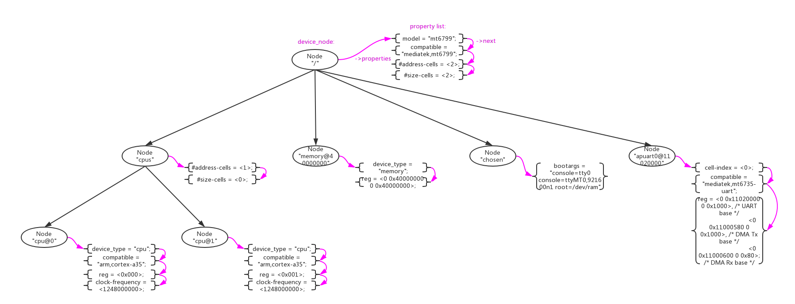

# 1、DTS语法

对于DeviceTree的来历和用处大部分人都已经非常了解了，DeviceTree发源于PowerPC架构，为了消除代码中冗余的各种device注册代码而产生的，现在已经成为了linux的通用机制。

DeviceTree的结构非常简单，由两种元素组成：Node(节点)、Property(属性)。下图是一个真实的简单的DeviceTree树形结构图。



- Node节点。在DTS中使用一对花括号"node-name{}"来定义;
- Property属性。在Node中使用"property-name=value"字符串来定义；

```
/ {
	model = "mt6799";
	compatible = "mediatek,mt6799";
	interrupt-parent = <&gic>;
	#address-cells = <2>;
	#size-cells = <2>;

	/* chosen */
	chosen {
		bootargs = "console=tty0 console=ttyMT0,921600n1 root=/dev/ram";
	};
}
```

上述例子中定义了一个根节点"/"和一个子节点“chosen”，其他的字符串“model = "mt6799";”、“compatible = "mediatek,mt6799";”都是property。

Node、Property的名字和值都是可以自定义的，没有太大限制。但是DeviceTree的标准还是预定义了一些标准的Node和Property，在标准Node和Property之间还定义了一些约束规则。关于这些描述在 [The DeviceTree Specification](https://www.devicetree.org/)官方spec中有详细描述。这里为了方便大家，还是重复做一些搬运。

## 1.1、标准Property

Property的格式为"property-name=value"，其中value的取值类型如下：

<table border="1">
<caption> Property values： </caption>

<tr>
<th style="width: 200px;">Value</th>
<th style="width: 600px;">Description</th>
</tr>

<tr>
<td> <empty> </td>
<td>
Value is empty. Used for conveying true-false information, when the presence of
absence of the property itself is sufficiently descriptive.<br /><br />
Property值为空，用property本身出现或者不出现来表示一个treue/false值。
</td>
</tr>

<tr>
<td> <u32> </td>
<td>
A 32-bit integer in big-endian format. Example: the 32-bit value 0x11223344 would be represented in memory as: <br />
address 11<br />
address+1 22<br />
address+2 33<br />
address+3 44<br /><br />
32bit的值，用大端格式存储。
</td>
</tr>

<tr>
<td> <u64> </td>
<td>
Represents a 64-bit integer in big-endian format. Consists of two <u32> values where the first value contains the most significant bits of the integer and the second value contains the least significant bits.<br />
Example: the 64-bit value 0x1122334455667788 would be represented as two cells as: <0x11223344 0x55667788>. <br />
The value would be represented in memory as:<br />
address 11<br />
address+1 22<br />
address+2 33<br />
address+3 44<br />
address+4 55<br />
address+5 66<br />
address+6 77<br />
address+7 88<br /><br />
64bit的值，用大端格式存储。
</td>
</tr>

<tr>
<td> <string> </td>
<td>
Strings are printable and null-terminated. Example: the string “hello” would be represented in memory as:<br />
address 68 'h'<br />
address+1 65 'e'<br />
address+2 6C 'l'<br />
address+3 6C 'l'<br />
address+4 6F 'o'<br />
address+5 00 '\0'<br /><br />
字符串。
</td>
</tr>

<tr>
<td> <prop-encoded-array> </td>
<td>
Format is specific to the property. See the property definition.<br /><br />
混合编码，自定义property的值。
</td>
</tr>

<tr>
<td> <phandle> </td>
<td>
A <u32> value. A phandle value is a way to reference another node in the devicetree.<br />
Any node that can be referenced defines a phandle property with a unique <u32>
value. That number is used for the value of properties with a phandle value type.<br /><br />
作为一个句柄指向一个Node，用来引用Node。
</td>
</tr>

<tr>
<td> <stringlist> </td>
<td>
A list of <string> values concatenated together.<br />
Example: The string list “hello”,”world” would be represented in memory as:<br />
address 68 'h'<br />
address+1 65 'e'<br />
address+2 6C 'l'<br />
address+3 6C 'l'<br />
address+4 6F 'o'<br />
address+5 00 '\0'<br />
address+6 77 'w'<br />
address+7 6f 'o'<br />
address+8 72 'r'<br />
address+9 6C 'l'<br />
address+10 64 'd'<br />
address+11 00 '\0'<br /><br />
字符串数组。
</td>
</tr>

</table>

### 1.1.1、compatible

- "compatible"属性通常用来device和driver的适配，推荐的格式为"manufacturer,model"。

<table border="1">

<tr>
<td style="width: 200px;">Property name:</td>
<td style="width: 600px;">compatible</td>
</tr>

<tr>
<td> Value type: </td>
<td> <stringlist> </td>
</tr>

<tr>
<td> Description: </td>
<td>
The compatible property value consists of one or more strings that define the specific programming model for the device. This list of strings should be used by a client program for device driver selection. The property value consists of a concatenated list of null terminated strings, from most specific to most general. They allow a device to express its compatibility with a family of similar devices, potentially allowing a single device driver to match against several devices.<br />
The recommended format is "manufacturer,model", where manufacturer is a string describing the name of the manufacturer (such as a stock ticker symbol), and model specifies the model number.<br /><br />
</td>
</tr>

<tr>
<td> Example: </td>
<td>
compatible = "fsl,mpc8641", "ns16550"; <br /><br />
In this example, an operating system would first try to locate a device driver that supported fsl,mpc8641. If a driver was not found, it would then try to locate a driver that supported the more general ns16550 device type.<br /><br />
在这个例子中，device首先尝试去适配"fsl,mpc8641"driver，如果失败再去尝试适配"ns16550"driver。
</td>
</tr>

</table>

### 1.1.2、model

- "model"属性只是简单的表示型号，root节点用其来传递值给machine_desc_str。

<table border="1">

<tr>
<td style="width: 200px;">Property name:</td>
<td style="width: 600px;">model</td>
</tr>

<tr>
<td> Value type: </td>
<td> <stringlist> </td>
</tr>

<tr>
<td> Description: </td>
<td>
The model property value is a <string> that specifies the manufacturer’s model number of the device.<br />
The recommended format is: "manufacturer,model", where manufacturer is a string describing the name of the manufacturer (such as a stock ticker symbol), and model specifies the model number.
</td>
</tr>

<tr>
<td> Example: </td>
<td>
model = "fsl,MPC8349EMITX";
</td>
</tr>

</table>

### 1.1.3、phandle

- "phandle"属性通用一个唯一的id来标识一个Node，在property可以使用这个id来引用Node。

<table border="1">

<tr>
<td style="width: 200px;">Property name:</td>
<td style="width: 600px;">phandle</td>
</tr>

<tr>
<td> Value type: </td>
<td> <u32> </td>
</tr>

<tr>
<td> Description: </td>
<td>
The phandle property specifies a numerical identifier for a node that is unique within the devicetree. The phandle property value is used by other nodes that need to refer to the node associated with the property.
</td>
</tr>

<tr>
<td> Example: </td>
<td>
See the following devicetree excerpt:<br />
pic@10000000 {<br />
phandle = <1>;<br />
interrupt-controller;<br />
};<br /><br />
A phandle value of 1 is defined. Another device node could reference the pic node with a phandle value of 1:<br />
another-device-node {<br />
interrupt-parent = <1>;<br />
};<br /><br />
Node“pic@10000000”定义了一个phandle属性，这个phandle有唯一id = <1>，在property“interrupt-parent”通过<1>对Node“pic@10000000”进行引用。
</td>
</tr>

</table>

在DeviceTree中通过另一种方式进行phandle的定义和引用更加常见：

- 定义一个“label：”来引用Node，在编译是系统会自动为node生成一个phandle属性。"cpu0"是一个label，用来引用node"cpu@0"：

```
		cpu0: cpu@0 {
			device_type = "cpu";
			compatible = "arm,cortex-a35";
			reg = <0x000>;
			enable-method = "psci";
			cpu-idle-states = <&LEGACY_MCDI &LEGACY_SODI &LEGACY_SODI3 &LEGACY_DPIDLE>,
					  <&LEGACY_SUSPEND &MCDI &SODI &SODI3 &DPIDLE &SUSPEND>;
			cpu-release-addr = <0x0 0x40000200>;
			clock-frequency = <1248000000>;
		};
```

- 使用"&"来引用“label”，即是引用phandle。property"cpu"通过"&cpu0"来对node"cpu@0"：

```
		cpu-map {
			cluster0 {
				core0 {
					cpu = <&cpu0>;
				};


				core1 {
					cpu = <&cpu1>;
				};

				core2 {
					cpu = <&cpu2>;
				};

				core3 {
					cpu = <&cpu3>;
				};

			};
```


### 1.1.4、#address-cells 、 #size-cells

- "#address-cells, #size-cells"属性用来定义当前node的子node中"reg"属性的解析格式。

<table border="1">

<tr>
<td style="width: 200px;">Property name:</td>
<td style="width: 600px;">#address-cells, #size-cells</td>
</tr>

<tr>
<td> Value type: </td>
<td> <u32> </td>
</tr>

<tr>
<td> Description: </td>
<td>
The #address-cells and #size-cells properties may be used in any device node that has children in the devicetree hierarchy and describes how child device nodes should be addressed. The #address-cells property defines the number of <u32> cells used to encode the address field in a child node’s reg property. The #size-cells property defines the number of <u32> cells used to encode the size field in a child node’s reg property.<br />
The #address-cells and #size-cells properties are not inherited from ancestors in the devicetree. They shall be explicitly defined.<br />
A DTSpec-compliant boot program shall supply #address-cells and #size-cells on all nodes that have children.<br />
If missing, a client program should assume a default value of 2 for #address-cells, and a value of 1 for #size-cells.<br />
</td>
</tr>

<tr>
<td> Example: </td>
<td>
See the following devicetree excerpt:<br />
soc {<br />
#address-cells = <1>;<br />
#size-cells = <1>;<br />
&nbsp;&nbsp;&nbsp;&nbsp;serial {<br />
&nbsp;&nbsp;&nbsp;&nbsp;compatible = "ns16550";<br />
&nbsp;&nbsp;&nbsp;&nbsp;reg = <0x4600 0x100>;<br />
&nbsp;&nbsp;&nbsp;&nbsp;clock-frequency = <0>;<br />
&nbsp;&nbsp;&nbsp;&nbsp;interrupts = <0xA 0x8>;<br />
&nbsp;&nbsp;&nbsp;&nbsp;interrupt-parent = <&ipic>;<br />
&nbsp;&nbsp;&nbsp;&nbsp;};<br />
};<br /><br />

In this example, the #address-cells and #size-cells properties of the soc node are both set to 1. This setting specifies that one cell is required to represent an address and one cell is required to represent the size of nodes
that are children of this node.<br />
The serial device reg property necessarily follows this specification set in the parent (soc) node—the address is represented by a single cell (0x4600), and the size is represented by a single cell (0x100).<br />
</td>
</tr>

</table>


举例说明：

- 1、如果node"soc"中"#address-cells=<1>"、"#size-cells=<1>"，那么子node"serial"中"reg"属性的解析为“addr1 = 0x0, size1 = 0x100, addr2 = 0x0, size2 = 0x200”：

```
soc {
    #address-cells = <1>;
    #size-cells = <1>;
    serial {
        reg = <0x0 0x100 0x0 0x200>;
    }
}
```

- 2、如果node"soc"中"#address-cells=<2>"、"#size-cells=<2>"，那么子node"serial"中"reg"属性的解析为“addr1 = 0x100, size1 = 0x200”：

```
soc {
    #address-cells = <2>;
    #size-cells = <2>;
    serial {
        reg = <0x0 0x100 0x0 0x200>;
    }
}
```

- 3、如果node"soc"中"#address-cells=<2>"、"#size-cells=<0>"，那么子node"serial"中"reg"属性的解析为“addr1 = 0x100, addr2 = 0x200”：

```
soc {
    #address-cells = <2>;
    #size-cells = <0>;
    serial {
        reg = <0x0 0x100 0x0 0x200>;
    }
}
```

### 1.1.5、reg

- "reg"属性解析出"address,length"数字，解析格式依据父节点的"#address-cells、#size-cells"定义。

<table border="1">

<tr>
<td style="width: 200px;">Property name:</td>
<td style="width: 600px;">reg</td>
</tr>

<tr>
<td> Value type: </td>
<td> <prop-encoded-array> encoded as an arbitrary number of (address, length) pairs. </td>
</tr>

<tr>
<td> Description: </td>
<td>
The reg property describes the address of the device’s resources within the address space defined by its parent bus. Most commonly this means the offsets and lengths of memory-mapped IO register blocks, but may have a different meaning on some bus types. Addresses in the address space defined by the root node are CPU real addresses.<br />
The value is a <prop-encoded-array>, composed of an arbitrary number of pairs of address and length, <address length>. The number of <u32> cells required to specify the address and length are bus-specific and are specified by the #address-cells and #size-cells properties in the parent of the device node. If the parent node specifies a value of 0 for #size-cells, the length field in the value of reg shall be omitted.<br />
</td>
</tr>

<tr>
<td> Example: </td>
<td>
Suppose a device within a system-on-a-chip had two blocks of registers, a 32-byte block at offset 0x3000 in the SOC and a 256-byte block at offset 0xFE00. The reg property would be encoded as follows (assuming #address-cells and #size-cells values of 1):<br /><br />
reg = <0x3000 0x20 0xFE00 0x100>;
</td>
</tr>

</table>

### 1.1.6、ranges

- "ranges"属性用来做当前node和父node之间的地址映射，格式为(child-bus-address, parentbus-address, length)。其中child-bus-address的解析长度受当前node的#address-cells属性控制，parentbus-address的解析长度受父node的#address-cells属性控制length的解析长度受当前node的#size-cells属性控制。

<table border="1">

<tr>
<td style="width: 200px;">Property name:</td>
<td style="width: 600px;">ranges</td>
</tr>

<tr>
<td> Value type: </td>
<td> <empty> or <prop-encoded-array> encoded as an arbitrary number of (child-bus-address, parentbus-address, length) triplets. </td>
</tr>

<tr>
<td> Description: </td>
<td>
The ranges property provides a means of defining a mapping or translation between the address space of the bus (the child address space) and the address space of the bus node’s parent (the parent address space).<br />
The format of the value of the ranges property is an arbitrary number of triplets of (child-bus-address, parentbus-address, length)<br />
• The child-bus-address is a physical address within the child bus’ address space. The number of cells to represent the address is bus dependent and can be determined from the #address-cells of this node (the node in which the ranges property appears).<br />
• The parent-bus-address is a physical address within the parent bus’ address space. The number of cells to represent the parent address is bus dependent and can be determined from the #address-cells property of the node that defines the parent’s address space.<br />
• The length specifies the size of the range in the child’s address space. The number of cells to represent the size can be determined from the #size-cells of this node (the node in which the ranges property appears).<br />
If the property is defined with an <empty> value, it specifies that the parent and child address space is identical, and no address translation is required.<br />
If the property is not present in a bus node, it is assumed that no mapping exists between children of the node and the parent address space.
</td>
</tr>

<tr>
<td> Example: </td>
<td>
Address Translation Example:<br />
soc {<br />
compatible = "simple-bus";<br />
#address-cells = <1>;<br />
#size-cells = <1>;<br />
ranges = <0x0 0xe0000000 0x00100000>;<br />
serial {<br />
device_type = "serial";<br />
compatible = "ns16550";<br />
reg = <0x4600 0x100>;<br />
clock-frequency = <0>;<br />
interrupts = <0xA 0x8>;<br />
interrupt-parent = <&ipic>;<br />
};<br />
};<br /><br />
The soc node specifies a ranges property of<br />
<0x0 0xe0000000 0x00100000>;<br /><br />
This property value specifies that for an 1024KB range of address space, a child node addressed at physical 0x0 maps to a parent address of physical 0xe0000000. With this mapping, the serial device node can be addressed by a load or store at address 0xe0004600, an offset of 0x4600 (specified in reg) plus the 0xe0000000
mapping specified in ranges.
</td><br />
</tr>

</table>

### 1.1.7、interrupt property

和中断相关的node可以分成3种：

- "Interrupt Generating Devices"，中断发生设备，这种设备可以发生中断。
- "Interrupt Controllers"，中断控制器，处理中断。
- "Interrupt Nexus"，中断联结，路由中断给中断控制器。


#### 1.1.7.1、Interrupt Generating Devices Property

- "interrupts"属性用来定义设备的中断解析，根据其"interrupt-parent"node中定义的“#interrupt-cells”来解析。比如#interrupt-cells=2，那根据2个cells为单位来解析"interrupts"属性。

<table border="1">

<tr>
<td style="width: 200px;">Property name:</td>
<td style="width: 600px;">interrupts</td>
</tr>

<tr>
<td> Value type: </td>
<td> <prop-encoded-array> encoded as arbitrary number of interrupt specifiers </td>
</tr>

<tr>
<td> Description: </td>
<td>
The interrupts property of a device node defines the interrupt or interrupts that are generated by the device.<br />
The value of the interrupts property consists of an arbitrary number of interrupt specifiers. The format of an interrupt specifier is defined by the binding of the interrupt domain root.<br />
interrupts is overridden by the interrupts-extended property and normally only one or the other should be used.<br />
</td>
</tr>

<tr>
<td> Example: </td>
<td>
A common definition of an interrupt specifier in an open PIC–compatible interrupt domain consists of two cells; an interrupt number and level/sense information. See the following example, which defines a single
interrupt specifier, with an interrupt number of 0xA and level/sense encoding of 8.<br /><br />
interrupts = <0xA 8>;<br />
</td><br />
</tr>

</table>


- "interrupt-parent"属性用来制定当前设备的Interrupt Controllers/Interrupt Nexus，phandle指向对应的node。

<table border="1">

<tr>
<td style="width: 200px;">Property name:</td>
<td style="width: 600px;">interrupt-parent</td>
</tr>

<tr>
<td> Value type: </td>
<td> <phandle> </td>
</tr>

<tr>
<td> Description: </td>
<td>
Because the hierarchy of the nodes in the interrupt tree might not match the devicetree, the interrupt-parent property is available to make the definition of an interrupt parent explicit. The value is the phandle to the interrupt parent. If this property is missing from a device, its interrupt parent is assumed to be its devicetree parent.<br />
</td>
</tr>

</table>


#### 1.1.7.2、Interrupt Controllers Property

- "#interrupt-cells"属性用来规定连接到该中断控制器上的设备的"interrupts"属性的解析长度。

<table border="1">

<tr>
<td style="width: 200px;">Property name:</td>
<td style="width: 600px;">#interrupt-cells</td>
</tr>

<tr>
<td> Value type: </td>
<td> <u32> </td>
</tr>

<tr>
<td> Description: </td>
<td>
The #interrupt-cells property defines the number of cells required to encode an interrupt specifier for an interrupt domain.<br />
</td>
</tr>

</table>

- "interrupt-controller"属性用来声明当前node为中断控制器。

<table border="1">

<tr>
<td style="width: 200px;">Property name:</td>
<td style="width: 600px;">interrupt-controller</td>
</tr>

<tr>
<td> Value type: </td>
<td> <empty> </td>
</tr>

<tr>
<td> Description: </td>
<td>
The presence of an interrupt-controller property defines a node as an interrupt controller node.<br />
</td>
</tr>

</table>


#### 1.1.7.3、Interrupt Nexus Property

- "#interrupt-cells"属性用来规定连接到该中断控制器上的设备的"interrupts"属性的解析长度。

<table border="1">

<tr>
<td style="width: 200px;">Property name:</td>
<td style="width: 600px;">#interrupt-cells</td>
</tr>

<tr>
<td> Value type: </td>
<td> <u32> </td>
</tr>

<tr>
<td> Description: </td>
<td>
The #interrupt-cells property defines the number of cells required to encode an interrupt specifier for an interrupt domain.<br />
</td>
</tr>

</table>


- "interrupt-map"属性用来描述interrupt nexus设备对中断的路由。解析格式为5元素序列“child unit address, child interrupt specifier, interrupt-parent, parent unit address, parent interrupt specifier”。

其中：

“child unit address”的cells长度由子节点的“#address-cells”指定；
“child interrupt specifier”的cells长度由子节点的“#interrupt-cells”指定；
“interrupt-parent”phandle指向interrupt controller的引用；
“parent unit address”的cells长度由父节点的“#address-cells”指定；
“parent interrupt specifier”的cells长度由父节点的“#interrupt-cells”指定；


<table border="1">

<tr>
<td style="width: 200px;">Property name:</td>
<td style="width: 600px;">interrupt-map</td>
</tr>

<tr>
<td> Value type: </td>
<td> <prop-encoded-array> encoded as an arbitrary number of interrupt mapping entries. </td>
</tr>

<tr>
<td> Description: </td>
<td>
An interrupt-map is a property on a nexus node that bridges one interrupt domain with a set of parent interrupt domains and specifies how interrupt specifiers in the child domain are mapped to their respective parent
domains.<br />
The interrupt map is a table where each row is a mapping entry consisting of five components: <i>child unit address, child interrupt specifier, interrupt-parent, parent unit address, parent interrupt specifier.</i><br />
<b>child unit address</b> The unit address of the child node being mapped. The number of 32-bit cells required to specify this is described by the #address-cells property of the bus node on which the child is located.<br />
<b>child interrupt specifier</b> The interrupt specifier of the child node being mapped. The number of 32-bit cells required to specify this component is described by the #interrupt-cells property of this node—the nexus node containing the interrupt-map property.<br />
<b>interrupt-parent</b> A single <phandle> value that points to the interrupt parent to which the child domain is being mapped.<br />
<b>parent unit address</b> The unit address in the domain of the interrupt parent. The number of 32-bit cells required to specify this address is described by the #address-cells property of the node pointed to by the interrupt-parent field.<br />
<b>parent interrupt specifier</b> The interrupt specifier in the parent domain. The number of 32-bit cells required to specify this component is described by the #interrupt-cells property of the node pointed to by the interrupt-parent field.<br />
Lookups are performed on the interrupt mapping table by matching a unit-address/interrupt specifier pair against the child components in the interrupt-map. Because some fields in the unit interrupt specifier may not be relevant, a mask is applied before the lookup is done. This mask is defined in the interrupt-map-mask property (see section 2.4.3.2).<br />
</td>
</tr>

</table>

举例：

```
soc {
    compatible = "simple-bus";
    #address-cells = <1>;
    #size-cells = <1>;
    open-pic {
        clock-frequency = <0>;
        interrupt-controller;
        #address-cells = <0>;
        #interrupt-cells = <2>;
    };
    pci {
        #interrupt-cells = <1>;
        #size-cells = <2>;
        #address-cells = <3>;
        interrupt-map-mask = <0xf800 0 0 7>;
        interrupt-map = <
        /* IDSEL 0x11 - PCI slot 1 */
        0x8800 0 0 1 &open-pic 2 1 /* INTA */
        0x8800 0 0 2 &open-pic 3 1 /* INTB */
        0x8800 0 0 3 &open-pic 4 1 /* INTC */
        0x8800 0 0 4 &open-pic 1 1 /* INTD */
        /* IDSEL 0x12 - PCI slot 2 */
        0x9000 0 0 1 &open-pic 3 1 /* INTA */
        0x9000 0 0 2 &open-pic 4 1 /* INTB */
        0x9000 0 0 3 &open-pic 1 1 /* INTC */
        0x9000 0 0 4 &open-pic 2 1 /* INTD */
        >;
    };
};
```

```
• For example, the first row of the interrupt-map table specifies the mapping for INTA of slot 1. The components of that row are shown here
    child unit address: 0x8800 0 0
    child interrupt specifier: 1
    interrupt parent: &open-pic
    parent unit address: (empty because #address-cells = <0> in the open-pic node)
    parent interrupt specifier: 2 1
```


## 1.2、标准Node

Node Name常常由两部分组成“node-name@unit-address”，主要是为了防止Node Name重复冲突：

- "node-name"是node的名字；
- "unit-address"是node中“reg”属性描述的开始地址；

例如："msdc@11240000"中node-name=“msdc”，unit-address=“11240000”。

```
/ {
	model = "mt6799";
	compatible = "mediatek,mt6799";
	interrupt-parent = <&gic>;
	#address-cells = <2>;
	#size-cells = <2>;

	msdc0:msdc@11240000 {
		compatible = "mediatek,msdc";
		reg = <0x0 0x11240000 0x0 0x10000
		       0x0 0x10000e84 0x0 0x2>;    /* FPGA PWR_GPIO, PWR_GPIO_EO */
		interrupts = <GIC_SPI 79 IRQ_TYPE_LEVEL_LOW>;
	};
```

下面主要介绍一下一些预先定义的标准Node。

### 1.2.1、Root node

每个DeviceTree只有一个根节点。根节点需要有以下必备属性：

<table border="1">
<caption>  Root Node Properties </caption>

<tr>
<th style="width: 150px;">Property Name</th>
<th style="width: 100px;">Usage</th>
<th style="width: 150px;">Value Type</th>
<th style="width: 600px;">Definition</th>
</tr>

<tr>
<td> #address-cells </td>
<td> R </td>
<td> <u32> </td>
<td> 
Specifies the number of <u32> cells to represent the address in the reg  property in children of root. 
</td>
</tr>

<tr>
<td> #size-cells </td>
<td> R </td>
<td> <u32> </td>
<td> 
Specifies the number of <u32> cells to represent the size in the reg property in children of root. 
</td>
</tr>

<tr>
<td> model </td>
<td> R </td>
<td> <string> </td>
<td> 
Specifies a string that uniquely identifies the model of the system board. The recommended format is “manufacturer,model-number”.
</td>
</tr>

<tr>
<td> compatible </td>
<td> R </td>
<td> <stringlist> </td>
<td> 
Specifies a list of platform architectures with which this platform is compatible. This property can be used by operating systems in selecting
platform specific code. The recommended form of the property value is:<br />
"manufacturer,model"<br /><br />
For example:<br />
compatible = "fsl,mpc8572ds"<br />
</td>
</tr>

</table>

### 1.2.2、/aliases node

用来给一些绝对路径定义别名：

```
aliases {
    serial0 = "/simple-bus@fe000000/serial@llc500";
    ethernet0 = "/simple-bus@fe000000/ethernet@31c000";
};
```

### 1.2.3、/memory node

用来传递内存布局：

<table border="1">
<caption>  /memory Node Properties </caption>

<tr>
<th style="width: 150px;">Property Name</th>
<th style="width: 100px;">Usage</th>
<th style="width: 150px;">Value Type</th>
<th style="width: 600px;">Definition</th>
</tr>

<tr>
<td> device_type </td>
<td> R </td>
<td> <string> </td>
<td> 
Value shall be “memory”
</td>
</tr>

<tr>
<td> reg </td>
<td> R </td>
<td> <prop-encoded-array> </td>
<td> 
Consists of an arbitrary number of address and size pairs that specify the physical address and size of the memory ranges.
</td>
</tr>

<tr>
<td> initial-mapped-area </td>
<td> O </td>
<td> <prop-encoded-array> </td>
<td> 
Specifies the address and size of the Initial Mapped Area
Is a prop-encoded-array consisting of a triplet of (effective address, physical address, size).
The effective and physical address shall each be 64-bit (<u64> value), and the size shall be 32-bits (<u32> value).
</td>
</tr>

</table>

举例：
```
• RAM: starting address 0x0, length 0x80000000 (2GB)
• RAM: starting address 0x100000000, length 0x100000000 (4GB)
```

```
\ {
    #address-cells = <2>;
    #size-cells = <2>;

    memory@0 {
        device_type = "memory";
        reg = <0x000000000 0x00000000 0x00000000 0x80000000
        0x000000001 0x00000000 0x00000001 0x00000000>;
    };
}

```

### 1.2.4、/chosen node

其中“bootargs”属性用来传递cmdline参数，“stdout-path”属性用来指定标准输出设备，“stdin-path”属性用来指定标准输入设备。

<table border="1">
<caption>  /chosen Node Properties </caption>

<tr>
<th style="width: 150px;">Property Name</th>
<th style="width: 100px;">Usage</th>
<th style="width: 150px;">Value Type</th>
<th style="width: 600px;">Definition</th>
</tr>

<tr>
<td> bootargs </td>
<td> O </td>
<td> <string> </td>
<td> 
A string that specifies the boot arguments for the client program. The value could potentially be a null string if no boot arguments are required.
</td>
</tr>

<tr>
<td> stdout-path </td>
<td> O </td>
<td> <string> </td>
<td> 
A string that specifies the full path to the node representing the device to be used for boot console output. If the character “:” is present in the value it terminates the path. The value may be an alias. If the stdin-path property is
not specified, stdout-path should be assumed to define the input device.
</td>
</tr>

<tr>
<td> stdin-path </td>
<td> O </td>
<td> <string> </td>
<td> 
A string that specifies the full path to the node representing the device to be used for boot console input. If the character “:” is present in the value it terminates the path. The value may be an alias.
</td>
</tr>

</table>

举例：

```
	/* chosen */
	chosen {
		bootargs = "console=tty0 console=ttyMT0,921600n1 root=/dev/ram";
	};
```

### 1.2.5、/cpus node

/cpus节点也是必须的，下面举个具体例子：

```
	cpus {
		#address-cells = <1>;
		#size-cells = <0>;

		cpu0: cpu@0 {
			device_type = "cpu";
			compatible = "arm,cortex-a35";
			reg = <0x000>;
			enable-method = "psci";
			cpu-idle-states = <&LEGACY_MCDI &LEGACY_SODI &LEGACY_SODI3 &LEGACY_DPIDLE>,
					  <&LEGACY_SUSPEND &MCDI &SODI &SODI3 &DPIDLE &SUSPEND>;
			cpu-release-addr = <0x0 0x40000200>;
			clock-frequency = <1248000000>;
		};

		cpu1: cpu@001 {
			device_type = "cpu";
			compatible = "arm,cortex-a35";
			reg = <0x001>;
			enable-method = "psci";
			cpu-idle-states = <&LEGACY_MCDI &LEGACY_SODI &LEGACY_SODI3 &LEGACY_DPIDLE>,
					  <&LEGACY_SUSPEND &MCDI &SODI &SODI3 &DPIDLE &SUSPEND>;
			cpu-release-addr = <0x0 0x40000200>;
			clock-frequency = <1248000000>;
		};

		cpu2: cpu@002 {
			device_type = "cpu";
			compatible = "arm,cortex-a35";
			reg = <0x002>;
			enable-method = "psci";
			cpu-idle-states = <&LEGACY_MCDI &LEGACY_SODI &LEGACY_SODI3 &LEGACY_DPIDLE>,
					  <&LEGACY_SUSPEND &MCDI &SODI &SODI3 &DPIDLE &SUSPEND>;
			cpu-release-addr = <0x0 0x40000200>;
			clock-frequency = <1248000000>;
		};

		cpu3: cpu@003 {
			device_type = "cpu";
			compatible = "arm,cortex-a35";
			reg = <0x003>;
			enable-method = "psci";
			cpu-idle-states = <&LEGACY_MCDI &LEGACY_SODI &LEGACY_SODI3 &LEGACY_DPIDLE>,
					  <&LEGACY_SUSPEND &MCDI &SODI &SODI3 &DPIDLE &SUSPEND>;
			cpu-release-addr = <0x0 0x40000200>;
			clock-frequency = <1248000000>;
		};

		cpu4: cpu@100 {
			device_type = "cpu";
			compatible = "arm,cortex-a53";
			reg = <0x100>;
			enable-method = "psci";
			cpu-idle-states = <&LEGACY_MCDI &LEGACY_SODI &LEGACY_SODI3 &LEGACY_DPIDLE>,
					  <&LEGACY_SUSPEND &MCDI &SODI &SODI3 &DPIDLE &SUSPEND>;
			cpu-release-addr = <0x0 0x40000200>;
			clock-frequency = <1378000000>;
		};

		cpu5: cpu@101 {
			device_type = "cpu";
			compatible = "arm,cortex-a53";
			reg = <0x101>;
			enable-method = "psci";
			cpu-idle-states = <&LEGACY_MCDI &LEGACY_SODI &LEGACY_SODI3 &LEGACY_DPIDLE>,
					  <&LEGACY_SUSPEND &MCDI &SODI &SODI3 &DPIDLE &SUSPEND>;
			cpu-release-addr = <0x0 0x40000200>;
			clock-frequency = <1378000000>;
		};

		cpu6: cpu@102 {
			device_type = "cpu";
			compatible = "arm,cortex-a53";
			reg = <0x102>;
			enable-method = "psci";
			cpu-idle-states = <&LEGACY_MCDI &LEGACY_SODI &LEGACY_SODI3 &LEGACY_DPIDLE>,
					  <&LEGACY_SUSPEND &MCDI &SODI &SODI3 &DPIDLE &SUSPEND>;
			cpu-release-addr = <0x0 0x40000200>;
			clock-frequency = <1378000000>;
		};

		cpu7: cpu@103 {
			device_type = "cpu";
			compatible = "arm,cortex-a53";
			reg = <0x103>;
			enable-method = "psci";
			cpu-idle-states = <&LEGACY_MCDI &LEGACY_SODI &LEGACY_SODI3 &LEGACY_DPIDLE>,
					  <&LEGACY_SUSPEND &MCDI &SODI &SODI3 &DPIDLE &SUSPEND>;
			cpu-release-addr = <0x0 0x40000200>;
			clock-frequency = <1378000000>;
		};

		cpu8: cpu@200 {
			device_type = "cpu";
			compatible = "arm,cortex-a73";
			reg = <0x200>;
			enable-method = "psci";
			cpu-idle-states = <&LEGACY_MCDI &LEGACY_SODI &LEGACY_SODI3 &LEGACY_DPIDLE>,
					  <&LEGACY_SUSPEND &MCDI &SODI &SODI3 &DPIDLE &SUSPEND>;
			cpu-release-addr = <0x0 0x40000200>;
			clock-frequency = <1638000000>;
		};

		cpu9: cpu@201 {
			device_type = "cpu";
			compatible = "arm,cortex-a73";
			reg = <0x201>;
			enable-method = "psci";
			cpu-idle-states = <&LEGACY_MCDI &LEGACY_SODI &LEGACY_SODI3 &LEGACY_DPIDLE>,
					  <&LEGACY_SUSPEND &MCDI &SODI &SODI3 &DPIDLE &SUSPEND>;
			cpu-release-addr = <0x0 0x40000200>;
			clock-frequency = <1638000000>;
		};

		cpu-map {
			cluster0 {
				core0 {
					cpu = <&cpu0>;
				};


				core1 {
					cpu = <&cpu1>;
				};

				core2 {
					cpu = <&cpu2>;
				};

				core3 {
					cpu = <&cpu3>;
				};

			};

			cluster1 {
				core0 {
					cpu = <&cpu4>;
				};

				core1 {
					cpu = <&cpu5>;
				};

				core2 {
					cpu = <&cpu6>;
				};

				core3 {
					cpu = <&cpu7>;
				};

			};

			cluster2 {
				core0 {
					cpu = <&cpu8>;
				};

				core1 {
					cpu = <&cpu9>;
				};

			};
		};

		idle-states {
			entry-method = "arm,psci";

			LEGACY_MCDI: legacy-mcdi {
				compatible = "arm,idle-state";
				arm,psci-suspend-param = <0x0000001>;
				entry-latency-us = <600>;
				exit-latency-us = <600>;
				min-residency-us = <1200>;
			};

			LEGACY_SODI: legacy-sodi {
				compatible = "arm,idle-state";
				arm,psci-suspend-param = <0x0000002>;
				entry-latency-us = <600>;
				exit-latency-us = <600>;
				min-residency-us = <1200>;
			};

			LEGACY_SODI3: legacy-sodi3 {
				compatible = "arm,idle-state";
				arm,psci-suspend-param = <0x0000003>;
				entry-latency-us = <600>;
				exit-latency-us = <600>;
				min-residency-us = <1200>;
			};

			LEGACY_DPIDLE: legacy-dpidle {
				compatible = "arm,idle-state";
				arm,psci-suspend-param = <0x0000004>;
				entry-latency-us = <600>;
				exit-latency-us = <600>;
				min-residency-us = <1200>;
			};

			LEGACY_SUSPEND: legacy-suspend {
				compatible = "arm,idle-state";
				arm,psci-suspend-param = <0x0000005>;
				entry-latency-us = <600>;
				exit-latency-us = <600>;
				min-residency-us = <1200>;
			};

			MCDI: mcdi {
				compatible = "arm,idle-state";
				arm,psci-suspend-param = <0x0010001>;
				entry-latency-us = <600>;
				exit-latency-us = <600>;
				min-residency-us = <1200>;
			};

			SODI: sodi {
				compatible = "arm,idle-state";
				arm,psci-suspend-param = <0x1010002>;
				entry-latency-us = <800>;
				exit-latency-us = <1000>;
				min-residency-us = <2000>;
			};

			SODI3: sodi3 {
				compatible = "arm,idle-state";
				arm,psci-suspend-param = <0x1010003>;
				entry-latency-us = <800>;
				exit-latency-us = <1000>;
				min-residency-us = <2000>;
			};

			DPIDLE: dpidle {
				compatible = "arm,idle-state";
				arm,psci-suspend-param = <0x1010004>;
				entry-latency-us = <800>;
				exit-latency-us = <1000>;
				min-residency-us = <2000>;
			};

			SUSPEND: suspend {
				compatible = "arm,idle-state";
				arm,psci-suspend-param = <0x1010005>;
				entry-latency-us = <800>;
				exit-latency-us = <1000>;
				min-residency-us = <2000>;
			};

		};
	};
```

# 2、DTB


## 2.1、DTB的编译

DTB(Devicetree Blob)是DTS的二进制文件格式，Kernel使用DTC工具将DTS源文件编译成DTB，bootloader再将DTB文件传递给Kernel解析。

不遵守标准书写的DTS文件在编译的时候会报错。


## 2.2、DTB的文件结构


DTB文件的结构如上图所示，主要在3部分：

- struct ftd_header。文件头结构；
- structure block。存放含Node和Property的Value；
- strings block。存放Property的Name；把Property Name单独分为一个区域的原因是，有很多Property Name是重复的，单独一个区域可以使用指针引用，节约空间。

dtb中的fdt_header的数据结构：

```
struct fdt_header {
    uint32_t magic;
    uint32_t totalsize;
    uint32_t off_dt_struct;
    uint32_t off_dt_strings;
    uint32_t off_mem_rsvmap;
    uint32_t version;
    uint32_t last_comp_version;
    uint32_t boot_cpuid_phys;
    uint32_t size_dt_strings;
    uint32_t size_dt_struct;
};
```

dtb中node header的数据结构：

```
struct fdt_node_header {
	fdt32_t tag;
	char name[0];   // node name 存放在structure block
};
```

dtb中property header的数据结构：

```
struct fdt_property {
	fdt32_t tag;
	fdt32_t len;
	fdt32_t nameoff;    // perperty name存放在strings block
	char data[0];
};
```

整个文件使用5种token来分割出node和property：

- FDT_BEGIN_NODE (0x00000001)
- FDT_END_NODE (0x00000002)
- FDT_PROP (0x00000003)
- FDT_NOP (0x00000004)
- FDT_END (0x00000009)

可以使用hex编辑器来查看DTB文件的结构：


## 2.3、Bootloader对DTB的传递

没有仔细去看

# 3、Kernel解析

## 3.1、DTB解析

### 3.1.1 setup_machine_fdt()

直接在dtb中解析根节点的一些属性和子节点给系统早期使用。

- 解析"/"节点的model"属性给machine_desc赋值；
- 解析"/chosen"node中的"bootargs"属性给boot_command_line；
- 解析"/"节点的"#size-cells"、"#address-cells"属性；
- 解析"/memory"node中的"reg"属性，并将memory区域加入到系统；

```
start_kernel() -> setup_arch() -> setup_machine_fdt():
↓

static void __init setup_machine_fdt(phys_addr_t dt_phys)
{
    /* (1) 映射dtb内存，到使之可以访问 */
	void *dt_virt = fixmap_remap_fdt(dt_phys);

    /* (2) 早期扫描device tree中的一些node和property */
	if (!dt_virt || !early_init_dt_scan(dt_virt)) {
		pr_crit("\n"
			"Error: invalid device tree blob at physical address %pa (virtual address 0x%p)\n"
			"The dtb must be 8-byte aligned and must not exceed 2 MB in size\n"
			"\nPlease check your bootloader.",
			&dt_phys, dt_virt);

		while (true)
			cpu_relax();
	}

    /* (3) 使用device tree中root node的"model/compatible"属性给machine_desc赋值 */
	machine_desc_set(of_flat_dt_get_machine_name());
	dump_stack_set_arch_desc("%s (DT)", of_flat_dt_get_machine_name());
}
↓

bool __init early_init_dt_scan(void *params)
{
	bool status;

    /* (2.1)校验dtb数据 */
	status = early_init_dt_verify(params);
	if (!status)
		return false;

    /* (2.2) */
	early_init_dt_scan_nodes();
	return true;
}
↓

void __init early_init_dt_scan_nodes(void)
{
    /* (2.2.1) 解析"/chosen"node中的"bootargs"属性 */
	/* Retrieve various information from the /chosen node */
	of_scan_flat_dt(early_init_dt_scan_chosen, boot_command_line);

    /* (2.2.2) 解析"/"node中的"#size-cells"、"#address-cells"属性 */
	/* Initialize {size,address}-cells info */
	of_scan_flat_dt(early_init_dt_scan_root, NULL);

    /* (2.2.3) 解析"/memory"node中的"reg"属性，并将memory区域加入到系统 */
	/* Setup memory, calling early_init_dt_add_memory_arch */
	of_scan_flat_dt(early_init_dt_scan_memory, NULL);
}
↓

early_init_dt_scan_memory() -> early_init_dt_add_memory_arch() -> memblock_add()
```

### 3.1.2 unflatten_device_tree()

将DTB完全解析为内核使用的的device_node、property结构：

```
start_kernel() -> setup_arch() -> unflatten_device_tree():
↓

void __init unflatten_device_tree(void)
{
    /* (1) 解析dtb数据到kernel中 */
	__unflatten_device_tree(initial_boot_params, &of_root,
				early_init_dt_alloc_memory_arch);

    /* (2) 扫描"/aliases"、"/chosen"节点来进行一些预制值的配置 */
	/* Get pointer to "/chosen" and "/aliases" nodes for use everywhere */
	of_alias_scan(early_init_dt_alloc_memory_arch);
}
↓

static void __unflatten_device_tree(const void *blob,
			     struct device_node **mynodes,
			     void * (*dt_alloc)(u64 size, u64 align))
{
	unsigned long size;
	int start;
	void *mem;

	pr_debug(" -> unflatten_device_tree()\n");

	if (!blob) {
		pr_debug("No device tree pointer\n");
		return;
	}

	pr_debug("Unflattening device tree:\n");
	pr_debug("magic: %08x\n", fdt_magic(blob));
	pr_debug("size: %08x\n", fdt_totalsize(blob));
	pr_debug("version: %08x\n", fdt_version(blob));

	if (fdt_check_header(blob)) {
		pr_err("Invalid device tree blob header\n");
		return;
	}

    /* (1.1) 第一遍扫描，计算dtb解析需要的内存空间 */
	/* First pass, scan for size */
	start = 0;
	size = (unsigned long)unflatten_dt_node(blob, NULL, &start, NULL, NULL, 0, true);
	size = ALIGN(size, 4);

	pr_debug("  size is %lx, allocating...\n", size);

    /* (1.2) 分配所需内存 */
	/* Allocate memory for the expanded device tree */
	mem = dt_alloc(size + 4, __alignof__(struct device_node));
	memset(mem, 0, size);

	*(__be32 *)(mem + size) = cpu_to_be32(0xdeadbeef);

	pr_debug("  unflattening %p...\n", mem);

    /* (1.3)第二遍扫描，在分配的内存中创建device_node、property树形结构来存储dtb的解析 */
	/* Second pass, do actual unflattening */
	start = 0;
	unflatten_dt_node(blob, mem, &start, NULL, mynodes, 0, false);
	if (be32_to_cpup(mem + size) != 0xdeadbeef)
		pr_warning("End of tree marker overwritten: %08x\n",
			   be32_to_cpup(mem + size));

	pr_debug(" <- unflatten_device_tree()\n");
}
↓

static void * unflatten_dt_node(const void *blob,
				void *mem,
				int *poffset,
				struct device_node *dad,
				struct device_node **nodepp,
				unsigned long fpsize,
				bool dryrun)
{
	const __be32 *p;
	struct device_node *np;
	struct property *pp, **prev_pp = NULL;
	const char *pathp;
	unsigned int l, allocl;
	static int depth;
	int old_depth;
	int offset;
	int has_name = 0;
	int new_format = 0;

    /* (1.1.1) 解析node，解析node中的name值 */
	pathp = fdt_get_name(blob, *poffset, &l);
	if (!pathp)
		return mem;

	allocl = ++l;	/* l 为当前路径的长度 */

	/* version 0x10 has a more compact unit name here instead of the full
	 * path. we accumulate the full path size using "fpsize", we'll rebuild
	 * it later. We detect this because the first character of the name is
	 * not '/'.
	 */
	if ((*pathp) != '/') {
		new_format = 1;
		if (fpsize == 0) {
			/* root node: special case. fpsize accounts for path
			 * plus terminating zero. root node only has '/', so
			 * fpsize should be 2, but we want to avoid the first
			 * level nodes to have two '/' so we use fpsize 1 here
			 */
			fpsize = 1;
			allocl = 2;
			l = 1;
			pathp = "";
		} else {
			/* account for '/' and path size minus terminal 0
			 * already in 'l'
			 */
			fpsize += l;	/* 当前full path的长度 = 上一次full path的长度 + 当前node nam的长度 l */
			allocl = fpsize;
		}
	}

    /* 计算解析当前node节点需要的内存大小 = device_node + full path  */
	np = unflatten_dt_alloc(&mem, sizeof(struct device_node) + allocl,
				__alignof__(struct device_node));
    /*  dryrun = true，只进行长度计算
     dryrun = fasle，进行实际的赋值  */
	if (!dryrun) {
		char *fn;
		of_node_init(np);
		np->full_name = fn = ((char *)np) + sizeof(*np);	 /* device_node->full_name，指向device_node结构体的结尾 */ 
		if (new_format) {
			/* rebuild full path for new format */
			if (dad && dad->parent) {
                 /* 先拷入上次的full name */
				strcpy(fn, dad->full_name);
#ifdef DEBUG
				if ((strlen(fn) + l + 1) != allocl) {
					pr_debug("%s: p: %d, l: %d, a: %d\n",
						pathp, (int)strlen(fn),
						l, allocl);
				}
#endif
				fn += strlen(fn);
			}
            /* 再加上 '/' */
			*(fn++) = '/';
		}
        /* 最后加上当前node的name */
		memcpy(fn, pathp, l);

		prev_pp = &np->properties;
        /* node和node之间树形结构的创建 */
		if (dad != NULL) {	
			np->parent = dad;
			np->sibling = dad->child;
			dad->child = np;
		}
	}

    /* (1.1.2) 解析node中的property */
	/* process properties */
	for (offset = fdt_first_property_offset(blob, *poffset);
	     (offset >= 0);
	     (offset = fdt_next_property_offset(blob, offset))) {
		const char *pname;
		u32 sz;

        /* 解析一个property：
          p：property中的data
          pname：property的name指针，实际存储位置在dt_strings区域中
         sz：property data的长度
        */
		if (!(p = fdt_getprop_by_offset(blob, offset, &pname, &sz))) {
			offset = -FDT_ERR_INTERNAL;
			break;
		}

		if (pname == NULL) {
			pr_info("Can't find property name in list !\n");
			break;
		}
		if (strcmp(pname, "name") == 0)
			has_name = 1;
        /* 计算解析当前property的内存大小 = property */
		pp = unflatten_dt_alloc(&mem, sizeof(struct property),
					__alignof__(struct property));
        /* 实际的property赋值 */
		if (!dryrun) {
			/* We accept flattened tree phandles either in
			 * ePAPR-style "phandle" properties, or the
			 * legacy "linux,phandle" properties.  If both
			 * appear and have different values, things
			 * will get weird.  Don't do that. */
            /* 如果property为"phandle"，设置父node的device_node->phandle为当前属性的值 */
			if ((strcmp(pname, "phandle") == 0) ||
			    (strcmp(pname, "linux,phandle") == 0)) {
				if (np->phandle == 0)
					np->phandle = be32_to_cpup(p);
			}
			/* And we process the "ibm,phandle" property
			 * used in pSeries dynamic device tree
			 * stuff */
			if (strcmp(pname, "ibm,phandle") == 0)
				np->phandle = be32_to_cpup(p);
            /* 给property的其他字段赋值：（DTB的空间没有释放，被property成员指针引用）
            property->name：指针指向dtb strings blcok区域中的属性name
            property->length：属性data的长度
            property->value：指针指向dtb stucture block区域中的属性data
             */
			pp->name = (char *)pname;
			pp->length = sz;
			pp->value = (__be32 *)p;
			*prev_pp = pp;
			prev_pp = &pp->next;
		}
	}
	/* with version 0x10 we may not have the name property, recreate
	 * it here from the unit name if absent
	 */
	if (!has_name) {
		const char *p1 = pathp, *ps = pathp, *pa = NULL;
		int sz;

		while (*p1) {
			if ((*p1) == '@')
				pa = p1;
			if ((*p1) == '/')
				ps = p1 + 1;
			p1++;
		}
		if (pa < ps)
			pa = p1;
		sz = (pa - ps) + 1;
		pp = unflatten_dt_alloc(&mem, sizeof(struct property) + sz,
					__alignof__(struct property));
		if (!dryrun) {
			pp->name = "name";
			pp->length = sz;
			pp->value = pp + 1;
			*prev_pp = pp;
			prev_pp = &pp->next;
			memcpy(pp->value, ps, sz - 1);
			((char *)pp->value)[sz - 1] = 0;
			pr_debug("fixed up name for %s -> %s\n", pathp,
				(char *)pp->value);
		}
	}
    /* 根据"name"、 "device_type"属性，来给device_node结构中的name、type成员赋值 */
	if (!dryrun) {
		*prev_pp = NULL;
		np->name = of_get_property(np, "name", NULL);
		np->type = of_get_property(np, "device_type", NULL);

		if (!np->name)
			np->name = "<NULL>";
		if (!np->type)
			np->type = "<NULL>";
	}

    /* (1.1.3)如果还有子node的存在，递归解析 */
	old_depth = depth;
	*poffset = fdt_next_node(blob, *poffset, &depth);
	if (depth < 0)
		depth = 0;
	while (*poffset > 0 && depth > old_depth)
		mem = unflatten_dt_node(blob, mem, poffset, np, NULL,
					fpsize, dryrun);

	if (*poffset < 0 && *poffset != -FDT_ERR_NOTFOUND)
		pr_err("unflatten: error %d processing FDT\n", *poffset);

	/*
	 * Reverse the child list. Some drivers assumes node order matches .dts
	 * node order
	 */
	if (!dryrun && np->child) {
		struct device_node *child = np->child;
		np->child = NULL;
		while (child) {
			struct device_node *next = child->sibling;
			child->sibling = np->child;
			np->child = child;
			child = next;
		}
	}

	if (nodepp)
		*nodepp = np;

	return mem;
}

```

## 3.2、Device创建

### 3.2.1 of_platform_populate()

首先root节点下的第1级子节点创建成platform device。

- 对root节点下的第1级子节点，如果有"compatible"属性创建对应platform device；
- 如果"compatible"属性等于of_default_bus_match_table("simple-bus"/"simple-mfd"/"arm,amba-bus")中任意一种，继续对其子节点进行platform device创建。

```
start_kernel() -> ... ->do_initcalls() -> arm64_device_init():
↓

const struct of_device_id of_default_bus_match_table[] = {
	{ .compatible = "simple-bus", },
	{ .compatible = "simple-mfd", },
#ifdef CONFIG_ARM_AMBA
	{ .compatible = "arm,amba-bus", },
#endif /* CONFIG_ARM_AMBA */
	{} /* Empty terminated list */
};

static int __init arm64_device_init(void)
{
	if (of_have_populated_dt()) {
		of_iommu_init();
		of_platform_populate(NULL, of_default_bus_match_table,
				     NULL, NULL);
	} else if (acpi_disabled) {
		pr_crit("Device tree not populated\n");
	}
	return 0;
}
↓

int of_platform_populate(struct device_node *root,
			const struct of_device_id *matches,
			const struct of_dev_auxdata *lookup,
			struct device *parent)
{
	struct device_node *child;
	int rc = 0;

    /* (1) 获取dts中的root node */
	root = root ? of_node_get(root) : of_find_node_by_path("/");
	if (!root)
		return -EINVAL;

    /* (2) 对root node的child node进行platform device创建 */
	for_each_child_of_node(root, child) {
		rc = of_platform_bus_create(child, matches, lookup, parent, true);
		if (rc) {
			of_node_put(child);
			break;
		}
	}
	of_node_set_flag(root, OF_POPULATED_BUS);

	of_node_put(root);
	return rc;
}
↓

static int of_platform_bus_create(struct device_node *bus,
				  const struct of_device_id *matches,
				  const struct of_dev_auxdata *lookup,
				  struct device *parent, bool strict)
{
	const struct of_dev_auxdata *auxdata;
	struct device_node *child;
	struct platform_device *dev;
	const char *bus_id = NULL;
	void *platform_data = NULL;
	int rc = 0;

    /* (2.1) 确保要创建为platform device的node，拥有"compatible"属性 */
	/* Make sure it has a compatible property */
	if (strict && (!of_get_property(bus, "compatible", NULL))) {
		pr_debug("%s() - skipping %s, no compatible prop\n",
			 __func__, bus->full_name);
		return 0;
	}

	auxdata = of_dev_lookup(lookup, bus);
	if (auxdata) {
		bus_id = auxdata->name;
		platform_data = auxdata->platform_data;
	}

	if (of_device_is_compatible(bus, "arm,primecell")) {
		/*
		 * Don't return an error here to keep compatibility with older
		 * device tree files.
		 */
		of_amba_device_create(bus, bus_id, platform_data, parent);
		return 0;
	}

    /* (2.2) 对当前的node创建platform device */
	dev = of_platform_device_create_pdata(bus, bus_id, platform_data, parent);
    /* (2.3) 根据of_default_bus_match_table，如果node中含有以下属性：
    compatible = "simple-bus"
    compatible = "simple-mfd"
    compatible = "arm,amba-bus"
    则继续对node的子node进行platform device创建
     */
	if (!dev || !of_match_node(matches, bus))
		return 0;

    /* (2.4) 递归对本node的child node进行platform device创建 */
	for_each_child_of_node(bus, child) {
		pr_debug("   create child: %s\n", child->full_name);
		rc = of_platform_bus_create(child, matches, lookup, &dev->dev, strict);
		if (rc) {
			of_node_put(child);
			break;
		}
	}
	of_node_set_flag(bus, OF_POPULATED_BUS);
	return rc;
}
↓

static struct platform_device *of_platform_device_create_pdata(
					struct device_node *np,
					const char *bus_id,
					void *platform_data,
					struct device *parent)
{
	struct platform_device *dev;

	if (!of_device_is_available(np) ||
	    of_node_test_and_set_flag(np, OF_POPULATED))
		return NULL;

    /* (2.2.1) 分配node对应的platform_device结构，
     并且解析node中的"reg"、"interrupts"属性，
    作为platform_device->resource */
	dev = of_device_alloc(np, bus_id, parent);
	if (!dev)
		goto err_clear_flag;

    /* (2.2.2) device对应的bus为platform_bus_type  */
	dev->dev.bus = &platform_bus_type;
	dev->dev.platform_data = platform_data;
	of_dma_configure(&dev->dev, dev->dev.of_node);
	of_msi_configure(&dev->dev, dev->dev.of_node);

    /* (2.2.3) 注册platform_device->dev为标准的device */
	if (of_device_add(dev) != 0) {
		of_dma_deconfigure(&dev->dev);
		platform_device_put(dev);
		goto err_clear_flag;
	}

	return dev;

err_clear_flag:
	of_node_clear_flag(np, OF_POPULATED);
	return NULL;
}
↓

struct platform_device *of_device_alloc(struct device_node *np,
				  const char *bus_id,
				  struct device *parent)
{
	struct platform_device *dev;
	int rc, i, num_reg = 0, num_irq;
	struct resource *res, temp_res;

    /* (2.2.1.1) 分配platform_device空间  */
	dev = platform_device_alloc("", -1);
	if (!dev)
		return NULL;

    /* (2.2.1.2) 计算node中"reg"属性中"address、size"resource的个数  */
	/* count the io and irq resources */
	while (of_address_to_resource(np, num_reg, &temp_res) == 0)
		num_reg++;
	num_irq = of_irq_count(np); /* 计算node中"interrupts"属性中irq的个数 */

    /* (2.2.1.3) 给resource分配空间并解析值 */
	/* Populate the resource table */
	if (num_irq || num_reg) {
		res = kzalloc(sizeof(*res) * (num_irq + num_reg), GFP_KERNEL);
		if (!res) {
			platform_device_put(dev);
			return NULL;
		}

		dev->num_resources = num_reg + num_irq;
		dev->resource = res;
		for (i = 0; i < num_reg; i++, res++) {
			rc = of_address_to_resource(np, i, res);
			WARN_ON(rc);
		}
		if (of_irq_to_resource_table(np, res, num_irq) != num_irq)
			pr_debug("not all legacy IRQ resources mapped for %s\n",
				 np->name);
	}

    /* (2.2.1.4) 根据device能够找到of node  */
	dev->dev.of_node = of_node_get(np);
	dev->dev.parent = parent ? : &platform_bus;

    /* (2.2.1.5) 配置device的那么，基本命名规则为：
    dev_set_name(dev, dev_name(dev) ? "%llx.%s:%s" : "%llx.%s",
    				     (unsigned long long)addr, node->name,
    				     dev_name(dev))
    */
	if (bus_id)
		dev_set_name(&dev->dev, "%s", bus_id);
	else
		of_device_make_bus_id(&dev->dev);

	return dev;
}
```

### 3.2.2 mt_i2c_driver

因为第1级子节点会被注册成platform device，例如i2c/spi控制器，那么对应也需要注册platform driver。已i2c控制器驱动为例：

- 控制器首先会创建对应platform driver，把adapter注册成i2c device；
- 在adapter的probe过程中，会调用of_i2c_register_devices()函数遍历控制器下挂的i2c设备的DTS节点，并将其注册成i2c_client；

```
drivers\i2c\busses\i2c-mtk.c:

static const struct of_device_id mtk_i2c_of_match[] = {
	{ .compatible = "mediatek,mt6735-i2c", .data = &mt6735_compat },
	{ .compatible = "mediatek,mt6797-i2c", .data = &mt6797_compat },
	{ .compatible = "mediatek,mt6757-i2c", .data = &mt6757_compat },
	{ .compatible = "mediatek,mt6799-i2c", .data = &mt6799_compat },
	{ .compatible = "mediatek,elbrus-i2c", .data = &elbrus_compat },
	{},
};

static struct platform_driver mt_i2c_driver = {
	.probe = mt_i2c_probe,
	.remove = mt_i2c_remove,
	.driver = {
		.name = I2C_DRV_NAME,
		.owner = THIS_MODULE,
		.of_match_table = of_match_ptr(mtk_i2c_of_match),
	},
};

static int mt_i2c_probe(struct platform_device *pdev)
{
	int ret = 0;
	struct mt_i2c *i2c;
	unsigned int clk_src_in_hz;
	struct resource *res;
	const struct of_device_id *of_id;

	i2c = devm_kzalloc(&pdev->dev, sizeof(struct mt_i2c), GFP_KERNEL);
	if (i2c == NULL)
		return -ENOMEM;

	ret = mt_i2c_parse_dt(pdev->dev.of_node, i2c);
	if (ret)
		return -EINVAL;

	res = platform_get_resource(pdev, IORESOURCE_MEM, 0);

	i2c->base = devm_ioremap_resource(&pdev->dev, res);
	if (IS_ERR(i2c->base))
		return PTR_ERR(i2c->base);

	res = platform_get_resource(pdev, IORESOURCE_MEM, 1);

	i2c->pdmabase = devm_ioremap_resource(&pdev->dev, res);
	if (IS_ERR(i2c->pdmabase))
		return PTR_ERR(i2c->pdmabase);

	i2c->irqnr = platform_get_irq(pdev, 0);
	if (i2c->irqnr <= 0)
		return -EINVAL;
	init_waitqueue_head(&i2c->wait);

	ret = devm_request_irq(&pdev->dev, i2c->irqnr, mt_i2c_irq,
#ifdef CONFIG_MEIZU_BSP
		IRQF_NO_SUSPEND | IRQF_TRIGGER_NONE, I2C_DRV_NAME, i2c);
#else
		IRQF_TRIGGER_NONE, I2C_DRV_NAME, i2c);
#endif /*CONFIG_MEIZU_BSP*/
	if (ret < 0) {
		dev_err(&pdev->dev,
			"Request I2C IRQ %d fail\n", i2c->irqnr);
		return ret;
	}
	of_id = of_match_node(mtk_i2c_of_match, pdev->dev.of_node);
	if (!of_id)
		return -EINVAL;

	i2c->dev_comp = of_id->data;
	i2c->adap.dev.of_node = pdev->dev.of_node;
	i2c->dev = &i2c->adap.dev;
	i2c->adap.dev.parent = &pdev->dev;
	i2c->adap.owner = THIS_MODULE;
	i2c->adap.algo = &mt_i2c_algorithm;
	i2c->adap.algo_data = NULL;
	i2c->adap.timeout = 2 * HZ;
	i2c->adap.retries = 1;
	i2c->adap.nr = i2c->id;
	spin_lock_init(&i2c->cg_lock);

	if (i2c->dev_comp->dma_support == 2) {
		if (dma_set_mask(&pdev->dev, DMA_BIT_MASK(33))) {
			dev_err(&pdev->dev, "dma_set_mask return error.\n");
			return -EINVAL;
		}
	} else if (i2c->dev_comp->dma_support == 3) {
		if (dma_set_mask(&pdev->dev, DMA_BIT_MASK(36))) {
			dev_err(&pdev->dev, "dma_set_mask return error.\n");
			return -EINVAL;
		}
	}

#if !defined(CONFIG_MT_I2C_FPGA_ENABLE)
	i2c->clk_main = devm_clk_get(&pdev->dev, "main");
	if (IS_ERR(i2c->clk_main)) {
		dev_err(&pdev->dev, "cannot get main clock\n");
		return PTR_ERR(i2c->clk_main);
	}
	i2c->clk_dma = devm_clk_get(&pdev->dev, "dma");
	if (IS_ERR(i2c->clk_dma)) {
		dev_err(&pdev->dev, "cannot get dma clock\n");
		return PTR_ERR(i2c->clk_dma);
	}
	i2c->clk_arb = devm_clk_get(&pdev->dev, "arb");
	if (IS_ERR(i2c->clk_arb))
		i2c->clk_arb = NULL;
	else
		dev_dbg(&pdev->dev, "i2c%d has the relevant arbitrator clk.\n", i2c->id);
#endif

	if (i2c->have_pmic) {
		i2c->clk_pmic = devm_clk_get(&pdev->dev, "pmic");
		if (IS_ERR(i2c->clk_pmic)) {
			dev_err(&pdev->dev, "cannot get pmic clock\n");
			return PTR_ERR(i2c->clk_pmic);
		}
		clk_src_in_hz = clk_get_rate(i2c->clk_pmic) / i2c->clk_src_div;
	} else {
		clk_src_in_hz = clk_get_rate(i2c->clk_main) / i2c->clk_src_div;
	}
	dev_dbg(&pdev->dev, "clock source %p,clock src frequency %d\n",
		i2c->clk_main, clk_src_in_hz);

	strlcpy(i2c->adap.name, I2C_DRV_NAME, sizeof(i2c->adap.name));
	mutex_init(&i2c->i2c_mutex);
	ret = i2c_set_speed(i2c, clk_src_in_hz);
	if (ret) {
		dev_err(&pdev->dev, "Failed to set the speed\n");
		return -EINVAL;
	}
	ret = mt_i2c_clock_enable(i2c);
	if (ret) {
		dev_err(&pdev->dev, "clock enable failed!\n");
		return ret;
	}
	mt_i2c_init_hw(i2c);
	mt_i2c_clock_disable(i2c);
	i2c->dma_buf.vaddr = dma_alloc_coherent(&pdev->dev,
		PAGE_SIZE, &i2c->dma_buf.paddr, GFP_KERNEL);
	if (i2c->dma_buf.vaddr == NULL) {
		dev_err(&pdev->dev, "dma_alloc_coherent fail\n");
		return -ENOMEM;
	}
	i2c_set_adapdata(&i2c->adap, i2c);
	/* ret = i2c_add_adapter(&i2c->adap); */
	ret = i2c_add_numbered_adapter(&i2c->adap);
	if (ret) {
		dev_err(&pdev->dev, "Failed to add i2c bus to i2c core\n");
		free_i2c_dma_bufs(i2c);
		return ret;
	}
	platform_set_drvdata(pdev, i2c);

	if (!map_cg_regs(i2c))
		pr_warn("Map cg regs successfully.\n");

	return 0;
}
↓

i2c_add_numbered_adapter() -> __i2c_add_numbered_adapter() -> 
↓

static int i2c_register_adapter(struct i2c_adapter *adap)
{
	int res = 0;

	/* Can't register until after driver model init */
	if (unlikely(WARN_ON(!i2c_bus_type.p))) {
		res = -EAGAIN;
		goto out_list;
	}

	/* Sanity checks */
	if (unlikely(adap->name[0] == '\0')) {
		pr_err("i2c-core: Attempt to register an adapter with "
		       "no name!\n");
		return -EINVAL;
	}
	if (unlikely(!adap->algo)) {
		pr_err("i2c-core: Attempt to register adapter '%s' with "
		       "no algo!\n", adap->name);
		return -EINVAL;
	}

	rt_mutex_init(&adap->bus_lock);
	mutex_init(&adap->userspace_clients_lock);
	INIT_LIST_HEAD(&adap->userspace_clients);

	/* Set default timeout to 1 second if not already set */
	if (adap->timeout == 0)
		adap->timeout = HZ;

    /* 注册adapter为i2c_bus上的device */
	dev_set_name(&adap->dev, "i2c-%d", adap->nr);
	adap->dev.bus = &i2c_bus_type;
	adap->dev.type = &i2c_adapter_type;
	res = device_register(&adap->dev);
	if (res)
		goto out_list;

	dev_dbg(&adap->dev, "adapter [%s] registered\n", adap->name);

	pm_runtime_no_callbacks(&adap->dev);

#ifdef CONFIG_I2C_COMPAT
	res = class_compat_create_link(i2c_adapter_compat_class, &adap->dev,
				       adap->dev.parent);
	if (res)
		dev_warn(&adap->dev,
			 "Failed to create compatibility class link\n");
#endif

	/* bus recovery specific initialization */
	if (adap->bus_recovery_info) {
		struct i2c_bus_recovery_info *bri = adap->bus_recovery_info;

		if (!bri->recover_bus) {
			dev_err(&adap->dev, "No recover_bus() found, not using recovery\n");
			adap->bus_recovery_info = NULL;
			goto exit_recovery;
		}

		/* Generic GPIO recovery */
		if (bri->recover_bus == i2c_generic_gpio_recovery) {
			if (!gpio_is_valid(bri->scl_gpio)) {
				dev_err(&adap->dev, "Invalid SCL gpio, not using recovery\n");
				adap->bus_recovery_info = NULL;
				goto exit_recovery;
			}

			if (gpio_is_valid(bri->sda_gpio))
				bri->get_sda = get_sda_gpio_value;
			else
				bri->get_sda = NULL;

			bri->get_scl = get_scl_gpio_value;
			bri->set_scl = set_scl_gpio_value;
		} else if (!bri->set_scl || !bri->get_scl) {
			/* Generic SCL recovery */
			dev_err(&adap->dev, "No {get|set}_gpio() found, not using recovery\n");
			adap->bus_recovery_info = NULL;
		}
	}

exit_recovery:
	/* create pre-declared device nodes */
    /* 循环遍历adapter node下挂载的其他子node，注册成为i2c bus的device */
	of_i2c_register_devices(adap);
	acpi_i2c_register_devices(adap);
	acpi_i2c_install_space_handler(adap);

	if (adap->nr < __i2c_first_dynamic_bus_num)
		i2c_scan_static_board_info(adap);

	/* Notify drivers */
	mutex_lock(&core_lock);
	bus_for_each_drv(&i2c_bus_type, NULL, adap, __process_new_adapter);
	mutex_unlock(&core_lock);

	return 0;

out_list:
	mutex_lock(&core_lock);
	idr_remove(&i2c_adapter_idr, adap->nr);
	mutex_unlock(&core_lock);
	return res;
}
↓

static void of_i2c_register_devices(struct i2c_adapter *adap)
{
	struct device_node *node;

	/* Only register child devices if the adapter has a node pointer set */
	if (!adap->dev.of_node)
		return;

	dev_dbg(&adap->dev, "of_i2c: walking child nodes\n");

    /* 遍历adapter node下的子node，并创建标准的i2c bus的device */
	for_each_available_child_of_node(adap->dev.of_node, node) {
		if (of_node_test_and_set_flag(node, OF_POPULATED))
			continue;
		of_i2c_register_device(adap, node);
	}
}
↓

static struct i2c_client *of_i2c_register_device(struct i2c_adapter *adap,
						 struct device_node *node)
{
	struct i2c_client *result;
	struct i2c_board_info info = {};
	struct dev_archdata dev_ad = {};
	const __be32 *addr_be;
	u32 addr;
	int len;

	dev_dbg(&adap->dev, "of_i2c: register %s\n", node->full_name);

	if (of_modalias_node(node, info.type, sizeof(info.type)) < 0) {
		dev_err(&adap->dev, "of_i2c: modalias failure on %s\n",
			node->full_name);
		return ERR_PTR(-EINVAL);
	}

	addr_be = of_get_property(node, "reg", &len);
	if (!addr_be || (len < sizeof(*addr_be))) {
		dev_err(&adap->dev, "of_i2c: invalid reg on %s\n",
			node->full_name);
		return ERR_PTR(-EINVAL);
	}

	addr = be32_to_cpup(addr_be);
	if (addr & I2C_TEN_BIT_ADDRESS) {
		addr &= ~I2C_TEN_BIT_ADDRESS;
		info.flags |= I2C_CLIENT_TEN;
	}

	if (addr & I2C_OWN_SLAVE_ADDRESS) {
		addr &= ~I2C_OWN_SLAVE_ADDRESS;
		info.flags |= I2C_CLIENT_SLAVE;
	}

	if (i2c_check_addr_validity(addr, info.flags)) {
		dev_err(&adap->dev, "of_i2c: invalid addr=%x on %s\n",
			info.addr, node->full_name);
		return ERR_PTR(-EINVAL);
	}

	info.addr = addr;
	info.of_node = of_node_get(node);
	info.archdata = &dev_ad;

	if (of_get_property(node, "wakeup-source", NULL))
		info.flags |= I2C_CLIENT_WAKE;

	result = i2c_new_device(adap, &info);
	if (result == NULL) {
		dev_err(&adap->dev, "of_i2c: Failure registering %s\n",
			node->full_name);
		of_node_put(node);
		return ERR_PTR(-EINVAL);
	}
	return result;
}
```


### 3.2.1 mz_mag_driver

具体的I2c设备驱动，在总线驱动使用of_i2c_register_devices()创建设备以后，就可以适配工作了。

dts：

```
arch\arm64\boot\dts\mediatek\mt6799.dtsi:
	i2c1: i2c@11090000 {
		compatible = "mediatek,mt6799-i2c";
		id = <1>;
		reg = <0 0x11090000 0 0x1000>,
			<0 0x11000100 0 0x80>;
		interrupts = <GIC_SPI 85 IRQ_TYPE_LEVEL_LOW>;
		clocks = <&pericfg CLK_PERICFG_RG_I2C1_BCLK>, <&pericfg CLK_PERICFG_RG_AP_DM>;
		clock-names = "main", "dma";
		clock-div = <5>;
	};

arch\arm64\boot\dts\mediatek\mz6799_6m_v2_2k_n.dtsi:
&i2c1 {
	apds9922:apds9922@53 {
		compatible = "mediatek,apds9922";
		interrupt-parent = <&eintc>;
		interrupts = < 8 IRQ_TYPE_EDGE_FALLING>;
		debounce = <8 0>;
		gpio = < 8 >;
		reg = <0x53>;
		status = "okay";
	};
}
```

driver：

```
drivers\iio\magnetometer\mz_mag.c:
static const struct i2c_device_id mz_mag_id[] = {
	{"mediatek,mmc3530", 0 },
	{"mediatek,akm09911", 1 },
	{ }
};

static struct i2c_driver mz_mag_driver = {
	.probe     = mz_mag_probe,
	.id_table  = mz_mag_id,
	.driver = {
		.name  = MZ_MAG_DEV_NAME,
		.owner = THIS_MODULE,
		#ifdef CONFIG_OF
    	.of_match_table = of_match_ptr(msensor_of_match),
		#endif
	},
};

```


