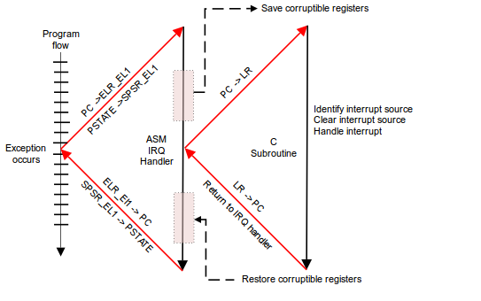
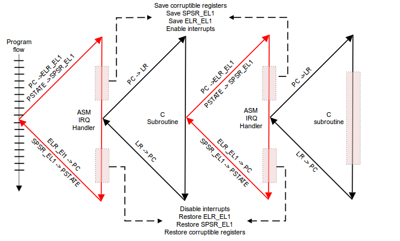
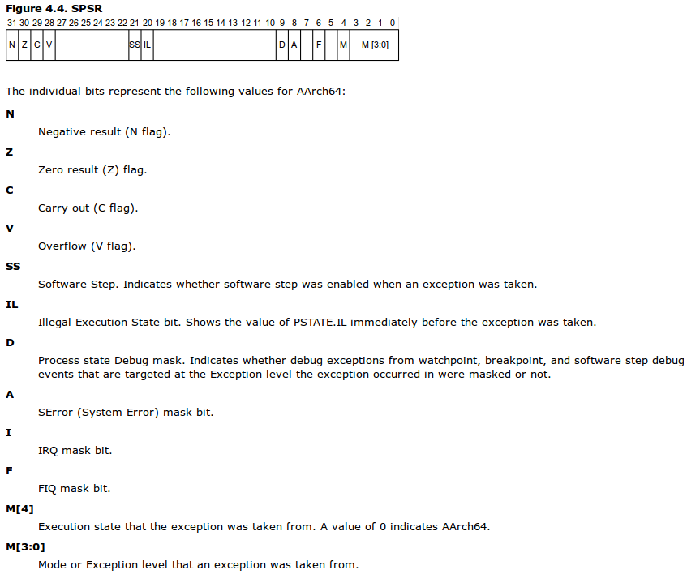
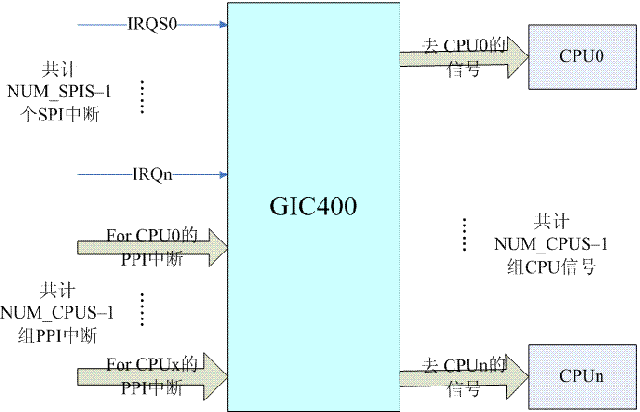
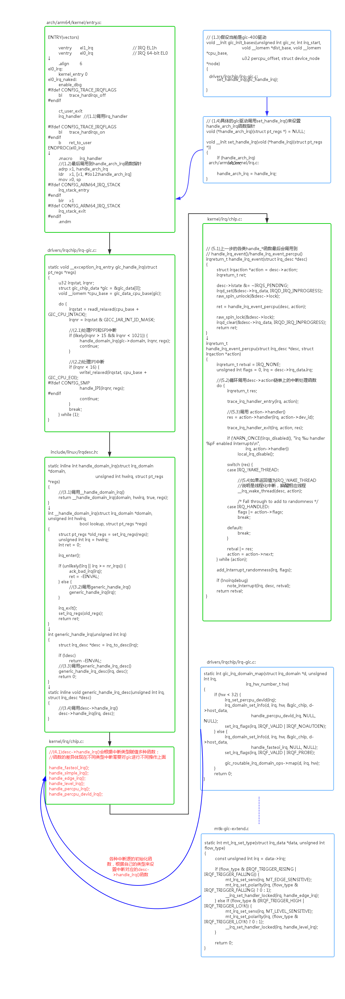
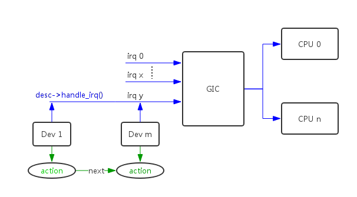
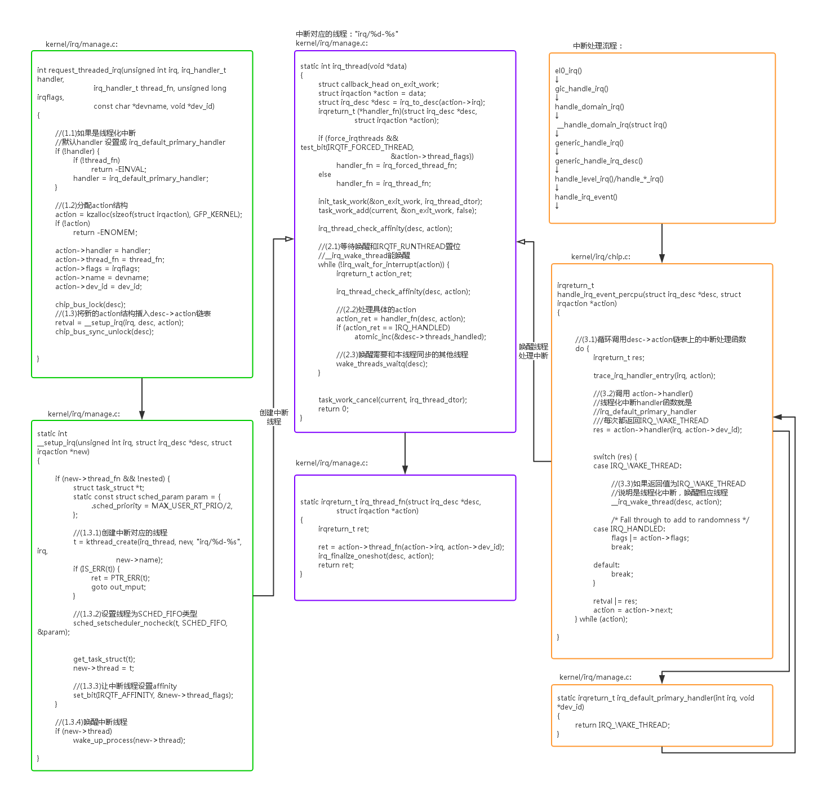

在面试的时候我们常常问或者被问一个问题：几种中断下半部机制softirq、tasklet、workqueue有什么区别？linux为什么要设计这几种机制？真正能够回答清楚的人还是少数的。下面我们就详细分析一下这其中的区别。

> 本文的代码分析基于linux kernel 3.18.22和arm64架构，最好的学习方法还是"RTFSC"

# 1. linux中断

arm64和其他所有cpu架构的中断处理流程都是一样：正常执行流程被打断进入中断服务程序，保护现场、处理中断、恢复现场：

[^ARMPG]

在整个中断处理过程中，arm64的cpu全局中断是自动disable的(PSTATE寄存器中的interrupt bit被masks)。如果用户想支持interrupt nested，需要自己在中断服务程序中使能中断。linux现在是不使用中断嵌套的。

[^ARMPG]

## 1.1 cpu中断打开/关闭

arm64关闭和打开本地cpu的全局中断的方法，是操作SPSR(Saved Process Status Register)寄存器IRQ mask bit。

[^ARMPG]

linux中arm64关闭和打开本地cpu中断的函数实现。

- arch/arm64/include/asm/irqflags.h:  
- local_irq_disable() -> raw_local_irq_disable() -> arch_local_irq_disable()
- local_irq_enable() -> raw_local_irq_enable() -> arch_local_irq_enable()

```cpp

static inline void arch_local_irq_enable(void)
{
	asm volatile(
		// (1) 清除DAIF中的bit2 I标志位，打开中断
		"msr	daifclr, #2		// arch_local_irq_enable"
		:
		:
		: "memory");
}

static inline void arch_local_irq_disable(void)
{
	asm volatile(
		// (2) 设置DAIF中的bit2 I标志位，关闭中断
		"msr	daifset, #2		// arch_local_irq_disable"
		:
		:
		: "memory");
}

static inline unsigned long arch_local_irq_save(void)
{
	unsigned long flags;
	asm volatile(
		// (3) 备份DAIF标志
		"mrs	%0, daif		// arch_local_irq_save\n"
		"msr	daifset, #2"
		: "=r" (flags)
		:
		: "memory");
	return flags;
}

static inline unsigned long arch_local_save_flags(void)
{
	unsigned long flags;
	asm volatile(
		// (4) 恢复DAIF标志
		"mrs	%0, daif		// arch_local_save_flags"
		: "=r" (flags)
		:
		: "memory");
	return flags;
}
```

## 1.2 中断控制器GIC

上面描述了cpu对全局中断的处理，但是还有一个工作需要有人去做：就是把外部中断、内部中断、cpu间中断等各种中断按照优先级、亲和力、私有性等发送给多个cpu。负责这个工作的就是中断控制器GIC(Generic Interrupt Controller)。

[^GICANALY]

从软件角度上看，GIC可以分成两个功能模块：[^ARMPG]

- Distributor。负责连接系统中所有的中断源，通过寄存器可以独立的配置每个中断的属性：priority、state、security、outing information、enable status。定义哪些中断可以转发到cpu core。
- CPU Interface。cpu core用来接收中断，寄存器主要提供的功能：mask、 identify 、control states of interrupts forwarded to that core。每个cpu core拥有自己的cpu interface。

对GIC来说，中断可以分成以下几种类型：[^ARMPG]

- SGI(Software Generated Interrupt)，Interrupt IDs 0-15。系统一般用其来实现IPI中断。
- PPI(Private Peripheral Interrupt)，Interrupt IDs16-31。私有中断，这种中断对每个cpu都是独立一份的，比如per-core timer中断。
- SPI(Shared Peripheral Interrupt)，Interrupt numbers 32-1020。最常用的外设中断，中断可以发给一个或者多个cpu。
- LPI(Locality-specific Peripheral Interrupt)。基于message的中断，GICv2和GICv1中不支持。

GIC从原理上理解并不难，但是如果涉及到级联等技术细节，整个初始化过程还是比较复杂。大家可以自行下载GIC手册：[GIC-400](http://infocenter.arm.com/help/index.jsp?topic=/com.arm.doc.ddi0471b/index.html)、[GIC-500](http://infocenter.arm.com/help/index.jsp?topic=/com.arm.doc.ddi0516e/index.html)学习，[GIC代码分析](http://www.wowotech.net/irq_subsystem/gic_driver.html)也是一篇很不错的分析文章。

一款GIC相关的操作函数都会集中到irq_chip数据结构中，以GIC-400为例，它的相关操作函数如下：

- drivers/irqchip/irq-gic.c:

```cpp
static struct irq_chip gic_chip = {
	.name			= "GIC",
	.irq_mask		= gic_mask_irq,
	.irq_unmask		= gic_unmask_irq,
	.irq_eoi		= gic_eoi_irq,
	.irq_set_type		= gic_set_type,
	.irq_retrigger		= gic_retrigger,
#ifdef CONFIG_SMP
	.irq_set_affinity	= gic_set_affinity,
#endif
	.irq_set_wake		= gic_set_wake,
};
```


## 1.3 linux中断处理流程

从代码上看linux中断的处理流程大概是这样的：



从处理流程上看，对于gic的每个中断源，linux系统分配一个irq_desc数据结构与之对应。irq_desc结构中有两个中断处理函数desc->handle_irq()和desc->action->handler()，这两个函数代表中断处理的两个层级：

- desc->handle_irq()。第一层次的中断处理函数，这个是系统在初始化时根据中断源的特征统一分配的，不同类型的中断源的gic操作是不一样的，把这些通用gic操作提取出来就是第一层次的操作函数。具体实现包括：
handle_fasteoi_irq();
handle_simple_irq();
handle_edge_irq();
handle_level_irq();
handle_percpu_irq();
handle_percpu_devid_irq();

- desc->action->handler()。第二层次的中断处理函数，由用户注册实现具体设备的驱动服务程序，都是和GIC操作无关的代码。同时一个中断源可以多个设备共享，所以一个desc可以挂载多个action，由链表结构组织起来。



## 1.4 中断服务注册

从上一节的中断二层结构中可以看到第二层的中断处理函数desc->action->handler是由用户来注册的，下面我们来分析具体注册过程：

- kernel/irq/manage.c:
- request_irq() -> request_threaded_irq() -> __setup_irq()

```cpp
static inline int __must_check
request_irq(unsigned int irq, irq_handler_t handler, unsigned long flags,
	    const char *name, void *dev)
{
	return request_threaded_irq(irq, handler, NULL, flags, name, dev);
}
| →
int request_threaded_irq(unsigned int irq, irq_handler_t handler,
			 irq_handler_t thread_fn, unsigned long irqflags,
			 const char *devname, void *dev_id)
{
	struct irqaction *action;
	struct irq_desc *desc;
	int retval;

	/*
	 * Sanity-check: shared interrupts must pass in a real dev-ID,
	 * otherwise we'll have trouble later trying to figure out
	 * which interrupt is which (messes up the interrupt freeing
	 * logic etc).
	 */
	if ((irqflags & IRQF_SHARED) && !dev_id)
		return -EINVAL;

	// (1)根据中断号找到对应的desc结构
	desc = irq_to_desc(irq);
	if (!desc)
		return -EINVAL;

	if (!irq_settings_can_request(desc) ||
	    WARN_ON(irq_settings_is_per_cpu_devid(desc)))
		return -EINVAL;

	// (2)如果action->handler为空，那么用户是想创建一个线程化中断
	// 将线程化中断的action->handler初始化为irq_default_primary_handler()
	// irq_default_primary_handler()非常简单，只是返回一个IRQ_WAKE_THREAD值
	if (!handler) {
		if (!thread_fn)
			return -EINVAL;
		handler = irq_default_primary_handler;
	}

	// (3)分配新的action数据结构
	action = kzalloc(sizeof(struct irqaction), GFP_KERNEL);
	if (!action)
		return -ENOMEM;

	action->handler = handler;
	action->thread_fn = thread_fn;
	action->flags = irqflags;
	action->name = devname;
	action->dev_id = dev_id;

	chip_bus_lock(desc);
	// (4)将新的action结构安装到desc中
	retval = __setup_irq(irq, desc, action);
	chip_bus_sync_unlock(desc);

	if (retval)
		kfree(action);

#ifdef CONFIG_DEBUG_SHIRQ_FIXME
	if (!retval && (irqflags & IRQF_SHARED)) {
		/*
		 * It's a shared IRQ -- the driver ought to be prepared for it
		 * to happen immediately, so let's make sure....
		 * We disable the irq to make sure that a 'real' IRQ doesn't
		 * run in parallel with our fake.
		 */
		unsigned long flags;

		disable_irq(irq);
		local_irq_save(flags);

		handler(irq, dev_id);

		local_irq_restore(flags);
		enable_irq(irq);
	}
#endif
	return retval;
}
|| →
static int
__setup_irq(unsigned int irq, struct irq_desc *desc, struct irqaction *new)
{
	struct irqaction *old, **old_ptr;
	unsigned long flags, thread_mask = 0;
	int ret, nested, shared = 0;
	cpumask_var_t mask;

	if (!desc)
		return -EINVAL;

	if (desc->irq_data.chip == &no_irq_chip)
		return -ENOSYS;
	if (!try_module_get(desc->owner))
		return -ENODEV;

	/*
	 * Check whether the interrupt nests into another interrupt
	 * thread.
	 */
	nested = irq_settings_is_nested_thread(desc);
	// (4.1)判断中断是否是支持嵌套
	if (nested) {
		if (!new->thread_fn) {
			ret = -EINVAL;
			goto out_mput;
		}
		/*
		 * Replace the primary handler which was provided from
		 * the driver for non nested interrupt handling by the
		 * dummy function which warns when called.
		 */
		new->handler = irq_nested_primary_handler;
	} else {
		// (4.2)判断中断是否可以被线程化
		// 如果中断没有设置_IRQ_NOTHREAD标志 & 强制中断线程化标志被设置(force_irqthreads=1)
		// 强制把中断线程化：
		// new->thread_fn = new->handler;new->handler = irq_default_primary_handler;
		if (irq_settings_can_thread(desc))
			irq_setup_forced_threading(new);
	}

	/*
	 * Create a handler thread when a thread function is supplied
	 * and the interrupt does not nest into another interrupt
	 * thread.
	 */
	// (4.3)如果是线程化中断，创建线程化中断对应的线程
	if (new->thread_fn && !nested) {
		struct task_struct *t;
		static const struct sched_param param = {
			.sched_priority = MAX_USER_RT_PRIO/2,
		};

		// 创建线程
		t = kthread_create(irq_thread, new, "irq/%d-%s", irq,
				   new->name);
		if (IS_ERR(t)) {
			ret = PTR_ERR(t);
			goto out_mput;
		}

		sched_setscheduler_nocheck(t, SCHED_FIFO, &param);

		/*
		 * We keep the reference to the task struct even if
		 * the thread dies to avoid that the interrupt code
		 * references an already freed task_struct.
		 */
		get_task_struct(t);
		// 赋值给->thread成员
		new->thread = t;
		/*
		 * Tell the thread to set its affinity. This is
		 * important for shared interrupt handlers as we do
		 * not invoke setup_affinity() for the secondary
		 * handlers as everything is already set up. Even for
		 * interrupts marked with IRQF_NO_BALANCE this is
		 * correct as we want the thread to move to the cpu(s)
		 * on which the requesting code placed the interrupt.
		 */
		set_bit(IRQTF_AFFINITY, &new->thread_flags);
	}

	if (!alloc_cpumask_var(&mask, GFP_KERNEL)) {
		ret = -ENOMEM;
		goto out_thread;
	}

	/*
	 * Drivers are often written to work w/o knowledge about the
	 * underlying irq chip implementation, so a request for a
	 * threaded irq without a primary hard irq context handler
	 * requires the ONESHOT flag to be set. Some irq chips like
	 * MSI based interrupts are per se one shot safe. Check the
	 * chip flags, so we can avoid the unmask dance at the end of
	 * the threaded handler for those.
	 */
	if (desc->irq_data.chip->flags & IRQCHIP_ONESHOT_SAFE)
		new->flags &= ~IRQF_ONESHOT;

	/*
	 * The following block of code has to be executed atomically
	 */
	// (4.4)找到最后一个action结构
	raw_spin_lock_irqsave(&desc->lock, flags);
	old_ptr = &desc->action;
	old = *old_ptr;
	if (old) {
		/*
		 * Can't share interrupts unless both agree to and are
		 * the same type (level, edge, polarity). So both flag
		 * fields must have IRQF_SHARED set and the bits which
		 * set the trigger type must match. Also all must
		 * agree on ONESHOT.
		 */
		if (!((old->flags & new->flags) & IRQF_SHARED) ||
		    ((old->flags ^ new->flags) & IRQF_TRIGGER_MASK) ||
		    ((old->flags ^ new->flags) & IRQF_ONESHOT))
			goto mismatch;

		/* All handlers must agree on per-cpuness */
		if ((old->flags & IRQF_PERCPU) !=
		    (new->flags & IRQF_PERCPU))
			goto mismatch;

		/* add new interrupt at end of irq queue */
		do {
			/*
			 * Or all existing action->thread_mask bits,
			 * so we can find the next zero bit for this
			 * new action.
			 */
			thread_mask |= old->thread_mask;
			old_ptr = &old->next;
			old = *old_ptr;
		} while (old);
		// 如果有多个action，共享标志设为1
		shared = 1;
	}

	/*
	 * Setup the thread mask for this irqaction for ONESHOT. For
	 * !ONESHOT irqs the thread mask is 0 so we can avoid a
	 * conditional in irq_wake_thread().
	 */
	if (new->flags & IRQF_ONESHOT) {
		/*
		 * Unlikely to have 32 resp 64 irqs sharing one line,
		 * but who knows.
		 */
		if (thread_mask == ~0UL) {
			ret = -EBUSY;
			goto out_mask;
		}
		/*
		 * The thread_mask for the action is or'ed to
		 * desc->thread_active to indicate that the
		 * IRQF_ONESHOT thread handler has been woken, but not
		 * yet finished. The bit is cleared when a thread
		 * completes. When all threads of a shared interrupt
		 * line have completed desc->threads_active becomes
		 * zero and the interrupt line is unmasked. See
		 * handle.c:irq_wake_thread() for further information.
		 *
		 * If no thread is woken by primary (hard irq context)
		 * interrupt handlers, then desc->threads_active is
		 * also checked for zero to unmask the irq line in the
		 * affected hard irq flow handlers
		 * (handle_[fasteoi|level]_irq).
		 *
		 * The new action gets the first zero bit of
		 * thread_mask assigned. See the loop above which or's
		 * all existing action->thread_mask bits.
		 */
		new->thread_mask = 1 << ffz(thread_mask);

	} else if (new->handler == irq_default_primary_handler &&
		   !(desc->irq_data.chip->flags & IRQCHIP_ONESHOT_SAFE)) {
		/*
		 * The interrupt was requested with handler = NULL, so
		 * we use the default primary handler for it. But it
		 * does not have the oneshot flag set. In combination
		 * with level interrupts this is deadly, because the
		 * default primary handler just wakes the thread, then
		 * the irq lines is reenabled, but the device still
		 * has the level irq asserted. Rinse and repeat....
		 *
		 * While this works for edge type interrupts, we play
		 * it safe and reject unconditionally because we can't
		 * say for sure which type this interrupt really
		 * has. The type flags are unreliable as the
		 * underlying chip implementation can override them.
		 */
		pr_err("Threaded irq requested with handler=NULL and !ONESHOT for irq %d\n",
		       irq);
		ret = -EINVAL;
		goto out_mask;
	}

	// (4.5)如果是第一个action，做一些初始化工作
	if (!shared) {
		ret = irq_request_resources(desc);
		if (ret) {
			pr_err("Failed to request resources for %s (irq %d) on irqchip %s\n",
			       new->name, irq, desc->irq_data.chip->name);
			goto out_mask;
		}

		init_waitqueue_head(&desc->wait_for_threads);

		/* Setup the type (level, edge polarity) if configured: */
		if (new->flags & IRQF_TRIGGER_MASK) {
			ret = __irq_set_trigger(desc, irq,
					new->flags & IRQF_TRIGGER_MASK);

			if (ret)
				goto out_mask;
		}

		desc->istate &= ~(IRQS_AUTODETECT | IRQS_SPURIOUS_DISABLED | \
				  IRQS_ONESHOT | IRQS_WAITING);
		irqd_clear(&desc->irq_data, IRQD_IRQ_INPROGRESS);

		if (new->flags & IRQF_PERCPU) {
			irqd_set(&desc->irq_data, IRQD_PER_CPU);
			irq_settings_set_per_cpu(desc);
		}

		if (new->flags & IRQF_ONESHOT)
			desc->istate |= IRQS_ONESHOT;

		if (irq_settings_can_autoenable(desc))
			irq_startup(desc, true);
		else
			/* Undo nested disables: */
			desc->depth = 1;

		/* Exclude IRQ from balancing if requested */
		if (new->flags & IRQF_NOBALANCING) {
			irq_settings_set_no_balancing(desc);
			irqd_set(&desc->irq_data, IRQD_NO_BALANCING);
		}

		// 设置中断亲和力
		/* Set default affinity mask once everything is setup */
		setup_affinity(irq, desc, mask);
	} else if (new->flags & IRQF_TRIGGER_MASK) {
		unsigned int nmsk = new->flags & IRQF_TRIGGER_MASK;
		unsigned int omsk = irq_settings_get_trigger_mask(desc);

		if (nmsk != omsk)
			/* hope the handler works with current  trigger mode */
			pr_warning("irq %d uses trigger mode %u; requested %u\n",
				   irq, nmsk, omsk);
	}

	// (4.6)将新的action插入到desc链表中
	new->irq = irq;
	*old_ptr = new;

	irq_pm_install_action(desc, new);

	/* Reset broken irq detection when installing new handler */
	desc->irq_count = 0;
	desc->irqs_unhandled = 0;

	/*
	 * Check whether we disabled the irq via the spurious handler
	 * before. Reenable it and give it another chance.
	 */
	// (4.7)如果中断之前被虚假disable了，重新enable中断
	if (shared && (desc->istate & IRQS_SPURIOUS_DISABLED)) {
		desc->istate &= ~IRQS_SPURIOUS_DISABLED;
		__enable_irq(desc, irq);
	}

	raw_spin_unlock_irqrestore(&desc->lock, flags);

	/*
	 * Strictly no need to wake it up, but hung_task complains
	 * when no hard interrupt wakes the thread up.
	 */
	// (4.8)唤醒线程化中断对应的线程
	if (new->thread)
		wake_up_process(new->thread);

	register_irq_proc(irq, desc);
	new->dir = NULL;
	register_handler_proc(irq, new);
	free_cpumask_var(mask);

	return 0;

mismatch:
	if (!(new->flags & IRQF_PROBE_SHARED)) {
		pr_err("Flags mismatch irq %d. %08x (%s) vs. %08x (%s)\n",
		       irq, new->flags, new->name, old->flags, old->name);
#ifdef CONFIG_DEBUG_SHIRQ
		dump_stack();
#endif
	}
	ret = -EBUSY;

out_mask:
	raw_spin_unlock_irqrestore(&desc->lock, flags);
	free_cpumask_var(mask);

out_thread:
	if (new->thread) {
		struct task_struct *t = new->thread;

		new->thread = NULL;
		kthread_stop(t);
		put_task_struct(t);
	}
out_mput:
	module_put(desc->owner);
	return ret;
}

```

## 1.5 中断线程化

从上一节可以看到，使用request_irq()注册的是传统中断，而直接使用request_threaded_irq()注册的是线程化中断。线程化中断的主要目的把中断上下文的任务迁移到线程中，减少系统关中断的时间，增强系统的实时性。

中断对应的线程命名规则为：

```cpp
		t = kthread_create(irq_thread, new, "irq/%d-%s", irq,
				   new->name);
```

我们通过ps命令查看系统中的中断线程，注意这些线程是实时线程SCHED_FIFO：

```cpp
root@:/ # ps | grep "irq/"                                                
root      171   2     0      0     irq_thread 0000000000 S irq/389-charger
root      239   2     0      0     irq_thread 0000000000 S irq/296-PS_int-
root      247   2     0      0     irq_thread 0000000000 S irq/297-1124000
root      1415  2     0      0     irq_thread 0000000000 S irq/293-goodix_
root@a0255:/ # 

```

线程化中断的创建和处理任务流程如下：



线程和action是一一对应的，即用户注册一个中断处理程序对应一个中断线程。


## 1.6 外设中断打开/关闭

前面的章节讲述了本地cpu全局中断的enable/disable。如果要操作单个中断源的enable/disable，使用enable_irq()/disable_irq()函数。最后调用主要是GIC chip相关的函数：

- kernel/irq/manage.c:
- enable_irq() -> __enable_irq() -> irq_enable()

```cpp
void enable_irq(unsigned int irq)
{
	unsigned long flags;
	struct irq_desc *desc = irq_get_desc_buslock(irq, &flags, IRQ_GET_DESC_CHECK_GLOBAL);

	if (!desc)
		return;
	if (WARN(!desc->irq_data.chip,
		 KERN_ERR "enable_irq before setup/request_irq: irq %u\n", irq))
		goto out;

	__enable_irq(desc, irq);
out:
	irq_put_desc_busunlock(desc, flags);
}
| →
void __enable_irq(struct irq_desc *desc, unsigned int irq)
{
	switch (desc->depth) {
	case 0:
 err_out:
		WARN(1, KERN_WARNING "Unbalanced enable for IRQ %d\n", irq);
		break;
	case 1: {
		if (desc->istate & IRQS_SUSPENDED)
			goto err_out;
		/* Prevent probing on this irq: */
		irq_settings_set_noprobe(desc);
		irq_enable(desc);
		check_irq_resend(desc, irq);
		/* fall-through */
	}
	default:
		desc->depth--;
	}
}
|| →
void irq_enable(struct irq_desc *desc)
{
	// 操作GIC chip对应的函数
	irq_state_clr_disabled(desc);
	if (desc->irq_data.chip->irq_enable)
		desc->irq_data.chip->irq_enable(&desc->irq_data);
	else
		desc->irq_data.chip->irq_unmask(&desc->irq_data);
	irq_state_clr_masked(desc);
}
```

- kernel/irq/manage.c:
- enable_irq() -> __enable_irq() -> irq_enable()

```cpp
void disable_irq(unsigned int irq)
{
	if (!__disable_irq_nosync(irq))
		synchronize_irq(irq);
}
| →
static int __disable_irq_nosync(unsigned int irq)
{
	unsigned long flags;
	struct irq_desc *desc = irq_get_desc_buslock(irq, &flags, IRQ_GET_DESC_CHECK_GLOBAL);

	if (!desc)
		return -EINVAL;
	__disable_irq(desc, irq);
	irq_put_desc_busunlock(desc, flags);
	return 0;
}
|| →
void __disable_irq(struct irq_desc *desc, unsigned int irq)
{
	if (!desc->depth++)
		irq_disable(desc);
}
||| →
void irq_disable(struct irq_desc *desc)
{
	// 操作GIC chip对应的函数
	irq_state_set_disabled(desc);
	if (desc->irq_data.chip->irq_disable) {
		desc->irq_data.chip->irq_disable(&desc->irq_data);
		irq_state_set_masked(desc);
	}
}

| →
void synchronize_irq(unsigned int irq)
{
	struct irq_desc *desc = irq_to_desc(irq);

	if (desc) {
		__synchronize_hardirq(desc);
		/*
		 * We made sure that no hardirq handler is
		 * running. Now verify that no threaded handlers are
		 * active.
		 */
		// 如果是线程化中断，需要等到线程执行完成
		wait_event(desc->wait_for_threads,
			   !atomic_read(&desc->threads_active));
	}
}
```

## 1.7 中断亲和力

同样基于GIC chip提供的能力，我们能配置中断源对cpu的亲和力。

- kernel/irq/manage.c:
- enable_irq() -> __enable_irq() -> irq_enable()

```cpp
static inline int
irq_set_affinity(unsigned int irq, const struct cpumask *cpumask)
{
	return __irq_set_affinity(irq, cpumask, false);
}
| →
int __irq_set_affinity(unsigned int irq, const struct cpumask *mask, bool force)
{
	struct irq_desc *desc = irq_to_desc(irq);
	unsigned long flags;
	int ret;

	if (!desc)
		return -EINVAL;

	raw_spin_lock_irqsave(&desc->lock, flags);
	ret = irq_set_affinity_locked(irq_desc_get_irq_data(desc), mask, force);
	raw_spin_unlock_irqrestore(&desc->lock, flags);
	return ret;
}
|| →
int irq_set_affinity_locked(struct irq_data *data, const struct cpumask *mask,
			    bool force)
{
	struct irq_chip *chip = irq_data_get_irq_chip(data);
	struct irq_desc *desc = irq_data_to_desc(data);
	int ret = 0;

	if (!chip || !chip->irq_set_affinity)
		return -EINVAL;

	if (irq_can_move_pcntxt(data)) {
		ret = irq_do_set_affinity(data, mask, force);
	} else {
		irqd_set_move_pending(data);
		irq_copy_pending(desc, mask);
	}

	if (desc->affinity_notify) {
		kref_get(&desc->affinity_notify->kref);
		schedule_work(&desc->affinity_notify->work);
	}
	irqd_set(data, IRQD_AFFINITY_SET);

	return ret;
}
||| →
int irq_do_set_affinity(struct irq_data *data, const struct cpumask *mask,
			bool force)
{
	struct irq_desc *desc = irq_data_to_desc(data);
	struct irq_chip *chip = irq_data_get_irq_chip(data);
	int ret;

	// 操作GIC chip对应的函数
	ret = chip->irq_set_affinity(data, mask, force);
	switch (ret) {
	case IRQ_SET_MASK_OK:
	case IRQ_SET_MASK_OK_DONE:
#ifdef CONFIG_MTK_IRQ_NEW_DESIGN
		update_affinity_settings(desc, mask, true);
#else
		cpumask_copy(data->affinity, mask);
#endif
	case IRQ_SET_MASK_OK_NOCOPY:
		irq_set_thread_affinity(desc);
		ret = 0;
	}

	return ret;
}

```

# 2. linux中断下半部

接下来就是大名鼎鼎的中断下半部了，包括：softirq、tasklet、workqueue。中断下半部的主要目的就是减少系统关中断的时间，把少关键代码放在中断中做，大部分处理代码放到不用关中断的空间去做。

上面有最激进的方法中断线程化，但是大部分时候还是需要用到中断上、下半部的方法。

workqueue在另外文章中已经有详细解析，本处只解析softirq、tasklet。

## 2.1 preempt_count

```
static __always_inline int preempt_count(void)
{
	return current_thread_info()->preempt_count;	/* 0 => preemptable, <0 => bug */
}
```

开始之前先了解一下preempt_count这个背景知识，preempt_count是thread_info结构中的一个字段，用来表示当前进程能否被抢占。

所谓的抢占：是指在进程在内核空间运行，如果主动不释放cpu，在时间片用完或者高优先级任务就绪的情况下，会被强行剥夺掉cpu的使用权。

但是进程可能在做一些关键操作，不能被抢占，被抢占后系统会出错。所以linux设计了preempt_count字段，=0可以被抢占，>0不能被抢占。

进程在中断返回内核态时，做是否可抢占的检查：

- arch/arm64/kernel/entry.s:
- el1_irq() -> __enable_irq() -> irq_enable()

```cpp
	.align	6
el1_irq:
	kernel_entry 1
	enable_dbg
#ifdef CONFIG_TRACE_IRQFLAGS
	bl	trace_hardirqs_off
#endif
#ifdef CONFIG_MTPROF
	bl  MT_trace_hardirqs_off
#endif
	irq_handler

#ifdef CONFIG_PREEMPT
	get_thread_info tsk
	ldr	w24, [tsk, #TI_PREEMPT]		// get preempt count
	// (1)如果preempt_count!=0，不进行可抢占判断
	cbnz	w24, 1f				// preempt count != 0
	ldr	x0, [tsk, #TI_FLAGS]		// get flags
	// (2)如果preempt_count==0 & TIF_NEED_RESCHED被置位
	// 进行调度
	tbz	x0, #TIF_NEED_RESCHED, 1f	// needs rescheduling?
	bl	el1_preempt
1:
#endif
#ifdef CONFIG_MTPROF
	bl  MT_trace_hardirqs_on
#endif
#ifdef CONFIG_TRACE_IRQFLAGS
	bl	trace_hardirqs_on
#endif
	kernel_exit 1
ENDPROC(el1_irq)

#ifdef CONFIG_PREEMPT
el1_preempt:
	mov	x24, lr
	// (3)抢占调度
1:	bl	preempt_schedule_irq		// irq en/disable is done inside
	ldr	x0, [tsk, #TI_FLAGS]		// get new tasks TI_FLAGS
	tbnz	x0, #TIF_NEED_RESCHED, 1b	// needs rescheduling?
	ret	x24
#endif

| →

asmlinkage __visible void __sched preempt_schedule_irq(void)
{
	enum ctx_state prev_state;

	/* Catch callers which need to be fixed */
	BUG_ON(preempt_count() || !irqs_disabled());

	prev_state = exception_enter();

	do {
		__preempt_count_add(PREEMPT_ACTIVE);
		local_irq_enable();
		__schedule();
		local_irq_disable();
		__preempt_count_sub(PREEMPT_ACTIVE);

		/*
		 * Check again in case we missed a preemption opportunity
		 * between schedule and now.
		 */
		barrier();
	} while (need_resched());

	exception_exit(prev_state);
}
```

虽然preempt_count>0就是禁止抢占，linux进一步按照各种场景对preempt_count bit进行了资源划分：

| reserved bits	| bit21			| bit20			| bit19-bit16	| bit15-bit8	| bit7-bit0		|
| ------------- |:-------------:|:-------------:|:-------------:|:-------------:|:-------------:|
|				| PREEMPT_ACTIVE|NMI			|HARDIRQ		|SOFTIRQ		|PREEMPT		|


```
/*
 * PREEMPT_MASK:	0x000000ff
 * SOFTIRQ_MASK:	0x0000ff00
 * HARDIRQ_MASK:	0x000f0000
 *     NMI_MASK:	0x00100000
 * PREEMPT_ACTIVE:	0x00200000
 */
#define PREEMPT_BITS	8
#define SOFTIRQ_BITS	8
#define HARDIRQ_BITS	4
#define NMI_BITS	1
```


各场景分别利用各自的bit来disable/enable抢占：

- 普通场景(PREEMPT_MASK)。对应函数preempt_disable()、preempt_enable()。
- 软中断场景(PREEMPT_MASK)。对应函数local_bh_disable()、local_bh_enable()。
- 普通中断场景(HARDIRQ_MASK)。对应函数__irq_enter()、__irq_exit()。
- NMI中断场景(NMI_MASK)。对应函数nmi_enter()、nmi_exit()。

所以反过来，我们也可以通过preempt_count的值来判断当前在什么场景：

```
#define in_irq()		(hardirq_count())
#define in_softirq()		(softirq_count())
#define in_interrupt()		(irq_count())
#define in_serving_softirq()	(softirq_count() & SOFTIRQ_OFFSET)
#define in_nmi()	(preempt_count() & NMI_MASK)

#define hardirq_count()	(preempt_count() & HARDIRQ_MASK)
#define softirq_count()	(preempt_count() & SOFTIRQ_MASK)
#define irq_count()	(preempt_count() & (HARDIRQ_MASK | SOFTIRQ_MASK \
				 | NMI_MASK))
```

## 2.2 softirq

回到中断上下半部的架构，linux系统虽然将大部分工作移出了中断上下文，不关闭中断。但是它也希望移出的工作能够很快的得到执行，软中断为了保证自己能很快执行，使用__local_bh_disable_ip()禁止抢占。

softirq的具体实现机制如下：

- 系统支持固定的几种软中断，softirq_vec数组用来记录这些软中断执行函数：

```
enum
{
	HI_SOFTIRQ=0,
	TIMER_SOFTIRQ,
	NET_TX_SOFTIRQ,
	NET_RX_SOFTIRQ,
	BLOCK_SOFTIRQ,
	BLOCK_IOPOLL_SOFTIRQ,
	TASKLET_SOFTIRQ,
	SCHED_SOFTIRQ,
	HRTIMER_SOFTIRQ,
	RCU_SOFTIRQ,    /* Preferable RCU should always be the last softirq */

	NR_SOFTIRQS
};

// 注册软中断的服务程序
void open_softirq(int nr, void (*action)(struct softirq_action *))
{
	softirq_vec[nr].action = action;
}

//TASKLET_SOFTIRQ、HI_SOFTIRQ两个软中断用来给tasklet服务。
	open_softirq(TASKLET_SOFTIRQ, tasklet_action);
	open_softirq(HI_SOFTIRQ, tasklet_hi_action);
```

- 使用irq_stat[cpu].__softirq_pending来记录每个cpu上所有softirq的pending状态，raise_softirq()用来置位一个softirq pending：

```
void raise_softirq(unsigned int nr)
{
	unsigned long flags;

	local_irq_save(flags);
	raise_softirq_irqoff(nr);
	local_irq_restore(flags);
}
| →
inline void raise_softirq_irqoff(unsigned int nr)
{
	__raise_softirq_irqoff(nr);

	if (!in_interrupt())
		wakeup_softirqd();
}
|| →
void __raise_softirq_irqoff(unsigned int nr)
{
	trace_softirq_raise(nr);
	or_softirq_pending(1UL << nr);
}
||| →
#define or_softirq_pending(x)  (local_softirq_pending() |= (x))

#ifndef __ARCH_IRQ_STAT
extern irq_cpustat_t irq_stat[];		/* defined in asm/hardirq.h */
#define __IRQ_STAT(cpu, member)	(irq_stat[cpu].member)
#endif

  /* arch independent irq_stat fields */
#define local_softirq_pending() \
	__IRQ_STAT(smp_processor_id(), __softirq_pending)

```

- softirq的执行有两个时刻：在退出中断irq_exit()时或者在softirqd线程当中：


软中断使用smpboot_register_percpu_thread()函数，给每个cpu上创建了对应的softirqd线程：

```
root@:/ # ps | grep softirq                                               
root      3     2     0      0     smpboot_th 0000000000 S ksoftirqd/0
root      12    2     0      0     __kthread_ 0000000000 R ksoftirqd/1
root      16    2     0      0     __kthread_ 0000000000 R ksoftirqd/2
root      20    2     0      0     __kthread_ 0000000000 R ksoftirqd/3
root      24    2     0      0     __kthread_ 0000000000 R ksoftirqd/4
root      28    2     0      0     __kthread_ 0000000000 R ksoftirqd/5
root      32    2     0      0     __kthread_ 0000000000 R ksoftirqd/6
root      36    2     0      0     __kthread_ 0000000000 R ksoftirqd/7
```

软中断优先在irq_exit()中执行，如果超过时间等条件转为softirqd线程中执行。满足以下任一条件软中断在softirqd线程中执行：

- 在irq_exit()->__do_softirq()中运行，时间超过2ms。
- 在irq_exit()->__do_softirq()中运行，轮询软中断超过10次。
- 在irq_exit()->__do_softirq()中运行，本线程需要被调度。
- 调用raise_softirq()唤醒软中断时，不在中断环境中。

我们也看到，软中断处理是按照优先级逐个调用softirq_vec[]数组中的软中断处理函数，所以前面的软中断是可以阻塞后面的软中断的。这个在我们写程序的时候需要注意。

## 2.3 tasklet

linux已经有了softirq机制，为什么还需要tasklet机制？最主要的原因是softirq是多cpu执行的，可能碰到很多重入的问题，而tasklet同一时刻只能在一个cpu上执行，不需要处理重入互斥问题。另外linux也不建议用户去添加新的软中断。

下面我们来具体分析一下tasklet的实现机制：

- per-cpu变量tasklet_vec/tasklet_hi_vec以链表的形式记录了当前cpu需要处理的tasklet任务：

```cpp
void __init softirq_init(void)
{
	int cpu;

	for_each_possible_cpu(cpu) {
		// (1)tasklet_vec为低优先级的tasklet链表
		per_cpu(tasklet_vec, cpu).tail =
			&per_cpu(tasklet_vec, cpu).head;
		// (2)tasklet_hi_vec为高优先级的tasklet链表
		per_cpu(tasklet_hi_vec, cpu).tail =
			&per_cpu(tasklet_hi_vec, cpu).head;
	}
}
```

- push一个tasklet任务：

```cpp
static inline void tasklet_schedule(struct tasklet_struct *t)
{
	if (!test_and_set_bit(TASKLET_STATE_SCHED, &t->state))
		__tasklet_schedule(t);
}
| →
void __tasklet_schedule(struct tasklet_struct *t)
{
	unsigned long flags;

	local_irq_save(flags);
	// (1)将新的tasklet插入到本cpu链表尾部
	t->next = NULL;
	*__this_cpu_read(tasklet_vec.tail) = t;
	__this_cpu_write(tasklet_vec.tail, &(t->next));
	// (2)raise软中断来处理tasklet
	raise_softirq_irqoff(TASKLET_SOFTIRQ);
	local_irq_restore(flags);
}
```

- 处理一个tasklet任务：

```cpp
static void tasklet_action(struct softirq_action *a)
{
	struct tasklet_struct *list;

	local_irq_disable();
	// (1)list取出当前链表中所有已有的tasklet
	list = __this_cpu_read(tasklet_vec.head);
	// (2)tasklet_vec.head和tasklet_vec.tail返回初始化状态，继续接收新的tasklet
	__this_cpu_write(tasklet_vec.head, NULL);
	__this_cpu_write(tasklet_vec.tail, this_cpu_ptr(&tasklet_vec.head));
	local_irq_enable();

	// (3)逐个处理取出的list链表中的 tasklet
	while (list) {
		struct tasklet_struct *t = list;

		list = list->next;

		// (4)tasklet互斥锁，保证tasklet同时只能在一个cpu上执行
		if (tasklet_trylock(t)) {
			if (!atomic_read(&t->count)) {

				// (6)在tasklet运行前清除TASKLET_STATE_SCHED标志
				// 这个时候tasklet可以重新加入新的队列了，但是还不能执行
				if (!test_and_clear_bit(TASKLET_STATE_SCHED,
							&t->state))
					BUG();

				// (7)执行实际的tasklet处理函数
				t->func(t->data);

				// (8)释放tasklet锁，其他cpu可以运行这个tasklet了
				tasklet_unlock(t);
				continue;
			}
			tasklet_unlock(t);
		}

		local_irq_disable();
		// (5)如果获取tasklet互斥锁失败，先加入到cpu tasklet_vec链表中
		// 下次执行
		t->next = NULL;
		*__this_cpu_read(tasklet_vec.tail) = t;
		__this_cpu_write(tasklet_vec.tail, &(t->next));
		__raise_softirq_irqoff(TASKLET_SOFTIRQ);
		local_irq_enable();
	}
}
```


# 参考资料
[^ARMPG]: [ARM Cortex-A Series Programmer’s Guide for ARMv8-A](http://infocenter.arm.com/help/index.jsp?topic=/com.arm.doc.den0024a/index.html)
[^GICANALY]: [GIC代码分析](http://www.wowotech.net/irq_subsystem/gic_driver.html)

