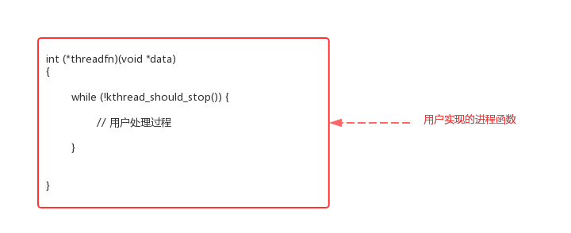
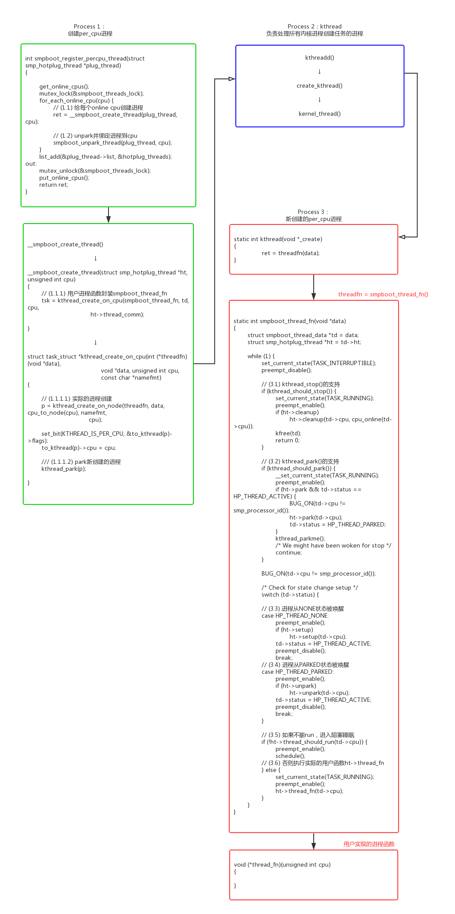
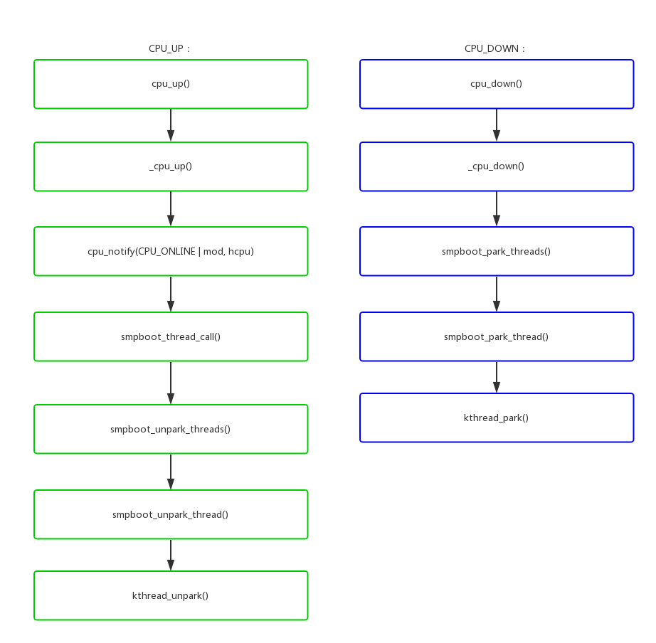
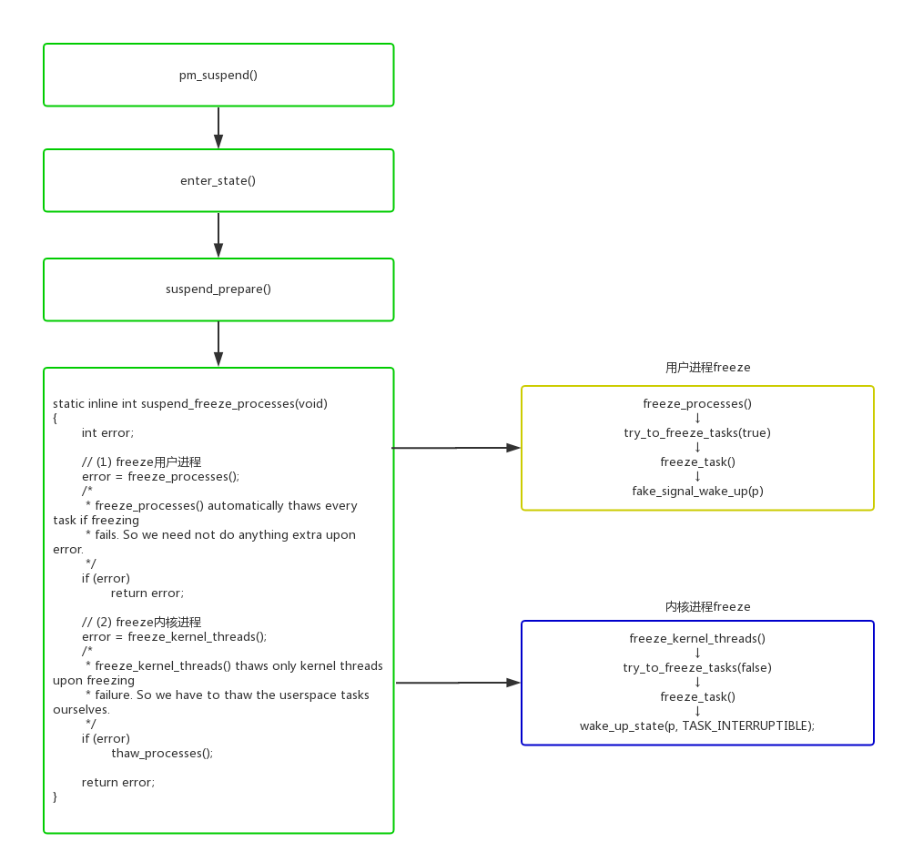

在调试内核的时候，经常会碰到几个相近的概念：进程stop、进程park、进程freeze。这几个名词看起来都是停止进程，那么他们之间的区别和应用场景在分别是什么呢？下面就来分析一番。

> 本文的代码分析基于linux kernel 3.18.22，最好的学习方法还是"RTFSC"

# 1.进程stop

进程stop分成两种：用户进程stop和内核进程stop。

用户进程stop可以通过给进程发送STOP信号来实现，可以参考“Linux Signal”这一篇的描述。但是对内核进程来说不会响应信号，如果碰到需要stop内核进程的场景怎么处理？比如：我们在设备打开的时候创建了内核处理进程，在设备关闭的时候需要stop内核进程。

linux实现了一套kthread_stop()的机制来实现内核进程stop。

## 1.1内核进程的创建

内核进程创建过程，是理解本篇的基础。

可以看到kthread_create()并不是自己去创建内核进程，而是把创建任务推送给kthreadd()进程执行。

kthreadd() -> create_kthread() -> kernel_thread()创建的新进程也不是直接使用用户的函数threadfn()，而是创建通用函数kthread()，kthread()再来调用threadfn()。

- kernel/kthread.c:  


## 1.2内核进程的stop

如果内核进程需要支持kthread_stop()，需要根据以下框架来写代码。用户在主循环中调用kthread_should_stop()来判断当前kthread是否需要stop，如果被stop则退出循环退出进程。

这种代码为什么不做到通用代码kthread()中？这应该是和linux的设计思想相关的。linux运行内核态的策略比较灵活，而对用户态的策略更加严格统一。



kthread_should_stop()和kthread_stop()的代码实现：

- kernel/kthread.c:  
- kthread_should_stop()/kthread_stop()

```cpp

bool kthread_should_stop(void)
{
	// (1) 判断进程所在kthread结构中的KTHREAD_SHOULD_STOP是否被置位
	return test_bit(KTHREAD_SHOULD_STOP, &to_kthread(current)->flags);
}

int kthread_stop(struct task_struct *k)
{
	struct kthread *kthread;
	int ret;

	trace_sched_kthread_stop(k);

	get_task_struct(k);
	kthread = to_live_kthread(k);
	if (kthread) {
		// (2) 置位进程所在kthread结构中的KTHREAD_SHOULD_STOP
		set_bit(KTHREAD_SHOULD_STOP, &kthread->flags);
		// (3) unpark & wake_up 进程来响应stop信号
		__kthread_unpark(k, kthread);
		wake_up_process(k);
		wait_for_completion(&kthread->exited);
	}
	ret = k->exit_code;
	put_task_struct(k);

	trace_sched_kthread_stop_ret(ret);
	return ret;
}
```

# 2.进程park

smpboot_register_percpu_thread()用来创建per_cpu内核进程，所谓的per_cpu进程是指需要在每个online cpu上创建的线程。比如执行stop_machine()多cpu同步操作的migration进程：

```
shell@:/ $ ps | grep migration
root      10    2     0      0     smpboot_th 0000000000 S migration/0
root      11    2     0      0     smpboot_th 0000000000 S migration/1
root      15    2     0      0     __kthread_ 0000000000 R migration/2
root      19    2     0      0     __kthread_ 0000000000 R migration/3
root      207   2     0      0     __kthread_ 0000000000 R migration/8
root      247   2     0      0     __kthread_ 0000000000 R migration/4
root      251   2     0      0     __kthread_ 0000000000 R migration/5
root      265   2     0      0     __kthread_ 0000000000 R migration/6
root      356   2     0      0     __kthread_ 0000000000 R migration/7
root      2165  2     0      0     __kthread_ 0000000000 R migration/9
```

问题来了，既然per_cpu进程是和cpu绑定的，那么在cpu hotplug的时候，进程需要相应的disable和enable。实现的方法可以有多种：

- 动态的销毁和创建线程。缺点是开销比较大。
- 设置进程的cpu亲和力set_cpus_allowed_ptr()。缺点是进程绑定的cpu如果被down掉，进程会迁移到其他cpu继续执行。

为了克服上述方案的缺点，适配per_cpu进程的cpu hotplug操作，设计了kthread_park()/kthread_unpark()机制。

## 2.1 smpboot_register_percpu_thread()

per_cpu进程从代码上看，实际也是调用kthread_create()来创建的。

- kernel/smpboot.c:  
- kernel/kthread.c:  




我们可以看到smpboot_register又增加了一层封装：kthread() -> smpboot_thread_fn() -> ht->thread_fn()，这种封装的使用可以参考cpu_stop_threads。

- kernel/stop_machine.c:  

```cpp
static struct smp_hotplug_thread cpu_stop_threads = {
	.store			= &cpu_stopper_task,
	.thread_should_run	= cpu_stop_should_run,
	.thread_fn		= cpu_stopper_thread,
	.thread_comm		= "migration/%u",
	.create			= cpu_stop_create,
	.setup			= cpu_stop_unpark,
	.park			= cpu_stop_park,
	.pre_unpark		= cpu_stop_unpark,
	.selfparking		= true,
};

static int __init cpu_stop_init(void)
{
	unsigned int cpu;

	for_each_possible_cpu(cpu) {
		struct cpu_stopper *stopper = &per_cpu(cpu_stopper, cpu);

		spin_lock_init(&stopper->lock);
		INIT_LIST_HEAD(&stopper->works);
	}

	BUG_ON(smpboot_register_percpu_thread(&cpu_stop_threads));
	stop_machine_initialized = true;
	return 0;
}
```

我们可以看到smpboot_thread_fn()循环中实现了对park的支持，具体实现kthread_should_park()、kthread_parkme()、kthread_park()、kthread_unpark()的代码分析：

- kernel/kthread.c:  

```cpp
bool kthread_should_park(void)
{
	// (1) 判断进程所在kthread结构中的KTHREAD_SHOULD_PARK是否被置位
	return test_bit(KTHREAD_SHOULD_PARK, &to_kthread(current)->flags);
}

void kthread_parkme(void)
{
	__kthread_parkme(to_kthread(current));
}
| →
static void __kthread_parkme(struct kthread *self)
{
	// (2)如果当前进程的KTHREAD_SHOULD_PARK标志被置位,
	// 将当前进程进入TASK_PARKED的阻塞状态。
	// 如果KTHREAD_SHOULD_PARK不清除，
	// 就算被wake_up唤醒还是会循环进入TASK_PARKED的阻塞状态。
	__set_current_state(TASK_PARKED);
	while (test_bit(KTHREAD_SHOULD_PARK, &self->flags)) {
		if (!test_and_set_bit(KTHREAD_IS_PARKED, &self->flags))
			complete(&self->parked);
		schedule();
		__set_current_state(TASK_PARKED);
	}
	clear_bit(KTHREAD_IS_PARKED, &self->flags);
	__set_current_state(TASK_RUNNING);
}


int kthread_park(struct task_struct *k)
{
	struct kthread *kthread = to_live_kthread(k);
	int ret = -ENOSYS;

	if (kthread) {
		// (3)设置KTHREAD_IS_PARKED标志位，并且唤醒进程进入park状态
		if (!test_bit(KTHREAD_IS_PARKED, &kthread->flags)) {
			set_bit(KTHREAD_SHOULD_PARK, &kthread->flags);
			if (k != current) {
				wake_up_process(k);
				wait_for_completion(&kthread->parked);
			}
		}
		ret = 0;
	}
	return ret;
}


void kthread_unpark(struct task_struct *k)
{
	struct kthread *kthread = to_live_kthread(k);

	if (kthread)
		__kthread_unpark(k, kthread);
}
| →
static void __kthread_unpark(struct task_struct *k, struct kthread *kthread)
{
	// (4)清除KTHREAD_IS_PARKED标志位
	clear_bit(KTHREAD_SHOULD_PARK, &kthread->flags);
	/*
	 * We clear the IS_PARKED bit here as we don't wait
	 * until the task has left the park code. So if we'd
	 * park before that happens we'd see the IS_PARKED bit
	 * which might be about to be cleared.
	 */
	// 如果进程已经被park，并且wake_up唤醒进程
	if (test_and_clear_bit(KTHREAD_IS_PARKED, &kthread->flags)) {
		// 如果是per_cpu进程，重新绑定进程cpu
		if (test_bit(KTHREAD_IS_PER_CPU, &kthread->flags))
			__kthread_bind(k, kthread->cpu, TASK_PARKED);
		wake_up_state(k, TASK_PARKED);
	}
}

```

## 2.2 cpu hotplug支持

我们前面说到park机制的主要目的是为了per_cpu进程支持cpu hotplug，具体怎么响应热插拔事件呢？

- kernel/smpboot.c:  




# 3.进程freeze

在系统进入suspend的时候，会尝试冻住一些进程，以避免一些进程无关操作影响系统的suspend状态。主要的流程如下：

- kernel/power/suspend.c:  



这suspend_freeze里面判断当前在那个阶段，有3个重要的变量：

```
- system_freezing_cnt。>0表示系统全局的freeze开始；
- pm_freezing。=true表示用户进程freeze开始；
- pm_nosig_freezing。=true表示内核进程freeze开始；
```

具体代码分析如下：

- kernel/power/process.c:  
- kernel/freezer.c:  
- suspend_freeze_processes() -> freeze_processes() -> try_to_freeze_tasks() -> freeze_task()

```cpp

int freeze_processes(void)
{
	int error;
	int oom_kills_saved;

	error = __usermodehelper_disable(UMH_FREEZING);
	if (error)
		return error;

	// (1) 置位PF_SUSPEND_TASK，确保当前进程不会被freeze
	/* Make sure this task doesn't get frozen */
	current->flags |= PF_SUSPEND_TASK;

	// (2) 使用全局freeze标志system_freezing_cnt
	if (!pm_freezing)
		atomic_inc(&system_freezing_cnt);

	pm_wakeup_clear();
	printk("Freezing user space processes ... ");
	// (3) 使用用户进程freeze标志pm_freezing
	pm_freezing = true;
	oom_kills_saved = oom_kills_count();
	// (4) freeze user_only进程
	// 判断进程是否可以被freeze，唤醒进程freeze自己
	error = try_to_freeze_tasks(true);
	if (!error) {
		__usermodehelper_set_disable_depth(UMH_DISABLED);
		oom_killer_disable();

		/*
		 * There might have been an OOM kill while we were
		 * freezing tasks and the killed task might be still
		 * on the way out so we have to double check for race.
		 */
		if (oom_kills_count() != oom_kills_saved &&
		    !check_frozen_processes()) {
			__usermodehelper_set_disable_depth(UMH_ENABLED);
			printk("OOM in progress.");
			error = -EBUSY;
		} else {
			printk("done.");
		}
	}
	printk("\n");
	BUG_ON(in_atomic());

	if (error)
		thaw_processes();
	return error;
}
| →
static int try_to_freeze_tasks(bool user_only)
{
	struct task_struct *g, *p;
	unsigned long end_time;
	unsigned int todo;
	bool wq_busy = false;
	struct timeval start, end;
	u64 elapsed_msecs64;
	unsigned int elapsed_msecs;
	bool wakeup = false;
	int sleep_usecs = USEC_PER_MSEC;
#ifdef CONFIG_PM_SLEEP
	char suspend_abort[MAX_SUSPEND_ABORT_LEN];
#endif

	do_gettimeofday(&start);

	end_time = jiffies + msecs_to_jiffies(freeze_timeout_msecs);

	// (4.1) 如果是kernel freeze，
	// 停工有WQ_FREEZABLE标志的workqueue
	// 将wq的pwq->max_active设置成0，新的work不能被执行
	if (!user_only)
		freeze_workqueues_begin();

	while (true) {
		todo = 0;
		read_lock(&tasklist_lock);
		// (4.2) 对每个进程执行freeze_task()
		for_each_process_thread(g, p) {
			if (p == current || !freeze_task(p))
				continue;

			if (!freezer_should_skip(p))
				todo++;
		}
		read_unlock(&tasklist_lock);

		// (4.3) 如果是kernel freeze，
		// 判断停工的workqueue中残留的work有没有执行完
		if (!user_only) {
			wq_busy = freeze_workqueues_busy();
			todo += wq_busy;
		}

		if (!todo || time_after(jiffies, end_time))
			break;

		if (pm_wakeup_pending()) {
#ifdef CONFIG_PM_SLEEP
			pm_get_active_wakeup_sources(suspend_abort,
				MAX_SUSPEND_ABORT_LEN);
			log_suspend_abort_reason(suspend_abort);
#endif
			wakeup = true;
			break;
		}

		/*
		 * We need to retry, but first give the freezing tasks some
		 * time to enter the refrigerator.  Start with an initial
		 * 1 ms sleep followed by exponential backoff until 8 ms.
		 */
		usleep_range(sleep_usecs / 2, sleep_usecs);
		if (sleep_usecs < 8 * USEC_PER_MSEC)
			sleep_usecs *= 2;
	}

	do_gettimeofday(&end);
	elapsed_msecs64 = timeval_to_ns(&end) - timeval_to_ns(&start);
	do_div(elapsed_msecs64, NSEC_PER_MSEC);
	elapsed_msecs = elapsed_msecs64;

	if (wakeup) {
		printk("\n");
		printk(KERN_ERR "Freezing of tasks aborted after %d.%03d seconds",
		       elapsed_msecs / 1000, elapsed_msecs % 1000);
	} else if (todo) {
		printk("\n");
		printk(KERN_ERR "Freezing of tasks failed after %d.%03d seconds"
		       " (%d tasks refusing to freeze, wq_busy=%d):\n",
		       elapsed_msecs / 1000, elapsed_msecs % 1000,
		       todo - wq_busy, wq_busy);

			read_lock(&tasklist_lock);
			for_each_process_thread(g, p) {
				if (p != current && !freezer_should_skip(p)
				    && freezing(p) && !frozen(p))
					sched_show_task(p);
			}
			read_unlock(&tasklist_lock);
	} else {
		printk("(elapsed %d.%03d seconds) ", elapsed_msecs / 1000,
			elapsed_msecs % 1000);
	}

	return todo ? -EBUSY : 0;
}
|| →
bool freeze_task(struct task_struct *p)
{
	unsigned long flags;

	/*
	 * This check can race with freezer_do_not_count, but worst case that
	 * will result in an extra wakeup being sent to the task.  It does not
	 * race with freezer_count(), the barriers in freezer_count() and
	 * freezer_should_skip() ensure that either freezer_count() sees
	 * freezing == true in try_to_freeze() and freezes, or
	 * freezer_should_skip() sees !PF_FREEZE_SKIP and freezes the task
	 * normally.
	 */
	if (freezer_should_skip(p))
		return false;

	spin_lock_irqsave(&freezer_lock, flags);
	// (4.2.1) 检查当前进程是否可以被freeze，
	// 或者是否已经被freeze
	if (!freezing(p) || frozen(p)) {
		spin_unlock_irqrestore(&freezer_lock, flags);
		return false;
	}

	// (4.2.2) 如果是用户进程，伪造一个signal发送给进程
	if (!(p->flags & PF_KTHREAD))
		fake_signal_wake_up(p);
	// (4.2.3) 如果是内核进程，wake_up内核进程
	else
		wake_up_state(p, TASK_INTERRUPTIBLE);

	spin_unlock_irqrestore(&freezer_lock, flags);
	return true;
}
||| →
static inline bool freezing(struct task_struct *p)
{具体代码分析如下：

- kernel/power/process.c:  
- kernel/freezer.c:  
	// 如果system_freezing_cnt为0，说明全局freeze还没有开始
	if (likely(!atomic_read(&system_freezing_cnt)))
		return false;
	return freezing_slow_path(p);
}
|||| →
bool freezing_slow_path(struct task_struct *p)
{
	// (PF_NOFREEZE | PF_SUSPEND_TASK)当前进程不能被freeze
	if (p->flags & (PF_NOFREEZE | PF_SUSPEND_TASK))
		return false;

	if (test_thread_flag(TIF_MEMDIE))
		return false;

	// 如果pm_nosig_freezing为true，内核进程freeze已经开始，
	// 当前进程可以被freeze
	if (pm_nosig_freezing || cgroup_freezing(p))
		return true;

	// 如果pm_freezing为true，且当前进程为用户进程
	// 当前进程可以被freeze
	if (pm_freezing && !(p->flags & PF_KTHREAD))
		return true;

	return false;
}
```

## 3.1 用户进程freeze

freeze用户态的进程利用了signal机制，系统suspend使能了suspend以后，调用fake_signal_wake_up()伪造一个信号唤醒进程，进程在ret_to_user() -> do_notify_resume() -> do_signal() -> get_signal() -> try_to_freeze()中freeze自己。

具体代码分析如下：

- kernel/freezer.c:  

```cpp
static inline bool try_to_freeze(void)
{
	if (!(current->flags & PF_NOFREEZE))
		debug_check_no_locks_held();
	return try_to_freeze_unsafe();
}
| →
static inline bool try_to_freeze_unsafe(void)
{
	might_sleep();
	// 当前进程是否可以被freeze
	if (likely(!freezing(current)))
		return false;
	// 调用__refrigerator() freeze当前进程
	return __refrigerator(false);
}
|| →
bool __refrigerator(bool check_kthr_stop)
{
	/* Hmm, should we be allowed to suspend when there are realtime
	   processes around? */
	bool was_frozen = false;
	long save = current->state;

	pr_debug("%s entered refrigerator\n", current->comm);

	for (;;) {
		// (1) 设置当前进程进入TASK_UNINTERRUPTIBLE阻塞状态
		set_current_state(TASK_UNINTERRUPTIBLE);

		spin_lock_irq(&freezer_lock);
		// (2) 设置已经freeze标志PF_FROZEN
		current->flags |= PF_FROZEN;
		// (3) 如果当前进程已经不是freeze状态，
		// 退出freeze
		if (!freezing(current) ||
		    (check_kthr_stop && kthread_should_stop()))
			current->flags &= ~PF_FROZEN;
		spin_unlock_irq(&freezer_lock);

		if (!(current->flags & PF_FROZEN))
			break;
		was_frozen = true;
		schedule();
	}

	pr_debug("%s left refrigerator\n", current->comm);

	/*
	 * Restore saved task state before returning.  The mb'd version
	 * needs to be used; otherwise, it might silently break
	 * synchronization which depends on ordered task state change.
	 */
	set_current_state(save);

	return was_frozen;
}
```


## 3.2 内核进程freeze

内核进程对freeze的响应，有两个问题：

- wake_up_state(p, TASK_INTERRUPTIBLE)能唤醒哪些内核进程。
- 内核进程怎么样来响应freeze状态，怎么样来freeze自己。


如果进程阻塞在信号量、mutex等内核同步机制上，wake_up_state并不能解除阻塞。因为这些机制都有while(1)循环来判断条件，是否成立，不成立只是简单的唤醒随即又会进入阻塞睡眠状态。

- kernel/locking/mutex.c:  
- mutex_lock() -> __mutex_lock_common()

```cpp
__mutex_lock_common(struct mutex *lock, long state, unsigned int subclass,
		    struct lockdep_map *nest_lock, unsigned long ip,
		    struct ww_acquire_ctx *ww_ctx, const bool use_ww_ctx)
{

	for (;;) {
		/*
		 * Lets try to take the lock again - this is needed even if
		 * we get here for the first time (shortly after failing to
		 * acquire the lock), to make sure that we get a wakeup once
		 * it's unlocked. Later on, if we sleep, this is the
		 * operation that gives us the lock. We xchg it to -1, so
		 * that when we release the lock, we properly wake up the
		 * other waiters. We only attempt the xchg if the count is
		 * non-negative in order to avoid unnecessary xchg operations:
		 */
		// (1) 如果mutex_lock条件成立，才退出
		if (atomic_read(&lock->count) >= 0 &&
		    (atomic_xchg(&lock->count, -1) == 1))
			break;

		// (2) 如果如果有信号阻塞，也退出
		/*
		 * got a signal? (This code gets eliminated in the
		 * TASK_UNINTERRUPTIBLE case.)
		 */
		if (unlikely(signal_pending_state(state, task))) {
			ret = -EINTR;
			goto err;
		}

		if (use_ww_ctx && ww_ctx->acquired > 0) {
			ret = __mutex_lock_check_stamp(lock, ww_ctx);
			if (ret)
				goto err;
		}

		// (3) 否则继续进入阻塞休眠状态
		__set_task_state(task, state);

		/* didn't get the lock, go to sleep: */
		spin_unlock_mutex(&lock->wait_lock, flags);
		schedule_preempt_disabled();
		spin_lock_mutex(&lock->wait_lock, flags);
	}

}
```

所以wake_up_state()只能唤醒这种简单阻塞的内核进程，而对于阻塞在内核同步机制上是无能无力的：

```cpp
void user_thread()
{
	while(1)
	{
		set_current_state(TASK_UNINTERRUPTIBLE);
		schedule();

	}
}
```

内核进程响应freeze操作，也必须显式的调用try_to_freeze()或者kthread_freezable_should_stop()来freeze自己：

```cpp
void user_thread()
{
	while (!kthread_should_stop()) {

		try_to_freeze();

	}
}
```

所以从代码逻辑上看内核进程freeze，并不会freeze所有内核进程，只freeze了2部分：一部分是设置了WQ_FREEZABLE标志的workqueue，另一部分是内核进程主动调用try_to_freeze()并且在架构上设计的可以响应freeze。


# 参考资料 

