# 1、Linux schedule框架(调度的时刻)


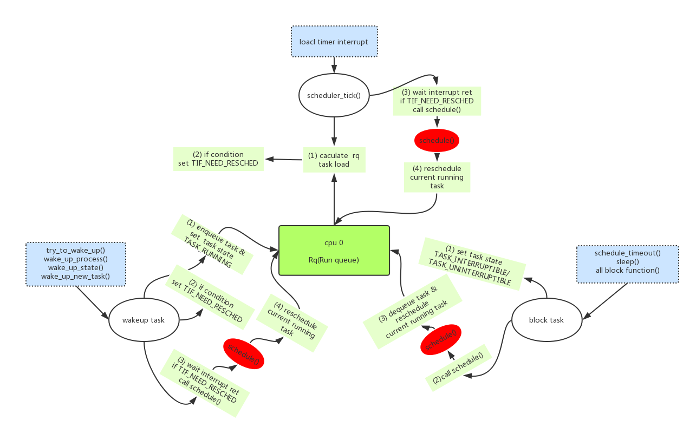


Linux进程调度(schedule)的框架如上图所示。

> 本文的代码分析基于linux kernel 4.4.22，最好的学习方法还是"RTFSC"

## 1.1、中心是rq(runqueue)

rq其实是runnable queue，即本cpu上所有可运行进程的队列集合。每个cpu每种类型的rq(cfs/rt)只有一个，一个rq包含多个runnable的task，但是rq当前正在运行的进程(current running task)只有一个。

既然rq是中心，那么以下几点就是关键路径：

- 1、什么时候task入rq？
- 2、什么时候task出rq？
- 3、rq怎么样从多个可运行的进程(runnable tasks)中选取一个进程作为当前的运行进程(current running task)？

我们下面就逐一解答这些疑问，理解了这些关键路径，你就对linux的进程调度框架有了一个清晰的认识。

## 1.2、入rq(enqueue)

只有task新创建/或者task从blocked状态被唤醒(wakeup)，task才会被压入rq。涉及到进程调度相关的步骤如下：

- 1、把task压入rq(enqueue)，且把task->state设置为TASK_RUNNING；

- 2、判断压入新task以后rq的负载情况，当前task需不需要被调度出去，如果需要把当前task的thread_info->flags其中TIF_NEED_RESCHED bit置位。

***重点在这里***：如果当前进程需要重新调度的条件成立，这里只是会设置TIF_NEED_RESCHED标志，并不会马上调用schedule()来进行调度。真正的调度时机发生在从中断/异常返回时，会判断当前进程有没有被设置TIF_NEED_RESCHED，如果设置则调用schedule()来进行调度。

为什么唤醒涉及到调度不会马上执行？而是只设置一个TIF_NEED_RESCHED，等到中断/异常返回的时候才执行？

我理解有几点：(1)唤醒操作经常在中断上下文中执行，在这个环境中直接调用schedule()进行调度是不行的；(2)为了维护非抢占内核以来的一些传统，不要轻易中断进程的处理逻辑除非他主动放弃；(3)在普通上下文中，唤醒后接着调用schedule()也是可以的，我们看到一些特殊函数就是这么干的(调用smp_send_reschedule()、resched_curr()的函数)。

- 3、等待中断/异常的发生、返回，在返回时判读有TIF_NEED_RESCHED，则调用schedule()进行调度；

## 1.3、出rq(dequeue)

在当前进程调用系统函数进入blocked状态是，task会出rq(dequeue)。具体的步骤如下：

- 1、当前进程把task->state设置为TASK_INTERRUPTIBLE/TASK_UNINTERRUPTIBLE;

- 2、立即调用schedule()进行调度；

***这里block是和wakeup、scheduler_tick最大的不同***，block是马上调用schedule()进行调度，而wakeup、scheduler_tick是设置TIF_NEED_RESCHED标志，等待中断/异常返回时才执行真正的schedule()操作；

- 3、调用schedule()后，判断当前进程task->state已经非TASK_RUNNING，则进行dequeue操作，并且调度其他进程到rq->curr。

## 1.4、定时调度rq(scheduler_tick)

前面说了在rq的enqueue、dequeue时刻会计算rq负载，来决定把哪个runnable task放到current running task。除了enqueue/dequeue时候，系统还会周期性的计算rq负载来进行调度，确保多进程在1个cpu上都能得到服务。具体的步骤如下：

- 1、每1 tick，local timer产生一次中断。中断中调用scheduler_tick()，计算rq的负载重新调度；
- 2、如果当前进程需要被调度，则设置TIF_NEED_RESCHED标志；
- 3、在local timer中断返回的时候，时判读有TIF_NEED_RESCHED，则调用schedule()进行调度；


## 1.5、中断/异常返回(Interrupt/Exception)

在前面几节中有一个重要的概念，wakeup、scheduler_tick操作后，如果需要调度只会设置TIF_NEED_RESCHED，在中断/异常返回时才执行真正的调度schedule()操作；

那么在哪些中断/异常返回时会执行schedule()呢？

我们分析"arch/arm64/kernel/entry.S"，在ArmV8架构下用户态跑在el0、内核态跑在el1。

- 1、内核态异常的返回el1_sync()：

```
	.align	6
el1_sync:
	kernel_entry 1
	mov	x0, sp
	get_thread_info x20	// top of stack
	ldr	w4, [x20, #TI_CPU_EXCP]
	add	w4, w4, #0x1
	str	w4, [x20, #TI_CPU_EXCP]
	cmp	w4, #0x1
	b.ne	el1_sync_nest
	str	x0, [x20, #TI_REGS_ON_EXCP]
el1_sync_nest:
	mrs	x1, esr_el1			// read the syndrome register
	lsr	x24, x1, #ESR_ELx_EC_SHIFT	// exception class
	cmp	x24, #ESR_ELx_EC_DABT_CUR	// data abort in EL1
	b.ne	el1_sync_nest_skip_dec
	sub	w4, w4, #0x1
	str	w4, [x20, #TI_CPU_EXCP]
el1_sync_nest_skip_dec:
	cmp	w4, #0x2
	b.lt	el1_sync_nest_skip
	bl	aee_stop_nested_panic
el1_sync_nest_skip:
	mrs	x1, esr_el1			// read the syndrome register
	lsr	x24, x1, #ESR_ELx_EC_SHIFT	// exception class
	cmp	x24, #ESR_ELx_EC_DABT_CUR	// data abort in EL1
	b.eq	el1_da
	cmp	x24, #ESR_ELx_EC_IABT_CUR	// instruction abort in EL1
	b.eq	el1_ia
	cmp	x24, #ESR_ELx_EC_SYS64		// configurable trap
	b.eq	el1_undef
	cmp	x24, #ESR_ELx_EC_SP_ALIGN	// stack alignment exception
	b.eq	el1_sp_pc
	cmp	x24, #ESR_ELx_EC_PC_ALIGN	// pc alignment exception
	b.eq	el1_sp_pc
	cmp	x24, #ESR_ELx_EC_UNKNOWN	// unknown exception in EL1
	b.eq	el1_undef
	cmp	x24, #ESR_ELx_EC_BREAKPT_CUR	// debug exception in EL1
	b.ge	el1_dbg
	b	el1_inv

el1_ia:
	/*
	 * Fall through to the Data abort case
	 */
el1_da:
	/*
	 * Data abort handling
	 */
	mrs	x0, far_el1
	enable_dbg
	// re-enable interrupts if they were enabled in the aborted context
	tbnz	x23, #7, 1f			// PSR_I_BIT
	enable_irq
1:
	mov	x2, sp				// struct pt_regs
	bl	do_mem_abort
	cmp	x24, #ESR_ELx_EC_DABT_CUR	// data abort in EL1
	b.eq	el1_da_nest_skip_dec
	mov	x5, sp
	get_thread_info x20	// top of stack
	ldr	w4, [x20, #TI_CPU_EXCP]
	sub	w4, w4, #0x1
	str	w4, [x20, #TI_CPU_EXCP]
el1_da_nest_skip_dec:

	// disable interrupts before pulling preserved data off the stack
	disable_irq
	kernel_exit 1
el1_sp_pc:
	/*
	 * Stack or PC alignment exception handling
	 */
	mrs	x0, far_el1
	enable_dbg
	mov	x2, sp
	b	do_sp_pc_abort
el1_undef:
	/*
	 * Undefined instruction
	 */
	enable_dbg
	mov	x0, sp
	bl	do_undefinstr
el1_dbg:
	/*
	 * Debug exception handling
	 */
	cmp	x24, #ESR_ELx_EC_BRK64		// if BRK64
	cinc	x24, x24, eq			// set bit '0'
	tbz	x24, #0, el1_inv		// EL1 only
	mrs	x0, far_el1
	mov	x2, sp				// struct pt_regs
	bl	do_debug_exception
	mov	x5, sp
	get_thread_info x20	// top of stack
	ldr	w4, [x20, #TI_CPU_EXCP]
	sub	w4, w4, #0x1
	str	w4, [x20, #TI_CPU_EXCP]

	kernel_exit 1
el1_inv:
	// TODO: add support for undefined instructions in kernel mode
	enable_dbg
	mov	x0, sp
	mov	x2, x1
	mov	x1, #BAD_SYNC
	b	bad_mode
ENDPROC(el1_sync)
```

大部分的内核态异常都是不可恢复的，内核最终会调用panic()复位，所以根本不会再返回去判断TIF_NEED_RESCHED标志；另外一部分可以返回的也只是简单调用kernel_exit恢复，不会去判断TIF_NEED_RESCHED标志。

- 2、内核态中断的返回el1_sync()：

```
	.align	6
el1_irq:
	kernel_entry 1
	enable_dbg
#ifdef CONFIG_TRACE_IRQFLAGS
	bl	trace_hardirqs_off
#endif

	irq_handler

#ifdef CONFIG_PREEMPT
	ldr	w24, [tsk, #TI_PREEMPT]		// get preempt count
	cbnz	w24, 1f				// preempt count != 0
	                            // (1) 如果preempt count大于0，禁止抢占，直接返回
	ldr	x0, [tsk, #TI_FLAGS]		// get flags
	tbz	x0, #TIF_NEED_RESCHED, 1f	// needs rescheduling?
	bl	el1_preempt             // (2) 如果preempt count=0且TIF_NEED_RESCHED被置位，
	                            //  继续调用el1_preempt() -> preempt_schedule_irq() -> __schedule()
1:
#endif
#ifdef CONFIG_TRACE_IRQFLAGS
	bl	trace_hardirqs_on
#endif
	kernel_exit 1
ENDPROC(el1_irq)

↓

#ifdef CONFIG_PREEMPT
el1_preempt:
	mov	x24, lr
1:	bl	preempt_schedule_irq		// irq en/disable is done inside
	ldr	x0, [tsk, #TI_FLAGS]		// get new tasks TI_FLAGS
	tbnz	x0, #TIF_NEED_RESCHED, 1b	// needs rescheduling?
	ret	x24
#endif

↓

asmlinkage __visible void __sched preempt_schedule_irq(void)
{
	enum ctx_state prev_state;

	/* Catch callers which need to be fixed */
	BUG_ON(preempt_count() || !irqs_disabled());

	prev_state = exception_enter();

	do {
		preempt_disable();
		local_irq_enable();
		__schedule(true);
		local_irq_disable();
		sched_preempt_enable_no_resched();
	} while (need_resched());

	exception_exit(prev_state);
}
```

可以看到在内核态中断返回时：会首先判断当前进程的thread_info->preempt_count的值，如果大于0说明禁止抢占不做处理直接返回；如果等于0且thread_info->flags被置位TIF_NEED_RESCHED，调用preempt_schedule_irq()重新进行调度。

- 3、用户态系统调用类异常的返回el0_svc()：


```
	.align	6
el0_sync:
	kernel_entry 0
	mrs	x25, esr_el1			// read the syndrome register
	lsr	x24, x25, #ESR_ELx_EC_SHIFT	// exception class
	cmp	x24, #ESR_ELx_EC_SVC64		// SVC in 64-bit state
	b.eq	el0_svc                 // (1) 系统调用类的异常
	cmp	x24, #ESR_ELx_EC_DABT_LOW	// data abort in EL0
	b.eq	el0_da
	cmp	x24, #ESR_ELx_EC_IABT_LOW	// instruction abort in EL0
	b.eq	el0_ia
	cmp	x24, #ESR_ELx_EC_FP_ASIMD	// FP/ASIMD access
	b.eq	el0_fpsimd_acc
	cmp	x24, #ESR_ELx_EC_FP_EXC64	// FP/ASIMD exception
	b.eq	el0_fpsimd_exc
	cmp	x24, #ESR_ELx_EC_SYS64		// configurable trap
	b.eq	el0_undef
	cmp	x24, #ESR_ELx_EC_SP_ALIGN	// stack alignment exception
	b.eq	el0_sp_pc
	cmp	x24, #ESR_ELx_EC_PC_ALIGN	// pc alignment exception
	b.eq	el0_sp_pc
	cmp	x24, #ESR_ELx_EC_UNKNOWN	// unknown exception in EL0
	b.eq	el0_undef
	cmp	x24, #ESR_ELx_EC_BREAKPT_LOW	// debug exception in EL0
	b.ge	el0_dbg
	b	el0_inv
	
↓

	.align	6
el0_svc:
	adrp	stbl, sys_call_table		// load syscall table pointer
	uxtw	scno, w8			// syscall number in w8
	mov	sc_nr, #__NR_syscalls
el0_svc_naked:					// compat entry point
	stp	x0, scno, [sp, #S_ORIG_X0]	// save the original x0 and syscall number
	enable_dbg_and_irq
	ct_user_exit 1

	ldr	x16, [tsk, #TI_FLAGS]		// check for syscall hooks
	tst	x16, #_TIF_SYSCALL_WORK
	b.ne	__sys_trace
	cmp     scno, sc_nr                     // check upper syscall limit
	b.hs	ni_sys
	ldr	x16, [stbl, scno, lsl #3]	// address in the syscall table
	blr	x16				// call sys_* routine
	                    // (1.1) 系统调用的执行
	b	ret_fast_syscall // (1.2) 系统调用异常的的返回
ni_sys:
	mov	x0, sp
	bl	do_ni_syscall
	b	ret_fast_syscall
ENDPROC(el0_svc)

↓

/*
 * This is the fast syscall return path.  We do as little as possible here,
 * and this includes saving x0 back into the kernel stack.
 */
ret_fast_syscall:
	disable_irq				// disable interrupts
	str	x0, [sp, #S_X0]			// returned x0
	ldr	x1, [tsk, #TI_FLAGS]		// re-check for syscall tracing
	and	x2, x1, #_TIF_SYSCALL_WORK  // (1.2.1) 判断thread_info->flags中_TIF_SYSCALL_WORK有没有被置位
	                                // _TIF_WORK_MASK = (_TIF_NEED_RESCHED | _TIF_SIGPENDING | _TIF_NOTIFY_RESUME | _TIF_FOREIGN_FPSTATE)
	                                // _TIF_NEED_RESCHED：当前进程需要调度
	                                // _TIF_SIGPENDING：当前进程有pending的信号需要处理
	cbnz	x2, ret_fast_syscall_trace
	and	x2, x1, #_TIF_WORK_MASK
	cbnz	x2, work_pending        // (1.2.2) 如果有wokr需要处理调用work_pending
	enable_step_tsk x1, x2
	kernel_exit 0
ret_fast_syscall_trace:
	enable_irq				// enable interrupts
	b	__sys_trace_return_skipped	// we already saved x0

/*
 * Ok, we need to do extra processing, enter the slow path.
 */
work_pending:
	tbnz	x1, #TIF_NEED_RESCHED, work_resched
	/* TIF_SIGPENDING, TIF_NOTIFY_RESUME or TIF_FOREIGN_FPSTATE case */
	mov	x0, sp				// 'regs'
	enable_irq				// enable interrupts for do_notify_resume()
	bl	do_notify_resume        // (1.2.2.1) 如果signal、resume等work需要处理，
	                            // 调用do_notify_resume()
	b	ret_to_user
work_resched:
#ifdef CONFIG_TRACE_IRQFLAGS
	bl	trace_hardirqs_off		// the IRQs are off here, inform the tracing code
#endif
	bl	schedule            // (1.2.2.2) 如果TIF_NEED_RESCHED被置位，调用schedule()进行任务调度

/*
 * "slow" syscall return path.
 */
ret_to_user:
	disable_irq				// disable interrupts
	ldr	x1, [tsk, #TI_FLAGS]
	and	x2, x1, #_TIF_WORK_MASK
	cbnz	x2, work_pending
	enable_step_tsk x1, x2
	kernel_exit 0
ENDPROC(ret_to_user)
```

用户态的异常其中一个大类就是系统调用，这是用户主动调用svc命令陷入到内核态中执行系统调用。
在返回用户态的时候会判断thread_info->flags中的TIF_NEED_RESCHED bit有没有被置位，有置位则会调用schedule()；还会判断_TIF_SIGPENDING，有置位会进行信号处理do_signal()。


- 4、用户态其他异常的返回el0_sync()：

```
	.align	6
el0_sync:
	kernel_entry 0
	mrs	x25, esr_el1			// read the syndrome register
	lsr	x24, x25, #ESR_ELx_EC_SHIFT	// exception class
	cmp	x24, #ESR_ELx_EC_SVC64		// SVC in 64-bit state
	b.eq	el0_svc                 
	cmp	x24, #ESR_ELx_EC_DABT_LOW	// data abort in EL0
	b.eq	el0_da                  // (1) 其他类型的异常
	cmp	x24, #ESR_ELx_EC_IABT_LOW	// instruction abort in EL0
	b.eq	el0_ia
	cmp	x24, #ESR_ELx_EC_FP_ASIMD	// FP/ASIMD access
	b.eq	el0_fpsimd_acc
	cmp	x24, #ESR_ELx_EC_FP_EXC64	// FP/ASIMD exception
	b.eq	el0_fpsimd_exc
	cmp	x24, #ESR_ELx_EC_SYS64		// configurable trap
	b.eq	el0_undef
	cmp	x24, #ESR_ELx_EC_SP_ALIGN	// stack alignment exception
	b.eq	el0_sp_pc
	cmp	x24, #ESR_ELx_EC_PC_ALIGN	// pc alignment exception
	b.eq	el0_sp_pc
	cmp	x24, #ESR_ELx_EC_UNKNOWN	// unknown exception in EL0
	b.eq	el0_undef
	cmp	x24, #ESR_ELx_EC_BREAKPT_LOW	// debug exception in EL0
	b.ge	el0_dbg
	b	el0_inv
	
↓

el0_da:
	/*
	 * Data abort handling
	 */
	mrs	x26, far_el1
	// enable interrupts before calling the main handler
	enable_dbg_and_irq
	ct_user_exit
	bic	x0, x26, #(0xff << 56)
	mov	x1, x25
	mov	x2, sp
	bl	do_mem_abort        // (1.1) 调用异常处理
	b	ret_to_user         // (1.2) 完成后调用ret_to_user返回
el0_ia:
	/*
	 * Instruction abort handling
	 */
	mrs	x26, far_el1
	// enable interrupts before calling the main handler
	enable_dbg_and_irq
	ct_user_exit
	mov	x0, x26
	mov	x1, x25
	mov	x2, sp
	bl	do_mem_abort
	b	ret_to_user         
	
↓

/*
 * Ok, we need to do extra processing, enter the slow path.
 */
work_pending:
	tbnz	x1, #TIF_NEED_RESCHED, work_resched
	/* TIF_SIGPENDING, TIF_NOTIFY_RESUME or TIF_FOREIGN_FPSTATE case */
	mov	x0, sp				// 'regs'
	enable_irq				// enable interrupts for do_notify_resume()
	bl	do_notify_resume        // (1.2.2.1) 如果signal、resume等work需要处理，
	                            // 调用do_notify_resume()
	b	ret_to_user
work_resched:
#ifdef CONFIG_TRACE_IRQFLAGS
	bl	trace_hardirqs_off		// the IRQs are off here, inform the tracing code
#endif
	bl	schedule            // (1.2.2.2) 如果TIF_NEED_RESCHED被置位，调用schedule()进行任务调度

/*
 * "slow" syscall return path.
 */
ret_to_user:
	disable_irq				// disable interrupts
	ldr	x1, [tsk, #TI_FLAGS]
	and	x2, x1, #_TIF_WORK_MASK
	cbnz	x2, work_pending    // (1.2.2) 如果有wokr需要处理调用work_pending
	enable_step_tsk x1, x2
	kernel_exit 0
ENDPROC(ret_to_user)
```

用户态的异常除了系统调用，剩下就是错误类型的异常，比如：data abort、instruction abort、其他错误等。
在返回用户态的时候会判断thread_info->flags中的TIF_NEED_RESCHED bit有没有被置位，有置位则会调用schedule()；还会判断_TIF_SIGPENDING，有置位会进行信号处理do_signal()。


- 5、用户态中断的返回el0_irq()；

```
	.align	6
el0_irq:
	kernel_entry 0
el0_irq_naked:
	enable_dbg
#ifdef CONFIG_TRACE_IRQFLAGS
	bl	trace_hardirqs_off
#endif

	ct_user_exit
	irq_handler             // (1) 调用irq处理程序

#ifdef CONFIG_TRACE_IRQFLAGS
	bl	trace_hardirqs_on
#endif
	b	ret_to_user         // (2) 最后也是调用ret_to_user返回，
	                        // 会判断TIF_NEED_RESCHED、_TIF_SIGPENDING
ENDPROC(el0_irq)
```

用户态的中断处理和其他异常处理一样，最后都是调用ret_to_user返回用户态。
在返回用户态的时候会判断thread_info->flags中的TIF_NEED_RESCHED bit有没有被置位，有置位则会调用schedule()；还会判断_TIF_SIGPENDING，有置位会进行信号处理do_signal()。


## 1.6、什么叫抢占(preempt)？

从上一节的分析中断/异常返回一共有5类路径：

- 内核态异常的返回el1_sync()，不支持调度检测；
- 内核态中断的返回el1_sync()，支持对preempt_count和TIF_NEED_RESCHED的检测；
- 用户态系统调用类异常的返回el0_svc()，支持对TIF_NEED_RESCHED和_TIF_SIGPENDING的检测；
- 用户态其他异常的返回el0_sync()，支持对TIF_NEED_RESCHED和_TIF_SIGPENDING的检测；
- 用户态中断的返回el0_irq()，支持对TIF_NEED_RESCHED和_TIF_SIGPENDING的检测；

我们可以看到是否支持抢占，只会影响"内核态中断的返回"这一条路径。

- ***“抢占(preempt)”***，如果抢占使能在内核态中断的返回时会检测是否需要进行进程调度schedule()，如果抢占不使能则在该路径下会直接返回原进程什么也不会做。

### 1.6.1、PREEMPT_ACTIVE标志

在之前的内核中会存在PREEMPT_ACTIVE这样一个标志，他是为了避免在如下代码被抢占会出现问题：

```
for (; ;) {
1： prepare_to_wait(&wq, &__wait, TASK_UNINTERRUPTIBLE);
2： if (condition)  
3： 		break;              // 如果这里发生抢占
4： schedule();
}
finish_wait();

```

假设如下场景：

- 1、进程首先执行步骤1 prepare_to_wait()把自己设置为TASK_UNINTERRUPTIBLE，但是在执行步骤2时发现条件(condition)成立准备退出循环，调用finish_wait()恢复TASK_RUNNING状态，这时发生了抢占。
- 2、发生抢占以后调用schedule()的过程中会判断当前需要调度的进程是否为TASK_UNINTERRUPTIBLE/TASK_INTERRUPTIBLE睡眠状态，如果是的话schedule()认为进程是从主动blocked路径中进来的，会把当前进程退出runqueue(deactivate_task)。
- 3、正常的用户逻辑主动调用blocked操作进入睡眠状态是没有关系的，因为用户会设计其他的唤醒操作；但是上述场景违反了用户的正常逻辑，在条件(condition)成立的情况下把进程dequeue出运行队列，可能会造成进程无人唤醒永远不会被执行。

为了避免以上的错误发生，在以前版本的内核中设计了PREEMPT_ACTIVE标志，如果是抢占发生首先设置PREEMPT_ACTIVE标志再调用schedule()，schedule()判断PREEMPT_ACTIVE的存在则不会进行dequeue/deactive操作。

```
asmlinkage void __sched preempt_schedule_irq(void)
{

	add_preempt_count(PREEMPT_ACTIVE); // (1) 在抢占调度之前设置PREEMPT_ACTIVE标志
	
	local_irq_enable();
	schedule();                         // (2) 调用schedule()进行实际调度
	local_irq_disable();
	
	sub_preempt_count(PREEMPT_ACTIVE);

}

↓

asmlinkage void __sched schedule(void)
{

    /* (2.1) 如果进程state状态不为TASK_RUNNING && 没有置位PREEMPT_ACTIVE标志，
        以下代码会对这样的进程进行deactivate_task(dequeue)操作
	if (prev->state && !(preempt_count() & PREEMPT_ACTIVE)) {
		switch_count = &prev->nvcsw;
		if (unlikely((prev->state & TASK_INTERRUPTIBLE) &&
				unlikely(signal_pending(prev))))
			prev->state = TASK_RUNNING;
		else {
			if (prev->state == TASK_UNINTERRUPTIBLE)
				rq->nr_uninterruptible++;
			deactivate_task(prev, rq);
		}
	}

}

```

最新的4.4内核中，已经取消PREEMPT_ACTIVE标志而改为使用__schedule(bool preempt)的函数参数传入：

```
asmlinkage __visible void __sched preempt_schedule_irq(void)
{

	do {
		preempt_disable();
		local_irq_enable();
		__schedule(true);       // (1) 使用preempt=true来调用__schedule()
		local_irq_disable();
		sched_preempt_enable_no_resched();
	} while (need_resched());

}

↓

static void __sched notrace __schedule(bool preempt)
{

    // (1.1) 使用preempt代替了PREEMPT_ACTIVE标志的作用
	if (!preempt && prev->state) {
		if (unlikely(signal_pending_state(prev->state, prev))) {
			prev->state = TASK_RUNNING;
		} else {
			deactivate_task(rq, prev, DEQUEUE_SLEEP);
			prev->on_rq = 0;

			/*
			 * If a worker went to sleep, notify and ask workqueue
			 * whether it wants to wake up a task to maintain
			 * concurrency.
			 */
			if (prev->flags & PF_WQ_WORKER) {
				struct task_struct *to_wakeup;

				to_wakeup = wq_worker_sleeping(prev, cpu);
				if (to_wakeup)
					try_to_wake_up_local(to_wakeup);
			}
		}
		switch_count = &prev->nvcsw;
	}
	
}
```


## 1.7、代码分析

上述几节的内容讲述了调度相关的几个关键节点，所以理解调度你可以从以下的几个函数入手：

- try_to_wake_up()  // wakeup task
- block task        // 类如：mutex_lock()、down()、schedule_timeout()、msleep()
- scheduler_tick()
- schedule()


# 2、调度算法

linux进程一般分成了实时进程(RT)和普通进程，linux使用sched_class结构来管理不同类型进程的调度算法：rt_sched_class负责实时类进程(SCHED_FIFO/SCHED_RR)的调度，fair_sched_class负责普通进程(SCHED_NORMAL)的调度，还有idle_sched_class(SCHED_IDLE)、dl_sched_class(SCHED_DEADLINE)都比较简单和少见；

实时进程的调度算法移植都没什么变化，SCHED_FIFO类型的谁优先级高就一直抢占/SCHED_RR相同优先级的进行时间片轮转。

所以我们常说的调度算法一般指普通进程(SCHED_NORMAL)的调度算法，这类进程也在系统中占大多数。在2.6.24以后内核引入的是CFS算法，这个也是现在的主流；在这之前2.6内核使用的是一种O(1)算法；

## 2.1、linux2.6的O(1)调度算法


linux进程的优先级有140种，其中优先级(0-99)对应实时进程，优先级(100-139)对应普通进程，nice(0)对应优先级120，nice(-10)对应优先级100，nice(19)对应优先级139。

```
#define MAX_USER_RT_PRIO	100
#define MAX_RT_PRIO		MAX_USER_RT_PRIO        // 优先级(1-99)对应实时进程

#define MAX_PRIO		(MAX_RT_PRIO + 40)      // 优先级(100-139)对应普通进程

/*
 * Convert user-nice values [ -20 ... 0 ... 19 ]
 * to static priority [ MAX_RT_PRIO..MAX_PRIO-1 ],
 * and back.
 */
#define NICE_TO_PRIO(nice)	(MAX_RT_PRIO + (nice) + 20) // nice(0)对应优先级120，nice(-20)对应优先级100，nice(19)对应优先级139
#define PRIO_TO_NICE(prio)	((prio) - MAX_RT_PRIO - 20)
#define TASK_NICE(p)		PRIO_TO_NICE((p)->static_prio)

/*
 * 'User priority' is the nice value converted to something we
 * can work with better when scaling various scheduler parameters,
 * it's a [ 0 ... 39 ] range.
 */
#define USER_PRIO(p)		((p)-MAX_RT_PRIO)
#define TASK_USER_PRIO(p)	USER_PRIO((p)->static_prio)
#define MAX_USER_PRIO		(USER_PRIO(MAX_PRIO))
```

O(1)调度算法主要包含以下内容：

- (1)、每个cpu的rq包含两个140个成员的链表数组rq->active、rq->expired；

任务根据优先级挂载到不同的数组当中，时间片没有用完放在rq->active，时间片用完后放到rq->expired，在rq->active所有任务时间片用完为空后rq->active和rq->expired相互反转。

在schedule()中pcik next task时，首先会根据array->bitmap找出哪个最先优先级还有任务需要调度，然后根据index找到 对应的优先级任务链表。因为查找bitmap的在IA处理器上可以通过bsfl等一条指令来实现，所以他的复杂度为O(1)。

```
asmlinkage void __sched schedule(void)
{


	idx = sched_find_first_bit(array->bitmap);
	queue = array->queue + idx;
	next = list_entry(queue->next, task_t, run_list);
	
}
```

- (2)、进程优先级分为静态优先级(p->static_prio)、动态优先级(p->prio)；


静态优先级(p->static_prio)决定进程时间片的大小:

```
/*
 * task_timeslice() scales user-nice values [ -20 ... 0 ... 19 ]
 * to time slice values: [800ms ... 100ms ... 5ms]
 *
 * The higher a thread's priority, the bigger timeslices
 * it gets during one round of execution. But even the lowest
 * priority thread gets MIN_TIMESLICE worth of execution time.
 */
 
/* 根据算法如果nice(0)的时间片为100mS，那么nice(-20)时间片为800ms、nice(19)时间片为5ms */

#define SCALE_PRIO(x, prio) \
	max(x * (MAX_PRIO - prio) / (MAX_USER_PRIO/2), MIN_TIMESLICE)

static unsigned int task_timeslice(task_t *p)
{
	if (p->static_prio < NICE_TO_PRIO(0))
		return SCALE_PRIO(DEF_TIMESLICE*4, p->static_prio);
	else
		return SCALE_PRIO(DEF_TIMESLICE, p->static_prio);
}

#define MIN_TIMESLICE		max(5 * HZ / 1000, 1)
#define DEF_TIMESLICE		(100 * HZ / 1000)
```

动态优先级决定进程在rq->active、rq->expired进程链表中的index：

```
static void enqueue_task(struct task_struct *p, prio_array_t *array)
{
	sched_info_queued(p);
	list_add_tail(&p->run_list, array->queue + p->prio); // 根据动态优先级p->prio作为index，找到对应链表
	__set_bit(p->prio, array->bitmap);
	array->nr_active++;
	p->array = array;
}
```

动态优先级和静态优先级之间的转换函数：动态优先级=max(100 , min(静态优先级 – bonus + 5) , 139)

```
/*
 * effective_prio - return the priority that is based on the static
 * priority but is modified by bonuses/penalties.
 *
 * We scale the actual sleep average [0 .... MAX_SLEEP_AVG]
 * into the -5 ... 0 ... +5 bonus/penalty range.
 *
 * We use 25% of the full 0...39 priority range so that:
 *
 * 1) nice +19 interactive tasks do not preempt nice 0 CPU hogs.
 * 2) nice -20 CPU hogs do not get preempted by nice 0 tasks.
 *
 * Both properties are important to certain workloads.
 */
static int effective_prio(task_t *p)
{
	int bonus, prio;

	if (rt_task(p))
		return p->prio;

	bonus = CURRENT_BONUS(p) - MAX_BONUS / 2;  // MAX_BONUS = 10

	prio = p->static_prio - bonus;
	if (prio < MAX_RT_PRIO)
		prio = MAX_RT_PRIO;
	if (prio > MAX_PRIO-1)
		prio = MAX_PRIO-1;
	return prio;
}
```
从上面看出动态优先级是以静态优先级为基础，再加上相应的惩罚或奖励(bonus)。这个bonus并不是随机的产生，而是根据进程过去的平均睡眠时间做相应的惩罚或奖励。所谓平均睡眠时间（sleep_avg，位于task_struct结构中）就是进程在睡眠状态所消耗的总时间数，这里的平均并不是直接对时间求平均数。

- (3)、根据平均睡眠时间判断进程是否是交互式进程(INTERACTIVE);
 
交互式进程的好处？交互式进程时间片用完会重新进入active队列；

```
void scheduler_tick(void)
{


	if (!--p->time_slice) {     // (1) 时间片用完
		dequeue_task(p, rq->active);    // (2) 退出actice队列
		set_tsk_need_resched(p);
		p->prio = effective_prio(p);
		p->time_slice = task_timeslice(p);
		p->first_time_slice = 0;

		if (!rq->expired_timestamp)
			rq->expired_timestamp = jiffies;
		if (!TASK_INTERACTIVE(p) || EXPIRED_STARVING(rq)) {
			enqueue_task(p, rq->expired);       // (3) 普通进程进入expired队列
			if (p->static_prio < rq->best_expired_prio)
				rq->best_expired_prio = p->static_prio;
		} else
			enqueue_task(p, rq->active);    // (4) 如果是交互式进程，重新进入active队列
	}
	
	
}
```

判断进程是否是交互式进程(INTERACTIVE)的公式：动态优先级≤3*静态优先级/4 + 28

```
#define TASK_INTERACTIVE(p) \
	((p)->prio <= (p)->static_prio - DELTA(p))
	

```

平均睡眠时间的算法和交互进程的思想，我没有详细去看大家可以参考一下的一些描述：

> 所谓平均睡眠时间（sleep_avg，位于task_struct结构中）就是进程在睡眠状态所消耗的总时间数，这里的平均并不是直接对时间求平均数。平均睡眠时间随着进程的睡眠而增长，随着进程的运行而减少。因此，平均睡眠时间记录了进程睡眠和执行的时间，它是用来判断进程交互性强弱的关键数据。如果一个进程的平均睡眠时间很大，那么它很可能是一个交互性很强的进程。反之，如果一个进程的平均睡眠时间很小，那么它很可能一直在执行。另外，平均睡眠时间也记录着进程当前的交互状态，有很快的反应速度。比如一个进程在某一小段时间交互性很强，那么sleep_avg就有可能暴涨（当然它不能超过 MAX_SLEEP_AVG），但如果之后都一直处于执行状态，那么sleep_avg就又可能一直递减。理解了平均睡眠时间，那么bonus的含义也就显而易见了。交互性强的进程会得到调度程序的奖励（bonus为正），而那些一直霸占CPU的进程会得到相应的惩罚（bonus为负）。其实bonus相当于平均睡眠时间的缩影，此时只是将sleep_avg调整成bonus数值范围内的大小。
O(1)调度器区分交互式进程和批处理进程的算法与以前虽大有改进，但仍然在很多情况下会失效。有一些著名的程序总能让该调度器性能下降，导致交互式进程反应缓慢。例如fiftyp.c, thud.c, chew.c, ring-test.c, massive_intr.c等。而且O(1)调度器对NUMA支持也不完善。


## 2.2、CFS调度算法

针对O(1)算法出现的问题(具体是哪些问题我也理解不深说不上来)，linux推出了CFS(Completely Fair Scheduler)完全公平调度算法。该算法从楼梯调度算法(staircase scheduler)和RSDL（Rotating Staircase Deadline Scheduler）发展而来，抛弃了复杂的active/expire数组和交互进程计算，把所有进程一视同仁都放到一个执行时间的红黑树中，实现了完全公平的思想。

CFS的主要思想如下：

- 根据普通进程的优先级nice值来定一个比重(weight)，该比重用来计算进程的实际运行时间到虚拟运行时间(vruntime)的换算；不言而喻优先级高的进程运行更多的时间和优先级低的进程运行更少的时间在vruntime上市等价的；
- 根据rq->cfs_rq中进程的数量计算一个总的period周期，每个进程再根据自己的weight占整个的比重来计算自己的理想运行时间(ideal_runtime)，在scheduler_tick()中判断如果进程的实际运行时间(exec_runtime)已经达到理想运行时间(ideal_runtime)，则进程需要被调度test_tsk_need_resched(curr)。有了period，那么cfs_rq中所有进程在period以内必会得到调度；
- 根据进程的虚拟运行时间(vruntime)，把rq->cfs_rq中的进程组织成一个红黑树(平衡二叉树)，那么在pick_next_entity时树的最左节点就是运行时间最少的进程，是最好的需要调度的候选人；

### 2.2.1、vruntime

每个进程的vruntime = runtime * (NICE_0_LOAD/nice_n_weight)

```
/* 该表的主要思想是，高一个等级的weight是低一个等级的 1.25 倍 */
/*
 * Nice levels are multiplicative, with a gentle 10% change for every
 * nice level changed. I.e. when a CPU-bound task goes from nice 0 to
 * nice 1, it will get ~10% less CPU time than another CPU-bound task
 * that remained on nice 0.
 *
 * The "10% effect" is relative and cumulative: from _any_ nice level,
 * if you go up 1 level, it's -10% CPU usage, if you go down 1 level
 * it's +10% CPU usage. (to achieve that we use a multiplier of 1.25.
 * If a task goes up by ~10% and another task goes down by ~10% then
 * the relative distance between them is ~25%.)
 */
static const int prio_to_weight[40] = {
 /* -20 */     88761,     71755,     56483,     46273,     36291,
 /* -15 */     29154,     23254,     18705,     14949,     11916,
 /* -10 */      9548,      7620,      6100,      4904,      3906,
 /*  -5 */      3121,      2501,      1991,      1586,      1277,
 /*   0 */      1024,       820,       655,       526,       423,
 /*   5 */       335,       272,       215,       172,       137,
 /*  10 */       110,        87,        70,        56,        45,
 /*  15 */        36,        29,        23,        18,        15,
};
```

nice(0)对应的weight是NICE_0_LOAD(1024)，nice(-1)对应的weight是NICE_0_LOAD*1.25，nice(1)对应的weight是NICE_0_LOAD/1.25。

NICE_0_LOAD(1024)在schedule计算中是一个非常神奇的数字，他的含义就是基准"1"。因为kernel不能表示小数，所以把1放大称为1024。

```
scheduler_tick() -> task_tick_fair() -> update_curr():

↓

static void update_curr(struct cfs_rq *cfs_rq)
{

	curr->sum_exec_runtime += delta_exec;       // (1) 累计当前进程的实际运行时间
	schedstat_add(cfs_rq, exec_clock, delta_exec);

	curr->vruntime += calc_delta_fair(delta_exec, curr);  // (2) 累计当前进程的vruntime
	update_min_vruntime(cfs_rq);

}

↓

static inline u64 calc_delta_fair(u64 delta, struct sched_entity *se)
{
    // (2.1) 根据进程的weight折算vruntime
	if (unlikely(se->load.weight != NICE_0_LOAD))
		delta = __calc_delta(delta, NICE_0_LOAD, &se->load);

	return delta;
}

```

### 2.2.2、period和ideal_runtime

scheduler_tick()中根据cfs_rq中的se数量计算period和ideal_time，判断当前进程时间是否用完需要调度：

```
scheduler_tick() -> task_tick_fair() -> entity_tick() -> check_preempt_tick():

↓

static void
check_preempt_tick(struct cfs_rq *cfs_rq, struct sched_entity *curr)
{
	unsigned long ideal_runtime, delta_exec;
	struct sched_entity *se;
	s64 delta;

    /* (1) 计算period和ideal_time */
	ideal_runtime = sched_slice(cfs_rq, curr);  
	
	/* (2) 计算实际运行时间 */
	delta_exec = curr->sum_exec_runtime - curr->prev_sum_exec_runtime;  
	
	/* (3) 如果实际运行时间已经超过ideal_time，
	      当前进程需要被调度，设置TIF_NEED_RESCHED标志
	 */
	if (delta_exec > ideal_runtime) {   
		resched_curr(rq_of(cfs_rq));    
		/*
		 * The current task ran long enough, ensure it doesn't get
		 * re-elected due to buddy favours.
		 */
		clear_buddies(cfs_rq, curr);
		return;
	}

	/*
	 * Ensure that a task that missed wakeup preemption by a
	 * narrow margin doesn't have to wait for a full slice.
	 * This also mitigates buddy induced latencies under load.
	 */
	if (delta_exec < sysctl_sched_min_granularity)
		return;

	se = __pick_first_entity(cfs_rq);
	delta = curr->vruntime - se->vruntime;

	if (delta < 0)
		return;

	if (delta > ideal_runtime)
		resched_curr(rq_of(cfs_rq));
}

↓

static u64 sched_slice(struct cfs_rq *cfs_rq, struct sched_entity *se)
{
    /* (1.1) 计算period值 */
	u64 slice = __sched_period(cfs_rq->nr_running + !se->on_rq); 

    /* 疑问：这里是根据最底层se和cfq_rq来计算ideal_runtime，然后逐层按比重折算到上层时间
        这种方法是不对的，应该是从顶层到底层分配时间下来才比较合理。
        庆幸的是，在task_tick_fair()中会调用task_tick_fair递归的每层递归的计算时间，
        所以最上面的一层也是判断的
     */
	for_each_sched_entity(se) {     
		struct load_weight *load;
		struct load_weight lw;

		cfs_rq = cfs_rq_of(se);
		load = &cfs_rq->load;

		if (unlikely(!se->on_rq)) {
			lw = cfs_rq->load;

			update_load_add(&lw, se->load.weight);
			load = &lw;
		}
		/* (1.2) 根据period值和进程weight在cfs_rq weight中的比重计算ideal_runtime
		 */
		slice = __calc_delta(slice, se->load.weight, load);
	}
	return slice;
}

↓

/* (1.1.1) period的计算方法，从默认值看：
    如果cfs_rq中的进程大于8(sched_nr_latency)个，则period=n*0.75ms(sysctl_sched_min_granularity)
    如果小于等于8(sched_nr_latency)个，则period=6ms(sysctl_sched_latency)
 */

/*
 * The idea is to set a period in which each task runs once.
 *
 * When there are too many tasks (sched_nr_latency) we have to stretch
 * this period because otherwise the slices get too small.
 *
 * p = (nr <= nl) ? l : l*nr/nl
 */
static u64 __sched_period(unsigned long nr_running)
{
	if (unlikely(nr_running > sched_nr_latency))
		return nr_running * sysctl_sched_min_granularity;
	else
		return sysctl_sched_latency;
}

/*
 * Minimal preemption granularity for CPU-bound tasks:
 * (default: 0.75 msec * (1 + ilog(ncpus)), units: nanoseconds)
 */
unsigned int sysctl_sched_min_granularity = 750000ULL;
unsigned int normalized_sysctl_sched_min_granularity = 750000ULL;

/*
 * is kept at sysctl_sched_latency / sysctl_sched_min_granularity
 */
static unsigned int sched_nr_latency = 8;

/*
 * Targeted preemption latency for CPU-bound tasks:
 * (default: 6ms * (1 + ilog(ncpus)), units: nanoseconds)
 *
 * NOTE: this latency value is not the same as the concept of
 * 'timeslice length' - timeslices in CFS are of variable length
 * and have no persistent notion like in traditional, time-slice
 * based scheduling concepts.
 *
 * (to see the precise effective timeslice length of your workload,
 *  run vmstat and monitor the context-switches (cs) field)
 */
unsigned int sysctl_sched_latency = 6000000ULL;
unsigned int normalized_sysctl_sched_latency = 6000000ULL;

```


### 2.2.3、红黑树(Red Black Tree)

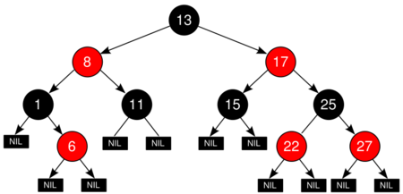

红黑树又称为平衡二叉树，它的特点：

- 1、平衡。从根节点到叶子节点之间的任何路径，差值不会超过1。所以pick_next_task()复杂度为O(log n)。可以看到pick_next_task()复杂度是大于o(1)算法的，但是最大路径不会超过log2(n) - 1，复杂度是可控的。
- 2、排序。左边的节点一定小于右边的节点，所以最左边节点是最小值。

按照进程的vruntime组成了红黑树：

```
enqueue_task_fair() -> enqueue_entity() -> __enqueue_entity():

↓

static void __enqueue_entity(struct cfs_rq *cfs_rq, struct sched_entity *se)
{
	struct rb_node **link = &cfs_rq->tasks_timeline.rb_node;
	struct rb_node *parent = NULL;
	struct sched_entity *entry;
	int leftmost = 1;

	/*
	 * Find the right place in the rbtree:
	 */
	/* (1) 根据vruntime的值在rbtree中找到合适的插入点 */
	while (*link) {
		parent = *link;
		entry = rb_entry(parent, struct sched_entity, run_node);
		/*
		 * We dont care about collisions. Nodes with
		 * the same key stay together.
		 */
		if (entity_before(se, entry)) {
			link = &parent->rb_left;
		} else {
			link = &parent->rb_right;
			leftmost = 0;
		}
	}

	/*
	 * Maintain a cache of leftmost tree entries (it is frequently
	 * used):
	 */
	/* (2) 更新最左值最小值cache */
	if (leftmost)
		cfs_rq->rb_leftmost = &se->run_node;

    /* (3) 将节点插入rbtree */
	rb_link_node(&se->run_node, parent, link);
	rb_insert_color(&se->run_node, &cfs_rq->tasks_timeline);
}

```

### 2.2.4、sched_entity和task_group

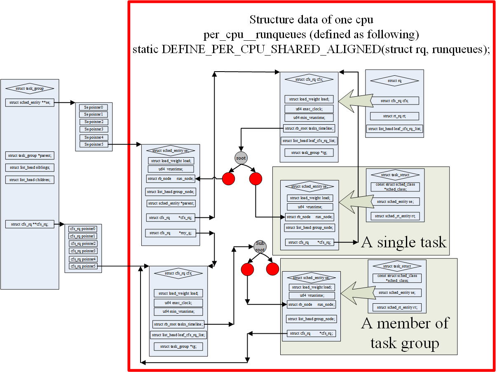

因为新的内核加入了task_group的概念，所以现在不是使用task_struct结构直接参与到schedule计算当中，而是使用sched_entity结构。一个sched_entity结构可能是一个task也可能是一个task_group->se[cpu]。上图非常好的描述了这些结构之间的关系。

其中主要的层次关系如下：

- 1、一个cpu只对应一个rq;
- 2、一个rq有一个cfs_rq；
- 3、cfs_rq使用红黑树组织多个同一层级的sched_entity；
- 4、如果sched_entity对应的是一个task_struct，那sched_entity和task是一对一的关系；
- 5、如果sched_entity对应的是task_group，那么他是一个task_group多个sched_entity中的一个。task_group有一个数组se[cpu]，在每个cpu上都有一个sched_entity。这种类型的sched_entity有自己的cfs_rq，一个sched_entity对应一个cfs_rq(se->my_q)，cfs_rq再继续使用红黑树组织多个同一层级的sched_entity；3-5的层次关系可以继续递归下去。

### 2.2.5、scheduler_tick()

关于算法，最核心的部分都在scheduler_tick()函数当中，所以我们来详细的解析这部分代码。

```
void scheduler_tick(void)
{
	int cpu = smp_processor_id();
	struct rq *rq = cpu_rq(cpu);
	struct task_struct *curr = rq->curr;
	
	/* (1) sched_tick()的校准，x86 bug的修复 */
	sched_clock_tick();     
#ifdef CONFIG_MTK_SCHED_MONITOR
	mt_trace_rqlock_start(&rq->lock);
#endif
	raw_spin_lock(&rq->lock);
#ifdef CONFIG_MTK_SCHED_MONITOR
	mt_trace_rqlock_end(&rq->lock);
#endif

    /* (2) 计算cpu级别(rq)的运行时间 :
        rq->clock是cpu总的运行时间  (疑问：这里没有考虑cpu hotplug？？)
        rq->clock_task是进程的实际运行时间，= rq->clock总时间 - rq->prev_irq_time中断消耗的时间
     */
	update_rq_clock(rq);   
	
	/* (3) 调用进程所属sched_class的tick函数
	    cfs对应的是task_tick_fair()
	    rt对应的是task_tick_rt()
	 */
	curr->sched_class->task_tick(rq, curr, 0);
	
	/* (4) 更新cpu级别的负载 */
	update_cpu_load_active(rq);
	
	/* (5) 更新系统级别的负载 */
	calc_global_load_tick(rq);
	
	/* (6) cpufreq_sched governor，计算负载来进行cpu调频 */
	sched_freq_tick(cpu);
	raw_spin_unlock(&rq->lock);

	perf_event_task_tick();
#ifdef CONFIG_MTK_SCHED_MONITOR
	mt_save_irq_counts(SCHED_TICK);
#endif

#ifdef CONFIG_SMP
    /* (7) 负载均衡 */
	rq->idle_balance = idle_cpu(cpu);
	trigger_load_balance(rq);
#endif
	rq_last_tick_reset(rq);
}

|→

static void task_tick_fair(struct rq *rq, struct task_struct *curr, int queued)
{
	struct cfs_rq *cfs_rq;
	struct sched_entity *se = &curr->se;

    /* (3.1) 按照task_group组织的se父子关系，
        逐级对se 和 se->parent 进行递归计算
     */
	for_each_sched_entity(se) {
		cfs_rq = cfs_rq_of(se);
		/* (3.2) se对应的tick操作 */
		entity_tick(cfs_rq, se, queued);
	}

    /* (3.3) NUMA负载均衡 */
	if (static_branch_unlikely(&sched_numa_balancing))
		task_tick_numa(rq, curr);

	if (!rq->rd->overutilized && cpu_overutilized(task_cpu(curr)))
		rq->rd->overutilized = true;
}

||→

static void
entity_tick(struct cfs_rq *cfs_rq, struct sched_entity *curr, int queued)
{
	/*
	 * Update run-time statistics of the 'current'.
	 */
	/* (3.2.1) 更新cfs_rq->curr的se的实际运行时间curr->sum_exec_runtime和虚拟运行时间curr->vruntime
	    更新cfs_rq的运行时间
	 */
	update_curr(cfs_rq);

	/*
	 * Ensure that runnable average is periodically updated.
	 */
	/* (3.2.2) 更新entity级别的负载，PELT计算 */
	update_load_avg(curr, 1);
	
	/* (3.2.3) 更新task_group的shares */
	update_cfs_shares(cfs_rq);

#ifdef CONFIG_SCHED_HRTICK
	/*
	 * queued ticks are scheduled to match the slice, so don't bother
	 * validating it and just reschedule.
	 */
	if (queued) {
		resched_curr(rq_of(cfs_rq));
		return;
	}
	/*
	 * don't let the period tick interfere with the hrtick preemption
	 */
	if (!sched_feat(DOUBLE_TICK) &&
			hrtimer_active(&rq_of(cfs_rq)->hrtick_timer))
		return;
#endif

    /* (3.2.4) check当前任务的理想运行时间ideal_runtime是否已经用完，
        是否需要重新调度
     */
	if (cfs_rq->nr_running > 1)
		check_preempt_tick(cfs_rq, curr);
}

|||→

static void update_curr(struct cfs_rq *cfs_rq)
{
	struct sched_entity *curr = cfs_rq->curr;
	u64 now = rq_clock_task(rq_of(cfs_rq));
	u64 delta_exec;

	if (unlikely(!curr))
		return;

    /* (3.2.1.1)  计算cfs_rq->curr se的实际执行时间 */ 
	delta_exec = now - curr->exec_start;
	if (unlikely((s64)delta_exec <= 0))
		return;

	curr->exec_start = now;

	schedstat_set(curr->statistics.exec_max,
		      max(delta_exec, curr->statistics.exec_max));

	curr->sum_exec_runtime += delta_exec;
	// 更新cfs_rq的实际执行时间cfs_rq->exec_clock
	schedstat_add(cfs_rq, exec_clock, delta_exec); 

    /* (3.2.1.2)  计算cfs_rq->curr se的虚拟执行时间vruntime */
	curr->vruntime += calc_delta_fair(delta_exec, curr);
	update_min_vruntime(cfs_rq);

    /* (3.2.1.3)  如果se对应的是task，而不是task_group，
        更新task对应的时间统计
     */
	if (entity_is_task(curr)) {
		struct task_struct *curtask = task_of(curr);

		trace_sched_stat_runtime(curtask, delta_exec, curr->vruntime);
		// 更新task所在cgroup之cpuacct的某个cpu运行时间ca->cpuusage[cpu]->cpuusage
		cpuacct_charge(curtask, delta_exec);
		// 统计task所在线程组(thread group)的运行时间：
		// tsk->signal->cputimer.cputime_atomic.sum_exec_runtime
		account_group_exec_runtime(curtask, delta_exec);
	}

    /* (3.2.1.4)  计算cfs_rq的运行时间，是否超过cfs_bandwidth的限制:
        cfs_rq->runtime_remaining
     */
	account_cfs_rq_runtime(cfs_rq, delta_exec);
}

```

### 2.2.6、几个特殊时刻vruntime的变化

关于cfs调度和vruntime，除了正常的scheduler_tick()的计算，还有些特殊时刻需要特殊处理。这些细节用一些疑问来牵引出来：

- 1、新进程的vruntime是多少？

假如新进程的vruntime初值为0的话，比老进程的值小很多，那么它在相当长的时间内都会保持抢占CPU的优势，老进程就要饿死了，这显然是不公平的。

CFS的做法是：取父进程vruntime(curr->vruntime) 和 (cfs_rq->min_vruntime + 假设se运行过一轮的值)之间的最大值，赋给新创建进程。把新进程对现有进程的调度影响降到最小。


```
_do_fork() -> copy_process() -> sched_fork() -> task_fork_fair():

↓

static void task_fork_fair(struct task_struct *p)
{

    /* (1) 如果cfs_rq->current进程存在，
        se->vruntime的值暂时等于curr->vruntime
     */
	if (curr)
		se->vruntime = curr->vruntime;   
		
	/* (2) 设置新的se->vruntime */
	place_entity(cfs_rq, se, 1);

    /* (3) 如果sysctl_sched_child_runs_first标志被设置，
        确保fork子进程比父进程先执行*/
	if (sysctl_sched_child_runs_first && curr && entity_before(curr, se)) {
		/*
		 * Upon rescheduling, sched_class::put_prev_task() will place
		 * 'current' within the tree based on its new key value.
		 */
		swap(curr->vruntime, se->vruntime);
		resched_curr(rq);
	}

    /* (4) 防止新进程运行时是在其他cpu上运行的,
        这样在加入另一个cfs_rq时再加上另一个cfs_rq队列的min_vruntime值即可
        (具体可以看enqueue_entity函数)
     */
	se->vruntime -= cfs_rq->min_vruntime;

	raw_spin_unlock_irqrestore(&rq->lock, flags);
}

|→

static void
place_entity(struct cfs_rq *cfs_rq, struct sched_entity *se, int initial)
{
	u64 vruntime = cfs_rq->min_vruntime;

	/*
	 * The 'current' period is already promised to the current tasks,
	 * however the extra weight of the new task will slow them down a
	 * little, place the new task so that it fits in the slot that
	 * stays open at the end.
	 */
	/* (2.1) 计算cfs_rq->min_vruntime + 假设se运行过一轮的值，
	    这样的做法是把新进程se放到红黑树的最后 */
	if (initial && sched_feat(START_DEBIT))
		vruntime += sched_vslice(cfs_rq, se);

	/* sleeps up to a single latency don't count. */
	if (!initial) {
		unsigned long thresh = sysctl_sched_latency;

		/*
		 * Halve their sleep time's effect, to allow
		 * for a gentler effect of sleepers:
		 */
		if (sched_feat(GENTLE_FAIR_SLEEPERS))
			thresh >>= 1;

		vruntime -= thresh;
	}

    /* (2.2) 在 (curr->vruntime) 和 (cfs_rq->min_vruntime + 假设se运行过一轮的值)，
    之间取最大值
     */
	/* ensure we never gain time by being placed backwards. */
	se->vruntime = max_vruntime(se->vruntime, vruntime);
}


static void
enqueue_entity(struct cfs_rq *cfs_rq, struct sched_entity *se, int flags)
{
	/*
	 * Update the normalized vruntime before updating min_vruntime
	 * through calling update_curr().
	 */
	/* (4.1) 在enqueue时给se->vruntime重新加上cfs_rq->min_vruntime */
	if (!(flags & ENQUEUE_WAKEUP) || (flags & ENQUEUE_WAKING))
		se->vruntime += cfs_rq->min_vruntime;
		
}

```

- 2、休眠进程的vruntime一直保持不变吗、

如果休眠进程的 vruntime 保持不变，而其他运行进程的 vruntime 一直在推进，那么等到休眠进程终于唤醒的时候，它的vruntime比别人小很多，会使它获得长时间抢占CPU的优势，其他进程就要饿死了。这显然是另一种形式的不公平。

CFS是这样做的：在休眠进程被唤醒时重新设置vruntime值，以min_vruntime值为基础，给予一定的补偿，但不能补偿太多。

```
static void
enqueue_entity(struct cfs_rq *cfs_rq, struct sched_entity *se, int flags)
{

	if (flags & ENQUEUE_WAKEUP) {
	    /* (1) 计算进程唤醒后的vruntime */
		place_entity(cfs_rq, se, 0);
		enqueue_sleeper(cfs_rq, se);
	}


}

|→

static void
place_entity(struct cfs_rq *cfs_rq, struct sched_entity *se, int initial)
{
    /* (1.1) 初始值是cfs_rq的当前最小值min_vruntime */
	u64 vruntime = cfs_rq->min_vruntime;

	/*
	 * The 'current' period is already promised to the current tasks,
	 * however the extra weight of the new task will slow them down a
	 * little, place the new task so that it fits in the slot that
	 * stays open at the end.
	 */
	if (initial && sched_feat(START_DEBIT))
		vruntime += sched_vslice(cfs_rq, se);

	/* sleeps up to a single latency don't count. */
	/* (1.2) 在最小值min_vruntime的基础上给予补偿，
	    默认补偿值是6ms(sysctl_sched_latency)
	 */
	if (!initial) {
		unsigned long thresh = sysctl_sched_latency;

		/*
		 * Halve their sleep time's effect, to allow
		 * for a gentler effect of sleepers:
		 */
		if (sched_feat(GENTLE_FAIR_SLEEPERS))
			thresh >>= 1;

		vruntime -= thresh;
	}

	/* ensure we never gain time by being placed backwards. */
	se->vruntime = max_vruntime(se->vruntime, vruntime);
}

```

- 3、休眠进程在唤醒时会立刻抢占CPU吗？

进程被唤醒默认是会马上检查是否库抢占，因为唤醒的vruntime在cfs_rq的最小值min_vruntime基础上进行了补偿，所以他肯定会抢占当前的进程。

CFS可以通过禁止WAKEUP_PREEMPTION来禁止唤醒抢占，不过这也就失去了抢占特性。

```
try_to_wake_up() -> ttwu_queue() -> ttwu_do_activate() -> ttwu_do_wakeup() -> check_preempt_curr() -> check_preempt_wakeup()

↓

static void check_preempt_wakeup(struct rq *rq, struct task_struct *p, int wake_flags)
{

	/*
	 * Batch and idle tasks do not preempt non-idle tasks (their preemption
	 * is driven by the tick):
	 */
	/* (1) 如果WAKEUP_PREEMPTION没有被设置，不进行唤醒时的抢占 */
	if (unlikely(p->policy != SCHED_NORMAL) || !sched_feat(WAKEUP_PREEMPTION))
		return;
		
		
preempt:
	resched_curr(rq);

		
}

```

- 4、进程从一个CPU迁移到另一个CPU上的时候vruntime会不会变？

不同cpu的负载时不一样的，所以不同cfs_rq里se的vruntime水平是不一样的。如果进程迁移vruntime不变也是非常不公平的。

CFS使用了一个很聪明的做法：在退出旧的cfs_rq时减去旧cfs_rq的min_vruntime，在加入新的cfq_rq时重新加上新cfs_rq的min_vruntime。

```
static void
dequeue_entity(struct cfs_rq *cfs_rq, struct sched_entity *se, int flags)
{

    /*
	 * Normalize the entity after updating the min_vruntime because the
	 * update can refer to the ->curr item and we need to reflect this
	 * movement in our normalized position.
	 */
	/* (1) 退出旧的cfs_rq时减去旧cfs_rq的min_vruntime */
	if (!(flags & DEQUEUE_SLEEP))
		se->vruntime -= cfs_rq->min_vruntime;

}

static void
enqueue_entity(struct cfs_rq *cfs_rq, struct sched_entity *se, int flags)
{
	/*
	 * Update the normalized vruntime before updating min_vruntime
	 * through calling update_curr().
	 */
	/* (2) 加入新的cfq_rq时重新加上新cfs_rq的min_vruntime */
	if (!(flags & ENQUEUE_WAKEUP) || (flags & ENQUEUE_WAKING))
		se->vruntime += cfs_rq->min_vruntime;
		
}

```


### 2.2.7、cfs bandwidth

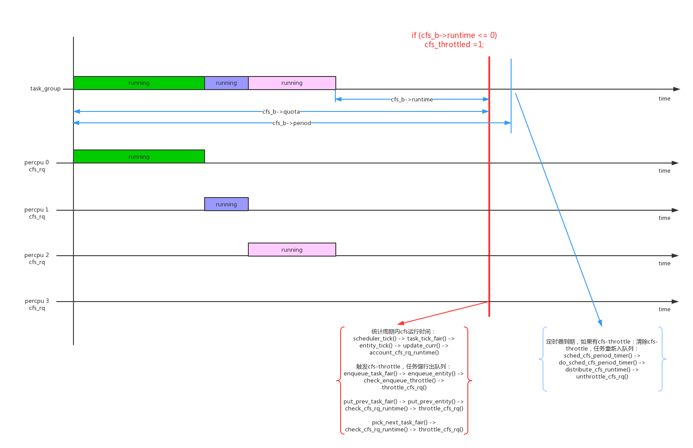

- 1、cfs bandwidth是针对task_group的配置，一个task_group的bandwidth使用一个struct cfs_bandwidth *cfs_b数据结构来控制。

```
struct cfs_bandwidth {
#ifdef CONFIG_CFS_BANDWIDTH
	raw_spinlock_t lock;
	ktime_t period;     // cfs bandwidth的监控周期，默认值是default_cfs_period() 0.1s
	u64 quota;          // cfs task_group 在一个监控周期内的运行时间配额，默认值是RUNTIME_INF，无限大
	u64 runtime;        // cfs task_group 在一个监控周期内剩余可运行的时间
	s64 hierarchical_quota;
	u64 runtime_expires;

	int idle, period_active;
	struct hrtimer period_timer;
	struct hrtimer slack_timer;
	struct list_head throttled_cfs_rq;

	/* statistics */
	int nr_periods, nr_throttled;
	u64 throttled_time;
#endif
};
```

其中几个关键的数据结构：cfs_b->period是监控周期，cfs_b->quota是tg的运行配额，cfs_b->runtime是tg剩余可运行的时间。cfs_b->runtime在监控周期开始的时候等于cfs_b->quota，随着tg不断运行不断减少，如果cfs_b->runtime < 0说明tg已经超过bandwidth，触发流量控制；

cfs bandwidth是提供给CGROUP_SCHED使用的，所以cfs_b->quota的初始值都是RUNTIME_INF无限大，所以在使能CGROUP_SCHED以后需要自己配置这些参数。

- 2、因为一个task_group是在percpu上都创建了一个cfs_rq，所以cfs_b->quota的值是这些percpu cfs_rq中的进程共享的，每个percpu cfs_rq在运行时需要向tg->cfs_bandwidth->runtime来申请；


```
scheduler_tick() -> task_tick_fair() -> entity_tick() -> update_curr() -> account_cfs_rq_runtime()

↓

static __always_inline
void account_cfs_rq_runtime(struct cfs_rq *cfs_rq, u64 delta_exec)
{
	if (!cfs_bandwidth_used() || !cfs_rq->runtime_enabled)
		return;

	__account_cfs_rq_runtime(cfs_rq, delta_exec);
}

|→

static void __account_cfs_rq_runtime(struct cfs_rq *cfs_rq, u64 delta_exec)
{
    /* (1) 用cfs_rq已经申请的时间配额(cfs_rq->runtime_remaining)减去已经消耗的时间 */
	/* dock delta_exec before expiring quota (as it could span periods) */
	cfs_rq->runtime_remaining -= delta_exec;
	
	/* (2) expire超期时间的判断 */
	expire_cfs_rq_runtime(cfs_rq);

    /* (3) 如果cfs_rq已经申请的时间配额还没用完，返回 */
	if (likely(cfs_rq->runtime_remaining > 0))
		return;

	/*
	 * if we're unable to extend our runtime we resched so that the active
	 * hierarchy can be throttled
	 */
	/* (4) 如果cfs_rq申请的时间配额已经用完，尝试向tg的cfs_b->runtime申请新的时间片
	    如果申请新时间片失败，说明整个tg已经没有可运行时间了，把本进程设置为需要重新调度，
	    在中断返回，发起schedule()时，发现cfs_rq->runtime_remaining<=0，会调用throttle_cfs_rq()对cfs_rq进行实质的限制
	 */
	if (!assign_cfs_rq_runtime(cfs_rq) && likely(cfs_rq->curr))
		resched_curr(rq_of(cfs_rq));
}

||→

static int assign_cfs_rq_runtime(struct cfs_rq *cfs_rq)
{
	struct task_group *tg = cfs_rq->tg;
	struct cfs_bandwidth *cfs_b = tg_cfs_bandwidth(tg);
	u64 amount = 0, min_amount, expires;

    /* (4.1) cfs_b的分配时间片的默认值是5ms */
	/* note: this is a positive sum as runtime_remaining <= 0 */
	min_amount = sched_cfs_bandwidth_slice() - cfs_rq->runtime_remaining;

	raw_spin_lock(&cfs_b->lock);
	if (cfs_b->quota == RUNTIME_INF)
	    /* (4.2) RUNTIME_INF类型，时间是分配不完的 */
		amount = min_amount;
	else {
		start_cfs_bandwidth(cfs_b);

        /* (4.3) 剩余时间cfs_b->runtime减去分配的时间片 */
		if (cfs_b->runtime > 0) {
			amount = min(cfs_b->runtime, min_amount);
			cfs_b->runtime -= amount;
			cfs_b->idle = 0;
		}
	}
	expires = cfs_b->runtime_expires;
	raw_spin_unlock(&cfs_b->lock);

    /* (4.4) 分配的时间片赋值给cfs_rq */
	cfs_rq->runtime_remaining += amount;
	/*
	 * we may have advanced our local expiration to account for allowed
	 * spread between our sched_clock and the one on which runtime was
	 * issued.
	 */
	if ((s64)(expires - cfs_rq->runtime_expires) > 0)
		cfs_rq->runtime_expires = expires;

    /* (4.5) 判断分配时间是否足够? */
	return cfs_rq->runtime_remaining > 0;
}

```


- 3、在enqueue_task_fair()、put_prev_task_fair()、pick_next_task_fair()这几个时刻，会check cfs_rq是否已经达到throttle，如果达到cfs throttle会把cfs_rq dequeue停止运行；

```
enqueue_task_fair() -> enqueue_entity() -> check_enqueue_throttle() -> throttle_cfs_rq()
put_prev_task_fair() -> put_prev_entity() -> check_cfs_rq_runtime() -> throttle_cfs_rq()
pick_next_task_fair() -> check_cfs_rq_runtime() -> throttle_cfs_rq()


static void check_enqueue_throttle(struct cfs_rq *cfs_rq)
{
	if (!cfs_bandwidth_used())
		return;

	/* an active group must be handled by the update_curr()->put() path */
	if (!cfs_rq->runtime_enabled || cfs_rq->curr)
		return;

    /* (1.1) 如果已经throttle，直接返回 */
	/* ensure the group is not already throttled */
	if (cfs_rq_throttled(cfs_rq))
		return;

	/* update runtime allocation */
	/* (1.2) 更新最新的cfs运行时间 */
	account_cfs_rq_runtime(cfs_rq, 0);
	
	/* (1.3) 如果cfs_rq->runtime_remaining<=0，启动throttle */
	if (cfs_rq->runtime_remaining <= 0)
		throttle_cfs_rq(cfs_rq);
}

/* conditionally throttle active cfs_rq's from put_prev_entity() */
static bool check_cfs_rq_runtime(struct cfs_rq *cfs_rq)
{
	if (!cfs_bandwidth_used())
		return false;

    /* (2.1) 如果cfs_rq->runtime_remaining还有运行时间，直接返回 */
	if (likely(!cfs_rq->runtime_enabled || cfs_rq->runtime_remaining > 0))
		return false;

	/*
	 * it's possible for a throttled entity to be forced into a running
	 * state (e.g. set_curr_task), in this case we're finished.
	 */
	/* (2.2) 如果已经throttle，直接返回 */
	if (cfs_rq_throttled(cfs_rq))
		return true;

    /* (2.3) 已经throttle，执行throttle动作 */
	throttle_cfs_rq(cfs_rq);
	return true;
}

static void throttle_cfs_rq(struct cfs_rq *cfs_rq)
{
	struct rq *rq = rq_of(cfs_rq);
	struct cfs_bandwidth *cfs_b = tg_cfs_bandwidth(cfs_rq->tg);
	struct sched_entity *se;
	long task_delta, dequeue = 1;
	bool empty;

	se = cfs_rq->tg->se[cpu_of(rq_of(cfs_rq))];

	/* freeze hierarchy runnable averages while throttled */
	rcu_read_lock();
	walk_tg_tree_from(cfs_rq->tg, tg_throttle_down, tg_nop, (void *)rq);
	rcu_read_unlock();

	task_delta = cfs_rq->h_nr_running;
	for_each_sched_entity(se) {
		struct cfs_rq *qcfs_rq = cfs_rq_of(se);
		/* throttled entity or throttle-on-deactivate */
		if (!se->on_rq)
			break;

        /* (3.1) throttle的动作1：将cfs_rq dequeue停止运行 */
		if (dequeue)
			dequeue_entity(qcfs_rq, se, DEQUEUE_SLEEP);
		qcfs_rq->h_nr_running -= task_delta;

		if (qcfs_rq->load.weight)
			dequeue = 0;
	}

	if (!se)
		sub_nr_running(rq, task_delta);

    /* (3.2) throttle的动作2：将cfs_rq->throttled置位 */
	cfs_rq->throttled = 1;
	cfs_rq->throttled_clock = rq_clock(rq);
	raw_spin_lock(&cfs_b->lock);
	empty = list_empty(&cfs_b->throttled_cfs_rq);

	/*
	 * Add to the _head_ of the list, so that an already-started
	 * distribute_cfs_runtime will not see us
	 */
	list_add_rcu(&cfs_rq->throttled_list, &cfs_b->throttled_cfs_rq);

	/*
	 * If we're the first throttled task, make sure the bandwidth
	 * timer is running.
	 */
	if (empty)
		start_cfs_bandwidth(cfs_b);

	raw_spin_unlock(&cfs_b->lock);
}

```


- 4、对每一个tg的cfs_b，系统会启动一个周期性定时器cfs_b->period_timer，运行周期为cfs_b->period。主要作用是period到期后检查是否有cfs_rq被throttle，如果被throttle恢复它，并进行新一轮的监控；

```
sched_cfs_period_timer() -> do_sched_cfs_period_timer()

↓

static int do_sched_cfs_period_timer(struct cfs_bandwidth *cfs_b, int overrun)
{
	u64 runtime, runtime_expires;
	int throttled;

	/* no need to continue the timer with no bandwidth constraint */
	if (cfs_b->quota == RUNTIME_INF)
		goto out_deactivate;

	throttled = !list_empty(&cfs_b->throttled_cfs_rq);
	cfs_b->nr_periods += overrun;

	/*
	 * idle depends on !throttled (for the case of a large deficit), and if
	 * we're going inactive then everything else can be deferred
	 */
	if (cfs_b->idle && !throttled)
		goto out_deactivate;

    /* (1) 新周期的开始，给cfs_b->runtime重新赋值为cfs_b->quota */
	__refill_cfs_bandwidth_runtime(cfs_b);

	if (!throttled) {
		/* mark as potentially idle for the upcoming period */
		cfs_b->idle = 1;
		return 0;
	}

	/* account preceding periods in which throttling occurred */
	cfs_b->nr_throttled += overrun;

	runtime_expires = cfs_b->runtime_expires;

	/*
	 * This check is repeated as we are holding onto the new bandwidth while
	 * we unthrottle. This can potentially race with an unthrottled group
	 * trying to acquire new bandwidth from the global pool. This can result
	 * in us over-using our runtime if it is all used during this loop, but
	 * only by limited amounts in that extreme case.
	 */
	/* (2) 解除cfs_b->throttled_cfs_rq中所有被throttle住的cfs_rq */
	while (throttled && cfs_b->runtime > 0) {
		runtime = cfs_b->runtime;
		raw_spin_unlock(&cfs_b->lock);
		/* we can't nest cfs_b->lock while distributing bandwidth */
		runtime = distribute_cfs_runtime(cfs_b, runtime,
						 runtime_expires);
		raw_spin_lock(&cfs_b->lock);

		throttled = !list_empty(&cfs_b->throttled_cfs_rq);

		cfs_b->runtime -= min(runtime, cfs_b->runtime);
	}

	/*
	 * While we are ensured activity in the period following an
	 * unthrottle, this also covers the case in which the new bandwidth is
	 * insufficient to cover the existing bandwidth deficit.  (Forcing the
	 * timer to remain active while there are any throttled entities.)
	 */
	cfs_b->idle = 0;

	return 0;

out_deactivate:
	return 1;
}

|→

static u64 distribute_cfs_runtime(struct cfs_bandwidth *cfs_b,
		u64 remaining, u64 expires)
{
	struct cfs_rq *cfs_rq;
	u64 runtime;
	u64 starting_runtime = remaining;

	rcu_read_lock();
	list_for_each_entry_rcu(cfs_rq, &cfs_b->throttled_cfs_rq,
				throttled_list) {
		struct rq *rq = rq_of(cfs_rq);

		raw_spin_lock(&rq->lock);
		if (!cfs_rq_throttled(cfs_rq))
			goto next;

		runtime = -cfs_rq->runtime_remaining + 1;
		if (runtime > remaining)
			runtime = remaining;
		remaining -= runtime;

		cfs_rq->runtime_remaining += runtime;
		cfs_rq->runtime_expires = expires;

        /* (2.1) 解除throttle */
		/* we check whether we're throttled above */
		if (cfs_rq->runtime_remaining > 0)
			unthrottle_cfs_rq(cfs_rq);

next:
		raw_spin_unlock(&rq->lock);

		if (!remaining)
			break;
	}
	rcu_read_unlock();

	return starting_runtime - remaining;
}

||→

void unthrottle_cfs_rq(struct cfs_rq *cfs_rq)
{
	struct rq *rq = rq_of(cfs_rq);
	struct cfs_bandwidth *cfs_b = tg_cfs_bandwidth(cfs_rq->tg);
	struct sched_entity *se;
	int enqueue = 1;
	long task_delta;

	se = cfs_rq->tg->se[cpu_of(rq)];

	cfs_rq->throttled = 0;

	update_rq_clock(rq);

	raw_spin_lock(&cfs_b->lock);
	cfs_b->throttled_time += rq_clock(rq) - cfs_rq->throttled_clock;
	list_del_rcu(&cfs_rq->throttled_list);
	raw_spin_unlock(&cfs_b->lock);

	/* update hierarchical throttle state */
	walk_tg_tree_from(cfs_rq->tg, tg_nop, tg_unthrottle_up, (void *)rq);

	if (!cfs_rq->load.weight)
		return;

	task_delta = cfs_rq->h_nr_running;
	for_each_sched_entity(se) {
		if (se->on_rq)
			enqueue = 0;

		cfs_rq = cfs_rq_of(se);
		/* (2.1.1) 重新enqueue运行 */
		if (enqueue)
			enqueue_entity(cfs_rq, se, ENQUEUE_WAKEUP);
		cfs_rq->h_nr_running += task_delta;

		if (cfs_rq_throttled(cfs_rq))
			break;
	}

	if (!se)
		add_nr_running(rq, task_delta);

	/* determine whether we need to wake up potentially idle cpu */
	if (rq->curr == rq->idle && rq->cfs.nr_running)
		resched_curr(rq);
}

```


### 2.2.8、sched sysctl参数

系统在sysctl中注册了很多sysctl参数供我们调优使用，在"/proc/sys/kernel/"目录下可以看到：

```
 # ls /proc/sys/kernel/sched_*
sched_cfs_boost                         
sched_child_runs_first          // fork子进程后，子进程是否先于父进程运行
sched_latency_ns                // 计算cfs period，如果runnable数量小于sched_nr_latency，返回的最小period值，单位ns     
sched_migration_cost_ns                 
sched_min_granularity_ns        // 计算cfs period，如果runnable数量大于sched_nr_latency，每个进程可占用的时间，单位ns
                                // cfs period = nr_running * sysctl_sched_min_granularity;
sched_nr_migrate                        
sched_rr_timeslice_ms           // SCHED_RR类型的rt进程每个时间片的大小，单位ms
sched_rt_period_us              // rt-throttle的计算周期
sched_rt_runtime_us             // 一个rt-throttle计算周期内，rt进程可运行的时间
sched_shares_window_ns
sched_time_avg_ms               // rt负载(rq->rt_avg)的老化周期
sched_tunable_scaling
sched_wakeup_granularity_ns

```

kern_table[]中也有相关的定义：

```
static struct ctl_table kern_table[] = {
	{
		.procname	= "sched_child_runs_first",
		.data		= &sysctl_sched_child_runs_first,
		.maxlen		= sizeof(unsigned int),
		.mode		= 0644,
		.proc_handler	= proc_dointvec,
	},
#ifdef CONFIG_SCHED_DEBUG
	{
		.procname	= "sched_min_granularity_ns",
		.data		= &sysctl_sched_min_granularity,
		.maxlen		= sizeof(unsigned int),
		.mode		= 0644,
		.proc_handler	= sched_proc_update_handler,
		.extra1		= &min_sched_granularity_ns,
		.extra2		= &max_sched_granularity_ns,
	},
	{
		.procname	= "sched_latency_ns",
		.data		= &sysctl_sched_latency,
		.maxlen		= sizeof(unsigned int),
		.mode		= 0644,
		.proc_handler	= sched_proc_update_handler,
		.extra1		= &min_sched_granularity_ns,
		.extra2		= &max_sched_granularity_ns,
	},
	{
		.procname	= "sched_wakeup_granularity_ns",
		.data		= &sysctl_sched_wakeup_granularity,
		.maxlen		= sizeof(unsigned int),
		.mode		= 0644,
		.proc_handler	= sched_proc_update_handler,
		.extra1		= &min_wakeup_granularity_ns,
		.extra2		= &max_wakeup_granularity_ns,
	},
#ifdef CONFIG_SMP
	{
		.procname	= "sched_tunable_scaling",
		.data		= &sysctl_sched_tunable_scaling,
		.maxlen		= sizeof(enum sched_tunable_scaling),
		.mode		= 0644,
		.proc_handler	= sched_proc_update_handler,
		.extra1		= &min_sched_tunable_scaling,
		.extra2		= &max_sched_tunable_scaling,
	},
	{
		.procname	= "sched_migration_cost_ns",
		.data		= &sysctl_sched_migration_cost,
		.maxlen		= sizeof(unsigned int),
		.mode		= 0644,
		.proc_handler	= proc_dointvec,
	},
	{
		.procname	= "sched_nr_migrate",
		.data		= &sysctl_sched_nr_migrate,
		.maxlen		= sizeof(unsigned int),
		.mode		= 0644,
		.proc_handler	= proc_dointvec,
	},
	{
		.procname	= "sched_time_avg_ms",
		.data		= &sysctl_sched_time_avg,
		.maxlen		= sizeof(unsigned int),
		.mode		= 0644,
		.proc_handler	= proc_dointvec,
	},
	{
		.procname	= "sched_shares_window_ns",
		.data		= &sysctl_sched_shares_window,
		.maxlen		= sizeof(unsigned int),
		.mode		= 0644,
		.proc_handler	= proc_dointvec,
	},
#endif /* CONFIG_SMP */

#endif /* CONFIG_SCHED_DEBUG */
	{
		.procname	= "sched_rt_period_us",
		.data		= &sysctl_sched_rt_period,
		.maxlen		= sizeof(unsigned int),
		.mode		= 0644,
		.proc_handler	= sched_rt_handler,
	},
	{
		.procname	= "sched_rt_runtime_us",
		.data		= &sysctl_sched_rt_runtime,
		.maxlen		= sizeof(int),
		.mode		= 0644,
		.proc_handler	= sched_rt_handler,
	},
	{
		.procname	= "sched_rr_timeslice_ms",
		.data		= &sched_rr_timeslice,
		.maxlen		= sizeof(int),
		.mode		= 0644,
		.proc_handler	= sched_rr_handler,
	},
#ifdef CONFIG_SCHED_AUTOGROUP
	{
		.procname	= "sched_autogroup_enabled",
		.data		= &sysctl_sched_autogroup_enabled,
		.maxlen		= sizeof(unsigned int),
		.mode		= 0644,
		.proc_handler	= proc_dointvec_minmax,
		.extra1		= &zero,
		.extra2		= &one,
	},
#endif
#ifdef CONFIG_CFS_BANDWIDTH
	{
		.procname	= "sched_cfs_bandwidth_slice_us",
		.data		= &sysctl_sched_cfs_bandwidth_slice,
		.maxlen		= sizeof(unsigned int),
		.mode		= 0644,
		.proc_handler	= proc_dointvec_minmax,
		.extra1		= &one,
	},
#endif
#ifdef CONFIG_SCHED_TUNE
	{
		.procname	= "sched_cfs_boost",
		.data		= &sysctl_sched_cfs_boost,
		.maxlen		= sizeof(sysctl_sched_cfs_boost),
#ifdef CONFIG_CGROUP_SCHEDTUNE
		.mode		= 0444,
#else
		.mode		= 0644,
#endif
		.proc_handler	= &sysctl_sched_cfs_boost_handler,
		.extra1		= &zero,
		.extra2		= &one_hundred,
	},
#endif

}
```


### 2.2.9、"/proc/sched_debug"

在/proc/sched_debug中会打印出详细的schedule相关的信息，对应的代码在"kernel/sched/debug.c"中实现：

```
# cat /proc/sched_debug
Sched Debug Version: v0.11, 4.4.22+ #95
ktime                                   : 1036739325.473178
sched_clk                               : 1036739500.521349
cpu_clk                                 : 1036739500.521888
jiffies                                 : 4554077128

sysctl_sched
  .sysctl_sched_latency                    : 10.000000
  .sysctl_sched_min_granularity            : 2.250000
  .sysctl_sched_wakeup_granularity         : 2.000000
  .sysctl_sched_child_runs_first           : 0
  .sysctl_sched_features                   : 233275
  .sysctl_sched_tunable_scaling            : 0 (none)

cpu#0: Online
  .nr_running                    : 1                    // rq->nr_running，rq中总的可运行进程数，包括cfs_rq + cfs_rq + dl_rq
  .load                          : 1024                 // rq->load.weight，rq总的weight值
  .nr_switches                   : 288653745
  .nr_load_updates               : 102586831
  .nr_uninterruptible            : 386195
  .next_balance                  : 4554.077177
  .curr->pid                     : 5839                 // rq->curr当前进程的pid
  .clock                         : 1036739583.441965    // rq总的运行时间，单位s
  .clock_task                    : 1036739583.441965    // rq总的task运行时间，单位s
  .cpu_load[0]                   : 178                  // cpu级别的负载值，rq->cpu_load[]
  .cpu_load[1]                   : 341
  .cpu_load[2]                   : 646
  .cpu_load[3]                   : 633
  .cpu_load[4]                   : 448
  .yld_count                     : 495661
  .sched_count                   : 290639530
  .sched_goidle                  : 95041623
  .avg_idle                      : 66000
  .max_idle_balance_cost         : 33000
  .ttwu_count                    : 169556205
  .ttwu_local                    : 156832675

cfs_rq[0]:/bg_non_interactive                           // 叶子cfs_rq，“/bg_non_interactive ”
  .exec_clock                    : 2008394.796159       // cfs_rq->exec_clock)
  .MIN_vruntime                  : 0.000001
  .min_vruntime                  : 4932671.018182
  .max_vruntime                  : 0.000001
  .spread                        : 0.000000
  .spread0                       : -148755265.877002
  .nr_spread_over                : 5018
  .nr_running                    : 0                    // cfs_rq->nr_running，cfs_rq中总的可运行进程数
  .load                          : 0                    // cfs_rq->load.weight
  .load_avg                      : 0                    // cfs_rq->avg.load_avg
  .runnable_load_avg             : 0                    // cfs_rq->runnable_load_avg
  .util_avg                      : 0                    // cfs_rq->avg.util_avg
  .removed_load_avg              : 0
  .removed_util_avg              : 0
  .tg_load_avg_contrib           : 0
  .tg_load_avg                   : 943
  .se->exec_start                : 1036739470.724118    // print_cfs_group_stats()，se = cfs_rq->tg->se[cpu]
  .se->vruntime                  : 153687902.677263
  .se->sum_exec_runtime          : 2008952.798927
  .se->statistics.wait_start     : 0.000000
  .se->statistics.sleep_start    : 0.000000
  .se->statistics.block_start    : 0.000000
  .se->statistics.sleep_max      : 0.000000
  .se->statistics.block_max      : 0.000000
  .se->statistics.exec_max       : 384.672539
  .se->statistics.slice_max      : 110.416539
  .se->statistics.wait_max       : 461.053539
  .se->statistics.wait_sum       : 4583320.426021
  .se->statistics.wait_count     : 4310369
  .se->load.weight               : 2
  .se->avg.load_avg              : 0
  .se->avg.util_avg              : 0

cfs_rq[0]:/                                             // 根cfs_rq，“/”
  .exec_clock                    : 148912219.736328
  .MIN_vruntime                  : 0.000001
  .min_vruntime                  : 153687936.895184
  .max_vruntime                  : 0.000001
  .spread                        : 0.000000
  .spread0                       : 0.000000
  .nr_spread_over                : 503579
  .nr_running                    : 1
  .load                          : 1024
  .load_avg                      : 4815
  .runnable_load_avg             : 168
  .util_avg                      : 63
  .removed_load_avg              : 0
  .removed_util_avg              : 0
  .tg_load_avg_contrib           : 4815
  .tg_load_avg                   : 9051

rt_rq[0]:/bg_non_interactive                            // 叶子rt_rq，“/bg_non_interactive ”
  .rt_nr_running                 : 0
  .rt_throttled                  : 0
  .rt_time                       : 0.000000
  .rt_runtime                    : 700.000000

rt_rq[0]:/                                              // 根rt_rq，“/”
  .rt_nr_running                 : 0
  .rt_throttled                  : 0
  .rt_time                       : 0.000000
  .rt_runtime                    : 800.000000

dl_rq[0]:                                               // dl_rq
  .dl_nr_running                 : 0

runnable tasks:                                         // 并不是rq中现在的runnable进程，而是逐个遍历进程，看看哪个进程最后是在当前cpu上运行。很多进程现在是睡眠状态；
                                                        // 上述的rq->nr_running=1，只有一个进程处于runnable状态。但是打印出了几十条睡眠状态的进程；
                                                        
                                                        // 第一列"R"，说明是当前运行的进程rq->curr
                                                        // "tree-key"，p->se.vruntime               // 进程的vruntime
                                                        // "wait-time"，p->se.statistics.wait_sum   // 进程在整个运行队列中的时间，runnable+running时间
                                                        // "sum-exec"，p->se.sum_exec_runtime       // 进程的执行累加时间,running时间
                                                        // "sum-sleep"，p->se.statistics.sum_sleep_runtime  // 进程的睡眠时间

            task   PID         tree-key  switches  prio     wait-time             sum-exec        sum-sleep
----------------------------------------------------------------------------------------------------------
            init     1 153554847.251576     11927   120     23938.628500     23714.949808 1036236697.068574 /
        kthreadd     2 153613100.582264      7230   120      4231.780138     11601.352220 1036459940.732829 /
     ksoftirqd/0     3 153687920.598799   2123535   120   2612543.672044    485896.233949 1033641057.952048 /
    kworker/0:0H     5       867.040456         6   100         1.690538         2.306692     13011.504340 /
     rcu_preempt     7 153687932.055261  38012901   120  19389366.435276   4762068.709434 1012596083.722693 /
       rcu_sched     8 153687932.006723   9084101   120   9536442.439335    832973.285818 1026372474.208896 /
          rcu_bh     9        44.056109         2   120         3.062001         0.071692         0.000000 /
     migration/0    10         0.000000    810915     0         0.157999   1405490.418215         0.000000 /
       writeback    41  75740016.734657        11   100         6.979694        22.657923 515725974.508217 /
        cfg80211    68 145389776.829002        16   100        19.614385        22.409536 981346170.111828 /
     pmic_thread    69        -4.853692        59     1         0.000000       416.570075     90503.424677 /
   cfinteractive    70         0.000000   6128239     0         0.000000    835706.912900         0.000000 /
     ion_history    74 153687775.391059   1077475   120    598925.096753    155563.560671 1035979729.028569 /
          vmstat    88 153613102.428420       581   100       628.318084       213.543232 1036470246.848623 /
          bioset   124       413.230915         2   100         0.000000         0.091461         0.065000 /
 mt_gpufreq_inpu   135         0.000000        51     0         0.000000         2.947619         0.000000 /
   kworker/u20:2   165 153687842.212961  19921527   120   1900166.780690   3504856.564055 1031329325.876435 /
      disp_check   168         0.000000    345697    12         0.000000    254109.286291         0.049692 /
 disp_delay_trig   172         0.000000     25049     5         0.000000      8460.322268         0.050769 /
 kpi_wait_4_hw_v   184  77456637.322727     15150   120     17756.340357      2238.503671 525392630.298747 /
 teei_switch_thr   202         0.000000       150    49         0.000000      4726.615934         0.000000 /
     hang_detect   204         0.000000     34740     0         0.000000    190287.797938         0.063154 /
  irq/680-stk_ps   220         0.000000         6    49         0.193308         0.703539         0.000000 /
 sub_touch_resum   224       457.923116         2   100         0.000000         0.085691         0.046539 /
 irq/677-sub_tou   226         0.000000         2    49         0.000000         0.073847         0.000000 /
 irq/672-fuelg_i   228         0.000000         4    49         0.000000         0.415462         0.000000 /
 irq/845-primary   230         0.000000         2    49         0.000000         0.074847         0.000000 /
  dm_bufio_cache   231  61370971.457226         3   100         0.000000         0.924077 410081439.629970 /
 binder_watchdog   233 153687520.358159    529297   120    133539.189144     70472.061275 1036525567.186647 /
    cs35l35_eint   235       624.068320         2   100         0.000000         0.091923         0.049693 /
 ipi_cpu_dvfs_rt   240 153687569.261082   4721359   120   3352016.787765   1096346.814808 1032281259.787992 /
        hps_main   248 153687929.657234  24442793   100  11377751.354137  44892964.862782 980455478.318003 /
           pd_wq   251       692.938392         2   100         0.000000         0.254461         0.050000 /
         pd_task   254         0.000000   9095537    98         0.000000   1645126.407931         0.031231 /
  pvr_defer_free   257 151412505.141936      2089   139      1592.921777      1280.969986 1023235084.781867 /
  pvr_device_wdg   258 153178077.742167       379   120       242.453158        56.183535 1034057592.348265 /
             mwp   259       744.637922         3   100         0.024154         0.092615         0.100154 /
 dsx_rebuild_wor   267       753.712295         2   100         0.018384         0.100231         0.044077 /
          wdtk-0   273         0.000000     51867     0       223.511770     83562.991491         0.044230 /
          wdtk-2   275         0.310307     91023     0         7.662692     10810.010102         0.037154 /
          wdtk-3   276         0.000000     57334     0         0.082539      7904.126023         4.045230 /
          wdtk-4   277         0.000000    163449     0         0.102538     26621.315643         4.056077 /
          wdtk-5   278         0.000000     93033     0         0.771692     11306.508550         4.061615 /
          wdtk-6   280         0.000000     64678     0         0.490461      7293.603126         4.060538 /
          wdtk-7   281         0.000000     56991     0         0.545615      8033.133066         4.036615 /
          wdtk-8   282         0.007228    161917     0         0.490693     24287.956471         4.015231 /
          wdtk-9   283         0.000000     75886     0         0.337153      7588.440841         4.041154 /
 test_report_wor   287       771.952673         2   100         0.000000         0.084769         0.036000 /
    kworker/0:1H   299 153685958.573414    448410   100     58503.103145     82742.839000 1036576533.452228 /
         ueventd   301 153656034.928627     15997   120     11669.503522     30437.800780 1036570321.312576 /
    jbd2/sdc40-8   313 153685266.285982    396029   120    211212.571451    243355.373101 1036254798.655632 /
 ext4-rsv-conver   314      1322.048935         2   100         0.000000         0.449385         0.156692 /
 ext4-rsv-conver   319      1347.134123         2   100         0.000000         0.441845         0.152924 /
 ext4-rsv-conver   334      1417.595511         2   100         1.169616         0.066769         0.151307 /
     logd.daemon   354      9386.287600         9   118         1.011306         6.314232     31502.758998 /
     logd.writer   357 153687530.563333   4564190   118  11079641.119214   3866510.152188 1021777212.794489 /
      logd.klogd   367 153687933.066482  12443269   118  13962178.199616  13536643.532358 1009225310.240325 /
     logd.auditd   368 151566168.672440       664   118       174.122396      1168.889001 1023473784.526020 /
 logd.reader.per 25015 153687529.628782   3044070   118   5119327.722443   3596227.191390 611872098.002749 /
         ut_tlog   351 153687782.507327   1045264   120    281668.596996    111876.661992 1036325851.851125 /
     Secure Call   352      1429.938486         3   100         0.655616         0.292616         4.131307 /
       Bdrv Call   353      1430.041237         3   100         1.754154         0.239693         4.057077 /
         kauditd   359 151566168.493297       673   120       183.702927       116.953237 1023475499.246642 /
            vold   361 153474746.984645      1171   120       606.838765       528.611148 1036003350.481839 /
            vold   369 153656032.048396     13109   120      6961.612001      2795.667768 1036595788.335188 /
         healthd   375 153656044.500243     81262   120    161350.025885     79773.132743 1036363134.366245 /
    wmt_launcher   379 153687737.287803    529032   120    118096.450849    111012.409314 1036487544.290047 /
        ccci_fsd   380     12189.138243      5591   120      1909.518922      1859.451641     30157.790568 /
     ccci_mdinit   639 152601161.552368       235   120       286.497775        85.485541 1031001695.298508 /
  servicemanager   386 153687009.935692    331057   120     60490.993040    225025.657411 1036428012.292706 /
    Binder:387_1   569 153673962.710154     37011   120     16969.489097     10516.923471 1036631468.909174 /
        DispSync   570  77463667.708510     13571   111     11461.844394      2109.549787 525386479.722018 /
      SWWatchDog   571  77456659.518056       472   112       814.071314      1794.955533 525392376.724733 /
 UEventThreadHWC   598 153656031.843303     12856   112      2426.674847      1981.053513 1036597333.247354 /
     EventThread   665 153674020.380964    154583   111     24005.323746     39757.314747 1036594592.994222 /
   POSIX timer 1   666  77463665.520152       912   112      5421.412950       235.493060 525393470.823115 /
     EventThread   667  77463667.698380     12525   111      1056.579887      1495.701448 525396630.173625 /
 FpsPolicyTracke   702  77463667.723313      1187   120      1198.624090        80.131910 525397668.998965 /
        DispSync  1004  77463667.697161      7586   111       664.793393       816.670690 525394660.200500 /
    Binder:387_4  1342 153654956.018618     36048   120     15901.789224      9803.040051 1036556753.030703 /
    Binder:387_5  1940 153674007.822615     35607   120     16223.410715      9976.729711 1036608951.069827 /
          mtkmal   661      3661.416310         4   120         0.000000         1.598692      5697.205091 /
          mtkmal   663  77445022.732913       225   120       155.111313        53.880768 525390350.424944 /
          mtkmal   669  77445023.629606       305   120        94.783850       151.207084 525390304.632178 /
          mtkmal   671  77445022.990682       191   120       113.968152        44.631693 525390385.130178 /
          mtkmal   678 152475995.133042       161   120        39.026462        42.700918 1030000416.276366 /
          mtkmal   682      2778.475734         7   120         8.099923         0.318693      4309.718933 /
          mtkmal   684      3661.244943        13   120        11.790309         2.044921      5597.420014 /
          mtkmal   718  77445022.557837       131   120       153.523075        12.365926 525390133.711180 /
          mtkmal   734 153687521.348390    108018   120    181961.836117    101014.633238 1036429717.927166 /
          mtkmal  1851      6974.069888         2   120         0.512769         0.163308         0.000000 /
   POSIX timer 4  2811 153687521.439237    108769   120     43446.351322    109359.509249 1036527221.276171 /
    atci_service   391 153687674.710468    209757   120     47042.339325     34923.832801 1036634061.208546 /
          flymed   394 153477230.289829      1217   120       273.883295       486.930643 1036007855.567517 /
 mobile_log_d.wc   506 141237736.186348        89   120       289.837463       107.019845 950555096.389882 /
 mobile_log_d.rd 25016 153687930.745569   6882189   120  14953859.136289  13240534.261943 592393177.946476 /
 mobile_log_d.wr 25017 153678844.144937    244541   120    596458.050128    787803.568717 619164112.957003 /
         netdiag   405 141237342.607831       112   120       460.393235       376.842928 950555221.569565 /
       mtk_agpsd   474 153374191.634415      3403   120     12677.808115      5107.769034 1035337663.690361 /
       mtk_agpsd   841 153687840.736730   2147544   120    473399.968559    667501.048409 1035571519.822825 /
       mtk_agpsd  1171 153687770.514828   1088984   120    263201.510383    199509.752374 1036244336.253205 /
    mtkFlpDaemon   415      6840.625397         2   120        33.284307         3.262384     23108.778902 /
 thermalloadalgo   413 153687898.801494    339396   120    199927.385588    403353.957413 1036113673.985265 /
         thermal   422 153687095.661054   1044690   120   4462586.728269    889161.434459 1031361671.163426 /
        thermald   423 153687155.456223     10504   120      2848.238660      1840.668258 1036708867.436449 /
  batterywarning   440 153685708.507369    116056   120     35721.661430    164753.143311 1036506414.448146 /
   POSIX timer 1   630      1585.897410         2   120        18.623538         0.225924         3.299769 /
   POSIX timer 5   636      1589.659892         2   120        13.396539         0.161076         0.000000 /
   POSIX timer 7   643      1604.389803         1   120        12.961769         0.105000         0.000000 /
            mnld   644 141238163.728622        63   120        54.939462        65.431306 950553624.565953 /
            MPED   496 141196342.567062        43   120       895.585007       158.467918 950400044.926280 /
       wifi2agps   505 153374190.351338      2683   120      7730.432798      2788.876705 1035344823.135785 /
     utgate_tlog   514 153687737.255265   1045413   120    281761.049313    113900.496416 1036319696.719148 /
      AudioOut_D   811  77423572.027703      6631   102      6416.165867      5234.485977 525319030.522598 /
  watchDogThread   818 153687899.963725   1059915   120    210673.948928    257611.952139 1036244853.299636 /
    Binder:547_2  4943   6503838.926647       369   120        38.477388       127.843998    980298.123104 /
        installd   549 141220149.178842     17422   120     13418.647450     33493.160461 950409754.346123 /
    Binder:556_2   556 142104903.101144      1316   120       920.215623      2613.435619 957625545.508583 /
            netd  1317 153656032.057473     12911   120      6132.675035      2951.387186 1036578597.684687 /
            netd  1318 153374190.925194      4134   120     11135.394577      4135.800240 1035324323.853964 /
            netd  1319      5431.697961         1   120         0.000000         0.087692         0.000000 /
            netd  1320      5436.799650         1   120         0.000000         0.101692         0.000000 /
            netd  1321      5441.983800         3   120         0.000000         0.184153         0.053539 /
            netd  1323 152478198.472391       105   120        31.755690        93.771539 1030009624.229153 /
            netd  1324      5991.620423         3   120         0.059615         0.512231      2836.775392 /
    Binder:556_1  1326 142104887.497373       218   120       166.588700        60.492451 957614183.463558 /
    Binder:556_3  1477 142104887.497066       193   120       119.942772        40.034222 957608875.916163 /
    Binder:556_4  1479 142104887.518912       188   120       116.159925        43.184541 957608840.780691 /
    Binder:556_5  1481 142104887.516605       193   120       106.840998        47.108921 957608809.474699 /
    Binder:556_6  1492 142104887.495758       175   120       139.239848        41.452539 957608640.656693 /
    Binder:556_7  1553 142104887.496527       171   120       146.211150        62.160151 957607996.415620 /
    Binder:556_8  2094 142104887.520373       133   120       122.075769        36.036701 957601618.554284 /
    Binder:556_9  7057 142104887.517527        57   120        66.348611        13.755926 435000933.554842 /
    Binder:556_A 17406 142104887.514989        14   120        34.960308         4.101462  87600285.819691 /
  mpower_manager   559 153687897.737416   2058840   120    650550.766640    301419.435846 1035763439.272171 /
       perfprofd   562 152351479.437254       163   120        92.279305       176.774769 1029052135.266795 /
   pvr_workqueue   588  26362955.609802         8   100         8.554077         3.945845 135759507.652276 /
   pvr_workqueue   590  26362511.370661         5   100         9.110616         0.915768 135759481.943198 /
  ksdioirqd/mmc0   654         0.000000    117198    98         6.680308     32557.476254         0.000000 /
  md1_tx1_worker   705 153444892.135341       287   100       297.604536        76.314079 1035848754.686920 /
  md1_rx1_worker   721 153583222.762631       106   100       244.276380        18.966851 1036352476.341197 /
       debuggerd   791         0.630538      3574    71        32.939997      7428.480093         0.000000 /
     debuggerd64   792         0.000000      3688    71         3.024383      6583.963700         0.000000 /
   mdl_sock_host   829 141249041.826680        30   120        72.073771        22.491925 950555026.052644 /
     gsm0710muxd   801 153687214.560068    218292   120     75692.773063    184409.357043 1036450373.720321 /
     gsm0710muxd   876 153687527.227620    890806   120   5312280.396414   1466623.069152 1029932424.739024 /
     gsm0710muxd   877 153687522.851544    394180   120    743239.234510    570686.925671 1035397099.085414 /
     gsm0710muxd   880 153687523.645931    156234   120    487674.432388    283788.535172 1035939540.574625 /
     gsm0710muxd   881 139142375.948393        20   120         2.802540        18.009922 936696798.663608 /
     gsm0710muxd   882 153685959.385982    156328   120    170389.685231    301043.854569 1036232458.732792 /
     gsm0710muxd   889     10768.359351         9   120         0.483231         2.677231     27507.196680 /
   mdl_sock_host   838 141249047.147373        30   120        28.144001        20.794536 950554967.232957 /
         viarild   840      2063.699187         2   120         6.901615         0.164154         0.000000 /
         viarild   871 153687310.944561    213639   120     62270.218233     83803.863806 1036564286.141243 /
         viarild   872 153687737.756496    217191   120     63014.313662    146525.224954 1036502324.133367 /
         mtkrild   929 153687520.333774    347988   120    132221.700444     26801.640361 1036551734.599106 /
         mtkrild   931 153687520.331621    348108   120    133117.404515     26691.766296 1036550947.317260 /
         mtkrild   933 153687520.402929    479465   120    331792.023591    345246.430652 1036033729.862808 /
         mtkrild   934 153687520.331775    348069   120    132799.233182     26599.578068 1036551355.411042 /
         mtkrild   935 153687520.341929    348078   120    133441.763279     26741.501223 1036550570.000391 /
         mtkrild   936 153687520.332313    348046   120    133788.852808     26777.614211 1036550184.801253 /
         mtkrild   937 153687520.331775    348043   120    133228.990770     26875.716348 1036550649.353324 /
         mtkrild   938 153687520.332467    348038   120    133501.124365     26662.167095 1036550589.456369 /
         mtkrild   939 153687520.331929    348061   120    132156.945460     26586.273902 1036552009.306371 /
         mtkrild   940 153687520.334005    348030   120    133021.017114     26700.422558 1036551031.429836 /
         mtkrild   941 153687520.332621    348269   120    133436.975066     26864.353104 1036550451.167977 /
         mtkrild   942 153687520.333005    348100   120    133154.415619     26837.357255 1036550760.611566 /
         mtkrild   943 153687520.353082    348038   120    133009.144451     26694.200364 1036551050.495802 /
         mtkrild   944 153687520.337852    348071   120    132950.072433     26756.505593 1036551044.787110 /
         mtkrild   945 153687520.333544    348083   120    133514.303721     26838.344276 1036550399.324903 /
         mtkrild   946 153687520.332620    348052   120    133207.367309     26844.250568 1036550699.317478 /
         mtkrild   947 153687520.330698    348113   120    133400.468989     26808.496775 1036550541.446747 /
         mtkrild   949 153687520.332928    348052   120    133417.180604     26858.239306 1036550472.776347 /
         mtkrild   950 153687520.333160    348027   120    133224.433808     26717.650995 1036550805.224187 /
         mtkrild   951 153687522.374083   2754901   120   2550376.949017    658618.042882 1033501808.790758 /
         mtkrild   953     10785.121762        42   120         7.201923        29.732541     27506.773143 /
         mtkrild   956  77445024.512068       302   120       196.371228       212.220923 525387908.394873 /
         mtkrild   958 139142451.059438        27   120         5.617921        11.390847 936696615.508380 /
         mtkrild   959 153685958.452443    231013   120     90066.001122    145704.528784 1036467955.730875 /
         mtkrild   969     10768.257768        19   120         6.373771         4.768849     27341.750907 /
         mtkrild  1086  77445022.840913       125   120       131.736455        40.676161 525386206.945787 /
        rilproxy  1023      2549.934229         1   120         0.030077         0.166616         0.000000 /
 Ril Proxy reque  1047 153687520.769313    106931   120     17870.276454     52232.745454 1036639095.001220 /
 Ril Proxy reque  1049  77445023.025067       259   120        97.129004        76.282690 525386587.347481 /
        rilproxy  1052 139142374.598801       255   120        75.081840        23.904236 936694971.100527 /
   disp_queue_P0  1067         0.000000      7509     5         0.000000      6663.293293         0.065308 /
 ReferenceQueueD  1081 153682594.530032    211902   120     64560.326125     55233.173286 1036568501.426237 /
 FinalizerDaemon  1082 153682594.765725    170186   120     26702.126008     38259.289937 1036623415.578785 /
 FinalizerWatchd  1083 153687276.748512    102967   120     38357.037158     15650.622791 1036653865.675069 /
  HeapTaskDaemon  1084 153683632.246834    136781   120    126921.006335    456707.330349 1036109382.086557 /
   Binder:1074_1  1088 153682111.709561    122841   120     78872.844413    146079.569769 1036461599.469990 /
   Binder:1074_2  1089 153686856.027901    122796   120     80204.474188    145200.814182 1036480185.545158 /
   Binder:1074_3  1097 153685009.264302    122627   120     76696.735939    146568.223790 1036474099.052120 /
 MessageMonitorS  1100      2830.202676         5   120         0.318616         2.436076         0.560385 /
 ActivityManager  1103 153676383.299721    239709   120    263545.893262    584063.260455 1035815536.534049 /
 batterystats-sy  1108 153656039.928935     14942   120     12781.432829     32676.181237 1036551257.560695 /
    FileObserver  1121 151366817.419279       825   120        65.442466       297.350079 1023092619.021270 /
      android.fg  1123 153683533.983685    297083   120    105632.072176     98216.273033 1036487470.663107 /
 AnrMonitorThrea  1130 153675160.550742     49419   120     52845.788084     11755.937488 1036592795.293345 /
   system_server  1139 153686066.363307     91600   118     57301.637256    299581.131167 1036344126.422679 /
  PackageManager  1151   2123074.948987      4759   130      1240.195620      2312.241251 415972413.085622 /bg_non_interactive
   system_server  1328 153687842.490267  10515299   120   1661287.673016   4523982.148734 1030514093.832906 /
 SensorEventAckR  1329  77380587.602801        25   112        81.965156         3.918613 525299961.227505 /
   SensorService  1330 124660459.026176     11820   112       821.968447      3822.534369 842018700.920537 /
 CameraService_p  1331      5562.977288         2   116         0.000000         1.979615         0.270770 /
    AlarmManager  1333 153673687.683329    323475   120    440593.614441    313146.408706 1035888638.673051 /
 InputDispatcher  1338 153683532.159714     65434   120      2443.774990      9054.607951 1036669512.885258 /
     InputReader  1339 153683532.081450     69434   112       730.607083     18352.768368 1036661926.944220 /
 UsageStatsManag  1352 141279253.303851        33   120       127.911920        11.011152 950737091.215010 /
 RecordEventThre  1357 141279298.263923       305   120       248.339698       168.402070 950736943.730005 /
 ConnectivitySer  1363      9598.972239        33   120        34.935611         9.438923     11220.329723 /
          ranker  1372   4565371.160528       384   130      1349.076921       417.196927 950546588.719088 /bg_non_interactive
        Thread-2  1380 153687523.448852    180049   120    398656.719490    360551.032935 1035936896.261191 /
  UEventObserver  1382 153656032.077319     12889   120      4584.844190      2768.674498 1036577008.248908 /
 LazyTaskWriterT  1399  77424893.172705       581   120       411.879232      3258.867779 525315760.112617 /
        Thread-6  1407  62235633.721656        18   120       433.368077         7.805001 416049482.146046 /
     WifiMonitor  1554 153685586.307786     58189   120     79983.829818     49360.832359 1036555234.885332 /
   Binder:1074_4  1559 153687007.436001    123117   120     80382.236938    146363.086260 1036463979.975185 /
   Binder:1074_5  1581 153685232.851598    122911   120     78403.314388    146576.526616 1036457766.535833 /
        watchdog  1586 153683534.136868    190448   120    379190.269123    130147.942387 1036166833.749468 /
   Binder:1074_6  1702 153684512.972293    121830   120     77062.555248    144379.772867 1036456834.918037 /
   Binder:1074_7  1703 153685926.719162    122133   120     76991.508773    145227.034814 1036462079.016466 /
   Binder:1074_8  1732 153685708.983522    122911   120     79298.708026    148578.064620 1036455350.025026 /
   Binder:1074_9  1733 153683590.358220    122429   120     79839.075065    144017.716199 1036451351.341669 /
   Binder:1074_A  1796 153683159.783045    123352   120     79372.426161    146617.312842 1036447028.127665 /
   Binder:1074_B  1797 153684298.982037    122080   120     78931.959383    146000.895846 1036452104.223656 /
   Binder:1074_C  2206 153686642.452142    120747   120     77223.220336    143600.665373 1036458341.297521 /
   Binder:1074_D  2209 153682945.087426    121870   120     78295.881347    145648.265225 1036440169.904481 /
   Binder:1074_E  2210 153687277.794050    121664   120     78439.285423    146604.981940 1036457122.950540 /
   Binder:1074_F  2239 153684725.913929    121982   120     78355.280914    146470.241330 1036446240.651269 /
  Binder:1074_10  2254 153686185.336303    121722   120     77501.592685    145260.973289 1036454263.745288 /
  Binder:1074_11  2260 153681898.513704    121216   120     77819.367663    144912.080759 1036437254.447294 /
  Binder:1074_12  2261 153685491.839055    121449   120     77906.308399    145427.732519 1036450679.182231 /
  Binder:1074_13  2296 153682326.508649    122286   120     76514.209123    148391.056751 1036436897.203377 /
  Binder:1074_14  2341 153687738.552957    121444   120     76185.676242    145166.095491 1036462300.297987 /
  Binder:1074_15  2343 153687009.028000    120720   120     76485.907350    144045.950438 1036459886.356113 /
  Binder:1074_16  2347 153687073.499568    121852   120     78299.015578    145664.956027 1036456682.439460 /
  Binder:1074_17  2392 153687013.070538    121885   120     77183.446301    146149.328531 1036456944.487662 /
  Binder:1074_18  6053 153682740.943569    118188   120     75940.600043    145263.284358 1036012198.311994 /
  Binder:1074_19  6750 153687487.328692    116103   120     74612.769704    142644.254578 1031536447.077220 /
  Binder:1074_1A 12662 153687007.525154    112196   120     73592.882672    137882.356743 982356495.324826 /
  Binder:1074_1B 25851 153683370.953239     98198   120     63092.674811    120013.296472 870685204.714987 /
 pool-2-thread-1 16027  52771351.371422        30   120        18.764846        15.623616         2.682615 /
  Binder:1074_1C 27751 153683985.135331     65807   120     41683.217693     79776.753019 599143784.201869 /
  Binder:1074_1D 13727 153686430.731973     47989   120     28144.572272     57754.509396 458075585.275814 /
        Timer-27 26862 141218617.463102         1   120         0.263385         0.378461         0.000000 /
  Binder:1074_1E 32757 153687011.000538      3742   120      2301.935495      4479.763321  35565800.170536 /
 ndroid.systemui  1400 153674029.391078    802567   120   1490238.530816   4628618.280948 1030523400.937512 /
 ReferenceQueueD  1436 153673937.126769     73659   120     37821.546018     17272.829365 1036584356.285985 /
 FinalizerDaemon  1437 153673937.308999     73822   120     24221.339337     25821.406277 1036589594.767052 /
 FinalizerWatchd  1438 153673936.982538     40858   120     15566.602241      8121.405435 1036615685.213122 /
  HeapTaskDaemon  1439 153675166.817896     63267   120     43267.817027    111550.189765 1036489383.497280 /
   Binder:1400_1  1447 153673962.942145     49230   120      9503.669122     34213.524599 1036595802.393532 /
   Binder:1400_2  1452 153673939.918923     49655   120      9071.358508     34090.882542 1036596185.833424 /
    RenderThread  1556 153674007.365555     64195   112     27370.470148     14443.562957 1036596480.179177 /
        MyThread  2885 141248504.920054        38   120         3.848845         4.981075 950520975.351108 /
   Binder:1400_4  4923 153673936.151570     50097   120      9323.427787     34303.515061 1036536054.355796 /
   Binder:1400_5  5927 153673933.881075     49374   120      8240.784896     34283.732470 1036165417.973325 /
          sdcard  1408 153686217.961120    104883   120     21650.043972     17745.547089 1036649863.504007 /
     main_thread  1494 153687901.920217   1284074   110    289499.966978    331088.372259 1036074898.881126 /
       rx_thread  1496 153373839.784383      7013   110       930.462637      1284.975880 1035329748.058253 /
  wpa_supplicant  1514 153687072.408030    208118   120    186723.731824    205163.663067 1036299761.764675 /
  HeapTaskDaemon  1541 151566333.012431       114   120       129.560234       157.358381 1023451645.526521 /
 m.android.phone  1671 153456065.341099     64738   120    195994.153122    325378.857233 1035397260.336678 /
 Jit thread pool  1679  77423413.821127        73   129        53.345773       209.406305 525308578.502602 /
 FinalizerWatchd  1685 153463169.693062      6682   120      2438.317711       957.194008 1035934990.536875 /
  HeapTaskDaemon  1688 153457991.293170      6942   120      6695.183963     13460.020589 1035903235.530626 /
   Binder:1671_1  1691 153659557.463568     10613   120      3858.494484      6653.202366 1036580667.771911 /
   Binder:1671_2  1694 153607348.422901     10664   120      3205.023918      6702.303852 1036400964.310939 /
      RILSender0  1861 153329911.871220      2121   120      1607.180561       865.875215 1035083991.782486 /
    RILReceiver0  1865 153321181.240054      2839   120      1860.458266      1432.889846 1035023160.965003 /
      RILSender1  1868  77476210.646389       164   120       200.306774        39.500845 525431599.693432 /
    RILReceiver1  1873  77457270.897605       292   120        64.582928        81.521462 525371714.312672 /
 GsmCellBroadcas  1945      8962.110350         7   120         0.817309         1.174846      3043.696699 /
 CdmaServiceCate  1987      9429.867167        10   120         2.032384         2.115232      3005.261160 /
 GsmCellBroadcas  1988      9432.047638        12   120         3.924230         1.928154      3014.447700 /
   Binder:1671_4  1993 153552758.731165     10401   120      3323.964976      6607.310729 1036218459.324407 /
   Binder:1671_5  2024 153589050.115160     10324   120      3529.102910      6600.056412 1036338014.995942 /
   Binder:1671_6  2026 153641306.051963     10528   120      3122.379892      6619.962136 1036518666.920672 /
   Binder:1671_7  2617 153570598.690730     10588   120      3468.699128      6753.670053 1036270365.111438 /
   Binder:1671_8  7549 153677965.304393      4408   120      1162.151387      2956.835001 511350611.110490 /
 FinalizerWatchd  1698 151576580.353577        42   120         7.126770         5.592614 1023465080.110165 /
  HeapTaskDaemon  1699 151566333.654969        42   120        19.806463        38.214304 1023450037.195515 /
 FinalizerWatchd  1714 151576580.329116        36   120         4.931231         5.621228 1023465095.884322 /
  HeapTaskDaemon  1715 151566332.464584        31   120         5.117924        11.575690 1023450047.112130 /
 FinalizerWatchd  1728 153376151.014309      1621   120       486.819523       243.113634 1035346365.269257 /
 FinalizerWatchd  1790 151576580.539038       229   120        56.336471        30.870218 1023464770.365013 /
  HeapTaskDaemon  1791 151566333.973816       186   120        78.831768       162.237079 1023449615.313051 /
 RxIoScheduler-1  1832 153676477.864536     17754   120      4113.629535      8966.233206 1036632495.957774 /
 RxScheduledExec  1835 153687675.010237     17865   120      4751.072474      9183.679586 1036677067.938482 /
 RxScheduledExec  1838 153687674.928391     15844   120      5789.074048      4375.085370 1036680839.553045 /
 RxNewThreadSche 31106  69087254.271291         5   120        17.820460         8.964001         7.879308 /
   disp_queue_E3  1990         0.000000        86     5         0.000000       376.258772         0.085077 /
 FinalizerDaemon  2072 153674034.688385     51524   120      9512.676458     14715.380138 1036607876.510080 /
 FinalizerWatchd  2073 153679286.754743     43941   120     12494.389720      7128.944986 1036632366.528259 /
  HeapTaskDaemon  2074 153675302.360345     57451   120    149522.657893    139337.098866 1036348083.156224 /
   Binder:2062_1  2075 153673973.768306     11285   120      3139.434684      9548.625798 1036619240.539446 /
   Binder:2062_2  2076 153654957.116080     11190   120      2993.360505      9517.939179 1036559336.023332 /
 RxCachedWorkerP  2149 153678943.910673     17873   120      3839.018438     10731.506063 1036632895.123627 /
 RxComputationTh  2164 153672609.883688     16840   120      4270.907654     13509.856036 1036606176.066075 /
 RxComputationTh  2165 153672609.716765     16410   120      3629.842658     11332.828742 1036609039.139982 /
 nisdk-scheduler  2281 153546949.324479      1805   120       318.169318      1174.158093 1036201387.906121 /
  nisdk-report-1  6142  62424951.596934        22   120        36.502229        56.420464 415801174.001914 /
 Jit thread pool  2085  62378341.351194        10   129        33.833536        27.625772 416103721.586098 /
 FinalizerWatchd  2097 151576580.456347        67   120       111.016693         9.214770 1023460096.280458 /
  HeapTaskDaemon  2098 151566322.173200        68   120        42.300923        23.884536 1023445159.309658 /
         ged_srv  2083  77423135.704185       187   120        44.149235       110.398853 525303294.270431 /
 GpuAppSpectator  2104 153687738.459726   2160184   120    755577.199069   1512779.840696 1034419258.894172 /
           perfd  2084 153687840.601372    211760   119     53153.054786     49705.241204 1036585108.675781 /
 FinalizerWatchd  2126 152546329.433530       188   120        70.506622        26.516007 1030532222.706690 /
  HeapTaskDaemon  2127 152544607.401489       143   120       474.503920       100.198778 1030516752.539432 /
    FileObserver  2409  62201600.153920         7   120        54.950925         1.227537 415941577.149096 /
 UsageStatsManag  2411   6268494.336682        19   120        78.708385         3.489001    480079.140913 /
 RecordEventThre  2420   6268507.562295        22   120        47.589308        15.183999    480079.662145 /
 ReferenceQueueD  2160 151450933.763303        56   120        39.550846         5.384996 1023437149.642796 /
 FinalizerWatchd  2162 151576580.451653        40   120         4.036462         3.982302 1023457129.538612 /
  HeapTaskDaemon  2166 151566332.706585        33   120        13.801077        11.243384 1023442096.833804 /
 FinalizerWatchd  2189 151576580.605347        37   120        14.746846         5.262695 1023456934.182605 /
  HeapTaskDaemon  2190 151566332.461354        30   120        11.163617        10.963231 1023441931.182722 /
   Binder:2177_2  2193 139200814.188103        26   120        12.388310         8.698081 937031713.330632 /
  HeapTaskDaemon  2205 151566332.390354        30   120         8.136229         9.787697 1023441912.484260 /
   Binder:2194_2  2208 139200813.697488        28   120        19.682154         8.721074 937031680.843718 /
 FinalizerWatchd  2221 151576580.519807        38   120        11.323151         4.252845 1023456929.196456 /
  HeapTaskDaemon  2222 151566332.450508        31   120         3.717387        10.947227 1023441845.396880 /
   Binder:2211_2  2227 139200813.629103        24   120        15.103385         8.661615 937031627.576252 /
 ReferenceQueueD  2233 151442919.732524       188   120        79.365155        29.001766 1023436721.333256 /
 FinalizerDaemon  2234 151442919.780140       228   120       108.763538       154.227619 1023436562.439018 /
 FinalizerWatchd  2235 151442919.587756       116   120        51.441159        17.624764 1023436756.013866 /
  HeapTaskDaemon  2236 151566323.557892       117   120        27.663614       131.189233 1023441579.164415 /
   Binder:2224_2  2238 148354476.558177       310   120       207.696612       271.060709 1002071329.768687 /
       broadcast  2332  77699955.616123       460   120      1187.023147       227.887298 527342963.096088 /
 SystemStateMach  2439  77699954.307046       134   120        80.804307        66.102156 527343633.204301 /
   Binder:2224_6  4524 147011030.987069       335   120       329.767461       445.461836 993695051.215202 /
   thread-pool-3  4750   2715120.454983        37   130       137.140383        22.439542 525149496.160915 /bg_non_interactive
 FinalizerWatchd  2250 151576580.618577        37   120         6.792383         4.873234 1023456804.009681 /
  HeapTaskDaemon  2251 151566332.856969        28   120         3.593539        14.216156 1023441797.217721 /
 zu.monitorphone  2255 153374507.053347     23313   120     30658.942099     74396.118788 1035219141.535851 /
 Jit thread pool  2263  60121326.754303        53   129       185.753537        50.066694 400269352.323963 /
 FinalizerWatchd  2269 153376165.871944      1668   120       490.878603       294.966324 1035338231.130007 /
  HeapTaskDaemon  2270 153374487.329086      1615   120      1288.813696       943.774773 1035321780.758123 /
            JDWP  2316    165621.976191        12   120         6.464693         2.573615      5709.260706 /bg_non_interactive
  HeapTaskDaemon  2323   4929615.720344      4105   120     12540.049633      2464.617233 1035899780.482442 /bg_non_interactive
   Binder:2306_2  2325 153455937.357636       572   120       499.884461       356.031295 1035908849.044926 /
   Profile Saver  2368    165627.237879        17   120         9.563385         6.197307     41999.177408 /bg_non_interactive
   Binder:2306_3  2775 153272239.142669       511   120       454.633548       345.553139 1034803416.102666 /
   Binder:2306_4  3580 153214247.576015       567   120       426.434140       372.572249 1034350337.741113 /
   Binder:2306_6  3583 153386539.590118       508   120       434.018464       328.658239 1035427640.735906 /
   Binder:2306_8  4082 153398802.779254       446   120       518.737922       336.860931 1035443926.459100 /
 Jit thread pool  2376 129117639.281574        46   129       306.059766        88.577768 873723055.073558 /
  HeapTaskDaemon  2383 153457988.740632      4632   120      2572.219385      4838.282863 1035907172.107135 /
    PowerService  2494 153455935.916095      3642   112      1243.145921      1767.676394 1035905845.788520 /
 PowerBroadcastC  2498 153455937.470790      4387   120      4546.316927      2240.978539 1035902049.731286 /
 AppManagerThrea  2521  77700159.379244       957   120       788.123930      1250.029387 527341924.509988 /
   Binder:2370_3  2634 153398802.626477      1031   120      1196.700778       754.020696 1035464986.272766 /
 DataBuryManager  2755 153457811.822403      4486   120      4388.477662      3318.852159 1035904451.511173 /
 CalculateHandle  2756 153455936.573637      5196   120      4485.102201     10217.561808 1035892449.315728 /
   Binder:2370_4  4601 153455937.164021      1024   120      1082.080305       746.937702 1035875274.488751 /
   Binder:2370_5 17183 153373172.295877       589   120       642.641694       431.542241 684317939.848991 /
 Jit thread pool  2393 135184516.056864       180   129       450.197538       250.721163 912965606.827107 /
   Binder:2386_1  2400 152941683.503012      1048   120       305.336614       458.842168 1033516019.755495 /
 launcher-loader  2464 147640609.291375      1965   120       480.978096      1410.193368 997499150.594798 /
         GslbLog  2515  77423738.694114         5   120         0.281844         4.914384        65.480924 /
            JDWP  2465   2718229.696057         6   120         5.063693         2.972921      4968.774629 /bg_non_interactive
 FinalizerWatchd  2468   4926896.250988      1707   120      2994.854231       235.679996 1035334808.499933 /bg_non_interactive
  HeapTaskDaemon  2469   4926837.599030      1539   120      9832.421495       502.375003 1035312707.367791 /bg_non_interactive
   Binder:2453_1  2470 153373574.290838      2452   120      2383.459523      1602.088245 1035316282.873895 /
 InternalService  2573   4926837.556569      4404   120     28527.467460      1607.263485 1035292487.911507 /bg_non_interactive
 FinalizerDaemon  2483   4874469.760561        53   120        11.876234        11.116998 1023436226.733171 /bg_non_interactive
 FinalizerWatchd  2484   4875071.360861        41   120        16.975924         5.060533 1023456228.459763 /bg_non_interactive
  HeapTaskDaemon  2485   4874940.515605        38   120         7.086154        33.866692 1023441083.109646 /bg_non_interactive
   Binder:2471_1  2487 139200812.526239        30   120        64.471383        10.477311 937030423.559631 /
            JDWP  2526   4879494.229494         9   120         6.907539         3.492152      4606.546397 /bg_non_interactive
 ReferenceQueueD  2528   4879494.229494       343   120       444.815227        83.319386 1023751969.999695 /bg_non_interactive
 FinalizerDaemon  2529   4879494.229494      1461   120       977.744310      1377.863377 1023750155.018392 /bg_non_interactive
 FinalizerWatchd  2531   4879494.229494       219   120       221.557460        43.858011 1023772233.182348 /bg_non_interactive
  HeapTaskDaemon  2535   4879494.229494       900   120      2340.425708      3026.118835 1023435451.820717 /bg_non_interactive
   Binder:2516_1  2536 152859025.446139      1625   120      1366.220917      2129.038387 1032748974.039854 /
   Binder:2516_2  2537 153019628.312271      1596   120      1606.599778      1969.122159 1033648898.918982 /
 ComputationThre  2624   4879494.229494        49   120        72.545233        25.741844 605101606.088220 /bg_non_interactive
    MmsSpamUtils  2725   4879494.229494        66   120       199.600079        51.753692 950701141.719919 /bg_non_interactive
 ComputationThre  2765   4879494.229494        20   120        61.870923        12.047308 691500801.022200 /bg_non_interactive
 ComputationThre  2766   4879494.229494        30   120        69.029157        12.513998 777900901.637951 /bg_non_interactive
   Binder:2516_3  4024 153592065.417199      1525   120      1130.701234      2088.736609 1036328049.366219 /
   Binder:2516_4  4741 153389149.265276      1411   120       928.597086      2088.525466 1035410703.845248 /
   Binder:2516_5  5465 153235556.413354      1240   120       952.652701      1814.625088 1034458839.176286 /
 ComputationThre  5667   4879494.229494        49   120        68.687153        30.131848 864001108.437218 /bg_non_interactive
 ComputationThre 16641   4879494.229494        47   120       126.310156        21.785538 864001088.180450 /bg_non_interactive
 ComputationThre  6275   4879494.229494        21   120        61.856846        11.021078         1.312538 /bg_non_interactive
 ComputationThre 16592   4879494.229494        15   120        30.146769         9.996615        13.905769 /bg_non_interactive
 ComputationThre  6607   4879494.229494        22   120       104.020385        10.908232         2.720153 /bg_non_interactive
 ReferenceQueueD  2565   4926818.317371      2627   120      3417.470781       304.652145 1035315913.779735 /bg_non_interactive
 FinalizerDaemon  2566   4926818.601678      2136   120      1424.990830       546.505455 1035317669.947364 /bg_non_interactive
 FinalizerWatchd  2567   4926905.075009      1547   120      1058.899160       276.491403 1035338246.872981 /bg_non_interactive
 UsageStatsManag  2583     55273.961031        72   120        27.364000        26.052228     16743.314038 /bg_non_interactive
 FinalizerWatchd  2659   4875071.371554        57   120       222.673691         8.677461 1023454596.091141 /bg_non_interactive
  HeapTaskDaemon  2660   4874936.157603        63   120       188.704770        57.936768 1023439456.924643 /bg_non_interactive
   Binder:2648_1  2661 139200782.447872        79   120        57.664844        33.099161 937029347.862321 /
       EventCore  2715    173164.499246        14   120         7.286692        13.048232       562.757540 /bg_non_interactive
 pool-2-thread-1  2717   2715515.195643        68   120       196.756694        62.666078 525189046.979238 /bg_non_interactive
            adbd  2981 153687909.196880       354   120       286.601932       428.353245 1036678457.142419 /
     ->transport  2983 153687903.166956        75   120        35.155772        25.443308 1036679086.988433 /
     <-transport  2984 153687902.908341        47   120         7.993075        28.124463 1036679110.021974 /
 shell srvc 5914  5915 153684076.539986         1   120        10.262769         0.316693         0.000000 /
 FinalizerDaemon  3013   4874463.747252        69   120        76.556153        21.954766 1023431328.734781 /bg_non_interactive
 FinalizerWatchd  3014   4875071.204631        52   120        92.466612         6.623930 1023451219.747589 /bg_non_interactive
  HeapTaskDaemon  3015   4874940.686758        50   120       323.734614        48.424845 1023435944.795789 /bg_non_interactive
   Binder:3004_2  3017 139200655.179608        60   120        33.663157        30.861542 937025621.225387 /
 m.meizu.account  3235   4874493.568021       463   120      6298.587483      1214.190996 1023421449.367754 /bg_non_interactive
 FinalizerWatchd  3245   4875071.101016        36   120        30.210387         4.336692 1023448688.910201 /bg_non_interactive
  HeapTaskDaemon  3246   4874940.658221        36   120        91.133772        47.492309 1023433585.694240 /bg_non_interactive
 FinalizerDaemon  3297   4874469.753792        42   120       108.651154         8.881619 1023427853.577842 /bg_non_interactive
 FinalizerWatchd  3298   4875071.446246        36   120        15.184770         5.157227 1023447810.395511 /bg_non_interactive
  HeapTaskDaemon  3299   4874941.003912        41   120       127.383078        37.825307 1023432665.853779 /bg_non_interactive
   Binder:3288_2  3301 139200780.983322        32   120        17.559460        11.666309 937022193.168922 /
 FinalizerWatchd  3699 151576580.609577        61   120       464.238694         7.161152 1023437936.517409 /
  HeapTaskDaemon  3700 151566322.811431        54   120       159.171768        32.943850 1023423213.327216 /
 IntentService[S  3720  77463776.013014        64   120       241.037999        28.528075 525350955.662628 /
 FinalizerDaemon  3993   4874403.669944       128   120        86.522923        71.100691 1023415025.929199 /bg_non_interactive
 FinalizerWatchd  3994   4875071.119015        72   120        20.989154         9.073075 1023435005.832326 /bg_non_interactive
  HeapTaskDaemon  3995   4874940.931990       198   120      1681.085695       554.542687 1023417801.220905 /bg_non_interactive
 UsageStats_Logg  4006   2717866.055833        83   120        53.857616        86.775307 525311519.039916 /bg_non_interactive
 pool-1-thread-1  4011   2717369.824107        42   120        18.573846        47.764231 525277923.379144 /bg_non_interactive
 Worker.Thread.A  4045   2717369.824107         6   139         4.305153         1.320000         9.863924 /bg_non_interactive
 pool-10-thread-  4077   2717369.824107         3   120        11.546923         5.484539         8.515847 /bg_non_interactive
 xy_update_pubin  4733   2717369.824107        22   130         8.302540        17.555998      2005.064928 /bg_non_interactive
   MonitorThread  5486   4874319.506486        91   120       185.583844         3.911225 1023336899.373176 /bg_non_interactive
 FinalizerDaemon  4191   4874470.304323        41   120         7.524078         8.646614 1023411084.924190 /bg_non_interactive
 FinalizerWatchd  4192   4875071.109938        37   120         8.843078         4.674229 1023430928.153160 /bg_non_interactive
  HeapTaskDaemon  4193   4874940.546759        35   120        31.777077        35.682696 1023415874.435197 /bg_non_interactive
   Binder:4182_1  4194 139200654.974223        31   120        23.097769        12.786766 937005303.862117 /
 izu.flyme.input  4368   4874413.890944      1848   120     11106.884570      5997.001699 1023390626.755446 /bg_non_interactive
 FinalizerWatchd  4381   4875071.177169       101   120       116.400768        16.009385 1023427369.903230 /bg_non_interactive
  HeapTaskDaemon  4383   4874942.181528       124   120       526.631686       111.917009 1023411856.708576 /bg_non_interactive
   Binder:4368_1  4384 139200655.216223       135   120        43.088457        61.384469 937002006.730256 /
 RecordEventThre  9831   4763572.323871        68   120       147.170854        35.100995 968031669.072467 /bg_non_interactive
 mecommunication  4486   4874824.917215       834   120      8407.227405      2529.794082 1023396259.220537 /bg_non_interactive
 FinalizerWatchd  4500   4875071.363477       103   120        71.722766        17.089162 1023425569.173064 /bg_non_interactive
  HeapTaskDaemon  4502   4874939.004679        93   120       373.878386       165.223309 1023410103.036569 /bg_non_interactive
   Binder:4486_1  4503 151442910.903269        75   120        40.915386        32.767545 1023405240.779553 /
   Binder:4486_2  4504 151558719.429287        67   120        17.583153        28.219616 1023407087.343563 /
 FinalizerDaemon  4516   4874471.660791        59   120         4.393537        14.496154 1023405833.895948 /bg_non_interactive
 FinalizerWatchd  4517   4875071.084169        47   120        37.573462         6.350847 1023425694.079377 /bg_non_interactive
  HeapTaskDaemon  4518   4874943.648913        49   120        10.575691        62.207307 1023410647.703651 /bg_non_interactive
   Binder:4507_3  5469 125822732.500103        20   120         9.547999        11.114385 850479948.852447 /
 Jit thread pool  4562   4932487.687306        58   129       272.066846       122.068154 1023038020.410839 /bg_non_interactive
 ReferenceQueueD  4565   4932487.687306        39   120       389.864691        17.409464 997474450.844815 /bg_non_interactive
 FinalizerDaemon  4566   4932487.687306       171   120       136.802156       607.694072 997474112.467049 /bg_non_interactive
 FinalizerWatchd  4567   4932487.687306        45   120        26.990538         8.104925 997474820.224047 /bg_non_interactive
  HeapTaskDaemon  4568   4932487.687306       197   120       321.725461      1536.712006 979840373.683157 /bg_non_interactive
   Binder:4556_2  4570   4932487.687306     12588   120      3170.012024      9894.166677 1036462901.908176 /bg_non_interactive
 pool-2-thread-1  4581   4932487.687306        63   120        16.174769        33.924854     60121.161290 /bg_non_interactive
 pool-3-thread-1  4585   4932487.687306      1002   120      3354.127324       400.006363 1033834562.641973 /bg_non_interactive
   Binder:4556_3 30310   4932487.687306       449   120        54.693382       345.959694  56698532.472949 /bg_non_interactive
 FinalizerDaemon  4595   4874473.639945       106   120        16.911463        26.406768 1023404570.199635 /bg_non_interactive
 FinalizerWatchd  4596   4875071.255862        94   120        92.491845        12.901697 1023424383.698603 /bg_non_interactive
  HeapTaskDaemon  4597   4874944.279836       105   120       464.528156       145.433234 1023408878.431796 /bg_non_interactive
 UsageStatsManag  5454    166013.123625        28   120         3.736692         7.303461      2259.492547 /bg_non_interactive
 ReferenceQueueD  4676   4910959.490989       411   120       352.937851        44.359372 1031682076.525765 /bg_non_interactive
 FinalizerWatchd  4678   4911158.926681       159   120       173.740456        27.154920 1031702277.606272 /bg_non_interactive
   Binder:4667_4  4690 152544946.497651       602   120       399.673303       329.037221 1030480462.449134 /
 Jit thread pool  4775   4676806.937632        46   129       584.051773        42.575534 977649836.816554 /bg_non_interactive
 ReferenceQueueD  4778   4929598.950938     10766   120     12425.656847      1177.020436 1035855083.415536 /bg_non_interactive
 FinalizerWatchd  4780   4929683.948035      5397   120      9073.970941      1432.005829 1035878083.124398 /bg_non_interactive
  HeapTaskDaemon  4781   4929617.753216      4944   120     17246.513660      3386.164492 1035852959.703211 /bg_non_interactive
   Binder:4770_1  4782 153455937.324790      1999   120      1364.448929      1482.585784 1035865597.476943 /
         GslbLog  4788   2718236.732285        29   120         4.840078        35.634228    181009.474510 /bg_non_interactive
   Picasso-Stats  4789   4932671.018182   1135788   130   1156678.064264    388576.250197 1035097223.872074 /bg_non_interactive
 Picasso-Dispatc  4790   4932668.013223   1136455   130   1153701.173067    390023.714073 1035098268.297291 /bg_non_interactive
 Picasso-refQueu  4791   4932668.680573   1105559   130   1108971.651174    357981.978098 1035175806.485399 /bg_non_interactive
 Auto Update Han  4795   2718236.732285       126   120        18.471618        43.528536 525322997.882021 /bg_non_interactive
 UpdateCheckerDb  4811   2718236.732285        22   120         5.695768        22.241387         3.827460 /bg_non_interactive
 pool-5-thread-1  4822   4580680.916630        89   120       144.582386        83.838150 953955259.782065 /bg_non_interactive
     checkThread  4833   2718236.732285         4   120        30.073615         5.264231    180196.976738 /bg_non_interactive
        Thread-5  4855    167204.271450        19   130        20.805920        14.629311         2.252384 /bg_non_interactive
        Thread-7  4903    170543.208437       118   130        50.924775       109.628070    177290.785962 /bg_non_interactive
        Thread-9  4905    167204.271450        60   130        13.859845        31.225922        72.239310 /bg_non_interactive
 UsageStats_Logg  4909   4926760.340217      5964   120     22053.790798      5761.618276 1035245874.753318 /bg_non_interactive
 StatsUploadThre  4912   4926759.146834     12999   120     54240.817566      9151.491249 1035210290.136870 /bg_non_interactive
    RenderThread  5557   4926807.417005      1889   112      1250.415468       357.573920 1035200281.077223 /bg_non_interactive
 ConditionReceiv  5860   2718236.732285         1   120         0.000000         0.452077         0.000000 /bg_non_interactive
 ConditionReceiv  7537   2718236.732285         1   120         0.870385         0.589769         0.000000 /bg_non_interactive
 ReferenceQueueD  5119   4874824.395524       623   120       247.946313        60.611858 1023381907.948260 /bg_non_interactive
 FinalizerDaemon  5120   4874824.636218       472   120       439.513615       151.602623 1023381629.713423 /bg_non_interactive
 FinalizerWatchd  5121   4875071.132092       321   120       175.652843        46.923088 1023400547.552312 /bg_non_interactive
  HeapTaskDaemon  5122   4874941.189912       336   120      1268.151007       282.455313 1023384219.224809 /bg_non_interactive
   Binder:5111_1  5123 151562740.236414       620   120       234.087695       534.092152 1023381599.064658 /
 RecordEventThre  5128   2717244.946023         3   120         0.000000         1.235154       351.413308 /bg_non_interactive
 ContactsProvide  5130    164725.945930        77   130         3.492922       355.248080        59.653076 /bg_non_interactive
 ShadowCallLogPr  5131    164199.748667         2   130         0.221615         0.885231         0.000000 /bg_non_interactive
   Binder:5111_3  5550 151588383.731263       566   120       138.195767       338.813849 1023377208.928262 /
 FinalizerDaemon  5940   4926802.467679      2996   120      1211.203446       921.037418 1034895345.976093 /bg_non_interactive
 FinalizerWatchd  5941   4926896.333372      1551   120      1382.823089       259.089685 1034915738.585768 /bg_non_interactive
  HeapTaskDaemon  5942   4926837.855107      1400   120      7606.161641       747.696530 1034894159.126035 /bg_non_interactive
    RenderThread  5958   4926817.971183      2040   112       256.337921       364.432690 1034896104.914733 /bg_non_interactive
 pool-1-thread-4  5978   2718422.397701         4   120         0.094307         2.826308         0.099539 /bg_non_interactive
 FinalizerWatchd  6034   4926896.301757      1625   120      1309.874313       246.169316 1034910838.694057 /bg_non_interactive
  HeapTaskDaemon  6035   4926837.642415      1549   120      7602.939161       607.713152 1034889208.386257 /bg_non_interactive
 pool-3-thread-1  6105    176683.651475         5   120         2.044231         6.268077         1.515308 /bg_non_interactive
            JDWP  6363    189383.083640         5   120         2.577309         3.248076         1.101769 /bg_non_interactive
 FinalizerWatchd  6366   4875071.128477        33   120         4.719311         5.176692 1021571573.815724 /bg_non_interactive
  HeapTaskDaemon  6367   4874949.929220        54   120        28.675620       137.207768 1021556426.199150 /bg_non_interactive
   Binder:6356_1  6368 139200655.027685        27   120        13.769384        17.090851 935145903.597830 /
   Profile Saver  6370    502518.947288        16   120         0.525539        12.477845  53705005.221652 /bg_non_interactive
 ActivatePhone-E  6371   4932663.825490    116283   120     29060.985439     25698.987260 1034743433.584097 /bg_non_interactive
 pool-1-thread-1  6372   4932551.087247    379405   120    493087.468487    117425.493907 1034146432.703501 /bg_non_interactive
 u.flyme.weather  8508   4905811.948491      5163   120     32263.811569     12932.488929 1011798084.250727 /bg_non_interactive
 Jit thread pool  8515   3406445.199813        11   129       515.446693        21.770309 663649283.376569 /bg_non_interactive
 FinalizerWatchd  8520   4905919.728867       330   120       540.873161        51.405691 1011862451.056423 /bg_non_interactive
  HeapTaskDaemon  8521   4905823.533323       370   120      2163.653919       173.199539 1011845714.509549 /bg_non_interactive
   Binder:8508_1  8522 152543520.689689       517   120       254.493609       357.255224 1011842468.014930 /
 izu.filemanager 22235   4926838.092492     14687   120     88515.185914     40241.578170 900070775.600047 /bg_non_interactive
 FinalizerWatchd 22245   4926896.305372      1210   120      1057.282075       176.189841 900213058.864104 /bg_non_interactive
  HeapTaskDaemon 22246   4926837.523491      1058   120      6561.753559       396.577236 900192486.234959 /bg_non_interactive
  Binder:22235_1 22247 153373763.845287      1679   120       643.323002       972.536144 900194930.243593 /
  Binder:22235_2 22249 153374509.821315      1681   120       927.923146       945.608908 900197520.775242 /
   Profile Saver 22254   4404127.941539         6   120        11.033231         7.011000      2006.106389 /bg_non_interactive
 RecordEventThre 22278   4404127.941539         7   120        11.476077        10.047846       486.063540 /bg_non_interactive
         netdiag 25003 153686677.010546     72720   120     23727.429479    138365.018860 620420216.077324 /
         tcpdump 25007 153687840.646576    661806   120    136663.612588    141003.425955 620309679.813657 /
 Jit thread pool 32200   4905688.355315       114   129       531.165236       262.794842 548860639.510215 /bg_non_interactive
 ReferenceQueueD 32203   4931408.375734      4990   120      2664.916953       735.110252 560697699.213534 /bg_non_interactive
 FinalizerDaemon 32204   4931408.910788      5162   120      3258.085998      2519.146186 560695332.192561 /bg_non_interactive
  Binder:32195_1 32207   4905688.355315       288   120       965.093920       144.552158 548099770.003167 /bg_non_interactive
 eServiceManager 32217   4905692.405392        37   120        61.290693       100.176846     29858.050073 /bg_non_interactive
 load task queue 32225   4905692.405392         2   120         1.388846         1.530538         0.055461 /bg_non_interactive
 RxIoScheduler-1 32230   4932632.476062     10111   120      6998.219256      4827.876811 561007206.105590 /bg_non_interactive
 ndHandlerThread 32233   4905692.405392         1   120         1.320077         1.304769         0.000000 /bg_non_interactive
         Timer-0 32239   4905692.405392         8   120         9.669155         2.807460 518400098.723286 /bg_non_interactive
 ConnectivityThr 32255   4905692.405392         1   120         0.578231         3.009769         0.000000 /bg_non_interactive
  Binder:32195_C 21697   4905700.773777        47   120        38.927382        16.638927 117194938.540326 /bg_non_interactive
 eizu.net.search  7374   4874526.505708       563   120      3817.714257      1792.029295 498315682.619555 /bg_non_interactive
 FinalizerDaemon  7384   4874487.087331        75   120        38.659155       619.698844 498320574.611186 /bg_non_interactive
 FinalizerWatchd  7385   4875071.103016        41   120        38.801924         6.240234 498340998.706537 /bg_non_interactive
  HeapTaskDaemon  7386   4874941.416989        45   120         6.312769       189.854542 498325847.371117 /bg_non_interactive
   Binder:7374_1  7387 151388627.489882        60   120        22.970614        24.918078 497952907.628462 /
 RecordEventThre  7395   2708751.986536         3   120         0.000000         1.197384        52.350001 /bg_non_interactive
        Thread-5  7399   2708733.441875         6   130         0.000000         1.308616         2.880846 /bg_non_interactive
 xiaoyuan_taskqu  7413   2711349.434600        47   130         7.209923        83.617154       216.662232 /bg_non_interactive
   Binder:7374_3  7419 150603778.359888        41   120        27.433076        17.922618 492202363.782363 /
 tcontactservice  7438   4926822.916447      9328   120     34532.478719     25485.498125 510128204.376491 /bg_non_interactive
 FinalizerWatchd  7448   4926896.504680       801   120       648.024688       124.142688 510207191.928763 /bg_non_interactive
  HeapTaskDaemon  7449   4926837.782569       690   120      2899.197323       396.883075 510189813.455169 /bg_non_interactive
   Binder:7438_1  7450 153361658.893905       782   120       231.238922       408.341308 510187290.110555 /
   Profile Saver  7452   2717244.946023         3   120        16.336847        10.979385      1999.089389 /bg_non_interactive
 StatsUploadThre  7465   4926768.377294      6690   120     21795.181484      4891.672419 510160959.193273 /bg_non_interactive
   kworker/u21:1  7528  77456579.022522        29   100         2.079615         2.696386     79018.115341 /
  Signal Catcher 26897 141247121.961602         1   120         0.072384         1.705077         0.000000 /
 FinalizerWatchd 26901 151576580.448038        11   120        12.091385         1.284922  72933188.080650 /
  HeapTaskDaemon 26902 151566336.109277        14   120         9.638461        21.348229  72918114.231922 /
 pool-1-thread-1 26907 141247124.102425        20   120         4.840536         4.694618       595.173231 /
        Thread-2 26908 141247165.375599         5   120         2.529615         9.752539         4.382000 /
        Thread-3 26909 141247289.081469         5   120         3.092537         1.270462         0.344539 /
        Thread-5 26911 141247289.081469         1   120         0.281538         0.917385         0.000000 /
        Thread-7 26913 141247616.858611         2   120         1.230692         1.083308         0.000000 /
        Thread-8 26914 141249054.473219        39   120       102.416694        62.661384      3005.702622 /
        Thread-9 26915 153687017.260693     22712   120     35826.112336     14820.009771  86105692.741905 /
       Thread-10 26916 141247616.858611         2   120        33.137616         3.859154         0.000000 /
       Thread-11 26917 141249050.508089         2   120        13.911385         1.536846         0.000000 /
       Thread-12 26918 141249059.488678         1   120         5.745231         1.408308         0.000000 /
 ReferenceQueueD  4204   4926810.873294        57   120        38.779382         7.243154  11881209.951559 /bg_non_interactive
 FinalizerWatchd  4206   4926896.324680        20   120        40.476922         4.574999  11900937.558912 /bg_non_interactive
  HeapTaskDaemon  4207   4926837.998953        29   120       163.482307        92.142231  11886043.970876 /bg_non_interactive
   Binder:4185_1  4208 152682089.243315        17   120        22.831307        19.882538   8279296.350892 /
   Binder:4185_2  4209 153358867.541611        12   120        19.765231         7.029537  11880834.676019 /
   Binder:4185_3  4210 152941815.748155        11   120         6.345691         7.885924  10079893.571877 /
   Profile Saver  4211   4874938.486445         5   120         6.651539        22.292616      1999.705158 /bg_non_interactive
 AsyncQueryWorke  4213   4874809.596223        13   120        10.297616         8.320231        37.206691 /bg_non_interactive
 RxScheduledExec  4216   4932517.764388       207   120       188.374771       114.464999  13198706.400390 /bg_non_interactive
 RxScheduledExec  4217   4932517.485080       216   120       294.389230        50.240241  13198661.174919 /bg_non_interactive
 RxIoScheduler-1  4218   4932520.674991       239   120       100.250163       112.263457  13200160.377083 /bg_non_interactive
 RecordEventThre  4223   4874916.402142         2   120         0.000000         1.628307       133.367924 /bg_non_interactive
 pool-3-thread-1  4225   4874899.422758         2   120         0.515923         0.997692         0.000000 /bg_non_interactive
     kworker/0:3  5730 153681617.910271      2437   120      1631.211916      2204.719392   1580708.999166 /
   kworker/u20:3  5821 153687520.776697       694   120       570.427698       306.502469    862766.286894 /
     kworker/0:2  5839 153687946.923183      8382   120      6399.375723      9281.080705    700862.506975 /
     kworker/0:0  5871 153687675.097160      1551   120       755.621222      1569.718394    413031.572758 /
   kworker/u20:1  5878 153687902.579266       340   120       281.762769       133.692472    361061.771160 /
     kworker/0:1  5888 153613107.461324         3   120         3.720154         0.158000         4.040308 /


cpu#1: Online
  .nr_running                    : 2
  .load                          : 2048
  .nr_switches                   : 50330891
  .nr_load_updates               : 18465962
  .nr_uninterruptible            : -282929
  .next_balance                  : 4554.077177
  .curr->pid                     : 5914
  .clock                         : 1036739631.224580
  .clock_task                    : 1036739631.224580
  .cpu_load[0]                   : 304
  .cpu_load[1]                   : 271
  .cpu_load[2]                   : 371
  .cpu_load[3]                   : 442
  .cpu_load[4]                   : 451
  .yld_count                     : 328297
  .sched_count                   : 52031170
  .sched_goidle                  : 13402190
  .avg_idle                      : 157078
  .max_idle_balance_cost         : 78539
  .ttwu_count                    : 28394891
  .ttwu_local                    : 19995708

cfs_rq[1]:/bg_non_interactive
  .exec_clock                    : 577939.399761
  .MIN_vruntime                  : 0.000001
  .min_vruntime                  : 879925.689476
  .max_vruntime                  : 0.000001
  .spread                        : 0.000000
  .spread0                       : -152808035.003624
  .nr_spread_over                : 3440
  .nr_running                    : 0
  .load                          : 0
  .load_avg                      : 0
  .runnable_load_avg             : 0
  .util_avg                      : 0
  .removed_load_avg              : 0
  .removed_util_avg              : 0
  .tg_load_avg_contrib           : 0
  .tg_load_avg                   : 943
  .se->exec_start                : 1036722623.319617
  .se->vruntime                  : 56084769.222524
  .se->sum_exec_runtime          : 578346.130491
  .se->statistics.wait_start     : 0.000000
  .se->statistics.sleep_start    : 0.000000
  .se->statistics.block_start    : 0.000000
  .se->statistics.sleep_max      : 0.000000
  .se->statistics.block_max      : 0.000000
  .se->statistics.exec_max       : 268.577308
  .se->statistics.slice_max      : 158.383846
  .se->statistics.wait_max       : 449.603155
  .se->statistics.wait_sum       : 474626.775818
  .se->statistics.wait_count     : 405003
  .se->load.weight               : 2
  .se->avg.load_avg              : 0
  .se->avg.util_avg              : 1

cfs_rq[1]:/
  .exec_clock                    : 42386409.280566
  .MIN_vruntime                  : 0.000001
  .min_vruntime                  : 56084976.869536
  .max_vruntime                  : 0.000001
  .spread                        : 0.000000
  .spread0                       : -97602983.874333
  .nr_spread_over                : 104638
  .nr_running                    : 1
  .load                          : 1024
  .load_avg                      : 2629
  .runnable_load_avg             : 303
  .util_avg                      : 194
  .removed_load_avg              : 230
  .removed_util_avg              : 55
  .tg_load_avg_contrib           : 2629
  .tg_load_avg                   : 8008

rt_rq[1]:/bg_non_interactive
  .rt_nr_running                 : 0
  .rt_throttled                  : 0
  .rt_time                       : 0.000000
  .rt_runtime                    : 700.000000

rt_rq[1]:/
  .rt_nr_running                 : 0
  .rt_throttled                  : 0
  .rt_time                       : 0.240462
  .rt_runtime                    : 800.000000

dl_rq[1]:
  .dl_nr_running                 : 0

runnable tasks:
            task   PID         tree-key  switches  prio     wait-time             sum-exec        sum-sleep
----------------------------------------------------------------------------------------------------------
        kthreadd     2  56084963.882383      7231   120      4231.780138     11602.057297 1036723552.983919 /
     rcu_preempt     7  56084971.464306  38012914   120  19389373.432429   4762070.363433 1012596123.004465 /
     migration/1    11         0.000000    920361     0         0.195462   1119760.329035         0.000000 /
     ksoftirqd/1    12  56084941.917306   1503624   120   2051568.246464    208690.852721  84770006.156114 /
     kworker/1:0    13  56084928.574845   1593806   120   2819612.156152   3042907.328028 1030879705.296110 /
    kworker/1:0H    14  56084928.506641    769028   100     87134.568064     44580.172387 1036607480.393581 /
  conn-md-thread    66  56032835.789987      1290   120       897.904397       265.639693 1035373385.155010 /
     ion_mm_heap    71  33752638.207281     11146   120       880.444199      1770.794336 525416463.703157 /
 gpu_dvfs_host_r   134  33752390.546093       127   120      1065.321542        11.329230 525417797.621171 /
     kworker/1:1   156  56084933.544153   1480308   120   2649053.709056   2762215.380543 1031325843.420206 /
 present_fence_w   174         0.000000      9298    12         0.000000      1922.959458         0.047924 /
      ccci_ipc_3   192     19044.703054         9   120         0.000000         1.116384     47963.967653 /
 sub_touch_suspe   225       186.599518         2   100         0.000000         0.084307         0.045385 /
          binder   234  21304801.244018        10   100        13.929847         5.653460 294186699.162210 /
    cs43130_eint   236       300.244655         2   100         0.000000         0.093307         0.049693 /
         deferwq   239       312.671963         2   100         0.000000         0.447693         0.026615 /
 ipi_cpu_dvfs_rt   240  56084971.606382   4721361   120   3352016.787765   1096347.393886 1032282573.766225 /
        hps_main   248  56084961.982216  24442794   100  11377751.354137  44892965.375321 980455518.350080 /
     kworker/1:2   253  56084928.546614    396668   120   1203003.599743     57758.489925 1035468059.093820 /
 tspdrv_workqueu   264       354.950809         2   100         0.000000         0.087309         0.043307 /
    charger_pe30   271       388.244648         2   120         0.023230         0.076770         0.044384 /
          wdtk-1   274         0.000000    431664     0         0.066230     47351.786026         4.055385 /
 irq/681-inv_irq   286         0.000000     42650    49         0.000000      7706.968076         0.000000 /
    kworker/1:1H   298  56084928.506220    934189   100   1239206.746474    130105.400793 1035357234.967516 /
 ext4-rsv-conver   339       539.640231         2   100         0.000000         0.064077         0.071000 /
 ext4-rsv-conver   344       550.112265         2   100         0.008846         0.432692         0.189308 /
     teei_daemon   347      2195.663032       161   120        90.583849       116.936697      6587.161548 /
     logd.reader   355  56032980.178008      4583   118      3264.198461      7344.057700 1035348005.371874 /
  surfaceflinger   387  33752399.837783     10181   112      4546.362293     40562.144613 525356774.143072 /
    Binder:387_2   572  56081748.643697     36132   120     17463.768519     10239.252491 1036571219.337219 /
         ged-swd   591  33719968.867936      1395   112        17.363224       110.643873 525334077.194950 /
    Dispatcher_0   600  33737930.380606      4578   112       227.688896      1541.349714 525392407.423655 /
  surfaceflinger   601      1331.493639         3   112         0.134923         0.380923         0.061846 /
   POSIX timer 0   664  56083429.748978     54059   112     32477.850144     18576.148154 1036607201.578018 /
     SceneThread  1005    667002.152976       125   130       287.304917         6.417922 525395419.028202 /bg_non_interactive
    Binder:387_3  1020  56083383.295191     36625   120     16490.325650     10295.973974 1036627444.532135 /
          mtkmal   674      2885.809776        11   120         2.375308         2.284615      4352.146780 /
          mtkmal   681  56084916.647847    216612   120    189561.945738    122792.805958 1036400650.395202 /
          mtkmal   691      6116.721328         9   120        15.282844         1.301617     22385.949054 /
          mtkmal   695  56084916.437540    107969   120     19794.837281     45825.955143 1036647275.325944 /
          mtkmal   703      6088.699496        12   120         5.913077         4.226999     22134.655515 /
          mtkmal   706  56084916.313308    107384   120     37367.077785     35296.931397 1036640172.506429 /
          mtkmal   733  56084917.083001    183879   120     56196.013705    120004.179848 1036536562.988102 /
 mobile_log_d.rd 25016  56084963.608614   6882190   120  14953859.358904  13240534.693251 592393228.035553 /
    Binder:402_1   605  33674260.181807        22   120        13.631922        11.849771 525315422.061848 /
    Binder:402_3  5381  33673729.693961         8   120         2.242077         3.615307 525223555.280785 /
  AALServiceMain   550  33744414.178102     21323   116     14364.783386     30645.313177 525349866.786645 /
    Binder:403_1   551  33731747.557534        87   120        29.063926        22.879080 525394222.701955 /
    Binder:406_2  1485   6436626.900390      1437   120        84.571312       654.617231     72026.841326 /
 OMXCallbackDisp  2019      8318.329531        92   118        97.916078         8.736992      1231.909242 /
       mtk_agpsd   517      1084.858079         4   120        12.049385         1.693538       337.371155 /
  POSIX timer 24   538      1103.398786         1   120         0.000000         0.132462         0.000000 /
  POSIX timer 25   539      1106.293924         1   120         0.000000         0.077307         0.000000 /
  POSIX timer 26   540      2529.862698         4   120        25.179538         3.483001      3981.455856 /
       mtk_agpsd  1174      6034.783670         7   120         0.020153         0.918078     13910.320725 /
    mtkFlpDaemon   414      6034.966768         4   120        27.891771         1.919154     23114.983054 /
 nvram_agent_bin   412      1046.923260        26   120       836.205694        51.939692         5.564923 /
     mtk_stp_psm   430  56032836.320371      4293   120      5001.201496       535.902918 1035349932.070863 /
     mtk_stp_btm   450  56032836.042372      1703   120      5220.534637      2280.545230 1035347923.092032 /
            mnld   628      1477.884085         6   120         8.254462         1.145461        10.269154 /
     audioserver   546  56084917.923701    171755   120     11857.801841    106574.623287 1036595591.446154 /
        ApmAudio   620  33718836.887086       138   104        18.553383        41.281532 525329069.429581 /
    Binder:546_1   819  56084918.966086    171246   120     10954.483405    105797.817593 1036594962.559220 /
    Binder:546_2  1378  56084918.195386    171057   120     10723.934008    105760.220095 1036579702.363216 /
    Binder:546_3  1379  56084918.462393    171242   120     11209.847543    105840.313395 1036579136.780463 /
    Binder:546_4  2033  56084860.297265    171247   120     10728.922457    106000.168897 1036562034.898080 /
    Binder:547_1  1193   6856488.335266       435   120        41.523615       419.513922   1051334.737197 /
        keystore   552   6640621.380343        35   120        47.693384        73.121536    444400.458292 /
       NPDecoder  2015      8365.785309       103   104        12.976155        11.382152      1575.555620 /
    NPDecoder-CL  2016      8365.784179       328   104        43.169999        44.040685      1511.266779 /
            netd  1322  55796180.978847       757   120       929.629850       742.595078 1030525637.599231 /
            netd  1325  55802490.599096       115   120        77.339538       120.681461 1030532294.556477 /
    Binder:556_2  1327  56009784.674785      2855   120      5756.591947      7942.906612 1035321139.251679 /
     gatekeeperd   561      1211.097265        25   120        69.088234        62.568842         6.285386 /
  stp_sdio_tx_rx   655  56032838.212448      6228   120      8626.732756      2927.322581 1035341675.696095 /
  md1_rx0_worker   720      1771.193680         4   100         0.095308         0.076231         4.023307 /
  md1_rx3_worker   723      1781.226273         2   100         0.000000         0.084076         0.053539 /
      cldma_rxq3   724      1786.333962         3   120         0.023231         0.107692         0.102385 /
      rx1_worker   740      1797.484147         4   100         7.173154         0.167001         4.110923 /
      rx5_worker   744      1799.266610         3   100         2.276538         0.181155         3.744000 /
      emdlogger3   833      2272.858487        27   120        11.823074        56.420155         3.626386 /
         viarild   859      2394.923245         6   120         0.270616         4.706925       349.505615 /
         viarild   928  33744440.692595       177   120        33.165922        38.994162 525391645.720026 /
         viarild   948      2392.951474         2   120         2.479846         1.405999        35.829231 /
         viarild   955  33672778.596621       184   120        64.992847        80.666316 525312612.229837 /
         mtkrild   901      2391.007168        95   120         6.483773        93.618459        20.904234 /
         mtkrild   930  56084917.935957    579410   120    672630.096924    303377.183368 1035734813.591619 /
         mtkrild   957  56084916.729881    218023   120     54871.580685    138727.014655 1036517202.838331 /
         mtkrild   960      8393.666937        15   120         8.117076         1.977388     23764.926979 /
         mtkrild   964      3347.244361       179   120        21.393846        56.120012      3287.045534 /
         mtkrild   966  33672845.577626        91   120        23.128384        44.858461 525312682.366841 /
         mtkrild   968      2392.262859         5   120         4.087923         0.583923         9.196077 /
         mtkrild   973      2392.920531         4   120         2.636769         0.535000         0.480538 /
        rilproxy  1042  55995455.819203      1134   120       509.634301       736.952397 1035044007.965842 /
 Ril Proxy Main   1045  56084917.853693    378235   120    383504.315587    317343.468843 1036008437.445670 /
 Ril Proxy reque  1048  56084916.522232    110603   120     21405.950388     59619.857487 1036628229.168552 /
        rilproxy  1050  56084916.352078    274756   120    241832.597538     54217.691363 1036413213.716060 /
     StateThread  5649  56084916.041231       515   120       977.280146       398.396472   2378692.334362 /
 android.display  1126  56033064.723570     16435   120      8984.296074      8017.095512 1035331623.792675 /
         Scanner  1291  56084920.981847   1134864   120   1716767.334229   4642037.257448 1030334663.149114 /
   system_server  1311  33731654.076557      2195   120       572.202625       563.199516 525378661.383784 /
   NetdConnector  1347  56032840.369217      9707   120     20449.771483      9725.707400 1035307228.786430 /
    NetworkStats  1354  56009792.254610     12568   120     42826.472921     20716.647153 1035269129.920753 /
   NetworkPolicy  1355  56033064.606031      8445   120      9703.243873      2762.269520 1035325421.396398 /
     WifiService  1358  56051587.806532      6453   120      4912.990426      3459.065001 1035915378.949281 /
 notification-sq  1373    843199.427417      1856   130      3926.209923      1073.862834 950533385.828158 /bg_non_interactive
       intercept  1374  27364674.588161        18   118         1.953539         8.846612 416111875.421965 /
    AudioService  1376  33717662.807677       217   120       110.230613        59.044003 525311743.419377 /
 PhotonicModulat  1391  33744500.025595       325   120       204.420156       284.282093 525376155.377218 /
 NetworkStatsObs  1501  56009482.741520       993   120       254.506925       215.775040 1035328228.342561 /
        Thread-7  1513  56032836.816371      2632   120      5037.018218       552.389622 1035328187.929843 /
   MonitorThread  1558   6724125.901720       556   120      1293.751714        25.241840    484036.380374 /
 UsageStatsManag  1677  33752235.347986        43   120         3.085000         8.958466 525377323.973147 /
         ged-swd  1969  33752390.246457      2074   112       137.238021       155.401375 525375503.744679 /
        MyThread  3070  52248501.979094      5563   120      1863.725947      1680.411822 950515136.032666 /
   Binder:1400_6  7473  56083412.858083     22852   120      3892.280790     15923.404363 511472757.682134 /
      hif_thread  1495  56032836.220330    175874   110     59579.713866     87697.692535 1035186727.668677 /
   Binder:1671_3  1949  56079125.099768     10534   120      3044.774771      6646.219846 1036459779.411004 /
 ReferenceQueueD  1712  55372150.642508        58   120        10.395077         6.460153 1023445115.112964 /
 Jit thread pool  1723  49827287.387788        35   129       367.794229        37.047156 896766777.170798 /
   Binder:1717_2  1731  56009786.034402       570   120       384.757617       385.461928 1035326176.435974 /
 Jit thread pool  1768  53531939.000335        28   129        20.202768        37.296691 979877338.655096 /
 ReferenceQueueD  1786  55373094.329253       341   120       131.093085        43.539385 1023444761.311879 /
 FinalizerDaemon  1788  55373094.298715       322   120        62.295772       131.639779 1023444740.041949 /
 RxNewThreadSche  1840      6119.851604        26   120         3.419463        14.600922        23.673923 /
   Binder:1753_3  3021  53784801.228364       215   120       153.913072       127.704533 986068421.052480 /
 RxNewThreadSche 10997   9439014.868541         5   120         3.811076         6.952154        30.429232 /
 RxNewThreadSche 21098  13494962.180242         4   120         0.107923         7.587538        12.558923 /
 RxNewThreadSche 31291  17537336.349316         3   120         9.650924         6.877922         4.645384 /
 e.systemuitools  2062  56083504.148183    215715   120    301648.420330   1953993.205708 1034376431.451683 /
 ReferenceQueueD  2092  55379666.962636       105   120        55.141998        12.229083 1023440389.673409 /
   Binder:2077_1  2099  52248473.912729       417   120       235.546998       247.534690 950528189.597516 /
         ged_srv  2103  33719180.903614       115   120        38.081692        23.509616 525303284.086359 /
 FinalizerDaemon  2125  55802309.698736       274   120        96.433851       103.236384 1030512152.509959 /
   Binder:2177_1  2191  55341260.904215        37   120        27.967996        12.658083 1023436701.924710 /
 FinalizerWatchd  2204  55372679.127459        36   120         3.917000         3.638614 1023437016.050484 /
   Binder:2194_1  2207  55341262.013907        38   120        40.090463        12.871308 1023436657.741634 /
   Binder:2224_1  2237  52840358.835322       298   120       119.847542       320.998538 963843199.328171 /
 PowerStateThrea  2458  33847236.869347      5759   120      4796.854263      3483.595340 527336075.580471 /
   Binder:2224_3  4026  52860138.850868       289   120       175.050225       233.801392 964420595.304321 /
 ReferenceQueueD  2248  55376226.178730        52   120         8.831307         5.933614 1023436902.906330 /
   Binder:2240_1  2252  51593020.581062        42   120        63.704311        33.440381 937031490.822944 /
   Binder:2255_1  2271  56033154.562491      1671   120       962.166530      1343.565687 1035321796.022525 /
   Binder:2255_3  2404  56032004.813208      1639   120       923.998699      1365.694478 1035318382.826100 /
 Jit thread pool  2314    840760.926861       401   129       636.509446       598.174388 944615143.691963 /bg_non_interactive
   Binder:2306_1  2324  56027408.099977       552   120       455.434147       356.177158 1035319812.922354 /
 downloadProvice  2763    178132.398145        47   120        14.689535        16.208308     21739.367670 /bg_non_interactive
   Binder:2306_5  3581  56045598.148836       519   120       415.198611       336.687553 1035673768.634104 /
   Binder:2306_7  3584  55995714.222897       493   120       435.668924       510.319458 1035011806.970693 /
 m.meizu.battery  2370  56053359.922863     45451   120    160503.684888    224282.216651 1035524983.063264 /
   Binder:2370_1  2384  56045598.193297      1082   120      1151.307926       831.756778 1035686997.443211 /
 UsageStatsManag  2496  55078712.476754       131   120        23.518922        35.905766 1017318302.990434 /
 RecordEventThre  2501  55078733.528312       420   120       405.771683       738.061080 1017317238.547050 /
   Binder:2370_6 27759  56035894.128884       501   120       591.378993       360.080085 598035997.279291 /
 .flyme.launcher  2386  56010160.110427     22479   120     54606.318514     83348.324293 1035180494.096128 /
   Binder:2386_2  2401  56009786.082311      1001   120       304.616536       434.117314 1035317407.078800 /
   Binder:2386_3  2445  55829592.869138       959   120       447.393002       387.808844 1031715452.154068 /
 UsageStatsManag  2508  54248979.366717        85   120         6.142921        34.401921 997500729.044958 /
 UsageStats_Logg  2509  56009809.946065      4695   120     12749.501791      6244.805194 1035298548.627207 /
 ndroid.location  2453    879441.504554     25067   120    172125.929571     57697.885234 1035093322.990406 /bg_non_interactive
   Binder:2453_2  2476  56033064.928108      2441   120      2363.857383      1541.900081 1035319107.345273 /
 ConnectivityThr  2580    666797.790817         1   120         0.000000         0.628846         0.000000 /bg_non_interactive
 trafficPollingT  2722    874614.094853       115   120        65.401389        33.299768 525283562.975460 /bg_non_interactive
 ComputationThre 26893    874614.094853        19   120        97.621847        10.583385        25.370769 /bg_non_interactive
 ComputationThre 27152    874618.017314        20   120       107.045311        11.177075         2.826846 /bg_non_interactive
 u.mzsyncservice  2557    879443.225708     18720   120     45340.206087     69031.127777 1035208250.288716 /bg_non_interactive
  HeapTaskDaemon  2568    879441.558707      1491   120      1773.618784       837.339138 1035321975.979135 /bg_non_interactive
   Binder:2557_1  2569  56031944.102234      1427   120       452.224756      1366.056482 1035317857.740724 /
   Binder:2557_2  2570  56033065.499878      1461   120       451.642318      1434.576522 1035320632.156899 /
 UsageStats_Logg  2586    873023.866714       407   120      1244.391839       517.626861 1023070746.628069 /bg_non_interactive
 RecordEventThre  2589     59246.247671         3   120         0.125692         1.544616     16777.821424 /bg_non_interactive
 StatsUploadThre  2602    873020.640639       990   120      8619.253869       829.768078 1023063005.462051 /bg_non_interactive
            JDWP  2656    184202.989590        12   120         8.830693         3.254845      3848.387855 /bg_non_interactive
 FinalizerDaemon  2658    873804.763280        90   120       134.453234        29.832462 1023434665.586243 /bg_non_interactive
   Profile Saver  2680    184202.989590         8   120         2.344231         6.287692      1999.479082 /bg_non_interactive
 FinalizerDaemon  3244    873933.193119        43   120       130.746692         9.167776 1023428731.903995 /bg_non_interactive
   Profile Saver  3256     26637.242212        10   120         5.319307         6.626540      1999.544697 /bg_non_interactive
 com.meizu.cloud  3288    873963.986808       486   120      6609.332174      1175.332080 1023420288.479594 /bg_non_interactive
 pool-1-thread-1  3304    177796.982104        14   120         1.710077         8.185537     60058.760683 /bg_non_interactive
 Jit thread pool  3694   6336221.838045        13   129         4.989386        25.141231     28019.900604 /
 UsageStatsManag  4005    666446.370581        30   120         9.254616        16.404769 525281525.981613 /bg_non_interactive
 RecordEventThre  4007    666592.986501        59   120        11.412001        21.220767 525311575.022840 /bg_non_interactive
 xiaoyuan_taskqu  4146    666445.965658        70   130        32.387618        65.221074     14545.066189 /bg_non_interactive
    RenderThread  5485    873753.210070       668   112       826.587074       404.358791 1023335862.970144 /bg_non_interactive
 ReferenceQueueD  4377    873842.548267       200   120       163.293619        26.327696 1023407430.025945 /bg_non_interactive
 FinalizerDaemon  4378    873842.579344       174   120       109.215692        59.261463 1023407449.739333 /bg_non_interactive
    input_worker  4874    666932.530464        45   125       112.201770       714.529155     60134.851374 /bg_non_interactive
 FinalizerDaemon  4499    873808.280352       108   120         8.892074        29.538537 1023405691.530181 /bg_non_interactive
   Binder:4507_2  4520  51592920.101288        44   120         7.668691        13.387922 937000053.623719 /
   Profile Saver  4525    178132.398145        12   120         0.000000         5.718693      1999.577004 /bg_non_interactive
 UsageStatsManag  4527    178132.398145        15   120         8.885155        12.735612        14.708695 /bg_non_interactive
 RecordEventThre  4528    178132.398145         1   120         5.583000         0.965000         0.000000 /bg_non_interactive
 u.net.pedometer  4556    879917.915367     27654   120     29182.461965     31458.080646 1036535463.372010 /bg_non_interactive
   Binder:4556_1  4569    879917.915367     12524   120      4035.936612      9933.564723 1036582099.286509 /bg_non_interactive
 pool-1-thread-1  4574    879917.915367        78   120       231.954385        93.533460 968654758.328956 /bg_non_interactive
 UsageStatsManag  4576    879917.915367        69   120         8.294002        42.423770        56.545690 /bg_non_interactive
 UsageStats_Logg  4578    879917.915367         6   120         1.695847         1.279999         0.000000 /bg_non_interactive
 RecordEventThre  4579    879917.915367         4   120         4.040537         1.019694         0.000000 /bg_non_interactive
 StatsUploadThre  4582    879917.915367       721   120      9082.140566       701.243915 1023031913.555590 /bg_non_interactive
 Jit thread pool  4672    844089.347915        99   129       219.860997       259.771081 951215140.006606 /bg_non_interactive
 FinalizerDaemon  4677    877719.567480       411   120       357.755000       122.855144 1031681992.910303 /bg_non_interactive
  HeapTaskDaemon  4679    877980.730985       169   120      1445.022084       131.623924 1031685964.605067 /bg_non_interactive
   Binder:4667_3  4682  55803735.812095       738   120       410.726773       385.035131 1030480627.597531 /
   Binder:4667_5  4692  55804292.061990       600   120       154.926688       340.477836 1030502748.706264 /
   Binder:4667_6  4693  55804292.501836       639   120       516.432305       419.259317 1030502299.149784 /
   Binder:4667_7  5069  55804292.599837       424   120       310.832921       295.324386 1030484320.120593 /
 FinalizerDaemon  4779    879649.286904      8457   120      8624.741429      2411.221798 1035857640.758367 /bg_non_interactive
   Binder:4770_2  4784  56040636.909456      1998   120      1417.464308      1494.671607 1035424488.218074 /
   Profile Saver  4785    666861.514442        18   120       178.477925        14.420152 273671965.767069 /bg_non_interactive
 ConditionReceiv  4794    879588.434399      3360   120     43331.675105      1305.894766 1035823588.266414 /bg_non_interactive
        Thread-8  4904    181262.101046        56   130        20.672769        33.496619        48.157075 /bg_non_interactive
 RecordEventThre  4910    666861.514442        49   120        17.687151        27.858386    103904.768787 /bg_non_interactive
   Binder:4770_3  5561  56045598.341527      1909   120      1528.026623      1455.445159 1035569117.759708 /
       Thread-16  5575    181248.254014         7   130         3.434847         6.637921         2.019385 /bg_non_interactive
 d.process.acore  5111    874184.523887      4096   120     21237.654214     10989.644702 1023350227.407823 /bg_non_interactive
   Binder:5111_2  5124  55483396.307495       596   120       169.122607       325.324772 1023395587.511312 /
   kworker/u21:0  5687  33744440.423756       102   100        40.813461        14.185077 524973868.959958 /
   Binder:5931_1  5943  56009944.247145       627   120       562.623919       337.453074 1034896321.554501 /
 StatsUploadThre  5975    879102.820921     12964   120     56768.383155     10396.350566 1034828927.067921 /bg_non_interactive
 Jit thread pool  6029    427550.143762        29   129       152.545075        54.487619 300292195.461302 /bg_non_interactive
   Profile Saver  6041    185485.753638         5   120         0.283693         8.097461      1999.721390 /bg_non_interactive
     kworker/1:3  6056  56084928.535768    448944   120   1279332.124868    159772.562317 1034815615.660702 /
 Jit thread pool  6361    342485.585058        33   129        83.270536        61.345310 160816105.186243 /bg_non_interactive
 ReferenceQueueD  8518    877556.086560       686   120       559.598381        68.911077 1011842445.257233 /bg_non_interactive
   Binder:8508_2  8523  55802328.453773       525   120       225.832153       331.340910 1011842507.836394 /
   Profile Saver  8526    264257.453028        11   120        28.885769         7.460693      1999.320081 /bg_non_interactive
 pool-1-thread-1 22257    827072.120048        26   120       164.788613       236.237080      2974.943391 /bg_non_interactive
 UsageStatsManag 22276    827072.120048        26   120        47.843462        33.031229       512.854541 /bg_non_interactive
 UsageStats_Logg 22277    827072.120048         3   120         0.206154        19.030845       449.737925 /bg_non_interactive
     kworker/1:4  3613  56084928.545460    466968   120   1049002.550413    368339.677530 794046072.191231 /
 fe:MzSecService 32195    879888.601495     22266   120     58229.455896    151346.434086 560491639.947313 /bg_non_interactive
 FinalizerWatchd 32205    879888.204058      1875   120      1640.302002       380.980634 560718993.852163 /bg_non_interactive
  HeapTaskDaemon 32206    879884.804111      2065   120      3651.827370      3054.816190 560699306.952971 /bg_non_interactive
   Profile Saver 32209    877466.255866        31   120        14.999769        33.448307  42300740.930388 /bg_non_interactive
 pool-1-thread-1 32211    877466.255866        58   120        17.607848        35.805462     13491.527491 /bg_non_interactive
 TMS_THREAD_POOL 32216    877466.255866         6   120        17.231384         4.979692      3223.318085 /bg_non_interactive
 RxComputationSc 32231    879700.294340     12062   120     46238.573074     13109.753767 560640684.713513 /bg_non_interactive
  Binder:32195_3  4536    877466.255866       217   120       178.859617        98.341914 518701970.511164 /bg_non_interactive
  Binder:32195_5 11799    877466.255866       225   120        49.848075        88.434609 461756243.003943 /bg_non_interactive
  Binder:32195_6 11800    877466.255866       199   120        78.836919        82.805016 461756167.823158 /bg_non_interactive
  Binder:32195_7 16999    877466.641636       168   120        47.848227        73.005323 425629509.722716 /bg_non_interactive
  Binder:32195_8 21958  55802342.747157       155   120        43.053926        55.632616 382425104.003803 /
  Binder:32195_9 32130    877466.255866       129   120        57.017692        30.586010 288948228.980481 /bg_non_interactive
  Binder:32195_A 11525    877466.255866        75   120        41.355383        21.630611 202529484.478545 /bg_non_interactive
  Binder:32195_B 11526    877466.255866        66   120         8.906075        27.998465 202529490.582460 /bg_non_interactive
  Binder:32195_D 31879    877470.176251        32   120         2.393538         5.008769  29704629.972819 /bg_non_interactive
 pool-1-thread-1  7402    659166.582163        10   120         0.423385         6.709615        56.299231 /bg_non_interactive
 StatsUploadThre  7403    873024.303640       283   120      4181.570620       329.628774 497953384.596307 /bg_non_interactive
 pool-10-thread-  7411    659200.182852        17   120         2.788923         7.052540        21.836768 /bg_non_interactive
 xiaoyuan-ipool2  7416    660020.226869        71   139        24.325766        84.926388        72.681924 /bg_non_interactive
 xy_update_pubin  7427    663033.103871        25   130        10.895387        21.876152      2000.079235 /bg_non_interactive
 Jit thread pool  7443    872285.772842        25   129       416.071385        34.537771 497582451.763115 /bg_non_interactive
   Binder:7438_2  7451  56011891.861905       792   120       359.527154       444.379243 510187118.842846 /
 RecordEventThre  7457    666234.679271        53   120        20.782694        21.278077       227.769233 /bg_non_interactive
 pool-1-thread-1  7464    847435.328289        57   120       117.316072        51.842235 435111434.820875 /bg_non_interactive
         GslbLog  7466    666234.679271         5   120        14.529231         5.980308        36.965692 /bg_non_interactive
 iatek.mtklogger 26890  55341346.736371       196   120       400.568619       554.115002  72912363.573059 /
            JDWP 26898  52248143.841881         3   120        10.140000         2.687847         0.337077 /
  Binder:26890_2 26904  52248147.021651         4   120         0.979847         3.568539      1442.756541 /
        Thread-4 26910  52248145.619651         9   120         9.059616         7.356615         0.000000 /
        Thread-6 26912  52248145.619651         8   120         6.151538         7.693923        12.106539 /
 calendar:remote  4185    879173.282384       405   120      1205.021839      1177.336782  11878945.360857 /bg_non_interactive
 UsageStatsManag  4221    874255.869878        22   120        16.338923        10.703769       180.499846 /bg_non_interactive
 UsageStats_Logg  4222    879077.960539        66   120       434.468075        78.005699  11880008.743782 /bg_non_interactive
 StatsUploadThre  4226    879083.960922       151   120       749.630460       139.289086  11879550.132628 /bg_non_interactive
         GslbLog  4227    874243.192648        14   120         5.584462         5.669845        22.937154 /bg_non_interactive
R             sh  5914  56084976.869536        76   120        55.309925       185.528918     16060.396349 /


```

### 2.2.10、"/proc/schedstat" & "/proc/pid/schedstat"

我们可以通过"/proc/schedstat"读出cpu级别的一些调度统计，具体的代码实现在kernel/sched/stats.c show_schedstat()中：

```
# cat /proc/schedstat
version 15
timestamp 4555707576
cpu0 498206 0 292591647 95722605 170674079 157871909 155819980602662 147733290481281 195127878      /* runqueue-specific stats */
domain0 003 5 5 0 0 0 0 0 5 0 0 0 0 0 0 0 0 7 7 0 0 0 0 7 0 0 0 0 0 0 0 0 0 0 14 1 0                /* domain-specific stats */
domain1 113 5 5 0 0 0 0 0 5 0 0 0 0 0 0 0 0 7 7 0 0 0 0 0 7 0 0 0 0 0 0 0 0 0 17 0 0
cpu1 329113 0 52366034 13481657 28584254 20127852 44090575379688 34066018366436 37345579
domain0 003 4 4 0 0 0 0 1 3 0 0 0 0 0 0 0 0 4 3 0 2 1 0 2 1 0 0 0 0 0 0 0 0 0 9 3 0
domain1 113 4 4 0 0 0 0 0 1 0 0 0 0 0 0 0 0 3 3 0 0 0 0 0 3 0 0 0 0 0 0 0 0 0 7 0 0
cpu4 18835 0 13439942 5205662 8797513 2492988 14433736408037 4420752361838 7857723
domain0 113 0 0 0 0 1 0 0 0 1 1 0 0 0 0 0 1 3 2 1 201 0 0 0 2 1 0 1 0 0 0 0 0 0 8 7 0
cpu8 32417 0 13380391 4938475 9351290 2514217 10454988559488 3191584640696 7933881
domain0 113 1 1 0 0 0 0 0 1 0 0 0 0 0 0 0 0 1 1 0 0 0 0 0 1 1 0 0 0 0 0 0 0 0 7 8 0
```

可以通过"/proc/pid/schedstat"读出进程级别的调度统计，具体的代码在fs/proc/base.c proc_pid_schedstat()中：

```
# cat /proc/824/schedstat
29099619 5601999 20             /* task->se.sum_exec_runtime, task->sched_info.run_delay, task->sched_info.pcount */
```


## 2.3、RT调度算法

分析完normal进程的cfs调度算法，我们再来看看rt进程(SCHED_RR/SCHED_FIFO)的调度算法。RT的调度算法改动很小，组织形式还是以前的链表数组，rq->rt_rq.active.queue[MAX_RT_PRIO]包含100个(0-99)个数组链表用来存储runnable的rt线程。rt进程的调度通过rt_sched_class系列函数来实现。

- SCHED_FIFO类型的rt进程调度比较简单，优先级最高的一直运行，直到主动放弃运行。

- SCHED_RR类型的rt进程在相同优先级下进行时间片调度，每个时间片的时间长短可以通过sched_rr_timeslice变量来控制：

```
# cat /proc/sys/kernel/sched_rr_timeslice_ms  // SCHED_RR的时间片为25ms
25
```


### 2.3.1、task_tick_rt()

```
scheduler_tick() -> task_tick_rt()

↓

static void task_tick_rt(struct rq *rq, struct task_struct *p, int queued)
{
	struct sched_rt_entity *rt_se = &p->rt;

    /* (1) 更新时间统计、rt-throttle计算 */
	update_curr_rt(rq);
    
    /* (2) 更新rt的capacity request */
	sched_rt_update_capacity_req(rq);

	watchdog(rq, p);

	/*
	 * RR tasks need a special form of timeslice management.
	 * FIFO tasks have no timeslices.
	 */
	/* (3) 如果是SCHED_FIFO类型的rt进行，不进行时间片调度直接返回 */
	if (p->policy != SCHED_RR)
		return;

	if (--p->rt.time_slice)
		return;

    /* (4) SCHED_RR类型的时间片用完重置时间片，
        时间片大小为sched_rr_timeslice 
     */
	p->rt.time_slice = sched_rr_timeslice;

	/*
	 * Requeue to the end of queue if we (and all of our ancestors) are not
	 * the only element on the queue
	 */
	/* (5) 如果SCHED_RR类型的时间片已经用完，进行Round-Robin，
	    将当前进程移到本优先级的链表尾部，换链表头部进程运行
	 */
	for_each_sched_rt_entity(rt_se) {
		if (rt_se->run_list.prev != rt_se->run_list.next) {
			requeue_task_rt(rq, p, 0);
			resched_curr(rq);
			return;
		}
	}
}

|→

static void update_curr_rt(struct rq *rq)
{
	struct task_struct *curr = rq->curr;
	struct sched_rt_entity *rt_se = &curr->rt;
	u64 delta_exec;
	int cpu = rq_cpu(rq);
#ifdef CONFIG_MTK_RT_THROTTLE_MON
	struct rt_rq *cpu_rt_rq;
	u64 runtime;
	u64 old_exec_start;

	old_exec_start = curr->se.exec_start;
#endif

	if (curr->sched_class != &rt_sched_class)
		return;

	per_cpu(update_exec_start, rq->cpu) = curr->se.exec_start;
	/* (1.1) 计算距离上一次的delta时间 */
	delta_exec = rq_clock_task(rq) - curr->se.exec_start;
	if (unlikely((s64)delta_exec <= 0))
		return;

	schedstat_set(curr->se.statistics.exec_max,
		      max(curr->se.statistics.exec_max, delta_exec));

	/* sched:update rt exec info*/
	/* (1.2) 记录当前rt的exec info，在故障时吐出 */
	per_cpu(exec_task, cpu).pid = curr->pid;
	per_cpu(exec_task, cpu).prio = curr->prio;
	strncpy(per_cpu(exec_task, cpu).comm, curr->comm, sizeof(per_cpu(exec_task, cpu).comm));
	per_cpu(exec_delta_time, cpu) = delta_exec;
	per_cpu(clock_task, cpu) = rq->clock_task;
	per_cpu(exec_start, cpu) = curr->se.exec_start;

    /* (1.3) 统计task所在线程组(thread group)的运行时间：
		tsk->signal->cputimer.cputime_atomic.sum_exec_runtime
	 */
	curr->se.sum_exec_runtime += delta_exec;
	account_group_exec_runtime(curr, delta_exec);

    /* (1.4) 更新task所在cgroup之cpuacct的某个cpu运行时间ca->cpuusage[cpu]->cpuusage */
	curr->se.exec_start = rq_clock_task(rq);
	cpuacct_charge(curr, delta_exec);

    /* (1.5) 累加时间*freq_capacity到rq->rt_avg */
	sched_rt_avg_update(rq, delta_exec);

	per_cpu(sched_update_exec_start, rq->cpu) = per_cpu(update_curr_exec_start, rq->cpu);
	per_cpu(update_curr_exec_start, rq->cpu) = sched_clock_cpu(rq->cpu);

    /* (1.6) 流控使能则进行流控计算  */
	if (!rt_bandwidth_enabled())
		return;

#ifdef CONFIG_MTK_RT_THROTTLE_MON
	cpu_rt_rq = rt_rq_of_se(rt_se);
	runtime = sched_rt_runtime(cpu_rt_rq);
	if (cpu_rt_rq->rt_time == 0 && !(cpu_rt_rq->rt_throttled)) {
		if (old_exec_start < per_cpu(rt_period_time, cpu) &&
			(per_cpu(old_rt_time, cpu) + delta_exec) > runtime) {
			save_mt_rt_mon_info(cpu, delta_exec, curr);
			mt_rt_mon_switch(MON_STOP, cpu);
			mt_rt_mon_print_task(cpu);
		}
		mt_rt_mon_switch(MON_RESET, cpu);
		mt_rt_mon_switch(MON_START, cpu);
		update_mt_rt_mon_start(cpu, delta_exec);
	}
	save_mt_rt_mon_info(cpu, delta_exec, curr);
#endif

	for_each_sched_rt_entity(rt_se) {
		struct rt_rq *rt_rq = rt_rq_of_se(rt_se);

		if (sched_rt_runtime(rt_rq) != RUNTIME_INF) {
			raw_spin_lock(&rt_rq->rt_runtime_lock);
			/* (1.7) 流控计算：
			    rt_rq->rt_time：为rt_rq在本周期内已经运行的时间
			    rt_rq->rt_runtime：为rt_rq在本周期内可以运行的时间  //950ms
			    rt_rq->tg->rt_bandwidth.rt_period：为一个周期的大小  //1s
			    如果rt_rq->rt_time > rt_rq->rt_runtime，则发生rt-throttle了
			 */
			rt_rq->rt_time += delta_exec;
			if (sched_rt_runtime_exceeded(rt_rq))
				resched_curr(rq);
			raw_spin_unlock(&rt_rq->rt_runtime_lock);
		}
	}
}

|→

static inline void sched_rt_avg_update(struct rq *rq, u64 rt_delta)
{
    /* (1.5.1) 累加时间*freq_capacity到rq->rt_avg ，
        注意时间单位都是ns
     */
	rq->rt_avg += rt_delta * arch_scale_freq_capacity(NULL, cpu_of(rq));
}
```

### 2.3.2、rq->rt_avg

我们计算rq->rt_avg(累加时间*freq_capacity)，主要目的是给CPU_FREQ_GOV_SCHED使用。

CONFIG_CPU_FREQ_GOV_SCHED的主要思想是cfs和rt分别计算cpu_sched_capacity_reqs中的rt、cfs部分，在update_cpu_capacity_request()中综合cfs和rt的freq_capacity request，调用cpufreq框架调整一个合适的cpu频率。CPU_FREQ_GOV_SCHED是用来取代interactive governor的。

```
/* (1) cfs对cpu freq capcity的request，
    per_cpu(cpu_sched_capacity_reqs, cpu).cfs
 */
static inline void set_cfs_cpu_capacity(int cpu, bool request,
					unsigned long capacity, int type)
{
#ifdef CONFIG_CPU_FREQ_SCHED_ASSIST
	if (true) {
#else
	if (per_cpu(cpu_sched_capacity_reqs, cpu).cfs != capacity) {
#endif
		per_cpu(cpu_sched_capacity_reqs, cpu).cfs = capacity;
		update_cpu_capacity_request(cpu, request, type);
	}
}

/* (2) rt对cpu freq capcity的request，
    per_cpu(cpu_sched_capacity_reqs, cpu).rt
 */
static inline void set_rt_cpu_capacity(int cpu, bool request,
				       unsigned long capacity,
					int type)
{
#ifdef CONFIG_CPU_FREQ_SCHED_ASSIST
	if (true) {
#else
	if (per_cpu(cpu_sched_capacity_reqs, cpu).rt != capacity) {
#endif
		per_cpu(cpu_sched_capacity_reqs, cpu).rt = capacity;
		update_cpu_capacity_request(cpu, request, type);
	}
}

|→


/* (3) 综合cfs、rt的request，
    调整cpu频率
 */
void update_cpu_capacity_request(int cpu, bool request, int type)
{
	unsigned long new_capacity;
	struct sched_capacity_reqs *scr;

	/* The rq lock serializes access to the CPU's sched_capacity_reqs. */
	lockdep_assert_held(&cpu_rq(cpu)->lock);

	scr = &per_cpu(cpu_sched_capacity_reqs, cpu);

	new_capacity = scr->cfs + scr->rt;
	new_capacity = new_capacity * capacity_margin_dvfs
		/ SCHED_CAPACITY_SCALE;
	new_capacity += scr->dl;

#ifndef CONFIG_CPU_FREQ_SCHED_ASSIST
	if (new_capacity == scr->total)
		return;
#endif

	scr->total = new_capacity;
	if (request)
		update_fdomain_capacity_request(cpu, type);
}
```

针对CONFIG_CPU_FREQ_GOV_SCHED，rt有3条关键计算路径：

- 1、rt负载的(rq->rt_avg)的累加：scheduler_tick() -> task_tick_rt() -> update_curr_rt() -> sched_rt_avg_update()
- 2、rt负载的老化：scheduler_tick() -> __update_cpu_load() -> __update_cpu_load() -> sched_avg_update()
       或者scheduler_tick() -> task_tick_rt() -> sched_rt_update_capacity_req() -> sched_avg_update()

- 3、rt request的更新：scheduler_tick() -> task_tick_rt() -> sched_rt_update_capacity_req() -> set_rt_cpu_capacity()

同样，cfs也有3条关键计算路径：

- 1、cfs负载的(rq->rt_avg)的累加：
- 2、cfs负载的老化：
- 3、cfs request的更新：scheduler_tick() -> sched_freq_tick() -> set_cfs_cpu_capacity()

在进行smp的loadbalance时也有相关计算：run_rebalance_domains() -> rebalance_domains() -> load_balance() -> find_busiest_group() -> update_sd_lb_stats() -> update_group_capacity() -> update_cpu_capacity() -> scale_rt_capacity()


我们首先对rt部分的路径进行分析：

- rt负载老化sched_avg_update()：

```
void sched_avg_update(struct rq *rq)
{
    /* (1) 默认老化周期为1s/2 = 500ms */
	s64 period = sched_avg_period();

	while ((s64)(rq_clock(rq) - rq->age_stamp) > period) {
		/*
		 * Inline assembly required to prevent the compiler
		 * optimising this loop into a divmod call.
		 * See __iter_div_u64_rem() for another example of this.
		 */
		asm("" : "+rm" (rq->age_stamp));
		rq->age_stamp += period;
		/* (2) 每个老化周期，负载老化为原来的1/2 */
		rq->rt_avg /= 2;
		rq->dl_avg /= 2;
	}
}

|→

static inline u64 sched_avg_period(void)
{
    /* (1.1) 老化周期 = sysctl_sched_time_avg/2 = 500ms */
	return (u64)sysctl_sched_time_avg * NSEC_PER_MSEC / 2;
}

/*
 * period over which we average the RT time consumption, measured
 * in ms.
 *
 * default: 1s
 */
const_debug unsigned int sysctl_sched_time_avg = MSEC_PER_SEC;

```

- rt frq_capability request的更新：scheduler_tick() -> task_tick_rt() -> sched_rt_update_capacity_req() -> set_rt_cpu_capacity()

```
static void sched_rt_update_capacity_req(struct rq *rq)
{
	u64 total, used, age_stamp, avg;
	s64 delta;

	if (!sched_freq())
		return;

    /* (1) 最新的负载进行老化 */
	sched_avg_update(rq);
	/*
	 * Since we're reading these variables without serialization make sure
	 * we read them once before doing sanity checks on them.
	 */
	age_stamp = READ_ONCE(rq->age_stamp);
	/* (2) avg=老化后的负载 */
	avg = READ_ONCE(rq->rt_avg);
	delta = rq_clock(rq) - age_stamp;

	if (unlikely(delta < 0))
		delta = 0;

    /* (3) total时间=一个老化周期+上次老化剩余时间 */
	total = sched_avg_period() + delta;

    /* (4) avg/total=request，(最大频率=1024) */
	used = div_u64(avg, total);
	if (unlikely(used > SCHED_CAPACITY_SCALE))
		used = SCHED_CAPACITY_SCALE;

    /* (5) update request */
	set_rt_cpu_capacity(rq->cpu, true, (unsigned long)(used), SCHE_ONESHOT);
}
```


### 2.3.3、rt bandwidth(rt-throttle)

基于时间我们还可以对的rt进程进行带宽控制(bandwidth)，超过流控禁止进程运行。这也叫rt-throttle。

- rt-throttle的原理是：规定一个监控周期，在这个周期里rt进程的运行时间不能超过一定时间，如果超过则进入rt-throttle状态，进程被强行停止运行退出rt_rq，且rt_rq也不能接受新的进程来运行，直到下一个周期开始才能退出rt-throttle状态，同时开始下一个周期的bandwidth计算。这样就达到了带宽控制的目的。

```
# cat /proc/sys/kernel/sched_rt_period_us  // rt-throttle的周期是1s
1000000

# cat /proc/sys/kernel/sched_rt_runtime_us // rt-throttle在一个周期里，可运行的时间为950ms
950000
```

上面这个实例的意思就是rt-throttle的周期是1s，1s周期内可以运行的时间为950ms。rt进程在1s以内如果运行时间达到950ms则会被强行停止，1s时间到了以后才会被恢复，这样进程就被强行停止了50ms。

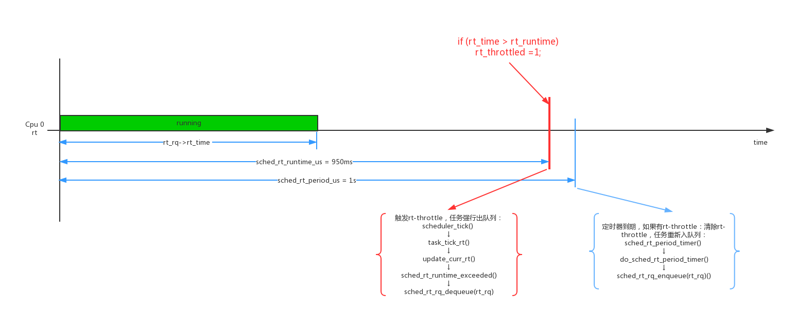

下面我们来具体分析一下具体代码：

```
scheduler_tick() -> task_tick_rt()

↓

static void task_tick_rt(struct rq *rq, struct task_struct *p, int queued)
{

    /* (1) 更新时间统计、rt-throttle计算 */
	update_curr_rt(rq);
    
    
}

|→

static void update_curr_rt(struct rq *rq)
{


    /* (1.6) 流控使能则进行流控计算  */
	if (!rt_bandwidth_enabled())
		return;

#ifdef CONFIG_MTK_RT_THROTTLE_MON
	cpu_rt_rq = rt_rq_of_se(rt_se);
	runtime = sched_rt_runtime(cpu_rt_rq);
	if (cpu_rt_rq->rt_time == 0 && !(cpu_rt_rq->rt_throttled)) {
		if (old_exec_start < per_cpu(rt_period_time, cpu) &&
			(per_cpu(old_rt_time, cpu) + delta_exec) > runtime) {
			save_mt_rt_mon_info(cpu, delta_exec, curr);
			mt_rt_mon_switch(MON_STOP, cpu);
			mt_rt_mon_print_task(cpu);
		}
		mt_rt_mon_switch(MON_RESET, cpu);
		mt_rt_mon_switch(MON_START, cpu);
		update_mt_rt_mon_start(cpu, delta_exec);
	}
	save_mt_rt_mon_info(cpu, delta_exec, curr);
#endif

	for_each_sched_rt_entity(rt_se) {
		struct rt_rq *rt_rq = rt_rq_of_se(rt_se);

		if (sched_rt_runtime(rt_rq) != RUNTIME_INF) {
			raw_spin_lock(&rt_rq->rt_runtime_lock);
			/* (1.7) 流控计算：
			    rt_rq->rt_time：为rt_rq在本周期内已经运行的时间
			    rt_rq->rt_runtime：为rt_rq在本周期内可以运行的时间  //950ms
			    rt_rq->tg->rt_bandwidth.rt_period：为一个周期的大小  //1s
			    如果rt_rq->rt_time > rt_rq->rt_runtime，则发生rt-throttle了
			 */
			rt_rq->rt_time += delta_exec;
			if (sched_rt_runtime_exceeded(rt_rq))
				resched_curr(rq);
			raw_spin_unlock(&rt_rq->rt_runtime_lock);
		}
	}
}

||→

static int sched_rt_runtime_exceeded(struct rt_rq *rt_rq)
{
	u64 runtime = sched_rt_runtime(rt_rq);
	u64 runtime_pre;

	if (rt_rq->rt_throttled)
		return rt_rq_throttled(rt_rq);

	if (runtime >= sched_rt_period(rt_rq))
		return 0;

	/* sched:get runtime*/
	/* (1.7.1) 如果已经达到条件(rt_rq->rt_time > rt_rq->rt_runtime)
	    尝试向同一root_domain的其他cpu来借运行时间进行loadbalance，// 那其他cpu也必须在跑rt任务吧？
	    借了时间以后其他cpu的实时额度会减少iter->rt_runtime -= diff，
	    本cpu的实时额度会增大rt_rq->rt_runtime += diff，
	 */
	runtime_pre = runtime;
	balance_runtime(rt_rq);
	runtime = sched_rt_runtime(rt_rq);
	if (runtime == RUNTIME_INF)
		return 0;

    /* (1.7.2) 做完loadbalance以后，已运行时间还是超过了额度时间，
        说明已经达到rt-throttle
     */
	if (rt_rq->rt_time > runtime) {
		struct rt_bandwidth *rt_b = sched_rt_bandwidth(rt_rq);
#ifdef CONFIG_RT_GROUP_SCHED
		int cpu = rq_cpu(rt_rq->rq);
		/* sched:print throttle*/
		printk_deferred("[name:rt&]sched: initial rt_time %llu, start at %llu\n",
				per_cpu(init_rt_time, cpu), per_cpu(rt_period_time, cpu));
		printk_deferred("[name:rt&]sched: cpu=%d rt_time %llu <-> runtime",
				cpu, rt_rq->rt_time);
		printk_deferred(" [%llu -> %llu], exec_task[%d:%s], prio=%d, exec_delta_time[%llu]",
				runtime_pre, runtime,
				per_cpu(exec_task, cpu).pid,
				per_cpu(exec_task, cpu).comm,
				per_cpu(exec_task, cpu).prio,
				per_cpu(exec_delta_time, cpu));
		printk_deferred(", clock_task[%llu], exec_start[%llu]\n",
				per_cpu(clock_task, cpu), per_cpu(exec_start, cpu));
		printk_deferred("[name:rt&]update[%llu,%llu], pick[%llu, %llu], set_curr[%llu, %llu]\n",
				per_cpu(update_exec_start, cpu), per_cpu(sched_update_exec_start, cpu),
				per_cpu(pick_exec_start, cpu), per_cpu(sched_pick_exec_start, cpu),
				per_cpu(set_curr_exec_start, cpu), per_cpu(sched_set_curr_exec_start, cpu));
#endif

		/*
		 * Don't actually throttle groups that have no runtime assigned
		 * but accrue some time due to boosting.
		 */
		if (likely(rt_b->rt_runtime)) {
		    /* (1.7.3) rt-throttle标志置位 */
			rt_rq->rt_throttled = 1;
			/* sched:print throttle every time*/
			printk_deferred("sched: RT throttling activated\n");
#ifdef CONFIG_RT_GROUP_SCHED
			mt_sched_printf(sched_rt_info, "cpu=%d rt_throttled=%d",
					cpu, rt_rq->rt_throttled);
			per_cpu(rt_throttling_start, cpu) = rq_clock_task(rt_rq->rq);
#ifdef CONFIG_MTK_RT_THROTTLE_MON
			/* sched:rt throttle monitor */
			mt_rt_mon_switch(MON_STOP, cpu);
			mt_rt_mon_print_task(cpu);
#endif
#endif
		} else {
			/*
			 * In case we did anyway, make it go away,
			 * replenishment is a joke, since it will replenish us
			 * with exactly 0 ns.
			 */
			rt_rq->rt_time = 0;
		}

        /* (1.7.4) 如果达到rt-throttle，将rt_rq强行退出运行 */
		if (rt_rq_throttled(rt_rq)) {
			sched_rt_rq_dequeue(rt_rq);
			return 1;
		}
	}

	return 0;
}

```

从上面的代码中可以看到rt-throttle的计算方法大概如下：每个tick累加运行时间rt_rq->rt_time，周期内可运行的额度时间为rt_rq->rt_runtime(950ms)，一个周期大小为rt_rq->tg->rt_bandwidth.rt_period(默认1s)。如果(rt_rq->rt_time > rt_rq->rt_runtime)，则发生rt-throttle了。

发生rt-throttle以后，rt_rq被强行退出，rt进程被强行停止运行。如果period 1s, runtime 950ms，那么任务会被强制停止50ms。但是下一个周期到来以后，任务需要退出rt-throttle状态。系统把周期计时和退出rt-throttle状态的工作放在hrtimer do_sched_rt_period_timer()中完成。

每个rt进程组task_group公用一个hrtimer sched_rt_period_timer()，在rt task_group创建时分配，在有进程入tg任何一个rt_rq时启动，在没有任务运行时hrtimer会停止运行。

```
void init_rt_bandwidth(struct rt_bandwidth *rt_b, u64 period, u64 runtime)
{
	rt_b->rt_period = ns_to_ktime(period);
	rt_b->rt_runtime = runtime;

	raw_spin_lock_init(&rt_b->rt_runtime_lock);

    /* (1) 初始化hrtimer的到期时间为rt_period_timer，默认1s */
	hrtimer_init(&rt_b->rt_period_timer,
			CLOCK_MONOTONIC, HRTIMER_MODE_REL);
	rt_b->rt_period_timer.function = sched_rt_period_timer;
}

static void start_rt_bandwidth(struct rt_bandwidth *rt_b)
{
	if (!rt_bandwidth_enabled() || rt_b->rt_runtime == RUNTIME_INF)
		return;

	raw_spin_lock(&rt_b->rt_runtime_lock);
	if (!rt_b->rt_period_active) {
		rt_b->rt_period_active = 1;
		/* (2) 启动hrtimer */
		hrtimer_forward_now(&rt_b->rt_period_timer, rt_b->rt_period);
		hrtimer_start_expires(&rt_b->rt_period_timer, HRTIMER_MODE_ABS_PINNED);
	}
	raw_spin_unlock(&rt_b->rt_runtime_lock);
}

```

我们看看timer时间到期后的操作：

```
static enum hrtimer_restart sched_rt_period_timer(struct hrtimer *timer)
{
	struct rt_bandwidth *rt_b =
		container_of(timer, struct rt_bandwidth, rt_period_timer);
	int idle = 0;
	int overrun;

	raw_spin_lock(&rt_b->rt_runtime_lock);
	for (;;) {
		overrun = hrtimer_forward_now(timer, rt_b->rt_period);
		if (!overrun)
			break;

		raw_spin_unlock(&rt_b->rt_runtime_lock);
		/* (1) 实际的timer处理 */
		idle = do_sched_rt_period_timer(rt_b, overrun);
		raw_spin_lock(&rt_b->rt_runtime_lock);
	}
	if (idle)
		rt_b->rt_period_active = 0;
	raw_spin_unlock(&rt_b->rt_runtime_lock);

    /* (2) 如果没有rt进程运行，idle状态，则hrtimer退出运行 */
	return idle ? HRTIMER_NORESTART : HRTIMER_RESTART;
}

|→

static int do_sched_rt_period_timer(struct rt_bandwidth *rt_b, int overrun)
{
	int i, idle = 1, throttled = 0;
	const struct cpumask *span;

	span = sched_rt_period_mask();
#ifdef CONFIG_RT_GROUP_SCHED
	/*
	 * FIXME: isolated CPUs should really leave the root task group,
	 * whether they are isolcpus or were isolated via cpusets, lest
	 * the timer run on a CPU which does not service all runqueues,
	 * potentially leaving other CPUs indefinitely throttled.  If
	 * isolation is really required, the user will turn the throttle
	 * off to kill the perturbations it causes anyway.  Meanwhile,
	 * this maintains functionality for boot and/or troubleshooting.
	 */
	if (rt_b == &root_task_group.rt_bandwidth)
		span = cpu_online_mask;
#endif
    /* (1.1) 遍历root domain中的每一个cpu */
	for_each_cpu(i, span) {
		int enqueue = 0;
		struct rt_rq *rt_rq = sched_rt_period_rt_rq(rt_b, i);
		struct rq *rq = rq_of_rt_rq(rt_rq);

		raw_spin_lock(&rq->lock);
		per_cpu(rt_period_time, i) = rq_clock_task(rq);

		if (rt_rq->rt_time) {
			u64 runtime;
			/* sched:get runtime*/
			u64 runtime_pre = 0, rt_time_pre = 0;

			raw_spin_lock(&rt_rq->rt_runtime_lock);
			per_cpu(old_rt_time, i) = rt_rq->rt_time;
			
			/* (1.2) 如果已经rt_throttled，首先尝试进行load balance */
			if (rt_rq->rt_throttled) {
				runtime_pre = rt_rq->rt_runtime;
				balance_runtime(rt_rq);
				rt_time_pre = rt_rq->rt_time;
			}
			runtime = rt_rq->rt_runtime;
			
			/* (1.3) 减少rt_rq->rt_time，一般情况下经过减操作，rt_rq->rt_time=0，
			    相当于新周期重新开始计数
			 */
			rt_rq->rt_time -= min(rt_rq->rt_time, overrun*runtime);
			per_cpu(init_rt_time, i) = rt_rq->rt_time;
			/* sched:print throttle*/
			if (rt_rq->rt_throttled) {
				printk_deferred("[name:rt&]sched: cpu=%d, [%llu -> %llu]",
						i, rt_time_pre, rt_rq->rt_time);
				printk_deferred(" -= min(%llu, %d*[%llu -> %llu])\n",
						rt_time_pre, overrun, runtime_pre, runtime);
			}
			
			/* (1.4)如果之前是rt-throttle，且throttle条件已经不成立(rt_rq->rt_time < runtime)，
			    退出rt-throttle
			 */
			if (rt_rq->rt_throttled && rt_rq->rt_time < runtime) {
				/* sched:print throttle*/
				printk_deferred("sched: RT throttling inactivated cpu=%d\n", i);
				rt_rq->rt_throttled = 0;
				mt_sched_printf(sched_rt_info, "cpu=%d rt_throttled=%d",
						rq_cpu(rq), rq->rt.rt_throttled);
				enqueue = 1;
#ifdef CONFIG_MTK_RT_THROTTLE_MON
				if (rt_rq->rt_time != 0) {
					mt_rt_mon_switch(MON_RESET, i);
					mt_rt_mon_switch(MON_START, i);
				}
#endif
				/*
				 * When we're idle and a woken (rt) task is
				 * throttled check_preempt_curr() will set
				 * skip_update and the time between the wakeup
				 * and this unthrottle will get accounted as
				 * 'runtime'.
				 */
				if (rt_rq->rt_nr_running && rq->curr == rq->idle)
					rq_clock_skip_update(rq, false);
			}
			if (rt_rq->rt_time || rt_rq->rt_nr_running)
				idle = 0;
			raw_spin_unlock(&rt_rq->rt_runtime_lock);
		} else if (rt_rq->rt_nr_running) {
			idle = 0;
			if (!rt_rq_throttled(rt_rq))
				enqueue = 1;
		}
		if (rt_rq->rt_throttled)
			throttled = 1;

        /* (1.5) 退出rt-throttle，将rt_rq重新入队列运行 */
		if (enqueue)
			sched_rt_rq_enqueue(rt_rq);
		raw_spin_unlock(&rq->lock);
	}

	if (!throttled && (!rt_bandwidth_enabled() || rt_b->rt_runtime == RUNTIME_INF))
		return 1;

	return idle;
}

```


# 3、负载计算

schedule里面这个负载(load average)的概念常常被理解成cpu占用率，这个有比较大的偏差。schedule不使用cpu占用率来评估负载，而是使用平均时间runnable的数量来评估负载。

shedule也分了几个层级来计算负载：

- 1、entity级负载计算：update_load_avg()
- 2、cpu级负载计算：update_cpu_load_active()
- 3、系统级负载计算：calc_global_load_tick()


计算负载的目的是为了去做负载均衡，下面我们逐个介绍各个层级负载算法和各种负载均衡算法。


## 3.1、PELT(Per-Entity Load Tracking)Entity级的负载计算

- Entity级的负载计算也称作PELT(Per-Entity Load Tracking)。
- 注意负载计算时使用的时间都是实际运行时间而不是虚拟运行时间vruntime。


```
scheduler_tick() -> task_tick_fair() -> entity_tick() -> update_load_avg():

↓

/* Update task and its cfs_rq load average */
static inline void update_load_avg(struct sched_entity *se, int update_tg)
{
	struct cfs_rq *cfs_rq = cfs_rq_of(se);
	u64 now = cfs_rq_clock_task(cfs_rq);
	int cpu = cpu_of(rq_of(cfs_rq));
	unsigned long runnable_delta = 0;
	unsigned long prev_load;
	int on_rq_task = entity_is_task(se) && se->on_rq;

	if (on_rq_task) {
#ifdef CONFIG_MTK_SCHED_RQAVG_US
		inc_nr_heavy_running("__update_load_avg-", task_of(se), -1, false);
#endif
		prev_load = se_load(se);
	}
	/*
	 * Track task load average for carrying it to new CPU after migrated, and
	 * track group sched_entity load average for task_h_load calc in migration
	 */
	 /* (1) 计算se的负载 */
	__update_load_avg(now, cpu, &se->avg,
			  se->on_rq * scale_load_down(se->load.weight),
			  cfs_rq->curr == se, NULL);

#ifdef CONFIG_MTK_SCHED_RQAVG_US
	if (entity_is_task(se) && se->on_rq)
		inc_nr_heavy_running("__update_load_avg+", task_of(se), 1, false);
#endif

    /* (2) 计算cfs_rq的负载 */
	if (update_cfs_rq_load_avg(now, cfs_rq) && update_tg)
		update_tg_load_avg(cfs_rq, 0);

	/* sched: add trace_sched */
	if (entity_is_task(se)) {
		trace_sched_task_entity_avg(1, task_of(se), &se->avg);
		trace_sched_load_avg_task(task_of(se), &se->avg);
	}

	if (on_rq_task) {
		runnable_delta = prev_load - se_load(se);
#ifdef CONFIG_HMP_TRACER
		trace_sched_cfs_load_update(task_of(se), se_load(se), runnable_delta, cpu);
#endif
	}

	trace_sched_load_avg_cpu(cpu, cfs_rq);
}

|→

/* Group cfs_rq's load_avg is used for task_h_load and update_cfs_share */
static inline int update_cfs_rq_load_avg(u64 now, struct cfs_rq *cfs_rq)
{

    /* (2.1) 同样调用__update_load_avg()函数来计算cfs_rq的负载 */
	decayed = __update_load_avg(now, cpu_of(rq_of(cfs_rq)), sa,
		scale_load_down(cfs_rq->load.weight), cfs_rq->curr != NULL, cfs_rq);

}

```

### 3.1.1、核心函数__update_load_avg()

__update_load_avg()函数是计算负载的核心，他的核心思想还是求一个相对值。这时1024变量又登场了，前面说过因为内核不能表示分数，所以把1扩展成1024。和负载相关的各个变量因子都使用1024来表达相对能力：时间、weight(nice优先级)、cpufreq、cpucapacity。

- ***1、等比队列(geometric series)的求和；***

把时间分成1024us(1ms)的等分。除了当前等分，过去等分负载都要进行衰减，linux引入了衰减比例 y = 0.978520621，y^32 = 0.5。也就是说一个负载经过1024us(1ms)以后不能以原来的值参与计算了，要衰减到原来的0.978520621倍，衰减32个1024us(1ms)周期以后达到原来的0.5倍。

每个等分的衰减比例都是不一样的，所以最后的负载计算变成了一个等比队列(geometric series)的求和。等比队列的特性和求和公式如下(y即是公式中的等比比例q)：

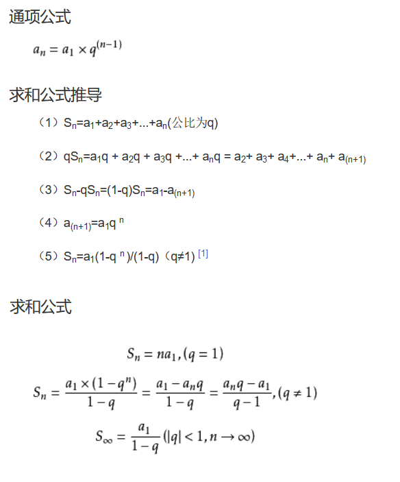


- ***2、时间分段；***

在计算一段超过1024us(1ms)的时间负载时，__update_load_avg()会把需要计算的时间分成3份：时间段A和之前计算的负载补齐1024us，时间段B是多个1024us的取整，时间段C是最后不能取整1024us的余数；

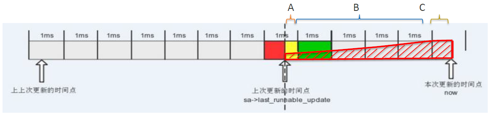

- ***3、scale_freq、scale_cpu的含义；***

***scale_freq***表示 当前freq 相对 本cpu最大freq 的比值：scale_freq = (cpu_curr_freq / cpu_max_freq) * 1024：

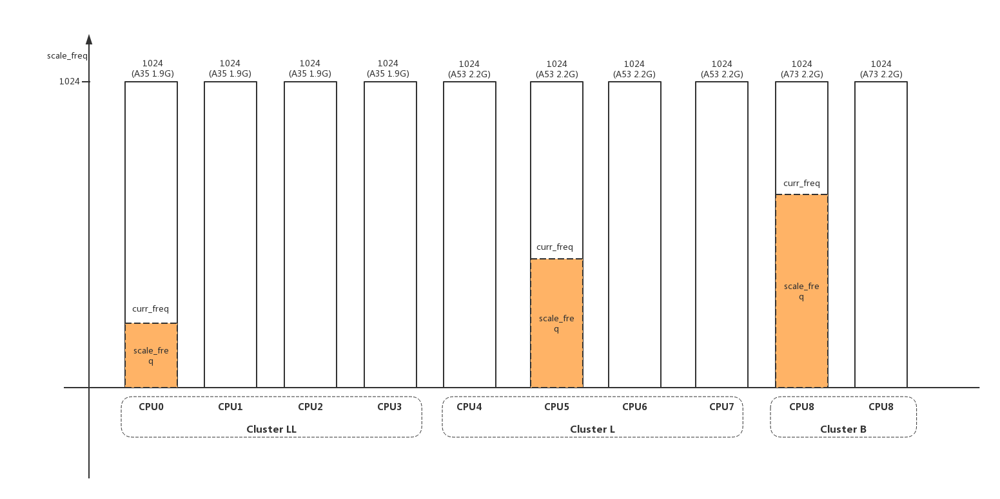

```
static __always_inline int
__update_load_avg(u64 now, int cpu, struct sched_avg *sa,
		  unsigned long weight, int running, struct cfs_rq *cfs_rq)
{

    scale_freq = arch_scale_freq_capacity(NULL, cpu);
    
}

↓

unsigned long arch_scale_freq_capacity(struct sched_domain *sd, int cpu)
{
	unsigned long curr = atomic_long_read(&per_cpu(cpu_freq_capacity, cpu));

	if (!curr)
		return SCHED_CAPACITY_SCALE;

    /* (1) 返回per_cpu(cpu_freq_capacity, cpu) */
	return curr;
}

void arch_scale_set_curr_freq(int cpu, unsigned long freq)
{
	unsigned long max = atomic_long_read(&per_cpu(cpu_max_freq, cpu));
	unsigned long curr;

	if (!max)
		return;

    /* (1.1) cpu的 cpu_curr_freq / cpu_max_freq * 1024 */
	curr = (freq * SCHED_CAPACITY_SCALE) / max;

	atomic_long_set(&per_cpu(cpu_freq_capacity, cpu), curr);
}

```

***scale_cpu***表示 (当前cpu最大运算能力 相对 所有cpu中最大的运算能力 的比值) * (cpufreq_policy的最大频率 相对 本cpu最大频率 的比值)，：scale_cpu = cpu_scale * max_freq_scale / 1024。后续的rebalance计算中经常使用capacity的叫法，和scale_cpu是同一含义。因为max_freq_scale基本=1024，所以scale_cpu基本就是cpu_scale的值：

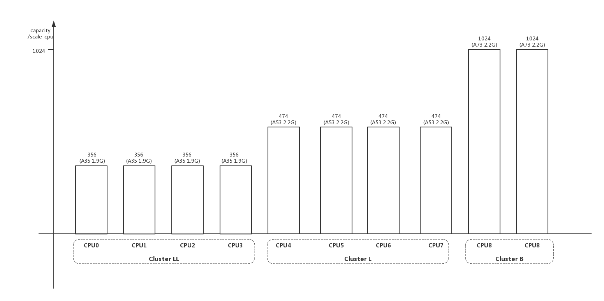

```
unsigned long arch_scale_cpu_capacity(struct sched_domain *sd, int cpu)
{
#ifdef CONFIG_CPU_FREQ
	unsigned long max_freq_scale = cpufreq_scale_max_freq_capacity(cpu);

	return per_cpu(cpu_scale, cpu) * max_freq_scale >> SCHED_CAPACITY_SHIFT;
#else
	return per_cpu(cpu_scale, cpu);
#endif
}
```

***cpu_scale***表示 当前cpu最大运算能力 相对 所有cpu中最大的运算能力 的比值：cpu_scale = ((cpu_max_freq * efficiency) / max_cpu_perf) * 1024

当前cpu的最大运算能力等于当前cpu的最大频率乘以当前cpu每clk的运算能力efficiency，efficiency相当于DMIPS，A53/A73不同架构每个clk的运算能力是不一样的：

```
/* (1.1) 不同架构的efficiency */
static const struct cpu_efficiency table_efficiency[] = {
	{ "arm,cortex-a73", 3630 },
	{ "arm,cortex-a72", 4186 },
	{ "arm,cortex-a57", 3891 },
	{ "arm,cortex-a53", 2048 },
	{ "arm,cortex-a35", 1661 },
	{ NULL, },
};

static void __init parse_dt_cpu_capacity(void)
{

    for_each_possible_cpu(cpu) {
    
        rate = of_get_property(cn, "clock-frequency", &len);
        
        /* (1) 计算当前cpu的perf能力 = clkrate * efficiency */
        cpu_perf = ((be32_to_cpup(rate)) >> 20) * cpu_eff->efficiency;
		cpu_capacity(cpu) = cpu_perf;
		
		/* (2) 计算soc中最强cpu的perf能力max_cpu_perf 
		 */
		max_cpu_perf = max(max_cpu_perf, cpu_perf);
		min_cpu_perf = min(min_cpu_perf, cpu_perf);
    
    }
}

static void update_cpu_capacity(unsigned int cpu)
{
	unsigned long capacity = cpu_capacity(cpu);

#ifdef CONFIG_MTK_SCHED_EAS_PLUS
	if (cpu_core_energy(cpu)) {
#else
	if (0) {
#endif
		/* if power table is found, get capacity of CPU from it */
		int max_cap_idx = cpu_core_energy(cpu)->nr_cap_states - 1;

        /* (3.1) 使用查表法得到相对perf能力cpu_scale */
		capacity = cpu_core_energy(cpu)->cap_states[max_cap_idx].cap;
	} else {
		if (!capacity || !max_cpu_perf) {
			cpu_capacity(cpu) = 0;
			return;
		}

        /* (3.1) 使用计算法得到相对perf能力cpu_scale,
            cpu_scale = (capacity / max_cpu_perf) * 1024
         */
		capacity *= SCHED_CAPACITY_SCALE;
		capacity /= max_cpu_perf;
	}
	set_capacity_scale(cpu, capacity);
}

static void set_capacity_scale(unsigned int cpu, unsigned long capacity)
{
	per_cpu(cpu_scale, cpu) = capacity;
}

```

例如mt6799一共有10个cpu，为“4 A35 + 4 A53 + 2 A73”架构。使用计算法计算的cpu_scale相关值：

```
/* rate是从dts读取的和实际不符合，只是表达一下算法 */
cpu = 0, rate = 1190, efficiency = 1661, cpu_perf = 1976590 
cpu = 1, rate = 1190, efficiency = 1661, cpu_perf = 1976590 
cpu = 2, rate = 1190, efficiency = 1661, cpu_perf = 1976590 
cpu = 3, rate = 1190, efficiency = 1661, cpu_perf = 1976590 
cpu = 4, rate = 1314, efficiency = 2048, cpu_perf = 2691072 
cpu = 5, rate = 1314, efficiency = 2048, cpu_perf = 2691072 
cpu = 6, rate = 1314, efficiency = 2048, cpu_perf = 2691072 
cpu = 7, rate = 1314, efficiency = 2048, cpu_perf = 2691072 
cpu = 8, rate = 1562, efficiency = 3630, cpu_perf = 5670060 
cpu = 9, rate = 1562, efficiency = 3630, cpu_perf = 5670060 

```

mt6799实际是使用查表法直接得到cpu_scale的值：

```
struct upower_tbl upower_tbl_ll_1_FY = {
	.row = {
		{.cap = 100, .volt = 75000, .dyn_pwr = 9994, .lkg_pwr = {13681, 13681, 13681, 13681, 13681, 13681} },
		{.cap = 126, .volt = 75000, .dyn_pwr = 12585, .lkg_pwr = {13681, 13681, 13681, 13681, 13681, 13681} },
		{.cap = 148, .volt = 75000, .dyn_pwr = 14806, .lkg_pwr = {13681, 13681, 13681, 13681, 13681, 13681} },
		{.cap = 167, .volt = 75000, .dyn_pwr = 16656, .lkg_pwr = {13681, 13681, 13681, 13681, 13681, 13681} },
		{.cap = 189, .volt = 75000, .dyn_pwr = 18877, .lkg_pwr = {13681, 13681, 13681, 13681, 13681, 13681} },
		{.cap = 212, .volt = 75000, .dyn_pwr = 21098, .lkg_pwr = {13681, 13681, 13681, 13681, 13681, 13681} },
		{.cap = 230, .volt = 75700, .dyn_pwr = 23379, .lkg_pwr = {13936, 13936, 13936, 13936, 13936, 13936} },
		{.cap = 245, .volt = 78100, .dyn_pwr = 26490, .lkg_pwr = {14811, 14811, 14811, 14811, 14811, 14811} },
		{.cap = 263, .volt = 81100, .dyn_pwr = 30729, .lkg_pwr = {15958, 15958, 15958, 15958, 15958, 15958} },
		{.cap = 278, .volt = 83500, .dyn_pwr = 34409, .lkg_pwr = {16949, 16949, 16949, 16949, 16949, 16949} },
		{.cap = 293, .volt = 86000, .dyn_pwr = 38447, .lkg_pwr = {18036, 18036, 18036, 18036, 18036, 18036} },
		{.cap = 304, .volt = 88400, .dyn_pwr = 42166, .lkg_pwr = {19159, 19159, 19159, 19159, 19159, 19159} },
		{.cap = 319, .volt = 90800, .dyn_pwr = 46657, .lkg_pwr = {20333, 20333, 20333, 20333, 20333, 20333} },
		{.cap = 334, .volt = 93200, .dyn_pwr = 51442, .lkg_pwr = {21605, 21605, 21605, 21605, 21605, 21605} },
		{.cap = 345, .volt = 95000, .dyn_pwr = 55230, .lkg_pwr = {22560, 22560, 22560, 22560, 22560, 22560} },
		{.cap = 356, .volt = 97400, .dyn_pwr = 59928, .lkg_pwr = {24002, 24002, 24002, 24002, 24002, 24002} },
	},
	.lkg_idx = DEFAULT_LKG_IDX,
	.row_num = UPOWER_OPP_NUM,
	.nr_idle_states = NR_UPOWER_CSTATES,
	.idle_states = {
		{{0}, {7321} },
		{{0}, {7321} },
		{{0}, {7321} },
		{{0}, {7321} },
		{{0}, {7321} },
		{{0}, {7321} },
	},
};

struct upower_tbl upower_tbl_l_1_FY = {
	.row = {
		{.cap = 116, .volt = 75000, .dyn_pwr = 16431, .lkg_pwr = {22973, 22973, 22973, 22973, 22973, 22973} },
		{.cap = 152, .volt = 75000, .dyn_pwr = 21486, .lkg_pwr = {22973, 22973, 22973, 22973, 22973, 22973} },
		{.cap = 179, .volt = 75000, .dyn_pwr = 25278, .lkg_pwr = {22973, 22973, 22973, 22973, 22973, 22973} },
		{.cap = 201, .volt = 75000, .dyn_pwr = 28437, .lkg_pwr = {22973, 22973, 22973, 22973, 22973, 22973} },
		{.cap = 228, .volt = 75000, .dyn_pwr = 32229, .lkg_pwr = {22973, 22973, 22973, 22973, 22973, 22973} },
		{.cap = 255, .volt = 75000, .dyn_pwr = 36021, .lkg_pwr = {22973, 22973, 22973, 22973, 22973, 22973} },
		{.cap = 282, .volt = 75700, .dyn_pwr = 40559, .lkg_pwr = {23423, 23423, 23423, 23423, 23423, 23423} },
		{.cap = 304, .volt = 78100, .dyn_pwr = 46598, .lkg_pwr = {24968, 24968, 24968, 24968, 24968, 24968} },
		{.cap = 331, .volt = 81100, .dyn_pwr = 54680, .lkg_pwr = {26999, 26999, 26999, 26999, 26999, 26999} },
		{.cap = 349, .volt = 83500, .dyn_pwr = 61098, .lkg_pwr = {28760, 28760, 28760, 28760, 28760, 28760} },
		{.cap = 371, .volt = 86000, .dyn_pwr = 68965, .lkg_pwr = {30698, 30698, 30698, 30698, 30698, 30698} },
		{.cap = 393, .volt = 88400, .dyn_pwr = 77258, .lkg_pwr = {32706, 32706, 32706, 32706, 32706, 32706} },
		{.cap = 416, .volt = 90800, .dyn_pwr = 86141, .lkg_pwr = {34808, 34808, 34808, 34808, 34808, 34808} },
		{.cap = 438, .volt = 93200, .dyn_pwr = 95634, .lkg_pwr = {37097, 37097, 37097, 37097, 37097, 37097} },
		{.cap = 452, .volt = 95000, .dyn_pwr = 102406, .lkg_pwr = {38814, 38814, 38814, 38814, 38814, 38814} },
		{.cap = 474, .volt = 97400, .dyn_pwr = 112974, .lkg_pwr = {41424, 41424, 41424, 41424, 41424, 41424} },
	},
	.lkg_idx = DEFAULT_LKG_IDX,
	.row_num = UPOWER_OPP_NUM,
	.nr_idle_states = NR_UPOWER_CSTATES,
	.idle_states = {
		{{0}, {11926} },
		{{0}, {11926} },
		{{0}, {11926} },
		{{0}, {11926} },
		{{0}, {11926} },
		{{0}, {11926} },
	},
};

struct upower_tbl upower_tbl_b_1_FY = {
	.row = {
		{.cap = 211, .volt = 75000, .dyn_pwr = 61732, .lkg_pwr = {71164, 71164, 71164, 71164, 71164, 71164} },
		{.cap = 268, .volt = 75000, .dyn_pwr = 78352, .lkg_pwr = {71164, 71164, 71164, 71164, 71164, 71164} },
		{.cap = 317, .volt = 75000, .dyn_pwr = 92598, .lkg_pwr = {71164, 71164, 71164, 71164, 71164, 71164} },
		{.cap = 358, .volt = 75000, .dyn_pwr = 104469, .lkg_pwr = {71164, 71164, 71164, 71164, 71164, 71164} },
		{.cap = 406, .volt = 75000, .dyn_pwr = 118715, .lkg_pwr = {71164, 71164, 71164, 71164, 71164, 71164} },
		{.cap = 447, .volt = 75000, .dyn_pwr = 130587, .lkg_pwr = {71164, 71164, 71164, 71164, 71164, 71164} },
		{.cap = 504, .volt = 75700, .dyn_pwr = 149968, .lkg_pwr = {72438, 72438, 72438, 72438, 72438, 72438} },
		{.cap = 561, .volt = 78100, .dyn_pwr = 177650, .lkg_pwr = {76806, 76806, 76806, 76806, 76806, 76806} },
		{.cap = 634, .volt = 81100, .dyn_pwr = 216546, .lkg_pwr = {82521, 82521, 82521, 82521, 82521, 82521} },
		{.cap = 691, .volt = 83500, .dyn_pwr = 250153, .lkg_pwr = {87447, 87447, 87447, 87447, 87447, 87447} },
		{.cap = 748, .volt = 86000, .dyn_pwr = 287210, .lkg_pwr = {92841, 92841, 92841, 92841, 92841, 92841} },
		{.cap = 805, .volt = 88400, .dyn_pwr = 326553, .lkg_pwr = {98397, 98397, 98397, 98397, 98397, 98397} },
	{.cap = 861, .volt = 90800, .dyn_pwr = 368886, .lkg_pwr = {104190, 104190, 104190, 104190, 104190, 104190} },
	{.cap = 918, .volt = 93200, .dyn_pwr = 414309, .lkg_pwr = {110456, 110456, 110456, 110456, 110456, 110456} },
	{.cap = 959, .volt = 95000, .dyn_pwr = 449514, .lkg_pwr = {115156, 115156, 115156, 115156, 115156, 115156} },
	{.cap = 1024, .volt = 97400, .dyn_pwr = 504548, .lkg_pwr = {122224, 122224, 122224, 122224, 122224, 122224} },
	},
	.lkg_idx = DEFAULT_LKG_IDX,
	.row_num = UPOWER_OPP_NUM,
	.nr_idle_states = NR_UPOWER_CSTATES,
	.idle_states = {
		{{0}, {38992} },
		{{0}, {38992} },
		{{0}, {38992} },
		{{0}, {38992} },
		{{0}, {38992} },
		{{0}, {38992} },
	},
};
```

***max_freq_scale***表示 cpufreq_policy的最大频率 相对 本cpu最大频率 的比值：max_freq_scale = (policy->max / cpuinfo->max_freq) * 1024

```
static void
scale_freq_capacity(struct cpufreq_policy *policy, struct cpufreq_freqs *freqs)
{
    
    scale = (policy->max << SCHED_CAPACITY_SHIFT) / cpuinfo->max_freq;
    
    for_each_cpu(cpu, &cls_cpus)
		per_cpu(max_freq_scale, cpu) = scale;

}
```

- ***4、decay_load()；***

decay_load(val,n)的意思就是负载值val经过n个衰减周期(1024us)以后的值，主要用来计算时间段A即之前的值的衰减值。


```
 * Approximate:
 *   val * y^n,    where y^32 ~= 0.5 (~1 scheduling period)
 */
static __always_inline u64 decay_load(u64 val, u64 n)
{
	unsigned int local_n;

	if (!n)
		return val;
	else if (unlikely(n > LOAD_AVG_PERIOD * 63))
		return 0;

	/* after bounds checking we can collapse to 32-bit */
	local_n = n;

    /* (1) 如果n是32的整数倍，因为2^32 = 1/2，相当于右移一位，
        计算n有多少个32，每个32右移一位
     */
	/*
	 * As y^PERIOD = 1/2, we can combine
	 *    y^n = 1/2^(n/PERIOD) * y^(n%PERIOD)
	 * With a look-up table which covers y^n (n<PERIOD)
	 *
	 * To achieve constant time decay_load.
	 */
	if (unlikely(local_n >= LOAD_AVG_PERIOD)) {
		val >>= local_n / LOAD_AVG_PERIOD;
		local_n %= LOAD_AVG_PERIOD;
	}

    /*  (2) 剩下的值计算 val * y^n，
        把y^n计算转换成 (val * runnable_avg_yN_inv[n] >> 32) 
     */
	val = mul_u64_u32_shr(val, runnable_avg_yN_inv[local_n], 32);
	return val;
}

/* Precomputed fixed inverse multiplies for multiplication by y^n */
static const u32 runnable_avg_yN_inv[] = {
	0xffffffff, 0xfa83b2da, 0xf5257d14, 0xefe4b99a, 0xeac0c6e6, 0xe5b906e6,
	0xe0ccdeeb, 0xdbfbb796, 0xd744fcc9, 0xd2a81d91, 0xce248c14, 0xc9b9bd85,
	0xc5672a10, 0xc12c4cc9, 0xbd08a39e, 0xb8fbaf46, 0xb504f333, 0xb123f581,
	0xad583ee9, 0xa9a15ab4, 0xa5fed6a9, 0xa2704302, 0x9ef5325f, 0x9b8d39b9,
	0x9837f050, 0x94f4efa8, 0x91c3d373, 0x8ea4398a, 0x8b95c1e3, 0x88980e80,
	0x85aac367, 0x82cd8698,
};

```

- ***5、__compute_runnable_contrib()；***

decay_load()只是计算y^n，而__compute_runnable_contrib()是计算一个对比队列的和：y + y^2 + y^3 ... + y^n。计算时间段B的负载。

runnable_avg_yN_sum[]数组是使用查表法来计算n=32位内的等比队列求和:

runnable_avg_yN_sum[1] = y^1 * 1024 = 0.978520621 * 1024 = 1002
runnable_avg_yN_sum[1] = (y^1 + y^2) * 1024 = 1982
...
runnable_avg_yN_sum[1] = (y^1 + y^2 .. + y^32) * 1024 = 23371


```
/*
 * For updates fully spanning n periods, the contribution to runnable
 * average will be: \Sum 1024*y^n
 *
 * We can compute this reasonably efficiently by combining:
 *   y^PERIOD = 1/2 with precomputed \Sum 1024*y^n {for  n <PERIOD}
 */
static u32 __compute_runnable_contrib(u64 n)
{
	u32 contrib = 0;

	if (likely(n <= LOAD_AVG_PERIOD))
		return runnable_avg_yN_sum[n];
	else if (unlikely(n >= LOAD_AVG_MAX_N))
		return LOAD_AVG_MAX;

    /* (1) 如果n>32，计算32的整数部分 */
	/* Compute \Sum k^n combining precomputed values for k^i, \Sum k^j */
	do {
	    /* (1.1) 每整数32的衰减就是0.5 */
		contrib /= 2; /* y^LOAD_AVG_PERIOD = 1/2 */
		contrib += runnable_avg_yN_sum[LOAD_AVG_PERIOD];

		n -= LOAD_AVG_PERIOD;
	} while (n > LOAD_AVG_PERIOD);

    /* (2.1) 将整数部分对余数n进行衰减 */
	contrib = decay_load(contrib, n);
	
	/* (2.2) 剩余余数n，使用查表法计算 */
	return contrib + runnable_avg_yN_sum[n];
}

/*
 * Precomputed \Sum y^k { 1<=k<=n }.  These are floor(true_value) to prevent
 * over-estimates when re-combining.
 */
static const u32 runnable_avg_yN_sum[] = {
	    0, 1002, 1982, 2941, 3880, 4798, 5697, 6576, 7437, 8279, 9103,
	 9909,10698,11470,12226,12966,13690,14398,15091,15769,16433,17082,
	17718,18340,18949,19545,20128,20698,21256,21802,22336,22859,23371,
};
```

- ***6、se->on_rq；***

在系统从睡眠状态被唤醒，睡眠时间会不会被统计进load_avg？答案是不会。

系统使用了一个技巧来处理这种情况，调用__update_load_avg()函数时，第三个参数weight = se->on_rq * scale_load_down(se->load.weight)。运行状态时se->on_rq=1，weight>0，老负载被老化，新负载被累加；在进程从睡眠状态被唤醒时，se->on_rq=0，weight=0，只有老负载被老化，睡眠时间不会被统计；

```
enqueue_task_fair() 

|→

static void
enqueue_entity(struct cfs_rq *cfs_rq, struct sched_entity *se, int flags)
{

    /* (1) 在调用负载更新时，se->on_rq = 0 */
    enqueue_entity_load_avg(cfs_rq, se);
    
    se->on_rq = 1;

}

||→

static inline void
enqueue_entity_load_avg(struct cfs_rq *cfs_rq, struct sched_entity *se)
{

	if (!migrated) {
	    
	    /* (1.1) 传入weight=0，只老化旧负载，不统计新负载 */
		__update_load_avg(now, cpu_of(rq_of(cfs_rq)), sa,
			se->on_rq * scale_load_down(se->load.weight),
			cfs_rq->curr == se, NULL);
	}

}


```

相同的技巧是在更新cfs_rq负载时，调用__update_load_avg()函数时，第三个参数weight = scale_load_down(cfs_rq->load.weight)。如果cfs_rq没有任何进程时cfs_rq->load.weight=0，如果cfs_rq有进程时cfs_rq->load.weight=进程weight的累加值，这样在cfs没有进程idle时，就不会统计负载。但是如果被RT进程抢占，还是会统计(相当于cfs_rq的runnable状态)。

```
static inline int update_cfs_rq_load_avg(u64 now, struct cfs_rq *cfs_rq)
{
	struct sched_avg *sa = &cfs_rq->avg;
	int decayed, removed = 0;


	decayed = __update_load_avg(now, cpu_of(rq_of(cfs_rq)), sa,
		scale_load_down(cfs_rq->load.weight), cfs_rq->curr != NULL, cfs_rq);


}
```


- ***7、LOAD_AVG_MAX；***

从上面的计算过程解析可以看到，负载计算就是一个等比队列的求和。对于负载其实我们不关心他的绝对值，而是关心他和最大负载对比的相对值。所谓最大负载就是时间轴上一直都在，且能力值也都是最大的1(1024)。

我们从上面等比队列的求和公式:Sn = a1(1-q^n)/(1-q) = 1024(1 - 0.978520621^n)/(1-0.978520621)。我们来看这个求和函数的曲线。

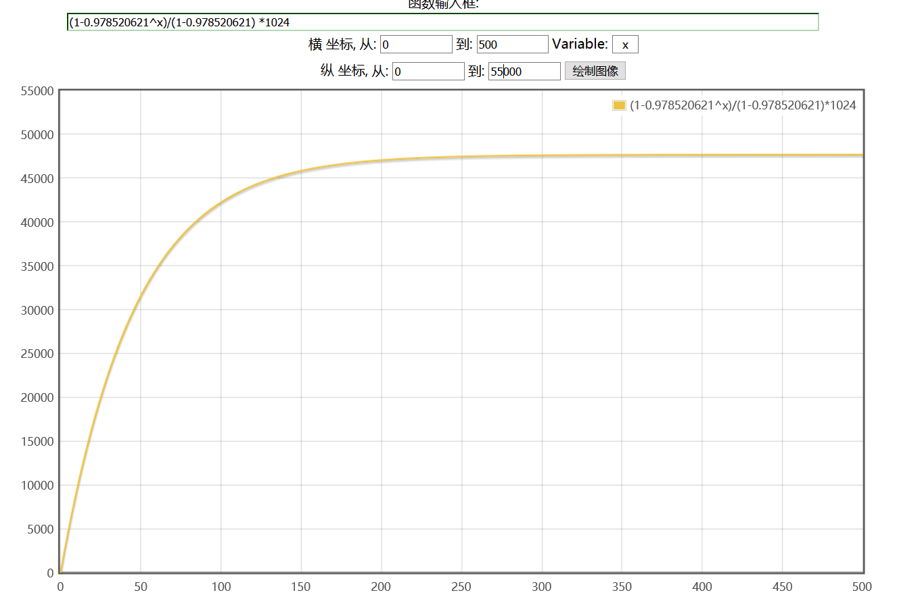

从曲线上分析，当x到达一定值后y趋于稳定，不再增长。

利用这个原理linux定义出了负载最大值LOAD_AVG_MAX。含义是经过了LOAD_AVG_MAX_N(345)个周期以后，等比队列求和达到最大值LOAD_AVG_MAX(47742)：

```
/*
 * We choose a half-life close to 1 scheduling period.
 * Note: The tables runnable_avg_yN_inv and runnable_avg_yN_sum are
 * dependent on this value.
 */
#define LOAD_AVG_PERIOD 32
#define LOAD_AVG_MAX 47742 /* maximum possible load avg */
#define LOAD_AVG_MAX_N 345 /* number of full periods to produce LOAD_AVG_MAX */

```

平均负载都是负载和最大负载之间的比值：

```
static __always_inline int
__update_load_avg(u64 now, int cpu, struct sched_avg *sa,
		  unsigned long weight, int running, struct cfs_rq *cfs_rq)
{


	if (decayed) {
		sa->load_avg = div_u64(sa->load_sum, LOAD_AVG_MAX);
		sa->loadwop_avg = div_u64(sa->loadwop_sum, LOAD_AVG_MAX);

		if (cfs_rq) {
			cfs_rq->runnable_load_avg =
				div_u64(cfs_rq->runnable_load_sum, LOAD_AVG_MAX);
			cfs_rq->avg.loadwop_avg =
				div_u64(cfs_rq->avg.loadwop_sum, LOAD_AVG_MAX);
		}
		sa->util_avg = sa->util_sum / LOAD_AVG_MAX;
	}

}
```

- ***8、struct sched_avg数据成员的含义；***

```
struct sched_avg {
	u64 last_update_time;
	u32 period_contrib;
	
	/* (1) runnable状态负载，带weight */
	u64 load_sum; // runnable状态负载总和，(weight*time*scale_freq)几个分量相乘
	unsigned long load_avg; // runnable状态平均负载，(weight*time*scale_freq)几个分量相乘
	                        // 因为weight的值会大于1024，所以load_avg的值会大于1024

    /* (2) runnable状态负载，不带weight  */
	unsigned long loadwop_sum;  // runnable状态负载总和，(time*scale_freq)几个分量相乘
	unsigned long loadwop_avg;  // runnable状态平均负载，(time*scale_freq)几个分量相乘
	                            // loadwop_avg的最大值为1024

    /* (3) running状态负载 */
	u32 util_sum; // running状态负载总和，(time*scale_freq*scale_cpu)几个分量相乘
	unsigned long util_avg; // running状态平均负载，(time*scale_freq*scale_cpu)几个分量相乘
	                        // util_avg的最大值为1024
	

#ifdef CONFIG_SCHED_HMP
	unsigned long pending_load;
	u32 nr_pending;
#ifdef CONFIG_SCHED_HMP_PRIO_FILTER
	u32 nr_dequeuing_low_prio;
	u32 nr_normal_prio;
#endif
	u64 hmp_last_up_migration;
	u64 hmp_last_down_migration;
#endif /* CONFIG_SCHED_HMP */
};
```

- 8.1、loadwop_avg：

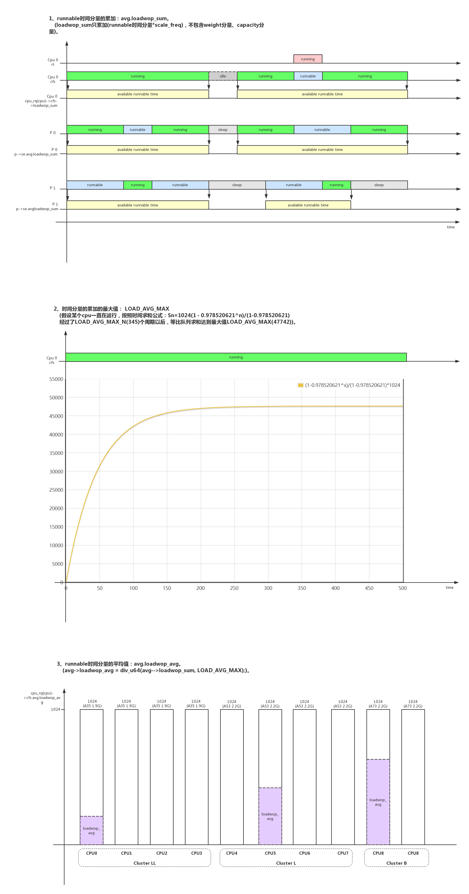

- 8.2、load_avg：

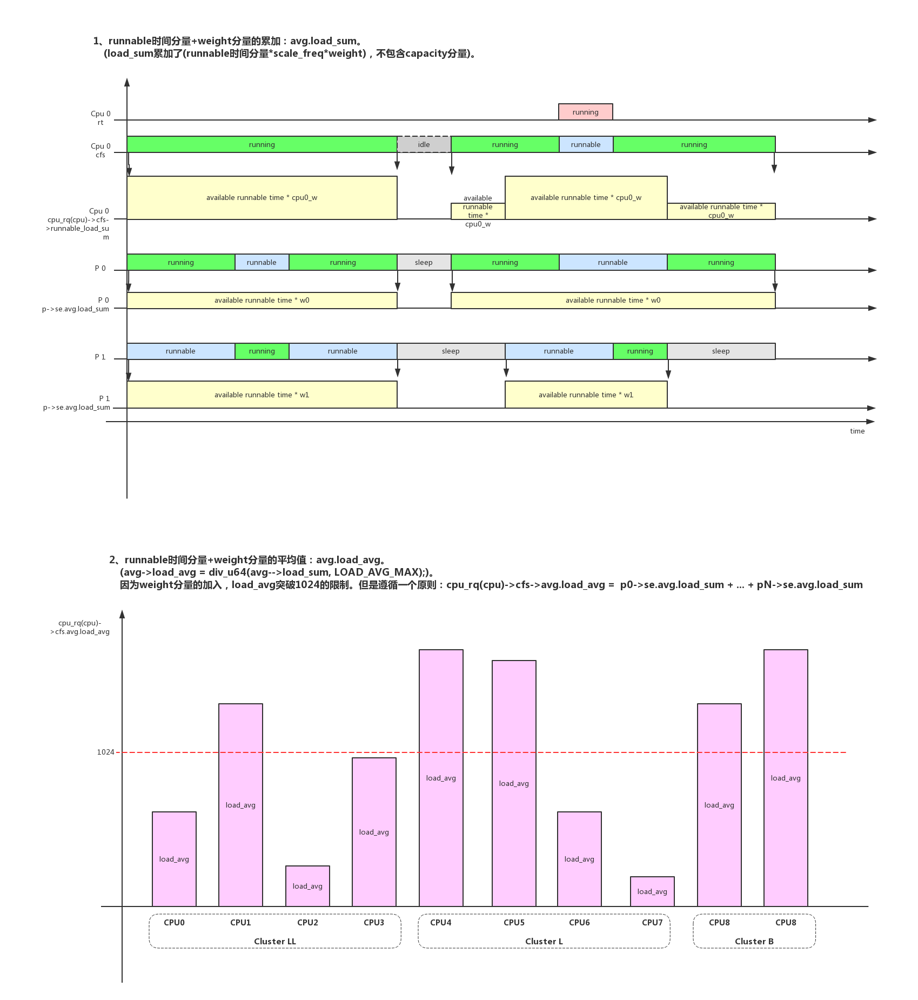

- 8.3、util_avg：

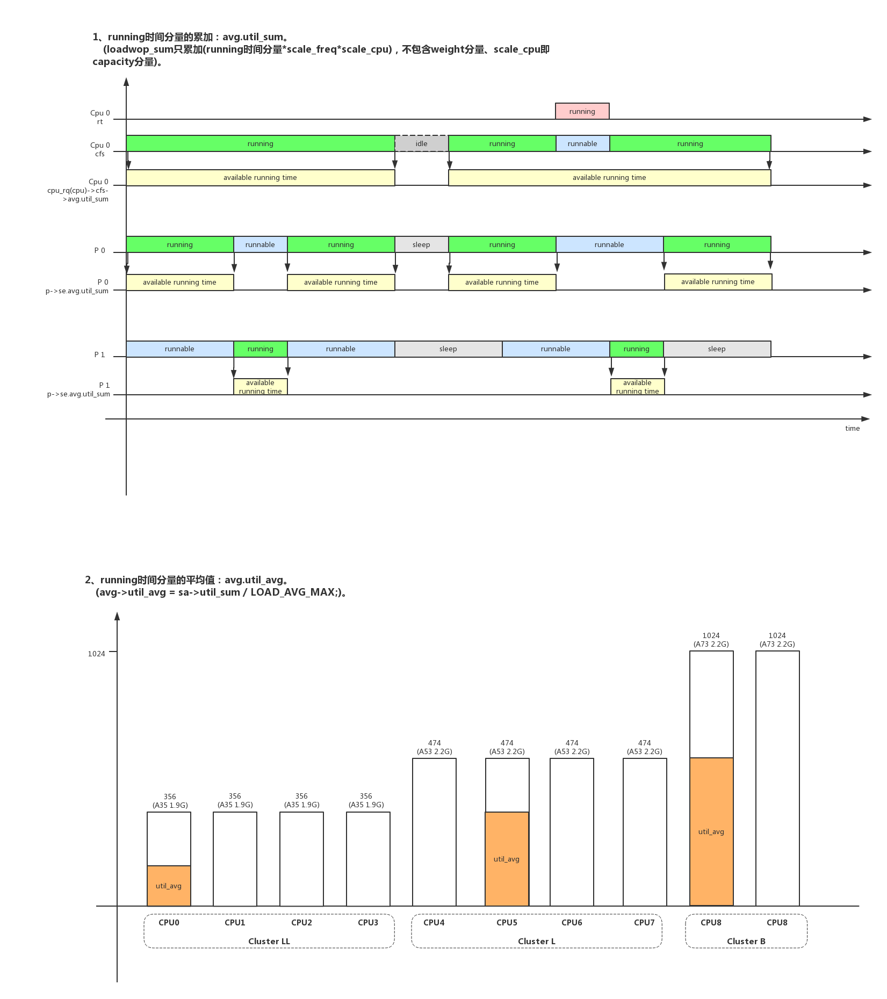

- 8.4、scale_freq：

需要特别强调的是loadwop_avg、load_avg、util_avg在他们的时间分量中都乘以了scale_freq，所以上面几图都是他们在max_freq下的表现，实际的负载还受当前freq的影响：


- 8.5、capacity/scale_cpu


capacity是在smp负载均衡时更新：

```
run_rebalance_domains() -> rebalance_domains() -> load_balance() -> find_busiest_group() -> update_sd_lb_stats() -> update_group_capacity() -> update_cpu_capacity()

↓

static void update_cpu_capacity(struct sched_domain *sd, int cpu)
{
	unsigned long capacity = arch_scale_cpu_capacity(sd, cpu);
	struct sched_group *sdg = sd->groups;
	struct max_cpu_capacity *mcc;
	unsigned long max_capacity;
	int max_cap_cpu;
	unsigned long flags;

    /* (1) cpu_capacity_orig = cpu最大频率时的最大capacity */
	cpu_rq(cpu)->cpu_capacity_orig = capacity;

	mcc = &cpu_rq(cpu)->rd->max_cpu_capacity;

	raw_spin_lock_irqsave(&mcc->lock, flags);
	max_capacity = mcc->val;
	max_cap_cpu = mcc->cpu;

	if ((max_capacity > capacity && max_cap_cpu == cpu) ||
	    (max_capacity < capacity)) {
		mcc->val = capacity;
		mcc->cpu = cpu;
#ifdef CONFIG_SCHED_DEBUG
		raw_spin_unlock_irqrestore(&mcc->lock, flags);
		/* pr_info("CPU%d: update max cpu_capacity %lu\n", cpu, capacity); */
		goto skip_unlock;
#endif
	}
	raw_spin_unlock_irqrestore(&mcc->lock, flags);

skip_unlock: __attribute__ ((unused));
	capacity *= scale_rt_capacity(cpu);
	capacity >>= SCHED_CAPACITY_SHIFT;

	if (!capacity)
		capacity = 1;

    /* (2) cpu_capacity = 最大capacity减去rt进程占用的比例 */
	cpu_rq(cpu)->cpu_capacity = capacity;
	sdg->sgc->capacity = capacity;
}
```

获取capacity的函数有几种：capacity_orig_of()返回最大capacity，capacity_of()返回减去rt占用的capacity，capacity_curr_of()返回当前频率下的最大capacity。

```
static inline unsigned long capacity_of(int cpu)
{
	return cpu_rq(cpu)->cpu_capacity;
}

static inline unsigned long capacity_orig_of(int cpu)
{
	return cpu_rq(cpu)->cpu_capacity_orig;
}

static inline unsigned long capacity_curr_of(int cpu)
{
	return cpu_rq(cpu)->cpu_capacity_orig *
	       arch_scale_freq_capacity(NULL, cpu)
	       >> SCHED_CAPACITY_SHIFT;
}
```


- ***9、__update_load_avg()函数完整的计算过程：***

```
/*
 * We can represent the historical contribution to runnable average as the
 * coefficients of a geometric series.  To do this we sub-divide our runnable
 * history into segments of approximately 1ms (1024us); label the segment that
 * occurred N-ms ago p_N, with p_0 corresponding to the current period, e.g.
 *
 * [<- 1024us ->|<- 1024us ->|<- 1024us ->| ...
 *      p0            p1           p2
 *     (now)       (~1ms ago)  (~2ms ago)
 *
 * Let u_i denote the fraction of p_i that the entity was runnable.
 *
 * We then designate the fractions u_i as our co-efficients, yielding the
 * following representation of historical load:
 *   u_0 + u_1*y + u_2*y^2 + u_3*y^3 + ...
 *
 * We choose y based on the with of a reasonably scheduling period, fixing:
 *   y^32 = 0.5
 *
 * This means that the contribution to load ~32ms ago (u_32) will be weighted
 * approximately half as much as the contribution to load within the last ms
 * (u_0).
 *
 * When a period "rolls over" and we have new u_0`, multiplying the previous
 * sum again by y is sufficient to update:
 *   load_avg = u_0` + y*(u_0 + u_1*y + u_2*y^2 + ... )
 *            = u_0 + u_1*y + u_2*y^2 + ... [re-labeling u_i --> u_{i+1}]
 */
static __always_inline int
__update_load_avg(u64 now, int cpu, struct sched_avg *sa,
		  unsigned long weight, int running, struct cfs_rq *cfs_rq)
{
	u64 delta, scaled_delta, periods;
	u32 contrib;
	unsigned int delta_w, scaled_delta_w, decayed = 0;
	unsigned long scale_freq, scale_cpu;

	delta = now - sa->last_update_time;
	/*
	 * This should only happen when time goes backwards, which it
	 * unfortunately does during sched clock init when we swap over to TSC.
	 */
	if ((s64)delta < 0) {
		sa->last_update_time = now;
		return 0;
	}

	/*
	 * Use 1024ns as the unit of measurement since it's a reasonable
	 * approximation of 1us and fast to compute.
	 */
	/* (1) 把时间单位从ns，收缩成us */
	delta >>= 10;
	if (!delta)
		return 0;
	sa->last_update_time = now;

    /* (2) scale_freq = (curr_freq/cpu_max)*1024 */
	scale_freq = arch_scale_freq_capacity(NULL, cpu);
	
	/* (3) scale_cpu = (curr_cpu_perf/max_perf)*1024 */
	scale_cpu = arch_scale_cpu_capacity(NULL, cpu);

	/* delta_w is the amount already accumulated against our next period */
	/* (4) 上次计算，没有凑成1024us整周期的余数 */
	delta_w = sa->period_contrib;
	if (delta + delta_w >= 1024) {
		decayed = 1;

		/* how much left for next period will start over, we don't know yet */
		sa->period_contrib = 0;

		/*
		 * Now that we know we're crossing a period boundary, figure
		 * out how much from delta we need to complete the current
		 * period and accrue it.
		 */
		/* (5) 计算时间段A的负载 */
		delta_w = 1024 - delta_w;
		/* scaled_delta_w = (time*scale_freq)/1024 */
		scaled_delta_w = cap_scale(delta_w, scale_freq);
		if (weight) {
		    /* (5.1) load_sum = (weight*time*scale_freq)/1024 */
			sa->load_sum += weight * scaled_delta_w;
			
			/* (5.2) loadwop_sum = (1024*time*scale_freq)/1024 
			    = time*scale_freq
			 */
			sa->loadwop_sum += NICE_0_LOAD * scaled_delta_w;
			
			/* (5.3) 如果cfs_rq不为空，增加cfs_rq的统计 */
			if (cfs_rq) {
				cfs_rq->runnable_load_sum +=
						weight * scaled_delta_w;
				
				/* ooooo这里是一个bug：计算cfs_rq负载的时候，cfs_rq->avg会被计算两次
				    看最新的代码中已经被修复
				 */
				cfs_rq->avg.loadwop_sum +=
						NICE_0_LOAD * scaled_delta_w;
			}
		}
		
		/* (5.4) util_sum统计running状态的负载，不统计runnable负载 
		    util_sum = (time*scale_freq*scale_cpu)/1024
		 */
		if (running)
			sa->util_sum += scaled_delta_w * scale_cpu;

		delta -= delta_w;

		/* Figure out how many additional periods this update spans */
		periods = delta / 1024;
		delta %= 1024;

        /* (5.5) 衰减时间段A的负载 */
		sa->load_sum = decay_load(sa->load_sum, periods + 1);
		sa->loadwop_sum = decay_load(sa->loadwop_sum, periods + 1);
		if (cfs_rq) {
			cfs_rq->runnable_load_sum =
				decay_load(cfs_rq->runnable_load_sum, periods + 1);
			cfs_rq->avg.loadwop_sum =
				decay_load(cfs_rq->avg.loadwop_sum, periods + 1);
		}
		sa->util_sum = decay_load((u64)(sa->util_sum), periods + 1);

		/* Efficiently calculate \sum (1..n_period) 1024*y^i */
		/* (6) 计算时间段B的负载 */
		contrib = __compute_runnable_contrib(periods);
		contrib = cap_scale(contrib, scale_freq);
		if (weight) {
			sa->load_sum += weight * contrib;
			sa->loadwop_sum += NICE_0_LOAD * contrib;
			if (cfs_rq) {
				cfs_rq->runnable_load_sum += weight * contrib;
				cfs_rq->avg.loadwop_sum +=
						NICE_0_LOAD * contrib;
			}
		}
		if (running)
			sa->util_sum += contrib * scale_cpu;
	}

	/* Remainder of delta accrued against u_0` */
	/* (6) 计算时间段c的负载 */
	scaled_delta = cap_scale(delta, scale_freq);
	if (weight) {
		sa->load_sum += weight * scaled_delta;
		sa->loadwop_sum += NICE_0_LOAD * scaled_delta;
		if (cfs_rq) {
			cfs_rq->runnable_load_sum += weight * scaled_delta;
			cfs_rq->avg.loadwop_sum +=
				NICE_0_LOAD * scaled_delta;
		}
	}
	if (running)
		sa->util_sum += scaled_delta * scale_cpu;

	sa->period_contrib += delta;

    /* (7) 计算把负载转换成相对值 */
	if (decayed) {
		sa->load_avg = div_u64(sa->load_sum, LOAD_AVG_MAX);
		sa->loadwop_avg = div_u64(sa->loadwop_sum, LOAD_AVG_MAX);

		if (cfs_rq) {
			cfs_rq->runnable_load_avg =
				div_u64(cfs_rq->runnable_load_sum, LOAD_AVG_MAX);
			cfs_rq->avg.loadwop_avg =
				div_u64(cfs_rq->avg.loadwop_sum, LOAD_AVG_MAX);
		}
		sa->util_avg = sa->util_sum / LOAD_AVG_MAX;
	}

	return decayed;
}

```

## 3.2、cpu级的负载计算update_cpu_load_active()

__update_load_avg()是计算se/cfs_rq级别的负载，在cpu级别linux使用update_cpu_load_active()来计算整个cpu->rq负载的变化趋势。计算也是周期性的，周期为1 tick。

>暂时我理解，这个rq load没有计入rt的负载。


```
scheduler_tick() 

↓

void update_cpu_load_active(struct rq *this_rq)
{
    /* (1) 被累计的为：当前rqrunnable平均负载带weight分量(cpu->rq->cfs_rq->runnable_load_avg) */
	unsigned long load = weighted_cpuload(cpu_of(this_rq));
	/*
	 * See the mess around update_idle_cpu_load() / update_cpu_load_nohz().
	 */
	this_rq->last_load_update_tick = jiffies;
	/* (2)   */
	__update_cpu_load(this_rq, load, 1);
}

|→

/*
 * Update rq->cpu_load[] statistics. This function is usually called every
 * scheduler tick (TICK_NSEC). With tickless idle this will not be called
 * every tick. We fix it up based on jiffies.
 */
static void __update_cpu_load(struct rq *this_rq, unsigned long this_load,
			      unsigned long pending_updates)
{
	int i, scale;

	this_rq->nr_load_updates++;

	/* Update our load: */
	/* (2.1) 逐个计算cpu_load[]中5个时间等级的值 */
	this_rq->cpu_load[0] = this_load; /* Fasttrack for idx 0 */
	for (i = 1, scale = 2; i < CPU_LOAD_IDX_MAX; i++, scale += scale) {
		unsigned long old_load, new_load;

		/* scale is effectively 1 << i now, and >> i divides by scale */

		old_load = this_rq->cpu_load[i];
		/* (2.2) 如果因为进入noHZ模式，有pending_updates个tick没有更新，
		    先老化原有负载
		 */
		old_load = decay_load_missed(old_load, pending_updates - 1, i);
		new_load = this_load;
		/*
		 * Round up the averaging division if load is increasing. This
		 * prevents us from getting stuck on 9 if the load is 10, for
		 * example.
		 */
		if (new_load > old_load)
			new_load += scale - 1;

        /* (2.3) cpu_load的计算公式 */
		this_rq->cpu_load[i] = (old_load * (scale - 1) + new_load) >> i;
	}

	sched_avg_update(this_rq);
}

```
代码注释中详细解释了cpu_load的计算方法：

- 1、每个tick计算不同idx时间等级的load，计算公式：load = (2^idx - 1) / 2^idx * load + 1 / 2^idx * cur_load

- 2、如果cpu因为noHZ错过了(n-1)个tick的更新，那么计算load要分两步：

    首先老化(decay)原有的load：load = ((2^idx - 1) / 2^idx)^(n-1) * load
    再按照一般公式计算load：load = (2^idx - 1) / 2^idx) * load + 1 / 2^idx * cur_load
    
- 3、为了decay的加速计算，设计了decay_load_missed()查表法计算：

```
/*
 * The exact cpuload at various idx values, calculated at every tick would be
 * load = (2^idx - 1) / 2^idx * load + 1 / 2^idx * cur_load
 *
 * If a cpu misses updates for n-1 ticks (as it was idle) and update gets called
 * on nth tick when cpu may be busy, then we have:
 * load = ((2^idx - 1) / 2^idx)^(n-1) * load
 * load = (2^idx - 1) / 2^idx) * load + 1 / 2^idx * cur_load
 *
 * decay_load_missed() below does efficient calculation of
 * load = ((2^idx - 1) / 2^idx)^(n-1) * load
 * avoiding 0..n-1 loop doing load = ((2^idx - 1) / 2^idx) * load
 *
 * The calculation is approximated on a 128 point scale.
 * degrade_zero_ticks is the number of ticks after which load at any
 * particular idx is approximated to be zero.
 * degrade_factor is a precomputed table, a row for each load idx.
 * Each column corresponds to degradation factor for a power of two ticks,
 * based on 128 point scale.
 * Example:
 * row 2, col 3 (=12) says that the degradation at load idx 2 after
 * 8 ticks is 12/128 (which is an approximation of exact factor 3^8/4^8).
 *
 * With this power of 2 load factors, we can degrade the load n times
 * by looking at 1 bits in n and doing as many mult/shift instead of
 * n mult/shifts needed by the exact degradation.
 */
#define DEGRADE_SHIFT		7
static const unsigned char
		degrade_zero_ticks[CPU_LOAD_IDX_MAX] = {0, 8, 32, 64, 128};
static const unsigned char
		degrade_factor[CPU_LOAD_IDX_MAX][DEGRADE_SHIFT + 1] = {
					{0, 0, 0, 0, 0, 0, 0, 0},
					{64, 32, 8, 0, 0, 0, 0, 0},
					{96, 72, 40, 12, 1, 0, 0},
					{112, 98, 75, 43, 15, 1, 0},
					{120, 112, 98, 76, 45, 16, 2} };

/*
 * Update cpu_load for any missed ticks, due to tickless idle. The backlog
 * would be when CPU is idle and so we just decay the old load without
 * adding any new load.
 */
static unsigned long
decay_load_missed(unsigned long load, unsigned long missed_updates, int idx)
{
	int j = 0;

	if (!missed_updates)
		return load;

	if (missed_updates >= degrade_zero_ticks[idx])
		return 0;

	if (idx == 1)
		return load >> missed_updates;

	while (missed_updates) {
		if (missed_updates % 2)
			load = (load * degrade_factor[idx][j]) >> DEGRADE_SHIFT;

		missed_updates >>= 1;
		j++;
	}
	return load;
}
```


- 1、cpu_load[]含5条均线，反应不同时间窗口长度下的负载情况；主要供load_balance()在不
同场景判断是否负载平衡的比较基准，常用为cpu_load[0]和cpu_load[1];
- 2、cpu_load[index]对应的时间长度为{0, 8, 32, 64, 128}，单位为tick;
- 3、移动均线的目的在于平滑样本的抖动，确定趋势的变化方向;


## 3.3、系统级的负载计算calc_global_load_tick()

系统级的平均负载(load average)可以通过以下命令(uptime、top、cat /proc/loadavg)查看：

```
$ uptime
 16:48:24 up  4:11,  1 user,  load average: 25.25, 23.40, 23.46

$ top - 16:48:42 up  4:12,  1 user,  load average: 25.25, 23.14, 23.37

$ cat /proc/loadavg 
25.72 23.19 23.35 42/3411 43603
```

“load average:”后面的3个数字分别表示1分钟、5分钟、15分钟的load average。可以从几方面去解析load average：

- If the averages are 0.0, then your system is idle.
- If the 1 minute average is higher than the 5 or 15 minute averages, then load is increasing.
- If the 1 minute average is lower than the 5 or 15 minute averages, then load is decreasing.
- If they are higher than your CPU count, then you might have a performance problem (it depends).

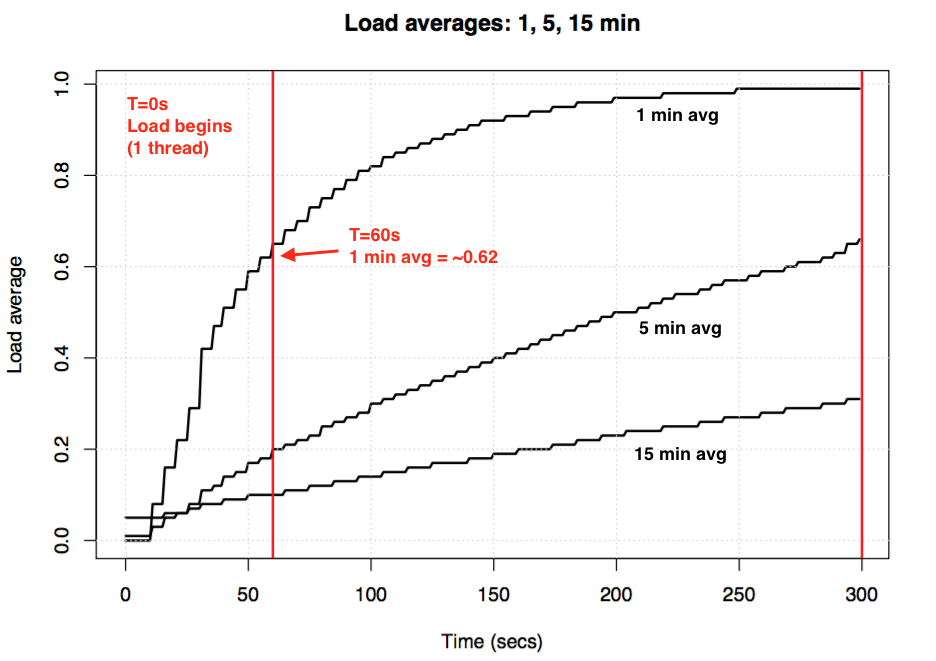

> 最早的系统级平均负载(load average)只会统计runnable状态。但是linux后面觉得这种统计方式代表不了系统的真实负载；举一个例子：系统换一个低速硬盘后，他的runnable负载还会小于高速硬盘时的值；linux认为睡眠状态(TASK_INTERRUPTIBLE/TASK_UNINTERRUPTIBLE)也是系统的一种负载，系统得不到服务是因为io/外设的负载过重；系统级负载统计函数calc_global_load_tick()中会把(this_rq->nr_running+this_rq->nr_uninterruptible)都计入负载；


### 3.3.1、calc_global_load_tick()

我们来看详细的代码解析。

- 1、每个cpu每隔5s更新本cpu rq的(nr_running+nr_uninterruptible)任务数量到系统全局变量calc_load_tasks，calc_load_tasks是整系统多个cpu(nr_running+nr_uninterruptible)任务数量的总和，多cpu在访问calc_load_tasks变量时使用原子操作来互斥。

```
scheduler_tick()

↓

void calc_global_load_tick(struct rq *this_rq)
{
	long delta;

    /* (1) 5S的更新周期 */
	if (time_before(jiffies, this_rq->calc_load_update))
		return;

    /* (2) 计算本cpu的负载变化到全局变量calc_load_tasks中 */
	delta  = calc_load_fold_active(this_rq);
	if (delta)
		atomic_long_add(delta, &calc_load_tasks);

	this_rq->calc_load_update += LOAD_FREQ;
}

```

- 2、多个cpu更新calc_load_tasks，但是计算load只由一个cpu来完成，这个cpu就是tick_do_timer_cpu。在linux time一文中，我们看到这个cpu就是专门来更新时间戳timer的(update_wall_time())。实际上它在更新时间戳的同时也会调用do_timer() -> calc_global_load()来计算系统负载。

核心算法calc_load()的思想也是：旧的load*老化系数 + 新load*系数

假设单位1为FIXED_1=2^11=2028，EXP_1=1884、EXP_5=2014、EXP_15=2037，load的计算：

load = old_load*(EXP_?/FIXED_1) + new_load*(FIXED_1-EXP_?)/FIXED_1

```
do_timer() -> calc_global_load()

↓

void calc_global_load(unsigned long ticks)
{
	long active, delta;

    /* (1) 计算的间隔时间为5s + 10tick，
        加10tick的目的就是让所有cpu都更新完calc_load_tasks，
        tick_do_timer_cpu再来计算
     */
	if (time_before(jiffies, calc_load_update + 10))
		return;

	/*
	 * Fold the 'old' idle-delta to include all NO_HZ cpus.
	 */
	delta = calc_load_fold_idle();
	if (delta)
		atomic_long_add(delta, &calc_load_tasks);

    /* (2) 读取全局统计变量 */
	active = atomic_long_read(&calc_load_tasks);
	active = active > 0 ? active * FIXED_1 : 0;

    /* (3) 计算1分钟、5分钟、15分钟的负载 */
	avenrun[0] = calc_load(avenrun[0], EXP_1, active);
	avenrun[1] = calc_load(avenrun[1], EXP_5, active);
	avenrun[2] = calc_load(avenrun[2], EXP_15, active);

	calc_load_update += LOAD_FREQ;

	/*
	 * In case we idled for multiple LOAD_FREQ intervals, catch up in bulk.
	 */
	calc_global_nohz();
}

|→

/*
 * a1 = a0 * e + a * (1 - e)
 */
static unsigned long
calc_load(unsigned long load, unsigned long exp, unsigned long active)
{
	unsigned long newload;

	newload = load * exp + active * (FIXED_1 - exp);
	if (active >= load)
		newload += FIXED_1-1;

	return newload / FIXED_1;
}

#define FSHIFT		11		/* nr of bits of precision */
#define FIXED_1		(1<<FSHIFT)	/* 1.0 as fixed-point */
#define LOAD_FREQ	(5*HZ+1)	/* 5 sec intervals */
#define EXP_1		1884		/* 1/exp(5sec/1min) as fixed-point */
#define EXP_5		2014		/* 1/exp(5sec/5min) */
#define EXP_15		2037		/* 1/exp(5sec/15min) */

```

3、/proc/loadavg

代码实现在kernel/fs/proc/loadavg.c中：

```
static int loadavg_proc_show(struct seq_file *m, void *v)
{
	unsigned long avnrun[3];

	get_avenrun(avnrun, FIXED_1/200, 0);

	seq_printf(m, "%lu.%02lu %lu.%02lu %lu.%02lu %ld/%d %d\n",
		LOAD_INT(avnrun[0]), LOAD_FRAC(avnrun[0]),
		LOAD_INT(avnrun[1]), LOAD_FRAC(avnrun[1]),
		LOAD_INT(avnrun[2]), LOAD_FRAC(avnrun[2]),
		nr_running(), nr_threads,
		task_active_pid_ns(current)->last_pid);
	return 0;
}

```

## 3.4 占用率统计

### 3.4.1、cputime.c

top命令利用“/proc/stat”、“/proc/stat”来做cpu占用率统计，可以在AOSP/system/core/toolbox/top.c中查看top代码实现。

读取/proc/stat可以查看系统各种状态的时间统计，代码实现在fs/proc/stat.c show_stat()。

```
# cat /proc/stat

/* 系统时间的累加，格式 = 
"cpu, user, nice, system, idle, iowait, irq, softirq, steal, guest, guest_nice" 
*/
cpu  4022747 54885 15739405 106716492 190413 0 38250 0 0 0   
cpu0 2507238 44342 9881429 87084619 154904 0 32594 0 0 0
intr 242500437 0 0 149757888 0 0 5 15529 0 0 0 0 0 0 0 0 18385 3111402 0 6862026 128 0 0 2 0 0 0 0 276502 2317633 4713710 0 0 0 3 2604 0 0 0 0 0 0 0 0 0 0 0 0 0 0 0 0 0 0 0 0 0 0 1211 0 760467 0 0 27713 0 0 0 0 0 0 0 0 0 0 0 0 1789515 8333417 1369 3344 2399 389 0 23665294 0 0 0 0 0 0 0 0 0 0 0 0 0 0 0 4068 0 0 0 0 13984 0 0 0 0 0 0 0 0 0 0 0 13585 169 13590 169 19300 169 0 0 0 0 0 45 0 9622 0 0 0 0 0 0 0 0 0 27026 1948 0 19475 0 0 0 0 0 0 0 0 0 0 0 0 0 0 0 0 0 0 0 242 0 0 0 0 0 0 0 2580 2595 0 0 0 873 0 0 0 0 0 0 0 0 0 0 0 0 0 0 0 0 0 0 0 0 0 0 0 0 0 0 0 0 0 0 0 0 0 0 0 0 0 0 0 0 0 0 0 0 0 0 0 0 0 0 0 0 0 0 0 0 0 0 0 0 0 0 0 0 0 0 0 0 0 0 0 0 0 0 0 0 0 0 0 0 0 0 0 0 0 0 0 0 0 0 0 0 0 0 0 0 0 0 0 0 0 0 0 0 0 0 0 0 0 0 0 0 0 0 0 0 0 0 0 0 0 0 0 0 0 0 0 0 0 0 0 0 0 0 0 0 0 0 0 0 0 0 0 0 0 0 0 0 0 0 0 0 0 0 0 0 0 0 0 0 0 0 0 0 0 0 0 0 0 0 0 0 0 0 0 0 0 0 0 0 0 0 0 0 0 0 0 0 0 0 0 0 0 0 0 0 0 0 0 0 0 0 0 0 0 0 0 0 0 0 0 0 0 0 0 0 0 0 0 0 0 0 0 0 0 0 0 0 0 0 0 0 0 0 0 0 0 0 0 0 0 0 0 0 0 0 0 0 0 0 0 0 0 0 0 0 0 0 0 0 0 0 0 0 0 0 0 0 0 0 0 0 0 0 0 0 0 0 0 0 0 0 0 0 0 0 0 0 0 0 0 0 0 0 0 0 0 0 0 0 0 0 0 0 0 0 0 0 0 0 0 0 0 0 0 0 0 0 0 0 0 0 0 0 0 0 0 0 0 0 0 0 0 0 0 0 0 0 0 0 0 0 0 0 0 0 0 0 0 0 0 0 0 0 0 0 0 0 0 0 0 0 0 0 0 0 0 0 0 0 0 0 0 0 0 0 0 0 0 0 0 0 0 0 0 0 0 0 0 0 0 0 0 0 0 0 0 0 0 0 0 0 0 0 0 0 0 0 0 0 0 0 0 0 0 0 0 0 0 0 0 0 0 0 0 0 0 0 0 0 0 0 0 0 0 0 0 0 0 0 0 0 0 0 0 0 0 0 0 0 0 0 0 0 0 0 0 0 0 0 0 0 0 0 0 0 0 0 0 0 0 0 0 0 0 0 0 0 0 0 0 0 0 0 0 0 0 0 0 0 0 0 0 0 0 0 0 2 0 0 17 0 0 0 0 1 7340 0 0 635 102644 167 0 0 0 0 0 0 0 0 0 0 0 0 0 0 0 0 0 0 0 0 0 0 0 0 0 0 0 0 0 0 0 0 0 0 0 0 0 0 0 0 0 0 0 0 0 0 0 0 0 0 0 0 0 0 0 0 0 0 0 0 0 0 0 0 0 0 0 0 0 0 0 0 0 0 0 0 0 0 0 0 0 0 0 0 0 0 0 0 0 0 0 0 0 0 0 0 0 0 0 0 0 4 0 0 0 0 0 0 0 0 0 0 0 0 0 0 0 0 0 0 0 0 0 0 0 0 0 0 0 0 0 0 0 0 0 0 0 0 0 0 0 0 0 0 0 0 0 0 0 0 0 0 0 0 0 0 0 0 0 0 0 0 0 0 0 0 292 0 0 0 0 0 0 0 0 0 0 0 0 0 0 0 0 0 0 0 0 0 0 0 0 0 0 0 0 0 0 0 0 0 0 58 0 0 0 0 0 0 0 0 0 0 0 0 0 0 0

/* 格式：
nctxt: sum += cpu_rq(i)->nr_switches;
btime：boottime.tv_sec
processes：total_forks
procs_running：sum += cpu_rq(i)->nr_running;
procs_blocked：sum += atomic_read(&cpu_rq(i)->nr_iowait);
*/
ctxt 384108244
btime 1512114477
processes 130269
procs_running 1
procs_blocked 0

/* 软中断的次数统计，格式：
softirq, 全局统计, HI_SOFTIRQ, TIMER_SOFTIRQ, NET_TX_SOFTIRQ, NET_RX_SOFTIRQ, BLOCK_SOFTIRQ, BLOCK_IOPOLL_SOFTIRQ, TASKLET_SOFTIRQ, SCHED_SOFTIRQ, HRTIMER_SOFTIRQ, RCU_SOFTIRQ
*/
softirq 207132697 736178 121273868 735555 9094 2134399 734917 746032 14491717 0 66270937

```

读取/proc/pid/stat可以查看进程各种状态的时间统计，代码实现在fs/proc/array.c do_task_stat()。

```
# cat /proc/824/stat
824 (ifaad) S 1 824 0 0 -1 4210944 600 0 2 0 1 1 0 0 20 0 1 0 2648 12922880 1066 18446744073709551615 416045604864 416045622068 548870218464 548870217760 500175854100 0 0 0 32768 1 0 0 17 6 0 0 0 0 0 416045629200 416045633544 416159543296 548870220457 548870220475 548870220475 548870221798 0

```

相关的时间统计是在cputime.c中实现的，在每个tick任务中通过采样法计算系统和进程不同状态下的时间统计，这种方法精度是不高的：

- 1、采样法只能在tick时采样，中间发生了任务调度不可统计；
- 2、系统统计了以下几种类型：

```
enum cpu_usage_stat {
	CPUTIME_USER,
	CPUTIME_NICE,
	CPUTIME_SYSTEM,
	CPUTIME_SOFTIRQ,
	CPUTIME_IRQ,
	CPUTIME_IDLE,
	CPUTIME_IOWAIT,
	CPUTIME_STEAL,
	CPUTIME_GUEST,
	CPUTIME_GUEST_NICE,
	NR_STATS,
};
```

- 3、在nohz模式时，退出nohz时会使用tick_nohz_idle_exit() -> tick_nohz_account_idle_ticks() -> account_idle_ticks()加上nohz损失的idle时间；


tick统计的代码详细解析如下：

```
update_process_times() -> account_process_tick()

↓

void account_process_tick(struct task_struct *p, int user_tick)
{
	cputime_t one_jiffy_scaled = cputime_to_scaled(cputime_one_jiffy);
	struct rq *rq = this_rq();

	if (vtime_accounting_enabled())
		return;

	if (sched_clock_irqtime) {
	    /* (1) 如果irq的时间需要被统计，使用新的函数 */
		irqtime_account_process_tick(p, user_tick, rq, 1);
		return;
	}

	if (steal_account_process_tick())
		return;

	if (user_tick)
	    /* (2) 统计用户态时间 */
		account_user_time(p, cputime_one_jiffy, one_jiffy_scaled);
	else if ((p != rq->idle) || (irq_count() != HARDIRQ_OFFSET))
	    /* (3) 统计用户态时间 */
		account_system_time(p, HARDIRQ_OFFSET, cputime_one_jiffy,
				    one_jiffy_scaled);
	else
	    /* (4) 统计idle时间 */
		account_idle_time(cputime_one_jiffy);
}

|→

static void irqtime_account_process_tick(struct task_struct *p, int user_tick,
					 struct rq *rq, int ticks)
{
    /* (1.1) 1 tick的时间 */
	cputime_t scaled = cputime_to_scaled(cputime_one_jiffy);
	u64 cputime = (__force u64) cputime_one_jiffy;
	
	/* (1.2) cpu级别的统计结构：kcpustat_this_cpu->cpustat */
	u64 *cpustat = kcpustat_this_cpu->cpustat;

	if (steal_account_process_tick())
		return;

	cputime *= ticks;
	scaled *= ticks;

    /* (1.3) 如果irq时间已经增加，把本tick 时间加到IRQ时间，加入cpu级别统计 */
	if (irqtime_account_hi_update()) {
		cpustat[CPUTIME_IRQ] += cputime;
		
	/* (1.4) 如果softirq时间已经增加，把本tick 时间加到SOFTIRQ时间，加入cpu级别统计 */
	} else if (irqtime_account_si_update()) {
		cpustat[CPUTIME_SOFTIRQ] += cputime;
		
	/* (1.5) 加入system内核态 CPUTIME_SOFTIRQ时间，加入cpu级别、进程级别统计 */
	} else if (this_cpu_ksoftirqd() == p) {
		/*
		 * ksoftirqd time do not get accounted in cpu_softirq_time.
		 * So, we have to handle it separately here.
		 * Also, p->stime needs to be updated for ksoftirqd.
		 */
		__account_system_time(p, cputime, scaled, CPUTIME_SOFTIRQ);
		
	/* (1.6) 加入用户态时间，加入cpu级别、进程级别统计 */
	} else if (user_tick) {
		account_user_time(p, cputime, scaled);
		
	/* (1.7) 加入idle时间，加入cpu级别统计 */
	} else if (p == rq->idle) {
		account_idle_time(cputime);
	
	/* (1.8) 加入guest时间，把system时间转成user时间 */
	} else if (p->flags & PF_VCPU) { /* System time or guest time */
		account_guest_time(p, cputime, scaled);
		
	/* (1.9) 加入system内核态 CPUTIME_SYSTEM时间，加入cpu级别、进程级别统计 */
	} else {
		__account_system_time(p, cputime, scaled,	CPUTIME_SYSTEM);
	}
}

||→

static inline
void __account_system_time(struct task_struct *p, cputime_t cputime,
			cputime_t cputime_scaled, int index)
{
	/* Add system time to process. */
	/* (1.5.1) 增加进程级别的内核态时间p->stime */
	p->stime += cputime;
	p->stimescaled += cputime_scaled;
	/* 统计task所在线程组(thread group)的运行时间：tsk->signal->cputimer->cputime_atomic.stime */
	account_group_system_time(p, cputime);

	/* Add system time to cpustat. */
	/* (1.5.2) 更新CPU级别的cpustat统计：kernel_cpustat.cpustat[index]
	    更新cpuacct的cpustat统计：ca->cpustat->cpustat[index]
	 */
	task_group_account_field(p, index, (__force u64) cputime);

	/* Account for system time used */
	/* (1.5.3) 更新tsk->acct_timexpd、tsk->acct_rss_mem1、tsk->acct_vm_mem1 */
	acct_account_cputime(p);
}

||→

void account_user_time(struct task_struct *p, cputime_t cputime,
		       cputime_t cputime_scaled)
{
	int index;

	/* Add user time to process. */
	/* (1.6.1) 增加进程级别的用户态时间p->utime */
	p->utime += cputime;
	p->utimescaled += cputime_scaled;
	/* 统计task所在线程组(thread group)的运行时间：tsk->signal->cputimer->cputime_atomic.utime */
	account_group_user_time(p, cputime);

	index = (task_nice(p) > 0) ? CPUTIME_NICE : CPUTIME_USER;

	/* Add user time to cpustat. */
	/* (1.6.2) 更新CPU级别的cpustat统计：kernel_cpustat.cpustat[index]
	    更新cpuacct的cpustat统计：ca->cpustat->cpustat[index]
	 */
	task_group_account_field(p, index, (__force u64) cputime);

	/* Account for user time used */
	/* (1.6.3) 更新tsk->acct_timexpd、tsk->acct_rss_mem1、tsk->acct_vm_mem1 */
	acct_account_cputime(p);
}

||→

void account_idle_time(cputime_t cputime)
{
	u64 *cpustat = kcpustat_this_cpu->cpustat;
	struct rq *rq = this_rq();

    /* (1.7.1) 把本tick 时间加到CPUTIME_IOWAIT时间，加入cpu级别统计 */
	if (atomic_read(&rq->nr_iowait) > 0)
		cpustat[CPUTIME_IOWAIT] += (__force u64) cputime;
	
	/* (1.7.1) 把本tick 时间加到CPUTIME_IDLE时间，加入cpu级别统计 */
	else
		cpustat[CPUTIME_IDLE] += (__force u64) cputime;
}

||→

static void account_guest_time(struct task_struct *p, cputime_t cputime,
			       cputime_t cputime_scaled)
{
	u64 *cpustat = kcpustat_this_cpu->cpustat;

	/* Add guest time to process. */
	p->utime += cputime;
	p->utimescaled += cputime_scaled;
	account_group_user_time(p, cputime);
	p->gtime += cputime;

	/* Add guest time to cpustat. */
	if (task_nice(p) > 0) {
		cpustat[CPUTIME_NICE] += (__force u64) cputime;
		cpustat[CPUTIME_GUEST_NICE] += (__force u64) cputime;
	} else {
		cpustat[CPUTIME_USER] += (__force u64) cputime;
		cpustat[CPUTIME_GUEST] += (__force u64) cputime;
	}
}

```


# 4、负载均衡


## 4.1、SMP负载均衡

### 4.1.1、Scheduling Domains

#### 4.1.1.1、Scheduling Domains概念

借用[Linux Scheduling Domains](https://www.ibm.com/developerworks/cn/linux/l-cn-schldom/)的描述，阐述Scheduling Domains的概念。

一个复杂的高端系统由上到下可以这样构成：

- 1、它是一个 NUMA 架构的系统，系统中的每个 Node 访问系统中不同区域的内存有不同的速度。
- 2、同时它又是一个 SMP 系统。由多个物理 CPU(Physical Package) 构成。这些物理 CPU 共享系统中所有的内存。但都有自己独立的 Cache 。
- 3、每个物理 CPU 又由多个核 (Core) 构成，即 Multi-core 技术或者叫 Chip-level Multi processor(CMP) 。这些核都被集成在一块 die 里面。一般有自己独立的 L1 Cache，但可能共享 L2 Cache 。
- 4、每个核中又通过 SMT 之类的技术实现多个硬件线程，或者叫 Virtual CPU( 比如 Intel 的 Hyper-threading 技术 ) 。这些硬件线程，逻辑上看是就是一个 CPU 。它们之间几乎所有的东西都共享。包括 L1 Cache，甚至是逻辑运算单元 (ALU) 以及 Power 。

可以看到cpu是有多个层级的，cpu和越近的层级之间共享的资源越多。所以进程在cpu之间迁移是有代价的，从性能的角度看，迁移跨越的层级越大性能损失越大。另外还需要从功耗的角度来考虑进程迁移的代价，这就是EAS考虑的。


#### 4.1.1.2、arm64 cpu_topology

arm64架构的cpu拓扑结构存储在cpu_topology[]变量当中：

```
/*
 * cpu topology table
 */
struct cpu_topology cpu_topology[NR_CPUS];


struct cpu_topology {
	int thread_id;
	int core_id;
	int cluster_id;                 // 本cpu所在的cluster
	unsigned int partno;
	cpumask_t thread_sibling;
	cpumask_t core_sibling;         // 在MutiCore层次(即同一个cluster中)，有哪些兄弟cpu
};
```


cpu_topology[]是parse_dt_cpu_capacity()函数解析dts中的信息建立的:

```
kernel_init() -> kernel_init_freeable() -> smp_prepare_cpus() -> init_cpu_topology() -> parse_dt_topology()

↓

static int __init parse_dt_topology(void)
{
	struct device_node *cn, *map;
	int ret = 0;
	int cpu;

    /* (1) 找到dts中cpu topology的根节点"/cpus"" */
	cn = of_find_node_by_path("/cpus");
	if (!cn) {
		pr_err("No CPU information found in DT\n");
		return 0;
	}

	/*
	 * When topology is provided cpu-map is essentially a root
	 * cluster with restricted subnodes.
	 */
	/* (2) 找到"cpu-map"节点 */
	map = of_get_child_by_name(cn, "cpu-map");
	if (!map)
		goto out;

    /* (3) 解析"cpu-map"中的cluster */
	ret = parse_cluster(map, 0);
	if (ret != 0)
		goto out_map;

	/*
	 * Check that all cores are in the topology; the SMP code will
	 * only mark cores described in the DT as possible.
	 */
	for_each_possible_cpu(cpu)
		if (cpu_topology[cpu].cluster_id == -1)
			ret = -EINVAL;

out_map:
	of_node_put(map);
out:
	of_node_put(cn);
	return ret;
}

|→

static int __init parse_cluster(struct device_node *cluster, int depth)
{
	char name[10];
	bool leaf = true;
	bool has_cores = false;
	struct device_node *c;
	static int cluster_id __initdata;
	int core_id = 0;
	int i, ret;

	/*
	 * First check for child clusters; we currently ignore any
	 * information about the nesting of clusters and present the
	 * scheduler with a flat list of them.
	 */
	i = 0;
	/* (3.1) 如果有多级cluster，继续递归搜索 */
	do {
		snprintf(name, sizeof(name), "cluster%d", i);
		c = of_get_child_by_name(cluster, name);
		if (c) {
			leaf = false;
			ret = parse_cluster(c, depth + 1);
			of_node_put(c);
			if (ret != 0)
				return ret;
		}
		i++;
	} while (c);

	/* Now check for cores */
	i = 0;
	do {
	    /* (3.2) 或者core层次的节点 */
		snprintf(name, sizeof(name), "core%d", i);
		c = of_get_child_by_name(cluster, name);
		if (c) {
			has_cores = true;

			if (depth == 0) {
				pr_err("%s: cpu-map children should be clusters\n",
				       c->full_name);
				of_node_put(c);
				return -EINVAL;
			}

			if (leaf) {
			    /* (3.3) 如果是叶子cluster节点，继续遍历core中的cpu节点 */
				ret = parse_core(c, cluster_id, core_id++);
			} else {
				pr_err("%s: Non-leaf cluster with core %s\n",
				       cluster->full_name, name);
				ret = -EINVAL;
			}

			of_node_put(c);
			if (ret != 0)
				return ret;
		}
		i++;
	} while (c);

	if (leaf && !has_cores)
		pr_warn("%s: empty cluster\n", cluster->full_name);

	if (leaf)
		cluster_id++;

	return 0;
}

||→

static int __init parse_core(struct device_node *core, int cluster_id,
			     int core_id)
{
	char name[10];
	bool leaf = true;
	int i = 0;
	int cpu;
	struct device_node *t;

	do {
	    /* (3.3.1) 如果存在thread层级，解析thread和cpu层级 */
		snprintf(name, sizeof(name), "thread%d", i);
		t = of_get_child_by_name(core, name);
		if (t) {
			leaf = false;
			cpu = get_cpu_for_node(t);
			if (cpu >= 0) {
				cpu_topology[cpu].cluster_id = cluster_id;
				cpu_topology[cpu].core_id = core_id;
				cpu_topology[cpu].thread_id = i;
			} else {
				pr_err("%s: Can't get CPU for thread\n",
				       t->full_name);
				of_node_put(t);
				return -EINVAL;
			}
			of_node_put(t);
		}
		i++;
	} while (t);

    /* (3.3.2) 否则直接解析cpu层级 */
	cpu = get_cpu_for_node(core);
	if (cpu >= 0) {
		if (!leaf) {
			pr_err("%s: Core has both threads and CPU\n",
			       core->full_name);
			return -EINVAL;
		}
        
        /* (3.3.3) 得到了cpu的cluster_id/core_id */
		cpu_topology[cpu].cluster_id = cluster_id;
		cpu_topology[cpu].core_id = core_id;
	} else if (leaf) {
		pr_err("%s: Can't get CPU for leaf core\n", core->full_name);
		return -EINVAL;
	}

	return 0;
}

|||→

static int __init get_cpu_for_node(struct device_node *node)
{
	struct device_node *cpu_node;
	int cpu;

	cpu_node = of_parse_phandle(node, "cpu", 0);
	if (!cpu_node)
		return -1;

	for_each_possible_cpu(cpu) {
		if (of_get_cpu_node(cpu, NULL) == cpu_node) {
			of_node_put(cpu_node);
			return cpu;
		}
	}

	pr_crit("Unable to find CPU node for %s\n", cpu_node->full_name);

	of_node_put(cpu_node);
	return -1;
}

```

cpu同一层次的关系cpu_topology[cpu].core_sibling/thread_sibling会在update_siblings_masks()中更新：

```
kernel_init() -> kernel_init_freeable() -> smp_prepare_cpus() -> store_cpu_topology() -> update_siblings_masks()

↓

static void update_siblings_masks(unsigned int cpuid)
{
	struct cpu_topology *cpu_topo, *cpuid_topo = &cpu_topology[cpuid];
	int cpu;

	/* update core and thread sibling masks */
	for_each_possible_cpu(cpu) {
		cpu_topo = &cpu_topology[cpu];

		if (cpuid_topo->cluster_id != cpu_topo->cluster_id)
			continue;

		cpumask_set_cpu(cpuid, &cpu_topo->core_sibling);
		if (cpu != cpuid)
			cpumask_set_cpu(cpu, &cpuid_topo->core_sibling);

		if (cpuid_topo->core_id != cpu_topo->core_id)
			continue;

		cpumask_set_cpu(cpuid, &cpu_topo->thread_sibling);
		if (cpu != cpuid)
			cpumask_set_cpu(cpu, &cpuid_topo->thread_sibling);
	}
}

```

以mt6799为例，topology为"4*A35 + 4*A53 + 2*A73"，dts中定义如下：

```
mt6799.dtsi:

cpus {
		#address-cells = <1>;
		#size-cells = <0>;

		cpu0: cpu@0 {
			device_type = "cpu";
			compatible = "arm,cortex-a35";
			reg = <0x000>;
			enable-method = "psci";
			cpu-idle-states = <&LEGACY_MCDI &LEGACY_SODI &LEGACY_SODI3 &LEGACY_DPIDLE>,
					  <&LEGACY_SUSPEND &MCDI &SODI &SODI3 &DPIDLE &SUSPEND>;
			cpu-release-addr = <0x0 0x40000200>;
			clock-frequency = <1248000000>;
		};

		cpu1: cpu@001 {
			device_type = "cpu";
			compatible = "arm,cortex-a35";
			reg = <0x001>;
			enable-method = "psci";
			cpu-idle-states = <&LEGACY_MCDI &LEGACY_SODI &LEGACY_SODI3 &LEGACY_DPIDLE>,
					  <&LEGACY_SUSPEND &MCDI &SODI &SODI3 &DPIDLE &SUSPEND>;
			cpu-release-addr = <0x0 0x40000200>;
			clock-frequency = <1248000000>;
		};

		cpu2: cpu@002 {
			device_type = "cpu";
			compatible = "arm,cortex-a35";
			reg = <0x002>;
			enable-method = "psci";
			cpu-idle-states = <&LEGACY_MCDI &LEGACY_SODI &LEGACY_SODI3 &LEGACY_DPIDLE>,
					  <&LEGACY_SUSPEND &MCDI &SODI &SODI3 &DPIDLE &SUSPEND>;
			cpu-release-addr = <0x0 0x40000200>;
			clock-frequency = <1248000000>;
		};

		cpu3: cpu@003 {
			device_type = "cpu";
			compatible = "arm,cortex-a35";
			reg = <0x003>;
			enable-method = "psci";
			cpu-idle-states = <&LEGACY_MCDI &LEGACY_SODI &LEGACY_SODI3 &LEGACY_DPIDLE>,
					  <&LEGACY_SUSPEND &MCDI &SODI &SODI3 &DPIDLE &SUSPEND>;
			cpu-release-addr = <0x0 0x40000200>;
			clock-frequency = <1248000000>;
		};

		cpu4: cpu@100 {
			device_type = "cpu";
			compatible = "arm,cortex-a53";
			reg = <0x100>;
			enable-method = "psci";
			cpu-idle-states = <&LEGACY_MCDI &LEGACY_SODI &LEGACY_SODI3 &LEGACY_DPIDLE>,
					  <&LEGACY_SUSPEND &MCDI &SODI &SODI3 &DPIDLE &SUSPEND>;
			cpu-release-addr = <0x0 0x40000200>;
			clock-frequency = <1378000000>;
		};

		cpu5: cpu@101 {
			device_type = "cpu";
			compatible = "arm,cortex-a53";
			reg = <0x101>;
			enable-method = "psci";
			cpu-idle-states = <&LEGACY_MCDI &LEGACY_SODI &LEGACY_SODI3 &LEGACY_DPIDLE>,
					  <&LEGACY_SUSPEND &MCDI &SODI &SODI3 &DPIDLE &SUSPEND>;
			cpu-release-addr = <0x0 0x40000200>;
			clock-frequency = <1378000000>;
		};

		cpu6: cpu@102 {
			device_type = "cpu";
			compatible = "arm,cortex-a53";
			reg = <0x102>;
			enable-method = "psci";
			cpu-idle-states = <&LEGACY_MCDI &LEGACY_SODI &LEGACY_SODI3 &LEGACY_DPIDLE>,
					  <&LEGACY_SUSPEND &MCDI &SODI &SODI3 &DPIDLE &SUSPEND>;
			cpu-release-addr = <0x0 0x40000200>;
			clock-frequency = <1378000000>;
		};

		cpu7: cpu@103 {
			device_type = "cpu";
			compatible = "arm,cortex-a53";
			reg = <0x103>;
			enable-method = "psci";
			cpu-idle-states = <&LEGACY_MCDI &LEGACY_SODI &LEGACY_SODI3 &LEGACY_DPIDLE>,
					  <&LEGACY_SUSPEND &MCDI &SODI &SODI3 &DPIDLE &SUSPEND>;
			cpu-release-addr = <0x0 0x40000200>;
			clock-frequency = <1378000000>;
		};

		cpu8: cpu@200 {
			device_type = "cpu";
			compatible = "arm,cortex-a73";
			reg = <0x200>;
			enable-method = "psci";
			cpu-idle-states = <&LEGACY_MCDI &LEGACY_SODI &LEGACY_SODI3 &LEGACY_DPIDLE>,
					  <&LEGACY_SUSPEND &MCDI &SODI &SODI3 &DPIDLE &SUSPEND>;
			cpu-release-addr = <0x0 0x40000200>;
			clock-frequency = <1638000000>;
		};

		cpu9: cpu@201 {
			device_type = "cpu";
			compatible = "arm,cortex-a73";
			reg = <0x201>;
			enable-method = "psci";
			cpu-idle-states = <&LEGACY_MCDI &LEGACY_SODI &LEGACY_SODI3 &LEGACY_DPIDLE>,
					  <&LEGACY_SUSPEND &MCDI &SODI &SODI3 &DPIDLE &SUSPEND>;
			cpu-release-addr = <0x0 0x40000200>;
			clock-frequency = <1638000000>;
		};

		cpu-map {
			cluster0 {
				core0 {
					cpu = <&cpu0>;
				};


				core1 {
					cpu = <&cpu1>;
				};

				core2 {
					cpu = <&cpu2>;
				};

				core3 {
					cpu = <&cpu3>;
				};

			};

			cluster1 {
				core0 {
					cpu = <&cpu4>;
				};

				core1 {
					cpu = <&cpu5>;
				};

				core2 {
					cpu = <&cpu6>;
				};

				core3 {
					cpu = <&cpu7>;
				};

			};

			cluster2 {
				core0 {
					cpu = <&cpu8>;
				};

				core1 {
					cpu = <&cpu9>;
				};

			};
		};
```

- ***经过parse_dt_topology()、update_siblings_masks()解析后得到cpu_topology[}的值为：***

```
cpu 0 cluster_id = 0, core_id = 0, core_sibling = 0xf
cpu 1 cluster_id = 0, core_id = 1, core_sibling = 0xf
cpu 2 cluster_id = 0, core_id = 2, core_sibling = 0xf
cpu 3 cluster_id = 0, core_id = 3, core_sibling = 0xf
cpu 4 cluster_id = 1, core_id = 0, core_sibling = 0xf0
cpu 5 cluster_id = 1, core_id = 1, core_sibling = 0xf0
cpu 6 cluster_id = 1, core_id = 2, core_sibling = 0xf0
cpu 7 cluster_id = 1, core_id = 3, core_sibling = 0xf0
cpu 8 cluster_id = 2, core_id = 0, core_sibling = 0x300
cpu 9 cluster_id = 2, core_id = 1, core_sibling = 0x300
```


#### 4.1.1.3、Scheduling Domains的初始化

在kernel_init_freeable()中，调用smp_prepare_cpus()初始化完cpu的拓扑关系，再调用smp_init()唤醒cpu，紧接会调用sched_init_smp()初始化系统的Scheduling Domains。

关于拓扑的层次默认可选的有3层：SMT/MC/DIE。arm目前不支持多线程技术，所以现在只支持2层：MC/DIE。

```
/*
 * Topology list, bottom-up.
 */
static struct sched_domain_topology_level default_topology[] = {
#ifdef CONFIG_SCHED_SMT
	{ cpu_smt_mask, cpu_smt_flags, SD_INIT_NAME(SMT) },
#endif
#ifdef CONFIG_SCHED_MC
	{ cpu_coregroup_mask, cpu_core_flags, SD_INIT_NAME(MC) },
#endif
	{ cpu_cpu_mask, SD_INIT_NAME(DIE) },
	{ NULL, },
};
```

arm64使用的SDTL如下：

```
static struct sched_domain_topology_level arm64_topology[] = {
#ifdef CONFIG_SCHED_MC
	{ cpu_coregroup_mask, cpu_corepower_flags, cpu_core_energy, SD_INIT_NAME(MC) },
#endif
	{ cpu_cpu_mask, NULL, cpu_cluster_energy, SD_INIT_NAME(DIE) },
	{ NULL, },
};
```

具体的Scheduling Domains的初始化代码分析如下：

```
kernel_init() -> kernel_init_freeable() -> sched_init_smp() -> init_sched_domains(cpu_active_mask):

↓

static int init_sched_domains(const struct cpumask *cpu_map)
{
	int err;

	arch_update_cpu_topology();
	
	/* (1) 当前只有一个schedule domain需要初始化 */
	ndoms_cur = 1;
	doms_cur = alloc_sched_domains(ndoms_cur);
	if (!doms_cur)
		doms_cur = &fallback_doms;
	
	/* (2) 按照传入的cpu_active_mask，构造sched_domains */
	cpumask_andnot(doms_cur[0], cpu_map, cpu_isolated_map);
	err = build_sched_domains(doms_cur[0], NULL);
	
	/* (3) 注册“/proc/sys/kernel/sched_domain/” */
	register_sched_domain_sysctl();

	return err;
}

|→

static int build_sched_domains(const struct cpumask *cpu_map,
			       struct sched_domain_attr *attr)
{
	enum s_alloc alloc_state;
	struct sched_domain *sd;
	struct s_data d;
	struct rq *rq = NULL;
	int i, ret = -ENOMEM;

    /* (2.1) 在每个tl层次，给每个cpu分配sd、sg、sgc空间 */
	alloc_state = __visit_domain_allocation_hell(&d, cpu_map);
	if (alloc_state != sa_rootdomain)
		goto error;

	/* Set up domains for cpus specified by the cpu_map. */
	for_each_cpu(i, cpu_map) {
		struct sched_domain_topology_level *tl;

		sd = NULL;
		for_each_sd_topology(tl) {
		    /* (2.2) 初始化sd
		        构造其不同tl之间的sd的parent、cild关系
		        按照SDTL传入的tl->mask()函数，给sd->span[]赋值
		     */
			sd = build_sched_domain(tl, cpu_map, attr, sd, i);
			
			/* (2.2.1) 将最底层tl的sd赋值给d.sd */
			if (tl == sched_domain_topology)
				*per_cpu_ptr(d.sd, i) = sd;
			if (tl->flags & SDTL_OVERLAP || sched_feat(FORCE_SD_OVERLAP))
				sd->flags |= SD_OVERLAP;
			if (cpumask_equal(cpu_map, sched_domain_span(sd)))
				break;
		}
	}

	/* Build the groups for the domains */
	for_each_cpu(i, cpu_map) {
		for (sd = *per_cpu_ptr(d.sd, i); sd; sd = sd->parent) {
		    /* (2.3) 给sd->span_weight赋值 */
			sd->span_weight = cpumask_weight(sched_domain_span(sd));
			if (sd->flags & SD_OVERLAP) {
				if (build_overlap_sched_groups(sd, i))
					goto error;
			} else {
			    /* (2.4) 按照span，构造每个tl层次中，sd、sg之间的关系 */
				if (build_sched_groups(sd, i))
					goto error;
			}
		}
	}

	/* Calculate CPU capacity for physical packages and nodes */
	for (i = nr_cpumask_bits-1; i >= 0; i--) {
		struct sched_domain_topology_level *tl = sched_domain_topology;

		if (!cpumask_test_cpu(i, cpu_map))
			continue;

		for (sd = *per_cpu_ptr(d.sd, i); sd; sd = sd->parent, tl++) {
		    /* (2.5) 初始化sg->sge对应的energy表 */
			init_sched_energy(i, sd, tl->energy);
			/* (2.6) 对有人引用的sd、sg、sgc进行标识，
			    无人引用的sd、sg、sgc在__free_domain_allocs()中会被释放
			 */
			claim_allocations(i, sd);
			/* (2.7) 初始化每个tl层级的sgc->capacity
			 */
			init_sched_groups_capacity(i, sd);
		}
	}

	/* Attach the domains */
	rcu_read_lock();
	/* (2.8) 将d.rd赋值给rq->sd
	    将d.rd赋值给rq->rd
	 */
	for_each_cpu(i, cpu_map) {
		rq = cpu_rq(i);
		sd = *per_cpu_ptr(d.sd, i);
		cpu_attach_domain(sd, d.rd, i);
	}
	rcu_read_unlock();

	ret = 0;
error:
    /* (2.9) free掉分配失败/分配成功多余的内存 */
	__free_domain_allocs(&d, alloc_state, cpu_map);
	return ret;
}

||→

static enum s_alloc __visit_domain_allocation_hell(struct s_data *d,
						   const struct cpumask *cpu_map)
{
	memset(d, 0, sizeof(*d));

    /* (2.1.1) 每个tl层次，给每个cpu都分配sd、sg、sgc，
        tl->data->sd、l->data->sg、l->data->sgc
     */
	if (__sdt_alloc(cpu_map))
		return sa_sd_storage;
		
	/* (2.1.2) 分配d->sd指针空间
	    实际d->sd会指向最底层tl的tl->data->sd
	 */
	d->sd = alloc_percpu(struct sched_domain *);
	if (!d->sd)
		return sa_sd_storage;
		
	/* (2.1.3) 分配d->rd的指针空间和实际空间 
	    rd = root_domain
	 */
	d->rd = alloc_rootdomain();
	if (!d->rd)
		return sa_sd;
	return sa_rootdomain;
}

||→

struct sched_domain *build_sched_domain(struct sched_domain_topology_level *tl,
		const struct cpumask *cpu_map, struct sched_domain_attr *attr,
		struct sched_domain *child, int cpu)
{
	struct sched_domain *sd = sd_init(tl, cpu);
	if (!sd)
		return child;

    /* (2.2.1) 根据tl->mask()初始化sd->sapn[] */
	cpumask_and(sched_domain_span(sd), cpu_map, tl->mask(cpu));
	if (child) {
		sd->level = child->level + 1;
		sched_domain_level_max = max(sched_domain_level_max, sd->level);
		
		/* (2.2.2) 如果有多层tl，建立起sd之间的parent/child关系，
		    对arm来说：MC层tl->data->sd是child，DIE层tl->data->sd是parent
		 */
		child->parent = sd;
		sd->child = child;

		if (!cpumask_subset(sched_domain_span(child),
				    sched_domain_span(sd))) {
			pr_err("BUG: arch topology borken\n");
#ifdef CONFIG_SCHED_DEBUG
			pr_err("     the %s domain not a subset of the %s domain\n",
					child->name, sd->name);
#endif
			/* Fixup, ensure @sd has at least @child cpus. */
			cpumask_or(sched_domain_span(sd),
				   sched_domain_span(sd),
				   sched_domain_span(child));
		}

	}
	set_domain_attribute(sd, attr);

	return sd;
}

||→

static int
build_sched_groups(struct sched_domain *sd, int cpu)
{
	struct sched_group *first = NULL, *last = NULL;
	struct sd_data *sdd = sd->private;
	const struct cpumask *span = sched_domain_span(sd);
	struct cpumask *covered;
	int i;

    /* (2.4.1) 根据sd->span[]建立起sd、sg之间的关系 ，
        如果sd没有child，每个cpu的sd、sg之间建立链接
        如果sd有child，每个cpu的sd和span中第一个cpu的sg建立链接
     */
	get_group(cpu, sdd, &sd->groups);
	atomic_inc(&sd->groups->ref);

	if (cpu != cpumask_first(span))
		return 0;

	lockdep_assert_held(&sched_domains_mutex);
	covered = sched_domains_tmpmask;

	cpumask_clear(covered);

    /* (2.4.2) 挑选有sd链接的sg，给其中的sg->cpumask[]成员赋值 */
	for_each_cpu(i, span) {
		struct sched_group *sg;
		int group, j;

		if (cpumask_test_cpu(i, covered))
			continue;

		group = get_group(i, sdd, &sg);
		cpumask_setall(sched_group_mask(sg));

		for_each_cpu(j, span) {
			if (get_group(j, sdd, NULL) != group)
				continue;

			cpumask_set_cpu(j, covered);
			cpumask_set_cpu(j, sched_group_cpus(sg));
		}
		
		/* (2.4.3) 挑选有sd链接的sg，将同一层级sg链接成链表， */
		if (!first)
			first = sg;
		if (last)
			last->next = sg;
		last = sg;
	}
	last->next = first;

	return 0;
}

||→

static void init_sched_energy(int cpu, struct sched_domain *sd,
			      sched_domain_energy_f fn)
{
	if (!(fn && fn(cpu)))
		return;

	if (cpu != group_balance_cpu(sd->groups))
		return;

	if (sd->child && !sd->child->groups->sge) {
		pr_err("BUG: EAS setup broken for CPU%d\n", cpu);
#ifdef CONFIG_SCHED_DEBUG
		pr_err("     energy data on %s but not on %s domain\n",
			sd->name, sd->child->name);
#endif
		return;
	}

	check_sched_energy_data(cpu, fn, sched_group_cpus(sd->groups));

    /* (2.5.1) 不同层级tl，按照tl->energy()给sg->sge赋值 */
	sd->groups->sge = fn(cpu);
}

||→

static void claim_allocations(int cpu, struct sched_domain *sd)
{
	struct sd_data *sdd = sd->private;
	
	/* (2.6.1) 对有人使用的tl->data->sd、tl->data->sg、tl->data->sgc置空,
	    无人使用的空间，将会在__free_domain_allocs()中被释放
	 */

	WARN_ON_ONCE(*per_cpu_ptr(sdd->sd, cpu) != sd);
	*per_cpu_ptr(sdd->sd, cpu) = NULL;

	if (atomic_read(&(*per_cpu_ptr(sdd->sg, cpu))->ref))
		*per_cpu_ptr(sdd->sg, cpu) = NULL;

	if (atomic_read(&(*per_cpu_ptr(sdd->sgc, cpu))->ref))
		*per_cpu_ptr(sdd->sgc, cpu) = NULL;
}

||→

static void init_sched_groups_capacity(int cpu, struct sched_domain *sd)
{
	struct sched_group *sg = sd->groups;

	WARN_ON(!sg);

	do {
	    /* (2.7.1) 更新sg->group_weight的值 */
		sg->group_weight = cpumask_weight(sched_group_cpus(sg));
		sg = sg->next;
	} while (sg != sd->groups);

	if (cpu != group_balance_cpu(sg))
		return;

    /* (2.7.2) 更新sgc->capacity的值 */
	update_group_capacity(sd, cpu);
	
	/* (2.7.3) 更新sgc->nr_busy_cpus的值 */
	atomic_set(&sg->sgc->nr_busy_cpus, sg->group_weight);
}

|||→

void update_group_capacity(struct sched_domain *sd, int cpu)
{
	struct sched_domain *child = sd->child;
	struct sched_group *group, *sdg = sd->groups;
	unsigned long capacity;
	unsigned long interval;

	interval = msecs_to_jiffies(sd->balance_interval);
	interval = clamp(interval, 1UL, max_load_balance_interval);
	sdg->sgc->next_update = jiffies + interval;

	if (!child) {
	    /* (2.7.2.1) 如果sd没有child是最底层tl,
	        则调用arch_scale_cpu_capacity()获取最大运算能力，并减去rt进程的消耗rq->rt_avg，
	        得到本sd的sg->sgc->capacity
	     */
		update_cpu_capacity(sd, cpu);
		return;
	}

	capacity = 0;

	if (child->flags & SD_OVERLAP) {
		/*
		 * SD_OVERLAP domains cannot assume that child groups
		 * span the current group.
		 */

		for_each_cpu(cpu, sched_group_cpus(sdg)) {
			struct sched_group_capacity *sgc;
			struct rq *rq = cpu_rq(cpu);

			/*
			 * build_sched_domains() -> init_sched_groups_capacity()
			 * gets here before we've attached the domains to the
			 * runqueues.
			 *
			 * Use capacity_of(), which is set irrespective of domains
			 * in update_cpu_capacity().
			 *
			 * This avoids capacity from being 0 and
			 * causing divide-by-zero issues on boot.
			 */
			if (unlikely(!rq->sd)) {
				capacity += capacity_of(cpu);
				continue;
			}

			sgc = rq->sd->groups->sgc;
			capacity += sgc->capacity;
		}
	} else  {
		/*
		 * !SD_OVERLAP domains can assume that child groups
		 * span the current group.
		 */ 

        /*  (2.7.2.2) 如果sd有child不是最底层tl,
            则sgc->capacity等于所有child sg的group->sgc->capacity的和
         */
		group = child->groups;
		do {
			capacity += group->sgc->capacity;
			group = group->next;
		} while (group != child->groups);
	}

	sdg->sgc->capacity = capacity;
}

||||→

static void update_cpu_capacity(struct sched_domain *sd, int cpu)
{
	unsigned long capacity = arch_scale_cpu_capacity(sd, cpu);
	struct sched_group *sdg = sd->groups;
	struct max_cpu_capacity *mcc;
	unsigned long max_capacity;
	int max_cap_cpu;
	unsigned long flags;

    /* (2.7.2.1.1) 根据arch_scale_cpu_capacity获取到本cpu最大/orig capacity
     */
	cpu_rq(cpu)->cpu_capacity_orig = capacity;

	mcc = &cpu_rq(cpu)->rd->max_cpu_capacity;

	raw_spin_lock_irqsave(&mcc->lock, flags);
	max_capacity = mcc->val;
	max_cap_cpu = mcc->cpu;

	if ((max_capacity > capacity && max_cap_cpu == cpu) ||
	    (max_capacity < capacity)) {
		mcc->val = capacity;
		mcc->cpu = cpu;
#ifdef CONFIG_SCHED_DEBUG
		raw_spin_unlock_irqrestore(&mcc->lock, flags);
		/* pr_info("CPU%d: update max cpu_capacity %lu\n", cpu, capacity); */
		goto skip_unlock;
#endif
	}
	raw_spin_unlock_irqrestore(&mcc->lock, flags);

skip_unlock: __attribute__ ((unused));
    /* (2.7.2.1.2) 减去rt消耗的capacity，
        rq->rt_avg/(sched_avg_period() + delta)是rt进程占用cpu的比例，
        剩下就为cfs可用的capacity
     */
	capacity *= scale_rt_capacity(cpu);
	capacity >>= SCHED_CAPACITY_SHIFT;

	if (!capacity)
		capacity = 1;

	cpu_rq(cpu)->cpu_capacity = capacity;
	sdg->sgc->capacity = capacity;
}
```

init_sched_domains()是在系统启动时创建sched_domain，如果发生cpu hotplug系统中online的cpu发生变化时，会调用partition_sched_domains重新构造系统的sched_domain。


```
cpu_up() -> _cpu_up() -> __raw_notifier_call_chain() -> cpuset_cpu_active() -> cpuset_update_active_cpus() -> partition_sched_domains() -> build_sched_domains()；

void __init sched_init_smp(void)
{
	hotcpu_notifier(cpuset_cpu_active, CPU_PRI_CPUSET_ACTIVE);
	hotcpu_notifier(cpuset_cpu_inactive, CPU_PRI_CPUSET_INACTIVE);
	
}

static int cpuset_cpu_active(struct notifier_block *nfb, unsigned long action,
			     void *hcpu)
{
	switch (action) {
	case CPU_ONLINE_FROZEN:
	case CPU_DOWN_FAILED_FROZEN:

		/*
		 * num_cpus_frozen tracks how many CPUs are involved in suspend
		 * resume sequence. As long as this is not the last online
		 * operation in the resume sequence, just build a single sched
		 * domain, ignoring cpusets.
		 */
		num_cpus_frozen--;
		if (likely(num_cpus_frozen)) {
			partition_sched_domains(1, NULL, NULL);
			break;
		}

		/*
		 * This is the last CPU online operation. So fall through and
		 * restore the original sched domains by considering the
		 * cpuset configurations.
		 */

	case CPU_ONLINE:
		cpuset_update_active_cpus(true);
		break;
	default:
		return NOTIFY_DONE;
	}
	return NOTIFY_OK;
}

static int cpuset_cpu_inactive(struct notifier_block *nfb, unsigned long action,
			       void *hcpu)
{
	unsigned long flags;
	long cpu = (long)hcpu;
	struct dl_bw *dl_b;
	bool overflow;
	int cpus;

	switch (action) {
	case CPU_DOWN_PREPARE:
		rcu_read_lock_sched();
		dl_b = dl_bw_of(cpu);

		raw_spin_lock_irqsave(&dl_b->lock, flags);
		cpus = dl_bw_cpus(cpu);
		overflow = __dl_overflow(dl_b, cpus, 0, 0);
		raw_spin_unlock_irqrestore(&dl_b->lock, flags);

		rcu_read_unlock_sched();

		if (overflow)
			return notifier_from_errno(-EBUSY);
		cpuset_update_active_cpus(false);
		break;
	case CPU_DOWN_PREPARE_FROZEN:
		num_cpus_frozen++;
		partition_sched_domains(1, NULL, NULL);
		break;
	default:
		return NOTIFY_DONE;
	}
	return NOTIFY_OK;
}

```


#### 4.1.1.4、mt6799的Scheduling Domains


在系统初始化时，因为cmdline中传入了“maxcpus=8”所以setup_max_cpus=8，smp只是启动了8个核，mt6799的另外2个大核是在后面才启动的。我们看看在系统启动8个核的时候，Scheduling Domains是什么样的。


在启动的时候每个层次的tl对每个cpu都会分配sd、sg、sgc的内存空间，但是建立起有效链接后有些sg、sgc空间是没有用上的。没有使用的内存后面会在claim_allocations()中标识出来，build_sched_domains()函数返回之前调用__free_domain_allocs()释放掉。 

```
kernel_init() -> kernel_init_freeable() -> sched_init_smp() -> init_sched_domains() -> build_sched_domains() ->  __visit_domain_allocation_hell() -> __sdt_alloc():

[__sdt_alloc][tl MC] cpu0, &sd = 0xffffffc15663c600, &sg = 0xffffffc156062600, &sgc = 0xffffffc156062780 
[__sdt_alloc][tl MC] cpu1, &sd = 0xffffffc15608f000, &sg = 0xffffffc156056780, &sgc = 0xffffffc156090000 
[__sdt_alloc][tl MC] cpu2, &sd = 0xffffffc15608fc00, &sg = 0xffffffc156090d80, &sgc = 0xffffffc156090180 
[__sdt_alloc][tl MC] cpu3, &sd = 0xffffffc15608f300, &sg = 0xffffffc156090c00, &sgc = 0xffffffc156090300 
[__sdt_alloc][tl MC] cpu4, &sd = 0xffffffc15608f900, &sg = 0xffffffc156090a80, &sgc = 0xffffffc156090480 
[__sdt_alloc][tl MC] cpu5, &sd = 0xffffffc15608f600, &sg = 0xffffffc156090900, &sgc = 0xffffffc156090600 
[__sdt_alloc][tl MC] cpu6, &sd = 0xffffffc156091000, &sg = 0xffffffc156090780, &sgc = 0xffffffc156092000 
[__sdt_alloc][tl MC] cpu7, &sd = 0xffffffc156091c00, &sg = 0xffffffc156092d80, &sgc = 0xffffffc156092180 

[__sdt_alloc][tl DIE] cpu0, &sd = 0xffffffc156091300, &sg = 0xffffffc156092c00, &sgc = 0xffffffc156092300 
[__sdt_alloc][tl DIE] cpu1, &sd = 0xffffffc156091900, &sg = 0xffffffc156092a80, &sgc = 0xffffffc156092480 
[__sdt_alloc][tl DIE] cpu2, &sd = 0xffffffc156091600, &sg = 0xffffffc156092900, &sgc = 0xffffffc156092600 
[__sdt_alloc][tl DIE] cpu3, &sd = 0xffffffc156093000, &sg = 0xffffffc156092780, &sgc = 0xffffffc156094000 
[__sdt_alloc][tl DIE] cpu4, &sd = 0xffffffc156093c00, &sg = 0xffffffc156094d80, &sgc = 0xffffffc156094180 
[__sdt_alloc][tl DIE] cpu5, &sd = 0xffffffc156093300, &sg = 0xffffffc156094c00, &sgc = 0xffffffc156094300 
[__sdt_alloc][tl DIE] cpu6, &sd = 0xffffffc156093900, &sg = 0xffffffc156094a80, &sgc = 0xffffffc156094480 
[__sdt_alloc][tl DIE] cpu7, &sd = 0xffffffc156093600, &sg = 0xffffffc156094900, &sgc = 0xffffffc156094600 
```

建立链接以后每个层次tl的sd、sg之间的关系：

```
kernel_init() -> kernel_init_freeable() -> sched_init_smp() -> init_sched_domains() -> build_sched_domains() -> build_sched_groups():

[build_sched_domains][tl MC] cpu0, sd->groups=0xffffffc156062600, sd->span_weight=4, sd->balance_interval=4, sd->span[]=0xf
[build_sched_domains][tl MC] cpu0, sg->sgc=0xffffffc156062780, sg->next=0xffffffc156056780, sg->group_weight=0, sg->cpumask[]=0x1
[build_sched_domains][tl MC] cpu0, sgc->capacity=0, sgc->next_update=0, sgc->nr_busy_cpus=0, sgc->cpumask[]=0x3ff
[build_sched_domains][tl MC] cpu0, sd->min_interval=4, sd->max_interval=8, sd->busy_factor=32, sd->imbalance_pct=117, sd->cache_nice_tries=1, sd->busy_idx=2, sd->idle_idx=0, sd->newidle_idx=0, sd->wake_idx=0,  sd->forkexec_idx=0, sd->span_weight=4, sd->balance_interval=4, sd->level=0 
[build_sched_domains][tl MC] cpu0, sd->flags=0x832f: SD_LOAD_BALANCE|SD_BALANCE_NEWIDLE|SD_BALANCE_EXEC|SD_BALANCE_FORK|SD_WAKE_AFFINE|SD_SHARE_POWERDOMAIN|SD_SHARE_PKG_RESOURCES|SD_SHARE_CAP_STATES|
[build_sched_domains][tl MC] cpu1, sd->groups=0xffffffc156056780, sd->span_weight=4, sd->balance_interval=4, sd->span[]=0xf
[build_sched_domains][tl MC] cpu1, sg->sgc=0xffffffc156090000, sg->next=0xffffffc156090d80, sg->group_weight=0, sg->cpumask[]=0x2
[build_sched_domains][tl MC] cpu1, sgc->capacity=0, sgc->next_update=0, sgc->nr_busy_cpus=0, sgc->cpumask[]=0x3ff
[build_sched_domains][tl MC] cpu1, sd->min_interval=4, sd->max_interval=8, sd->busy_factor=32, sd->imbalance_pct=117, sd->cache_nice_tries=1, sd->busy_idx=2, sd->idle_idx=0, sd->newidle_idx=0, sd->wake_idx=0,  sd->forkexec_idx=0, sd->span_weight=4, sd->balance_interval=4, sd->level=0 
[build_sched_domains][tl MC] cpu1, sd->flags=0x832f: SD_LOAD_BALANCE|SD_BALANCE_NEWIDLE|SD_BALANCE_EXEC|SD_BALANCE_FORK|SD_WAKE_AFFINE|SD_SHARE_POWERDOMAIN|SD_SHARE_PKG_RESOURCES|SD_SHARE_CAP_STATES|
[build_sched_domains][tl MC] cpu2, sd->groups=0xffffffc156090d80, sd->span_weight=4, sd->balance_interval=4, sd->span[]=0xf
[build_sched_domains][tl MC] cpu2, sg->sgc=0xffffffc156090180, sg->next=0xffffffc156090c00, sg->group_weight=0, sg->cpumask[]=0x4
[build_sched_domains][tl MC] cpu2, sgc->capacity=0, sgc->next_update=0, sgc->nr_busy_cpus=0, sgc->cpumask[]=0x3ff
[build_sched_domains][tl MC] cpu2, sd->min_interval=4, sd->max_interval=8, sd->busy_factor=32, sd->imbalance_pct=117, sd->cache_nice_tries=1, sd->busy_idx=2, sd->idle_idx=0, sd->newidle_idx=0, sd->wake_idx=0,  sd->forkexec_idx=0, sd->span_weight=4, sd->balance_interval=4, sd->level=0 
[build_sched_domains][tl MC] cpu2, sd->flags=0x832f: SD_LOAD_BALANCE|SD_BALANCE_NEWIDLE|SD_BALANCE_EXEC|SD_BALANCE_FORK|SD_WAKE_AFFINE|SD_SHARE_POWERDOMAIN|SD_SHARE_PKG_RESOURCES|SD_SHARE_CAP_STATES|
[build_sched_domains][tl MC] cpu3, sd->groups=0xffffffc156090c00, sd->span_weight=4, sd->balance_interval=4, sd->span[]=0xf
[build_sched_domains][tl MC] cpu3, sg->sgc=0xffffffc156090300, sg->next=0xffffffc156062600, sg->group_weight=0, sg->cpumask[]=0x8
[build_sched_domains][tl MC] cpu3, sgc->capacity=0, sgc->next_update=0, sgc->nr_busy_cpus=0, sgc->cpumask[]=0x3ff
[build_sched_domains][tl MC] cpu3, sd->min_interval=4, sd->max_interval=8, sd->busy_factor=32, sd->imbalance_pct=117, sd->cache_nice_tries=1, sd->busy_idx=2, sd->idle_idx=0, sd->newidle_idx=0, sd->wake_idx=0,  sd->forkexec_idx=0, sd->span_weight=4, sd->balance_interval=4, sd->level=0 
[build_sched_domains][tl MC] cpu3, sd->flags=0x832f: SD_LOAD_BALANCE|SD_BALANCE_NEWIDLE|SD_BALANCE_EXEC|SD_BALANCE_FORK|SD_WAKE_AFFINE|SD_SHARE_POWERDOMAIN|SD_SHARE_PKG_RESOURCES|SD_SHARE_CAP_STATES|
[build_sched_domains][tl MC] cpu4, sd->groups=0xffffffc156090a80, sd->span_weight=4, sd->balance_interval=4, sd->span[]=0xf0
[build_sched_domains][tl MC] cpu4, sg->sgc=0xffffffc156090480, sg->next=0xffffffc156090900, sg->group_weight=0, sg->cpumask[]=0x10
[build_sched_domains][tl MC] cpu4, sgc->capacity=0, sgc->next_update=0, sgc->nr_busy_cpus=0, sgc->cpumask[]=0x3ff
[build_sched_domains][tl MC] cpu4, sd->min_interval=4, sd->max_interval=8, sd->busy_factor=32, sd->imbalance_pct=117, sd->cache_nice_tries=1, sd->busy_idx=2, sd->idle_idx=0, sd->newidle_idx=0, sd->wake_idx=0,  sd->forkexec_idx=0, sd->span_weight=4, sd->balance_interval=4, sd->level=0 
[build_sched_domains][tl MC] cpu4, sd->flags=0x832f: SD_LOAD_BALANCE|SD_BALANCE_NEWIDLE|SD_BALANCE_EXEC|SD_BALANCE_FORK|SD_WAKE_AFFINE|SD_SHARE_POWERDOMAIN|SD_SHARE_PKG_RESOURCES|SD_SHARE_CAP_STATES|
[build_sched_domains][tl MC] cpu5, sd->groups=0xffffffc156090900, sd->span_weight=4, sd->balance_interval=4, sd->span[]=0xf0
[build_sched_domains][tl MC] cpu5, sg->sgc=0xffffffc156090600, sg->next=0xffffffc156090780, sg->group_weight=0, sg->cpumask[]=0x20
[build_sched_domains][tl MC] cpu5, sgc->capacity=0, sgc->next_update=0, sgc->nr_busy_cpus=0, sgc->cpumask[]=0x3ff
[build_sched_domains][tl MC] cpu5, sd->min_interval=4, sd->max_interval=8, sd->busy_factor=32, sd->imbalance_pct=117, sd->cache_nice_tries=1, sd->busy_idx=2, sd->idle_idx=0, sd->newidle_idx=0, sd->wake_idx=0,  sd->forkexec_idx=0, sd->span_weight=4, sd->balance_interval=4, sd->level=0 
[build_sched_domains][tl MC] cpu5, sd->flags=0x832f: SD_LOAD_BALANCE|SD_BALANCE_NEWIDLE|SD_BALANCE_EXEC|SD_BALANCE_FORK|SD_WAKE_AFFINE|SD_SHARE_POWERDOMAIN|SD_SHARE_PKG_RESOURCES|SD_SHARE_CAP_STATES|
[build_sched_domains][tl MC] cpu6, sd->groups=0xffffffc156090780, sd->span_weight=4, sd->balance_interval=4, sd->span[]=0xf0
[build_sched_domains][tl MC] cpu6, sg->sgc=0xffffffc156092000, sg->next=0xffffffc156092d80, sg->group_weight=0, sg->cpumask[]=0x40
[build_sched_domains][tl MC] cpu6, sgc->capacity=0, sgc->next_update=0, sgc->nr_busy_cpus=0, sgc->cpumask[]=0x3ff
[build_sched_domains][tl MC] cpu6, sd->min_interval=4, sd->max_interval=8, sd->busy_factor=32, sd->imbalance_pct=117, sd->cache_nice_tries=1, sd->busy_idx=2, sd->idle_idx=0, sd->newidle_idx=0, sd->wake_idx=0,  sd->forkexec_idx=0, sd->span_weight=4, sd->balance_interval=4, sd->level=0 
[build_sched_domains][tl MC] cpu6, sd->flags=0x832f: SD_LOAD_BALANCE|SD_BALANCE_NEWIDLE|SD_BALANCE_EXEC|SD_BALANCE_FORK|SD_WAKE_AFFINE|SD_SHARE_POWERDOMAIN|SD_SHARE_PKG_RESOURCES|SD_SHARE_CAP_STATES|
[build_sched_domains][tl MC] cpu7, sd->groups=0xffffffc156092d80, sd->span_weight=4, sd->balance_interval=4, sd->span[]=0xf0
[build_sched_domains][tl MC] cpu7, sg->sgc=0xffffffc156092180, sg->next=0xffffffc156090a80, sg->group_weight=0, sg->cpumask[]=0x80
[build_sched_domains][tl MC] cpu7, sgc->capacity=0, sgc->next_update=0, sgc->nr_busy_cpus=0, sgc->cpumask[]=0x3ff
[build_sched_domains][tl MC] cpu7, sd->min_interval=4, sd->max_interval=8, sd->busy_factor=32, sd->imbalance_pct=117, sd->cache_nice_tries=1, sd->busy_idx=2, sd->idle_idx=0, sd->newidle_idx=0, sd->wake_idx=0,  sd->forkexec_idx=0, sd->span_weight=4, sd->balance_interval=4, sd->level=0 
[build_sched_domains][tl MC] cpu7, sd->flags=0x832f: SD_LOAD_BALANCE|SD_BALANCE_NEWIDLE|SD_BALANCE_EXEC|SD_BALANCE_FORK|SD_WAKE_AFFINE|SD_SHARE_POWERDOMAIN|SD_SHARE_PKG_RESOURCES|SD_SHARE_CAP_STATES|


[build_sched_domains][tl DIE] cpu0, sd->groups=0xffffffc156092c00, sd->span_weight=8, sd->balance_interval=8, sd->span[]=0xff
[build_sched_domains][tl DIE] cpu0, sg->sgc=0xffffffc156092300, sg->next=0xffffffc156094d80, sg->group_weight=0, sg->cpumask[]=0xf
[build_sched_domains][tl DIE] cpu0, sgc->capacity=0, sgc->next_update=0, sgc->nr_busy_cpus=0, sgc->cpumask[]=0x3ff
[build_sched_domains][tl DIE] cpu0, sd->min_interval=8, sd->max_interval=16, sd->busy_factor=32, sd->imbalance_pct=125, sd->cache_nice_tries=1, sd->busy_idx=2, sd->idle_idx=1, sd->newidle_idx=0, sd->wake_idx=0,  sd->forkexec_idx=0, sd->span_weight=8, sd->balance_interval=8, sd->level=1 
[build_sched_domains][tl DIE] cpu0, sd->flags=0x102f: SD_LOAD_BALANCE|SD_BALANCE_NEWIDLE|SD_BALANCE_EXEC|SD_BALANCE_FORK|SD_WAKE_AFFINE|SD_PREFER_SIBLING|
[build_sched_domains][tl DIE] cpu1, sd->groups=0xffffffc156092c00, sd->span_weight=8, sd->balance_interval=8, sd->span[]=0xff
[build_sched_domains][tl DIE] cpu1, sg->sgc=0x0, sg->next=0xffffffc156092a80, sg->group_weight=0, sg->cpumask[]=0x0
[build_sched_domains][tl DIE] cpu1, sgc->capacity=0, sgc->next_update=0, sgc->nr_busy_cpus=0, sgc->cpumask[]=0x0
[build_sched_domains][tl DIE] cpu1, sd->min_interval=8, sd->max_interval=16, sd->busy_factor=32, sd->imbalance_pct=125, sd->cache_nice_tries=1, sd->busy_idx=2, sd->idle_idx=1, sd->newidle_idx=0, sd->wake_idx=0,  sd->forkexec_idx=0, sd->span_weight=8, sd->balance_interval=8, sd->level=1 
[build_sched_domains][tl DIE] cpu1, sd->flags=0x102f: SD_LOAD_BALANCE|SD_BALANCE_NEWIDLE|SD_BALANCE_EXEC|SD_BALANCE_FORK|SD_WAKE_AFFINE|SD_PREFER_SIBLING|
[build_sched_domains][tl DIE] cpu2, sd->groups=0xffffffc156092c00, sd->span_weight=8, sd->balance_interval=8, sd->span[]=0xff
[build_sched_domains][tl DIE] cpu2, sg->sgc=0x0, sg->next=0xffffffc156092900, sg->group_weight=0, sg->cpumask[]=0x0
[build_sched_domains][tl DIE] cpu2, sgc->capacity=0, sgc->next_update=0, sgc->nr_busy_cpus=0, sgc->cpumask[]=0x0
[build_sched_domains][tl DIE] cpu2, sd->min_interval=8, sd->max_interval=16, sd->busy_factor=32, sd->imbalance_pct=125, sd->cache_nice_tries=1, sd->busy_idx=2, sd->idle_idx=1, sd->newidle_idx=0, sd->wake_idx=0,  sd->forkexec_idx=0, sd->span_weight=8, sd->balance_interval=8, sd->level=1 
[build_sched_domains][tl DIE] cpu2, sd->flags=0x102f: SD_LOAD_BALANCE|SD_BALANCE_NEWIDLE|SD_BALANCE_EXEC|SD_BALANCE_FORK|SD_WAKE_AFFINE|SD_PREFER_SIBLING|
[build_sched_domains][tl DIE] cpu3, sd->groups=0xffffffc156092c00, sd->span_weight=8, sd->balance_interval=8, sd->span[]=0xff
[build_sched_domains][tl DIE] cpu3, sg->sgc=0x0, sg->next=0xffffffc156092780, sg->group_weight=0, sg->cpumask[]=0x0
[build_sched_domains][tl DIE] cpu3, sgc->capacity=0, sgc->next_update=0, sgc->nr_busy_cpus=0, sgc->cpumask[]=0x0
[build_sched_domains][tl DIE] cpu3, sd->min_interval=8, sd->max_interval=16, sd->busy_factor=32, sd->imbalance_pct=125, sd->cache_nice_tries=1, sd->busy_idx=2, sd->idle_idx=1, sd->newidle_idx=0, sd->wake_idx=0,  sd->forkexec_idx=0, sd->span_weight=8, sd->balance_interval=8, sd->level=1 
[build_sched_domains][tl DIE] cpu3, sd->flags=0x102f: SD_LOAD_BALANCE|SD_BALANCE_NEWIDLE|SD_BALANCE_EXEC|SD_BALANCE_FORK|SD_WAKE_AFFINE|SD_PREFER_SIBLING|
[build_sched_domains][tl DIE] cpu4, sd->groups=0xffffffc156094d80, sd->span_weight=8, sd->balance_interval=8, sd->span[]=0xff
[build_sched_domains][tl DIE] cpu4, sg->sgc=0xffffffc156094180, sg->next=0xffffffc156092c00, sg->group_weight=0, sg->cpumask[]=0xf0
[build_sched_domains][tl DIE] cpu4, sgc->capacity=0, sgc->next_update=0, sgc->nr_busy_cpus=0, sgc->cpumask[]=0x3ff
[build_sched_domains][tl DIE] cpu4, sd->min_interval=8, sd->max_interval=16, sd->busy_factor=32, sd->imbalance_pct=125, sd->cache_nice_tries=1, sd->busy_idx=2, sd->idle_idx=1, sd->newidle_idx=0, sd->wake_idx=0,  sd->forkexec_idx=0, sd->span_weight=8, sd->balance_interval=8, sd->level=1 
[build_sched_domains][tl DIE] cpu4, sd->flags=0x102f: SD_LOAD_BALANCE|SD_BALANCE_NEWIDLE|SD_BALANCE_EXEC|SD_BALANCE_FORK|SD_WAKE_AFFINE|SD_PREFER_SIBLING|
[build_sched_domains][tl DIE] cpu5, sd->groups=0xffffffc156094d80, sd->span_weight=8, sd->balance_interval=8, sd->span[]=0xff
[build_sched_domains][tl DIE] cpu5, sg->sgc=0x0, sg->next=0xffffffc156094c00, sg->group_weight=0, sg->cpumask[]=0x0
[build_sched_domains][tl DIE] cpu5, sgc->capacity=0, sgc->next_update=0, sgc->nr_busy_cpus=0, sgc->cpumask[]=0x0
[build_sched_domains][tl DIE] cpu5, sd->min_interval=8, sd->max_interval=16, sd->busy_factor=32, sd->imbalance_pct=125, sd->cache_nice_tries=1, sd->busy_idx=2, sd->idle_idx=1, sd->newidle_idx=0, sd->wake_idx=0,  sd->forkexec_idx=0, sd->span_weight=8, sd->balance_interval=8, sd->level=1 
[build_sched_domains][tl DIE] cpu5, sd->flags=0x102f: SD_LOAD_BALANCE|SD_BALANCE_NEWIDLE|SD_BALANCE_EXEC|SD_BALANCE_FORK|SD_WAKE_AFFINE|SD_PREFER_SIBLING|
[build_sched_domains][tl DIE] cpu6, sd->groups=0xffffffc156094d80, sd->span_weight=8, sd->balance_interval=8, sd->span[]=0xff
[build_sched_domains][tl DIE] cpu6, sg->sgc=0x0, sg->next=0xffffffc156094a80, sg->group_weight=0, sg->cpumask[]=0x0
[build_sched_domains][tl DIE] cpu6, sgc->capacity=0, sgc->next_update=0, sgc->nr_busy_cpus=0, sgc->cpumask[]=0x0
[build_sched_domains][tl DIE] cpu6, sd->min_interval=8, sd->max_interval=16, sd->busy_factor=32, sd->imbalance_pct=125, sd->cache_nice_tries=1, sd->busy_idx=2, sd->idle_idx=1, sd->newidle_idx=0, sd->wake_idx=0,  sd->forkexec_idx=0, sd->span_weight=8, sd->balance_interval=8, sd->level=1 
[build_sched_domains][tl DIE] cpu6, sd->flags=0x102f: SD_LOAD_BALANCE|SD_BALANCE_NEWIDLE|SD_BALANCE_EXEC|SD_BALANCE_FORK|SD_WAKE_AFFINE|SD_PREFER_SIBLING|
[build_sched_domains][tl DIE] cpu7, sd->groups=0xffffffc156094d80, sd->span_weight=8, sd->balance_interval=8, sd->span[]=0xff
[build_sched_domains][tl DIE] cpu7, sg->sgc=0x0, sg->next=0xffffffc156094900, sg->group_weight=0, sg->cpumask[]=0x0
[build_sched_domains][tl DIE] cpu7, sgc->capacity=0, sgc->next_update=0, sgc->nr_busy_cpus=0, sgc->cpumask[]=0x0
[build_sched_domains][tl DIE] cpu7, sd->min_interval=8, sd->max_interval=16, sd->busy_factor=32, sd->imbalance_pct=125, sd->cache_nice_tries=1, sd->busy_idx=2, sd->idle_idx=1, sd->newidle_idx=0, sd->wake_idx=0,  sd->forkexec_idx=0, sd->span_weight=8, sd->balance_interval=8, sd->level=1 
[build_sched_domains][tl DIE] cpu7, sd->flags=0x102f: SD_LOAD_BALANCE|SD_BALANCE_NEWIDLE|SD_BALANCE_EXEC|SD_BALANCE_FORK|SD_WAKE_AFFINE|SD_PREFER_SIBLING|
```


用图形表达的关系如下：

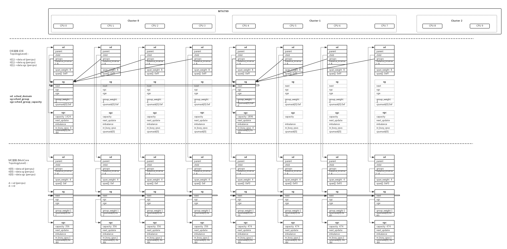


每个sched_domain中的参数也非常重要，在函数sd_init()中初始化，在smp负载均衡时会频繁的使用这些参数和标志：

<html>
<table>
    <tr>
        <td style="width: 200px;"> sd 参数 </td>
        <td style="width: 300px;"> tl MC 层级 </td>
        <td style="width: 300px;"> tl DIE 层级 </td>
    </tr>
    <tr>
        <td> sd->min_interval </td>
        <td> 4 </td>
        <td> 8 </td>
    </tr>
    <tr>
        <td> sd->max_interval </td>
        <td> 8 </td>
        <td> 16 </td>
    </tr>
    <tr>
        <td> sd->busy_factor </td>
        <td> 32 </td>
        <td> 32 </td>
    </tr>
    <tr>
        <td> sd->imbalance_pct </td>
        <td> 117 </td>
        <td> 125 </td>
    </tr>
    <tr>
        <td> sd->cache_nice_tries </td>
        <td> 1 </td>
        <td> 1 </td>
    </tr>
    <tr>
        <td> sd->busy_idx </td>
        <td> 2 </td>
        <td> 2 </td>
    </tr>
    <tr>
        <td> sd->idle_idx </td>
        <td> 0 </td>
        <td> 1 </td>
    </tr>
    <tr>
        <td> sd->newidle_idx </td>
        <td> 0 </td>
        <td> 0 </td>
    </tr>
    <tr>
        <td> sd->wake_idx </td>
        <td> 0 </td>
        <td> 0 </td>
    </tr>
    <tr>
        <td> sd->forkexec_idx </td>
        <td> 0 </td>
        <td> 0 </td>
    </tr>
    <tr>
        <td> sd->span_weight </td>
        <td> 4 </td>
        <td> 8 </td>
    </tr>
    <tr>
        <td> sd->balance_interval</td>
        <td> 4 </td>
        <td> 8 </td>
    </tr>
    <tr>
        <td> sd->level </td>
        <td> 0 </td>
        <td> 1 </td>
    </tr>
    <tr>
        <td> sd->flags </td>
        <td> 0x832f: SD_LOAD_BALANCE|SD_BALANCE_NEWIDLE|SD_BALANCE_EXEC|SD_BALANCE_FORK|SD_WAKE_AFFINE|SD_SHARE_POWERDOMAIN|SD_SHARE_PKG_RESOURCES|SD_SHARE_CAP_STATES 
        <td> 0x102f: SD_LOAD_BALANCE|SD_BALANCE_NEWIDLE|SD_BALANCE_EXEC|SD_BALANCE_FORK|SD_WAKE_AFFINE|SD_PREFER_SIBLING </td>
        </td>
    </tr>
</table>
</html>


update_top_cache_domain()函数中还把常用的一些sd进行了cache，我们通过打印得出每个cache实际对应的层次sd：

<html>
<table>
    <tr>
        <td style="width: 200px;"> cache sd </td>
        <td style="width: 300px;"> 说明 </td>
        <td style="width: 300px;"> 赋值 </td>
    </tr>
    <tr>
        <td> sd_busy </td>
        <td> per_cpu(sd_busy, cpu), </td>
        <td> 本cpu的tl DIE层级sd </td>
    </tr>
    <tr>
        <td> sd_llc </td>
        <td> per_cpu(sd_llc, cpu), </td>
        <td> 本cpu的tl MC层级sd </td>
    </tr>
    <tr>
        <td> sd_llc_size </td>
        <td> per_cpu(sd_llc_size, cpu), </td>
        <td> 4 </td>
    </tr>
    <tr>
        <td> sd_llc_id </td>
        <td> per_cpu(sd_llc_id, cpu), </td>
        <td> 0/4 </td>
    </tr>
    <tr>
        <td> sd_numa </td>
        <td> per_cpu(sd_numa, cpu), </td>
        <td> 0 </td>
    </tr>
    <tr>
        <td> sd_asym </td>
        <td> per_cpu(sd_asym, cpu), </td>
        <td> 0 </td>
    </tr>
    <tr>
        <td> sd_ea </td>
        <td> per_cpu(sd_ea, cpu), </td>
        <td> 本cpu的tl DIE层级sd </td>
    </tr>
    <tr>
        <td> sd_scs </td>
        <td> per_cpu(sd_scs, cpu), </td>
        <td> 本cpu的tl MC层级sd </td>
    </tr>
</table>
</html>

```
static void update_top_cache_domain(int cpu)
{
	struct sched_domain *sd;
	struct sched_domain *busy_sd = NULL, *ea_sd = NULL;
	int id = cpu;
	int size = 1;

	sd = highest_flag_domain(cpu, SD_SHARE_PKG_RESOURCES);
	if (sd) {
		id = cpumask_first(sched_domain_span(sd));
		size = cpumask_weight(sched_domain_span(sd));
		busy_sd = sd->parent; /* sd_busy */
	}
	rcu_assign_pointer(per_cpu(sd_busy, cpu), busy_sd);

	rcu_assign_pointer(per_cpu(sd_llc, cpu), sd);
	per_cpu(sd_llc_size, cpu) = size;
	per_cpu(sd_llc_id, cpu) = id;

	sd = lowest_flag_domain(cpu, SD_NUMA);
	rcu_assign_pointer(per_cpu(sd_numa, cpu), sd);

	sd = highest_flag_domain(cpu, SD_ASYM_PACKING);
	rcu_assign_pointer(per_cpu(sd_asym, cpu), sd);

	for_each_domain(cpu, sd) {
		if (sd->groups->sge)
			ea_sd = sd;
		else
			break;
	}
	rcu_assign_pointer(per_cpu(sd_ea, cpu), ea_sd);

	sd = highest_flag_domain(cpu, SD_SHARE_CAP_STATES);
	rcu_assign_pointer(per_cpu(sd_scs, cpu), sd);
}
```

```
[update_top_cache_domain] cpu0, sd_busy=0xffffffc156091300, sd_llc=0xffffffc15663c600, sd_llc_size=4, sd_llc_id=0, sd_numa=0x0, sd_asym=0x0, sd_ea=0xffffffc156091300, sd_scs=0xffffffc15663c600
[update_top_cache_domain] cpu1, sd_busy=0xffffffc156091900, sd_llc=0xffffffc15608f000, sd_llc_size=4, sd_llc_id=0, sd_numa=0x0, sd_asym=0x0, sd_ea=0xffffffc156091900, sd_scs=0xffffffc15608f000
[update_top_cache_domain] cpu2, sd_busy=0xffffffc156091600, sd_llc=0xffffffc15608fc00, sd_llc_size=4, sd_llc_id=0, sd_numa=0x0, sd_asym=0x0, sd_ea=0xffffffc156091600, sd_scs=0xffffffc15608fc00
[update_top_cache_domain] cpu3, sd_busy=0xffffffc156093000, sd_llc=0xffffffc15608f300, sd_llc_size=4, sd_llc_id=0, sd_numa=0x0, sd_asym=0x0, sd_ea=0xffffffc156093000, sd_scs=0xffffffc15608f300
[update_top_cache_domain] cpu4, sd_busy=0xffffffc156093c00, sd_llc=0xffffffc15608f900, sd_llc_size=4, sd_llc_id=4, sd_numa=0x0, sd_asym=0x0, sd_ea=0xffffffc156093c00, sd_scs=0xffffffc15608f900
[update_top_cache_domain] cpu5, sd_busy=0xffffffc156093300, sd_llc=0xffffffc15608f600, sd_llc_size=4, sd_llc_id=4, sd_numa=0x0, sd_asym=0x0, sd_ea=0xffffffc156093300, sd_scs=0xffffffc15608f600
[update_top_cache_domain] cpu6, sd_busy=0xffffffc156093900, sd_llc=0xffffffc156091000, sd_llc_size=4, sd_llc_id=4, sd_numa=0x0, sd_asym=0x0, sd_ea=0xffffffc156093900, sd_scs=0xffffffc156091000
[update_top_cache_domain] cpu7, sd_busy=0xffffffc156093600, sd_llc=0xffffffc156091c00, sd_llc_size=4, sd_llc_id=4, sd_numa=0x0, sd_asym=0x0, sd_ea=0xffffffc156093600, sd_scs=0xffffffc156091c00

[__sdt_alloc][tl MC] cpu0, &sd = 0xffffffc15663c600, &sg = 0xffffffc156062600, &sgc = 0xffffffc156062780 
[__sdt_alloc][tl MC] cpu1, &sd = 0xffffffc15608f000, &sg = 0xffffffc156056780, &sgc = 0xffffffc156090000 
[__sdt_alloc][tl MC] cpu2, &sd = 0xffffffc15608fc00, &sg = 0xffffffc156090d80, &sgc = 0xffffffc156090180 
[__sdt_alloc][tl MC] cpu3, &sd = 0xffffffc15608f300, &sg = 0xffffffc156090c00, &sgc = 0xffffffc156090300 
[__sdt_alloc][tl MC] cpu4, &sd = 0xffffffc15608f900, &sg = 0xffffffc156090a80, &sgc = 0xffffffc156090480 
[__sdt_alloc][tl MC] cpu5, &sd = 0xffffffc15608f600, &sg = 0xffffffc156090900, &sgc = 0xffffffc156090600 
[__sdt_alloc][tl MC] cpu6, &sd = 0xffffffc156091000, &sg = 0xffffffc156090780, &sgc = 0xffffffc156092000 
[__sdt_alloc][tl MC] cpu7, &sd = 0xffffffc156091c00, &sg = 0xffffffc156092d80, &sgc = 0xffffffc156092180 

[__sdt_alloc][tl DIE] cpu0, &sd = 0xffffffc156091300, &sg = 0xffffffc156092c00, &sgc = 0xffffffc156092300 
[__sdt_alloc][tl DIE] cpu1, &sd = 0xffffffc156091900, &sg = 0xffffffc156092a80, &sgc = 0xffffffc156092480 
[__sdt_alloc][tl DIE] cpu2, &sd = 0xffffffc156091600, &sg = 0xffffffc156092900, &sgc = 0xffffffc156092600 
[__sdt_alloc][tl DIE] cpu3, &sd = 0xffffffc156093000, &sg = 0xffffffc156092780, &sgc = 0xffffffc156094000 
[__sdt_alloc][tl DIE] cpu4, &sd = 0xffffffc156093c00, &sg = 0xffffffc156094d80, &sgc = 0xffffffc156094180 
[__sdt_alloc][tl DIE] cpu5, &sd = 0xffffffc156093300, &sg = 0xffffffc156094c00, &sgc = 0xffffffc156094300 
[__sdt_alloc][tl DIE] cpu6, &sd = 0xffffffc156093900, &sg = 0xffffffc156094a80, &sgc = 0xffffffc156094480 
[__sdt_alloc][tl DIE] cpu7, &sd = 0xffffffc156093600, &sg = 0xffffffc156094900, &sgc = 0xffffffc156094600 
```


mt6799在计算功耗(energy)和运算能力(capacity)时使用的表项如下：

```
kernel_init() -> kernel_init_freeable() -> sched_init_smp() -> init_sched_domains() -> build_sched_domains() -> init_sched_energy()/init_sched_groups_capacity()；


/* v1 FY */
struct upower_tbl_info upower_tbl_infos_FY[NR_UPOWER_BANK] = {
	INIT_UPOWER_TBL_INFOS(UPOWER_BANK_LL, upower_tbl_ll_1_FY),
	INIT_UPOWER_TBL_INFOS(UPOWER_BANK_L, upower_tbl_l_1_FY),
	INIT_UPOWER_TBL_INFOS(UPOWER_BANK_B, upower_tbl_b_1_FY),
	INIT_UPOWER_TBL_INFOS(UPOWER_BANK_CLS_LL, upower_tbl_cluster_ll_1_FY),
	INIT_UPOWER_TBL_INFOS(UPOWER_BANK_CLS_L, upower_tbl_cluster_l_1_FY),
	INIT_UPOWER_TBL_INFOS(UPOWER_BANK_CLS_B, upower_tbl_cluster_b_1_FY),
	INIT_UPOWER_TBL_INFOS(UPOWER_BANK_CCI, upower_tbl_cci_1_FY),
};

/* ver1 */
/* FY table */
struct upower_tbl upower_tbl_ll_1_FY = {
	.row = {
		{.cap = 100, .volt = 75000, .dyn_pwr = 9994, .lkg_pwr = {13681, 13681, 13681, 13681, 13681, 13681} },
		{.cap = 126, .volt = 75000, .dyn_pwr = 12585, .lkg_pwr = {13681, 13681, 13681, 13681, 13681, 13681} },
		{.cap = 148, .volt = 75000, .dyn_pwr = 14806, .lkg_pwr = {13681, 13681, 13681, 13681, 13681, 13681} },
		{.cap = 167, .volt = 75000, .dyn_pwr = 16656, .lkg_pwr = {13681, 13681, 13681, 13681, 13681, 13681} },
		{.cap = 189, .volt = 75000, .dyn_pwr = 18877, .lkg_pwr = {13681, 13681, 13681, 13681, 13681, 13681} },
		{.cap = 212, .volt = 75000, .dyn_pwr = 21098, .lkg_pwr = {13681, 13681, 13681, 13681, 13681, 13681} },
		{.cap = 230, .volt = 75700, .dyn_pwr = 23379, .lkg_pwr = {13936, 13936, 13936, 13936, 13936, 13936} },
		{.cap = 245, .volt = 78100, .dyn_pwr = 26490, .lkg_pwr = {14811, 14811, 14811, 14811, 14811, 14811} },
		{.cap = 263, .volt = 81100, .dyn_pwr = 30729, .lkg_pwr = {15958, 15958, 15958, 15958, 15958, 15958} },
		{.cap = 278, .volt = 83500, .dyn_pwr = 34409, .lkg_pwr = {16949, 16949, 16949, 16949, 16949, 16949} },
		{.cap = 293, .volt = 86000, .dyn_pwr = 38447, .lkg_pwr = {18036, 18036, 18036, 18036, 18036, 18036} },
		{.cap = 304, .volt = 88400, .dyn_pwr = 42166, .lkg_pwr = {19159, 19159, 19159, 19159, 19159, 19159} },
		{.cap = 319, .volt = 90800, .dyn_pwr = 46657, .lkg_pwr = {20333, 20333, 20333, 20333, 20333, 20333} },
		{.cap = 334, .volt = 93200, .dyn_pwr = 51442, .lkg_pwr = {21605, 21605, 21605, 21605, 21605, 21605} },
		{.cap = 345, .volt = 95000, .dyn_pwr = 55230, .lkg_pwr = {22560, 22560, 22560, 22560, 22560, 22560} },
		{.cap = 356, .volt = 97400, .dyn_pwr = 59928, .lkg_pwr = {24002, 24002, 24002, 24002, 24002, 24002} },
	},
	.lkg_idx = DEFAULT_LKG_IDX,
	.row_num = UPOWER_OPP_NUM,
	.nr_idle_states = NR_UPOWER_CSTATES,
	.idle_states = {
		{{0}, {7321} },
		{{0}, {7321} },
		{{0}, {7321} },
		{{0}, {7321} },
		{{0}, {7321} },
		{{0}, {7321} },
	},
};

struct upower_tbl upower_tbl_cluster_ll_1_FY = {
	.row = {
		{.cap = 100, .volt = 75000, .dyn_pwr = 3656, .lkg_pwr = {21729, 21729, 21729, 21729, 21729, 21729} },
		{.cap = 126, .volt = 75000, .dyn_pwr = 4604, .lkg_pwr = {21729, 21729, 21729, 21729, 21729, 21729} },
		{.cap = 148, .volt = 75000, .dyn_pwr = 5417, .lkg_pwr = {21729, 21729, 21729, 21729, 21729, 21729} },
		{.cap = 167, .volt = 75000, .dyn_pwr = 6094, .lkg_pwr = {21729, 21729, 21729, 21729, 21729, 21729} },
		{.cap = 189, .volt = 75000, .dyn_pwr = 6906, .lkg_pwr = {21729, 21729, 21729, 21729, 21729, 21729} },
		{.cap = 212, .volt = 75000, .dyn_pwr = 7719, .lkg_pwr = {21729, 21729, 21729, 21729, 21729, 21729} },
		{.cap = 230, .volt = 75700, .dyn_pwr = 8553, .lkg_pwr = {22134, 22134, 22134, 22134, 22134, 22134} },
		{.cap = 245, .volt = 78100, .dyn_pwr = 9692, .lkg_pwr = {23523, 23523, 23523, 23523, 23523, 23523} },
		{.cap = 263, .volt = 81100, .dyn_pwr = 11242, .lkg_pwr = {25344, 25344, 25344, 25344, 25344, 25344} },
		{.cap = 278, .volt = 83500, .dyn_pwr = 12589, .lkg_pwr = {26919, 26919, 26919, 26919, 26919, 26919} },
		{.cap = 293, .volt = 86000, .dyn_pwr = 14066, .lkg_pwr = {28646, 28646, 28646, 28646, 28646, 28646} },
		{.cap = 304, .volt = 88400, .dyn_pwr = 15427, .lkg_pwr = {30430, 30430, 30430, 30430, 30430, 30430} },
		{.cap = 319, .volt = 90800, .dyn_pwr = 17069, .lkg_pwr = {32293, 32293, 32293, 32293, 32293, 32293} },
		{.cap = 334, .volt = 93200, .dyn_pwr = 18820, .lkg_pwr = {34314, 34314, 34314, 34314, 34314, 34314} },
		{.cap = 345, .volt = 95000, .dyn_pwr = 20206, .lkg_pwr = {35830, 35830, 35830, 35830, 35830, 35830} },
		{.cap = 356, .volt = 97400, .dyn_pwr = 21925, .lkg_pwr = {38121, 38121, 38121, 38121, 38121, 38121} },
	},
	.lkg_idx = DEFAULT_LKG_IDX,
	.row_num = UPOWER_OPP_NUM,
	.nr_idle_states = NR_UPOWER_CSTATES,
	.idle_states = {
		{{0}, {11628} },
		{{0}, {11628} },
		{{0}, {11628} },
		{{0}, {11628} },
		{{0}, {11628} },
		{{0}, {11628} },
	},
};

struct upower_tbl upower_tbl_l_1_FY = {
	.row = {
		{.cap = 116, .volt = 75000, .dyn_pwr = 16431, .lkg_pwr = {22973, 22973, 22973, 22973, 22973, 22973} },
		{.cap = 152, .volt = 75000, .dyn_pwr = 21486, .lkg_pwr = {22973, 22973, 22973, 22973, 22973, 22973} },
		{.cap = 179, .volt = 75000, .dyn_pwr = 25278, .lkg_pwr = {22973, 22973, 22973, 22973, 22973, 22973} },
		{.cap = 201, .volt = 75000, .dyn_pwr = 28437, .lkg_pwr = {22973, 22973, 22973, 22973, 22973, 22973} },
		{.cap = 228, .volt = 75000, .dyn_pwr = 32229, .lkg_pwr = {22973, 22973, 22973, 22973, 22973, 22973} },
		{.cap = 255, .volt = 75000, .dyn_pwr = 36021, .lkg_pwr = {22973, 22973, 22973, 22973, 22973, 22973} },
		{.cap = 282, .volt = 75700, .dyn_pwr = 40559, .lkg_pwr = {23423, 23423, 23423, 23423, 23423, 23423} },
		{.cap = 304, .volt = 78100, .dyn_pwr = 46598, .lkg_pwr = {24968, 24968, 24968, 24968, 24968, 24968} },
		{.cap = 331, .volt = 81100, .dyn_pwr = 54680, .lkg_pwr = {26999, 26999, 26999, 26999, 26999, 26999} },
		{.cap = 349, .volt = 83500, .dyn_pwr = 61098, .lkg_pwr = {28760, 28760, 28760, 28760, 28760, 28760} },
		{.cap = 371, .volt = 86000, .dyn_pwr = 68965, .lkg_pwr = {30698, 30698, 30698, 30698, 30698, 30698} },
		{.cap = 393, .volt = 88400, .dyn_pwr = 77258, .lkg_pwr = {32706, 32706, 32706, 32706, 32706, 32706} },
		{.cap = 416, .volt = 90800, .dyn_pwr = 86141, .lkg_pwr = {34808, 34808, 34808, 34808, 34808, 34808} },
		{.cap = 438, .volt = 93200, .dyn_pwr = 95634, .lkg_pwr = {37097, 37097, 37097, 37097, 37097, 37097} },
		{.cap = 452, .volt = 95000, .dyn_pwr = 102406, .lkg_pwr = {38814, 38814, 38814, 38814, 38814, 38814} },
		{.cap = 474, .volt = 97400, .dyn_pwr = 112974, .lkg_pwr = {41424, 41424, 41424, 41424, 41424, 41424} },
	},
	.lkg_idx = DEFAULT_LKG_IDX,
	.row_num = UPOWER_OPP_NUM,
	.nr_idle_states = NR_UPOWER_CSTATES,
	.idle_states = {
		{{0}, {11926} },
		{{0}, {11926} },
		{{0}, {11926} },
		{{0}, {11926} },
		{{0}, {11926} },
		{{0}, {11926} },
	},
};

struct upower_tbl upower_tbl_cluster_l_1_FY = {
	.row = {
		{.cap = 116, .volt = 75000, .dyn_pwr = 2778, .lkg_pwr = {26537, 26537, 26537, 26537, 26537, 26537} },
		{.cap = 152, .volt = 75000, .dyn_pwr = 3633, .lkg_pwr = {26537, 26537, 26537, 26537, 26537, 26537} },
		{.cap = 179, .volt = 75000, .dyn_pwr = 4274, .lkg_pwr = {26537, 26537, 26537, 26537, 26537, 26537} },
		{.cap = 201, .volt = 75000, .dyn_pwr = 4808, .lkg_pwr = {26537, 26537, 26537, 26537, 26537, 26537} },
		{.cap = 228, .volt = 75000, .dyn_pwr = 5449, .lkg_pwr = {26537, 26537, 26537, 26537, 26537, 26537} },
		{.cap = 255, .volt = 75000, .dyn_pwr = 6090, .lkg_pwr = {26537, 26537, 26537, 26537, 26537, 26537} },
		{.cap = 282, .volt = 75700, .dyn_pwr = 6857, .lkg_pwr = {27058, 27058, 27058, 27058, 27058, 27058} },
		{.cap = 304, .volt = 78100, .dyn_pwr = 7878, .lkg_pwr = {28843, 28843, 28843, 28843, 28843, 28843} },
		{.cap = 331, .volt = 81100, .dyn_pwr = 9245, .lkg_pwr = {31188, 31188, 31188, 31188, 31188, 31188} },
		{.cap = 349, .volt = 83500, .dyn_pwr = 10330, .lkg_pwr = {33223, 33223, 33223, 33223, 33223, 33223} },
		{.cap = 371, .volt = 86000, .dyn_pwr = 11660, .lkg_pwr = {35461, 35461, 35461, 35461, 35461, 35461} },
		{.cap = 393, .volt = 88400, .dyn_pwr = 13062, .lkg_pwr = {37781, 37781, 37781, 37781, 37781, 37781} },
		{.cap = 416, .volt = 90800, .dyn_pwr = 14564, .lkg_pwr = {40209, 40209, 40209, 40209, 40209, 40209} },
		{.cap = 438, .volt = 93200, .dyn_pwr = 16169, .lkg_pwr = {42854, 42854, 42854, 42854, 42854, 42854} },
		{.cap = 452, .volt = 95000, .dyn_pwr = 17314, .lkg_pwr = {44837, 44837, 44837, 44837, 44837, 44837} },
		{.cap = 474, .volt = 97400, .dyn_pwr = 19101, .lkg_pwr = {47852, 47852, 47852, 47852, 47852, 47852} },
	},
	.lkg_idx = DEFAULT_LKG_IDX,
	.row_num = UPOWER_OPP_NUM,
	.nr_idle_states = NR_UPOWER_CSTATES,
	.idle_states = {
		{{0}, {13776} },
		{{0}, {13776} },
		{{0}, {13776} },
		{{0}, {13776} },
		{{0}, {13776} },
		{{0}, {13776} },
	},
};

struct upower_tbl upower_tbl_b_1_FY = {
	.row = {
		{.cap = 211, .volt = 75000, .dyn_pwr = 61732, .lkg_pwr = {71164, 71164, 71164, 71164, 71164, 71164} },
		{.cap = 268, .volt = 75000, .dyn_pwr = 78352, .lkg_pwr = {71164, 71164, 71164, 71164, 71164, 71164} },
		{.cap = 317, .volt = 75000, .dyn_pwr = 92598, .lkg_pwr = {71164, 71164, 71164, 71164, 71164, 71164} },
		{.cap = 358, .volt = 75000, .dyn_pwr = 104469, .lkg_pwr = {71164, 71164, 71164, 71164, 71164, 71164} },
		{.cap = 406, .volt = 75000, .dyn_pwr = 118715, .lkg_pwr = {71164, 71164, 71164, 71164, 71164, 71164} },
		{.cap = 447, .volt = 75000, .dyn_pwr = 130587, .lkg_pwr = {71164, 71164, 71164, 71164, 71164, 71164} },
		{.cap = 504, .volt = 75700, .dyn_pwr = 149968, .lkg_pwr = {72438, 72438, 72438, 72438, 72438, 72438} },
		{.cap = 561, .volt = 78100, .dyn_pwr = 177650, .lkg_pwr = {76806, 76806, 76806, 76806, 76806, 76806} },
		{.cap = 634, .volt = 81100, .dyn_pwr = 216546, .lkg_pwr = {82521, 82521, 82521, 82521, 82521, 82521} },
		{.cap = 691, .volt = 83500, .dyn_pwr = 250153, .lkg_pwr = {87447, 87447, 87447, 87447, 87447, 87447} },
		{.cap = 748, .volt = 86000, .dyn_pwr = 287210, .lkg_pwr = {92841, 92841, 92841, 92841, 92841, 92841} },
		{.cap = 805, .volt = 88400, .dyn_pwr = 326553, .lkg_pwr = {98397, 98397, 98397, 98397, 98397, 98397} },
	{.cap = 861, .volt = 90800, .dyn_pwr = 368886, .lkg_pwr = {104190, 104190, 104190, 104190, 104190, 104190} },
	{.cap = 918, .volt = 93200, .dyn_pwr = 414309, .lkg_pwr = {110456, 110456, 110456, 110456, 110456, 110456} },
	{.cap = 959, .volt = 95000, .dyn_pwr = 449514, .lkg_pwr = {115156, 115156, 115156, 115156, 115156, 115156} },
	{.cap = 1024, .volt = 97400, .dyn_pwr = 504548, .lkg_pwr = {122224, 122224, 122224, 122224, 122224, 122224} },
	},
	.lkg_idx = DEFAULT_LKG_IDX,
	.row_num = UPOWER_OPP_NUM,
	.nr_idle_states = NR_UPOWER_CSTATES,
	.idle_states = {
		{{0}, {38992} },
		{{0}, {38992} },
		{{0}, {38992} },
		{{0}, {38992} },
		{{0}, {38992} },
		{{0}, {38992} },
	},
};

struct upower_tbl upower_tbl_cluster_b_1_FY = {
	.row = {
		{.cap = 211, .volt = 75000, .dyn_pwr = 6408, .lkg_pwr = {27561, 27561, 27561, 27561, 27561, 27561} },
		{.cap = 268, .volt = 75000, .dyn_pwr = 8133, .lkg_pwr = {27561, 27561, 27561, 27561, 27561, 27561} },
		{.cap = 317, .volt = 75000, .dyn_pwr = 9612, .lkg_pwr = {27561, 27561, 27561, 27561, 27561, 27561} },
		{.cap = 358, .volt = 75000, .dyn_pwr = 10844, .lkg_pwr = {27561, 27561, 27561, 27561, 27561, 27561} },
		{.cap = 406, .volt = 75000, .dyn_pwr = 12323, .lkg_pwr = {27561, 27561, 27561, 27561, 27561, 27561} },
		{.cap = 447, .volt = 75000, .dyn_pwr = 13555, .lkg_pwr = {27561, 27561, 27561, 27561, 27561, 27561} },
		{.cap = 504, .volt = 75700, .dyn_pwr = 15567, .lkg_pwr = {28054, 28054, 28054, 28054, 28054, 28054} },
		{.cap = 561, .volt = 78100, .dyn_pwr = 18440, .lkg_pwr = {29746, 29746, 29746, 29746, 29746, 29746} },
		{.cap = 634, .volt = 81100, .dyn_pwr = 22478, .lkg_pwr = {31959, 31959, 31959, 31959, 31959, 31959} },
		{.cap = 691, .volt = 83500, .dyn_pwr = 25966, .lkg_pwr = {33867, 33867, 33867, 33867, 33867, 33867} },
		{.cap = 748, .volt = 86000, .dyn_pwr = 29813, .lkg_pwr = {35956, 35956, 35956, 35956, 35956, 35956} },
		{.cap = 805, .volt = 88400, .dyn_pwr = 33897, .lkg_pwr = {38108, 38108, 38108, 38108, 38108, 38108} },
		{.cap = 861, .volt = 90800, .dyn_pwr = 38291, .lkg_pwr = {40351, 40351, 40351, 40351, 40351, 40351} },
		{.cap = 918, .volt = 93200, .dyn_pwr = 43006, .lkg_pwr = {42778, 42778, 42778, 42778, 42778, 42778} },
		{.cap = 959, .volt = 95000, .dyn_pwr = 46661, .lkg_pwr = {44598, 44598, 44598, 44598, 44598, 44598} },
		{.cap = 1024, .volt = 97400, .dyn_pwr = 52373, .lkg_pwr = {47335, 47335, 47335, 47335, 47335, 47335} },
	},
	.lkg_idx = DEFAULT_LKG_IDX,
	.row_num = UPOWER_OPP_NUM,
	.nr_idle_states = NR_UPOWER_CSTATES,
	.idle_states = {
		{{0}, {15101} },
		{{0}, {15101} },
		{{0}, {15101} },
		{{0}, {15101} },
		{{0}, {15101} },
		{{0}, {15101} },
	},
};

struct upower_tbl upower_tbl_cci_1_FY = {
	.row = {
		{.cap = 0, .volt = 75000, .dyn_pwr = 2708, .lkg_pwr = {16248, 16248, 16248, 16248, 16248, 16248} },
		{.cap = 0, .volt = 75000, .dyn_pwr = 3611, .lkg_pwr = {16248, 16248, 16248, 16248, 16248, 16248} },
		{.cap = 0, .volt = 75000, .dyn_pwr = 4288, .lkg_pwr = {16248, 16248, 16248, 16248, 16248, 16248} },
		{.cap = 0, .volt = 75000, .dyn_pwr = 5191, .lkg_pwr = {16248, 16248, 16248, 16248, 16248, 16248} },
		{.cap = 0, .volt = 75000, .dyn_pwr = 5868, .lkg_pwr = {16248, 16248, 16248, 16248, 16248, 16248} },
		{.cap = 0, .volt = 75000, .dyn_pwr = 6771, .lkg_pwr = {16248, 16248, 16248, 16248, 16248, 16248} },
		{.cap = 0, .volt = 75700, .dyn_pwr = 7588, .lkg_pwr = {16537, 16537, 16537, 16537, 16537, 16537} },
		{.cap = 0, .volt = 78100, .dyn_pwr = 8811, .lkg_pwr = {17527, 17527, 17527, 17527, 17527, 17527} },
		{.cap = 0, .volt = 81100, .dyn_pwr = 10292, .lkg_pwr = {18822, 18822, 18822, 18822, 18822, 18822} },
		{.cap = 0, .volt = 83500, .dyn_pwr = 11750, .lkg_pwr = {19938, 19938, 19938, 19938, 19938, 19938} },
		{.cap = 0, .volt = 86000, .dyn_pwr = 13354, .lkg_pwr = {21159, 21159, 21159, 21159, 21159, 21159} },
		{.cap = 0, .volt = 88400, .dyn_pwr = 14737, .lkg_pwr = {22417, 22417, 22417, 22417, 22417, 22417} },
		{.cap = 0, .volt = 90800, .dyn_pwr = 16540, .lkg_pwr = {23728, 23728, 23728, 23728, 23728, 23728} },
		{.cap = 0, .volt = 93200, .dyn_pwr = 18472, .lkg_pwr = {25145, 25145, 25145, 25145, 25145, 25145} },
		{.cap = 0, .volt = 95000, .dyn_pwr = 19916, .lkg_pwr = {26208, 26208, 26208, 26208, 26208, 26208} },
		{.cap = 0, .volt = 97400, .dyn_pwr = 22077, .lkg_pwr = {27805, 27805, 27805, 27805, 27805, 27805} },
	},
	.lkg_idx = DEFAULT_LKG_IDX,
	.row_num = UPOWER_OPP_NUM,
	.nr_idle_states = NR_UPOWER_CSTATES,
	.idle_states = {
		{{0}, {8938} },
		{{0}, {8938} },
		{{0}, {8938} },
		{{0}, {8938} },
		{{0}, {8938} },
		{{0}, {8938} },
	},
};

```


### 4.1.2、smp负载均衡的实现

负载均衡和很多参数相关，下面列出了其中最重要的一些参数：

<html>
<table>
    <tr>
        <td style="width: 100px;"> 成员 </td>
        <td style="width: 100px;"> 所属结构 </td>
        <td style="width: 100px;"> 含义 </td>
        <td style="width: 200px;"> 更新/获取函数 </td>
        <td style="width: 200px;"> 计算方法 </td>
    </tr>
    <tr>
        <td> rq->cpu_capacity_orig </td>
        <td> rq </td>
        <td> 本cpu总的计算能力 </td>
        <td> init_sched_groups_capacity()/update_sd_lb_stats() -> update_group_capacity() -> update_cpu_capacity() </td>
        <td> capacity = arch_scale_cpu_capacity(sd, cpu) </td>
    </tr>
    <tr>
        <td> rq->cpu_capacity </td>
        <td> rq </td>
        <td> 本cpu cfs的计算能力 = 总capacity - rt占用的capacity </td>
        <td> init_sched_groups_capacity()/update_sd_lb_stats() -> update_group_capacity() -> update_cpu_capacity() </td>
        <td> capacity *= scale_rt_capacity(cpu); </td>
    </tr>
    <tr>
        <td> rq->rd->max_cpu_capacity </td>
        <td> rq->rd </td>
        <td> root_domain中最大的cpu计算能力 </td>
        <td> init_sched_groups_capacity()/update_sd_lb_stats() -> update_group_capacity() -> update_cpu_capacity() </td>
        <td>  </td>
    </tr>
    <tr>
        <td> rq->rd->overutilized </td>
        <td> rq->rd </td>
        <td>  </td>
        <td> update_sd_lb_stats() </td>
        <td>  </td>
    </tr>
    <tr>
        <td> rq->rd->overload </td>
        <td> rq->rd </td>
        <td>  </td>
        <td> update_sd_lb_stats() </td>
        <td>  </td>
    </tr>
    <tr>
        <td> rq->rt_avg </td>
        <td> rq </td>
        <td> 本cpu的rt平均负载 </td>
        <td> weighted_cpuload() -> cfs_rq_runnable_load_avg() </td>
        <td>  </td>
    </tr>
    <tr>
        <td> rq->cfs.runnable_load_avg </td>
        <td> rq->cfs(cfs_rq) </td>
        <td> 本cpu cfs_rq的runable平均负载 </td>
        <td> __update_load_avg()、cfs_rq_load_avg() </td>
        <td> (runnable时间*freq*weight)/LOAD_AVG_MAX </td>
    </tr>
    <tr>
        <td> rq->cfs.avg.load_avg </td>
        <td> rq->cfs.avg </td>
        <td> 本cpu cfs_rq的runnable平均负载 </td>
        <td> __update_load_avg() </td>
        <td> (runnable时间*freq*weight)/LOAD_AVG_MAX </td>
    </tr>
    <tr>
        <td> rq->cfs.avg.loadwop_avg </td>
        <td> rq->cfs.avg </td>
        <td> 本cpu cfs_rq的runnable平均负载，不含weight </td>
        <td> __update_load_avg() </td>
        <td> (runnable时间*freq)/LOAD_AVG_MAX </td>
    </tr>
    <tr>
        <td> rq->cfs.avg.util_avg </td>
        <td> rq->cfs.avg </td>
        <td> 本cpu cfs_rq的running负载 </td>
        <td> __update_load_avg()、cpu_util() -> __cpu_util() </td>
        <td> (running时间*freq*capacity)/LOAD_AVG_MAX </td>
    </tr>
    <tr>
        <td> cfs_rq->nr_running </td>
        <td> cfs_rq </td>
        <td> 本cfs_rq这个层次runnable的se的数量 </td>
        <td> enqueue_entity()/dequeue_entity() -> account_entity_enqueue() </td>
        <td>  </td>
    </tr>
    <tr>
        <td> cfs_rq->h_nr_running </td>
        <td> cfs_rq </td>
        <td> 本cfs_rq包含所有子cfs_rq nr_running的总和 </td>
        <td> enqueue_task_fair()/dequeue_task_fair </td>
        <td>  </td>
    </tr>
    <tr>
        <td> rq->nr_running </td>
        <td> rq </td>
        <td> 本cpu rq所有runnable的se的数量，包含所有子cfs_rq </td>
        <td> enqueue_task_fair()/dequeue_task_fair -> add_nr_running() </td>
        <td>  </td>
    </tr>
    <tr>
        <td>  </td>
        <td>  </td>
        <td>  </td>
        <td>  </td>
        <td>  </td>
    </tr>
    <tr>
        <td>  </td>
        <td>  </td>
        <td>  </td>
        <td>  </td>
        <td>  </td>
    </tr>
    <tr>
        <td>  </td>
        <td>  </td>
        <td>  </td>
        <td>  </td>
        <td>  </td>
    </tr>
</table>
</html>

#### 4.1.2.1、rebalance_domains()

> mtk对定义了3种power模式来兼容EAS的：EAS模式(energy_aware())、HMP模式(sched_feat(SCHED_HMP))、hybrid_support(EAS、HMP同时共存)；

> hybrid_support()模式下：一般负载均衡交给EAS；如果cpu_rq(cpu)->rd->overutilized负载已经严重不均衡，交给HMP；

系统在scheduler_tick()中会定期的检测smp负载均衡的时间是否已到，如果到时触发SCHED_SOFTIRQ软中断：

```
void scheduler_tick(void)
{


#ifdef CONFIG_SMP
	rq->idle_balance = idle_cpu(cpu);
	trigger_load_balance(rq);
#endif

}

|→

/*
 * Trigger the SCHED_SOFTIRQ if it is time to do periodic load balancing.
 */
void trigger_load_balance(struct rq *rq)
{
	/* Don't need to rebalance while attached to NULL domain */
	if (unlikely(on_null_domain(rq)))
		return;

	if (time_after_eq(jiffies, rq->next_balance))
		raise_softirq(SCHED_SOFTIRQ);
#ifdef CONFIG_NO_HZ_COMMON
	if (nohz_kick_needed(rq))
		nohz_balancer_kick();
#endif
}
```

SCHED_SOFTIRQ软中断的执行主体为run_rebalance_domains：

```
__init void init_sched_fair_class(void)
{

	open_softirq(SCHED_SOFTIRQ, run_rebalance_domains);

}

/*
 * run_rebalance_domains is triggered when needed from the scheduler tick.
 * Also triggered for nohz idle balancing (with nohz_balancing_kick set).
 */
static void run_rebalance_domains(struct softirq_action *h)
{
	struct rq *this_rq = this_rq();
	enum cpu_idle_type idle = this_rq->idle_balance ?
						CPU_IDLE : CPU_NOT_IDLE;
	int this_cpu = smp_processor_id();

	/* bypass load balance of HMP if EAS consideration */
	if ((!energy_aware() && sched_feat(SCHED_HMP)) ||
			(hybrid_support() && cpu_rq(this_cpu)->rd->overutilized))
		hmp_force_up_migration(this_cpu);

	/*
	 * If this cpu has a pending nohz_balance_kick, then do the
	 * balancing on behalf of the other idle cpus whose ticks are
	 * stopped. Do nohz_idle_balance *before* rebalance_domains to
	 * give the idle cpus a chance to load balance. Else we may
	 * load balance only within the local sched_domain hierarchy
	 * and abort nohz_idle_balance altogether if we pull some load.
	 */
	nohz_idle_balance(this_rq, idle);
	rebalance_domains(this_rq, idle);
}
```

我们分析最核心的函数rebalance_domains()：

***需要重点提一下的是***：负载计算计算了3种负载(load_avg、loadwop_avg、util_avg)，rebalance_domains主要使用其中的***load_avg***，乘(SCHED_CAPACITY_SCALE/capacity)加以转换。

- 1、逐级轮询本cpu的sd，判断本sd的时间间隔是否到期，如果到期做load_balance()；


| tl层级 | cpu_busy? | sd->balance_interval | sd->busy_factor | sd balance interval |
|---|---|---|---|---|
MC层级 | idle | 4 |1 | 4ms
MC层级 | busy | 4 | 32 | 128ms
DIE层级 | idle | 8 |1 | 8ms
DIE层级 | busy | 8 | 32 | 256ms
| | |  |  | rq->next_balance = min(上述值)


- 2、在load_balance()中判断在本层级sd本cpu的当前情况是否适合充当dst_cpu，在should_we_balance()做各种判断，做dst_cpu的条件有：要么是本sg的第一个idle cpu，要么是本sg的第一个cpu。dst_cpu是作为目的cpu让负载高的cpu迁移进程过来，如果本cpu不符合条件中断操作；

- 3、继续find_busiest_group()，在sg链表中找出负载最重的sg。核心计算在update_sd_lb_stats()、update_sg_lb_stats()中。如果dst_cpu所在的local_group负载大于busiest sg，或者大于sds平均负载，中断操作；如果成功计算需要迁移的负载env->imbalance，为min((sds->avg - local), (busiest - sds->avg))；

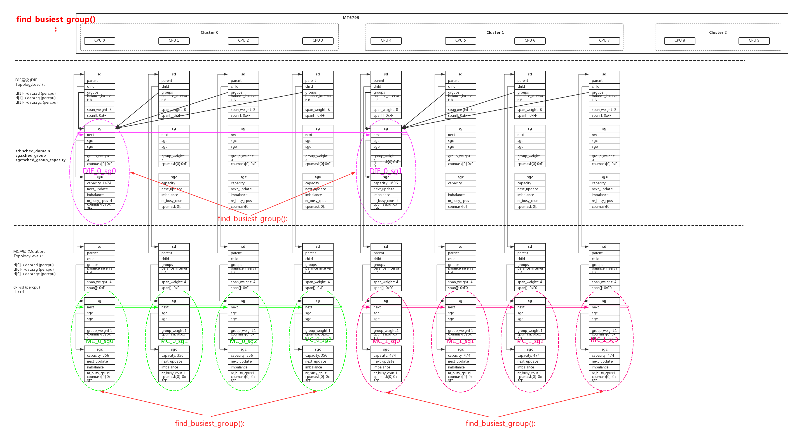

- 3.1、根据当前cpu的idle状态计算cpu load(rq->cpu_load[])时选用的index值：

tl层级 | busy_idx | idle_idx | newidle_idx
---|---|---|---
MC层级 | 2 | 0 | 0
DIE层级 | 2 | 1 | 0

- 3.2、计算sg负载sgs，选择sgs->avg_load最大的sg作为busiest_group。其中几个关键值的计算如下：

负载值 | 计算方法 | 说明 | 
---|---|---|
sgs->group_load | += cpu_rq(cpu)->cpu_load[index-1] | 累加cpu的load值，相对值(每个cpu的最大值都是1024)，且带weight分量 |
sgs->group_util | += cpu_rq(cpu)->cfs.avg.util_avg | 累加cpu cfs running值，绝对值(不同cluster，只有最大capacity能力的cpu最大值为1024) | 
sgs->group_capacity | += (arch_scale_cpu_capacity(sd, cpu)*(1-rt_capacity)) | 累加cpu的capacity，绝对值(不同cluster，只有最大capacity能力的cpu最大值为1024) |
sgs->avg_load | = (sgs->group_load*SCHED_CAPACITY_SCALE) / sgs->group_capacity | group_load做了转换，和group_capacity成反比 |

- 3.3、在计算sg负载时，几个关键状态的计算如下：

状态值 | 计算方法 | 说明 | 
---|---|---|
sgs->group_no_capacity | (sgs->group_capacity * 100) < (sgs->group_util * env->sd->imbalance_pct) | 预留一定空间(比例为imbalance_pct)，sg运算能力已经不够了，sgs->group_type=group_overloaded |
dst_rq->rd->overutilized|(capacity_of(cpu) * 1024) < (cpu_util(cpu) * capacity_margin)|预留一定空间(比例为capacity_margin)，sg运算能力已经不够了|
dst_rq->rd->overload|rq->nr_running > 1|sg中任何一个cpu的runnable进程大于1|

比例参数imbalance_pct、capacity_margin的值为：

tl层级 | sd->imbalance_pct (/100) | capacity_margin (/1024) | 
---|---|---|
MC层级 | 117 | 1280 | 
DIE层级 | 125 | 1280 |

- 3.4、计算env->imbalance，这个是rebalance需要迁移的负载量：

负载值 | 计算方法 | 说明 | 
---|---|---|
sds->total_load|+= sgs->group_load|---|
sds->total_capacity|+= sgs->group_capacity|---|
sds.avg_load|(SCHED_CAPACITY_SCALE * sds.total_load)/ sds.total_capacity|---|
env->imbalance|min((busiest->avg_load - sds->avg_load)*busiest->group_capacity, (sds->avg_load - local->avg_load)*local->group_capacity) / SCHED_CAPACITY_SCALE)|感觉这里计算有bug啊，前面是1024/capcity，后面是capacity/1024，很混乱|


- 4、继续find_busiest_queue()，查找busiest sg中负载最重的cpu。

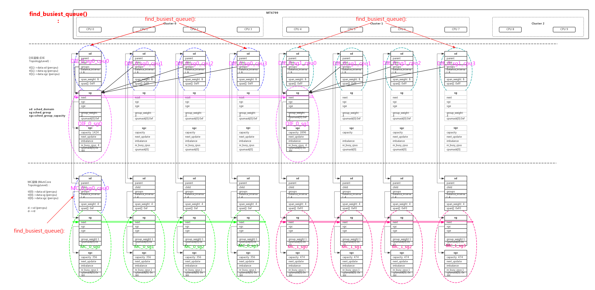

- 4.1、找出sg中weighted_cpuload*capacity_of值最大的cpu：

负载值 | 计算方法 | 说明 | 
---|---|---|
weighted_cpuload(cpu)|cpu_rq(cpu)->cfs->runnable_load_avg|cpu的load值，相对值(每个cpu的最大值都是1024)，且带weight分量|
capacity_of(cpu)|arch_scale_cpu_capacity(sd, cpu)*(1-rt_capacity)|cpu cfs running值，绝对值(不同cluster，只有最大capacity能力的cpu最大值为1024)|
weighted_cpuload(cpu)*capacity_of(cpu)|---|最大值为busiest sg中busiest cpu rq|


- 5、迁移busiest cpu的负载到本地dst cpu上，迁移的负载额度为env->imbalance：detach_tasks() -> attach_tasks()；


- 6、处理几种因为进程亲和力问题，busiest cpu不能迁移走足够的进程：LBF_DST_PINNED尝试更改dst_cpu为本地cpu相同sg的其他cpu；LBF_SOME_PINNED当前不能均衡尝试让父sd均衡；LBF_ALL_PINNED一个进程都不能迁移尝试去掉dst_cpu重新进行load_balance()；


- 7、如果经过各种尝试后还是没有一个进程迁移成功，最后尝试一次active_balance;


```
/*
 * It checks each scheduling domain to see if it is due to be balanced,
 * and initiates a balancing operation if so.
 *
 * Balancing parameters are set up in init_sched_domains.
 * Balance的参数是在sched_domains初始化时设置的
 */
static void rebalance_domains(struct rq *rq, enum cpu_idle_type idle)
{
	int continue_balancing = 1;
	int cpu = rq->cpu;
	unsigned long interval;
	struct sched_domain *sd;
	/* 默认本cpu rq下一次的balance时间为60s以后 */
	/* Earliest time when we have to do rebalance again */
	unsigned long next_balance = jiffies + 60*HZ;
	int update_next_balance = 0;
	int need_serialize, need_decay = 0;
	u64 max_cost = 0;

    /* (1) 更新cpu rq中所有cfs_rq的最新负载 */
	update_blocked_averages(cpu);

	rcu_read_lock();
	/* (2) 对本cpu每个层次的schedule_domain进行扫描 */
	for_each_domain(cpu, sd) {
	
	    /* (3) 以1HZ的频率对sd->max_newidle_lb_cost进行老化，
		    老化公式： new = old * (253/256)
		 */
		/*
		 * Decay the newidle max times here because this is a regular
		 * visit to all the domains. Decay ~1% per second.
		 */
		if (time_after(jiffies, sd->next_decay_max_lb_cost)) {
			sd->max_newidle_lb_cost =
				(sd->max_newidle_lb_cost * 253) / 256;
			sd->next_decay_max_lb_cost = jiffies + HZ;
			need_decay = 1;
		}
		max_cost += sd->max_newidle_lb_cost;

		if (!(sd->flags & SD_LOAD_BALANCE))
			continue;

#ifndef CONFIG_MTK_LOAD_BALANCE_ENHANCEMENT
		/* nohz CPU need GTS balance to migrate tasks for more than 2 clusters*/
		/* Don't consider GTS balance if hybrid support */
		if (hybrid_support()) {
			if (sd->child || (!sd->child &&
				(rcu_dereference(per_cpu(sd_scs, cpu)) == NULL)))
			continue;
		}
#endif

        /* (4) 如果continue_balancing = 0，指示停止当前层级的load balance
            因为shed_group中其他的cpu正在这个层次做load_balance
         */
		/*
		 * Stop the load balance at this level. There is another
		 * CPU in our sched group which is doing load balancing more
		 * actively.
		 */
		if (!continue_balancing) {
			if (need_decay)
				continue;
			break;
		}

        /* (5) 计算当前层次schedule_domain的balance间隔时间 */
		interval = get_sd_balance_interval(sd, idle != CPU_IDLE);

        /* (6) 如果需要串行化(SD_SERIALIZE)，做balance之前需要持锁 */
		need_serialize = sd->flags & SD_SERIALIZE;
		if (need_serialize) {
			if (!spin_trylock(&balancing))
				goto out;
		}

        /* (7) 如果本sd的balance间隔时间已到，进行实际的load_balance() */
		if (time_after_eq(jiffies, sd->last_balance + interval)) {
			if (load_balance(cpu, rq, sd, idle, &continue_balancing)) {
				/*
				 * The LBF_DST_PINNED logic could have changed
				 * env->dst_cpu, so we can't know our idle
				 * state even if we migrated tasks. Update it.
				 */
				idle = idle_cpu(cpu) ? CPU_IDLE : CPU_NOT_IDLE;
			}
			sd->last_balance = jiffies;
			interval = get_sd_balance_interval(sd, idle != CPU_IDLE);
		}
		if (need_serialize)
			spin_unlock(&balancing);
out:
        /* (8) 如果sd下一次balance时间在，rq的balance时间之前，需要更新rq的balance时间
            rq的下一次balance时间：next_balance  (默认是60s后)
            本sd的下一次balance时间：sd->last_balance + interval
            rq的下一次balance时间需要选取多个sd中时间最近的一个
         */
		if (time_after(next_balance, sd->last_balance + interval)) {
			next_balance = sd->last_balance + interval;
			update_next_balance = 1;
		}
	}
	if (need_decay) {
		/*
		 * Ensure the rq-wide value also decays but keep it at a
		 * reasonable floor to avoid funnies with rq->avg_idle.
		 */
		rq->max_idle_balance_cost =
			max((u64)sysctl_sched_migration_cost, max_cost);
	}
	rcu_read_unlock();

    /* (8.1) 更新rq的balance时间 */
	/*
	 * next_balance will be updated only when there is a need.
	 * When the cpu is attached to null domain for ex, it will not be
	 * updated.
	 */
	if (likely(update_next_balance)) {
		rq->next_balance = next_balance;

#ifdef CONFIG_NO_HZ_COMMON
		/*
		 * If this CPU has been elected to perform the nohz idle
		 * balance. Other idle CPUs have already rebalanced with
		 * nohz_idle_balance() and nohz.next_balance has been
		 * updated accordingly. This CPU is now running the idle load
		 * balance for itself and we need to update the
		 * nohz.next_balance accordingly.
		 */
		if ((idle == CPU_IDLE) && time_after(nohz.next_balance, rq->next_balance))
			nohz.next_balance = rq->next_balance;
#endif
	}
}

|→

static int load_balance(int this_cpu, struct rq *this_rq,
			struct sched_domain *sd, enum cpu_idle_type idle,
			int *continue_balancing)
{
	int ld_moved, cur_ld_moved, active_balance = 0;
	struct sched_domain *sd_parent = sd->parent;
	struct sched_group *group;
	struct rq *busiest;
	unsigned long flags;
	struct cpumask *cpus = this_cpu_cpumask_var_ptr(load_balance_mask);

    /* (7.1) 构造Load_balance需要的数据结构：
        .sd		= sd,   //本cpu在本tl层次的sd
        .dst_cpu	= this_cpu,   // 目的cpu是本cpu
		.dst_rq		= this_rq,    // 目的rq是本cpu的rq
		
		// load_balance的目的是找出负载最重的cpu，并将一部分负载迁移到本cpu上
     */
	struct lb_env env = {
		.sd		= sd,
		.dst_cpu	= this_cpu,
		.dst_rq		= this_rq,
		.dst_grpmask    = sched_group_cpus(sd->groups),
		.idle		= idle,
		.loop_break	= sched_nr_migrate_break,
		.cpus		= cpus,
		.fbq_type	= all,
		.tasks		= LIST_HEAD_INIT(env.tasks),
	};

	/*
	 * For NEWLY_IDLE load_balancing, we don't need to consider
	 * other cpus in our group
	 */
	if (idle == CPU_NEWLY_IDLE)
		env.dst_grpmask = NULL;

	cpumask_copy(cpus, cpu_active_mask);

	schedstat_inc(sd, lb_count[idle]);

redo:
    /* (7.2) check当前cpu是否适合作为dst_cpu(即light cpu，需要分担其他cpu的负载) */
	if (!should_we_balance(&env)) {
		*continue_balancing = 0;
		goto out_balanced;
	}

    /* (7.3) 找出本层级sched_group链表中，负载最重的(busiest)的sched_group */
	group = find_busiest_group(&env);
	if (!group) {
		schedstat_inc(sd, lb_nobusyg[idle]);
		goto out_balanced;
	}

    /* (7.4) 找出busiest sched_group中sched_group的rq，即负载最重cpu对应的rq */
	busiest = find_busiest_queue(&env, group);
	if (!busiest) {
		schedstat_inc(sd, lb_nobusyq[idle]);
		goto out_balanced;
	}

	BUG_ON(busiest == env.dst_rq);

	schedstat_add(sd, lb_imbalance[idle], env.imbalance);

	env.src_cpu = busiest->cpu;
	env.src_rq = busiest;

	ld_moved = 0;
	/* (7.5) 判断busiest cpu rq中的runnable进程数 > 1？
	    至少有进程可以迁移走
	 */
	if (busiest->nr_running > 1) {
		/*
		 * Attempt to move tasks. If find_busiest_group has found
		 * an imbalance but busiest->nr_running <= 1, the group is
		 * still unbalanced. ld_moved simply stays zero, so it is
		 * correctly treated as an imbalance.
		 */
		env.flags |= LBF_ALL_PINNED;
		env.loop_max  = min(sysctl_sched_nr_migrate, busiest->nr_running);

more_balance:
		raw_spin_lock_irqsave(&busiest->lock, flags);

        /* (7.6) 从busiest rq中detach进程， 
            env->imbalance：需要迁移的负载大小
            cur_ld_moved：实际迁移的进程数
         */
		/*
		 * cur_ld_moved - load moved in current iteration
		 * ld_moved     - cumulative load moved across iterations
		 */
		cur_ld_moved = detach_tasks(&env);
		
		/* (7.7) busiest cpu负载减轻后，
		    在sched_freq中判断cpu频率是否可以调低
		 */
		/*
		 * We want to potentially lower env.src_cpu's OPP.
		 */
		if (cur_ld_moved)
			update_capacity_of(env.src_cpu, SCHE_ONESHOT);

		/*
		 * We've detached some tasks from busiest_rq. Every
		 * task is masked "TASK_ON_RQ_MIGRATING", so we can safely
		 * unlock busiest->lock, and we are able to be sure
		 * that nobody can manipulate the tasks in parallel.
		 * See task_rq_lock() family for the details.
		 */

		raw_spin_unlock(&busiest->lock);

        /* (7.8) 把迁移过来的任务attack到dest_cpu上 */
		if (cur_ld_moved) {
			attach_tasks(&env);
			ld_moved += cur_ld_moved;
		}

		local_irq_restore(flags);

        /* (7.9) LBF_NEED_BREAK设置，说明balance还没有完成，循环只是出来休息一下，
            继续重新balance
         */
		if (env.flags & LBF_NEED_BREAK) {
			env.flags &= ~LBF_NEED_BREAK;
			goto more_balance;
		}

        /* (7.10) 设置了LBF_DST_PINNED标志，并且env.imbalance > 0
            说明src_cpu上有些进程因为affinity的原因不能迁移到dst_cpu但是能迁移到同sg的new_dst_cpu上
            把dst_cpu更改为new_dst_cpu，重新开始balance流程
         */
		/*
		 * Revisit (affine) tasks on src_cpu that couldn't be moved to
		 * us and move them to an alternate dst_cpu in our sched_group
		 * where they can run. The upper limit on how many times we
		 * iterate on same src_cpu is dependent on number of cpus in our
		 * sched_group.
		 *
		 * This changes load balance semantics a bit on who can move
		 * load to a given_cpu. In addition to the given_cpu itself
		 * (or a ilb_cpu acting on its behalf where given_cpu is
		 * nohz-idle), we now have balance_cpu in a position to move
		 * load to given_cpu. In rare situations, this may cause
		 * conflicts (balance_cpu and given_cpu/ilb_cpu deciding
		 * _independently_ and at _same_ time to move some load to
		 * given_cpu) causing exceess load to be moved to given_cpu.
		 * This however should not happen so much in practice and
		 * moreover subsequent load balance cycles should correct the
		 * excess load moved.
		 */
		if ((env.flags & LBF_DST_PINNED) && env.imbalance > 0) {

			/* Prevent to re-select dst_cpu via env's cpus */
			cpumask_clear_cpu(env.dst_cpu, env.cpus);

			env.dst_rq	 = cpu_rq(env.new_dst_cpu);
			env.dst_cpu	 = env.new_dst_cpu;
			env.flags	&= ~LBF_DST_PINNED;
			env.loop	 = 0;
			env.loop_break	 = sched_nr_migrate_break;

			/*
			 * Go back to "more_balance" rather than "redo" since we
			 * need to continue with same src_cpu.
			 */
			goto more_balance;
		}

        /* (7.11) 设置了LBF_SOME_PINNED标志，说明有些进程因为affinity迁移失败，  
            设置当前sd的parent sd的 sgc->imbalance，让parent sd做rebalance的概率增高
         */
		/*
		 * We failed to reach balance because of affinity.
		 */
		if (sd_parent) {
			int *group_imbalance = &sd_parent->groups->sgc->imbalance;

			if ((env.flags & LBF_SOME_PINNED) && env.imbalance > 0)
				*group_imbalance = 1;
		}

        /* (7.12) 如果LBF_ALL_PINNED标志一直被置位，
            说明busiest_cpu因为affinity没有一个进程迁移成功，哪怕迁移到dst_cpu同sg的其他cpu也没有一个成功
            将busiest cpu从全局cpu mask去掉，重新做整个流程：find_busiest_group -> find_busiest_queue -> detach_tasks -> attach_tasks
         */
		/* All tasks on this runqueue were pinned by CPU affinity */
		if (unlikely(env.flags & LBF_ALL_PINNED)) {
			cpumask_clear_cpu(cpu_of(busiest), cpus);
			if (!cpumask_empty(cpus)) {
				env.loop = 0;
				env.loop_break = sched_nr_migrate_break;
				goto redo;
			}
			goto out_all_pinned;
		}
	}

    /* (7.13) 经过几轮的努力尝试，最终迁移的进程数ld_moved还是0，说明balance失败 */
	if (!ld_moved) {
		schedstat_inc(sd, lb_failed[idle]);
		/*
		 * Increment the failure counter only on periodic balance.
		 * We do not want newidle balance, which can be very
		 * frequent, pollute the failure counter causing
		 * excessive cache_hot migrations and active balances.
		 */
		if (idle != CPU_NEWLY_IDLE)
			if (env.src_grp_nr_running > 1)
				sd->nr_balance_failed++;

        /* (7.14) 最后一次尝试迁移一个进程 */
		if (need_active_balance(&env)) {
			raw_spin_lock_irqsave(&busiest->lock, flags);

            /* (7.15) 如果当前cpu不在busiest->curr进程的affinity之内，返回失败 */
			/* don't kick the active_load_balance_cpu_stop,
			 * if the curr task on busiest cpu can't be
			 * moved to this_cpu
			 */
			if (!cpumask_test_cpu(this_cpu,
					tsk_cpus_allowed(busiest->curr))) {
				raw_spin_unlock_irqrestore(&busiest->lock,
							    flags);
				env.flags |= LBF_ALL_PINNED;
				goto out_one_pinned;
			}

			/*
			 * ->active_balance synchronizes accesses to
			 * ->active_balance_work.  Once set, it's cleared
			 * only after active load balance is finished.
			 */
			if (!busiest->active_balance && !cpu_park(cpu_of(busiest))) {
				busiest->active_balance = 1; /* load_balance */
				busiest->push_cpu = this_cpu;
				active_balance = 1;
			}
			raw_spin_unlock_irqrestore(&busiest->lock, flags);

            /* (7.16) 迁移busiest->curr进程当前期cpu */
			if (active_balance) {
				if (stop_one_cpu_dispatch(cpu_of(busiest),
					active_load_balance_cpu_stop, busiest,
					&busiest->active_balance_work)) {
					raw_spin_lock_irqsave(&busiest->lock, flags);
					busiest->active_balance = 0;
					active_balance = 0;
					raw_spin_unlock_irqrestore(&busiest->lock, flags);
				}
			}

			/*
			 * We've kicked active balancing, reset the failure
			 * counter.
			 */
			sd->nr_balance_failed = sd->cache_nice_tries+1;
		}
	} else
		sd->nr_balance_failed = 0;

	if (likely(!active_balance)) {
		/* We were unbalanced, so reset the balancing interval */
		sd->balance_interval = sd->min_interval;
	} else {
		/*
		 * If we've begun active balancing, start to back off. This
		 * case may not be covered by the all_pinned logic if there
		 * is only 1 task on the busy runqueue (because we don't call
		 * detach_tasks).
		 */
		if (sd->balance_interval < sd->max_interval)
			sd->balance_interval *= 2;
	}

	goto out;

out_balanced:
	/*
	 * We reach balance although we may have faced some affinity
	 * constraints. Clear the imbalance flag if it was set.
	 */
	if (sd_parent) {
		int *group_imbalance = &sd_parent->groups->sgc->imbalance;

		if (*group_imbalance)
			*group_imbalance = 0;
	}

out_all_pinned:
	/*
	 * We reach balance because all tasks are pinned at this level so
	 * we can't migrate them. Let the imbalance flag set so parent level
	 * can try to migrate them.
	 */
	schedstat_inc(sd, lb_balanced[idle]);

	sd->nr_balance_failed = 0;

out_one_pinned:
	/* tune up the balancing interval */
	if (((env.flags & LBF_ALL_PINNED) &&
			sd->balance_interval < MAX_PINNED_INTERVAL) ||
			(sd->balance_interval < sd->max_interval))
		sd->balance_interval *= 2;

	ld_moved = 0;
out:
	return ld_moved;
}

||→

static int should_we_balance(struct lb_env *env)
{
	struct sched_group *sg = env->sd->groups;
	struct cpumask *sg_cpus, *sg_mask;
	int cpu, balance_cpu = -1;

    /* (7.2.1) 如果本cpu为CPU_NEWLY_IDLE，直接符合迁移条件 */
	/*
	 * In the newly idle case, we will allow all the cpu's
	 * to do the newly idle load balance.
	 */
	if (env->idle == CPU_NEWLY_IDLE)
		return 1;

	sg_cpus = sched_group_cpus(sg);
	sg_mask = sched_group_mask(sg);
	/* (7.2.2) 本sched_group的第一个idle cpu适合做load_balance */
	/* Try to find first idle cpu */
	for_each_cpu_and(cpu, sg_cpus, env->cpus) {
		if (!cpumask_test_cpu(cpu, sg_mask) || !idle_cpu(cpu))
			continue;

		balance_cpu = cpu;
		break;
	}

    /* (7.2.3) 没有idle cpu，则选取本sched_group的第一个cpu做load_balance */
	if (balance_cpu == -1)
		balance_cpu = group_balance_cpu(sg);

    /* (7.2.4) 不满足上述条件的cpu，不适合来启动load_balance */
	/*
	 * First idle cpu or the first cpu(busiest) in this sched group
	 * is eligible for doing load balancing at this and above domains.
	 */
	return balance_cpu == env->dst_cpu;
}

||→

static struct sched_group *find_busiest_group(struct lb_env *env)
{
	struct sg_lb_stats *local, *busiest;
	struct sd_lb_stats sds;
	int local_cpu = 0, busiest_cpu = 0;
	struct cpumask *busiest_cpumask;
	int same_clus = 0;

	init_sd_lb_stats(&sds);

    /* (7.3.1) 更新本层级sched_group链表中，每个sched_group的负载,
        并选出busiest的一个sched_group
     */
	/*
	 * Compute the various statistics relavent for load balancing at
	 * this level.
	 */
	update_sd_lb_stats(env, &sds);

	local = &sds.local_stat;
	busiest = &sds.busiest_stat;

	if (sds.busiest) {
		busiest_cpumask = sched_group_cpus(sds.busiest);
		local_cpu = env->dst_cpu;
		busiest_cpu = group_first_cpu(sds.busiest);

		same_clus = is_the_same_domain(local_cpu, busiest_cpu);
		mt_sched_printf(sched_lb, "%s: local_cpu=%d, busiest_cpu=%d, busiest_mask=%lu, same_cluster=%d",
				__func__, local_cpu, busiest_cpu, busiest_cpumask->bits[0], same_clus);
	}
    
    /* (7.3.2) 如果EAS使能，跨cluster的任务迁移使用EAS来做 */
	if (energy_aware() && !env->dst_rq->rd->overutilized && !same_clus)
		goto out_balanced;

    /* (7.3.3) */
	/* ASYM feature bypasses nice load balance check */
	if ((env->idle == CPU_IDLE || env->idle == CPU_NEWLY_IDLE) &&
	    check_asym_packing(env, &sds))
		return sds.busiest;

    /* (7.3.4) busiest sg上没有负载，返回空 */
	/* There is no busy sibling group to pull tasks from */
	if (!sds.busiest || busiest->sum_nr_running == 0) {
		if (!sds.busiest)
			mt_sched_printf(sched_lb, "[%s] %d: fail no busiest ", __func__, env->src_cpu);
		else
			mt_sched_printf(sched_lb, "[%s] %d: fail busiest no task ", __func__, env->src_cpu);
		goto out_balanced;
	}

    /* (7.3.5) sg链表里的平均负载 */
	sds.avg_load = (SCHED_CAPACITY_SCALE * sds.total_load)
						/ sds.total_capacity;

    /* (7.3.6) 如果busiest sg低一级别的因为cpu affinity没有balance成功，设置了group_imbalanced标志 
        强制在当前级别上进行balance
     */
	/*
	 * If the busiest group is imbalanced the below checks don't
	 * work because they assume all things are equal, which typically
	 * isn't true due to cpus_allowed constraints and the like.
	 */
	if (busiest->group_type == group_imbalanced)
		goto force_balance;

    /* (7.3.7) 如果dest cpu/group很闲，busiest负载很重，  
        强制开展balance
     */
	/* SD_BALANCE_NEWIDLE trumps SMP nice when underutilized */
	if (env->idle == CPU_NEWLY_IDLE && group_has_capacity(env, local) &&
	    busiest->group_no_capacity)
		goto force_balance;

    /* (7.3.8)  如果dest_cpu所在sg的负载都大于busiest sg的负载，
        放弃balance
     */
	/*
	 * If the local group is busier than the selected busiest group
	 * don't try and pull any tasks.
	 */
	if (local->avg_load >= busiest->avg_load)
		goto out_balanced;

    /* (7.3.9)  如果dest_cpu所在sg的负载都大于sg链表的平均负载，
        放弃balance
     */
	/*
	 * Don't pull any tasks if this group is already above the domain
	 * average load.
	 */
	if (local->avg_load >= sds.avg_load)
		goto out_balanced;

    /* (7.3.10)  如果dest_cpu为idle，但是dest_cpu所在的sg idle cpu数量小于busiest sg的idle cpu数量
        放弃balance
     */
#ifdef CONFIG_MTK_LOAD_BALANCE_ENHANCEMENT
	if ((env->idle == CPU_IDLE) || (env->idle == CPU_NEWLY_IDLE)) {
		int i = (env->idle == CPU_IDLE) ? 1:0;
#else
	if (env->idle == CPU_IDLE) {
#endif
		/*
		 * This cpu is idle. If the busiest group is not overloaded
		 * and there is no imbalance between this and busiest group
		 * wrt idle cpus, it is balanced. The imbalance becomes
		 * significant if the diff is greater than 1 otherwise we
		 * might end up to just move the imbalance on another group
		 */
#ifdef CONFIG_MTK_LOAD_BALANCE_ENHANCEMENT
		if ((busiest->group_type != group_overloaded) &&
			(local->idle_cpus < (busiest->idle_cpus + i)))
#else
		if ((busiest->group_type != group_overloaded) &&
				(local->idle_cpus <= (busiest->idle_cpus + 1)))
#endif
			goto out_balanced;
	} else {
	
	    /* (7.3.11)  busiest->avg_load大于local->avg_load的比例没有超过env->sd->imbalance_pct
            放弃balance
        */
		/*
		 * In the CPU_NEWLY_IDLE, CPU_NOT_IDLE cases, use
		 * imbalance_pct to be conservative.
		 */
		if (100 * busiest->avg_load <=
				env->sd->imbalance_pct * local->avg_load)
			goto out_balanced;
	}

force_balance:
	/* Looks like there is an imbalance. Compute it */
	/* (7.3.12) 计算需要迁移的负载值env->imbalance */
	calculate_imbalance(env, &sds);
#ifdef CONFIG_MTK_LOAD_BALANCE_ENHANCEMENT
	env->imbalance = env->imbalance * SCHED_CAPACITY_SCALE
		/ (sds.busiest->sgc->capacity / cpumask_weight(sched_group_cpus(sds.busiest)));
#endif

	return sds.busiest;

out_balanced:
	env->imbalance = 0;
	return NULL;
}

|||→

static inline void update_sd_lb_stats(struct lb_env *env, struct sd_lb_stats *sds)
{
	struct sched_domain *child = env->sd->child;
	struct sched_group *sg = env->sd->groups;
	struct sg_lb_stats tmp_sgs;
	int load_idx, prefer_sibling = 0;
	bool overload = false, overutilized = false;

	if (child && child->flags & SD_PREFER_SIBLING)
		prefer_sibling = 1;

    /* (7.3.1.1) 根据idle情况，选择计算cpu负载时的idx，
        idx：是CPU层级负载this_rq->cpu_load[i]数组的index值
     */
	load_idx = get_sd_load_idx(env->sd, env->idle);

    /* (7.3.1.2) 逐个轮询本层级sched_group链表中的每个sched_group */
	do {
		struct sg_lb_stats *sgs = &tmp_sgs;
		int local_group;

        /* (7.3.1.3) 如果sg是当前cpu所在的sg，则本sg称为local_group 
            使用专门的数据结构来存储local_group的信息：
            sds->local = sg;        // 使用sds->local来存储local_group
            sgs = &sds->local_stat; // 使用sds->local_stat来存储local_group的统计
         */
		local_group = cpumask_test_cpu(env->dst_cpu, sched_group_cpus(sg));
		if (local_group) {
			sds->local = sg;
			sgs = &sds->local_stat;

            /* (7.3.1.4) 更新local_group的capacity，更新的周期为sd->balance_interval 
                主要目的是动态减去RT进程消耗的capacity
             */
			if (env->idle != CPU_NEWLY_IDLE ||
			    time_after_eq(jiffies, sg->sgc->next_update))
				update_group_capacity(env->sd, env->dst_cpu);
		}

        /* (7.3.1.5) 更新当前sched_group的负载统计 
            sgs：sg统计数据放到sgs当中
            overload：rq中runnable的进程>1，那么肯定有进程在等待
            overutilized：cpu的capacity < util，运算能力不足
         */
		update_sg_lb_stats(env, sg, load_idx, local_group, sgs,
						&overload, &overutilized);

        /* (7.3.1.6) local_group不参与busiest sg的计算 */
		if (local_group)
			goto next_group;

        /* (7.3.1.7) 如果设置了SD_PREFER_SIBLING标志，说明local_group希望其他人迁移任务到它身上，
            提高其他sg的迁移优先级
         */
		/*
		 * In case the child domain prefers tasks go to siblings
		 * first, lower the sg capacity so that we'll try
		 * and move all the excess tasks away. We lower the capacity
		 * of a group only if the local group has the capacity to fit
		 * these excess tasks. The extra check prevents the case where
		 * you always pull from the heaviest group when it is already
		 * under-utilized (possible with a large weight task outweighs
		 * the tasks on the system).
		 */
		if (prefer_sibling && sds->local &&
		    group_has_capacity(env, &sds->local_stat) &&
		    (sgs->sum_nr_running > 1)) {
			sgs->group_no_capacity = 1;
			sgs->group_type = group_classify(sg, sgs);
		}

        /* (7.3.1.8) 根据计算的sgs统计数据，找出busiest sg */
		if (update_sd_pick_busiest(env, sds, sg, sgs)) {
			sds->busiest = sg;
			sds->busiest_stat = *sgs;
		}

next_group:
        /* (7.3.1.9) 更新sds中的负载、capacity统计 */
		/* Now, start updating sd_lb_stats */
		sds->total_load += sgs->group_load;
		sds->total_capacity += sgs->group_capacity;

		sg = sg->next;
	} while (sg != env->sd->groups);

	if (env->sd->flags & SD_NUMA)
		env->fbq_type = fbq_classify_group(&sds->busiest_stat);

	env->src_grp_nr_running = sds->busiest_stat.sum_nr_running;

    /* (7.3.1.10) 根据最后一个sg的overload、overutilized值
        来更新dst_cpu rq->rd中的对应值 。
        ooooo这里是怎么想的？不是local_group，也不是busiest_group，而是最后一个计算的sg!!!
     */
	if (!env->sd->parent) {
		/* update overload indicator if we are at root domain */
		if (env->dst_rq->rd->overload != overload)
			env->dst_rq->rd->overload = overload;

		/* Update over-utilization (tipping point, U >= 0) indicator */
		if (env->dst_rq->rd->overutilized != overutilized)
			env->dst_rq->rd->overutilized = overutilized;
	} else {
		if (!env->dst_rq->rd->overutilized && overutilized)
			env->dst_rq->rd->overutilized = true;
	}
}

||||→

static inline void update_sg_lb_stats(struct lb_env *env,
			struct sched_group *group, int load_idx,
			int local_group, struct sg_lb_stats *sgs,
			bool *overload, bool *overutilized)
{
	unsigned long load;
	int i;

	memset(sgs, 0, sizeof(*sgs));

    /*  (7.3.1.5.1) 遍历sched_group中的每个cpu */
	for_each_cpu_and(i, sched_group_cpus(group), env->cpus) {
		struct rq *rq = cpu_rq(i);

        /* (7.3.1.5.2) 获取本cpu的负载rq->cpu_load[load_idx-1] */
		/* Bias balancing toward cpus of our domain */
		if (local_group)
		    /* 如果是local_group，负载往小的取：min(rq->cpu_load[load_idx-1], weighted_cpuload(cpu)) */
			load = target_load(i, load_idx);
		else
		    /* 如果不是local_group，负载往大的取：max(rq->cpu_load[load_idx-1], weighted_cpuload(cpu)) */
			load = source_load(i, load_idx);

#ifdef CONFIG_MTK_SCHED_INTEROP
        /* (7.3.1.5.3) 因为rq->cpu_load[]只包含cfs的负载，mtk尝试加上rt部分的负载
            ooooo但是rq->cpu_capacity中已经减去了rt的部分，这里是否还需要？？
         */
		load += mt_rt_load(i);
#endif

        /* (7.3.1.5.4) 累加sgs各项值：
            sgs->group_load   // runnable负载带weight分量(cpu_rq(cpu)->cfs.avg.util_avg)，经过rq->cpu_load[]计算
            sgs->group_util   // running负载(cpu_rq(cpu)->cfs.avg.load_avg/cpu_rq(cpu)->cfs.runnable_load_avg)
            sgs->sum_nr_running // rq中所有se的总和
            sgs->sum_weighted_load // runnable负载带weight分量(cpu_rq(cpu)->cfs.avg.util_avg)
            sgs->idle_cpus      // idle状态的cpu计数
         */
#ifdef CONFIG_MTK_LOAD_BALANCE_ENHANCEMENT
		sgs->group_load += (load * capacity_orig_of(i)) >> SCHED_CAPACITY_SHIFT;
#else
		sgs->group_load += load;
#endif
		sgs->group_util += cpu_util(i);
		sgs->sum_nr_running += rq->cfs.h_nr_running;

        /* (7.3.1.5.5) 如果rq中进程数量>1，则就会有进程处于runnable状态，
            overload = true
         */
		if (rq->nr_running > 1)
			*overload = true;

#ifdef CONFIG_NUMA_BALANCING
		sgs->nr_numa_running += rq->nr_numa_running;
		sgs->nr_preferred_running += rq->nr_preferred_running;
#endif
		sgs->sum_weighted_load += weighted_cpuload(i);
		if (idle_cpu(i))
			sgs->idle_cpus++;

        /* (7.3.1.5.6) cpu的capacity小于cpu的running状态负载，
            overutilized = true
         */
		if (cpu_overutilized(i))
			*overutilized = true;
	}

    /* (7.3.1.5.7) 更新汇总后sgs的统计数据：
        sgs->group_capacity     // sgs所有cpu capacity的累加
        sgs->avg_load           // 按照group_capacity，等比例放大group_load负载，capacity越小avg_load越大
        sgs->load_per_task      // sgs的平均每个进程的weight负载
        sgs->group_weight       // sgs的online cpu个数
        sgs->group_no_capacity  // sgs的capacity已经不够用，赶不上util
        sgs->group_type         // 严重级别 group_overloaded > group_imbalanced > group_other
                                // group_imbalanced: 下一等级的load_balance因为cpu_affinity的原因没有完成
     */
	/* Adjust by relative CPU capacity of the group */
	sgs->group_capacity = group->sgc->capacity;
	sgs->avg_load = (sgs->group_load*SCHED_CAPACITY_SCALE) / sgs->group_capacity;

	if (sgs->sum_nr_running)
		sgs->load_per_task = sgs->sum_weighted_load / sgs->sum_nr_running;

	sgs->group_weight = group->group_weight;

	sgs->group_no_capacity = group_is_overloaded(env, sgs);
	sgs->group_type = group_classify(group, sgs);
}


||||→

static bool update_sd_pick_busiest(struct lb_env *env,
				   struct sd_lb_stats *sds,
				   struct sched_group *sg,
				   struct sg_lb_stats *sgs)
{
	struct sg_lb_stats *busiest = &sds->busiest_stat;

#ifdef CONFIG_MTK_LOAD_BALANCE_ENHANCEMENT
	if (sgs->sum_nr_running == 0) {
		mt_sched_printf(sched_lb_info, "[%s] sgs->sum_nr_running=%d",
			__func__, sgs->sum_nr_running);
		return false;
	}
#endif

    /* (7.3.1.9.1) 如果新的sgs group_type大于旧的busiest sgs，
        新的sgs更busy
     */
	if (sgs->group_type > busiest->group_type)
		return true;

    /* (7.3.1.9.2) 如果新的sgs group_type小于旧的busiest sgs，
        旧的sgs更busy
     */
	if (sgs->group_type < busiest->group_type)
		return false;

    /* (7.3.1.9.3) 在group_type相同的情况下，比较sgs->avg_load 
        sgs->avg_load = rq->cpu_load[load_idx-1] * (group_load*SCHED_CAPACITY_SCALE / sgs->group_capacity)
     */
	if (sgs->avg_load <= busiest->avg_load)
		return false;

    /* (7.3.1.9.4) 如果SD_ASYM_PACKING标志没有置位,
        在group_type相同的情况下，sgs->avg_load值较大的为busiest sg
     */
	/* This is the busiest node in its class. */
	if (!(env->sd->flags & SD_ASYM_PACKING))
		return true;

    /* (7.3.1.9.5) ASYM_PACKING的意思是会把负载移到最低序号的cpu上，
        如果sg的frist cpu序号 > dst_cpu，则busiest
        对个sg的frist cpu序号 > dst_cpu，选择序号小的sg
     */
	/*
	 * ASYM_PACKING needs to move all the work to the lowest
	 * numbered CPUs in the group, therefore mark all groups
	 * higher than ourself as busy.
	 */
	if (sgs->sum_nr_running && env->dst_cpu < group_first_cpu(sg)) {
		if (!sds->busiest)
			return true;

		if (group_first_cpu(sds->busiest) > group_first_cpu(sg))
			return true;
	}

    /* (7.3.1.9.6) 设置了ASYM_PACKING，且如果sg的frist cpu序号 <= dst_cpu，
        返回false
     */
	return false;
}

|||→

static inline void calculate_imbalance(struct lb_env *env, struct sd_lb_stats *sds)
{
	unsigned long max_pull, load_above_capacity = ~0UL;
	struct sg_lb_stats *local, *busiest;

    /* (7.3.12.1) local sgs和busiest sgs */
	local = &sds->local_stat;
	busiest = &sds->busiest_stat;

	if (busiest->group_type == group_imbalanced) {
		/*
		 * In the group_imb case we cannot rely on group-wide averages
		 * to ensure cpu-load equilibrium, look at wider averages. XXX
		 */
		busiest->load_per_task =
			min(busiest->load_per_task, sds->avg_load);
	}

    /* (7.3.12.2) */
	/*
	 * In the presence of smp nice balancing, certain scenarios can have
	 * max load less than avg load(as we skip the groups at or below
	 * its cpu_capacity, while calculating max_load..)
	 */
	if (busiest->avg_load <= sds->avg_load ||
	    local->avg_load >= sds->avg_load) {
		env->imbalance = 0;
		return fix_small_imbalance(env, sds);
	}

    /* (7.3.12.3) */
	/*
	 * If there aren't any idle cpus, avoid creating some.
	 */
	if (busiest->group_type == group_overloaded &&
	    local->group_type   == group_overloaded) {
		load_above_capacity = busiest->sum_nr_running *
					SCHED_LOAD_SCALE;
		if (load_above_capacity > busiest->group_capacity)
			load_above_capacity -= busiest->group_capacity;
		else
			load_above_capacity = ~0UL;
	}

    /* (7.3.12.4) env->imbalance的值等于min((sds->avg - local), (busiest - sds->avg))
        在local和sds平均值，busiest和sds平均值，两个差值之间选择最小值
     */
	/*
	 * We're trying to get all the cpus to the average_load, so we don't
	 * want to push ourselves above the average load, nor do we wish to
	 * reduce the max loaded cpu below the average load. At the same time,
	 * we also don't want to reduce the group load below the group capacity
	 * (so that we can implement power-savings policies etc). Thus we look
	 * for the minimum possible imbalance.
	 */
	max_pull = min(busiest->avg_load - sds->avg_load, load_above_capacity);

	/* How much load to actually move to equalise the imbalance */
	env->imbalance = min(
		max_pull * busiest->group_capacity,
		(sds->avg_load - local->avg_load) * local->group_capacity
	) / SCHED_CAPACITY_SCALE;

	/*
	 * if *imbalance is less than the average load per runnable task
	 * there is no guarantee that any tasks will be moved so we'll have
	 * a think about bumping its value to force at least one task to be
	 * moved
	 */
	if (env->imbalance < busiest->load_per_task)
		return fix_small_imbalance(env, sds);
}

||→

static struct rq *find_busiest_queue(struct lb_env *env,
				     struct sched_group *group)
{
	struct rq *busiest = NULL, *rq;
	unsigned long busiest_load = 0, busiest_capacity = 1;
	int i;

    /* (7.4.1) 逐个遍历sg中的cpu */
	for_each_cpu_and(i, sched_group_cpus(group), env->cpus) {
		unsigned long capacity, wl;
		enum fbq_type rt;

		rq = cpu_rq(i);
		rt = fbq_classify_rq(rq);

		/*
		 * We classify groups/runqueues into three groups:
		 *  - regular: there are !numa tasks
		 *  - remote:  there are numa tasks that run on the 'wrong' node
		 *  - all:     there is no distinction
		 *
		 * In order to avoid migrating ideally placed numa tasks,
		 * ignore those when there's better options.
		 *
		 * If we ignore the actual busiest queue to migrate another
		 * task, the next balance pass can still reduce the busiest
		 * queue by moving tasks around inside the node.
		 *
		 * If we cannot move enough load due to this classification
		 * the next pass will adjust the group classification and
		 * allow migration of more tasks.
		 *
		 * Both cases only affect the total convergence complexity.
		 */
		if (rt > env->fbq_type)
			continue;

        /* (7.4.2) 计算出cpu的capacity和weight_load */
		capacity = capacity_of(i);

		wl = weighted_cpuload(i);

#ifdef CONFIG_MTK_SCHED_INTEROP
		wl += mt_rt_load(i);
#endif

		/*
		 * When comparing with imbalance, use weighted_cpuload()
		 * which is not scaled with the cpu capacity.
		 */

		if (rq->nr_running == 1 && wl > env->imbalance &&
		    !check_cpu_capacity(rq, env->sd))
			continue;

        /* (7.4.3) 选出相对负载最重的cpu */
		/*
		 * For the load comparisons with the other cpu's, consider
		 * the weighted_cpuload() scaled with the cpu capacity, so
		 * that the load can be moved away from the cpu that is
		 * potentially running at a lower capacity.
		 *
		 * Thus we're looking for max(wl_i / capacity_i), crosswise
		 * multiplication to rid ourselves of the division works out
		 * to: wl_i * capacity_j > wl_j * capacity_i;  where j is
		 * our previous maximum.
		 */
		if (wl * busiest_capacity > busiest_load * capacity) {
			busiest_load = wl;
			busiest_capacity = capacity;
			busiest = rq;
		}
	}

	return busiest;
}

||→

static int detach_tasks(struct lb_env *env)
{
	struct list_head *tasks = &env->src_rq->cfs_tasks;
	struct task_struct *p;
	unsigned long load;
	int detached = 0;

	lockdep_assert_held(&env->src_rq->lock);

	if (env->imbalance <= 0)
		return 0;

    /* (7.6.1) 遍历busiest rq中的进程 */
	while (!list_empty(tasks)) {
	
	    /* (7.6.2) 如果dest cpu不是idle，不能将busiest cpu迁移到idle状态 */    
		/*
		 * We don't want to steal all, otherwise we may be treated likewise,
		 * which could at worst lead to a livelock crash.
		 */
		if (env->idle != CPU_NOT_IDLE && env->src_rq->nr_running <= 1)
			break;

		p = list_first_entry(tasks, struct task_struct, se.group_node);

        /* (7.6.3) 遍历任务最多不超过sysctl_sched_nr_migrate(32) */
		env->loop++;
		/* We've more or less seen every task there is, call it quits */
		if (env->loop > env->loop_max)
			break;

        /* (7.6.4) 每sched_nr_migrate_break个任务遍历需要跳出休息一下，
            如果没有达到env->loop_max，后面会重来
         */
		/* take a breather every nr_migrate tasks */
		if (env->loop > env->loop_break) {
			env->loop_break += sched_nr_migrate_break;
			env->flags |= LBF_NEED_BREAK;
			break;
		}

        /* (7.6.5) 判断任务是否支持迁移？ */
		if (!can_migrate_task(p, env))
			goto next;

        /* (7.6.6) 获取p进程相对顶层cfs_rq的负载， 
            根据负载判断进程是否适合迁移
         */
		load = task_h_load(p);

		if (sched_feat(LB_MIN) && load < 16 && !env->sd->nr_balance_failed)
			goto next;

		if ((load / 2) > env->imbalance)
			goto next;

        /* (7.6.7) detach 进程 */
		detach_task(p, env);
		list_add(&p->se.group_node, &env->tasks);

		detached++;
		env->imbalance -= load;

#ifdef CONFIG_PREEMPT
		/*
		 * NEWIDLE balancing is a source of latency, so preemptible
		 * kernels will stop after the first task is detached to minimize
		 * the critical section.
		 */
		if (env->idle == CPU_NEWLY_IDLE)
			break;
#endif

		/*
		 * We only want to steal up to the prescribed amount of
		 * weighted load.
		 */
		if (env->imbalance <= 0)
			break;

		continue;
next:
		list_move_tail(&p->se.group_node, tasks);
	}

	/*
	 * Right now, this is one of only two places we collect this stat
	 * so we can safely collect detach_one_task() stats here rather
	 * than inside detach_one_task().
	 */
	schedstat_add(env->sd, lb_gained[env->idle], detached);

	return detached;
}

|||→

static
int can_migrate_task(struct task_struct *p, struct lb_env *env)
{
	int tsk_cache_hot;

	lockdep_assert_held(&env->src_rq->lock);

	/*
	 * We do not migrate tasks that are:
	 * 1) throttled_lb_pair, or
	 * 2) cannot be migrated to this CPU due to cpus_allowed, or
	 * 3) running (obviously), or
	 * 4) are cache-hot on their current CPU.
	 */
	/* (7.6.5.1) 如果达到bandwith限制，返回失败 */
	if (throttled_lb_pair(task_group(p), env->src_cpu, env->dst_cpu))
		return 0;

    /* (7.6.5.2) 如果p进程的cpu affinity不允许迁移到dst_cpu，进一步处理 */
	if (!cpumask_test_cpu(env->dst_cpu, tsk_cpus_allowed(p))) {
		int cpu;

		schedstat_inc(p, se.statistics.nr_failed_migrations_affine);

        /* (7.6.5.3) LBF_SOME_PINNED标志，记录有些进程迁移失败 */
		env->flags |= LBF_SOME_PINNED;

        /* (7.6.5.5) 如果已经有其他的LBF_DST_PINNED动作，直接返回失败 */
		/*
		 * Remember if this task can be migrated to any other cpu in
		 * our sched_group. We may want to revisit it if we couldn't
		 * meet load balance goals by pulling other tasks on src_cpu.
		 *
		 * Also avoid computing new_dst_cpu if we have already computed
		 * one in current iteration.
		 */
		if (!env->dst_grpmask || (env->flags & LBF_DST_PINNED))
			return 0;

        /* (7.6.5.4) 如果dst_cpu同一sched_group中的其他cpu符合p的affinity，尝试更改dst_cpu，
            设置LBF_DST_PINNED标志
         */
		/* Prevent to re-select dst_cpu via env's cpus */
		for_each_cpu_and(cpu, env->dst_grpmask, env->cpus) {
			if (cpumask_test_cpu(cpu, tsk_cpus_allowed(p))) {
				env->flags |= LBF_DST_PINNED;
				env->new_dst_cpu = cpu;
				break;
			}
		}

		return 0;
	}

    /* (7.6.5.6) 有任何符合affinity条件的p，清除LBF_ALL_PINNED标志 */
	/* Record that we found atleast one task that could run on dst_cpu */
	env->flags &= ~LBF_ALL_PINNED;

    /* (7.6.5.7) 如果p在running状态，返回失败 */
	if (task_running(env->src_rq, p)) {
		schedstat_inc(p, se.statistics.nr_failed_migrations_running);
		return 0;
	}

    /* (7.6.5.8) NUMA 相关的一些判断  */
	/*
	 * Aggressive migration if:
	 * 1) destination numa is preferred
	 * 2) task is cache cold, or
	 * 3) too many balance attempts have failed.
	 */
	tsk_cache_hot = migrate_degrades_locality(p, env);
	if (tsk_cache_hot == -1)
		tsk_cache_hot = task_hot(p, env);

	if (tsk_cache_hot <= 0 ||
	    env->sd->nr_balance_failed > env->sd->cache_nice_tries) {
		if (tsk_cache_hot == 1) {
			schedstat_inc(env->sd, lb_hot_gained[env->idle]);
			schedstat_inc(p, se.statistics.nr_forced_migrations);
		}
		return 1;
	}

	schedstat_inc(p, se.statistics.nr_failed_migrations_hot);
	return 0;
}

|||→

static unsigned long task_h_load(struct task_struct *p)
{
	struct cfs_rq *cfs_rq = task_cfs_rq(p);

	update_cfs_rq_h_load(cfs_rq);
	/* (7.6.6.1) task_h_load的目的是在task_group使能时，rq中有多个层次的cfs_rq 
	    如果进程p挂载在底层的cfs_rq中，把p的负载转换成顶层cfs_rq的相对负载
	 */
	return div64_ul(p->se.avg.load_avg * cfs_rq->h_load,
			cfs_rq_load_avg(cfs_rq) + 1);
}

static void update_cfs_rq_h_load(struct cfs_rq *cfs_rq)
{
	struct rq *rq = rq_of(cfs_rq);
	struct sched_entity *se = cfs_rq->tg->se[cpu_of(rq)];
	u64 now = sched_clock_cpu(cpu_of(rq));
	unsigned long load;

	/* sched: change to jiffies */
	now = now * HZ >> 30;

	if (cfs_rq->last_h_load_update == now)
		return;

    /* 从底层cfs_rq到顶层cfs_rq建立起层次关系 */
	cfs_rq->h_load_next = NULL;
	for_each_sched_entity(se) {
		cfs_rq = cfs_rq_of(se);
		cfs_rq->h_load_next = se;
		if (cfs_rq->last_h_load_update == now)
			break;
	}

	if (!se) {
		cfs_rq->h_load = cfs_rq_load_avg(cfs_rq);
		cfs_rq->last_h_load_update = now;
	}

    /* 使用建立的关系，从顶层cfs_rq开始计算每个层次cfs_rq的相对顶层负载h_load */
	while ((se = cfs_rq->h_load_next) != NULL) {
		load = cfs_rq->h_load;
		load = div64_ul(load * se->avg.load_avg,
			cfs_rq_load_avg(cfs_rq) + 1);
		cfs_rq = group_cfs_rq(se);
		cfs_rq->h_load = load;
		cfs_rq->last_h_load_update = now;
	}
}


```

#### 4.1.2.2、nohz_idle_balance()

每个cpu的负载均衡是在本cpu的tick任务scheduler_tick()中判断执行的，如果cpu进入了nohz模式scheduler_tick()被stop，那么本cpu没有机会去做rebalance_domains()。为了解决这个问题，系统设计了nohz_idle_balance()，在运行的cpu上判断进入nohz的cpu是否需要rebalance load，如果需要选择一个idle cpu来帮所有的nohz idle cpu做负载均衡。

在rebalance_domains()函数之前有一个nohz_idle_balance()，这是系统在条件满足的情况下让一个idle cpu做idle负载均衡。主要的原理如下：


- 1、cpu在进入nohz idle状态时，设置标志：

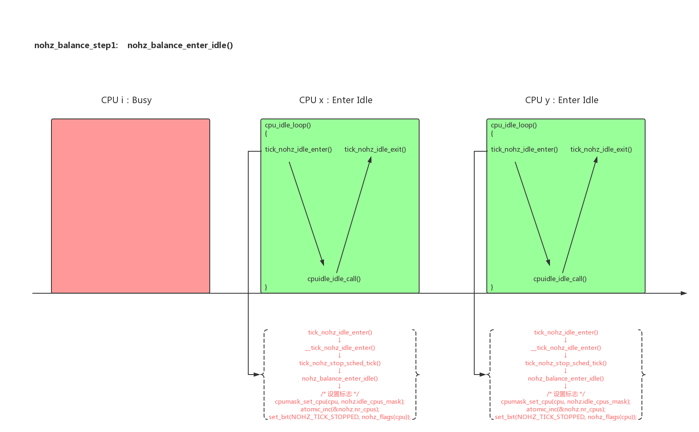

```
tick_nohz_idle_enter() -> set_cpu_sd_state_idle():

↓

void set_cpu_sd_state_idle(void)
{
	struct sched_domain *sd;
	int cpu = smp_processor_id();

	rcu_read_lock();
	sd = rcu_dereference(per_cpu(sd_busy, cpu));

	if (!sd || sd->nohz_idle)
		goto unlock;
	
	/* (1.1) 进入nohz idle，设置sd->nohz_idle标志 */
	sd->nohz_idle = 1;

    /* (1.2) 减少sgc->nr_busy_cpus的计数 */
	atomic_dec(&sd->groups->sgc->nr_busy_cpus);
unlock:
	rcu_read_unlock();
}


tick_nohz_idle_enter() -> __tick_nohz_idle_enter() -> tick_nohz_stop_sched_tick() -> nohz_balance_enter_idle():

↓

void nohz_balance_enter_idle(int cpu)
{
	/*
	 * If this cpu is going down, then nothing needs to be done.
	 */
	if (!cpu_active(cpu))
		return;

	if (test_bit(NOHZ_TICK_STOPPED, nohz_flags(cpu)))
		return;

	/*
	 * If we're a completely isolated CPU, we don't play.
	 */
	if (on_null_domain(cpu_rq(cpu)))
		return;
    
    /* (2.1) 进入idle状态，设置nohz.idle_cpus_mask中对应的bit */
	cpumask_set_cpu(cpu, nohz.idle_cpus_mask);
	
	/* (2.2) 进入idle状态，增加nohz.nr_cpus计数 */
	atomic_inc(&nohz.nr_cpus);
	
	/* (2.3) 设置cpu_rq(cpu)->nohz_flags中的NOHZ_TICK_STOPPED标志 */
	set_bit(NOHZ_TICK_STOPPED, nohz_flags(cpu));
}

```

- 2、在trigger_load_balance()中判断，当前是否需要触发idle load balance：

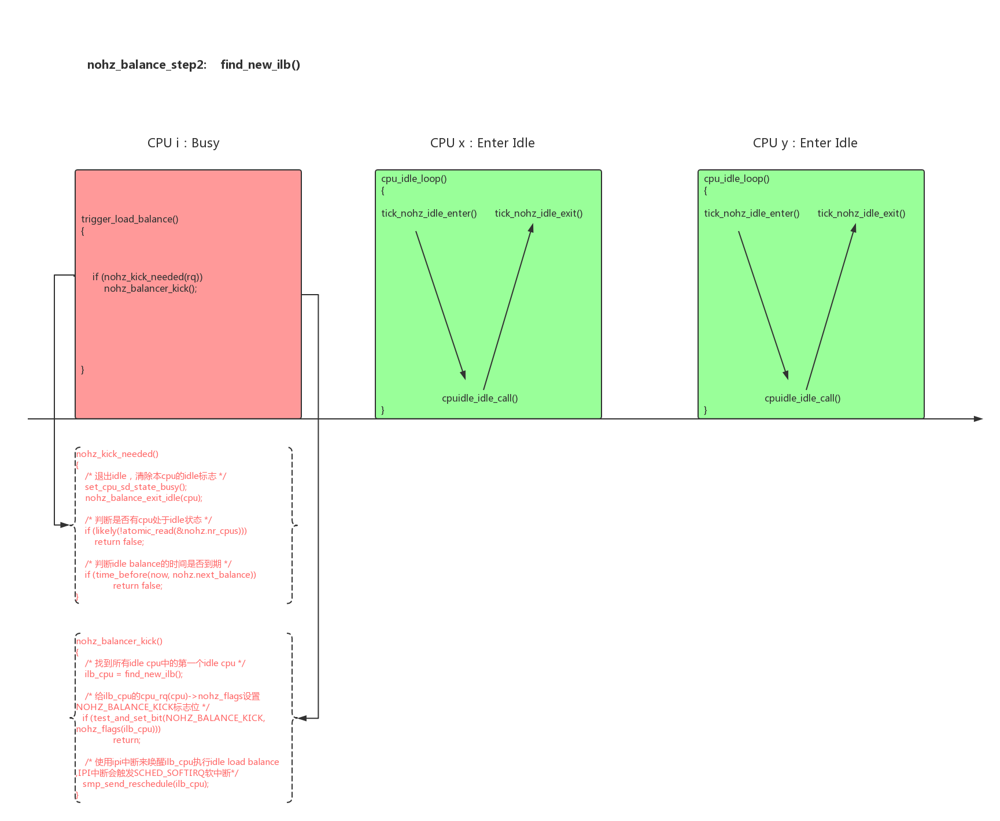

```
void trigger_load_balance(struct rq *rq)
{

    /* (1) 判断当前是否需要idle load balance */
	if (nohz_kick_needed(rq))
	    
	    /* (2) 选中一个idle cpu去做idle load balance */
		nohz_balancer_kick();

}

|→

/*
 * Current heuristic for kicking the idle load balancer in the presence
 * of an idle cpu in the system.
 *   - This rq has more than one task.
 *   - This rq has at least one CFS task and the capacity of the CPU is
 *     significantly reduced because of RT tasks or IRQs.
 *   - At parent of LLC scheduler domain level, this cpu's scheduler group has
 *     multiple busy cpu.
 *   - For SD_ASYM_PACKING, if the lower numbered cpu's in the scheduler
 *     domain span are idle.
 */
static inline bool nohz_kick_needed(struct rq *rq)
{
	unsigned long now = jiffies;
	struct sched_domain *sd;
	struct sched_group_capacity *sgc;
	int nr_busy, cpu = rq->cpu;
	bool kick = false;

    /* (1.1) 如果当前cpu为idle状态，失败退出 */
	if (unlikely(rq->idle_balance))
		return false;


    /* (1.2) 退出nohz状态：set_cpu_sd_state_busy()、nohz_balance_exit_idle(cpu)
        是set_cpu_sd_state_idle()、nohz_balance_enter_idle()的反向操作
     */
   /*
	* We may be recently in ticked or tickless idle mode. At the first
	* busy tick after returning from idle, we will update the busy stats.
	*/
	set_cpu_sd_state_busy();
	nohz_balance_exit_idle(cpu);

    /* (1.3) 如果进入nohz idle状态的cpu数量为0，失败退出 */
	/*
	 * None are in tickless mode and hence no need for NOHZ idle load
	 * balancing.
	 */
	if (likely(!atomic_read(&nohz.nr_cpus)))
		return false;

    /* (1.4) nohz balance时间未到，失败退出 */
	if (time_before(now, nohz.next_balance))
		return false;

#if !defined(CONFIG_MTK_LOAD_BALANCE_ENHANCEMENT) && defined(CONFIG_HMP)
	/* for more than two clusters, still need wakup nohz CPUs and force balancing */
	/*
	 * Bail out if there are no nohz CPUs in our
	 * HMP domain, since we will move tasks between
	 * domains through wakeup and force balancing
	 * as necessary based upon task load.
	 */
	if (sched_feat(SCHED_HMP) && cpumask_first_and(nohz.idle_cpus_mask,
				&((struct hmp_domain *)hmp_cpu_domain(cpu))->cpus) >= nr_cpu_ids)
		return false;
#endif

    /* (1.5) 当前cpu的进程>=2，返回成功 */
	if (rq->nr_running >= 2 &&
	    (!energy_aware() || cpu_overutilized(cpu)))
		return true;

    /* (1.6) sd所在sg的nr_busy_cpus>1，返回成功 */
	rcu_read_lock();
	sd = rcu_dereference(per_cpu(sd_busy, cpu));
	if (sd && !energy_aware()) {
		sgc = sd->groups->sgc;
		nr_busy = atomic_read(&sgc->nr_busy_cpus);

		if (nr_busy > 1) {
			kick = true;
			goto unlock;
		}

	}

    /* (1.7) 如果所有层次的se个数>=1，且capacity在减少，返回成功 */
	sd = rcu_dereference(rq->sd);
	if (sd) {
		if ((rq->cfs.h_nr_running >= 1) &&
				check_cpu_capacity(rq, sd)) {
			kick = true;
			goto unlock;
		}
	}

    /* (1.8) 如果本sd->span[]中第一个idle cpu < sd_asym，返回成功 */
	sd = rcu_dereference(per_cpu(sd_asym, cpu));
	if (sd && (cpumask_first_and(nohz.idle_cpus_mask,
				  sched_domain_span(sd)) < cpu)) {
		kick = true;
		goto unlock;
	}

unlock:
	rcu_read_unlock();
	return kick;
}


|→

static void nohz_balancer_kick(void)
{
	int ilb_cpu;

	nohz.next_balance++;

    /* (2.1) 找到所有idle cpu中的第一个idle cpu */
	ilb_cpu = find_new_ilb();

	if (ilb_cpu >= nr_cpu_ids)
		return;

    /* (2.2) 给ilb_cpu的cpu_rq(cpu)->nohz_flags设置NOHZ_BALANCE_KICK标志位 */
	if (test_and_set_bit(NOHZ_BALANCE_KICK, nohz_flags(ilb_cpu)))
		return;
		
	/* (2.3) 使用ipi中断来唤醒ilb_cpu执行idle load balance */
	/*
	 * Use smp_send_reschedule() instead of resched_cpu().
	 * This way we generate a sched IPI on the target cpu which
	 * is idle. And the softirq performing nohz idle load balance
	 * will be run before returning from the IPI.
	 */
	smp_send_reschedule(ilb_cpu);
	return;
}


/* (2.3.1) ilb_cpu倍唤醒后处理IPI_RESCHEDULE，
    会触发一个SCHED_SOFTIRQ软中断来启动run_rebalance_domains()
 */

void handle_IPI(int ipinr, struct pt_regs *regs)
{
	unsigned int cpu = smp_processor_id();
	struct pt_regs *old_regs = set_irq_regs(regs);

	if ((unsigned)ipinr < NR_IPI) {
		trace_ipi_entry_rcuidle(ipi_types[ipinr]);
		__inc_irq_stat(cpu, ipi_irqs[ipinr]);
	}

	switch (ipinr) {
	case IPI_RESCHEDULE:
		scheduler_ipi();
		break;
		
}

↓

void scheduler_ipi(void)
{

    /*
	 * Check if someone kicked us for doing the nohz idle load balance.
	 */
	if (unlikely(got_nohz_idle_kick())) {
		this_rq()->idle_balance = 1;
		raise_softirq_irqoff(SCHED_SOFTIRQ);
	}

}

```

- 3、被选中的ilb_cpu被唤醒后，需要帮其他所有idle cpu完成rebalance_domains()工作：

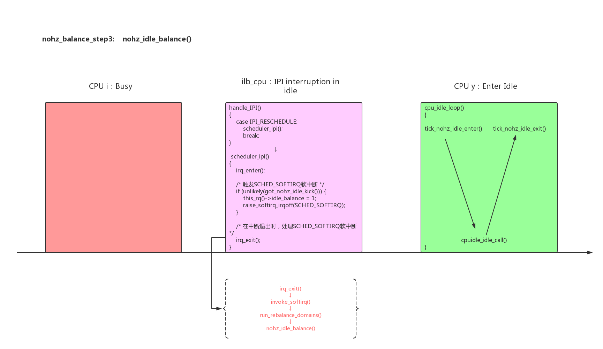

```
static void nohz_idle_balance(struct rq *this_rq, enum cpu_idle_type idle)
{
	int this_cpu = this_rq->cpu;
	struct rq *rq;
	int balance_cpu;
	/* Earliest time when we have to do rebalance again */
	unsigned long next_balance = jiffies + 60*HZ;
	int update_next_balance = 0;

    /* (1) 判断当前cpu是不是被选中被唤醒的ilb_cpu */
	if (idle != CPU_IDLE ||
	    !test_bit(NOHZ_BALANCE_KICK, nohz_flags(this_cpu)))
		goto end;

    /* (2) 轮询所有进入onhz状态的cpu */
	for_each_cpu(balance_cpu, nohz.idle_cpus_mask) {
	
	    /* (3) 只服务非本cpu，且还是idle状态的cpu 
	        ooooo本cpu也是idle状态，不需对本cpu做idle负载均衡？
	        ooooo给其他idle cpu的rq做了负载均衡后，什么时候唤醒其他idle cpu？
	     */
		if (balance_cpu == this_cpu || !idle_cpu(balance_cpu))
			continue;

        /* (4) 如果本cpu被设置了resched标志，说明有线程被唤醒，退出idle状态 */
		/*
		 * If this cpu gets work to do, stop the load balancing
		 * work being done for other cpus. Next load
		 * balancing owner will pick it up.
		 */
		if (need_resched())
			break;

        /* (5) 需要做负载均衡的idle进程balance_cpu */
		rq = cpu_rq(balance_cpu);

        /* (6) 如果balance_cpu的rq->next_balance时间已到，替其做rebalance_domains() */
		/*
		 * If time for next balance is due,
		 * do the balance.
		 */
		if (time_after_eq(jiffies, rq->next_balance)) {
			raw_spin_lock_irq(&rq->lock);
			update_rq_clock(rq);
			
			/* (7) 更新idle cpu因为idle造成的负载衰减 */
			update_idle_cpu_load(rq);
			raw_spin_unlock_irq(&rq->lock);
			
			/* (8) 对balance_cpu做负载均衡 
			    ooooo做完负载均衡，什么时候唤醒balance_cpu？？
			 */
			rebalance_domains(rq, CPU_IDLE);
		}

		if (time_after(next_balance, rq->next_balance)) {
			next_balance = rq->next_balance;
			update_next_balance = 1;
		}
	}

    /* (9) 根据所有进入nohz idle cpu rq的最近的一次到期时间，更新nohz.next_balance */
	/*
	 * next_balance will be updated only when there is a need.
	 * When the CPU is attached to null domain for ex, it will not be
	 * updated.
	 */
	if (likely(update_next_balance))
		nohz.next_balance = next_balance;
end:
	clear_bit(NOHZ_BALANCE_KICK, nohz_flags(this_cpu));
}
```


#### 4.1.2.3、select_task_rq_fair()

除了scheduler_tick()的时候会做负载均衡，另外一个时刻也会做负载均衡。就是fork新进程、wakeup休眠进程时，系统会根据负载均衡挑选一个最合适的cpu给进程运行，其核心函数就是select_task_rq_fair()：

- 1、首先是使用EAS的方法来select_cpu，在EAS使能且没有overutilized时使用EAS方法：

***需要重点提一下的是***：负载计算计算了3种负载(load_avg、loadwop_avg、util_avg)，EAS主要使用其中的***util_avg***，和capacity一起计算。

- 1.1、EAS遍历cluster和cpu，找到一个既能满足进程p的affinity又能容纳下进程p的负载util，属于能用最小capacity满足的cluster其中剩余capacity最多的target_cpu；

首先找到能容纳进程p的util且capacity最小的cluster：

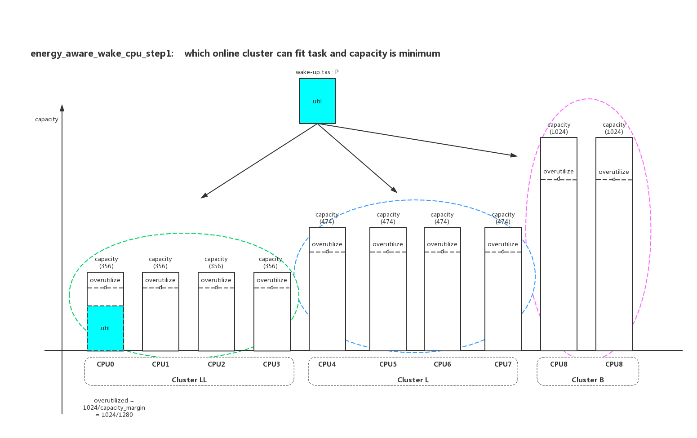

然后在目标cluster中找到加上进程p以后，剩余capacity最大的cpu：

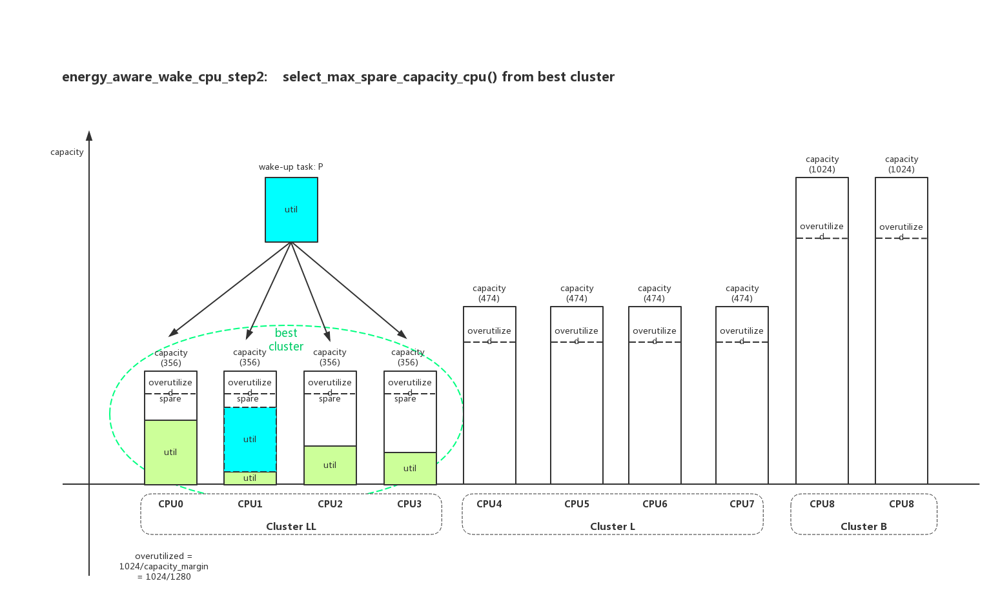

pre_cpu是进程p上一次运行的cpu作为src_cpu，上面选择的target_cpu作为dst_cpu，就是尝试计算进程p从pre_cpu迁移到target_cpu系统的功耗差异：

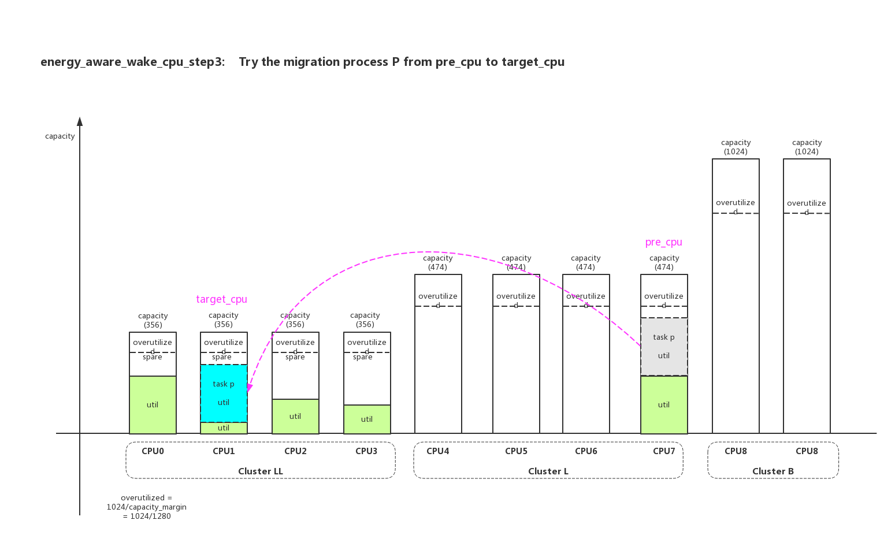


- 1.2、计算负载变化前后，target_cpu和prev_cpu带来的power变化。如果没有power增加则返回target_cpu，如果有power增加则返回prev_cpu；

计算负载变化的函数energy_diff()循环很多比较复杂，仔细分析下来就是计算target_cpu/prev_cpu在“MC层次cpu所在sg链表”+“DIE层级cpu所在sg”，这两种范围在负载变化中的功耗差异：

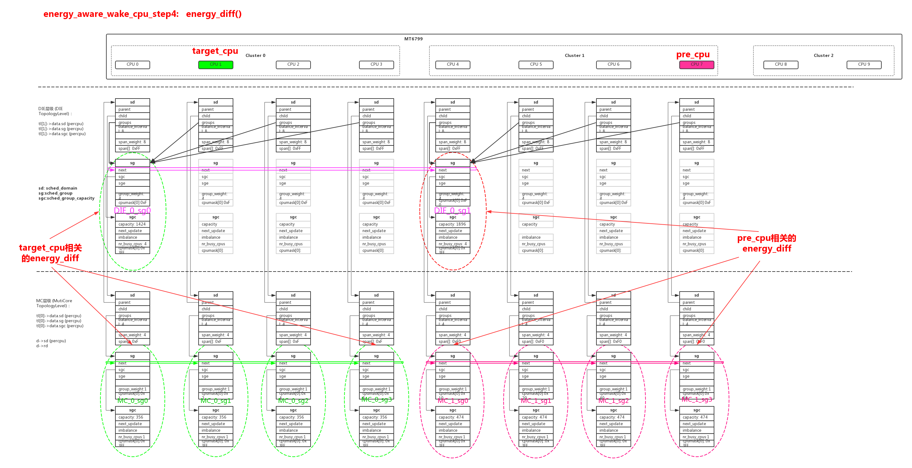

energy_diff()的计算方法如下：

负载值 | 计算方法 | 说明 | 
---|---|---|
idle_idx|min(rq->idle_state_idx)|sg多个cpu中，idle_state_idx最小值|
eenv->cap_idx|find_new_capacity()|在负载变化后，根据sg多个cpu中的最大util值，匹配的cpu freq档位sg->sge->cap_states[eenv->cap_idx].cap|
group_util|+= (__cpu_util << SCHED_CAPACITY_SHIFT)/sg->sge->cap_states[eenv->cap_idx].cap|累加sg中cpu的util值，并且把util转换成capacity的反比|
sg_busy_energy|(group_util * sg->sge->busy_power(group_first_cpu(sg), eenv, (sd->child) ? 1 : 0)) >> SCHED_CAPACITY_SHIFT|使用group_util计算busy部分消耗的功耗|
sg_idle_energy|((SCHED_LOAD_SCALE - group_util) * sg->sge->idle_power(idle_idx, group_first_cpu(sg), eenv, (sd->child) ? 1 : 0))  >> SCHED_CAPACITY_SHIFT|使用(SCHED_LOAD_SCALE - group_util)计算idle部分计算的功耗|
total_energy|sg_busy_energy + sg_idle_energy|单个sg的功耗，累计所有相关sg的功耗，总的差异就是进程P迁移以后的功耗差异|


- 2、如果EAS不适应，使用传统的负载均衡方法来select_cpu：
- 2.1、find_idlest_group() -> find_idlest_cpu() 找出最时候的target_cpu；
- 2.2、最差的方法使用select_idle_sibling()讲究找到一个idle cpu作为target_cpu；
- 2.3、确定target_cpu后，继续使用hmp_select_task_rq_fair()来判断是否需要进行hmp迁移；

```
static int
select_task_rq_fair(struct task_struct *p, int prev_cpu, int sd_flag, int wake_flags)
{
	struct sched_domain *tmp, *affine_sd = NULL, *sd = NULL;
	int cpu = smp_processor_id();
	int new_cpu = prev_cpu;  /* 默认new_cpu为prev_cpu */
	int want_affine = 0;
	int sync = wake_flags & WF_SYNC;
	int policy = 0;

#ifdef CONFIG_MTK_SCHED_VIP_TASKS
	/* mtk: If task is VIP task, prefer most efficiency idle cpu */
	if (is_vip_task(p)) {
		int vip_idle_cpu;

		vip_idle_cpu = find_idle_vip_cpu(p);
		if (vip_idle_cpu >= 0)
			return vip_idle_cpu;
	}
#endif

    /* (1) 优先使用EAS计算target cpu， 
        mtk 对EAS定义了3种模式：EAS模式(energy_aware())、HMP模式(sched_feat(SCHED_HMP))、hybrid_support(EAS、HMP同时共存)；
        hybrid_support()模式下：一般负载均衡交给EAS；如果cpu_rq(cpu)->rd->overutilized负载已经严重不均衡，交给HMP；
     */
	/*
	 *  Consider EAS if only EAS enabled, but HMP
	 *  if hybrid enabled and system is over-utilized.
	 */
	if ((energy_aware() && !hybrid_support()) ||
			(hybrid_support() && !cpu_rq(cpu)->rd->overutilized))
		goto CONSIDER_EAS;

    /* (2) 非EAS情况，fork使用hmp balance */
	/* HMP fork balance:
	 * always put non-kernel forking tasks on a big domain
	 */
	if (sched_feat(SCHED_HMP) && p->mm && (sd_flag & SD_BALANCE_FORK)) {
		new_cpu = hmp_fork_balance(p, prev_cpu);

		/* to recover new_cpu value if something wrong */
		if (new_cpu >= nr_cpu_ids)
			new_cpu = prev_cpu;
		else {
#ifdef CONFIG_MTK_SCHED_TRACERS
			trace_sched_select_task_rq(p, (LB_FORK | new_cpu), prev_cpu, new_cpu);
#endif
			return new_cpu;
		}
	}

CONSIDER_EAS:

    /* (3) 如果唤醒flag中设置了SD_BALANCE_WAKE，优先使用唤醒cpu来运行进程p，
        还需判断下面3个条件是否满足：
        !wake_wide(p)           // 当前cpu的唤醒次数没有超标
        task_fits_max(p, cpu)   // 当前cpu的capacity能容纳进程p的util
        cpumask_test_cpu(cpu, tsk_cpus_allowed(p)) // 当前cpu在进程在P的affinity中
        EAS利用了want_affine这个标志，只要EAS使能，want_affine =1
     */
	if (sd_flag & SD_BALANCE_WAKE)
		want_affine = (!wake_wide(p) && task_fits_max(p, cpu) &&
			      cpumask_test_cpu(cpu, tsk_cpus_allowed(p))) ||
			      energy_aware();

	rcu_read_lock();
	/* (4) 从下往上遍历当前cpu的sd，查询在哪个层次的sd进行负载均衡 */
	for_each_domain(cpu, tmp) {
	
	    /* (4.1 如果当前sd不支持负载均SD_LOAD_BALANCE，退出) */
		if (!(tmp->flags & SD_LOAD_BALANCE))
			break;

        /* (4.2) 优先找affine_sd，找到直接break；
            需要符合以下3个条件：
            want_affine                     //
            (tmp->flags & SD_WAKE_AFFINE)   // 当前sd支持SD_WAKE_AFFINE标志
            cpumask_test_cpu(prev_cpu, sched_domain_span(tmp))  //当前sd->span[]中同时包含cpu、pre_cpu
         */
		/*
		 * If both cpu and prev_cpu are part of this domain,
		 * cpu is a valid SD_WAKE_AFFINE target.
		 */
		if (want_affine && (tmp->flags & SD_WAKE_AFFINE) &&
		    cpumask_test_cpu(prev_cpu, sched_domain_span(tmp))) {
			affine_sd = tmp;
			break;
		}

        /* (4.3) 其次找一个符合sd_flag的sd */
		if (tmp->flags & sd_flag)
			sd = tmp;
		/* (4.4) 如果以上都失败，直接跳出 */
		else if (!want_affine)
			break;
	}

    /* (5) 如果affine_sd成功找到
     */
	if (affine_sd) {
		sd = NULL; /* Prefer wake_affine over balance flags */
		if (cpu != prev_cpu && wake_affine(affine_sd, p, sync))
			new_cpu = cpu;
	}

    /* (6) 没有找到符合sd_flag的sd */
	if (!sd) {
	    /* (6.1) EAS使能，且本cpu没有overutilized， 
	        使用EAS负载均衡算法
	     */
		if (energy_aware() && !cpu_rq(cpu)->rd->overutilized) {
			new_cpu = energy_aware_wake_cpu(p, prev_cpu);
			policy |= LB_EAS;
		}
		/* (6.2) 如果不能使用EAS，且sd_flag中设置SD_BALANCE_WAKE标志 
		    尝试在唤醒的cpu上运行p进程,
		    ooooo前面辛苦计算的affine_sd没有派上用场？
		 */
		else if (sd_flag & SD_BALANCE_WAKE) { /* XXX always ? */
			if (true) {
#ifdef CONFIG_CGROUP_SCHEDTUNE
				bool prefer_idle = schedtune_prefer_idle(p) > 0;
#else
				bool prefer_idle = true;
#endif
				int idle_cpu;


				idle_cpu = find_best_idle_cpu(p, prefer_idle);
				if (idle_cpu >= 0) {
					new_cpu = idle_cpu;
					policy |= LB_IDLEST;
				} else {
					new_cpu = select_max_spare_capacity_cpu(p, new_cpu);
					policy |= LB_SPARE;
				}
			} else
			/* (6.3) 不符合上述条件下的默认处理，尝试找一个idle cpu */
				new_cpu = select_idle_sibling(p, new_cpu);
		}
	} else while (sd) {
	/* (7) 找到符合sd_flag的sd */
		struct sched_group *group;
		int weight;

		policy |= LB_SMP;

        /* (7.1) */
		if (!(sd->flags & sd_flag)) {
			sd = sd->child;
			continue;
		}

        /* (7.2) */
		group = find_idlest_group(sd, p, cpu, sd_flag);
		if (!group) {
			sd = sd->child;
			continue;
		}

        /* (7.3) */
		new_cpu = find_idlest_cpu(group, p, cpu);
		if (new_cpu == -1 || new_cpu == cpu) {
			/* Now try balancing at a lower domain level of cpu */
			sd = sd->child;
			continue;
		}

        /* (7.4) */
		/* Now try balancing at a lower domain level of new_cpu */
		cpu = new_cpu;
		weight = sd->span_weight;
		sd = NULL;
		for_each_domain(cpu, tmp) {
			if (weight <= tmp->span_weight)
				break;
			if (tmp->flags & sd_flag)
				sd = tmp;
		}
		/* while loop will break here if sd == NULL */
	}
#ifdef CONFIG_MTK_SCHED_TRACERS
	policy |= (new_cpu << LB_SMP_SHIFT);
#endif

	rcu_read_unlock();

    
    /* (8) 在EAS不能运行的情况下，在做一次HMP的select操作：
        判断进程p是否符合hmp的迁移条件，如果符合一次迁移到位，避免后续hmp的操作
     */
	/*  Consider hmp if no EAS  or over-utiled in hybrid mode. */
	if ((!energy_aware() && sched_feat(SCHED_HMP)) ||
		(hybrid_support() && cpu_rq(cpu)->rd->overutilized)) {

		new_cpu = hmp_select_task_rq_fair(sd_flag, p, prev_cpu, new_cpu);
#ifdef CONFIG_MTK_SCHED_TRACERS
		policy |= (new_cpu << LB_HMP_SHIFT);
#endif
		policy |= LB_HMP;
	}

#ifdef CONFIG_MTK_SCHED_TRACERS
	trace_sched_select_task_rq(p, policy, prev_cpu, new_cpu);
#endif

	return new_cpu;
}

|→

inline int hmp_fork_balance(struct task_struct *p, int prev_cpu)
{
	int new_cpu = prev_cpu;
	int cpu = smp_processor_id();

    /* (2.1) prev_cpu所在cluster是最快(fastest)的  */
	if (hmp_cpu_is_fastest(prev_cpu)) {
		/* prev_cpu is fastest domain */
		struct hmp_domain *hmpdom;
		__always_unused int lowest_ratio;

		hmpdom = list_entry(
				&hmp_cpu_domain(prev_cpu)->hmp_domains,
				struct hmp_domain, hmp_domains);

        /* (2.2) 尝试选出负载最小的cpu */
		lowest_ratio = hmp_domain_min_load(hmpdom, &new_cpu);

		if (new_cpu < nr_cpu_ids && cpumask_test_cpu(new_cpu, tsk_cpus_allowed(p)))
			return new_cpu;

		new_cpu = cpumask_any_and(&hmp_faster_domain(cpu)->cpus,
				tsk_cpus_allowed(p));

		if (new_cpu < nr_cpu_ids)
			return new_cpu;
	} else {
	    /* (2.3) 尝试选出prev_cpu所在cluster中负载最小的cpu */
		/* prev_cpu is not fastest domain */
		new_cpu = hmp_select_faster_cpu(p, prev_cpu);

		if (new_cpu < nr_cpu_ids)
			return new_cpu;
	}

	return new_cpu;
}

|→

static int wake_affine(struct sched_domain *sd, struct task_struct *p, int sync)
{
	s64 this_load, load;
	s64 this_eff_load, prev_eff_load;
	int idx, this_cpu, prev_cpu;
	struct task_group *tg;
	unsigned long weight;
	int balanced;

	idx	  = sd->wake_idx;
	this_cpu  = smp_processor_id();
	prev_cpu  = task_cpu(p);
	load	  = source_load(prev_cpu, idx);
	this_load = target_load(this_cpu, idx);

    /* (5.1) */
	/*
	 * If sync wakeup then subtract the (maximum possible)
	 * effect of the currently running task from the load
	 * of the current CPU:
	 */
	if (sync) {
		tg = task_group(current);
		weight = current->se.avg.load_avg;

		this_load += effective_load(tg, this_cpu, -weight, -weight);
		load += effective_load(tg, prev_cpu, 0, -weight);
	}

	tg = task_group(p);
	weight = p->se.avg.load_avg;

	/*
	 * In low-load situations, where prev_cpu is idle and this_cpu is idle
	 * due to the sync cause above having dropped this_load to 0, we'll
	 * always have an imbalance, but there's really nothing you can do
	 * about that, so that's good too.
	 *
	 * Otherwise check if either cpus are near enough in load to allow this
	 * task to be woken on this_cpu.
	 */
	this_eff_load = 100;
	this_eff_load *= capacity_of(prev_cpu);

	prev_eff_load = 100 + (sd->imbalance_pct - 100) / 2;
	prev_eff_load *= capacity_of(this_cpu);

	if (this_load > 0) {
		this_eff_load *= this_load +
			effective_load(tg, this_cpu, weight, weight);

		prev_eff_load *= load + effective_load(tg, prev_cpu, 0, weight);
	}

	balanced = this_eff_load <= prev_eff_load;

	schedstat_inc(p, se.statistics.nr_wakeups_affine_attempts);

	if (!balanced)
		return 0;

	schedstat_inc(sd, ttwu_move_affine);
	schedstat_inc(p, se.statistics.nr_wakeups_affine);

	return 1;
}

|→

static int energy_aware_wake_cpu(struct task_struct *p, int target)
{
	int target_max_cap = INT_MAX;
	int target_cpu = task_cpu(p);
	unsigned long min_util;
	unsigned long new_util;
	int i, cpu;
	bool is_tiny = false;
	int nrg_diff = 0;
	int cluster_id = 0;
	struct cpumask cluster_cpus;
	int max_cap_cpu = 0;
	int best_cpu = 0;

    /* (6.1.1) 遍历cluster和cpu，找出一个capacity最小的cpu能容纳下util(p)为best_cpu */
	/*
	 * Find group with sufficient capacity. We only get here if no cpu is
	 * overutilized. We may end up overutilizing a cpu by adding the task,
	 * but that should not be any worse than select_idle_sibling().
	 * load_balance() should sort it out later as we get above the tipping
	 * point.
	 */
	cluster_id = arch_get_nr_clusters();
	for (i = 0; i < cluster_id; i++) {
		arch_get_cluster_cpus(&cluster_cpus, i);
		max_cap_cpu = cpumask_first(&cluster_cpus);

		/* Assuming all cpus are the same in group */
		for_each_cpu(cpu, &cluster_cpus) {

			if (!cpu_online(cpu))
				continue;

			if (capacity_of(max_cap_cpu) < target_max_cap &&
			task_fits_max(p, max_cap_cpu)) {
				best_cpu = cpu;
				target_max_cap = capacity_of(max_cap_cpu);
			}
			break;
		}
	}

	if (task_util(p) < TINY_TASK_THRESHOLD)
		is_tiny = true;

	/* Find cpu with sufficient capacity */
	min_util = boosted_task_util(p);
	if (!is_tiny)
	    /* (6.1.2) 根据best_cpu所在的cluster和进程p的affinity，
	        找出加上util(p)以后，剩余capacity最大的cpu：target_cpu
	     */
		target_cpu = select_max_spare_capacity_cpu(p, best_cpu);
	else
	    /* (6.1.3) 根据cluster和进程p的affinity，
	        找出加上util(p)以后，当前freq的capacity能满足的第一个cpu：target_cpu
	     */
		for_each_cpu_and(i, tsk_cpus_allowed(p), &cluster_cpus) {

			if (!cpu_online(i))
				continue;

			/*
			 * p's blocked utilization is still accounted for on prev_cpu
			 * so prev_cpu will receive a negative bias due to the double
			 * accounting. However, the blocked utilization may be zero.
			 */
			new_util = cpu_util(i) + task_util(p);

			/*
			 * Ensure minimum capacity to grant the required boost.
			 * The target CPU can be already at a capacity level higher
			 * than the one required to boost the task.
			 */
			new_util = max(min_util, new_util);

#ifdef CONFIG_MTK_SCHED_INTEROP
			if (cpu_rq(i)->rt.rt_nr_running && likely(!is_rt_throttle(i)))
				continue;
#endif
			if (new_util > capacity_orig_of(i))
				continue;

			if (new_util < capacity_curr_of(i)) {
				target_cpu = i;
				if (cpu_rq(i)->nr_running)
					break;
			}

			/* cpu has capacity at higher OPP, keep it as fallback */
			if (target_cpu == task_cpu(p))
				target_cpu = i;
		}

    /* (6.1.4) 如果pre_cpu和target_cpu是同一个cluster，直接成功返回 */
	/* no need energy calculation if the same domain */
	if (is_the_same_domain(task_cpu(p), target_cpu))
		return target_cpu;

	/* no energy comparison if the same cluster */
	if (target_cpu != task_cpu(p)) {
	    
	    /* (6.1.5) 构造需要迁移的环境变量  */
		struct energy_env eenv = {
			.util_delta	= task_util(p),
			.src_cpu	= task_cpu(p),
			.dst_cpu	= target_cpu,
			.task		= p,
		};

		/* Not enough spare capacity on previous cpu */
		if (cpu_overutilized(task_cpu(p))) {
			trace_energy_aware_wake_cpu(p, task_cpu(p), target_cpu,
					(int)task_util(p), nrg_diff, true, is_tiny);
			return target_cpu;
		}

        /* (6.1.6) 计算进程p从pre_cpu迁移到target_cpu后的功耗差值nrg_diff，
            如果功耗增加，nrg_diff >= 0，返回pre_cpu即task_cpu(p)，
            如果功耗减少，返回新的target_cpu
         */
		nrg_diff = energy_diff(&eenv);
		if (nrg_diff >= 0) {
			trace_energy_aware_wake_cpu(p, task_cpu(p), target_cpu,
					(int)task_util(p), nrg_diff, false, is_tiny);
			return task_cpu(p);
		}
	}

	trace_energy_aware_wake_cpu(p, task_cpu(p), target_cpu, (int)task_util(p), nrg_diff, false, is_tiny);
	return target_cpu;
}

||→

static inline int
energy_diff(struct energy_env *eenv)
{
	unsigned int boost;
	int nrg_delta;

	/* Conpute "absolute" energy diff */
	__energy_diff(eenv);

	/* Return energy diff when boost margin is 0 */
#ifdef CONFIG_CGROUP_SCHEDTUNE
	boost = schedtune_task_boost(eenv->task);
#else
	boost = get_sysctl_sched_cfs_boost();
#endif
	if (boost == 0)
		return eenv->nrg.diff;

	/* Compute normalized energy diff */
	nrg_delta = normalize_energy(eenv->nrg.diff);
	eenv->nrg.delta = nrg_delta;

	eenv->payoff = schedtune_accept_deltas(
			eenv->nrg.delta,
			eenv->cap.delta,
			eenv->task);

	/*
	 * When SchedTune is enabled, the energy_diff() function will return
	 * the computed energy payoff value. Since the energy_diff() return
	 * value is expected to be negative by its callers, this evaluation
	 * function return a negative value each time the evaluation return a
	 * positive payoff, which is the condition for the acceptance of
	 * a scheduling decision
	 */
	return -eenv->payoff;
}

static int __energy_diff(struct energy_env *eenv)
{
	struct sched_domain *sd;
	struct sched_group *sg;
	int sd_cpu = -1, energy_before = 0, energy_after = 0;
	
	/* (6.1.6.1) 构造迁移前的环境变量  */
	struct energy_env eenv_before = {
		.util_delta	= 0,
		.src_cpu	= eenv->src_cpu,
		.dst_cpu	= eenv->dst_cpu,
		.nrg		= { 0, 0, 0, 0},
		.cap		= { 0, 0, 0 },
	};
#ifdef CONFIG_MTK_SCHED_EAS_POWER_SUPPORT
	int i;
#endif

	if (eenv->src_cpu == eenv->dst_cpu)
		return 0;

#ifdef CONFIG_MTK_SCHED_EAS_POWER_SUPPORT
	/* To get max opp index of every cluster for power estimation of share buck */
	for (i = 0; i < arch_get_nr_clusters(); i++) {
		/* for energy before */
		eenv_before.opp_idx[i]  = mtk_cluster_capacity_idx(i, &eenv_before);

		/* for energy after */
		eenv->opp_idx[i]  = mtk_cluster_capacity_idx(i, eenv);

		mt_sched_printf(sched_eas_energy_calc, "cid=%d, before max_opp:%d, after max_opp:%d\n",
					i, eenv_before.opp_idx[i], eenv->opp_idx[i]);
	}
#endif
    
    /* (6.1.6.2) sd来至于cache sd_ea，是cpu对应的顶层sd(tl DIE层) */
	sd_cpu = (eenv->src_cpu != -1) ? eenv->src_cpu : eenv->dst_cpu;
	sd = rcu_dereference(per_cpu(sd_ea, sd_cpu));

	if (!sd)
		return 0; /* Error */


	mt_sched_printf(sched_eas_energy_calc, "0. %s: move task from src=%d to dst=%d util=%d",
				__func__, eenv->src_cpu, eenv->dst_cpu, eenv->util_delta);

	sg = sd->groups;

    /* (6.1.6.3) 遍历sg所在sg链表，找到符合条件的sg， 
        累加计算eenv_before、eenv相关sg的功耗
     */ 
	do {
	    /* (6.1.6.4) 如果当前sg包含src_cpu或者dst_cpu，计算 */
		if (cpu_in_sg(sg, eenv->src_cpu) || cpu_in_sg(sg, eenv->dst_cpu)) {
		
		    /* (6.1.6.5) 当前顶层sg为eenv的sg_top  */
			eenv_before.sg_top = eenv->sg_top = sg;

			mt_sched_printf(sched_eas_energy_calc, "1. %s: src=%d dst=%d mask=0x%lx (before)",
					__func__,  eenv_before.src_cpu, eenv_before.dst_cpu, sg->cpumask[0]);
			
			/* (6.1.6.6) 计算eenv_before负载下sg的power */
			if (sched_group_energy(&eenv_before))
				return 0; /* Invalid result abort */
			energy_before += eenv_before.energy;

			/* Keep track of SRC cpu (before) capacity */
			eenv->cap.before = eenv_before.cap.before;
			eenv->cap.delta = eenv_before.cap.delta;


			mt_sched_printf(sched_eas_energy_calc, "2. %s: src=%d dst=%d mask=0x%lx (after)",
					__func__,  eenv->src_cpu, eenv->dst_cpu, sg->cpumask[0]);
			/* (6.1.6.7) 计算eenv负载下sg的power */
			if (sched_group_energy(eenv))
				return 0; /* Invalid result abort */
			energy_after += eenv->energy;
		}
	} while (sg = sg->next, sg != sd->groups);

    /* (6.1.6.8) 计算energy_after - energy_before */
	eenv->nrg.before = energy_before;
	eenv->nrg.after = energy_after;
	eenv->nrg.diff = eenv->nrg.after - eenv->nrg.before;
	eenv->payoff = 0;

	trace_sched_energy_diff(eenv->task,
				eenv->src_cpu, eenv->dst_cpu, eenv->util_delta,
				eenv->nrg.before, eenv->nrg.after, eenv->nrg.diff,
				eenv->cap.before, eenv->cap.after, eenv->cap.delta,
				eenv->nrg.delta, eenv->payoff);

	mt_sched_printf(sched_eas_energy_calc, "5. %s: nrg.diff=%d cap.delta=%d",
				__func__, eenv->nrg.diff, eenv->cap.delta);

	return eenv->nrg.diff;
}

|||→

static int sched_group_energy(struct energy_env *eenv)
{
	struct sched_domain *sd;
	int cpu, total_energy = 0;
	struct cpumask visit_cpus;
	struct sched_group *sg;
#ifdef CONFIG_MTK_SCHED_EAS_POWER_SUPPORT
	int only_lv1_sd = 0;
#endif

	WARN_ON(!eenv->sg_top->sge);

	cpumask_copy(&visit_cpus, sched_group_cpus(eenv->sg_top));

    /* (6.1.6.6.1) 根据sg_top顶层sd，找到需要计算的cpu集合visit_cpus，逐个遍历其中每一个cpu
        ooooo这一套复杂的循环算法计算下来，其实就计算了几个power，以cpu0-cpu3为例：
        4个底层sg的power + 1个顶层sg的power
     */ 
	while (!cpumask_empty(&visit_cpus)) {
		struct sched_group *sg_shared_cap = NULL;

        /* (6.1.6.6.2) 选取visit_cpus中的第一个cpu */
		cpu = cpumask_first(&visit_cpus);

		sd = rcu_dereference_check_sched_domain(cpu_rq(cpu)->sd);
		if (!sd) {
			/* a corner racing with hotplug? sd doesn't exist in this cpu. */

			return -EINVAL;
		}

		/*
		 * Is the group utilization affected by cpus outside this
		 * sched_group?
		 */
		sd = rcu_dereference(per_cpu(sd_scs, cpu));
#ifdef CONFIG_MTK_SCHED_EAS_POWER_SUPPORT
		/* Try to handle one CPU in this cluster by hotplug.
		 * In it there is only lv-1 sched_domain exist which having
		 * no share_cap_states.
		 */
		if (!sd) {
			sd = rcu_dereference(per_cpu(sd_ea, cpu));
			only_lv1_sd = 1;
		}
#endif
		if (!sd) {
			/*
			 * We most probably raced with hotplug; returning a
			 * wrong energy estimation is better than entering an
			 * infinite loop.
			 */
			return -EINVAL;
		}

		if (sd->parent)
			sg_shared_cap = sd->parent->groups;

        /* (6.1.6.6.3) 从底层到顶层逐个遍历cpu所在的sd */
		for_each_domain(cpu, sd) {
			sg = sd->groups;

            /* (6.1.6.6.4) 如果是顶层sd，只会计算一个sg */
			/* Has this sched_domain already been visited? */
			if (sd->child && group_first_cpu(sg) != cpu)
				break;

            /* (6.1.6.6.5) 逐个遍历该层次sg链表所在sg */
			do {
				unsigned long group_util;
				int sg_busy_energy, sg_idle_energy;
				int cap_idx, idle_idx;

				if (sg_shared_cap && sg_shared_cap->group_weight >= sg->group_weight)
					eenv->sg_cap = sg_shared_cap;
				else
					eenv->sg_cap = sg;

                /* (6.1.6.6.6) 根据eenv指示的负载变化，找出满足该sg中最大负载cpu的capacity_index */
				cap_idx = find_new_capacity(eenv, sg->sge);

				if (sg->group_weight == 1) {
					/* Remove capacity of src CPU (before task move) */
					if (eenv->util_delta == 0 &&
					    cpumask_test_cpu(eenv->src_cpu, sched_group_cpus(sg))) {
						eenv->cap.before = sg->sge->cap_states[cap_idx].cap;
						eenv->cap.delta -= eenv->cap.before;
					}
					/* Add capacity of dst CPU  (after task move) */
					if (eenv->util_delta != 0 &&
					    cpumask_test_cpu(eenv->dst_cpu, sched_group_cpus(sg))) {
						eenv->cap.after = sg->sge->cap_states[cap_idx].cap;
						eenv->cap.delta += eenv->cap.after;
					}
				}

                /* (6.1.6.6.7) 找出sg所有cpu中最小的idle index */
				idle_idx = group_idle_state(sg);
				
				/* (6.1.6.6.8) 累加sg中所有cpu的相对负载，
				    最大负载为sg->sge->cap_states[eenv->cap_idx].cap
				 */
				group_util = group_norm_util(eenv, sg);
				
				/* (6.1.6.6.9) 计算power = busy_power + idle_power */
#ifdef CONFIG_MTK_SCHED_EAS_POWER_SUPPORT
				/*
				 * To support power estimation for MTK soc.
				 * Consider share buck for dynamic power and SPARK/MCDI for static power.
				 */
				sg_busy_energy = (group_util *
					sg->sge->busy_power(group_first_cpu(sg), eenv, (sd->child) ? 1 : 0))
								>> SCHED_CAPACITY_SHIFT;
				sg_idle_energy = ((SCHED_LOAD_SCALE - group_util) *
					sg->sge->idle_power(idle_idx, group_first_cpu(sg), eenv, (sd->child) ? 1 : 0))
								>> SCHED_CAPACITY_SHIFT;
#else
				/* Power value had been separated to static + dynamic here */
				sg_busy_energy = (group_util * (sg->sge->cap_states[cap_idx].dyn_pwr +
						sg->sge->cap_states[cap_idx].lkg_pwr[sg->sge->lkg_idx]))
								>> SCHED_CAPACITY_SHIFT;
				sg_idle_energy = ((SCHED_LOAD_SCALE-group_util) *
						sg->sge->idle_states[idle_idx].power)
								>> SCHED_CAPACITY_SHIFT;
#endif

				total_energy += sg_busy_energy + sg_idle_energy;

				mt_sched_printf(sched_eas_energy_calc, "busy_energy=%d idle_eneryg=%d (cost=%d)",
							sg_busy_energy, sg_idle_energy, total_energy);

                /* (6.1.6.6.10) 如果遍历了底层sd，从visit_cpus中去掉对应的sg cpu */
				if (!sd->child)
					cpumask_xor(&visit_cpus, &visit_cpus, sched_group_cpus(sg));

#ifdef CONFIG_MTK_SCHED_EAS_POWER_SUPPORT
				/*
				 * We try to get correct energy estimation while racing with hotplug
				 * and avoid entering a infinite loop.
				 */
				if (only_lv1_sd) {
					eenv->energy = total_energy;
					return 0;
				}
#endif

				if (cpumask_equal(sched_group_cpus(sg), sched_group_cpus(eenv->sg_top)))
					goto next_cpu;

			} while (sg = sg->next, sg != sd->groups);
		}
		
		/* (6.1.6.6.11) 如果遍历了cpu的底层到顶层sd，从visit_cpus中去掉对应的cpu */
next_cpu:
		cpumask_clear_cpu(cpu, &visit_cpus);
		continue;
	}

	eenv->energy = total_energy;
	return 0;
}

|→

static struct sched_group *
find_idlest_group(struct sched_domain *sd, struct task_struct *p,
		  int this_cpu, int sd_flag)
{
	struct sched_group *idlest = NULL, *group = sd->groups;
	struct sched_group *fit_group = NULL;
	unsigned long min_load = ULONG_MAX, this_load = 0;
	unsigned long fit_capacity = ULONG_MAX;
	int load_idx = sd->forkexec_idx;
	int imbalance = 100 + (sd->imbalance_pct-100)/2;

    /* (7.2.1) 选择load_idx */
	if (sd_flag & SD_BALANCE_WAKE)
		load_idx = sd->wake_idx;

    /* (7.2.2) 当前cpu所在sd层次的sg，遍历sg所在的sg链表，选出负载最轻的idlest sg */
	do {
		unsigned long load, avg_load;
		int local_group;
		int i;

        /* (7.2.3) 略过不符合p进程affinity的sg */
		/* Skip over this group if it has no CPUs allowed */
		if (!cpumask_intersects(sched_group_cpus(group),
					tsk_cpus_allowed(p)))
			continue;

        /* (7.2.4) local_group等于本cpu所在的sg */
		local_group = cpumask_test_cpu(this_cpu,
					       sched_group_cpus(group));

		/* Tally up the load of all CPUs in the group */
		avg_load = 0;

        /* (7.2.5) 遍历sg中的所有cpu，累加负载 */
		for_each_cpu(i, sched_group_cpus(group)) {
			/* Bias balancing toward cpus of our domain */
			if (local_group)
				load = source_load(i, load_idx);
			else
				load = target_load(i, load_idx);

#ifdef CONFIG_MTK_SCHED_INTEROP
			load += mt_rt_load(i);
#endif
			avg_load += load;

            /* (7.2.6) 如果EAS使能，找到能最小满足进程p的capacity sg */
			/*
			 * Look for most energy-efficient group that can fit
			 * that can fit the task.
			 */
			if (capacity_of(i) < fit_capacity && task_fits_spare(p, i)) {
				fit_capacity = capacity_of(i);
				fit_group = group;
			}
		}

        /* (7.2.7) 用累计的负载计算相对负载 */
		/* Adjust by relative CPU capacity of the group */
		avg_load = (avg_load * SCHED_CAPACITY_SCALE) / group->sgc->capacity;

        /* (7.2.8) 计算idlest sg */
		if (local_group) {
			this_load = avg_load;
		} else if (avg_load < min_load) {
			min_load = avg_load;
			idlest = group;
		}
	} while (group = group->next, group != sd->groups);

    /* (7.2.9) EAS使能，返回fit_group */
	if (energy_aware() && fit_group)
		return fit_group;

	if (!idlest || 100*this_load < imbalance*min_load)
		return NULL;
	
	/* (7.2.11) 否则，返回idlest */
	return idlest;
}

|→

static int
find_idlest_cpu(struct sched_group *group, struct task_struct *p, int this_cpu)
{
	unsigned long load, min_load = ULONG_MAX;
	unsigned int min_exit_latency = UINT_MAX;
	u64 latest_idle_timestamp = 0;
	int least_loaded_cpu = this_cpu;
	int shallowest_idle_cpu = -1;
	int i;

    /* (7.3.1) 遍历sg中符合p进程affinity的cpu */
	/* Traverse only the allowed CPUs */
	for_each_cpu_and(i, sched_group_cpus(group), tsk_cpus_allowed(p)) {
	
	    /* (7.3.2) 如果cpu的剩余capacity能容纳下p进程的load */
		if (task_fits_spare(p, i)) {
			struct rq *rq = cpu_rq(i);
			struct cpuidle_state *idle = idle_get_state(rq);
			
			/* (7.3.2.1) 优先选出idle状态，且退出idle开销最小的cpu */
			if (idle && idle->exit_latency < min_exit_latency) {
				/*
				 * We give priority to a CPU whose idle state
				 * has the smallest exit latency irrespective
				 * of any idle timestamp.
				 */
				min_exit_latency = idle->exit_latency;
				latest_idle_timestamp = rq->idle_stamp;
				shallowest_idle_cpu = i;
			} else if (idle_cpu(i) &&
				   (!idle || idle->exit_latency == min_exit_latency) &&
				   rq->idle_stamp > latest_idle_timestamp) {
				/*
				 * If equal or no active idle state, then
				 * the most recently idled CPU might have
				 * a warmer cache.
				 */
				latest_idle_timestamp = rq->idle_stamp;
				shallowest_idle_cpu = i;
			} else if (shallowest_idle_cpu == -1) {
				/*
				 * If we haven't found an idle CPU yet
				 * pick a non-idle one that can fit the task as
				 * fallback.
				 */
				shallowest_idle_cpu = i;
			}
			
		/* (7.3.3) cpu的剩余capacity容纳不下进程p，选出负载最轻的cpu */
		} else if (shallowest_idle_cpu == -1) {
			load = weighted_cpuload(i);
#ifdef CONFIG_MTK_SCHED_INTEROP
			load += mt_rt_load(i);
#endif
			if (load < min_load || (load == min_load && i == this_cpu)) {
				min_load = load;
				least_loaded_cpu = i;
			}
		}
	}

	return shallowest_idle_cpu != -1 ? shallowest_idle_cpu : least_loaded_cpu;
}

|→

static int hmp_select_task_rq_fair(int sd_flag, struct task_struct *p,
		int prev_cpu, int new_cpu)
{
	struct list_head *pos;
	struct sched_entity *se = &p->se;
	struct cpumask fast_cpu_mask, slow_cpu_mask;

#ifdef CONFIG_HMP_TRACER
	int cpu = 0;

	for_each_online_cpu(cpu)
		trace_sched_cfs_runnable_load(cpu, cfs_load(cpu), cfs_length(cpu));
#endif

	/* error handling */
	if (prev_cpu >= num_possible_cpus())
		return new_cpu;

	/*
	 * Skip all the checks if only one CPU is online.
	 * Otherwise, select the most appropriate CPU from cluster.
	 */
	if (num_online_cpus() == 1)
		goto out;

    /* (8.1) 找出fastest hmp_domain，只有一个， 
        找出slow hmp_domain，有多个，
        在一个fast_cpu_mask和多个slow_cpu_mask之间，逐个尝试hmp_select_task_migration()
        p进程是否会满足hmp迁移
     */
	cpumask_clear(&fast_cpu_mask);
	cpumask_clear(&slow_cpu_mask);
	/* order: fast to slow hmp domain */
	list_for_each(pos, &hmp_domains) {
		struct hmp_domain *domain = list_entry(pos, struct hmp_domain, hmp_domains);

		if (!cpumask_empty(&domain->cpus)) {
			if (cpumask_empty(&fast_cpu_mask)) {
				cpumask_copy(&fast_cpu_mask, &domain->possible_cpus);
			} else {
				cpumask_copy(&slow_cpu_mask, &domain->possible_cpus);
				new_cpu = hmp_select_task_migration(sd_flag, p,
					prev_cpu, new_cpu, &fast_cpu_mask, &slow_cpu_mask);
			}
		}
	}

out:
	/* it happens when num_online_cpus=1 */
	if (new_cpu >= nr_cpu_ids) {
		/* BUG_ON(1); */
		new_cpu = prev_cpu;
	}

	cfs_nr_pending(new_cpu)++;
	cfs_pending_load(new_cpu) += se_load(se);

	return new_cpu;

}

||→

static int hmp_select_task_migration(int sd_flag, struct task_struct *p, int prev_cpu, int new_cpu,
		struct cpumask *fast_cpu_mask, struct cpumask *slow_cpu_mask)
{
	int step = 0;
	struct sched_entity *se = &p->se;
	int B_target = num_possible_cpus();
	int L_target = num_possible_cpus();
	struct clb_env clbenv;

    /* (8.1.1) 找出fast_cpu_mask中负载最轻的cpu B_target，且符合p进程的affinity */
	B_target = hmp_select_cpu(HMP_SELECT_RQ, p, fast_cpu_mask, prev_cpu, 0);
	
	/* (8.1.2) 找出slow_cpu_mask中负载最轻的cpu L_target，且符合p进程的affinity */
	L_target = hmp_select_cpu(HMP_SELECT_RQ, p, slow_cpu_mask, prev_cpu, 1);

	/*
	 * Only one cluster exists or only one cluster is allowed for this task
	 * Case 1: return the runqueue whose load is minimum
	 * Case 2: return original CFS runqueue selection result
	 */
	if (B_target >= num_possible_cpus() && L_target >= num_possible_cpus())
		goto out;
	if (B_target >= num_possible_cpus())
		goto select_slow;
	if (L_target >= num_possible_cpus())
		goto select_fast;

	/*
	 * Two clusters exist and both clusters are allowed for this task
	 * Step 1: Move newly created task to the cpu where no tasks are running
	 * Step 2: Migrate heavy-load task to big
	 * Step 3: Migrate light-load task to LITTLE
	 * Step 4: Make sure the task stays in its previous hmp domain
	 */
	step = 1;
	if (task_created(sd_flag) && !task_low_priority(p->prio)) {
		if (!rq_length(B_target))
			goto select_fast;
		if (!rq_length(L_target))
			goto select_slow;
	}
	
	/* (8.1.3) 计算如果L_target和B_target发生hmp迁移，各种负载和thershold的计算 */
	memset(&clbenv, 0, sizeof(clbenv));
	clbenv.flags |= HMP_SELECT_RQ;
	cpumask_copy(&clbenv.lcpus, slow_cpu_mask);
	cpumask_copy(&clbenv.bcpus, fast_cpu_mask);
	clbenv.ltarget = L_target;
	clbenv.btarget = B_target;
	sched_update_clbstats(&clbenv);
	
	/* (8.1.4) 判断进程p从L_target up到 B_target的可行性 */
	step = 2;
	if (hmp_up_migration(L_target, &B_target, se, &clbenv))
		goto select_fast;
		
	/* (8.1.5) 判断进程p从B_target down到 L_target的可行性 */
	step = 3;
	if (hmp_down_migration(B_target, &L_target, se, &clbenv))
		goto select_slow;
		
	/* (8.1.6) 如果prev_cpu是slowest */
	step = 4;
	if (hmp_cpu_is_slowest(prev_cpu))
		goto select_slow;
	goto select_fast;

    /* (8.1.7) 返回 B_target */
select_fast:
	new_cpu = B_target;
	cpumask_clear(slow_cpu_mask);
	goto out;
	
	/* (8.1.8) 返回 L_target */
select_slow:
	new_cpu = L_target;
	cpumask_copy(fast_cpu_mask, slow_cpu_mask);
	cpumask_clear(slow_cpu_mask);
	goto out;

out:
#ifdef CONFIG_HMP_TRACER
	trace_sched_hmp_load(clbenv.bstats.load_avg, clbenv.lstats.load_avg);
#endif
	return new_cpu;
}
```


## 4.2、HMP负载均衡

除了SMP load_balance()负载均衡以外，我们还希望在多个SMP cluster之间能遵守一种规则：heavy任务跑在big core上，light任务跑在little core上，这样能快速的达到一个合理的负载状态。这种算法就叫做HMP负载均衡，EAS会统一的考虑负载、性能、功耗，EAS使能后HMP就被禁用了。

HMP负载均衡的操作分两种：

- 1、heavy task从little cpu迁移到big cpu。这种叫做up操作，对应的函数hmp_force_up_migration()；
- 2、light task从big cpu迁移到little cpu。这种叫做down操作，对应的函数hmp_force_down_migration()；

### 4.2.1、hmp domain初始化

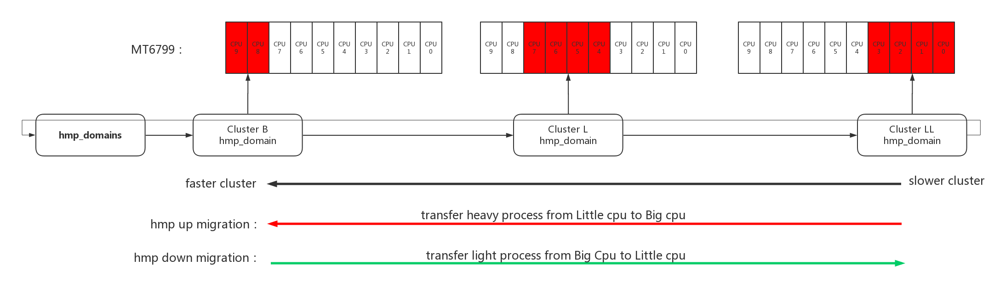

hmp在初始化的时候会每个cluster分配一个hmp_domain，把所有hmp_domain加入到全局链表hmp_domains中。hmp_domains链表构建完成以后，离链表头hmp_domains最近的hmp_domain是速度最快的cluster，离hmp_domains越远hmp_domain对应的速度越慢。因为在构造链表时是按照cluster id来加入的，速度最快cluster的hmp_domain最后加入，所以离表头最近。

```
static int __init hmp_cpu_mask_setup(void)
{
	struct hmp_domain *domain;
	struct list_head *pos;
	int dc, cpu;

	pr_warn("Initializing HMP scheduler:\n");

	/* Initialize hmp_domains using platform code */
	/* (1) 调用arch相关的hmp_domains初始化函数 */
	arch_get_hmp_domains(&hmp_domains);
	if (list_empty(&hmp_domains)) {
		pr_warn("HMP domain list is empty!\n");
		return 0;
	}

	/* Print hmp_domains */
	dc = 0;
	list_for_each(pos, &hmp_domains) {
		domain = list_entry(pos, struct hmp_domain, hmp_domains);

		for_each_cpu(cpu, &domain->possible_cpus) {
		    /* (2) 给per_cpu变量hmp_cpu_domain赋值 */
			per_cpu(hmp_cpu_domain, cpu) = domain;
		}
		dc++;
	}

	return 1;
}

|→

void __init arch_get_hmp_domains(struct list_head *hmp_domains_list)
{
	struct hmp_domain *domain;
	struct cpumask cpu_mask;
	int id, maxid;

	cpumask_clear(&cpu_mask);
	maxid = arch_get_nr_clusters();

	/*
	 * Initialize hmp_domains
	 * Must be ordered with respect to compute capacity.
	 * Fastest domain at head of list.
	 */
	/* (1.1) 按照cluster id初始化对应的hmp_domain */
	for (id = 0; id < maxid; id++) {
		arch_get_cluster_cpus(&cpu_mask, id);
		domain = (struct hmp_domain *)
			kmalloc(sizeof(struct hmp_domain), GFP_KERNEL);
		cpumask_copy(&domain->possible_cpus, &cpu_mask);
		cpumask_and(&domain->cpus, cpu_online_mask, &domain->possible_cpus);
		
		/* (1.2) 将hmp_domain加入到全局链表hmp_domains_list即hmp_domains中 */
		list_add(&domain->hmp_domains, hmp_domains_list);
	}
}

```

### 4.2.2、hmp_force_up_migration()

hmp_force_up_migration()的操作主要有以下几个步骤：

***需要重点提一下的是***：负载计算计算了3种负载(load_avg、loadwop_avg、util_avg)，rebalance_domains主要使用其中的***loadwop_avg***。

- 1、根据当前cpu，选择fast_cpu_mask、slow_cpu_mask；

hmp_force_up_migration尝试把slow cpu上的heavy进程迁移到fast cpu上，关于slow、fast的选择有以下几种场景：

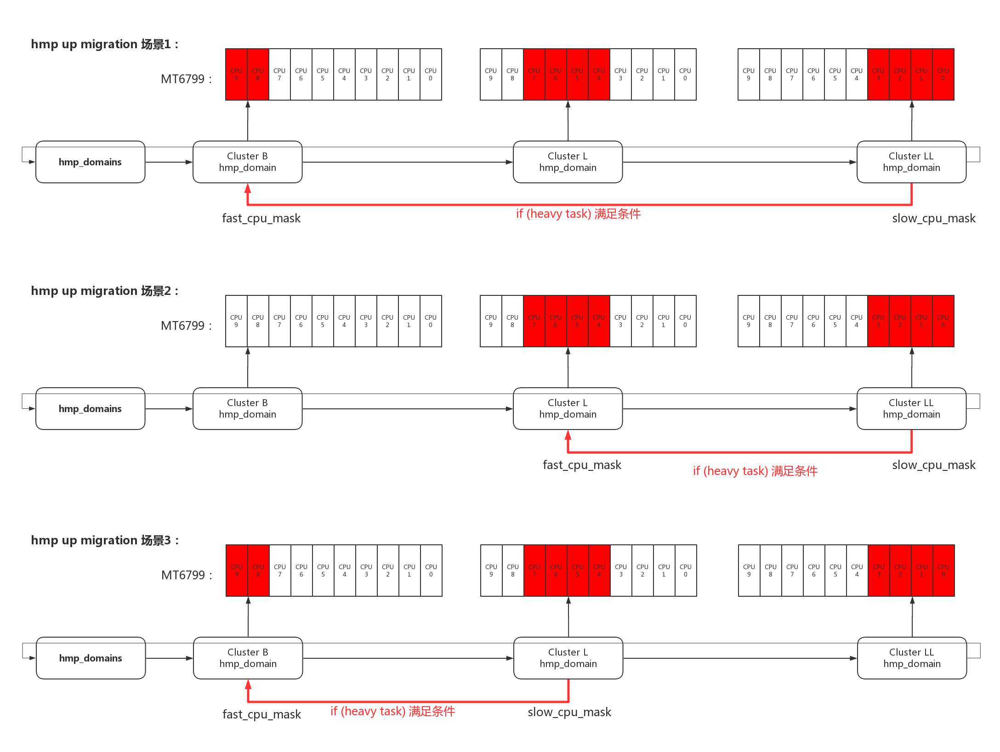

- 2、选择当前cpu的heaviest进程作为迁移进程p；并不会遍历cpu上所有进程去选出heaviest进程，只会查询curr进程和cfs_rq中5个进程中的heaviest；

- 3、根据fast_cpu_mask，选择一个负载最少的target cpu；

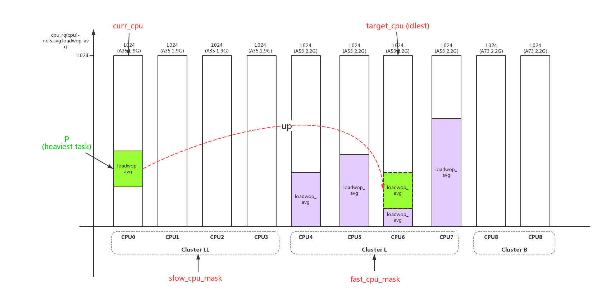

- 4、根据源cpu(curr_cpu)、目的cpu(target_cpu)，计算负载；

重要的数据计算方法：

<html>
<table>
    <tr>
        <td style="width: 100px;"> 重要数据 </td>
        <td style="width: 100px;"> 所属结构 </td>
        <td style="width: 100px;"> 含义 </td>
        <td style="width: 100px;"> 更新/获取函数 </td>
        <td style="width: 200px;"> 计算方法 </td>
    </tr>
    <tr>
        <td> clbenv->bstats.cpu_power </td>
        <td> clbenv->bstats </td>
        <td> B族cpu的绝对计算能力 </td>
        <td> sched_update_clbstats() </td>
        <td> arch_scale_cpu_capacity(NULL, clbenv->btarget) </td>
    </tr>
    <tr>
        <td> clbenv->lstats.cpu_power </td>
        <td> clbenv->lstats </td>
        <td> L族cpu的绝对计算能力 </td>
        <td> sched_update_clbstats() </td>
        <td> arch_scale_cpu_capacity(NULL, clbenv->ltarget) </td>
    </tr>
    <tr>
        <td> clbenv->lstats.cpu_capacity </td>
        <td> clbenv->lstats </td>
        <td> B族cpu的相对计算能力，大于1024 </td>
        <td> sched_update_clbstats() </td>
        <td> SCHED_CAPACITY_SCALE * clbenv->bstats.cpu_power / (clbenv->lstats.cpu_power+1) </td>
    </tr>
    <tr>
        <td> clbenv->bstats.cpu_capacity </td>
        <td> clbenv->bstats </td>
        <td> L族cpu的相对计算能力，等于1024 </td>
        <td> sched_update_clbstats() </td>
        <td> SCHED_CAPACITY_SCALE </td>
    </tr>
    <tr>
        <td> clbs->ncpu </td>
        <td> clbenv->bstats/clbenv->lstats </td>
        <td> L族/B族online的cpu数量 </td>
        <td> collect_cluster_stats() </td>
        <td> if (cpu_online(cpu)) clbs->ncpu++; </td>
    </tr>
    <tr>
        <td> clbs->ntask </td>
        <td> clbenv->bstats/clbenv->lstats </td>
        <td> L族/B族所有online cpu中所有层级se的总和 </td>
        <td> collect_cluster_stats() </td>
        <td> clbs->ntask += cpu_rq(cpu)->cfs.h_nr_running; </td>
    </tr>
    <tr>
        <td> clbs->load_avg </td>
        <td> clbenv->bstats/clbenv->lstats </td>
        <td> L族/B族online cpu的平均runnable负载，不带weight </td>
        <td> collect_cluster_stats() </td>
        <td> sum(cpu_rq(cpu)->cfs.avg.loadwop_avg)/clbs->ncpu </td>
    </tr>
    <tr>
        <td> clbs->scaled_acap </td>
        <td> clbenv->bstats/clbenv->lstats </td>
        <td> L族/B族target cpu计算能力的剩余值 </td>
        <td> collect_cluster_stats() </td>
        <td> hmp_scale_down(clbs->cpu_capacity - cpu_rq(target)->cfs.avg.loadwop_avg) </td>
    </tr>
    <tr>
        <td> clbs->scaled_atask </td>
        <td> clbenv->bstats/clbenv->lstats </td>
        <td> L族/B族target cpu的task space的剩余值 </td>
        <td> collect_cluster_stats() </td>
        <td> hmp_scale_down(clbs->cpu_capacity - cpu_rq(target)->cfs.h_nr_running * cpu_rq(target)->cfs.avg.loadwop_avg) </td>
    </tr>
    <tr>
        <td> clbenv->bstats.threshold </td>
        <td> clbenv->bstats </td>
        <td> 进程要up迁移到B族的负载门限值 </td>
        <td> adj_threshold() </td>
        <td> HMP_MAX_LOAD - HMP_MAX_LOAD * b_nacap * b_natask / ((b_nacap + l_nacap) * (b_natask + l_natask) + 1)；b_nacap、b_natask会乘以一个放大系数(b_cpu_power/l_cpu_power)，类似如cpu_capacity的计算 </td>
    </tr>
    <tr>
        <td> clbenv->lstats.threshold  </td>
        <td> clbenv->lstats </td>
        <td> 进程要down迁移到L族的负载门限值 </td>
        <td> adj_threshold() </td>
        <td> HMP_MAX_LOAD * l_nacap * l_natask / ((b_nacap + l_nacap) * (b_natask + l_natask) + 1)；b_nacap、b_natask会乘以一个放大系数(b_cpu_power/l_cpu_power)，类似如cpu_capacity的计算 </td>
    </tr>
</table>
</html>

- 5、根据计算的负载情况，判断进程p是否符合up迁移条件((se_load(se) > B->threshold)，等其他条件)；

up-migration条件列表(hmp_up_migration())：

<html>
<table>
    <tr>
        <td style="width: 100px;"> 条件 </td>
        <td style="width: 100px;"> 含义 </td>
        <td style="width: 200px;"> 计算方法 </td>
        <td style="width: 200px;"> 计算解析 </td>
    </tr>
    <tr>
        <td> [1] Migration stabilizing </td>
        <td> 如果target cpu刚做过up迁移，不适合再进行迁移 </td>
        <td> if (!hmp_up_stable(*target_cpu)) check->result = 0; </td>
        <td> (((now - hmp_last_up_migration(cpu)) >> 10) < hmp_next_up_threshold) //间隔时间小于hmp_next_up_threshold </td>
    </tr>
    <tr>
        <td> [2] Filter low-priority task </td>
        <td> 低优先级进程(nice>5)如果负载不够，不能进行up迁移 </td>
        <td> if (hmp_low_prio_task_up_rejected(p, B, L)) check->result = 0; </td>
        <td> (task_low_priority(p->prio) && (B->ntask >= B->ncpu || 0 != L->nr_normal_prio_task) && (p->se.avg.loadwop_avg < 800)) // (如果是低优先级(nice>5)进程) && (B组进程大于cpu数 || L正常优先级的进程不为0) && (进程负载<800)；满足上述条件不进行up迁移 </td>
    </tr>
    <tr>
        <td> [2.5]if big is idle, just go to big </td>
        <td> 如果目标B cpu处于idle状态，不需要判断其他条件，直接满足up迁移 </td>
        <td> if (rq_length(*target_cpu) == 0) check->result = 1; </td>
        <td> (cpu_rq(cpu)->nr_running + cfs_nr_pending(cpu)) == 0 //  </td>
    </tr>
    <tr>
        <td> [3] Check CPU capacity </td>
        <td> 判断目标B cpu的capacity是否足够容纳迁移过去的进程se </td>
        <td> if (!hmp_task_fast_cpu_afford(B, se, *target_cpu)) check->result = 0; </td>
        <td> (se_load(se) + cfs_load(target_cpu)) < (B->cpu_capacity - (B->cpu_capacity >> 2)) // se + target_cpu的负载，需要小于3/4 cpu_capacity  </td>
    </tr>
    <tr>
        <td> [4] Check dynamic migration threshold </td>
        <td> 如果进程的负载达到up迁移的门限值，则满足up迁移 </td>
        <td> if (se_load(se) > B->threshold) check->result = 1; </td>
        <td>  </td>
    </tr>
</table>
</html>

- 6、如果条件符合，进行实际的up迁移；


hmp_force_up_migration()详细的代码解析：


```
static void run_rebalance_domains(struct softirq_action *h)
{
	struct rq *this_rq = this_rq();
	enum cpu_idle_type idle = this_rq->idle_balance ?
						CPU_IDLE : CPU_NOT_IDLE;
	int this_cpu = smp_processor_id();

	/* bypass load balance of HMP if EAS consideration */
	/* (1) 在EAS不使能的情况下，尝试进行HMP负载均衡 */
	if ((!energy_aware() && sched_feat(SCHED_HMP)) ||
			(hybrid_support() && cpu_rq(this_cpu)->rd->overutilized))
		hmp_force_up_migration(this_cpu);

	/*
	 * If this cpu has a pending nohz_balance_kick, then do the
	 * balancing on behalf of the other idle cpus whose ticks are
	 * stopped. Do nohz_idle_balance *before* rebalance_domains to
	 * give the idle cpus a chance to load balance. Else we may
	 * load balance only within the local sched_domain hierarchy
	 * and abort nohz_idle_balance altogether if we pull some load.
	 */
	nohz_idle_balance(this_rq, idle);
	rebalance_domains(this_rq, idle);
}

|→

static void hmp_force_up_migration(int this_cpu)
{
	int curr_cpu, target_cpu;a
	struct sched_entity *se;
	struct rq *target;
	unsigned long flags;
	unsigned int force = 0;
	struct task_struct *p;
	struct clb_env clbenv;
#ifdef CONFIG_SCHED_HMP_PLUS
	struct sched_entity *orig;
#endif

	if (!spin_trylock(&hmp_force_migration))
		return;

#ifdef CONFIG_HMP_TRACER
	for_each_online_cpu(curr_cpu)
		trace_sched_cfs_runnable_load(curr_cpu, cfs_load(curr_cpu), cfs_length(curr_cpu));
#endif

	/* Migrate heavy task from LITTLE to big */
	/* (1.1) 逐个online cpu尝试进行heavy task从little cpu到big cpu的迁移 */
	for_each_online_cpu(curr_cpu) {
		struct hmp_domain *hmp_domain = NULL;
		struct cpumask fast_cpu_mask, slow_cpu_mask;

		cpumask_clear(&fast_cpu_mask);
		cpumask_clear(&slow_cpu_mask);
		/* (1.2) 如果当前cpu不属于速度最快(fastest)的domain,
		    则尝试进行up操作
		 */
		if (!hmp_cpu_is_fastest(curr_cpu)) {
			/* current cpu is slow_cpu_mask*/
			/* (1.2.1) 当前cpu所在的hmp_domain为slow_cpu_mask */
			hmp_domain = hmp_cpu_domain(curr_cpu);
			cpumask_copy(&slow_cpu_mask, &hmp_domain->possible_cpus);

            /* (1.2.2) 最fastest且online的hmp_domain为fast_cpu_mask */
			while (&hmp_domain->hmp_domains != hmp_domains.next) {
				struct list_head *pos = &hmp_domain->hmp_domains;

				hmp_domain = list_entry(pos->prev, struct hmp_domain, hmp_domains);
				if (!cpumask_empty(&hmp_domain->cpus)) {
					cpumask_copy(&fast_cpu_mask, &hmp_domain->possible_cpus);
					break;
				}
			}
		} else {
		/* (1.3) 如果当前cpu属于速度最快(fastest)的domain,
		    则直接进行down操作
		 */
			hmp_force_down_migration(this_cpu);
			continue;
		}
		if (!hmp_domain || hmp_domain == hmp_cpu_domain(curr_cpu))
			continue;

		if (cpumask_empty(&fast_cpu_mask) || cpumask_empty(&slow_cpu_mask))
			continue;

		force = 0;
		/* (1.4) 取出当前cpu的当前cfs进程 */
		target = cpu_rq(curr_cpu);
		raw_spin_lock_irqsave(&target->lock, flags);
		se = target->cfs.curr;
		if (!se) {
			raw_spin_unlock_irqrestore(&target->lock, flags);
			continue;
		}

		/* Find task entity */
		if (!entity_is_task(se)) {
			struct cfs_rq *cfs_rq;

			cfs_rq = group_cfs_rq(se);
			while (cfs_rq) {
				se = cfs_rq->curr;
				cfs_rq = group_cfs_rq(se);
			}
		}
#ifdef CONFIG_SCHED_HMP_PLUS
		orig = se;
		/* (1.5) 或者取出当前cpu前5个cfs进程中，负载最重(heaviest)的进程 */
		se = hmp_get_heaviest_task(se, -1);
		if (!se) {
			raw_spin_unlock_irqrestore(&target->lock, flags);
			continue;
		}
		if (!entity_is_task(se))
			p = task_of(orig);
		else
#endif
			p = task_of(se);

        /* (1.6) 选择fast_cpu_mask domain中，负载最少的cpu */
		target_cpu = hmp_select_cpu(HMP_GB, p, &fast_cpu_mask, -1, 0);
		if (target_cpu >= num_possible_cpus()) {
			raw_spin_unlock_irqrestore(&target->lock, flags);
			continue;
		}

		/* Collect cluster information */
		/* (1.7) up操作的对象已经选择好：
		    源little cpu：curr_cpu
		    目的big cpu：target_cpu
		 */
		memset(&clbenv, 0, sizeof(clbenv));
		clbenv.flags |= HMP_GB;
		clbenv.ltarget = curr_cpu;
		clbenv.btarget = target_cpu;
		cpumask_copy(&clbenv.lcpus, &slow_cpu_mask);
		cpumask_copy(&clbenv.bcpus, &fast_cpu_mask);
		/* (1.8) up操作前的数据计算 */
		sched_update_clbstats(&clbenv);

		/* Check migration threshold */
		/* (1.9) 根据计算的数据，判断up操作的可行性 */
		if (!target->active_balance &&
				hmp_up_migration(curr_cpu, &target_cpu, se, &clbenv) &&
				!cpu_park(cpu_of(target))) {
			if (p->state != TASK_DEAD) {
			    /* 准备从target rq中迁移进程p到target_cpu，
			        设置rq正在处理负载balance标志active_balance */
				get_task_struct(p);
				target->active_balance = 1; /* force up */
				target->push_cpu = target_cpu;
				target->migrate_task = p;
				force = 1;
				trace_sched_hmp_migrate(p, target->push_cpu, 1);
				hmp_next_up_delay(&p->se, target->push_cpu);
			}
		}

		raw_spin_unlock_irqrestore(&target->lock, flags);
		/* (1.10) 判断结果是可以进行up操作，
		    则调用hmp_force_up_cpu_stop()进行实际的up操作 
		 */
		if (force) {
			if (stop_one_cpu_dispatch(cpu_of(target),
						hmp_force_up_cpu_stop,
						target, &target->active_balance_work)) {
				/* 迁移完成，清除标志 */
				put_task_struct(p); /* out of rq->lock */
				raw_spin_lock_irqsave(&target->lock, flags);
				target->active_balance = 0;
				force = 0;
				raw_spin_unlock_irqrestore(&target->lock, flags);
			}
		} else
		/* (1.11) 否则，再尝试进行down操作 */
			hmp_force_down_migration(this_cpu);
	}

#ifdef CONFIG_HMP_TRACER
	trace_sched_hmp_load(clbenv.bstats.load_avg, clbenv.lstats.load_avg);
#endif
	spin_unlock(&hmp_force_migration);

}

||→

static const int hmp_max_tasks = 5;
static struct sched_entity *hmp_get_heaviest_task(
		struct sched_entity *se, int target_cpu)
{
	int num_tasks = hmp_max_tasks;
	struct sched_entity *max_se = se;
	unsigned long int max_ratio = se->avg.loadwop_avg;
	const struct cpumask *hmp_target_mask = NULL;
	struct hmp_domain *hmp;

    /* (1.5.1) 如果本cpu是fastest cpu，则不用查找直接返回，
        因为本函数的目的是找little cpu中的heaviest进程
     */
	if (hmp_cpu_is_fastest(cpu_of(se->cfs_rq->rq)))
		return max_se;

    /* (1.5.2) 获取比本cpu fater一级cpu的hmp_domain，作为进程亲和力判断的mask */
	hmp = hmp_faster_domain(cpu_of(se->cfs_rq->rq));
	hmp_target_mask = &hmp->cpus;
	/* (1.5.3) 传入参数target_cpu = -1，
	    所以hmp_target_mask使用的是源cpu hmp_domain的hmp->cpus 
	 */
	if (target_cpu >= 0) {
		/* idle_balance gets run on a CPU while
		 * it is in the middle of being hotplugged
		 * out. Bail early in that case.
		 */
		if (!cpumask_test_cpu(target_cpu, hmp_target_mask))
			return NULL;
		hmp_target_mask = cpumask_of(target_cpu);
	}
	/* The currently running task is not on the runqueue */
	/* (1.5.4) 从当前cpu的cfs红黑树中，连续5个进程和curr进程比较，选出heaviest进程 
	    比较使用的负载为se->avg.loadwop_avg，不带weight分量
	 */
	se = __pick_first_entity(cfs_rq_of(se));
	while (num_tasks && se) {
		if (entity_is_task(se) && se->avg.loadwop_avg > max_ratio &&
				cpumask_intersects(hmp_target_mask, tsk_cpus_allowed(task_of(se)))) {
			max_se = se;
			max_ratio = se->avg.loadwop_avg;
		}
		se = __pick_next_entity(se);
		num_tasks--;
	}
	return max_se;
}

||→

static unsigned int hmp_select_cpu(unsigned int caller, struct task_struct *p,
		struct cpumask *mask, int prev, int up)
{
	int curr = 0;
	int target = num_possible_cpus();
	unsigned long curr_wload = 0;
	unsigned long target_wload = 0;
	struct cpumask srcp;

    /* (1.6.1) 综合fast_cpu_mask、cpu_online_mask、tsk_cpus_allowed(p)，
        选取first cpu为target
     */
	cpumask_and(&srcp, cpu_online_mask, mask);
	target = cpumask_any_and(&srcp, tsk_cpus_allowed(p));
	if (target >= num_possible_cpus())
		goto out;

	/*
	 * RT class is taken into account because CPU load is multiplied
	 * by the total number of CPU runnable tasks that includes RT tasks.
	 */
	/*  (1.6.2) 计算target cpu所对应的load，
	    target_wload = (rq->cfs.avg.loadwop_avg + rq->cfs.avg.pending_load) * (rq->nr_running + rq->cfs.avg.nr_pending)
	    该负载会受RT进程的影响，因为rq->nr_running会统计包括RT进程的数量
	 */
	target_wload = hmp_inc(cfs_load(target));
	target_wload += cfs_pending_load(target);
	target_wload *= rq_length(target);
	for_each_cpu(curr, mask) {
		/* Check CPU status and task affinity */
		if (!cpu_online(curr) || !cpumask_test_cpu(curr, tsk_cpus_allowed(p)))
			continue;

		/* For global load balancing, unstable CPU will be bypassed */
		/* (1.6.3) 如果当前是up操作，如果cpu在短时间内进行了down操作，则不适合马上进行up操作 */
		if (hmp_caller_is_gb(caller) && !hmp_cpu_stable(curr, up))
			continue;

		curr_wload = hmp_inc(cfs_load(curr));
		curr_wload += cfs_pending_load(curr);
		curr_wload *= rq_length(curr);
		/* (1.6.4) 选择load最小的作为target cpu */
		if (curr_wload < target_wload) {
			target_wload = curr_wload;
			target = curr;
		/* (1.6.5) 在load同样小的情况下，选择prev cpu */
		} else if (curr_wload == target_wload && curr == prev) {
			target = curr;
		}
	}

out:
	return target;
}

||→

static void sched_update_clbstats(struct clb_env *clbenv)
{
	/* init cpu power and capacity */
	/* (1.8.1) L族和B族的绝对运行能力和相对运算能力，
	    .cpu_power = 绝对运算能力
	    .cpu_capacity = 相对运算能力
	 */
	clbenv->bstats.cpu_power = (int) arch_scale_cpu_capacity(NULL, clbenv->btarget);
	clbenv->lstats.cpu_power = (int) arch_scale_cpu_capacity(NULL, clbenv->ltarget);
	clbenv->lstats.cpu_capacity = SCHED_CAPACITY_SCALE;
	clbenv->bstats.cpu_capacity = SCHED_CAPACITY_SCALE * clbenv->bstats.cpu_power / (clbenv->lstats.cpu_power+1);

    /* (1.8.2) L族和B族的 */
	collect_cluster_stats(&clbenv->bstats, &clbenv->bcpus, clbenv->btarget);
	collect_cluster_stats(&clbenv->lstats, &clbenv->lcpus, clbenv->ltarget);
	
	/* (1.8.3) L族和B族的 */
	adj_threshold(clbenv);
}

|||→

static void collect_cluster_stats(struct clb_stats *clbs, struct cpumask *cluster_cpus, int target)
{
#define HMP_RESOLUTION_SCALING (4)
#define hmp_scale_down(w) ((w) >> HMP_RESOLUTION_SCALING)

	/* Update cluster informatics */
	int cpu;

    /* (1.8.2.1) 累加本族online cpu的值 */
	for_each_cpu(cpu, cluster_cpus) {
		if (cpu_online(cpu)) {
			clbs->ncpu++;
			clbs->ntask += cpu_rq(cpu)->cfs.h_nr_running;
			clbs->load_avg += cpu_rq(cpu)->cfs.avg.loadwop_avg;
#ifdef CONFIG_SCHED_HMP_PRIO_FILTER
			clbs->nr_normal_prio_task += cfs_nr_normal_prio(cpu);
			clbs->nr_dequeuing_low_prio += cfs_nr_dequeuing_low_prio(cpu);
#endif
		}
	}

	if (!clbs->ncpu || target >= num_possible_cpus() || !cpumask_test_cpu(target, cluster_cpus))
		return;

	/*
	 * Calculate available CPU capacity
	 * Calculate available task space
	 *
	 * Why load ratio should be multiplied by the number of task ?
	 * The task is the entity of scheduling unit so that we should consider
	 * it in scheduler. Only considering task load is not enough.
	 * Thus, multiplying the number of tasks can adjust load ratio to a more
	 * reasonable value.
	 */
	/* (1.8.2.2) 计算本族剩余的cpu计算能力 
	    capacity = 相对计算能力(clbs->cpu_capacity) - 本cpu的负载(rq->cfs.avg.loadwop_avg)
	    ：clbs->cpu_capacity是B族和L族相对的(L是1024，B大于1024)，而负载(rq->cfs.avg.loadwop_avg)是相对自己的B族和L族的最大值都是1024
	 */
	clbs->load_avg /= clbs->ncpu;
	clbs->acap = clbs->cpu_capacity - cpu_rq(target)->cfs.avg.loadwop_avg;
	clbs->scaled_acap = hmp_scale_down(clbs->acap);
	
	/* (1.8.2.3) 计算本族剩余的task空间
	    scaled_atask = 相对计算能力(clbs->cpu_capacity) - 本cpu的负载(rq->cfs.avg.loadwop_avg)*本cpu所有的进程数量(rq->cfs.h_nr_running)
	    ooooo这里的计算也不是在同一纬度上的
	 */
	clbs->scaled_atask = cpu_rq(target)->cfs.h_nr_running * cpu_rq(target)->cfs.avg.loadwop_avg;
	clbs->scaled_atask = clbs->cpu_capacity - clbs->scaled_atask;
	clbs->scaled_atask = hmp_scale_down(clbs->scaled_atask);

	mt_sched_printf(sched_log, "[%s] cpu/cluster:%d/%02lx load/len:%lu/%u stats:%d,%d,%d,%d,%d,%d,%d,%d\n",
			__func__, target, *cpumask_bits(cluster_cpus),
			cpu_rq(target)->cfs.avg.loadwop_avg,
			cpu_rq(target)->cfs.h_nr_running,
			clbs->ncpu, clbs->ntask, clbs->load_avg, clbs->cpu_capacity,
			clbs->acap, clbs->scaled_acap, clbs->scaled_atask, clbs->threshold);
}

|||→

/*
 * Task Dynamic Migration Threshold Adjustment.
 *
 * If the workload between clusters is not balanced, adjust migration
 * threshold in an attempt to move task precisely.
 *
 * Diff. = Max Threshold - Min Threshold
 *
 * Dynamic UP-Threshold =
 *                               B_nacap               B_natask
 * Max Threshold - Diff. x  -----------------  x  -------------------
 *                          B_nacap + L_nacap     B_natask + L_natask
 *
 *
 * Dynamic Down-Threshold =
 *                               L_nacap               L_natask
 * Min Threshold + Diff. x  -----------------  x  -------------------
 *                          B_nacap + L_nacap     B_natask + L_natask
 */
static void adj_threshold(struct clb_env *clbenv)
{
#define POSITIVE(x) ((int)(x) < 0 ? 0 : (x))

	unsigned long b_cap = 0, l_cap = 0;
	int b_nacap, l_nacap, b_natask, l_natask;

	b_cap = clbenv->bstats.cpu_power;
	l_cap = clbenv->lstats.cpu_power;
	
	/* (1.8.3.1) 把B族剩余cpu计算能力和task空间，转换成L族的相对值 */
	b_nacap = POSITIVE(clbenv->bstats.scaled_acap *
			clbenv->bstats.cpu_power / (clbenv->lstats.cpu_power+1));
	b_natask = POSITIVE(clbenv->bstats.scaled_atask *
			clbenv->bstats.cpu_power / (clbenv->lstats.cpu_power+1));
	
	/* L族的值维持不变 */		
	l_nacap = POSITIVE(clbenv->lstats.scaled_acap);
	l_natask = POSITIVE(clbenv->lstats.scaled_atask);

    /* (1.8.3.2) 计算up的threshold， 
        up-threshold = HMP_MAX_LOAD - HMP_MAX_LOAD*B族剩余
     */
	clbenv->bstats.threshold = HMP_MAX_LOAD - HMP_MAX_LOAD * b_nacap * b_natask /
		((b_nacap + l_nacap) * (b_natask + l_natask) + 1);
		
	/* (1.8.3.3) 计算down的threshold， 
        down-threshold = HMP_MAX_LOAD*L族剩余
     */
	clbenv->lstats.threshold = HMP_MAX_LOAD * l_nacap * l_natask /
		((b_nacap + l_nacap) * (b_natask + l_natask) + 1);

	mt_sched_printf(sched_log, "[%s]\tup/dl:%4d/%4d L(%d:%4lu) b(%d:%4lu)\n", __func__,
			clbenv->bstats.threshold, clbenv->lstats.threshold,
			clbenv->ltarget, l_cap, clbenv->btarget, b_cap);
}

||→

/*
 * Check whether this task should be migrated to big
 * Briefly summarize the flow as below;
 * 1) Migration stabilizing
 * 2) Filter low-priority task
 * 2.5) Keep all cpu busy
 * 3) Check CPU capacity
 * 4) Check dynamic migration threshold
 */
static unsigned int hmp_up_migration(int cpu, int *target_cpu, struct sched_entity *se,
		struct clb_env *clbenv)
{
	struct task_struct *p = task_of(se);
	struct clb_stats *L, *B;
	struct mcheck *check;
	int curr_cpu = cpu;
#ifdef CONFIG_HMP_TRACER
	unsigned int caller = clbenv->flags;
#endif

	L = &clbenv->lstats;
	B = &clbenv->bstats;
	check = &clbenv->mcheck;

	check->status = clbenv->flags;
	check->status |= HMP_TASK_UP_MIGRATION;
	check->result = 0;

	/*
	 * No migration is needed if
	 * 1) There is only one cluster
	 * 2) Task is already in big cluster
	 * 3) It violates task affinity
	 */
	if (!L->ncpu || !B->ncpu
			|| cpumask_test_cpu(curr_cpu, &clbenv->bcpus)
			|| !cpumask_intersects(&clbenv->bcpus, tsk_cpus_allowed(p)))
		goto out;

    /* (1.9.1) 如果目标cpu短时间内已经执行了up操作，则为up unstable状态，退出 */
	/*
	 * [1] Migration stabilizing
	 * Let the task load settle before doing another up migration.
	 * It can prevent a bunch of tasks from migrating to a unstable CPU.
	 */
	if (!hmp_up_stable(*target_cpu))
		goto out;

    /* (1.9.2) 过滤掉优先级较低的进程，不进行迁移操作。具体有3个条件：
	    (task_low_priority(p->prio) && \    // nice值大于5
	    (B->ntask >= B->ncpu || 0 != L->nr_normal_prio_task) && \  // B组进程大于cou数 || 正常优先级的进程不为0
	    (p->se.avg.loadwop_avg < 800))  // 平均负载小于800
	 */
	/* [2] Filter low-priority task */
#ifdef CONFIG_SCHED_HMP_PRIO_FILTER
	if (hmp_low_prio_task_up_rejected(p, B, L)) {
		check->status |= HMP_LOW_PRIORITY_FILTER;
		goto trace;
	}
#endif

    /* (1.9.3) 如果B组的target cpu为idle，不用过多判断，直接准备迁移 */
	/* [2.5]if big is idle, just go to big */
	if (rq_length(*target_cpu) == 0) {
		check->status |= HMP_BIG_IDLE;
		check->status |= HMP_MIGRATION_APPROVED;
		check->result = 1;
		goto trace;
	}

    /* (1.9.4) 判断B族target cpu的capacity是否足够，
        (se_load(se) + cfs_load(cpu)) < (B->cpu_capacity - (B->cpu_capacity >> 2))
        // target cpu负载 + 要迁移的se负载 是否小于 3/4 B族cpu的capacity
     */
	/*
	 * [3] Check CPU capacity
	 * Forbid up-migration if big CPU can't handle this task
	 */
	if (!hmp_task_fast_cpu_afford(B, se, *target_cpu)) {
		check->status |= HMP_BIG_CAPACITY_INSUFFICIENT;
		goto trace;
	}

    /* (1.9.5) 判断se的负载是否已经大于up-threshold(B->threshold) */
	/*
	 * [4] Check dynamic migration threshold
	 * Migrate task from LITTLE to big if load is greater than up-threshold
	 */
	if (se_load(se) > B->threshold) {
		check->status |= HMP_MIGRATION_APPROVED;
		check->result = 1;
	}

trace:
#ifdef CONFIG_HMP_TRACER
	if (check->result && hmp_caller_is_gb(caller))
		hmp_stats.nr_force_up++;
	trace_sched_hmp_stats(&hmp_stats);
	trace_sched_dynamic_threshold(task_of(se), B->threshold, check->status,
			curr_cpu, *target_cpu, se_load(se), B, L);
	trace_sched_dynamic_threshold_draw(B->threshold, L->threshold);
#endif
out:
	return check->result;
}

||→

static int hmp_force_up_cpu_stop(void *data)
{
    /* (1.10.1) 执行进程迁移 */
	return hmp_active_task_migration_cpu_stop(data);
}

|||→

static int hmp_active_task_migration_cpu_stop(void *data)
{
	struct rq *busiest_rq = data;
	struct task_struct *p = NULL;
	int busiest_cpu = cpu_of(busiest_rq);
	int target_cpu = busiest_rq->push_cpu;
	struct rq *target_rq = cpu_rq(target_cpu);
	struct sched_domain *sd;

	raw_spin_lock_irq(&busiest_rq->lock);
	p = busiest_rq->migrate_task;
	/* make sure the requested cpu hasn't gone down in the meantime */
	if (unlikely(busiest_cpu != smp_processor_id() ||
				!busiest_rq->active_balance)) {
		goto out_unlock;
	}
	/* Is there any task to move? */
	if (busiest_rq->nr_running <= 1)
		goto out_unlock;
	/* Are both target and busiest cpu online */
	if (!cpu_online(busiest_cpu) || !cpu_online(target_cpu))
		goto out_unlock;
	/* Task has migrated meanwhile, abort forced migration */
	if ((!p) || (task_rq(p) != busiest_rq))
		goto out_unlock;
	/*
	 * This condition is "impossible", if it occurs
	 * we need to fix it. Originally reported by
	 * Bjorn Helgaas on a 128-cpu setup.
	 */
	WARN_ON(busiest_rq == target_rq);

    /* (1.10.1.1) 将源、目的rq lock住 */
	/* move a task from busiest_rq to target_rq */
	double_lock_balance(busiest_rq, target_rq);

    /* (1.10.1.2) 搜索target cpu所在的某一层次的sd，其sd->span[]即包含源cpu又包含目的cpu */
	/* Search for an sd spanning us and the target CPU. */
	rcu_read_lock();
	for_each_domain(target_cpu, sd) {
		if (cpumask_test_cpu(busiest_cpu, sched_domain_span(sd)))
			break;
	}

    /* (1.10.1.3) 构造数据，在同一sd下进行迁移 */
	if (likely(sd)) {
		struct lb_env env = {
			.sd             = sd,
			.dst_cpu        = target_cpu,
			.dst_rq         = target_rq,
			.src_cpu        = busiest_rq->cpu,
			.src_rq         = busiest_rq,
			.idle           = CPU_IDLE,
		};

		schedstat_inc(sd, alb_count);

        /* (1.10.1.4) 任务迁移 */
		if (move_specific_task(&env, p))
			schedstat_inc(sd, alb_pushed);
		else
			schedstat_inc(sd, alb_failed);
	}
	rcu_read_unlock();
	double_unlock_balance(busiest_rq, target_rq);
out_unlock:
	busiest_rq->active_balance = 0;
	raw_spin_unlock_irq(&busiest_rq->lock);

	put_task_struct(p);
	return 0;
}

||||→

static int move_specific_task(struct lb_env *env, struct task_struct *pm)
{
	struct task_struct *p, *n;

    /* (1.10.1.4.1) 从源rq->cfs_tasks逐个取出任务，直到查到pm */
	list_for_each_entry_safe(p, n, &env->src_rq->cfs_tasks, se.group_node) {
	
	    /* (1.10.1.4.2) task group的throttled判断 */
		if (throttled_lb_pair(task_group(p), env->src_rq->cpu,
					env->dst_cpu))
			continue;

        /* (1.10.1.4.3) 判断任务能否被迁移 */
		if (!hmp_can_migrate_task(p, env))
			continue;
		/* Check if we found the right task */
		if (p != pm)
			continue;

        /* (1.10.1.4.4) 迁移 */
		move_task(p, env);
		/*
		 * Right now, this is only the third place move_task()
		 * is called, so we can safely collect move_task()
		 * stats here rather than inside move_task().
		 */
		schedstat_inc(env->sd, lb_gained[env->idle]);
		return 1;
	}
	return 0;
}

|||||→

static void move_task(struct task_struct *p, struct lb_env *env)
{
	deactivate_task(env->src_rq, p, 0);
	set_task_cpu(p, env->dst_cpu);
	activate_task(env->dst_rq, p, 0);
	check_preempt_curr(env->dst_rq, p, 0);
}

```

### 4.2.3、hmp_force_down_migration()


hmp_force_down_migration()的操作主要有以下几个步骤：

- 1、根据当前cpu，选择fast_cpu_mask、slow_cpu_mask；

hmp_force_down_migration尝试把fast cpu上的light进程迁移到slow cpu上，关于fast、slow的选择有以下几种场景：

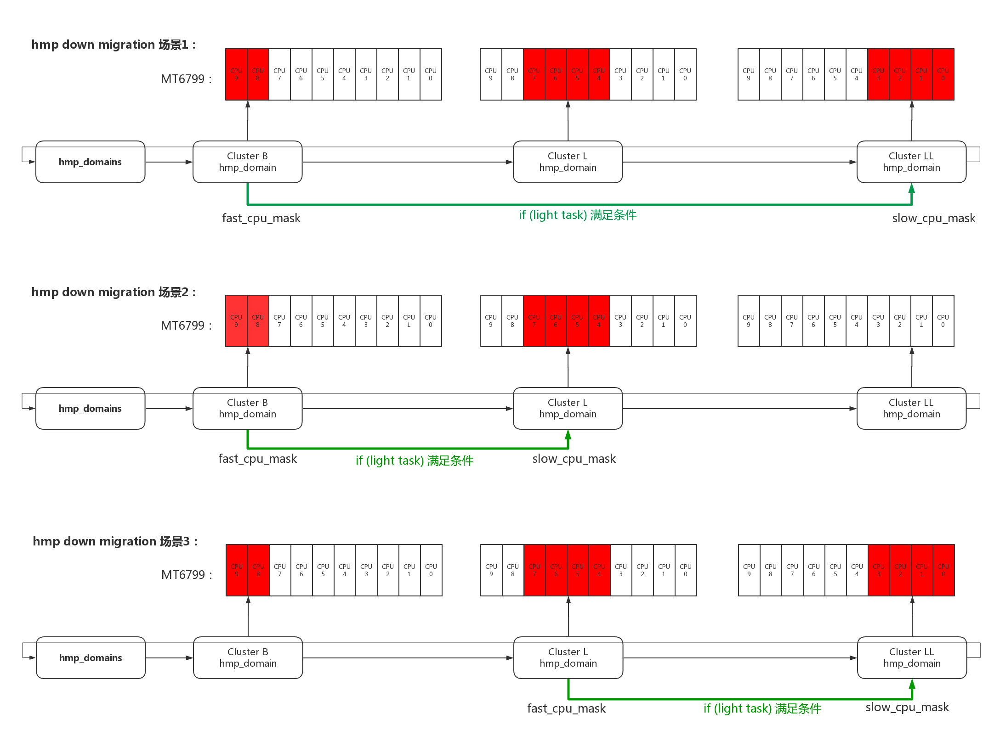
- 2、选择当前cpu的lightest进程作为迁移进程p；并不会遍历cpu上所有进程去选出lightest进程，只会查询curr进程和cfs_rq中5个进程中的lightest；

- 3、根据slow_cpu_mask，选择一个负载最少的target cpu；

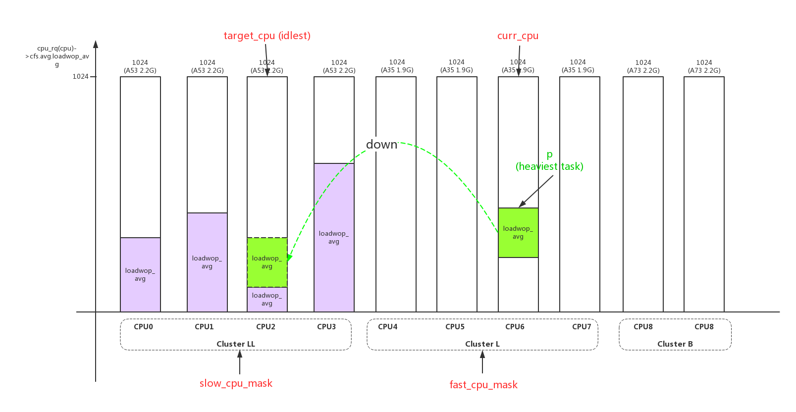

- 4、根据源cpu(curr_cpu)、目的cpu(target_cpu)，计算负载；

重要的数据计算方法和hmp_force_up_migration()一致，参考上一节；

- 5、根据计算的负载情况，判断进程p是否符合down迁移条件((L->threshold >= se_load(se))，等其他条件)；

down-migration条件列表(hmp_down_migration())：

<html>
<table>
    <tr>
        <td style="width: 100px;"> 条件 </td>
        <td style="width: 100px;"> 含义 </td>
        <td style="width: 200px;"> 计算方法 </td>
        <td style="width: 200px;"> 计算解析 </td>
    </tr>
    <tr>
        <td> [1] Migration stabilizing </td>
        <td> 如果target cpu刚做过down迁移，不适合再进行迁移 </td>
        <td> if (!hmp_down_stable(*target_cpu)) check->result = 0; </td>
        <td> (((now - hmp_last_down_migration(cpu)) >> 10) < hmp_next_down_threshold) //间隔时间小于hmp_next_down_threshold </td>
    </tr>
    <tr>
        <td> [1.5]if big is busy and little is idle, just go to little </td>
        <td> 如果big cpu busy && little cpu idle，则不用进行其他判断，直接满足up迁移 </td>
        <td> if ((rq_length(*target_cpu) == 0 && caller == HMP_SELECT_RQ && rq_length(curr_cpu) > 0) && (!(!is_heavy_task(curr_rq->curr) && is_heavy_task(p)))) check->result = 1;</td>
        <td> caller == HMP_SELECT_RQ // 只有select rq操作时有效； is_heavy_task() // p->se.avg.loadwop_avg >= 650 </td>
    </tr>
    <tr>
        <td> [2] Filter low-priority task </td>
        <td> 低优先级进程(nice>5)如果满足以下条件，准许迁移 </td>
        <td> if (hmp_low_prio_task_down_allowed(p, B, L)) check->result = 1; </td>
        <td> (task_low_priority(p->prio) && !B->nr_dequeuing_low_prio && B->ntask >= B->ncpu && 0 != L->nr_normal_prio_task && (p->se.avg.loadwop_avg < 800)) // (nice值大于5) && (B和L都不是特别空闲) && (进程负载<800) </td>
    </tr>
    <tr>
        <td> [3] Check CPU capacity，1) big cpu is not oversubscribed </td>
        <td> 如果big cpu有足够的空闲周期，不需要强制把big cpu的light任务迁移到little cpu上 </td>
        <td> if (!hmp_fast_cpu_oversubscribed(caller, B, se, curr_cpu)) check->result = 0; </td>
        <td> cfs_load(curr_cpu) < (B->cpu_capacity - (B->cpu_capacity >> 2)) // 当前cpu负载小于3/4 cpu_capacity </td>
    </tr>
    <tr>
        <td> [3] Check CPU capacity，2) LITTLE cpu doesn't have available capacity for this new task </td>
        <td> 判断L族cpu的剩余capacity是否足够容纳需要迁移的进程 </td>
        <td> if (!hmp_task_slow_cpu_afford(L, se)) check->result = 0; </td>
        <td> (L->acap > 0 && L->acap >= se_load(se)) // L族cpu的剩余能力大于se的负载，才能继续判断 </td>
    </tr>
    <tr>
        <td> [4] Check dynamic migration threshold </td>
        <td> 如果进程的负载低于down迁移的门限值，则满足down迁移 </td>
        <td> if (L->threshold >= se_load(se)) check->result = 1; </td>
        <td>  </td>
    </tr>
</table>
</html>

- 6、如果条件符合，进行实际的down迁移；


hmp_force_down_migration()详细的代码解析：


```
static void hmp_force_down_migration(int this_cpu)
{
	int target_cpu;
	struct sched_entity *se;
	struct rq *target;
	unsigned long flags;
	unsigned int force = 0;
	struct task_struct *p;
	struct clb_env clbenv;
#ifdef CONFIG_SCHED_HMP_PLUS
	struct sched_entity *orig;
	int B_cpu;
#endif
	struct hmp_domain *hmp_domain = NULL;
	struct cpumask fast_cpu_mask, slow_cpu_mask;

	cpumask_clear(&fast_cpu_mask);
	cpumask_clear(&slow_cpu_mask);

	/* Migrate light task from big to LITTLE */
	/* (1) 如果当前cpu不是最慢的cpu(slowest)，则尝试down操作 */
	if (!hmp_cpu_is_slowest(this_cpu)) {
	
	    /* (2) 当前cpu所在的hmp_domain为fast_cpu_mask */
		hmp_domain = hmp_cpu_domain(this_cpu);
		cpumask_copy(&fast_cpu_mask, &hmp_domain->possible_cpus);
		
		/* (3) 查找相比当前最慢且online的hmp_domain作为slow_cpu_mask */
		while (!list_is_last(&hmp_domain->hmp_domains, &hmp_domains)) {
			struct list_head *pos = &hmp_domain->hmp_domains;

			hmp_domain = list_entry(pos->next, struct hmp_domain, hmp_domains);

			if (!cpumask_empty(&hmp_domain->cpus)) {
				cpumask_copy(&slow_cpu_mask, &hmp_domain->possible_cpus);
				break;
			}
		}
	}
	
	if (!hmp_domain || hmp_domain == hmp_cpu_domain(this_cpu))
		return;

    /* (4) 找不到可操作的fast_cpu_mask、slow_cpu_mask直接返回 */
	if (cpumask_empty(&fast_cpu_mask) || cpumask_empty(&slow_cpu_mask))
		return;

    /* (5) 源cpu = this_cpu，源rq = target */
	force = 0;
	target = cpu_rq(this_cpu);
	raw_spin_lock_irqsave(&target->lock, flags);
	se = target->cfs.curr;
	if (!se) {
		raw_spin_unlock_irqrestore(&target->lock, flags);
		return;
	}

    /* (6) 首先尝试使用curr进程作为down迁移的进程 */
	/* Find task entity */
	if (!entity_is_task(se)) {
		struct cfs_rq *cfs_rq;

		cfs_rq = group_cfs_rq(se);
		while (cfs_rq) {
			se = cfs_rq->curr;
			cfs_rq = group_cfs_rq(se);
		}
	}
#ifdef CONFIG_SCHED_HMP_PLUS
    /* (7) 在curr进程开始的5个进程中，挑负载最轻的进程作为down迁移进程 */
	orig = se;
	se = hmp_get_lightest_task(orig, 1);
	if (!entity_is_task(se))
		p = task_of(orig);
	else
#endif
		p = task_of(se);
#ifdef CONFIG_SCHED_HMP_PLUS
    /* (8) 找出B族中负载最轻的cpu，如果其为idle状态，则放弃down操作 
        因为load_balance中的idle_balance会重新把任务迁移回idle的big cpu，避免相互的乒乓操作
     */
	/* Don't offload to little if there is one idle big, let load balance to do it's work */
	/* Also, to prevent idle_balance from leading to potential ping-pong */
	B_cpu = hmp_select_cpu(HMP_GB, p, &fast_cpu_mask, this_cpu, 0);
	if (B_cpu < nr_cpu_ids && !rq_length(B_cpu)) {
		raw_spin_unlock_irqrestore(&target->lock, flags);
		return;
	}
#endif

    /* (9) 找出L族中负载最轻的cpu作为target_cpu */
	target_cpu = hmp_select_cpu(HMP_GB, p, &slow_cpu_mask, -1, 1);
	if (target_cpu >= num_possible_cpus()) {
		raw_spin_unlock_irqrestore(&target->lock, flags);
		return;
	}

    /* (10) 迁移前对B族、L族负载和threshold的计算 */
	/* Collect cluster information */
	memset(&clbenv, 0, sizeof(clbenv));
	clbenv.flags |= HMP_GB;
	clbenv.btarget = this_cpu;
	clbenv.ltarget = target_cpu;
	cpumask_copy(&clbenv.lcpus, &slow_cpu_mask);
	cpumask_copy(&clbenv.bcpus, &fast_cpu_mask);
	sched_update_clbstats(&clbenv);

#ifdef CONFIG_SCHED_HMP_PLUS
	if (cpu_rq(this_cpu)->cfs.h_nr_running < 2) {
		raw_spin_unlock_irqrestore(&target->lock, flags);
		return;
	}
#endif

    /* (11) 检查down操作的迁移条件是否成立,hmp_down_migration() */
	/* Check migration threshold */
	if (!target->active_balance &&
			hmp_down_migration(this_cpu, &target_cpu, se, &clbenv) &&
			!cpu_park(cpu_of(target))) {
		if (p->state != TASK_DEAD) {
			get_task_struct(p);
			target->active_balance = 1; /* force down */
			target->push_cpu = target_cpu;
			target->migrate_task = p;
			force = 1;
			trace_sched_hmp_migrate(p, target->push_cpu, 1);
			hmp_next_down_delay(&p->se, target->push_cpu);
		}
	}
	raw_spin_unlock_irqrestore(&target->lock, flags);
	
	/* (12) 条件成立进行实际的down迁移操作hmp_force_down_cpu_stop() */
	if (force) {
		if (stop_one_cpu_dispatch(cpu_of(target),
					hmp_force_down_cpu_stop,
					target, &target->active_balance_work)) {
			put_task_struct(p); /* out of rq->lock */
			raw_spin_lock_irqsave(&target->lock, flags);
			target->active_balance = 0;
			force = 0;
			raw_spin_unlock_irqrestore(&target->lock, flags);
		}
	}

}

|→

static struct sched_entity *hmp_get_lightest_task(
		struct sched_entity *se, int migrate_down)
{
	int num_tasks = hmp_max_tasks;
	struct sched_entity *min_se = se;
	unsigned long int min_ratio = se->avg.loadwop_avg;
	const struct cpumask *hmp_target_mask = NULL;

	if (migrate_down) {
		struct hmp_domain *hmp;

        /* (7.1) 如果cpu是最慢cpu(slowest)则直接退出，
            因为本函数的目的是找出faster cpu中lightest进程
         */
		if (hmp_cpu_is_slowest(cpu_of(se->cfs_rq->rq)))
			return min_se;
			
		/* (7.2) 将更slow一级的hmp_domain作为进程cpu亲和力的mask */
		hmp = hmp_slower_domain(cpu_of(se->cfs_rq->rq));
		hmp_target_mask = &hmp->cpus;
	}
	/* The currently running task is not on the runqueue */
	se = __pick_first_entity(cfs_rq_of(se));

    /* (7.3) 从当前cpu的cfs红黑树中，连续5个进程和curr进程比较，选出lightest进程 
	    比较使用的负载为se->avg.loadwop_avg，不带weight分量
	 */
	while (num_tasks && se) {
		if (entity_is_task(se) &&
				(se->avg.loadwop_avg < min_ratio && hmp_target_mask &&
				 cpumask_intersects(hmp_target_mask, tsk_cpus_allowed(task_of(se))))) {
			min_se = se;
			min_ratio = se->avg.loadwop_avg;
		}
		se = __pick_next_entity(se);
		num_tasks--;
	}
	return min_se;
}

|→

/*
 * Check whether this task should be migrated to LITTLE
 * Briefly summarize the flow as below;
 * 1) Migration stabilizing
 * 1.5) Keep all cpu busy
 * 2) Filter low-priority task
 * 3) Check CPU capacity
 * 4) Check dynamic migration threshold
 */
static unsigned int hmp_down_migration(int cpu, int *target_cpu, struct sched_entity *se,
		struct clb_env *clbenv)
{
	struct task_struct *p = task_of(se);
	struct clb_stats *L, *B;
	struct mcheck *check;
	int curr_cpu = cpu;
	unsigned int caller = clbenv->flags;

	L = &clbenv->lstats;
	B = &clbenv->bstats;
	check = &clbenv->mcheck;

	check->status = caller;
	check->status |= HMP_TASK_DOWN_MIGRATION;
	check->result = 0;

	/*
	 * No migration is needed if
	 * 1) There is only one cluster
	 * 2) Task is already in LITTLE cluster
	 * 3) It violates task affinity
	 */
	if (!L->ncpu || !B->ncpu
			|| cpumask_test_cpu(curr_cpu, &clbenv->lcpus)
			|| !cpumask_intersects(&clbenv->lcpus, tsk_cpus_allowed(p)))
		goto out;

    /* (11.1) 目的little cpu target_cpu近期如果有做过down操作，不适合再做down迁移 */
	/*
	 * [1] Migration stabilizing
	 * Let the task load settle before doing another down migration.
	 * It can prevent a bunch of tasks from migrating to a unstable CPU.
	 */
	if (!hmp_down_stable(*target_cpu))
		goto out;

    /* (11.2) 如果big busy，little idle则不用进行threshold判断 */
	/* [1.5]if big is busy and little is idle, just go to little */
	if (rq_length(*target_cpu) == 0 && caller == HMP_SELECT_RQ && rq_length(curr_cpu) > 0) {
		struct rq *curr_rq = cpu_rq(curr_cpu);

        /* (11.2.1) 如果big cpu，curr进程不是heavy进程，但是p是heavy进程，直接准许down迁移 
            heavy进程的判断标准为：负载>=650
         */
		/* if current big core is not heavy task and wake up task is heavy task no go to little */
		if (!(!is_heavy_task(curr_rq->curr) && is_heavy_task(p))) {
			check->status |= HMP_BIG_BUSY_LITTLE_IDLE;
			check->status |= HMP_MIGRATION_APPROVED;
			check->result = 1;
			goto trace;
		}
	}

    /* (11.3) 低优先级进程，如果满足以下条件，准许迁移：
        (task_low_priority(p->prio) && !B->nr_dequeuing_low_prio && \   // nice值大于5
         B->ntask >= B->ncpu && 0 != L->nr_normal_prio_task && \        // B和L都不是特别空闲
         (p->se.avg.loadwop_avg < 800))                                 // L上准备迁移的进程负载小于800
	 */
	/* [2] Filter low-priority task */
#ifdef CONFIG_SCHED_HMP_PRIO_FILTER
	if (hmp_low_prio_task_down_allowed(p, B, L)) {
		cfs_nr_dequeuing_low_prio(curr_cpu)++;
		check->status |= HMP_LOW_PRIORITY_FILTER;
		check->status |= HMP_MIGRATION_APPROVED;
		check->result = 1;
		goto trace;
	}
#endif

	/*
	 * [3] Check CPU capacity
	 * Forbid down-migration if either of the following conditions is true
	 * 1) big cpu is not oversubscribed (if big CPU seems to have spare
	 *    cycles, do not force this task to run on LITTLE CPU, but
	 *    keep it staying in its previous cluster instead)
	 * 2) LITTLE cpu doesn't have available capacity for this new task
	 */
	/* (11.4) 如果big cpu有足够的空闲周期，不需要强制把light任务迁移到little cpu上 
	    cfs_load(cpu) < (B->cpu_capacity - (B->cpu_capacity >> 2))
	 */
	if (!hmp_fast_cpu_oversubscribed(caller, B, se, curr_cpu)) {
		check->status |= HMP_BIG_NOT_OVERSUBSCRIBED;
		goto trace;
	}

    /* (11.5) 判断L族cpu的capacity是否足够容纳需要迁移的进程，
        (L->acap > 0 && L->acap >= se_load(se))
     */
	if (!hmp_task_slow_cpu_afford(L, se)) {
		check->status |= HMP_LITTLE_CAPACITY_INSUFFICIENT;
		goto trace;
	}


    /* (11.6) 判断se的负载是否已经小于down-threshold(L->threshold) */
	/*
	 * [4] Check dynamic migration threshold
	 * Migrate task from big to LITTLE if load ratio is less than
	 * or equal to down-threshold
	 */
	if (L->threshold >= se_load(se)) {
		check->status |= HMP_MIGRATION_APPROVED;
		check->result = 1;
	}

trace:
#ifdef CONFIG_HMP_TRACER
	if (check->result && hmp_caller_is_gb(caller))
		hmp_stats.nr_force_down++;
	trace_sched_hmp_stats(&hmp_stats);
	trace_sched_dynamic_threshold(task_of(se), L->threshold, check->status,
			curr_cpu, *target_cpu, se_load(se), B, L);
	trace_sched_dynamic_threshold_draw(B->threshold, L->threshold);
#endif
out:
	return check->result;
}

```

### 4.2.4、hmp_select_task_rq_fair()


## 4.3、cpu freq调整

前面讲的负载均衡的手段都是负载迁移，把负载迁移到最idle或者最省power的cpu上。另外一种方式就是调整cpu的freq，从而改变cpu的curr_capacity，来满足性能和功耗的需求。

cpu的频率调整是基于3个层次的：cpufreq governor、cpufreq core、cpufreq driver。

- 1、cpufreq governor决定cpu调频的算法，计算负载、根据负载的变化来动态调整频率；
- 2、cpufreq core对通用层进行了一些封装，比如cpufreq_policy的封装；
- 3、cpufreq driver是底层操作的实现，比如freq_table的初始化、cpu target频率的配置；

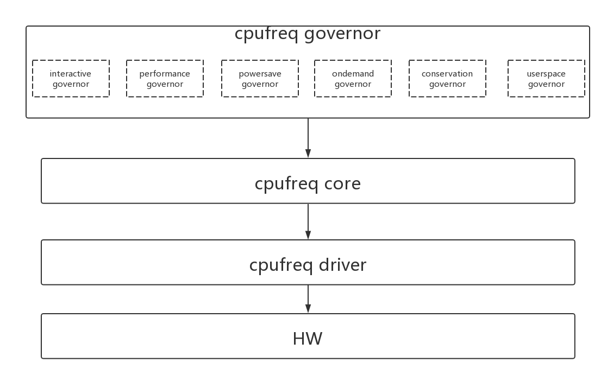

如果是MTK平台，cpufreq driver除了接受governor的频率调整还需要接受ppm的频率调整，它的框图大概如下：

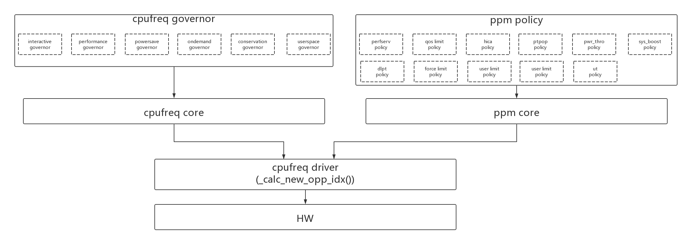


### 4.3.1、cpufreq core & cpufreq driver

cpufreq core层次最核心的就是每个cpu有一个自己的cpufreq_policy policy，放在per_cpu(cpufreq_cpu_data, cpu)变量中。实际上cpufreq_policy是一个cluster对应一个的，因为在现有的架构中，同一个cluster cpu都是同一个频率，所以同cluster中所有cpu的per_cpu(cpufreq_cpu_data, cpu)都指向同一个cpufreq_policy。

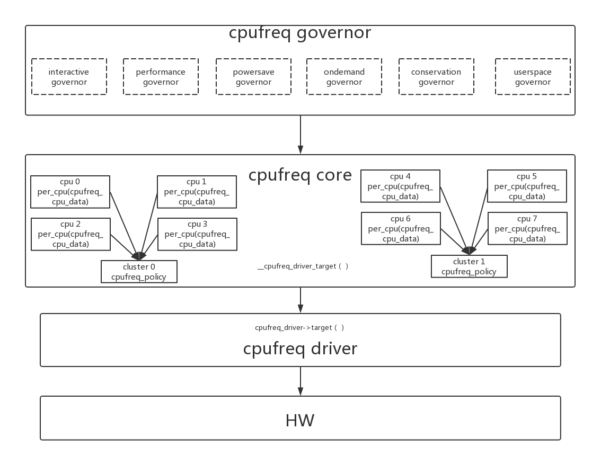

#### 4.3.1.1、cpufreq_policy policy初始化


```
struct cpufreq_policy {
	/* CPUs sharing clock, require sw coordination */
	cpumask_var_t		cpus;	/* Online CPUs only */
	cpumask_var_t		related_cpus; /* Online + Offline CPUs */
	cpumask_var_t		real_cpus; /* Related and present */

	unsigned int		shared_type; /* ACPI: ANY or ALL affected CPUs
						should set cpufreq */
	unsigned int		cpu;    /* cpu managing this policy, must be online */

	struct clk		*clk;
	struct cpufreq_cpuinfo	cpuinfo;/* see above */

	unsigned int		min;    /* in kHz */
	unsigned int		max;    /* in kHz */
	unsigned int		cur;    /* in kHz, only needed if cpufreq
					 * governors are used */
	unsigned int		restore_freq; /* = policy->cur before transition */
	unsigned int		suspend_freq; /* freq to set during suspend */

	unsigned int		policy; /* see above */
	unsigned int		last_policy; /* policy before unplug */
	struct cpufreq_governor	*governor; /* see below */
	void			*governor_data;
	bool			governor_enabled; /* governor start/stop flag */
	char			last_governor[CPUFREQ_NAME_LEN]; /* last governor used */

	struct work_struct	update; /* if update_policy() needs to be
					 * called, but you're in IRQ context */

	struct cpufreq_user_policy user_policy;
	struct cpufreq_frequency_table	*freq_table;

	struct list_head        policy_list;
	struct kobject		kobj;
	struct completion	kobj_unregister;

	/*
	 * The rules for this semaphore:
	 * - Any routine that wants to read from the policy structure will
	 *   do a down_read on this semaphore.
	 * - Any routine that will write to the policy structure and/or may take away
	 *   the policy altogether (eg. CPU hotplug), will hold this lock in write
	 *   mode before doing so.
	 *
	 * Additional rules:
	 * - Lock should not be held across
	 *     __cpufreq_governor(data, CPUFREQ_GOV_POLICY_EXIT);
	 */
	struct rw_semaphore	rwsem;

	/* Synchronization for frequency transitions */
	bool			transition_ongoing; /* Tracks transition status */
	spinlock_t		transition_lock;
	wait_queue_head_t	transition_wait;
	struct task_struct	*transition_task; /* Task which is doing the transition */

	/* cpufreq-stats */
	struct cpufreq_stats	*stats;

	/* For cpufreq driver's internal use */
	void			*driver_data;
}
```

在系统初始化化的时候初始化online cpu的cpufreq_policy，cpu在hotplug online的时候也会重新初始化cpufreq_policy。

- 1、在mtk的cpufreq_driver驱动初始化函数_mt_cpufreq_pdrv_probe()中注册了_mt_cpufreq_driver：

```
static int _mt_cpufreq_pdrv_probe(struct platform_device *pdev)
{
    
    /* 注册cpufreq_driver */
    cpufreq_register_driver(&_mt_cpufreq_driver);
    
    /* 注册ppm的回调 */
    mt_ppm_register_client(PPM_CLIENT_DVFS, &ppm_limit_callback);

}

static struct cpufreq_driver _mt_cpufreq_driver = {
	.flags = CPUFREQ_ASYNC_NOTIFICATION,
	.verify = _mt_cpufreq_verify,
	.target = _mt_cpufreq_target,
	.init = _mt_cpufreq_init,
	.exit = _mt_cpufreq_exit,
	.get = _mt_cpufreq_get,
	.name = "mt-cpufreq",
	.attr = _mt_cpufreq_attr,
};

```

- 2、在驱动注册cpufreq_register_driver()过程中会初始化online cpu的cpufreq_policy：

```
_mt_cpufreq_pdrv_probe() -> cpufreq_register_driver() -> subsys_interface_register() -> cpufreq_add_dev() -> cpufreq_online()

↓

static int cpufreq_online(unsigned int cpu)
{
	struct cpufreq_policy *policy;
	bool new_policy;
	unsigned long flags;
	unsigned int j;
	int ret;

	pr_debug("%s: bringing CPU%u online\n", __func__, cpu);

    /* (1) 检查per_cpu(cpufreq_cpu_data, cpu)中的cpufreq_policy， 
        如果为NULL，重新分配空间
     */
	/* Check if this CPU already has a policy to manage it */
	policy = per_cpu(cpufreq_cpu_data, cpu);
	if (policy) {
		WARN_ON(!cpumask_test_cpu(cpu, policy->related_cpus));
		if (!policy_is_inactive(policy))
			return cpufreq_add_policy_cpu(policy, cpu);

		/* This is the only online CPU for the policy.  Start over. */
		new_policy = false;
		down_write(&policy->rwsem);
		policy->cpu = cpu;
		policy->governor = NULL;
		up_write(&policy->rwsem);
	} else {
		new_policy = true;
		policy = cpufreq_policy_alloc(cpu);
		if (!policy)
			return -ENOMEM;
	}

	cpumask_copy(policy->cpus, cpumask_of(cpu));

    /* (2) 调用cpufreq_driver的初始化函数来初始化cpufreq_policy， 
        这步比较重要，初始化了以下的数据：
        
     */
	/* call driver. From then on the cpufreq must be able
	 * to accept all calls to ->verify and ->setpolicy for this CPU
	 */
	ret = cpufreq_driver->init(policy);
	if (ret) {
		pr_debug("initialization failed\n");
		goto out_free_policy;
	}

	down_write(&policy->rwsem);

    /* (3) 如果cpufreq_policy是新分配空间的，
        做一些相应的初始化工作
     */
	if (new_policy) {
		/* related_cpus should at least include policy->cpus. */
		cpumask_copy(policy->related_cpus, policy->cpus);
		/* Remember CPUs present at the policy creation time. */
		cpumask_and(policy->real_cpus, policy->cpus, cpu_present_mask);

		/* Name and add the kobject */
		ret = kobject_add(&policy->kobj, cpufreq_global_kobject,
				  "policy%u",
				  cpumask_first(policy->related_cpus));
		if (ret) {
			pr_err("%s: failed to add policy->kobj: %d\n", __func__,
			       ret);
			goto out_exit_policy;
		}
	}

	/*
	 * affected cpus must always be the one, which are online. We aren't
	 * managing offline cpus here.
	 */
	cpumask_and(policy->cpus, policy->cpus, cpu_online_mask);

	if (new_policy) {
		policy->user_policy.min = policy->min;
		policy->user_policy.max = policy->max;

		write_lock_irqsave(&cpufreq_driver_lock, flags);
		
		/* (3.1) 同一个cluster中所有cpu的per_cpu(cpufreq_cpu_data, j)，共享同一个cpufreq_policy */
		for_each_cpu(j, policy->related_cpus)
			per_cpu(cpufreq_cpu_data, j) = policy;
		write_unlock_irqrestore(&cpufreq_driver_lock, flags);
	}

    /* (4) 获取cpufreq_policy的当前频率
     */
	if (cpufreq_driver->get && !cpufreq_driver->setpolicy) {
		policy->cur = cpufreq_driver->get(policy->cpu);
		if (!policy->cur) {
			pr_err("%s: ->get() failed\n", __func__);
			goto out_exit_policy;
		}
	}

	/*
	 * Sometimes boot loaders set CPU frequency to a value outside of
	 * frequency table present with cpufreq core. In such cases CPU might be
	 * unstable if it has to run on that frequency for long duration of time
	 * and so its better to set it to a frequency which is specified in
	 * freq-table. This also makes cpufreq stats inconsistent as
	 * cpufreq-stats would fail to register because current frequency of CPU
	 * isn't found in freq-table.
	 *
	 * Because we don't want this change to effect boot process badly, we go
	 * for the next freq which is >= policy->cur ('cur' must be set by now,
	 * otherwise we will end up setting freq to lowest of the table as 'cur'
	 * is initialized to zero).
	 *
	 * We are passing target-freq as "policy->cur - 1" otherwise
	 * __cpufreq_driver_target() would simply fail, as policy->cur will be
	 * equal to target-freq.
	 */
	if ((cpufreq_driver->flags & CPUFREQ_NEED_INITIAL_FREQ_CHECK)
	    && has_target()) {
		/* Are we running at unknown frequency ? */
		ret = cpufreq_frequency_table_get_index(policy, policy->cur);
		if (ret == -EINVAL) {
			/* Warn user and fix it */
			pr_warn("%s: CPU%d: Running at unlisted freq: %u KHz\n",
				__func__, policy->cpu, policy->cur);
			ret = __cpufreq_driver_target(policy, policy->cur - 1,
				CPUFREQ_RELATION_L);

			/*
			 * Reaching here after boot in a few seconds may not
			 * mean that system will remain stable at "unknown"
			 * frequency for longer duration. Hence, a BUG_ON().
			 */
			BUG_ON(ret);
			pr_warn("%s: CPU%d: Unlisted initial frequency changed to: %u KHz\n",
				__func__, policy->cpu, policy->cur);
		}
	}

	blocking_notifier_call_chain(&cpufreq_policy_notifier_list,
				     CPUFREQ_START, policy);

	if (new_policy) {
		ret = cpufreq_add_dev_interface(policy);
		if (ret)
			goto out_exit_policy;
		blocking_notifier_call_chain(&cpufreq_policy_notifier_list,
				CPUFREQ_CREATE_POLICY, policy);

		write_lock_irqsave(&cpufreq_driver_lock, flags);
		list_add(&policy->policy_list, &cpufreq_policy_list);
		write_unlock_irqrestore(&cpufreq_driver_lock, flags);
	}

    /* (5) 调用cpufreq governor的初始化函数，来初始化cpufreq_policy
     */
	ret = cpufreq_init_policy(policy);
	if (ret) {
		pr_err("%s: Failed to initialize policy for cpu: %d (%d)\n",
		       __func__, cpu, ret);
		/* cpufreq_policy_free() will notify based on this */
		new_policy = false;
		goto out_exit_policy;
	}

	up_write(&policy->rwsem);

	kobject_uevent(&policy->kobj, KOBJ_ADD);

	/* Callback for handling stuff after policy is ready */
	if (cpufreq_driver->ready)
		cpufreq_driver->ready(policy);

	pr_debug("initialization complete\n");

	return 0;

out_exit_policy:
	up_write(&policy->rwsem);

	if (cpufreq_driver->exit)
		cpufreq_driver->exit(policy);
out_free_policy:
	cpufreq_policy_free(policy, !new_policy);
	return ret;
}

|→

static int _mt_cpufreq_init(struct cpufreq_policy *policy)
{
	int ret = -EINVAL;
	unsigned long flags;

	FUNC_ENTER(FUNC_LV_MODULE);

	policy->shared_type = CPUFREQ_SHARED_TYPE_ANY;
	cpumask_setall(policy->cpus);

	policy->cpuinfo.transition_latency = 1000;

	{
		enum mt_cpu_dvfs_id id = _get_cpu_dvfs_id(policy->cpu);
		struct mt_cpu_dvfs *p = id_to_cpu_dvfs(id);
		unsigned int lv = _mt_cpufreq_get_cpu_level();
		struct opp_tbl_info *opp_tbl_info;
		struct opp_tbl_m_info *opp_tbl_m_info;
		struct opp_tbl_m_info *opp_tbl_m_cci_info;
		struct mt_cpu_dvfs *p_cci;

		cpufreq_ver("DVFS: _mt_cpufreq_init: %s(cpu_id = %d)\n", cpu_dvfs_get_name(p), p->cpu_id);

		opp_tbl_info = &opp_tbls[id][lv];

		p->cpu_level = lv;

        /* (2.1) 给policy->freq_table赋值 
            给policy->cpus赋值
            给policy->related_cpus赋值
         */
		ret = _mt_cpufreq_setup_freqs_table(policy,
						    opp_tbl_info->opp_tbl, opp_tbl_info->size);

        /* (2.2) 给policy->cpuinfo.max_freq赋值 
            给policy->cpuinfo.min_freq赋值
         */
		policy->cpuinfo.max_freq = cpu_dvfs_get_max_freq(p);
		policy->cpuinfo.min_freq = cpu_dvfs_get_min_freq(p);

		opp_tbl_m_info = &opp_tbls_m[id][lv];
		p->freq_tbl = opp_tbl_m_info->opp_tbl_m;

		cpufreq_lock(flags);
		/* Sync p */
		if (_mt_cpufreq_sync_opp_tbl_idx(p) >= 0)
			if (p->idx_normal_max_opp == -1)
				p->idx_normal_max_opp = p->idx_opp_tbl;

        /* (2.3) 给policy->cur赋值 
            给policy->max赋值
            给policy->min赋值
         */
		policy->cur = cpu_dvfs_get_cur_freq(p);	/* use cur phy freq is better */
		policy->max = cpu_dvfs_get_freq_by_idx(p, p->idx_opp_ppm_limit);
		policy->min = cpu_dvfs_get_freq_by_idx(p, p->idx_opp_ppm_base);
		p->mt_policy = policy;
		p->armpll_is_available = 1;

#ifdef CONFIG_HYBRID_CPU_DVFS
		if (turbo_flag && cpu_dvfs_is(p, MT_CPU_DVFS_B) && !turbo_is_inited) {
			unsigned int turbo_f, turbo_v;

			turbo_f = ((cpu_dvfs_get_max_freq(p) * 104 / 100) / 13) * 13 / 1000;

			if (picachu_need_higher_volt(MT_PICACHU_DOMAIN2))
				turbo_v = MAX_VPROC_VOLT;
			else
				turbo_v = MAX_VPROC_VOLT - 2000;
			/* turbo_v = p->opp_tbl[0].cpufreq_volt; */
			cpuhvfs_set_turbo_scale(turbo_f * 1000, turbo_v);
			turbo_is_inited = 1;
		}
#endif

		/* Sync cci */
		if (cci_is_inited == 0) {
			p_cci = id_to_cpu_dvfs(MT_CPU_DVFS_CCI);

			/* init cci freq idx */
			if (_mt_cpufreq_sync_opp_tbl_idx(p_cci) >= 0)
				if (p_cci->idx_normal_max_opp == -1)
					p_cci->idx_normal_max_opp = p_cci->idx_opp_tbl;

			opp_tbl_m_cci_info = &opp_tbls_m[MT_CPU_DVFS_CCI][lv];
			p_cci->freq_tbl = opp_tbl_m_cci_info->opp_tbl_m;
			p_cci->mt_policy = NULL;
			p_cci->armpll_is_available = 1;
			cci_is_inited = 1;
		}
#ifdef CONFIG_HYBRID_CPU_DVFS
		cpuhvfs_set_cluster_on_off(arch_get_cluster_id(p->cpu_id), 1);
#endif
		cpufreq_unlock(flags);
	}

	if (ret)
		cpufreq_err("failed to setup frequency table\n");

	FUNC_EXIT(FUNC_LV_MODULE);

	return ret;
}

||→

static int _mt_cpufreq_setup_freqs_table(struct cpufreq_policy *policy,
					 struct mt_cpu_freq_info *freqs, int num)
{
	struct mt_cpu_dvfs *p;
	int ret = 0;

	FUNC_ENTER(FUNC_LV_LOCAL);

	p = id_to_cpu_dvfs(_get_cpu_dvfs_id(policy->cpu));

#ifdef CONFIG_CPU_FREQ
	ret = cpufreq_frequency_table_cpuinfo(policy, p->freq_tbl_for_cpufreq);

    /* (2.1.1) 给policy->freq_table赋值 
     */
	if (!ret)
		policy->freq_table = p->freq_tbl_for_cpufreq;

    /* (2.1.2) 根据cpu相同cluster中有哪些cpu 
        给policy->cpus赋值
        给policy->related_cpus赋值
     */
	cpumask_copy(policy->cpus, topology_core_cpumask(policy->cpu));
	cpumask_copy(policy->related_cpus, policy->cpus);
#endif

	FUNC_EXIT(FUNC_LV_LOCAL);

	return 0;
}

```

- 3、在cpufreq_online()初始化完cpufreq_policy，最后会调用cpufreq_init_policy()继续governor的初始化：

```
static int cpufreq_init_policy(struct cpufreq_policy *policy)
{
	struct cpufreq_governor *gov = NULL;
	struct cpufreq_policy new_policy;

	memcpy(&new_policy, policy, sizeof(*policy));

    /* (5.1) 使用last或者default的governor，
        给new_policy.governor赋值
     */
	/* Update governor of new_policy to the governor used before hotplug */
	gov = find_governor(policy->last_governor);
	if (gov)
		pr_debug("Restoring governor %s for cpu %d\n",
				policy->governor->name, policy->cpu);
	else
		gov = CPUFREQ_DEFAULT_GOVERNOR;

	new_policy.governor = gov;

	/* Use the default policy if there is no last_policy. */
	if (cpufreq_driver->setpolicy) {
		if (policy->last_policy)
			new_policy.policy = policy->last_policy;
		else
			cpufreq_parse_governor(gov->name, &new_policy.policy,
					       NULL);
	}
	
	/* (5.2) 启动governor来使用cpufreq_policy */
	/* set default policy */
	return cpufreq_set_policy(policy, &new_policy);
}

|→

static int cpufreq_set_policy(struct cpufreq_policy *policy,
				struct cpufreq_policy *new_policy)
{
	struct cpufreq_governor *old_gov;
	int ret;

	pr_debug("setting new policy for CPU %u: %u - %u kHz\n",
		 new_policy->cpu, new_policy->min, new_policy->max);

	memcpy(&new_policy->cpuinfo, &policy->cpuinfo, sizeof(policy->cpuinfo));

    /* (5.2.1) 对policy、new_policy的一堆合法性判断 */
	/*
	* This check works well when we store new min/max freq attributes,
	* because new_policy is a copy of policy with one field updated.
	*/
	if (new_policy->min > new_policy->max)
		return -EINVAL;

	/* verify the cpu speed can be set within this limit */
	ret = cpufreq_driver->verify(new_policy);
	if (ret)
		return ret;

	/* adjust if necessary - all reasons */
	blocking_notifier_call_chain(&cpufreq_policy_notifier_list,
			CPUFREQ_ADJUST, new_policy);

	/*
	 * verify the cpu speed can be set within this limit, which might be
	 * different to the first one
	 */
	ret = cpufreq_driver->verify(new_policy);
	if (ret)
		return ret;

	/* notification of the new policy */
	blocking_notifier_call_chain(&cpufreq_policy_notifier_list,
			CPUFREQ_NOTIFY, new_policy);

	scale_freq_capacity(new_policy, NULL);

	policy->min = new_policy->min;
	policy->max = new_policy->max;
	trace_cpu_frequency_limits(policy->max, policy->min, policy->cpu);

	pr_debug("new min and max freqs are %u - %u kHz\n",
		 policy->min, policy->max);

	if (cpufreq_driver->setpolicy) {
		policy->policy = new_policy->policy;
		pr_debug("setting range\n");
		return cpufreq_driver->setpolicy(new_policy);
	}

	if (new_policy->governor == policy->governor)
		goto out;

	pr_debug("governor switch\n");

    /* (5.2.2) 如果旧的governor在工作中，
        依次调用 CPUFREQ_GOV_STOP、CPUFREQ_GOV_POLICY_EXIT停止旧的governor
     */
	/* save old, working values */
	old_gov = policy->governor;
	/* end old governor */
	if (old_gov) {
		ret = __cpufreq_governor(policy, CPUFREQ_GOV_STOP);
		if (ret) {
			/* This can happen due to race with other operations */
			pr_debug("%s: Failed to Stop Governor: %s (%d)\n",
				 __func__, old_gov->name, ret);
			return ret;
		}

		up_write(&policy->rwsem);
		ret = __cpufreq_governor(policy, CPUFREQ_GOV_POLICY_EXIT);
		down_write(&policy->rwsem);

		if (ret) {
			pr_err("%s: Failed to Exit Governor: %s (%d)\n",
			       __func__, old_gov->name, ret);
			return ret;
		}
	}

    /* (5.2.3) 依次调用 CPUFREQ_GOV_POLICY_INIT、CPUFREQ_GOV_START让新的governor开工
     */
	/* start new governor */
	policy->governor = new_policy->governor;
	ret = __cpufreq_governor(policy, CPUFREQ_GOV_POLICY_INIT);
	if (!ret) {
		ret = __cpufreq_governor(policy, CPUFREQ_GOV_START);
		if (!ret)
			goto out;

		up_write(&policy->rwsem);
		__cpufreq_governor(policy, CPUFREQ_GOV_POLICY_EXIT);
		down_write(&policy->rwsem);
	}

	/* new governor failed, so re-start old one */
	pr_debug("starting governor %s failed\n", policy->governor->name);
	if (old_gov) {
		policy->governor = old_gov;
		if (__cpufreq_governor(policy, CPUFREQ_GOV_POLICY_INIT))
			policy->governor = NULL;
		else
			__cpufreq_governor(policy, CPUFREQ_GOV_START);
	}

	return ret;

 out:
	pr_debug("governor: change or update limits\n");
	return __cpufreq_governor(policy, CPUFREQ_GOV_LIMITS);
}

||→

static int __cpufreq_governor(struct cpufreq_policy *policy,
					unsigned int event)
{

    /* __cpufreq_governor()调用的各种命令最后调用的都是governor的具体函数 */
    ret = policy->governor->governor(policy, event);
}

```

- 4、以interactive governor为例，说明policy->governor->governor()对CPUFREQ_GOV_POLICY_INIT、CPUFREQ_GOV_START、CPUFREQ_GOV_STOP、CPUFREQ_GOV_POLICY_EXIT这几个命令的实现：

```
struct cpufreq_governor cpufreq_gov_interactive = {
	.name = "interactive",
	.governor = cpufreq_governor_interactive,
	.max_transition_latency = 10000000,
	.owner = THIS_MODULE,
};

↓

static int cpufreq_governor_interactive(struct cpufreq_policy *policy,
		unsigned int event)
{
	int rc;
	unsigned int j;
	struct cpufreq_interactive_cpuinfo *pcpu;
	struct cpufreq_frequency_table *freq_table;
	struct cpufreq_interactive_tunables *tunables;
	unsigned long flags;

	if (have_governor_per_policy())
		tunables = policy->governor_data;
	else
		tunables = common_tunables;

	WARN_ON(!tunables && (event != CPUFREQ_GOV_POLICY_INIT));

	switch (event) {
	
	/* (1) CPUFREQ_GOV_POLICY_INIT命令的实现:
	    初始化tunables，tunables是interactive governor在计算时使用的各种参数
	    相关的sysfs注册
	 */
	case CPUFREQ_GOV_POLICY_INIT:
		if (have_governor_per_policy()) {
			WARN_ON(tunables);
		} else if (tunables) {
			tunables->usage_count++;
			policy->governor_data = tunables;
			return 0;
		}

		tunables = kzalloc(sizeof(*tunables), GFP_KERNEL);
		if (!tunables) {
			pr_err("%s: POLICY_INIT: kzalloc failed\n", __func__);
			return -ENOMEM;
		}

		tunables->usage_count = 1;
		tunables->above_hispeed_delay = default_above_hispeed_delay;
		tunables->nabove_hispeed_delay =
			ARRAY_SIZE(default_above_hispeed_delay);
		tunables->go_hispeed_load = DEFAULT_GO_HISPEED_LOAD;
		tunables->target_loads = default_target_loads;
		tunables->ntarget_loads = ARRAY_SIZE(default_target_loads);
		tunables->min_sample_time = DEFAULT_MIN_SAMPLE_TIME;
		tunables->timer_rate = DEFAULT_TIMER_RATE;
		tunables->boostpulse_duration_val = DEFAULT_MIN_SAMPLE_TIME;
		tunables->timer_slack_val = DEFAULT_TIMER_SLACK;

		spin_lock_init(&tunables->target_loads_lock);
		spin_lock_init(&tunables->above_hispeed_delay_lock);

		policy->governor_data = tunables;
		if (!have_governor_per_policy()) {
			common_tunables = tunables;
		}

		rc = sysfs_create_group(get_governor_parent_kobj(policy),
				get_sysfs_attr());
		if (rc) {
			kfree(tunables);
			policy->governor_data = NULL;
			if (!have_governor_per_policy()) {
				common_tunables = NULL;
			}
			return rc;
		}

		if (!policy->governor->initialized) {
			idle_notifier_register(&cpufreq_interactive_idle_nb);
			cpufreq_register_notifier(&cpufreq_notifier_block,
					CPUFREQ_TRANSITION_NOTIFIER);
		}

		break;

    /* (2) CPUFREQ_GOV_POLICY_EXIT命令的实现:
	    remove相关的sysfs
	 */
	case CPUFREQ_GOV_POLICY_EXIT:
		if (!--tunables->usage_count) {
			if (policy->governor->initialized == 1) {
				cpufreq_unregister_notifier(&cpufreq_notifier_block,
						CPUFREQ_TRANSITION_NOTIFIER);
				idle_notifier_unregister(&cpufreq_interactive_idle_nb);
			}
#ifdef CONFIG_MEIZU_BSP
		}
#else
			sysfs_remove_group(get_governor_parent_kobj(policy),
					get_sysfs_attr());

			kfree(tunables);
			common_tunables = NULL;
		}

		policy->governor_data = NULL;
#endif //CONFIG_MEIZU_BSP
		break;

    /* (3) CPUFREQ_GOV_START命令的实现:
	    因为同一个cluster中的多个cpu是共享一个cpufreq_policy的，
	    所以使用同一个cpufreq_policy来初始化cluster中多个online cpu的per_cpu(cpuinfo, j)变量：
	    pcpu->target_freq    // 当前频率
	    pcpu->freq_table     // 频率表
	    并且启动cpu上的interactive_timer=pcpu->cpu_timer：
	    cpufreq_interactive_timer_start(tunables, j);
	 */
	case CPUFREQ_GOV_START:
		mutex_lock(&gov_lock);

		freq_table = cpufreq_frequency_get_table(policy->cpu);
		if (tunables && !tunables->hispeed_freq)
			tunables->hispeed_freq = policy->max;

		for_each_cpu(j, policy->cpus) {
			pcpu = &per_cpu(cpuinfo, j);
			pcpu->policy = policy;
			pcpu->target_freq = policy->cur;
			pcpu->freq_table = freq_table;
			pcpu->floor_freq = pcpu->target_freq;
			pcpu->pol_floor_val_time =
				ktime_to_us(ktime_get());
			pcpu->loc_floor_val_time = pcpu->pol_floor_val_time;
			pcpu->pol_hispeed_val_time = pcpu->pol_floor_val_time;
			pcpu->loc_hispeed_val_time = pcpu->pol_floor_val_time;
			down_write(&pcpu->enable_sem);
			del_timer_sync(&pcpu->cpu_timer);
			del_timer_sync(&pcpu->cpu_slack_timer);
			cpufreq_interactive_timer_start(tunables, j);
			pcpu->governor_enabled = 1;
			up_write(&pcpu->enable_sem);
		}

		mutex_unlock(&gov_lock);
		break;

    /* (4) CPUFREQ_GOV_STOP命令的实现:
	    如果同一个cluster中的多个cpu都已经offline，停掉对应的governor：
	    停掉cpu上的interactive_timer=pcpu->cpu_timer
	 */
	case CPUFREQ_GOV_STOP:
		mutex_lock(&gov_lock);
		for_each_cpu(j, policy->cpus) {
			pcpu = &per_cpu(cpuinfo, j);
			down_write(&pcpu->enable_sem);
			pcpu->governor_enabled = 0;
			del_timer_sync(&pcpu->cpu_timer);
			del_timer_sync(&pcpu->cpu_slack_timer);
			up_write(&pcpu->enable_sem);
		}

		mutex_unlock(&gov_lock);
		break;

	case CPUFREQ_GOV_LIMITS:
		if (policy->max < policy->cur)
			__cpufreq_driver_target(policy,
					policy->max, CPUFREQ_RELATION_H);
		else if (policy->min > policy->cur)
			__cpufreq_driver_target(policy,
					policy->min, CPUFREQ_RELATION_L);
		for_each_cpu(j, policy->cpus) {
			pcpu = &per_cpu(cpuinfo, j);

			down_read(&pcpu->enable_sem);
			if (pcpu->governor_enabled == 0) {
				up_read(&pcpu->enable_sem);
				continue;
			}

			spin_lock_irqsave(&pcpu->target_freq_lock, flags);
			if (policy->max < pcpu->target_freq)
				pcpu->target_freq = policy->max;
			else if (policy->min > pcpu->target_freq)
				pcpu->target_freq = policy->min;

			spin_unlock_irqrestore(&pcpu->target_freq_lock, flags);
			up_read(&pcpu->enable_sem);
		}
		break;
	}
```

#### 4.3.1.2、cpufrep的频率配置

cpufreq一个重要的作用就是能把用户需要的cpu频率配置下去，这部分的代码也需要cpufreq core和cpufreq driver的配合。频率调整也叫DVFS(Dynamic Voltage and Frequency Scaling)，需要按照对应关系把电压和频率一起配置下去。

具体的代码解析如下：

```
int __cpufreq_driver_target(struct cpufreq_policy *policy,
			    unsigned int target_freq,
			    unsigned int relation)
{
	unsigned int old_target_freq = target_freq;
	int retval = -EINVAL;

	if (cpufreq_disabled())
		return -ENODEV;

    /* (1) target目标频率在policy中的合法性检测 */
	/* Make sure that target_freq is within supported range */
	if (target_freq > policy->max)
		target_freq = policy->max;
	if (target_freq < policy->min)
		target_freq = policy->min;

	pr_debug("target for CPU %u: %u kHz, relation %u, requested %u kHz\n",
		 policy->cpu, target_freq, relation, old_target_freq);

    /* (2) 如果当前频率就是target频率，不用调整直接返回 */
	/*
	 * This might look like a redundant call as we are checking it again
	 * after finding index. But it is left intentionally for cases where
	 * exactly same freq is called again and so we can save on few function
	 * calls.
	 */
	if (target_freq == policy->cur)
		return 0;

	/* Save last value to restore later on errors */
	policy->restore_freq = policy->cur;

	if (cpufreq_driver->target)
	    /* (3) 调用实际的驱动target()函数来调整cpu频率 */
		retval = cpufreq_driver->target(policy, target_freq, relation);
	else if (cpufreq_driver->target_index) {
		struct cpufreq_frequency_table *freq_table;
		int index;

		freq_table = cpufreq_frequency_get_table(policy->cpu);
		if (unlikely(!freq_table)) {
			pr_err("%s: Unable to find freq_table\n", __func__);
			goto out;
		}

		retval = cpufreq_frequency_table_target(policy, freq_table,
				target_freq, relation, &index);
		if (unlikely(retval)) {
			pr_err("%s: Unable to find matching freq\n", __func__);
			goto out;
		}

		if (freq_table[index].frequency == policy->cur) {
			retval = 0;
			goto out;
		}

		retval = __target_index(policy, freq_table, index);
	}

out:
	return retval;
}

|→

static int _mt_cpufreq_target(struct cpufreq_policy *policy, unsigned int target_freq,
			      unsigned int relation)
{
	struct mt_cpu_dvfs *p;
	int ret;
	unsigned int new_opp_idx;

	p = id_to_cpu_dvfs(_get_cpu_dvfs_id(policy->cpu));
	if (!p)
		return -EINVAL;

    /* (3.1) 驱动根据频率电压表，配置target频率和对应电压 */
	ret = cpufreq_frequency_table_target(policy, p->freq_tbl_for_cpufreq,
					     target_freq, relation, &new_opp_idx);
	if (ret || new_opp_idx >= p->nr_opp_tbl)
		return -EINVAL;

	if (dvfs_disable_flag || p->dvfs_disable_by_suspend || p->dvfs_disable_by_procfs)
		return -EPERM;

	_mt_cpufreq_dvfs_request_wrapper(p, new_opp_idx, MT_CPU_DVFS_NORMAL, NULL);

	return 0;
}

```

### 4.3.2、interactive governor

在所有的cpufreq governor中最有名气的就是interactive governor了，因为几乎所有的andriod系统中都在使用。

interactive的思想就是使用cpu的负载来调整cpu频率，核心就是：使用一个20ms的定时器来计算cpu占用率，根据cpu占用率的不同threshold来调整不同档位的频率。

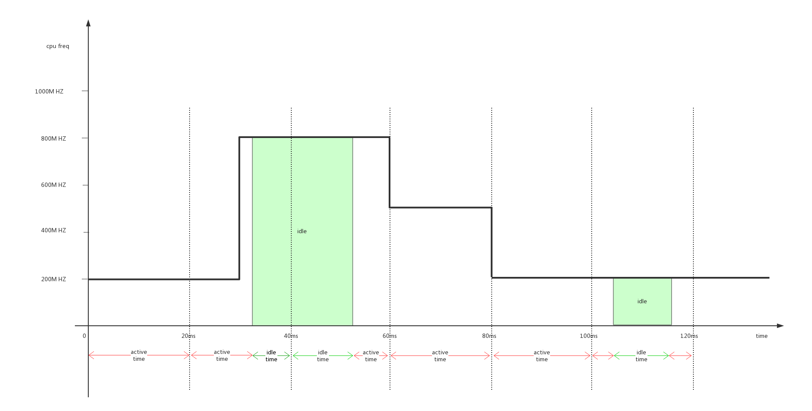

interactive的负载计算方法如上图所示。interactive的整个计算方法大概如下：

- 1、计算cpu的累加负载。每20ms采样一次，每次采样统计增加的active_time和当前频率的乘积：cputime_speedadj += active_time * cur_freq;
- 2、计算cpu的占用率。当前cpu占用率 = (累加负载*100)/(累加时间*当前频率)，cpu_load = (loadadjfreq*100)/(delta_time*cur_freq)；
- 3、如果cpu_load达到高门限go_hispeed_load(99%)或者发生boost，直接调节频率到hispeed_freq(最高频率)；
- 4、其他情况下使用choose_freq()公式计算新频率：new_freq = cur_freq*(cpu_load/DEFAULT_TARGET_LOAD(90))；new_freq = cpufreq_frequency_table_target(new_freq, CPUFREQ_RELATION_L);
- 5、如果当前频率已经达到hispeed_freq，还需要往上调整，必须在之前的频率上保持above_hispeed_delay(20ms)；如果当前频率已经达到hispeed_freq，还需要往下调整，必须在之前的频率上保持min_sample_time(80ms)；


interactive governor从原理上看，有以下问题：

- 1、20ms的采样时间过长，负载变化到频率调整的反应时间过长；
- 2、负载累加计算有问题，历史负载没有老化机制，历史负载的权重和当前一样，造成当前的负载变化不真实；
- 3、计算cpu占用率=总历史负载/(总时间*当前频率)，算法不合理历史负载对当前影响太大。如果之前是高频率，现在变成低频率，那么cpu_load计算出来的值可能超过100%；如果之前是低频率，现在是高频率，那么cpu_load计算出来的值也会大大被拉低；
- 4、choose_freq()的计算公式有重大漏洞。比如我们cpu频率表={800M, 900M}，当前cur_freq=800m cur_load=100%，那么newfreq = (cur_freq*cur_load)/90 = 889M，使用CPUFREQ_RELATION_L选择档位，选择到还是800M根本不能向高档位前进。这是算法的一个漏洞，如果cpu不同档位的频率差值大于(100/90)，那么正常往上调频是调不上去的，会被CPUFREQ_RELATION_L参数拦下来。所以实际的interactive调频，都是使用go_hispeed_load(99%)调到最高值的，再使用choose_freq()来降频。

所以interactive governor会逐渐的被cpufreq gorernor所取代。


#### 4.3.2.1、interactive governor的初始化

- 1、interactive的一部分初始化在cpufreq_interactive_init()当中：

```
static int __init cpufreq_interactive_init(void)
{
	unsigned int i;
	struct cpufreq_interactive_cpuinfo *pcpu;
	struct sched_param param = { .sched_priority = MAX_RT_PRIO-1 };

    /* (1) 初始化percpu变量per_cpu(cpuinfo, i)： 
        每个cpu创建负载计算定时器pcpu->cpu_timer
        其他的锁
     */
	/* Initalize per-cpu timers */
	for_each_possible_cpu(i) {
		pcpu = &per_cpu(cpuinfo, i);
		init_timer_deferrable(&pcpu->cpu_timer);
		pcpu->cpu_timer.function = cpufreq_interactive_timer;
		pcpu->cpu_timer.data = i;
		init_timer(&pcpu->cpu_slack_timer);
		pcpu->cpu_slack_timer.function = cpufreq_interactive_nop_timer;
		spin_lock_init(&pcpu->load_lock);
		spin_lock_init(&pcpu->target_freq_lock);
		init_rwsem(&pcpu->enable_sem);
	}

	spin_lock_init(&speedchange_cpumask_lock);
	mutex_init(&gov_lock);
	
	/* (2) 创建频率调整进程speedchange_task， 
	    把耗时的频率调整工作单独放到一个进程中去做
	 */
	speedchange_task =
		kthread_create(cpufreq_interactive_speedchange_task, NULL,
			       "cfinteractive");
	if (IS_ERR(speedchange_task))
		return PTR_ERR(speedchange_task);

	sched_setscheduler_nocheck(speedchange_task, SCHED_FIFO, &param);
	get_task_struct(speedchange_task);

	/* NB: wake up so the thread does not look hung to the freezer */
	wake_up_process(speedchange_task);

	return cpufreq_register_governor(&cpufreq_gov_interactive);
}
```

- 2、interactive另一部分初始化在cpufreq_governor_interactive()中的CPUFREQ_GOV_POLICY_INIT、CPUFREQ_GOV_START命令，在cpu online时执行：

```

static int cpufreq_governor_interactive(struct cpufreq_policy *policy,
		unsigned int event)
{


	switch (event) {
	/* (1)  CPUFREQ_GOV_POLICY_INIT命令初始化interactive governor最核心的参数
	 */
	case CPUFREQ_GOV_POLICY_INIT:
		if (have_governor_per_policy()) {
			WARN_ON(tunables);
		} else if (tunables) {
			tunables->usage_count++;
			policy->governor_data = tunables;
			return 0;
		}

		tunables = kzalloc(sizeof(*tunables), GFP_KERNEL);
		if (!tunables) {
			pr_err("%s: POLICY_INIT: kzalloc failed\n", __func__);
			return -ENOMEM;
		}

		tunables->usage_count = 1;
		tunables->above_hispeed_delay = default_above_hispeed_delay;
		tunables->nabove_hispeed_delay =
			ARRAY_SIZE(default_above_hispeed_delay);
		tunables->go_hispeed_load = DEFAULT_GO_HISPEED_LOAD;
		tunables->target_loads = default_target_loads;
		tunables->ntarget_loads = ARRAY_SIZE(default_target_loads);
		tunables->min_sample_time = DEFAULT_MIN_SAMPLE_TIME;
		tunables->timer_rate = DEFAULT_TIMER_RATE;          // interactive负载计算timer默认时间为20ms
		tunables->boostpulse_duration_val = DEFAULT_MIN_SAMPLE_TIME;
		tunables->timer_slack_val = DEFAULT_TIMER_SLACK;

		spin_lock_init(&tunables->target_loads_lock);
		spin_lock_init(&tunables->above_hispeed_delay_lock);

		policy->governor_data = tunables;
		if (!have_governor_per_policy()) {
			common_tunables = tunables;
		}

		rc = sysfs_create_group(get_governor_parent_kobj(policy),
				get_sysfs_attr());
		if (rc) {
			kfree(tunables);
			policy->governor_data = NULL;
			if (!have_governor_per_policy()) {
				common_tunables = NULL;
			}
			return rc;
		}

		if (!policy->governor->initialized) {
			idle_notifier_register(&cpufreq_interactive_idle_nb);
			cpufreq_register_notifier(&cpufreq_notifier_block,
					CPUFREQ_TRANSITION_NOTIFIER);
		}

		break;


    /* (2) CPUFREQ_GOV_START命令启动interactive负载计算的timer
	 */
	case CPUFREQ_GOV_START:
		mutex_lock(&gov_lock);

		freq_table = cpufreq_frequency_get_table(policy->cpu);
		if (tunables && !tunables->hispeed_freq)
			tunables->hispeed_freq = policy->max;

		for_each_cpu(j, policy->cpus) {
			pcpu = &per_cpu(cpuinfo, j);
			pcpu->policy = policy;
			pcpu->target_freq = policy->cur;
			pcpu->freq_table = freq_table;
			pcpu->floor_freq = pcpu->target_freq;
			pcpu->pol_floor_val_time =
				ktime_to_us(ktime_get());
			pcpu->loc_floor_val_time = pcpu->pol_floor_val_time;
			pcpu->pol_hispeed_val_time = pcpu->pol_floor_val_time;
			pcpu->loc_hispeed_val_time = pcpu->pol_floor_val_time;
			down_write(&pcpu->enable_sem);
			del_timer_sync(&pcpu->cpu_timer);
			del_timer_sync(&pcpu->cpu_slack_timer);
			cpufreq_interactive_timer_start(tunables, j);
			pcpu->governor_enabled = 1;
			up_write(&pcpu->enable_sem);
		}

		mutex_unlock(&gov_lock);
		break;


	}

```


#### 4.3.2.2、interactive governor的算法

interactive governor的核心算法在20ms周期的timer interactive governor()中：

```
static void cpufreq_interactive_timer(unsigned long data)
{
	u64 now;
	unsigned int delta_time;
	u64 cputime_speedadj;
	int cpu_load;
	struct cpufreq_interactive_cpuinfo *pcpu =
		&per_cpu(cpuinfo, data);
	struct cpufreq_interactive_tunables *tunables =
		pcpu->policy->governor_data;
	unsigned int new_freq;
	unsigned int loadadjfreq;
	unsigned int index;
	unsigned long flags;
	u64 max_fvtime;
	int j;
	unsigned int max_t_freq = 0;

#ifdef CPUDVFS_POWER_MODE
	/* default(normal), low power, just make, performance(sports) */
	int min_sample_t[4] = { 80, 20, 20, 80 };
	int ppb_idx;
#endif

	if (!down_read_trylock(&pcpu->enable_sem))
		return;
	if (!pcpu->governor_enabled)
		goto exit;

	spin_lock_irqsave(&pcpu->load_lock, flags);
	
	/* (1) 累加cpu上自从cpu_up()以来的负载，
	    pcpu->cputime_speedadj += active_time * pcpu->policy->cur;
	    pcpu->cputime_speedadj = (active_time * pcpu->policy->cur)samp1 + ... +(active_time * pcpu->policy->cur)sampn ;
	    每个采样周期为20mS，累加：第1个20ms中active_time*cur_cpu_freq + 第2个20ms中active_time*cur_cpu_freq +...+ 第n个20ms中active_time*cur_cpu_freq
	 */
	now = update_load(data);
	
	/* (2) 自从cpu_up()以来的总的时间
	    delta_time = active_time + ilde_time
	 */
	delta_time = (unsigned int)(now - pcpu->cputime_speedadj_timestamp);
	cputime_speedadj = pcpu->cputime_speedadj;
	spin_unlock_irqrestore(&pcpu->load_lock, flags);

	if (WARN_ON_ONCE(!delta_time))
		goto rearm;

	spin_lock_irqsave(&pcpu->target_freq_lock, flags);
	
	/* (3) 总的负载/总时间 = 平均频率 */
	do_div(cputime_speedadj, delta_time);
	
	/* (4) (平均频率 * 100)/当前频率 = 当前cpu的占用率 
	 */
	loadadjfreq = (unsigned int)cputime_speedadj * 100;
	cpu_load = loadadjfreq / pcpu->policy->cur;
	tunables->boosted = tunables->boost_val || now < tunables->boostpulse_endtime;

#ifdef CPUDVFS_POWER_MODE
	ppb_idx = mt_cpufreq_get_ppb_state();

	{
		unsigned int idx = mt_cpufreq_ppb_hispeed_freq(data, ppb_idx);

		tunables->hispeed_freq = pcpu->freq_table[idx].frequency;
		tunables->min_sample_time = min_sample_t[ppb_idx] * USEC_PER_MSEC;

		if (hispeed_freq_perf != 0)
			tunables->hispeed_freq = hispeed_freq_perf;
		if (min_sample_time_perf != 0)
			tunables->min_sample_time = min_sample_time_perf;
	}
#endif

    /* (5) 如果cpu占用率达到go_hispeed_load(99%)，或者在boost状态，
        频率直接调整到最高频率hispeed_freq
     */
	if (cpu_load >= tunables->go_hispeed_load || tunables->boosted) {
		if (pcpu->policy->cur < tunables->hispeed_freq) {
			new_freq = tunables->hispeed_freq;
		} else {
			new_freq = choose_freq(pcpu, loadadjfreq);

			if (new_freq < tunables->hispeed_freq)
				new_freq = tunables->hispeed_freq;
		}
		
	/* (6) 否则使用choose_freq()根据当前负载来计算对应的频率
	 */
	} else {
		new_freq = choose_freq(pcpu, loadadjfreq);
		if (new_freq > tunables->hispeed_freq &&
				pcpu->policy->cur < tunables->hispeed_freq)
			new_freq = tunables->hispeed_freq;
	}

    /* (7) 如果计算出的新频率 > hispeed_freq，不能马上调整，
        在hispeed_freq以上的频率上必须待满above_hispeed_delay(20ms)，才能继续往上调整频率
     */
	if (pcpu->policy->cur >= tunables->hispeed_freq &&
	    new_freq > pcpu->policy->cur &&
	    now - pcpu->pol_hispeed_val_time <
	    freq_to_above_hispeed_delay(tunables, pcpu->policy->cur)) {
		trace_cpufreq_interactive_notyet(
			data, cpu_load, pcpu->target_freq,
			pcpu->policy->cur, new_freq);
		spin_unlock_irqrestore(&pcpu->target_freq_lock, flags);
		goto rearm;
	}

	pcpu->loc_hispeed_val_time = now;

	if (cpufreq_frequency_table_target(pcpu->policy, pcpu->freq_table,
					   new_freq, CPUFREQ_RELATION_L,
					   &index)) {
		spin_unlock_irqrestore(&pcpu->target_freq_lock, flags);
		goto rearm;
	}

	new_freq = pcpu->freq_table[index].frequency;

    /* (8) 如果之前的频率 > hispeed_freq，或者发生boost
        现在需要往低调频，之前的频率需要待满min_sample_time(80ms)
     */
	/*
	 * Do not scale below floor_freq unless we have been at or above the
	 * floor frequency for the minimum sample time since last validated.
	 */
	max_fvtime = max(pcpu->pol_floor_val_time, pcpu->loc_floor_val_time);
	if (new_freq < pcpu->floor_freq &&
	    pcpu->target_freq >= pcpu->policy->cur) {
		if (now - max_fvtime < tunables->min_sample_time) {
			trace_cpufreq_interactive_notyet(
				data, cpu_load, pcpu->target_freq,
				pcpu->policy->cur, new_freq);
			spin_unlock_irqrestore(&pcpu->target_freq_lock, flags);
			goto rearm;
		}
	}

	/*
	 * Update the timestamp for checking whether speed has been held at
	 * or above the selected frequency for a minimum of min_sample_time,
	 * if not boosted to hispeed_freq.  If boosted to hispeed_freq then we
	 * allow the speed to drop as soon as the boostpulse duration expires
	 * (or the indefinite boost is turned off).
	 */

	if (!tunables->boosted || new_freq > tunables->hispeed_freq) {
		pcpu->floor_freq = new_freq;
		if (pcpu->target_freq >= pcpu->policy->cur ||
		    new_freq >= pcpu->policy->cur)
			pcpu->loc_floor_val_time = now;
	}

    /* (9) 如果当前cpu往低调整频率，判断当前policy是否需要更新，
        因为多个cpu共享一个policy，取最大期望频率cpu的值作为整个policy的调整值
     */
	if (pcpu->target_freq == new_freq &&
			pcpu->target_freq <= pcpu->policy->cur) {
		max_t_freq = 0;
		for_each_cpu(j, pcpu->policy->cpus) {
			struct cpufreq_interactive_cpuinfo *pjcpu;

			pjcpu = &per_cpu(cpuinfo, j);
			max_t_freq = max(max_t_freq, pjcpu->target_freq);
		}

		if (max_t_freq != pcpu->policy->cur)
			goto pass_t;

		trace_cpufreq_interactive_already(
			data, cpu_load, pcpu->target_freq,
			pcpu->policy->cur, new_freq);
		spin_unlock_irqrestore(&pcpu->target_freq_lock, flags);
		goto rearm;
	}
pass_t:
	trace_cpufreq_interactive_target(data, cpu_load, pcpu->target_freq,
					 pcpu->policy->cur, new_freq);

    /* (10) 如果policy需要更新唤醒speedchange_task来执行调频动作 */
	pcpu->target_freq = new_freq;
	spin_unlock_irqrestore(&pcpu->target_freq_lock, flags);
	spin_lock_irqsave(&speedchange_cpumask_lock, flags);
	cpumask_set_cpu(data, &speedchange_cpumask);
	spin_unlock_irqrestore(&speedchange_cpumask_lock, flags);
	wake_up_process(speedchange_task);

rearm:
	if (!timer_pending(&pcpu->cpu_timer))
		cpufreq_interactive_timer_resched(pcpu);

exit:
	up_read(&pcpu->enable_sem);
	return;
}

|→

static unsigned int choose_freq(struct cpufreq_interactive_cpuinfo *pcpu,
		unsigned int loadadjfreq)
{
	unsigned int freq = pcpu->policy->cur;
	unsigned int prevfreq, freqmin, freqmax;
	unsigned int tl;
	int index;

	freqmin = 0;
	freqmax = UINT_MAX;

	do {
		prevfreq = freq;
		
		/* (6.1) tl = 90，loadadjfreq = (平均频率 * 100)
		    即 newfreq =  (平均频率 * 100)/ 90
		    
		    相当于cpufreq_frequency_table_target(CPUFREQ_RELATION_L)，
		    相当于newfreq往低档位的计算，
		    
		    ooooo这里带来一个非常严重的问题，如果档位之间差值大于100/90，向上调频将调不上去
		 */
		tl = freq_to_targetload(pcpu->policy->governor_data, freq);

		/*
		 * Find the lowest frequency where the computed load is less
		 * than or equal to the target load.
		 */

		if (cpufreq_frequency_table_target(
			    pcpu->policy, pcpu->freq_table, loadadjfreq / tl,
			    CPUFREQ_RELATION_L, &index))
			break;
		freq = pcpu->freq_table[index].frequency;

		if (freq > prevfreq) {
			/* The previous frequency is too low. */
			freqmin = prevfreq;

			if (freq >= freqmax) {
				/*
				 * Find the highest frequency that is less
				 * than freqmax.
				 */
				if (cpufreq_frequency_table_target(
					    pcpu->policy, pcpu->freq_table,
					    freqmax - 1, CPUFREQ_RELATION_H,
					    &index))
					break;
				freq = pcpu->freq_table[index].frequency;

				if (freq == freqmin) {
					/*
					 * The first frequency below freqmax
					 * has already been found to be too
					 * low.  freqmax is the lowest speed
					 * we found that is fast enough.
					 */
					freq = freqmax;
					break;
				}
			}
		} else if (freq < prevfreq) {
			/* The previous frequency is high enough. */
			freqmax = prevfreq;

			if (freq <= freqmin) {
				/*
				 * Find the lowest frequency that is higher
				 * than freqmin.
				 */
				if (cpufreq_frequency_table_target(
					    pcpu->policy, pcpu->freq_table,
					    freqmin + 1, CPUFREQ_RELATION_L,
					    &index))
					break;
				freq = pcpu->freq_table[index].frequency;

				/*
				 * If freqmax is the first frequency above
				 * freqmin then we have already found that
				 * this speed is fast enough.
				 */
				if (freq == freqmax)
					break;
			}
		}

		/* If same frequency chosen as previous then done. */
	} while (freq != prevfreq);

	return freq;
}

```


## 4.4、cpu hotplug调整

还有一种调节负载的方式是cpu hotplug：

- 1、cpu被hotplug掉的功耗小于cpu进入idle的功耗；如果整个cluster的cpu都offline，cluster也可以poweroff；所以hotplug能够节省功耗；
- 2、但是hotplug是有开销的：hotplug动作在速度慢的时候达到了ms级别，另外进程的迁移也是有开销的；cpu的hotplug必须遵循顺序插拔的规则，如果先拔掉负载重的cpu也是不合理的；
- 3、MTK的技术限制必须使用hotplug：MTK平台只有在剩一个online cpu的情况下才能进入深度idle模式，所以MTK平台必须支持hotplug；而samsung、qualcomm在多核online的情况下可以进入深度idle，所以一般不支持cpu hotplug；


### 4.4.1、hotplug 底层实现

#### 4.4.1.1、cpu_cup()/cpu_down()

kernel对hotplug的支持是很完善的，标准接口cpu_up()/cpu_down()可以进行hotplug。

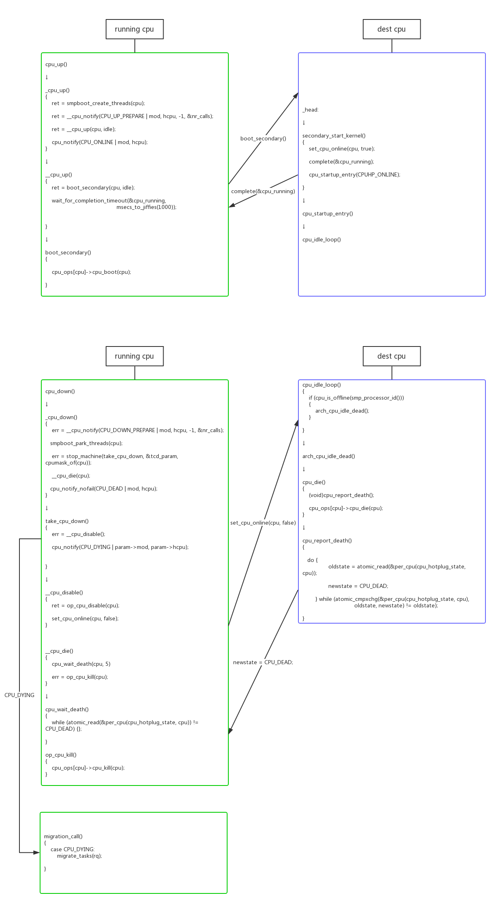

#### 4.4.1.2、hotplug 进程迁移

在cpu_down()时，需要调用migration_call() -> migrate_tasks()把cpu上所有runnable进程迁移到其他cpu；在cpu_up()时，并不需要在函数中迁移进程，直接等待负载均衡算法的迁移。

```
static void migrate_tasks(struct rq *dead_rq)
{
	struct rq *rq = dead_rq;
	struct task_struct *next, *stop = rq->stop;
	int dest_cpu;

	/*
	 * Fudge the rq selection such that the below task selection loop
	 * doesn't get stuck on the currently eligible stop task.
	 *
	 * We're currently inside stop_machine() and the rq is either stuck
	 * in the stop_machine_cpu_stop() loop, or we're executing this code,
	 * either way we should never end up calling schedule() until we're
	 * done here.
	 */
	rq->stop = NULL;

	/*
	 * put_prev_task() and pick_next_task() sched
	 * class method both need to have an up-to-date
	 * value of rq->clock[_task]
	 */
	update_rq_clock(rq);
	unthrottle_offline_rt_rqs(rq);

	for (;;) {
		/*
		 * There's this thread running, bail when that's the only
		 * remaining thread.
		 */
		if (rq->nr_running == 1)
			break;

        /* (1) 逐个从rq中获取task = next */
		/*
		 * pick_next_task assumes pinned rq->lock.
		 */
		lockdep_pin_lock(&rq->lock);
		next = pick_next_task(rq, &fake_task);
		BUG_ON(!next);
		next->sched_class->put_prev_task(rq, next);

		/*
		 * Rules for changing task_struct::cpus_allowed are holding
		 * both pi_lock and rq->lock, such that holding either
		 * stabilizes the mask.
		 *
		 * Drop rq->lock is not quite as disastrous as it usually is
		 * because !cpu_active at this point, which means load-balance
		 * will not interfere. Also, stop-machine.
		 */
		lockdep_unpin_lock(&rq->lock);
		raw_spin_unlock(&rq->lock);
		raw_spin_lock(&next->pi_lock);
		raw_spin_lock(&rq->lock);

		/*
		 * Since we're inside stop-machine, _nothing_ should have
		 * changed the task, WARN if weird stuff happened, because in
		 * that case the above rq->lock drop is a fail too.
		 */
		if (WARN_ON(task_rq(next) != rq || !task_on_rq_queued(next))) {
			raw_spin_unlock(&next->pi_lock);
			continue;
		}

        /* (2) 找到最适合next进程迁移的目的cpu */
		/* Find suitable destination for @next, with force if needed. */
		dest_cpu = select_fallback_rq(dead_rq->cpu, next);

        /* (3) 实施进程迁移 */
		rq = __migrate_task(rq, next, dest_cpu);
		if (rq != dead_rq) {
			raw_spin_unlock(&rq->lock);
			rq = dead_rq;
			raw_spin_lock(&rq->lock);
		}
		raw_spin_unlock(&next->pi_lock);
	}

	rq->stop = stop;
}

|→

static int select_fallback_rq(int cpu, struct task_struct *p)
{
	int nid = cpu_to_node(cpu);
	const struct cpumask *nodemask = NULL;
	enum { cpuset, possible, fail } state = cpuset;
	int dest_cpu;

	/*
	 * If the node that the cpu is on has been offlined, cpu_to_node()
	 * will return -1. There is no cpu on the node, and we should
	 * select the cpu on the other node.
	 */
	if (nid != -1) {
		nodemask = cpumask_of_node(nid);

		/* Look for allowed, online CPU in same node. */
		for_each_cpu(dest_cpu, nodemask) {
			if (!cpu_online(dest_cpu))
				continue;
			if (!cpu_active(dest_cpu))
				continue;
			if (cpumask_test_cpu(dest_cpu, tsk_cpus_allowed(p)))
				return dest_cpu;
		}
	}

	for (;;) {
	
	    /* (2.1) 最好的情况：在tsk_cpus_allowed(p)中能找到online cpu迁移 */
		/* Any allowed, online CPU? */
		for_each_cpu(dest_cpu, tsk_cpus_allowed(p)) {
			if (!cpu_online(dest_cpu))
				continue;
			if (!cpu_active(dest_cpu))
				continue;
			goto out;
		}

		/* No more Mr. Nice Guy. */
		switch (state) {
		
		/* (2.2) 其次的情况：在cpuset中能找到online cpu迁移 */
		case cpuset:
			if (IS_ENABLED(CONFIG_CPUSETS)) {
				cpuset_cpus_allowed_fallback(p);
				state = possible;
				break;
			}
			
		/* (2.3) 最差的情况：在系统所有cpu中能找到online cpu迁移 */
			/* fall-through */
		case possible:
			do_set_cpus_allowed(p, cpu_possible_mask);
			state = fail;
			break;

		case fail:
			BUG();
			break;
		}
	}

out:
	if (state != cpuset) {
		/*
		 * Don't tell them about moving exiting tasks or
		 * kernel threads (both mm NULL), since they never
		 * leave kernel.
		 */
		if (p->mm && printk_ratelimit()) {
			printk_deferred("process %d (%s) no longer affine to cpu%d\n",
					task_pid_nr(p), p->comm, cpu);
		}
	}

	return dest_cpu;
}

```

### 4.4.2、MTK hotplug算法

在有了hotplug的底层cpu_cup()、cpu_down()的实现以后，在此之上还需要有一套算法根据cpu的负载来动态hotplug。MTK这套算法比较齐全，主要分为HICA、hps_algo_main两部分。

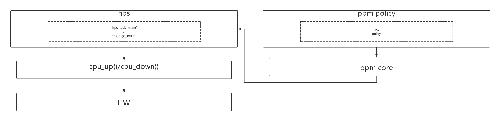

#### 4.4.2.1、HICA/PPM

HICA和hps的关系，其实是HICA决定了一种大的mode，而hps在大的mode中实现精细化的调整。

比如对MT6799 HICA支持3种模式：

- 1、LL_ONLY。  // 只开小核
- 2、L_ONLY。   // 只开中核
- 3、ALL。      // LL、L、B10核都可以使用

HICA在mt_ppm_hica_update_algo_data()中计算负载，根据负载变化来决定mode：

```
_hps_task_main() -> mt_ppm_hica_update_algo_data()

↓

void mt_ppm_hica_update_algo_data(unsigned int cur_loads,
					unsigned int cur_nr_heavy_task, unsigned int cur_tlp)
{
	struct ppm_power_state_data *state_info = ppm_get_power_state_info();
	struct ppm_state_transfer_data *data;
	enum ppm_power_state cur_state;
	enum ppm_mode cur_mode;
	int i, j;

	FUNC_ENTER(FUNC_LV_HICA);

	ppm_lock(&hica_policy.lock);

	ppm_hica_algo_data.ppm_cur_loads = cur_loads;
	ppm_hica_algo_data.ppm_cur_tlp = cur_tlp;
	ppm_hica_algo_data.ppm_cur_nr_heavy_task = cur_nr_heavy_task;

	cur_state = ppm_hica_algo_data.cur_state;
	cur_mode = ppm_main_info.cur_mode;

	ppm_dbg(HICA, "cur_loads = %d, cur_tlp = %d, cur_nr_heavy_task = %d, cur_state = %s, cur_mode = %d\n",
		cur_loads, cur_tlp, cur_nr_heavy_task, ppm_get_power_state_name(cur_state), cur_mode);

	if (!ppm_main_info.is_enabled || !hica_policy.is_enabled || ppm_main_info.is_in_suspend ||
		cur_state == PPM_POWER_STATE_NONE)
		goto end;

#if defined(CONFIG_MACH_MT6757) || defined(CONFIG_MACH_KIBOPLUS)
	if (setup_max_cpus == 4)
		goto end;
#endif

#ifdef PPM_IC_SEGMENT_CHECK
	if (ppm_main_info.fix_state_by_segment != PPM_POWER_STATE_NONE)
		goto end;
#endif

	/* skip HICA if DVFS is not ready (we cannot get current freq...) */
	if (!ppm_main_info.client_info[PPM_CLIENT_DVFS].limit_cb)
		goto end;

	/* Power state is fixed by user, skip HICA state calculation */
	if (fix_power_state != PPM_POWER_STATE_NONE)
		goto end;

    /* (1) 从transfer_by_perf到transfer_by_pwr逐个遍历判断当前state是否需要改变 */
	for (i = 0; i < 2; i++) {
		data = (i == 0) ? state_info[cur_state].transfer_by_perf
				: state_info[cur_state].transfer_by_pwr;

        /* (2) 如果当前state有几种变化逐个遍历，比如：
            当前state为ALL，
            可以ALL -> LL_ONLY
            也可以ALL -> L_ONLY
         */
		for (j = 0; j < data->size; j++) {
			if (!data->transition_data[j].transition_rule
				|| !((1 << cur_mode) & data->transition_data[j].mode_mask))
				continue;

            /* (3) 如果state变化，获取新的state返回 */
			if (data->transition_data[j].transition_rule(
				ppm_hica_algo_data, &data->transition_data[j])) {
				ppm_hica_algo_data.new_state = data->transition_data[j].next_state;
				ppm_dbg(HICA, "[%s(%d)] Need state transfer: %s --> %s\n",
					(i == 0) ? "PERF" : "PWR",
					j,
					ppm_get_power_state_name(cur_state),
					ppm_get_power_state_name(ppm_hica_algo_data.new_state)
					);
				goto end;
				
			/* (4) 如果state不变化，维持当前state，继续遍历*/
			} else {
				ppm_hica_algo_data.new_state = cur_state;
#ifdef PPM_HICA_2P0
				ppm_dbg(HICA, "[%s(%d)]hold in %s state, capacity_hold_cnt = %d, bigtsk_hold_cnt = %d, freq_hold_cnt = %d\n",
					(i == 0) ? "PERF" : "PWR",
					j,
					ppm_get_power_state_name(cur_state),
					data->transition_data[j].capacity_hold_cnt,
					data->transition_data[j].bigtsk_hold_cnt,
					data->transition_data[j].freq_hold_cnt
					);
#else
#if PPM_HICA_VARIANT_SUPPORT
				ppm_dbg(HICA, "[%s(%d)]hold in %s state, loading_cnt = %d, freq_cnt = %d, overutil_l_hold_cnt = %d, .overutil_h_hold_cnt = %d\n",
					(i == 0) ? "PERF" : "PWR",
					j,
					ppm_get_power_state_name(cur_state),
					data->transition_data[j].loading_hold_cnt,
					data->transition_data[j].freq_hold_cnt,
					data->transition_data[j].overutil_l_hold_cnt,
					data->transition_data[j].overutil_h_hold_cnt
					);
#else
				ppm_dbg(HICA, "[%s(%d)]hold in %s state, loading_cnt = %d, freq_cnt = %d\n",
					(i == 0) ? "PERF" : "PWR",
					j,
					ppm_get_power_state_name(cur_state),
					data->transition_data[j].loading_hold_cnt,
					data->transition_data[j].freq_hold_cnt
					);
#endif
#endif
			}
		}
	}

end:
	ppm_unlock(&hica_policy.lock);
	FUNC_EXIT(FUNC_LV_HICA);
}

```

关于计算state的函数和阈值定义在表中，除了heavy_task和big_task，基本是计算util/capacity的cpu占用情况：

```
struct ppm_power_state_data pwr_state_info_SB[NR_PPM_POWER_STATE] = {
	[0] = {
		.name = __stringify(LL_ONLY),
		.state = PPM_POWER_STATE_LL_ONLY,
		PWR_STATE_INFO(LL_ONLY, SB)
	},
	[1] = {
		.name = __stringify(L_ONLY),
		.state = PPM_POWER_STATE_L_ONLY,
		PWR_STATE_INFO(L_ONLY, SB)
	},
	[2] = {
		.name = __stringify(ALL),
		.state = PPM_POWER_STATE_ALL,
		PWR_STATE_INFO(ALL, SB)
	},
};

static struct ppm_state_transfer state_pwr_transfer_ALL[] = {
	TRANS_DATA(
		LL_ONLY,
		PPM_MODE_MASK_ALL_MODE,
		ppm_trans_rule_ALL_to_LL_ONLY,
		PPM_DEFAULT_HOLD_TIME,
		PPM_CAPACITY_DOWN,
		PPM_DEFAULT_BIGTSK_TIME,
		0,
		0,
		0
		),
	TRANS_DATA(
		L_ONLY,
		PPM_MODE_MASK_ALL_MODE,
		ppm_trans_rule_ALL_to_L_ONLY,
		PPM_DEFAULT_HOLD_TIME,
		PPM_CAPACITY_DOWN,
		PPM_DEFAULT_BIGTSK_TIME,
		2,
		4,
		0
		),
};
STATE_TRANSFER_DATA_PWR(ALL);

static struct ppm_state_transfer state_perf_transfer_ALL[] = {
	TRANS_DATA(NONE, 0, NULL, 0, 0, 0, 0, 0, 0),
};
STATE_TRANSFER_DATA_PERF(ALL);


/* 举例：当前state为ALL
    尝试从power的角度从ALL切换到LL_ONLY：ppm_trans_rule_ALL_to_LL_ONLY()
    尝试从power的角度从ALL切换到L_ONLY：ppm_trans_rule_ALL_to_L_ONLY()
 */
static bool ppm_trans_rule_ALL_to_LL_ONLY(
	struct ppm_hica_algo_data data, struct ppm_state_transfer *settings)
{
	/* keep in ALL state if root cluster is fixed at L or B */
	if (ppm_main_info.fixed_root_cluster == PPM_CLUSTER_L
		|| ppm_main_info.fixed_root_cluster == PPM_CLUSTER_B)
		return false;

    /* (1) 从heavy task负载判断是否需要切换模式 */
#if PPM_HEAVY_TASK_INDICATE_SUPPORT
	{
		unsigned int heavy_task, i;

		for_each_ppm_clusters(i) {
			heavy_task = hps_get_hvytsk(i);
			if (heavy_task) {
				ppm_dbg(HICA, "Stay in ALL due to cluster%d heavy task = %d\n",
					i, heavy_task);
				trace_ppm_hica(
					ppm_get_power_state_name(PPM_POWER_STATE_ALL),
					ppm_get_power_state_name(PPM_POWER_STATE_LL_ONLY),
					-1, -1, -1, -1, heavy_task, -1, false);
				settings->capacity_hold_cnt = 0;
				return false;
			}
		}
	}
#endif

    /* (2) 从big task负载判断是否需要切换模式 */
#if PPM_BIG_TASK_INDICATE_SUPPORT
	{
		unsigned int big_task_L = hps_get_bigtsk(PPM_CLUSTER_L);
		unsigned int big_task_B = hps_get_bigtsk(PPM_CLUSTER_B);

		if (big_task_L || big_task_B) {
			ppm_dbg(HICA, "Stay in ALL due to L/B big task = %d/%d\n",
				big_task_L, big_task_B);
			trace_ppm_hica(
				ppm_get_power_state_name(PPM_POWER_STATE_ALL),
				ppm_get_power_state_name(PPM_POWER_STATE_LL_ONLY),
				-1, -1, big_task_L, big_task_B, -1, -1, false);
			settings->capacity_hold_cnt = 0;
			return false;
		}
	}
#endif

    /* (3) 从util/capacity负载判断是否需要切换模式 */
	{
		/* check capacity */
		unsigned long usage, usage_total = 0, capacity = 0, dummy;
		unsigned int i;

		for_each_ppm_clusters(i) {
			if (sched_get_cluster_util(i, &usage, &dummy)) {
				ppm_err("Get cluster %d util failed\n", i);
				return false;
			}
			usage_total += usage;
			if (i == PPM_CLUSTER_LL)
				capacity = dummy;
		}
		ppm_dbg(HICA, "usage_total = %ld, LL capacity = %ld\n", usage_total, capacity);

        /* (3.1) (util/capacity)超过门限值(settings->capacity_bond) 是否达到次数settings->capacity_hold_time，
            如果条件满足进行state切换
         */
		if (usage_total < capacity * settings->capacity_bond / 100) {
			settings->capacity_hold_cnt++;
			if (settings->capacity_hold_cnt >= settings->capacity_hold_time) {
				trace_ppm_hica(
					ppm_get_power_state_name(PPM_POWER_STATE_ALL),
					ppm_get_power_state_name(PPM_POWER_STATE_LL_ONLY),
					usage_total, capacity, -1, -1, -1, -1, true);
				return true;
			}
		} else
			settings->capacity_hold_cnt = 0;

		trace_ppm_hica(
			ppm_get_power_state_name(PPM_POWER_STATE_ALL),
			ppm_get_power_state_name(PPM_POWER_STATE_LL_ONLY),
			usage_total, capacity, -1, -1, -1, -1, false);
	}

	return false;
}

```

新的state计算完成后，是通过以下通道配置下去的：

```
_hps_task_main() -> mt_ppm_main() -> ppm_hica_update_limit_cb() -> ppm_hica_set_default_limit_by_state()

↓

void ppm_hica_set_default_limit_by_state(enum ppm_power_state state,
					struct ppm_policy_data *policy)
{
	unsigned int i;
	struct ppm_power_state_data *state_info = ppm_get_power_state_info();

	FUNC_ENTER(FUNC_LV_HICA);

	for (i = 0; i < policy->req.cluster_num; i++) {
		if (state >= PPM_POWER_STATE_NONE) {
			if (state > NR_PPM_POWER_STATE)
				ppm_err("@%s: Invalid PPM state(%d)\n", __func__, state);

			policy->req.limit[i].min_cpu_core = get_cluster_min_cpu_core(i);
			policy->req.limit[i].max_cpu_core = get_cluster_max_cpu_core(i);
			policy->req.limit[i].min_cpufreq_idx = get_cluster_min_cpufreq_idx(i);
			policy->req.limit[i].max_cpufreq_idx = get_cluster_max_cpufreq_idx(i);

#ifdef PPM_DISABLE_CLUSTER_MIGRATION
			/* keep at least 1 LL */
			if (i == 0)
				policy->req.limit[i].min_cpu_core = 1;
#endif
        /* (1) HICA根据新的state，配置对应的min_cpu_core/max_cpu_core到本policy当中 */
		} else {
			policy->req.limit[i].min_cpu_core =
				state_info[state].cluster_limit->state_limit[i].min_cpu_core;
			policy->req.limit[i].max_cpu_core =
				state_info[state].cluster_limit->state_limit[i].max_cpu_core;
			policy->req.limit[i].min_cpufreq_idx =
				state_info[state].cluster_limit->state_limit[i].min_cpufreq_idx;
			policy->req.limit[i].max_cpufreq_idx =
				state_info[state].cluster_limit->state_limit[i].max_cpufreq_idx;
		}
	}

#ifdef PPM_IC_SEGMENT_CHECK
		/* ignore HICA min freq setting for L cluster in L_ONLY state */
		if (state == PPM_POWER_STATE_L_ONLY && ppm_main_info.fix_state_by_segment == PPM_POWER_STATE_L_ONLY)
			policy->req.limit[1].min_cpufreq_idx = get_cluster_min_cpufreq_idx(1);
#endif

	FUNC_EXIT(FUNC_LV_HICA);
}


/*==============================================================*/
/* Local Variables						*/
/*==============================================================*/
/* cluster limit for each power state */
static const struct ppm_cluster_limit state_limit_LL_ONLY[] = {
	[0] = LIMIT(15, 0, 1, 4),
	[1] = LIMIT(15, 0, 0, 0),
	[2] = LIMIT(15, 0, 0, 0),
};
STATE_LIMIT(LL_ONLY);

static const struct ppm_cluster_limit state_limit_L_ONLY[] = {
	[0] = LIMIT(15, 0, 0, 0),
	[1] = LIMIT(8, 0, 1, 4),
	[2] = LIMIT(15, 0, 0, 0),
};
STATE_LIMIT(L_ONLY);

static const struct ppm_cluster_limit state_limit_ALL[] = {
	[0] = LIMIT(15, 0, 0, 4),
	[1] = LIMIT(15, 0, 0, 4),
	[2] = LIMIT(15, 0, 0, 2),
};
STATE_LIMIT(ALL);


_hps_task_main() -> mt_ppm_main() -> ppm_limit_callback()

↓

static void ppm_limit_callback(struct ppm_client_req req)
{
	struct ppm_client_req *p = (struct ppm_client_req *)&req;
	int i;

    /* (2) 将HICA state对应的policy配置到hps限制中hps_sys.cluster_info[i].ref_base_value/ref_limit_value */
	mutex_lock(&hps_ctxt.para_lock);
	hps_sys.ppm_root_cluster = p->root_cluster;
	for (i = 0; i < p->cluster_num; i++) {
		/*
		 * hps_warn("ppm_limit_callback -> cluster%d: has_advise_core = %d, [%d, %d]\n",
		 *	i, p->cpu_limit[i].has_advise_core,
		 *	p->cpu_limit[i].min_cpu_core, p->cpu_limit[i].max_cpu_core);
		 */
#ifdef _TRACE_
		trace_ppm_limit_callback_update(i, p->cpu_limit[i].has_advise_core,
			p->cpu_limit[i].min_cpu_core, p->cpu_limit[i].max_cpu_core);
#endif
		if (!p->cpu_limit[i].has_advise_core) {
			hps_sys.cluster_info[i].ref_base_value = p->cpu_limit[i].min_cpu_core;
			hps_sys.cluster_info[i].ref_limit_value = p->cpu_limit[i].max_cpu_core;
		} else {
			hps_sys.cluster_info[i].ref_base_value =
			    hps_sys.cluster_info[i].ref_limit_value =
			    p->cpu_limit[i].advise_cpu_core;
		}
	}
	mutex_unlock(&hps_ctxt.para_lock);
	hps_ctxt.is_interrupt = 1;
	hps_task_wakeup_nolock();

}

```


#### 4.4.2.2、hps_algo_main


```
_hps_task_main() -> hps_algo_main()

↓

void hps_algo_main(void)
{
	unsigned int i, val, base_val, action_print, origin_root, action_break;
	char str_online[64], str_ref_limit[64], str_ref_base[64], str_criteria_limit[64],
	    str_criteria_base[64], str_target[64], str_hvytsk[64], str_pwrseq[64], str_bigtsk[64];
	char *online_ptr = str_online;
	char *criteria_limit_ptr = str_criteria_limit;
	char *criteria_base_ptr = str_criteria_base;
	char *ref_limit_ptr = str_ref_limit;
	char *ref_base_ptr = str_ref_base;
	char *hvytsk_ptr = str_hvytsk;
	char *target_ptr = str_target;
	char *pwrseq_ptr = str_pwrseq;
	char *bigtsk_ptr = str_bigtsk;
	static unsigned int hrtbt_dbg;
#ifdef CONFIG_MEIZU_BSP
	static unsigned long int j;
#endif //CONFIG_MEIZU_BSP
#ifdef CONFIG_MTK_ICCS_SUPPORT
	unsigned char real_online_power_state_bitmask = 0;
	unsigned char real_target_power_state_bitmask = 0;
	unsigned char iccs_online_power_state_bitmask = 0;
	unsigned char iccs_target_power_state_bitmask = iccs_get_target_power_state_bitmask();
	unsigned char target_cache_shared_state_bitmask = 0;
#endif

	/* Initial value */
	base_val = action_print = action_break = hps_sys.total_online_cores = 0;
	hps_sys.up_load_avg = hps_sys.down_load_avg = hps_sys.tlp_avg = hps_sys.rush_cnt = 0;
	hps_sys.action_id = origin_root = 0;
	/*
	 * run algo or not by hps_ctxt.enabled
	 */
	if ((u64) ktime_to_ms(ktime_sub(ktime_get(), hps_ctxt.hps_hrt_ktime)) >= HPS_HRT_DBG_MS)
		action_print = hrtbt_dbg = 1;
	else
		hrtbt_dbg = 0;

	mutex_lock(&hps_ctxt.lock);
	hps_ctxt.action = ACTION_NONE;
	atomic_set(&hps_ctxt.is_ondemand, 0);

	if (!hps_ctxt.enabled)
		goto HPS_END;
	if (hps_ctxt.eas_indicator) {
		/*Set cpu cores by scheduler*/
		goto HPS_ALGO_END;
	}
	/*
	 * algo - begin
	 */
	/*Back up limit and base value for check */

	mutex_lock(&hps_ctxt.para_lock);
	if ((hps_sys.cluster_info[0].base_value == 0) &&
		(hps_sys.cluster_info[1].base_value == 0) &&
		(hps_sys.cluster_info[2].base_value == 0) &&
		(hps_sys.cluster_info[0].limit_value == 0) &&
		(hps_sys.cluster_info[1].limit_value == 0) &&
		(hps_sys.cluster_info[2].limit_value == 0)) {
		hps_sys.cluster_info[0].base_value = hps_sys.cluster_info[0].ref_base_value = 0;
		hps_sys.cluster_info[1].base_value = hps_sys.cluster_info[1].ref_base_value = 0;
		hps_sys.cluster_info[2].base_value = hps_sys.cluster_info[2].ref_base_value = 0;
		hps_sys.cluster_info[0].limit_value = hps_sys.cluster_info[0].ref_limit_value = 4;
		hps_sys.cluster_info[1].limit_value = hps_sys.cluster_info[1].ref_limit_value = 4;
		hps_sys.cluster_info[2].limit_value = hps_sys.cluster_info[2].ref_limit_value = 0;
	}
	for (i = 0; i < hps_sys.cluster_num; i++) {
		hps_sys.cluster_info[i].base_value = hps_sys.cluster_info[i].ref_base_value;
		hps_sys.cluster_info[i].limit_value = hps_sys.cluster_info[i].ref_limit_value;
	}
	for (i = 0; i < hps_sys.cluster_num; i++) {
		base_val += hps_sys.cluster_info[i].base_value;
		hps_sys.cluster_info[i].target_core_num = hps_sys.cluster_info[i].online_core_num =
		    0;
		hps_sys.cluster_info[i].online_core_num =
		    hps_get_cluster_cpus(hps_sys.cluster_info[i].cluster_id);
		hps_sys.total_online_cores += hps_sys.cluster_info[i].online_core_num;
	}


	mutex_unlock(&hps_ctxt.para_lock);
	/* Determine root cluster */
	origin_root = hps_sys.root_cluster_id;
	hps_define_root_cluster(&hps_sys);
#ifdef CONFIG_MACH_MT6799
	if (hps_ctxt.smart_det_enabled) {
		mutex_lock(&hps_ctxt.para_lock);
		hps_sys.root_cluster_id = 1;/*Change root to L cluster when smart detection is enabled*/
		mutex_unlock(&hps_ctxt.para_lock);
	}
#endif

	if (origin_root != hps_sys.root_cluster_id)
		hps_sys.action_id = HPS_SYS_CHANGE_ROOT;

	/*
	 * update history - tlp
	 */
	val = hps_ctxt.tlp_history[hps_ctxt.tlp_history_index];
	hps_ctxt.tlp_history[hps_ctxt.tlp_history_index] = hps_ctxt.cur_tlp;
	hps_ctxt.tlp_sum += hps_ctxt.cur_tlp;
	hps_ctxt.tlp_history_index =
	    (hps_ctxt.tlp_history_index + 1 ==
	     hps_ctxt.tlp_times) ? 0 : hps_ctxt.tlp_history_index + 1;
	++hps_ctxt.tlp_count;
	if (hps_ctxt.tlp_count > hps_ctxt.tlp_times) {
		WARN_ON(hps_ctxt.tlp_sum < val);
		hps_ctxt.tlp_sum -= val;
		hps_ctxt.tlp_avg = hps_ctxt.tlp_sum / hps_ctxt.tlp_times;
	} else {
		hps_ctxt.tlp_avg = hps_ctxt.tlp_sum / hps_ctxt.tlp_count;
	}
	if (hps_ctxt.stats_dump_enabled)
		hps_ctxt_print_algo_stats_tlp(0);

	/*Determine eas enabled or not*/
	if (!hps_ctxt.eas_enabled)
		hps_sys.hps_sys_ops[2].enabled = 0;

	for (i = 0 ; i < hps_sys.cluster_num ; i++)
		hps_sys.cluster_info[i].target_core_num = hps_sys.cluster_info[i].online_core_num;


    /* (1) 逐个调用 hps_sys_ops()根据各种算法来判断当前cpu是否需要hotplug */
	for (i = 0; i < hps_sys.func_num; i++) {
		if (hps_sys.hps_sys_ops[i].enabled == 1) {
			if (hps_sys.hps_sys_ops[i].hps_sys_func_ptr()) {
				hps_sys.action_id = hps_sys.hps_sys_ops[i].func_id;
				break;
			}
		}
	}
/*
	if (hps_ctxt.heavy_task_enabled)
		if (hps_algo_heavytsk_det())
			hps_sys.action_id = 0xE1;
*/

	if (hps_ctxt.big_task_enabled)
		if (hps_algo_big_task_det())
			hps_sys.action_id = 0xE2;

	if (hps_sys.action_id == 0)
		goto HPS_END;

HPS_ALGO_END:

#ifdef CONFIG_MACH_MT6799
	if (hps_ctxt.smart_det_enabled) {
		if (hps_sys.cluster_info[2].bigTsk_value <= 1) {
			mutex_lock(&hps_ctxt.para_lock);
			hps_sys.cluster_info[2].target_core_num = 1;
			mutex_unlock(&hps_ctxt.para_lock);
		}
	}
#endif


	/*
	 * algo - end
	 */

    /* (2) 对limit进行判断，HICA的值就配置到这里 */
	/*Base and limit check */
	hps_check_base_limit(&hps_sys);

	/* Ensure that root cluster must one online cpu at less */
	if (hps_sys.cluster_info[hps_sys.root_cluster_id].target_core_num <= 0)
		hps_sys.cluster_info[hps_sys.root_cluster_id].target_core_num = 1;

#ifdef CONFIG_MTK_ICCS_SUPPORT
	real_online_power_state_bitmask = 0;
	real_target_power_state_bitmask = 0;
	for (i = 0; i < hps_sys.cluster_num; i++) {
		real_online_power_state_bitmask |= ((hps_sys.cluster_info[i].online_core_num > 0) << i);
		real_target_power_state_bitmask |= ((hps_sys.cluster_info[i].target_core_num > 0) << i);
	}
	iccs_online_power_state_bitmask = iccs_target_power_state_bitmask;
	iccs_target_power_state_bitmask = real_target_power_state_bitmask;
	iccs_get_target_state(&iccs_target_power_state_bitmask, &target_cache_shared_state_bitmask);

	/*
	 * pr_err("[%s] iccs_target_power_state_bitmask: 0x%x\n", __func__, iccs_target_power_state_bitmask);
	 */

	for (i = 0; i < hps_sys.cluster_num; i++) {
		hps_sys.cluster_info[i].iccs_state = (((real_online_power_state_bitmask >> i) & 1) << 3) |
						     (((real_target_power_state_bitmask >> i) & 1) << 2) |
						     (((iccs_online_power_state_bitmask >> i) & 1) << 1) |
						     (((iccs_target_power_state_bitmask >> i) & 1) << 0);

		/*
		 * pr_err("[%s] cluster: 0x%x iccs_state: 0x%x\n", __func__, i, hps_sys.cluster_info[i].iccs_state);
		 */

		if (hps_get_iccs_pwr_status(i) == 0x1)
			iccs_cluster_on_off(i, 1);
		else if (hps_get_iccs_pwr_status(i) == 0x2)
			iccs_cluster_on_off(i, 0);
	}
#endif

    /* (3) 经过各种算法计算后目标值是target_core_num，而当前值是online_core_num；
        如果不一致，进行cpu_up()/cpu_down()操作
     */
#if 1				/*Make sure that priority of power on action is higher than power down. */
	for (i = 0; i < hps_sys.cluster_num; i++) {
		if (hps_sys.cluster_info[i].target_core_num >
		    hps_sys.cluster_info[i].online_core_num) {
			if (hps_algo_do_cluster_action(i) == 1) {
				action_print = action_break = 1;
				break;
			}
			action_print = 1;
		}
	}
	if (!action_break) {
		for (i = 0; i < hps_sys.cluster_num; i++) {
			if (hps_sys.cluster_info[i].target_core_num <
			    hps_sys.cluster_info[i].online_core_num) {
				if (hps_algo_do_cluster_action(i) == 1) {
					action_print = action_break = 1;
					break;
				}

				action_print = 1;
			}
		}
	}
#else
	/*Process root cluster first */
	if (hps_sys.cluster_info[hps_sys.root_cluster_id].target_core_num !=
	    hps_sys.cluster_info[hps_sys.root_cluster_id].online_core_num) {
		if (hps_algo_do_cluster_action(hps_sys.root_cluster_id) == 1)
			action_break = 1;
		else
			action_break = 0;
		action_print = 1;
	}

	for (i = 0; i < hps_sys.cluster_num; i++) {
		if (i == hps_sys.root_cluster_id)
			continue;
		if (hps_sys.cluster_info[i].target_core_num !=
		    hps_sys.cluster_info[i].online_core_num) {
			if (hps_algo_do_cluster_action(i) == 1)
				action_break = 1;
			else
				action_break = 0;
			action_print = 1;
		}
	}

#endif
#ifdef CONFIG_MTK_ICCS_SUPPORT
	for (i = 0; i < hps_sys.cluster_num; i++) {
		if (hps_get_cluster_cpus(hps_sys.cluster_info[i].cluster_id) !=
				hps_sys.cluster_info[i].target_core_num) {
			if (hps_get_cluster_cpus(hps_sys.cluster_info[i].cluster_id) == 0)
				iccs_target_power_state_bitmask &= ~(1 << i);
			else if (hps_sys.cluster_info[i].target_core_num == 0)
				iccs_target_power_state_bitmask |= (1 << i);
		}
	}
	/*
	 * pr_err("[%s] iccs_target_power_state_bitmask: 0x%x\n", __func__, iccs_target_power_state_bitmask);
	 */
	iccs_set_target_power_state_bitmask(iccs_target_power_state_bitmask);
#endif
HPS_END:
	if (action_print || hrtbt_dbg) {
		int online, target, ref_limit, ref_base, criteria_limit, criteria_base, hvytsk, pwrseq, bigtsk;

		mutex_lock(&hps_ctxt.para_lock);

		online = target = criteria_limit = criteria_base = 0;
		for (i = 0; i < hps_sys.cluster_num; i++) {
			if (i == origin_root)
				online =
				    sprintf(online_ptr, "<%d>",
					    hps_sys.cluster_info[i].online_core_num);
			else
				online =
				    sprintf(online_ptr, "(%d)",
					    hps_sys.cluster_info[i].online_core_num);

			if (i == hps_sys.root_cluster_id)
				target =
				    sprintf(target_ptr, "<%d>",
					    hps_sys.cluster_info[i].target_core_num);
			else
				target =
				    sprintf(target_ptr, "(%d)",
					    hps_sys.cluster_info[i].target_core_num);

			criteria_limit =
			    sprintf(criteria_limit_ptr, "(%d)",
				    hps_sys.cluster_info[i].limit_value);
			criteria_base =
			    sprintf(criteria_base_ptr, "(%d)", hps_sys.cluster_info[i].base_value);
			ref_limit =
			    sprintf(ref_limit_ptr, "(%d)", hps_sys.cluster_info[i].ref_limit_value);
			ref_base =
			    sprintf(ref_base_ptr, "(%d)", hps_sys.cluster_info[i].ref_base_value);
			hvytsk = sprintf(hvytsk_ptr, "(%d)", hps_sys.cluster_info[i].hvyTsk_value);
			bigtsk = sprintf(bigtsk_ptr, "(%d)", hps_sys.cluster_info[i].bigTsk_value);
			if (i == 0)
				pwrseq = sprintf(pwrseq_ptr, "(%d->", hps_sys.cluster_info[i].pwr_seq);
			else if ((i != 0) && (i != (hps_sys.cluster_num - 1)))
				pwrseq = sprintf(pwrseq_ptr, "%d->", hps_sys.cluster_info[i].pwr_seq);
			else if (i == (hps_sys.cluster_num - 1))
				pwrseq = sprintf(pwrseq_ptr, "%d) ", hps_sys.cluster_info[i].pwr_seq);

			online_ptr += online;
			target_ptr += target;
			criteria_limit_ptr += criteria_limit;
			criteria_base_ptr += criteria_base;
			ref_limit_ptr += ref_limit;
			ref_base_ptr += ref_base;
			hvytsk_ptr += hvytsk;
			bigtsk_ptr += bigtsk;
			pwrseq_ptr += pwrseq;
		}
		mutex_unlock(&hps_ctxt.para_lock);
		if (action_print) {
			hps_set_funct_ctrl();
			if (action_break)
				hps_warn
				    ("(0x%X)%s action break!! (%u)(%u)(%u) %s %s%s-->%s%s (%u)(%u)(%u)(%u) %s\n",
				     ((hps_ctxt.hps_func_control << 12) | hps_sys.action_id),
				     str_online, hps_ctxt.cur_loads,
				     hps_ctxt.cur_tlp, hps_ctxt.cur_iowait, str_hvytsk,
				     str_criteria_limit, str_criteria_base,
				     str_ref_limit, str_ref_base,
				     hps_sys.up_load_avg,
				     hps_sys.down_load_avg, hps_sys.tlp_avg, hps_sys.rush_cnt,
				     str_target);
			else {
				char str1[256];
				char str2[256];

				snprintf(str1, sizeof(str1),
	"(0x%X)%s action end (%u)(%u)(%u) %s %s[%u][%u](%u) %s %s%s (%u)(%u)(%u)(%u)",
						((hps_ctxt.hps_func_control << 12) | hps_sys.action_id),
						str_online, hps_ctxt.cur_loads,
						hps_ctxt.cur_tlp, hps_ctxt.cur_iowait,
						str_hvytsk, str_bigtsk, hps_ctxt.is_screen_off,
						hps_ctxt.is_idle, hps_ctxt.idle_ratio,
						str_pwrseq, str_criteria_limit, str_criteria_base,
						hps_sys.up_load_avg,
						hps_sys.down_load_avg,
						hps_sys.tlp_avg, hps_sys.rush_cnt);

				snprintf(str2, sizeof(str2),
	"[%u,%u|%u,%u|%u,%u][%u,%u,%u] [%u,%u,%u] [%u,%u,%u] [%u,%u,%u] %s",
						hps_sys.cluster_info[0].up_threshold,
						hps_sys.cluster_info[0].down_threshold,
						hps_sys.cluster_info[1].up_threshold,
						hps_sys.cluster_info[1].down_threshold,
						hps_sys.cluster_info[2].up_threshold,
						hps_sys.cluster_info[2].down_threshold,
						hps_sys.cluster_info[0].loading,
						hps_sys.cluster_info[1].loading,
						hps_sys.cluster_info[2].loading,
						hps_sys.cluster_info[0].rel_load,
						hps_sys.cluster_info[1].rel_load,
						hps_sys.cluster_info[2].rel_load,
						hps_sys.cluster_info[0].abs_load,
						hps_sys.cluster_info[1].abs_load,
						hps_sys.cluster_info[2].abs_load,
						/* sched-assist hotplug: for debug */
						hps_sys.cluster_info[0].sched_load,
						hps_sys.cluster_info[1].sched_load,
						hps_sys.cluster_info[2].sched_load,
						str_target);
#ifdef CONFIG_MEIZU_BSP
				if (printk_timed_ratelimit(&j, 500))
					hps_warn("%s%s\n", str1, str2);
#else
					hps_warn("%s%s\n", str1, str2);
#endif //CONFIG_MEIZU_BSP
#ifdef _TRACE_
				trace_hps_update(hps_sys.action_id, str_online, hps_ctxt.cur_loads,
						hps_ctxt.cur_tlp, hps_ctxt.cur_iowait, str_hvytsk,
						str_criteria_limit, str_criteria_base,
						hps_sys.up_load_avg, hps_sys.down_load_avg,
						hps_sys.tlp_avg,
						hps_sys.rush_hps_sys.cluster_info[0].up_threshold,
						hps_sys.cluster_info[0].down_threshold,
						hps_sys.cluster_info[0].up_threshold,
						hps_sys.cluster_info[0].down_threshold,
						hps_sys.cluster_info[2].up_threshold,
						hps_sys.cluster_info[2].down_threshold,
						hps_sys.cluster_info[0].loading, hps_sys.cluster_info[1].loading,
						hps_sys.cluster_info[2].loading,
						hps_ctxt.up_times, hps_ctxt.down_times, str_target);
#endif
			}
			hps_ctxt_reset_stas_nolock();
		}
	}
#if HPS_HRT_BT_EN
	if (hrtbt_dbg && (action_print)) {
		hps_set_funct_ctrl();
		hps_warn("(0x%X)%s HRT_BT_DBG (%u)(%u)(%u) %s %s %s %s%s (%u)(%u)(%u)(%u) %s\n",
			 ((hps_ctxt.hps_func_control << 12) | hps_sys.action_id),
			 str_online, hps_ctxt.cur_loads, hps_ctxt.cur_tlp,
			 hps_ctxt.cur_iowait, str_hvytsk, str_bigtsk, str_pwrseq, str_criteria_limit,
			 str_criteria_base, hps_sys.up_load_avg, hps_sys.down_load_avg,
			 hps_sys.tlp_avg, hps_sys.rush_cnt, str_target);
		hrtbt_dbg = 0;
		hps_ctxt.hps_hrt_ktime = ktime_get();
	}
#endif
	action_print = 0;
	action_break = 0;
	mutex_unlock(&hps_ctxt.lock);
}


```

当前hps_algo_main()的算法对应有几种：

```
static int (*hps_func[]) (void) = {
/*hps_algo_perf_indicator, hps_algo_rush_boost, hps_algo_eas, hps_algo_up, hps_algo_down};*/
hps_algo_perf_indicator, hps_algo_rush_boost, hps_algo_eas};


/* (1) 取perf规定的最小值 */
static int hps_algo_perf_indicator(void)
{
	unsigned int i;

	if (atomic_read(&hps_ctxt.is_ondemand) != 0) { /* for ondemand request */
		atomic_set(&hps_ctxt.is_ondemand, 0);

		mutex_lock(&hps_ctxt.para_lock);
		for (i = 0; i < hps_sys.cluster_num; i++)
			hps_sys.cluster_info[i].target_core_num =
				max(hps_sys.cluster_info[i].base_value, hps_sys.cluster_info[i].online_core_num);

		mutex_unlock(&hps_ctxt.para_lock);

		return 1;
	}
	return 0;
}

/* (2) 根据当前load的值是否达到boost门限，来决定是否启动boost */
static int hps_algo_rush_boost(void)
{
	int val, base_val;
	unsigned int idx, total_rel_load;

	idx = total_rel_load = 0;
	for (idx = 0 ; idx < hps_sys.cluster_num ; idx++)
		total_rel_load += hps_sys.cluster_info[idx].rel_load;

	if (!hps_ctxt.rush_boost_enabled)
		return 0;
	base_val = cal_base_cores();

	if (total_rel_load > hps_ctxt.rush_boost_threshold * hps_sys.total_online_cores)
		++hps_ctxt.rush_count;
	else
		hps_ctxt.rush_count = 0;
	if (hps_ctxt.rush_boost_times == 1)
		hps_ctxt.tlp_avg = hps_ctxt.cur_tlp;

	if ((hps_ctxt.rush_count >= hps_ctxt.rush_boost_times) &&
	    (hps_sys.total_online_cores * 100 < hps_ctxt.tlp_avg)) {
		val = hps_ctxt.tlp_avg / 100 + (hps_ctxt.tlp_avg % 100 ? 1 : 0);
		WARN_ON(!(val > hps_sys.total_online_cores));
		if (val > num_possible_cpus())
			val = num_possible_cpus();
		if (val > base_val)
			val -= base_val;
		else
			val = 0;
		hps_sys.tlp_avg = hps_ctxt.tlp_avg;
		hps_sys.rush_cnt = hps_ctxt.rush_count;
		hps_cal_core_num(&hps_sys, val, base_val);


		/* [MET] debug for geekbench */
		met_tag_oneshot(0, "sched_rush_boost", 1);

		return 1;
	} else {
		/* [MET] debug for geekbench */
		met_tag_oneshot(0, "sched_rush_boost", 0);
		return 0;
	}
}

/* (3) 根据负载来计算需要的online cpu */
static int hps_algo_eas(void)
{
	int val, ret, i;

	ret = 0;
	for (i = 0 ; i < hps_sys.cluster_num ; i++) {
		hps_sys.cluster_info[i].target_core_num = hps_sys.cluster_info[i].online_core_num;

		/*if up_threshold > loading > down_threshold ==> No action*/
		if ((hps_sys.cluster_info[i].loading <
		(hps_sys.cluster_info[i].up_threshold*hps_sys.cluster_info[i].online_core_num)) &&
		(hps_sys.cluster_info[i].loading >
		(hps_sys.cluster_info[i].down_threshold*hps_sys.cluster_info[i].online_core_num)))
		continue;

		/*if loading > up_threshod ==> power on cores*/
		if ((hps_sys.cluster_info[i].loading >
			(hps_sys.cluster_info[i].up_threshold*hps_sys.cluster_info[i].online_core_num))) {
			val = hps_sys.cluster_info[i].loading / hps_sys.cluster_info[i].up_threshold;
			if (hps_sys.cluster_info[i].loading % hps_sys.cluster_info[i].up_threshold)
				val++;
			if (val <= hps_sys.cluster_info[i].limit_value)
				hps_sys.cluster_info[i].target_core_num = val;
			else
				hps_sys.cluster_info[i].target_core_num = hps_sys.cluster_info[i].limit_value;
			ret = 1;
		} else if ((hps_sys.cluster_info[i].loading <
			(hps_sys.cluster_info[i].down_threshold*hps_sys.cluster_info[i].online_core_num))) {
		/*if loading < down_threshod ==> power off cores*/
			if (!hps_sys.cluster_info[i].loading) {
				hps_sys.cluster_info[i].target_core_num = 0;
				continue;
			}
			val = hps_sys.cluster_info[i].loading /	hps_sys.cluster_info[i].down_threshold;
			if (hps_sys.cluster_info[i].loading % hps_sys.cluster_info[i].down_threshold)
				val++;
			if (val >= hps_sys.cluster_info[i].base_value)
				hps_sys.cluster_info[i].target_core_num = val;
			else
				hps_sys.cluster_info[i].target_core_num = hps_sys.cluster_info[i].base_value;
			ret = 1;
		}
	}

#if 0
	/*Check with big task criteriai*/
	for (i = 1 ; i < hps_sys.cluster_num ; i++) {
		if ((!hps_sys.cluster_info[i].bigTsk_value) &&
		(!(hps_sys.cluster_info[i].loading / hps_sys.cluster_info[i].down_threshold)))
			hps_sys.cluster_info[i].target_core_num = 0;
	}
#endif
	return ret;
}

```


## 4.5、NUMA负载均衡

NUMA arm架构没有使用，暂时不去解析。


# 5、EAS(Energy-Aware Scheduling)

## 5.1、smp rebalance

通过搜索关键字“energy_aware()”，来查看EAS对smp负载均衡的影响。

可以看到EAS对负载均衡的策略是这样的：在overutilized的情况下，使用传统的smp/hmp负载均衡方法；在非overutilized的情况下，使用eas的均衡方法。

EAS的负载均衡和原有方法的区别有几部分：

- 1、在EAS使能且没有overutilized的情况下，hmp负载均衡不工作；
- 2、在EAS使能且没有overutilized的情况下，smp负载均衡不工作；
- 3、在EAS使能且没有overutilized的情况下，EAS的主要工作集中在进程唤醒/新建时选择运行cpu上select_task_rq_fair()；

### 5.1.1、rebalance_domains()

- 1、在EAS使能且没有overutilized的情况下，hmp负载均衡不使能；

```
static void run_rebalance_domains(struct softirq_action *h)
{
	struct rq *this_rq = this_rq();
	enum cpu_idle_type idle = this_rq->idle_balance ?
						CPU_IDLE : CPU_NOT_IDLE;
	int this_cpu = smp_processor_id();

	/* bypass load balance of HMP if EAS consideration */
	if ((!energy_aware() && sched_feat(SCHED_HMP)) ||
			(hybrid_support() && cpu_rq(this_cpu)->rd->overutilized))
		hmp_force_up_migration(this_cpu);

	/*
	 * If this cpu has a pending nohz_balance_kick, then do the
	 * balancing on behalf of the other idle cpus whose ticks are
	 * stopped. Do nohz_idle_balance *before* rebalance_domains to
	 * give the idle cpus a chance to load balance. Else we may
	 * load balance only within the local sched_domain hierarchy
	 * and abort nohz_idle_balance altogether if we pull some load.
	 */
	nohz_idle_balance(this_rq, idle);
	rebalance_domains(this_rq, idle);
}
```

- 2、在load_balance() -> find_busiest_group()中，如果在EAS使能且没有overutilized的情况下，不进行常规的smp负载均衡；

```
static struct sched_group *find_busiest_group(struct lb_env *env)
{

    if (energy_aware() && !env->dst_rq->rd->overutilized && !same_clus)
		goto out_balanced;

out_balanced:
	env->imbalance = 0;
	return NULL;	
}

```

### 5.1.2、select_task_rq_fair()

参考4.1.2.3、select_task_rq_fair()这一节的详细描述。

## 5.2、cpufreq_sched/schedutil governor

sched governor比较传统interactive governor有以下优点：

- 1、负载变化的时间更快。interactive是20ms统计一次负载，而sched governor是在schedule_tick()中更新负载，tick的时间更短；
- 2、interactive的负载计算有问题：历史负载没有老化；历史频率除以现在频率不合理；

interactive governor的主要思想就是综合rt、cfs的负载，判断当前freq的capacity是否满足需求，是否需要调频。

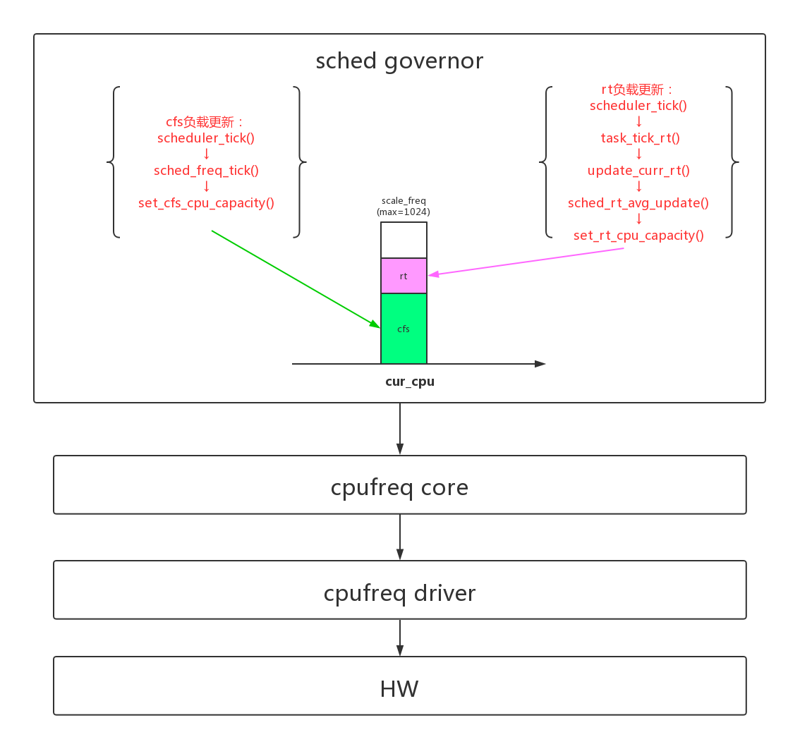

### 5.2.1、rt request

针对CONFIG_CPU_FREQ_GOV_SCHED，rt有3条关键计算路径：

- 1、rt负载的(rq->rt_avg)的累加：scheduler_tick() -> task_tick_rt() -> update_curr_rt() -> sched_rt_avg_update()

rq->rt_avg = 累加时间分量 * 当前frq分量(最大1024)

```
static inline void sched_rt_avg_update(struct rq *rq, u64 rt_delta)
{
	rq->rt_avg += rt_delta * arch_scale_freq_capacity(NULL, cpu_of(rq));
}
```

- 2、rt负载的老化：scheduler_tick() -> __update_cpu_load() -> __update_cpu_load() -> sched_avg_update()
       或者scheduler_tick() -> task_tick_rt() -> sched_rt_update_capacity_req() -> sched_avg_update()

rq->rt_avg的老化比较简单，每个period老化1/2。

```
void sched_avg_update(struct rq *rq)
{
    /* (1) 默认老化周期为1s/2 = 500ms */
	s64 period = sched_avg_period();

	while ((s64)(rq_clock(rq) - rq->age_stamp) > period) {
		/*
		 * Inline assembly required to prevent the compiler
		 * optimising this loop into a divmod call.
		 * See __iter_div_u64_rem() for another example of this.
		 */
		asm("" : "+rm" (rq->age_stamp));
		rq->age_stamp += period;
		/* (2) 每个老化周期，负载老化为原来的1/2 */
		rq->rt_avg /= 2;
		rq->dl_avg /= 2;
	}
}

|→

static inline u64 sched_avg_period(void)
{
    /* (1.1) 老化周期 = sysctl_sched_time_avg/2 = 500ms */
	return (u64)sysctl_sched_time_avg * NSEC_PER_MSEC / 2;
}
```

- 3、rt request的更新：scheduler_tick() -> task_tick_rt() -> sched_rt_update_capacity_req() -> set_rt_cpu_capacity()

rt request的计算有点粗糙: request = rt_avg/(sched_avg_period() + delta)，rt_avg中没有加上delta时间的负载。

```
static void sched_rt_update_capacity_req(struct rq *rq)
{
	u64 total, used, age_stamp, avg;
	s64 delta;

	if (!sched_freq())
		return;

    /* (1) 最新的负载进行老化 */
	sched_avg_update(rq);
	/*
	 * Since we're reading these variables without serialization make sure
	 * we read them once before doing sanity checks on them.
	 */
	age_stamp = READ_ONCE(rq->age_stamp);
	/* (2) avg=老化后的负载 */
	avg = READ_ONCE(rq->rt_avg);
	delta = rq_clock(rq) - age_stamp;

	if (unlikely(delta < 0))
		delta = 0;

    /* (3) total时间=一个老化周期+上次老化剩余时间 */
	total = sched_avg_period() + delta;

    /* (4) avg/total=request，(最大频率=1024) */
	used = div_u64(avg, total);
	if (unlikely(used > SCHED_CAPACITY_SCALE))
		used = SCHED_CAPACITY_SCALE;

    /* (5) update request */
	set_rt_cpu_capacity(rq->cpu, true, (unsigned long)(used), SCHE_ONESHOT);
}

|→

static inline void set_rt_cpu_capacity(int cpu, bool request,
				       unsigned long capacity,
					int type)
{
#ifdef CONFIG_CPU_FREQ_SCHED_ASSIST
	if (true) {
#else
	if (per_cpu(cpu_sched_capacity_reqs, cpu).rt != capacity) {
#endif
        /* (5.1) 把RT负载更新到per_cpu(cpu_sched_capacity_reqs, cpu).rt */
		per_cpu(cpu_sched_capacity_reqs, cpu).rt = capacity;
		update_cpu_capacity_request(cpu, request, type);
	}
}
```


### 5.2.2、cfs request

同样，cfs也有3条关键计算路径：

- 1、cfs负载的(rq->rt_avg)的累加：scheduler_tick() -> task_tick_fair() -> entity_tick() -> update_load_avg()
- 2、cfs负载的老化：scheduler_tick() -> task_tick_fair() -> entity_tick() -> update_load_avg()
- 3、cfs request的更新：scheduler_tick() -> sched_freq_tick() -> set_cfs_cpu_capacity()

```
static void sched_freq_tick(int cpu)
{
	struct sched_capacity_reqs *scr;
	unsigned long capacity_orig, capacity_curr;
	unsigned long capacity_req;
	struct sched_domain *sd = rcu_dereference(per_cpu(sd_ea, cpu));

	if (!sched_freq())
		return;

	capacity_orig = capacity_orig_of(cpu);
	capacity_curr = capacity_curr_of(cpu);

    /* (1) 如果当前频率已经是最高频率，直接返回 
        目前只支持频率从低往高调整？
     */
	if (capacity_curr == capacity_orig)
		return;

	/*
	 * To make free room for a task that is building up its "real"
	 * utilization and to harm its performance the least, request
	 * a jump to bigger OPP as soon as the margin of free capacity is
	 * impacted (specified by capacity_margin).
	 */
	scr = &per_cpu(cpu_sched_capacity_reqs, cpu);

    /* (2) 计算最新的(cfs capacity+ rt capacity) * (1126/1024) 
        放大一些，等于对capacity的需求request
        ooooo这里的计算有问题：cpu_util(cpu)是带capacity分量的，而scr->rt是不带capacity分量的，不能直接相加？
     */
	/* capacity_req which includes RT loading & capacity_margin */
	capacity_req = sum_capacity_reqs(cpu_util(cpu), scr);

    /* (3) 如果capacity request大于当前频率的capacity */
	if (capacity_curr <= capacity_req) {
		if (sd) {### 5.3.1、WALT的负载计算
			const struct sched_group_energy *const sge = sd->groups->sge;
			int nr_cap_states = sge->nr_cap_states;
			int idx, tmp_idx;
			int opp_jump_step;

			for (idx = 0; idx < nr_cap_states; idx++) {
				if (sge->cap_states[idx].cap > capacity_curr+1)
					break;
			}

            /* (4) 尝试计算一个合理的频率等级来满足capacity request */
			if (idx < nr_cap_states/3)
				opp_jump_step = 2; /* far step */
			else
				opp_jump_step = 1; /* near step */

			tmp_idx = idx + (opp_jump_step - 1);

			idx = tmp_idx > (nr_cap_states - 1) ?
				(nr_cap_states - 1) : tmp_idx;

			if (idx)
				capacity_req = (sge->cap_states[idx].cap +
						sge->cap_states[idx-1].cap)/2;
			else
				/* should not arrive here!*/
				capacity_req = sge->cap_states[idx].cap + 2;
		}

        /* (5) 去掉request中的capacity分量，转化成scale_freq */
		/* convert scale-invariant capacity */
		capacity_req = capacity_req * SCHED_CAPACITY_SCALE / capacity_orig_of(cpu);


        /* (6) update request， 
            ooooo这里有问题啊：capacity_req计算的时候是按照rt+cfs加起来计算的，怎么有把结果配置给了scr->cfs？
         */
		/*
		 * If free room ~5% impact, jump to 1 more index hihger OPP.
		 * Whatever it should be better than capacity_max.
		 */
		set_cfs_cpu_capacity(cpu, true, capacity_req, SCHE_ONESHOT);
	}
}

|→

static inline void set_cfs_cpu_capacity(int cpu, bool request,
					unsigned long capacity, int type)
{
#ifdef CONFIG_CPU_FREQ_SCHED_ASSIST
	if (true) {
#else
	if (per_cpu(cpu_sched_capacity_reqs, cpu).cfs != capacity) {
#endif
        /* (6.1) 把RT负载更新到per_cpu(cpu_sched_capacity_reqs, cpu).cfs */
		per_cpu(cpu_sched_capacity_reqs, cpu).cfs = capacity;
		update_cpu_capacity_request(cpu, request, type);
	}
}
```

### 5.2.3、freq target

```
void update_cpu_capacity_request(int cpu, bool request, int type)
{
	unsigned long new_capacity;
	struct sched_capacity_reqs *scr;

	/* The rq lock serializes access to the CPU's sched_capacity_reqs. */
	lockdep_assert_held(&cpu_rq(cpu)->lock);

	scr = &per_cpu(cpu_sched_capacity_reqs, cpu);

    /* (1) 综合rt、cfs的request */
	new_capacity = scr->cfs + scr->rt;
	new_capacity = new_capacity * capacity_margin_dvfs
		/ SCHED_CAPACITY_SCALE;
	new_capacity += scr->dl;

#ifndef CONFIG_CPU_FREQ_SCHED_ASSIST
	if (new_capacity == scr->total)
		return;
#endif

	scr->total = new_capacity;
	if (request)
		update_fdomain_capacity_request(cpu, type);
}

|→

static void update_fdomain_capacity_request(int cpu, int type)
{
	unsigned int freq_new, cpu_tmp;
	struct gov_data *gd;
	unsigned long capacity = 0;
#ifdef CONFIG_CPU_FREQ_SCHED_ASSIST
	int cid = arch_get_cluster_id(cpu);
	struct cpumask cls_cpus;
#endif
	struct cpufreq_policy *policy = NULL;

	/*
	 * Avoid grabbing the policy if possible. A test is still
	 * required after locking the CPU's policy to avoid racing
	 * with the governor changing.
	 */
	if (!per_cpu(enabled, cpu))
		return;

#ifdef CONFIG_CPU_FREQ_SCHED_ASSIST
	gd = g_gd[cid];

	/* bail early if we are throttled */
	if (ktime_before(ktime_get(), gd->throttle))
		goto out;

	arch_get_cluster_cpus(&cls_cpus, cid);

	/* find max capacity requested by cpus in this policy */
	for_each_cpu(cpu_tmp, &cls_cpus) {
		struct sched_capacity_reqs *scr;

		if (!cpu_online(cpu_tmp))
			continue;

		scr = &per_cpu(cpu_sched_capacity_reqs, cpu_tmp);
		capacity = max(capacity, scr->total);
	}

	freq_new = capacity * arch_scale_get_max_freq(cpu) >> SCHED_CAPACITY_SHIFT;
#else
	if (likely(cpu_online(cpu)))
		policy = cpufreq_cpu_get(cpu);

	if (IS_ERR_OR_NULL(policy))
		return;

	if (policy->governor != &cpufreq_gov_sched ||
	    !policy->governor_data)
		goto out;

	gd = policy->governor_data;

	/* bail early if we are throttled */
	if (ktime_before(ktime_get(), gd->throttle))
		goto out;

    /* (1) 选择policy cpus中最大的capacity */
	/* find max capacity requested by cpus in this policy */
	for_each_cpu(cpu_tmp, policy->cpus) {
		struct sched_capacity_reqs *scr;

		scr = &per_cpu(cpu_sched_capacity_reqs, cpu_tmp);
		capacity = max(capacity, scr->total);
	}

    /* (2) 把相对capacity转换成绝对freq */
	/* Convert the new maximum capacity request into a cpu frequency */
	freq_new = capacity * policy->max >> SCHED_CAPACITY_SHIFT;

	if (freq_new == gd->requested_freq)
		goto out;

#endif /* !CONFIG_CPU_FREQ_SCHED_ASSIST */

	gd->requested_freq = freq_new;
	gd->target_cpu = cpu;

    /* (3) 使用irq_work或者直接配置的方式来配置新的频率 
        直接在schedule_tick()中配置频率的方式估计不会使用，因为这样会阻塞中断
     */
	/*
	 * Throttling is not yet supported on platforms with fast cpufreq
	 * drivers.
	 */
	if (cpufreq_driver_slow)
		irq_work_queue_on(&gd->irq_work, cpu);
	else
		cpufreq_sched_try_driver_target(cpu, policy, freq_new, type);

out:
	if (policy)
		cpufreq_cpu_put(policy);
}

```


## 5.3、WALT(Windows Assisted Load Tracking)

在qualcomm 8898中，使用了WALT作为负载计算方法，也使用了自己的负载均衡算法来使用WALT负载。代码中使用CONFIG_SCHED_HMP来标示qualcomm自己负载均衡方法。

### 5.3.1、WALT的负载计算

Walt的本质也是时间窗分量，结合freq分量、capacity分量等一起表达的一个负载相对值。我们首先来看看几个分量的计算方法。

- 1、cluster->efficiency计算：从dts中读取，我们可以看到，四个小核的efficiency是1024，四个大核的efficiency是1638；

```
static struct sched_cluster *alloc_new_cluster(const struct cpumask *cpus)
{

	cluster->efficiency = arch_get_cpu_efficiency(cpumask_first(cpus));
	
	if (cluster->efficiency > max_possible_efficiency)
		max_possible_efficiency = cluster->efficiency;
	if (cluster->efficiency < min_possible_efficiency)
		min_possible_efficiency = cluster->efficiency;
	
}

unsigned long arch_get_cpu_efficiency(int cpu)
{
	return per_cpu(cpu_efficiency, cpu);
}

static void __init parse_dt_cpu_power(void)
{

		/*
		 * The CPU efficiency value passed from the device tree
		 * overrides the value defined in the table_efficiency[]
		 */
		if (of_property_read_u32(cn, "efficiency", &efficiency) < 0) {


		}

		per_cpu(cpu_efficiency, cpu) = efficiency;

}

从 arch/arm64/boot/dts/qcom/sdm660.dtsi读到"efficiency"配置：

	cpus {
		#address-cells = <2>;
		#size-cells = <0>;

		CPU0: cpu@0 {

			efficiency = <1024>;

		};

		CPU1: cpu@1 {

			efficiency = <1024>;

		};

		CPU2: cpu@2 {

			efficiency = <1024>;

		};

		CPU3: cpu@3 {

			efficiency = <1024>;

		};

		CPU4: cpu@100 {

			efficiency = <1638>;

		};

		CPU5: cpu@101 {

			efficiency = <1638>;

		};

		CPU6: cpu@102 {

			efficiency = <1638>;

		};

		CPU7: cpu@103 {

			efficiency = <1638>;

		};

		cpu-map {
			cluster0 {
				core0 {
					cpu = <&CPU0>;
				};

				core1 {
					cpu = <&CPU1>;
				};

				core2 {
					cpu = <&CPU2>;
				};

				core3 {
					cpu = <&CPU3>;
				};
			};

			cluster1 {
				core0 {
					cpu = <&CPU4>;
				};

				core1 {
					cpu = <&CPU5>;
				};

				core2 {
					cpu = <&CPU6>;
				};

				core3 {
					cpu = <&CPU7>;
				};
			};
		};
	}

```

- 2、cluster->capacity：计算和最小值的正比：capacity = 1024 * (cluster->efficiency*cluster_max_freq(cluster)) / (min_possible_efficiency*min_max_freq)
- 3、cluster->max_possible_capacity：计算和最小值的正比：capacity = 1024 * (cluster->efficiency*cluster->max_possible_freq) / (min_possible_efficiency*min_max_freq)
- 4、cluster->load_scale_factor：计算和最大值的反比：lsf = 1024 * (max_possible_efficiency*max_possible_freq) / (cluster->efficiency*cluster_max_freq(cluster))
- 5、cluster->exec_scale_factor：计算和最大值的正比：exec_scale_factor = 1024 * cluster->efficiency / max_possible_efficiency

```
static void update_all_clusters_stats(void)
{
	struct sched_cluster *cluster;
	u64 highest_mpc = 0, lowest_mpc = U64_MAX;

	pre_big_task_count_change(cpu_possible_mask);

	for_each_sched_cluster(cluster) {
		u64 mpc;

        /* (1) 计算cluster->capacity：capacity = efficiency * cluster_max_freq
            最小值：min_possible_efficiency*min_max_freq = 1024，
            计算和最小值的正比：capacity = 1024 * (cluster->efficiency*cluster_max_freq(cluster)) / (min_possible_efficiency*min_max_freq)
         */
		cluster->capacity = compute_capacity(cluster);
		
		/* (2) 计算cluster->max_possible_capacity：capacity = efficiency * cluster_max_freq
		    最小值：min_possible_efficiency*min_max_freq = 1024，
            计算和最小值的正比：capacity = 1024 * (cluster->efficiency*cluster->max_possible_freq) / (min_possible_efficiency*min_max_freq)
		 */
		mpc = cluster->max_possible_capacity =
			compute_max_possible_capacity(cluster);
			
		/* (3) 计算cluster->load_scale_factor： lsf = efficiency * cluster_max_freq
		    最大值：max_possible_efficiency*max_possible_freq = 1024
		    计算和最大值的反比：lsf = 1024 * (max_possible_efficiency*max_possible_freq) / (cluster->efficiency*cluster_max_freq(cluster))
		 */
		cluster->load_scale_factor = compute_load_scale_factor(cluster);

        /* (4) 计算cluster->exec_scale_factor：
            最大值：max_possible_efficiency = 1024
            计算和最大值的正比：exec_scale_factor = 1024 * cluster->efficiency / max_possible_efficiency
         */
		cluster->exec_scale_factor =
			DIV_ROUND_UP(cluster->efficiency * 1024,
				     max_possible_efficiency);

		if (mpc > highest_mpc)
			highest_mpc = mpc;

		if (mpc < lowest_mpc)
			lowest_mpc = mpc;
	}

	max_possible_capacity = highest_mpc;
	min_max_possible_capacity = lowest_mpc;

	__update_min_max_capacity();
	sched_update_freq_max_load(cpu_possible_mask);
	post_big_task_count_change(cpu_possible_mask);
}

|→

static int compute_capacity(struct sched_cluster *cluster)
{
	int capacity = 1024;

	capacity *= capacity_scale_cpu_efficiency(cluster);
	capacity >>= 10;

	capacity *= capacity_scale_cpu_freq(cluster);
	capacity >>= 10;

	return capacity;
}

||→

/*
 * Return 'capacity' of a cpu in reference to "least" efficient cpu, such that
 * least efficient cpu gets capacity of 1024
 */
static unsigned long
capacity_scale_cpu_efficiency(struct sched_cluster *cluster)
{
	return (1024 * cluster->efficiency) / min_possible_efficiency;
}

||→

/*
 * Return 'capacity' of a cpu in reference to cpu with lowest max_freq
 * (min_max_freq), such that one with lowest max_freq gets capacity of 1024.
 */
static unsigned long capacity_scale_cpu_freq(struct sched_cluster *cluster)
{
	return (1024 * cluster_max_freq(cluster)) / min_max_freq;
}

|→

static int compute_load_scale_factor(struct sched_cluster *cluster)
{
	int load_scale = 1024;

	/*
	 * load_scale_factor accounts for the fact that task load
	 * is in reference to "best" performing cpu. Task's load will need to be
	 * scaled (up) by a factor to determine suitability to be placed on a
	 * (little) cpu.
	 */
	load_scale *= load_scale_cpu_efficiency(cluster);
	load_scale >>= 10;

	load_scale *= load_scale_cpu_freq(cluster);
	load_scale >>= 10;

	return load_scale;
}

||→

/*
 * Return load_scale_factor of a cpu in reference to "most" efficient cpu, so
 * that "most" efficient cpu gets a load_scale_factor of 1
 */
static inline unsigned long
load_scale_cpu_efficiency(struct sched_cluster *cluster)
{
	return DIV_ROUND_UP(1024 * max_possible_efficiency,
			    cluster->efficiency);
}

||→

/*
 * Return load_scale_factor of a cpu in reference to cpu with best max_freq
 * (max_possible_freq), so that one with best max_freq gets a load_scale_factor
 * of 1.
 */
static inline unsigned long load_scale_cpu_freq(struct sched_cluster *cluster)
{
	return DIV_ROUND_UP(1024 * max_possible_freq,
			   cluster_max_freq(cluster));
}

```

- 6、cluster->max_power_cost：cluster的最大功耗 = voltage^2 * frequence
- 7、cluster->min_power_cost：cluster的最小功耗 = voltage^2 * frequence

```
static void sort_clusters(void)
{

	for_each_sched_cluster(cluster) {
		cluster->max_power_cost = power_cost(cluster_first_cpu(cluster),
							       max_task_load());
		cluster->min_power_cost = power_cost(cluster_first_cpu(cluster),
							       0);

		if (cluster->max_power_cost > tmp_max)
			tmp_max = cluster->max_power_cost;
	}
	max_power_cost = tmp_max;
	
	
}

|→

unsigned int power_cost(int cpu, u64 demand)
{
	int first, mid, last;
	struct cpu_pwr_stats *per_cpu_info = get_cpu_pwr_stats();
	struct cpu_pstate_pwr *costs;
	struct freq_max_load *max_load;
	int total_static_pwr_cost = 0;
	struct rq *rq = cpu_rq(cpu);
	unsigned int pc;

	if (!per_cpu_info || !per_cpu_info[cpu].ptable)
		/*
		 * When power aware scheduling is not in use, or CPU
		 * power data is not available, just use the CPU
		 * capacity as a rough stand-in for real CPU power
		 * numbers, assuming bigger CPUs are more power
		 * hungry.
		 */
		return cpu_max_possible_capacity(cpu);

	rcu_read_lock();
	max_load = rcu_dereference(per_cpu(freq_max_load, cpu));
	if (!max_load) {
		pc = cpu_max_possible_capacity(cpu);
		goto unlock;
	}

	costs = per_cpu_info[cpu].ptable;

	if (demand <= max_load->freqs[0].hdemand) {
		pc = costs[0].power;
		goto unlock;
	} else if (demand > max_load->freqs[max_load->length - 1].hdemand) {
		pc = costs[max_load->length - 1].power;
		goto unlock;
	}

	first = 0;
	last = max_load->length - 1;
	mid = (last - first) >> 1;
	while (1) {
		if (demand <= max_load->freqs[mid].hdemand)
			last = mid;
		else
			first = mid;

		if (last - first == 1)
			break;
		mid = first + ((last - first) >> 1);
	}

	pc = costs[last].power;

unlock:
	rcu_read_unlock();

	if (idle_cpu(cpu) && rq->cstate) {
		total_static_pwr_cost += rq->static_cpu_pwr_cost;
		if (rq->cluster->dstate)
			total_static_pwr_cost +=
				rq->cluster->static_cluster_pwr_cost;
	}

	return pc + total_static_pwr_cost;

}


/* qualcom的power的计算公式 = voltage^2 * frequence */
static int msm_get_power_values(int cpu, struct cpu_static_info *sp)
{
	int i = 0, j;
	int ret = 0;
	uint64_t power;

	/* Calculate dynamic power spent for every frequency using formula:
	 * Power = V * V * f
	 * where V = voltage for frequency
	 *       f = frequency
	 * */
	sp->power = allocate_2d_array_uint32_t(sp->num_of_freqs);
	if (IS_ERR_OR_NULL(sp->power))
		return PTR_ERR(sp->power);

	for (i = 0; i < TEMP_DATA_POINTS; i++) {
		for (j = 0; j < sp->num_of_freqs; j++) {
			power = sp->voltage[j] *
						sp->table[j].frequency;
			do_div(power, 1000);
			do_div(power, 1000);
			power *= sp->voltage[j];
			do_div(power, 1000);
			sp->power[i][j] = power;
		}
	}
	return ret;
}

```


#### 5.3.1.1、update_task_ravg()

walt关于进程的负载计算流程如下：

- 1、把时间分成一个个window窗口，累加时间时，需要综合efficiency和freq分量(也就是capacity)：delta = delta_time * (curr_freq/max_possible_freq) * (cluster->efficiency/max_possible_efficiency);

```
static inline u64 scale_exec_time(u64 delta, struct rq *rq)
{
	u32 freq;

    /* curr_freq / max_possible_freq */
	freq = cpu_cycles_to_freq(rq->cc.cycles, rq->cc.time);
	delta = DIV64_U64_ROUNDUP(delta * freq, max_possible_freq);
	
	/* exec_scale_factor = cluster->efficiency / max_possible_efficiency */
	delta *= rq->cluster->exec_scale_factor;
	delta >>= 10;

	return delta;
}
```

- 2、统计runnable状态的时间：account_busy_for_task_demand()屏蔽掉runnable以外的其他状态的时间统计；

```
static int account_busy_for_task_demand(struct task_struct *p, int event)
{
	/*
	 * No need to bother updating task demand for exiting tasks
	 * or the idle task.
	 */
	/* (3.1.1) exit、idle任务不计入统计 */
	if (exiting_task(p) || is_idle_task(p))
		return 0;

	/*
	 * When a task is waking up it is completing a segment of non-busy
	 * time. Likewise, if wait time is not treated as busy time, then
	 * when a task begins to run or is migrated, it is not running and
	 * is completing a segment of non-busy time.
	 */
	/* (3.1.2) 任务被wakeup，之前的等待时间不计入统计 
	    SCHED_ACCOUNT_WAIT_TIME用来控制ruannable的等待时间是否计入统计，默认是计入的
	 */
	if (event == TASK_WAKE || (!SCHED_ACCOUNT_WAIT_TIME &&
			 (event == PICK_NEXT_TASK || event == TASK_MIGRATE)))
		return 0;

	return 1;
}
```

- 3、在统计时间时，可能碰到的3种组合情况：

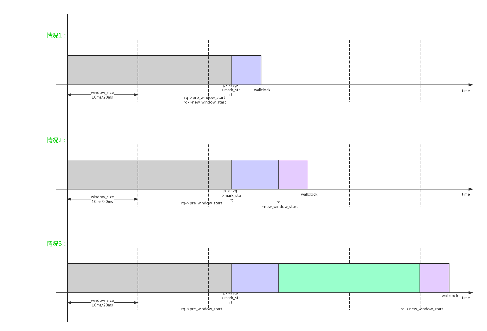

- 4、如果一个window还没有完成，会逐步累加时间到p->ravg.sum；如果一个window完成，存储最新window负载到p->ravg.sum_history[RAVG_HIST_SIZE_MAX]中，sum_history[]一共有5个槽位；系统根据sched_window_stats_policy选择策略(RECENT、MAX、AVG、MAX_RECENT_AVG)，根据sum_history[]计算选择一个合适的值作为进程负载p->ravg.demand；同时根据sum_history[]的计算进程的负载预测p->ravg.pred_demand；


- 5、walt的task级别的负载是p->ravg.demand，cpu级别负载是rq->hmp_stats.cumulative_runnable_avg；

- 6、

具体的update_task_ravg()代码解析如下：

```
scheduler_tick() -> update_task_ravg()

↓

/* Reflect task activity on its demand and cpu's busy time statistics */
void update_task_ravg(struct task_struct *p, struct rq *rq, int event,
						u64 wallclock, u64 irqtime)
{
	u64 runtime;

	if (!rq->window_start || sched_disable_window_stats ||
	    p->ravg.mark_start == wallclock)
		return;

	lockdep_assert_held(&rq->lock);

    /* (1) 根据wallclock更新rq->window_start */
	update_window_start(rq, wallclock);

	if (!p->ravg.mark_start) {
		update_task_cpu_cycles(p, cpu_of(rq));
		goto done;
	}

    /* (2) 更新cycle、walltime的差值，用来计算cpu的当前freq */
	update_task_rq_cpu_cycles(p, rq, event, wallclock, irqtime);
	
	/* (3) 更新task的负载demand */
	runtime = update_task_demand(p, rq, event, wallclock);
	if (runtime)
		update_task_burst(p, rq, event, runtime);
		
	/* (4) 更新cpu的busy时间 */
	update_cpu_busy_time(p, rq, event, wallclock, irqtime);
	
	/* (5) 更新task的负载预测pred_demand */
	update_task_pred_demand(rq, p, event);
done:
	trace_sched_update_task_ravg(p, rq, event, wallclock, irqtime,
				     rq->cc.cycles, rq->cc.time,
				     p->grp ? &rq->grp_time : NULL);

    /* (6) 更新task的时间更新点：p->ravg.mark_start */
	p->ravg.mark_start = wallclock;
}

|→

static u64 update_task_demand(struct task_struct *p, struct rq *rq,
			       int event, u64 wallclock)
{
	u64 mark_start = p->ravg.mark_start;
	u64 delta, window_start = rq->window_start;
	int new_window, nr_full_windows;
	u32 window_size = sched_ravg_window;
	u64 runtime;

	new_window = mark_start < window_start;
	
	/* (3.1) 这是一个关键点，非runnable状态的统计需要在这里异常返回 */
	if (!account_busy_for_task_demand(p, event)) {
		if (new_window)
			/*
			 * If the time accounted isn't being accounted as
			 * busy time, and a new window started, only the
			 * previous window need be closed out with the
			 * pre-existing demand. Multiple windows may have
			 * elapsed, but since empty windows are dropped,
			 * it is not necessary to account those.
			 */
			update_history(rq, p, p->ravg.sum, 1, event);
		return 0;
	}

    /* (3.2) 第一种情况：还在原窗口内，简单继续累加p->ravg.sum */
	if (!new_window) {
		/*
		 * The simple case - busy time contained within the existing
		 * window.
		 */
		return add_to_task_demand(rq, p, wallclock - mark_start);
	}

    /* (3.3) 第二、三种情况：原窗口已经填满 */
	/*
	 * Busy time spans at least two windows. Temporarily rewind
	 * window_start to first window boundary after mark_start.
	 */
	delta = window_start - mark_start;
	nr_full_windows = div64_u64(delta, window_size);
	window_start -= (u64)nr_full_windows * (u64)window_size;

    /* (3.4.1) 补全第一个窗口 */
	/* Process (window_start - mark_start) first */
	runtime = add_to_task_demand(rq, p, window_start - mark_start);

    /* (3.4.2) 把第一个窗口更新到进程task负载history中, 
        更新p->ravg.demand、p->ravg.pred_demand
     */
	/* Push new sample(s) into task's demand history */
	update_history(rq, p, p->ravg.sum, 1, event);
	
	/* (3.5) 如果中间有几个完整窗口，更新负载，更新history */
	if (nr_full_windows) {
		u64 scaled_window = scale_exec_time(window_size, rq);

		update_history(rq, p, scaled_window, nr_full_windows, event);
		runtime += nr_full_windows * scaled_window;
	}

    /* (3.6) 最后一个没有完成的窗口，只是简单累加时间，不更新history */
	/*
	 * Roll window_start back to current to process any remainder
	 * in current window.
	 */
	window_start += (u64)nr_full_windows * (u64)window_size;

	/* Process (wallclock - window_start) next */
	mark_start = window_start;
	runtime += add_to_task_demand(rq, p, wallclock - mark_start);

	return runtime;
}

||→

static int account_busy_for_task_demand(struct task_struct *p, int event)
{
	/*
	 * No need to bother updating task demand for exiting tasks
	 * or the idle task.
	 */
	/* (3.1.1) exit、idle任务不计入统计 */
	if (exiting_task(p) || is_idle_task(p))
		return 0;

	/*
	 * When a task is waking up it is completing a segment of non-busy
	 * time. Likewise, if wait time is not treated as busy time, then
	 * when a task begins to run or is migrated, it is not running and
	 * is completing a segment of non-busy time.
	 */
	/* (3.1.2) 任务被wakeup，之前的等待时间不计入统计 
	    SCHED_ACCOUNT_WAIT_TIME用来控制ruannable的等待时间是否计入统计，默认是计入的
	 */
	if (event == TASK_WAKE || (!SCHED_ACCOUNT_WAIT_TIME &&
			 (event == PICK_NEXT_TASK || event == TASK_MIGRATE)))
		return 0;

	return 1;
}

||→

static void add_to_task_demand(struct rq *rq, struct task_struct *p,
				u64 delta)
{
    /* (3.4.1) 累加窗口的时间值 */
	delta = scale_exec_time(delta, rq);
	p->ravg.sum += delta;
	if (unlikely(p->ravg.sum > walt_ravg_window))
		p->ravg.sum = walt_ravg_window;
}

static inline u64 scale_exec_time(u64 delta, struct rq *rq)
{
	u32 freq;

    /* curr_freq / max_possible_freq */
	freq = cpu_cycles_to_freq(rq->cc.cycles, rq->cc.time);
	delta = DIV64_U64_ROUNDUP(delta * freq, max_possible_freq);
	
	/* exec_scale_factor = cluster->efficiency / max_possible_efficiency */
	delta *= rq->cluster->exec_scale_factor;
	delta >>= 10;

	return delta;
}

||→

static void update_history(struct rq *rq, struct task_struct *p,
			 u32 runtime, int samples, int event)
{
	u32 *hist = &p->ravg.sum_history[0];
	int ridx, widx;
	u32 max = 0, avg, demand, pred_demand;
	u64 sum = 0;

    /* (3.4.2.1) 不活跃的进程不进行更新 */
	/* Ignore windows where task had no activity */
	if (!runtime || is_idle_task(p) || exiting_task(p) || !samples)
		goto done;

    /* (3.4.2.2) 把新窗口的runtime推送到history stack中 */
	/* Push new 'runtime' value onto stack */
	widx = sched_ravg_hist_size - 1;
	ridx = widx - samples;
	for (; ridx >= 0; --widx, --ridx) {
		hist[widx] = hist[ridx];
		sum += hist[widx];
		if (hist[widx] > max)
			max = hist[widx];
	}

	for (widx = 0; widx < samples && widx < sched_ravg_hist_size; widx++) {
		hist[widx] = runtime;
		sum += hist[widx];
		if (hist[widx] > max)
			max = hist[widx];
	}

	p->ravg.sum = 0;

    /* (3.4.2.3) 根据sched_window_stats_policy策略(RECENT、MAX、AVG、MAX_RECENT_AVG)，
        从sum_history[]中选择合适的值作为进程负载p->ravg.demand
     */
	if (sched_window_stats_policy == WINDOW_STATS_RECENT) {
		demand = runtime;
	} else if (sched_window_stats_policy == WINDOW_STATS_MAX) {
		demand = max;
	} else {
		avg = div64_u64(sum, sched_ravg_hist_size);
		if (sched_window_stats_policy == WINDOW_STATS_AVG)
			demand = avg;
		else
			demand = max(avg, runtime);
	}
	
	/* (3.4.2.4) 计算进程的预测负载 */
	pred_demand = predict_and_update_buckets(rq, p, runtime);

	/*
	 * A throttled deadline sched class task gets dequeued without
	 * changing p->on_rq. Since the dequeue decrements hmp stats
	 * avoid decrementing it here again.
	 */
	/* (3.4.2.5) 更新进程负载(p->ravg.demand)到cpu负载(rq->hmp_stats.cumulative_runnable_avg)中 
	    cfs中p->sched_class->fixup_hmp_sched_stats对应函数fixup_hmp_sched_stats_fair()
	 */
	if (task_on_rq_queued(p) && (!task_has_dl_policy(p) ||
						!p->dl.dl_throttled))
		p->sched_class->fixup_hmp_sched_stats(rq, p, demand,
						      pred_demand);

	p->ravg.demand = demand;
	p->ravg.pred_demand = pred_demand;

done:
	trace_sched_update_history(rq, p, runtime, samples, event);
}

|||→

static inline u32 predict_and_update_buckets(struct rq *rq,
			struct task_struct *p, u32 runtime) {

	int bidx;
	u32 pred_demand;

    /* (3.4.2.4.1) 把window负载转换成bucket index(最大10) */
	bidx = busy_to_bucket(runtime);
	
	/* (3.4.2.4.2) 根据index，找到历史曾经达到过的更大值，取历史的值作为预测值 */
	pred_demand = get_pred_busy(rq, p, bidx, runtime);
	
	/* (3.4.2.4.3) 对bucket[]中本次index权重进行增加，其他权重减少 */
	bucket_increase(p->ravg.busy_buckets, bidx);

	return pred_demand;
}

|||→

static void
fixup_hmp_sched_stats_fair(struct rq *rq, struct task_struct *p,
			   u32 new_task_load, u32 new_pred_demand)
{
    /* (3.4.2.5.1) 计算task负载和预测的变化值delta */
	s64 task_load_delta = (s64)new_task_load - task_load(p);
	s64 pred_demand_delta = PRED_DEMAND_DELTA;

    /* (3.4.2.5.2) 将进程级别的delta计入cpu级别的负载统计(rq->hmp_stats)中 */
	fixup_cumulative_runnable_avg(&rq->hmp_stats, p, task_load_delta,
				      pred_demand_delta);
				      
    /* (3.4.2.5.3) 更新cpu级别big_task的数量 */
	fixup_nr_big_tasks(&rq->hmp_stats, p, task_load_delta);
}

static inline void
fixup_cumulative_runnable_avg(struct hmp_sched_stats *stats,
			      struct task_struct *p, s64 task_load_delta,
			      s64 pred_demand_delta)
{
	if (sched_disable_window_stats)
		return;

	stats->cumulative_runnable_avg += task_load_delta;
	BUG_ON((s64)stats->cumulative_runnable_avg < 0);

	stats->pred_demands_sum += pred_demand_delta;
	BUG_ON((s64)stats->pred_demands_sum < 0);
}

void fixup_nr_big_tasks(struct hmp_sched_stats *stats,
				struct task_struct *p, s64 delta)
{
	u64 new_task_load;
	u64 old_task_load;

	if (sched_disable_window_stats)
		return;

    /* task_load按照capacity反比放大，让所有cpu处在同一级别 */
	old_task_load = scale_load_to_cpu(task_load(p), task_cpu(p));
	new_task_load = scale_load_to_cpu(delta + task_load(p), task_cpu(p));

    /* 如果进程负载 > 最大负载 * 80% (sysctl_sched_upmigrate_pct)
        该任务为big_task
     */
	if (__is_big_task(p, old_task_load) && !__is_big_task(p, new_task_load))
		stats->nr_big_tasks--;
	else if (!__is_big_task(p, old_task_load) &&
		 __is_big_task(p, new_task_load))
		stats->nr_big_tasks++;

	BUG_ON(stats->nr_big_tasks < 0);
}

```

我们再来详细看看cpu级别的busy time计算：

```
static void update_cpu_busy_time(struct task_struct *p, struct rq *rq,
				 int event, u64 wallclock, u64 irqtime)
{
	int new_window, full_window = 0;
	int p_is_curr_task = (p == rq->curr);
	u64 mark_start = p->ravg.mark_start;
	u64 window_start = rq->window_start;
	u32 window_size = sched_ravg_window;
	u64 delta;
	u64 *curr_runnable_sum = &rq->curr_runnable_sum;
	u64 *prev_runnable_sum = &rq->prev_runnable_sum;
	u64 *nt_curr_runnable_sum = &rq->nt_curr_runnable_sum;
	u64 *nt_prev_runnable_sum = &rq->nt_prev_runnable_sum;
	bool new_task;
	struct related_thread_group *grp;
	int cpu = rq->cpu;
	u32 old_curr_window = p->ravg.curr_window;

	new_window = mark_start < window_start;
	if (new_window) {
		full_window = (window_start - mark_start) >= window_size;
		if (p->ravg.active_windows < USHRT_MAX)
			p->ravg.active_windows++;
	}

	new_task = is_new_task(p);

	/*
	 * Handle per-task window rollover. We don't care about the idle
	 * task or exiting tasks.
	 */
	/* (1) 如果有新window，滚动进程窗口：p->ravg.prev_window、p->ravg.curr_window */
	if (!is_idle_task(p) && !exiting_task(p)) {
		if (new_window)
			rollover_task_window(p, full_window);
	}

    /* (2) 如果有新window且进程是rq的当前进程，
        cpu级别的窗口滚动：rq->prev_runnable_sum、rq->curr_runnable_sum
        cpu级别的进程统计窗口滚动：rq->top_tasks[prev_table]、rq->top_tasks[curr_table]
     */
	if (p_is_curr_task && new_window) {
		rollover_cpu_window(rq, full_window);
		rollover_top_tasks(rq, full_window);
	}

    /* (3) 判断哪些情况可以统计进cpu time */
	if (!account_busy_for_cpu_time(rq, p, irqtime, event))
		goto done;

	grp = p->grp;
	if (grp && sched_freq_aggregate) {
		struct group_cpu_time *cpu_time = &rq->grp_time;

		curr_runnable_sum = &cpu_time->curr_runnable_sum;
		prev_runnable_sum = &cpu_time->prev_runnable_sum;

		nt_curr_runnable_sum = &cpu_time->nt_curr_runnable_sum;
		nt_prev_runnable_sum = &cpu_time->nt_prev_runnable_sum;
	}

    /* (4) 如果时间没有达到新window，
        在cpu级别的当前负载上累加：rq->curr_runnable_sum
        在进程级别的基础上累加：p->ravg.curr_window
     */
	if (!new_window) {
		/*
		 * account_busy_for_cpu_time() = 1 so busy time needs
		 * to be accounted to the current window. No rollover
		 * since we didn't start a new window. An example of this is
		 * when a task starts execution and then sleeps within the
		 * same window.
		 */

		if (!irqtime || !is_idle_task(p) || cpu_is_waiting_on_io(rq))
			delta = wallclock - mark_start;
		else
			delta = irqtime;
		delta = scale_exec_time(delta, rq);
		*curr_runnable_sum += delta;
		if (new_task)
			*nt_curr_runnable_sum += delta;

		if (!is_idle_task(p) && !exiting_task(p)) {
			p->ravg.curr_window += delta;
			p->ravg.curr_window_cpu[cpu] += delta;
		}

		goto done;
	}

    /* (5) 如果时间达到新window，但是进程不是rq的当前进程
        在进程级别的基础上累加：p->ravg.prev_window、p->ravg.curr_window
        在cpu级别的当前负载上累加：rq->prev_runnable_sum、rq->curr_runnable_sum
     */
	if (!p_is_curr_task) {
		/*
		 * account_busy_for_cpu_time() = 1 so busy time needs
		 * to be accounted to the current window. A new window
		 * has also started, but p is not the current task, so the
		 * window is not rolled over - just split up and account
		 * as necessary into curr and prev. The window is only
		 * rolled over when a new window is processed for the current
		 * task.
		 *
		 * Irqtime can't be accounted by a task that isn't the
		 * currently running task.
		 */

		if (!full_window) {
			/*
			 * A full window hasn't elapsed, account partial
			 * contribution to previous completed window.
			 */
			delta = scale_exec_time(window_start - mark_start, rq);
			if (!exiting_task(p)) {
				p->ravg.prev_window += delta;
				p->ravg.prev_window_cpu[cpu] += delta;
			}
		} else {
			/*
			 * Since at least one full window has elapsed,
			 * the contribution to the previous window is the
			 * full window (window_size).
			 */
			delta = scale_exec_time(window_size, rq);
			if (!exiting_task(p)) {
				p->ravg.prev_window = delta;
				p->ravg.prev_window_cpu[cpu] = delta;
			}
		}

		*prev_runnable_sum += delta;
		if (new_task)
			*nt_prev_runnable_sum += delta;

		/* Account piece of busy time in the current window. */
		delta = scale_exec_time(wallclock - window_start, rq);
		*curr_runnable_sum += delta;
		if (new_task)
			*nt_curr_runnable_sum += delta;

		if (!exiting_task(p)) {
			p->ravg.curr_window = delta;
			p->ravg.curr_window_cpu[cpu] = delta;
		}

		goto done;
	}

    /* (6) 如果时间达到新window，且进程是rq的当前进程
        在进程级别的基础上累加：p->ravg.prev_window、p->ravg.curr_window
        在cpu级别的当前负载上累加：rq->prev_runnable_sum、rq->curr_runnable_sum
     */
	if (!irqtime || !is_idle_task(p) || cpu_is_waiting_on_io(rq)) {
		/*
		 * account_busy_for_cpu_time() = 1 so busy time needs
		 * to be accounted to the current window. A new window
		 * has started and p is the current task so rollover is
		 * needed. If any of these three above conditions are true
		 * then this busy time can't be accounted as irqtime.
		 *
		 * Busy time for the idle task or exiting tasks need not
		 * be accounted.
		 *
		 * An example of this would be a task that starts execution
		 * and then sleeps once a new window has begun.
		 */

		if (!full_window) {
			/*
			 * A full window hasn't elapsed, account partial
			 * contribution to previous completed window.
			 */
			delta = scale_exec_time(window_start - mark_start, rq);
			if (!is_idle_task(p) && !exiting_task(p)) {
				p->ravg.prev_window += delta;
				p->ravg.prev_window_cpu[cpu] += delta;
			}
		} else {
			/*
			 * Since at least one full window has elapsed,
			 * the contribution to the previous window is the
			 * full window (window_size).
			 */
			delta = scale_exec_time(window_size, rq);
			if (!is_idle_task(p) && !exiting_task(p)) {
				p->ravg.prev_window = delta;
				p->ravg.prev_window_cpu[cpu] = delta;
			}
		}

		/*
		 * Rollover is done here by overwriting the values in
		 * prev_runnable_sum and curr_runnable_sum.
		 */
		*prev_runnable_sum += delta;
		if (new_task)
			*nt_prev_runnable_sum += delta;

		/* Account piece of busy time in the current window. */
		delta = scale_exec_time(wallclock - window_start, rq);
		*curr_runnable_sum += delta;
		if (new_task)
			*nt_curr_runnable_sum += delta;

		if (!is_idle_task(p) && !exiting_task(p)) {
			p->ravg.curr_window = delta;
			p->ravg.curr_window_cpu[cpu] = delta;
		}

		goto done;
	}

	if (irqtime) {
		/*
		 * account_busy_for_cpu_time() = 1 so busy time needs
		 * to be accounted to the current window. A new window
		 * has started and p is the current task so rollover is
		 * needed. The current task must be the idle task because
		 * irqtime is not accounted for any other task.
		 *
		 * Irqtime will be accounted each time we process IRQ activity
		 * after a period of idleness, so we know the IRQ busy time
		 * started at wallclock - irqtime.
		 */

		BUG_ON(!is_idle_task(p));
		mark_start = wallclock - irqtime;

		/*
		 * Roll window over. If IRQ busy time was just in the current
		 * window then that is all that need be accounted.
		 */
		if (mark_start > window_start) {
			*curr_runnable_sum = scale_exec_time(irqtime, rq);
			return;
		}

		/*
		 * The IRQ busy time spanned multiple windows. Process the
		 * busy time preceding the current window start first.
		 */
		delta = window_start - mark_start;
		if (delta > window_size)
			delta = window_size;
		delta = scale_exec_time(delta, rq);
		*prev_runnable_sum += delta;

		/* Process the remaining IRQ busy time in the current window. */
		delta = wallclock - window_start;
		rq->curr_runnable_sum = scale_exec_time(delta, rq);

		return;
	}

done:
    /* (7) 更新cpu上的top task */
	if (!is_idle_task(p) && !exiting_task(p))
		update_top_tasks(p, rq, old_curr_window,
					new_window, full_window);
}

|→

static void update_top_tasks(struct task_struct *p, struct rq *rq,
		u32 old_curr_window, int new_window, bool full_window)
{
	u8 curr = rq->curr_table;
	u8 prev = 1 - curr;
	u8 *curr_table = rq->top_tasks[curr];
	u8 *prev_table = rq->top_tasks[prev];
	int old_index, new_index, update_index;
	u32 curr_window = p->ravg.curr_window;
	u32 prev_window = p->ravg.prev_window;
	bool zero_index_update;

	if (old_curr_window == curr_window && !new_window)
		return;

    /* (1) 把就进程p的"当前window负载"、"旧的当前window负载"转换成index(NUM_LOAD_INDICES=1000) */
	old_index = load_to_index(old_curr_window);
	new_index = load_to_index(curr_window);

    /* (2) 如果没有新window 
        更新当前top表rq->top_tasks[curr][]中新旧index的计数
        根据index的计数是否为0，更新rq->top_tasks_bitmap[curr] bitmap中对应index的值
     */
	if (!new_window) {
		zero_index_update = !old_curr_window && curr_window;
		if (old_index != new_index || zero_index_update) {
			if (old_curr_window)
				curr_table[old_index] -= 1;
			if (curr_window)
				curr_table[new_index] += 1;
			if (new_index > rq->curr_top)
				rq->curr_top = new_index;
		}

		if (!curr_table[old_index])
			__clear_bit(NUM_LOAD_INDICES - old_index - 1,
				rq->top_tasks_bitmap[curr]);

		if (curr_table[new_index] == 1)
			__set_bit(NUM_LOAD_INDICES - new_index - 1,
				rq->top_tasks_bitmap[curr]);

		return;
	}

	/*
	 * The window has rolled over for this task. By the time we get
	 * here, curr/prev swaps would has already occurred. So we need
	 * to use prev_window for the new index.
	 */
	update_index = load_to_index(prev_window);

	if (full_window) {
		/*
		 * Two cases here. Either 'p' ran for the entire window or
		 * it didn't run at all. In either case there is no entry
		 * in the prev table. If 'p' ran the entire window, we just
		 * need to create a new entry in the prev table. In this case
		 * update_index will be correspond to sched_ravg_window
		 * so we can unconditionally update the top index.
		 */
		if (prev_window) {
			prev_table[update_index] += 1;
			rq->prev_top = update_index;
		}

		if (prev_table[update_index] == 1)
			__set_bit(NUM_LOAD_INDICES - update_index - 1,
				rq->top_tasks_bitmap[prev]);
	} else {
		zero_index_update = !old_curr_window && prev_window;
		if (old_index != update_index || zero_index_update) {
			if (old_curr_window)
				prev_table[old_index] -= 1;

			prev_table[update_index] += 1;

			if (update_index > rq->prev_top)
				rq->prev_top = update_index;

			if (!prev_table[old_index])
				__clear_bit(NUM_LOAD_INDICES - old_index - 1,
						rq->top_tasks_bitmap[prev]);

			if (prev_table[update_index] == 1)
				__set_bit(NUM_LOAD_INDICES - update_index - 1,
						rq->top_tasks_bitmap[prev]);
		}
	}

	if (curr_window) {
		curr_table[new_index] += 1;

		if (new_index > rq->curr_top)
			rq->curr_top = new_index;

		if (curr_table[new_index] == 1)
			__set_bit(NUM_LOAD_INDICES - new_index - 1,
				rq->top_tasks_bitmap[curr]);
	}
}

```


### 5.3.2、基于WALT的负载均衡

#### 5.3.2.1、load_balance()

其他部分和主干内核算法一致，这里只标识出qualcom的HMP算法特有的部分。在负载均衡部分，walt用来找出cpu；但是在负载迁移时，计算负载还是使用pelt？

- 在find_busiest_queue()中：原本是找出cfs_rq->runnable_load_avg * capacity负载最大的cpu，qualcom HMP改为找出walt runnable负载(rq->hmp_stats.cumulative_runnable_avg)最重的cpu。


```
run_rebalance_domains() -> rebalance_domains() -> load_balance() -> find_busiest_queue() -> find_busiest_queue_hmp()

↓

static struct rq *find_busiest_queue_hmp(struct lb_env *env,
				     struct sched_group *group)
{
	struct rq *busiest = NULL, *busiest_big = NULL;
	u64 max_runnable_avg = 0, max_runnable_avg_big = 0;
	int max_nr_big = 0, nr_big;
	bool find_big = !!(env->flags & LBF_BIG_TASK_ACTIVE_BALANCE);
	int i;
	cpumask_t cpus;

	cpumask_andnot(&cpus, sched_group_cpus(group), cpu_isolated_mask);

    /* (1) 遍历sg中的cpu */
	for_each_cpu(i, &cpus) {
		struct rq *rq = cpu_rq(i);
		u64 cumulative_runnable_avg =
				rq->hmp_stats.cumulative_runnable_avg;

		if (!cpumask_test_cpu(i, env->cpus))
			continue;

        
        /* (2) 考虑big_task，找出big_task最重的cpu */
		if (find_big) {
			nr_big = nr_big_tasks(rq);
			if (nr_big > max_nr_big ||
			    (nr_big > 0 && nr_big == max_nr_big &&
			     cumulative_runnable_avg > max_runnable_avg_big)) {
				max_runnable_avg_big = cumulative_runnable_avg;
				busiest_big = rq;
				max_nr_big = nr_big;
				continue;
			}
		}

        /* (3) 找出walt runnable负载(rq->hmp_stats.cumulative_runnable_avg)最重的cpu */
		if (cumulative_runnable_avg > max_runnable_avg) {
			max_runnable_avg = cumulative_runnable_avg;
			busiest = rq;
		}
	}

	if (busiest_big)
		return busiest_big;

	env->flags &= ~LBF_BIG_TASK_ACTIVE_BALANCE;
	return busiest;
}

```

#### 5.3.2.2、nohz_idle_balance()

- _nohz_kick_needed()：

```
scheduler_tick() -> trigger_load_balance() -> nohz_kick_needed() -> _nohz_kick_needed() -> nohz_kick_needed_hmp()

↓

static inline int _nohz_kick_needed_hmp(struct rq *rq, int cpu, int *type)
{
	struct sched_domain *sd;
	int i;

	if (rq->nr_running < 2)
		return 0;

    /* (1) 如果是SCHED_BOOST_ON_ALL，返回true */
	if (!sysctl_sched_restrict_cluster_spill ||
			sched_boost_policy() == SCHED_BOOST_ON_ALL)
		return 1;

    /* (2) 如果当前cpu是max cpu，返回true */
	if (cpu_max_power_cost(cpu) == max_power_cost)
		return 1;

	rcu_read_lock();
	sd = rcu_dereference_check_sched_domain(rq->sd);
	if (!sd) {
		rcu_read_unlock();
		return 0;
	}

	for_each_cpu(i, sched_domain_span(sd)) {
		if (cpu_load(i) < sched_spill_load &&
				cpu_rq(i)->nr_running <
				sysctl_sched_spill_nr_run) {
			/* Change the kick type to limit to CPUs that
			 * are of equal or lower capacity.
			 */
			*type = NOHZ_KICK_RESTRICT;
			break;
		}
	}
	rcu_read_unlock();
	return 1;
}

```

- find_new_hmp_ilb()：原本是找出nohz.idle_cpus_mask中的第一个cpu作为ilb cpu，qualcom HMP改为尝试在nohz.idle_cpus_mask中找到一个max power小于当前cpu的作为ilb cpu。

```
scheduler_tick() -> trigger_load_balance() -> nohz_balancer_kick() -> find_new_ilb()

↓

static inline int find_new_hmp_ilb(int type)
{
	int call_cpu = raw_smp_processor_id();
	struct sched_domain *sd;
	int ilb;

	rcu_read_lock();

	/* Pick an idle cpu "closest" to call_cpu */
	for_each_domain(call_cpu, sd) {
		for_each_cpu_and(ilb, nohz.idle_cpus_mask,
						sched_domain_span(sd)) {
		    
		    /* (1) 尝试找到一个max power小于当前power的cpu作为ilb cpu */
			if (idle_cpu(ilb) && (type != NOHZ_KICK_RESTRICT ||
					cpu_max_power_cost(ilb) <=
					cpu_max_power_cost(call_cpu))) {
				rcu_read_unlock();
				reset_balance_interval(ilb);
				return ilb;
			}
		}
	}

	rcu_read_unlock();
	return nr_cpu_ids;
}
```


#### 5.3.2.3、select_task_rq_fair()

- select_task_rq_fair()：使用qualcom自己的算法，综合capacity、power、idle给出一个best cpu。

```
select_task_rq_fair() -> select_best_cpu()

↓

/* return cheapest cpu that can fit this task */
static int select_best_cpu(struct task_struct *p, int target, int reason,
			   int sync)
{
	struct sched_cluster *cluster, *pref_cluster = NULL;
	struct cluster_cpu_stats stats;
	struct related_thread_group *grp;
	unsigned int sbc_flag = 0;
	int cpu = raw_smp_processor_id();
	bool special;

	struct cpu_select_env env = {
		.p			= p,
		.reason			= reason,
		.need_idle		= wake_to_idle(p),
		.need_waker_cluster	= 0,
		.sync			= sync,
		.prev_cpu		= target,
		.rtg			= NULL,
		.sbc_best_flag		= 0,
		.sbc_best_cluster_flag	= 0,
		.pack_task              = false,
	};

	rcu_read_lock();
	env.boost_policy = task_sched_boost(p) ?
			sched_boost_policy() : SCHED_BOOST_NONE;

	bitmap_copy(env.candidate_list, all_cluster_ids, NR_CPUS);
	bitmap_zero(env.backup_list, NR_CPUS);

	cpumask_and(&env.search_cpus, tsk_cpus_allowed(p), cpu_active_mask);
	cpumask_andnot(&env.search_cpus, &env.search_cpus, cpu_isolated_mask);

	init_cluster_cpu_stats(&stats);
	special = env_has_special_flags(&env);

	grp = task_related_thread_group(p);

	if (grp && grp->preferred_cluster) {
		pref_cluster = grp->preferred_cluster;
		if (!cluster_allowed(&env, pref_cluster))
			clear_bit(pref_cluster->id, env.candidate_list);
		else
			env.rtg = grp;
	} else if (!special) {
		cluster = cpu_rq(cpu)->cluster;
		if (wake_to_waker_cluster(&env)) {
			if (bias_to_waker_cpu(&env, cpu)) {
				target = cpu;
				sbc_flag = SBC_FLAG_WAKER_CLUSTER |
					   SBC_FLAG_WAKER_CPU;
				goto out;
			} else if (cluster_allowed(&env, cluster)) {
				env.need_waker_cluster = 1;
				bitmap_zero(env.candidate_list, NR_CPUS);
				__set_bit(cluster->id, env.candidate_list);
				env.sbc_best_cluster_flag =
							SBC_FLAG_WAKER_CLUSTER;
			}
		} else if (bias_to_prev_cpu(&env, &stats)) {
			sbc_flag = SBC_FLAG_PREV_CPU;
			goto out;
		}
	}

	if (!special && is_short_burst_task(p)) {
		env.pack_task = true;
		sbc_flag = SBC_FLAG_PACK_TASK;
	}
retry:

    /* (1) 从低到高找到一个power最低，且capacity能满足task_load的cluster */
	cluster = select_least_power_cluster(&env);

	if (!cluster)
		goto out;

	/*
	 * 'cluster' now points to the minimum power cluster which can satisfy
	 * task's perf goals. Walk down the cluster list starting with that
	 * cluster. For non-small tasks, skip clusters that don't have
	 * mostly_idle/idle cpus
	 */

	do {
	    /* (2) 全方位统计：capacity spare、cost、idle */
		find_best_cpu_in_cluster(cluster, &env, &stats);

	} while ((cluster = next_best_cluster(cluster, &env, &stats)));


    /* (3) 从idle角度给出best cpu */
	if (env.need_idle) {
		if (stats.best_idle_cpu >= 0) {
			target = stats.best_idle_cpu;
			sbc_flag |= SBC_FLAG_IDLE_CSTATE;
		} else if (stats.least_loaded_cpu >= 0) {
			target = stats.least_loaded_cpu;
			sbc_flag |= SBC_FLAG_IDLE_LEAST_LOADED;
		}
		
	/* (4) 从综合角度给出best cpu */
	} else if (stats.best_cpu >= 0) {
		if (stats.best_sibling_cpu >= 0 &&
				stats.best_cpu != task_cpu(p) &&
				stats.min_cost == stats.best_sibling_cpu_cost) {
			stats.best_cpu = stats.best_sibling_cpu;
			sbc_flag |= SBC_FLAG_BEST_SIBLING;
		}
		sbc_flag |= env.sbc_best_flag;
		target = stats.best_cpu;
	} else {
		if (env.rtg && env.boost_policy == SCHED_BOOST_NONE) {
			env.rtg = NULL;
			goto retry;
		}

		/*
		 * With boost_policy == SCHED_BOOST_ON_BIG, we reach here with
		 * backup_list = little cluster, candidate_list = none and
		 * stats->best_capacity_cpu points the best spare capacity
		 * CPU among the CPUs in the big cluster.
		 */
		if (env.boost_policy == SCHED_BOOST_ON_BIG &&
		    stats.best_capacity_cpu >= 0)
			sbc_flag |= SBC_FLAG_BOOST_CLUSTER;
		else
			find_backup_cluster(&env, &stats);

		if (stats.best_capacity_cpu >= 0) {
			target = stats.best_capacity_cpu;
			sbc_flag |= SBC_FLAG_BEST_CAP_CPU;
		}
	}
	p->last_cpu_selected_ts = sched_ktime_clock();
out:
	sbc_flag |= env.sbc_best_cluster_flag;
	rcu_read_unlock();
	trace_sched_task_load(p, sched_boost_policy() && task_sched_boost(p),
		env.reason, env.sync, env.need_idle, sbc_flag, target);
	return target;
}
```

#### 5.3.2.4、Interaction Governor & sched_load

qualcom对interactive governor进行了改造，打造成了可以使用sched_load的interactive governor。


- 1、interactive governor注册回调函数，接收sched_load变化事件；

```
static ssize_t store_use_sched_load(
			struct cpufreq_interactive_tunables *tunables,
			const char *buf, size_t count)
{
	int ret;
	unsigned long val;

	ret = kstrtoul(buf, 0, &val);
	if (ret < 0)
		return ret;

	if (tunables->use_sched_load == (bool) val)
		return count;

	tunables->use_sched_load = val;

	if (val)
		ret = cpufreq_interactive_enable_sched_input(tunables);
	else
		ret = cpufreq_interactive_disable_sched_input(tunables);

	if (ret) {
		tunables->use_sched_load = !val;
		return ret;
	}

	return count;
}

|→

static int cpufreq_interactive_enable_sched_input(
			struct cpufreq_interactive_tunables *tunables)
{
	int rc = 0, j;
	struct cpufreq_interactive_tunables *t;

	mutex_lock(&sched_lock);

	set_window_count++;
	if (set_window_count > 1) {
		for_each_possible_cpu(j) {
			if (!per_cpu(polinfo, j))
				continue;
			t = per_cpu(polinfo, j)->cached_tunables;
			if (t && t->use_sched_load) {
				tunables->timer_rate = t->timer_rate;
				tunables->io_is_busy = t->io_is_busy;
				break;
			}
		}
	} else {
	    /* (1) 设置walt窗口大小 */
		rc = set_window_helper(tunables);
		if (rc) {
			pr_err("%s: Failed to set sched window\n", __func__);
			set_window_count--;
			goto out;
		}
		sched_set_io_is_busy(tunables->io_is_busy);
	}

	if (!tunables->use_migration_notif)
		goto out;

	migration_register_count++;
	if (migration_register_count > 1)
		goto out;
	else
	    /* (2) 注册sched_load变化的回调函数 */
		atomic_notifier_chain_register(&load_alert_notifier_head,
						&load_notifier_block);
out:
	mutex_unlock(&sched_lock);
	return rc;
}

||→

static inline int set_window_helper(
			struct cpufreq_interactive_tunables *tunables)
{
    /* 设置默认窗口size为DEFAULT_TIMER_RATE(20ms) */
	return sched_set_window(round_to_nw_start(get_jiffies_64(), tunables),
			 usecs_to_jiffies(tunables->timer_rate));
}

static struct notifier_block load_notifier_block = {
	.notifier_call = load_change_callback,
};

```

- 2、sched_load的变化通过回调函数通知给Interaction Governor；

```
check_for_freq_change（） -> load_alert_notifier_head -> load_change_callback()

↓

static int load_change_callback(struct notifier_block *nb, unsigned long val,
				void *data)
{
	unsigned long cpu = (unsigned long) data;
	struct cpufreq_interactive_policyinfo *ppol = per_cpu(polinfo, cpu);
	struct cpufreq_interactive_tunables *tunables;
	unsigned long flags;

	if (!ppol || ppol->reject_notification)
		return 0;

	if (!down_read_trylock(&ppol->enable_sem))
		return 0;
	if (!ppol->governor_enabled)
		goto exit;

	tunables = ppol->policy->governor_data;
	if (!tunables->use_sched_load || !tunables->use_migration_notif)
		goto exit;

	spin_lock_irqsave(&ppol->target_freq_lock, flags);
	ppol->notif_pending = true;
	ppol->notif_cpu = cpu;
	spin_unlock_irqrestore(&ppol->target_freq_lock, flags);

	if (!hrtimer_is_queued(&ppol->notif_timer))
		hrtimer_start(&ppol->notif_timer, ms_to_ktime(1),
			      HRTIMER_MODE_REL);
exit:
	up_read(&ppol->enable_sem);
	return 0;
}

```

- 3、除了事件通知，interactive governor还会在20ms timer中轮询sched_load的变化来决定是否需要调频。

```
static void cpufreq_interactive_timer(unsigned long data)
{
	s64 now;
	unsigned int delta_time;
	u64 cputime_speedadj;
	int cpu_load;
	int pol_load = 0;
	struct cpufreq_interactive_policyinfo *ppol = per_cpu(polinfo, data);
	struct cpufreq_interactive_tunables *tunables =
		ppol->policy->governor_data;
	struct sched_load *sl = ppol->sl;
	struct cpufreq_interactive_cpuinfo *pcpu;
	unsigned int new_freq;
	unsigned int prev_laf = 0, t_prevlaf;
	unsigned int pred_laf = 0, t_predlaf = 0;
	unsigned int prev_chfreq, pred_chfreq, chosen_freq;
	unsigned int index;
	unsigned long flags;
	unsigned long max_cpu;
	int cpu, i;
	int new_load_pct = 0;
	int prev_l, pred_l = 0;
	struct cpufreq_govinfo govinfo;
	bool skip_hispeed_logic, skip_min_sample_time;
	bool jump_to_max_no_ts = false;
	bool jump_to_max = false;
	bool start_hyst = true;

	if (!down_read_trylock(&ppol->enable_sem))
		return;
	if (!ppol->governor_enabled)
		goto exit;

	now = ktime_to_us(ktime_get());

	spin_lock_irqsave(&ppol->target_freq_lock, flags);
	spin_lock(&ppol->load_lock);

	skip_hispeed_logic =
		tunables->ignore_hispeed_on_notif && ppol->notif_pending;
	skip_min_sample_time = tunables->fast_ramp_down && ppol->notif_pending;
	ppol->notif_pending = false;
	now = ktime_to_us(ktime_get());
	ppol->last_evaluated_jiffy = get_jiffies_64();

    /* (1) sched_load模式，查询最新的sched_load  */
	if (tunables->use_sched_load)
		sched_get_cpus_busy(sl, ppol->policy->cpus);
	max_cpu = cpumask_first(ppol->policy->cpus);
	i = 0;
	for_each_cpu(cpu, ppol->policy->cpus) {
		pcpu = &per_cpu(cpuinfo, cpu);
		
		/* (2) sched_load模式，使用sched_load来计算负载变化  */
		if (tunables->use_sched_load) {
		    
		    /* (2.1) 根据上个窗口负载，获得当前目标值 */
			t_prevlaf = sl_busy_to_laf(ppol, sl[i].prev_load);
			prev_l = t_prevlaf / ppol->target_freq;
			
			/* (2.2) 根据上个窗口负载预测，获得当前的预测值 */
			if (tunables->enable_prediction) {
				t_predlaf = sl_busy_to_laf(ppol,
						sl[i].predicted_load);
				pred_l = t_predlaf / ppol->target_freq;
			}
			if (sl[i].prev_load)
				new_load_pct = sl[i].new_task_load * 100 /
							sl[i].prev_load;
			else
				new_load_pct = 0;
				
		/* (3) 传统模式，使用time*freq的模式来计算负载变化  */
		} else {
			now = update_load(cpu);
			delta_time = (unsigned int)
				(now - pcpu->cputime_speedadj_timestamp);
			if (WARN_ON_ONCE(!delta_time))
				continue;
			cputime_speedadj = pcpu->cputime_speedadj;
			do_div(cputime_speedadj, delta_time);
			t_prevlaf = (unsigned int)cputime_speedadj * 100;
			prev_l = t_prevlaf / ppol->target_freq;
		}

		/* find max of loadadjfreq inside policy */
		if (t_prevlaf > prev_laf) {
			prev_laf = t_prevlaf;
			max_cpu = cpu;
		}
		pred_laf = max(t_predlaf, pred_laf);

		cpu_load = max(prev_l, pred_l);
		pol_load = max(pol_load, cpu_load);
		trace_cpufreq_interactive_cpuload(cpu, cpu_load, new_load_pct,
						  prev_l, pred_l);

		/* save loadadjfreq for notification */
		pcpu->loadadjfreq = max(t_prevlaf, t_predlaf);

		/* detect heavy new task and jump to policy->max */
		if (prev_l >= tunables->go_hispeed_load &&
		    new_load_pct >= NEW_TASK_RATIO) {
			skip_hispeed_logic = true;
			jump_to_max = true;
		}
		i++;
	}
	spin_unlock(&ppol->load_lock);

	tunables->boosted = tunables->boost_val || now < tunables->boostpulse_endtime;

    /* (4) 取目标值和预测值中的较大值，作为调频目标 */
	prev_chfreq = choose_freq(ppol, prev_laf);
	pred_chfreq = choose_freq(ppol, pred_laf);
	chosen_freq = max(prev_chfreq, pred_chfreq);

	if (prev_chfreq < ppol->policy->max && pred_chfreq >= ppol->policy->max)
		if (!jump_to_max)
			jump_to_max_no_ts = true;

	if (now - ppol->max_freq_hyst_start_time <
	    tunables->max_freq_hysteresis &&
	    pol_load >= tunables->go_hispeed_load &&
	    ppol->target_freq < ppol->policy->max) {
		skip_hispeed_logic = true;
		skip_min_sample_time = true;
		if (!jump_to_max)
			jump_to_max_no_ts = true;
	}

	new_freq = chosen_freq;
	if (jump_to_max_no_ts || jump_to_max) {
		new_freq = ppol->policy->cpuinfo.max_freq;
	} else if (!skip_hispeed_logic) {
		if (pol_load >= tunables->go_hispeed_load ||
		    tunables->boosted) {
			if (ppol->target_freq < tunables->hispeed_freq)
				new_freq = tunables->hispeed_freq;
			else
				new_freq = max(new_freq,
					       tunables->hispeed_freq);
		}
	}

	if (now - ppol->max_freq_hyst_start_time <
	    tunables->max_freq_hysteresis) {
		if (new_freq < ppol->policy->max &&
				ppol->policy->max <= tunables->hispeed_freq)
			start_hyst = false;
		new_freq = max(tunables->hispeed_freq, new_freq);
	}

	if (!skip_hispeed_logic &&
	    ppol->target_freq >= tunables->hispeed_freq &&
	    new_freq > ppol->target_freq &&
	    now - ppol->hispeed_validate_time <
	    freq_to_above_hispeed_delay(tunables, ppol->target_freq)) {
		trace_cpufreq_interactive_notyet(
			max_cpu, pol_load, ppol->target_freq,
			ppol->policy->cur, new_freq);
		spin_unlock_irqrestore(&ppol->target_freq_lock, flags);
		goto rearm;
	}

	ppol->hispeed_validate_time = now;

	if (cpufreq_frequency_table_target(&ppol->p_nolim, ppol->freq_table,
					   new_freq, CPUFREQ_RELATION_L,
					   &index)) {
		spin_unlock_irqrestore(&ppol->target_freq_lock, flags);
		goto rearm;
	}

	new_freq = ppol->freq_table[index].frequency;

	/*
	 * Do not scale below floor_freq unless we have been at or above the
	 * floor frequency for the minimum sample time since last validated.
	 */
	if (!skip_min_sample_time && new_freq < ppol->floor_freq) {
		if (now - ppol->floor_validate_time <
				tunables->min_sample_time) {
			trace_cpufreq_interactive_notyet(
				max_cpu, pol_load, ppol->target_freq,
				ppol->policy->cur, new_freq);
			spin_unlock_irqrestore(&ppol->target_freq_lock, flags);
			goto rearm;
		}
	}

	/*
	 * Update the timestamp for checking whether speed has been held at
	 * or above the selected frequency for a minimum of min_sample_time,
	 * if not boosted to hispeed_freq.  If boosted to hispeed_freq then we
	 * allow the speed to drop as soon as the boostpulse duration expires
	 * (or the indefinite boost is turned off). If policy->max is restored
	 * for max_freq_hysteresis, don't extend the timestamp. Otherwise, it
	 * could incorrectly extended the duration of max_freq_hysteresis by
	 * min_sample_time.
	 */

	if ((!tunables->boosted || new_freq > tunables->hispeed_freq)
	    && !jump_to_max_no_ts) {
		ppol->floor_freq = new_freq;
		ppol->floor_validate_time = now;
	}

	if (start_hyst && new_freq >= ppol->policy->max && !jump_to_max_no_ts)
		ppol->max_freq_hyst_start_time = now;

	if (ppol->target_freq == new_freq &&
			ppol->target_freq <= ppol->policy->cur) {
		trace_cpufreq_interactive_already(
			max_cpu, pol_load, ppol->target_freq,
			ppol->policy->cur, new_freq);
		spin_unlock_irqrestore(&ppol->target_freq_lock, flags);
		goto rearm;
	}

	trace_cpufreq_interactive_target(max_cpu, pol_load, ppol->target_freq,
					 ppol->policy->cur, new_freq);

	ppol->target_freq = new_freq;
	spin_unlock_irqrestore(&ppol->target_freq_lock, flags);
	spin_lock_irqsave(&speedchange_cpumask_lock, flags);
	cpumask_set_cpu(max_cpu, &speedchange_cpumask);
	spin_unlock_irqrestore(&speedchange_cpumask_lock, flags);
	wake_up_process_no_notif(speedchange_task);

rearm:
	if (!timer_pending(&ppol->policy_timer))
		cpufreq_interactive_timer_resched(data, false);

	/*
	 * Send govinfo notification.
	 * Govinfo notification could potentially wake up another thread
	 * managed by its clients. Thread wakeups might trigger a load
	 * change callback that executes this function again. Therefore
	 * no spinlock could be held when sending the notification.
	 */
	for_each_cpu(i, ppol->policy->cpus) {
		pcpu = &per_cpu(cpuinfo, i);
		govinfo.cpu = i;
		govinfo.load = pcpu->loadadjfreq / ppol->policy->max;
		govinfo.sampling_rate_us = tunables->timer_rate;
		atomic_notifier_call_chain(&cpufreq_govinfo_notifier_list,
					   CPUFREQ_LOAD_CHANGE, &govinfo);
	}

exit:
	up_read(&ppol->enable_sem);
	return;
}

|→

void sched_get_cpus_busy(struct sched_load *busy,
			 const struct cpumask *query_cpus)
{
	unsigned long flags;
	struct rq *rq;
	const int cpus = cpumask_weight(query_cpus);
	u64 load[cpus], group_load[cpus];
	u64 nload[cpus], ngload[cpus];
	u64 pload[cpus];
	unsigned int max_freq[cpus];
	int notifier_sent = 0;
	int early_detection[cpus];
	int cpu, i = 0;
	unsigned int window_size;
	u64 max_prev_sum = 0;
	int max_busy_cpu = cpumask_first(query_cpus);
	u64 total_group_load = 0, total_ngload = 0;
	bool aggregate_load = false;
	struct sched_cluster *cluster = cpu_cluster(cpumask_first(query_cpus));

	if (unlikely(cpus == 0))
		return;

	local_irq_save(flags);

	/*
	 * This function could be called in timer context, and the
	 * current task may have been executing for a long time. Ensure
	 * that the window stats are current by doing an update.
	 */

	for_each_cpu(cpu, query_cpus)
		raw_spin_lock_nested(&cpu_rq(cpu)->lock, cpu);

	window_size = sched_ravg_window;

	/*
	 * We don't really need the cluster lock for this entire for loop
	 * block. However, there is no advantage in optimizing this as rq
	 * locks are held regardless and would prevent migration anyways
	 */
	raw_spin_lock(&cluster->load_lock);

	for_each_cpu(cpu, query_cpus) {
		rq = cpu_rq(cpu);

		update_task_ravg(rq->curr, rq, TASK_UPDATE, sched_ktime_clock(),
				 0);

		account_load_subtractions(rq);
		
		/* (1) 获取: 
		    cpu上一个窗口的负载：rq->prev_runnable_sum
		    cpu上一个窗口的的新任务负载：rq->nt_prev_runnable_sum
		    cpu上一个窗口的负载预测：rq->hmp_stats.pred_demands_sum
		 */
		load[i] = rq->prev_runnable_sum;
		nload[i] = rq->nt_prev_runnable_sum;
		pload[i] = rq->hmp_stats.pred_demands_sum;
		rq->old_estimated_time = pload[i];

		if (load[i] > max_prev_sum) {
			max_prev_sum = load[i];
			max_busy_cpu = cpu;
		}

		/*
		 * sched_get_cpus_busy() is called for all CPUs in a
		 * frequency domain. So the notifier_sent flag per
		 * cluster works even when a frequency domain spans
		 * more than 1 cluster.
		 */
		if (rq->cluster->notifier_sent) {
			notifier_sent = 1;
			rq->cluster->notifier_sent = 0;
		}
		early_detection[i] = (rq->ed_task != NULL);
		max_freq[i] = cpu_max_freq(cpu);
		i++;
	}

	raw_spin_unlock(&cluster->load_lock);

	group_load_in_freq_domain(
			&cpu_rq(max_busy_cpu)->freq_domain_cpumask,
			&total_group_load, &total_ngload);
	aggregate_load = !!(total_group_load > sched_freq_aggregate_threshold);

	i = 0;
	for_each_cpu(cpu, query_cpus) {
		group_load[i] = 0;
		ngload[i] = 0;

		if (early_detection[i])
			goto skip_early;

		rq = cpu_rq(cpu);
		if (aggregate_load) {
			if (cpu == max_busy_cpu) {
				group_load[i] = total_group_load;
				ngload[i] = total_ngload;
			}
		} else {
			group_load[i] = rq->grp_time.prev_runnable_sum;
			ngload[i] = rq->grp_time.nt_prev_runnable_sum;
		}

		load[i] += group_load[i];
		nload[i] += ngload[i];

		load[i] = freq_policy_load(rq, load[i]);
		rq->old_busy_time = load[i];

		/*
		 * Scale load in reference to cluster max_possible_freq.
		 *
		 * Note that scale_load_to_cpu() scales load in reference to
		 * the cluster max_freq.
		 */
		load[i] = scale_load_to_cpu(load[i], cpu);
		nload[i] = scale_load_to_cpu(nload[i], cpu);
		pload[i] = scale_load_to_cpu(pload[i], cpu);
skip_early:
		i++;
	}

	for_each_cpu(cpu, query_cpus)
		raw_spin_unlock(&(cpu_rq(cpu))->lock);

	local_irq_restore(flags);

	i = 0;
	for_each_cpu(cpu, query_cpus) {
		rq = cpu_rq(cpu);

		if (early_detection[i]) {
			busy[i].prev_load = div64_u64(sched_ravg_window,
							NSEC_PER_USEC);
			busy[i].new_task_load = 0;
			busy[i].predicted_load = 0;
			goto exit_early;
		}

		load[i] = scale_load_to_freq(load[i], max_freq[i],
				cpu_max_possible_freq(cpu));
		nload[i] = scale_load_to_freq(nload[i], max_freq[i],
				cpu_max_possible_freq(cpu));

		pload[i] = scale_load_to_freq(pload[i], max_freq[i],
					     rq->cluster->max_possible_freq);


        /* (2) 负载经过转换后赋值给busy: 
		    cpu上一个窗口的负载：busy[i].prev_load
		    cpu上一个窗口的的新任务负载：busy[i].new_task_load
		    cpu上一个窗口的负载预测：busy[i].predicted_load
		 */
		busy[i].prev_load = div64_u64(load[i], NSEC_PER_USEC);
		busy[i].new_task_load = div64_u64(nload[i], NSEC_PER_USEC);
		busy[i].predicted_load = div64_u64(pload[i], NSEC_PER_USEC);

exit_early:
		trace_sched_get_busy(cpu, busy[i].prev_load,
				     busy[i].new_task_load,
				     busy[i].predicted_load,
				     early_detection[i],
				     aggregate_load &&
				      cpu == max_busy_cpu);
		i++;
	}
}
```


# 6、Cgoup

## 6.1、cgroup概念

cgroup最基本的操作时我们可以使用以下命令创建一个cgroup文件夹：

```
mount -t cgroup -o cpu,cpuset cpu&cpuset /dev/cpu_cpuset_test
```

那么/dev/cpu_cpuset_test文件夹下就有一系列的cpu、cpuset cgroup相关的控制节点，tasks文件中默认加入了所有进程到这个cgroup中。可以继续创建子文件夹，子文件夹继承了父文件夹的结构形式，我们可以给子文件夹配置不同的参数，把一部分进程加入到子文件夹中的tasks文件当中，久可以实现分开的cgroup控制了。

一个简单明了的例子如下图所示：

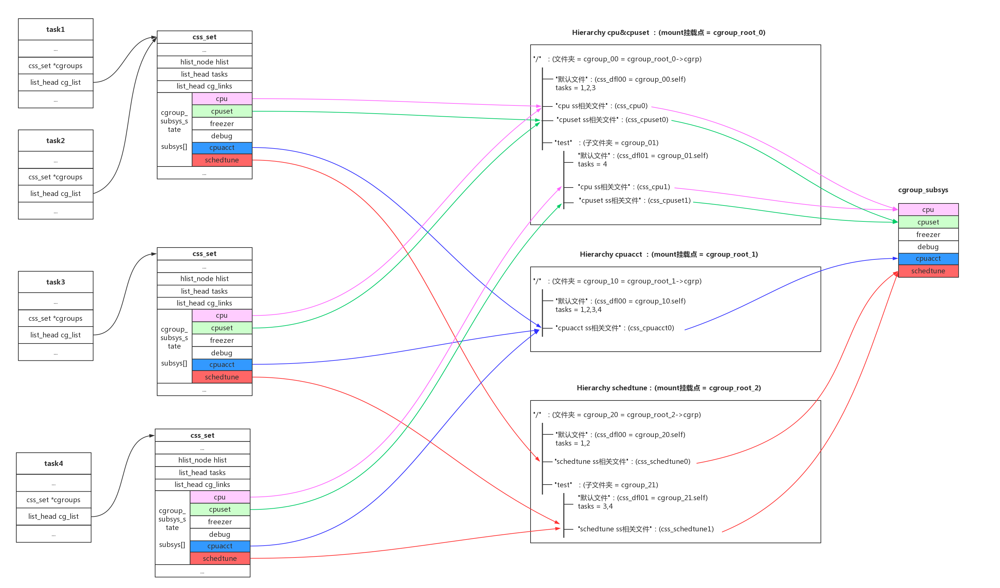


关于cgroup的结构有以下规则和规律：

- 1、cgroup有很多subsys，我们平时接触到的cpu、cpuset、cpuacct、memory、blkio都是cgroup_subsys；
- 2、一个cgroup hierarchy，就是使用mount命令挂载的一个cgroup文件系统，hierarchy对应mount的根cgroup_root；
- 3、一个hierarchy可以制定一个subsys，也可以制定多个subsys。可以是一个subsys，也可以是一个subsys组合；
- 4、一个subsys只能被一个hierarchy引用一次，如果subsys已经被hierarchy引用，新hierarchy创建时不能引用这个subsys；唯一例外的是，我们可以创建和旧的hierarchy相同的subsys组合，这其实没有创建新的hierarchy，只是简单的符号链接；
- 5、hierarchy对应一个文件系统，cgroup对应这个文件系统中的文件夹；subsys是基类，而css(cgroup_subsys_state)是cgroup引用subsys的实例；比如父目录和子目录分别是两个cgroup，他们都要引用相同的subsys，但是他们需要不同的配置，所以会创建不同的css供cgroup->subsys[]来引用；
- 6、一个任务对系统中不同的subsys一定会有引用，但是会引用到不同的hierarchy不同的cgroup即不同css当中；所以系统使用css_set结构来管理任务对css的引。如果任务引用的css组合相同，那他们开源使用相同的css_set；
- 7、还有cgroup到task的反向引用，系统引入了cg_group_link结构。这部分可以参考[Docker背后的内核知识——cgroups资源限制](http://www.infoq.com/cn/articles/docker-kernel-knowledge-cgroups-resource-isolation)一文的描述，如下图的结构关系：

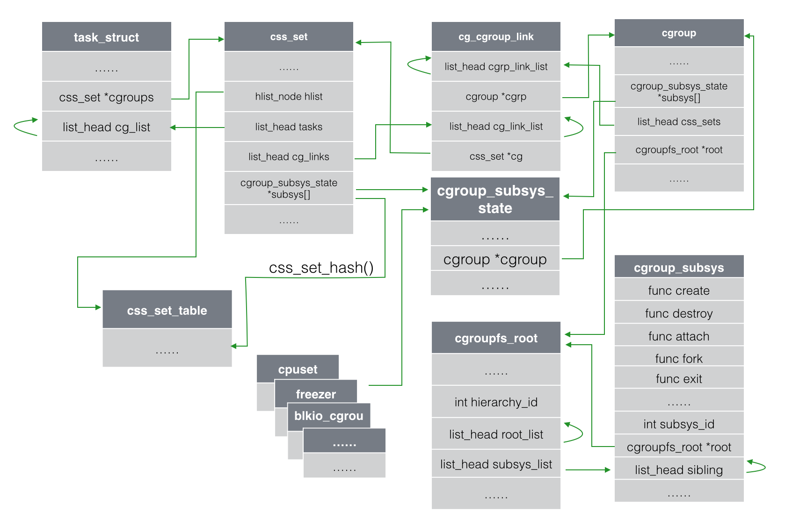


## 6.2、代码分析

1、"/proc/cgroups"

- subsys的链表：for_each_subsys(ss, i)
- 一个susbsys对应一个hierarchy：ss->root
- 一个hierarchy有多少个cgroup：ss->root->nr_cgrps

```
# ount -t cgroup -o freezer,debug bbb freezer_test/ 

# cat /proc/cgroups
#subsys_name    hierarchy       num_cgroups     enabled
cpuset  4       6       1
cpu     3       2       1
cpuacct 1       147     1
schedtune       2       3       1
freezer 6       1       1
debug   6       1       1


```

```
static int proc_cgroupstats_show(struct seq_file *m, void *v)
{
	struct cgroup_subsys *ss;
	int i;

	seq_puts(m, "#subsys_name\thierarchy\tnum_cgroups\tenabled\n");
	/*
	 * ideally we don't want subsystems moving around while we do this.
	 * cgroup_mutex is also necessary to guarantee an atomic snapshot of
	 * subsys/hierarchy state.
	 */
	mutex_lock(&cgroup_mutex);

	for_each_subsys(ss, i)
		seq_printf(m, "%s\t%d\t%d\t%d\n",
			   ss->legacy_name, ss->root->hierarchy_id,
			   atomic_read(&ss->root->nr_cgrps),
			   cgroup_ssid_enabled(i));

	mutex_unlock(&cgroup_mutex);
	return 0;
}
```

2、"/proc/pid/cgroup"

- 每种subsys组合组成一个新的hierarchy，每个hierarchy在for_each_root(root)中创建一个root树；
- 每个hierarchy顶层目录和子目录都是一个cgroup，一个hierarchy可以有多个cgroup，对应的subsys组合一样，但是参数不一样
- cgroup_root自带一个cgroup即root->cgrp，作为hierarchy的顶级目录
- 一个cgroup对应多个subsys，使用cgroup_subsys_state类型(css)的cgroup->subsys[CGROUP_SUBSYS_COUNT]数组去和多个subsys链接;
- 一个cgroup自带一个cgroup_subsys_state即cgrp->self，这个css的作用是css->parent指针，建立起cgroup之间的父子关系；
- css一个公用结构，每个subsys使用自己的函数ss->css_alloc()分配自己的css结构，这个结构包含公用css + subsys私有数据；
- 每个subsys只能存在于一个组合(hierarchy)当中，如果一个subsys已经被一个组合引用，其他组合不能再引用这个subsys。唯一例外的是，我们可以重复mount相同的组合，但是这样并没有创建新组合，只是创建了一个链接指向旧组合；
- 进程对应每一种hierarchy，一定有一个cgroup对应。


```
# cat /proc/832/cgroup
6:freezer,debug:/
4:cpuset:/
3:cpu:/
2:schedtune:/
1:cpuacct:/


```

```
int proc_cgroup_show(struct seq_file *m, struct pid_namespace *ns,
		     struct pid *pid, struct task_struct *tsk)
{
	char *buf, *path;
	int retval;
	struct cgroup_root *root;

	retval = -ENOMEM;
	buf = kmalloc(PATH_MAX, GFP_KERNEL);
	if (!buf)
		goto out;

	mutex_lock(&cgroup_mutex);
	spin_lock_bh(&css_set_lock);

	for_each_root(root) {
		struct cgroup_subsys *ss;
		struct cgroup *cgrp;
		int ssid, count = 0;

		if (root == &cgrp_dfl_root && !cgrp_dfl_root_visible)
			continue;

		seq_printf(m, "%d:", root->hierarchy_id);
		if (root != &cgrp_dfl_root)
			for_each_subsys(ss, ssid)
				if (root->subsys_mask & (1 << ssid))
					seq_printf(m, "%s%s", count++ ? "," : "",
						   ss->legacy_name);
		if (strlen(root->name))
			seq_printf(m, "%sname=%s", count ? "," : "",
				   root->name);
		seq_putc(m, ':');

		cgrp = task_cgroup_from_root(tsk, root);

		/*
		 * On traditional hierarchies, all zombie tasks show up as
		 * belonging to the root cgroup.  On the default hierarchy,
		 * while a zombie doesn't show up in "cgroup.procs" and
		 * thus can't be migrated, its /proc/PID/cgroup keeps
		 * reporting the cgroup it belonged to before exiting.  If
		 * the cgroup is removed before the zombie is reaped,
		 * " (deleted)" is appended to the cgroup path.
		 */
		if (cgroup_on_dfl(cgrp) || !(tsk->flags & PF_EXITING)) {
			path = cgroup_path(cgrp, buf, PATH_MAX);
			if (!path) {
				retval = -ENAMETOOLONG;
				goto out_unlock;
			}
		} else {
			path = "/";
		}

		seq_puts(m, path);

		if (cgroup_on_dfl(cgrp) && cgroup_is_dead(cgrp))
			seq_puts(m, " (deleted)\n");
		else
			seq_putc(m, '\n');
	}

	retval = 0;
out_unlock:
	spin_unlock_bh(&css_set_lock);
	mutex_unlock(&cgroup_mutex);
	kfree(buf);
out:
	return retval;
}
```

3、初始化

```
int __init cgroup_init_early(void)
{
	static struct cgroup_sb_opts __initdata opts;
	struct cgroup_subsys *ss;
	int i;

    /* (1) 初始化默认root cgrp_dfl_root，选项opts为空，初始了
        root->cgrp          // cgrp->root = root;
        root->cgrp.self     // cgrp->self.cgroup = cgrp; cgrp->self.flags |= CSS_ONLINE; 
     */
	init_cgroup_root(&cgrp_dfl_root, &opts);
	cgrp_dfl_root.cgrp.self.flags |= CSS_NO_REF;

	RCU_INIT_POINTER(init_task.cgroups, &init_css_set);

    /* (2) 轮询subsys进行初始化 */
	for_each_subsys(ss, i) {
		WARN(!ss->css_alloc || !ss->css_free || ss->name || ss->id,
		     "invalid cgroup_subsys %d:%s css_alloc=%p css_free=%p name:id=%d:%s\n",
		     i, cgroup_subsys_name[i], ss->css_alloc, ss->css_free,
		     ss->id, ss->name);
		WARN(strlen(cgroup_subsys_name[i]) > MAX_CGROUP_TYPE_NAMELEN,
		     "cgroup_subsys_name %s too long\n", cgroup_subsys_name[i]);

        /* (3) 初始化ss->id、ss->name */
		ss->id = i;
		ss->name = cgroup_subsys_name[i];
		if (!ss->legacy_name)
			ss->legacy_name = cgroup_subsys_name[i];

        /* (4) ss链接到默认root(cgrp_dfl_root)  
            默认css_set(init_css_set)指向ss
         */
		if (ss->early_init)
			cgroup_init_subsys(ss, true);
	}
	return 0;
}

|→

static void __init cgroup_init_subsys(struct cgroup_subsys *ss, bool early)
{
	struct cgroup_subsys_state *css;

	printk(KERN_INFO "Initializing cgroup subsys %s\n", ss->name);

	mutex_lock(&cgroup_mutex);

	idr_init(&ss->css_idr);
	INIT_LIST_HEAD(&ss->cfts);

	/* Create the root cgroup state for this subsystem */
	ss->root = &cgrp_dfl_root;
	
	/* (4.1) subsys分配一个新的相关的cgroup_subsys_state */
	css = ss->css_alloc(cgroup_css(&cgrp_dfl_root.cgrp, ss));
	/* We don't handle early failures gracefully */
	BUG_ON(IS_ERR(css));
	
	/* (4.2) 初始化css的成员指向cgroup 
	    cgroup为默认值cgrp_dfl_root.cgrp:
	    css->cgroup = cgrp;
	    css->ss = ss;
	    INIT_LIST_HEAD(&css->sibling);
	    INIT_LIST_HEAD(&css->children);
	 */
	init_and_link_css(css, ss, &cgrp_dfl_root.cgrp);

	/*
	 * Root csses are never destroyed and we can't initialize
	 * percpu_ref during early init.  Disable refcnting.
	 */
	css->flags |= CSS_NO_REF;

	if (early) {
		/* allocation can't be done safely during early init */
		css->id = 1;
	} else {
		css->id = cgroup_idr_alloc(&ss->css_idr, css, 1, 2, GFP_KERNEL);
		BUG_ON(css->id < 0);
	}

	/* Update the init_css_set to contain a subsys
	 * pointer to this state - since the subsystem is
	 * newly registered, all tasks and hence the
	 * init_css_set is in the subsystem's root cgroup. */
	/* (4.3) css_set指向新的css */
	init_css_set.subsys[ss->id] = css;

	have_fork_callback |= (bool)ss->fork << ss->id;
	have_exit_callback |= (bool)ss->exit << ss->id;
	have_free_callback |= (bool)ss->free << ss->id;
	have_canfork_callback |= (bool)ss->can_fork << ss->id;

	/* At system boot, before all subsystems have been
	 * registered, no tasks have been forked, so we don't
	 * need to invoke fork callbacks here. */
	BUG_ON(!list_empty(&init_task.tasks));
    
    /* (4.4) cgroup测指向css： 
        执行ss->css_online(css);
        css->cgroup->subsys[ss->id] = css;
     */
	BUG_ON(online_css(css));

	mutex_unlock(&cgroup_mutex);
}


int __init cgroup_init(void)
{
	struct cgroup_subsys *ss;
	int ssid;

	BUG_ON(percpu_init_rwsem(&cgroup_threadgroup_rwsem));
	BUG_ON(cgroup_init_cftypes(NULL, cgroup_dfl_base_files));
	BUG_ON(cgroup_init_cftypes(NULL, cgroup_legacy_base_files));

	/*
	 * The latency of the synchronize_sched() is too high for cgroups,
	 * avoid it at the cost of forcing all readers into the slow path.
	 */
	rcu_sync_enter_start(&cgroup_threadgroup_rwsem.rss);

	mutex_lock(&cgroup_mutex);

	/*
	 * Add init_css_set to the hash table so that dfl_root can link to
	 * it during init.
	 */
	hash_add(css_set_table, &init_css_set.hlist,
		 css_set_hash(init_css_set.subsys));

	BUG_ON(cgroup_setup_root(&cgrp_dfl_root, 0));

	mutex_unlock(&cgroup_mutex);

	for_each_subsys(ss, ssid) {
		if (ss->early_init) {
			struct cgroup_subsys_state *css =
				init_css_set.subsys[ss->id];

			css->id = cgroup_idr_alloc(&ss->css_idr, css, 1, 2,
						   GFP_KERNEL);
			BUG_ON(css->id < 0);
		} else {
			cgroup_init_subsys(ss, false);
		}

		list_add_tail(&init_css_set.e_cset_node[ssid],
			      &cgrp_dfl_root.cgrp.e_csets[ssid]);

		/*
		 * Setting dfl_root subsys_mask needs to consider the
		 * disabled flag and cftype registration needs kmalloc,
		 * both of which aren't available during early_init.
		 */
		if (cgroup_disable_mask & (1 << ssid)) {
			static_branch_disable(cgroup_subsys_enabled_key[ssid]);
			printk(KERN_INFO "Disabling %s control group subsystem\n",
			       ss->name);
			continue;
		}

        /* (1) 默认root(cgrp_dfl_root)，支持所有ss */
		cgrp_dfl_root.subsys_mask |= 1 << ss->id;

		if (!ss->dfl_cftypes)
			cgrp_dfl_root_inhibit_ss_mask |= 1 << ss->id;

        /* (2) 将cftypes(ss->legacy_cftypes/ss->legacy_cftypes)加入到ss->cfts链表 */
		if (ss->dfl_cftypes == ss->legacy_cftypes) {
			WARN_ON(cgroup_add_cftypes(ss, ss->dfl_cftypes));
		} else {
			WARN_ON(cgroup_add_dfl_cftypes(ss, ss->dfl_cftypes));
			WARN_ON(cgroup_add_legacy_cftypes(ss, ss->legacy_cftypes));
		}

		if (ss->bind)
			ss->bind(init_css_set.subsys[ssid]);
	}

	/* init_css_set.subsys[] has been updated, re-hash */
	hash_del(&init_css_set.hlist);
	hash_add(css_set_table, &init_css_set.hlist,
		 css_set_hash(init_css_set.subsys));

	WARN_ON(sysfs_create_mount_point(fs_kobj, "cgroup"));
	WARN_ON(register_filesystem(&cgroup_fs_type));
	WARN_ON(!proc_create("cgroups", 0, NULL, &proc_cgroupstats_operations));

	return 0;
}
```

4、mount操作

创建新的root，因为ss默认都和默认root(cgrp_dfl_root)建立了关系，所以ss需要先解除旧的root链接，再和新root建立起链接。

```
static struct dentry *cgroup_mount(struct file_system_type *fs_type,
			 int flags, const char *unused_dev_name,
			 void *data)
{
	struct super_block *pinned_sb = NULL;
	struct cgroup_subsys *ss;
	struct cgroup_root *root;
	struct cgroup_sb_opts opts;
	struct dentry *dentry;
	int ret;
	int i;
	bool new_sb;

	/*
	 * The first time anyone tries to mount a cgroup, enable the list
	 * linking each css_set to its tasks and fix up all existing tasks.
	 */
	if (!use_task_css_set_links)
		cgroup_enable_task_cg_lists();

	mutex_lock(&cgroup_mutex);

	/* First find the desired set of subsystems */
	/* (1) 解析mount选项到opts */
	ret = parse_cgroupfs_options(data, &opts);
	if (ret)
		goto out_unlock;

	/* look for a matching existing root */
	if (opts.flags & CGRP_ROOT_SANE_BEHAVIOR) {
		cgrp_dfl_root_visible = true;
		root = &cgrp_dfl_root;
		cgroup_get(&root->cgrp);
		ret = 0;
		goto out_unlock;
	}

	/*
	 * Destruction of cgroup root is asynchronous, so subsystems may
	 * still be dying after the previous unmount.  Let's drain the
	 * dying subsystems.  We just need to ensure that the ones
	 * unmounted previously finish dying and don't care about new ones
	 * starting.  Testing ref liveliness is good enough.
	 */
	/* (2) */
	for_each_subsys(ss, i) {
		if (!(opts.subsys_mask & (1 << i)) ||
		    ss->root == &cgrp_dfl_root)
			continue;

		if (!percpu_ref_tryget_live(&ss->root->cgrp.self.refcnt)) {
			mutex_unlock(&cgroup_mutex);
			msleep(10);
			ret = restart_syscall();
			goto out_free;
		}
		cgroup_put(&ss->root->cgrp);
	}

    /* (3) */
	for_each_root(root) {
		bool name_match = false;

		if (root == &cgrp_dfl_root)
			continue;

		/*
		 * If we asked for a name then it must match.  Also, if
		 * name matches but sybsys_mask doesn't, we should fail.
		 * Remember whether name matched.
		 */
		if (opts.name) {
			if (strcmp(opts.name, root->name))
				continue;
			name_match = true;
		}

		/*
		 * If we asked for subsystems (or explicitly for no
		 * subsystems) then they must match.
		 */
		if ((opts.subsys_mask || opts.none) &&
		    (opts.subsys_mask != root->subsys_mask)) {
			if (!name_match)
				continue;
			ret = -EBUSY;
			goto out_unlock;
		}

		if (root->flags ^ opts.flags)
			pr_warn("new mount options do not match the existing superblock, will be ignored\n");

		/*
		 * We want to reuse @root whose lifetime is governed by its
		 * ->cgrp.  Let's check whether @root is alive and keep it
		 * that way.  As cgroup_kill_sb() can happen anytime, we
		 * want to block it by pinning the sb so that @root doesn't
		 * get killed before mount is complete.
		 *
		 * With the sb pinned, tryget_live can reliably indicate
		 * whether @root can be reused.  If it's being killed,
		 * drain it.  We can use wait_queue for the wait but this
		 * path is super cold.  Let's just sleep a bit and retry.
		 */
		pinned_sb = kernfs_pin_sb(root->kf_root, NULL);
		if (IS_ERR(pinned_sb) ||
		    !percpu_ref_tryget_live(&root->cgrp.self.refcnt)) {
			mutex_unlock(&cgroup_mutex);
			if (!IS_ERR_OR_NULL(pinned_sb))
				deactivate_super(pinned_sb);
			msleep(10);
			ret = restart_syscall();
			goto out_free;
		}

		ret = 0;
		goto out_unlock;
	}

	/*
	 * No such thing, create a new one.  name= matching without subsys
	 * specification is allowed for already existing hierarchies but we
	 * can't create new one without subsys specification.
	 */
	if (!opts.subsys_mask && !opts.none) {
		ret = -EINVAL;
		goto out_unlock;
	}

    /* (4) 分配新的root */
	root = kzalloc(sizeof(*root), GFP_KERNEL);
	if (!root) {
		ret = -ENOMEM;
		goto out_unlock;
	}

     /* (5) 初始化新的root，初始了
        root->cgrp          // cgrp->root = root;
        root->cgrp.self     // cgrp->self.cgroup = cgrp; cgrp->self.flags |= CSS_ONLINE; 
        root->name = opts->name
     */
	init_cgroup_root(root, &opts);

    /* (6) 将新的root和opts.subsys_mask指向的多个ss进行链接 */
	ret = cgroup_setup_root(root, opts.subsys_mask);
	if (ret)
		cgroup_free_root(root);

out_unlock:
	mutex_unlock(&cgroup_mutex);
out_free:
	kfree(opts.release_agent);
	kfree(opts.name);

	if (ret)
		return ERR_PTR(ret);

    /* (7) mount新root对应的根目录 */
	dentry = kernfs_mount(fs_type, flags, root->kf_root,
				CGROUP_SUPER_MAGIC, &new_sb);
	if (IS_ERR(dentry) || !new_sb)
		cgroup_put(&root->cgrp);

	/*
	 * If @pinned_sb, we're reusing an existing root and holding an
	 * extra ref on its sb.  Mount is complete.  Put the extra ref.
	 */
	if (pinned_sb) {
		WARN_ON(new_sb);
		deactivate_super(pinned_sb);
	}

	return dentry;
}

|→

static int cgroup_setup_root(struct cgroup_root *root, unsigned long ss_mask)
{
	LIST_HEAD(tmp_links);
	struct cgroup *root_cgrp = &root->cgrp;
	struct css_set *cset;
	int i, ret;

	lockdep_assert_held(&cgroup_mutex);

	ret = cgroup_idr_alloc(&root->cgroup_idr, root_cgrp, 1, 2, GFP_KERNEL);
	if (ret < 0)
		goto out;
	root_cgrp->id = ret;

	ret = percpu_ref_init(&root_cgrp->self.refcnt, css_release, 0,
			      GFP_KERNEL);
	if (ret)
		goto out;

	/*
	 * We're accessing css_set_count without locking css_set_lock here,
	 * but that's OK - it can only be increased by someone holding
	 * cgroup_lock, and that's us. The worst that can happen is that we
	 * have some link structures left over
	 */
	ret = allocate_cgrp_cset_links(css_set_count, &tmp_links);
	if (ret)
		goto cancel_ref;

	ret = cgroup_init_root_id(root);
	if (ret)
		goto cancel_ref;

    /* (6.1) 创建root对应的顶层root文件夹 */
	root->kf_root = kernfs_create_root(&cgroup_kf_syscall_ops,
					   KERNFS_ROOT_CREATE_DEACTIVATED,
					   root_cgrp);
	if (IS_ERR(root->kf_root)) {
		ret = PTR_ERR(root->kf_root);
		goto exit_root_id;
	}
	root_cgrp->kn = root->kf_root->kn;

    /* (6.2) 创建cgroup自己对应的一些file，cgroup自己的file由cgroup自己的css(cgrp->self)承担，
        后面cgroup会依次创建每个subsys的file，subsys的file由每个ss对应的css(cgrp->subsys[])承担
     */
	ret = css_populate_dir(&root_cgrp->self, NULL);
	if (ret)
		goto destroy_root;

    /* (6.3) 将新root需要的subsys和原默认root(cgrp_dfl_root)解除关系，
        并且把这些ss重新和新root建立关系
     */
	ret = rebind_subsystems(root, ss_mask);
	if (ret)
		goto destroy_root;

	/*
	 * There must be no failure case after here, since rebinding takes
	 * care of subsystems' refcounts, which are explicitly dropped in
	 * the failure exit path.
	 */
	list_add(&root->root_list, &cgroup_roots);
	cgroup_root_count++;

	/*
	 * Link the root cgroup in this hierarchy into all the css_set
	 * objects.
	 */
	spin_lock_bh(&css_set_lock);
	hash_for_each(css_set_table, i, cset, hlist) {
		link_css_set(&tmp_links, cset, root_cgrp);
		if (css_set_populated(cset))
			cgroup_update_populated(root_cgrp, true);
	}
	spin_unlock_bh(&css_set_lock);

	BUG_ON(!list_empty(&root_cgrp->self.children));
	BUG_ON(atomic_read(&root->nr_cgrps) != 1);

	kernfs_activate(root_cgrp->kn);
	ret = 0;
	goto out;

destroy_root:
	kernfs_destroy_root(root->kf_root);
	root->kf_root = NULL;
exit_root_id:
	cgroup_exit_root_id(root);
cancel_ref:
	percpu_ref_exit(&root_cgrp->self.refcnt);
out:
	free_cgrp_cset_links(&tmp_links);
	return ret;
}

||→

static int rebind_subsystems(struct cgroup_root *dst_root,
			     unsigned long ss_mask)
{
	struct cgroup *dcgrp = &dst_root->cgrp;
	struct cgroup_subsys *ss;
	unsigned long tmp_ss_mask;
	int ssid, i, ret;

	lockdep_assert_held(&cgroup_mutex);

	for_each_subsys_which(ss, ssid, &ss_mask) {
		/* if @ss has non-root csses attached to it, can't move */
		if (css_next_child(NULL, cgroup_css(&ss->root->cgrp, ss)))
			return -EBUSY;

		/* can't move between two non-dummy roots either */
		if (ss->root != &cgrp_dfl_root && dst_root != &cgrp_dfl_root)
			return -EBUSY;
	}

	/* skip creating root files on dfl_root for inhibited subsystems */
	tmp_ss_mask = ss_mask;
	if (dst_root == &cgrp_dfl_root)
		tmp_ss_mask &= ~cgrp_dfl_root_inhibit_ss_mask;

	for_each_subsys_which(ss, ssid, &tmp_ss_mask) {
		struct cgroup *scgrp = &ss->root->cgrp;
		int tssid;

        /* (6.3.1) 在新root的根cgroup(dst_root->cgrp)下，
            根据subsys的file链表(css->ss->cfts)创建subsys对应的file 
        */
		ret = css_populate_dir(cgroup_css(scgrp, ss), dcgrp);
		if (!ret)
			continue;

		/*
		 * Rebinding back to the default root is not allowed to
		 * fail.  Using both default and non-default roots should
		 * be rare.  Moving subsystems back and forth even more so.
		 * Just warn about it and continue.
		 */
		if (dst_root == &cgrp_dfl_root) {
			if (cgrp_dfl_root_visible) {
				pr_warn("failed to create files (%d) while rebinding 0x%lx to default root\n",
					ret, ss_mask);
				pr_warn("you may retry by moving them to a different hierarchy and unbinding\n");
			}
			continue;
		}

		for_each_subsys_which(ss, tssid, &tmp_ss_mask) {
			if (tssid == ssid)
				break;
			css_clear_dir(cgroup_css(scgrp, ss), dcgrp);
		}
		return ret;
	}

	/*
	 * Nothing can fail from this point on.  Remove files for the
	 * removed subsystems and rebind each subsystem.
	 */
	for_each_subsys_which(ss, ssid, &ss_mask) {
		struct cgroup_root *src_root = ss->root;
		struct cgroup *scgrp = &src_root->cgrp;
		struct cgroup_subsys_state *css = cgroup_css(scgrp, ss);
		struct css_set *cset;

		WARN_ON(!css || cgroup_css(dcgrp, ss));

		css_clear_dir(css, NULL);

        /* (6.3.2) 取消原root cgroup对subsys的css的引用 */
		RCU_INIT_POINTER(scgrp->subsys[ssid], NULL);
		
		/* (6.3.3) 链接新root cgroup和subsys的css的引用 */
		rcu_assign_pointer(dcgrp->subsys[ssid], css);
		ss->root = dst_root;
		css->cgroup = dcgrp;

		spin_lock_bh(&css_set_lock);
		hash_for_each(css_set_table, i, cset, hlist)
			list_move_tail(&cset->e_cset_node[ss->id],
				       &dcgrp->e_csets[ss->id]);
		spin_unlock_bh(&css_set_lock);

		src_root->subsys_mask &= ~(1 << ssid);
		scgrp->subtree_control &= ~(1 << ssid);
		cgroup_refresh_child_subsys_mask(scgrp);

		/* default hierarchy doesn't enable controllers by default */
		dst_root->subsys_mask |= 1 << ssid;
		if (dst_root == &cgrp_dfl_root) {
			static_branch_enable(cgroup_subsys_on_dfl_key[ssid]);
		} else {
			dcgrp->subtree_control |= 1 << ssid;
			cgroup_refresh_child_subsys_mask(dcgrp);
			static_branch_disable(cgroup_subsys_on_dfl_key[ssid]);
		}

		if (ss->bind)
			ss->bind(css);
	}

	kernfs_activate(dcgrp->kn);
	return 0;
}

```


5、文件操作

创建一个新文件夹，相当于创建一个新的cgroup。我们重点来看看新建文件夹的操作：

```
static struct kernfs_syscall_ops cgroup_kf_syscall_ops = {
	.remount_fs		= cgroup_remount,
	.show_options		= cgroup_show_options,
	.mkdir			= cgroup_mkdir,
	.rmdir			= cgroup_rmdir,
	.rename			= cgroup_rename,
};

static int cgroup_mkdir(struct kernfs_node *parent_kn, const char *name,
			umode_t mode)
{
	struct cgroup *parent, *cgrp;
	struct cgroup_root *root;
	struct cgroup_subsys *ss;
	struct kernfs_node *kn;
	int ssid, ret;

	/* Do not accept '\n' to prevent making /proc/<pid>/cgroup unparsable.
	 */
	if (strchr(name, '\n'))
		return -EINVAL;

	parent = cgroup_kn_lock_live(parent_kn);
	if (!parent)
		return -ENODEV;
	root = parent->root;

	/* allocate the cgroup and its ID, 0 is reserved for the root */
	/* (1) 分配新的cgroup */
	cgrp = kzalloc(sizeof(*cgrp), GFP_KERNEL);
	if (!cgrp) {
		ret = -ENOMEM;
		goto out_unlock;
	}

	ret = percpu_ref_init(&cgrp->self.refcnt, css_release, 0, GFP_KERNEL);
	if (ret)
		goto out_free_cgrp;

	/*
	 * Temporarily set the pointer to NULL, so idr_find() won't return
	 * a half-baked cgroup.
	 */
	cgrp->id = cgroup_idr_alloc(&root->cgroup_idr, NULL, 2, 0, GFP_KERNEL);
	if (cgrp->id < 0) {
		ret = -ENOMEM;
		goto out_cancel_ref;
	}

    /* (2) 初始化cgroup */
	init_cgroup_housekeeping(cgrp);

    /* (3) 和父cgroup之间建立起关系 */
	cgrp->self.parent = &parent->self;
	cgrp->root = root;

	if (notify_on_release(parent))
		set_bit(CGRP_NOTIFY_ON_RELEASE, &cgrp->flags);

	if (test_bit(CGRP_CPUSET_CLONE_CHILDREN, &parent->flags))
		set_bit(CGRP_CPUSET_CLONE_CHILDREN, &cgrp->flags);

	/* create the directory */
	/* (3) 创建新的cgroup对应的文件夹 */
	kn = kernfs_create_dir(parent->kn, name, mode, cgrp);
	if (IS_ERR(kn)) {
		ret = PTR_ERR(kn);
		goto out_free_id;
	}
	cgrp->kn = kn;

	/*
	 * This extra ref will be put in cgroup_free_fn() and guarantees
	 * that @cgrp->kn is always accessible.
	 */
	kernfs_get(kn);

	cgrp->self.serial_nr = css_serial_nr_next++;

	/* allocation complete, commit to creation */
	list_add_tail_rcu(&cgrp->self.sibling, &cgroup_parent(cgrp)->self.children);
	atomic_inc(&root->nr_cgrps);
	cgroup_get(parent);

	/*
	 * @cgrp is now fully operational.  If something fails after this
	 * point, it'll be released via the normal destruction path.
	 */
	cgroup_idr_replace(&root->cgroup_idr, cgrp, cgrp->id);

	ret = cgroup_kn_set_ugid(kn);
	if (ret)
		goto out_destroy;

    /* (4) 新cgroup文件夹下创建cgroup自己css对应的默认file */
	ret = css_populate_dir(&cgrp->self, NULL);
	if (ret)
		goto out_destroy;

	/* let's create and online css's */
	/* (5) 针对root对应的各个susbsys， 每个subsys创建新的css
	    并且在cgroup文件夹下创建css对应的file
	*/
	for_each_subsys(ss, ssid) {
		if (parent->child_subsys_mask & (1 << ssid)) {
			ret = create_css(cgrp, ss,
					 parent->subtree_control & (1 << ssid));
			if (ret)
				goto out_destroy;
		}
	}

	/*
	 * On the default hierarchy, a child doesn't automatically inherit
	 * subtree_control from the parent.  Each is configured manually.
	 */
	if (!cgroup_on_dfl(cgrp)) {
		cgrp->subtree_control = parent->subtree_control;
		cgroup_refresh_child_subsys_mask(cgrp);
	}

	kernfs_activate(kn);

	ret = 0;
	goto out_unlock;

out_free_id:
	cgroup_idr_remove(&root->cgroup_idr, cgrp->id);
out_cancel_ref:
	percpu_ref_exit(&cgrp->self.refcnt);
out_free_cgrp:
	kfree(cgrp);
out_unlock:
	cgroup_kn_unlock(parent_kn);
	return ret;

out_destroy:
	cgroup_destroy_locked(cgrp);
	goto out_unlock;
}
```

cgroup默认文件，有一些重要的文件比如“tasks”，我们来看看具体的操作。

```
static struct cftype cgroup_legacy_base_files[] = {
	{
		.name = "cgroup.procs",
		.seq_start = cgroup_pidlist_start,
		.seq_next = cgroup_pidlist_next,
		.seq_stop = cgroup_pidlist_stop,
		.seq_show = cgroup_pidlist_show,
		.private = CGROUP_FILE_PROCS,
		.write = cgroup_procs_write,
	},
	{
		.name = "cgroup.clone_children",
		.read_u64 = cgroup_clone_children_read,
		.write_u64 = cgroup_clone_children_write,
	},
	{
		.name = "cgroup.sane_behavior",
		.flags = CFTYPE_ONLY_ON_ROOT,
		.seq_show = cgroup_sane_behavior_show,
	},
	{
		.name = "tasks",
		.seq_start = cgroup_pidlist_start,
		.seq_next = cgroup_pidlist_next,
		.seq_stop = cgroup_pidlist_stop,
		.seq_show = cgroup_pidlist_show,
		.private = CGROUP_FILE_TASKS,
		.write = cgroup_tasks_write,
	},
	{
		.name = "notify_on_release",
		.read_u64 = cgroup_read_notify_on_release,
		.write_u64 = cgroup_write_notify_on_release,
	},
	{
		.name = "release_agent",
		.flags = CFTYPE_ONLY_ON_ROOT,
		.seq_show = cgroup_release_agent_show,
		.write = cgroup_release_agent_write,
		.max_write_len = PATH_MAX - 1,
	},
	{ }	/* terminate */
}

static ssize_t cgroup_tasks_write(struct kernfs_open_file *of,
				  char *buf, size_t nbytes, loff_t off)
{
	return __cgroup_procs_write(of, buf, nbytes, off, false);
}

|→

static ssize_t __cgroup_procs_write(struct kernfs_open_file *of, char *buf,
				    size_t nbytes, loff_t off, bool threadgroup)
{
	struct task_struct *tsk;
	struct cgroup_subsys *ss;
	struct cgroup *cgrp;
	pid_t pid;
	int ssid, ret;

	if (kstrtoint(strstrip(buf), 0, &pid) || pid < 0)
		return -EINVAL;

	cgrp = cgroup_kn_lock_live(of->kn);
	if (!cgrp)
		return -ENODEV;

	percpu_down_write(&cgroup_threadgroup_rwsem);
	rcu_read_lock();
	if (pid) {
		tsk = find_task_by_vpid(pid);
		if (!tsk) {
			ret = -ESRCH;
			goto out_unlock_rcu;
		}
	} else {
		tsk = current;
	}

	if (threadgroup)
		tsk = tsk->group_leader;

	/*
	 * Workqueue threads may acquire PF_NO_SETAFFINITY and become
	 * trapped in a cpuset, or RT worker may be born in a cgroup
	 * with no rt_runtime allocated.  Just say no.
	 */
	if (tsk == kthreadd_task || (tsk->flags & PF_NO_SETAFFINITY)) {
		ret = -EINVAL;
		goto out_unlock_rcu;
	}

	get_task_struct(tsk);
	rcu_read_unlock();

	ret = cgroup_procs_write_permission(tsk, cgrp, of);
	if (!ret) {
	    /* (1) attach task到cgroup */
		ret = cgroup_attach_task(cgrp, tsk, threadgroup);
#if defined(CONFIG_CPUSETS) && !defined(CONFIG_MTK_ACAO)
		if (cgrp->id != SS_TOP_GROUP_ID && cgrp->child_subsys_mask == CSS_CPUSET_MASK
		&& excl_task_count > 0) {
			remove_set_exclusive_task(tsk->pid, 0);
		}
#endif
	}
	put_task_struct(tsk);
	goto out_unlock_threadgroup;

out_unlock_rcu:
	rcu_read_unlock();
out_unlock_threadgroup:
	percpu_up_write(&cgroup_threadgroup_rwsem);
	for_each_subsys(ss, ssid)
		if (ss->post_attach)
			ss->post_attach();
	cgroup_kn_unlock(of->kn);
	return ret ?: nbytes;
}

||→

static int cgroup_attach_task(struct cgroup *dst_cgrp,
			      struct task_struct *leader, bool threadgroup)
{
	LIST_HEAD(preloaded_csets);
	struct task_struct *task;
	int ret;

	/* look up all src csets */
	spin_lock_bh(&css_set_lock);
	rcu_read_lock();
	task = leader;
	
	/* (1.1) 遍历task所在线程组，把需要迁移的进程的css_set加入到preloaded_csets链表 */
	do {
		cgroup_migrate_add_src(task_css_set(task), dst_cgrp,
				       &preloaded_csets);
		if (!threadgroup)
			break;
	} while_each_thread(leader, task);
	rcu_read_unlock();
	spin_unlock_bh(&css_set_lock);

    /* (1.2) 去掉旧的css_set对css的应用, 
        分配新的css_set承担新的css组合的应用，并且给进程使用
     */
	/* prepare dst csets and commit */
	ret = cgroup_migrate_prepare_dst(dst_cgrp, &preloaded_csets);
	if (!ret)
		ret = cgroup_migrate(leader, threadgroup, dst_cgrp);

	cgroup_migrate_finish(&preloaded_csets);
	return ret;
}

```


## 6.3、cgroup subsystem

我们关注cgroup子系统具体能提供的功能。

### 6.3.1、cpu

kernel/sched/core.c。会创建新的task_group，可以对cgroup对应的task_group进行cfs/rt类型的带宽控制。

```
static struct cftype cpu_files[] = {
#ifdef CONFIG_FAIR_GROUP_SCHED
	{
		.name = "shares",
		.read_u64 = cpu_shares_read_u64,
		.write_u64 = cpu_shares_write_u64,
	},
#endif
#ifdef CONFIG_CFS_BANDWIDTH     // cfs 带宽控制
	{
		.name = "cfs_quota_us",
		.read_s64 = cpu_cfs_quota_read_s64,
		.write_s64 = cpu_cfs_quota_write_s64,
	},
	{
		.name = "cfs_period_us",
		.read_u64 = cpu_cfs_period_read_u64,
		.write_u64 = cpu_cfs_period_write_u64,
	},
	{
		.name = "stat",
		.seq_show = cpu_stats_show,
	},
#endif
#ifdef CONFIG_RT_GROUP_SCHED    // rt 带宽控制
	{
		.name = "rt_runtime_us",
		.read_s64 = cpu_rt_runtime_read,
		.write_s64 = cpu_rt_runtime_write,
	},
	{
		.name = "rt_period_us",
		.read_u64 = cpu_rt_period_read_uint,
		.write_u64 = cpu_rt_period_write_uint,
	},
#endif
	{ }	/* terminate */
};

struct cgroup_subsys cpu_cgrp_subsys = {
	.css_alloc	= cpu_cgroup_css_alloc,         // 分配新的task_group
	.css_released	= cpu_cgroup_css_released,
	.css_free	= cpu_cgroup_css_free,
	.fork		= cpu_cgroup_fork,
	.can_attach	= cpu_cgroup_can_attach,
	.attach		= cpu_cgroup_attach,
	.legacy_cftypes	= cpu_files,
	.early_init	= 1,
};
```

### 6.3.2、cpuset

kernel/cpusec.c。给cgroup分配不同的cpu和mem node节点，还可以配置一些flag。

```
static struct cftype files[] = {
	{
		.name = "cpus",
		.seq_show = cpuset_common_seq_show,
		.write = cpuset_write_resmask,
		.max_write_len = (100U + 6 * NR_CPUS),
		.private = FILE_CPULIST,
	},

	{
		.name = "mems",
		.seq_show = cpuset_common_seq_show,
		.write = cpuset_write_resmask,
		.max_write_len = (100U + 6 * MAX_NUMNODES),
		.private = FILE_MEMLIST,
	},

	{
		.name = "effective_cpus",
		.seq_show = cpuset_common_seq_show,
		.private = FILE_EFFECTIVE_CPULIST,
	},

	{
		.name = "effective_mems",
		.seq_show = cpuset_common_seq_show,
		.private = FILE_EFFECTIVE_MEMLIST,
	},

	{
		.name = "cpu_exclusive",
		.read_u64 = cpuset_read_u64,
		.write_u64 = cpuset_write_u64,
		.private = FILE_CPU_EXCLUSIVE,
	},

	{
		.name = "mem_exclusive",
		.read_u64 = cpuset_read_u64,
		.write_u64 = cpuset_write_u64,
		.private = FILE_MEM_EXCLUSIVE,
	},

	{
		.name = "mem_hardwall",
		.read_u64 = cpuset_read_u64,
		.write_u64 = cpuset_write_u64,
		.private = FILE_MEM_HARDWALL,
	},

	{
		.name = "sched_load_balance",
		.read_u64 = cpuset_read_u64,
		.write_u64 = cpuset_write_u64,
		.private = FILE_SCHED_LOAD_BALANCE,
	},

	{
		.name = "sched_relax_domain_level",
		.read_s64 = cpuset_read_s64,
		.write_s64 = cpuset_write_s64,
		.private = FILE_SCHED_RELAX_DOMAIN_LEVEL,
	},

	{
		.name = "memory_migrate",
		.read_u64 = cpuset_read_u64,
		.write_u64 = cpuset_write_u64,
		.private = FILE_MEMORY_MIGRATE,
	},

	{
		.name = "memory_pressure",
		.read_u64 = cpuset_read_u64,
	},

	{
		.name = "memory_spread_page",
		.read_u64 = cpuset_read_u64,
		.write_u64 = cpuset_write_u64,
		.private = FILE_SPREAD_PAGE,
	},

	{
		.name = "memory_spread_slab",
		.read_u64 = cpuset_read_u64,
		.write_u64 = cpuset_write_u64,
		.private = FILE_SPREAD_SLAB,
	},

	{
		.name = "memory_pressure_enabled",
		.flags = CFTYPE_ONLY_ON_ROOT,
		.read_u64 = cpuset_read_u64,
		.write_u64 = cpuset_write_u64,
		.private = FILE_MEMORY_PRESSURE_ENABLED,
	},

	{ }	/* terminate */
}

struct cgroup_subsys cpuset_cgrp_subsys = {
	.css_alloc	= cpuset_css_alloc,
	.css_online	= cpuset_css_online,
	.css_offline	= cpuset_css_offline,
	.css_free	= cpuset_css_free,
	.can_attach	= cpuset_can_attach,
	.cancel_attach	= cpuset_cancel_attach,
	.attach		= cpuset_attach,
	.post_attach	= cpuset_post_attach,
	.bind		= cpuset_bind,
	.fork		= cpuset_fork,
	.legacy_cftypes	= files,
	.early_init	= 1,
};

```


### 6.3.3、schedtune

kernel/sched/tune.c，可以进行schedle boost操作。

```
static struct cftype files[] = {
	{
		.name = "boost",
		.read_u64 = boost_read,
		.write_u64 = boost_write,
	},
	{
		.name = "prefer_idle",
		.read_u64 = prefer_idle_read,
		.write_u64 = prefer_idle_write,
	},
	{ }	/* terminate */
};

struct cgroup_subsys schedtune_cgrp_subsys = {
	.css_alloc	= schedtune_css_alloc,
	.css_free	= schedtune_css_free,
	.legacy_cftypes	= files,
	.early_init	= 1,
};

```

### 6.3.4、cpuacct

kernel/sched/cpuacct.c，可以按照cgroup的分组来统计cpu占用率。

```
static struct cftype files[] = {
	{
		.name = "usage",
		.read_u64 = cpuusage_read,
		.write_u64 = cpuusage_write,
	},
	{
		.name = "usage_percpu",
		.seq_show = cpuacct_percpu_seq_show,
	},
	{
		.name = "stat",
		.seq_show = cpuacct_stats_show,
	},
	{ }	/* terminate */
};

struct cgroup_subsys cpuacct_cgrp_subsys = {
	.css_alloc	= cpuacct_css_alloc,
	.css_free	= cpuacct_css_free,
	.legacy_cftypes	= files,
	.early_init	= 1,
};

```


# 参考资料

1、[linux 2.6 O(1)调度算法](http://blog.csdn.net/zhoudaxia/article/details/7375668)

2、[linux cfs调度器_理论模型](http://www.cnblogs.com/openix/p/3254394.html)

3、[linux cfs调度框图](http://blog.chinaunix.net/uid-27052262-id-3239260.html)

4、[linux cfs之特殊时刻vruntime的计算](http://linuxperf.com/?p=42)

5、[entity级负载的计算](http://blog.csdn.net/helloanthea/article/details/30081627)

6、[cpu级负载的计算update_cpu_load](http://blog.csdn.net/justlinux2010/article/details/17580583?utm_source=tuicool&utm_medium=referral)

7、[系统级负载的计算:Linux Load Averages: Solving the Mystery](http://www.brendangregg.com/blog/2017-08-08/linux-load-averages.html)

8、[系统级负载的计算:UNIX Load Average](https://www.teamquest.com/import/pdfs/whitepaper/ldavg1.pdf)

9、[Linux Scheduling Domains](https://www.ibm.com/developerworks/cn/linux/l-cn-schldom/)

10、[MTK文档：CPU Utilization-scheduler(V1.1)]

10、[Docker背后的内核知识——cgroups资源限制](http://www.infoq.com/cn/articles/docker-kernel-knowledge-cgroups-resource-isolation)


