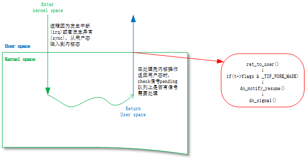
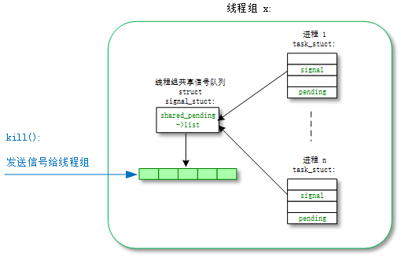
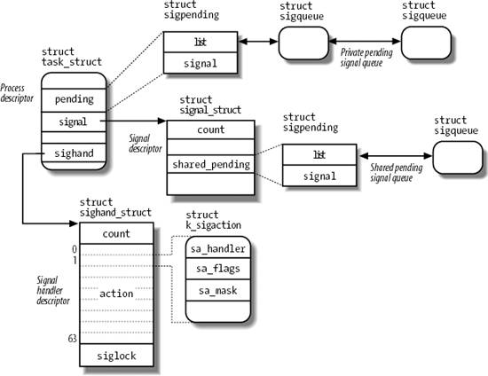
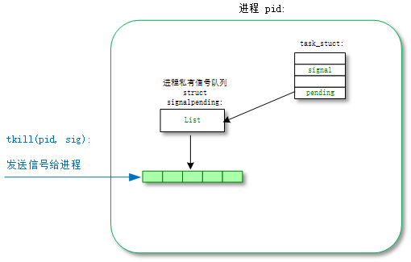
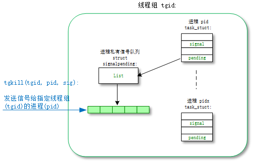
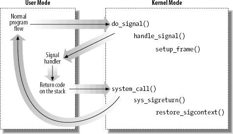

信号的基本使用场景：使用“ctrl+c”中止一个程序，或者使用"kill pid"命令杀掉一个进程。  
Linux信号机制基本上每个同学都用过，但是信号的具体实现机制还是有很多人不清楚的。在很多人的概念中信号是一种异步机制，像中断一样。但是除了硬中断，信号也是由中断实现的吗？如果不是中断，系统又怎么样来利用软件机制模拟类似如异步中断的动作？  

> 本文的代码分析基于linux kernel 3.18.22，最好的学习方法还是"read the fucking source code"


# 1.信号的响应时机

理解信号异步机制的关键是信号的响应时机，我们对一个进程发送一个信号以后，其实并没有硬中断发生，只是简单把信号挂载到目标进程的信号pending队列上去，信号真正得到执行的时机是进程执行完异常/中断返回到用户态的时刻。  
让信号看起来是一个异步中断的关键就是，正常的用户进程是会频繁的在用户态和内核态之间切换的(这种切换包括：系统调用、缺页异常、系统中断...)，所以信号能很快的能得到执行。  
这也带来了一点问题，内核进程是不响应信号的，除非它刻意的去查询。所以通常情况下我们无法通过kill命令去杀死一个内核进程。

  

- arch/arm64/kernel/entry.s:  
- el0_sync()/el0_irq() -> ret_to_user() -> work_pending() -> do_notify_resume()

```cpp
	// (1) 在arm64架构中，kernel运行在el1，用户态运行在el0。
	// el0_sync是用户态发生异常的入口，el0_irq是用户态发生中断的的入口。
	// 异常包括几种：系统调用el0_svc、数据异常el0_da、指令异常el0_ia等等几种。
	.align	11
ENTRY(vectors)
	ventry	el0_sync			// Synchronous 64-bit EL0
	ventry	el0_irq				// IRQ 64-bit EL0


	// (2) 用户态异常el0_sync
	.align	6
el0_sync:
	kernel_entry 0
	mrs	x25, esr_el1			// read the syndrome register
	lsr	x24, x25, #ESR_EL1_EC_SHIFT	// exception class
	cmp	x24, #ESR_EL1_EC_SVC64		// SVC in 64-bit state
	b.eq	el0_svc
	cmp	x24, #ESR_EL1_EC_DABT_EL0	// data abort in EL0
	b.eq	el0_da
	cmp	x24, #ESR_EL1_EC_IABT_EL0	// instruction abort in EL0
	b.eq	el0_ia
	cmp	x24, #ESR_EL1_EC_FP_ASIMD	// FP/ASIMD access
	b.eq	el0_fpsimd_acc
	cmp	x24, #ESR_EL1_EC_FP_EXC64	// FP/ASIMD exception
	b.eq	el0_fpsimd_exc
	cmp	x24, #ESR_EL1_EC_SYS64		// configurable trap
	b.eq	el0_undef
	cmp	x24, #ESR_EL1_EC_SP_ALIGN	// stack alignment exception
	b.eq	el0_sp_pc
	cmp	x24, #ESR_EL1_EC_PC_ALIGN	// pc alignment exception
	b.eq	el0_sp_pc
	cmp	x24, #ESR_EL1_EC_UNKNOWN	// unknown exception in EL0
	b.eq	el0_undef
	cmp	x24, #ESR_EL1_EC_BREAKPT_EL0	// debug exception in EL0
	b.ge	el0_dbg
	b	el0_inv

	// (2.1) 用户态数据访问el0_da
el0_da:
	/*
	 * Data abort handling
	 */
	mrs	x26, far_el1
	// enable interrupts before calling the main handler
	enable_dbg_and_irq
	ct_user_exit
	bic	x0, x26, #(0xff << 56)
	mov	x1, x25
	mov	x2, sp
	bl	do_mem_abort
	b	ret_to_user

	// (3) 用户态中断el0_irq
	.align	6
el0_irq:
	kernel_entry 0
el0_irq_naked:
	enable_dbg
#ifdef CONFIG_TRACE_IRQFLAGS
	bl	trace_hardirqs_off
#endif

	ct_user_exit
	irq_handler

#ifdef CONFIG_TRACE_IRQFLAGS
	bl	trace_hardirqs_on
#endif
	b	ret_to_user
ENDPROC(el0_irq)

	// (4) 返回用户态的处理函数ret_to_user
	// 判断thread_info->flags与#_TIF_WORK_MASK，是否有置位，有则跳转到work_pending执行。
	// _TIF_SIGPENDING置位即代表了进程有信号需要处理
	// #define _TIF_WORK_MASK		(_TIF_NEED_RESCHED | _TIF_SIGPENDING | \
	//			 _TIF_NOTIFY_RESUME | _TIF_FOREIGN_FPSTATE)
ret_to_user:
	disable_irq				// disable interrupts
	ldr	x1, [tsk, #TI_FLAGS]
	and	x2, x1, #_TIF_WORK_MASK
	cbnz	x2, work_pending
	enable_step_tsk x1, x2
no_work_pending:
#ifdef CONFIG_MTK_COMPAT
	kernel_exit_compat ret = 0
#else
	kernel_exit 0, ret = 0
#endif
ENDPROC(ret_to_user)

	// (5) work_pending
fast_work_pending:
	str	x0, [sp, #S_X0]			// returned x0
work_pending:
	tbnz	x1, #TIF_NEED_RESCHED, work_resched
	/* TIF_SIGPENDING, TIF_NOTIFY_RESUME or TIF_FOREIGN_FPSTATE case */
	ldr	x2, [sp, #S_PSTATE]
	mov	x0, sp				// 'regs'
Markdown
Toggle Zen Mode
Preview

	tst	x2, #PSR_MODE_MASK		// user mode regs?
	b.ne	no_work_pending			// returning to kernel
	enable_irq				// enable interrupts for do_notify_resume()
	bl	do_notify_resume
	b	ret_to_user
work_resched:
	bl	schedule
```

-  arch/arm64/kernel/signal.c:  
-  -> do_notify_resume() -> do_signal() -> get_signal()/handle_signal()  

```cpp
asmlinkage void do_notify_resume(struct pt_regs *regs,
				 unsigned int thread_flags)
{
	// (5.1)具体的信号处理过程
	if (thread_flags & _TIF_SIGPENDING)
		do_signal(regs);

	if (thread_flags & _TIF_NOTIFY_RESUME) {
		clear_thread_flag(TIF_NOTIFY_RESUME);
		tracehook_notify_resume(regs);
	}

	if (thread_flags & _TIF_FOREIGN_FPSTATE)
		fpsimd_restore_current_state();

}
```  

## 1.1 INTERRUPTIBLE/UNINTERRUPTIBLE进程对信号的响应

上节主要描述运行状态(TASK_RUNNING)进程对信号的响应时机：信号发送后挂到目标进程的信号队列，进程返回用户态的时候在do_notify_resume()中处理信号。  


那么对于阻塞状态的进程又怎么样来响应信号呢？  

让一个进程进入阻塞状态，我们可以选择让其进入可中断(TASK_INTERRUPTIBLE)或者不可中断(TASK_UNINTERRUPTIBLE)状态，比如mutex操作分为mutex_lock()和mutex_lock_interruptible()。所谓的可中断和不可中断就是说是否可以被中断信号打断：如果进程处于可中断(TASK_INTERRUPTIBLE)状态，信号发送函数会直接唤醒进程，让进程处理完内核态操作去返回用户态，让进程迅速去执行信号处理函数；如果进程处于不可中断(TASK_UNINTERRUPTIBLE)状态俗称为D进程，信号只会挂到信号队列，但是没有机会去立即执行。  

-  kernel/signal.c:  
-  __send_signal() -> complete_signal() -> signal_wake_up() -> signal_wake_up_state()  

```cpp
void signal_wake_up_state(struct task_struct *t, unsigned int state)
{
	set_tsk_thread_flag(t, TIF_SIGPENDING);
	/*
	 * TASK_WAKEKILL also means wake it up in the stopped/traced/killable
	 * case. We don't check t->state here because there is a race with it
	 * executing another processor and just now entering stopped state.
	 * By using wake_up_state, we ensure the process will wake up and
	 * handle its death signal.
	 */
	// (1)在发送完信号后，会唤醒状态为TASK_INTERRUPTIBLE的进程。
	if (!wake_up_state(t, state | TASK_INTERRUPTIBLE))
		kick_process(t);
}
```

## 1.2 内核进程响应信号

上面说到内核进程普通情况下是不会响应信号的，如果需要内核进程响应信号，可以在内核进程中加入如下代码：  


```cpp
    if (signal_pending(current))   
    {
        // 自定义信号处理函数
    }
    flush_signals(current);
```  
  
## 2.信号简介

先给大家引出重点的信号响应时机以后，还是简单介绍以下信号的背景知识。信号也是一种进程间通讯的机制，它传递的信息很短，只有一个编号。  


## 2.1 常规信号和实时信号

linux传统的信号1~31为常规信号(regular signal)，POSIX还引入了一种新的信号实时信号(real-time signal)编号为32~64。  
它们的不同在于：常规信号同一个编号在pending队列中只存在一份，如果有重复的则直接丢弃；实时信号的多个相同信号不能丢弃，需要保证每个信号都能送达。  
linux常用的是常规信号，以下是具体的定义[^ULK]：  


| 编号        | 信号名称           | 缺省操作           | 解释           | POSIX           |
| ------------- |:-------------:|:-------------:|:-------------:|:-------------:|
|1  |SIGHUP |Terminate  |Hang up controlling terminal or process    |Yes    |
|2  |SIGINT |Terminate  |Interrupt from keyboard    |Yes    |
|3  |SIGQUIT|Dump       |Quit from keyboard         |Yes    |
|4  |SIGILL |Dump       |Illegal instruction        |Yes    |
|5  |SIGTRAP|Dump       |Breakpoint for debugging   |No     |
|6  |SIGABRT|Dump       |Abnormal termination       |Yes    |
|6  |SIGIOT |Dump       |Equivalent to SIGABRT      |No     |
|7  |SIGBUS |Dump       |Bus error                  |No     |
|8  |SIGFPE |Dump       |Floating-point exception   |Yes    |
|9  |SIGKILL|Terminate  |Forced-process termination |Yes    |
|10 |SIGUSR1|Terminate  |Available to processes     |Yes    |
|11 |SIGSEGV|Dump       |Invalid memory reference   |Yes    |
|12 |SIGUSR2|Terminate  |Available to processes     |Yes    |
|13 |SIGPIPE|Terminate  |Write to pipe with no readers|Yes  |
|14 |SIGALRM|Terminate  |Real-timerclock            |Yes    |
|15 |SIGTERM|Terminate  |Process termination        |Yes    |
|16 |SIGSTKFLT|Terminate|Coprocessor stack error    |No     |
|17 |SIGCHLD|Ignore     |Child process stopped or terminated, or got signal if traced   |Yes|
|18 |SIGCONT|Continue   |Resume execution, if stopped   |Yes    |
|19 |SIGSTOP|Stop       |Stop process execution     |Yes    |
|20 |SIGTSTP|Stop       |Stop process issued from tty|Yes   |
|21 |SIGTTIN|Stop       |Background process requires input  |Yes    |
|22 |SIGTTOU|Stop       |Background process requires output |Yes    |
|23 |SIGURG |Ignore     |Urgent condition on socket |No     |
|24 |SIGXCPU|Dump       |CPU time limit exceeded    |No     |
|25 |SIGXFSZ|Dump       |File size limit exceeded   |No     |
|26 |SIGVTALRM|Terminate|Virtual timer clock        |No     |
|27 |SIGPROF|Terminate  |Profile timer clock        |No     |
|28 |SIGWINCH|Ignore    |Window resizing            |No     |
|29 |SIGIO  |Terminate  |I/O now possible           |No     |
|29 |SIGPOLL|Terminate  |Equivalent to SIGIO        |No     |
|30 |SIGPWR |Terminate  |Power supply failure       |No     |
|31 |SIGSYS |Dump       |Bad system call            |No     |
|31 |SIGUNUSED|Dump     |Equivalent to SIGSYS       |No     |


所谓的缺省操作：是在用户没有注册用户态的信号处理函数的情况下，默认的信号内核处理方法。在第4节中会详细的讲解。

# 3.信号的发送

信号的发送者可以是user也可以是kernel，我们经常是通过用户态来调用kill()、tkill()等函数来发送信号的，我们通过分析这些系统调用来理解信号的具体发送过程。  

- 与信号相关的系统调用主要有以下函数：  

| 系统调用        | 说明           |
| ------------- |:-------------:|
| kill    | 向线程组发送信号 |
| tkill      | 向进程发送信号 |
| tgkill      | 向指定线程组中的进程发送信号  |
| signal    | 注册信号的用户态处理函数 |
| sigprocmask    | block/unblock信号 |


## 3.1 kill()  

kill()系统调用的功能是发送一个信号给线程组，只需要线程组挑出一个线程来响应处理信号。但是对于致命信号，线程组内所有进程都会被杀死，而不仅仅是处理信号的线程。  

  

- kernel/signal.c:  
- kill() -> kill_something_info() -> kill_pid_info() -> group_send_sig_info() -> do_send_sig_info() -> send_signal() -> __send_signal()  


```cpp
SYSCALL_DEFINE2(kill, pid_t, pid, int, sig)
{
	struct siginfo info;

	info.si_signo = sig;
	info.si_errno = 0;
	info.si_code = SI_USER;
	info.si_pid = task_tgid_vnr(current);
	info.si_uid = from_kuid_munged(current_user_ns(), current_uid());

	return kill_something_info(sig, &info, pid);
}
| →
static int kill_something_info(int sig, struct siginfo *info, pid_t pid)
{
	int ret;
	// (1)pid>0, 发送信号给pid进程所在的线程组
	if (pid > 0) {
		rcu_read_lock();
		ret = kill_pid_info(sig, info, find_vpid(pid));
		rcu_read_unlock();
		return ret;
	}

	read_lock(&tasklist_lock);
	// (2)(pid <= 0) && (pid != -1), 发送信号给pid进程所在进程组中的每一个线程组
	if (pid != -1) {
		ret = __kill_pgrp_info(sig, info,
				pid ? find_vpid(-pid) : task_pgrp(current));
	} else {
	// (3)pid = -1, 发送信号给所有进程的进程组，除了pid=1和当前进程自己
		int retval = 0, count = 0;
		struct task_struct * p;

		for_each_process(p) {
			if (task_pid_vnr(p) > 1 &&
					!same_thread_group(p, current)) {
				int err = group_send_sig_info(sig, info, p);
				++count;
				if (err != -EPERM)
					retval = err;
			}
		}
		ret = count ? retval : -ESRCH;
	}
	read_unlock(&tasklist_lock);

	return ret;
}
|| →
int group_send_sig_info(int sig, struct siginfo *info, struct task_struct *p)
{
	int ret;

	rcu_read_lock();
	ret = check_kill_permission(sig, info, p);
	rcu_read_unlock();

	if (!ret && sig)
		// (1.1)参数group=ture，信号发送给线程组
		ret = do_send_sig_info(sig, info, p, true);

	return ret;
}
```

[^ULK]  

接下来来到了发送信号的核心函数__send_signal()，函数的主要目的是把信号挂到信号的pending队列中去。  
pending队列有两种：一种是进程组共享的task_struct->signal->>shared_pending，发送给线程组的信号会挂载到该队列；另一种是进程私有队列task_struct-->pending，发送给进程的信号会挂载到该队列。  


从下面的代码中，我们可以看到在创建线程时，线程组贡献信号队列task_struct-> signal-> shared_pending是怎么实现的。  


- kernel/fork.c:  
- do_fork() -> copy_process() -> copy_signal()/copy_sighand()  
  

```cpp
static struct task_struct *copy_process(unsigned long clone_flags,
					unsigned long stack_start,
					unsigned long stack_size,
					int __user *child_tidptr,
					struct pid *pid,
					int trace)
{
    ...
	// (1)复制父进程current的task_struct结构体到新进程p；
	// 这里已经包含做了signal的复制动作:p->signal=current->signal
	p = dup_task_struct(current);
	...
	retval = copy_sighand(clone_flags, p);
	if (retval)
		goto bad_fork_cleanup_fs;
	// (2)如果是创建线程(CLONE_THREAD被置位)，那么新进程和父进程共享tsk->signal结构，
	// 不会分配新的tsk->signal结构空间
	retval = copy_signal(clone_flags, p);
	if (retval)
		goto bad_fork_cleanup_sighand;
	...
}
| →
static int copy_signal(unsigned long clone_flags, struct task_struct *tsk)
{
	struct signal_struct *sig;

	// (2.1)如果是创建线程(CLONE_THREAD被置位)，不分配新的tsk->signal空间直接返回
	if (clone_flags & CLONE_THREAD)
		return 0;
	
    sig = kmem_cache_zalloc(signal_cachep, GFP_KERNEL);
	tsk->signal = sig;
	...
}
| →
static int copy_sighand(unsigned long clone_flags, struct task_struct *tsk)
{
	struct sighand_struct *sig;

	// (2.2)同样，也可以用CLONE_SIGHAND标志来控制是否共享tsk->sighand
	if (clone_flags & CLONE_SIGHAND) {
		atomic_inc(&current->sighand->count);
		return 0;
	}
	sig = kmem_cache_alloc(sighand_cachep, GFP_KERNEL);
	rcu_assign_pointer(tsk->sighand, sig);
	if (!sig)
		return -ENOMEM;
	atomic_set(&sig->count, 1);
	memcpy(sig->action, current->sighand->action, sizeof(sig->action));
	return 0;
}
```


继续来看__send_signal()的具体实现：

- kernel/signal.c:  
-  -> __send_signal() -> prepare_signal()/complete_signal()


```cpp
static int __send_signal(int sig, struct siginfo *info, struct task_struct *t,
			int group, int from_ancestor_ns)
{
	struct sigpending *pending;
	struct sigqueue *q;
	int override_rlimit;
	int ret = 0, result;

	assert_spin_locked(&t->sighand->siglock);

	result = TRACE_SIGNAL_IGNORED;
	// (1)判断是否可以忽略信号
	if (!prepare_signal(sig, t,
			from_ancestor_ns || (info == SEND_SIG_FORCED)))
		goto ret;

	// (2)选择信号pending队列
	// 线程组共享队列(t->signal->shared_pending) or 进程私有队列(t->pending)
	pending = group ? &t->signal->shared_pending : &t->pending;
	/*
	 * Short-circuit ignored signals and support queuing
	 * exactly one non-rt signal, so that we can get more
	 * detailed information about the cause of the signal.
	 */
	result = TRACE_SIGNAL_ALREADY_PENDING;
	// (3)如果信号是常规信号(regular signal)，且已经在pending队列中，则忽略重复信号；
	// 另外一方面也说明了，如果是实时信号，尽管信号重复，但还是要加入pending队列；
	// 实时信号的多个信号都需要能被接收到。
	if (legacy_queue(pending, sig))
		goto ret;

	result = TRACE_SIGNAL_DELIVERED;
	/*
	 * fast-pathed signals for kernel-internal things like SIGSTOP
	 * or SIGKILL.
	 */
	// (4)如果是强制信号(SEND_SIG_FORCED)，不走挂载pending队列的流程，直接快速路径优先处理。
	if (info == SEND_SIG_FORCED)
		goto out_set;

	/*
	 * Real-time signals must be queued if sent by sigqueue, or
	 * some other real-time mechanism.  It is implementation
	 * defined whether kill() does so.  We attempt to do so, on
	 * the principle of least surprise, but since kill is not
	 * allowed to fail with EAGAIN when low on memory we just
	 * make sure at least one signal gets delivered and don't
	 * pass on the info struct.
	 */
	// (5)符合条件的特殊信号可以突破siganl pending队列的大小限制(rlimit)
	// 否则在队列满的情况下，丢弃信号
	// signal pending队列大小rlimit的值可以通过命令"ulimit -i"查看
	if (sig < SIGRTMIN)
		override_rlimit = (is_si_special(info) || info->si_code >= 0);
	else
		override_rlimit = 0;

	// (6)没有ignore的信号，加入到pending队列中。
	q = __sigqueue_alloc(sig, t, GFP_ATOMIC | __GFP_NOTRACK_FALSE_POSITIVE,
		override_rlimit);
	if (q) {
		list_add_tail(&q->list, &pending->list);
		switch ((unsigned long) info) {
		case (unsigned long) SEND_SIG_NOINFO:
			q->info.si_signo = sig;
			q->info.si_errno = 0;
			q->info.si_code = SI_USER;
			q->info.si_pid = task_tgid_nr_ns(current,
							task_active_pid_ns(t));
			q->info.si_uid = from_kuid_munged(current_user_ns(), current_uid());
			break;
		case (unsigned long) SEND_SIG_PRIV:
			q->info.si_signo = sig;
			q->info.si_errno = 0;
			q->info.si_code = SI_KERNEL;
			q->info.si_pid = 0;
			q->info.si_uid = 0;
			break;
		default:
			copy_siginfo(&q->info, info);
			if (from_ancestor_ns)
				q->info.si_pid = 0;
			break;
		}

		userns_fixup_signal_uid(&q->info, t);

	} else if (!is_si_special(info)) {
		if (sig >= SIGRTMIN && info->si_code != SI_USER) {
			/*
			 * Queue overflow, abort.  We may abort if the
			 * signal was rt and sent by user using something
			 * other than kill().
			 */
			result = TRACE_SIGNAL_OVERFLOW_FAIL;
			ret = -EAGAIN;
			goto ret;
		} else {
			/*
			 * This is a silent loss of information.  We still
			 * send the signal, but the *info bits are lost.
			 */
			result = TRACE_SIGNAL_LOSE_INFO;
		}
	}

out_set:
	signalfd_notify(t, sig);
	// (7)更新pending->signal信号集合中对应的bit
	sigaddset(&pending->signal, sig);
	// (8)选择合适的进程来响应信号，如果需要并唤醒对应的进程
	complete_signal(sig, t, group);
ret:
	trace_signal_generate(sig, info, t, group, result);
	return ret;
}
| →
static bool prepare_signal(int sig, struct task_struct *p, bool force)
{
	struct signal_struct *signal = p->signal;
	struct task_struct *t;
	sigset_t flush;

	if (signal->flags & (SIGNAL_GROUP_EXIT | SIGNAL_GROUP_COREDUMP)) {
		// (1.1)如果进程正在处于SIGNAL_GROUP_COREDUMP，则当前信号被忽略
		if (signal->flags & SIGNAL_GROUP_COREDUMP) {
			pr_debug("[%d:%s] is in the middle of doing coredump so skip sig %d\n", p->pid, p->comm, sig);
			return 0;
		}
		/*
		 * The process is in the middle of dying, nothing to do.
		 */
	} else if (sig_kernel_stop(sig)) {
		// (1.2)如果当前是stop信号，则移除线程组所有线程pending队列中的SIGCONT信号
		/*
		 * This is a stop signal.  Remove SIGCONT from all queues.
		 */
		siginitset(&flush, sigmask(SIGCONT));
		flush_sigqueue_mask(&flush, &signal->shared_pending);
		for_each_thread(p, t)
			flush_sigqueue_mask(&flush, &t->pending);
	} else if (sig == SIGCONT) {
		unsigned int why;
		// (1.3)如果当前是SIGCONT信号，则移除线程组所有线程pending队列中的stop信号，并唤醒stop进程
		/*
		 * Remove all stop signals from all queues, wake all threads.
		 */
		siginitset(&flush, SIG_KERNEL_STOP_MASK);
		flush_sigqueue_mask(&flush, &signal->shared_pending);
		for_each_thread(p, t) {
			flush_sigqueue_mask(&flush, &t->pending);
			task_clear_jobctl_pending(t, JOBCTL_STOP_PENDING);
			if (likely(!(t->ptrace & PT_SEIZED)))
				wake_up_state(t, __TASK_STOPPED);
			else
				ptrace_trap_notify(t);
		}

		/*
		 * Notify the parent with CLD_CONTINUED if we were stopped.
		 *
		 * If we were in the middle of a group stop, we pretend it
		 * was already finished, and then continued. Since SIGCHLD
		 * doesn't queue we report only CLD_STOPPED, as if the next
		 * CLD_CONTINUED was dropped.
		 */
		why = 0;
		if (signal->flags & SIGNAL_STOP_STOPPED)
			why |= SIGNAL_CLD_CONTINUED;
		else if (signal->group_stop_count)
			why |= SIGNAL_CLD_STOPPED;

		if (why) {
			/*
			 * The first thread which returns from do_signal_stop()
			 * will take ->siglock, notice SIGNAL_CLD_MASK, and
			 * notify its parent. See get_signal_to_deliver().
			 */
			signal->flags = why | SIGNAL_STOP_CONTINUED;
			signal->group_stop_count = 0;
			signal->group_exit_code = 0;
		}
	}

	// (1.4)进一步判断信号是否会被忽略
	return !sig_ignored(p, sig, force);
}
|| →
static int sig_ignored(struct task_struct *t, int sig, bool force)
{
	/*
	 * Blocked signals are never ignored, since the
	 * signal handler may change by the time it is
	 * unblocked. 
	 */
	// (1.4.1)如果信号被blocked，不会被忽略
	if (sigismember(&t->blocked, sig) || sigismember(&t->real_blocked, sig))
		return 0;

	// (1.4.2)进一步判断信号的忽略条件
	if (!sig_task_ignored(t, sig, force))
		return 0;

	/*
	 * Tracers may want to know about even ignored signals.
	 */
	// (1.4.3)信号符合忽略条件，且没有被trace，则信号被忽略
	return !t->ptrace;
}
||| →
static int sig_task_ignored(struct task_struct *t, int sig, bool force)
{
	void __user *handler;

	// (1.4.2.1)提取信号的操作函数
	handler = sig_handler(t, sig);

	// (1.4.2.2)如果符合条件，信号被忽略
	if (unlikely(t->signal->flags & SIGNAL_UNKILLABLE) &&
			handler == SIG_DFL && !force)
		return 1;

	// (1.4.2.3)
	return sig_handler_ignored(handler, sig);
}
|||| →
static int sig_handler_ignored(void __user *handler, int sig)
{
	/* Is it explicitly or implicitly ignored? */
	// (1.4.2.3.1)如果信号操作函数是忽略SIG_IGN，或者操作函数是默认SIG_DFL但是默认动作是忽略
	// 默认动作是忽略的信号包括：
	// #define SIG_KERNEL_IGNORE_MASK (\
	//    rt_sigmask(SIGCONT)   |  rt_sigmask(SIGCHLD)   | \
	//    rt_sigmask(SIGWINCH)  |  rt_sigmask(SIGURG)    )
	// 忽略这一类信号
	return handler == SIG_IGN ||
		(handler == SIG_DFL && sig_kernel_ignore(sig));
}
| →
static void complete_signal(int sig, struct task_struct *p, int group)
{
	struct signal_struct *signal = p->signal;
	struct task_struct *t;

	/*
	 * Now find a thread we can wake up to take the signal off the queue.
	 *
	 * If the main thread wants the signal, it gets first crack.
	 * Probably the least surprising to the average bear.
	 */
	// (8.1)判断当前线程是否符合响应信号的条件
	if (wants_signal(sig, p))
		t = p;
	else if (!group || thread_group_empty(p))
		// (8.2)如果信号是发给单线程的，直接返回
		/*
		 * There is just one thread and it does not need to be woken.
		 * It will dequeue unblocked signals before it runs again.
		 */
		return;
	else {
		/*
		 * Otherwise try to find a suitable thread.
		 */
		// (8.3)在当前线程组中挑出一个符合响应信号条件的线程
		// 从signal->curr_target线程开始查找
		t = signal->curr_target;
		while (!wants_signal(sig, t)) {
			t = next_thread(t);
			if (t == signal->curr_target)
				/*
				 * No thread needs to be woken.
				 * Any eligible threads will see
				 * the signal in the queue soon.
				 */
				return;
		}
		signal->curr_target = t;
	}

	/*
	 * Found a killable thread.  If the signal will be fatal,
	 * then start taking the whole group down immediately.
	 */
	if (sig_fatal(p, sig) &&
	    !(signal->flags & (SIGNAL_UNKILLABLE | SIGNAL_GROUP_EXIT)) &&
	    !sigismember(&t->real_blocked, sig) &&
	    (sig == SIGKILL || !t->ptrace)) {
		/*
		 * This signal will be fatal to the whole group.
		 */
		if (!sig_kernel_coredump(sig)) {
			/*
			 * Start a group exit and wake everybody up.
			 * This way we don't have other threads
			 * running and doing things after a slower
			 * thread has the fatal signal pending.
			 */
			signal->flags = SIGNAL_GROUP_EXIT;
			signal->group_exit_code = sig;
			signal->group_stop_count = 0;
			t = p;
			do {
				task_clear_jobctl_pending(t, JOBCTL_PENDING_MASK);
				sigaddset(&t->pending.signal, SIGKILL);
				signal_wake_up(t, 1);
			} while_each_thread(p, t);
			return;
		}
	}

	/*
	 * The signal is already in the shared-pending queue.
	 * Tell the chosen thread to wake up and dequeue it.
	 */
	// (8.4)唤醒挑选出的响应信号的线程
	signal_wake_up(t, sig == SIGKILL);
	return;
}
|| →
static inline void ptrace_signal_wake_up(struct task_struct *t, bool resume)
{
	signal_wake_up_state(t, resume ? __TASK_TRACED : 0);
}
||| →
void signal_wake_up_state(struct task_struct *t, unsigned int state)
{
	// (8.4.1)设置thread_info->flags中的TIF_SIGPENDING标志
	// ret_to_user()时会根据此标志来调用do_notify_resume()
	set_tsk_thread_flag(t, TIF_SIGPENDING);
	/*
	 * TASK_WAKEKILL also means wake it up in the stopped/traced/killable
	 * case. We don't check t->state here because there is a race with it
	 * executing another processor and just now entering stopped state.
	 * By using wake_up_state, we ensure the process will wake up and
	 * handle its death signal.
	 */
	// (8.4.2)唤醒阻塞状态为TASK_INTERRUPTIBLE的信号响应线程
	if (!wake_up_state(t, state | TASK_INTERRUPTIBLE))
		kick_process(t);
}
```


## 3.2 tkill()  

kill()是向进程组发一个信号，而tkill()是向某一个进程发送信号。

  


- kernel/signal.c:  
- tkill() -> do_tkill() -> do_send_specific() -> send_signal()


```cpp
SYSCALL_DEFINE2(tkill, pid_t, pid, int, sig)
{
	/* This is only valid for single tasks */
	if (pid <= 0)
		return -EINVAL;

	return do_tkill(0, pid, sig);
}
| →
static int do_tkill(pid_t tgid, pid_t pid, int sig)
{
	struct siginfo info = {};

	info.si_signo = sig;
	info.si_errno = 0;
	info.si_code = SI_TKILL;
	info.si_pid = task_tgid_vnr(current);
	info.si_uid = from_kuid_munged(current_user_ns(), current_uid());

	return do_send_specific(tgid, pid, sig, &info);
}
|| →
static int
do_send_specific(pid_t tgid, pid_t pid, int sig, struct siginfo *info)
{
	struct task_struct *p;
	int error = -ESRCH;

	rcu_read_lock();
	p = find_task_by_vpid(pid);
	if (p && (tgid <= 0 || task_tgid_vnr(p) == tgid)) {
		// (1)tkill()符合条件1：tgid=0
		// tgkill()需要符合条件2：tgid指定的线程组 == p所在的线程组
		error = check_kill_permission(sig, info, p);
		/*
		 * The null signal is a permissions and process existence
		 * probe.  No signal is actually delivered.
		 */
		if (!error && sig) {
			// (2)参数group=false，信号发送给单个进程组
			error = do_send_sig_info(sig, info, p, false);
			/*
			 * If lock_task_sighand() failed we pretend the task
			 * dies after receiving the signal. The window is tiny,
			 * and the signal is private anyway.
			 */
			if (unlikely(error == -ESRCH))
				error = 0;
		}
	}
	rcu_read_unlock();

	return error;
}
```


## 3.3 tgkill()  

tgkill()是向特定线程组中的进程发送信号。

  


- kernel/signal.c:  
- tkill() -> do_tkill() -> do_send_specific() -> send_signal()


```cpp
SYSCALL_DEFINE3(tgkill, pid_t, tgid, pid_t, pid, int, sig)
{
	/* This is only valid for single tasks */
	if (pid <= 0 || tgid <= 0)
		return -EINVAL;

	return do_tkill(tgid, pid, sig);
}
```


## 3.4 signal()  
signal()/sigaction()注册用户自定义的信号处理函数。  

- kernel/signal.c:  
- signal() -> do_sigaction()  


```cpp
SYSCALL_DEFINE2(signal, int, sig, __sighandler_t, handler)
{
	struct k_sigaction new_sa, old_sa;
	int ret;

	new_sa.sa.sa_handler = handler;
	new_sa.sa.sa_flags = SA_ONESHOT | SA_NOMASK;
	sigemptyset(&new_sa.sa.sa_mask);

	ret = do_sigaction(sig, &new_sa, &old_sa);

	return ret ? ret : (unsigned long)old_sa.sa.sa_handler;
}
| →
int do_sigaction(int sig, struct k_sigaction *act, struct k_sigaction *oact)
{
	struct task_struct *p = current, *t;
	struct k_sigaction *k;
	sigset_t mask;

	if (!valid_signal(sig) || sig < 1 || (act && sig_kernel_only(sig)))
		return -EINVAL;

	k = &p->sighand->action[sig-1];

	spin_lock_irq(&p->sighand->siglock);
	if (oact)
		*oact = *k;

	if (act) {
		sigdelsetmask(&act->sa.sa_mask,
			      sigmask(SIGKILL) | sigmask(SIGSTOP));
		// (1)将信号处理函数sighand->action[sig-1]替换成用户函数
		*k = *act;
		/*
		 * POSIX 3.3.1.3:
		 *  "Setting a signal action to SIG_IGN for a signal that is
		 *   pending shall cause the pending signal to be discarded,
		 *   whether or not it is blocked."
		 *
		 *  "Setting a signal action to SIG_DFL for a signal that is
		 *   pending and whose default action is to ignore the signal
		 *   (for example, SIGCHLD), shall cause the pending signal to
		 *   be discarded, whether or not it is blocked"
		 */
		if (sig_handler_ignored(sig_handler(p, sig), sig)) {
			sigemptyset(&mask);
			sigaddset(&mask, sig);
			flush_sigqueue_mask(&mask, &p->signal->shared_pending);
			for_each_thread(p, t)
				flush_sigqueue_mask(&mask, &t->pending);
		}
	}

	spin_unlock_irq(&p->sighand->siglock);
	return 0;
}
```


## 3.5 sigprocmask()  

sigprocmask()用来设置进程对信号是否阻塞。阻塞以后，信号继续挂载到信号pending队列，但是信号处理时不响应信号。  
SIG_BLOCK命令阻塞信号，SIG_UNBLOCK命令解除阻塞信号。  


- kernel/signal.c:  
- sigprocmask() -> set_current_blocked()


```cpp
SYSCALL_DEFINE3(sigprocmask, int, how, old_sigset_t __user *, nset,
		old_sigset_t __user *, oset)
{
	old_sigset_t old_set, new_set;
	sigset_t new_blocked;

	old_set = current->blocked.sig[0];

	if (nset) {
		if (copy_from_user(&new_set, nset, sizeof(*nset)))
			return -EFAULT;

		new_blocked = current->blocked;

		switch (how) {
		case SIG_BLOCK:
			sigaddsetmask(&new_blocked, new_set);
			break;
		case SIG_UNBLOCK:
			sigdelsetmask(&new_blocked, new_set);
			break;
		case SIG_SETMASK:
			new_blocked.sig[0] = new_set;
			break;
		default:
			return -EINVAL;
		}

		// (1)根据SIG_BLOCK/SIG_UNBLOCK命令来重新设计阻塞信号set current->blocked。
		set_current_blocked(&new_blocked);
	}

	if (oset) {
		if (copy_to_user(oset, &old_set, sizeof(*oset)))
			return -EFAULT;
	}

	return 0;
}
```


关于信号阻塞current->blocked的使用在信号处理函数get_signal()中使用。


- arch/arm64/kernel/signal.c:  
- do_signal() -> get_signal()


```cpp
int get_signal(struct ksignal *ksig)
{
    ...
    signr = dequeue_signal(current, &current->blocked, &ksig->info);
    ...
}
| →
int dequeue_signal(struct task_struct *tsk, sigset_t *mask, siginfo_t *info)
{
	int signr;

	/* We only dequeue private signals from ourselves, we don't let
	 * signalfd steal them
	 */
	signr = __dequeue_signal(&tsk->pending, mask, info);
	if (!signr) {
		signr = __dequeue_signal(&tsk->signal->shared_pending,
					 mask, info);
    ...
}
|| →
static int __dequeue_signal(struct sigpending *pending, sigset_t *mask,
			siginfo_t *info)
{
	// (1)对于pending被设置的阻塞信号，信号处理时不予响应。
	int sig = next_signal(pending, mask);

	if (sig) {
		if (current->notifier) {
			if (sigismember(current->notifier_mask, sig)) {
				if (!(current->notifier)(current->notifier_data)) {
					clear_thread_flag(TIF_SIGPENDING);
					return 0;
				}
			}
		}

		collect_signal(sig, pending, info);
	}

	return sig;
}
```

# 4.信号的处理


- 系统对信号的处理有三种方式：  

| 信号响应        | 描述           |
| ------------- |:-------------:|
| 忽略     | ignore |
| 调用用户态注册的处理函数      | 如果用户有注册信号处理函数，调用sighand->action[signr-1]中对应的注册函数 |
| 调用默认的内核态处理函数      | 如果用户没有注册对应的处理函数，调用默认的内核处理      |


- 默认的内核态处理，进一步可以细分为几种：  


| 信号默认内核处理类型        | 描述           |
| ------------- |:-------------:|
| Terminate      | 进程被中止(杀死)。 |
| Dump      | 进程被中止(杀死)，并且输出dump文件。      |
| Ignore | 信号被忽略。      |
| Stop | 进程被停止，把进程设置为TASK_STOPPED状态。      |
| Continue | 如果进程被停止(TASK_STOPPED) ，把它设置成TASK_RUNNING状态。     |


## 4.1 do_signal()  

信号处理的核心函数就是do_signal()，下面我们来详细分析一下具体实现。


- arch/arm64/kernel/signal.c:  
- -> ret_to_user() -> do_notify_resume() -> do_signal() -> get_signal()/handle_signal()


```cpp
static void do_signal(struct pt_regs *regs)
{
	unsigned long continue_addr = 0, restart_addr = 0;
	int retval = 0;
	int syscall = (int)regs->syscallno;
	struct ksignal ksig;

	/*
	 * If we were from a system call, check for system call restarting...
	 */
	// (1)如果是system call被信号中断，判断是否需要重启system call
	if (syscall >= 0) {
		continue_addr = regs->pc;
		restart_addr = continue_addr - (compat_thumb_mode(regs) ? 2 : 4);
		retval = regs->regs[0];

		/*
		 * Avoid additional syscall restarting via ret_to_user.
		 */
		regs->syscallno = ~0UL;

		/*
		 * Prepare for system call restart. We do this here so that a
		 * debugger will see the already changed PC.
		 */
		switch (retval) {
		case -ERESTARTNOHAND:
		case -ERESTARTSYS:
		case -ERESTARTNOINTR:
		case -ERESTART_RESTARTBLOCK:
			regs->regs[0] = regs->orig_x0;
			regs->pc = restart_addr;
			break;
		}
	}

	/*
	 * Get the signal to deliver. When running under ptrace, at this point
	 * the debugger may change all of our registers.
	 */
	// (2)从线程的信号pending队列中取出信号，
	// 如果没有对应的用户自定义处理函数，则执行默认的内核态处理函数
	if (get_signal(&ksig)) {
		/*
		 * Depending on the signal settings, we may need to revert the
		 * decision to restart the system call, but skip this if a
		 * debugger has chosen to restart at a different PC.
		 */
		if (regs->pc == restart_addr &&
		    (retval == -ERESTARTNOHAND ||
		     retval == -ERESTART_RESTARTBLOCK ||
		     (retval == -ERESTARTSYS &&
		      !(ksig.ka.sa.sa_flags & SA_RESTART)))) {
			regs->regs[0] = -EINTR;
			regs->pc = continue_addr;
		}
        
		// (3)如果有对应的用户自定义处理函数，则执行用户态处理函数
		handle_signal(&ksig, regs);
		return;
	}

	/*
	 * Handle restarting a different system call. As above, if a debugger
	 * has chosen to restart at a different PC, ignore the restart.
	 */
	// (4)重启被中断的system call
	if (syscall >= 0 && regs->pc == restart_addr) {
		if (retval == -ERESTART_RESTARTBLOCK)
			setup_restart_syscall(regs);
		user_rewind_single_step(current);
	}

	restore_saved_sigmask();
}
| →
int get_signal(struct ksignal *ksig)
{
	struct sighand_struct *sighand = current->sighand;
	struct signal_struct *signal = current->signal;
	int signr;

	// (2.1)执行task work机制中的work
	// 这是和信号无关的机制，属于搭便车在ret_to_user时刻去执行的机制
	if (unlikely(current->task_works))
		task_work_run();

	if (unlikely(uprobe_deny_signal()))
		return 0;

	/*
	 * Do this once, we can't return to user-mode if freezing() == T.
	 * do_signal_stop() and ptrace_stop() do freezable_schedule() and
	 * thus do not need another check after return.
	 */
	// (2.2)第二个搭便车的机制freeze，
	// 系统在suspend时会调用suspend_freeze_processes()来freeze线程
	// 实际上也是唤醒线程，让线程在ret_to_user时刻去freeze自己
	try_to_freeze();

relock:
	spin_lock_irq(&sighand->siglock);
	/*
	 * Every stopped thread goes here after wakeup. Check to see if
	 * we should notify the parent, prepare_signal(SIGCONT) encodes
	 * the CLD_ si_code into SIGNAL_CLD_MASK bits.
	 */
	// (2.3)在子进程状态变化的情况下，发送SIGCHLD信号通知父进程
	if (unlikely(signal->flags & SIGNAL_CLD_MASK)) {
		int why;

		if (signal->flags & SIGNAL_CLD_CONTINUED)
			why = CLD_CONTINUED;
		else
			why = CLD_STOPPED;

		signal->flags &= ~SIGNAL_CLD_MASK;

		spin_unlock_irq(&sighand->siglock);

		/*
		 * Notify the parent that we're continuing.  This event is
		 * always per-process and doesn't make whole lot of sense
		 * for ptracers, who shouldn't consume the state via
		 * wait(2) either, but, for backward compatibility, notify
		 * the ptracer of the group leader too unless it's gonna be
		 * a duplicate.
		 */
		read_lock(&tasklist_lock);
		do_notify_parent_cldstop(current, false, why);

		if (ptrace_reparented(current->group_leader))
			do_notify_parent_cldstop(current->group_leader,
						true, why);
		read_unlock(&tasklist_lock);

		goto relock;
	}

	for (;;) {
		struct k_sigaction *ka;

		if (unlikely(current->jobctl & JOBCTL_STOP_PENDING) &&
		    do_signal_stop(0))
			goto relock;

		if (unlikely(current->jobctl & JOBCTL_TRAP_MASK)) {
			do_jobctl_trap();
			spin_unlock_irq(&sighand->siglock);
			goto relock;
		}

		// (2.4)从信号pending队列中，取出优先级最好的信号
		signr = dequeue_signal(current, &current->blocked, &ksig->info);

		if (!signr)
			break; /* will return 0 */

		if (unlikely(current->ptrace) && signr != SIGKILL) {
			signr = ptrace_signal(signr, &ksig->info);
			if (!signr)
				continue;
		}

		// (2.5)从信号处理数组sighand中，取出信号对应的处理函数
		ka = &sighand->action[signr-1];

		/* Trace actually delivered signals. */
		trace_signal_deliver(signr, &ksig->info, ka);

		// (2.6.1)信号处理的第1种方法：忽略
		if (ka->sa.sa_handler == SIG_IGN) /* Do nothing.  */
			continue;
		// (2.6.2)信号处理的第2种方法：调用用户态注册的处理函数
		// 获取到用户态的处理函数指针，返回调用handle_signal()来执行
		if (ka->sa.sa_handler != SIG_DFL) {
			/* Run the handler.  */
			ksig->ka = *ka;

			if (ka->sa.sa_flags & SA_ONESHOT)
				ka->sa.sa_handler = SIG_DFL;

			break; /* will return non-zero "signr" value */
		}

		// (2.6.3)信号处理的第3种方法：调用默认的内核态处理函数
		/*
		 * Now we are doing the default action for this signal.
		 */
		// (2.6.3.1)SIG_KERNEL_IGNORE_MASK信号的默认处理方法Ignore：忽略
		// #define SIG_KERNEL_IGNORE_MASK (\
		//        rt_sigmask(SIGCONT)   |  rt_sigmask(SIGCHLD)   | \
		//         rt_sigmask(SIGWINCH)  |  rt_sigmask(SIGURG)    )
		if (sig_kernel_ignore(signr)) /* Default is nothing. */
			continue;

		/*
		 * Global init gets no signals it doesn't want.
		 * Container-init gets no signals it doesn't want from same
		 * container.
		 *
		 * Note that if global/container-init sees a sig_kernel_only()
		 * signal here, the signal must have been generated internally
		 * or must have come from an ancestor namespace. In either
		 * case, the signal cannot be dropped.
		 */
		if (unlikely(signal->flags & SIGNAL_UNKILLABLE) &&
				!sig_kernel_only(signr))
			continue;

		// (2.6.3.2)SIG_KERNEL_STOP_MASK信号的默认处理方法Stop：do_signal_stop()
		// #define SIG_KERNEL_STOP_MASK (\
		// rt_sigmask(SIGSTOP)   |  rt_sigmask(SIGTSTP)   | \
		// rt_sigmask(SIGTTIN)   |  rt_sigmask(SIGTTOU)   )
		if (sig_kernel_stop(signr)) {
			/*
			 * The default action is to stop all threads in
			 * the thread group.  The job control signals
			 * do nothing in an orphaned pgrp, but SIGSTOP
			 * always works.  Note that siglock needs to be
			 * dropped during the call to is_orphaned_pgrp()
			 * because of lock ordering with tasklist_lock.
			 * This allows an intervening SIGCONT to be posted.
			 * We need to check for that and bail out if necessary.
			 */
			if (signr != SIGSTOP) {
				spin_unlock_irq(&sighand->siglock);

				/* signals can be posted during this window */
				// 不是SIGSTOP信号，且是孤儿进程组
				if (is_current_pgrp_orphaned())
					goto relock;

				spin_lock_irq(&sighand->siglock);
			}

			if (likely(do_signal_stop(ksig->info.si_signo))) {
				/* It released the siglock.  */
				goto relock;
			}

			/*
			 * We didn't actually stop, due to a race
			 * with SIGCONT or something like that.
			 */
			continue;
		}

		spin_unlock_irq(&sighand->siglock);

		/*
		 * Anything else is fatal, maybe with a core dump.
		 */
		current->flags |= PF_SIGNALED;

		// (2.6.3.3)SIG_KERNEL_COREDUMP_MASK信号的默认处理方法Dump：do_coredump() & do_group_exit()
		// #define SIG_KERNEL_COREDUMP_MASK (\
		//         rt_sigmask(SIGQUIT)   |  rt_sigmask(SIGILL)    | \
		// 	rt_sigmask(SIGTRAP)   |  rt_sigmask(SIGABRT)   | \
		//         rt_sigmask(SIGFPE)    |  rt_sigmask(SIGSEGV)   | \
		// 	rt_sigmask(SIGBUS)    |  rt_sigmask(SIGSYS)    | \
		//         rt_sigmask(SIGXCPU)   |  rt_sigmask(SIGXFSZ)   | \
		// 	SIGEMT_MASK				       )
		if (sig_kernel_coredump(signr)) {
			if (print_fatal_signals)
				print_fatal_signal(ksig->info.si_signo);
			proc_coredump_connector(current);
			/*
			 * If it was able to dump core, this kills all
			 * other threads in the group and synchronizes with
			 * their demise.  If we lost the race with another
			 * thread getting here, it set group_exit_code
			 * first and our do_group_exit call below will use
			 * that value and ignore the one we pass it.
			 */
			do_coredump(&ksig->info);
		}

		/*
		 * Death signals, no core dump.
		 */
		// (2.6.3.4)Death signals信号的默认处理方法Terminate：do_group_exit()
		do_group_exit(ksig->info.si_signo);
		/* NOTREACHED */
	}
	spin_unlock_irq(&sighand->siglock);

	ksig->sig = signr;
	return ksig->sig > 0;
}
```

如果用户没有注册信号处理函数，默认的内核处理函数在get_signal()函数中执行完了。对于用户有注册处理函数的信号，但是因为这些处理函数都是用户态的，所以内核使用了一个技巧：先构造堆栈，返回用户态去执行自定义信号处理函数，再返回内核态继续被信号打断的返回用户态的动作。  


[^ULK]  

我们来看handle_signal()函数中的具体实现。

- arch/arm64/kernel/signal.c:  
- -> ret_to_user() -> do_notify_resume() -> do_signal() -> handle_signal()


```cpp
static void handle_signal(struct ksignal *ksig, struct pt_regs *regs)
{
	struct thread_info *thread = current_thread_info();
	struct task_struct *tsk = current;
	sigset_t *oldset = sigmask_to_save();
	int usig = ksig->sig;
	int ret;

	/*
	 * translate the signal
	 */
	if (usig < 32 && thread->exec_domain && thread->exec_domain->signal_invmap)
		usig = thread->exec_domain->signal_invmap[usig];

	/*
	 * Set up the stack frame
	 */
	// (1)构造返回堆栈，将用户态返回地址替换成用户注册的信号处理函数&ksig->ka
	if (is_compat_task()) {
		if (ksig->ka.sa.sa_flags & SA_SIGINFO)
			ret = compat_setup_rt_frame(usig, ksig, oldset, regs);
		else
			ret = compat_setup_frame(usig, ksig, oldset, regs);
	} else {
		ret = setup_rt_frame(usig, ksig, oldset, regs);
	}

	/*
	 * Check that the resulting registers are actually sane.
	 */
	ret |= !valid_user_regs(&regs->user_regs);

	/*
	 * Fast forward the stepping logic so we step into the signal
	 * handler.
	 */
	if (!ret)
		user_fastforward_single_step(tsk);

	signal_setup_done(ret, ksig, 0);
}

```

# 参考资料  
[^ULK]: [Understanding the Linux Kernel ](http://shop.oreilly.com/product/9780596000028.do)


