# 1、Linux时钟框架

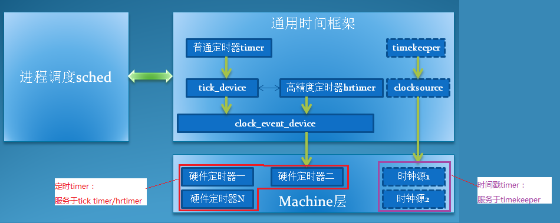[^DroidPhoneo]

上图是linux时钟框架一个经典的描述。本质上linux各种时钟架构和服务是基于硬件提供的两种timer而构建的。

1、定时Timer

- 这类timer每个cpu都有一个独立的，称为local timer。这类timer的中断一般都是PPI（Private Peripheral Interrupt）类型，即每个cpu都有独立一份中断。 与PPI对应的是SPI（Shared Peripheral Interrupt，即多个cpu共享同一个中断。
- 这类timer一般是32bit宽度count，最重要的它会频繁的溢出并产生timer到期中断。
- 这类timer服务于tick timer(低精度)或者hrtimer(高精度)。
- 低精度模式，local timer工作在PERIODIC模式。即timer以tick时间(1/HZ)周期性的产生中断。在tick timer中处理任务调度tick、低精度timer、其他时间更新和统计profile。在这种模式下，所有利用时间的进行的运算，精度都是以tick(1/HZ)为单位的，精度较低。比如HZ=1000，那么tick=1ms。
- 高精度模式，local timer工作在ONESHOT模式。即系统可以支持hrtimer(high resolution)高精度timer，精度为local timer的计数clk达到ns级别。这种情况下把tick timer也转换成一种hrtimer。

2、时间戳Timer

- 这类timer一个系统多个cpu共享一个，称为global timer。
- 这类timer一般是32bit/64bit宽度count，一般不会溢出产生中断，系统实时的去读取count的值来计算当前的时间戳。
- 这类timer服务于clocksource/timekeeper。

> 本文的代码分析基于linux kernel 4.4.22，最好的学习方法还是"RTFSC"

## 1.1、Exynos MCT(Multi-Core Timer)

我们以samsung exynos架构为例来说明linux对timer的使用。
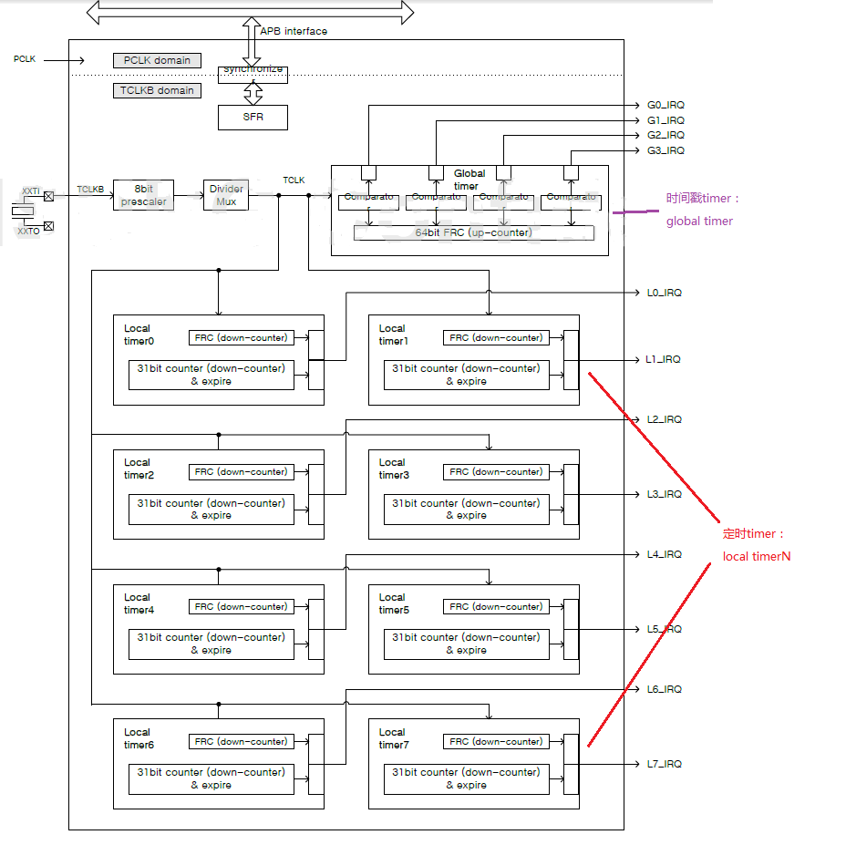

从上图可以看到，exynos有1个64bit global timer用来做时间戳timer，有8个31bit localtimer用来做定时timer，每个cpu拥有一个localtimer。

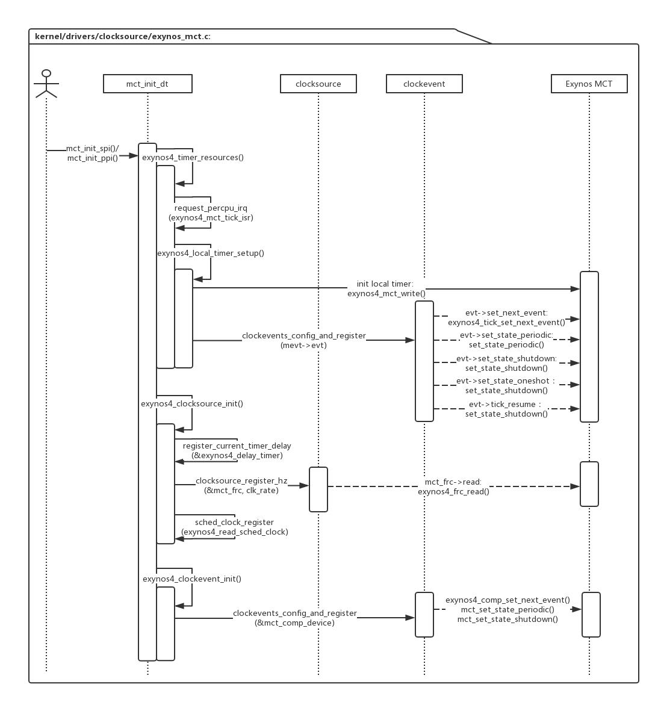

上图是exynos driver的初始化流程，mct_init_dt()中包含了主要的初始化流程：


```
static void __init mct_init_dt(struct device_node *np, unsigned int int_type)
{
	exynos4_timer_resources(np, of_iomap(np, 0)); //(1)初始化localtimer，并将其注册成clockevent
	exynos4_clocksource_init(); //(2)初始化globaltimer，并将其注册成clocksource
	exynos4_clockevent_init(); //(3)将globaltimer的comparator 0注册成一个clockevent，一般不会使用
}
```

后面结合clocksource和clockevent的子系统的解析，再来详细描述exynos系统的具体实现。

# 2、clocksource & timekeeper
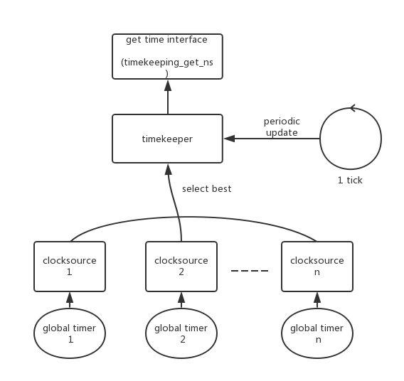

上图描述的是clocksource和timekeeper的关系：

- 一个global timer对应注册一个clocksource。
- 一个系统中可以有多个clocksource，timekeeper选择精度最高的那个来使用。
- 用户使用timekeeper提供的接口来获取系统的时间戳。
- 为了避免无人主动获取时间clocksource定时器的溢出，timekeeper需要定期的去获取clocksource的值来更新系统时间，一般是在tick处理中更新。

## 2.1、clocksource

下面来看一看clocksource的定义：

```
static struct clocksource mct_frc = {
	.name		= "mct-frc",
	/* (1) .rating = 精度，数值越大越好，
       select_best会选择精度最大的clocksource给timekeeper使用 */
	.rating		= 400,  
	/* (2) .read = 读取clocksource的timer当前计数 */
	.read		= exynos4_frc_read,
	/* (3) .mask = timer的位宽 */
	.mask		= CLOCKSOURCE_MASK(32),
	.flags		= CLOCK_SOURCE_IS_CONTINUOUS,
	.resume		= exynos4_frc_resume,
};

```

看一下clocksource的注册过程：

```
static void __init exynos4_clocksource_init(void)
{
    // 启动global timer
	exynos4_mct_frc_start();

    // 注册timer_delay
	exynos4_delay_timer.read_current_timer = &exynos4_read_current_timer;
	exynos4_delay_timer.freq = clk_rate;
	register_current_timer_delay(&exynos4_delay_timer);

    // (1) 注册clocksource
	if (clocksource_register_hz(&mct_frc, clk_rate))
		panic("%s: can't register clocksource\n", mct_frc.name);

    // 注册sched_clock
	sched_clock_register(exynos4_read_sched_clock, 32, clk_rate);
}
|→
static inline int clocksource_register_hz(struct clocksource *cs, u32 hz)
{
	return __clocksource_register_scale(cs, 1, hz);
}
||→
int __clocksource_register_scale(struct clocksource *cs, u32 scale, u32 freq)
{

	/* Initialize mult/shift and max_idle_ns */
	/* (1.1) 根据timer的频率freq，计算cs->mult、cs->shift
	    这两个字段是用来把timer的计数转换成实际时间单位ns
	    ns = (count * cs->mult) >> cs->shift */
	__clocksource_update_freq_scale(cs, scale, freq);

	/* Add clocksource to the clocksource list */
	mutex_lock(&clocksource_mutex);
	/* (1.2) 将新的clocksource加入全局链表 */
	clocksource_enqueue(cs);
	clocksource_enqueue_watchdog(cs);
	/* (1.3) 从全局链表中重新选择一个best
	    clocksource给timekeeper使用 */
	clocksource_select();
	clocksource_select_watchdog(false);
	mutex_unlock(&clocksource_mutex);
	return 0;
}
|||→
void __clocksource_update_freq_scale(struct clocksource *cs, u32 scale, u32 freq)
{
	u64 sec;

	/*
	 * Default clocksources are *special* and self-define their mult/shift.
	 * But, you're not special, so you should specify a freq value.
	 */
	if (freq) {
		/*
		 * Calc the maximum number of seconds which we can run before
		 * wrapping around. For clocksources which have a mask > 32-bit
		 * we need to limit the max sleep time to have a good
		 * conversion precision. 10 minutes is still a reasonable
		 * amount. That results in a shift value of 24 for a
		 * clocksource with mask >= 40-bit and f >= 4GHz. That maps to
		 * ~ 0.06ppm granularity for NTP.
		 */
		/* (1.1.1) 计算timer计数器到溢出，
		    最大能计数多少秒 = sec */
		sec = cs->mask;
		do_div(sec, freq);
		do_div(sec, scale);
		if (!sec)
			sec = 1;
		else if (sec > 600 && cs->mask > UINT_MAX)
			sec = 600;

        /* (1.1.2) 根据1s内的频率数freq，和1s内的ns数NSEC_PER_SEC
            计算freq和ns之间的转换公式：
            ns = (freq * cs->mult) >> cs->shift 
            目的是把mult和shift算到最大值，最大可能的保留精度 */
		clocks_calc_mult_shift(&cs->mult, &cs->shift, freq,
				       NSEC_PER_SEC / scale, sec * scale);
	}
	/*
	 * Ensure clocksources that have large 'mult' values don't overflow
	 * when adjusted.
	 */
	cs->maxadj = clocksource_max_adjustment(cs);
	while (freq && ((cs->mult + cs->maxadj < cs->mult)
		|| (cs->mult - cs->maxadj > cs->mult))) {
		cs->mult >>= 1;
		cs->shift--;
		cs->maxadj = clocksource_max_adjustment(cs);
	}

	/*
	 * Only warn for *special* clocksources that self-define
	 * their mult/shift values and don't specify a freq.
	 */
	WARN_ONCE(cs->mult + cs->maxadj < cs->mult,
		"timekeeping: Clocksource %s might overflow on 11%% adjustment\n",
		cs->name);

    /* (1.1.3) 根据mult和shift的值，计算最大能进入idle的时间max_idle_ns
        才能保证idle时timer不会溢出*/
	clocksource_update_max_deferment(cs);

	pr_info("%s: mask: 0x%llx max_cycles: 0x%llx, max_idle_ns: %lld ns\n",
		cs->name, cs->mask, cs->max_cycles, cs->max_idle_ns);
}
|||→
static void clocksource_select(void)
{
	__clocksource_select(false);
}
static void __clocksource_select(bool skipcur)
{
	bool oneshot = tick_oneshot_mode_active();
	struct clocksource *best, *cs;

	/* Find the best suitable clocksource */
	/* (1.3.1) 选择best clocksource */
	best = clocksource_find_best(oneshot, skipcur);
	if (!best)
		return;

	/* Check for the override clocksource. */
	list_for_each_entry(cs, &clocksource_list, list) {
		if (skipcur && cs == curr_clocksource)
			continue;
		if (strcmp(cs->name, override_name) != 0)
			continue;
		/*
		 * Check to make sure we don't switch to a non-highres
		 * capable clocksource if the tick code is in oneshot
		 * mode (highres or nohz)
		 */
		if (!(cs->flags & CLOCK_SOURCE_VALID_FOR_HRES) && oneshot) {
			/* Override clocksource cannot be used. */
			pr_warn("Override clocksource %s is not HRT compatible - cannot switch while in HRT/NOHZ mode\n",
				cs->name);
			override_name[0] = 0;
		} else
			/* Override clocksource can be used. */
			best = cs;
		break;
	}

    /* (1.3.2) 通知timekeeper更新clocksource，tick-sched更新 */
	if (curr_clocksource != best && !timekeeping_notify(best)) {
		pr_info("Switched to clocksource %s\n", best->name);
		curr_clocksource = best;
	}
}
||||→
int timekeeping_notify(struct clocksource *clock)
{
	struct timekeeper *tk = &tk_core.timekeeper;

	if (tk->tkr_mono.clock == clock)
		return 0;
	stop_machine(change_clocksource, clock, NULL);
	tick_clock_notify();
	return tk->tkr_mono.clock == clock ? 0 : -1;
}
```

### 2.1.1、exynos4_clocksource_init()

exynos将global timer注册成clocksource，虽然global timer拥有64bit的位宽，但是注册的时候把其当成32bit的clocksource注册。

```
static u32 notrace exynos4_read_count_32(void)
{
	return readl_relaxed(reg_base + EXYNOS4_MCT_G_CNT_L);
}

static cycle_t exynos4_frc_read(struct clocksource *cs)
{
	return exynos4_read_count_32();
}

static struct clocksource mct_frc = {
	.name		= "mct-frc",
	.rating		= 400,
	.read		= exynos4_frc_read,
	.mask		= CLOCKSOURCE_MASK(32),
	.flags		= CLOCK_SOURCE_IS_CONTINUOUS,
	.resume		= exynos4_frc_resume,
};


static void __init exynos4_clocksource_init(void)
{
	exynos4_mct_frc_start();

	exynos4_delay_timer.read_current_timer = &exynos4_read_current_timer;
	exynos4_delay_timer.freq = clk_rate;
	register_current_timer_delay(&exynos4_delay_timer);

    /* (1) exynos将global timer注册成clocksource */
	if (clocksource_register_hz(&mct_frc, clk_rate))
		panic("%s: can't register clocksource\n", mct_frc.name);

	sched_clock_register(exynos4_read_sched_clock, 32, clk_rate);
}

```


## 2.2、timekeeper

timerkeeper提供了几种时间：xtime、monotonic time、raw monotonic time、boot time。

- **xtime** 即是wall time，和RTC时间一样可以表示当前的时刻，它的起始时间是公元0世纪0秒，精度大于RTC时间；
- **monotonic time** 从系统开机后到现在的累计时间，不过不计算系统休眠的时间；
- **raw monotonic time** 和monotonic time含义一样，不过更纯粹，不会受到NTP时间调整的影响；
- **boot time** 在monotonic time的基础上加上了系统休眠的时间，它代表着系统上电后的总时间。

|时间种类 |	精度（统计单位） |	访问速度 |	累计休眠时间 |	受NTP调整的影响|获取函数|
|--|--|--|--|--|--|
|RTC |	低 |	慢 |	Yes |	Yes|
|xtime |	高 |	快 |	Yes |	Yes|do_gettimeofday()、ktime_get_real_ts()、ktime_get_real()
|monotonic |	高 	|快 |	No 	|Yes|ktime_get()、ktime_get_ts64()
|raw monotonic |	高 |	快 |	No |	No|ktime_get_raw()、getrawmonotonic64()
|boot time |	高 |	快 |	Yes |	Yes|ktime_get_boottime()

### 2.2.1、timekeeper的定义

虽然clocksource定时器只有一个，但是timekeeper提供了xtime、monotonic time、raw time、boot time等几种时间，所以timekeeper结构体中定义了多个变量来记住这些差值。


```
/**
 * struct timekeeper - Structure holding internal timekeeping values.
 * @tkr_mono:		The readout base structure for CLOCK_MONOTONIC
 * @tkr_raw:		The readout base structure for CLOCK_MONOTONIC_RAW
 * @xtime_sec:		Current CLOCK_REALTIME time in seconds
 * @ktime_sec:		Current CLOCK_MONOTONIC time in seconds
 * @wall_to_monotonic:	CLOCK_REALTIME to CLOCK_MONOTONIC offset
 * @offs_real:		Offset clock monotonic -> clock realtime
 * @offs_boot:		Offset clock monotonic -> clock boottime
 * @offs_tai:		Offset clock monotonic -> clock tai
 * @tai_offset:		The current UTC to TAI offset in seconds
 * @clock_was_set_seq:	The sequence number of clock was set events
 * @next_leap_ktime:	CLOCK_MONOTONIC time value of a pending leap-second
 * @raw_time:		Monotonic raw base time in timespec64 format
 * @cycle_interval:	Number of clock cycles in one NTP interval
 * @xtime_interval:	Number of clock shifted nano seconds in one NTP
 *			interval.
 * @xtime_remainder:	Shifted nano seconds left over when rounding
 *			@cycle_interval
 * @raw_interval:	Raw nano seconds accumulated per NTP interval.
 * @ntp_error:		Difference between accumulated time and NTP time in ntp
 *			shifted nano seconds.
 * @ntp_error_shift:	Shift conversion between clock shifted nano seconds and
 *			ntp shifted nano seconds.
 * @last_warning:	Warning ratelimiter (DEBUG_TIMEKEEPING)
 * @underflow_seen:	Underflow warning flag (DEBUG_TIMEKEEPING)
 * @overflow_seen:	Overflow warning flag (DEBUG_TIMEKEEPING)
 *
 * Note: For timespec(64) based interfaces wall_to_monotonic is what
 * we need to add to xtime (or xtime corrected for sub jiffie times)
 * to get to monotonic time.  Monotonic is pegged at zero at system
 * boot time, so wall_to_monotonic will be negative, however, we will
 * ALWAYS keep the tv_nsec part positive so we can use the usual
 * normalization.
 *
 * wall_to_monotonic is moved after resume from suspend for the
 * monotonic time not to jump. We need to add total_sleep_time to
 * wall_to_monotonic to get the real boot based time offset.
 *
 * wall_to_monotonic is no longer the boot time, getboottime must be
 * used instead.
 */
struct timekeeper {
	struct tk_read_base	tkr_mono;   
                // tkr_mono.xtime_nsec：xtime/monotonic time 的ns
                // tkr_mono.base：monotonic time的base部分
	struct tk_read_base	tkr_raw;
                // tkr_mono.base：raw time的base部分
	u64			xtime_sec;              // xtime的sec
	unsigned long		ktime_sec;      // monotonic time 的整sec
	struct timespec64	wall_to_monotonic;  // xtime + wall_to_monotonic = monotonic time
	ktime_t			offs_real;  //  monotonic time + offs_real = xtime，
                                // 和wall_to_monotonic是相反的值
	ktime_t			offs_boot;  //  monotonic time + offs_boot = boot time
	ktime_t			offs_tai;
	s32			tai_offset;
	unsigned int		clock_was_set_seq;
	ktime_t			next_leap_ktime;
	struct timespec64	raw_time;   // raw time

	/* The following members are for timekeeping internal use */
	cycle_t			cycle_interval;
	u64			xtime_interval;
	s64			xtime_remainder;
	u32			raw_interval;
	/* The ntp_tick_length() value currently being used.
	 * This cached copy ensures we consistently apply the tick
	 * length for an entire tick, as ntp_tick_length may change
	 * mid-tick, and we don't want to apply that new value to
	 * the tick in progress.
	 */
	u64			ntp_tick;
	/* Difference between accumulated time and NTP time in ntp
	 * shifted nano seconds. */
	s64			ntp_error;
	u32			ntp_error_shift;
	u32			ntp_err_mult;
#ifdef CONFIG_DEBUG_TIMEKEEPING
	long			last_warning;
	/*
	 * These simple flag variables are managed
	 * without locks, which is racy, but they are
	 * ok since we don't really care about being
	 * super precise about how many events were
	 * seen, just that a problem was observed.
	 */
	int			underflow_seen;
	int			overflow_seen;
#endif
};
```

### 2.2.2、timekeeper的初始化

timekeeper在初始化的过程中，读取当前的RTC值和clocksource的值，来初始化xtime、monotonic time、raw time、boot time，以及各种offset。


```
void __init timekeeping_init(void)
{
	struct timekeeper *tk = &tk_core.timekeeper;
	struct clocksource *clock;
	unsigned long flags;
	struct timespec64 now, boot, tmp;

	read_persistent_clock64(&now);
	if (!timespec64_valid_strict(&now)) {
		pr_warn("WARNING: Persistent clock returned invalid value!\n"
			"         Check your CMOS/BIOS settings.\n");
		now.tv_sec = 0;
		now.tv_nsec = 0;
	} else if (now.tv_sec || now.tv_nsec)
		persistent_clock_exists = true;

	read_boot_clock64(&boot);
	if (!timespec64_valid_strict(&boot)) {
		pr_warn("WARNING: Boot clock returned invalid value!\n"
			"         Check your CMOS/BIOS settings.\n");
		boot.tv_sec = 0;
		boot.tv_nsec = 0;
	}

	raw_spin_lock_irqsave(&timekeeper_lock, flags);
	write_seqcount_begin(&tk_core.seq);
	ntp_init();

	clock = clocksource_default_clock();
	if (clock->enable)
		clock->enable(clock);
	tk_setup_internals(tk, clock);

	tk_set_xtime(tk, &now);
	tk->raw_time.tv_sec = 0;
	tk->raw_time.tv_nsec = 0;
	if (boot.tv_sec == 0 && boot.tv_nsec == 0)
		boot = tk_xtime(tk);

	set_normalized_timespec64(&tmp, -boot.tv_sec, -boot.tv_nsec);
	tk_set_wall_to_mono(tk, tmp);

	timekeeping_update(tk, TK_MIRROR | TK_CLOCK_WAS_SET);

	write_seqcount_end(&tk_core.seq);
	raw_spin_unlock_irqrestore(&timekeeper_lock, flags);
}
```

timekeeper原理上的初始化是在timekeeping_init()函数中完成的，但是read_persistent_clock64()、read_boot_clock64()都是空函数，所以实际上的初始化是另外的路径：rtc_hctosys() -> do_settimeofday64()，rtc初始化的时候重新配置timekeeper。

```
static int __init rtc_hctosys(void)
{
	int err = -ENODEV;
	struct rtc_time tm;
	struct timespec64 tv64 = {
		.tv_nsec = NSEC_PER_SEC >> 1,
	};
	struct rtc_device *rtc = rtc_class_open(CONFIG_RTC_HCTOSYS_DEVICE);

	if (rtc == NULL) {
		pr_info("unable to open rtc device (%s)\n",
			CONFIG_RTC_HCTOSYS_DEVICE);
		goto err_open;
	}

    /* (1) 读取当前的rtc时间 */
	err = rtc_read_time(rtc, &tm);
	if (err) {
		dev_err(rtc->dev.parent,
			"hctosys: unable to read the hardware clock\n");
		goto err_read;

	}

	tv64.tv_sec = rtc_tm_to_time64(&tm);
	tv64.tv_nsec = tm.tm_cnt * (1000000000 / 32768);
	
	/* (2) 根据rtc时间配置xtime */
	err = do_settimeofday64(&tv64);

	dev_info(rtc->dev.parent,
		"setting system clock to "
		"%d-%02d-%02d %02d:%02d:%02d UTC (%lld)\n",
		tm.tm_year + 1900, tm.tm_mon + 1, tm.tm_mday,
		tm.tm_hour, tm.tm_min, tm.tm_sec,
		(long long) tv64.tv_sec);

err_read:
	rtc_class_close(rtc);

err_open:
	rtc_hctosys_ret = err;

	return err;
}
|→
int do_settimeofday64(const struct timespec64 *ts)
{
	struct timekeeper *tk = &tk_core.timekeeper;
	struct timespec64 ts_delta, xt;
	unsigned long flags;
	int ret = 0;

	if (!timespec64_valid_strict(ts))
		return -EINVAL;

	raw_spin_lock_irqsave(&timekeeper_lock, flags);
	write_seqcount_begin(&tk_core.seq);

	timekeeping_forward_now(tk);

    /* (2.1) 读取当前的xtime，计算rtc time和xtime之间的差值  */
	xt = tk_xtime(tk);
	ts_delta.tv_sec = ts->tv_sec - xt.tv_sec;
	ts_delta.tv_nsec = ts->tv_nsec - xt.tv_nsec;

	if (timespec64_compare(&tk->wall_to_monotonic, &ts_delta) > 0) {
		ret = -EINVAL;
		goto out;
	}

    /* (2.2) 将差值追加到offset；tk->wall_to_monotonic、tk->offs_real */
	tk_set_wall_to_mono(tk, timespec64_sub(tk->wall_to_monotonic, ts_delta));

    /* (2.3) 更新xtime */
	tk_set_xtime(tk, ts);
out:
	timekeeping_update(tk, TK_CLEAR_NTP | TK_MIRROR | TK_CLOCK_WAS_SET);

	write_seqcount_end(&tk_core.seq);
	raw_spin_unlock_irqrestore(&timekeeper_lock, flags);

	/* signal hrtimers about time change */
	clock_was_set();
	notify_time_update();
	return ret;
}
```


### 2.2.3、timekeeper的update

clocksource定时器的值要定时的读出来，并且把增量加到timekeeper中，不然clocksource定时器会溢出。这个定时更新的时间一般是1 tick，调用的函数是update_wall_time()：

```
void update_wall_time(void)
{
	struct timekeeper *real_tk = &tk_core.timekeeper;
	struct timekeeper *tk = &shadow_timekeeper;
	cycle_t offset;
	int shift = 0, maxshift;
	unsigned int clock_set = 0;
	unsigned long flags;

	raw_spin_lock_irqsave(&timekeeper_lock, flags);

	/* Make sure we're fully resumed: */
	if (unlikely(timekeeping_suspended))
		goto out;

#ifdef CONFIG_ARCH_USES_GETTIMEOFFSET
	offset = real_tk->cycle_interval;
#else
    /* (1) 获取clocksource和上一次update之间的offset */
	offset = clocksource_delta(tk->tkr_mono.read(tk->tkr_mono.clock),
				   tk->tkr_mono.cycle_last, tk->tkr_mono.mask);
#endif

	/* Check if there's really nothing to do */
	if (offset < real_tk->cycle_interval)
		goto out;

	/* Do some additional sanity checking */
	timekeeping_check_update(real_tk, offset);

	/*
	 * With NO_HZ we may have to accumulate many cycle_intervals
	 * (think "ticks") worth of time at once. To do this efficiently,
	 * we calculate the largest doubling multiple of cycle_intervals
	 * that is smaller than the offset.  We then accumulate that
	 * chunk in one go, and then try to consume the next smaller
	 * doubled multiple.
	 */
	shift = ilog2(offset) - ilog2(tk->cycle_interval);
	shift = max(0, shift);
	/* Bound shift to one less than what overflows tick_length */
	maxshift = (64 - (ilog2(ntp_tick_length())+1)) - 1;
	shift = min(shift, maxshift);
	/* (2) 如果offset的值是多个cycle_interval，
	    不要一次update，使用2的n次方cycle_interval的方式逐个update。
	    tk->cycle_interval的值在tk_setup_internals()时被赋值，默认为1 tick */
	while (offset >= tk->cycle_interval) {
	    /* (3) 将offset更新到timekeeper中 */
		offset = logarithmic_accumulation(tk, offset, shift,
							&clock_set);
		if (offset < tk->cycle_interval<<shift)
			shift--;
	}

	/* correct the clock when NTP error is too big */
	timekeeping_adjust(tk, offset);

	/*
	 * XXX This can be killed once everyone converts
	 * to the new update_vsyscall.
	 */
	old_vsyscall_fixup(tk);

	/*
	 * Finally, make sure that after the rounding
	 * xtime_nsec isn't larger than NSEC_PER_SEC
	 */
	clock_set |= accumulate_nsecs_to_secs(tk);

	write_seqcount_begin(&tk_core.seq);
	/*
	 * Update the real timekeeper.
	 *
	 * We could avoid this memcpy by switching pointers, but that
	 * requires changes to all other timekeeper usage sites as
	 * well, i.e. move the timekeeper pointer getter into the
	 * spinlocked/seqcount protected sections. And we trade this
	 * memcpy under the tk_core.seq against one before we start
	 * updating.
	 */
	/* (4)  */
	timekeeping_update(tk, clock_set);
	memcpy(real_tk, tk, sizeof(*tk));
	/* The memcpy must come last. Do not put anything here! */
	write_seqcount_end(&tk_core.seq);
out:
	raw_spin_unlock_irqrestore(&timekeeper_lock, flags);
	if (clock_set)
		/* Have to call _delayed version, since in irq context*/
		clock_was_set_delayed();
}
|→
static cycle_t logarithmic_accumulation(struct timekeeper *tk, cycle_t offset,
						u32 shift,
						unsigned int *clock_set)
{
	cycle_t interval = tk->cycle_interval << shift;
	u64 raw_nsecs;

	/* If the offset is smaller than a shifted interval, do nothing */
	if (offset < interval)
		return offset;

	/* Accumulate one shifted interval */
	offset -= interval;
	/* (3.1) 更新cycle_last */
	tk->tkr_mono.cycle_last += interval;
	tk->tkr_raw.cycle_last  += interval;

    /* (3.2) 更新xtime：
        tk->tkr_mono.xtime_nsec
        tk->xtime_sec   */
	tk->tkr_mono.xtime_nsec += tk->xtime_interval << shift;
	*clock_set |= accumulate_nsecs_to_secs(tk);

	/* Accumulate raw time */
	/* (3.3) 更新raw time：
	   tk->raw_time.tv_nsec
	   tk->raw_time.tv_sec */
	raw_nsecs = (u64)tk->raw_interval << shift;
	raw_nsecs += tk->raw_time.tv_nsec;
	if (raw_nsecs >= NSEC_PER_SEC) {
		u64 raw_secs = raw_nsecs;
		raw_nsecs = do_div(raw_secs, NSEC_PER_SEC);
		tk->raw_time.tv_sec += raw_secs;
	}
	tk->raw_time.tv_nsec = raw_nsecs;

	/* Accumulate error between NTP and clock interval */
	tk->ntp_error += tk->ntp_tick << shift;
	tk->ntp_error -= (tk->xtime_interval + tk->xtime_remainder) <<
						(tk->ntp_error_shift + shift);

	return offset;
}
|→
static void timekeeping_update(struct timekeeper *tk, unsigned int action)
{
	if (action & TK_CLEAR_NTP) {
		tk->ntp_error = 0;
		ntp_clear();
	}

	tk_update_leap_state(tk);
	/* (4.1) update monotonic time */
	tk_update_ktime_data(tk);

	update_vsyscall(tk);
	update_pvclock_gtod(tk, action & TK_CLOCK_WAS_SET);

	update_fast_timekeeper(&tk->tkr_mono, &tk_fast_mono);
	update_fast_timekeeper(&tk->tkr_raw,  &tk_fast_raw);

	if (action & TK_CLOCK_WAS_SET)
		tk->clock_was_set_seq++;
	/*
	 * The mirroring of the data to the shadow-timekeeper needs
	 * to happen last here to ensure we don't over-write the
	 * timekeeper structure on the next update with stale data
	 */
	if (action & TK_MIRROR)
		memcpy(&shadow_timekeeper, &tk_core.timekeeper,
		       sizeof(tk_core.timekeeper));
}
||→
static inline void tk_update_ktime_data(struct timekeeper *tk)
{
	u64 seconds;
	u32 nsec;

	/*
	 * The xtime based monotonic readout is:
	 *	nsec = (xtime_sec + wtm_sec) * 1e9 + wtm_nsec + now();
	 * The ktime based monotonic readout is:
	 *	nsec = base_mono + now();
	 * ==> base_mono = (xtime_sec + wtm_sec) * 1e9 + wtm_nsec
	 */
	/* (4.1.1) update tk->tkr_mono.base的值，
	   = tk->xtime_sec +  tk->wall_to_monotonic,
	   tk->tkr_mono.xtime_nsec 没有计算到base中 */
	seconds = (u64)(tk->xtime_sec + tk->wall_to_monotonic.tv_sec);
	nsec = (u32) tk->wall_to_monotonic.tv_nsec;
	tk->tkr_mono.base = ns_to_ktime(seconds * NSEC_PER_SEC + nsec);

	/* Update the monotonic raw base */
	/* (4.1.2) update tk->tkr_raw.base的值，
	   直接转换tk->raw_time */
	tk->tkr_raw.base = timespec64_to_ktime(tk->raw_time);

	/*
	 * The sum of the nanoseconds portions of xtime and
	 * wall_to_monotonic can be greater/equal one second. Take
	 * this into account before updating tk->ktime_sec.
	 */
	/* (4.1.3) update tk->ktime_sec的值
	nsec += (u32)(tk->tkr_mono.xtime_nsec >> tk->tkr_mono.shift);
	if (nsec >= NSEC_PER_SEC)
		seconds++;
	tk->ktime_sec = seconds;
}
```


### 2.2.4、timekeeper的获取

- **xtime/wall time 的获取:**

do_gettimeofday()、ktime_get_real_ts()最后调用的getnstimeofday64() -> __getnstimeofday64()获取到xtime：

```
int __getnstimeofday64(struct timespec64 *ts)
{
	struct timekeeper *tk = &tk_core.timekeeper;
	unsigned long seq;
	s64 nsecs = 0;

	do {
		seq = read_seqcount_begin(&tk_core.seq);

        /* (1) sec直接从变量tk->xtime_sec获取到，
            即上一tick更新的值 */
		ts->tv_sec = tk->xtime_sec;
		
		/* (2) nsec需要更新最新的值：tk->tkr_mono.xtime_nsec + delta
		    delta是距离上一次tick更新的差值 */
		nsecs = timekeeping_get_ns(&tk->tkr_mono);

	} while (read_seqcount_retry(&tk_core.seq, seq));

	ts->tv_nsec = 0;
	timespec64_add_ns(ts, nsecs);

	/*
	 * Do not bail out early, in case there were callers still using
	 * the value, even in the face of the WARN_ON.
	 */
	if (unlikely(timekeeping_suspended))
		return -EAGAIN;
	return 0;
}
|→
static inline s64 timekeeping_get_ns(struct tk_read_base *tkr)
{
	cycle_t delta;
	s64 nsec;

    /* (2.1) 获取距离上一次tick更新，timer的delta值  */
	delta = timekeeping_get_delta(tkr);

    /* (2.2) delta加上上一次的nsec tkr->xtime_nsec，
        即为最新的ns值 */
	nsec = (delta * tkr->mult + tkr->xtime_nsec) >> tkr->shift;

	/* If arch requires, add in get_arch_timeoffset() */
	return nsec + arch_gettimeoffset();
}
||→
static inline cycle_t timekeeping_get_delta(struct tk_read_base *tkr)
{
	struct timekeeper *tk = &tk_core.timekeeper;
	cycle_t now, last, mask, max, delta;
	unsigned int seq;

	/*
	 * Since we're called holding a seqlock, the data may shift
	 * under us while we're doing the calculation. This can cause
	 * false positives, since we'd note a problem but throw the
	 * results away. So nest another seqlock here to atomically
	 * grab the points we are checking with.
	 */
	do {
		seq = read_seqcount_begin(&tk_core.seq);
		/* (2.1.1) 使用read函数读取当前timer的计数 */
		now = tkr->read(tkr->clock);
		last = tkr->cycle_last;
		mask = tkr->mask;
		max = tkr->clock->max_cycles;
	} while (read_seqcount_retry(&tk_core.seq, seq));

    /* (2.1.2) 使用公式：(now - last) & mask，
        计算delta值 */
	delta = clocksource_delta(now, last, mask);

	/*
	 * Try to catch underflows by checking if we are seeing small
	 * mask-relative negative values.
	 */
	if (unlikely((~delta & mask) < (mask >> 3))) {
		tk->underflow_seen = 1;
		delta = 0;
	}

	/* Cap delta value to the max_cycles values to avoid mult overflows */
	if (unlikely(delta > max)) {
		tk->overflow_seen = 1;
		delta = tkr->clock->max_cycles;
	}

	return delta;
}

```

ktime_get_real()使用monotonic time再加上差值timekeeper.offs_real的方法来获取xtime：

```
static inline ktime_t ktime_get_real(void)
{
	return ktime_get_with_offset(TK_OFFS_REAL);
}
|→
static ktime_t *offsets[TK_OFFS_MAX] = {
	[TK_OFFS_REAL]	= &tk_core.timekeeper.offs_real,
	[TK_OFFS_BOOT]	= &tk_core.timekeeper.offs_boot,
	[TK_OFFS_TAI]	= &tk_core.timekeeper.offs_tai,
};

ktime_t ktime_get_with_offset(enum tk_offsets offs)
{
	struct timekeeper *tk = &tk_core.timekeeper;
	unsigned int seq;
	ktime_t base, *offset = offsets[offs];
	s64 nsecs;

	WARN_ON(timekeeping_suspended);

	do {
		seq = read_seqcount_begin(&tk_core.seq);
		/* (1) monotonic time = tk->tkr_mono.base，
		   offset = timekeeper.offs_real */
		base = ktime_add(tk->tkr_mono.base, *offset);
		/* (2) nsec需要更新最新的值：tk->tkr_mono.xtime_nsec + delta
		    delta是距离上一次tick更新的差值 */
		nsecs = timekeeping_get_ns(&tk->tkr_mono);

	} while (read_seqcount_retry(&tk_core.seq, seq));

	return ktime_add_ns(base, nsecs);

}
```

- **monotonic time 的获取；**

ktime_get()直接获取monotonic time：

```
ktime_t ktime_get(void)
{
	struct timekeeper *tk = &tk_core.timekeeper;
	unsigned int seq;
	ktime_t base;
	s64 nsecs;

	WARN_ON(timekeeping_suspended);

	do {
		seq = read_seqcount_begin(&tk_core.seq);
		/* (1) monotonic time = tk->tkr_mono.base */
		base = tk->tkr_mono.base;
		/* (2) nsec需要更新最新的值：tk->tkr_mono.xtime_nsec + delta
		    delta是距离上一次tick更新的差值 */
		nsecs = timekeeping_get_ns(&tk->tkr_mono);

	} while (read_seqcount_retry(&tk_core.seq, seq));

	return ktime_add_ns(base, nsecs);
}
```

ktime_get_ts64()通过xtime加上差值tk->wall_to_monotonic的方法来获取monotonic time：

```
void ktime_get_ts64(struct timespec64 *ts)
{
	struct timekeeper *tk = &tk_core.timekeeper;
	struct timespec64 tomono;
	s64 nsec;
	unsigned int seq;

	WARN_ON(timekeeping_suspended);

	do {
		seq = read_seqcount_begin(&tk_core.seq);
		/* (1) 获取xtime */
		ts->tv_sec = tk->xtime_sec;
		nsec = timekeeping_get_ns(&tk->tkr_mono);
		/* (2) 加上xtime和monotonic之间的差值tk->wall_to_monotonic */
		tomono = tk->wall_to_monotonic;

	} while (read_seqcount_retry(&tk_core.seq, seq));

	ts->tv_sec += tomono.tv_sec;
	ts->tv_nsec = 0;
	timespec64_add_ns(ts, nsec + tomono.tv_nsec);
}
```

- **raw monotonic time 的获取；**

ktime_get_raw()通过tk->tkr_raw.base获取raw monotonic time：

```
ktime_t ktime_get_raw(void)
{
	struct timekeeper *tk = &tk_core.timekeeper;
	unsigned int seq;
	ktime_t base;
	s64 nsecs;

	do {
		seq = read_seqcount_begin(&tk_core.seq);
		/* (1) raw monotonic time = tk->tkr_raw.base */
		base = tk->tkr_raw.base;
		/* (2) nsec需要更新最新的值：tk->tkr_raw.xtime_nsec + delta
		    delta是距离上一次tick更新的差值 */
		nsecs = timekeeping_get_ns(&tk->tkr_raw);

	} while (read_seqcount_retry(&tk_core.seq, seq));

	return ktime_add_ns(base, nsecs);
}
```

getrawmonotonic64()通过tk->raw_time获取raw monotonic time：

```
void getrawmonotonic64(struct timespec64 *ts)
{
	struct timekeeper *tk = &tk_core.timekeeper;
	struct timespec64 ts64;
	unsigned long seq;
	s64 nsecs;

	do {
		seq = read_seqcount_begin(&tk_core.seq);
		nsecs = timekeeping_get_ns(&tk->tkr_raw);
		ts64 = tk->raw_time;

	} while (read_seqcount_retry(&tk_core.seq, seq));

	timespec64_add_ns(&ts64, nsecs);
	*ts = ts64;
}
```


- **boot time 的获取；**

ktime_get_boottime()使用monotonic time再加上差值timekeeper.offs_boot的方法来获取boot time：

```
static inline ktime_t ktime_get_boottime(void)
{
	return ktime_get_with_offset(TK_OFFS_BOOT);
}
|→
static ktime_t *offsets[TK_OFFS_MAX] = {
	[TK_OFFS_REAL]	= &tk_core.timekeeper.offs_real,
	[TK_OFFS_BOOT]	= &tk_core.timekeeper.offs_boot,
	[TK_OFFS_TAI]	= &tk_core.timekeeper.offs_tai,
};

ktime_t ktime_get_with_offset(enum tk_offsets offs)
{
	struct timekeeper *tk = &tk_core.timekeeper;
	unsigned int seq;
	ktime_t base, *offset = offsets[offs];
	s64 nsecs;

	WARN_ON(timekeeping_suspended);

	do {
		seq = read_seqcount_begin(&tk_core.seq);
		/* (1) monotonic time = tk->tkr_mono.base，
		   offset = timekeeper.offs_boot */
		base = ktime_add(tk->tkr_mono.base, *offset);
		/* (2) nsec需要更新最新的值：tk->tkr_mono.xtime_nsec + delta
		    delta是距离上一次tick更新的差值 */
		nsecs = timekeeping_get_ns(&tk->tkr_mono);

	} while (read_seqcount_retry(&tk_core.seq, seq));

	return ktime_add_ns(base, nsecs);

}
```

### 2.2.5、timekeeper suspend

系统在进入suspend以后，clocksource不会再工作，这部分时间会计入xtime和boot time，但是不会计入monotonic time。


```
void timekeeping_resume(void)
{
	struct timekeeper *tk = &tk_core.timekeeper;
	struct clocksource *clock = tk->tkr_mono.clock;
	unsigned long flags;
	struct timespec64 ts_new, ts_delta;
	cycle_t cycle_now, cycle_delta;

	sleeptime_injected = false;
	read_persistent_clock64(&ts_new);

	clockevents_resume();
	clocksource_resume();

	raw_spin_lock_irqsave(&timekeeper_lock, flags);
	write_seqcount_begin(&tk_core.seq);

	/*
	 * After system resumes, we need to calculate the suspended time and
	 * compensate it for the OS time. There are 3 sources that could be
	 * used: Nonstop clocksource during suspend, persistent clock and rtc
	 * device.
	 *
	 * One specific platform may have 1 or 2 or all of them, and the
	 * preference will be:
	 *	suspend-nonstop clocksource -> persistent clock -> rtc
	 * The less preferred source will only be tried if there is no better
	 * usable source. The rtc part is handled separately in rtc core code.
	 */
	cycle_now = tk->tkr_mono.read(clock);
	if ((clock->flags & CLOCK_SOURCE_SUSPEND_NONSTOP) &&
		cycle_now > tk->tkr_mono.cycle_last) {
		u64 num, max = ULLONG_MAX;
		u32 mult = clock->mult;
		u32 shift = clock->shift;
		s64 nsec = 0;

		cycle_delta = clocksource_delta(cycle_now, tk->tkr_mono.cycle_last,
						tk->tkr_mono.mask);

		/*
		 * "cycle_delta * mutl" may cause 64 bits overflow, if the
		 * suspended time is too long. In that case we need do the
		 * 64 bits math carefully
		 */
		do_div(max, mult);
		if (cycle_delta > max) {
			num = div64_u64(cycle_delta, max);
			nsec = (((u64) max * mult) >> shift) * num;
			cycle_delta -= num * max;
		}
		nsec += ((u64) cycle_delta * mult) >> shift;

		ts_delta = ns_to_timespec64(nsec);
		sleeptime_injected = true;
	} else if (timespec64_compare(&ts_new, &timekeeping_suspend_time) > 0) {
		ts_delta = timespec64_sub(ts_new, timekeeping_suspend_time);
		sleeptime_injected = true;
	}

	if (sleeptime_injected)
		__timekeeping_inject_sleeptime(tk, &ts_delta);

	/* Re-base the last cycle value */
	tk->tkr_mono.cycle_last = cycle_now;
	tk->tkr_raw.cycle_last  = cycle_now;

	tk->ntp_error = 0;
	timekeeping_suspended = 0;
	timekeeping_update(tk, TK_MIRROR | TK_CLOCK_WAS_SET);
	write_seqcount_end(&tk_core.seq);
	raw_spin_unlock_irqrestore(&timekeeper_lock, flags);

	touch_softlockup_watchdog();

	tick_resume();
	hrtimers_resume();
}

int timekeeping_suspend(void)
{
	struct timekeeper *tk = &tk_core.timekeeper;
	unsigned long flags;
	struct timespec64		delta, delta_delta;
	static struct timespec64	old_delta;

	read_persistent_clock64(&timekeeping_suspend_time);

	/*
	 * On some systems the persistent_clock can not be detected at
	 * timekeeping_init by its return value, so if we see a valid
	 * value returned, update the persistent_clock_exists flag.
	 */
	if (timekeeping_suspend_time.tv_sec || timekeeping_suspend_time.tv_nsec)
		persistent_clock_exists = true;

	raw_spin_lock_irqsave(&timekeeper_lock, flags);
	write_seqcount_begin(&tk_core.seq);
	timekeeping_forward_now(tk);
	timekeeping_suspended = 1;

	if (persistent_clock_exists) {
		/*
		 * To avoid drift caused by repeated suspend/resumes,
		 * which each can add ~1 second drift error,
		 * try to compensate so the difference in system time
		 * and persistent_clock time stays close to constant.
		 */
		delta = timespec64_sub(tk_xtime(tk), timekeeping_suspend_time);
		delta_delta = timespec64_sub(delta, old_delta);
		if (abs(delta_delta.tv_sec) >= 2) {
			/*
			 * if delta_delta is too large, assume time correction
			 * has occurred and set old_delta to the current delta.
			 */
			old_delta = delta;
		} else {
			/* Otherwise try to adjust old_system to compensate */
			timekeeping_suspend_time =
				timespec64_add(timekeeping_suspend_time, delta_delta);
		}
	}

	timekeeping_update(tk, TK_MIRROR);
	halt_fast_timekeeper(tk);
	write_seqcount_end(&tk_core.seq);
	raw_spin_unlock_irqrestore(&timekeeper_lock, flags);

	tick_suspend();
	clocksource_suspend();
	clockevents_suspend();

	return 0;
}

/* sysfs resume/suspend bits for timekeeping */
static struct syscore_ops timekeeping_syscore_ops = {
	.resume		= timekeeping_resume,
	.suspend	= timekeeping_suspend,
};
```

和初始化一样的原因，理论上timekeeper的操作在timekeeping_resume()、timekeeping_suspend()，但是实际上在rtc的操作中执行rtc_suspend()、rtc_resume()。


```
static int rtc_suspend(struct device *dev)
{
	struct rtc_device	*rtc = to_rtc_device(dev);
	struct rtc_time		tm;
	struct timespec64	delta, delta_delta;
	int err;

	if (timekeeping_rtc_skipsuspend())
		return 0;

	if (strcmp(dev_name(&rtc->dev), CONFIG_RTC_HCTOSYS_DEVICE) != 0)
		return 0;

	/* snapshot the current RTC and system time at suspend*/
	/* (1.1) 读取suspend时候的rtc时间 */
	err = rtc_read_time(rtc, &tm);
	if (err < 0) {
		pr_debug("%s:  fail to read rtc time\n", dev_name(&rtc->dev));
		return 0;
	}

    /* (1.2) 读取当前xtime */
	getnstimeofday64(&old_system);
	old_rtc.tv_sec = rtc_tm_to_time64(&tm);
	old_rtc.tv_nsec = tm.tm_cnt*(1000000000/32768);

	/*
	 * To avoid drift caused by repeated suspend/resumes,
	 * which each can add ~1 second drift error,
	 * try to compensate so the difference in system time
	 * and rtc time stays close to constant.
	 */
	/* (1.3) 如果rtc时间和xtime有偏差，尝试纠正xtime */
	delta = timespec64_sub(old_system, old_rtc);
	delta_delta = timespec64_sub(delta, old_delta);
	if (delta_delta.tv_sec < -2 || delta_delta.tv_sec >= 2) {
		/*
		 * if delta_delta is too large, assume time correction
		 * has occured and set old_delta to the current delta.
		 */
		old_delta = delta;
	} else {
		/* Otherwise try to adjust old_system to compensate */
		old_system = timespec64_sub(old_system, delta_delta);
	}

	return 0;
}

static int rtc_resume(struct device *dev)
{
	struct rtc_device	*rtc = to_rtc_device(dev);
	struct rtc_time		tm;
	struct timespec64	new_system, new_rtc;
	struct timespec64	sleep_time;
	int err;

	if (timekeeping_rtc_skipresume())
		return 0;

	rtc_hctosys_ret = -ENODEV;
	if (strcmp(dev_name(&rtc->dev), CONFIG_RTC_HCTOSYS_DEVICE) != 0)
		return 0;

	/* snapshot the current rtc and system time at resume */
	/* (2.1) 读取resume后的rtc时间和xtime */
	getnstimeofday64(&new_system);
	err = rtc_read_time(rtc, &tm);
	if (err < 0) {
		pr_debug("%s:  fail to read rtc time\n", dev_name(&rtc->dev));
		return 0;
	}

	new_rtc.tv_sec = rtc_tm_to_time64(&tm);
	new_rtc.tv_nsec = tm.tm_cnt*(1000000000/32768);

	if (new_rtc.tv_sec < old_rtc.tv_sec) {
		pr_debug("%s:  time travel!\n", dev_name(&rtc->dev));
		return 0;
	}

	/* calculate the RTC time delta (sleep time)*/
	/* (2.2) 计算suspend和resume之间rtc的差值 */
	sleep_time = timespec64_sub(new_rtc, old_rtc);

	/*
	 * Since these RTC suspend/resume handlers are not called
	 * at the very end of suspend or the start of resume,
	 * some run-time may pass on either sides of the sleep time
	 * so subtract kernel run-time between rtc_suspend to rtc_resume
	 * to keep things accurate.
	 */
	/* (2.3) 使用上一步的差值，再减去，suspend和resume之间xtime的差值
	        得到实际的sleep时间*/
	sleep_time = timespec64_sub(sleep_time,
			timespec64_sub(new_system, old_system));

	if (sleep_time.tv_sec >= 0)
	    /* (2.4) 将计算得到的sleep时间，加入到timekeeper中 */
		timekeeping_inject_sleeptime64(&sleep_time);
	rtc_hctosys_ret = 0;
	return 0;
}
|→
void timekeeping_inject_sleeptime64(struct timespec64 *delta)
{
	struct timekeeper *tk = &tk_core.timekeeper;
	unsigned long flags;

	raw_spin_lock_irqsave(&timekeeper_lock, flags);
	write_seqcount_begin(&tk_core.seq);

	timekeeping_forward_now(tk);

	__timekeeping_inject_sleeptime(tk, delta);

	timekeeping_update(tk, TK_CLEAR_NTP | TK_MIRROR | TK_CLOCK_WAS_SET);

	write_seqcount_end(&tk_core.seq);
	raw_spin_unlock_irqrestore(&timekeeper_lock, flags);

	/* signal hrtimers about time change */
	clock_was_set();
}
||→
static void __timekeeping_inject_sleeptime(struct timekeeper *tk,
					   struct timespec64 *delta)
{
	if (!timespec64_valid_strict(delta)) {
		printk_deferred(KERN_WARNING
				"__timekeeping_inject_sleeptime: Invalid "
				"sleep delta value!\n");
		return;
	}
	/* (2.4.1) 更新xtime */
	tk_xtime_add(tk, delta);
	/* (2.4.2) 更新tk->wall_to_monotonic、tk->offs_real */
	tk_set_wall_to_mono(tk, timespec64_sub(tk->wall_to_monotonic, *delta));
	/* (2.4.3) 更新tk->offs_boot */
	tk_update_sleep_time(tk, timespec64_to_ktime(*delta));
	tk_debug_account_sleep_time(delta);
}
```


# 3、clock_event

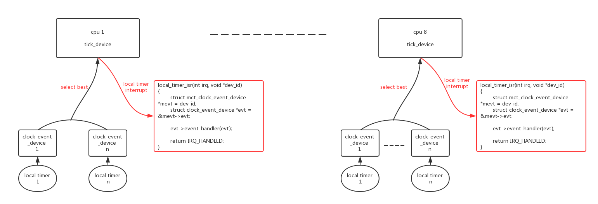

clock_event其实就是对local timer的使用，每个cpu对应一个本地local timer。global timer启动后不需要主动做任何事情，只需要等待timekepper的读取就可以了。而local timer需要触发中断，它的主要价值就体现在定时中断处理了，中断的时间可以是固定的(period mode)也或者是不固定的(oneshot mode)。

## 3.1、clock_event的注册

### 3.1.1、exynos clock_event的注册

exynos clock_event的注册分为两部分：

- 第一部分：localtimer中断的注册：

```
static void __init exynos4_timer_resources(struct device_node *np, void __iomem *base)
{
	int err, cpu;
	struct mct_clock_event_device *mevt = this_cpu_ptr(&percpu_mct_tick);
	struct clk *mct_clk, *tick_clk;

	tick_clk = np ? of_clk_get_by_name(np, "fin_pll") :
				clk_get(NULL, "fin_pll");
	if (IS_ERR(tick_clk))
		panic("%s: unable to determine tick clock rate\n", __func__);
	clk_rate = clk_get_rate(tick_clk);

	mct_clk = np ? of_clk_get_by_name(np, "mct") : clk_get(NULL, "mct");
	if (IS_ERR(mct_clk))
		panic("%s: unable to retrieve mct clock instance\n", __func__);
	clk_prepare_enable(mct_clk);

	reg_base = base;
	if (!reg_base)
		panic("%s: unable to ioremap mct address space\n", __func__);

	if (mct_int_type == MCT_INT_PPI) {

        /* (1) 大部分的localtimer是PPI模式，
            注册中断处理函数：exynos4_mct_tick_isr() */
		err = request_percpu_irq(mct_irqs[MCT_L0_IRQ],
					 exynos4_mct_tick_isr, "MCT",
					 &percpu_mct_tick);
		WARN(err, "MCT: can't request IRQ %d (%d)\n",
		     mct_irqs[MCT_L0_IRQ], err);
	} else {
		for_each_possible_cpu(cpu) {
			int mct_irq = mct_irqs[MCT_L0_IRQ + cpu];
			struct mct_clock_event_device *pcpu_mevt =
				per_cpu_ptr(&percpu_mct_tick, cpu);

			pcpu_mevt->evt.irq = -1;

			irq_set_status_flags(mct_irq, IRQ_NOAUTOEN);
			if (request_irq(mct_irq,
					exynos4_mct_tick_isr,
					IRQF_TIMER | IRQF_NOBALANCING,
					pcpu_mevt->name, pcpu_mevt)) {
				pr_err("exynos-mct: cannot register IRQ (cpu%d)\n",
									cpu);

				continue;
			}
			pcpu_mevt->evt.irq = mct_irq;
		}
	}

    /* (2) 注册cpu hotplug的notifier，
        在其他cpu up时调用exynos4_local_timer_setup()注册clock_event */
	err = register_cpu_notifier(&exynos4_mct_cpu_nb);
	if (err)
		goto out_irq;

	/* Immediately configure the timer on the boot CPU */
	/* (3) 注册本cpu的clock_event */
	exynos4_local_timer_setup(mevt);
	return;

out_irq:
	free_percpu_irq(mct_irqs[MCT_L0_IRQ], &percpu_mct_tick);
}

static irqreturn_t exynos4_mct_tick_isr(int irq, void *dev_id)
{
	struct mct_clock_event_device *mevt = dev_id;
	struct clock_event_device *evt = &mevt->evt;

	exynos4_mct_tick_clear(mevt);

    /* (4) localtimer中断处理函数是固定的也是非常简单的，
        调用本cpu clock_event_device的handler函数：evt->event_handler(evt) */
	evt->event_handler(evt);

	return IRQ_HANDLED;
}

```


- 第二部分：clock_event_device注册：

```
static int exynos4_local_timer_setup(struct mct_clock_event_device *mevt)
{
	struct clock_event_device *evt = &mevt->evt;
	unsigned int cpu = smp_processor_id();

	mevt->base = EXYNOS4_MCT_L_BASE(cpu);
	snprintf(mevt->name, sizeof(mevt->name), "mct_tick%d", cpu);

    /* (1) 初始化clock_event_device */
	evt->name = mevt->name;
	evt->cpumask = cpumask_of(cpu);         // 本clock_event_device只服务于一个cpu
	evt->set_next_event = exynos4_tick_set_next_event;
	evt->set_state_periodic = set_state_periodic;
	evt->set_state_shutdown = set_state_shutdown;
	evt->set_state_oneshot = set_state_shutdown;
	evt->tick_resume = set_state_shutdown;
	evt->features = CLOCK_EVT_FEAT_PERIODIC | CLOCK_EVT_FEAT_ONESHOT;
	evt->rating = 450;

	exynos4_mct_write(TICK_BASE_CNT, mevt->base + MCT_L_TCNTB_OFFSET);

	if (mct_int_type == MCT_INT_SPI) {

		if (evt->irq == -1)
			return -EIO;

		irq_force_affinity(evt->irq, cpumask_of(cpu));
		enable_irq(evt->irq);
	} else {
		enable_percpu_irq(mct_irqs[MCT_L0_IRQ], 0);
	}
	/* (2) 配置并注册clockevent */
	clockevents_config_and_register(evt, clk_rate / (TICK_BASE_CNT + 1),
					0xf, 0x7fffffff);

	return 0;
}

```


### 3.1.2、clock_event_device的注册

我们来分析一下clock_event_device的注册过程。

```
void clockevents_config_and_register(struct clock_event_device *dev,
				     u32 freq, unsigned long min_delta,
				     unsigned long max_delta)
{
	dev->min_delta_ticks = min_delta;   // localtimer可配置的最小定时值
	dev->max_delta_ticks = max_delta;   // localtimer可配置的最大定时值，
	                                    // 比如exynos是31bit的localtimer，最大值就是0x7fffffff
	/* (1) 根据localtimer的freq，计算clock_event_device对应的mult、shift，
	    mult、shift的作用是用来做ns到localtimer cycle之间的转换，
	    与之相反的是，在clocksource中mult、shift用来转换localtimer cycle到ns */
	clockevents_config(dev, freq);
	/* (2) 继续注册clock_event_device */
	clockevents_register_device(dev);
}
|→
void clockevents_config(struct clock_event_device *dev, u32 freq)
{
	u64 sec;

    /* (1.1) 如果不支持oneshot模式，只是period模式，
        定时周期是固定的，不需要动态计算ns到cycle的转换 */
	if (!(dev->features & CLOCK_EVT_FEAT_ONESHOT))
		return;

	/*
	 * Calculate the maximum number of seconds we can sleep. Limit
	 * to 10 minutes for hardware which can program more than
	 * 32bit ticks so we still get reasonable conversion values.
	 */
	sec = dev->max_delta_ticks;
	do_div(sec, freq);
	if (!sec)
		sec = 1;
	else if (sec > 600 && dev->max_delta_ticks > UINT_MAX)
		sec = 600;

    /* (1.2) 根据localtimer的freq，计算clock_event_device对应的mult、shift */
	clockevents_calc_mult_shift(dev, freq, sec);
	/* (1.3) 转换min、max的cycle到ns */
	dev->min_delta_ns = cev_delta2ns(dev->min_delta_ticks, dev, false);
	dev->max_delta_ns = cev_delta2ns(dev->max_delta_ticks, dev, true);
}
|→
void clockevents_register_device(struct clock_event_device *dev)
{
	unsigned long flags;

	/* Initialize state to DETACHED */
	clockevent_set_state(dev, CLOCK_EVT_STATE_DETACHED);

	if (!dev->cpumask) {
		WARN_ON(num_possible_cpus() > 1);
		dev->cpumask = cpumask_of(smp_processor_id());
	}

	raw_spin_lock_irqsave(&clockevents_lock, flags);

    /* (2.1) 将clock_event_device加入到全局链表clockevent_devices中 */
	list_add(&dev->list, &clockevent_devices);
	/* (2.2) 继续尝试向本cpu的tick_device中注册clock_event_device */
	tick_check_new_device(dev);
	clockevents_notify_released();

	raw_spin_unlock_irqrestore(&clockevents_lock, flags);
}
||→
void tick_check_new_device(struct clock_event_device *newdev)
{
	struct clock_event_device *curdev;
	struct tick_device *td;
	int cpu;

	cpu = smp_processor_id();
	td = &per_cpu(tick_cpu_device, cpu);
	curdev = td->evtdev;

	/* cpu local device ? */
	/* (2.2.1) 新的clock_event_device是否支持本cpu？  */
	if (!tick_check_percpu(curdev, newdev, cpu))
		goto out_bc;

	/* Preference decision */
	/* (2.2.2) 新的clock_event_device是否比当前clock_event_device更适合？
	   1.如果curdev已经是oneshot模式，而newdev不支持oneshot，则切换
	   2.newdev的精度要大于curdev，精度 = dev->rating */
	if (!tick_check_preferred(curdev, newdev))
		goto out_bc;

	if (!try_module_get(newdev->owner))
		return;

	/*
	 * Replace the eventually existing device by the new
	 * device. If the current device is the broadcast device, do
	 * not give it back to the clockevents layer !
	 */
	if (tick_is_broadcast_device(curdev)) {
		clockevents_shutdown(curdev);
		curdev = NULL;
	}
	/* (2.2.3) 关闭curdev、newdev */
	clockevents_exchange_device(curdev, newdev);
	/* (2.2.4) 继续clock_event_device注册 */
	tick_setup_device(td, newdev, cpu, cpumask_of(cpu));
	if (newdev->features & CLOCK_EVT_FEAT_ONESHOT)
		tick_oneshot_notify();
	return;

out_bc:
	/*
	 * Can the new device be used as a broadcast device ?
	 */
	/* (2.2.5) 如果newdev不适合注册成本cpu的td->evtdev,
	    尝试将其注册成broadcast clockevent */
	tick_install_broadcast_device(newdev);
}
|||→
static void tick_setup_device(struct tick_device *td,
			      struct clock_event_device *newdev, int cpu,
			      const struct cpumask *cpumask)
{
	ktime_t next_event;
	void (*handler)(struct clock_event_device *) = NULL;

	/*
	 * First device setup ?
	 */
	if (!td->evtdev) {
	    /* (2.2.4.1) 如果是tick_do_timer_cpu没有被设置，且没有使能tick_nohz_full_cpu
	        把tick_do_timer_cpu设置成本cpu，
	        tick_do_timer_cpu负责在tick中update jiffies、update_wall_time  */
		/*
		 * If no cpu took the do_timer update, assign it to
		 * this cpu:
		 */
		if (tick_do_timer_cpu == TICK_DO_TIMER_BOOT) {
			if (!tick_nohz_full_cpu(cpu))
				tick_do_timer_cpu = cpu;
			else
				tick_do_timer_cpu = TICK_DO_TIMER_NONE;
			tick_next_period = ktime_get();
			tick_period = ktime_set(0, NSEC_PER_SEC / HZ);
		}

		/*
		 * Startup in periodic mode first.
		 */
		/* (2.2.4.2) 如果tick_device是第一次设置clock_event_device,
		    把tick_device设置成period模式 */
		td->mode = TICKDEV_MODE_PERIODIC;
	} else {
	    /* (2.2.4.3) 如果tick_device不是第一次设置clock_event_device,
		    备份原clock_event_deviced的event_handler和next_event */
		handler = td->evtdev->event_handler;
		next_event = td->evtdev->next_event;
		td->evtdev->event_handler = clockevents_handle_noop;
	}

    /* (2.2.4.4) 更新tick_device->evtdev到new clock_event_deviced  */
	td->evtdev = newdev;

	/*
	 * When the device is not per cpu, pin the interrupt to the
	 * current cpu:
	 */
	if (!cpumask_equal(newdev->cpumask, cpumask))
		irq_set_affinity(newdev->irq, cpumask);

	/*
	 * When global broadcasting is active, check if the current
	 * device is registered as a placeholder for broadcast mode.
	 * This allows us to handle this x86 misfeature in a generic
	 * way. This function also returns !=0 when we keep the
	 * current active broadcast state for this CPU.
	 */
	/* (2.2.4.5) 如果全局的brodcast clockevent服务已经启动，
	    本cpu的clockevent注册需要向brodcas服务，
	    这是为了解决x86的一个失误(misfeature)，其他架构不需要？ */
	if (tick_device_uses_broadcast(newdev, cpu))
		return;

    /* (2.2.4.6) 根据td->mode安装clock_event_deviced的event_handler,并启动 */
	if (td->mode == TICKDEV_MODE_PERIODIC)
	    /* (2.2.4.7) period模式 */
		tick_setup_periodic(newdev, 0);
	else
	    /* (2.2.4.8) oneshot模式 */
		tick_setup_oneshot(newdev, handler, next_event);
}
```

## 3.2、tick_device的period mode

接上节，在cpu第一次注册clock_event_deviced的时候，td->mode默认被设置成period模式。event_handler会被初始化成tick_handle_periodic：

```
void tick_setup_periodic(struct clock_event_device *dev, int broadcast)
{
    /* (1) 设置period模式下的event_handler */
	tick_set_periodic_handler(dev, broadcast);

	/* Broadcast setup ? */
	if (!tick_device_is_functional(dev))
		return;

    /* (2) 如果dev支持period模式，则硬件上启动period模式:
        tick_device->mode = TICKDEV_MODE_PERIODIC
        clock_event_device->state_use_accessors = CLOCK_EVT_STATE_PERIODIC */
	if ((dev->features & CLOCK_EVT_FEAT_PERIODIC) &&
	    !tick_broadcast_oneshot_active()) {
		clockevents_switch_state(dev, CLOCK_EVT_STATE_PERIODIC);
	} else {
		unsigned long seq;
		ktime_t next;

		do {
			seq = read_seqbegin(&jiffies_lock);
			next = tick_next_period;
		} while (read_seqretry(&jiffies_lock, seq));

        /* (3) 如果dev不支持period模式只支持oneshot模式，则硬件上启动one shot模式，
            使用oneshot模式来模拟period模式：
            tick_device->mode = TICKDEV_MODE_PERIODIC
            clock_event_device->state_use_accessors = CLOCK_EVT_STATE_ONESHOT */
		clockevents_switch_state(dev, CLOCK_EVT_STATE_ONESHOT);

		for (;;) {
			if (!clockevents_program_event(dev, next, false))
				return;
			next = ktime_add(next, tick_period);
		}
	}
}
|→
void tick_set_periodic_handler(struct clock_event_device *dev, int broadcast)
{
	if (!broadcast)
	    /* (1.1) 设置period模式下的event_handler */
		dev->event_handler = tick_handle_periodic;
	else
		dev->event_handler = tick_handle_periodic_broadcast;
}
```

仔细分析一下tick_handle_periodic：

```
void tick_handle_periodic(struct clock_event_device *dev)
{
	int cpu = smp_processor_id();
	ktime_t next = dev->next_event;

    /* (1) 周期性的tick任务 */
	tick_periodic(cpu);

#if defined(CONFIG_HIGH_RES_TIMERS) || defined(CONFIG_NO_HZ_COMMON)
	/*
	 * The cpu might have transitioned to HIGHRES or NOHZ mode via
	 * update_process_times() -> run_local_timers() ->
	 * hrtimer_run_queues().
	 */
	if (dev->event_handler != tick_handle_periodic)
		return;
#endif

	if (!clockevent_state_oneshot(dev))
		return;
	/* (2) 如果tick_device是period mode，而clockevent是oneshot模式,
	    编程oneshot模式clockevent在下一周期触发：
        tick_device->mode = TICKDEV_MODE_PERIODIC
        clock_event_device->state_use_accessors = CLOCK_EVT_STATE_ONESHOT */
	for (;;) {
		/*
		 * Setup the next period for devices, which do not have
		 * periodic mode:
		 */
		next = ktime_add(next, tick_period);

		if (!clockevents_program_event(dev, next, false))
			return;
		/*
		 * Have to be careful here. If we're in oneshot mode,
		 * before we call tick_periodic() in a loop, we need
		 * to be sure we're using a real hardware clocksource.
		 * Otherwise we could get trapped in an infinite
		 * loop, as the tick_periodic() increments jiffies,
		 * which then will increment time, possibly causing
		 * the loop to trigger again and again.
		 */
		if (timekeeping_valid_for_hres())
			tick_periodic(cpu);
	}
}
|→
static void tick_periodic(int cpu)
{
    /* (1.1) 如果本cpu是tick_do_timer_cpu，更新全局时间戳类型的任务，
	        包括update jiffies、update_wall_time  */
	if (tick_do_timer_cpu == cpu) {
		write_seqlock(&jiffies_lock);

		/* Keep track of the next tick event */
		tick_next_period = ktime_add(tick_next_period, tick_period);

        /* (1.1.1) 更新jiffies */
		do_timer(1);
		write_sequnlock(&jiffies_lock);
		/* (1.1.2) 读取clocksource来更新timekeeper */
		update_wall_time();
	}

    /* (1.2) 运行软件timer(run_local_timers())和运行调度tick任务(scheduler_tick()) */
	update_process_times(user_mode(get_irq_regs()));
	profile_tick(CPU_PROFILING);
}
```

## 3.3、运行Mode

关于mode，有几个结构涉及到：tick_device、clock_event_device、tick_sched、hrtimer_cpu_base、。组合起来有以下几种情况：

[^_^]:<
 | | tick_device | clock_event_device | tick_sched |hrtimer_cpu_base| 模式说明|切换路径|handler处理路径|
---|---|---|---|---|---|---|---|
成员|->mode|->state_use_accessors|->nohz_mode|->hres_active|---|---|---|
情况1|TICKDEV_MODE_PERIODIC|CLOCK_EVT_STATE_PERIODIC|NOHZ_MODE_INACTIVE|0|td=period模式, dev=period模式, hrtimer=low res, noHz=dis|初始状态|tick_handle_periodic() -> tick_periodic() -> update_process_times() -> run_local_timers()、scheduler_tick()| 
情况2|TICKDEV_MODE_PERIODIC|CLOCK_EVT_STATE_ONESHOT|NOHZ_MODE_INACTIVE|0|td=period模式, dev=oneshot模式, hrtimer=low res, noHz=dis|初始状态|tick_handle_periodic() -> tick_periodic() -> update_process_times() -> run_local_timers()、scheduler_tick()| 
情况3|TICKDEV_MODE_ONESHOT|CLOCK_EVT_STATE_ONESHOT|NOHZ_MODE_LOWRES|0|td=oneshot模式, dev=oneshot模式, hrtimer=low res, noHz=en|tick_handle_periodic() -> tick_periodic() -> update_process_times() -> run_local_timers() -> hrtimer_run_queues() -> tick_check_oneshot_change() -> tick_nohz_switch_to_nohz()|tick_nohz_handler() -> tick_sched_handle() -> update_process_times()|
情况4|TICKDEV_MODE_ONESHOT|CLOCK_EVT_STATE_ONESHOT|NOHZ_MODE_HIGHRES|1|td=oneshot模式, dev=oneshot模式, hrtimer=high res, noHz=en|update_process_times() -> run_local_timers() -> hrtimer_run_queues() -> hrtimer_switch_to_hres()|hrtimer_interrupt() -> __hrtimer_run_queues() -> ts->sched_timer() -> tick_sched_timer() -> tick_sched_handle() -> update_process_times()|
>

[^_^]:<
<html>
<table>
    <tr>
        <td> </td>
        <td style="width: 100px;"> tick_device </td>
        <td style="width: 100px;"> clock_event_device </td>
        <td style="width: 100px;"> tick_sched </td>
        <td style="width: 100px;"> hrtimer_cpu_base </td>
        <td style="width: 200px;"> 模式说明 </td>
        <td> 切换路径 </td>
        <td> handler处理路径 </td>
    </tr>
    <tr>
        <td> 成员 </td>
        <td> ->mode </td>
        <td> ->state_use_accessors </td>
        <td> ->nohz_mode </td>
        <td> ->hres_active </td>
        <td>  </td>
        <td>  </td>
        <td>  </td>
    </tr>
    <tr>
        <td> 情况1 </td>
        <td> TICKDEV_MODE_PERIODIC </td>
        <td> CLOCK_EVT_STATE_PERIODIC </td>
        <td> NOHZ_MODE_INACTIVE </td>
        <td> 0 </td>
        <td> td=period模式, dev=period模式, hrtimer=low res, noHz=dis </td>
        <td> 初始状态 </td>
        <td> tick_handle_periodic() -> tick_periodic() -> update_process_times() -> run_local_timers()、scheduler_tick() </td>
    </tr>
    <tr>
        <td> 情况2 </td>
        <td> TICKDEV_MODE_PERIODIC </td>
        <td> CLOCK_EVT_STATE_ONESHOT </td>
        <td> NOHZ_MODE_INACTIVE </td>
        <td> 0 </td>
        <td> td=period模式, dev=oneshot模式, hrtimer=low res, noHz=dis </td>
        <td> 初始状态 </td>
        <td> tick_handle_periodic() -> tick_periodic() -> update_process_times() -> run_local_timers()、scheduler_tick() </td>
    </tr>
    <tr>
        <td> 情况3 </td>
        <td> TICKDEV_MODE_ONESHOT </td>
        <td> CLOCK_EVT_STATE_ONESHOT </td>
        <td> NOHZ_MODE_LOWRES </td>
        <td> 0 </td>
        <td> td=period模式, dev=oneshot模式, hrtimer=low res, noHz=en </td>
        <td> tick_handle_periodic() -> tick_periodic() -> update_process_times() -> run_local_timers() -> hrtimer_run_queues() -> tick_check_oneshot_change() -> tick_nohz_switch_to_nohz() </td>
        <td> tick_nohz_handler() -> tick_sched_handle() -> update_process_times() </td>
    </tr>
    <tr>
        <td> 情况4 </td>
        <td> TICKDEV_MODE_ONESHOT </td>
        <td> CLOCK_EVT_STATE_ONESHOT </td>
        <td> NOHZ_MODE_HIGHRES </td>
        <td> 1 </td>
        <td> td=period模式, dev=oneshot模式, hrtimer=high res, noHz=en </td>
        <td> update_process_times() -> run_local_timers() -> hrtimer_run_queues() -> hrtimer_switch_to_hres() </td>
        <td> hrtimer_interrupt() -> __hrtimer_run_queues() -> ts->sched_timer() -> tick_sched_timer() -> tick_sched_handle() -> update_process_times() </td>
    </tr>
</table>
</html>
>


其实归结起来就3种mode：NOHZ_MODE_INACTIVE、NOHZ_MODE_LOWRES、NOHZ_MODE_HIGHRES。下面来逐个解析一下。


### 3.3.1、NOHZ_MODE_INACTIVE

NOHZ_MODE_INACTIVE就是系统初始化时的状态：“td=period模式, dev=period/oneshot模式, hrtimer=low res, noHz=dis”。

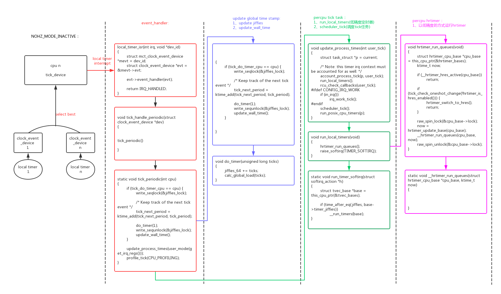

NOHZ_MODE_INACTIVE模式：

- tick_device工作在period模式，HW local timer工作在period/oneshot模式；
- noHZ没有使能，进入idle会被tick timer中断打断；
- hrtimer工作在低精度模式，和低精度定时器(SW local timer)的精度一样，都是基于tick的；

### 3.3.2、NOHZ_MODE_LOWRES

在系统的运行过程中系统尝试进入精度更高的模式，如果noHZ可以使能，但是hrtimer高精度不能使能，即进入NOHZ_MODE_LOWRES模式：“td=period模式, dev=oneshot模式, hrtimer=low res, noHz=en”。

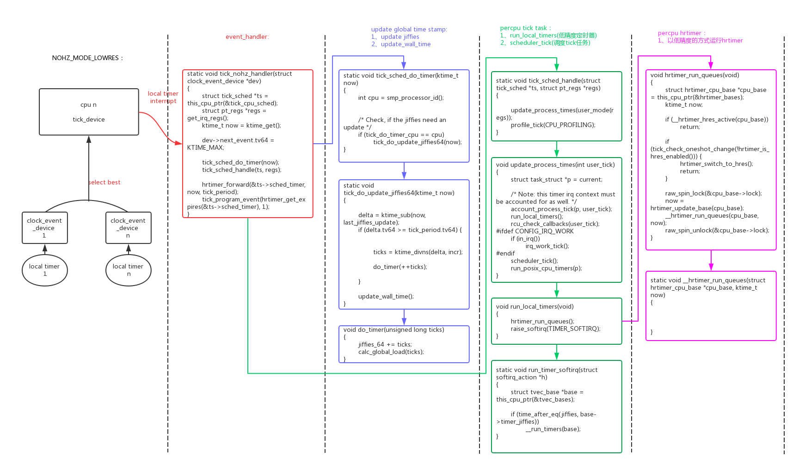

NOHZ_MODE_LOWRES模式：

- tick_device工作在oneshot模式，HW local timer工作在oneshot模式；
- noHZ使能，进入idle不会被tick timer中断打断；
- hrtimer工作在低精度模式，和低精度定时器(SW local timer)的精度一样，都是基于tick的；

为了支持noHZ，tick_device必须切换成oneshot模式，在进入idle时停掉tick timer(tick_nohz_idle_enter() ->　__tick_nohz_idle_enter() -> tick_nohz_stop_sched_tick())，在离开idle时恢复tick timer(tick_nohz_idle_exit() -> tick_nohz_restart_sched_tick())，这样idle过程就不会被tick中断。就实现了noHZ模式(tickless)。

NOHZ_MODE_LOWRES模式下，没有进入idle时tick_device还是以固定周期工作的：

```
static void tick_nohz_handler(struct clock_event_device *dev)
{
	struct tick_sched *ts = this_cpu_ptr(&tick_cpu_sched);
	struct pt_regs *regs = get_irq_regs();
	ktime_t now = ktime_get();

	dev->next_event.tv64 = KTIME_MAX;

	tick_sched_do_timer(now);
	tick_sched_handle(ts, regs);

	/* No need to reprogram if we are running tickless  */
	if (unlikely(ts->tick_stopped))
		return;

    /* (1) HW local timer还是以固定周期发生中断 */
	hrtimer_forward(&ts->sched_timer, now, tick_period);
	tick_program_event(hrtimer_get_expires(&ts->sched_timer), 1);
}

```

### 3.3.3、NOHZ_MODE_HIGHRES

在系统的运行过程中系统尝试进入精度更高的模式，如果noHZ可以使能，hrtimer高精度可以使能，即进入NOHZ_MODE_HIGHRES模式：“td=period模式, dev=oneshot模式, hrtimer=high res, noHz=en”。

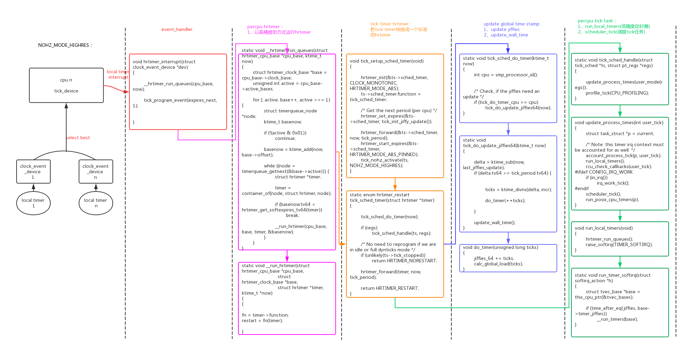

NOHZ_MODE_HIGHRES：

- tick_device工作在oneshot模式，HW local timer工作在oneshot模式；
- noHZ使能，进入idle不会被tick timer中断打断；
- hrtimer工作在高精度模式，和硬件定时器(HWlocal timer)的精度一样，远大于低精度定时器tick精度；

为了支持hrtimer的高精度模式，hrtimer必须直接使用tick_device的oneshot模式，而常规的tick timer转换成hrtimer的一个子timer。

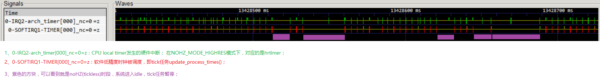

上图是NOHZ_MODE_HIGHRES模式下，用ftrace抓取HW timer硬件中断和tick任务的执行情况：

- tick任务是以固定周期4ms固定执行的；
- 遇到tick任务超过4ms的间隔，这时就是进入了idle状态，且发生了noHZ(tickless)；
- 硬件timer中断的发生周期是不固定的，是和hrtimer绑定的；
- 发生tick的时候肯定发生了timer硬中断，因为tick是其中一个hrtimer；


### 3.3.4、Mode切换

系统初始状态工作在NOHZ_MODE_INACTIVE模式时，会动态检测是否可以进入更高级别的模式NOHZ_MODE_LOWRES、NOHZ_MODE_HIGHRES。这个检测工作是在这个路径中做的：tick_device工作在period模式：tick_handle_periodic() -> tick_periodic() -> update_process_times() -> run_local_timers() -> hrtimer_run_queues()

```
void hrtimer_run_queues(void)
{
	struct hrtimer_cpu_base *cpu_base = this_cpu_ptr(&hrtimer_bases);
	ktime_t now;

    /* (3) 如果hrtimer已经切换到高精度模式，
        则不会从run_local_timers()低精度定时器路径来运行hrtimer */
	if (__hrtimer_hres_active(cpu_base))
		return;

	/*
	 * This _is_ ugly: We have to check periodically, whether we
	 * can switch to highres and / or nohz mode. The clocksource
	 * switch happens with xtime_lock held. Notification from
	 * there only sets the check bit in the tick_oneshot code,
	 * otherwise we might deadlock vs. xtime_lock.
	 */
	
	/* (1) 如果hrtimer没有使能、noHZ使能，
	    则调用：tick_check_oneshot_change() -> tick_nohz_switch_to_nohz()，
	    切换到NOHZ_MODE_LOWRES模式 */
	if (tick_check_oneshot_change(!hrtimer_is_hres_enabled())) {
	
	    /* (2) 如果hrtimer使能、noHZ使能，
    	    则调用：hrtimer_switch_to_hres()，
    	    切换到NOHZ_MODE_HIGHRES模式 */
		hrtimer_switch_to_hres();
		return;
	}

	raw_spin_lock(&cpu_base->lock);
	now = hrtimer_update_base(cpu_base);
	/* (4) 低精度hrtimer的运行函数 */
	__hrtimer_run_queues(cpu_base, now);
	raw_spin_unlock(&cpu_base->lock);
}

```

# 4、noHZ

系统在NOHZ_MODE_LOWRES、NOHZ_MODE_HIGHRES两种模式下支持noHZ。noHZ是一个功耗优化的feature，在系统负载比较轻的时候没有任务需要调度cpu会进入idle状态，但是系统的tick任务(update_process_times())默认会以固定周期执行，这种固定周期会打断idle状态让系统恢复成正常耗电状态。

tick任务这种不管有没有任务都是固定周期运行的特性是需要改进的，noHZ就是为了解决这一问题而产生的：如果在idle状态的过程中tick任务没有到期需要处理的低精度timer和高精度timer，tick任务可以继续保持睡眠，直到真正有timer到期。

idle进程的主要执行序列如下：

```
static void cpu_idle_loop(void)
{
	while (1) {

        /* (1) 进入idle前,noHZ的处理 */
		tick_nohz_idle_enter();

		while (!need_resched()) {
			check_pgt_cache();
			rmb();

            /* (2) cpu hotplug之cpu_down()的处理 */
			if (cpu_is_offline(smp_processor_id())) {

				arch_cpu_idle_dead();
			}

			local_irq_disable();
			arch_cpu_idle_enter();

            /* (3) cpu idle的进入 */
			if (cpu_idle_force_poll || tick_check_broadcast_expired())
				cpu_idle_poll();
			else
				cpuidle_idle_call();

			arch_cpu_idle_exit();
		}

        /* (4) 退出idle后,noHZ的处理 */
		tick_nohz_idle_exit();

	}
}
```

可以看到，其中的关键在tick_nohz_idle_enter()/tick_nohz_idle_exit()函数。

## 4.1、tick_nohz_idle_enter/exit()

tick_nohz_idle_enter()的解析：

```
void tick_nohz_idle_enter(void)
{
	struct tick_sched *ts;


	ts = this_cpu_ptr(&tick_cpu_sched);
	ts->inidle = 1;
	__tick_nohz_idle_enter(ts);

}
|→
static void __tick_nohz_idle_enter(struct tick_sched *ts)
{
	ktime_t now, expires;
	int cpu = smp_processor_id();

	now = tick_nohz_start_idle(ts);

    /* (1) 判断当前能否stop tick任务 */
	if (can_stop_idle_tick(cpu, ts)) {
		int was_stopped = ts->tick_stopped;

		ts->idle_calls++;

        /* (2) 尝试stop tick任务 */
		expires = tick_nohz_stop_sched_tick(ts, now, cpu);
		if (expires.tv64 > 0LL) {
			ts->idle_sleeps++;
			ts->idle_expires = expires;
		}

		if (!was_stopped && ts->tick_stopped)
			ts->idle_jiffies = ts->last_jiffies;
	}
}
||→
static ktime_t tick_nohz_stop_sched_tick(struct tick_sched *ts,
					 ktime_t now, int cpu)
{
	struct clock_event_device *dev = __this_cpu_read(tick_cpu_device.evtdev);
	u64 basemono, next_tick, next_tmr, next_rcu, delta, expires;
	unsigned long seq, basejiff;
	ktime_t	tick;

	/* Read jiffies and the time when jiffies were updated last */
	do {
		seq = read_seqbegin(&jiffies_lock);
		basemono = last_jiffies_update.tv64;
		basejiff = jiffies;
	} while (read_seqretry(&jiffies_lock, seq));
	ts->last_jiffies = basejiff;

	if (rcu_needs_cpu(basemono, &next_rcu) ||
	    arch_needs_cpu() || irq_work_needs_cpu()) {
		next_tick = basemono + TICK_NSEC;
	} else {
		/*
		 * Get the next pending timer. If high resolution
		 * timers are enabled this only takes the timer wheel
		 * timers into account. If high resolution timers are
		 * disabled this also looks at the next expiring
		 * hrtimer.
		 */
		/* (2.1) 获取下一个timer的到期时间(包括低精度和高精度timer) */
		next_tmr = get_next_timer_interrupt(basejiff, basemono);
		ts->next_timer = next_tmr;
		/* Take the next rcu event into account */
		next_tick = next_rcu < next_tmr ? next_rcu : next_tmr;
	}

	/*
	 * If the tick is due in the next period, keep it ticking or
	 * restart it proper.
	 */
	/* (2.2) 如果差距小于一个tick，不需要进入noHZ模式 */
	delta = next_tick - basemono;
	if (delta <= (u64)TICK_NSEC) {
		tick.tv64 = 0;
		if (!ts->tick_stopped)
			goto out;
		if (delta == 0) {
			/* Tick is stopped, but required now. Enforce it */
			tick_nohz_restart(ts, now);
			goto out;
		}
	}

	/*
	 * If this cpu is the one which updates jiffies, then give up
	 * the assignment and let it be taken by the cpu which runs
	 * the tick timer next, which might be this cpu as well. If we
	 * don't drop this here the jiffies might be stale and
	 * do_timer() never invoked. Keep track of the fact that it
	 * was the one which had the do_timer() duty last. If this cpu
	 * is the one which had the do_timer() duty last, we limit the
	 * sleep time to the timekeeping max_deferement value.
	 * Otherwise we can sleep as long as we want.
	 */
	/* (2.3) 根据timekeeper的可能溢出的位宽，得到的idle最大值 */
	delta = timekeeping_max_deferment();
	if (cpu == tick_do_timer_cpu) {
		tick_do_timer_cpu = TICK_DO_TIMER_NONE;
		ts->do_timer_last = 1;
	} else if (tick_do_timer_cpu != TICK_DO_TIMER_NONE) {
		delta = KTIME_MAX;
		ts->do_timer_last = 0;
	} else if (!ts->do_timer_last) {
		delta = KTIME_MAX;
	}

#ifdef CONFIG_NO_HZ_FULL
	/* Limit the tick delta to the maximum scheduler deferment */
	if (!ts->inidle)
		delta = min(delta, scheduler_tick_max_deferment());
#endif

	/* Calculate the next expiry time */
	if (delta < (KTIME_MAX - basemono))
		expires = basemono + delta;
	else
		expires = KTIME_MAX;

    /* (2.4) 综合上面条件，得到合理的stop tick的时间 */
	expires = min_t(u64, expires, next_tick);
	tick.tv64 = expires;

	/* Skip reprogram of event if its not changed */
	if (ts->tick_stopped && (expires == dev->next_event.tv64))
		goto out;

	/*
	 * nohz_stop_sched_tick can be called several times before
	 * the nohz_restart_sched_tick is called. This happens when
	 * interrupts arrive which do not cause a reschedule. In the
	 * first call we save the current tick time, so we can restart
	 * the scheduler tick in nohz_restart_sched_tick.
	 */
	if (!ts->tick_stopped) {
		nohz_balance_enter_idle(cpu);
		calc_load_enter_idle();

		ts->last_tick = hrtimer_get_expires(&ts->sched_timer);
		ts->tick_stopped = 1;
		trace_tick_stop(1, " ");
	}

	/*
	 * If the expiration time == KTIME_MAX, then we simply stop
	 * the tick timer.
	 */
	if (unlikely(expires == KTIME_MAX)) {
		if (ts->nohz_mode == NOHZ_MODE_HIGHRES)
			hrtimer_cancel(&ts->sched_timer);
		goto out;
	}

    /* (2.5) 实际的stop tick动作：
      将local timer的周期改为大于一个tick的时间，将idle时间延长  */
	if (ts->nohz_mode == NOHZ_MODE_HIGHRES)
		hrtimer_start(&ts->sched_timer, tick, HRTIMER_MODE_ABS_PINNED);
	else
		tick_program_event(tick, 1);
out:
	/* Update the estimated sleep length */
	ts->sleep_length = ktime_sub(dev->next_event, now);
	return tick;
}
```

tick_nohz_idle_exit()的解析：

```
void tick_nohz_idle_exit(void)
{
	struct tick_sched *ts = this_cpu_ptr(&tick_cpu_sched);
	ktime_t now;

	local_irq_disable();

	WARN_ON_ONCE(!ts->inidle);

	ts->inidle = 0;

	if (ts->idle_active || ts->tick_stopped)
		now = ktime_get();

	if (ts->idle_active)
		tick_nohz_stop_idle(ts, now);

	if (ts->tick_stopped) {
	    /* (1) 重启tick任务 */
		tick_nohz_restart_sched_tick(ts, now);
		tick_nohz_account_idle_ticks(ts);
	}

	local_irq_enable();
}
|→
static void tick_nohz_restart_sched_tick(struct tick_sched *ts, ktime_t now)
{
	/* Update jiffies first */
	tick_do_update_jiffies64(now);
	update_cpu_load_nohz();

	calc_load_exit_idle();
	touch_softlockup_watchdog();
	/*
	 * Cancel the scheduled timer and restore the tick
	 */
	ts->tick_stopped  = 0;
	ts->idle_exittime = now;

    /* (1.1) 重启local timer */
	tick_nohz_restart(ts, now);
}
||→
static void tick_nohz_restart(struct tick_sched *ts, ktime_t now)
{
	hrtimer_cancel(&ts->sched_timer);
	hrtimer_set_expires(&ts->sched_timer, ts->last_tick);

	/* Forward the time to expire in the future */
	hrtimer_forward(&ts->sched_timer, now, tick_period);

	if (ts->nohz_mode == NOHZ_MODE_HIGHRES)
		hrtimer_start_expires(&ts->sched_timer, HRTIMER_MODE_ABS_PINNED);
	else
		tick_program_event(hrtimer_get_expires(&ts->sched_timer), 1);
}
```

## 4.2 tick_nohz_irq_enter/exit()

因为在idle退出执行完本tick需要处理的timer后又需要重新关闭tick，系统设计了tick_nohz_irq_enter()/tick_nohz_irq_exit()来处理这种操作。在本次中断处理完timer后，在tick_nohz_irq_exit()中判断是否重新关闭tick任务。

```
static void cpu_idle_loop(void)
{
	while (1) {

        /* (1) 关闭tick */
		tick_nohz_idle_enter();

		while (!need_resched()) {
			check_pgt_cache();
			rmb();

            /* (2) cpu hotplug之cpu_down()的处理 */
			if (cpu_is_offline(smp_processor_id())) {

				arch_cpu_idle_dead();
			}

            /* (3) 关中断 */
			local_irq_disable();
			arch_cpu_idle_enter();

            /* (4) 进入idle，
                cpu进入暂停状态 */
			if (cpu_idle_force_poll || tick_check_broadcast_expired())
				cpu_idle_poll();
			else
				cpuidle_idle_call();
		    /* (5) cpu被local timer中断唤醒退出idle状态，继续执行；
		        但是因为irq是disable状态，中断服务程序并不能马上得到执行*/
			/* (5.1) 退出idle，并且开中断 */	
			
                    /* (6) 中断打开后，被阻塞的local timer中断服务得到执行，到期的软件timer得到执行；*/
                    /* (6.1) 退出中断时调用tick_nohz_irq_exit()，重新计算一个tick可以被stop的值 */
            
			arch_cpu_idle_exit();
		}

        /* (7) 重启tick */
		tick_nohz_idle_exit();

	}
}
```

tick_nohz_irq_enter()/tick_nohz_irq_exit()的代码解析：

```
static inline void tick_nohz_irq_enter(void)
{
	struct tick_sched *ts = this_cpu_ptr(&tick_cpu_sched);
	ktime_t now;

	if (!ts->idle_active && !ts->tick_stopped)
		return;
	now = ktime_get();
	if (ts->idle_active)
		tick_nohz_stop_idle(ts, now);
		
	/* (1) 基本就是空操作 */
	if (ts->tick_stopped) {
		tick_nohz_update_jiffies(now);
		tick_nohz_kick_tick(ts, now);
	}
}

void tick_nohz_irq_exit(void)
{
	struct tick_sched *ts = this_cpu_ptr(&tick_cpu_sched);

	if (ts->inidle)
	    /* (2) 重新判断stop tick任务 */
		__tick_nohz_idle_enter(ts);
	else
		tick_nohz_full_update_tick(ts);
}

```

## 4.3、local timer时钟被关闭时的处理

还有一种情况需要考虑，在系统进入深层次的idle状态时，local timer本身的时钟可能会被关闭。比如MTK平台进入soidle状态时，local timer本身会被停止，这时会用一个GPT timer来替代local timer继续工作。

核心函数是timer_setting_before_wfi()/timer_setting_after_wfi()：

- timer_setting_before_wfi()在进入idle前被调用，读出local timer的剩余值并配置到GPT timer中；
- timer_setting_after_wfi()在退出idle后被调用，读出GPT timer的值来重新恢复local timer；


```
static void timer_setting_before_wfi(bool f26m_off)
{
#ifndef USING_STD_TIMER_OPS
#ifdef CONFIG_SMP
	unsigned int timer_left = 0;

    /* (1) 读出local timer的剩余值 */
	timer_left = localtimer_get_counter();

    /* (2) 根据GPT timer在不同状态下的频率，把剩余值配置到GPT中 */
	if ((int)timer_left <= 0)
		gpt_set_cmp(IDLE_GPT, 1); /* Trigger idle_gpt Timeout imediately */
	else {
		if (f26m_off)
			gpt_set_cmp(IDLE_GPT, div_u64(timer_left, 406.25));
	else
		gpt_set_cmp(IDLE_GPT, timer_left);
	}

	if (f26m_off)
		gpt_set_clk(IDLE_GPT, GPT_CLK_SRC_RTC, GPT_CLK_DIV_1);

	start_gpt(IDLE_GPT);
#else
	gpt_get_cnt(GPT1, &timer_left);
#endif
#endif
}

static void timer_setting_after_wfi(bool f26m_off)
{
#ifndef USING_STD_TIMER_OPS
#ifdef CONFIG_SMP
    /* (3) 判断当前退出idle状态是否是因为GPT到期引起的 */
	if (gpt_check_and_ack_irq(IDLE_GPT)) {
	    /* (3.1) 如果GPT时间已经到期，证明local timer也已经到期，
	        触发local timer在下一时钟执行 */
		localtimer_set_next_event(1);
		if (f26m_off)
			gpt_set_clk(IDLE_GPT, GPT_CLK_SRC_SYS, GPT_CLK_DIV_1);
	} else {
	/* (4) 退出idle是因为GPT以外的中断源唤醒的 */
		/* waked up by other wakeup source */
		unsigned int cnt, cmp;

        /* (4.1) 读出GPT中的剩余到期值，重新配置到local timer中 */
		idle_gpt_get_cnt(IDLE_GPT, &cnt);
		idle_gpt_get_cmp(IDLE_GPT, &cmp);
		if (unlikely(cmp < cnt)) {
			idle_err("[%s]GPT%d: counter = %10u, compare = %10u\n",
					__func__, IDLE_GPT + 1, cnt, cmp);
			/* BUG(); */
		}

		if (f26m_off) {
			localtimer_set_next_event((cmp - cnt) * 1625 / 4);
			gpt_set_clk(IDLE_GPT, GPT_CLK_SRC_SYS, GPT_CLK_DIV_1);
		} else {
		localtimer_set_next_event(cmp - cnt);
		}
		stop_gpt(IDLE_GPT);
	}
#endif
#endif
}
```

需要特别说明的是，这种GPT timer全局只有一个，进入soidle的状态时cpu也只有一个在线，所以能正常的工作。


# 5、hrtimer

## 5.1、hrtimer的组织

hrtimer的组织相对来说还是比较简单的，每个cpu对应一个hrtimer_cpu_base，每个hrtimer_cpu_base中有4类clock_base代表4种时间类型(HRTIMER_BASE_REALTIME、HRTIMER_BASE_MONOTONIC、HRTIMER_BASE_BOOTTIME、HRTIMER_BASE_TAI)的hrtimer，每个clock_base是以红黑树来组织同一类型的hrtimer的：

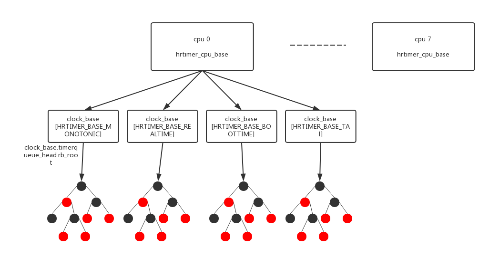

```
DEFINE_PER_CPU(struct hrtimer_cpu_base, hrtimer_bases) =
{
	.lock = __RAW_SPIN_LOCK_UNLOCKED(hrtimer_bases.lock),
	.seq = SEQCNT_ZERO(hrtimer_bases.seq),
	.clock_base =
	{
		{
			.index = HRTIMER_BASE_MONOTONIC,
			.clockid = CLOCK_MONOTONIC,
			.get_time = &ktime_get,
		},
		{
			.index = HRTIMER_BASE_REALTIME,
			.clockid = CLOCK_REALTIME,
			.get_time = &ktime_get_real,
		},
		{
			.index = HRTIMER_BASE_BOOTTIME,
			.clockid = CLOCK_BOOTTIME,
			.get_time = &ktime_get_boottime,
		},
		{
			.index = HRTIMER_BASE_TAI,
			.clockid = CLOCK_TAI,
			.get_time = &ktime_get_clocktai,
		},
	}
};
```

## 5.2、低精度模式(NOHZ_MODE_INACTIVE/NOHZ_MODE_LOWRES)

前面几章已经详细描述了执行路径，在低精度模式下hrtimer的实际精度和低精度定时器是一样的，都是基于tick精度的。他的执行路径如下。

NOHZ_MODE_INACTIVE模式：

```
tick_handle_periodic()
    ↓
tick_periodic()
    ↓
update_process_times()
    ↓
run_local_timers()
    ↓
hrtimer_run_queues()
    ↓
__hrtimer_run_queues()
```

NOHZ_MODE_LOWRES模式：

```
tick_nohz_handler()
    ↓
tick_sched_handle()
    ↓
update_process_times()
    ↓
run_local_timers()
    ↓
hrtimer_run_queues()
    ↓
__hrtimer_run_queues()
```

## 5.3、高精度模式(NOHZ_MODE_HIGHRES)

在高精度模式下hrtimer才能发挥出真正的精度，他的可以精确定时到小于一个tick，精度依赖于硬件local timer。

NOHZ_MODE_LOWRES模式：

```
hrtimer_interrupt()
    ↓
__hrtimer_run_queues()
```

# 6、低精度timer(lowres timer)

低精度timer在系统中的应用范围更广，若非特别声明是hrtimer其他都是使用低精度timer，类如schedule_timeout()、msleep()。他有以下特点：

- 精度低，以tick为单位计时；
- 执行上下文，低精度timer执行时是在softirq中，而hrtimer的实际执行是在中断当中。所以低精度的执行精度更小于hrtimer；
- 对系统的实时影响小，softirq比irq对系统的实时性影响更小；

## 6.1、低精度timer的组织

低精度timer的组织形式和hrtimer类似，只是timer的链接不是采用红黑树，而是采用tv1 - tv5等一系列的链表。

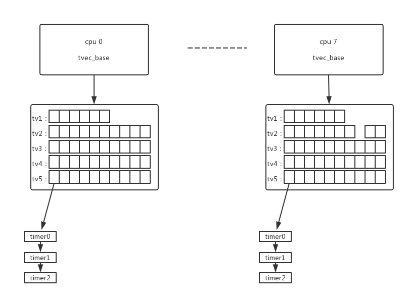

tv1 - tv5中保留着一系列槽位，每个槽位代表一个超时时间，把相同超时时间的低精度timer链接到同一槽位当中。

## 6.2、低精度timer的执行路径

低精度timer的实际执行时在softirq中执行的，在中断中的动作只是简单触发softirq。

中断中：

```
tick_handle_periodic()/tick_nohz_handler()/hrtimer_interrupt()
    ↓
run_local_timers()
    ↓
raise_softirq(TIMER_SOFTIRQ);
```

软中断中：

```
run_timer_softirq()
    ↓
__run_timers()
```

# 参考资料

[^DroidPhoneo]: [Linux 时间子系统](http://blog.csdn.net/DroidPhone/article/category/1263459)

[^wowo]: [wowotech time subsystem](http://www.wowotech.net/timer_subsystem/time_subsystem_index.html)


