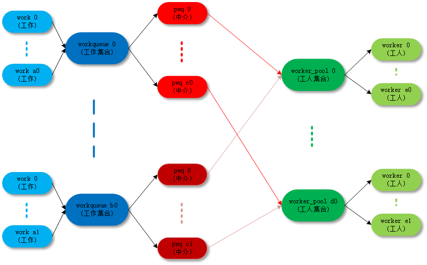
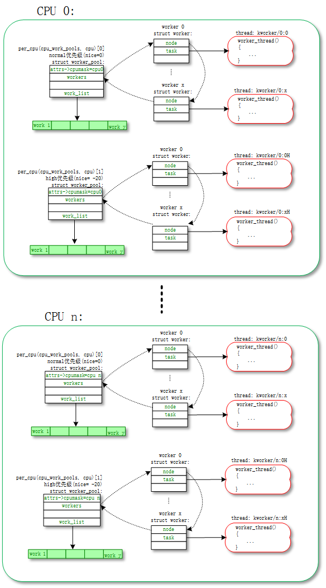
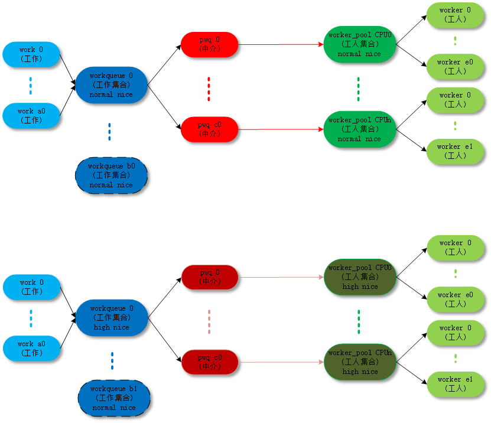
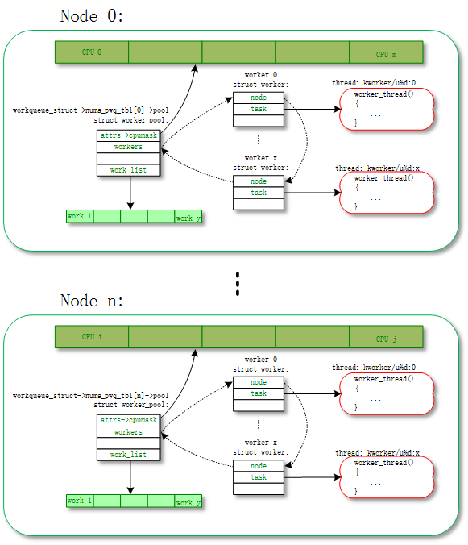
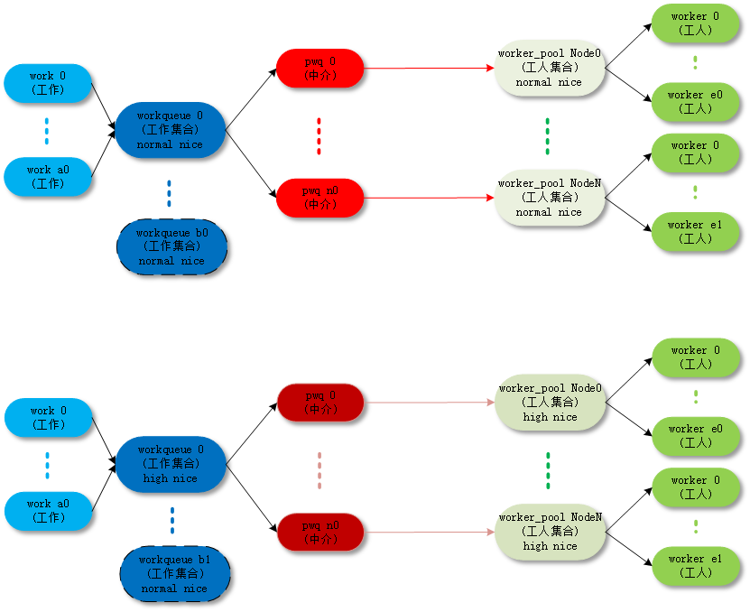
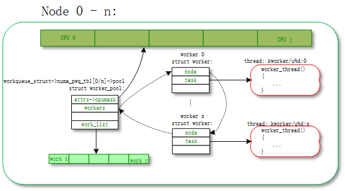
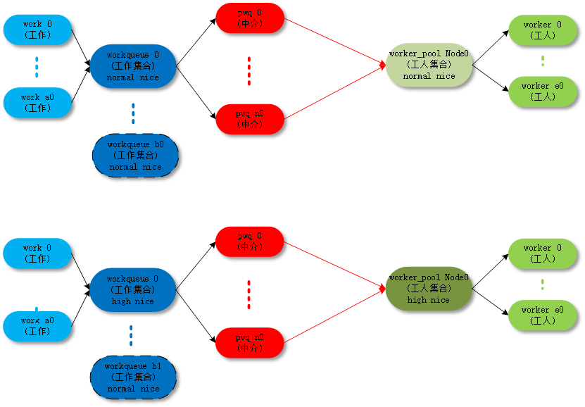
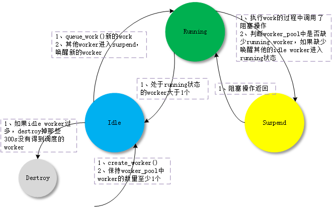

workqueue是内核里面很重要的一个机制，特别是内核驱动，一般的小型任务(work)都不会自己起一个线程来处理，而是扔到workqueu中处理。workqueue的主要工作就是用进程上下文来处理内核中大量的小任务。  

所以workqueue的主要设计思想：一个是并行，多个work不要相互阻塞；另外一个是节省资源，多个work尽量共享资源(进程、调度、内存)，不要造成系统过多的资源浪费。  

为了实现的设计思想，workqueue的设计实现也更新了很多版本。最新的workqueue实现叫做CMWQ(Concurrency Managed Workqueue)，也就是用更加智能的算法来实现“并行和节省”。新版本的workque创建函数改成alloc_workqueue()，旧版本的函数create_*workqueue()逐渐会被被废弃。

> 本文的代码分析基于linux kernel 3.18.22，最好的学习方法还是"read the fucking source code"

# 1.CMWQ的几个基本概念

关于workqueue中几个概念都是work相关的数据结构非常容易混淆，大概可以这样来理解：

- work		：工作。
- workqueue	：工作的集合。workqueue和work是一对多的关系。
- worker	：工人。在代码中worker对应一个work_thread()内核线程。
- worker_pool：工人的集合。worker_pool和worker是一对多的关系。
- pwq(pool_workqueue)：中间人/中介，负责建立起workqueue和worker_pool之间的关系。workqueue和pwq是一对多的关系，pwq和worker_pool是一对一的关系。




最终的目的还是把work(工作)传递给worker(工人)去执行，中间的数据结构和各种关系目的是把这件事组织的更加清晰高效。

## 1.1 worker_pool

每个执行work的线程叫做worker，一组worker的集合叫做worker_pool。CMWQ的精髓就在worker_pool里面worker的动态增减管理上manage_workers()。

CMWQ对worker_pool分成两类：  

- normal worker_pool，给通用的workqueue使用；
- unbound worker_pool，给WQ_UNBOUND类型的的workqueue使用；

### 1.1.1 normal worker_pool

默认work是在normal worker_pool中处理的。系统的规划是每个cpu创建两个normal worker_pool：一个normal优先级(nice=0)、一个高优先级(nice=HIGHPRI_NICE_LEVEL)，对应创建出来的worker的进程nice不一样。

每个worker对应一个worker_thread()内核线程，一个worker_pool包含一个或者多个worker，worker_pool中worker的数量是根据worker_pool中work的负载来动态增减的。

我们可以通过“ps\|grep kworker”命令来查看所有worker对应的内核线程，normal worker_pool对应内核线程(worker_thread())的命名规则是这样的：


```cpp
	snprintf(id_buf, sizeof(id_buf), "%d:%d%s", pool->cpu, id,
		 pool->attrs->nice < 0  ? "H" : "");

	worker->task = kthread_create_on_node(worker_thread, worker, pool->node,
					      "kworker/%s", id_buf);
```

so类似名字是normal worker_pool：

```
shell@PRO5:/ $ ps | grep "kworker"
root      14    2     0      0     worker_thr 0000000000 S kworker/1:0H		// cpu1 高优先级worker_pool的第0个worker进程
root      17    2     0      0     worker_thr 0000000000 S kworker/2:0		// cpu2 低优先级worker_pool的第0个worker进程
root      18    2     0      0     worker_thr 0000000000 S kworker/2:0H		// cpu2 高优先级worker_pool的第0个worker进程
root      23699 2     0      0     worker_thr 0000000000 S kworker/0:1		// cpu0 低优先级worker_pool的第1个worker进程
```


 

对应的拓扑图如下：



以下是normal worker_pool详细的创建过程代码分析：

- kernel/workqueue.c:  
- init_workqueues() -> init_worker_pool()/create_worker()

```cpp
static int __init init_workqueues(void)
{
	int std_nice[NR_STD_WORKER_POOLS] = { 0, HIGHPRI_NICE_LEVEL };
	int i, cpu;

	// (1)给每个cpu创建对应的worker_pool
	/* initialize CPU pools */
	for_each_possible_cpu(cpu) {
		struct worker_pool *pool;

		i = 0;
		for_each_cpu_worker_pool(pool, cpu) {
			BUG_ON(init_worker_pool(pool));
			// 指定cpu
			pool->cpu = cpu;
			cpumask_copy(pool->attrs->cpumask, cpumask_of(cpu));
			// 指定进程优先级nice
			pool->attrs->nice = std_nice[i++];
			pool->node = cpu_to_node(cpu);

			/* alloc pool ID */
			mutex_lock(&wq_pool_mutex);
			BUG_ON(worker_pool_assign_id(pool));
			mutex_unlock(&wq_pool_mutex);
		}
	}

	// (2)给每个worker_pool创建第一个worker
	/* create the initial worker */
	for_each_online_cpu(cpu) {
		struct worker_pool *pool;

		for_each_cpu_worker_pool(pool, cpu) {
			pool->flags &= ~POOL_DISASSOCIATED;
			BUG_ON(!create_worker(pool));
		}
	}

}
| →
static int init_worker_pool(struct worker_pool *pool)
{
	spin_lock_init(&pool->lock);
	pool->id = -1;
	pool->cpu = -1;
	pool->node = NUMA_NO_NODE;
	pool->flags |= POOL_DISASSOCIATED;
	// (1.1) worker_pool的work list，各个workqueue把work挂载到这个链表上，
	// 让worker_pool对应的多个worker来执行
	INIT_LIST_HEAD(&pool->worklist);
	// (1.2) worker_pool的idle worker list，
	// worker没有活干时，不会马上销毁，先进入idle状态备选
	INIT_LIST_HEAD(&pool->idle_list);
	// (1.3) worker_pool的busy worker list，
	// worker正在干活，在执行work
	hash_init(pool->busy_hash);

	// (1.4) 检查idle状态worker是否需要destroy的timer
	init_timer_deferrable(&pool->idle_timer);
	pool->idle_timer.function = idle_worker_timeout;
	pool->idle_timer.data = (unsigned long)pool;

	// (1.5) 在worker_pool创建新的worker时，检查是否超时的timer
	setup_timer(&pool->mayday_timer, pool_mayday_timeout,
		    (unsigned long)pool);

	mutex_init(&pool->manager_arb);
	mutex_init(&pool->attach_mutex);
	INIT_LIST_HEAD(&pool->workers);

	ida_init(&pool->worker_ida);
	INIT_HLIST_NODE(&pool->hash_node);
	pool->refcnt = 1;

	/* shouldn't fail above this point */
	pool->attrs = alloc_workqueue_attrs(GFP_KERNEL);
	if (!pool->attrs)
		return -ENOMEM;
	return 0;
}
| →
static struct worker *create_worker(struct worker_pool *pool)
{
	struct worker *worker = NULL;
	int id = -1;
	char id_buf[16];

	/* ID is needed to determine kthread name */
	id = ida_simple_get(&pool->worker_ida, 0, 0, GFP_KERNEL);
	if (id < 0)
		goto fail;

	worker = alloc_worker(pool->node);
	if (!worker)
		goto fail;

	worker->pool = pool;
	worker->id = id;

	if (pool->cpu >= 0)
		// (2.1) 给normal worker_pool的worker构造进程名
		snprintf(id_buf, sizeof(id_buf), "%d:%d%s", pool->cpu, id,
			 pool->attrs->nice < 0  ? "H" : "");
	else
		// (2.2) 给unbound worker_pool的worker构造进程名
		snprintf(id_buf, sizeof(id_buf), "u%d:%d", pool->id, id);

	// (2.3) 创建worker对应的内核进程
	worker->task = kthread_create_on_node(worker_thread, worker, pool->node,
					      "kworker/%s", id_buf);
	if (IS_ERR(worker->task))
		goto fail;

	// (2.4) 设置内核进程对应的优先级nice
	set_user_nice(worker->task, pool->attrs->nice);

	/* prevent userland from meddling with cpumask of workqueue workers */
	worker->task->flags |= PF_NO_SETAFFINITY;

	// (2.5) 将worker和worker_pool绑定
	/* successful, attach the worker to the pool */
	worker_attach_to_pool(worker, pool);

	// (2.6) 将worker初始状态设置成idle，
	// wake_up_process以后，worker自动leave idle状态
	/* start the newly created worker */
	spin_lock_irq(&pool->lock);
	worker->pool->nr_workers++;
	worker_enter_idle(worker);
	wake_up_process(worker->task);
	spin_unlock_irq(&pool->lock);

	return worker;

fail:
	if (id >= 0)
		ida_simple_remove(&pool->worker_ida, id);
	kfree(worker);
	return NULL;
}
|| →
static void worker_attach_to_pool(struct worker *worker,
				   struct worker_pool *pool)
{
	mutex_lock(&pool->attach_mutex);

	// (2.5.1) 将worker线程和cpu绑定
	/*
	 * set_cpus_allowed_ptr() will fail if the cpumask doesn't have any
	 * online CPUs.  It'll be re-applied when any of the CPUs come up.
	 */
	set_cpus_allowed_ptr(worker->task, pool->attrs->cpumask);

	/*
	 * The pool->attach_mutex ensures %POOL_DISASSOCIATED remains
	 * stable across this function.  See the comments above the
	 * flag definition for details.
	 */
	if (pool->flags & POOL_DISASSOCIATED)
		worker->flags |= WORKER_UNBOUND;

	// (2.5.2) 将worker加入worker_pool链表
	list_add_tail(&worker->node, &pool->workers);

	mutex_unlock(&pool->attach_mutex);
}

```


### 1.1.2 unbound worker_pool

大部分的work都是通过normal worker_pool来执行的(例如通过schedule_work()、schedule_work_on()压入到系统workqueue(system_wq)中的work)，最后都是通过normal worker_pool中的worker来执行的。这些worker是和某个cpu绑定的，work一旦被worker开始执行，都是一直运行到某个cpu上的不会切换cpu。

unbound worker_pool相对应的意思，就是worker可以在多个cpu上调度的。但是他其实也是绑定的，只不过它绑定的单位不是cpu而是node。所谓的node是对NUMA(Non Uniform Memory Access Architecture)系统来说的，NUMA可能存在多个node，每个node可能包含一个或者多个cpu。

unbound worker_pool对应内核线程(worker_thread())的命名规则是这样的：

```cpp
	snprintf(id_buf, sizeof(id_buf), "u%d:%d", pool->id, id);

	worker->task = kthread_create_on_node(worker_thread, worker, pool->node,
					      "kworker/%s", id_buf);
```

so类似名字是unbound worker_pool：

```
shell@PRO5:/ $ ps | grep "kworker"
root      23906 2     0      0     worker_thr 0000000000 S kworker/u20:2	// unbound pool 20的第2个worker进程
root      24564 2     0      0     worker_thr 0000000000 S kworker/u20:0	// unbound pool 20的第0个worker进程
root      24622 2     0      0     worker_thr 0000000000 S kworker/u21:1	// unbound pool 21的第1个worker进程

```

unbound worker_pool也分成两类：

- unbound_std_wq。每个node对应一个worker_pool，多个node就对应多个worker_pool;

  

对应的拓扑图如下：



- ordered_wq。所有node对应一个default worker_pool；

  

对应的拓扑图如下：




以下是unbound worker_pool详细的创建过程代码分析：

- kernel/workqueue.c:  
- init_workqueues() -> unbound_std_wq_attrs/ordered_wq_attrs

```cpp
static int __init init_workqueues(void)
{

	// (1) 初始化normal和high nice对应的unbound attrs
	/* create default unbound and ordered wq attrs */
	for (i = 0; i < NR_STD_WORKER_POOLS; i++) {
		struct workqueue_attrs *attrs;

		// (2) unbound_std_wq_attrs
		BUG_ON(!(attrs = alloc_workqueue_attrs(GFP_KERNEL)));
		attrs->nice = std_nice[i];
		unbound_std_wq_attrs[i] = attrs;

		/*
		 * An ordered wq should have only one pwq as ordering is
		 * guaranteed by max_active which is enforced by pwqs.
		 * Turn off NUMA so that dfl_pwq is used for all nodes.
		 */
		// (3) ordered_wq_attrs，no_numa = true;
		BUG_ON(!(attrs = alloc_workqueue_attrs(GFP_KERNEL)));
		attrs->nice = std_nice[i];
		attrs->no_numa = true;
		ordered_wq_attrs[i] = attrs;
	}


}
```

- kernel/workqueue.c:  
- __alloc_workqueue_key() -> alloc_and_link_pwqs() -> apply_workqueue_attrs() -> alloc_unbound_pwq()/numa_pwq_tbl_install()


```cpp
struct workqueue_struct *__alloc_workqueue_key(const char *fmt,
					       unsigned int flags,
					       int max_active,
					       struct lock_class_key *key,
					       const char *lock_name, ...)
{
	size_t tbl_size = 0;
	va_list args;
	struct workqueue_struct *wq;
	struct pool_workqueue *pwq;

	/* see the comment above the definition of WQ_POWER_EFFICIENT */
	if ((flags & WQ_POWER_EFFICIENT) && wq_power_efficient)
		flags |= WQ_UNBOUND;

	/* allocate wq and format name */
	if (flags & WQ_UNBOUND)
		tbl_size = nr_node_ids * sizeof(wq->numa_pwq_tbl[0]);

	// (1) 分配workqueue_struct数据结构
	wq = kzalloc(sizeof(*wq) + tbl_size, GFP_KERNEL);
	if (!wq)
		return NULL;

	if (flags & WQ_UNBOUND) {
		wq->unbound_attrs = alloc_workqueue_attrs(GFP_KERNEL);
		if (!wq->unbound_attrs)
			goto err_free_wq;
	}

	va_start(args, lock_name);
	vsnprintf(wq->name, sizeof(wq->name), fmt, args);
	va_end(args);

	// (2) pwq最多放到worker_pool中的work数
	max_active = max_active ?: WQ_DFL_ACTIVE;
	max_active = wq_clamp_max_active(max_active, flags, wq->name);

	/* init wq */
	wq->flags = flags;
	wq->saved_max_active = max_active;
	mutex_init(&wq->mutex);
	atomic_set(&wq->nr_pwqs_to_flush, 0);
	INIT_LIST_HEAD(&wq->pwqs);
	INIT_LIST_HEAD(&wq->flusher_queue);
	INIT_LIST_HEAD(&wq->flusher_overflow);
	INIT_LIST_HEAD(&wq->maydays);

	lockdep_init_map(&wq->lockdep_map, lock_name, key, 0);
	INIT_LIST_HEAD(&wq->list);

	// (3) 给workqueue分配对应的pool_workqueue
	// pool_workqueue将workqueue和worker_pool链接起来
	if (alloc_and_link_pwqs(wq) < 0)
		goto err_free_wq;

	// (4) 如果是WQ_MEM_RECLAIM类型的workqueue
	// 创建对应的rescuer_thread()内核进程
	/*
	 * Workqueues which may be used during memory reclaim should
	 * have a rescuer to guarantee forward progress.
	 */
	if (flags & WQ_MEM_RECLAIM) {
		struct worker *rescuer;

		rescuer = alloc_worker(NUMA_NO_NODE);
		if (!rescuer)
			goto err_destroy;

		rescuer->rescue_wq = wq;
		rescuer->task = kthread_create(rescuer_thread, rescuer, "%s",
					       wq->name);
		if (IS_ERR(rescuer->task)) {
			kfree(rescuer);
			goto err_destroy;
		}

		wq->rescuer = rescuer;
		rescuer->task->flags |= PF_NO_SETAFFINITY;
		wake_up_process(rescuer->task);
	}

	// (5) 如果是需要，创建workqueue对应的sysfs文件
	if ((wq->flags & WQ_SYSFS) && workqueue_sysfs_register(wq))
		goto err_destroy;

	/*
	 * wq_pool_mutex protects global freeze state and workqueues list.
	 * Grab it, adjust max_active and add the new @wq to workqueues
	 * list.
	 */
	mutex_lock(&wq_pool_mutex);

	mutex_lock(&wq->mutex);
	for_each_pwq(pwq, wq)
		pwq_adjust_max_active(pwq);
	mutex_unlock(&wq->mutex);

	// (6) 将新的workqueue加入到全局链表workqueues中
	list_add(&wq->list, &workqueues);

	mutex_unlock(&wq_pool_mutex);

	return wq;

err_free_wq:
	free_workqueue_attrs(wq->unbound_attrs);
	kfree(wq);
	return NULL;
err_destroy:
	destroy_workqueue(wq);
	return NULL;
}
| →
static int alloc_and_link_pwqs(struct workqueue_struct *wq)
{
	bool highpri = wq->flags & WQ_HIGHPRI;
	int cpu, ret;

	// (3.1) normal workqueue
	// pool_workqueue链接workqueue和worker_pool的过程
	if (!(wq->flags & WQ_UNBOUND)) {
		// 给workqueue的每个cpu分配对应的pool_workqueue，赋值给wq->cpu_pwqs
		wq->cpu_pwqs = alloc_percpu(struct pool_workqueue);
		if (!wq->cpu_pwqs)
			return -ENOMEM;

		for_each_possible_cpu(cpu) {
			struct pool_workqueue *pwq =
				per_cpu_ptr(wq->cpu_pwqs, cpu);
			struct worker_pool *cpu_pools =
				per_cpu(cpu_worker_pools, cpu);

			// 将初始化时已经创建好的normal worker_pool，赋值给pool_workqueue
			init_pwq(pwq, wq, &cpu_pools[highpri]);

			mutex_lock(&wq->mutex);
			// 将pool_workqueue和workqueue链接起来
			link_pwq(pwq);
			mutex_unlock(&wq->mutex);
		}
		return 0;
	} else if (wq->flags & __WQ_ORDERED) {
	// (3.2) unbound ordered_wq workqueue
	// pool_workqueue链接workqueue和worker_pool的过程
		ret = apply_workqueue_attrs(wq, ordered_wq_attrs[highpri]);
		/* there should only be single pwq for ordering guarantee */
		WARN(!ret && (wq->pwqs.next != &wq->dfl_pwq->pwqs_node ||
			      wq->pwqs.prev != &wq->dfl_pwq->pwqs_node),
		     "ordering guarantee broken for workqueue %s\n", wq->name);
		return ret;
	} else {
	// (3.3) unbound unbound_std_wq workqueue
	// pool_workqueue链接workqueue和worker_pool的过程
		return apply_workqueue_attrs(wq, unbound_std_wq_attrs[highpri]);
	}
}
|| →
int apply_workqueue_attrs(struct workqueue_struct *wq,
			  const struct workqueue_attrs *attrs)
{

	// (3.2.1) 根据的ubound的ordered_wq_attrs/unbound_std_wq_attrs
	// 创建对应的pool_workqueue和worker_pool
	// 其中worker_pool不是默认创建好的，是需要动态创建的，对应的worker内核进程也要重新创建
	// 创建好的pool_workqueue赋值给pwq_tbl[node]
	/*
	 * If something goes wrong during CPU up/down, we'll fall back to
	 * the default pwq covering whole @att- kernel/workqueue.c:  
- __alloc_workqueue_key() -> alloc_and_link_pwqs() -> apply_workqueue_attrs() -> alloc_unbound_pwq()/numa_pwq_tbl_install()rs->cpumask.  Always create
	 * it even if we don't use it immediately.
	 */
	dfl_pwq = alloc_unbound_pwq(wq, new_attrs);
	if (!dfl_pwq)
		goto enomem_pwq;

	for_each_node(node) {
		if (wq_calc_node_cpumask(attrs, node, -1, tmp_attrs->cpumask)) {
			pwq_tbl[node] = alloc_unbound_pwq(wq, tmp_attrs);
			if (!pwq_tbl[node])
				goto enomem_pwq;
		} else {
			dfl_pwq->refcnt++;
			pwq_tbl[node] = dfl_pwq;
		}
	}


	/* save the previous pwq and install the new one */
	// (3.2.2) 将临时pwq_tbl[node]赋值给wq->numa_pwq_tbl[node]
	for_each_node(node)
		pwq_tbl[node] = numa_pwq_tbl_install(wq, node, pwq_tbl[node]);

}
||| →
static struct pool_workqueue *alloc_unbound_pwq(struct workqueue_struct *wq,
					const struct workqueue_attrs *attrs)
{
	struct worker_pool *pool;
	struct pool_workqueue *pwq;

	lockdep_assert_held(&wq_pool_mutex);

	// (3.2.1.1) 如果对应attrs已经创建多对应的unbound_pool，则使用已有的unbound_pool
	// 否则根据attrs创建新的unbound_pool
	pool = get_unbound_pool(attrs);
	if (!pool)
		return NULL;

	pwq = kmem_cache_alloc_node(pwq_cache, GFP_KERNEL, pool->node);
	if (!pwq) {
		put_unbound_pool(pool);
		return NULL;
	}

	init_pwq(pwq, wq, pool);
	return pwq;
}


```

## 1.2 worker

每个worker对应一个worker_thread()内核线程，一个worker_pool对应一个或者多个worker。多个worker从同一个链表中worker_pool->worklist获取work进行处理。

所以这其中有几个重点：

- worker怎么处理work；
- worker_pool怎么动态管理worker的数量；

### 1.2.1 worker处理work

处理work的过程主要在worker_thread() -> process_one_work()中处理，我们具体看看代码的实现过程。

- kernel/workqueue.c:  
- worker_thread() -> process_one_work()


```cpp

static int worker_thread(void *__worker)
{
	struct worker *worker = __worker;
	struct worker_pool *pool = worker->pool;

	/* tell the scheduler that this is a workqueue worker */
	worker->task->flags |= PF_WQ_WORKER;
woke_up:
	spin_lock_irq(&pool->lock);

	// (1) 是否die
	/* am I supposed to die? */
	if (unlikely(worker->flags & WORKER_DIE)) {
		spin_unlock_irq(&pool->lock);
		WARN_ON_ONCE(!list_empty(&worker->entry));
		worker->task->flags &= ~PF_WQ_WORKER;

		set_task_comm(worker->task, "kworker/dying");
		ida_simple_remove(&pool->worker_ida, worker->id);
		worker_detach_from_pool(worker, pool);
		kfree(worker);
		return 0;
	}

	// (2) 脱离idle状态
	// 被唤醒之前worker都是idle状态
	worker_leave_idle(worker);
recheck:
	
	// (3) 如果需要本worker继续执行则继续，否则进入idle状态
	// need more worker的条件： (pool->worklist != 0) && (pool->nr_running == 0)
	// worklist上有work需要执行，并且现在没有处于running的work
	/* no more worker necessary? */
	if (!need_more_worker(pool))
		goto sleep;

	// (4) 如果(pool->nr_idle == 0)，则启动创建更多的worker
	// 说明idle队列中已经没有备用worker了，先创建 一些worker备用
	/* do we need to manage? */
	if (unlikely(!may_start_working(pool)) && manage_workers(worker))
		goto recheck;

	/*
	 * ->scheduled list can only be filled while a worker is
	 * preparing to process a work or actually processing it.
	 * Make sure nobody diddled with it while I was sleeping.
	 */
	WARN_ON_ONCE(!list_empty(&worker->scheduled));

	/*
	 * Finish PREP stage.  We're guaranteed to have at least one idle
	 * worker or that someone else has already assumed the manager
	 * role.  This is where @worker starts participating in concurrency
	 * management if applicable and concurrency management is restored
	 * after being rebound.  See rebind_workers() for details.
	 */
	worker_clr_flags(worker, WORKER_PREP | WORKER_REBOUND);

	do {
		// (5) 如果pool->worklist不为空，从其中取出一个work进行处理
		struct work_struct *work =
			list_first_entry(&pool->worklist,
					 struct work_struct, entry);

		if (likely(!(*work_data_bits(work) & WORK_STRUCT_LINKED))) {
			/* optimization path, not strictly necessary */
			// (6) 执行正常的work
			process_one_work(worker, work);
			if (unlikely(!list_empty(&worker->scheduled)))
				process_scheduled_works(worker);
		} else {
			// (7) 执行系统特意scheduled给某个worker的work
			// 普通的work是放在池子的公共list中的pool->worklist
			// 只有一些特殊的work被特意派送给某个worker的worker->scheduled
			// 包括：1、执行flush_work时插入的barrier work；
			// 2、collision时从其他worker推送到本worker的work
			move_linked_works(work, &worker->scheduled, NULL);
			process_scheduled_works(worker);
		}
	// (8) worker keep_working的条件：
	// pool->worklist不为空 && (pool->nr_running <= 1)
	} while (keep_working(pool));

	worker_set_flags(worker, WORKER_PREP);supposed
sleep:
	// (9) worker进入idle状态
	/*
	 * pool->lock is held and there's no work to process and no need to
	 * manage, sleep.  Workers are woken up only while holding
	 * pool->lock or from local cpu, so setting the current state
	 * before releasing pool->lock is enough to prevent losing any
	 * event.
	 */
	worker_enter_idle(worker);
	__set_current_state(TASK_INTERRUPTIBLE);
	spin_unlock_irq(&pool->lock);
	schedule();
	goto woke_up;
}
| →
static void process_one_work(struct worker *worker, struct work_struct *work)
__releases(&pool->lock)
__acquires(&pool->lock)
{
	struct pool_workqueue *pwq = get_work_pwq(work);
	struct worker_pool *pool = worker->pool;
	bool cpu_intensive = pwq->wq->flags & WQ_CPU_INTENSIVE;
	int work_color;
	struct worker *collision;
#ifdef CONFIG_LOCKDEP
	/*
	 * It is permissible to free the struct work_struct from
	 * inside the function that is called from it, this we need to
	 * take into account for lockdep too.  To avoid bogus "held
	 * lock freed" warnings as well as problems when looking into
	 * work->lockdep_map, make a copy and use that here.
	 */
	struct lockdep_map lockdep_map;

	lockdep_copy_map(&lockdep_map, &work->lockdep_map);
#endif
	/* ensure we're on the correct CPU */
	WARN_ON_ONCE(!(pool->flags & POOL_DISASSOCIATED) &&
		     raw_smp_processor_id() != pool->cpu);

	// (8.1) 如果work已经在worker_pool的其他worker上执行，
	// 将work放入对应worker的scheduled队列中延后执行
	/*
	 * A single work shouldn't be executed concurrently by
	 * multiple workers on a single cpu.  Check whether anyone is
	 * already processing the work.  If so, defer the work to the
	 * currently executing one.
	 */
	collision = find_worker_executing_work(pool, work);
	if (unlikely(collision)) {
		move_linked_works(work, &collision->scheduled, NULL);
		return;
	}

	// (8.2) 将worker加入busy队列pool->busy_hash
	/* claim and dequeue */
	debug_work_deactivate(work);
	hash_add(pool->busy_hash, &worker->hentry, (unsigned long)work);
	worker->current_work = work;
	worker->current_func = work->func;
	worker->current_pwq = pwq;
	work_color = get_work_color(work);

	list_del_init(&work->entry);

	// (8.3) 如果work所在的wq是cpu密集型的WQ_CPU_INTENSIVE
	// 则当前work的执行脱离worker_pool的动态调度，成为一个独立的线程
	/*
	 * CPU intensive works don't participate in concurrency management.
	 * They're the scheduler's responsibility.  This takes @worker out
	 * of concurrency management and the next code block will chain
	 * execution of the pending work items.
	 */
	if (unlikely(cpu_intensive))
		worker_set_flags(worker, WORKER_CPU_INTENSIVE);

	// (8.4) 在UNBOUND或者CPU_INTENSIVE work中判断是否需要唤醒idle worker
	// 普通work不会执行这个操作
	/*
	 * Wake up another worker if necessary.  The condition is always
	 * false for normal per-cpu workers since nr_running would always
	 * be >= 1 at this point.  This is used to chain execution of the
	 * pending work items for WORKER_NOT_RUNNING workers such as the
	 * UNBOUND and CPU_INTENSIVE ones.
	 */
	if (need_more_worker(pool))
		wake_up_worker(pool);

	/*
	 * Record the last pool and clear PENDING which should be the last
	 * update to @work.  Also, do this inside @pool->lock so that
	 * PENDING and queued state changes happen together while IRQ is
	 * disabled.
	 */
	set_work_pool_and_clear_pending(work, pool->id);

	spin_unlock_irq(&pool->lock);

	lock_map_acquire_read(&pwq->wq->lockdep_map);
	lock_map_acquire(&lockdep_map);
	trace_workqueue_execute_start(work);
	// (8.5) 执行work函数
	worker->current_func(work);
	/*
	 * While we must be careful to not use "work" after this, the trace
	 * point will only record its address.
	 */
	trace_workqueue_execute_end(work);
	lock_map_release(&lockdep_map);
	lock_map_release(&pwq->wq->lockdep_map);

	if (unlikely(in_atomic() || lockdep_depth(current) > 0)) {
		pr_err("BUG: workqueue leaked lock or atomic: %s/0x%08x/%d\n"
		       "     last function: %pf\n",
		       current->comm, preempt_count(), task_pid_nr(current),
		       worker->current_func);
		debug_show_held_locks(current);
		dump_stack();
	}

	/*
	 * The following prevents a kworker from hogging CPU on !PREEMPT
	 * kernels, where a requeueing work item waiting for something to
	 * happen could deadlock with stop_machine as such work item could
	 * indefinitely requeue itself while all other CPUs are trapped in
	 * stop_machine. At the same time, report a quiescent RCU state so
	 * the same condition doesn't freeze RCU.
	 */
	cond_resched_rcu_qs();

	spin_lock_irq(&pool->lock);

	/* clear cpu intensive status */
	if (unlikely(cpu_intensive))
		worker_clr_flags(worker, WORKER_CPU_INTENSIVE);

	/* we're done with it, release */
	hash_del(&worker->hentry);
	worker->current_work = NULL;
	worker->current_func = NULL;
	worker->current_pwq = NULL;
	worker->desc_valid = false;
	pwq_dec_nr_in_flight(pwq, work_color);
}

```

### 1.2.2 worker_pool动态管理worker

worker_pool怎么来动态增减worker，这部分的算法是CMWQ的核心。其思想如下：

- worker_pool中的worker有3种状态：idle、running、suspend；
- 如果worker_pool中有work需要处理，保持至少一个runn- kernel/workqueue.c:  
- worker_thread() -> process_one_work()
ing worker来处理；
- running worker在处理work的过程中进入了阻塞suspend状态，为了保持其他work的执行，需要唤醒新的idle worker来处理work；
- 如果有work需要执行且running worker大于1个，会让多余的running worker进入idle状态；
- 如果没有work需要执行，会让所有worker进入idle状态；
- 如果创建的worker过多，destroy_worker在300s(IDLE_WORKER_TIMEOUT)时间内没有再次运行的idle worker。



详细代码可以参考上节worker_thread() -> process_one_work()的分析。

为了追踪worker的running和suspend状态，用来动态调整worker的数量。wq使用在进程调度中加钩子函数的技巧：

- 追踪worker从suspend进入running状态：ttwu_activate() -> wq_worker_waking_up()

```cpp
void wq_worker_waking_up(struct task_struct *task, int cpu)
{
	struct worker *worker = kthread_data(task);

	if (!(worker->flags & WORKER_NOT_RUNNING)) {
		WARN_ON_ONCE(worker->pool->cpu != cpu);
		// 增加worker_pool中running的worker数量
		atomic_inc(&worker->pool->nr_running);
	}
}
```

- 追踪worker从running进入suspend状态：__schedule() -> wq_worker_sleeping()

```cpp
struct task_struct *wq_worker_sleeping(struct task_struct *task, int cpu)
{
	struct worker *worker = kthread_data(task), *to_wakeup = NULL;
	struct worker_pool *pool;

	/*
	 * Rescuers, which may not have all the fields set up like normal
	 * workers, also reach here, let's not access anything before
	 * checking NOT_RUNNING.
	 */
	if (worker->flags & WORKER_NOT_RUNNING)
		return NULL;

	pool = worker->pool;

	/* this can only happen on the local cpu */
	if (WARN_ON_ONCE(cpu != raw_smp_processor_id() || pool->cpu != cpu))
		return NULL;

	/*
	 * The counterpart of the following dec_and_test, implied mb,
	 * worklist not empty test sequence is in insert_work().
	 * Please read comment there.
	 *
	 * NOT_RUNNING is clear.  This means that we're bound to and
	 * running on the local cpu w/ rq lock held and preemption
	 * disabled, which in turn means that none else could be
	 * manipulating idle_list, so dereferencing idle_list without pool
	 * lock is safe.
	 */
	// 减少worker_pool中running的worker数量
	// 如果worklist还有work需要处理，唤醒第一个idle worker进行处理
	if (atomic_dec_and_test(&pool->nr_running) &&
	    !list_empty(&pool->worklist))
		to_wakeup = first_idle_worker(pool);
	return to_wakeup ? to_wakeup->task : NULL;
}
```

这里worker_pool的调度思想是：如果有work需要处理，保持一个running状态的worker处理，不多也不少。

但是这里有一个问题如果work是cpu密集型的，它虽然也没有进入suspend状态，但是会长时间的占用cpu，让后续的work阻塞太长时间。

为了解决这个问题，CMWQ设计了WQ_CPU_INTENSIVE，如果一个wq声明自己是CPU_INTENSIVE，则让当前worker脱离动态调度，像是进入了suspend状态，那么CMWQ会创建新的worker，后续的work会得到执行。

- kernel/workqueue.c:  
- worker_thread() -> process_one_work()

```cpp

static void process_one_work(struct worker *worker, struct work_struct *work)
__releases(&pool->lock)
__acquires(&pool->lock)
{

	bool cpu_intensive = pwq->wq->flags & WQ_CPU_INTENSIVE;


	// (1) 设置当前worker的WORKER_CPU_INTENSIVE标志
	// nr_running会被减1
	// 对worker_pool来说，当前worker相当于进入了suspend状态
	/*
	 * CPU intensive works don't participate in concurrency management.
	 * They're the scheduler's responsibility.  This takes @worker out
	 * of concurrency management and the next code block will chain
	 * execution of the pending work items.
	 */
	if (unlikely(cpu_intensive))
		worker_set_flags(worker, WORKER_CPU_INTENSIVE);

	// (2) 接上一步，判断是否需要唤醒新的worker来处理work
	/*
	 * Wake up another worker if necessary.  The condition is always
	 * false for normal per-cpu workers since nr_running would always
	 * be >= 1 at this point.  This is used to chain execution of the
	 * pending work items for WORKER_NOT_RUNNING workers such as the
	 * UNBOUND and CPU_INTENSIVE ones.
	 */
	if (need_more_worker(pool))
		wake_up_worker(pool);

	// (3) 执行work
	worker->current_func(work);


	// (4) 执行完，清理当前worker的WORKER_CPU_INTENSIVE标志
	// 当前worker重新进入running状态
	/* clear cpu intensive status */
	if (unlikely(cpu_intensive))
		worker_clr_flags(worker, WORKER_CPU_INTENSIVE);


}


	WORKER_NOT_RUNNING	= WORKER_PREP | WORKER_CPU_INTENSIVE |
				  WORKER_UNBOUND | WORKER_REBOUND,


static inline void worker_set_flags(struct worker *worker, unsigned int flags)
{
	struct worker_pool *pool = worker->pool;

	WARN_ON_ONCE(worker->task != current);

	/* If transitioning into NOT_RUNNING, adjust nr_running. */
	if ((flags & WORKER_NOT_RUNNING) &&
	    !(worker->flags & WORKER_NOT_RUNNING)) {
		atomic_dec(&pool->nr_running);
	}

	worker->flags |= flags;
}


static inline void worker_clr_flags(struct worker *worker, unsigned int flags)
{
	struct worker_pool *pool = worker->pool;
	unsigned int oflags = worker->flags;

	WARN_ON_ONCE(worker->task != current);

	worker->flags &= ~flags;

	/*
	 * If transitioning out of NOT_RUNNING, increment nr_running.  Note
	 * that the nested NOT_RUNNING is not a noop.  NOT_RUNNING is mask
	 * of multiple flags, not a single flag.
	 */
	if ((flags & WORKER_NOT_RUNNING) && (oflags & WORKER_NOT_RUNNING))
		if (!(worker->flags & WORKER_NOT_RUNNING))
			atomic_inc(&pool->nr_running);
}


```

### 1.2.3 cpu hotplug处理

从上几节可以看到，系统会创建和cpu绑定的normal worker_pool和不绑定cpu的unbound worker_pool，worker_pool又会动态的创建worker。

那么在cpu hotplug的时候，会怎么样动态的处理worker_pool和worker呢？来看具体的代码分析：

- kernel/workqueue.c:  
- workqueue_cpu_up_callback()/workqueue_cpu_down_callback()

```cpp
static int __init init_workqueues(void)
{

	cpu_notifier(workqueue_cpu_up_callback, CPU_PRI_WORKQUEUE_UP);
	hotcpu_notifier(workqueue_cpu_down_callback, CPU_PRI_WORKQUEUE_DOWN);

}
| →
static int workqueue_cpu_down_callback(struct notifier_block *nfb,
						 unsigned long action,
						 void *hcpu)
{
	int cpu = (unsigned long)hcpu;
	struct work_struct unbind_work;
	struct workqueue_struct *wq;

	switch (action & ~CPU_TASKS_FROZEN) {
	case CPU_DOWN_PREPARE:
		/* unbinding per-cpu workers should happen on the local CPU */
		INIT_WORK_ONSTACK(&unbind_work, wq_unbind_fn);
		// (1) cpu down_prepare
		// 把和当前cpu绑定的normal worker_pool上的worker停工
		// 随着当前cpu被down掉，这些worker会迁移到其他cpu上
		queue_work_on(cpu, system_highpri_wq, &unbind_work);

		// (2) unbound wq对cpu变化的更新
		/* update NUMA affinity of unbound workqueues */
		mutex_lock(&wq_pool_mutex);
		list_for_each_entry(wq, &workqueues, list)
			wq_update_unbound_numa(wq, cpu, false);
		mutex_unlock(&wq_pool_mutex);

		/* wait for per-cpu unbinding to finish */
		flush_work(&unbind_work);
		destroy_work_on_stack(&unbind_work);
		break;
	}
	return NOTIFY_OK;
}
| →
static int workqueue_cpu_up_callback(struct notifier_block *nfb,
					       unsigned long action,
					       void *hcpu)
{
	int cpu = (unsigned long)hcpu;
	struct worker_pool *pool;
	struct workqueue_struct *wq;
	int pi;

	switch (action & ~CPU_TASKS_FROZEN) {
	case CPU_UP_PREPARE:
		for_each_cpu_worker_pool(pool, cpu) {
			if (pool->nr_workers)
				continue;
			if (!create_worker(pool))
				return NOTIFY_BAD;
		}
		break;

	case CPU_DOWN_FAILED:
	case CPU_ONLINE:
		mutex_lock(&wq_pool_mutex);
		
		// (3) cpu up
		for_each_pool(pool, pi) {
			mutex_lock(&pool->attach_mutex);

			// 如果和当前cpu绑定的normal worker_pool上，有WORKER_UNBOUND停工的worker
			// 重新绑定worker到worker_pool
			// 让这些worker开工，并绑定到当前cpu
			if (pool->cpu == cpu)
				rebind_workers(pool);
			else if (pool->cpu < 0)
				restore_unbound_workers_cpumask(pool, cpu);

			mutex_unlock(&pool->attach_mutex);
		}

		/* update NUMA affinity of unbound workqueues */
		list_for_each_entry(wq, &workqueues, list)
			wq_update_unbound_numa(wq, cpu, true);

		mutex_unlock(&wq_pool_mutex);
		break;
	}
	return NOTIFY_OK;
}
```

## 1.3 workqueue

workqueue就是存放一组work的集合，基本可以分为两类：一类系统创建的workqueue，一类是用户自己创建的workqueue。

不论是系统还是用户workqueue，如果没有指定WQ_UNBOUND，默认都是和normal worker_pool绑定。

### 1.3.1 系统workqueue

系统在初始化时创建了一批默认的workqueue：system_wq、system_highpri_wq、system_long_wq、system_unbound_wq、system_freezable_wq、system_power_efficient_wq、system_freezable_power_efficient_wq。

像system_wq，就是schedule_work()默认使用的。

- kernel/workqueue.c:  
- init_workqueues()

```cpp
static int __init init_workqueues(void)
{

	system_wq = alloc_workqueue("events", 0, 0);
	system_highpri_wq = alloc_workqueue("events_highpri", WQ_HIGHPRI, 0);
	system_long_wq = alloc_workqueue("events_long", 0, 0);
	system_unbound_wq = alloc_workqueue("events_unbound", WQ_UNBOUND,
					    WQ_UNBOUND_MAX_ACTIVE);
	system_freezable_wq = alloc_workqueue("events_freezable",
					      WQ_FREEZABLE, 0);
	system_power_efficient_wq = alloc_workqueue("events_power_efficient",
					      WQ_POWER_EFFICIENT, 0);
	system_freezable_power_efficient_wq = alloc_workqueue("events_freezable_power_efficient",
					      WQ_FREEZABLE | WQ_POWER_EFFICIENT,
					      0);

}
```

### 1.3.2 workqueue创建

详细过程见上几节的代码分析：alloc_workqueue() -> __alloc_workqueue_key() -> alloc_and_link_pwqs()。

### 1.3.3 flush_workqueue()

这一部分的逻辑，wq->work_color、wq->flush_color换来换去的逻辑实在看的头晕。看不懂暂时不想看，放着以后看吧，或者有谁看懂了教我一下。：）

## 1.4 pool_workqueue

pool_workqueue只是一个中介角色。

详细过程见上几节的代码分析：alloc_workqueue() -> __alloc_workqueue_key() -> alloc_and_link_pwqs()。

## 1.5 work

描述一份待执行的工作。

### 1.5.1 queue_work()

将work压入到workqueue当中。

- kernel/workqueue.c:  
- queue_work() -> queue_work_on() -> __queue_work()

```cpp
static void __queue_work(int cpu, struct workqueue_struct *wq,
			 struct work_struct *work)
{
	struct pool_workqueue *pwq;
	struct worker_pool *last_pool;
	struct list_head *worklist;
	unsigned int work_flags;
	unsigned int req_cpu = cpu;

	/*
	 * While a work item is PENDING && off queue, a task trying to
	 * steal the PENDING will busy-loop waiting for it to either get
	 * queued or lose PENDING.  Grabbing PENDING and queueing should
	 * happen with IRQ disabled.
	 */
	WARN_ON_ONCE(!irqs_disabled());

	debug_work_activate(work);

	/* if draining, only works from the same workqueue are allowed */
	if (unlikely(wq->flags & __WQ_DRAINING) &&
	    WARN_ON_ONCE(!is_chained_work(wq)))
		return;
retry:
	// (1) 如果没有指定cpu，则使用当前cpu
	if (req_cpu == WORK_CPU_UNBOUND)
		cpu = raw_smp_processor_id();

	/* pwq which will be used unless @work is executing elsewhere */
	if (!(wq->flags & WQ_UNBOUND))
		// (2) 对于normal wq，使用当前cpu对应的normal worker_pool
		pwq = per_cpu_ptr(wq->cpu_pwqs, cpu);
	else
		// (3) 对于unbound wq，使用当前cpu对应node的worker_pool
		pwq = unbound_pwq_by_node(wq, cpu_to_node(cpu));

	// (4) 如果work在其他worker上正在被执行，把work压到对应的worker上去
	// 避免work出现重入的问题
	/*
	 * If @work was previously on a different pool, it might still be
	 * running there, in which case the work needs to be queued on that
	 * pool to guarantee non-reentrancy.
	 */
	last_pool = get_work_pool(work);
	if (last_pool && last_pool != pwq->pool) {
		struct worker *worker;

		spin_lock(&last_pool->lock);

		worker = find_worker_executing_work(last_pool, work);

		if (worker && worker->current_pwq->wq == wq) {
			pwq = worker->current_pwq;
		} else {
			/* meh... not running there, queue here */
			spin_unlock(&last_pool->lock);
			spin_lock(&pwq->pool->lock);
		}
	} else {
		spin_lock(&pwq->pool->lock);
	}

	/*
	 * pwq is determined and locked.  For unbound pools, we could have
	 * raced with pwq release and it could already be dead.  If its
	 * refcnt is zero, repeat pwq selection.  Note that pwqs never die
	 * without another pwq replacing it in the numa_pwq_tbl or while
	 * work items are executing on it, so the retrying is guaranteed to
	 * make forward-progress.
	 */
	if (unlikely(!pwq->refcnt)) {
		if (wq->flags & WQ_UNBOUND) {
			spin_unlock(&pwq->pool->lock);
			cpu_relax();
			goto retry;
		}
		/* oops */
		WARN_ONCE(true, "workqueue: per-cpu pwq for %s on cpu%d has 0 refcnt",
			  wq->name, cpu);
	}

	/* pwq determined, queue */
	trace_workqueue_queue_work(req_cpu, pwq, work);

	if (WARN_ON(!list_empty(&work->entry))) {
		spin_unlock(&pwq->pool->lock);
		return;
	}

	pwq->nr_in_flight[pwq->work_color]++;
	work_flags = work_color_to_flags(pwq->work_color);

	// (5) 如果还没有达到max_active，将work挂载到pool->worklist
	if (likely(pwq->nr_active < pwq->max_active)) {
		trace_workqueue_activate_work(work);
		pwq->nr_active++;
		worklist = &pwq->pool->worklist;
	// 否则，将work挂载到临时队列pwq->delayed_works
	} else {
		work_flags |= WORK_STRUCT_DELAYED;
		worklist = &pwq->delayed_works;
	}

	// (6) 将work压入worklist当中
	insert_work(pwq, work, worklist, work_flags);

	spin_unlock(&pwq->pool->lock);
}
```

### 1.5.2 flush_work()

flush某个work，确保work执行完成。

怎么判断异步的work已经执行完成？这里面使用了一个技巧：在目标work的后面插入一个新的work wq_barrier，如果wq_barrier执行完成，那么目标work肯定已经执行完成。

- kernel/workqueue.c:  
- queue_work() -> queue_work_on() -> __queue_work()

```cpp
/**
 * flush_work - wait for a work to finish executing the last queueing instance
 * @work: the work to flush
 *
 * Wait until @work has finished execution.  @work is guaranteed to be idle
 * on return if it hasn't been requeued since flush started.
 *
 * Return:
 * %true if flush_work() waited for the work to finish execution,
 * %false if it was already idle.
 */
bool flush_work(struct work_struct *work)
{
	struct wq_barrier barr;

	lock_map_acquire(&work->lockdep_map);
	lock_map_release(&work->lockdep_map);

	if (start_flush_work(work, &barr)) {
		// 等待barr work执行完成的信号
		wait_for_completion(&barr.done);
		destroy_work_on_stack(&barr.work);
		return true;
	} else {
		return false;
	}
}
| →
static bool start_flush_work(struct work_struct *work, struct wq_barrier *barr)
{
	struct worker *worker = NULL;
	struct worker_pool *pool;
	struct pool_workqueue *pwq;

	might_sleep();

	// (1) 如果work所在worker_pool为NULL，说明work已经执行完
	local_irq_disable();
	pool = get_work_pool(work);
	if (!pool) {
		local_irq_enable();
		return false;
	}

	spin_lock(&pool->lock);
	/* see the comment in try_to_grab_pending() with the same code */
	pwq = get_work_pwq(work);
	if (pwq) {
		// (2) 如果work所在pwq指向的worker_pool不等于上一步得到的worker_pool，说明work已经执行完
		if (unlikely(pwq->pool != pool))
			goto already_gone;
	} else {
		// (3) 如果work所在pwq为NULL，并且也没有在当前执行的work中，说明work已经执行完
		worker = find_worker_executing_work(pool, work);
		if (!worker)
			goto already_gone;
		pwq = worker->current_pwq;
	}

	// (4) 如果work没有执行完，向work的后面插入barr work
	insert_wq_barrier(pwq, barr, work, worker);
	spin_unlock_irq(&pool->lock);

	/*
	 * If @max_active is 1 or rescuer is in use, flushing another work
	 * item on the same workqueue may lead to deadlock.  Make sure the
	 * flusher is not running on the same workqueue by verifying write
	 * access.
	 */
	if (pwq->wq->saved_max_active == 1 || pwq->wq->rescuer)
		lock_map_acquire(&pwq->wq->lockdep_map);
	else
		lock_map_acquire_read(&pwq->wq->lockdep_map);
	lock_map_release(&pwq->wq->lockdep_map);

	return true;
already_gone:
	spin_unlock_irq(&pool->lock);
	return false;
}
|| →
static void insert_wq_barrier(struct pool_workqueue *pwq,
			      struct wq_barrier *barr,
			      struct work_struct *target, struct worker *worker)
{
	struct list_head *head;
	unsigned int linked = 0;

	/*
	 * debugobject calls are safe here even with pool->lock locked
	 * as we know for sure that this will not trigger any of the
	 * checks and call back into the fixup functions where we
	 * might deadlock.
	 */
	// (4.1) barr work的执行函数wq_barrier_func()
	INIT_WORK_ONSTACK(&barr->work, wq_barrier_func);
	__set_bit(WORK_STRUCT_PENDING_BIT, work_data_bits(&barr->work));
	init_completion(&barr->done);

	/*
	 * If @target is currently being executed, schedule the
	 * barrier to the worker; otherwise, put it after @target.
	 */
	// (4.2) 如果work当前在worker中执行，则barr work插入scheduled队列
	if (worker)
		head = worker->scheduled.next;
	// 否则，则barr work插入正常的worklist队列中，插入位置在目标work后面
	// 并且置上WORK_STRUCT_LINKED标志
	else {
		unsigned long *bits = work_data_bits(target);

		head = target->entry.next;
		/* there can already be other linked works, inherit and set */
		linked = *bits & WORK_STRUCT_LINKED;
		__set_bit(WORK_STRUCT_LINKED_BIT, bits);
	}

	debug_work_activate(&barr->work);
	insert_work(pwq, &barr->work, head,
		    work_color_to_flags(WORK_NO_COLOR) | linked);
}
||| →
static void wq_barrier_func(struct work_struct *work)
{
	struct wq_barrier *barr = container_of(work, struct wq_barrier, work);
	// (4.1.1) barr work执行完成，发出complete信号。
	complete(&barr->done);
}

```

# 2.Workqueue对外接口函数

CMWQ实现的workqueue机制，被包装成相应的对外接口函数。

## 2.1 schedule_work()

把work压入系统默认wq system_wq，WORK_CPU_UNBOUND指定worker为当前cpu绑定的normal worker_pool创建的worker。

- kernel/workqueue.c:  
- schedule_work() -> queue_work_on() -> __queue_work()

```cpp
static inline bool schedule_work(struct work_struct *work)
{
	return queue_work(system_wq, work);
}
| →
static inline bool queue_work(struct workqueue_struct *wq,
			      struct work_struct *work)
{
	return queue_work_on(WORK_CPU_UNBOUND, wq, work);
}
```

## 2.2 sschedule_work_on()

在schedule_work()基础上，可以指定work运行的cpu。

- kernel/workqueue.c:  
- schedule_work_on() -> queue_work_on() -> __queue_work()

```cpp
static inline bool schedule_work_on(int cpu, struct work_struct *work)
{
	return queue_work_on(cpu, system_wq, work);
}
```

## 2.3 schedule_delayed_work()

启动一个timer，在timer定时到了以后调用delayed_work_timer_fn()把work压入系统默认wq system_wq。

- kernel/workqueue.c:  
- schedule_work_on() -> queue_work_on() -> __queue_work()

```cpp
static inline bool schedule_delayed_work(struct delayed_work *dwork,
					 unsigned long delay)
{
	return queue_delayed_work(system_wq, dwork, delay);
}
| →
static inline bool queue_delayed_work(struct workqueue_struct *wq,
				      struct delayed_work *dwork,
				      unsigned long delay)
{
	return queue_delayed_work_on(WORK_CPU_UNBOUND, wq, dwork, delay);
}
|| →
bool queue_delayed_work_on(int cpu, struct workqueue_struct *wq,
			   struct delayed_work *dwork, unsigned long delay)
{
	struct work_struct *work = &dwork->work;
	bool ret = false;
	unsigned long flags;

	/* read the comment in __queue_work() */
	local_irq_save(flags);

	if (!test_and_set_bit(WORK_STRUCT_PENDING_BIT, work_data_bits(work))) {
		__queue_delayed_work(cpu, wq, dwork, delay);
		ret = true;
	}

	local_irq_restore(flags);
	return ret;
}
||| →
static void __queue_delayed_work(int cpu, struct workqueue_struct *wq,
				struct delayed_work *dwork, unsigned long delay)
{
	struct timer_list *timer = &dwork->timer;
	struct work_struct *work = &dwork->work;

	WARN_ON_ONCE(timer->function != delayed_work_timer_fn ||
		     timer->data != (unsigned long)dwork);
	WARN_ON_ONCE(timer_pending(timer));
	WARN_ON_ONCE(!list_empty(&work->entry));

	/*
	 * If @delay is 0, queue @dwork->work immediately.  This is for
	 * both optimization and correctness.  The earliest @timer can
	 * expire is on the closest next tick and delayed_work users depend
	 * on that there's no such delay when @delay is 0.
	 */
	if (!delay) {
		__queue_work(cpu, wq, &dwork->work);
		return;
	}

	timer_stats_timer_set_start_info(&dwork->timer);

	dwork->wq = wq;
	dwork->cpu = cpu;
	timer->expires = jiffies + delay;

	if (unlikely(cpu != WORK_CPU_UNBOUND))
		add_timer_on(timer, cpu);
	else
		add_timer(timer);
}
|||| →
void delayed_work_timer_fn(unsigned long __data)
{
	struct delayed_work *dwork = (struct delayed_work *)__data;

	/* should have been called from irqsafe timer with irq already off */
	__queue_work(dwork->cpu, dwork->wq, &dwork->work);
}
```


# 参考资料  
1. [Documentation/workqueue.txt](https://git.kernel.org/cgit/linux/kernel/git/torvalds/linux.git/tree/Documentation/workqueue.txt?id=refs/tags/v4.7-rc5)


