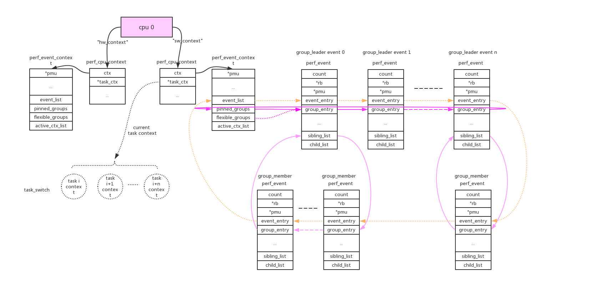
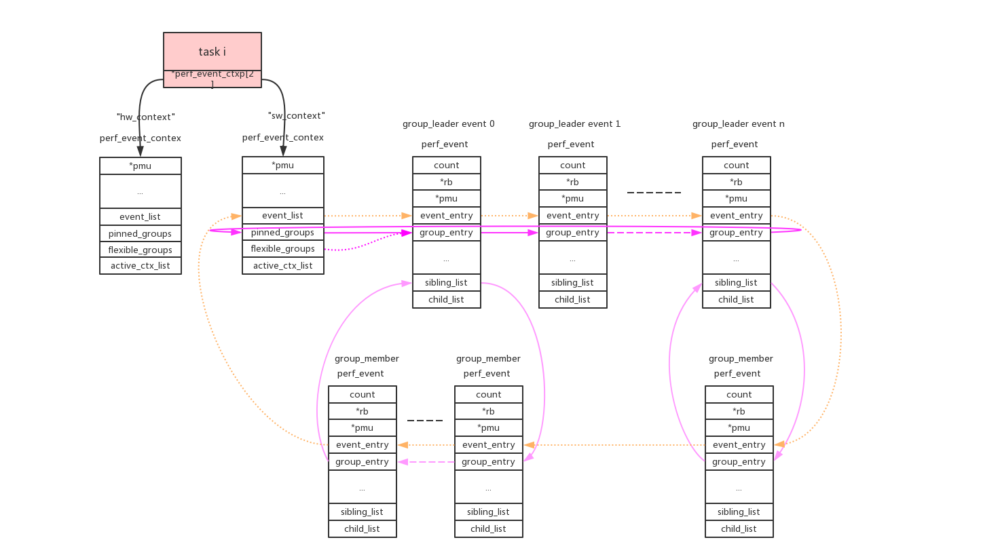
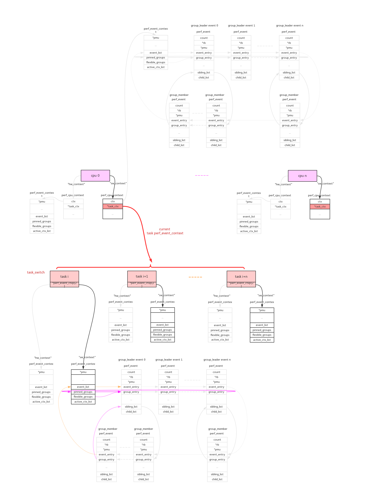
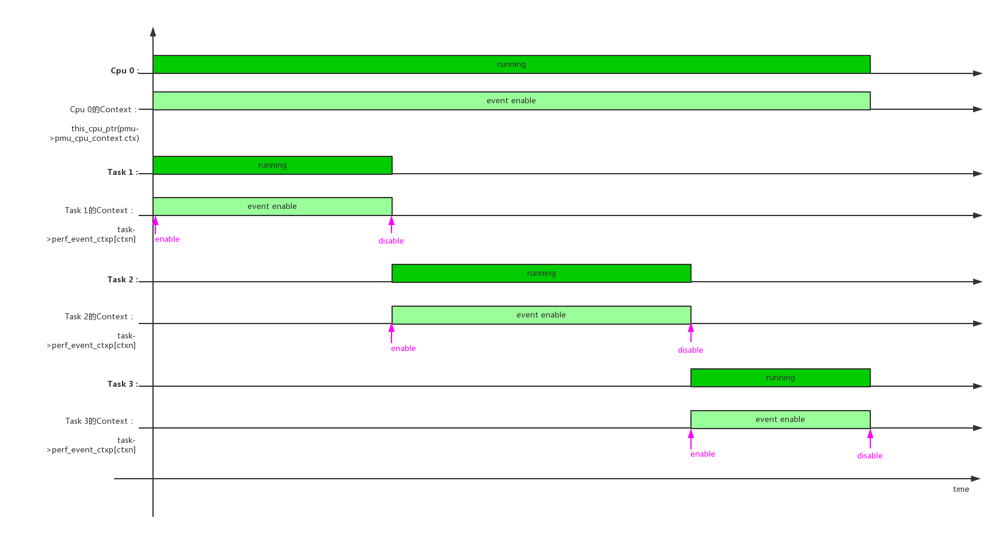
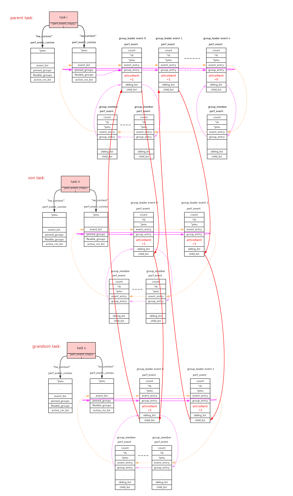
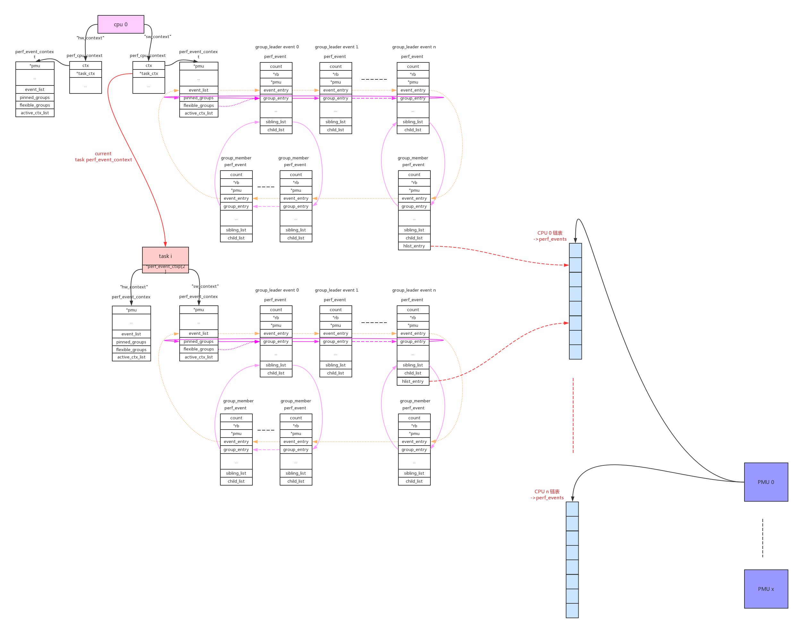
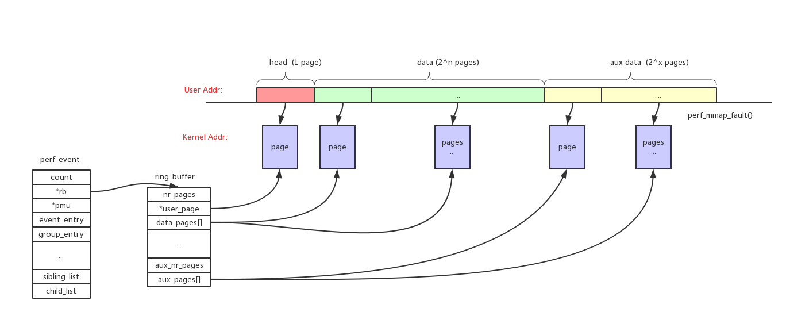

为什么有了ftrace又出来一个perf？因为ftrace只管抓trace数据并没有分析，perf在trace数据分析方面做出了很多成果。

在trace数据采集方面，perf复用了ftrace的所有插桩点，并且加入了采样法(硬件PMU)。PMU是一种非常重要的数据采集方法，因为它大部分是硬件的，所以可以做到一些软件做不到的事情，获取到一些底层硬件的信息。

perf的基本包装模型是这样的，对每一个event分配一个对应的perf_event结构。所有对event的操作都是围绕perf_event来展开的：

- 通过perf_event_open系统调用分配到perf_event以后，会返回一个文件句柄fd，这样这个perf_event结构可以通过read/write/ioctl/mmap通用文件接口来操作。
- perf_event提供两种类型的trace数据：**count**和**sample**。count只是记录了event的发生次数，sample记录了大量信息(比如：IP、ADDR、TID、TIME、CPU、BT)。如果需要使用sample功能，需要给perf_event分配ringbuffer空间，并且把这部分空间通过mmap映射到用户空间。这和定位问题时从粗到细的思路是相符的，首先从counter的比例上找出问题热点在哪个模块，再使用详细记录抓取更多信息来进一步定位。具体分别对应“perf stat”和“perf record/report”命令。
- perf的开销应该是比ftrace要大的，因为它给每个event都独立一套数据结构perf_event，对应独立的attr和pmu。在数据记录时的开销肯定大于ftrace，但是每个event的ringbuffer是独立的所以也不需要ftrace复杂的ringbuffer操作。perf也有比ftrace开销小的地方，它的sample数据存储的ringbuffer空间会通过mmap映射到到用户态，这样在读取数据的时候就会少一次拷贝。不过perf的设计初衷也不是让成百上千的event同时使用，只会挑出一些event重点debug。

# 0、perf_event的组织

从上面的描述看per就是一个个perf_event并不复杂，那么复杂在哪里呢？**真正的难点**在于对event的组织，怎么把全局的event的资源，按照用户的需要分割成cpu维度/task维度。

我们在分析问题的时候，并不是一下子深入到底层event直接来看数据(如果不加区别event记录的是整系统的数据)，我们会遵从系统->cpu->进程来分析问题。针对实际的需求，perf使用cpu维度/task维度来组织perf_event。

我们具体来看看perf_event的组织方法：

- 1、**cpu维度**：

    使用perf_event_context类型的链表来连接本cpu的相关perf_event。这样的链表共有两条(perf_hw_context = 0, perf_sw_context = 1)，链表指针存放在per_cpu变量pmu->pmu_cpu_context.ctx中由所有同类型的pmu共享。

    

- 2、**task维度**：

    使用perf_event_context类型的链表来连接本task的相关perf_event。这样的链表共有两条(perf_hw_context = 0, perf_sw_context = 1)，链表指针存放在task->perf_event_ctxp[ctxn]变量中。

    

- 3、perf_event_open()系统调用使用cpu、pid两个参数来指定perf_event的cpu、task维度。  
    
    pid == 0: event绑定到当前进程；  
    pid > 0: event绑定到指定进程；  
    pid == -1: event绑定到当前cpu的所有进程。
    cpu >= 0: event绑定到指定cpu；  
    cpu == -1: event绑定到所有cpu；  
    
    在同时指定的情况下task维度优先于cpu维度，所以pid、cpu组合起来有以下几种情况：  
    **组合1**：pid >= 0, cpu >= 0。perf_event绑定到task维度的context。task在得到cpu调度运行的时候，context上挂载的本task相关的perf_event也开始运行。但是如果event指定的cpu不等于当前运行的cpu，event不会得到执行，这样就符合了这个组合的含义；  
    **组合2**：pid >= 0, cpu == -1。perf_event绑定到task维度的context。只要task得到调度，该perf_event就会得到执行；  
    **组合3**：pid == -1, cpu >= 0。perf_event绑定到cpu维度的context。只要该cpu运行，该perf_event就会得到执行。目前只有在cpu online的情况下才能绑定perf_event，cpu hotplug支持可能会有问题；  
    **组合4**：pid == -1, cpu == -1。这种组合目前是非法的，相当于整系统所有cpu、所有进程。

- 4、**group leader**：

    cpu/task context使用->event_list链表来连接所有的perf_event。这些perf_event还允许以group的形式来组织，context使用->pinned_groups/flexible_groups链表来连接group leader的perf_event；group leader使用->sibling_list链表来连接所有的group member perf_event。组织形式参考上图。  

    group的作用是在read count的时候可以一次性读出group中所有perf_event的count。  
    
    perf_event_open()系统调用使用group_fd参数来指定perf_event的group_leader：>=0指定对于的perf_event为当前group_leader，== -1创建新的group_leader。  
    
    **pinned**：可以看到group leader被放到两个链表中(->pinned_groups/flexible_groups)，attr.pinned=1指定放到高优先级链表->pinned_groups中。
    
    (具体参见后面perf_install_in_context()的代码解析)

- 5、**perf_task_sched**。

    对于cpu维度的perf_event来说只要cpu online会一直运行，而对于task维度的perf_event来说只有在task得到调度运行的时候event才能运行。所以在每个cpu上同时只能有一个task维度的perf_evnt得到执行，cpu维度的context使用了pmu->pmu_cpu_context->task_ctx指针来保存当前运行的task context。
    
      
    
    perf驱动层的**精髓**就在于此：在合适的时间合适的开关对应的perf_event。(具体参见后面perf_event_task_sched_in()、perf_event_task_sched_out()的代码解析)  

    在单个cpu上，多个任务调度时context/perf_event的开关情况：
    
    
    
    单个任务，在多个cpu上调度时context/perf_event的开关情况：
    
    


- 6、**inherit**：

    inherit属性指定如果perf_event绑定的task创建子进程，event自动的对子进程也进行追踪。这在实际使用时是非常有用的，我们追踪一个app，随后它创建出的子进程/线程都能自动的被追踪。
    
    父进程中所有attr.inherit=1的event被子进程所继承和复制，在使用PERF_FORMAT_GROUP读event的count值时，会把inherit所有子进程的值累加进来。(具体参见后面perf_event_init_task()、perf_read_group()的代码解析)

    

- 7、**exclusive**：

    如果pmu有PERF_PMU_CAP_EXCLUSIVE属性，表明它要么只能被绑定为cpu维度、要么只能被绑定为task维度，不能混合绑定。(具体参见后面exclusive_event_init()的代码解析)

- 8、pmu的数据供给：

    每个pmu拥有一个per_cpu的链表，perf_event需要在哪个cpu上获取数据就加入到哪个cpu的链表上。如果event被触发，它会根据当前的运行cpu给对应链表上的所有perf_event推送数据。

    cpu维度的context：this_cpu_ptr(pmu->pmu_cpu_context->ctx)上链接的所有perf_event会根据绑定的pmu，链接到pmu对应的per_cpu的->perf_events链表上。
    task维度的context：this_cpu_ptr(pmu->pmu_cpu_context->task_ctx)上链接的所有perf_event会根据绑定的pmu，链接到pmu对应的per_cpu的->perf_events链表上。perf_event还需要做cpu匹配，符合(event->cpu == -1 || event->cpu == smp_processor_id())条件的event才能链接到pmu上。
    
    

- 9、**enable_on_exec**：

    perf_event的状态(event->state)典型值有以下3种：  
    disable：PERF_EVENT_STATE_OFF		= -1,   // 如果attr.disabled = 1，event->state的初始值  
	enable/inactive：PERF_EVENT_STATE_INACTIVE	=  0,   // 如果attr.disabled = 0，event->state的初始值  
	active：PERF_EVENT_STATE_ACTIVE		=  1,     
	
	attr.disabled属性决定了perf_event的初始化状态(disable/enable)。只有perf_event为enable以后才能参与schedule，在schedule过程中perf_event被使能时为active，关闭后恢复成enbale/inactive状态。
	
	perf_event变成enable状态有3种方法：  
	1、attr.disabled = 0；  
	2、attr.disabled = 1，创建后使用ioctl的PERF_EVENT_IOC_ENABLE命令来使能；  
	3、attr.disabled = 1，attr.enable_on_exec = 1。这样使用execl执行新程序时使能event，这是一种非常巧妙的同步手段；

- 10、**ringbuffer**:

    如果需要读取perf_event的sample类型的数据，需要先给perf_event分配一个对应的ringbuffer，为了减少开销这个ringbuffer会被mmap映射成用户态地址。
    
    如上图所示整个ringbuffer空间分成3部分：  
    head：size = 1 page。主要用来存储控制数据，指针等等  
    data：size = 2^n pages。主要用来存储perf_event的sample数据  
    aux data：size = 2^n pages。作用暂时没有看明白
    
    如果perf_event支持inherit属性，那么它所有的子进程上继承的perf_event的sample数据，都会保存到父perf_event的ringbuffer中。perf_event可以inherit，但是ringbuffer不会重新分配，会共用父event的ringbuffer。
    
    

- 11、**sample_period/sample_freq**:


# 1、perf_event初始化

perf_event初始化的时候将各种pmu注册到pmus链表。

start_kernel() -> perf_event_init()：

```
void __init perf_event_init(void)
{
	int ret;

    /* (1) 初始化idr，给动态type的pmu来分配 */
	idr_init(&pmu_idr);

    /* (2) 初始化per_cpu变量swevent_htable */
	perf_event_init_all_cpus();
	init_srcu_struct(&pmus_srcu);
	
	/* (3) 注册"software" pmu */
	perf_pmu_register(&perf_swevent, "software", PERF_TYPE_SOFTWARE);
	perf_pmu_register(&perf_cpu_clock, NULL, -1);
	perf_pmu_register(&perf_task_clock, NULL, -1);
	
	/* (4) 注册"tracepoint" pmu */
	perf_tp_register();
	perf_cpu_notifier(perf_cpu_notify);
	idle_notifier_register(&perf_event_idle_nb);
	register_reboot_notifier(&perf_reboot_notifier);

    /* (5) 注册"breakpoint" pmu */
	ret = init_hw_breakpoint();
	WARN(ret, "hw_breakpoint initialization failed with: %d", ret);

	/* do not patch jump label more than once per second */
	jump_label_rate_limit(&perf_sched_events, HZ);

	/*
	 * Build time assertion that we keep the data_head at the intended
	 * location.  IOW, validation we got the __reserved[] size right.
	 */
	BUILD_BUG_ON((offsetof(struct perf_event_mmap_page, data_head))
		     != 1024);
}

↓

int perf_pmu_register(struct pmu *pmu, const char *name, int type)
{
	int cpu, ret;

	mutex_lock(&pmus_lock);
	ret = -ENOMEM;
	pmu->pmu_disable_count = alloc_percpu(int);
	if (!pmu->pmu_disable_count)
		goto unlock;

    /* (3.1) 如果name = null，则pmu->name=null、pmu->type=-1 */
	pmu->type = -1;
	if (!name)
		goto skip_type;
	
	/* (3.1.1) pmu->name = name */
	pmu->name = name;

    /* (3.1.2) 如果type < 0，在idr中动态分配值给pmu->type */
	if (type < 0) {
		type = idr_alloc(&pmu_idr, pmu, PERF_TYPE_MAX, 0, GFP_KERNEL);
		if (type < 0) {
			ret = type;
			goto free_pdc;
		}
	}
	pmu->type = type;

	if (pmu_bus_running) {
		ret = pmu_dev_alloc(pmu);
		if (ret)
			goto free_idr;
	}

    /* (3.2) 初始化cpu维度的perf_cpu_context，
       perf_cpu_context的作用是用来把某一维度的perf_event链接到一起 
     */
skip_type:
    /* (3.2.1) 如果有相同task_ctx_nr类型的pmu已经创建perf_cpu_context结构， 
        直接引用
     */
	pmu->pmu_cpu_context = find_pmu_context(pmu->task_ctx_nr);
	if (pmu->pmu_cpu_context)
		goto got_cpu_context;

	ret = -ENOMEM;
	/* (3.2.2) 如果没有人创建本pmu task_ctx_nr类型的perf_cpu_context结构， 
        重新创建
     */
	pmu->pmu_cpu_context = alloc_percpu(struct perf_cpu_context);
	if (!pmu->pmu_cpu_context)
		goto free_dev;

    /* (3.2.3) 初始化per_cpu的perf_cpu_context结构 */
	for_each_possible_cpu(cpu) {
		struct perf_cpu_context *cpuctx;

		cpuctx = per_cpu_ptr(pmu->pmu_cpu_context, cpu);
		__perf_event_init_context(&cpuctx->ctx);
		lockdep_set_class(&cpuctx->ctx.mutex, &cpuctx_mutex);
		lockdep_set_class(&cpuctx->ctx.lock, &cpuctx_lock);
		cpuctx->ctx.pmu = pmu;

		__perf_mux_hrtimer_init(cpuctx, cpu);

		cpuctx->unique_pmu = pmu;
	}

got_cpu_context:
    /* (3.3) 给pmu赋值一些默认的操作函数 */
	if (!pmu->start_txn) {
		if (pmu->pmu_enable) {
			/*
			 * If we have pmu_enable/pmu_disable calls, install
			 * transaction stubs that use that to try and batch
			 * hardware accesses.
			 */
			pmu->start_txn  = perf_pmu_start_txn;
			pmu->commit_txn = perf_pmu_commit_txn;
			pmu->cancel_txn = perf_pmu_cancel_txn;
		} else {
			pmu->start_txn  = perf_pmu_nop_txn;
			pmu->commit_txn = perf_pmu_nop_int;
			pmu->cancel_txn = perf_pmu_nop_void;
		}
	}

	if (!pmu->pmu_enable) {
		pmu->pmu_enable  = perf_pmu_nop_void;
		pmu->pmu_disable = perf_pmu_nop_void;
	}

	if (!pmu->event_idx)
		pmu->event_idx = perf_event_idx_default;

    /* (3.4) 最重要的一步：将新的pmu加入到pmus链表中 */
	list_add_rcu(&pmu->entry, &pmus);
	atomic_set(&pmu->exclusive_cnt, 0);
	ret = 0;
unlock:
	mutex_unlock(&pmus_lock);

	return ret;

free_dev:
	device_del(pmu->dev);
	put_device(pmu->dev);

free_idr:
	if (pmu->type >= PERF_TYPE_MAX)
		idr_remove(&pmu_idr, pmu->type);

free_pdc:
	free_percpu(pmu->pmu_disable_count);
	goto unlock;
}

```

另外一个函数perf_event_sysfs_init()会在稍后的device_initcall中，为所有“pmu->name != null”的pmu创建对应的device：

```
static int __init perf_event_sysfs_init(void)
{
	struct pmu *pmu;
	int ret;

	mutex_lock(&pmus_lock);

    /* (1) 注册pmu_bus */
	ret = bus_register(&pmu_bus);
	if (ret)
		goto unlock;

    /* (2) 遍历pmus链表，创建pmu对应的device */
	list_for_each_entry(pmu, &pmus, entry) {
	    /* 如果pmu->name = null或者pmu->type < 0，不创建 */
		if (!pmu->name || pmu->type < 0)
			continue;

		ret = pmu_dev_alloc(pmu);
		WARN(ret, "Failed to register pmu: %s, reason %d\n", pmu->name, ret);
	}
	
	/* (3) 设置pmu_bus_running */
	pmu_bus_running = 1;
	ret = 0;

unlock:
	mutex_unlock(&pmus_lock);

	return ret;
}
device_initcall(perf_event_sysfs_init);
```

可以在/sys路径下看到对应的device：

```
 # ls /sys/bus/event_source/devices/
armv8_pmuv3 software tracepoint
```

# 2、perf_event_open系统调用

perf_event_open会创建event对应的perf_event结构，按照perf_event_attr参数把perf_event和对应的pmu以及perf_cpu_context(cpu维度/task维度)绑定，最后再把perf_event和perf_fops以及fd绑定，返回fd给系统进行文件操作。

理解perf_event_open系统调用先理解它的5个参数：

```
perf_event_open(struct perf_event_attr attr, pid_t pid, int cpu, int group_fd, unsigned long flags)
```

- 参数1、struct perf_event_attr attr。该参数是最复杂也是最重要的参数：

```
struct perf_event_attr {

	/*
	 * Major type: hardware/software/tracepoint/etc.
	 */
	/* (1) 指定pmu的type：
	    enum perf_type_id {
        	PERF_TYPE_HARDWARE			= 0,
        	PERF_TYPE_SOFTWARE			= 1,
        	PERF_TYPE_TRACEPOINT			= 2,
        	PERF_TYPE_HW_CACHE			= 3,
        	PERF_TYPE_RAW				= 4,
        	PERF_TYPE_BREAKPOINT			= 5,
        
        	PERF_TYPE_MAX,				
        };
	 */
	__u32			type;

	/*
	 * Size of the attr structure, for fwd/bwd compat.
	 */
	/* (2) 整个perf_event_attr结构体的size */
	__u32			size;

	/*
	 * Type specific configuration information.
	 */
	/* (3) 不同type的pmu，config的含义也不同：
	    1、type = PERF_TYPE_HARDWARE：
	        enum perf_hw_id {
            	PERF_COUNT_HW_CPU_CYCLES		= 0,
            	PERF_COUNT_HW_INSTRUCTIONS		= 1,
            	PERF_COUNT_HW_CACHE_REFERENCES		= 2,
            	PERF_COUNT_HW_CACHE_MISSES		= 3,
            	PERF_COUNT_HW_BRANCH_INSTRUCTIONS	= 4,
            	PERF_COUNT_HW_BRANCH_MISSES		= 5,
            	PERF_COUNT_HW_BUS_CYCLES		= 6,
            	PERF_COUNT_HW_STALLED_CYCLES_FRONTEND	= 7,
            	PERF_COUNT_HW_STALLED_CYCLES_BACKEND	= 8,
            	PERF_COUNT_HW_REF_CPU_CYCLES		= 9,
            
            	PERF_COUNT_HW_MAX,			
            };
	    2、type = PERF_TYPE_SOFTWARE：
	        enum perf_sw_ids {
            	PERF_COUNT_SW_CPU_CLOCK			= 0,
            	PERF_COUNT_SW_TASK_CLOCK		= 1,
            	PERF_COUNT_SW_PAGE_FAULTS		= 2,
            	PERF_COUNT_SW_CONTEXT_SWITCHES		= 3,
            	PERF_COUNT_SW_CPU_MIGRATIONS		= 4,
            	PERF_COUNT_SW_PAGE_FAULTS_MIN		= 5,
            	PERF_COUNT_SW_PAGE_FAULTS_MAJ		= 6,
            	PERF_COUNT_SW_ALIGNMENT_FAULTS		= 7,
            	PERF_COUNT_SW_EMULATION_FAULTS		= 8,
            	PERF_COUNT_SW_DUMMY			= 9,
            	PERF_COUNT_SW_BPF_OUTPUT		= 10,
            
            	PERF_COUNT_SW_MAX,			
            };
	    3、type = PERF_TYPE_TRACEPOINT：
	        trace_point对应trace_event的id：“/sys/kernel/debug/tracing/events/x/x/id”
	    4、type = PERF_TYPE_HW_CACHE：
	        enum perf_hw_cache_id {
            	PERF_COUNT_HW_CACHE_L1D			= 0,
            	PERF_COUNT_HW_CACHE_L1I			= 1,
            	PERF_COUNT_HW_CACHE_LL			= 2,
            	PERF_COUNT_HW_CACHE_DTLB		= 3,
            	PERF_COUNT_HW_CACHE_ITLB		= 4,
            	PERF_COUNT_HW_CACHE_BPU			= 5,
            	PERF_COUNT_HW_CACHE_NODE		= 6,
            
            	PERF_COUNT_HW_CACHE_MAX,		
            };
	 */
	__u64			config;

    /* (4) period/freq sample模式的具体数值 */
	union {
		__u64		sample_period;
		__u64		sample_freq;
	};

    /* (5) 在sample数据时，需要保存哪些数据：
        enum perf_event_sample_format {
        	PERF_SAMPLE_IP				= 1U << 0,
        	PERF_SAMPLE_TID				= 1U << 1,
        	PERF_SAMPLE_TIME			= 1U << 2,
        	PERF_SAMPLE_ADDR			= 1U << 3,
        	PERF_SAMPLE_READ			= 1U << 4,
        	PERF_SAMPLE_CALLCHAIN			= 1U << 5,
        	PERF_SAMPLE_ID				= 1U << 6,
        	PERF_SAMPLE_CPU				= 1U << 7,
        	PERF_SAMPLE_PERIOD			= 1U << 8,
        	PERF_SAMPLE_STREAM_ID			= 1U << 9,
        	PERF_SAMPLE_RAW				= 1U << 10,
        	PERF_SAMPLE_BRANCH_STACK		= 1U << 11,
        	PERF_SAMPLE_REGS_USER			= 1U << 12,
        	PERF_SAMPLE_STACK_USER			= 1U << 13,
        	PERF_SAMPLE_WEIGHT			= 1U << 14,
        	PERF_SAMPLE_DATA_SRC			= 1U << 15,
        	PERF_SAMPLE_IDENTIFIER			= 1U << 16,
        	PERF_SAMPLE_TRANSACTION			= 1U << 17,
        	PERF_SAMPLE_REGS_INTR			= 1U << 18,
        
        	PERF_SAMPLE_MAX = 1U << 19,	
        };
     */
	__u64			sample_type;
	
	/* (6) 在read counter数据时，读取的格式:
	     *
         * The format of the data returned by read() on a perf event fd,
         * as specified by attr.read_format:
         *
         * struct read_format {
         *	{ u64		value;
         *	  { u64		time_enabled; } && PERF_FORMAT_TOTAL_TIME_ENABLED
         *	  { u64		time_running; } && PERF_FORMAT_TOTAL_TIME_RUNNING
         *	  { u64		id;           } && PERF_FORMAT_ID
         *	} && !PERF_FORMAT_GROUP
         *
         *	{ u64		nr;
         *	  { u64		time_enabled; } && PERF_FORMAT_TOTAL_TIME_ENABLED
         *	  { u64		time_running; } && PERF_FORMAT_TOTAL_TIME_RUNNING
         *	  { u64		value;
         *	    { u64	id;           } && PERF_FORMAT_ID
         *	  }		cntr[nr];
         *	} && PERF_FORMAT_GROUP
         * };
         *
        enum perf_event_read_format {
        	PERF_FORMAT_TOTAL_TIME_ENABLED		= 1U << 0,
        	PERF_FORMAT_TOTAL_TIME_RUNNING		= 1U << 1,
        	PERF_FORMAT_ID				= 1U << 2,
        	PERF_FORMAT_GROUP			= 1U << 3,
        
        	PERF_FORMAT_MAX = 1U << 4,		
        };
	 */
	__u64			read_format;

    /* (7) bit标志 */
                /* (7.1) 定义event的初始状态为disable/enable。
                    如果初始被disable，后续可以通过ioctl/prctl来enable。 
                 */
	__u64			disabled       :  1, /* off by default        */
	
	            /* (7.2) 如果该标志被设置，event进程对应的子孙后代的子进程都会计入counter */
				inherit	       :  1, /* children inherit it   */
				
				/* (7.3) 如果该标志被设置，event和cpu绑定。(只适用于硬件counter只适用于group leaders) */
				pinned	       :  1, /* must always be on PMU */
				
				/* (7.4) 如果该标志被设置，指定当这个group在CPU上时，它应该是唯一使用CPU计数器的group */
				exclusive      :  1, /* only group on PMU     */
				
				/* (7.5) exclude_user/exclude_kernel/exclude_hv/exclude_idle这几个标志用来标识，
				    不要记录对应场景的数据
				 */
				exclude_user   :  1, /* don't count user      */
				exclude_kernel :  1, /* ditto kernel          */
				exclude_hv     :  1, /* ditto hypervisor      */
				exclude_idle   :  1, /* don't count when idle */
				
				/* (7.6) 允许记录PROT_EXEC mmap操作 */
				mmap           :  1, /* include mmap data     */
				
				/* (7.7) 允许记录进程创建时的comm数据 */
				comm	       :  1, /* include comm data     */
				
				/* (7.8) 确定sample模式 = freq/period */
				freq           :  1, /* use freq, not period  */
				
				
				inherit_stat   :  1, /* per task counts       */
				enable_on_exec :  1, /* next exec enables     */
				task           :  1, /* trace fork/exit       */
				watermark      :  1, /* wakeup_watermark      */
				/*
				 * precise_ip:
				 *
				 *  0 - SAMPLE_IP can have arbitrary skid
				 *  1 - SAMPLE_IP must have constant skid
				 *  2 - SAMPLE_IP requested to have 0 skid
				 *  3 - SAMPLE_IP must have 0 skid
				 *
				 *  See also PERF_RECORD_MISC_EXACT_IP
				 */
				precise_ip     :  2, /* skid constraint       */
				mmap_data      :  1, /* non-exec mmap data    */
				sample_id_all  :  1, /* sample_type all events */

				exclude_host   :  1, /* don't count in host   */
				exclude_guest  :  1, /* don't count in guest  */

				exclude_callchain_kernel : 1, /* exclude kernel callchains */
				exclude_callchain_user   : 1, /* exclude user callchains */
				mmap2          :  1, /* include mmap with inode data     */
				comm_exec      :  1, /* flag comm events that are due to an exec */
				use_clockid    :  1, /* use @clockid for time fields */
				context_switch :  1, /* context switch data */
				constraint_duplicate : 1,

				__reserved_1   : 36;

	union {
		__u32		wakeup_events;	  /* wakeup every n events */
		__u32		wakeup_watermark; /* bytes before wakeup   */
	};

	__u32			bp_type;
	union {
		__u64		bp_addr;
		__u64		config1; /* extension of config */
	};
	union {
		__u64		bp_len;
		__u64		config2; /* extension of config1 */
	};
	__u64	branch_sample_type; /* enum perf_branch_sample_type */

	/*
	 * Defines set of user regs to dump on samples.
	 * See asm/perf_regs.h for details.
	 */
	__u64	sample_regs_user;

	/*
	 * Defines size of the user stack to dump on samples.
	 */
	__u32	sample_stack_user;

	__s32	clockid;
	/*
	 * Defines set of regs to dump for each sample
	 * state captured on:
	 *  - precise = 0: PMU interrupt
	 *  - precise > 0: sampled instruction
	 *
	 * See asm/perf_regs.h for details.
	 */
	__u64	sample_regs_intr;

	/*
	 * Wakeup watermark for AUX area
	 */
	__u32	aux_watermark;
	__u32	__reserved_2;	/* align to __u64 */
}
```

- 参数2、pid_t pid：

    pid == 0: event绑定到当前进程；  
    pid > 0: event绑定到指定进程；  
    pid < 0: event绑定到当前cpu的所有进程。

- 参数3、int cpu：

    cpu >= 0: event绑定到指定cpu；  
    cpu == -1: event绑定到所有cpu；  
    (注意'pid == -1'、'cpu == -1'同时存在是非法的)

- 参数4、int group_fd：
    
    group_fd = -1：创建一个新的group leader；  
    group_fd > 0：加入到之前创建的group leader中。

- 参数5、unsigned long flags：

```
#define PERF_FLAG_FD_NO_GROUP		(1UL << 0)
#define PERF_FLAG_FD_OUTPUT		(1UL << 1)
#define PERF_FLAG_PID_CGROUP		(1UL << 2) /* pid=cgroup id, per-cpu mode only */
#define PERF_FLAG_FD_CLOEXEC		(1UL << 3) /* O_CLOEXEC */
```

perf_event_open()函数的完全解析如下：

```
SYSCALL_DEFINE5(perf_event_open,
		struct perf_event_attr __user *, attr_uptr,
		pid_t, pid, int, cpu, int, group_fd, unsigned long, flags)
{
	struct perf_event *group_leader = NULL, *output_event = NULL;
	struct perf_event *event, *sibling;
	struct perf_event_attr attr;
	struct perf_event_context *ctx, *uninitialized_var(gctx);
	struct file *event_file = NULL;
	struct fd group = {NULL, 0};
	struct task_struct *task = NULL;
	struct pmu *pmu;
	int event_fd;
	int move_group = 0;
	int err;
	int f_flags = O_RDWR;
	int cgroup_fd = -1;

    /* (1) 一系列的合法性判断和准备工作 */
	/* for future expandability... */
	if (flags & ~PERF_FLAG_ALL)
		return -EINVAL;

    /* (1.1) 权限判断 */
	if (perf_paranoid_any() && !capable(CAP_SYS_ADMIN))
		return -EACCES;

    /* (1.2) 拷贝用户态的perf_event_attr到内核态 */
	err = perf_copy_attr(attr_uptr, &attr);
	if (err)
		return err;

	if (attr.constraint_duplicate || attr.__reserved_1)
		return -EINVAL;

	if (!attr.exclude_kernel) {
		if (perf_paranoid_kernel() && !capable(CAP_SYS_ADMIN))
			return -EACCES;
	}

    /* (1.3) 如果sample是freq mode，sample_freq的合法性判断 */
	if (attr.freq) {
		if (attr.sample_freq > sysctl_perf_event_sample_rate)
			return -EINVAL;
	/* (1.4) 如果sample是period mode，sample_period的合法性判断 */
	} else {
		if (attr.sample_period & (1ULL << 63))
			return -EINVAL;
	}

	/*
	 * In cgroup mode, the pid argument is used to pass the fd
	 * opened to the cgroup directory in cgroupfs. The cpu argument
	 * designates the cpu on which to monitor threads from that
	 * cgroup.
	 */
	if ((flags & PERF_FLAG_PID_CGROUP) && (pid == -1 || cpu == -1))
		return -EINVAL;

	if (flags & PERF_FLAG_FD_CLOEXEC)
		f_flags |= O_CLOEXEC;

    /* (1.5) 当前进程获取一个新的fd编号  */
	event_fd = get_unused_fd_flags(f_flags);
	if (event_fd < 0)
		return event_fd;

    /* (1.6) 如果当前event需要加入到指定的group leader中，获取到： 
        group_fd对应的fd结构 和 perf_event结构
     */
	if (group_fd != -1) {
		err = perf_fget_light(group_fd, &group);
		if (err)
			goto err_fd;
		group_leader = group.file->private_data;
		if (flags & PERF_FLAG_FD_OUTPUT)
			output_event = group_leader;
		if (flags & PERF_FLAG_FD_NO_GROUP)
			group_leader = NULL;
	}

	/*
	 * Take the group_leader's group_leader_mutex before observing
	 * anything in the group leader that leads to changes in ctx,
	 * many of which may be changing on another thread.
	 * In particular, we want to take this lock before deciding
	 * whether we need to move_group.
	 */
	if (group_leader)
		mutex_lock(&group_leader->group_leader_mutex);

    /* (1.7) 找到pid对应的task_struct结构 */
	if (pid != -1 && !(flags & PERF_FLAG_PID_CGROUP)) {
		task = find_lively_task_by_vpid(pid);
		if (IS_ERR(task)) {
			err = PTR_ERR(task);
			goto err_group_fd;
		}
	}

    /* (1.8) 如果是加入到group leader，需要两者的attr.inherit属性一致 */
	if (task && group_leader &&
	    group_leader->attr.inherit != attr.inherit) {
		err = -EINVAL;
		goto err_task;
	}

	get_online_cpus();

	if (task) {
		err = mutex_lock_interruptible(&task->signal->cred_guard_mutex);
		if (err)
			goto err_cpus;

		/*
		 * Reuse ptrace permission checks for now.
		 *
		 * We must hold cred_guard_mutex across this and any potential
		 * perf_install_in_context() call for this new event to
		 * serialize against exec() altering our credentials (and the
		 * perf_event_exit_task() that could imply).
		 */
		err = -EACCES;
		if (!ptrace_may_access(task, PTRACE_MODE_READ_REALCREDS))
			goto err_cred;
	}

    /* (1.9) 创建cgroup fd，这和之前的group leader不一样 */
	if (flags & PERF_FLAG_PID_CGROUP)
		cgroup_fd = pid;

    /* (2) 重头戏：根据传入的参数，分配perf_event结构并初始化 */
	event = perf_event_alloc(&attr, cpu, task, group_leader, NULL,
				 NULL, NULL, cgroup_fd);
	if (IS_ERR(event)) {
		err = PTR_ERR(event);
		goto err_cred;
	}

    /* (3.1) 如果attr指定需要sample数据，但是pmu没有中断能力，返回出错(主要是针对硬件pmu) */
	if (is_sampling_event(event)) {
		if (event->pmu->capabilities & PERF_PMU_CAP_NO_INTERRUPT) {
			err = -ENOTSUPP;
			goto err_alloc;
		}
	}

	/*
	 * Special case software events and allow them to be part of
	 * any hardware group.
	 */
	pmu = event->pmu;

    /* (3.2) 如果用户指定时钟源，把event->clock设置为用户指定值 */
	if (attr.use_clockid) {
		err = perf_event_set_clock(event, attr.clockid);
		if (err)
			goto err_alloc;
	}

    /* (3.3) 如果event和group_leader的pmu type不一致的处理 */
	if (group_leader &&
	    (is_software_event(event) != is_software_event(group_leader))) {
	    /* (3.3.1) pmu type: event == software, group_leader != software 
	        把event加入到group_leader中
	     */
		if (is_software_event(event)) {
			/*
			 * If event and group_leader are not both a software
			 * event, and event is, then group leader is not.
			 *
			 * Allow the addition of software events to !software
			 * groups, this is safe because software events never
			 * fail to schedule.
			 */
			pmu = group_leader->pmu;
			
		/* (3.3.2) pmu type: event != software, group_leader == software 
	        尝试把整个group移入到hardware context中
	     */
		} else if (is_software_event(group_leader) &&
			   (group_leader->group_flags & PERF_GROUP_SOFTWARE)) {
			/*
			 * In case the group is a pure software group, and we
			 * try to add a hardware event, move the whole group to
			 * the hardware context.
			 */
			move_group = 1;
		}
	}

	/*
	 * Get the target context (task or percpu):
	 */
	/* (4) get到perf_event_context，根据perf_event类型得到cpu维度/task维度的context：
	    如果pid=-1即task=NULL，获得cpu维度的context，即pmu注册时根据pmu->task_ctx_nr分配的pmu->pmu_cpu_context->ctx
	    如果pid>=0即task!=NULL，获得task维度的context，即task->perf_event_ctxp[ctxn]，如果为空则重新创建
	 */
	ctx = find_get_context(pmu, task, event);
	if (IS_ERR(ctx)) {
		err = PTR_ERR(ctx);
		goto err_alloc;
	}

    /* (5.1) event需要加入到group_leader，如果(pmu->capabilities & PERF_PMU_CAP_EXCLUSIVE)，出错返回  */
	if ((pmu->capabilities & PERF_PMU_CAP_EXCLUSIVE) && group_leader) {
		err = -EBUSY;
		goto err_context;
	}

	/*
	 * Look up the group leader (we will attach this event to it):
	 */
	/* (5.2) event需要加入到group_leader，对一些条件进行合法性判断  */
	if (group_leader) {
		err = -EINVAL;

		/*
		 * Do not allow a recursive hierarchy (this new sibling
		 * becoming part of another group-sibling):
		 */
		/* (5.2.1) 不允许递归的->group_leader */
		if (group_leader->group_leader != group_leader)
			goto err_context;

		/* All events in a group should have the same clock */
		/* (5.2.2) event加入gruop，需要时钟源一致 */
		if (group_leader->clock != event->clock)
			goto err_context;

		/*
		 * Do not allow to attach to a group in a different
		 * task or CPU context:
		 */
		/* (5.2.3) event加入gruop，需要task/cpu的context一致 */
		if (move_group) {
			/*
			 * Make sure we're both on the same task, or both
			 * per-cpu events.
			 */
			if (group_leader->ctx->task != ctx->task)
				goto err_context;

			/*
			 * Make sure we're both events for the same CPU;
			 * grouping events for different CPUs is broken; since
			 * you can never concurrently schedule them anyhow.
			 */
			if (group_leader->cpu != event->cpu)
				goto err_context;
		} else {
			if (group_leader->ctx != ctx)
				goto err_context;
		}

		/*
		 * Only a group leader can be exclusive or pinned
		 */
		/* (5.2.4) 只有group才能设置exclusive/pinned属性 */
		if (attr.exclusive || attr.pinned)
			goto err_context;
	}

    /* (5.3) 设置output_event */
	if (output_event) {
		err = perf_event_set_output(event, output_event);
		if (err)
			goto err_context;
	}

    /* (6) 分配perf_event对应的file结构： 
        file->private_data = event; // file和event结构链接在一起
        file->f_op = perf_fops；    // file的文件操作函数集
        后续会把fd和file链接到一起：fd_install(event_fd, event_file);
     */
	event_file = anon_inode_getfile("[perf_event]", &perf_fops, event,
					f_flags);
	if (IS_ERR(event_file)) {
		err = PTR_ERR(event_file);
		event_file = NULL;
		goto err_context;
	}

	if (move_group) {
		gctx = group_leader->ctx;
		mutex_lock_double(&gctx->mutex, &ctx->mutex);
	} else {
		mutex_lock(&ctx->mutex);
	}

    /* (7.1) 根据attr计算：event->read_size、event->header_size、event->id_header_size 
        并判断是否有超长
     */
	if (!perf_event_validate_size(event)) {
		err = -E2BIG;
		goto err_locked;
	}

	/*
	 * Must be under the same ctx::mutex as perf_install_in_context(),
	 * because we need to serialize with concurrent event creation.
	 */
	/* (7.2) 如果是排他性event：(pmu->capabilities & PERF_PMU_CAP_EXCLUSIVE) 
	    检查context链表中现有的event是否允许新的event插入
	 */
	if (!exclusive_event_installable(event, ctx)) {
		/* exclusive and group stuff are assumed mutually exclusive */
		WARN_ON_ONCE(move_group);

		err = -EBUSY;
		goto err_locked;
	}

	WARN_ON_ONCE(ctx->parent_ctx);

	/*
	 * This is the point on no return; we cannot fail hereafter. This is
	 * where we start modifying current state.
	 */

    /* (8) 如果group和当前event的pmu type不一致，
        尝试更改context到当前event
     */
	if (move_group) {
		/*
		 * See perf_event_ctx_lock() for comments on the details
		 * of swizzling perf_event::ctx.
		 */
		/* (8.1) 把group_leader从原有的context中remove */
		perf_remove_from_context(group_leader, false);

        /* (8.2) 把所有group_leader的子event从原有的context中remove */
		list_for_each_entry(sibling, &group_leader->sibling_list,
				    group_entry) {
			perf_remove_from_context(sibling, false);
			put_ctx(gctx);
		}

		/*
		 * Wait for everybody to stop referencing the events through
		 * the old lists, before installing it on new lists.
		 */
		synchronize_rcu();

		/*
		 * Install the group siblings before the group leader.
		 *
		 * Because a group leader will try and install the entire group
		 * (through the sibling list, which is still in-tact), we can
		 * end up with siblings installed in the wrong context.
		 *
		 * By installing siblings first we NO-OP because they're not
		 * reachable through the group lists.
		 */
		/* (8.3) 把所有group_leader的子event安装到新的context中 */
		list_for_each_entry(sibling, &group_leader->sibling_list,
				    group_entry) {
			perf_event__state_init(sibling);
			perf_install_in_context(ctx, sibling, sibling->cpu);
			get_ctx(ctx);
		}

		/*
		 * Removing from the context ends up with disabled
		 * event. What we want here is event in the initial
		 * startup state, ready to be add into new context.
		 */
		/* (8.4) 把group_leader安装到新的context中 */
		perf_event__state_init(group_leader);
		perf_install_in_context(ctx, group_leader, group_leader->cpu);
		get_ctx(ctx);

		/*
		 * Now that all events are installed in @ctx, nothing
		 * references @gctx anymore, so drop the last reference we have
		 * on it.
		 */
		put_ctx(gctx);
	}

	/*
	 * Precalculate sample_data sizes; do while holding ctx::mutex such
	 * that we're serialized against further additions and before
	 * perf_install_in_context() which is the point the event is active and
	 * can use these values.
	 */
	/* (9.1) 重新计算：event->read_size、event->header_size、event->id_header_size */
	perf_event__header_size(event);
	perf_event__id_header_size(event);

    /* (10) 把event安装到context当中 */
	perf_install_in_context(ctx, event, event->cpu);
	perf_unpin_context(ctx);

	if (move_group)
		mutex_unlock(&gctx->mutex);
	mutex_unlock(&ctx->mutex);
	if (group_leader)
		mutex_unlock(&group_leader->group_leader_mutex);

	if (task) {
		mutex_unlock(&task->signal->cred_guard_mutex);
		put_task_struct(task);
	}

	put_online_cpus();

	event->owner = current;

    /* (9.2) 把当前进程创建的所有event，加入到current->perf_event_list链表中 */
	mutex_lock(&current->perf_event_mutex);
	list_add_tail(&event->owner_entry, &current->perf_event_list);
	mutex_unlock(&current->perf_event_mutex);

	/*
	 * Drop the reference on the group_event after placing the
	 * new event on the sibling_list. This ensures destruction
	 * of the group leader will find the pointer to itself in
	 * perf_group_detach().
	 */
	fdput(group);
	/* (9.3) 把fd和file进行链接 */
	fd_install(event_fd, event_file);
	return event_fd;

err_locked:
	if (move_group)
		mutex_unlock(&gctx->mutex);
	mutex_unlock(&ctx->mutex);
/* err_file: */
	fput(event_file);
err_context:
	perf_unpin_context(ctx);
	put_ctx(ctx);
err_alloc:
	/*
	 * If event_file is set, the fput() above will have called ->release()
	 * and that will take care of freeing the event.
	 */
	if (!event_file)
		free_event(event);
err_cred:
	if (task)
		mutex_unlock(&task->signal->cred_guard_mutex);
err_cpus:
	put_online_cpus();
err_task:
	if (task)
		put_task_struct(task);
err_group_fd:
	if (group_leader)
		mutex_unlock(&group_leader->group_leader_mutex);
	fdput(group);
err_fd:
	put_unused_fd(event_fd);
	return err;
}

|→

static struct perf_event *
perf_event_alloc(struct perf_event_attr *attr, int cpu,
		 struct task_struct *task,
		 struct perf_event *group_leader,
		 struct perf_event *parent_event,
		 perf_overflow_handler_t overflow_handler,
		 void *context, int cgroup_fd)
{
	struct pmu *pmu;
	struct perf_event *event;
	struct hw_perf_event *hwc;
	long err = -EINVAL;

	if ((unsigned)cpu >= nr_cpu_ids) {
		if (!task || cpu != -1)
			return ERR_PTR(-EINVAL);
	}

    /* (2.1) 分配perf_event空间 */
	event = kzalloc(sizeof(*event), GFP_KERNEL);
	if (!event)
		return ERR_PTR(-ENOMEM);

	/*
	 * Single events are their own group leaders, with an
	 * empty sibling list:
	 *
	/* (2.2) 如果group_fd == -1，那么group_leader = self */
	if (!group_leader)
		group_leader = event;

	mutex_init(&event->group_leader_mutex);
	mutex_init(&event->child_mutex);
	INIT_LIST_HEAD(&event->child_list);

	INIT_LIST_HEAD(&event->group_entry);
	INIT_LIST_HEAD(&event->event_entry);
	INIT_LIST_HEAD(&event->sibling_list);
	INIT_LIST_HEAD(&event->rb_entry);
	INIT_LIST_HEAD(&event->active_entry);
	INIT_LIST_HEAD(&event->drv_configs);
	INIT_HLIST_NODE(&event->hlist_entry);


	init_waitqueue_head(&event->waitq);
	init_irq_work(&event->pending, perf_pending_event);

	mutex_init(&event->mmap_mutex);

	atomic_long_set(&event->refcount, 1);
	event->cpu		= cpu;
	event->attr		= *attr;
	event->group_leader	= group_leader;
	event->pmu		= NULL;
	event->oncpu		= -1;

	event->parent		= parent_event;

	event->ns		= get_pid_ns(task_active_pid_ns(current));
	event->id		= atomic64_inc_return(&perf_event_id);

	event->state		= PERF_EVENT_STATE_INACTIVE;

    /* (2.3) 如果task != null */
	if (task) {
		event->attach_state = PERF_ATTACH_TASK;
		/*
		 * XXX pmu::event_init needs to know what task to account to
		 * and we cannot use the ctx information because we need the
		 * pmu before we get a ctx.
		 */
		event->hw.target = task;
	}

	event->clock = &local_clock;
	if (parent_event)
		event->clock = parent_event->clock;

	if (!overflow_handler && parent_event) {
		overflow_handler = parent_event->overflow_handler;
		context = parent_event->overflow_handler_context;
	}

	event->overflow_handler	= overflow_handler;
	event->overflow_handler_context = context;

    /* (2.4) 根据attr.disabled的值来设置event的初始化值：
        event->state =  PERF_EVENT_STATE_OFF/PERF_EVENT_STATE_INACTIVE
     */
	perf_event__state_init(event);

	pmu = NULL;

    /* (2.5) 根据event的attr->freq和attr->sample_period/sample_freq来初始化event->hw:
        hwc->sample_period
        hwc->last_period
        hwc->period_left
     */
	hwc = &event->hw;
	hwc->sample_period = attr->sample_period;
	if (attr->freq && attr->sample_freq)
		hwc->sample_period = 1;
	hwc->last_period = hwc->sample_period;

	local64_set(&hwc->period_left, hwc->sample_period);

	/*
	 * we currently do not support PERF_FORMAT_GROUP on inherited events
	 */
	/* (2.6) inherit时不支持PERF_FORMAT_GROUP */
	if (attr->inherit && (attr->read_format & PERF_FORMAT_GROUP))
		goto err_ns;

    /* (2.7) 如果!(attr.sample_type & PERF_SAMPLE_BRANCH_STACK)：
        则attr.branch_sample_type = 0
     */
	if (!has_branch_stack(event))
		event->attr.branch_sample_type = 0;

    /* (2.8) 如果(flags & PERF_FLAG_PID_CGROUP)：
        将当前event加入cgroup 
     */
	if (cgroup_fd != -1) {
		err = perf_cgroup_connect(cgroup_fd, event, attr, group_leader);
		if (err)
			goto err_ns;
	}

    /* (2.9) 至关重要的一步：
        根据attr.type在pmus链表中找到对应的pmu，
        并且调用pmu->event_init(event)来初始化event
     */
	pmu = perf_init_event(event);
	if (!pmu)
		goto err_ns;
	else if (IS_ERR(pmu)) {
		err = PTR_ERR(pmu);
		goto err_ns;
	}

    /* (2.10) exclusive类型pmu的event的处理 */
	err = exclusive_event_init(event);
	if (err)
		goto err_pmu;

	if (!event->parent) {
		if (event->attr.sample_type & PERF_SAMPLE_CALLCHAIN) {
			err = get_callchain_buffers();
			if (err)
				goto err_per_task;
		}
	}

	/* symmetric to unaccount_event() in _free_event() */
	/* (2.11) 关于event操作的一些统计 */
	account_event(event);

	return event;

err_per_task:
	exclusive_event_destroy(event);

err_pmu:
	if (event->destroy)
		event->destroy(event);
	module_put(pmu->module);
err_ns:
	if (is_cgroup_event(event))
		perf_detach_cgroup(event);
	if (event->ns)
		put_pid_ns(event->ns);
	kfree(event);

	return ERR_PTR(err);
}

|→

static struct perf_event_context *
find_get_context(struct pmu *pmu, struct task_struct *task,
		struct perf_event *event)
{
	struct perf_event_context *ctx, *clone_ctx = NULL;
	struct perf_cpu_context *cpuctx;
	void *task_ctx_data = NULL;
	unsigned long flags;
	int ctxn, err;
	int cpu = event->cpu;

    /* (4.1) 如果task=null即pid=-1，获取cpu维度的context */
	if (!task) {
		/* Must be root to operate on a CPU event: */
		/* (4.1.1) 权限判断 */
		if (event->owner != EVENT_OWNER_KERNEL && perf_paranoid_cpu() &&
			!capable(CAP_SYS_ADMIN))
			return ERR_PTR(-EACCES);

		/*
		 * We could be clever and allow to attach a event to an
		 * offline CPU and activate it when the CPU comes up, but
		 * that's for later.
		 */
		/* (4.1.2) attr指定的cpu是否online */
		if (!cpu_online(cpu))
			return ERR_PTR(-ENODEV);

        /* (4.1.3) 根据cpu获取到对应pmu的cpu维度context：per_cpu_ptr(pmu->pmu_cpu_context, cpu)->ctx */
		cpuctx = per_cpu_ptr(pmu->pmu_cpu_context, cpu);
		ctx = &cpuctx->ctx;
		get_ctx(ctx);
		++ctx->pin_count;

		return ctx;
	}
	
	/* (4.2) 如果task!=null即pid>=0，获取task维度的context */

	err = -EINVAL;
	ctxn = pmu->task_ctx_nr;
	if (ctxn < 0)
		goto errout;

    /* (4.2.1) 部分架构context需要分配ctx->task_ctx_data */
	if (event->attach_state & PERF_ATTACH_TASK_DATA) {
		task_ctx_data = kzalloc(pmu->task_ctx_size, GFP_KERNEL);
		if (!task_ctx_data) {
			err = -ENOMEM;
			goto errout;
		}
	}

retry:
    /* (4.2.2) 获取task维度的context：task->perf_event_ctxp[pmu->task_ctx_nr]
        如果此前无人创建过此context，则分配空间创建
     */
	ctx = perf_lock_task_context(task, ctxn, &flags);
	/* (4.2.2.1) task此context已经创建，则使用现成的 */
	if (ctx) {
		clone_ctx = unclone_ctx(ctx);
		++ctx->pin_count;

		if (task_ctx_data && !ctx->task_ctx_data) {
			ctx->task_ctx_data = task_ctx_data;
			task_ctx_data = NULL;
		}
		raw_spin_unlock_irqrestore(&ctx->lock, flags);

		if (clone_ctx)
			put_ctx(clone_ctx);
	/* (4.2.2.2) 否则，重新创建task->perf_event_ctxp[pmu->task_ctx_nr] */
	} else {
		ctx = alloc_perf_context(pmu, task);
		err = -ENOMEM;
		if (!ctx)
			goto errout;

		if (task_ctx_data) {
			ctx->task_ctx_data = task_ctx_data;
			task_ctx_data = NULL;
		}

		err = 0;
		mutex_lock(&task->perf_event_mutex);
		/*
		 * If it has already passed perf_event_exit_task().
		 * we must see PF_EXITING, it takes this mutex too.
		 */
		if (task->flags & PF_EXITING)
			err = -ESRCH;
		else if (task->perf_event_ctxp[ctxn])
			err = -EAGAIN;
		else {
			get_ctx(ctx);
			++ctx->pin_count;
			rcu_assign_pointer(task->perf_event_ctxp[ctxn], ctx);
		}
		mutex_unlock(&task->perf_event_mutex);

		if (unlikely(err)) {
			put_ctx(ctx);

			if (err == -EAGAIN)
				goto retry;
			goto errout;
		}
	}

	kfree(task_ctx_data);
	return ctx;

errout:
	kfree(task_ctx_data);
	return ERR_PTR(err);
}

|→

static void
perf_install_in_context(struct perf_event_context *ctx,
			struct perf_event *event,
			int cpu)
{
	struct task_struct *task = ctx->task;

	lockdep_assert_held(&ctx->mutex);

    /* (10.1) context赋值给event->ctx */
	event->ctx = ctx;
	if (event->cpu != -1)
		event->cpu = cpu;

    /* (10.2) 如果是cpu维度的context，
        使用cpu同步机制来调用指定的cpu上运行__perf_install_in_context() 
        绑定context、event
     */
	if (!task) {
		/*
		 * Per cpu events are installed via an smp call and
		 * the install is always successful.
		 */
		cpu_function_call(cpu, __perf_install_in_context, event);
		return;
	}

retry:
    /* (10.3) 如果是task维度的context，且task当前正在running
        使用cpu同步机制调用指定的task的运行cpu(即task_cpu(p))上运行__perf_install_in_context()
        绑定context、event
     */
	if (!task_function_call(task, __perf_install_in_context, event))
		return;

	raw_spin_lock_irq(&ctx->lock);
	/*
	 * If we failed to find a running task, but find the context active now
	 * that we've acquired the ctx->lock, retry.
	 */
	if (ctx->is_active) {
		raw_spin_unlock_irq(&ctx->lock);
		/*
		 * Reload the task pointer, it might have been changed by
		 * a concurrent perf_event_context_sched_out().
		 */
		task = ctx->task;
		goto retry;
	}

	/*
	 * Since the task isn't running, its safe to add the event, us holding
	 * the ctx->lock ensures the task won't get scheduled in.
	 */
	/* (10.4) 如果是task维度的context，但是task当前不在runnning
        可以安全的绑定event和context
     */
	add_event_to_ctx(event, ctx);
	raw_spin_unlock_irq(&ctx->lock);
}

||→

static void add_event_to_ctx(struct perf_event *event,
			       struct perf_event_context *ctx)
{
	u64 tstamp = perf_event_time(event);

    /* (10.4.1) 将event加入到context的相关链表 */
	list_add_event(event, ctx);
	
	/* (10.4.2) 将event加入到group_leader的链表 */
	perf_group_attach(event);
	event->tstamp_enabled = tstamp;
	event->tstamp_running = tstamp;
	event->tstamp_stopped = tstamp;
}

|||→

static void
list_add_event(struct perf_event *event, struct perf_event_context *ctx)
{
	WARN_ON_ONCE(event->attach_state & PERF_ATTACH_CONTEXT);
	
	/* (10.4.1.1) 设置event->attach_state的PERF_ATTACH_CONTEXT */
	event->attach_state |= PERF_ATTACH_CONTEXT;

	/*
	 * If we're a stand alone event or group leader, we go to the context
	 * list, group events are kept attached to the group so that
	 * perf_group_detach can, at all times, locate all siblings.
	 */
	/* (10.4.1.2) 如果event是group_leader 
	    则将其event->group_entry加入到顶级group链表：ctx->flexible_groups/pinned_groups
	    ctx->flexible_groups/pinned_groups链表只链接group_leader的event
	 */
	if (event->group_leader == event) {
		struct list_head *list;

		if (is_software_event(event))
			event->group_flags |= PERF_GROUP_SOFTWARE;

		list = ctx_group_list(event, ctx);
		list_add_tail(&event->group_entry, list);
	}

	if (is_cgroup_event(event))
		ctx->nr_cgroups++;

    /* (10.4.1.3) 将event->event_entry加入到链表：ctx->event_list 
        ctx->event_list链表链接context下所有的event
     */
	list_add_rcu(&event->event_entry, &ctx->event_list);
	ctx->nr_events++;
	if (event->attr.inherit_stat)
		ctx->nr_stat++;

	ctx->generation++;
}

|||→

static void perf_group_attach(struct perf_event *event)
{
	struct perf_event *group_leader = event->group_leader, *pos;

	/*
	 * We can have double attach due to group movement in perf_event_open.
	 */
	/* (10.4.2.1) 设置event->attach_state的PERF_ATTACH_GROUP */
	if (event->attach_state & PERF_ATTACH_GROUP)
		return;

	event->attach_state |= PERF_ATTACH_GROUP;

    /* (10.4.2.2) 如果event本身就是group_leader，不需要继续操作 */
	if (group_leader == event)
		return;

	WARN_ON_ONCE(group_leader->ctx != event->ctx);

    /* (10.4.2.3) move_group的处理？ */
	if (group_leader->group_flags & PERF_GROUP_SOFTWARE &&
			!is_software_event(event))
		group_leader->group_flags &= ~PERF_GROUP_SOFTWARE;

    /* (10.4.2.4) 把event->group_entry加入到group_leader->sibling_list链表 */
	list_add_tail(&event->group_entry, &group_leader->sibling_list);
	group_leader->nr_siblings++;

    /* (10.4.2.5) 重新计算group_leader的event->read_size、event->header_size */
	perf_event__header_size(group_leader);

    /* (10.4.2.6) 重新计算group_leader所有子event的event->read_size、event->header_size */
	list_for_each_entry(pos, &group_leader->sibling_list, group_entry)
		perf_event__header_size(pos);
}

```

经过perf_event_open()调用以后返回perf_event对应的fd，后续的文件操作对应perf_fops：

```
static const struct file_operations perf_fops = {
	.llseek			= no_llseek,
	.release		= perf_release,
	.read			= perf_read,
	.poll			= perf_poll,
	.unlocked_ioctl		= perf_ioctl,
	.compat_ioctl		= perf_compat_ioctl,
	.mmap			= perf_mmap,
	.fasync			= perf_fasync,
};
```

后续会对其重点的函数perf_read()、perf_ioctl()、perf_mmap()一一进行解析。

## 2.1、inherit

进程通过task contex(task->perf_event_ctxp[ctxn])挂载了很多面向task的perf_event，如果event支持inherit属性，当进程创建子进程时需要给子进程创建task context和继承的event。

copy_process() -> perf_event_init_task() -> perf_event_init_context() -> inherit_task_group() -> inherit_group() -> inherit_event():

```
int perf_event_init_task(struct task_struct *child)
{
	int ctxn, ret;

    /* (1) 初始化child task的perf_event相关结构 */
	memset(child->perf_event_ctxp, 0, sizeof(child->perf_event_ctxp));
	mutex_init(&child->perf_event_mutex);
	INIT_LIST_HEAD(&child->perf_event_list);

    /* (2) 进程通过task contex(task->perf_event_ctxp[ctxn])挂载了很多面向task的perf_event，
        如果event支持inherit属性，当进程创建子进程时需要给子进程创建task context和继承的event
     */
	for_each_task_context_nr(ctxn) {
		ret = perf_event_init_context(child, ctxn);
		if (ret) {
			perf_event_free_task(child);
			return ret;
		}
	}

	return 0;
}

|→

static int perf_event_init_context(struct task_struct *child, int ctxn)
{
	struct perf_event_context *child_ctx, *parent_ctx;
	struct perf_event_context *cloned_ctx;
	struct perf_event *event;
	struct task_struct *parent = current;
	int inherited_all = 1;
	unsigned long flags;
	int ret = 0;

    /* (2.1) 父进程即为当前进程(current) */
	if (likely(!parent->perf_event_ctxp[ctxn]))
		return 0;

	/*
	 * If the parent's context is a clone, pin it so it won't get
	 * swapped under us.
	 */
	parent_ctx = perf_pin_task_context(parent, ctxn);
	if (!parent_ctx)
		return 0;

	/*
	 * No need to check if parent_ctx != NULL here; since we saw
	 * it non-NULL earlier, the only reason for it to become NULL
	 * is if we exit, and since we're currently in the middle of
	 * a fork we can't be exiting at the same time.
	 */

	/*
	 * Lock the parent list. No need to lock the child - not PID
	 * hashed yet and not running, so nobody can access it.
	 */
	mutex_lock(&parent_ctx->mutex);

	/*
	 * We dont have to disable NMIs - we are only looking at
	 * the list, not manipulating it:
	 */
	/* (2.2) 遍历父进程context上的高优先级group leader event链表：parent_ctx->pinned_groups，
	    在子进程上复制需要inherit的event
	 */
	list_for_each_entry(event, &parent_ctx->pinned_groups, group_entry) {
		ret = inherit_task_group(event, parent, parent_ctx,
					 child, ctxn, &inherited_all);
		if (ret)
			break;
	}

	/*
	 * We can't hold ctx->lock when iterating the ->flexible_group list due
	 * to allocations, but we need to prevent rotation because
	 * rotate_ctx() will change the list from interrupt context.
	 */
	raw_spin_lock_irqsave(&parent_ctx->lock, flags);
	parent_ctx->rotate_disable = 1;
	raw_spin_unlock_irqrestore(&parent_ctx->lock, flags);

    /* (2.2) 遍历父进程context上的低优先级group leader event链表：parent_ctx->flexible_groups，
	    在子进程上复制需要inherit的event
	 */
	list_for_each_entry(event, &parent_ctx->flexible_groups, group_entry) {
		ret = inherit_task_group(event, parent, parent_ctx,
					 child, ctxn, &inherited_all);
		if (ret)
			break;
	}

	raw_spin_lock_irqsave(&parent_ctx->lock, flags);
	parent_ctx->rotate_disable = 0;

	child_ctx = child->perf_event_ctxp[ctxn];

    /* (2.3) 如果inherited_all>0，表示父进程挂载的所有event都是inherit属性，都被子进程复制继承， 
        那么给子进程的task context->parent_ctx赋值为父进程的context
     */
	if (child_ctx && inherited_all) {
		/*
		 * Mark the child context as a clone of the parent
		 * context, or of whatever the parent is a clone of.
		 *
		 * Note that if the parent is a clone, the holding of
		 * parent_ctx->lock avoids it from being uncloned.
		 */
		cloned_ctx = parent_ctx->parent_ctx;
		if (cloned_ctx) {
			child_ctx->parent_ctx = cloned_ctx;
			child_ctx->parent_gen = parent_ctx->parent_gen;
		} else {
			child_ctx->parent_ctx = parent_ctx;
			child_ctx->parent_gen = parent_ctx->generation;
		}
		get_ctx(child_ctx->parent_ctx);
	}

	raw_spin_unlock_irqrestore(&parent_ctx->lock, flags);
	mutex_unlock(&parent_ctx->mutex);

	perf_unpin_context(parent_ctx);
	put_ctx(parent_ctx);

	return ret;
}

||→

static int
inherit_task_group(struct perf_event *event, struct task_struct *parent,
		   struct perf_event_context *parent_ctx,
		   struct task_struct *child, int ctxn,
		   int *inherited_all)
{
	int ret;
	struct perf_event_context *child_ctx;

    /* (2.1.1) 如果event不支持inherit，直接返回 */
	if (!event->attr.inherit) {
		*inherited_all = 0;
		return 0;
	}

    /* (2.1.2) 如果子进程的context为空，分配创建 */
	child_ctx = child->perf_event_ctxp[ctxn];
	if (!child_ctx) {
		/*
		 * This is executed from the parent task context, so
		 * inherit events that have been marked for cloning.
		 * First allocate and initialize a context for the
		 * child.
		 */

		child_ctx = alloc_perf_context(parent_ctx->pmu, child);
		if (!child_ctx)
			return -ENOMEM;

		child->perf_event_ctxp[ctxn] = child_ctx;
	}

    /* (2.1.3) 子进程对父进程的event进行复制继承 */
	ret = inherit_group(event, parent, parent_ctx,
			    child, child_ctx);

	if (ret)
		*inherited_all = 0;

	return ret;
}

|||→

static int inherit_group(struct perf_event *parent_event,
	      struct task_struct *parent,
	      struct perf_event_context *parent_ctx,
	      struct task_struct *child,
	      struct perf_event_context *child_ctx)
{
	struct perf_event *leader;
	struct perf_event *sub;
	struct perf_event *child_ctr;

    /* (2.1.3.1) 对group_leader event进行复制继承， 
        新建group leader的继承者是新的group leader
     */
	leader = inherit_event(parent_event, parent, parent_ctx,
				 child, NULL, child_ctx);
	if (IS_ERR(leader))
		return PTR_ERR(leader);
		
	/* (2.1.3.2) 对group_leader下面的子event进行复制继承： 
	    如果父进程group leader下面有树成员，他会把这棵树给子进程也复制一份，
	    ---oops：这里有个疑问，如果父进程group成员不是group leader所在的父进程，但是inherit会给子进程复制一个event，这样合理吗？
	 */
	list_for_each_entry(sub, &parent_event->sibling_list, group_entry) {
		child_ctr = inherit_event(sub, parent, parent_ctx,
					    child, leader, child_ctx);
		if (IS_ERR(child_ctr))
			return PTR_ERR(child_ctr);
	}
	return 0;
}

||||→

static struct perf_event *
inherit_event(struct perf_event *parent_event,
	      struct task_struct *parent,
	      struct perf_event_context *parent_ctx,
	      struct task_struct *child,
	      struct perf_event *group_leader,
	      struct perf_event_context *child_ctx)
{
	enum perf_event_active_state parent_state = parent_event->state;
	struct perf_event *child_event;
	unsigned long flags;

	/*
	 * Instead of creating recursive hierarchies of events,
	 * we link inherited events back to the original parent,
	 * which has a filp for sure, which we use as the reference
	 * count:
	 */
	/* (2.1.3.1.1) 获得子进程新建event的parent event，
	    如果是多级子进程，把所有子进程的event都挂在原始parent下面，而不是一级一级的挂载
	 */
	if (parent_event->parent)
		parent_event = parent_event->parent;

    /* (2.1.3.2) 对group_leader event进行复制，重新分配初始化： 
        和父event创建不同，这指定了子event的parent：event->parent = parent_event;
        随后子event也会被加入到父event的parent_event->child_list链表中
     */
	child_event = perf_event_alloc(&parent_event->attr,
					   parent_event->cpu,
					   child,
					   group_leader, parent_event,
					   NULL, NULL, -1);
	if (IS_ERR(child_event))
		return child_event;

	if (is_orphaned_event(parent_event) ||
	    !atomic_long_inc_not_zero(&parent_event->refcount)) {
		free_event(child_event);
		return NULL;
	}

	get_ctx(child_ctx);

	/*
	 * Make the child state follow the state of the parent event,
	 * not its attr.disabled bit.  We hold the parent's mutex,
	 * so we won't race with perf_event_{en, dis}able_family.
	 */
	/* (2.1.3.3) 如果父event的状态已经enable，子event的状态也为enable */
	if (parent_state >= PERF_EVENT_STATE_INACTIVE)
		child_event->state = PERF_EVENT_STATE_INACTIVE;
	else
		child_event->state = PERF_EVENT_STATE_OFF;

	if (parent_event->attr.freq) {
		u64 sample_period = parent_event->hw.sample_period;
		struct hw_perf_event *hwc = &child_event->hw;

		hwc->sample_period = sample_period;
		hwc->last_period   = sample_period;

		local64_set(&hwc->period_left, sample_period);
	}

	child_event->ctx = child_ctx;
	child_event->overflow_handler = parent_event->overflow_handler;
	child_event->overflow_handler_context
		= parent_event->overflow_handler_context;

	/*
	 * Precalculate sample_data sizes
	 */
	perf_event__header_size(child_event);
	perf_event__id_header_size(child_event);

	/*
	 * Link it up in the child's context:
	 */
	/* (2.1.3.4) 将新的event加入到子进程的context中 */
	raw_spin_lock_irqsave(&child_ctx->lock, flags);
	add_event_to_ctx(child_event, child_ctx);
	raw_spin_unlock_irqrestore(&child_ctx->lock, flags);

	/*
	 * Link this into the parent event's child list
	 */
	/* (2.1.3.5) 将子event加入到父event的->child_list链表中 */
	WARN_ON_ONCE(parent_event->ctx->parent_ctx);
	mutex_lock(&parent_event->child_mutex);
	list_add_tail(&child_event->child_list, &parent_event->child_list);
	mutex_unlock(&parent_event->child_mutex);

	return child_event;
}

```


## 2.2、perf task sched

task context上链接的perf_event需要跟随task进程调度一起动态启动停止，在task得到调度时相关perf_event开始工作，在task被其他任务调度出去时相关perf_event停止工作。

为了支持这种行为，在task switch时调用perf的回调函数：perf_event_task_sched_out()/perf_event_task_sched_in()

context_switch() -> prepare_task_switch() -> perf_event_task_sched_out():

```
static inline void perf_event_task_sched_out(struct task_struct *prev,
					     struct task_struct *next)
{
    /* (1) "software" pmu 子类型为“context-switches”的数据采集点 */
	perf_sw_event_sched(PERF_COUNT_SW_CONTEXT_SWITCHES, 1, 0);

    /* (2) 随着taskswitch，和task关联的相关event需要停止工作：即sched_out 
        perf_sched_events.key：是进行perf_sched_in/out的开关，在event分配(perf_event_alloc() -> account_event())和释放(_free_event() -> unaccount_event())时操作
     */
	if (static_key_false(&perf_sched_events.key))
		__perf_event_task_sched_out(prev, next);
}

|→

void __perf_event_task_sched_out(struct task_struct *task,
				 struct task_struct *next)
{
	int ctxn;

    /* (2.1) 回调函数pmu->sched_task的调用点 */
	if (__this_cpu_read(perf_sched_cb_usages))
		perf_pmu_sched_task(task, next, false);

    /* (2.2) */
	if (atomic_read(&nr_switch_events))
		perf_event_switch(task, next, false);

    /* (2.3) 遍历task->[perf_event_ctxp]中的context， 
        逐个关闭context链接中的每个perf_event
     */
	for_each_task_context_nr(ctxn)
		perf_event_context_sched_out(task, ctxn, next);

	/*
	 * if cgroup events exist on this CPU, then we need
	 * to check if we have to switch out PMU state.
	 * cgroup event are system-wide mode only
	 */
	/* (2.4) task cgroup相关sched_out */
	if (atomic_read(this_cpu_ptr(&perf_cgroup_events)))
		perf_cgroup_sched_out(task, next);
}

||→

static void perf_event_context_sched_out(struct task_struct *task, int ctxn,
					 struct task_struct *next)
{
	struct perf_event_context *ctx = task->perf_event_ctxp[ctxn];
	struct perf_event_context *next_ctx;
	struct perf_event_context *parent, *next_parent;
	struct perf_cpu_context *cpuctx;
	int do_switch = 1;

	if (likely(!ctx))
		return;

	cpuctx = __get_cpu_context(ctx);
	if (!cpuctx->task_ctx)
		return;

	rcu_read_lock();
	next_ctx = next->perf_event_ctxp[ctxn];
	if (!next_ctx)
		goto unlock;

	parent = rcu_dereference(ctx->parent_ctx);
	next_parent = rcu_dereference(next_ctx->parent_ctx);

	/* If neither context have a parent context; they cannot be clones. */
	if (!parent && !next_parent)
		goto unlock;

    /* (2.3.1) 如果curr task和next task的context刚好是parent关系，我们使用快捷路径来切换任务， 
        context的parent关系，只有在创建子进程，且所有的父进程event都有inherit属性被子进程全部复制继承，
     */
	if (next_parent == ctx || next_ctx == parent || next_parent == parent) {
		/*
		 * Looks like the two contexts are clones, so we might be
		 * able to optimize the context switch.  We lock both
		 * contexts and check that they are clones under the
		 * lock (including re-checking that neither has been
		 * uncloned in the meantime).  It doesn't matter which
		 * order we take the locks because no other cpu could
		 * be trying to lock both of these tasks.
		 */
		raw_spin_lock(&ctx->lock);
		raw_spin_lock_nested(&next_ctx->lock, SINGLE_DEPTH_NESTING);
		if (context_equiv(ctx, next_ctx)) {
			/*
			 * XXX do we need a memory barrier of sorts
			 * wrt to rcu_dereference() of perf_event_ctxp
			 */
			task->perf_event_ctxp[ctxn] = next_ctx;
			next->perf_event_ctxp[ctxn] = ctx;
			ctx->task = next;
			next_ctx->task = task;

			swap(ctx->task_ctx_data, next_ctx->task_ctx_data);

			do_switch = 0;

			perf_event_sync_stat(ctx, next_ctx);
		}
		raw_spin_unlock(&next_ctx->lock);
		raw_spin_unlock(&ctx->lock);
	}
unlock:
	rcu_read_unlock();

    /* (2.3.2) 慢速路径的task context切换：
     */
	if (do_switch) {
		raw_spin_lock(&ctx->lock);
		ctx_sched_out(ctx, cpuctx, EVENT_ALL);
		cpuctx->task_ctx = NULL;
		raw_spin_unlock(&ctx->lock);
	}
}

|||→

static void ctx_sched_out(struct perf_event_context *ctx,
			  struct perf_cpu_context *cpuctx,
			  enum event_type_t event_type)
{
	struct perf_event *event;
	int is_active = ctx->is_active;

	ctx->is_active &= ~event_type;
	if (likely(!ctx->nr_events))
		return;

	update_context_time(ctx);
	update_cgrp_time_from_cpuctx(cpuctx);
	if (!ctx->nr_active)
		return;

	perf_pmu_disable(ctx->pmu);
	/* (2.3.2.1) 遍历context的高优先级event链表->pinned_groups：
	    任务已经被切出，关联的所有event需要停工
	 */
	if ((is_active & EVENT_PINNED) && (event_type & EVENT_PINNED)) {
		list_for_each_entry(event, &ctx->pinned_groups, group_entry)
			group_sched_out(event, cpuctx, ctx);
	}

    /* (2.3.2.2) 遍历context的低优先级event链表->flexible_groups：
	    任务已经被切出，关联的所有event需要停工
	 */
	if ((is_active & EVENT_FLEXIBLE) && (event_type & EVENT_FLEXIBLE)) {
		list_for_each_entry(event, &ctx->flexible_groups, group_entry)
			group_sched_out(event, cpuctx, ctx);
	}
	perf_pmu_enable(ctx->pmu);
}

||||→

static void
group_sched_out(struct perf_event *group_event,
		struct perf_cpu_context *cpuctx,
		struct perf_event_context *ctx)
{
	struct perf_event *event;
	int state = group_event->state;

    /* (2.3.2.2.1) 对group leader event进行停工 */
	event_sched_out(group_event, cpuctx, ctx);

	/*
	 * Schedule out siblings (if any):
	 */
	/* (2.3.2.2.2) 对group leader下的子event进行停工 */
	list_for_each_entry(event, &group_event->sibling_list, group_entry)
		event_sched_out(event, cpuctx, ctx);

	if (state == PERF_EVENT_STATE_ACTIVE && group_event->attr.exclusive)
		cpuctx->exclusive = 0;
}

|||||→

static void
event_sched_out(struct perf_event *event,
		  struct perf_cpu_context *cpuctx,
		  struct perf_event_context *ctx)
{
	u64 tstamp = perf_event_time(event);
	u64 delta;

	WARN_ON_ONCE(event->ctx != ctx);
	lockdep_assert_held(&ctx->lock);

	/*
	 * An event which could not be activated because of
	 * filter mismatch still needs to have its timings
	 * maintained, otherwise bogus information is return
	 * via read() for time_enabled, time_running:
	 */
	if (event->state == PERF_EVENT_STATE_INACTIVE
	    && !event_filter_match(event)) {
		delta = tstamp - event->tstamp_stopped;
		event->tstamp_running += delta;
		event->tstamp_stopped = tstamp;
	}

    /* (2.3.2.2.1.1) 如果当前event不是开工状态(PERF_EVENT_STATE_ACTIVE)直接返回 */
	if (event->state != PERF_EVENT_STATE_ACTIVE)
		return;

	perf_pmu_disable(event->pmu);

	event->tstamp_stopped = tstamp;
	
	/* (2.3.2.2.1.2) 调用event的停工函数：pmu->del() */
	event->pmu->del(event, 0);
	event->oncpu = -1;
	
	/* (2.3.2.2.1.3) 状态设置为停工：PERF_EVENT_STATE_INACTIVE */
	event->state = PERF_EVENT_STATE_INACTIVE;
	if (event->pending_disable) {
		event->pending_disable = 0;
		event->state = PERF_EVENT_STATE_OFF;
	}

	if (!is_software_event(event))
		cpuctx->active_oncpu--;
	if (!--ctx->nr_active)
		perf_event_ctx_deactivate(ctx);
	if (event->attr.freq && event->attr.sample_freq)
		ctx->nr_freq--;
	if (event->attr.exclusive || !cpuctx->active_oncpu)
		cpuctx->exclusive = 0;

	if (is_orphaned_child(event))
		schedule_orphans_remove(ctx);

	perf_pmu_enable(event->pmu);
}
```

context_switch() -> finish_task_switch() -> perf_event_task_sched_in():

```
static inline void perf_event_task_sched_in(struct task_struct *prev,
					    struct task_struct *task)
{
    /* (1) 新进程上相关的event需要开工 */
	if (static_key_false(&perf_sched_events.key))
		__perf_event_task_sched_in(prev, task);

	if (perf_sw_migrate_enabled() && task->sched_migrated) {
		struct pt_regs *regs = this_cpu_ptr(&__perf_regs[0]);

		perf_fetch_caller_regs(regs);
		___perf_sw_event(PERF_COUNT_SW_CPU_MIGRATIONS, 1, regs, 0);
		task->sched_migrated = 0;
	}
}

|→

void __perf_event_task_sched_in(struct task_struct *prev,
				struct task_struct *task)
{
	struct perf_event_context *ctx;
	int ctxn;

    /* (1.1) 遍历task->[perf_event_ctxp]中的context， 
        逐个打开context链接中的每个perf_event
     */
	for_each_task_context_nr(ctxn) {
		ctx = task->perf_event_ctxp[ctxn];
		if (likely(!ctx))
			continue;

		perf_event_context_sched_in(ctx, task);
	}
	/*
	 * if cgroup events exist on this CPU, then we need
	 * to check if we have to switch in PMU state.
	 * cgroup event are system-wide mode only
	 */
	if (atomic_read(this_cpu_ptr(&perf_cgroup_events)))
		perf_cgroup_sched_in(prev, task);

	if (atomic_read(&nr_switch_events))
		perf_event_switch(task, prev, true);

	if (__this_cpu_read(perf_sched_cb_usages))
		perf_pmu_sched_task(prev, task, true);
}

||→

static void perf_event_context_sched_in(struct perf_event_context *ctx,
					struct task_struct *task)
{
	struct perf_cpu_context *cpuctx;

	cpuctx = __get_cpu_context(ctx);
	if (cpuctx->task_ctx == ctx)
		return;

	perf_ctx_lock(cpuctx, ctx);
	perf_pmu_disable(ctx->pmu);
	/*
	 * We want to keep the following priority order:
	 * cpu pinned (that don't need to move), task pinned,
	 * cpu flexible, task flexible.
	 */
	/* (1.1.1) 将新task context对应的本cpu维度的ctx->flexible_groups停工
	    ctx->pinned_groups这时不会停工，就体现出优先级了？
     */
	cpu_ctx_sched_out(cpuctx, EVENT_FLEXIBLE);

    /* (1.1.2) 切换本cpu的当前task context指针：cpuctx->task_ctx */
	if (ctx->nr_events)
		cpuctx->task_ctx = ctx;

    /* (1.1.3) 将新对应的本cpu维度的ctx->flexible_groups开工 
        将task context对应的ctx->flexible_groups、ctx->pinned_groups开工
     */
	perf_event_sched_in(cpuctx, cpuctx->task_ctx, task);

	perf_pmu_enable(ctx->pmu);
	perf_ctx_unlock(cpuctx, ctx);
}

|||→

static void perf_event_sched_in(struct perf_cpu_context *cpuctx,
				struct perf_event_context *ctx,
				struct task_struct *task)
{
	cpu_ctx_sched_in(cpuctx, EVENT_PINNED, task);
	if (ctx)
		ctx_sched_in(ctx, cpuctx, EVENT_PINNED, task);
	cpu_ctx_sched_in(cpuctx, EVENT_FLEXIBLE, task);
	if (ctx)
		ctx_sched_in(ctx, cpuctx, EVENT_FLEXIBLE, task);
}

||||→

static void cpu_ctx_sched_in(struct perf_cpu_context *cpuctx,
			     enum event_type_t event_type,
			     struct task_struct *task)
{
	struct perf_event_context *ctx = &cpuctx->ctx;

	ctx_sched_in(ctx, cpuctx, event_type, task);
}

|||||→

static void
ctx_sched_in(struct perf_event_context *ctx,
	     struct perf_cpu_context *cpuctx,
	     enum event_type_t event_type,
	     struct task_struct *task)
{
	u64 now;
	int is_active = ctx->is_active;

	ctx->is_active |= event_type;
	if (likely(!ctx->nr_events))
		return;

	now = perf_clock();
	ctx->timestamp = now;
	perf_cgroup_set_timestamp(task, ctx);
	/*
	 * First go through the list and put on any pinned groups
	 * in order to give them the best chance of going on.
	 */
	if (!(is_active & EVENT_PINNED) && (event_type & EVENT_PINNED))
		ctx_pinned_sched_in(ctx, cpuctx);

	/* Then walk through the lower prio flexible groups */
	if (!(is_active & EVENT_FLEXIBLE) && (event_type & EVENT_FLEXIBLE))
		ctx_flexible_sched_in(ctx, cpuctx);
}

||||||→

static void
ctx_pinned_sched_in(struct perf_event_context *ctx,
		    struct perf_cpu_context *cpuctx)
{
	struct perf_event *event;

	list_for_each_entry(event, &ctx->pinned_groups, group_entry) {
		if (event->state <= PERF_EVENT_STATE_OFF)
			continue;
		if (!event_filter_match(event))
			continue;

		/* may need to reset tstamp_enabled */
		if (is_cgroup_event(event))
			perf_cgroup_mark_enabled(event, ctx);

		if (group_can_go_on(event, cpuctx, 1))
			group_sched_in(event, cpuctx, ctx);

		/*
		 * If this pinned group hasn't been scheduled,
		 * put it in error state.
		 */
		if (event->state == PERF_EVENT_STATE_INACTIVE) {
			update_group_times(event);
			event->state = PERF_EVENT_STATE_ERROR;
		}
	}
}

|||||||→

static int
group_sched_in(struct perf_event *group_event,
	       struct perf_cpu_context *cpuctx,
	       struct perf_event_context *ctx)
{
	struct perf_event *event, *partial_group = NULL;
	struct pmu *pmu = ctx->pmu;
	u64 now = ctx->time;
	bool simulate = false;

	if (group_event->state == PERF_EVENT_STATE_OFF)
		return 0;

	pmu->start_txn(pmu, PERF_PMU_TXN_ADD);

	if (event_sched_in(group_event, cpuctx, ctx)) {
		pmu->cancel_txn(pmu);
		perf_mux_hrtimer_restart(cpuctx);
		return -EAGAIN;
	}

	/*
	 * Schedule in siblings as one group (if any):
	 */
	list_for_each_entry(event, &group_event->sibling_list, group_entry) {
		if (event_sched_in(event, cpuctx, ctx)) {
			partial_group = event;
			goto group_error;
		}
	}

	if (!pmu->commit_txn(pmu))
		return 0;

group_error:
	/*
	 * Groups can be scheduled in as one unit only, so undo any
	 * partial group before returning:
	 * The events up to the failed event are scheduled out normally,
	 * tstamp_stopped will be updated.
	 *
	 * The failed events and the remaining siblings need to have
	 * their timings updated as if they had gone thru event_sched_in()
	 * and event_sched_out(). This is required to get consistent timings
	 * across the group. This also takes care of the case where the group
	 * could never be scheduled by ensuring tstamp_stopped is set to mark
	 * the time the event was actually stopped, such that time delta
	 * calculation in update_event_times() is correct.
	 */
	list_for_each_entry(event, &group_event->sibling_list, group_entry) {
		if (event == partial_group)
			simulate = true;

		if (simulate) {
			event->tstamp_running += now - event->tstamp_stopped;
			event->tstamp_stopped = now;
		} else {
			event_sched_out(event, cpuctx, ctx);
		}
	}
	event_sched_out(group_event, cpuctx, ctx);

	pmu->cancel_txn(pmu);

	perf_mux_hrtimer_restart(cpuctx);

	return -EAGAIN;
}

||||||||→

static int
event_sched_in(struct perf_event *event,
		 struct perf_cpu_context *cpuctx,
		 struct perf_event_context *ctx)
{
	u64 tstamp = perf_event_time(event);
	int ret = 0;

	lockdep_assert_held(&ctx->lock);

	if (event->state <= PERF_EVENT_STATE_OFF)
		return 0;

	WRITE_ONCE(event->oncpu, smp_processor_id());
	/*
	 * Order event::oncpu write to happen before the ACTIVE state
	 * is visible.
	 */
	/* 设置event为开工状态：PERF_EVENT_STATE_ACTIVE */
	smp_wmb();
	WRITE_ONCE(event->state, PERF_EVENT_STATE_ACTIVE);

	/*
	 * Unthrottle events, since we scheduled we might have missed several
	 * ticks already, also for a heavily scheduling task there is little
	 * guarantee it'll get a tick in a timely manner.
	 */
	if (unlikely(event->hw.interrupts == MAX_INTERRUPTS)) {
		perf_log_throttle(event, 1);
		event->hw.interrupts = 0;
	}

	/*
	 * The new state must be visible before we turn it on in the hardware:
	 */
	smp_wmb();

	perf_pmu_disable(event->pmu);

	perf_set_shadow_time(event, ctx, tstamp);

	perf_log_itrace_start(event);

    /* 调用event的开工函数：pmu->add() */
	if (event->pmu->add(event, PERF_EF_START)) {
		event->state = PERF_EVENT_STATE_INACTIVE;
		event->oncpu = -1;
		ret = -EAGAIN;
		goto out;
	}

	event->tstamp_running += tstamp - event->tstamp_stopped;

	if (!is_software_event(event))
		cpuctx->active_oncpu++;
	if (!ctx->nr_active++)
		perf_event_ctx_activate(ctx);
	if (event->attr.freq && event->attr.sample_freq)
		ctx->nr_freq++;

	if (event->attr.exclusive)
		cpuctx->exclusive = 1;

	if (is_orphaned_child(event))
		schedule_orphans_remove(ctx);

out:
	perf_pmu_enable(event->pmu);

	return ret;
}
```

如果是pid>0，cpu!=-1的event，在sched_in的时候会调用event_filter_match()判断当前cpu和event绑定的cpu(event->cpu)是否一致，只有符合条件event才能被使能：

ctx_pinned_sched_in()/ctx_flexible_sched_in() -> event_filter_match()：

```
static inline int
event_filter_match(struct perf_event *event)
{
    /* 如果没有指定cpu：event->cpu == -1 
        或者event绑定cpu和当前cpu一致：event->cpu == smp_processor_id()
        cgroup的filter条件：perf_cgroup_match(event)
        pmu的filter条件：pmu_filter_match(event)
        上述条件符合的情况下，才能event才能被使能
     */
	return (event->cpu == -1 || event->cpu == smp_processor_id())
	    && perf_cgroup_match(event) && pmu_filter_match(event);
}
```

## 2.3、cgroup

暂不分析

# 3、perf_ioctl

通过perf_event_open()系统调用获得perf_event对应的fd后，可以通过操作fd的ioctl命令来配置perf_event。

```
static long perf_ioctl(struct file *file, unsigned int cmd, unsigned long arg)
{
	struct perf_event *event = file->private_data;
	struct perf_event_context *ctx;
	long ret;

	ctx = perf_event_ctx_lock(event);
	ret = _perf_ioctl(event, cmd, arg);
	perf_event_ctx_unlock(event, ctx);

	return ret;
}

↓

static long _perf_ioctl(struct perf_event *event, unsigned int cmd, unsigned long arg)
{
	void (*func)(struct perf_event *);
	u32 flags = arg;

	switch (cmd) {
	case PERF_EVENT_IOC_ENABLE:
		func = _perf_event_enable;
		break;
	case PERF_EVENT_IOC_DISABLE:
		func = _perf_event_disable;
		break;
	case PERF_EVENT_IOC_RESET:
		func = _perf_event_reset;
		break;

	case PERF_EVENT_IOC_REFRESH:
		return _perf_event_refresh(event, arg);

	case PERF_EVENT_IOC_PERIOD:
		return perf_event_period(event, (u64 __user *)arg);

	case PERF_EVENT_IOC_ID:
	{
		u64 id = primary_event_id(event);

		if (copy_to_user((void __user *)arg, &id, sizeof(id)))
			return -EFAULT;
		return 0;
	}

	case PERF_EVENT_IOC_SET_OUTPUT:
	{
		int ret;
		if (arg != -1) {
			struct perf_event *output_event;
			struct fd output;
			ret = perf_fget_light(arg, &output);
			if (ret)
				return ret;
			output_event = output.file->private_data;
			ret = perf_event_set_output(event, output_event);
			fdput(output);
		} else {
			ret = perf_event_set_output(event, NULL);
		}
		return ret;
	}

	case PERF_EVENT_IOC_SET_FILTER:
		return perf_event_set_filter(event, (void __user *)arg);

	case PERF_EVENT_IOC_SET_BPF:
		return perf_event_set_bpf_prog(event, arg);

	case PERF_EVENT_IOC_SET_DRV_CONFIGS:
		return perf_event_drv_configs(event, (void __user *)arg);

	default:
		return -ENOTTY;
	}

	if (flags & PERF_IOC_FLAG_GROUP)
		perf_event_for_each(event, func);
	else
		perf_event_for_each_child(event, func);

	return 0;
}
```

## 3.1、_perf_event_enable

简单分析一下enable命令。该命令的主要作用就是把处于PERF_EVENT_STATE_OFF状态的event设置成PERF_EVENT_STATE_INACTIVE，以便该event能参与到perf sched当中去。

```
static void _perf_event_enable(struct perf_event *event)
{
	struct perf_event_context *ctx = event->ctx;
	struct task_struct *task = ctx->task;

	if (!task) {
		/*
		 * Enable the event on the cpu that it's on
		 */
		cpu_function_call(event->cpu, __perf_event_enable, event);
		return;
	}

	raw_spin_lock_irq(&ctx->lock);
	if (event->state >= PERF_EVENT_STATE_INACTIVE)
		goto out;

	/*
	 * If the event is in error state, clear that first.
	 * That way, if we see the event in error state below, we
	 * know that it has gone back into error state, as distinct
	 * from the task having been scheduled away before the
	 * cross-call arrived.
	 */
	if (event->state == PERF_EVENT_STATE_ERROR)
		event->state = PERF_EVENT_STATE_OFF;

retry:
	if (!ctx->is_active) {
		__perf_event_mark_enabled(event);
		goto out;
	}

	raw_spin_unlock_irq(&ctx->lock);

	if (!task_function_call(task, __perf_event_enable, event))
		return;

	raw_spin_lock_irq(&ctx->lock);

	/*
	 * If the context is active and the event is still off,
	 * we need to retry the cross-call.
	 */
	if (ctx->is_active && event->state == PERF_EVENT_STATE_OFF) {
		/*
		 * task could have been flipped by a concurrent
		 * perf_event_context_sched_out()
		 */
		task = ctx->task;
		goto retry;
	}

out:
	raw_spin_unlock_irq(&ctx->lock);
}

↓

static void __perf_event_mark_enabled(struct perf_event *event)
{
	struct perf_event *sub;
	u64 tstamp = perf_event_time(event);

	event->state = PERF_EVENT_STATE_INACTIVE;
	event->tstamp_enabled = tstamp - event->total_time_enabled;
	list_for_each_entry(sub, &event->sibling_list, group_entry) {
		if (sub->state >= PERF_EVENT_STATE_INACTIVE)
			sub->tstamp_enabled = tstamp - sub->total_time_enabled;
	}
}
```

另外也可以设置attr.enable_on_exec，在执行exec()新的应用时enable perf_event。

load_elf_binary() -> setup_new_exec() -> perf_event_exec() -> perf_event_enable_on_exec() -> event_enable_on_exec()：

```
static int event_enable_on_exec(struct perf_event *event,
				struct perf_event_context *ctx)
{
	if (!event->attr.enable_on_exec)
		return 0;

	event->attr.enable_on_exec = 0;
	if (event->state >= PERF_EVENT_STATE_INACTIVE)
		return 0;

	__perf_event_mark_enabled(event);

	return 1;
}
```

# 4、perf_read

perf_event提供两种类型的信息：counter和sample。其中counter类型的数据就是通过read()操作读取的，最后会调到perf_read()函数。

需要重点关注一下group方式的读并累加：它会读取所有相关的perf_event的count，并且累加起来。

```
static ssize_t
perf_read(struct file *file, char __user *buf, size_t count, loff_t *ppos)
{
	struct perf_event *event = file->private_data;
	struct perf_event_context *ctx;
	int ret;

	ctx = perf_event_ctx_lock(event);
	ret = __perf_read(event, buf, count);
	perf_event_ctx_unlock(event, ctx);

	return ret;
}

↓

static ssize_t
__perf_read(struct perf_event *event, char __user *buf, size_t count)
{
    /* (1) 读取attr.read_format */
	u64 read_format = event->attr.read_format;
	int ret;

	/*
	 * Return end-of-file for a read on a event that is in
	 * error state (i.e. because it was pinned but it couldn't be
	 * scheduled on to the CPU at some point).
	 */
	if (event->state == PERF_EVENT_STATE_ERROR)
		return 0;

	if (count < event->read_size)
		return -ENOSPC;

	WARN_ON_ONCE(event->ctx->parent_ctx);
	/* (2) 如果是PERF_FORMAT_GROUP，本event为group_leader， 
	    读取本event的count，以及group所有子event的count
	 */
	if (read_format & PERF_FORMAT_GROUP)
		ret = perf_read_group(event, read_format, buf);
	/* (3) 仅仅读取本event的count */
	else
		ret = perf_read_one(event, read_format, buf);

	return ret;
}

|→

static int perf_read_group(struct perf_event *event,
				   u64 read_format, char __user *buf)
{
	struct perf_event *leader = event->group_leader, *child;
	struct perf_event_context *ctx = leader->ctx;
	int ret;
	u64 *values;

	lockdep_assert_held(&ctx->mutex);

    /* (2.1) 分配存储group中所有event count需要的空间 */
	values = kzalloc(event->read_size, GFP_KERNEL);
	if (!values)
		return -ENOMEM;

    /* (2.2) 第一个字节保存event的个数 */
	values[0] = 1 + leader->nr_siblings;

	/*
	 * By locking the child_mutex of the leader we effectively
	 * lock the child list of all siblings.. XXX explain how.
	 */
	mutex_lock(&leader->child_mutex);

    /* (2.4) 遍历本group_leader的event以及所有子event，读取并累加count */
	ret = __perf_read_group_add(leader, read_format, values);
	if (ret)
		goto unlock;

    /* (2.5) 遍历所有子进程inherit的group leader，读取并累加count */
	list_for_each_entry(child, &leader->child_list, child_list) {
		ret = __perf_read_group_add(child, read_format, values);
		if (ret)
			goto unlock;
	}

	mutex_unlock(&leader->child_mutex);

    /* (2.6) 拷贝count内容到用户态 */
	ret = event->read_size;
	if (copy_to_user(buf, values, event->read_size))
		ret = -EFAULT;
	goto out;

unlock:
	mutex_unlock(&leader->child_mutex);
out:
	kfree(values);
	return ret;
}

||→

static int __perf_read_group_add(struct perf_event *leader,
					u64 read_format, u64 *values)
{
	struct perf_event *sub;
	int n = 1; /* skip @nr */
	int ret;

    /* (2.4.1) 准备好数据：硬件counter从寄存器中读出count保存到event结构中 
        如果event正在运行尝试更新最新的数据
     */
	ret = perf_event_read(leader, true);
	if (ret)
		return ret;

	/*
	 * Since we co-schedule groups, {enabled,running} times of siblings
	 * will be identical to those of the leader, so we only publish one
	 * set.
	 */
	/* (2.4.2) 读取enable time并累加：
	    leader->total_time_enabled：本perf_event的值
	    leader->child_total_time_enabled：inherit创建的子进程，如果子进程退出把值累加到父进程这里
	 */
	if (read_format & PERF_FORMAT_TOTAL_TIME_ENABLED) {
		values[n++] += leader->total_time_enabled +
			atomic64_read(&leader->child_total_time_enabled);
	}

    /* (2.4.3) 读取running time并累加 */
	if (read_format & PERF_FORMAT_TOTAL_TIME_RUNNING) {
		values[n++] += leader->total_time_running +
			atomic64_read(&leader->child_total_time_running);
	}

	/*
	 * Write {count,id} tuples for every sibling.
	 */
	/* (2.4.4) 读取group leader的count并累加 */
	values[n++] += perf_event_count(leader);
	if (read_format & PERF_FORMAT_ID)
		values[n++] = primary_event_id(leader);

    /* (2.4.5) 逐个读取group member的count并累加 */
	list_for_each_entry(sub, &leader->sibling_list, group_entry) {
		values[n++] += perf_event_count(sub);
		if (read_format & PERF_FORMAT_ID)
			values[n++] = primary_event_id(sub);
	}

	return 0;
}

|||→

static int perf_event_read(struct perf_event *event, bool group)
{
	int ret = 0;

	/*
	 * If event is enabled and currently active on a CPU, update the
	 * value in the event structure:
	 */
	/* (2.4.1.1) 如果event正在运行尝试更新最新的数据 */
	if (event->state == PERF_EVENT_STATE_ACTIVE &&
						!cpu_isolated(event->oncpu)) {
		struct perf_read_data data = {
			.event = event,
			.group = group,
			.ret = 0,
		};
		if (!event->attr.exclude_idle ||
					!per_cpu(is_idle, event->oncpu)) {
			smp_call_function_single(event->oncpu,
				__perf_event_read, &data, 1);
			ret = data.ret;
		}
	} else if (event->state == PERF_EVENT_STATE_INACTIVE) {
		struct perf_event_context *ctx = event->ctx;
		unsigned long flags;

		raw_spin_lock_irqsave(&ctx->lock, flags);
		/*
		 * may read while context is not active
		 * (e.g., thread is blocked), in that case
		 * we cannot update context time
		 */
		if (ctx->is_active) {
			update_context_time(ctx);
			update_cgrp_time_from_event(event);
		}
		if (group)
			update_group_times(event);
		else
			update_event_times(event);
		raw_spin_unlock_irqrestore(&ctx->lock, flags);
	}

	return ret;
}
```

# 5、perf_mmap

如果需要读取perf_event的sample类型的数据，需要先给perf_event分配一个对应的ringbuffer，为了减少开销这个ringbuffer会被mmap映射成用户态地址。

所以分配ringbuffer空间和映射成用户态地址这个两个操作都在perf_mmap()函数中完成。

```
static int perf_mmap(struct file *file, struct vm_area_struct *vma)
{
	struct perf_event *event = file->private_data;
	unsigned long user_locked, user_lock_limit;
	struct user_struct *user = current_user();
	unsigned long locked, lock_limit;
	struct ring_buffer *rb = NULL;
	unsigned long vma_size;
	unsigned long nr_pages;
	long user_extra = 0, extra = 0;
	int ret = 0, flags = 0;

	/*
	 * Don't allow mmap() of inherited per-task counters. This would
	 * create a performance issue due to all children writing to the
	 * same rb.
	 *
	/* (1) 担心数据量过大 */
	if (event->cpu == -1 && event->attr.inherit)
		return -EINVAL;

	if (!(vma->vm_flags & VM_SHARED))
		return -EINVAL;

	vma_size = vma->vm_end - vma->vm_start;

    /* (2.1) 第一次mmap，必须是映射data区域, 
        size = (1 + 2^n)pages
     */
	if (vma->vm_pgoff == 0) {
		nr_pages = (vma_size / PAGE_SIZE) - 1;
		
	/* (2.2) 第二次mmap，可以映射aux data区域 */
	} else {
		/*
		 * AUX area mapping: if rb->aux_nr_pages != 0, it's already
		 * mapped, all subsequent mappings should have the same size
		 * and offset. Must be above the normal perf buffer.
		 */
		u64 aux_offset, aux_size;

		if (!event->rb)
			return -EINVAL;

		nr_pages = vma_size / PAGE_SIZE;

		mutex_lock(&event->mmap_mutex);
		ret = -EINVAL;

		rb = event->rb;
		if (!rb)
			goto aux_unlock;

		aux_offset = ACCESS_ONCE(rb->user_page->aux_offset);
		aux_size = ACCESS_ONCE(rb->user_page->aux_size);

		if (aux_offset < perf_data_size(rb) + PAGE_SIZE)
			goto aux_unlock;

		if (aux_offset != vma->vm_pgoff << PAGE_SHIFT)
			goto aux_unlock;

		/* already mapped with a different offset */
		if (rb_has_aux(rb) && rb->aux_pgoff != vma->vm_pgoff)
			goto aux_unlock;

		if (aux_size != vma_size || aux_size != nr_pages * PAGE_SIZE)
			goto aux_unlock;

		/* already mapped with a different size */
		if (rb_has_aux(rb) && rb->aux_nr_pages != nr_pages)
			goto aux_unlock;

		if (!is_power_of_2(nr_pages))
			goto aux_unlock;

		if (!atomic_inc_not_zero(&rb->mmap_count))
			goto aux_unlock;

		if (rb_has_aux(rb)) {
			atomic_inc(&rb->aux_mmap_count);
			ret = 0;
			goto unlock;
		}

		atomic_set(&rb->aux_mmap_count, 1);
		user_extra = nr_pages;

		goto accounting;
	}

	/*
	 * If we have rb pages ensure they're a power-of-two number, so we
	 * can do bitmasks instead of modulo.
	 */
	if (nr_pages != 0 && !is_power_of_2(nr_pages))
		return -EINVAL;

	if (vma_size != PAGE_SIZE * (1 + nr_pages))
		return -EINVAL;

	WARN_ON_ONCE(event->ctx->parent_ctx);
again:
	mutex_lock(&event->mmap_mutex);
	if (event->rb) {
		if (event->rb->nr_pages != nr_pages) {
			ret = -EINVAL;
			goto unlock;
		}

		if (!atomic_inc_not_zero(&event->rb->mmap_count)) {
			/*
			 * Raced against perf_mmap_close() through
			 * perf_event_set_output(). Try again, hope for better
			 * luck.
			 */
			mutex_unlock(&event->mmap_mutex);
			goto again;
		}

		goto unlock;
	}

	user_extra = nr_pages + 1;

accounting:
	user_lock_limit = sysctl_perf_event_mlock >> (PAGE_SHIFT - 10);

	/*
	 * Increase the limit linearly with more CPUs:
	 */
	user_lock_limit *= num_online_cpus();

	user_locked = atomic_long_read(&user->locked_vm) + user_extra;

	if (user_locked > user_lock_limit)
		extra = user_locked - user_lock_limit;

	lock_limit = rlimit(RLIMIT_MEMLOCK);
	lock_limit >>= PAGE_SHIFT;
	locked = vma->vm_mm->pinned_vm + extra;

	if ((locked > lock_limit) && perf_paranoid_tracepoint_raw() &&
		!capable(CAP_IPC_LOCK)) {
		ret = -EPERM;
		goto unlock;
	}

	WARN_ON(!rb && event->rb);

	if (vma->vm_flags & VM_WRITE)
		flags |= RING_BUFFER_WRITABLE;

    /* (3) 分配ringbuffer */
	if (!rb) {
		rb = rb_alloc(nr_pages,
			      event->attr.watermark ? event->attr.wakeup_watermark : 0,
			      event->cpu, flags);

		if (!rb) {
			ret = -ENOMEM;
			goto unlock;
		}

		atomic_set(&rb->mmap_count, 1);
		rb->mmap_user = get_current_user();
		rb->mmap_locked = extra;

        /* (3.1) 绑定rb到event */
		ring_buffer_attach(event, rb);

		perf_event_init_userpage(event);
		perf_event_update_userpage(event);
		
	/* (4) 分配aux区域 */
	} else {
		ret = rb_alloc_aux(rb, event, vma->vm_pgoff, nr_pages,
				   event->attr.aux_watermark, flags);
		if (!ret)
			rb->aux_mmap_locked = extra;
	}

unlock:
	if (!ret) {
		atomic_long_add(user_extra, &user->locked_vm);
		vma->vm_mm->pinned_vm += extra;

		atomic_inc(&event->mmap_count);
	} else if (rb) {
		atomic_dec(&rb->mmap_count);
	}
aux_unlock:
	mutex_unlock(&event->mmap_mutex);

	/*
	 * Since pinned accounting is per vm we cannot allow fork() to copy our
	 * vma.
	 */
	vma->vm_flags |= VM_DONTCOPY | VM_DONTEXPAND | VM_DONTDUMP;
	
	/* (5) 给mmap的ops赋值 */
	vma->vm_ops = &perf_mmap_vmops;

	if (event->pmu->event_mapped)
		event->pmu->event_mapped(event);

	return ret;
}
```


# 参考资料：

[1、Performance Counters for Linux](https://git.kernel.org/pub/scm/linux/kernel/git/torvalds/linux.git/tree/tools/perf/design.txt)

[2、Notes on Analysing Behaviour Using Events and Tracepoints](https://www.kernel.org/doc/html/latest/trace/tracepoint-analysis.html)

[3、系统级性能分析工具perf的介绍与使用](https://www.cnblogs.com/arnoldlu/p/6241297.html)

[4、性能分析工具---Perf简介汇总整理 ](http://www.a-site.cn/article/480590.html)

[5、Linux 性能检测/调优之Perf_Event](https://blog.csdn.net/he11o_liu/article/details/80361542)