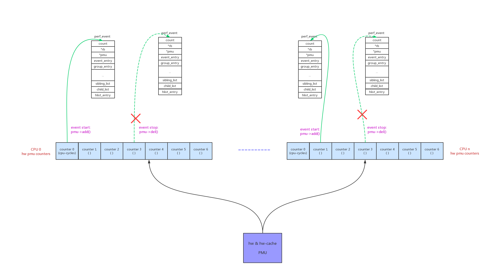
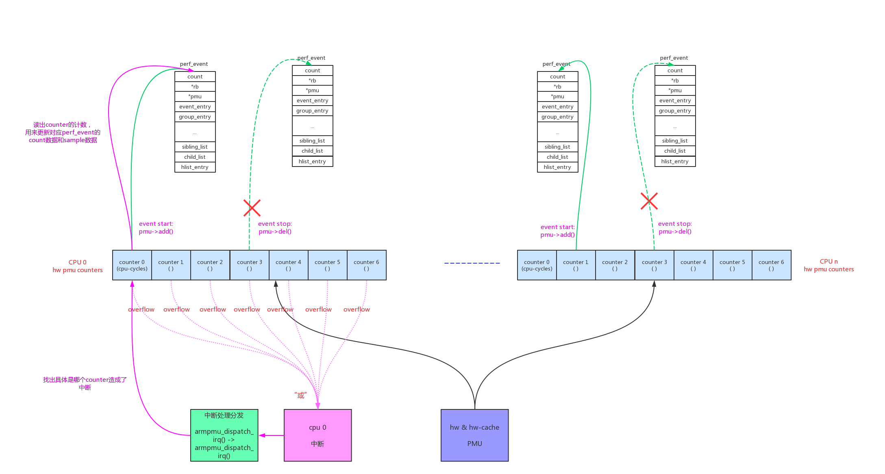

可以通过perf list命令来查看系统中的hardware event：

```
# simpleperf list hw
List of hardware events:
  cpu-cycles
  instructions
  cache-references
  cache-misses
  branch-misses

```

还有hardware-cache event：

```
# simpleperf list cache
List of hw-cache events:
  L1-dcache-loads
  L1-dcache-load-misses
  L1-dcache-stores
  L1-dcache-store-misses
  branch-loads
  branch-load-misses
  branch-stores
  branch-store-misses
```

# 1、原理介绍：

## 1.1、hardware pmu

PMU(Performance Monitor Unit)本来指的就是硬件上的性能监控计数器(counter)。因为软件trace方法存在制约制约：1、软件大部分是插桩法，对于没有插桩的地方缺乏监控；2、软件使用hrtimer的采样法开销较大，而且不精确。所以使用硬件采样来trace是一个很好的补充。

可以看到arm64的hardware pmu可以监控：cpu-cycles、instructions、cache-references、cache-misses、branch-misses、cache相关事件等等。它的监控原理比较简单：每个cpu有几个counter，counter 0固定只能配置成cpu-cycles，其他counter可以配置成支持的任意类型。当counter的计数达到我们配置的值后，产生中断，在中断中记录当前的pc等现场信息(sample数据)和累加counter计数(count数据)。



我们可以利用pmu来做以下分析，例如：

- 使用“instructions”每1000 instr采样一次，统计采样pc出现概率最大的函数，这样能找到当前的计算热点；
- 使用“cache-misses”每10 miss采样一次，统计排序，找出“cache-misses”的热点；

arm64v3每个cpu支持7个counter，counter可配置的类型如下：

- hw event。arm64支持的类型：

```
/* PMUv3 HW events mapping. */
const unsigned armv8_pmuv3_perf_map[PERF_COUNT_HW_MAX] = {
	PERF_MAP_ALL_UNSUPPORTED,
	[PERF_COUNT_HW_CPU_CYCLES]		= ARMV8_PMUV3_PERFCTR_CLOCK_CYCLES,
	[PERF_COUNT_HW_INSTRUCTIONS]		= ARMV8_PMUV3_PERFCTR_INSTR_EXECUTED,
	[PERF_COUNT_HW_CACHE_REFERENCES]	= ARMV8_PMUV3_PERFCTR_L1_DCACHE_ACCESS,
	[PERF_COUNT_HW_CACHE_MISSES]		= ARMV8_PMUV3_PERFCTR_L1_DCACHE_REFILL,
	[PERF_COUNT_HW_BRANCH_MISSES]		= ARMV8_PMUV3_PERFCTR_PC_BRANCH_MIS_PRED,
};
```

arm hw event的全集：

```
/*
 * Generalized performance event event_id types, used by the
 * attr.event_id parameter of the sys_perf_event_open()
 * syscall:
 */
enum perf_hw_id {
	/*
	 * Common hardware events, generalized by the kernel:
	 */
	PERF_COUNT_HW_CPU_CYCLES		= 0,
	PERF_COUNT_HW_INSTRUCTIONS		= 1,
	PERF_COUNT_HW_CACHE_REFERENCES		= 2,
	PERF_COUNT_HW_CACHE_MISSES		= 3,
	PERF_COUNT_HW_BRANCH_INSTRUCTIONS	= 4,
	PERF_COUNT_HW_BRANCH_MISSES		= 5,
	PERF_COUNT_HW_BUS_CYCLES		= 6,
	PERF_COUNT_HW_STALLED_CYCLES_FRONTEND	= 7,
	PERF_COUNT_HW_STALLED_CYCLES_BACKEND	= 8,
	PERF_COUNT_HW_REF_CPU_CYCLES		= 9,

	PERF_COUNT_HW_MAX,			/* non-ABI */
};

```

- hw-cache event。三维数组，arm64支持的类型：

```
const unsigned armv8_pmuv3_perf_cache_map[PERF_COUNT_HW_CACHE_MAX]
						[PERF_COUNT_HW_CACHE_OP_MAX]
						[PERF_COUNT_HW_CACHE_RESULT_MAX] = {
	PERF_CACHE_MAP_ALL_UNSUPPORTED,

	[C(L1D)][C(OP_READ)][C(RESULT_ACCESS)]	= ARMV8_PMUV3_PERFCTR_L1_DCACHE_ACCESS,
	[C(L1D)][C(OP_READ)][C(RESULT_MISS)]	= ARMV8_PMUV3_PERFCTR_L1_DCACHE_REFILL,
	[C(L1D)][C(OP_WRITE)][C(RESULT_ACCESS)]	= ARMV8_PMUV3_PERFCTR_L1_DCACHE_ACCESS,
	[C(L1D)][C(OP_WRITE)][C(RESULT_MISS)]	= ARMV8_PMUV3_PERFCTR_L1_DCACHE_REFILL,

	[C(BPU)][C(OP_READ)][C(RESULT_ACCESS)]	= ARMV8_PMUV3_PERFCTR_PC_BRANCH_PRED,
	[C(BPU)][C(OP_READ)][C(RESULT_MISS)]	= ARMV8_PMUV3_PERFCTR_PC_BRANCH_MIS_PRED,
	[C(BPU)][C(OP_WRITE)][C(RESULT_ACCESS)]	= ARMV8_PMUV3_PERFCTR_PC_BRANCH_PRED,
	[C(BPU)][C(OP_WRITE)][C(RESULT_MISS)]	= ARMV8_PMUV3_PERFCTR_PC_BRANCH_MIS_PRED,
};
```

arm hw-cache event的全集三维数组：

```
/*
 * Generalized hardware cache events:
 *
 *       { L1-D, L1-I, LLC, ITLB, DTLB, BPU, NODE } x
 *       { read, write, prefetch } x
 *       { accesses, misses }
 */
enum perf_hw_cache_id {
	PERF_COUNT_HW_CACHE_L1D			= 0,
	PERF_COUNT_HW_CACHE_L1I			= 1,
	PERF_COUNT_HW_CACHE_LL			= 2,
	PERF_COUNT_HW_CACHE_DTLB		= 3,
	PERF_COUNT_HW_CACHE_ITLB		= 4,
	PERF_COUNT_HW_CACHE_BPU			= 5,
	PERF_COUNT_HW_CACHE_NODE		= 6,

	PERF_COUNT_HW_CACHE_MAX,		/* non-ABI */
};

enum perf_hw_cache_op_id {
	PERF_COUNT_HW_CACHE_OP_READ		= 0,
	PERF_COUNT_HW_CACHE_OP_WRITE		= 1,
	PERF_COUNT_HW_CACHE_OP_PREFETCH		= 2,

	PERF_COUNT_HW_CACHE_OP_MAX,		/* non-ABI */
};

enum perf_hw_cache_op_result_id {
	PERF_COUNT_HW_CACHE_RESULT_ACCESS	= 0,
	PERF_COUNT_HW_CACHE_RESULT_MISS		= 1,

	PERF_COUNT_HW_CACHE_RESULT_MAX,		/* non-ABI */
};
```


x86系列pmu支持的监控类型更加丰富。

## 1.2、pmu init

在dts文件中定义了pmu的类型：

```
	cpu_pmu: cpu-pmu {
		compatible = "arm,armv8-pmuv3";
		qcom,irq-is-percpu;
		interrupts = <1 6 4>;
	};
```

对应的驱动在drivers/perf/perf_event_armv8.c:

```
static const struct of_device_id armv8_pmu_of_device_ids[] = {
	{.compatible = "arm,armv8-pmuv3",	.data = armv8_pmuv3_init},
	{.compatible = "arm,cortex-a53-pmu",	.data = armv8_a53_pmu_init},
	{.compatible = "arm,cortex-a57-pmu",	.data = armv8_a57_pmu_init},
#ifdef CONFIG_ARCH_MSM8996
	{.compatible = "qcom,kryo-pmuv3", .data = kryo_pmu_init},
#endif
	{},
};

static struct platform_driver armv8_pmu_driver = {
	.driver		= {
		.name	= "armv8-pmu",
		.of_match_table = armv8_pmu_of_device_ids,
	},
	.probe		= armv8_pmu_device_probe,
};
```

我们分析它的初始化函数armv8_pmu_device_probe():

```
static int armv8_pmu_device_probe(struct platform_device *pdev)
{
	return arm_pmu_device_probe(pdev, armv8_pmu_of_device_ids, NULL);
}

↓

int arm_pmu_device_probe(struct platform_device *pdev,
			 const struct of_device_id *of_table,
			 const struct pmu_probe_info *probe_table)
{
	const struct of_device_id *of_id;
	const int (*init_fn)(struct arm_pmu *);
	struct device_node *node = pdev->dev.of_node;
	struct arm_pmu *pmu;
	int ret = -ENODEV;

    /* (1) 初始化arm_pmu结构，其中arm_pmu->pmu成员是标准的pmu结构 */
	pmu = kzalloc(sizeof(struct arm_pmu), GFP_KERNEL);
	if (!pmu) {
		pr_info("failed to allocate PMU device!\n");
		return -ENOMEM;
	}

    /* (2) 初始化标准pmu结构：arm_pmu->pmu */
	armpmu_init(pmu);

	if (!__oprofile_cpu_pmu)
		__oprofile_cpu_pmu = pmu;

	pmu->plat_device = pdev;

    /* (3) arm_pmu通用部分的初始化 */
	ret = cpu_pmu_init(pmu);
	if (ret)
		goto out_free;

    /* (4) arm_pmu自定义部分的初始化， 
        "arm,armv8-pmuv3"，对应init_fn = armv8_pmuv3_init
     */
	if (node && (of_id = of_match_node(of_table, pdev->dev.of_node))) {
		init_fn = of_id->data;

		pmu->secure_access = of_property_read_bool(pdev->dev.of_node,
							   "secure-reg-access");

		/* arm64 systems boot only as non-secure */
		if (IS_ENABLED(CONFIG_ARM64) && pmu->secure_access) {
			pr_warn("ignoring \"secure-reg-access\" property for arm64\n");
			pmu->secure_access = false;
		}

		ret = of_pmu_irq_cfg(pmu);
		if (!ret)
			ret = init_fn(pmu);
	} else {
		ret = probe_current_pmu(pmu, probe_table);
		cpumask_setall(&pmu->supported_cpus);
	}

	if (ret) {
		pr_info("%s: failed to probe PMU!\n", of_node_full_name(node));
		goto out_destroy;
	}

    /* (5) 注册标准的pmu */
	ret = perf_pmu_register(&pmu->pmu, pmu->name, -1);
	if (ret)
		goto out_destroy;

	pmu->pmu_state  = ARM_PMU_STATE_OFF;
	pmu->percpu_irq = -1;

	pr_info("enabled with %s PMU driver, %d counters available\n",
			pmu->name, pmu->num_events);

	return 0;

out_destroy:
	cpu_pmu_destroy(pmu);
out_free:
	pr_info("%s: failed to register PMU devices!\n",
		of_node_full_name(node));
	kfree(pmu);
	return ret;
}
```

armpmu_init()初始化标准pmu结构：

```
static void armpmu_init(struct arm_pmu *armpmu)
{
	atomic_set(&armpmu->active_events, 0);
	mutex_init(&armpmu->reserve_mutex);

    /* (2.1) 标准pmu的初始赋值 */
	armpmu->pmu = (struct pmu) {
		.pmu_enable	= armpmu_enable,
		.pmu_disable	= armpmu_disable,
		.event_init	= armpmu_event_init,
		.add		= armpmu_add,
		.del		= armpmu_del,
		.start		= armpmu_start,
		.stop		= armpmu_stop,
		.read		= armpmu_read,
		.filter_match	= armpmu_filter_match,
		.events_across_hotplug = 1,
	};
}
```

cpu_pmu_init()初始化arm_pmu结构的通用部分：

```
static int cpu_pmu_init(struct arm_pmu *cpu_pmu)
{
	int err;
	int cpu;
	struct pmu_hw_events __percpu *cpu_hw_events;

    /* (3.1) 分配per_cpu的pmu_hw_events结构
        hw pmu在每个cpu上有7个hw counter， 
        pmu_hw_events->used_mask中的每个bit代表对于counter是否被使用
        cpu_hw_events->events[]代表被使用counter对应的perf_event结构
     */
	cpu_hw_events = alloc_percpu(struct pmu_hw_events);
	if (!cpu_hw_events)
		return -ENOMEM;

    /* (3.2) 注册arm_pmu对应的cpu hotplug回调 */
	cpu_pmu->hotplug_nb.notifier_call = cpu_pmu_notify;
	err = register_cpu_notifier(&cpu_pmu->hotplug_nb);
	if (err)
		goto out_hw_events;

    /* (3.3) 注册arm_pmu对应的pm回调 */
	err = cpu_pm_pmu_register(cpu_pmu);
	if (err)
		goto out_unregister;

    /* (3.4) 初始化分配的pmu_hw_events结构 */
	for_each_possible_cpu(cpu) {
		struct pmu_hw_events *events = per_cpu_ptr(cpu_hw_events, cpu);
		raw_spin_lock_init(&events->pmu_lock);
		events->percpu_pmu = cpu_pmu;
	}

    /* (3.5) 初始化arm_pmu的部分成员 */
	cpu_pmu->hw_events	= cpu_hw_events;
	cpu_pmu->request_irq	= cpu_pmu_request_irq;
	cpu_pmu->free_irq	= cpu_pmu_free_irq;

	/* Ensure the PMU has sane values out of reset. */
	/* (3.6) 如果可能reset到确定值 */
	if (cpu_pmu->reset)
		on_each_cpu_mask(&cpu_pmu->supported_cpus, cpu_pmu->reset,
			 cpu_pmu, 1);

	/* If no interrupts available, set the corresponding capability flag */
	/* (3.7) 如果没有中断能力，不能上报sample数据 */
	if (!platform_get_irq(cpu_pmu->plat_device, 0))
		cpu_pmu->pmu.capabilities |= PERF_PMU_CAP_NO_INTERRUPT;

	return 0;

out_unregister:
	unregister_cpu_notifier(&cpu_pmu->hotplug_nb);
out_hw_events:
	free_percpu(cpu_hw_events);
	return err;
}
```

armv8_pmuv3_init()初始化arm_pmu结构的架构(arm64)相关部分：

```
static int armv8_pmuv3_init(struct arm_pmu *cpu_pmu)
{
    /* (4.1) arm_pmu结构中架构相关的成员赋值 */
	armv8_pmu_init(cpu_pmu);
	cpu_pmu->name			= "armv8_pmuv3";
	cpu_pmu->map_event		= armv8_pmuv3_map_event;
	
	/* (4.2) 重要：
	    返回pmu可配置counter的个数
	 */
	return armv8pmu_probe_num_events(cpu_pmu);
}

|→

void armv8_pmu_init(struct arm_pmu *cpu_pmu)
{
	cpu_pmu->handle_irq		= armv8pmu_handle_irq,
	cpu_pmu->enable			= armv8pmu_enable_event,
	cpu_pmu->disable		= armv8pmu_disable_event,
	cpu_pmu->read_counter		= armv8pmu_read_counter,
	cpu_pmu->write_counter		= armv8pmu_write_counter,
	cpu_pmu->get_event_idx		= armv8pmu_get_event_idx,
	cpu_pmu->start			= armv8pmu_start,
	cpu_pmu->stop			= armv8pmu_stop,
	cpu_pmu->reset			= armv8pmu_reset,
	cpu_pmu->max_period		= (1LLU << 32) - 1,
	cpu_pmu->set_event_filter	= armv8pmu_set_event_filter;
}

|→

int armv8pmu_probe_num_events(struct arm_pmu *arm_pmu)
{
	int ret;
	struct arm_pmu_and_idle_nb *pmu_idle_nb;

	pmu_idle_nb = devm_kzalloc(&arm_pmu->plat_device->dev,
					sizeof(*pmu_idle_nb), GFP_KERNEL);
	if (!pmu_idle_nb)
		return -ENOMEM;

	pmu_idle_nb->cpu_pmu = arm_pmu;
	pmu_idle_nb->perf_cpu_idle_nb.notifier_call = perf_cpu_idle_notifier;
	idle_notifier_register(&pmu_idle_nb->perf_cpu_idle_nb);

	ret = smp_call_function_any(&arm_pmu->supported_cpus,
				    armv8pmu_read_num_pmnc_events,
				    &arm_pmu->num_events, 1);
	if (ret)
		idle_notifier_unregister(&pmu_idle_nb->perf_cpu_idle_nb);
	return ret;


}

||→

static void armv8pmu_read_num_pmnc_events(void *info)
{
	int *nb_cnt = info;

    /* (4.2.1) 读寄存器，返回counter的个数 */
	/* Read the nb of CNTx counters supported from PMNC */
	*nb_cnt = (armv8pmu_pmcr_read() >> ARMV8_PMCR_N_SHIFT) & ARMV8_PMCR_N_MASK;

    /* (4.2.2) counter 0，固定为cpu cycles counter */
	/* Add the CPU cycles counter */
	*nb_cnt += 1;
}
```

# 2、event init

我们深入来看看标准pmu的event init函数：

```
static void armpmu_init(struct arm_pmu *armpmu)
{
	atomic_set(&armpmu->active_events, 0);
	mutex_init(&armpmu->reserve_mutex);

	armpmu->pmu = (struct pmu) {
		.pmu_enable	= armpmu_enable,
		.pmu_disable	= armpmu_disable,
		.event_init	= armpmu_event_init,
		.add		= armpmu_add,
		.del		= armpmu_del,
		.start		= armpmu_start,
		.stop		= armpmu_stop,
		.read		= armpmu_read,
		.filter_match	= armpmu_filter_match,
		.events_across_hotplug = 1,
	};
}

↓

static int armpmu_event_init(struct perf_event *event)
{
	struct arm_pmu *armpmu = to_arm_pmu(event->pmu);
	int err = 0;
	atomic_t *active_events = &armpmu->active_events;

	/*
	 * Reject CPU-affine events for CPUs that are of a different class to
	 * that which this PMU handles. Process-following events (where
	 * event->cpu == -1) can be migrated between CPUs, and thus we have to
	 * reject them later (in armpmu_add) if they're scheduled on a
	 * different class of CPU.
	 */
	/* (1) 判断event所绑定的cpu是否支持 */
	if (event->cpu != -1 &&
		!cpumask_test_cpu(event->cpu, &armpmu->supported_cpus))
		return -ENOENT;

	/* does not support taken branch sampling */
	if (has_branch_stack(event))
		return -EOPNOTSUPP;

    /* (2) 将event的type + config，映射成：PERF_TYPE_HARDWARE/PERF_TYPE_HW_CACHE/PERF_TYPE_RAW 
        调用的是armv8_pmuv3_map_event()函数
     */
	if (armpmu->map_event(event) == -ENOENT)
		return -ENOENT;

	event->destroy = hw_perf_event_destroy;

    /* (3) 如果是event第一次绑定pmu，需要做一些初始化动作：
        比如注册中断
     */
	if (!atomic_inc_not_zero(active_events)) {
		mutex_lock(&armpmu->reserve_mutex);
		if (atomic_read(active_events) == 0)
			err = armpmu_reserve_hardware(armpmu);

		if (!err)
			atomic_inc(active_events);
		mutex_unlock(&armpmu->reserve_mutex);
	}

	if (err)
		return err;

    /* (4) perf_event的一些初始化 */
	err = __hw_perf_event_init(event);
	if (err)
		hw_perf_event_destroy(event);

	return err;
}

|→

static int armv8_pmuv3_map_event(struct perf_event *event)
{
	return armpmu_map_event(event, &armv8_pmuv3_perf_map,
				&armv8_pmuv3_perf_cache_map,
				ARMV8_EVTYPE_EVENT);
}

||→

int
armpmu_map_event(struct perf_event *event,
		 const unsigned (*event_map)[PERF_COUNT_HW_MAX],
		 const unsigned (*cache_map)
				[PERF_COUNT_HW_CACHE_MAX]
				[PERF_COUNT_HW_CACHE_OP_MAX]
				[PERF_COUNT_HW_CACHE_RESULT_MAX],
		 u32 raw_event_mask)
{
	u64 config = event->attr.config;
	int type = event->attr.type;

    /* (2.1) hardware pmu在perf_pmu_register()注册的时候，type=-1，所有它的type是动态分配的
        如果event的type = 动态分配的type，那么config就是raw类型的，不用映射，直接指定hardware counter的type
     */
	if (type == event->pmu->type)
		return armpmu_map_raw_event(raw_event_mask, config);

	switch (type) {
	
	/* (2.2) HARDWARE type，对config进行映射转换 */
	case PERF_TYPE_HARDWARE:
		return armpmu_map_hw_event(event_map, config);
		
	/* (2.3) HW_CACHE type，对config进行映射转换 */
	case PERF_TYPE_HW_CACHE:
		return armpmu_map_cache_event(cache_map, config);
		
	/* (2.4) RAW type，对config进行映射转换 */
	case PERF_TYPE_RAW:
		return armpmu_map_raw_event(raw_event_mask, config);
	}

	return -ENOENT;
}

|→

static int
armpmu_reserve_hardware(struct arm_pmu *armpmu)
{
    /* (3.1) 实际调用的是cpu_pmu_request_irq()函数 */
	int err = armpmu->request_irq(armpmu, armpmu_dispatch_irq);
	if (err) {
		armpmu_release_hardware(armpmu);
		return err;
	}

	armpmu->pmu_state = ARM_PMU_STATE_RUNNING;

	return 0;
}

||→

static int cpu_pmu_request_irq(struct arm_pmu *cpu_pmu, irq_handler_t handler)
{
	int i, err, irq, irqs;
	struct platform_device *pmu_device = cpu_pmu->plat_device;
	struct pmu_hw_events __percpu *hw_events = cpu_pmu->hw_events;

	if (!pmu_device)
		return -ENODEV;

    /* (3.1.1) pmu支持中断的个数 */
	irqs = min(pmu_device->num_resources, num_possible_cpus());
	if (irqs < 1) {
		pr_warn_once("perf/ARM: No irqs for PMU defined, sampling events not supported\n");
		return 0;
	}

    /* (3.1.2) 如果是per_cpu中断，从dts获得中断号并注册 */
	irq = platform_get_irq(pmu_device, 0);
	if (irq > 0 && irq_is_percpu(irq)) {
		err = request_percpu_irq(irq, handler, "arm-pmu",
					 &hw_events->percpu_pmu);
		if (err) {
			pr_err("unable to request IRQ%d for ARM PMU counters\n",
				irq);
			return err;
		}
		on_each_cpu(cpu_pmu_enable_percpu_irq, &irq, 1);
		cpu_pmu->percpu_irq = irq;
	/* (3.1.3) 如果不是per_cpu中断，逐个从dts获得中断号并注册 */
	} else {
		for (i = 0; i < irqs; ++i) {
			int cpu = i;

			err = 0;
			irq = platform_get_irq(pmu_device, i);
			if (irq < 0)
				continue;

			if (cpu_pmu->irq_affinity)
				cpu = cpu_pmu->irq_affinity[i];

			/*
			 * If we have a single PMU interrupt that we can't shift,
			 * assume that we're running on a uniprocessor machine and
			 * continue. Otherwise, continue without this interrupt.
			 */
			if (irq_set_affinity(irq, cpumask_of(cpu)) && irqs > 1) {
				pr_warn("unable to set irq affinity (irq=%d, cpu=%u)\n",
					irq, cpu);
				continue;
			}

			err = request_irq(irq, handler,
					  IRQF_NOBALANCING | IRQF_NO_THREAD, "arm-pmu",
					  per_cpu_ptr(&hw_events->percpu_pmu, cpu));
			if (err) {
				pr_err("unable to request IRQ%d for ARM PMU counters\n",
					irq);
				return err;
			}

			cpumask_set_cpu(cpu, &cpu_pmu->active_irqs);
		}
	}

	return 0;
}

|→

static int
__hw_perf_event_init(struct perf_event *event)
{
	struct arm_pmu *armpmu = to_arm_pmu(event->pmu);
	struct hw_perf_event *hwc = &event->hw;
	int mapping;

    /* (4.1) 再次调用映射转换，把config转换成counter的type 
        并且存储到hwc->config_base变量中
     */
	mapping = armpmu->map_event(event);

	if (mapping < 0) {
		pr_debug("event %x:%llx not supported\n", event->attr.type,
			 event->attr.config);
		return mapping;
	}

	/*
	 * We don't assign an index until we actually place the event onto
	 * hardware. Use -1 to signify that we haven't decided where to put it
	 * yet. For SMP systems, each core has it's own PMU so we can't do any
	 * clever allocation or constraints checking at this point.
	 */
	hwc->idx		= -1;
	hwc->config_base	= 0;
	hwc->config		= 0;
	hwc->event_base		= 0;

	/*
	 * Check whether we need to exclude the counter from certain modes.
	 */
	if ((!armpmu->set_event_filter ||
	     armpmu->set_event_filter(hwc, &event->attr)) &&
	     event_requires_mode_exclusion(&event->attr)) {
		pr_debug("ARM performance counters do not support "
			 "mode exclusion\n");
		return -EOPNOTSUPP;
	}

	/*
	 * Store the event encoding into the config_base field.
	 */
	hwc->config_base	    |= (unsigned long)mapping;

    /* (4.2) 如果不需要提供sample数据，
        初始化period参数：sample_period、last_period、period_left
     */
	if (!is_sampling_event(event)) {
		/*
		 * For non-sampling runs, limit the sample_period to half
		 * of the counter width. That way, the new counter value
		 * is far less likely to overtake the previous one unless
		 * you have some serious IRQ latency issues.
		 */
		hwc->sample_period  = armpmu->max_period >> 1;
		hwc->last_period    = hwc->sample_period;
		local64_set(&hwc->period_left, hwc->sample_period);
	}

	if (event->group_leader != event) {
		if (validate_group(event) != 0)
			return -EINVAL;
	}

	return 0;
}

```

# 3、event add/del

在“perf_event内核框架”一章中已经阐明，task维度的perf_event需要和task一起调度，其回调函数最后控制的就是perf_event的启动和停止。

- start函数调用路径：context_switch() -> finish_task_switch() -> perf_event_task_sched_in() -> __perf_event_task_sched_in() -> perf_event_context_sched_in() -> perf_event_sched_in() -> ctx_sched_in() -> ctx_pinned_sched_in()/ctx_flexible_sched_in() -> group_sched_in() -> event_sched_in() -> pmu->add(event, PERF_EF_START) -> xxx_add():


- stop函数调用路径：context_switch() -> prepare_task_switch() -> perf_event_task_sched_out() -> __perf_event_task_sched_out() -> perf_event_context_sched_out() -> ctx_sched_out() -> group_sched_out() -> event_sched_out() -> pmu->del() -> xxx_del():

> 可以看到hw counter是非常珍贵的，arm64一个cpu上只有7个counter，而一个perf_event在一个cpu上运行时就需要消耗一个独立的hw counter。不像软件的pmu，多个perf_event可以以链表的形式无限的链接到同一个pmu数据源的per_cpu链表上。 

我们具体看看hardware pmu的add和del函数的实现：

- armpmu_add()。从本cpu的counters中分配空闲的counter，配置成perf_event指定的type，并且配置count指定多少count后中断，最后使能counter。

```
static int
armpmu_add(struct perf_event *event, int flags)
{
	struct arm_pmu *armpmu = to_arm_pmu(event->pmu);
	struct pmu_hw_events *hw_events = this_cpu_ptr(armpmu->hw_events);
	struct hw_perf_event *hwc = &event->hw;
	int idx;
	int err = 0;

	/* An event following a process won't be stopped earlier */
	if (!cpumask_test_cpu(smp_processor_id(), &armpmu->supported_cpus))
		return -ENOENT;

    /* (1) disable本cpu上所有的counter */
	perf_pmu_disable(event->pmu);

	/* If we don't have a space for the counter then finish early. */
	/* (2) 从本cpu上获取一个空闲的counter */
	idx = armpmu->get_event_idx(hw_events, event);
	if (idx < 0) {
		err = idx;
		goto out;
	}

	/*
	 * If there is an event in the counter we are going to use then make
	 * sure it is disabled.
	 */
	event->hw.idx = idx;
	armpmu->disable(event);
	hw_events->events[idx] = event;

	hwc->state = PERF_HES_STOPPED | PERF_HES_UPTODATE;
	/* (3) 使能新分配的counter：
	    把counter配置成perf_event需要的type
	    并且配置period count，到期后会产生中断，在中断中上报数据并且重新配置period count
	 */
	if (flags & PERF_EF_START)
		armpmu_start(event, PERF_EF_RELOAD);

	/* Propagate our changes to the userspace mapping. */
	perf_event_update_userpage(event);

out:
    /* (4) 重新使能本cpu上所有的counter */
	perf_pmu_enable(event->pmu);
	return err;
}

|→

void perf_pmu_disable(struct pmu *pmu)
{
	int *count = this_cpu_ptr(pmu->pmu_disable_count);
	if (!(*count)++)
	    /* 调用armpmu_disable() */
		pmu->pmu_disable(pmu);
}

||→

static void armpmu_disable(struct pmu *pmu)
{
	struct arm_pmu *armpmu = to_arm_pmu(pmu);

	/* For task-bound events we may be called on other CPUs */
	if (!cpumask_test_cpu(smp_processor_id(), &armpmu->supported_cpus))
		return;

    /* 调用armv8pmu_stop() */
	armpmu->stop(armpmu);
}

|||→

static void armv8pmu_stop(struct arm_pmu *cpu_pmu)
{
	unsigned long flags;
	struct pmu_hw_events *events = this_cpu_ptr(cpu_pmu->hw_events);

	raw_spin_lock_irqsave(&events->pmu_lock, flags);
	/* Disable all counters */
	/* (1.1) disable本cpu上所有的counter */
	armv8pmu_pmcr_write(armv8pmu_pmcr_read() & ~ARMV8_PMCR_E);
	raw_spin_unlock_irqrestore(&events->pmu_lock, flags);
}

|→

static int armv8pmu_get_event_idx(struct pmu_hw_events *cpuc,
				  struct perf_event *event)
{
	int idx;
	struct arm_pmu *cpu_pmu = to_arm_pmu(event->pmu);
	struct hw_perf_event *hwc = &event->hw;
	unsigned long evtype = hwc->config_base & ARMV8_EVTYPE_EVENT;

	/* Place the first cycle counter request into the cycle counter. */
	/* (2.1) 如果需要cycles counter，先尝试counter 0 */
	if (evtype == ARMV8_PMUV3_PERFCTR_CLOCK_CYCLES) {
		if (!test_and_set_bit(ARMV8_IDX_CYCLE_COUNTER, cpuc->used_mask))
			return ARMV8_IDX_CYCLE_COUNTER;
	}

	/*
	 * For anything other than a cycle counter, try and use
	 * the events counters
	 */
	/* (2.2) 否则从counter 1开始寻找空闲counter */
	for (idx = ARMV8_IDX_COUNTER0; idx < cpu_pmu->num_events; ++idx) {
		if (!test_and_set_bit(idx, cpuc->used_mask))
			return idx;
	}

	/* The counters are all in use. */
	return -EAGAIN;
}

|→

static void armpmu_start(struct perf_event *event, int flags)
{
	struct arm_pmu *armpmu = to_arm_pmu(event->pmu);
	struct hw_perf_event *hwc = &event->hw;

	/*
	 * ARM pmu always has to reprogram the period, so ignore
	 * PERF_EF_RELOAD, see the comment below.
	 */
	if (flags & PERF_EF_RELOAD)
		WARN_ON_ONCE(!(hwc->state & PERF_HES_UPTODATE));

	hwc->state = 0;
	/*
	 * Set the period again. Some counters can't be stopped, so when we
	 * were stopped we simply disabled the IRQ source and the counter
	 * may have been left counting. If we don't do this step then we may
	 * get an interrupt too soon or *way* too late if the overflow has
	 * happened since disabling.
	 */
	/* (3.1) 设置counter的中断次数 */
	armpmu_event_set_period(event);
	
	/* (3.2) 配置counter type，并且使能counter */
	armpmu->enable(event);
}

||→

int armpmu_event_set_period(struct perf_event *event)
{
	struct arm_pmu *armpmu = to_arm_pmu(event->pmu);
	struct hw_perf_event *hwc = &event->hw;
	s64 left = local64_read(&hwc->period_left);
	s64 period = hwc->sample_period;
	int ret = 0;

    /* (3.1.1) left初始值为period，中断后：left -= delta ，
        如果上次实际发生中断的间隔delta准确等于period，left=0
        如果上次实际发生中断的间隔delta准确大于period，left<0
        如果上次实际发生中断的间隔delta准确大于2period，left <= -period，这种情况下没有补差的必要直接重新对其period
    */
	if (unlikely(left <= -period)) {
		left = period;
		local64_set(&hwc->period_left, left);
		hwc->last_period = period;
		ret = 1;
	}

    /* (3.1.2) 如果上次实际发生中断的间隔delta准确等于period，left=0
        如果上次实际发生中断的间隔delta准确大于period，left<0
        如果上次实际发生中断的间隔delta准确大于2period，left <= -period
        如果上次实际发生中断的间隔delta准确大于period但是小于2period，尝试重新补差同步，
    */
	if (unlikely(left <= 0)) {
		left += period;
		local64_set(&hwc->period_left, left);
		hwc->last_period = period;
		ret = 1;
	}

	/*
	 * Limit the maximum period to prevent the counter value
	 * from overtaking the one we are about to program. In
	 * effect we are reducing max_period to account for
	 * interrupt latency (and we are being very conservative).
	 */
	/* (3.1.3) left不能大于最大周期的1/2 */
	if (left > (armpmu->max_period >> 1))
		left = armpmu->max_period >> 1;

    /* (3.1.4) 配置prev_count为-left */
	local64_set(&hwc->prev_count, (u64)-left);

    /* (3.1.5) 配置counter为-left 
        当counter累加到0后产生中断
     */
	armpmu->write_counter(event, (u64)(-left) & 0xffffffff);

	perf_event_update_userpage(event);

	return ret;
}

|||→

static inline void armv8pmu_write_counter(struct perf_event *event, u32 value)
{
	struct arm_pmu *cpu_pmu = to_arm_pmu(event->pmu);
	struct hw_perf_event *hwc = &event->hw;
	int idx = hwc->idx;

	if (!armv8pmu_counter_valid(cpu_pmu, idx))
		pr_err("CPU%u writing wrong counter %d\n",
			smp_processor_id(), idx);
	/* (3.1.5.1) 默认就是counter 0，直接配置count */
	else if (idx == ARMV8_IDX_CYCLE_COUNTER)
		armv8pmu_pmccntr_write_reg(value);
		
	/* (3.1.5.2) 否则需要先选择counter编号，再配置count */
	else if (armv8pmu_select_counter(idx) == idx)
		armv8pmu_pmxevcntr_write_reg(value);
}

||→

static void armv8pmu_enable_event(struct perf_event *event)
{
	unsigned long flags;
	struct hw_perf_event *hwc = &event->hw;
	struct arm_pmu *cpu_pmu = to_arm_pmu(event->pmu);
	struct pmu_hw_events *events = this_cpu_ptr(cpu_pmu->hw_events);
	int idx = hwc->idx;

	/*
	 * Enable counter and interrupt, and set the counter to count
	 * the event that we're interested in.
	 */
	raw_spin_lock_irqsave(&events->pmu_lock, flags);

	/*
	 * Disable counter
	 */
	/* (3.2.1) disable counter */
	armv8pmu_disable_counter(idx);

	/*
	 * Set event (if destined for PMNx counters).
	 */
	/* (3.2.2) 根据perf_event映射转换的type，配置counter的type */
	armv8pmu_write_evtype(idx, hwc->config_base);

	/*
	 * Enable interrupt for this counter
	 */
	/* (3.2.3) enable counter的中断 */
	armv8pmu_enable_intens(idx);

	/*
	 * Enable counter
	 */
	/* (3.2.4) enable counter */
	armv8pmu_enable_counter(idx);

	raw_spin_unlock_irqrestore(&events->pmu_lock, flags);
}

|→

void perf_pmu_enable(struct pmu *pmu)
{
	int *count = this_cpu_ptr(pmu->pmu_disable_count);
	if (!--(*count))
		pmu->pmu_enable(pmu);
}

||→

static void armpmu_enable(struct pmu *pmu)
{
	struct arm_pmu *armpmu = to_arm_pmu(pmu);
	struct pmu_hw_events *hw_events = this_cpu_ptr(armpmu->hw_events);
	int enabled = bitmap_weight(hw_events->used_mask, armpmu->num_events);

	/* For task-bound events we may be called on other CPUs */
	if (!cpumask_test_cpu(smp_processor_id(), &armpmu->supported_cpus))
		return;

	if (enabled)
		armpmu->start(armpmu);
}

|||→

static void armv8pmu_start(struct arm_pmu *cpu_pmu)
{
	unsigned long flags;
	struct pmu_hw_events *events = this_cpu_ptr(cpu_pmu->hw_events);

	raw_spin_lock_irqsave(&events->pmu_lock, flags);
	/* Enable all counters */
	/* (4.1) 重新使能本cpu上所有的counter */
	armv8pmu_pmcr_write(armv8pmu_pmcr_read() | ARMV8_PMCR_E);
	raw_spin_unlock_irqrestore(&events->pmu_lock, flags);
}
```

- armpmu_del()。将event对应的counter停工，并且将counter归还给本cpu的空闲counter。

```
static void
armpmu_del(struct perf_event *event, int flags)
{
	struct arm_pmu *armpmu = to_arm_pmu(event->pmu);
	struct pmu_hw_events *hw_events = this_cpu_ptr(armpmu->hw_events);
	struct hw_perf_event *hwc = &event->hw;
	int idx = hwc->idx;

    /* (1) 将event对应的counter停工 */
	armpmu_stop(event, PERF_EF_UPDATE);
	
	/* (2) 将counter归还给本cpu的空闲counter */
	hw_events->events[idx] = NULL;
	clear_bit(idx, hw_events->used_mask);
	if (armpmu->clear_event_idx)
		armpmu->clear_event_idx(hw_events, event);

	perf_event_update_userpage(event);
}
```

# 4、event 数据采集



hardware event是采样法，采样法都是依赖于中断实现的：

- 配置counter的count，当count累加到0后，产生中断
- arm64每个cpu上多个counter共享一个中断，所以中断处理函数中需要分发中断，查看到底是哪一个counter发生了overflow
- 如果是某个counter发出的中断，给其对应的perf_event上报count数据和sample数据
- 处理完所以事务后，重新配置counter的count，这样就会重复的产生周期性的采样

具体的中断处理函数如下：

```
static irqreturn_t armpmu_dispatch_irq(int irq, void *dev)
{
	struct arm_pmu *armpmu;
	struct platform_device *plat_device;
	struct arm_pmu_platdata *plat;
	int ret;
	u64 start_clock, finish_clock;

	/*
	 * we request the IRQ with a (possibly percpu) struct arm_pmu**, but
	 * the handlers expect a struct arm_pmu*. The percpu_irq framework will
	 * do any necessary shifting, we just need to perform the first
	 * dereference.
	 */
	armpmu = *(void **)dev;
	plat_device = armpmu->plat_device;
	plat = dev_get_platdata(&plat_device->dev);

	start_clock = sched_clock();
	if (plat && plat->handle_irq)
		ret = plat->handle_irq(irq, armpmu, armpmu->handle_irq);
	else
	    /* (1) 实际调用了armv8pmu_handle_irq() */
		ret = armpmu->handle_irq(irq, armpmu);
	finish_clock = sched_clock();

	perf_sample_event_took(finish_clock - start_clock);
	return ret;
}

|→

static irqreturn_t armv8pmu_handle_irq(int irq_num, void *dev)
{
	u32 pmovsr;
	struct perf_sample_data data;
	struct arm_pmu *cpu_pmu = (struct arm_pmu *)dev;
	struct pmu_hw_events *cpuc = this_cpu_ptr(cpu_pmu->hw_events);
	struct pt_regs *regs;
	int idx;

	/*
	 * Get and reset the IRQ flags
	 */
	pmovsr = armv8pmu_getreset_flags();

	/*
	 * Did an overflow occur?
	 */
	if (!armv8pmu_has_overflowed(pmovsr))
		return IRQ_NONE;

	/*
	 * Handle the counter(s) overflow(s)
	 */
	regs = get_irq_regs();

    /* (1.1) 逐个轮询，是本cpu上的哪个counter产生的中断 */
	for (idx = 0; idx < cpu_pmu->num_events; ++idx) {
		struct perf_event *event = cpuc->events[idx];
		struct hw_perf_event *hwc;

		/* Ignore if we don't have an event. */
		if (!event)
			continue;

		/*
		 * We have a single interrupt for all counters. Check that
		 * each counter has overflowed before we process it.
		 */
		/* (1.1.1) 判断是否当前counter产生的中断 */
		if (!armv8pmu_counter_has_overflowed(pmovsr, idx))
			continue;

		hwc = &event->hw;
		
		/* (1.1.2) 计算counter的差值，并且更新perf_event的count值 */
		armpmu_event_update(event);
		
		
		perf_sample_data_init(&data, 0, hwc->last_period);
		
		/* (1.1.3) 重新配置中断周期 */
		if (!armpmu_event_set_period(event))
			continue;

        /* (1.1.4) 给对应perf_event上报sample数据 */
		if (perf_event_overflow(event, &data, regs))
			cpu_pmu->disable(event);
	}

	/*
	 * Handle the pending perf events.
	 *
	 * Note: this call *must* be run with interrupts disabled. For
	 * platforms that can have the PMU interrupts raised as an NMI, this
	 * will not work.
	 */
	/* (1.2) 处理irq_work_queue()压入的任务 */
	irq_work_run();

	return IRQ_HANDLED;
}

||→

u64 armpmu_event_update(struct perf_event *event)
{
	struct arm_pmu *armpmu = to_arm_pmu(event->pmu);
	struct hw_perf_event *hwc = &event->hw;
	u64 delta, prev_raw_count, new_raw_count;

again:
	prev_raw_count = local64_read(&hwc->prev_count);
	
	/* (1.1.2.1) 读取counter的当前count值 */
	new_raw_count = armpmu->read_counter(event);

	if (local64_cmpxchg(&hwc->prev_count, prev_raw_count,
			     new_raw_count) != prev_raw_count)
		goto again;

    /* (1.1.2.2) 计算和上一次的差值 */
	delta = (new_raw_count - prev_raw_count) & armpmu->max_period;

    /* (1.1.2.3) 把差值更新到perf_event的count中 */
	local64_add(delta, &event->count);
	
	/* (1.1.2.4) 把差值更新到left中 */
	local64_sub(delta, &hwc->period_left);

	return new_raw_count;
}

```

## 4.1、count数据

perf_event的count数据，除了在上一节的中断中更新，在read操作读取时也会更新最新的count。

perf_read() -> __perf_read() -> perf_read_one() -> perf_event_read_value() -> perf_event_read() -> __perf_event_read():

```
static void __perf_event_read(void *info)
{
	struct perf_read_data *data = info;
	struct perf_event *sub, *event = data->event;
	struct perf_event_context *ctx = event->ctx;
	struct perf_cpu_context *cpuctx = __get_cpu_context(ctx);
	struct pmu *pmu = event->pmu;

	/*
	 * If this is a task context, we need to check whether it is
	 * the current task context of this cpu.  If not it has been
	 * scheduled out before the smp call arrived.  In that case
	 * event->count would have been updated to a recent sample
	 * when the event was scheduled out.
	 */
	if (ctx->task && cpuctx->task_ctx != ctx)
		return;

	raw_spin_lock(&ctx->lock);
	if (ctx->is_active) {
		update_context_time(ctx);
		update_cgrp_time_from_event(event);
	}

	update_event_times(event);
	if (event->state != PERF_EVENT_STATE_ACTIVE)
		goto unlock;

	if (!data->group) {
	    /* (1) 调用pmu->read()函数更新最新的count值 
	        如果是hardware pmu实际调用到armpmu_read()
	     */
		pmu->read(event);
		data->ret = 0;
		goto unlock;
	}

	pmu->start_txn(pmu, PERF_PMU_TXN_READ);

	pmu->read(event);

	list_for_each_entry(sub, &event->sibling_list, group_entry) {
		update_event_times(sub);
		if (sub->state == PERF_EVENT_STATE_ACTIVE) {
			/*
			 * Use sibling's PMU rather than @event's since
			 * sibling could be on different (eg: software) PMU.
			 */
			sub->pmu->read(sub);
		}
	}

	data->ret = pmu->commit_txn(pmu);

unlock:
	raw_spin_unlock(&ctx->lock);
}

↓

static void
armpmu_read(struct perf_event *event)
{
	armpmu_event_update(event);
}

↓

u64 armpmu_event_update(struct perf_event *event)
{
	struct arm_pmu *armpmu = to_arm_pmu(event->pmu);
	struct hw_perf_event *hwc = &event->hw;
	u64 delta, prev_raw_count, new_raw_count;

again:
	prev_raw_count = local64_read(&hwc->prev_count);
	new_raw_count = armpmu->read_counter(event);

	if (local64_cmpxchg(&hwc->prev_count, prev_raw_count,
			     new_raw_count) != prev_raw_count)
		goto again;

	delta = (new_raw_count - prev_raw_count) & armpmu->max_period;

	local64_add(delta, &event->count);
	local64_sub(delta, &hwc->period_left);

	return new_raw_count;
}
```

## 4.2、sample数据

在中断中定期的上报sample数据：

```
static irqreturn_t armv8pmu_handle_irq(int irq_num, void *dev)
{


	for (idx = 0; idx < cpu_pmu->num_events; ++idx) {
		struct perf_event *event = cpuc->events[idx];
		struct hw_perf_event *hwc;

		/* Ignore if we don't have an event. */
		if (!event)
			continue;

		/*
		 * We have a single interrupt for all counters. Check that
		 * each counter has overflowed before we process it.
		 */
		if (!armv8pmu_counter_has_overflowed(pmovsr, idx))
			continue;

		hwc = &event->hw;
		armpmu_event_update(event);
		perf_sample_data_init(&data, 0, hwc->last_period);
		if (!armpmu_event_set_period(event))
			continue;

		if (perf_event_overflow(event, &data, regs))
			cpu_pmu->disable(event);
	}

}

↓

int perf_event_overflow(struct perf_event *event,
			  struct perf_sample_data *data,
			  struct pt_regs *regs)
{
	return __perf_event_overflow(event, 1, data, regs);
}


```
