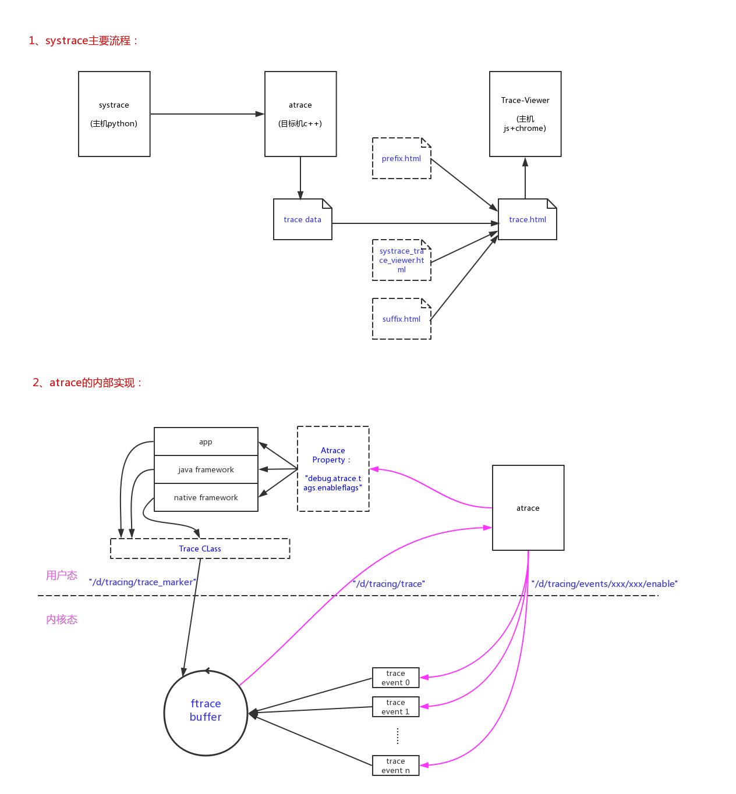
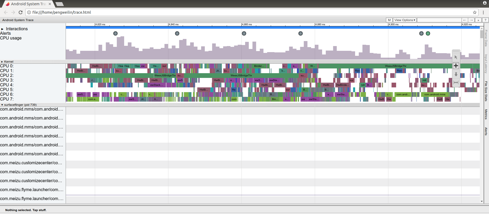

上图基本就能说清systrace的整个框架：

- 1、systrace调用atrace抓取目标机的trace数据；
- 2、systrace把trace数据和'prefix.html'、'suffix.html'、'systrace_trace_viewer.html'合成一个'trace.html'文件；
- 3、使用chrome浏览器打开'trace.html'就可以非常方便的以图形化的形式来查看和分析trace数据。背后是Trace-Viewer的脚本在运行；

内核态和用户态的存储trace数据的实现：

- 1、内核trace信息，通过trace event记录到ftrace的buffer中；
- 2、用户态(app/java framework/native)是通过使用Trace类来记录trace信息的，也是记录到内核ftrace buffer当中的，是通过"/sys/kernel/debug/tracing/trace_marker"接口记录的。


# 1、systrace的使用

在定位Android性能问题的时候，我们经常会用到systrace工具。配置到adb，连接上目标手机，在主机侧使用类似命令启动systrace：

```
ASOP_ROOT/external/chromium-trace/catapult/systrace/bin$ ./systrace -o trace.html -t 10 gfx view wm am dalvik input sched freq idle
Starting tracing (10 seconds)
Tracing completed. Collecting output...
Outputting Systrace results...
Tracing complete, writing results

Wrote trace HTML file: file:///ASOP_ROOT/external/chromium-trace/catapult/systrace/bin/trace.html
```

systrace命令在ASOP源码包的ASOP_ROOT/external/chromium-trace/catapult/systrace/bin路径下。上述命令的参数：
- '-t 10'，指定了抓取trace的时长为10s；
- '-o trace.html'，指定了trace的输出文件；
- 'gfx view wm am dalvik input sched freq idle'，指定了需要抓取的事件；

在命令启动以后，我们就可以在目标机上进行滑动、启动app等一系列操作，10s内的这些操作都会被记录下来最后dump进trace.html文件。我们可以通过google的chrome浏览器来查看、分析trace.html：'google-chrome trace.html'。



可以通过'-l'选项来查看目标机支持的systrace事件全集：

```
$ ./systrace -l
         gfx - Graphics
       input - Input
        view - View System
     webview - WebView
          wm - Window Manager
          am - Activity Manager
          sm - Sync Manager
       audio - Audio
       video - Video
      camera - Camera
         hal - Hardware Modules
         app - Application
         res - Resource Loading
      dalvik - Dalvik VM
          rs - RenderScript
      bionic - Bionic C Library
       power - Power Management
          pm - Package Manager
          ss - System Server
    database - Database
     network - Network
         adb - ADB
         pdx - PDX services
       sched - CPU Scheduling
         irq - IRQ Events
        freq - CPU Frequency
        idle - CPU Idle
        disk - Disk I/O
       workq - Kernel Workqueues
  memreclaim - Kernel Memory Reclaim
  regulators - Voltage and Current Regulators
  binder_driver - Binder Kernel driver
  binder_lock - Binder global lock trace
   pagecache - Page cache

NOTE: more categories may be available with adb root
```

还可以通过'--help'选项来查看systrace命令的详细选项：

```
$ ./systrace --help
Usage: systrace [options] [category1 [category2 ...]]

Example: systrace -b 32768 -t 15 gfx input view sched freq

Options:
  -h, --help            show this help message and exit
  -o FILE               write trace output to FILE
  -j, --json            write a JSON file
  --link-assets         (deprecated)
  --asset-dir=ASSET_DIR
                        (deprecated)
  -e DEVICE_SERIAL_NUMBER, --serial=DEVICE_SERIAL_NUMBER
                        adb device serial number
  --timeout=TIMEOUT     timeout for start and stop tracing (seconds)
  --collection-timeout=COLLECTION_TIMEOUT
                        timeout for data collection (seconds)
  -t N, --time=N        trace for N seconds
  --target=TARGET       choose tracing target (android or  linux)
  -b N, --buf-size=N    use a trace buffer size  of N KB
  -l, --list-categories
                        list the available categories and exit

  Atrace options:
    --atrace-categories=ATRACE_CATEGORIES
                        Select atrace categories with a comma-delimited list,
                        e.g. --atrace-categories=cat1,cat2,cat3
    -k KFUNCS, --ktrace=KFUNCS
                        specify a comma-separated list of kernel functions to
                        trace
    --no-compress       Tell the device not to send the trace data in
                        compressed form.
    -a APP_NAME, --app=APP_NAME
                        enable application-level tracing for comma-separated
                        list of app cmdlines
    --from-file=FROM_FILE
                        read the trace from a file (compressed) rather than
                        running a live trace

  BattOr trace options:
    --battor-categories=BATTOR_CATEGORIES
                        Select battor categories with a comma-delimited list,
                        e.g. --battor-categories=cat1,cat2,cat3
    --serial-map=SERIAL_MAP
                        File containing pregenerated map of phone serial
                        numbers to BattOr serial numbers.
    --battor-path=BATTOR_PATH
                        specify a BattOr path to use
    --battor            Use the BattOr tracing agent.

  Ftrace options:
    --ftrace-categories=FTRACE_CATEGORIES
                        Select ftrace categories with a comma-delimited list,
                        e.g. --ftrace-categories=cat1,cat2,cat3

  WALT trace options:
    --walt              Use the WALT tracing agent. WALT is a device for
                        measuring latency of physical sensors on phones and
                        computers. See https://github.com/google/walt
```

# 2、主机systrace命令的实现(python)

systrace实质上是一个python文件，整个python相关包在ASOP_ROOT/external/chromium-trace/catapult/路径下，以此路径为根(root=ASOP_ROOT/external/chromium-trace/catapult)，我们来分析它的实现过程：

./systrace/bin/systrace:

```
import os
import sys

# (1) 将'./systrace/'路径加入到python的搜索路径 #
_SYSTRACE_DIR = os.path.abspath(
    os.path.join(os.path.dirname(__file__), os.path.pardir))
sys.path.insert(0, _SYSTRACE_DIR)

# (2) 这样就能找到'./systrace/systrace/run_systrace.py'模块并导入 #
from systrace import run_systrace

# (3) 调用run_systrace.py模块中的main()函数 #
if __name__ == '__main__':
  sys.exit(run_systrace.main())
```

↓

./systrace/systrace/run_systrace.py：

```

# (3.1) main()函数继续调用main_impl()函数 #
def main():
  main_impl(sys.argv)

↓

def main_impl(arguments):
  # Parse the command line options.
  
  # (3.1.1) 将用户输入的参数解析为options和categories #
  options, categories = parse_options(arguments)

  # Override --atrace-categories and --ftrace-categories flags if command-line
  # categories are provided.
  
  # (3.1.2) 如果解析出了trace事件categories #
  # 根据options.target指定的平台'android'/'linux'，来给options中的选项赋值 #
  # 平台是使用sytrace命令的'--target=TARGET'选项来指定的，如果没有指定默认值是'android' #
  if categories:
    if options.target == 'android':
      options.atrace_categories = categories
    elif options.target == 'linux':
      options.ftrace_categories = categories
    else:
      raise RuntimeError('Categories are only valid for atrace/ftrace. Target '
                         'platform must be either Android or Linux.')
↓

./systrace/systrace/run_systrace.py：
  # Include atrace categories by default in Systrace.
  # (3.1.3) 如果平台是'android'，且没有指定trace事件，给出默认的trace事件 #
  if options.target == 'android' and not options.atrace_categories:
    options.atrace_categories = atrace_agent.DEFAULT_CATEGORIES

  # (3.1.4) 如果平台是'android'，且不是从文件中读取数据，那么就是从实际的目标机中读取数据了 #
  if options.target == 'android' and not options.from_file:
    # 初始化adb #
    initialize_devil()
    # 如果没有指定目标机的serialnumber，尝试读取 #
    if not options.device_serial_number:
      devices = [a.GetDeviceSerial() for a in adb_wrapper.AdbWrapper.Devices()]
      if len(devices) == 0:
        raise RuntimeError('No ADB devices connected.')
      elif len(devices) >= 2:
        raise RuntimeError('Multiple devices connected, serial number required')
      options.device_serial_number = devices[0]

  # If list_categories is selected, just print the list of categories.
  # In this case, use of the tracing controller is not necessary.
  # (3.1.5) 如果当前是'systrace -l'命令，列出目标机支持的所有trace事件后直接返回 #
  if options.list_categories:
    if options.target == 'android':
      # 调用'systrace/systrace/tracing_agents/atrace_agent.py'文件中的list_categories()函数 #
      # 最后调用的是`adb shell atrace --list_categories'命令 #
      atrace_agent.list_categories(options)
    elif options.target == 'linux':
      ftrace_agent.list_categories(options)
    return

  # Set up the systrace runner and start tracing.
  # (3.1.6) 如果是普通的trace命令，根据'systrace/systrace/systrace_runner.py'模块中的SystraceRunner类来创建对象 #
  controller = systrace_runner.SystraceRunner(
      os.path.dirname(os.path.abspath(__file__)), options)
      
  # (3.1.6.1) 开始tracing #
  controller.StartTracing()

  # Wait for the given number of seconds or until the user presses enter.
  # pylint: disable=superfluous-parens
  # (need the parens so no syntax error if trying to load with Python 3)
  if options.from_file is not None:
    print('Reading results from file.')
  elif options.trace_time:
    print('Starting tracing (%d seconds)' % options.trace_time)
    time.sleep(options.trace_time)
  else:
    raw_input('Starting tracing (stop with enter)')

  # Stop tracing and collect the output.
  print('Tracing completed. Collecting output...')
  
  # (3.1.6.2) 停止tracing #
  controller.StopTracing()
  
  print('Outputting Systrace results...')
  
  # (3.1.6.3) 输出tracing结果到文件中 #
  controller.OutputSystraceResults(write_json=options.write_json)
```

我们可以看到trace过的重点最后落在SystraceRunner对象的创建，以及.StartTracing()/.StopTracing()/.OutputSystraceResults()几个方法上。

下面我们详细分析一下这几个步骤的实现过程。

## 2.1、SystraceRunner类的初始化

SystraceRunner类在systrace_runner.py文件当中，我们来查看起具体实现。

./systrace/systrace/systrace_runner.py:

```
AGENT_MODULES = [android_process_data_agent, atrace_agent,
                 atrace_from_file_agent, battor_trace_agent,
                 ftrace_agent, walt_agent]

class SystraceRunner(object):
  def __init__(self, script_dir, options):
    """Constructor.

    Args:
        script_dir: Directory containing the trace viewer script
                    (systrace_trace_viewer.html)
        options: Object containing command line options.
    """
    # Parse command line arguments and create agents.
    self._script_dir = script_dir
    self._out_filename = options.output_file
    
    # (1)  #
    agents_with_config = tracing_controller.CreateAgentsWithConfig(
        options, AGENT_MODULES)
        
    # (2)  #
    controller_config = tracing_controller.GetControllerConfig(options)

    # Set up tracing controller.
    
    # (3)  #
    self._tracing_controller = tracing_controller.TracingController(
        agents_with_config, controller_config)
```

- 1、分析tracing_controller.CreateAgentsWithConfig()的实现；

./systrace/systrace/tracing_controller.py：

```
def CreateAgentsWithConfig(options, modules):
  """Create tracing agents.

  This function will determine which tracing agents are valid given the
  options and create those agents along with their corresponding configuration
  object.
  Args:
    options: The command-line options.
    modules: The modules for either Systrace or profile_chrome.
             TODO(washingtonp): After all profile_chrome agents are in
             Systrace, this parameter will no longer be valid.
  Returns:
    A list of AgentWithConfig options containing agents and their corresponding
    configuration object.
  """
  result = []
  
  # (1.1) 遍历modules中的agent调用相应的函数。对'android'来说，基本只会调用到atrace_agent、android_process_data_agent  #
  for module in modules:
  
    # (1.1.1) #
    config = module.get_config(options)
    
    # (1.1.2) #
    agent = module.try_create_agent(config)
    
    if agent and config:
      # (1.1.3) 创建一个AgentWithConfig类的对象，用来存储config和agent #
      result.append(AgentWithConfig(agent, config))
  return [x for x in result if x and x.agent]

```

|→

./systrace/systrace/tracing_agents/atrace_agent.py：

```
# (1.1.1) 创建一个AtraceConfig类的对象，用来存储optios中的相关配置 #
def get_config(options):
  return AtraceConfig(options.atrace_categories,
                      options.trace_buf_size, options.kfuncs,
                      options.app_name, options.compress_trace_data,
                      options.from_file, options.device_serial_number,
                      options.trace_time, options.target)
                      
↓

class AtraceConfig(tracing_agents.TracingConfig):
  def __init__(self, atrace_categories, trace_buf_size, kfuncs,
               app_name, compress_trace_data, from_file,
               device_serial_number, trace_time, target):
    tracing_agents.TracingConfig.__init__(self)
    self.atrace_categories = atrace_categories
    self.trace_buf_size = trace_buf_size
    self.kfuncs = kfuncs
    self.app_name = app_name
    self.compress_trace_data = compress_trace_data
    self.from_file = from_file
    self.device_serial_number = device_serial_number
    self.trace_time = trace_time
    self.target = target
```

```
# (1.1.2) 创建一个AtraceAgent类的对象 #
def try_create_agent(config):
  """Create an Atrace agent.

  Args:
      config: Command line config.
  """
  
  # 根据config的配置，判断当前Atrace agent是否需要创建 #
  if config.target != 'android':
    return None
  if config.from_file is not None:
    return None

  if not config.atrace_categories:
    return None

  # Check device SDK version.
  device_sdk_version = util.get_device_sdk_version()
  if device_sdk_version < version_codes.JELLY_BEAN_MR2:
    print ('Device SDK versions < 18 (Jellybean MR2) not supported.\n'
           'Your device SDK version is %d.' % device_sdk_version)
    return None

  return AtraceAgent(device_sdk_version)

↓

class AtraceAgent(tracing_agents.TracingAgent):

  def __init__(self, device_sdk_version):
    super(AtraceAgent, self).__init__()
    self._device_sdk_version = device_sdk_version
    self._adb = None
    self._trace_data = None
    self._tracer_args = None
    self._collection_thread = None
    self._device_utils = None
    self._device_serial_number = None
    self._config = None
    self._categories = None
```

|→

./systrace/systrace/tracing_agents/android_process_data_agent.py：

```
def try_create_agent(config):
  if config.target != 'android':
    return None
  if config.from_file is not None:
    return None
  return AndroidProcessDataAgent()
  
↓

class AndroidProcessDataAgent(tracing_agents.TracingAgent):
  def __init__(self):
    super(AndroidProcessDataAgent, self).__init__()
    self._trace_data = ""
    self._device = None
```

- 2、分析tracing_controller.GetControllerConfig()的实现；

./systrace/systrace/tracing_controller.py：

```
# (2.1) 创建一个TracingControllerConfig类的对象，用来存储optios中的相关配置 #
def GetControllerConfig(options):
  return TracingControllerConfig(options.output_file, options.trace_time,
                                 options.write_json,
                                 options.link_assets, options.asset_dir,
                                 options.timeout, options.collection_timeout,
                                 options.device_serial_number, options.target)

↓

class TracingControllerConfig(tracing_agents.TracingConfig):
  def __init__(self, output_file, trace_time, write_json,
               link_assets, asset_dir, timeout, collection_timeout,
               device_serial_number, target):
    tracing_agents.TracingConfig.__init__(self)
    self.output_file = output_file
    self.trace_time = trace_time
    self.write_json = write_json
    self.link_assets = link_assets
    self.asset_dir = asset_dir
    self.timeout = timeout
    self.collection_timeout = collection_timeout
    self.device_serial_number = device_serial_number
    self.target = target
                                
```

- 3、分析tracing_controller.TracingController()的实现；

./systrace/systrace/tracing_controller.py：

```
# (3.1) 创建一个TracingController类的对象，稍后的start/stop/output操作都使用该对象的方法 #
class TracingController(object):
  def __init__(self, agents_with_config, controller_config):
    """Create tracing controller.

    Create a tracing controller object. Note that the tracing
    controller is also a tracing agent.

    Args:
       agents_with_config: List of tracing agents for this controller with the
                           corresponding tracing configuration objects.
       controller_config:  Configuration options for the tracing controller.
    """
    self._child_agents = None
    
    # (3.1.1) 存储agent对象和config #
    self._child_agents_with_config = agents_with_config
    # (3.1.2) 新建一个TracingControllerAgent类的对象 #
    self._controller_agent = TracingControllerAgent()
    # (3.1.3) 存储controller层级的config #
    self._controller_config = controller_config
    self._trace_in_progress = False
    self.all_results = None
```

## 2.2、SystraceRunner.StartTracing()

入口是SystraceRunner类的.StartTracing()方法，./systrace/systrace/systrace_runner.py:

```
class SystraceRunner(object):

  def StartTracing(self):
    # (1)  #
    self._tracing_controller.StartTracing()
```

↓

继续调用到TracingController类的.StartTracing()方法，./systrace/systrace/tracing_controller.py：

```
class TracingController(object):

  def StartTracing(self):
    """Start tracing for all tracing agents.

    This function starts tracing for both the controller tracing agent
    and the child tracing agents.

    Returns:
        Boolean indicating whether or not the start tracing succeeded.
        Start tracing is considered successful if at least the
        controller tracing agent was started.
    """
    
    # (1.1) 设置对象中的tracing启动标志 #
    assert not self._trace_in_progress, 'Trace already in progress.'
    self._trace_in_progress = True

    # Start the controller tracing agents. Controller tracing agent
    # must be started successfully to proceed.
    # (1.2) 启动成员对象_controller_agent的.StartAgentTracing()方法 #
    # 记录一些log #
    if not self._controller_agent.StartAgentTracing(
        self._controller_config,
        timeout=self._controller_config.timeout):
      print 'Unable to start controller tracing agent.'
      return False

    # Start the child tracing agents.
    succ_agents = []
    # (1.3) 逐个启动agent list中agent的.StartAgentTracing()方法 #
    # 对'Android'来说，就一个agent：AtraceAgent #
    for agent_and_config in self._child_agents_with_config:
      agent = agent_and_config.agent
      config = agent_and_config.config
      
      # 启动agent #
      if agent.StartAgentTracing(config,
                                 timeout=self._controller_config.timeout):
        # 把启动成功的agent加入succ_agents list #
        succ_agents.append(agent)
      else:
        print 'Agent %s not started.' % str(agent)

    # Print warning if all agents not started.
    na = len(self._child_agents_with_config)
    ns = len(succ_agents)
    if ns < na:
      print 'Warning: Only %d of %d tracing agents started.' % (ns, na)
    self._child_agents = succ_agents
    return True
```

|→

继续调用到AtraceAgent类的.StartTracing()方法，./systrace/systrace/tracing_agents/atrace_agent.py：

```
class AtraceAgent(tracing_agents.TracingAgent):

  @py_utils.Timeout(tracing_agents.START_STOP_TIMEOUT)
  def StartAgentTracing(self, config, timeout=None):
    assert config.atrace_categories, 'Atrace categories are missing!'
    self._config = config
    
    # systrace命令下达的需要trace的事件 #
    self._categories = config.atrace_categories
    if isinstance(self._categories, list):
      self._categories = ','.join(self._categories)
    
    # 使用'atrace --list_categories'获取的目标机支持的可trace事件 #
    avail_cats = get_available_categories(config, self._device_sdk_version)
    
    # (1.3.1) 判断命令中是否有目标机不支持的trace事件 #
    unavailable = [x for x in self._categories.split(',') if
        x not in avail_cats]
    self._categories = [x for x in self._categories.split(',') if
        x in avail_cats]
    if unavailable:
      print 'These categories are unavailable: ' + ' '.join(unavailable)
    self._device_utils = device_utils.DeviceUtils(config.device_serial_number)
    self._device_serial_number = config.device_serial_number
    
    # (1.3.2) 构造参数：'atrace ... categories' #
    # '...'包括以下选项： #
    # '-z': compress_trace_data #
    # '-t trace_time'  #
    # '-b trace_buf_size'  #
    # '-a app_name'  #
    # '-k kfuncs'  #
    self._tracer_args = _construct_atrace_args(config,
                                               self._categories)
    # (1.3.3) 执行命令：'atrace ... categories --async_start' #
    self._device_utils.RunShellCommand(
        self._tracer_args + ['--async_start'], check_return=True)
    return True
```

|→

继续调用到AndroidProcessDataAgent类的.StartTracing()方法，./systrace/systrace/tracing_agents/android_process_data_agent.py：

```
class AndroidProcessDataAgent(tracing_agents.TracingAgent):

  @py_utils.Timeout(tracing_agents.START_STOP_TIMEOUT)
  def StartAgentTracing(self, config, timeout=None):
    self._device = device_utils.DeviceUtils(config.device_serial_number)
    self._trace_data += self._get_process_snapshot()
    return True

↓

  def _get_process_snapshot(self):
    use_legacy = False
    try:
      dump = self._device.RunShellCommand( \
          PS_COMMAND_PROC, check_return=True, as_root=True, shell=True)
    except AdbShellCommandFailedError:
      use_legacy = True

    # Check length of 2 as we execute two commands, which in case of failure
    # on old devices output 1 line each.
    if use_legacy or len(dump) == 2:
      logging.debug('Couldn\'t parse ps dump, trying legacy method ...')
      dump = self._device.RunShellCommand( \
          PS_COMMAND_PROC_LEGACY, check_return=True, as_root=True, shell=True)
      if len(dump) == 2:
        logging.error('Unable to extract process data!')
        return ""

    return '\n'.join(dump) + '\n'
    
# 实际上就是在StartTracing()和StopTracing()时，各调用一次如下的ps命令 #
PS_COMMAND_PROC = "ps -A -o USER,PID,PPID,VSIZE,RSS,WCHAN,ADDR=PC,S,NAME,COMM" \
    "&& ps -AT -o USER,PID,TID,CMD"
```

## 2.3、SystraceRunner.StopTracing()

入口是SystraceRunner类的.StopTracing()方法，./systrace/systrace/systrace_runner.py:

```
class SystraceRunner(object):

  def StopTracing(self):
    # (1)  #
    self._tracing_controller.StopTracing()    
```

↓

继续调用到TracingController类的.StopTracing()方法，./systrace/systrace/tracing_controller.py：

```
class TracingController(object):

  def StopTracing(self):
    """Issue clock sync marker and stop tracing for all tracing agents.

    This function stops both the controller tracing agent
    and the child tracing agents. It issues a clock sync marker prior
    to stopping tracing.

    Returns:
        Boolean indicating whether or not the stop tracing succeeded
        for all agents.
    """
    
    # (1.1) 清除对象中的tracing启动标志 #
    assert self._trace_in_progress, 'No trace in progress.'
    self._trace_in_progress = False

    # Issue the clock sync marker and stop the child tracing agents.
    self._IssueClockSyncMarker()
    succ_agents = []
    # (1.2) 逐个调用agent list中agent的.StopAgentTracing()方法 #
    # 对'Android'来说，就一个agent：AtraceAgent #
    for agent in self._child_agents:
      if agent.StopAgentTracing(timeout=self._controller_config.timeout):
        succ_agents.append(agent)
      else:
        print 'Agent %s not stopped.' % str(agent)

    # Stop the controller tracing agent. Controller tracing agent
    # must be stopped successfully to proceed.
    # (1.3) 调用成员对象_controller_agent的.StartAgentTracing()方法 #
    # 记录一些log #
    if not self._controller_agent.StopAgentTracing(
        timeout=self._controller_config.timeout):
      print 'Unable to stop controller tracing agent.'
      return False

    # Print warning if all agents not stopped.
    na = len(self._child_agents)
    ns = len(succ_agents)
    if ns < na:
      print 'Warning: Only %d of %d tracing agents stopped.' % (ns, na)
      self._child_agents = succ_agents

    # Collect the results from all the stopped tracing agents.
    all_results = []
    # (1.4) 汇总agent list中agent和成员对象_controller_agent所有的result #
    for agent in self._child_agents + [self._controller_agent]:
      try:
        result = agent.GetResults(
            timeout=self._controller_config.collection_timeout)
        if not result:
          print 'Warning: Timeout when getting results from %s.' % str(agent)
          continue
        if result.source_name in [r.source_name for r in all_results]:
          print ('Warning: Duplicate tracing agents named %s.' %
                 result.source_name)
        all_results.append(result)
      # Check for exceptions. If any exceptions are seen, reraise and abort.
      # Note that a timeout exception will be swalloed by the timeout
      # mechanism and will not get to that point (it will return False instead
      # of the trace result, which will be dealt with above)
      except:
        print 'Warning: Exception getting results from %s:' % str(agent)
        print sys.exc_info()[0]
        raise
    self.all_results = all_results
    return all_results
```

|→

继续调用到AtraceAgent类的.StopAgentTracing()方法，./systrace/systrace/tracing_agents/atrace_agent.py：

```
class AtraceAgent(tracing_agents.TracingAgent):

  @py_utils.Timeout(tracing_agents.START_STOP_TIMEOUT)
  def StopAgentTracing(self, timeout=None):
    """Stops tracing and starts collecting results.

    To synchronously retrieve the results after calling this function,
    call GetResults().
    """
    
    # (1.2.1) 启动stop tracing的线程 #
    self._collection_thread = threading.Thread(
        target=self._collect_and_preprocess)
    self._collection_thread.start()
    return True
    
↓

  def _collect_and_preprocess(self):
    """Collects and preprocesses trace data.

    Stores results in self._trace_data.
    """
    
    # (1.2.1.1) dump trace数据，并stop tracing #
    trace_data = self._collect_trace_data()
    
    # (1.2.1.2) 对获取的trace数据进行预处理 #
    self._trace_data = self._preprocess_trace_data(trace_data)

↓
    
  def _collect_trace_data(self):
    """Reads the output from atrace and stops the trace."""
    
    # (1.2.1.1.1) dump出trace数据 #
    # 执行命令：'atrace ... categories --async_dump' #
    dump_cmd = self._tracer_args + ['--async_dump']
    result = self._device_utils.RunShellCommand(
        dump_cmd, raw_output=True, large_output=True, check_return=True)

    # (1.2.1.1.2) 找到trace数据中'TRACE\:'开头的位置 #
    data_start = re.search(TRACE_START_REGEXP, result)
    if data_start:
      data_start = data_start.end(0)
    else:
      raise IOError('Unable to get atrace data. Did you forget adb root?')
      
    # (1.2.1.1.3) 清除trace数据中类似无效数据：r'^capturing trace\.\.\. done|^capturing trace\.\.\.' #
    output = re.sub(ADB_IGNORE_REGEXP, '', result[data_start:])
    
    # (1.2.1.1.4) stop tracing #
    # 执行命令：'atrace ... categories --async_stop' #
    self._stop_trace()
    return output

  def _preprocess_trace_data(self, trace_data):
    """Performs various processing on atrace data.

    Args:
      trace_data: The raw trace data.
    Returns:
      The processed trace data.
    """
    
    # (1.2.1.2.1) 对trace数据进行一些strp和解压 # 
    if trace_data:
      trace_data = strip_and_decompress_trace(trace_data)

    if not trace_data:
      print >> sys.stderr, ('No data was captured.  Output file was not '
                            'written.')
      sys.exit(1)

    # (1.2.1.2.2) 修复MISSING_TGIDS # 
    if _FIX_MISSING_TGIDS:
      # Gather proc data from device and patch tgids
      procfs_dump = self._device_utils.RunShellCommand(
          'echo -n /proc/[0-9]*/task/[0-9]*',
          shell=True, check_return=True)[0].split(' ')
      pid2_tgid = extract_tgids(procfs_dump)
      trace_data = fix_missing_tgids(trace_data, pid2_tgid)

    # (1.2.1.2.3) 修复CIRCULAR_TRACES # 
    if _FIX_CIRCULAR_TRACES:
      trace_data = fix_circular_traces(trace_data)

    return trace_data
```

|→

继续调用到AndroidProcessDataAgent类的.StopAgentTracing()方法，./systrace/systrace/tracing_agents/android_process_data_agent.py：

```
class AndroidProcessDataAgent(tracing_agents.TracingAgent):

  @py_utils.Timeout(tracing_agents.START_STOP_TIMEOUT)
  def StopAgentTracing(self, timeout=None):
    self._trace_data += self._get_process_snapshot()
    return True

↓

  def _get_process_snapshot(self):
    use_legacy = False
    try:
      dump = self._device.RunShellCommand( \
          PS_COMMAND_PROC, check_return=True, as_root=True, shell=True)
    except AdbShellCommandFailedError:
      use_legacy = True

    # Check length of 2 as we execute two commands, which in case of failure
    # on old devices output 1 line each.
    if use_legacy or len(dump) == 2:
      logging.debug('Couldn\'t parse ps dump, trying legacy method ...')
      dump = self._device.RunShellCommand( \
          PS_COMMAND_PROC_LEGACY, check_return=True, as_root=True, shell=True)
      if len(dump) == 2:
        logging.error('Unable to extract process data!')
        return ""

    return '\n'.join(dump) + '\n'
    
# 实际上就是在StartTracing()和StopTracing()时，各调用一次如下的ps命令 #
PS_COMMAND_PROC = "ps -A -o USER,PID,PPID,VSIZE,RSS,WCHAN,ADDR=PC,S,NAME,COMM" \
    "&& ps -AT -o USER,PID,TID,CMD"
```

## 2.4、SystraceRunner.OutputSystraceResults()

入口是SystraceRunner类的.OutputSystraceResults()方法，./systrace/systrace/systrace_runner.py:

```
class SystraceRunner(object):

  def OutputSystraceResults(self, write_json=False):
    """Output the results of systrace to a file.

    If output is necessary, then write the results of systrace to either (a)
    a standalone HTML file, or (b) a json file which can be read by the
    trace viewer.

    Args:
       write_json: Whether to output to a json file (if false, use HTML file)
    """
    print 'Tracing complete, writing results'
    if write_json:
      # (1) 输出成jason格式 #
      result = output_generator.GenerateJSONOutput(
                  self._tracing_controller.all_results,
                  self._out_filename)
    else:
      # (2) 输出成html格式 #
      # all_results是上一步stoptracing时得到的trace结果 #
      # _out_filename是使用'-o'选项指定的文件名 #
      result = output_generator.GenerateHTMLOutput(
                  self._tracing_controller.all_results,
                  self._out_filename)
    print '\nWrote trace %s file: file://%s\n' % (('JSON' if write_json
                                                   else 'HTML'), result)
```

↓

继续调用到output_generator模块中的GenerateHTMLOutput()函数，./systrace/systrace/output_generator.py：

```
def GenerateHTMLOutput(trace_results, output_file_name):
  """Write the results of systrace to an HTML file.

  Args:
      trace_results: A list of TraceResults.
      output_file_name: The name of the HTML file that the trace viewer
          results should be written to.
  """
  def _ReadAsset(src_dir, filename):
    return open(os.path.join(src_dir, filename)).read()

  # TODO(rnephew): The tracing output formatter is able to handle a single
  # systrace trace just as well as it handles multiple traces. The obvious thing
  # to do here would be to use it all for all systrace output: however, we want
  # to continue using the legacy way of formatting systrace output when a single
  # systrace and the tracing controller trace are present in order to match the
  # Java verison of systrace. Java systrace is expected to be deleted at a later
  # date. We should consolidate this logic when that happens.

  # (2.1) 如果result list中成员个数大于3，使用新方法NewGenerateHTMLOutput #
  if len(trace_results) > 3:
    NewGenerateHTMLOutput(trace_results, output_file_name)
    return os.path.abspath(output_file_name)

  systrace_dir = os.path.abspath(os.path.dirname(__file__))

  # (2.2) 尝试更新./systrace/systrace/systrace_trace_viewer.html文件 #
  try:
    from systrace import update_systrace_trace_viewer
  except ImportError:
    pass
  else:
    update_systrace_trace_viewer.update()

  trace_viewer_html = _ReadAsset(systrace_dir, 'systrace_trace_viewer.html')

  # Open the file in binary mode to prevent python from changing the
  # line endings, then write the prefix.
  
  # (2.3) 读出'prefix.html','suffix.html','systrace_trace_viewer.html'文件的内容备用 #
  systrace_dir = os.path.abspath(os.path.dirname(__file__))
  html_prefix = _ReadAsset(systrace_dir, 'prefix.html')
  html_suffix = _ReadAsset(systrace_dir, 'suffix.html')
  trace_viewer_html = _ReadAsset(systrace_dir,
                                  'systrace_trace_viewer.html')

  # Open the file in binary mode to prevent python from changing the
  # line endings, then write the prefix.
  # (2.4) 打开一个名为'xxx.html'的输出文件，准备写入 #
  html_file = open(output_file_name, 'wb')
  
  # (2.4.1) 首先写入'prefix.html'的内容 #
  # 并且把其中的'{{SYSTRACE_TRACE_VIEWER_HTML}}'字符用'systrace_trace_viewer.html'的文件内容替换 #
  html_file.write(html_prefix.replace('{{SYSTRACE_TRACE_VIEWER_HTML}}',
                                      trace_viewer_html))

  # Write the trace data itself. There is a separate section of the form
  # <script class="trace-data" type="application/text"> ... </script>
  # for each tracing agent (including the controller tracing agent).
  
  # (2.4.2) 逐个按格式写入trace_results中的trace数据 #
  html_file.write('<!-- BEGIN TRACE -->\n')
  for result in trace_results:
    html_file.write('  <script class="trace-data" type="application/text">\n')
    html_file.write(_ConvertToHtmlString(result.raw_data))
    html_file.write('  </script>\n')
  html_file.write('<!-- END TRACE -->\n')

  # Write the suffix and finish.
  # (2.4.3) 最后写入'suffix.html'的内容 #
  html_file.write(html_suffix)
  html_file.close()

  final_path = os.path.abspath(output_file_name)
  return final_path

```

# 2.4、执行的命令

我们在devil/devil/android/device_utils.py的RunShellCommand.run()和devil/devil/utils/cmd_helper.py的Popen()处加上调试打印，看到’./systrace -o trace.html -t 10 gfx view wm am dalvik input sched freq idle‘命令的具体执行过程如下：

```
ASOP_ROOT/external/chromium-trace/catapult/systrace/bin/systrace -o trace.html -t 10 gfx view wm am dalvik input sched freq idle
Popen: [u'/usr/bin/adb', 'devices']
run: ( c=/data/local/tmp/cache_token;echo $EXTERNAL_STORAGE;cat $c 2>/dev/null||echo;echo "636d6fb8-d59c-11e8-ae24-b8ca3a959992">$c &&getprop )>/data/local/tmp/temp_file-4aec8d95e60eb
Popen: [u'/usr/bin/adb', '-s', '872QADT5KWKRG', 'shell', '( ( c=/data/local/tmp/cache_token;echo $EXTERNAL_STORAGE;cat $c 2>/dev/null||echo;echo "636d6fb8-d59c-11e8-ae24-b8ca3a959992">$c &&getprop )>/data/local/tmp/temp_file-4aec8d95e60eb );echo %$?']
Popen: [u'/usr/bin/adb', '-s', '872QADT5KWKRG', 'pull', '/data/local/tmp/temp_file-4aec8d95e60eb', '/tmp/tmple_FOq/tmp_ReadFileWithPull']
run: su 0 ls /root && ! ls /root
Popen: [u'/usr/bin/adb', '-s', '872QADT5KWKRG', Popen: [u'/usr/bin/adb', 'shell''-s', , '8'( su 0 ls72QADT5KWKRG',  /root && ! ls /root 'shell', );echo'rm -f /data/local/tmp/ %$?']temp_file-4aec8d95e60eb']

run: ps -A -o USER,PID,PPID,VSIZE,RSS,WCHAN,ADDR=PC,S,NAME,COMM&& ps -AT -o USER,PID,TID,CMD
Popen: [u'/usr/bin/adb', '-s', '872QADT5KWKRG', 'shell', '( ps -A -o USER,PID,PPID,VSIZE,RSS,WCHAN,ADDR=PC,S,NAME,COMM&& ps -AT -o USER,PID,TID,CMD );echo %$?']
run: atrace --list_categories
Popen: [u'/usr/bin/adb', '-s', '872QADT5KWKRG', 'shell', '( atrace --list_categories );echo %$?']
run: atrace -z -t 10 -b 4096 gfx view wm am dalvik input sched freq idle --async_start
Popen: [u'/usr/bin/adb', '-s', '872QADT5KWKRG', 'shell', '( atrace -z -t 10 -b 4096 gfx view wm am dalvik input sched freq idle --async_start );echo %$?']
Starting tracing (10 seconds)
Tracing completed. Collecting output...
run: ps -A -o USER,PID,PPID,VSIZE,RSS,WCHAN,ADDR=PC,S,NAME,COMM&& ps -AT -o USER,PID,TID,CMD
Popen: [u'/usr/bin/adb', '-s', '872QADT5KWKRG', 'shell', '( ps -A -o USER,PID,PPID,VSIZE,RSS,WCHAN,ADDR=PC,S,NAME,COMM&& ps -AT -o USER,PID,TID,CMD );echo %$?']
run: ( atrace -z -t 10 -b 4096 gfx view wm am dalvik input sched freq idle --async_dump )>/data/local/tmp/temp_file-57edea8625b51
Popen: [u'/usr/bin/adb', '-s', '872QADT5KWKRG', 'shell', '( ( atrace -z -t 10 -b 4096 gfx view wm am dalvik input sched freq idle --async_dump )>/data/local/tmp/temp_file-57edea8625b51 );echo %$?']
Popen: [u'/usr/bin/adb', '-s', '872QADT5KWKRG', 'pull', '/data/local/tmp/temp_file-57edea8625b51', '/tmp/tmp_preLk/tmp_ReadFileWithPull']
Popen: [u'/usr/bin/adb', '-s', '872QADT5KWKRG', 'shell', 'rm -f /data/local/tmp/temp_file-57edea8625b51']
run: atrace -z -t 10 -b 4096 gfx view wm am dalvik input sched freq idle --async_stop
Popen: [u'/usr/bin/adb', '-s', '872QADT5KWKRG', 'shell', '( atrace -z -t 10 -b 4096 gfx view wm am dalvik input sched freq idle --async_stop );echo %$?']
run: echo -n /proc/[0-9]*/task/[0-9]*
Popen: [u'/usr/bin/adb', '-s', '872QADT5KWKRG', 'shell', '( echo -n /proc/[0-9]*/task/[0-9]* );echo %$?']
Outputting Systrace results...
Tracing complete, writing results

Wrote trace HTML file: file:///home/pengweilin/sdb2/m1872/code/repo/external/chromium-trace/catapult/systrace/bin/pwl1.html
```

精简起来是调用目标机上的atrace命令实现的：

```
adb shell atrace -z -t 10 -b 4096 gfx view wm am dalvik input sched freq idle --async_start
adb shell atrace -z -t 10 -b 4096 gfx view wm am dalvik input sched freq idle --async_dump > /data/local/tmp/temp_file-57edea8625b51
adb pull /data/local/tmp/temp_file-57edea8625b51 /tmp/tmp_preLk/tmp_ReadFileWithPull
adb shell rm -f /data/local/tmp/temp_file-57edea8625b51
adb shell atrace -z -t 10 -b 4096 gfx view wm am dalvik input sched freq idle --async_stop
```

# 3、目标机atrace命令的实现(c++)

从上一节可以看到主机的systrace命令实际最后都是调用目标机上的atrace命令实现的。从atrace的命令格式上看，分为两部分：

- [options]：就是'-'和'--'打头的选项；
- [categories...]：指定需要trace哪些事件。就是类似'gfx view wm am dalvik input sched freq idle'这些；

```
$ atrace --help
usage: atrace [options] [categories...]
options include:
  -a appname      enable app-level tracing for a comma separated list of cmdlines
  -b N            use a trace buffer size of N KB
  -c              trace into a circular buffer
  -f filename     use the categories written in a file as space-separated
                    values in a line
  -k fname,...    trace the listed kernel functions
  -n              ignore signals
  -s N            sleep for N seconds before tracing [default 0]
  -t N            trace for N seconds [default 5]
  -z              compress the trace dump
  --async_start   start circular trace and return immediately
  --async_dump    dump the current contents of circular trace buffer
  --async_stop    stop tracing and dump the current contents of circular
                    trace buffer
  --stream        stream trace to stdout as it enters the trace buffer
                    Note: this can take significant CPU time, and is best
                    used for measuring things that are not affected by
                    CPU performance, like pagecache usage.
  --list_categories
                  list the available tracing categories
 -o filename      write the trace to the specified file instead
                    of stdout.
```

atrace的源码在ASOP_ROOT/frameworks/native/cmds/atrace/atrace.cpp，我们来具体分析一下它的实现：

```
int main(int argc, char **argv)
{
    bool async = false;
    bool traceStart = true;
    bool traceStop = true;
    bool traceDump = true;
    bool traceStream = false;

    /* (1) atrace跟"--help"选项，印出帮助信息 */
    if (argc == 2 && 0 == strcmp(argv[1], "--help")) {
        showHelp(argv[0]);
        exit(0);
    }

    /* (2) ftrace目录是否存在 */
    if (!findTraceFiles()) {
        fprintf(stderr, "No trace folder found\n");
        exit(-1);
    }

    /* (3) 逐条解析atrace的命令参数 */
    for (;;) {
        int ret;
        int option_index = 0;
        static struct option long_options[] = {
            {"async_start",     no_argument, 0,  0 },
            {"async_stop",      no_argument, 0,  0 },
            {"async_dump",      no_argument, 0,  0 },
            {"list_categories", no_argument, 0,  0 },
            {"stream",          no_argument, 0,  0 },
            {           0,                0, 0,  0 }
        };

        /* (3.1) 尝试使用option来解析atrace的命令参数 */
        ret = getopt_long(argc, argv, "a:b:cf:k:ns:t:zo:",
                          long_options, &option_index);

        /* (3.2) 如果使用option解析失败，尝试使用category来进行解析  */
        if (ret < 0) {
            for (int i = optind; i < argc; i++) {
                if (!setCategoryEnable(argv[i], true)) {
                    fprintf(stderr, "error enabling tracing category \"%s\"\n", argv[i]);
                    exit(1);
                }
            }
            break;
        }

        /* (3.3) 根据解析出来的option，设置flag */
        switch(ret) {
            case 'a':
                g_debugAppCmdLine = optarg;
            break;

            case 'b':
                g_traceBufferSizeKB = atoi(optarg);
            break;

            case 'c':
                g_traceOverwrite = true;
            break;

            case 'f':
                g_categoriesFile = optarg;
            break;

            case 'k':
                g_kernelTraceFuncs = optarg;
            break;

            case 'n':
                g_nohup = true;
            break;

            case 's':
                g_initialSleepSecs = atoi(optarg);
            break;

            case 't':
                g_traceDurationSeconds = atoi(optarg);
            break;

            case 'z':
                g_compress = true;
            break;

            case 'o':
                g_outputFile = optarg;
            break;

            case 0:
                if (!strcmp(long_options[option_index].name, "async_start")) {
                    async = true;
                    traceStop = false;
                    traceDump = false;
                    g_traceOverwrite = true;
                } else if (!strcmp(long_options[option_index].name, "async_stop")) {
                    async = true;
                    traceStart = false;
                } else if (!strcmp(long_options[option_index].name, "async_dump")) {
                    async = true;
                    traceStart = false;
                    traceStop = false;
                } else if (!strcmp(long_options[option_index].name, "stream")) {
                    traceStream = true;
                    traceDump = false;
                } else if (!strcmp(long_options[option_index].name, "list_categories")) {
                    listSupportedCategories();
                    exit(0);
                }
            break;

            default:
                fprintf(stderr, "\n");
                showHelp(argv[0]);
                exit(-1);
            break;
        }
    }

    registerSigHandler();

    if (g_initialSleepSecs > 0) {
        sleep(g_initialSleepSecs);
    }

    bool ok = true;
    /* (4) "-- async_start" option命令的实际执行动作 */
    if (traceStart) {
        /* (4.1)  */
        ok &= setUpTrace();
        
        /* (4.2)  */
        ok &= startTrace();
    }

    if (ok && traceStart) {
        if (!traceStream) {
            printf("capturing trace...");
            fflush(stdout);
        }

        // We clear the trace after starting it because tracing gets enabled for
        // each CPU individually in the kernel. Having the beginning of the trace
        // contain entries from only one CPU can cause "begin" entries without a
        // matching "end" entry to show up if a task gets migrated from one CPU to
        // another.
        /* (4.3) 清除trace内容 */
        ok = clearTrace();

        /* (4.4) 通过trace_marker文件接口，写入同步信息 */
        writeClockSyncMarker();
        
        /* (4.5) async==false的支持 */
        if (ok && !async && !traceStream) {
            // Sleep to allow the trace to be captured.
            struct timespec timeLeft;
            timeLeft.tv_sec = g_traceDurationSeconds;
            timeLeft.tv_nsec = 0;
            do {
                if (g_traceAborted) {
                    break;
                }
            } while (nanosleep(&timeLeft, &timeLeft) == -1 && errno == EINTR);
        }

        /* (4.6) traceStream的支持 */
        if (traceStream) {
            streamTrace();
        }
    }

    // Stop the trace and restore the default settings.
    /* (5) "-- async_stop" option命令的实际执行动作 */
    if (traceStop)
        stopTrace();

    /* (6) "-- async_dump" option命令的实际执行动作 */
    if (ok && traceDump) {
        if (!g_traceAborted) {
            printf(" done\n");
            fflush(stdout);
            int outFd = STDOUT_FILENO;
            if (g_outputFile) {
                outFd = open(g_outputFile, O_WRONLY | O_CREAT | O_TRUNC, 0644);
            }
            if (outFd == -1) {
                printf("Failed to open '%s', err=%d", g_outputFile, errno);
            } else {
                dprintf(outFd, "TRACE:\n");
                dumpTrace(outFd);
                if (g_outputFile) {
                    close(outFd);
                }
            }
        } else {
            printf("\ntrace aborted.\n");
            fflush(stdout);
        }
        clearTrace();
    } else if (!ok) {
        fprintf(stderr, "unable to start tracing\n");
    }

    // Reset the trace buffer size to 1.
    if (traceStop)
        cleanUpTrace();

    return g_traceAborted ? 1 : 0;
}

```

## 3.1、categories

categories指的是可被trace的事件的类别，它的全集如下：

```
/* Tracing categories */
static const TracingCategory k_categories[] = {
    { "gfx",        "Graphics",         ATRACE_TAG_GRAPHICS, {
        { OPT,      "events/mdss/enable" },
    } },
    { "input",      "Input",            ATRACE_TAG_INPUT, { } },
    { "view",       "View System",      ATRACE_TAG_VIEW, { } },
    { "webview",    "WebView",          ATRACE_TAG_WEBVIEW, { } },
    { "wm",         "Window Manager",   ATRACE_TAG_WINDOW_MANAGER, { } },
    { "am",         "Activity Manager", ATRACE_TAG_ACTIVITY_MANAGER, { } },
    { "sm",         "Sync Manager",     ATRACE_TAG_SYNC_MANAGER, { } },
    { "audio",      "Audio",            ATRACE_TAG_AUDIO, { } },
    { "video",      "Video",            ATRACE_TAG_VIDEO, { } },
    { "camera",     "Camera",           ATRACE_TAG_CAMERA, { } },
    { "hal",        "Hardware Modules", ATRACE_TAG_HAL, { } },
    { "app",        "Application",      ATRACE_TAG_APP, { } },
    { "res",        "Resource Loading", ATRACE_TAG_RESOURCES, { } },
    { "dalvik",     "Dalvik VM",        ATRACE_TAG_DALVIK, { } },
    { "rs",         "RenderScript",     ATRACE_TAG_RS, { } },
    { "bionic",     "Bionic C Library", ATRACE_TAG_BIONIC, { } },
    { "power",      "Power Management", ATRACE_TAG_POWER, { } },
    { "pm",         "Package Manager",  ATRACE_TAG_PACKAGE_MANAGER, { } },
    { "ss",         "System Server",    ATRACE_TAG_SYSTEM_SERVER, { } },
    { "database",   "Database",         ATRACE_TAG_DATABASE, { } },
    { "network",    "Network",          ATRACE_TAG_NETWORK, { } },
    { "adb",        "ADB",              ATRACE_TAG_ADB, { } },
    { k_coreServiceCategory, "Core services", 0, { } },
    { k_pdxServiceCategory, "PDX services", 0, { } },
    { "sched",      "CPU Scheduling",   0, {
        { REQ,      "events/sched/sched_switch/enable" },
        { REQ,      "events/sched/sched_wakeup/enable" },
        { OPT,      "events/sched/sched_waking/enable" },
        { OPT,      "events/sched/sched_blocked_reason/enable" },
        { OPT,      "events/sched/sched_cpu_hotplug/enable" },
        { OPT,      "events/cgroup/enable" },
    } },
    { "irq",        "IRQ Events",   0, {
        { REQ,      "events/irq/enable" },
        { OPT,      "events/ipi/enable" },
    } },
    { "i2c",        "I2C Events",   0, {
        { REQ,      "events/i2c/enable" },
        { REQ,      "events/i2c/i2c_read/enable" },
        { REQ,      "events/i2c/i2c_write/enable" },
        { REQ,      "events/i2c/i2c_result/enable" },
        { REQ,      "events/i2c/i2c_reply/enable" },
        { OPT,      "events/i2c/smbus_read/enable" },
        { OPT,      "events/i2c/smbus_write/enable" },
        { OPT,      "events/i2c/smbus_result/enable" },
        { OPT,      "events/i2c/smbus_reply/enable" },
    } },
    { "freq",       "CPU Frequency",    0, {
        { REQ,      "events/power/cpu_frequency/enable" },
        { OPT,      "events/power/clock_set_rate/enable" },
        { OPT,      "events/power/cpu_frequency_limits/enable" },
    } },
    { "membus",     "Memory Bus Utilization", 0, {
        { REQ,      "events/memory_bus/enable" },
    } },
    { "idle",       "CPU Idle",         0, {
        { REQ,      "events/power/cpu_idle/enable" },
    } },
    { "disk",       "Disk I/O",         0, {
        { OPT,      "events/f2fs/f2fs_sync_file_enter/enable" },
        { OPT,      "events/f2fs/f2fs_sync_file_exit/enable" },
        { OPT,      "events/f2fs/f2fs_write_begin/enable" },
        { OPT,      "events/f2fs/f2fs_write_end/enable" },
        { OPT,      "events/ext4/ext4_da_write_begin/enable" },
        { OPT,      "events/ext4/ext4_da_write_end/enable" },
        { OPT,      "events/ext4/ext4_sync_file_enter/enable" },
        { OPT,      "events/ext4/ext4_sync_file_exit/enable" },
        { REQ,      "events/block/block_rq_issue/enable" },
        { REQ,      "events/block/block_rq_complete/enable" },
    } },
    { "mmc",        "eMMC commands",    0, {
        { REQ,      "events/mmc/enable" },
    } },
    { "load",       "CPU Load",         0, {
        { REQ,      "events/cpufreq_interactive/enable" },
    } },
    { "sync",       "Synchronization",  0, {
        { REQ,      "events/sync/enable" },
    } },
    { "workq",      "Kernel Workqueues", 0, {
        { REQ,      "events/workqueue/enable" },
    } },
    { "memreclaim", "Kernel Memory Reclaim", 0, {
        { REQ,      "events/vmscan/mm_vmscan_direct_reclaim_begin/enable" },
        { REQ,      "events/vmscan/mm_vmscan_direct_reclaim_end/enable" },
        { REQ,      "events/vmscan/mm_vmscan_kswapd_wake/enable" },
        { REQ,      "events/vmscan/mm_vmscan_kswapd_sleep/enable" },
        { REQ,      "events/lowmemorykiller/enable" },
    } },
    { "regulators",  "Voltage and Current Regulators", 0, {
        { REQ,      "events/regulator/enable" },
    } },
    { "binder_driver", "Binder Kernel driver", 0, {
        { REQ,      "events/binder/binder_transaction/enable" },
        { REQ,      "events/binder/binder_transaction_received/enable" },
        { OPT,      "events/binder/binder_set_priority/enable" },
    } },
    { "binder_lock", "Binder global lock trace", 0, {
        { OPT,      "events/binder/binder_lock/enable" },
        { OPT,      "events/binder/binder_locked/enable" },
        { OPT,      "events/binder/binder_unlock/enable" },
    } },
    { "pagecache",  "Page cache", 0, {
        { REQ,      "events/filemap/enable" },
    } },
};
```

这些categories可以简单分为3类：

- 1、使用内核ftrace的trace event实现的内核事件。例如"sched"，.sysfiles字段指定了trace event的路径；
- 2、使用Trace类实现的用户态事件(app/java framework/native)。例如"input"，.tags字段指定了trace tag；
- 3、service类型的事件。如k_coreServiceCategory和k_pdxServiceCategory；

具体目标机可能只支持categories全集中的一部分，所以atrace会对命令参数中指定的categories本机是否支持进行判断：

```
main() -> setCategoryEnable():

static bool setCategoryEnable(const char* name, bool enable)
{
    /* (1) 逐个判断命令参数中的categories，本机是否支持 */
    for (size_t i = 0; i < arraysize(k_categories); i++) {
        const TracingCategory& c = k_categories[i];
        if (strcmp(name, c.name) == 0) {
        
            /* (2) 判断categories是否支持 */
            if (isCategorySupported(c)) {
                g_categoryEnables[i] = enable;
                return true;
            } else {
                /* (3) 如果本机不支持categories，原因是否是没有root权限？ */
                if (isCategorySupportedForRoot(c)) {
                    fprintf(stderr, "error: category \"%s\" requires root "
                            "privileges.\n", name);
                            
                /* (4) 本机不支持categories，报错 */
                } else {
                    fprintf(stderr, "error: category \"%s\" is not supported "
                            "on this device.\n", name);
                }
                return false;
            }
        }
    }
    fprintf(stderr, "error: unknown tracing category \"%s\"\n", name);
    return false;
}

↓

static bool isCategorySupported(const TracingCategory& category)
{
    /* (2.1) 如果category是k_coreServiceCategory，判断name是否为"core_services"，判断"ro.atrace.core.services"的property是否存在 */
    if (strcmp(category.name, k_coreServiceCategory) == 0) {
        return !android::base::GetProperty(k_coreServicesProp, "").empty();
    }


    /* (2.2) 如果category是k_pdxServiceCategory，判断name是否为"pdx" */
    if (strcmp(category.name, k_pdxServiceCategory) == 0) {
        return true;
    }

    bool ok = category.tags != 0;
    /* (2.2) 如果category是使用了内核的trace event，判断trace4event相应的文件是否存在是否可写 */
    for (int i = 0; i < MAX_SYS_FILES; i++) {
        const char* path = category.sysfiles[i].path;
        bool req = category.sysfiles[i].required == REQ;
        if (path != NULL) {
            if (req) {
                if (!fileIsWritable(path)) {
                    return false;
                } else {
                    ok = true;
                }
            } else {
                ok = true;
            }
        }
    }
    return ok;
}
```

我们也可以使用atrace命令的"--list_categories"选项，列出当前目标机支持的所有categories：

```
main() -> listSupportedCategories()：

static void listSupportedCategories()
{
    /* (1) 逐个遍历k_categories数组中的所有category */
    for (size_t i = 0; i < arraysize(k_categories); i++) {
        const TracingCategory& c = k_categories[i];
        
        /* (2) 判断当前目标机系统是否支持 */
        if (isCategorySupported(c)) {
            printf("  %10s - %s\n", c.name, c.longname);
        }
    }
}
```

## 3.2、'--async_start'

当atrace命令使用了'--async_start'选项以后，会启动指定的所有categories：

```
static bool setUpTrace()
{
    bool ok = true;

    // Set up the tracing options.
    /* (4.1.1) 如果categories是使用文件指定的，解析文件中的categories并使能 */
    ok &= setCategoriesEnableFromFile(g_categoriesFile);
    
    /* (4.1.2) 根据'-c'选项，配置trace event的overwrite："/sys/kernel/debug/tracing/options/overwrite" */
    ok &= setTraceOverwriteEnable(g_traceOverwrite);
    
    /* (4.1.3) 根据'-b'选项，配置trace event的buffer size："/sys/kernel/debug/tracing/buffer_size_kb" */
    ok &= setTraceBufferSizeKB(g_traceBufferSizeKB);
    // TODO: Re-enable after stabilization
    //ok &= setCmdlineSize();
    
    /* (4.1.4) 根据选项，配置："/sys/kernel/debug/tracing/trace_clock" */
    ok &= setClock();
    
    /* (4.1.5) 使能："/sys/kernel/debug/tracing/options/print-tgid" */
    ok &= setPrintTgidEnableIfPresent(true);
    
    /* (4.1.6) 根据'-k'选项指定的需要trace的kernel 函数，
        配置当前tracer为function_graph："/sys/kernel/debug/tracing/current_tracer" 
        在filter中配置需要trace的函数名："/sys/kernel/debug/tracing/set_ftrace_filter" 
    */
    ok &= setKernelTraceFuncs(g_kernelTraceFuncs);

    // Set up the tags property.
    uint64_t tags = 0;
    /* (4.1.7) 把categories中需要trace的tag进行'或'操作，并配置到"debug.atrace.tags.enableflags"的property中 */
    for (size_t i = 0; i < arraysize(k_categories); i++) {
        if (g_categoryEnables[i]) {
            const TracingCategory &c = k_categories[i];
            tags |= c.tags;
        }
    }
    ok &= setTagsProperty(tags);

    bool coreServicesTagEnabled = false;
    for (size_t i = 0; i < arraysize(k_categories); i++) {
        if (strcmp(k_categories[i].name, k_coreServiceCategory) == 0) {
            coreServicesTagEnabled = g_categoryEnables[i];
        }

        // Set whether to poke PDX services in this session.
        if (strcmp(k_categories[i].name, k_pdxServiceCategory) == 0) {
            g_tracePdx = g_categoryEnables[i];
        }
    }

    /* (4.1.8) 根据'-a'选项指定的需要trace的app name，最多指定16个，
        配置到"debug.atrace.app_%d"的property当中
    */
    std::string packageList(g_debugAppCmdLine);
    if (coreServicesTagEnabled) {
        if (!packageList.empty()) {
            packageList += ",";
        }
        packageList += android::base::GetProperty(k_coreServicesProp, "");
    }
    ok &= setAppCmdlineProperty(&packageList[0]);
    
    /* (4.1.9) 让defaultServiceManager()中的所有service重新读取property，使修改的配置生效 */
    ok &= pokeBinderServices();
    
    /* (4.1.10) 让::android::hardware::defaultServiceManager()中的所有service重新读取property，使修改的配置生效 */
    pokeHalServices();

    /* (4.1.11) 如果categories指定了"pdx"，让pdx service重新读取property，使修改的配置生效 */
    if (g_tracePdx) {
        ok &= ServiceUtility::PokeServices();
    }

    // Disable all the sysfs enables.  This is done as a separate loop from
    // the enables to allow the same enable to exist in multiple categories.
    /* (4.1.12) disable掉所有的trace event */
    ok &= disableKernelTraceEvents();

    // Enable all the sysfs enables that are in an enabled category.
    /* (4.1.13) 根据categories数组中的配置，使能相应的trace event */
    for (size_t i = 0; i < arraysize(k_categories); i++) {
        if (g_categoryEnables[i]) {
            const TracingCategory &c = k_categories[i];
            for (int j = 0; j < MAX_SYS_FILES; j++) {
                const char* path = c.sysfiles[j].path;
                bool required = c.sysfiles[j].required == REQ;
                if (path != NULL) {
                    if (fileIsWritable(path)) {
                        ok &= setKernelOptionEnable(path, true);
                    } else if (required) {
                        fprintf(stderr, "error writing file %s\n", path);
                        ok = false;
                    }
                }
            }
        }
    }

    return ok;
}
```

```
static bool startTrace()
{
    return setTracingEnabled(true);
}

↓

// Enable or disable kernel tracing.
static bool setTracingEnabled(bool enable)
{
    /* (4.2.1) 打开总开关："/sys/kernel/debug/tracing/tracing_on" */
    return setKernelOptionEnable(k_tracingOnPath, enable);
}
```

## 3.3、'--async_dump'

当atrace命令使用了'--async_dump'选项以后，会dump出trace内容：

```
main()
{

    /* (6) "-- async_dump" option命令的实际执行动作 */
    if (ok && traceDump) {
        if (!g_traceAborted) {
            printf(" done\n");
            fflush(stdout);
            
            /* (6.1) 默认的dump信息输出句柄 */
            int outFd = STDOUT_FILENO;
            
            /* (6.2) 使用'-o'选项指定的dump信息输出句柄 */
            if (g_outputFile) {
                outFd = open(g_outputFile, O_WRONLY | O_CREAT | O_TRUNC, 0644);
            }
            if (outFd == -1) {
                printf("Failed to open '%s', err=%d", g_outputFile, errno);
            } else {
                dprintf(outFd, "TRACE:\n");
                
                /* (6.3) 读出"/sys/kernel/debug/tracing/trace"的内容dump到输出句柄 */
                dumpTrace(outFd);
                if (g_outputFile) {
                    close(outFd);
                }
            }
        } else {
            printf("\ntrace aborted.\n");
            fflush(stdout);
        }
        clearTrace();
    } else if (!ok) {
        fprintf(stderr, "unable to start tracing\n");
    }
    
}

↓

```

## 3.4、'--async_stop'

当atrace命令使用了'--async_stop'选项以后，会停止所有categories的trace信息抓取：

```
static void stopTrace()
{
    setTracingEnabled(false);
}

↓

static bool setTracingEnabled(bool enable)
{
    /* (5.1) 关闭总开关："/sys/kernel/debug/tracing/tracing_on" */
    return setKernelOptionEnable(k_tracingOnPath, enable);
}
```

# 4、目标机Trace类的使用(java/c++)

atrace只是一个控制命令，实际的trace数据路径是这样分工的：

- 1、内核trace信息，通过trace event记录到ftrace的buffer中；
- 2、用户态(app/java framework/native)是通过使用Trace类来记录trace信息的，实际上是通过"/sys/kernel/debug/tracing/trace_marker"接口记录到内核ftracebuffer当中的。

我们查看atrace dump出来的原始信息，可以看到对应的"tracing_mark_write"字段：

```
 ndroid.systemui-1856  ( 1856) [001] ...1 89888.553074: tracing_mark_write: S|1856|animator:alpha|62928891
 ndroid.systemui-1856  ( 1856) [001] ...1 89888.553096: tracing_mark_write: F|1856|animator:alpha|62928891
 ndroid.systemui-1856  ( 1856) [001] ...1 89888.553110: tracing_mark_write: S|1856|animator:scaleX|37096049
 ndroid.systemui-1856  ( 1856) [001] ...1 89888.553131: tracing_mark_write: F|1856|animator:scaleX|37096049
```

这样内核态和用户态的trace数据最后都写入到了ftrace buffer当中，也实现了时间同步，最后通过"/sys/kernel/debug/tracing/trace"接口读出。

在用户态的各个层次是这样使用Trace类的：

## 4.1、app

```
import android.os.Trace;
Trace.beginSection(String sectionName)
Trace.EndSection()
```

详细例子可以参考：[systrace ](https://developer.android.com/studio/command-line/systrace#java)

```
public class MyAdapter extends RecyclerView.Adapter<MyViewHolder> {
    ...
    @Override
    public MyViewHolder onCreateViewHolder(ViewGroup parent, int viewType) {
        Trace.beginSection(&quot;MyAdapter.onCreateViewHolder&quot;);
        MyViewHolder myViewHolder;
        try {
            myViewHolder = MyViewHolder.newInstance(parent);
        } finally {
            // In &#39;try...catch&#39; statements, always call <code><a href="/reference/android/os/Trace.html#endSection()">endSection()</a></code>
            // in a &#39;finally&#39; block to ensure it is invoked even when an exception
            // is thrown.
            Trace.endSection();
        }
        return myViewHolder;
    }</p>

<p>@Override
    public void onBindViewHolder(MyViewHolder holder, int position) {
        Trace.beginSection(&quot;MyAdapter.onBindViewHolder&quot;);
        try {
            try {
                Trace.beginSection(&quot;MyAdapter.queryDatabase&quot;);
                RowItem rowItem = queryDatabase(position);
                mDataset.add(rowItem);
            } finally {
                Trace.endSection();
            }
            holder.bind(mDataset.get(position));
        } finally {
            Trace.endSection();
        }
    }
...
}
```

然后通过python systrace.py --app=sectionName 指定apk，或者通过ddms选择指定apk，抓取systrace分析。

## 4.2、Java framework

```
import android.os.Trace;
Trace.traceBegin(long traceTag, String methodName)
Trace.traceEnd(long traceTag)
```

## 4.3、Native framework

```
#include <cutils/trace.h>
ATRACE_CALL()
```

# 5、主机Trace-Viewer的实现(js)

从systrace python文件的解析我们可以看到，最后把trace数据和'prefix.html'、'suffix.html'、'systrace_trace_viewer.html'合成一个'trace.html'文件，使用chrome浏览器打开'trace.html'就可以非常方便的以图形化的形式来查看和分析trace数据。

这里面的关键就是Trace-Viewer，核心是其中的js脚本。该项目的[github主页](https://github.com/catapult-project/catapult)。

本人js功底太差，看了一堆资料还是不得要领。如有感兴趣的同学可以继续深入研究，Trace-Viewer功能非常强大，用来做trace数据的分析和实现再合适不过了，如果可以利用起来自己修改非常强大。

一些参考文档：  
[catapult on github](https://github.com/catapult-project/catapult)  
[Trace-Viewer](https://github.com/catapult-project/catapult/blob/master/tracing/README.md)  
[Trace Event Format](https://docs.google.com/document/d/1CvAClvFfyA5R-PhYUmn5OOQtYMH4h6I0nSsKchNAySU/preview#heading=h.yr4qxyxotyw)  
[extending-and-customizing-trace-viewer](https://github.com/catapult-project/catapult/blob/master/tracing/docs/extending-and-customizing-trace-viewer.md)  
[Trace Viewer getting-started](https://github.com/catapult-project/catapult/blob/master/tracing/docs/getting-started.md)  
[Trace Viewer doc](https://github.com/catapult-project/catapult/tree/master/tracing/docs)  
[<template>标签](https://developer.mozilla.org/zh-CN/docs/Web/HTML/Element/template)  
[和 Polymer 一起加入 Web 组件革命](https://www.ibm.com/developerworks/cn/web/wa-polymer/index.html)  
[The Trace Event Profiling Tool (about:tracing)](http://dev.chromium.org/developers/how-tos/trace-event-profiling-tool)  
[Recording Tracing Runs](http://dev.chromium.org/developers/how-tos/trace-event-profiling-tool/recording-tracing-runs)  
[Understanding about:tracing results](http://dev.chromium.org/developers/how-tos/trace-event-profiling-tool/trace-event-reading)  
[FrameViewer How-To](http://dev.chromium.org/developers/how-tos/trace-event-profiling-tool/using-frameviewer)  

这里面最有名的一个问题是在trace.html中加上一条自定义的trace曲线，主要步骤如下：

- 1、在内核中实现自己的trace event；
- 2、在atrace.cpp代码的k_categories[]数组中加上对应的category；
- 3、在Trace-Viewer中加上对这类category的解析，Trace-Viewer对数据的解析都是通过parser来实现的，可以仿照[linux_perf](https://github.com/catapult-project/catapult/tree/master/tracing/tracing/extras/importer/linux_perf)中的实现增加一条parser，重新生成'systrace_trace_viewer.html'、'trace.html'文件即可。


# 参考文档

[1、systrace](https://developer.android.com/studio/command-line/systrace)  
[2、Android系统性能调优工具介绍](https://www.cnblogs.com/wanqieddy/p/4494896.html)  
[3、理解和使用systrace](https://blog.csdn.net/omnispace/article/details/77620667)  