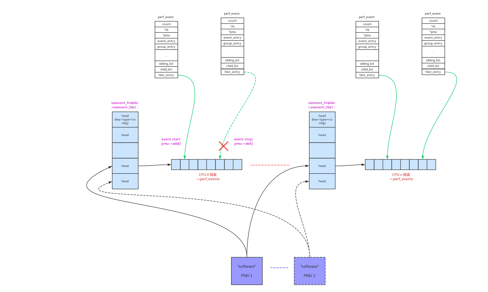

可以通过perf list命令来查看系统中的software event：

```
# simpleperf list sw
List of software events:
  cpu-clock
  task-clock
  page-faults
  context-switches
  cpu-migrations
  minor-faults
  major-faults
  alignment-faults
  emulation-faults
```

# 1、原理介绍：

software pmu的trace数据抓取分为两类：“cpu-clock”、“task-clock”为采样法，其他为插桩法。

```
enum perf_sw_ids {
	PERF_COUNT_SW_CPU_CLOCK			= 0,
	PERF_COUNT_SW_TASK_CLOCK		= 1,
	PERF_COUNT_SW_PAGE_FAULTS		= 2,
	PERF_COUNT_SW_CONTEXT_SWITCHES		= 3,
	PERF_COUNT_SW_CPU_MIGRATIONS		= 4,
	PERF_COUNT_SW_PAGE_FAULTS_MIN		= 5,
	PERF_COUNT_SW_PAGE_FAULTS_MAJ		= 6,
	PERF_COUNT_SW_ALIGNMENT_FAULTS		= 7,
	PERF_COUNT_SW_EMULATION_FAULTS		= 8,
	PERF_COUNT_SW_DUMMY			= 9,
	PERF_COUNT_SW_BPF_OUTPUT		= 10,

	PERF_COUNT_SW_MAX,			/* non-ABI */
};
```

## 1.1、插桩法

插桩法的software event和tracepoint event本质上是一样的，只是tracepoint event是复用trace_event，而software event是重新创建的插桩点。

- 1、“page-faults”的插桩点：

el0_sync() -> el0_da() -> do_mem_abort() -> do_mem_abort() -> do_page_fault():

```
static int __kprobes do_page_fault(unsigned long addr, unsigned int esr,
				   struct pt_regs *regs)
{

    /* “context-switches”的插桩点，被命中时上报数据 */
    perf_sw_event(PERF_COUNT_SW_PAGE_FAULTS, 1, regs, addr);

}
```

- 2、“context-switches”的插桩点：

context_switch() -> prepare_task_switch() -> perf_event_task_sched_out():

```
static inline void perf_event_task_sched_out(struct task_struct *prev,
					     struct task_struct *next)
{
    /* “context-switches”的插桩点，被命中时上报数据 */
	perf_sw_event_sched(PERF_COUNT_SW_CONTEXT_SWITCHES, 1, 0);

	if (static_key_false(&perf_sched_events.key))
		__perf_event_task_sched_out(prev, next);
}
```

- 3、“cpu-migrations”的插桩点：

context_switch() -> finish_task_switch() -> perf_event_task_sched_in():

```
static inline void perf_event_task_sched_in(struct task_struct *prev,
					    struct task_struct *task)
{
	if (static_key_false(&perf_sched_events.key))
		__perf_event_task_sched_in(prev, task);

    /* “cpu-migrations”的插桩点，被命中时上报数据 */
	if (perf_sw_migrate_enabled() && task->sched_migrated) {
		struct pt_regs *regs = this_cpu_ptr(&__perf_regs[0]);

		perf_fetch_caller_regs(regs);
		___perf_sw_event(PERF_COUNT_SW_CPU_MIGRATIONS, 1, regs, 0);
		task->sched_migrated = 0;
	}
}
```

- 4、“minor-faults”&“major-faults”的插桩点：

el0_sync() -> el0_da() -> do_mem_abort() -> do_mem_abort() -> do_page_fault():

```
static int __kprobes do_page_fault(unsigned long addr, unsigned int esr,
				   struct pt_regs *regs)
{

	perf_sw_event(PERF_COUNT_SW_PAGE_FAULTS, 1, regs, addr);
	if (mm_flags & FAULT_FLAG_ALLOW_RETRY) {
		if (fault & VM_FAULT_MAJOR) {
			tsk->maj_flt++;
			/* “major-faults”的插桩点，被命中时上报数据 */
			perf_sw_event(PERF_COUNT_SW_PAGE_FAULTS_MAJ, 1, regs,
				      addr);
		} else {
			tsk->min_flt++;
			/* “minor-faults”的插桩点，被命中时上报数据 */
			perf_sw_event(PERF_COUNT_SW_PAGE_FAULTS_MIN, 1, regs,
				      addr);
		}
		if (fault & VM_FAULT_RETRY) {
			/*
			 * Clear FAULT_FLAG_ALLOW_RETRY to avoid any risk of
			 * starvation.
			 */
			mm_flags &= ~FAULT_FLAG_ALLOW_RETRY;
			mm_flags |= FAULT_FLAG_TRIED;
			goto retry;
		}
	}

}
```

- 5、“alignment-faults”的插桩点：

arm64没有插桩点

- 6、“emulation-faults”的插桩点：

cp15barrier_handler():

```
static int cp15barrier_handler(struct pt_regs *regs, u32 instr)
{
	perf_sw_event(PERF_COUNT_SW_EMULATION_FAULTS, 1, regs, regs->pc);

}
```

## 1.2、采样法

采样法是间隔多少事件去采样，事件可以是指令数、时间、cache miss次数等。一般使用专门的硬件pmu来采样，“cpu-clock”、“task-clock”使用软件的hrtimer来采样。

在硬件PMU不支持的情况下，也可以参考hrtimer的采样值。

# 2、event init

## 2.1、"software"

```
static struct pmu perf_swevent = {
	.task_ctx_nr	= perf_sw_context,

	.capabilities	= PERF_PMU_CAP_NO_NMI,

	.event_init	= perf_swevent_init,
	.add		= perf_swevent_add,
	.del		= perf_swevent_del,
	.start		= perf_swevent_start,
	.stop		= perf_swevent_stop,
	.read		= perf_swevent_read,

	.events_across_hotplug = 1,
};
```

对应初始化函数：

```
static int perf_swevent_init(struct perf_event *event)
{
	u64 event_id = event->attr.config;

	if (event->attr.type != PERF_TYPE_SOFTWARE)
		return -ENOENT;

	/*
	 * no branch sampling for software events
	 */
	if (has_branch_stack(event))
		return -EOPNOTSUPP;

	switch (event_id) {
	case PERF_COUNT_SW_CPU_CLOCK:
	case PERF_COUNT_SW_TASK_CLOCK:
		return -ENOENT;

	default:
		break;
	}

	if (event_id >= PERF_COUNT_SW_MAX)
		return -ENOENT;

	if (!event->parent) {
		int err;

        /* (1) 确保per_cpu的hash表已经创建 */
		err = swevent_hlist_get(event);
		if (err)
			return err;

        /* (2) 打开event_id对应event的开关 */
		static_key_slow_inc(&perf_swevent_enabled[event_id]);
		event->destroy = sw_perf_event_destroy;
	}

	return 0;
}

↓

static int swevent_hlist_get(struct perf_event *event)
{
	int err;
	int cpu, failed_cpu;

	get_online_cpus();
	for_each_possible_cpu(cpu) {
		err = swevent_hlist_get_cpu(event, cpu);
		if (err) {
			failed_cpu = cpu;
			goto fail;
		}
	}
	put_online_cpus();

	return 0;
fail:
	for_each_possible_cpu(cpu) {
		if (cpu == failed_cpu)
			break;
		swevent_hlist_put_cpu(event, cpu);
	}

	put_online_cpus();
	return err;
}

↓

static int swevent_hlist_get_cpu(struct perf_event *event, int cpu)
{
	struct swevent_htable *swhash = &per_cpu(swevent_htable, cpu);
	int err = 0;

	mutex_lock(&swhash->hlist_mutex);
	
	/* (1.1) 确保per_cpu的hash表已经分配 */
	if (!swevent_hlist_deref(swhash) && cpu_online(cpu)) {
		struct swevent_hlist *hlist;

		hlist = kzalloc(sizeof(*hlist), GFP_KERNEL);
		if (!hlist) {
			err = -ENOMEM;
			goto exit;
		}
		rcu_assign_pointer(swhash->swevent_hlist, hlist);
	}
	
	/* (1.2) 增加对hash表的引用 */
	swhash->hlist_refcount++;
exit:
	mutex_unlock(&swhash->hlist_mutex);

	return err;
}
```

这里的核心是一个默认256大小的hash链表，稍后会根据(type+config)的hash键值把event链接进去。

```
#define SWEVENT_HLIST_BITS		8
#define SWEVENT_HLIST_SIZE		(1 << SWEVENT_HLIST_BITS)

struct swevent_hlist {
	struct hlist_head		heads[SWEVENT_HLIST_SIZE];
	struct rcu_head			rcu_head;
};
```


## 2.2、“cpu-clock”

```
static struct pmu perf_cpu_clock = {
	.task_ctx_nr	= perf_sw_context,

	.capabilities	= PERF_PMU_CAP_NO_NMI,

	.event_init	= cpu_clock_event_init,
	.add		= cpu_clock_event_add,
	.del		= cpu_clock_event_del,
	.start		= cpu_clock_event_start,
	.stop		= cpu_clock_event_stop,
	.read		= cpu_clock_event_read,

	.events_across_hotplug = 1,
};
```

对应初始化函数：

```
static int cpu_clock_event_init(struct perf_event *event)
{
	if (event->attr.type != PERF_TYPE_SOFTWARE)
		return -ENOENT;

	if (event->attr.config != PERF_COUNT_SW_CPU_CLOCK)
		return -ENOENT;

	/*
	 * no branch sampling for software events
	 */
	if (has_branch_stack(event))
		return -EOPNOTSUPP;

	perf_swevent_init_hrtimer(event);

	return 0;
}

↓

static void perf_swevent_init_hrtimer(struct perf_event *event)
{
	struct hw_perf_event *hwc = &event->hw;

	if (!is_sampling_event(event))
		return;

    /* (1) 初始化对应hrtimer */
	hrtimer_init(&hwc->hrtimer, CLOCK_MONOTONIC, HRTIMER_MODE_REL);
	hwc->hrtimer.function = perf_swevent_hrtimer;

	/*
	 * Since hrtimers have a fixed rate, we can do a static freq->period
	 * mapping and avoid the whole period adjust feedback stuff.
	 */
	/* (2) 如果是freq模式，根据freq计算period 
	    在这种模式下->period_left不为负，等于->sample_period
	 */
	if (event->attr.freq) {
		long freq = event->attr.sample_freq;

		event->attr.sample_period = NSEC_PER_SEC / freq;
		hwc->sample_period = event->attr.sample_period;
		local64_set(&hwc->period_left, hwc->sample_period);
		hwc->last_period = hwc->sample_period;
		event->attr.freq = 0;
	}
}
```


## 2.3、“task-clock”

```
static struct pmu perf_task_clock = {
	.task_ctx_nr	= perf_sw_context,

	.capabilities	= PERF_PMU_CAP_NO_NMI,

	.event_init	= task_clock_event_init,
	.add		= task_clock_event_add,
	.del		= task_clock_event_del,
	.start		= task_clock_event_start,
	.stop		= task_clock_event_stop,
	.read		= task_clock_event_read,

	.events_across_hotplug = 1,
};
```

对应初始化函数：

```
static int task_clock_event_init(struct perf_event *event)
{
	if (event->attr.type != PERF_TYPE_SOFTWARE)
		return -ENOENT;

	if (event->attr.config != PERF_COUNT_SW_TASK_CLOCK)
		return -ENOENT;

	/*
	 * no branch sampling for software events
	 */
	if (has_branch_stack(event))
		return -EOPNOTSUPP;

	perf_swevent_init_hrtimer(event);

	return 0;
}
```

# 3、event add/del

在上一章“perf_event内核框架”中已经阐明，task维度的perf_event需要和task一起调度，其回调函数最后控制的就是perf_event的启动和停止。

- start函数调用路径：context_switch() -> finish_task_switch() -> perf_event_task_sched_in() -> __perf_event_task_sched_in() -> perf_event_context_sched_in() -> perf_event_sched_in() -> ctx_sched_in() -> ctx_pinned_sched_in()/ctx_flexible_sched_in() -> group_sched_in() -> event_sched_in() -> pmu->add(event, PERF_EF_START) -> xxx_add():


- stop函数调用路径：context_switch() -> prepare_task_switch() -> perf_event_task_sched_out() -> __perf_event_task_sched_out() -> perf_event_context_sched_out() -> ctx_sched_out() -> group_sched_out() -> event_sched_out() -> pmu->del() -> xxx_del():


## 3.1、"software"



这种模式下，控制"software"event的启动和停止，实际上就是把event加入/移除到hash链表上。

- perf_swevent_add():

```
static int perf_swevent_add(struct perf_event *event, int flags)
{
	struct swevent_htable *swhash = this_cpu_ptr(&swevent_htable);
	struct hw_perf_event *hwc = &event->hw;
	struct hlist_head *head;

    /* (1) 重新计算period参数 */
	if (is_sampling_event(event)) {
		hwc->last_period = hwc->sample_period;
		perf_swevent_set_period(event);
	}

	hwc->state = !(flags & PERF_EF_START);

    /* (2) 根据event的(type+config)计算在hash表中的链表head */
	head = find_swevent_head(swhash, event);
	if (WARN_ON_ONCE(!head))
		return -EINVAL;

    /* (3) 将event加入链表 */
	hlist_add_head_rcu(&event->hlist_entry, head);
	perf_event_update_userpage(event);

	return 0;
}
```

- perf_swevent_del():

```
static void perf_swevent_del(struct perf_event *event, int flags)
{
    /* (1) 将event从链表中移除 */
	hlist_del_rcu(&event->hlist_entry);
}
```

## 3.2、“cpu-clock”

每个event一个独立的hrtimer，所有就没有什么链表之类的了。

- cpu_clock_event_add():

```
static int cpu_clock_event_add(struct perf_event *event, int flags)
{
	if (flags & PERF_EF_START)
		cpu_clock_event_start(event, flags);
	perf_event_update_userpage(event);

	return 0;
}

↓

static void cpu_clock_event_start(struct perf_event *event, int flags)
{
    /* (1) 记下当前的cpu time值 */
	local64_set(&event->hw.prev_count, local_clock());
	
	/* (2) 启动hrtimer */
	perf_swevent_start_hrtimer(event);
}

↓

static void perf_swevent_start_hrtimer(struct perf_event *event)
{
	struct hw_perf_event *hwc = &event->hw;
	s64 period;

	if (!is_sampling_event(event))
		return;

    /* (2.1) hrtimer的周期为10ms和->sample_period两者中的较大值 */
	period = local64_read(&hwc->period_left);
	if (period) {
		if (period < 0)
			period = 10000;

		local64_set(&hwc->period_left, 0);
	} else {
		period = max_t(u64, 10000, hwc->sample_period);
	}
	hrtimer_start(&hwc->hrtimer, ns_to_ktime(period),
		      HRTIMER_MODE_REL_PINNED);
}
```

hrtimer到期后的执行函数为perf_swevent_hrtimer()，它会定期的上报sample数据。

```
static enum hrtimer_restart perf_swevent_hrtimer(struct hrtimer *hrtimer)
{
	enum hrtimer_restart ret = HRTIMER_RESTART;
	struct perf_sample_data data;
	struct pt_regs *regs;
	struct perf_event *event;
	u64 period;

	event = container_of(hrtimer, struct perf_event, hw.hrtimer);

	if (event->state != PERF_EVENT_STATE_ACTIVE)
		return HRTIMER_NORESTART;

	event->pmu->read(event);

	perf_sample_data_init(&data, 0, event->hw.last_period);
	regs = get_irq_regs();

	if (regs && !perf_exclude_event(event, regs)) {
		if (!(event->attr.exclude_idle && is_idle_task(current)))
			if (__perf_event_overflow(event, 1, &data, regs))
				ret = HRTIMER_NORESTART;
	}

	period = max_t(u64, 10000, event->hw.sample_period);
	hrtimer_forward_now(hrtimer, ns_to_ktime(period));

	return ret;
}
```

- cpu_clock_event_del()：

```
static void cpu_clock_event_del(struct perf_event *event, int flags)
{
	cpu_clock_event_stop(event, flags);
}

↓

static void cpu_clock_event_stop(struct perf_event *event, int flags)
{
    /* (1) 停止hrtimer */
	perf_swevent_cancel_hrtimer(event);
	
	/* (2) 计算cpu time的差值，用来更新event的count值 */
	cpu_clock_event_update(event);
}

↓

static void cpu_clock_event_update(struct perf_event *event)
{
	s64 prev;
	u64 now;

	now = local_clock();
	prev = local64_xchg(&event->hw.prev_count, now);
	
	/* (2.1) 使用差值来更新count值 */
	local64_add(now - prev, &event->count);
}
```


## 3.3、“task-clock”

“task-clock”和“cpu-clock”基本一致，只是它计算的count值是event所在context time的差值。

- task_clock_event_add():

```
static int task_clock_event_add(struct perf_event *event, int flags)
{
	if (flags & PERF_EF_START)
		task_clock_event_start(event, flags);
	perf_event_update_userpage(event);

	return 0;
}

↓

static void task_clock_event_start(struct perf_event *event, int flags)
{
	local64_set(&event->hw.prev_count, event->ctx->time);
	perf_swevent_start_hrtimer(event);
}
```

- task_clock_event_del():

```
static void task_clock_event_del(struct perf_event *event, int flags)
{
	task_clock_event_stop(event, PERF_EF_UPDATE);
}

↓

static void task_clock_event_stop(struct perf_event *event, int flags)
{
	perf_swevent_cancel_hrtimer(event);
	task_clock_event_update(event, event->ctx->time);
}

↓

static void task_clock_event_update(struct perf_event *event, u64 now)
{
	u64 prev;
	s64 delta;

	prev = local64_xchg(&event->hw.prev_count, now);
	delta = now - prev;
	local64_add(delta, &event->count);
}
```

# 4、event 数据采集

## 4.1、"software"

在插桩点被触发后，累加count数据，并且上报sample数据。以“context-switches”为例：

context_switch() -> prepare_task_switch() -> perf_event_task_sched_out():

```
static inline void perf_event_task_sched_out(struct task_struct *prev,
					     struct task_struct *next)
{
    /* (1) “context-switches”的插桩点，被命中时上报数据 */
	perf_sw_event_sched(PERF_COUNT_SW_CONTEXT_SWITCHES, 1, 0);

	if (static_key_false(&perf_sched_events.key))
		__perf_event_task_sched_out(prev, next);
}

↓

static __always_inline void
perf_sw_event_sched(u32 event_id, u64 nr, u64 addr)
{
    /* (1.1) event开关在init时被使能 */
	if (static_key_false(&perf_swevent_enabled[event_id])) {
		struct pt_regs *regs = this_cpu_ptr(&__perf_regs[0]);

		perf_fetch_caller_regs(regs);
		___perf_sw_event(event_id, nr, regs, addr);
	}
}

↓

void ___perf_sw_event(u32 event_id, u64 nr, struct pt_regs *regs, u64 addr)
{
	struct perf_sample_data data;

	if (WARN_ON_ONCE(!regs))
		return;

	perf_sample_data_init(&data, addr, 0);
	do_perf_sw_event(PERF_TYPE_SOFTWARE, event_id, nr, &data, regs);
}

↓

static void do_perf_sw_event(enum perf_type_id type, u32 event_id,
				    u64 nr,
				    struct perf_sample_data *data,
				    struct pt_regs *regs)
{
	struct swevent_htable *swhash = this_cpu_ptr(&swevent_htable);
	struct perf_event *event;
	struct hlist_head *head;

	rcu_read_lock();
	
	/* (1.1.1) 找出pmu在hash表中的event链表 */
	head = find_swevent_head_rcu(swhash, type, event_id);
	if (!head)
		goto end;

    /* (1.1.2) 逐个向event发送数据 */
	hlist_for_each_entry_rcu(event, head, hlist_entry) {
	    
	    /* (1.1.3) 因为key(type+config)在hash中可能重复，再进行精确判断 */
		if (perf_swevent_match(event, type, event_id, data, regs))
			perf_swevent_event(event, nr, data, regs);
	}
end:
	rcu_read_unlock();
}

↓

static void perf_swevent_event(struct perf_event *event, u64 nr,
			       struct perf_sample_data *data,
			       struct pt_regs *regs)
{
	struct hw_perf_event *hwc = &event->hw;

    /* (1.1.2.1) 更新count数据 */
	local64_add(nr, &event->count);

	if (!regs)
		return;

	if (!is_sampling_event(event))
		return;

    /* (1.1.2.2) 上报采样数据，具体可以参考"tracepoint events"一章 */
	if ((event->attr.sample_type & PERF_SAMPLE_PERIOD) && !event->attr.freq) {
		data->period = nr;
		return perf_swevent_overflow(event, 1, data, regs);
	} else
		data->period = event->hw.last_period;

	if (nr == 1 && hwc->sample_period == 1 && !event->attr.freq)
		return perf_swevent_overflow(event, 1, data, regs);

	if (local64_add_negative(nr, &hwc->period_left))
		return;

	perf_swevent_overflow(event, 0, data, regs);
}
```

## 4.2、“cpu-clock”

- 在del()操作时，计算count差值：

cpu_clock_event_del() -> cpu_clock_event_stop() -> cpu_clock_event_update():

```
static void cpu_clock_event_update(struct perf_event *event)
{
	s64 prev;
	u64 now;

	now = local_clock();
	prev = local64_xchg(&event->hw.prev_count, now);
	
	/* 增加count值 */
	local64_add(now - prev, &event->count);
}
```

- 在hrtimer中，定时上报sample数据：

```
static enum hrtimer_restart perf_swevent_hrtimer(struct hrtimer *hrtimer)
{
	enum hrtimer_restart ret = HRTIMER_RESTART;
	struct perf_sample_data data;
	struct pt_regs *regs;
	struct perf_event *event;
	u64 period;

	event = container_of(hrtimer, struct perf_event, hw.hrtimer);

	if (event->state != PERF_EVENT_STATE_ACTIVE)
		return HRTIMER_NORESTART;

	event->pmu->read(event);

	perf_sample_data_init(&data, 0, event->hw.last_period);
	regs = get_irq_regs();

	if (regs && !perf_exclude_event(event, regs)) {
		if (!(event->attr.exclude_idle && is_idle_task(current)))
		
		    /* 上报sample值 */
			if (__perf_event_overflow(event, 1, &data, regs))
				ret = HRTIMER_NORESTART;
	}

	period = max_t(u64, 10000, event->hw.sample_period);
	hrtimer_forward_now(hrtimer, ns_to_ktime(period));

	return ret;
}
```

## 4.3、“task-clock”

在del()操作时，计算count差值：

task_clock_event_del() -> task_clock_event_stop() -> task_clock_event_update():

```
static void task_clock_event_update(struct perf_event *event, u64 now)
{
	u64 prev;
	s64 delta;

	prev = local64_xchg(&event->hw.prev_count, now);
	delta = now - prev;
	
	/* 增加count值 */
	local64_add(delta, &event->count);
}
```

在hrtimer中，定时上报sample数据：

```
static enum hrtimer_restart perf_swevent_hrtimer(struct hrtimer *hrtimer)
{
	enum hrtimer_restart ret = HRTIMER_RESTART;
	struct perf_sample_data data;
	struct pt_regs *regs;
	struct perf_event *event;
	u64 period;

	event = container_of(hrtimer, struct perf_event, hw.hrtimer);

	if (event->state != PERF_EVENT_STATE_ACTIVE)
		return HRTIMER_NORESTART;

	event->pmu->read(event);

	perf_sample_data_init(&data, 0, event->hw.last_period);
	regs = get_irq_regs();

	if (regs && !perf_exclude_event(event, regs)) {
		if (!(event->attr.exclude_idle && is_idle_task(current)))
		
		    /* 上报sample值 */
			if (__perf_event_overflow(event, 1, &data, regs))
				ret = HRTIMER_NORESTART;
	}

	period = max_t(u64, 10000, event->hw.sample_period);
	hrtimer_forward_now(hrtimer, ns_to_ktime(period));

	return ret;
}
```
