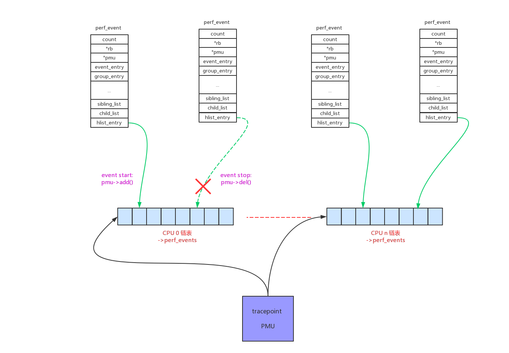
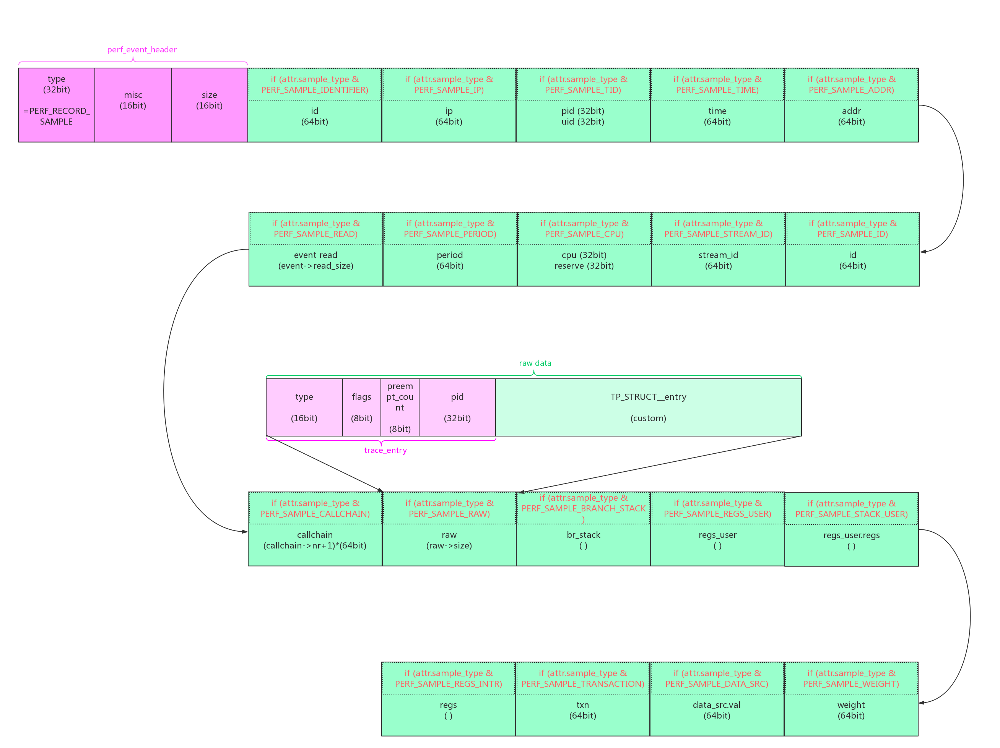

perf复用了ftrace中trace_event的所有插桩点(即tracepoint)，trace数据即可以通过ftrace的通道提供，也可以被包装成perf_event供perf工具使用。

可以通过perf list命令来查看系统中的tracpoint event，可以看到和/sys/kernel/debug/tracing/events/路径下的trace_event一致：

```
# simpleperf list tracepoint | more
List of tracepoint events:
  almk:almk_shrink
  almk:almk_vmpressure
  asoc:snd_soc_bias_level_done
  asoc:snd_soc_bias_level_start
  asoc:snd_soc_dapm_connected
  asoc:snd_soc_dapm_done
  asoc:snd_soc_dapm_path
  asoc:snd_soc_dapm_start
  asoc:snd_soc_dapm_walk_done
  asoc:snd_soc_dapm_widget_event_done
  asoc:snd_soc_dapm_widget_event_start
  asoc:snd_soc_dapm_widget_power
```

# 1、原理介绍：

trace_event在定义的时候，已经把trace_point、trace_event的callback函数、perf_event的callback函数全都给定义好了。只需要使用现成的架构把perf_event的callback函数给注册到trace_point上去就行了。

include/trace/trace_event.h:

```
/* (1) trace_event_class的定义 */
#undef DECLARE_EVENT_CLASS
#define DECLARE_EVENT_CLASS(call, proto, args, tstruct, assign, print)	\
_TRACE_PERF_PROTO(call, PARAMS(proto));					\
static char print_fmt_##call[] = print;					\
static struct trace_event_class __used __refdata event_class_##call = { \
	.system			= TRACE_SYSTEM_STRING,			\
	.define_fields		= trace_event_define_fields_##call,	\
	.fields			= LIST_HEAD_INIT(event_class_##call.fields),\
	.raw_init		= trace_event_raw_init,			\
	
	/* (1.1) trace_event的回调函数 */
	.probe			= trace_event_raw_event_##call,		\
	
	/* (1.2) 注册函数，把callback函数加入到tracepoint中 */
	.reg			= trace_event_reg,			\
	
	/* (1.3) perf_event部分的定义 */
	_TRACE_PERF_INIT(call)						\
};

/* (2) trace_event_call的定义 */
#undef DEFINE_EVENT
#define DEFINE_EVENT(template, call, proto, args)			\
									\
static struct trace_event_call __used event_##call = {			\

    /* (2.1) 对trace_event_class的引用 */
	.class			= &event_class_##template,		\
	
	/* (2.2) tracepoint的定义 */
	{								\
		.tp			= &__tracepoint_##call,		\
	},								\
	.event.funcs		= &trace_event_type_funcs_##template,	\
	.print_fmt		= print_fmt_##template,			\
	.flags			= TRACE_EVENT_FL_TRACEPOINT,		\
};									\
static struct trace_event_call __used					\
__attribute__((section("_ftrace_events"))) *__event_##call = &event_##call
```

_TRACE_PERF_INIT()宏的展开：

```
#ifdef CONFIG_PERF_EVENTS

#define _TRACE_PERF_PROTO(call, proto)					\
	static notrace void						\
	perf_trace_##call(void *__data, proto);

#define _TRACE_PERF_INIT(call)						\

    /* (1.3) perf_event的回调函数：perf_trace_##call() */
	.perf_probe		= perf_trace_##call,

#else
#define _TRACE_PERF_PROTO(call, proto)
#define _TRACE_PERF_INIT(call)
#endif /* CONFIG_PERF_EVENTS */
```

继续追踪perf_event的回调函数，include/trace/perf.h:

```
#undef DECLARE_EVENT_CLASS
#define DECLARE_EVENT_CLASS(call, proto, args, tstruct, assign, print)	\
static notrace void							\
perf_trace_##call(void *__data, proto)					\
{									\
	struct trace_event_call *event_call = __data;			\
	struct trace_event_data_offsets_##call __maybe_unused __data_offsets;\
	struct trace_event_raw_##call *entry;				\
	struct pt_regs *__regs;						\
	u64 __addr = 0, __count = 1;					\
	struct task_struct *__task = NULL;				\
	struct hlist_head *head;					\
	int __entry_size;						\
	int __data_size;						\
	int rctx;							\
									\
	__data_size = trace_event_get_offsets_##call(&__data_offsets, args); \
									\
	head = this_cpu_ptr(event_call->perf_events);			\
	if (__builtin_constant_p(!__task) && !__task &&			\
				hlist_empty(head))			\
		return;							\
									\
    /* (1) 计算需要存储的trace数据的长度 */
	__entry_size = ALIGN(__data_size + sizeof(*entry) + sizeof(u32),\
			     sizeof(u64));				\
	__entry_size -= sizeof(u32);					\
									\
									
	/* (2) 分配存储数据的tmp buffer */
	entry = perf_trace_buf_prepare(__entry_size,			\
			event_call->event.type, &__regs, &rctx);	\
	if (!entry)							\
		return;							\
									\
									
	/* (3) get当前register */
	perf_fetch_caller_regs(__regs);					\
									\
	
	/* (4) 给动态成员的占位符赋值：offset + size */
	tstruct								\
									\
	
	/* (5) 记录trace数据到tmp buffer中 */
	{ assign; }							\
									\
	
	/* (6) 提交trace数据给连接到本tracepoint上的所有perf_event，拷贝tmp buffer到perf_event的ringbuffer中 */
	perf_trace_buf_submit(entry, __entry_size, rctx, __addr,	\
		__count, __regs, head, __task);				\
}
```

我们接下来看一下详细的过程和数据格式。

# 2、event init

tracepoint pmu的定义如下：

```
static struct pmu perf_tracepoint = {
	.task_ctx_nr	= perf_sw_context,

	.event_init	= perf_tp_event_init,
	.add		= perf_trace_add,
	.del		= perf_trace_del,
	.start		= perf_swevent_start,
	.stop		= perf_swevent_stop,
	.read		= perf_swevent_read,

	.events_across_hotplug = 1,
};
```

在调用perf_event_open()系统调用创建新的perf_event的时候，会调用到pmu->event_init()函数。

perf_event_open() -> perf_event_alloc() -> perf_init_event() -> perf_try_init_event() -> pmu->event_init(event) -> perf_tp_event_init()：

```
static int perf_tp_event_init(struct perf_event *event)
{
	int err;

    /* (1) attr.type类型不对，出错返回 */
	if (event->attr.type != PERF_TYPE_TRACEPOINT)
		return -ENOENT;

	/*
	 * no branch sampling for tracepoint events
	 */
	/* (2) tracepoint sample数据中不支持分支采样 */
	if (has_branch_stack(event))
		return -EOPNOTSUPP;
    
    /* (3) 继续init */
	err = perf_trace_init(event);
	if (err)
		return err;

	event->destroy = tp_perf_event_destroy;

	return 0;
}

↓

int perf_trace_init(struct perf_event *p_event)
{
	struct trace_event_call *tp_event;
	u64 event_id = p_event->attr.config;
	int ret = -EINVAL;

	mutex_lock(&event_mutex);
	
	/* (3.1) 遍历trace_event_call链表，找到type等于attr.config的trace_event_call */
	list_for_each_entry(tp_event, &ftrace_events, list) {
		if (tp_event->event.type == event_id &&
		    tp_event->class && tp_event->class->reg &&
		    try_module_get(tp_event->mod)) {
		    
		    /* (3.2) 继续初始化 */
			ret = perf_trace_event_init(tp_event, p_event);
			if (ret)
				module_put(tp_event->mod);
			break;
		}
	}
	mutex_unlock(&event_mutex);

	return ret;
}

↓

static int perf_trace_event_init(struct trace_event_call *tp_event,
				 struct perf_event *p_event)
{
	int ret;

    /* (3.2.1) 权限判断 */
	ret = perf_trace_event_perm(tp_event, p_event);
	if (ret)
		return ret;

    /* (3.2.2) register操作 */
	ret = perf_trace_event_reg(tp_event, p_event);
	if (ret)
		return ret;

    /* (3.2.3) open操作，对tracepoint来说这部分为空 */
	ret = perf_trace_event_open(p_event);
	if (ret) {
		perf_trace_event_unreg(p_event);
		return ret;
	}

	return 0;
}

↓

static int perf_trace_event_reg(struct trace_event_call *tp_event,
				struct perf_event *p_event)
{
	struct hlist_head __percpu *list;
	int ret = -ENOMEM;
	int cpu;

	p_event->tp_event = tp_event;
	if (tp_event->perf_refcount++ > 0)
		return 0;

	list = alloc_percpu(struct hlist_head);
	if (!list)
		goto fail;

    /* (3.2.2.1) 初始化trace_event_call上per_cpu的perf_event挂载链表：tp_event->perf_events 
        如果perf_event需要接收tracepoint的数据，需要按绑定的cpu挂载到对应的per_cpu链表上
     */
	for_each_possible_cpu(cpu)
		INIT_HLIST_HEAD(per_cpu_ptr(list, cpu));

	tp_event->perf_events = list;

    /* (3.2.2.2) 分配tmp buffer空间，buffer都是per_cpu的每个cpu上都有
        context包括4种：task, softirq, hardirq, nmi.
     */
	if (!total_ref_count) {
		char __percpu *buf;
		int i;

		for (i = 0; i < PERF_NR_CONTEXTS; i++) {
			buf = (char __percpu *)alloc_percpu(perf_trace_t);
			if (!buf)
				goto fail;

			perf_trace_buf[i] = buf;
		}
	}

    /* (3.2.2.3) 调用class->reg(TRACE_REG_PERF_REGISTER)注册 */
	ret = tp_event->class->reg(tp_event, TRACE_REG_PERF_REGISTER, NULL);
	if (ret)
		goto fail;

	total_ref_count++;
	return 0;

fail:
	if (!total_ref_count) {
		int i;

		for (i = 0; i < PERF_NR_CONTEXTS; i++) {
			free_percpu(perf_trace_buf[i]);
			perf_trace_buf[i] = NULL;
		}
	}

	if (!--tp_event->perf_refcount) {
		free_percpu(tp_event->perf_events);
		tp_event->perf_events = NULL;
	}

	return ret;
}

```

tp_event->class->reg()函数在trace_event_class定义时，已经确定为trace_event_reg()函数：

```
int trace_event_reg(struct trace_event_call *call,
		    enum trace_reg type, void *data)
{
	struct trace_event_file *file = data;

	WARN_ON(!(call->flags & TRACE_EVENT_FL_TRACEPOINT));
	switch (type) {
	
	/* (1) 把trace_event的callback函数注册到tracepoint上 */
	case TRACE_REG_REGISTER:
		return tracepoint_probe_register(call->tp,
						 call->class->probe,
						 file);
	case TRACE_REG_UNREGISTER:
		tracepoint_probe_unregister(call->tp,
					    call->class->probe,
					    file);
		return 0;

#ifdef CONFIG_PERF_EVENTS

    /* (2) 把perf_event的callback函数注册到tracepoint上 */
	case TRACE_REG_PERF_REGISTER:
		return tracepoint_probe_register(call->tp,
						 call->class->perf_probe,
						 call);
	case TRACE_REG_PERF_UNREGISTER:
		tracepoint_probe_unregister(call->tp,
					    call->class->perf_probe,
					    call);
		return 0;
	case TRACE_REG_PERF_OPEN:
	case TRACE_REG_PERF_CLOSE:
	case TRACE_REG_PERF_ADD:
	case TRACE_REG_PERF_DEL:
		return 0;
#endif
	}
	return 0;
}
```

经过上述初始化注册以后，perf_event的callback函数已经插入到tracepoint中。此时如果tracepoint被命中，perf_event的callback函数会被调用，但是trace数据无人接收，因为tp_event->perf_events链表中还没有接收的perf_event。

# 3、event add/del



承接上一步perf_event注册以后，perf_event的回调函数已经可以被tracepoint调用，但是perf_event仍然收不到数据。因为这个时候perf_event还处于enable/inactive状态，需要处于active状态才能收到数据。

一个tracepoint会给多个perf_event提供数据，只有将perf_event加入到tp_event->perf_events per_cpu链表中才能收到数据。所以对tracepoint perf_event的start/stop就是操作tp_event->perf_events per_cpu链表。

在上一章“perf_event内核框架”中已经阐明，task维度的perf_event需要和task一起调度，其回调函数最后控制的就是perf_event的启动和停止。

context_switch() -> finish_task_switch() -> perf_event_task_sched_in() -> __perf_event_task_sched_in() -> perf_event_context_sched_in() -> perf_event_sched_in() -> ctx_sched_in() -> ctx_pinned_sched_in()/ctx_flexible_sched_in() -> group_sched_in() -> event_sched_in() -> pmu->add(event, PERF_EF_START) -> perf_trace_add():

```
int perf_trace_add(struct perf_event *p_event, int flags)
{
	struct trace_event_call *tp_event = p_event->tp_event;
	struct hlist_head __percpu *pcpu_list;
	struct hlist_head *list;

	pcpu_list = tp_event->perf_events;
	if (WARN_ON_ONCE(!pcpu_list))
		return -EINVAL;

	if (!(flags & PERF_EF_START))
		p_event->hw.state = PERF_HES_STOPPED;

    /* (1) 将perf_event加入到tp_event->perf_events的当前cpu链表中 */
	list = this_cpu_ptr(pcpu_list);
	hlist_add_head_rcu(&p_event->hlist_entry, list);

    /* (2) 空操作 */
	return tp_event->class->reg(tp_event, TRACE_REG_PERF_ADD, p_event);
}
```

context_switch() -> prepare_task_switch() -> perf_event_task_sched_out() -> __perf_event_task_sched_out() -> perf_event_context_sched_out() -> ctx_sched_out() -> group_sched_out() -> event_sched_out() -> pmu->del() -> perf_trace_del():

```
void perf_trace_del(struct perf_event *p_event, int flags)
{
	struct trace_event_call *tp_event = p_event->tp_event;
	
	/* (1) 将perf_event从tp_event->perf_events的链表中删除 */
	if (!hlist_unhashed(&p_event->hlist_entry))
		hlist_del_rcu(&p_event->hlist_entry);
		
	/* (2) 空操作 */
	tp_event->class->reg(tp_event, TRACE_REG_PERF_DEL, p_event);
}
```

# 4、event 数据采集

perf_event的主要功能就是提供count类型或者sample类型的trace数据。

tracepoint pmu提供trace数据的方式是被动的：tracepoint被命中后，perf callback函数被调用后，累加perf_event的count值，如果perf_event分配了ringbuffer记录sample数据。

## 4.1、count数据

我们在定义用户trace_event时使用__perf_count()宏指定每次tracepoint命中count的累加值。例如：

```
DECLARE_EVENT_CLASS(sched_stat_runtime,

	TP_PROTO(struct task_struct *tsk, u64 runtime, u64 vruntime),

    /* (1) 指定每次命中，count累加runtime */
	TP_ARGS(tsk, __perf_count(runtime), vruntime),

	TP_STRUCT__entry(
		__array( char,	comm,	TASK_COMM_LEN	)
		__field( pid_t,	pid			)
		__field( u64,	runtime			)
		__field( u64,	vruntime			)
	),

	TP_fast_assign(
		memcpy(__entry->comm, tsk->comm, TASK_COMM_LEN);
		__entry->pid		= tsk->pid;
		__entry->runtime	= runtime;
		__entry->vruntime	= vruntime;
	),

	TP_printk("comm=%s pid=%d runtime=%Lu [ns] vruntime=%Lu [ns]",
			__entry->comm, __entry->pid,
			(unsigned long long)__entry->runtime,
			(unsigned long long)__entry->vruntime)
);
```

如果没有使用__perf_count()宏定义，默认每次tracepoint命中count加1。

看看具体的代码：

```
/* (1.1) __perf_addr()宏，指定sample时PERF_SAMPLE_ADDR的值 */
#undef __perf_addr
#define __perf_addr(a)	(__addr = (a))

/* (1.2) __perf_count()宏，指定count的累加值 */
#undef __perf_count
#define __perf_count(c)	(__count = (c))

/* (1.3) __perf_task()宏，指定由某个task上绑定的perf_event来接收trace数据 */
#undef __perf_task
#define __perf_task(t)	(__task = (t))

#undef DECLARE_EVENT_CLASS
#define DECLARE_EVENT_CLASS(call, proto, args, tstruct, assign, print)	\
static notrace void							\
perf_trace_##call(void *__data, proto)					\
{									\
	struct trace_event_call *event_call = __data;			\
	struct trace_event_data_offsets_##call __maybe_unused __data_offsets;\
	struct trace_event_raw_##call *entry;				\
	struct pt_regs *__regs;						\
	
	/* (1.4) 如果没有使用宏指定，默认值：
	    __addr = 0
	    __count = 1
	    __task = NULL
	 */
	u64 __addr = 0, __count = 1;					\
	struct task_struct *__task = NULL;				\
	struct hlist_head *head;					\
	int __entry_size;						\
	int __data_size;						\
	int rctx;							\
									\
	/* (2.1) 获取动态成员的长度 */
	__data_size = trace_event_get_offsets_##call(&__data_offsets, args); \
									\
	/* (3) 获取tracepoint的本cpu perf_event链表，需要本cpu tracepoint数据的perf_event都链接于此 */
	head = this_cpu_ptr(event_call->perf_events);			\
	if (__builtin_constant_p(!__task) && !__task &&			\
				hlist_empty(head))			\
		return;							\
									\
									
    /* (2.2) 计算需要存储的raw data的总长度：动态长度 + 固定成员长度 */
	__entry_size = ALIGN(__data_size + sizeof(*entry) + sizeof(u32),\
			     sizeof(u64));				\
	__entry_size -= sizeof(u32);					\
									\
	/* (4) 根据长度获得tmp buffer 
	    并得到当前的context：task, softirq, hardirq, nmi.
	 */
	entry = perf_trace_buf_prepare(__entry_size,			\
			event_call->event.type, &__regs, &rctx);	\
	if (!entry)							\
		return;							\
									\
									
	/* (5) get当前register */
	perf_fetch_caller_regs(__regs);					\
									\
									
	/* (6) 给动态成员的占位符赋值：offset + size */
	tstruct								\
									\
									
	/* (7) 记录trace数据到tmp buffer中 */
	{ assign; }							\
									\
									
	/* (6) 提交raw data数据给连接到本tracepoint上的所有perf_event，拷贝tmp buffer到perf_event的ringbuffer中 
	    注意：这里的数据只是raw data数据，整个perf的sample数据还包括其他一些数据
	 */
	perf_trace_buf_submit(entry, __entry_size, rctx, __addr,	\
		__count, __regs, head, __task);				\
}

```

perf_trace_buf_prepare()函数的作用是获取一块tmp buffer，为了避免互斥根据当前的context(task, softirq, hardirq, nmi)和当前cpu，从per_cpu变量中分配到一块对应的buffer：

```
void *perf_trace_buf_prepare(int size, unsigned short type,
			     struct pt_regs **regs, int *rctxp)
{
	struct trace_entry *entry;
	unsigned long flags;
	char *raw_data;
	int pc;

	BUILD_BUG_ON(PERF_MAX_TRACE_SIZE % sizeof(unsigned long));

	if (WARN_ONCE(size > PERF_MAX_TRACE_SIZE,
			"perf buffer not large enough"))
		return NULL;

	pc = preempt_count();

    /* (4.1) 获取当前的context，并且防止递归进入 */
	*rctxp = perf_swevent_get_recursion_context();
	if (*rctxp < 0)
		return NULL;

    /* (4.2) 根据context。获取到保存reg的tmp buffer */
	if (regs)
		*regs = this_cpu_ptr(&__perf_regs[*rctxp]);
		
	/* (4.3) 根据context。获取到保存trace data的tmp buffer */
	raw_data = this_cpu_ptr(perf_trace_buf[*rctxp]);

	/* zero the dead bytes from align to not leak stack to user */
	memset(&raw_data[size - sizeof(u64)], 0, sizeof(u64));

	entry = (struct trace_entry *)raw_data;
	local_save_flags(flags);
	
	/* (4.4) 给tmp trace data buffer中的comm字段赋值 */
	tracing_generic_entry_update(entry, flags, pc);
	entry->type = type;

	return raw_data;
}

↓

int perf_swevent_get_recursion_context(void)
{
	struct swevent_htable *swhash = this_cpu_ptr(&swevent_htable);

	return get_recursion_context(swhash->recursion);
}

↓

static inline int get_recursion_context(int *recursion)
{
	int rctx;

	if (in_nmi())
		rctx = 3;
	else if (in_irq())
		rctx = 2;
	else if (in_softirq())
		rctx = 1;
	else
		rctx = 0;

	if (recursion[rctx])
		return -1;

	recursion[rctx]++;
	barrier();

	return rctx;
}

```

perf_trace_buf_submit()负责提交数据给this_cpu_ptr(event_call->perf_events)链表上等待的perf_event：

```
static inline void
perf_trace_buf_submit(void *raw_data, int size, int rctx, u64 addr,
		       u64 count, struct pt_regs *regs, void *head,
		       struct task_struct *task)
{
	perf_tp_event(addr, count, raw_data, size, regs, head, rctx, task);
}

↓

void perf_tp_event(u64 addr, u64 count, void *record, int entry_size,
		   struct pt_regs *regs, struct hlist_head *head, int rctx,
		   struct task_struct *task)
{
	struct perf_sample_data data;
	struct perf_event *event;

    /* (6.1) 存放raw data */
	struct perf_raw_record raw = {
		.size = entry_size,
		.data = record,
	};

    /* (6.2) 初始化sample data */
	perf_sample_data_init(&data, addr, 0);
	data.raw = &raw;

    /* (6.3) 把sample数据逐个发送给this_cpu_ptr(event_call->perf_events)链表上链接的perf_event */
	hlist_for_each_entry_rcu(event, head, hlist_entry) {
		if (perf_tp_event_match(event, &data, regs))
			perf_swevent_event(event, count, &data, regs);
	}

	/*
	 * If we got specified a target task, also iterate its context and
	 * deliver this event there too.
	 */
	/* (6.4) __perf_task()宏，指定由某个task上绑定的perf_event来接收sample数据 */
	if (task && task != current) {
		struct perf_event_context *ctx;
		struct trace_entry *entry = record;

		rcu_read_lock();
		ctx = rcu_dereference(task->perf_event_ctxp[perf_sw_context]);
		if (!ctx)
			goto unlock;

		list_for_each_entry_rcu(event, &ctx->event_list, event_entry) {
			if (event->attr.type != PERF_TYPE_TRACEPOINT)
				continue;
			if (event->attr.config != entry->type)
				continue;
			if (perf_tp_event_match(event, &data, regs))
				perf_swevent_event(event, count, &data, regs);
		}
unlock:
		rcu_read_unlock();
	}

	perf_swevent_put_recursion_context(rctx);
}

↓

static void perf_swevent_event(struct perf_event *event, u64 nr,
			       struct perf_sample_data *data,
			       struct pt_regs *regs)
{
	struct hw_perf_event *hwc = &event->hw;

    /* (6.3.1) 重点：
        perf_event的count值在这里累加
     */
	local64_add(nr, &event->count);

	if (!regs)
		return;

    /* (6.3.2) 没有指定sample方式的perf_event，不需要sample数据，直接返回 */
	if (!is_sampling_event(event))
		return;

	if ((event->attr.sample_type & PERF_SAMPLE_PERIOD) && !event->attr.freq) {
		data->period = nr;
		return perf_swevent_overflow(event, 1, data, regs);
	} else
		data->period = event->hw.last_period;

	if (nr == 1 && hwc->sample_period == 1 && !event->attr.freq)
		return perf_swevent_overflow(event, 1, data, regs);

	if (local64_add_negative(nr, &hwc->period_left))
		return;

	perf_swevent_overflow(event, 0, data, regs);
}

```


## 4.2、sample数据

我们来继续分析sample类型数据的上报。有两种上报方式：period、freq。

- period上报方式：以每period间隔的方式上报。有3个相关的参数：

    event->hw.last_period       // 当前的period值  
    event->hw.period_left       // 到period一个周期还剩多久，这是一个负值，取值范围(-last_period, 0)   
    event->hw.sample_period     // 最新的period值，只有当上一周期执行完后，才能更新：last_period = sample_period  


```
static void perf_swevent_event(struct perf_event *event, u64 nr,
			       struct perf_sample_data *data,
			       struct pt_regs *regs)
{
	struct hw_perf_event *hwc = &event->hw;

    /* (1) 重点：
        perf_event的count值在这里累加
     */
	local64_add(nr, &event->count);

	if (!regs)
		return;

    /* (2) 没有指定sample方式的perf_event，不需要sample数据，直接返回 */
	if (!is_sampling_event(event))
		return;

    /* (3.1) 如果指定PERF_SAMPLE_PERIOD，且是period模式 
        不理period的限定，上报sample数据和当前data->period数据
        perf_swevent_overflow()的overflow参数 = 1，说明不理period的时间限制
     */
	if ((event->attr.sample_type & PERF_SAMPLE_PERIOD) && !event->attr.freq) {
		data->period = nr;
		return perf_swevent_overflow(event, 1, data, regs);
	} else
		data->period = event->hw.last_period;

    /* (3.2) 如果hwc->sample_period == 1，且是period模式 
        每次都是上报，不需要重新设置period，所以overflow参数 = 1
     */
	if (nr == 1 && hwc->sample_period == 1 && !event->attr.freq)
		return perf_swevent_overflow(event, 1, data, regs);

    /* (4.1) 判断period有没有到期，没有到期的数据丢弃返回。 */
	if (local64_add_negative(nr, &hwc->period_left))
		return;

    /* (4.2) period到期，上报数据。 */
	perf_swevent_overflow(event, 0, data, regs);
}

↓

static void perf_swevent_overflow(struct perf_event *event, u64 overflow,
				    struct perf_sample_data *data,
				    struct pt_regs *regs)
{
	struct hw_perf_event *hwc = &event->hw;
	int throttle = 0;

    /* (4.2.1) overflow=0，说明是period到期后进来的，需要重新设置period 
        执行perf_swevent_set_period()返回的overflow是距离上一次上报经历了多少个period
     */
	if (!overflow)
		overflow = perf_swevent_set_period(event);

	if (hwc->interrupts == MAX_INTERRUPTS)
		return;

    /* (4.2.2) overflow是上一次经历了多少个period，或者是overflow=1强制进来的
        每个period上报一次数据
     */
	for (; overflow; overflow--) {
		if (__perf_event_overflow(event, throttle,
					    data, regs)) {
			/*
			 * We inhibit the overflow from happening when
			 * hwc->interrupts == MAX_INTERRUPTS.
			 */
			break;
		}
		throttle = 1;
	}
}

↓

static int __perf_event_overflow(struct perf_event *event,
				   int throttle, struct perf_sample_data *data,
				   struct pt_regs *regs)
{
	int events = atomic_read(&event->event_limit);
	struct hw_perf_event *hwc = &event->hw;
	u64 seq;
	int ret = 0;

	/*
	 * Non-sampling counters might still use the PMI to fold short
	 * hardware counters, ignore those.
	 */
	/* (4.2.2.1) 没有sample数据上报的返回 */
	if (unlikely(!is_sampling_event(event)))
		return 0;

    /* (4.2.2.2) throttle的判断，还没看懂？ */
	seq = __this_cpu_read(perf_throttled_seq);
	if (seq != hwc->interrupts_seq) {
		hwc->interrupts_seq = seq;
		hwc->interrupts = 1;
	} else {
		hwc->interrupts++;
		if (unlikely(throttle
			     && hwc->interrupts >= max_samples_per_tick)) {
			__this_cpu_inc(perf_throttled_count);
			hwc->interrupts = MAX_INTERRUPTS;
			perf_log_throttle(event, 0);
			tick_nohz_full_kick();
			ret = 1;
		}
	}

    /* (4.2.2.4) 如果是freq模式，根据count的发生频率，重新计算period值 */
	if (event->attr.freq) {
		u64 now = perf_clock();
		s64 delta = now - hwc->freq_time_stamp;

		hwc->freq_time_stamp = now;

		if (delta > 0 && delta < 2*TICK_NSEC)
			perf_adjust_period(event, delta, hwc->last_period, true);
	}

	/*
	 * XXX event_limit might not quite work as expected on inherited
	 * events
	 */

    /* (4.2.2.5) perf_event pending的处理，没看懂？ */
	event->pending_kill = POLL_IN;
	if (events && atomic_dec_and_test(&event->event_limit)) {
		ret = 1;
		event->pending_kill = POLL_HUP;
		event->pending_disable = 1;
		irq_work_queue(&event->pending);
	}

    /* (4.2.2.6) 实际上报sample数据的地方了：
        调用event自己的overflow_handler()函数，或者默认perf_event_output()函数
     */
	if (event->overflow_handler)
		event->overflow_handler(event, data, regs);
	else
		perf_event_output(event, data, regs);

	if (*perf_event_fasync(event) && event->pending_kill) {
		event->pending_wakeup = 1;
		irq_work_queue(&event->pending);
	}

	return ret;
}

```

perf_event_output()是默认的上报sample数据函数：

```
void perf_event_output(struct perf_event *event,
			struct perf_sample_data *data,
			struct pt_regs *regs)
{
	struct perf_output_handle handle;
	struct perf_event_header header;

	/* protect the callchain buffers */
	rcu_read_lock();

    /* (1) 计算sample数据的总长度，并且根据attr.sample_type保存额外的数据 */
	perf_prepare_sample(&header, data, event, regs);

    /* (2) 根据总size在event的ringbuffer中分配空间 */
	if (perf_output_begin(&handle, event, header.size))
		goto exit;

    /* (3) 输出数据到ringbuffer中 */
	perf_output_sample(&handle, &header, data, event);

    /* (4) 把rb->head指针刷入rb->user_page->data_head */
	perf_output_end(&handle);

exit:
	rcu_read_unlock();
}

|→

int perf_output_begin(struct perf_output_handle *handle,
		      struct perf_event *event, unsigned int size)
{
	struct ring_buffer *rb;
	unsigned long tail, offset, head;
	int have_lost, page_shift;
	struct {
		struct perf_event_header header;
		u64			 id;
		u64			 lost;
	} lost_event;

	rcu_read_lock();
	/*
	 * For inherited events we send all the output towards the parent.
	 */
	/* (2.1) 由于inherit创建的子进程，都使用父进程的ringbuffer */
	if (event->parent)
		event = event->parent;

	rb = rcu_dereference(event->rb);
	if (unlikely(!rb))
		goto out;

	if (unlikely(!rb->nr_pages))
		goto out;

	handle->rb    = rb;
	handle->event = event;

	have_lost = local_read(&rb->lost);
	if (unlikely(have_lost)) {
		size += sizeof(lost_event);
		if (event->attr.sample_id_all)
			size += event->id_header_size;
	}

	perf_output_get_handle(handle);

    /* (2.2) 在ringbuffer中寻找一块空间 */
	do {
	    /* (2.2.1) tail指针从user_page中获取，head指针从rb结构中获取
	        只有把数据写入确认写入以后，才会把head指针的改动从rb结构刷入user_page
	     */
		tail = READ_ONCE(rb->user_page->data_tail);
		offset = head = local_read(&rb->head);
		if (!rb->overwrite &&
		    unlikely(CIRC_SPACE(head, tail, perf_data_size(rb)) < size))
			goto fail;

		/*
		 * The above forms a control dependency barrier separating the
		 * @tail load above from the data stores below. Since the @tail
		 * load is required to compute the branch to fail below.
		 *
		 * A, matches D; the full memory barrier userspace SHOULD issue
		 * after reading the data and before storing the new tail
		 * position.
		 *
		 * See perf_output_put_handle().
		 */

		head += size;
	} while (local_cmpxchg(&rb->head, offset, head) != offset);

	/*
	 * We rely on the implied barrier() by local_cmpxchg() to ensure
	 * none of the data stores below can be lifted up by the compiler.
	 */

	if (unlikely(head - local_read(&rb->wakeup) > rb->watermark))
		local_add(rb->watermark, &rb->wakeup);

	page_shift = PAGE_SHIFT + page_order(rb);

    /* (2.3) 计算分配得到的buffer的第一个page偏移和size */
	handle->page = (offset >> page_shift) & (rb->nr_pages - 1);
	offset &= (1UL << page_shift) - 1;
	handle->addr = rb->data_pages[handle->page] + offset;
	handle->size = (1UL << page_shift) - offset;

	if (unlikely(have_lost)) {
		struct perf_sample_data sample_data;

		lost_event.header.size = sizeof(lost_event);
		lost_event.header.type = PERF_RECORD_LOST;
		lost_event.header.misc = 0;
		lost_event.id          = event->id;
		lost_event.lost        = local_xchg(&rb->lost, 0);

		perf_event_header__init_id(&lost_event.header,
					   &sample_data, event);
		perf_output_put(handle, lost_event);
		perf_event__output_id_sample(event, handle, &sample_data);
	}

	return 0;

fail:
	local_inc(&rb->lost);
	perf_output_put_handle(handle);
out:
	rcu_read_unlock();

	return -ENOSPC;
}

|→

void perf_output_end(struct perf_output_handle *handle)
{
	perf_output_put_handle(handle);
	rcu_read_unlock();
}

↓

static void perf_output_put_handle(struct perf_output_handle *handle)
{
	struct ring_buffer *rb = handle->rb;
	unsigned long head;

again:
	head = local_read(&rb->head);

	/*
	 * IRQ/NMI can happen here, which means we can miss a head update.
	 */

	if (!local_dec_and_test(&rb->nest))
		goto out;

	/*
	 * Since the mmap() consumer (userspace) can run on a different CPU:
	 *
	 *   kernel				user
	 *
	 *   if (LOAD ->data_tail) {		LOAD ->data_head
	 *			(A)		smp_rmb()	(C)
	 *	STORE $data			LOAD $data
	 *	smp_wmb()	(B)		smp_mb()	(D)
	 *	STORE ->data_head		STORE ->data_tail
	 *   }
	 *
	 * Where A pairs with D, and B pairs with C.
	 *
	 * In our case (A) is a control dependency that separates the load of
	 * the ->data_tail and the stores of $data. In case ->data_tail
	 * indicates there is no room in the buffer to store $data we do not.
	 *
	 * D needs to be a full barrier since it separates the data READ
	 * from the tail WRITE.
	 *
	 * For B a WMB is sufficient since it separates two WRITEs, and for C
	 * an RMB is sufficient since it separates two READs.
	 *
	 * See perf_output_begin().
	 */
	smp_wmb(); /* B, matches C */
	rb->user_page->data_head = head;

	/*
	 * Now check if we missed an update -- rely on previous implied
	 * compiler barriers to force a re-read.
	 */
	if (unlikely(head != local_read(&rb->head))) {
		local_inc(&rb->nest);
		goto again;
	}

	if (handle->wakeup != local_read(&rb->wakeup))
		perf_output_wakeup(handle);

out:
	preempt_enable();
}

```



perf_event_type中详细描述了各种type类型的sample数据排列模式：

```
enum perf_event_type {

	/*
	 * If perf_event_attr.sample_id_all is set then all event types will
	 * have the sample_type selected fields related to where/when
	 * (identity) an event took place (TID, TIME, ID, STREAM_ID, CPU,
	 * IDENTIFIER) described in PERF_RECORD_SAMPLE below, it will be stashed
	 * just after the perf_event_header and the fields already present for
	 * the existing fields, i.e. at the end of the payload. That way a newer
	 * perf.data file will be supported by older perf tools, with these new
	 * optional fields being ignored.
	 *
	 * struct sample_id {
	 * 	{ u32			pid, tid; } && PERF_SAMPLE_TID
	 * 	{ u64			time;     } && PERF_SAMPLE_TIME
	 * 	{ u64			id;       } && PERF_SAMPLE_ID
	 * 	{ u64			stream_id;} && PERF_SAMPLE_STREAM_ID
	 * 	{ u32			cpu, res; } && PERF_SAMPLE_CPU
	 *	{ u64			id;	  } && PERF_SAMPLE_IDENTIFIER
	 * } && perf_event_attr::sample_id_all
	 *
	 * Note that PERF_SAMPLE_IDENTIFIER duplicates PERF_SAMPLE_ID.  The
	 * advantage of PERF_SAMPLE_IDENTIFIER is that its position is fixed
	 * relative to header.size.
	 */

	/*
	 * The MMAP events record the PROT_EXEC mappings so that we can
	 * correlate userspace IPs to code. They have the following structure:
	 *
	 * struct {
	 *	struct perf_event_header	header;
	 *
	 *	u32				pid, tid;
	 *	u64				addr;
	 *	u64				len;
	 *	u64				pgoff;
	 *	char				filename[];
	 * 	struct sample_id		sample_id;
	 * };
	 */
	PERF_RECORD_MMAP			= 1,

	/*
	 * struct {
	 *	struct perf_event_header	header;
	 *	u64				id;
	 *	u64				lost;
	 * 	struct sample_id		sample_id;
	 * };
	 */
	PERF_RECORD_LOST			= 2,

	/*
	 * struct {
	 *	struct perf_event_header	header;
	 *
	 *	u32				pid, tid;
	 *	char				comm[];
	 * 	struct sample_id		sample_id;
	 * };
	 */
	PERF_RECORD_COMM			= 3,

	/*
	 * struct {
	 *	struct perf_event_header	header;
	 *	u32				pid, ppid;
	 *	u32				tid, ptid;
	 *	u64				time;
	 * 	struct sample_id		sample_id;
	 * };
	 */
	PERF_RECORD_EXIT			= 4,

	/*
	 * struct {
	 *	struct perf_event_header	header;
	 *	u64				time;
	 *	u64				id;
	 *	u64				stream_id;
	 * 	struct sample_id		sample_id;
	 * };
	 */
	PERF_RECORD_THROTTLE			= 5,
	PERF_RECORD_UNTHROTTLE			= 6,

	/*
	 * struct {
	 *	struct perf_event_header	header;
	 *	u32				pid, ppid;
	 *	u32				tid, ptid;
	 *	u64				time;
	 * 	struct sample_id		sample_id;
	 * };
	 */
	PERF_RECORD_FORK			= 7,

	/*
	 * struct {
	 *	struct perf_event_header	header;
	 *	u32				pid, tid;
	 *
	 *	struct read_format		values;
	 * 	struct sample_id		sample_id;
	 * };
	 */
	PERF_RECORD_READ			= 8,

	/*
	 * struct {
	 *	struct perf_event_header	header;
	 *
	 *	#
	 *	# Note that PERF_SAMPLE_IDENTIFIER duplicates PERF_SAMPLE_ID.
	 *	# The advantage of PERF_SAMPLE_IDENTIFIER is that its position
	 *	# is fixed relative to header.
	 *	#
	 *
	 *	{ u64			id;	  } && PERF_SAMPLE_IDENTIFIER
	 *	{ u64			ip;	  } && PERF_SAMPLE_IP
	 *	{ u32			pid, tid; } && PERF_SAMPLE_TID
	 *	{ u64			time;     } && PERF_SAMPLE_TIME
	 *	{ u64			addr;     } && PERF_SAMPLE_ADDR
	 *	{ u64			id;	  } && PERF_SAMPLE_ID
	 *	{ u64			stream_id;} && PERF_SAMPLE_STREAM_ID
	 *	{ u32			cpu, res; } && PERF_SAMPLE_CPU
	 *	{ u64			period;   } && PERF_SAMPLE_PERIOD
	 *
	 *	{ struct read_format	values;	  } && PERF_SAMPLE_READ
	 *
	 *	{ u64			nr,
	 *	  u64			ips[nr];  } && PERF_SAMPLE_CALLCHAIN
	 *
	 *	#
	 *	# The RAW record below is opaque data wrt the ABI
	 *	#
	 *	# That is, the ABI doesn't make any promises wrt to
	 *	# the stability of its content, it may vary depending
	 *	# on event, hardware, kernel version and phase of
	 *	# the moon.
	 *	#
	 *	# In other words, PERF_SAMPLE_RAW contents are not an ABI.
	 *	#
	 *
	 *	{ u32			size;
	 *	  char                  data[size];}&& PERF_SAMPLE_RAW
	 *
	 *	{ u64                   nr;
	 *        { u64 from, to, flags } lbr[nr];} && PERF_SAMPLE_BRANCH_STACK
	 *
	 * 	{ u64			abi; # enum perf_sample_regs_abi
	 * 	  u64			regs[weight(mask)]; } && PERF_SAMPLE_REGS_USER
	 *
	 * 	{ u64			size;
	 * 	  char			data[size];
	 * 	  u64			dyn_size; } && PERF_SAMPLE_STACK_USER
	 *
	 *	{ u64			weight;   } && PERF_SAMPLE_WEIGHT
	 *	{ u64			data_src; } && PERF_SAMPLE_DATA_SRC
	 *	{ u64			transaction; } && PERF_SAMPLE_TRANSACTION
	 *	{ u64			abi; # enum perf_sample_regs_abi
	 *	  u64			regs[weight(mask)]; } && PERF_SAMPLE_REGS_INTR
	 * };
	 */
	PERF_RECORD_SAMPLE			= 9,

	/*
	 * The MMAP2 records are an augmented version of MMAP, they add
	 * maj, min, ino numbers to be used to uniquely identify each mapping
	 *
	 * struct {
	 *	struct perf_event_header	header;
	 *
	 *	u32				pid, tid;
	 *	u64				addr;
	 *	u64				len;
	 *	u64				pgoff;
	 *	u32				maj;
	 *	u32				min;
	 *	u64				ino;
	 *	u64				ino_generation;
	 *	u32				prot, flags;
	 *	char				filename[];
	 * 	struct sample_id		sample_id;
	 * };
	 */
	PERF_RECORD_MMAP2			= 10,

	/*
	 * Records that new data landed in the AUX buffer part.
	 *
	 * struct {
	 * 	struct perf_event_header	header;
	 *
	 * 	u64				aux_offset;
	 * 	u64				aux_size;
	 *	u64				flags;
	 * 	struct sample_id		sample_id;
	 * };
	 */
	PERF_RECORD_AUX				= 11,

	/*
	 * Indicates that instruction trace has started
	 *
	 * struct {
	 *	struct perf_event_header	header;
	 *	u32				pid;
	 *	u32				tid;
	 * };
	 */
	PERF_RECORD_ITRACE_START		= 12,

	/*
	 * Records the dropped/lost sample number.
	 *
	 * struct {
	 *	struct perf_event_header	header;
	 *
	 *	u64				lost;
	 *	struct sample_id		sample_id;
	 * };
	 */
	PERF_RECORD_LOST_SAMPLES		= 13,

	/*
	 * Records a context switch in or out (flagged by
	 * PERF_RECORD_MISC_SWITCH_OUT). See also
	 * PERF_RECORD_SWITCH_CPU_WIDE.
	 *
	 * struct {
	 *	struct perf_event_header	header;
	 *	struct sample_id		sample_id;
	 * };
	 */
	PERF_RECORD_SWITCH			= 14,

	/*
	 * CPU-wide version of PERF_RECORD_SWITCH with next_prev_pid and
	 * next_prev_tid that are the next (switching out) or previous
	 * (switching in) pid/tid.
	 *
	 * struct {
	 *	struct perf_event_header	header;
	 *	u32				next_prev_pid;
	 *	u32				next_prev_tid;
	 *	struct sample_id		sample_id;
	 * };
	 */
	PERF_RECORD_SWITCH_CPU_WIDE		= 15,

	PERF_RECORD_MAX,			/* non-ABI */
}
```
